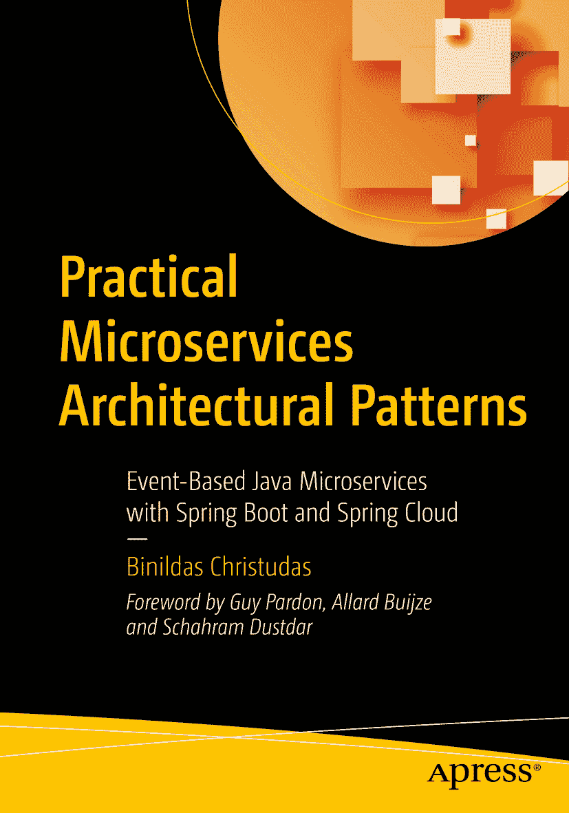

ISBN 978-1-4842-4500-2e-ISBN 978-1-4842-4501-9 [`doi.org/10.1007/978-1-4842-4501-9`](https://doi.org/10.1007/978-1-4842-4501-9) © Binildas Christudas 2019 Standard Apress 书中可能出现的商标名称、标识和图片均为注册商标。为避免在每次出现商标名称、标识或图片时都使用商标符号，我们仅在编辑风格下使用这些名称、标识和图片，以维护商标所有者的权益，无意侵犯其商标权。本出版物中使用的商品名称、商标、服务标志及类似术语，即使未明确标识，也不应被视为对其是否受专有权利保护的立场表达。尽管本书中的建议和信息在出版时被认为是真实准确的，但作者、编辑及出版商均不对可能存在的任何错误或遗漏承担法律责任。出版商对本书所载内容不作任何明示或暗示的担保。本书通过 Springer Science+Business Media New York 在全球图书贸易中发行，地址：233 Spring Street, 6th Floor, New York, NY 10013。电话：1-800-SPRINGER，传真：(201) 348-4505，电子邮件：orders-ny@springer-sbm.com，或访问 www.springeronline.com。Apress Media, LLC 是一家加利福尼亚有限责任公司，其唯一成员（所有者）是 Springer Science + Business Media Finance Inc (SSBM Finance Inc)。SSBM Finance Inc 是一家特拉华州公司。

*献给 Sowmya、Ann 和 Ria*。

前言

您现在手中的这本书，显然是软件工程师和架构师多年实践经验的结晶。Binildas Christudas 撰写了一部内容全面的著作，引导软件工程师和软件架构师穿越分布式系统架构领域中需要做出的概念性决策的丛林。

各章节按逻辑顺序编排，引导读者思考所有大规模分布式系统项目中必须提出的一系列重要问题。尤其值得强调的是，作者用了大量篇幅详细解释了软件架构师和软件工程师在考虑使用微服务以及规划从单体架构向微服务架构过渡的项目之前，需要提出的所有问题。此外，本书还讨论了与云部署相关的问题，这是此类系统的一个重要方面。

本书讨论的一系列令人兴奋且高级的主题涵盖了从微服务基础到事务、最终一致性、云部署以及 CAP 定理相关问题等多个方面。

本书可作为微服务相关所有事宜的指导手册。它是一本循序渐进的指南，告诉您应该提出哪些问题，以及随后应采取哪些步骤来实现基于微服务的分布式系统。

谢谢。

> Schahram Dustdar
> 
> IEEE 会士，分布式系统组负责人
> 
> 维也纳技术大学

软件工程领域正在快速发展。企业不断面临市场新进入者、法规变化以及客户期望的挑战。初创公司发展迅速，当它们取得成功时，需要应对其服务日益增长的需求。这些挑战要求我们彻底审视设计和构建软件的方式。微服务架构为应对这些需求的系统提供了良好的基础。

然而，微服务本身也带来了挑战。

Binildas 出色地将自己在软件开发方面的丰富实践经验与对新技术和架构风格的开放态度结合起来。在本书中，Binildas 采用了一种实用的方法来介绍与微服务系统相关的不同架构模式，既描述了成熟、常见的模式，也介绍了一些新兴模式，如 CQRS。

如果您希望踏上微服务之旅，本书就是您的旅行指南。

> Allard Buijze
> 
> AxonIQ 首席技术官兼创始人
> 
> Axon Framework 创建者

如今，微服务是热门话题，就像几年前的 SOA 一样。有人说微服务只是 SOA 的正确实现。我们不再使用繁重的 WS-* 标准，而是采用 REST。我们不再使用 ESB，而是使用像 ActiveMQ 这样的轻量级代理。事务呢？效仿亚马逊等行业巨头，我们不一定使用（也不推荐）跨越所有微服务的全局 ACID 事务。相反，如今的重点是 BASE 和 Saga。

BASE 意味着：不是跨越所有微服务的一个巨大 ACID 事务（带有一个巨大的提交），而是多个较小的 ACID 事务在系统中传播——因此系统最终变得一致。消息传递对此至关重要。

这些较小的 ACID 事务中的每一个都可以使用像 XA 这样成熟的技术进行控制，因此它们确实是 ACID 的——即使出现问题也是如此。

不幸的是，BASE 常常被现代框架或缺乏 XA 支持的技术/平台用作误导性的借口。BASE 的实现方式至关重要，没有 XA 就很难正确实现——除非您不关心重复处理或消息丢失。

重复问题迟早会出现，并通过临时修复来解决。丢失的消息可能永远不会被检测到，除非长期出现数据不一致——届时根本原因将极难找到。您可能在消费者端和发送端都遇到问题。

图 13-3（第 13 章）展示了一种简单安全的 BASE 实现方式。除非您喜欢冒险，否则我建议您坚持使用这种风格。如果您从事金融服务行业，您可能会欣赏 XA 提供的强有力保证，而代码简洁性则是额外的奖励。

如第 14 章所示，要模拟 XA 事务开箱即用提供的保证，需要大量的额外编码和测试。第 14 章中的大部分调整远远超出了我自己的舒适区，但 Binildas 出色地指出了需要考虑多少因素。这绝非易事，远非如此。

像 Saga（第 15 章）这样的高级编码可以引入不同级别的事务，您需要放弃隔离性并自行处理补偿。在 Atomikos，我们有一个类似的模型，称为 Try-Confirm/Cancel（简称 TCC；参见 [`www.atomikos.com/Blog/TCCForTransactionManagementAcrossMicroservices`](http://www.atomikos.com/Blog/TCCForTransactionManagementAcrossMicroservices)）。这个概念很棒，尽管我们接触过的许多人并不太喜欢它，因为回滚的负担落在了他们身上（必须编程实现补偿）。

> Guy Pardon 博士
> 
> 创始人
> 
> atomikos.com

引言

我们开发部署分布式应用已有大约二十年，微服务通过许多在开发、部署和维护分布式应用中的不足之处，确立了架构原则和模式，使这些问题得以解决。微服务，也称为微服务架构，是一种架构风格，它将应用程序构建为一组松散耦合、可独立部署的服务集合，这些服务高度可维护、可测试，并围绕业务能力进行组织。*《实用微服务架构模式》* 是一本实用的入门指南，介绍如何使用 Spring Boot、Spring Cloud 和 Axon 等轻量级通用技术，用 Java 编写微服务。我以让您能够立即应用所学知识的方式呈现材料。为此，我为所有主要概念提供了代码示例，并准确展示了如何构建和执行它们。

本书揭示了在设计微服务时您将面临的许多架构复杂性，并通过代码示例解决具有挑战性的场景。`《实用微服务架构模式》` 首先是一本面向架构师的书，但开发人员和技术管理人员也能从中受益。我撰写时主要考虑的是希望构建严肃的分布式服务器端应用程序（尤其是微服务）的 Java 架构师。重点在于架构师应该了解哪些方面，例如基于事件的系统、事务完整性、数据一致性等；开发人员也会在日常工作中发现详尽的代码非常有用。假设读者具备 Java、Spring 和一点 HTTP 的工作知识，以便快速启动和运行示例。如果您没有 Java 和 Spring 背景，实用构建脚本和分步说明仍应能帮助您。此外，尽管示例是用 Java 编写的，但所有架构方面和许多章节并非特定于 Java，因此任何处理分布式系统的技术背景的架构师都应从本书中受益。

本书介绍了一个完整的微服务示例电子商务应用程序。读者可以直接将其用作模板来开始构建自己的生产系统。在 Java 世界中所有可用的书籍中，这是第一本专门通过模拟演示利用 XA 事务管理器和两个不同 XA 事务资源进行两阶段提交事务的所有成功和失败场景的书籍，并附有完整代码。在详细展示了 XA 事务之后，本书接下来通过代码介绍了通过将 ACID 风格的事务限制在分区和域内，以采用跨分区和域的所谓 BASE 事务，从而获得（最终）事务完整性的可用技术。本书提供了 Saga 的工作示例，Saga 是 BASE 风格分布式事务最著名的模式之一。本书还涵盖了微服务的高可用性、安全性和性能。这里描述的许多秘诀只有经验丰富的架构师才能掌握；它们在公共领域别处无法获得，但现在浓缩在了本书中。

致谢

衷心感谢 Apress Media 对我的信任，并给予我撰写本书的机会。Apress 的 Nikhil Karkal 和 Divya Modi 在使整个过程对我而言顺畅快捷方面提供了巨大帮助。我要感谢 Siddhi Chavan 与我合作，并提供了关于如何使内容更出色的详细指导。我还要感谢 Matthew Moodie 通过最初的章节为本书奠定了基础。

IBS Software 的技术友好工作环境对我来说是一大福音。非常感谢 IBS 集团执行主席 V. K. Mathews 先生在我整个写作旅程中给予的持续激励。我还要感谢 IBS 首席技术官 Arun Hrishikesan 先生，感谢他不断提醒和支持我完成本书，特别是他提供了关于技术领域的更广阔视野，这在很大程度上影响了本书的内容和风格。

我感谢 Schahram 博士多次与我互动，分享了他对 CAP 定理及其在实用软件架构中影响的看法。

特别感谢 AxonIQ 的首席技术官兼创始人 Allard Buijze 先生，他为完成本书提供了所有支持。

感谢 Atomikos 的全球解决方案架构师 Guy Pardon 博士，感谢他对我书籍提案和内容提供的见解。Guy 让我们保持诚实，指出了技术错误和歧义。他专门花了一个完整的周末使关于事务的章节如此详尽，这非常宝贵，我深表感激。

Arun Prasanth 确保本书中的所有示例都按预期工作。我感谢他审阅了代码内容，并完成了本书的技术审阅。

最后，特别感谢我的妻子 Sowmya Hubert，她知道我对技术有多么强烈的热情，并且从不抱怨我花在写作上的时间。我要感谢我的女儿 Ann S. Binil 和 Ria S. Binil，在过去的几个月里，当我把自己锁在笔记本电脑前而不是陪伴她们时，她们表现出了极大的理解和支持。非常感谢我的父亲 Christudas Y. 和母亲 Azhakamma J.，他们无私的支持帮助我取得了今天的成就。同时也要感谢我的岳父岳母 Hubert Daniel 和 Pamala Percis。最后，感谢我的妹妹 Binitha 博士、她的丈夫 Segin Chandran 博士以及他们的女儿 Aardra。

### 关于作者与技术审校者

### 关于作者

### 关于技术审校者

