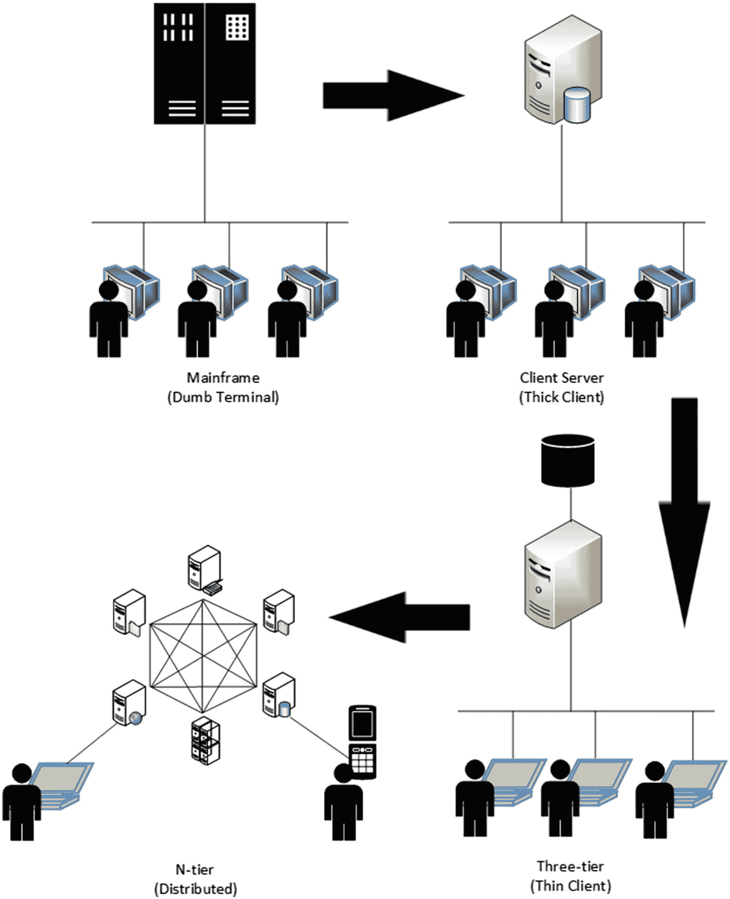
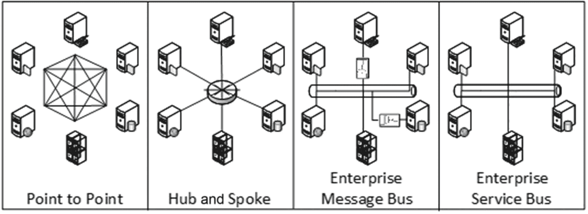
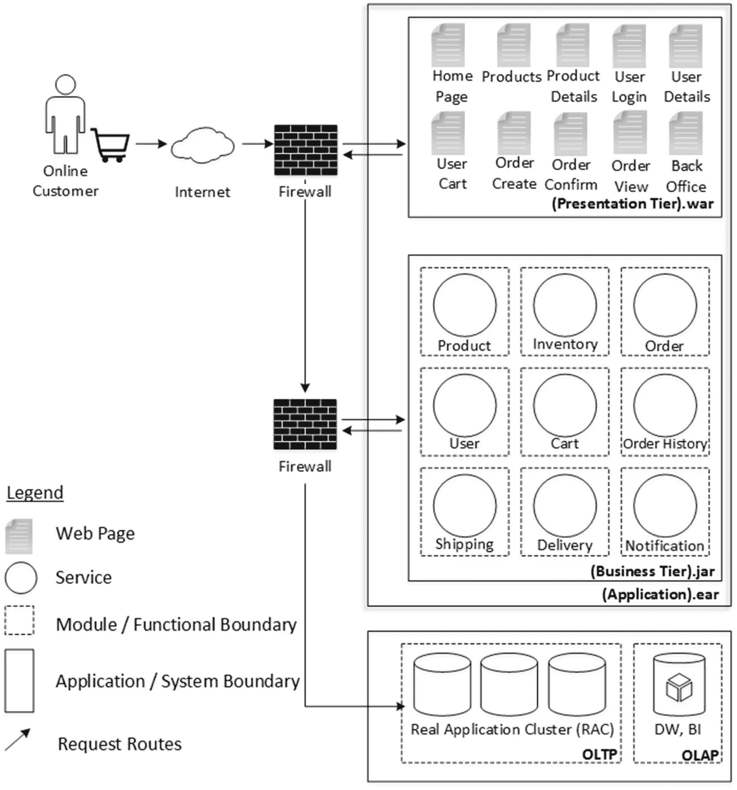
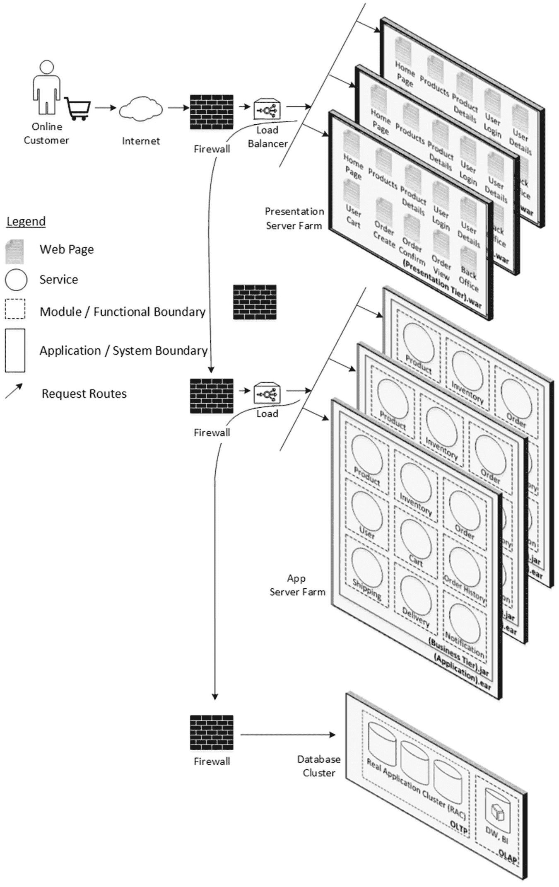
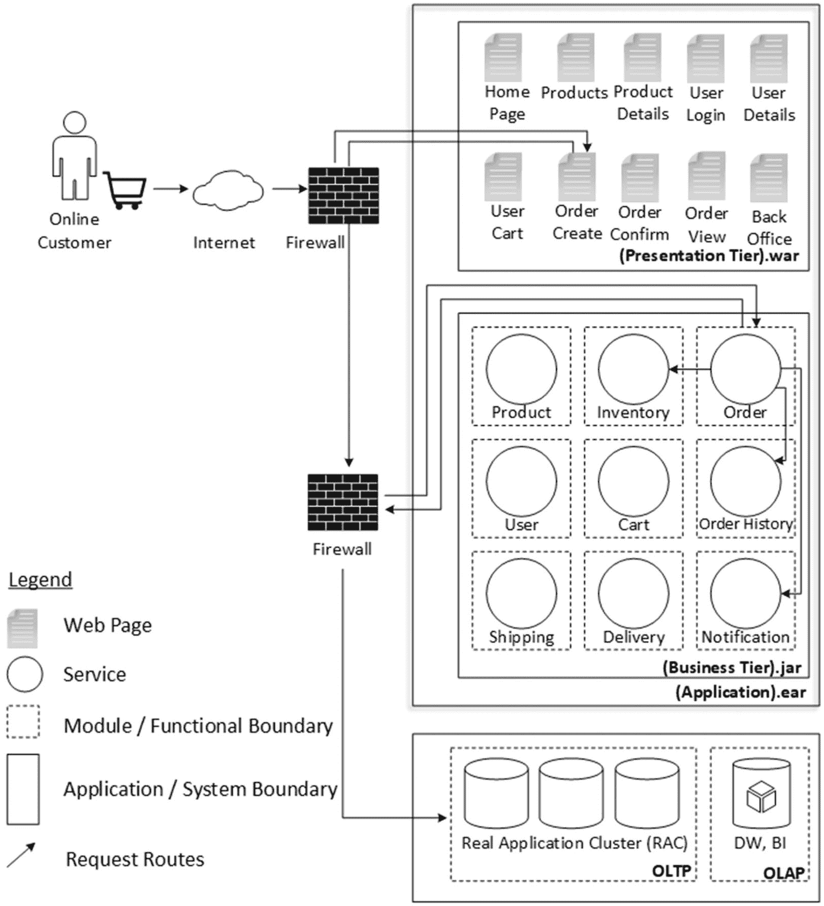

# 1. 分布式计算架构概览

任何规模可观的企业，其技术格局往往极为复杂，充斥着老化的遗留系统，并被业务线、内部部门、供应链等割裂。在某些情况下，企业每个业务流程拥有不止一个系统，这是因为许多企业通过并购发展壮大，从而保留了多个系统，同时还需跨国运营，并维持与不同合作伙伴及服务提供商的联系。因此，技术基础设施常被描述为“意大利面条式架构”，业务系统、合作伙伴与供应链系统以及其他服务提供商之间存在多对多的直接依赖关系。

从计算机时代早期开始，我们便一直在开发软件来构建上述系统。我们从早期的穿孔卡片演进到下一代汇编语言，再到 FORTRAN 和 COBOL 时代，这些语言随后又被 C、Smalltalk 等语言取代，接着是 C++、Java 和 C#。这种演进仍在继续。架构必须适应编程范式，包括所选的编程语言和工具。任何功能强大、规模可观的软件系统，都必须基于合适的软件架构来构建。坚持单一或相似的软件架构，我们可以为不同领域和功能构建软件系统，但没有人能用同一种架构构建所有类型的系统。因此，软件系统的架构风格必须基于众多考量因素进行调整，包括但不限于：

*   业务领域
*   功能与使用场景
*   非功能性需求与使用环境
*   与系统交互的设备与渠道
*   构建系统所用的编程工具
*   运行系统所用的基础设施

## 系统架构

追溯历史，我们一直愉快且成功地使用各种系统架构来构建软件系统。过去几年中，值得注意的架构包括以下几种：

*   大型机架构
*   客户端-服务器架构
*   三层架构
*   多层架构

让我们借助图 1-1 来了解这些架构的一些显著特征。

图 1-1. 系统架构的不同形式

### 大型机架构

在基于大型机的架构中，处理能力是集中式的，多个客户端可以通过低性能终端连接到这个中央计算源。这些终端在某种意义上几乎是“哑终端”，它们只是简单的屏幕，只能组装面向字符的命令，然后将这些命令发送到中央大型计算机执行。大型计算机的任何响应也会以字符流的形式被这些终端接收并呈现，以便用户阅读并进行人工解读。

### 客户端-服务器架构

客户端-服务器架构的特点是有一个高性能服务器，多个客户端可以通过性能相对较低的系统（称为客户端）连接到该服务器。服务器托管数据验证规则、修改数据的业务逻辑以及数据存储功能，而客户端则托管数据输入机制、数据验证规则以及部分或全部业务逻辑。这类客户端也称为胖客户端，因为在许多情况下，客户端代码是用客户端操作系统原生语言编写的，便于实现丰富的用户界面（UI）需求。

### 三层架构

与两层架构类似，三层架构也有一个客户端层。客户端托管数据输入机制、数据验证规则以及部分或全部业务逻辑。这些客户端可以使用客户端操作系统原生语言构建，从而提供丰富的 UI；或者，客户端也可以使用基于 HTTP 和 HTML 的、兼容 Web 浏览器的语言构建。在后一种情况下，客户端层还可以拆分为另一个称为表示层的层，其中客户端层仅包含数据输入、数据验证和 UI 渲染逻辑，而大部分业务逻辑则移至后续层（表示层或中间层）。与两层架构的主要区别在于服务器端：数据管理和存储逻辑与数据验证规则和业务逻辑分离，并放在它们自己的独立服务器上，通常称为数据库服务器。与两层架构类似，数据验证规则和业务逻辑保留在中间层服务器上，通常称为中间层。在过去几年中，移动设备也开始与中间层交互。

### 多层架构

多层架构可以看作是三层架构的扩展形式，其中有多个中间层服务器及其各自的数据库服务器，并且许多中间层服务器相互连接以实现功能复用。客户端层可以直接连接到中间层，也可以先连接到表示层，再由表示层与中间层通信。同样，客户端层中的客户端可以是原生胖客户端、基于浏览器的瘦客户端或任何其他类型的移动客户端。

我不会进一步探讨上述系统架构的细节，因为假设您已具备这些方面的知识；否则，您可能不会阅读这样一本书。

## 网络架构

上一节介绍了相关的系统架构，而软件系统为实现集成而相互连接的不同拓扑结构同样重要。在此，我将借助图 1-2 介绍网络配置的几种更广泛的分类，以便系统之间能够相互通信。

图 1-2. 网络集成拓扑

### 点对点

在点对点架构中，我们为一对应用程序定义互连。因此，我们有两个需要集成的端点。我们可以在一个或两个端点构建协议和/或格式适配器/转换器。只要集成量不大，这是最简单的集成方式。我们通常使用特定于技术的 API，如 FTP、IIOP、远程处理或批处理接口来实现集成。任何两个集成点之间都存在紧密耦合，因为两端都了解彼此。

### 中心辐射型

中心辐射型架构也称为**消息代理**，它提供一个中心化的中心（代理），所有应用程序都连接到该中心。中心辐射型架构的显著特征是每个应用程序通过轻量级连接器与中心枢纽连接。轻量级连接器有助于应用程序集成，对现有应用程序的改动最小甚至无需改动。消息转换和路由在中心枢纽内进行。由于应用程序不直接连接其他应用程序，因此可以通过从中心枢纽断开连接来将其从集成拓扑中移除。由于中心枢纽是此类拓扑的核心部分，因此它也是整个拓扑本身的单点故障。

### 企业消息总线

在企业消息总线拓扑结构中，存在一个通用的通信基础设施，它在应用程序之间充当平台中立和编程语言中立的适配器。该通信基础设施可能包含消息路由器和/或发布-订阅通道。因此，应用程序通过请求-响应队列借助消息总线相互交互。有时，应用程序必须使用适配器来处理诸如调用 CICS^(¹)（客户信息控制系统）事务等场景。此类适配器可能通过专有的总线 API 和应用程序 API 提供应用程序与消息总线之间的连接。

### 企业服务总线 (ESB)

采用服务总线方法进行集成，是利用一种技术解决方案来提供用于应用程序集成的总线。不同的应用程序不会为了集成而直接相互通信；相反，它们通过这个中间件面向服务架构 (SOA) 主干进行通信。ESB 架构最显著的特征是其集成拓扑结构的分布式特性。大多数 ESB 解决方案都基于 Web 服务描述语言 (WSDL) 技术，并使用可扩展标记语言 (XML) 格式进行消息翻译和转换。与企业消息总线相比，ESB 拓扑结构需要的适配器更少，因为接口的 SOA 特性带来了高度的互操作性。

## 软件架构

在了解了通用的系统架构和网络架构之后，现在让我们探讨如何利用层和层的概念为软件应用程序架构带来模块化和可管理性。

### 应用程序层

层通常为应用程序关注点提供分布式部署能力。典型的应用程序层可以列举如下：

*   客户端层
*   表示层
*   业务层
*   集成层
*   资源层

以上列表并非详尽无遗。同样，我无意详细解释这些层，但通常它们使我们能够对非功能性和技术能力进行分组，并在生产部署期间为这些层提供不同的操作能力。

### 应用程序分层

分层有助于基于单一职责模式分离关注点。例如，可以有一个控制器层，它为应用程序层提供一个中央入口点，我们可以在其中执行身份验证和授权检查、应用程序入口日志记录、路由到正确的模块等操作。类似地，ORM（对象关系映射）层可以执行所需的持久化服务，将应用程序领域对象转换为持久化磁盘中的存储模式，反之亦然。

每个应用程序层都可以在逻辑上分离为一个或多个应用程序分层。

## 应用程序架构全景

如果我们回顾过去十年，我们一直在利用 n 层或分布式方式来构建应用程序架构。多个应用程序可以相互通信，因为它们基于上述任何一种网络拓扑结构相互连接。

现在，你将专注于构建一个这样的应用程序。当我谈到“单个应用程序”时，我将该应用程序限定为旨在执行一组相关或分组的功能。例如，一个电子商务应用程序，它帮助企业列出用于销售的产品，并帮助其客户通过 Web 浏览器在线支付和购买这些产品。类似地，股票交易应用程序是另一个具有与股票交易相关的一组功能的应用程序。通常我们不会将这两个应用程序合并在一起，因为它们代表了两个不同功能集的组合。CRM（客户关系管理）应用程序、忠诚度应用程序、机票预订应用程序和出租车叫车应用程序是此类不同应用程序的几个例子。

可能存在两个或多个应用程序需要相互通信，或者我们希望将两个或多个应用程序的功能进行混搭的场景。例如，一家假日预订公司的预订应用程序可能希望混搭所选航空公司的机票预订应用程序和上述所选出租车服务提供商的出租车叫车应用程序的服务。这些场景超出了单个应用程序架构的范围，但需要在应用程序集成层面加以考虑。我无意在我们的讨论范围内涵盖诸如应用程序间集成或应用程序混搭等方面。相反，我想专注于“单个应用程序”的架构，其规模可以根据我们希望组合在一起的功能量级，从小型到中型再到大型不等。

既然我提到电子商务应用程序足以被称为一个单个应用程序，我将使用这个类比来讨论本书中的概念和关注点。你将在不同的章节中了解电子商务应用程序功能的细节，但暂时你可以假设电子商务应用程序是一个规模适中的应用程序，可以帮助你理解我们希望在本书中讨论的几乎所有关注点。

### 典型应用架构

如今企业使用的许多现代应用都是基于多层架构和面向对象编程语言构建的，并且能够利用分布式技术和基础设施进行部署。选择合适的层和层级可以实现灵活的部署，以满足可扩展性需求。现在，让我们来看一个以分布式方式部署的电子商务应用的典型架构。

图 1-3 展示了一个典型的应用架构。这是一个三层应用，即表示层与业务层分离，并且还有第三个数据库层。表示层被打包成一个 `.war` 文件，包含在 Web 浏览器中渲染用户界面所需的所有工件。业务层以 `.jar` 格式打包，包含大部分业务功能和业务规则。你也可以将表示层和业务层合并，创建一个 `.ear` 格式的应用工件。

表示层和业务层可以分别部署到各自专用的服务器硬件上，这些硬件可以配置为简单的服务器场或服务器集群。服务器场是一组托管应用组件的服务器实例，其工作方式使得来自单个浏览器实例的后续流量可以路由到任何一个实例，而不管之前的请求被路由到了哪个服务器实例。通常，位于服务器场前方的负载均衡器会分发流量。此外，部署在服务器场中的应用组件通常是无状态的，这意味着来自单个浏览器实例的流量可以路由到任何一个实例，而不管之前的请求被路由到了哪个服务器实例。这样，请求就是“非粘性的”。而在服务器集群中，服务器实例通常通过心跳和状态复制来相互协调。在这里，请求是粘性的，这意味着只要集群中的某个服务器实例处于活动状态，来自单个浏览器的请求将始终被路由到该实例。不过，根据集群和负载均衡器的配置方式，非粘性请求也可以由集群处理。

图 1-3.
典型应用架构

数据库层托管数据管理功能。它处理 CRUD（创建、读取、更新和删除）请求，并通过适当协调并发 CRUD 请求来负责数据一致性功能。

现在，让我们更详细地了解这个应用。具体来说，假设表示层和业务层是分开部署的，在这种情况下，应用层仅托管业务层。图 1-3 标明了应用边界，也就是业务边界本身。我之前提到了层和层级，同样重要的是将应用划分为多个部分，称为模块。因此，模块可以定义为一组紧密相关、因此彼此之间具有高度“内聚性”的功能和组件。多个这样的模块之间具有更高层次的“粘附性”，共同构成完整的应用。尽管图中单独标出了模块边界，但在实践中，物理软件包中可能存在也可能不存在这种区分性的分离。需要明确的是，当我们设计或构建许多这样的模块并将其打包到单个 `.jar` 或 `.ear` 文件中时，没有什么能阻止我们从一个模块向另一个模块发出请求，并且随着此类依赖项数量的增加，模块之间的粘附性也会增加。因此，所表示的边界只是一个虚拟边界，它仍然允许模块之间进行“闲聊”。通常，这种“闲聊”可以通过进程内方法调用来实现。在这种架构中，主要的实际边界是应用边界本身，正是在这个边界上，我们通常应用 SOA（面向服务架构）和类似的原则。如果我们想将模块部署到多个进程中，我们可能希望使用合适的远程处理方法进行模块间通信，但这只有在我们为此设计了模块的情况下才有可能，因为事后无法补救。

### 典型部署架构

如前所述，我们可以将表示层和业务层合并，创建一个 `.ear` 格式的应用工件进行部署，或者将它们分别保留为 `.war` 和 `.jar` 文件，这样可以实现更灵活的部署，使表示层和业务层分离。如果这两层部署在一起，则可以通过本地方法调用来优化模块间通信。将它们分离的原因是为了允许在这两层之间进行差异化的横向扩展部署，当我们这样做时，必须采用合适的远程处理方法来促进层间通信。通常，我们使用 Java RMI、更通用的 IIOP 或更灵活的协议（如 HTTP）来进行这种层间通信。

如图 1-4 所示，在这些层的前面可以放置一个或多个网络层防火墙，以控制仅来自已知网络的客户端对功能的访问级别。数据库层的情况也是如此。这意味着我们将能够应用配置，以便只允许来自互联网的有效应用相关调用到达表示层，然后在其他层前面设置更严格的规则，只允许来自已知且有效 IP 的调用到达业务层。

图 1-4.
典型部署架构

如果应用服务被设计为无状态的，那么通过采用合适的部署架构，我们可以应对任何流量增长。此外，表示层的横向扩展级别独立于业务层的横向扩展级别。数据库层需要特别注意。表示层负责组装内容以有效渲染用户界面，而业务层负责对业务数据进行更改。数据库层的唯一目的是以一致的方式跨用户请求或跨服务器重启保持数据状态的可访问性。因此，数据库层是数据单一真实来源的地方。这给数据库层的扩展带来了限制。数据库层的横向扩展策略与其他层不同，因为并发可修改的数据不能就这样复制，因为那样我们就需要解决数据协调的问题。通常，数据库横向扩展问题以及相关的数据一致性和数据协调问题的解决方案由数据库供应商提供，而不是由应用架构师提供。同样的原因使得数据库层的技术栈比其他层更昂贵。Oracle RAC（真正应用集群）是该领域的一项技术。同样重要的是另一个事实：即使采用了这些昂贵的解决方案，数据库层可实现的横向扩展级别也无法与其他层相媲美，因为数据库始终是有状态的，而不是无状态的。

## 可扩展性困境

你已经看到，遵循精心设计的应用架构所能达到的可扩展性程度。然而，技术格局正在以更快的速度演变，新的设备和访问渠道不断给应用架构师带来提升可扩展性的压力。这种新趋势被称为“网络规模”，即应用的可扩展性仅受限于网络本身。这里所说的网络，是指帮助无限用户和设备连接到应用并访问服务的互联网或网络。

### 应用状态

你们中有多少人不太喜欢 `javax.servlet.http.HttpSession` API 或 EJB（企业级 Java Bean）部署描述符中名为 `session-type`（可取值 `stateful`）的元素？对于不熟悉这些 API 的读者，这里有一个简短描述：

*   **HttpSession**：Servlet 容器使用此接口在 HTTP 客户端和 HTTP 服务器之间创建会话。该会话可以在指定时间段内持续，跨越用户的多次连接或页面请求。一个会话实例通常对应一个用户，该用户可能多次访问一个网站。服务器可以通过多种方式维护会话，例如使用 Cookie、URL 重写和 `HttpSession` 对象。

*   **session-type**：此部署描述符元素将会话 Bean 的类型指定为有状态或无状态。如果标记为有状态，则 EJB 实例将作为特定用户的专用实例保留。这意味着 EJB 容器无法对这些实例进行池化，因为它们需要为每个用户保持专用。

这两种方法都为应用架构师提供了一种在服务器端存储用户特定数据的简便方式。通常以这种方式存储的数据包括：

*   **身份验证和授权标志**：一旦用户通过服务器验证，就会在表示层服务器上保留一个标志，以允许后续请求绕过进一步的验证。

*   **购物车**：电子商务应用中的购物车允许用户选择最终要购买的商品。它允许客户累积一个待购商品列表。在结账时，它会计算订单总额，包括运费和手续费（即邮资和包装费）以及适用的相关折扣和税费。在此之前，它只是临时保存订单状态，而上述 API 方法是存储此类状态的理想位置。

但是，使用这些 API 的缺点是，由于软件组件实例变得特定于用户，因此它们无法在多个用户之间共享。用更专业的术语来说，这些实例变成了固定资源，并且很多时候负载均衡器不是进行负载均衡，而是将来自单个用户的请求发送到同一个服务器实例。如果我们想要实现网络规模，这不是一个好做法。^(²)

### 依赖噩梦

单一职责原则和抽象原则倡导使用模块化方法构建软件功能。紧密相关且相似的功能被组合在一起形成一个软件模块。任何规模可观的应用都会拥有多个模块。

在同一应用中，一个模块的功能直接依赖于另一个模块的功能也是很常见的。这种依赖通常表现为跨模块的方法或服务调用。图 1-5 展示了一个用户请求创建电子商务订单的流程。一旦请求到达订单模块，该模块内部会执行一系列活动：

*   在数据库中创建订单实体和关联的订单项
*   调用库存数据库以减少库存
*   如果需要，还会调用订单历史模块以进行适当的记录
*   内部调用通知模块，该模块随后向用户发送订单确认通知

此类模块间调用通常具有以下特征：

*   同步请求-响应风格
*   二进制依赖，例如 Java 接口、存根等
*   对共享实体的依赖

当多个团队或多个人分别开发这些模块时，由于上述模块间调用的性质，模块、人员和团队之间就会存在依赖关系。公共库和公共实体需要被共享。当某个模块发生变更时，相关的库需要被更新并重新分发给各个人员和团队，以便他们能够继续开发各自的模块。

此外，如前所述，由于这些模块间的通信，如果需要进一步拆分应用并进行异构部署，这并不容易。

### 应用单体

如果你仔细观察图 1-4，就能理解如何扩展应用的不同层。由于应用层被设计成一个整体，并包含所需的模块间通信，因此进一步拆分应用并进行异构部署并不容易。那么问题来了，我们为什么想要进行异构部署呢？在诸如产品、订单和发货等不同模块中，许多人可能只是在浏览产品目录和产品详情，而只有其中一部分用户会实际结账购买，从而在系统中创建订单。此外，我们只想发货那些已付款并确认的订单。因此，产品模块需要承受更多的流量，而订单模块需要处理的流量相对较少。如果我们能部署更多产品模块实例和更少订单模块实例来优化资源利用，那将非常理想，但由于应用层被设计成一个整体，异构部署并非易事。

其次，如果我们想要在软件中适应变更请求，每当需要对应用中的某段代码进行更改时，我们就需要整体升级应用。这将导致相当长的停机时间，从而影响正常的业务运营。

此外，如果软件中存在错误或其他影响运行中应用的缺陷，很可能会导致整个应用都受到影响。

所有这些缺点，即使采用了前面描述的最佳架构原则也无法避免，这是单体架构的副作用，因为应用是一个单一的、庞大的模块。见图 1-5。

图 1-5.

模块间依赖

## 可扩展架构

现在让我们看看如何使应用架构达到网络规模的几个方面。

### 无状态设计

首要原则是将应用服务设计为无状态的。任何永久状态都可以保存在数据库层，而任何临时状态则可以保存在客户端层本身。这种设计的缺点是我们可能需要随请求一起传递标识符或令牌，以便服务器端的组件拥有执行请求的正确上下文。但这种设计的优势在于，由于应用是无状态的，来自任何用户的任何请求都可以被路由到服务器的任何实例。这意味着即使其中一个服务器实例宕机，后续请求也可以由服务器集群中的任何其他实例来处理。同样，当你想要动态扩展应用时，添加到集群中的任何新服务器实例也可以用于负载均衡来自任何客户端的所有后续请求。

### 分而治之

接下来，我们来解决与单体架构相关的问题。我们希望遵循抽象原则，以模块化的方式构建软件。一旦我们将单体拆分为多个模块，这些模块之间就产生了通过服务调用相互依赖的需求。因此，必须在整合方式与拆分方式之间进行权衡。当模块整合在一起时，部署也可以发生在单个运行时进程中，这意味着模块间的通信是直接的本地调用。当我们拆分时，同样有两种部署选择：要么所有这些拆分的模块仍然可以部署在单个进程中，要么为了更好的运维优化，它们可以部署到多个进程中。在后一种情况下，模块之间无法再使用本地调用进行通信，而是需要合适的远程调用机制。然而，拆分方法的主要优势在于，可以为开发工件维护多个具有间接依赖关系的仓库，并且开发和发布流程可以在多个并行团队中进行。此外，跨进程部署的模块可以独立伸缩，因此这种选择性伸缩将根据实际业务需求优化资源，而不是受制于考虑不周的架构方法所带来的约束。

## 总结

本章重点讨论了分布式软件架构的几个主要特征，以及它从软件早期到如今的演变过程。我对所讨论的主题进行了鸟瞰式的概述，但目的是为了设定背景并审视现有的不同选择。最后，我谈到了设置软件结构的选项，以及当我们保持模块整合与将它们分离时各自的影响。这两种方法各有利弊，但如果分离带来的收益相当可观，那么我们就需要找到方法来处理围绕可管理性和模块间通信这些不那么直接的问题。我将在下一章简要讨论这些方面。在接下来的章节中，你将看到所有这些理论如何通过具体的代码示例付诸实践，这些示例可以在你自己价格不高的台式机或笔记本电脑上构建和运行。

脚注 1   2

