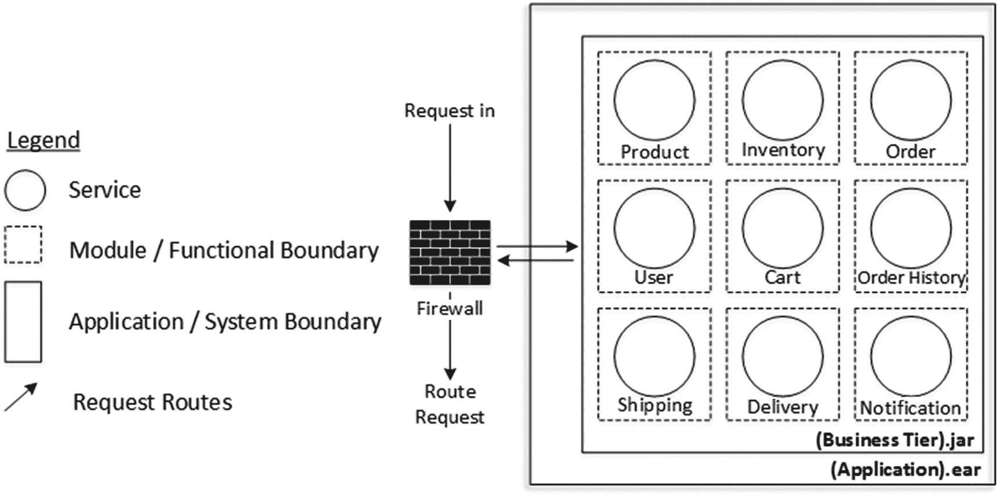
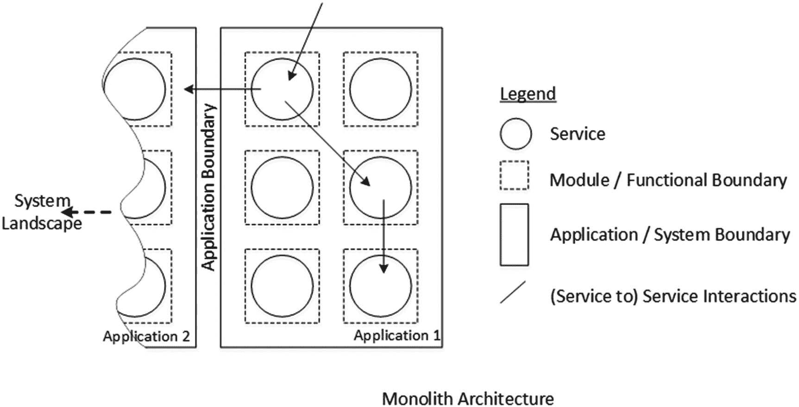
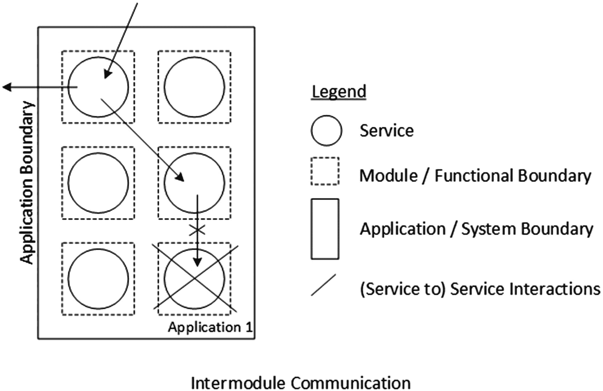
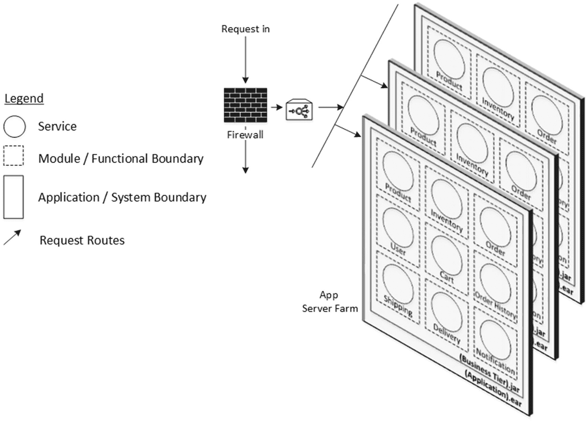
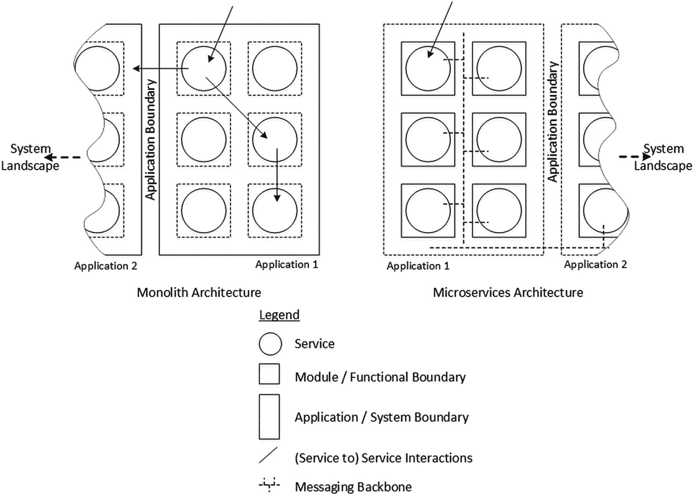

# 2. 微服务介绍

企业软件系统的复杂性随着所支持的功能和特性的增加而增加。正如你在第 1 章中所见，当今每个企业系统都需要与组织内外的许多其他系统无缝地传输信息。传统上，我们一直将软件系统构建为“模块化单体”。所谓模块化，是指它们遵循模块、层和分层的原则，因此软件系统内的元素存在逻辑上的模块性。所谓单体，是指整个系统是围绕特定的部署和运维场景构建的；大多数情况下，它们被部署为单个进程，或者最多按照你在第 1 章中看到的三层或 n 层架构进行分布式部署。但部署的灵活性到此为止。同样重要的是，在多个团队或分布式团队组织中构建这样一个系统所需遵循的流程。

在本章中，你将看到企业在构建当今软件应用时所面临的几个特定问题。一旦你理解了这些问题，你将看到一种构建软件应用的新风格，在这种风格中，你在构建、部署或运维阶段拥有更高的灵活性。

## 模块化单体

我选择将当今典型的企业系统称为模块化单体，因为它们具有许多模式特征，同时也包含我们在定义软件架构时一直虔诚遵循的一些不那么明显的反模式。在本节结束时，你将理解我为什么使用这个短语。

### 模块化组织

自结构化编程语言时代以来，我们就已经掌握了将软件程序分解为更小元素（如多个文件、包含库、支持 bean 等）的风格，这样软件开发人员就可以轻松地在集成开发环境（IDE）中管理多个文件，同时仍然可以开发大型应用、复杂算法和逻辑。

下一级别的模块化是在模块级别或打包级别进行的。一个模块是一组相关功能的集合，以多个程序文件、库等形式组织在一起，并且可以在 IDE 中借助顶层构建脚本进行管理。因此，一个应用可以由多个这样的模块组成。

当我们进入软件生命周期的下一个阶段（构建和打包应用）时，包的概念就会发挥作用。在这里，我们处理的是构建模块并使其能够方便地分发到其他环境（无论是测试环境、预发布环境还是生产环境）的问题。有时，我们还希望以库的形式将软件分发给第三方消费者。

在部署的下一个阶段，我们可能希望将软件包部署到一个或多个计算机进程或计算机运行时中。这是为了满足系统的不同运行时质量要求，这些要求通常根据非功能性需求（NFR）和服务级别协议（SLA）来定义。

第 1 章简要介绍了我们可以用来构建分布式系统并以灵活方式部署和运维它们的不同选项。现在的问题是，它们有多灵活？为了回答这个问题，请看第 1 章中图 1-3 所示的典型应用架构。它由表示层、业务层和数据库层组成。当今大多数企业系统都遵循这种架构，并且具有这种架构的系统还将继续存在几年，至少直到它们被构建时所设定的生命周期结束（EOL）。这有什么问题呢？它可以灵活地以分布式方式部署到其自身的各层中。但灵活性到此为止。那么，我们还需要哪些额外的灵活性呢？

### 单体应用

在尝试回答上一节提出的问题之前，请允许我定义本书后续将遵循的一个主要术语及其解释。

图 2-1 仅展示了图 1-3 中的业务层。通常，该层承载了软件系统的大部分核心逻辑或业务逻辑。我们将这一层称为应用层或服务层。该层与表示层有清晰的界限，通常通过一个控制器层来路由所有服务调用。该层可以暴露本地接口或远程接口。如果表示层和服务层部署在同一个进程中，本地接口就足够了；而如果这两层部署在不同的进程中，则需要像 Java RMI、RMI-IIOP 或 .NET Remoting 这样的远程接口。在面向服务架构（SOA）范式中，合适的 SOA 接口将取代普通的远程调用。基于 HTTP 的 SOAP、REST 等就是此类 SOA 友好接口的例子。

图 2-1

服务层

图 2-1 显示，即使模块或功能组彼此分离，其边界也只是逻辑上的且模糊不清（用虚线表示）。这意味着模块之间没有明确的界限。您可能还会注意到，此类架构通常仍然存在一个应用边界。但这个应用边界是包含其所有模块的边界，因此我们称之为“单体”。单体可以作为一个整体存在，但如果被分割或分离，则难以生存。

### 单体应用边界

图 2-2 描绘了多个单体应用。这在许多现有企业中也很典型，它们需要多个应用来满足企业的各种功能需求。由于孤立的应用无法带来太多益处，因此它们有时会相互连接。

图 2-2

单体应用边界

在图 2-2 中，描绘了两种类型的通信或交互。在应用内部，模块之间要么使用本地调用协议，要么使用合适的远程调用协议进行通信。应用之间的通信同样重要。企业通常使用企业应用集成（EAI）技术来实现应用间的集成。第 1 章的“网络架构”部分简要讨论了应用如何相互集成。您可能已经注意到，大多数情况下，应用边界是明确定义和分离的，因此它们通常被部署到不同的进程或运行时中。由于这个原因，它们需要合适的远程调用机制来相互通信。后来 SOA 的进步提倡使用像 ESB 这样的面向服务集成（SOI）工具，以便能够以更灵活、无缝的方式进行应用集成。

### 单体模块间依赖

在单体架构中，应用内的模块是紧密耦合的。这些模块要么使用本地调用协议，要么使用合适的远程调用协议进行通信。大多数情况下，这些调用本质上是同步的，这意味着每个请求事务也期望得到一个响应或一个异常返回。

当单体应用的所有模块被打包并部署在同一个进程中时，本地方法调用是最佳的通信方式。在这种部署中，要么整个应用始终运行，要么如果任何模块的任何部分出现问题，整个应用也可能完全宕机。如果某些模块被分离出来并部署到不同的进程中，那么部署了分离模块的进程的健康状况不会影响其他依赖进程。然而，当我们从整体上看这样一个单独部署的模块应用时，如果分离的模块因任何原因宕机，依赖模块仍然可能受到影响。这是因为模块间通信被定义为直接且同步的方法调用依赖，所以如果被调用的模块没有响应或不存在，调用模块就会受到影响。它们要么被无限期阻塞，要么等待一段时间后响应并报告错误状态。图 2-3 描绘了这一点。

图 2-3

单体模块间通信

### 可扩展性困境

现代应用架构具备水平可扩展性。所谓水平可扩展，是指同一功能的多个实例可以部署到不同进程中，而客户端发往该功能的流量可由任意一个包含重复功能的服务器进程处理。这种拓扑结构被称为服务器集群。理想情况下，来自同一客户端（浏览器或移动应用）的请求也可以路由到该集群中的任意实例，无论该客户端的上一个请求是由哪个服务器实例处理的。

图 2-1 展示了一个电商应用的不同模块。如果思考用户通常如何与电商应用交互，其步骤序列可能如下：

1.  访问电商应用的主页。
2.  浏览产品分类。
3.  选择感兴趣的商品并浏览其详情。
4.  如果感兴趣，将所选商品加入购物车。
5.  创建用户档案，或如果已有档案则登录。
6.  支付并结算商品，确认订单。

通常，用户会浏览大量产品分类和详情，但只将少数商品加入购物车。即使商品已加入购物车，也可能被删除，或者购物车被忽略或废弃。最终，在电商应用中，只有相对较小比例的购物车商品会转化为已确认的订单。

在第 1 章的“典型部署架构”部分，你看到了典型单体应用可用的横向扩展机制选项。图 1-4 的相关部分在此复制为图 2-4 以便进一步讨论。

图 2-4

应用层可扩展性

由于许多已登录和匿名（未登录）用户会浏览大量产品分类和产品详情网页，与订单模块相比，处理这些请求的应用模块（即产品模块）将承受更大的压力。如果部署架构需要灵活应对这种不同的可扩展性需求，我们应该能够部署更多承载产品模块的服务器实例，而承载订单模块所需的服务器进程数量则较少。同样重要的是，与部署产品模块所需的服务器硬件相比，部署订单模块需要更高可靠性的硬件，因为订单交易失败的代价远高于产品相关交易失败的代价。由于前面章节讨论的所有或大部分问题，你知道将模块分离并根据所需的运营质量进行部署并非易事，因为该应用是作为单体架构设计的，只允许同构部署。

### 单体技术约束

单体应用的规模可能相当庞大。根据应用的生命周期，其功能和特性仍会不断演进，因此其规模会持续增长。随着时间的推移，行业中的技术和机制也会发生变化。不幸的是，单体应用架构在适应最新技术和趋势方面存在严重局限性。大多数平台、技术、工具和框架的选择都是在初始架构阶段决定并确立基准的，这些决策如同刻在石头上一般难以更改。将一个问题的解决方案从一种技术更换为另一种并不容易。例如，如果平台已固定选择为 Java，那么要使用 .NET 解决方案来处理应用的部分功能或构建新特性就不那么容易了。同样，如果它使用关系型数据库管理系统（RDBMS）进行持久化，那么大多数时候它也必须使用像 Hibernate 这样的 ORM（对象关系映射）框架或像 iBatis 这样的数据映射框架。为了整个应用的一致性和规模经济，不建议在未来的所有扩展中引入新的此类框架来替代它们。最后但同样重要的是，将单个项目的代码库加载到 IDE 中会消耗大量内存，并且常常会阻碍开发人员的生产力。

## 微服务简介

微服务是一种不同的软件应用架构方法。它们试图解决许多现代应用架构的挑战。我们将审视当今面临的不同架构挑战，并建立一个基础，以便我们能够解决问题并继续前进。

在深入探讨之前，这里还有一个重要的术语：微服务上下文中的“服务”。

在 SOA 中，服务是一种一流的业务功能，任何客户端都可以通过网络使用标准访问协议来访问它。SOA 服务是自治的，并且通常是幂等且无状态的。所谓自治，是指服务本身在提供功能方面是自给自足的。所谓幂等，是指无论是有意还是错误地多次调用服务，都不会产生任何副作用。简单来说，客户端可以重复发出相同的请求，同时产生相同的结果。换句话说，发出多个相同的请求与发出单个请求的效果相同。所谓无状态，是指在调用服务时，我们不会在服务器上存储任何代表特定客户端的状态（这一点在第 1 章的“无状态设计”部分已讨论过）。

你尚未了解什么是微服务，因此为了继续当前的讨论，可以将微服务类比为 SOA 服务。有时，一组功能相关的此类服务的集合也可以被称为微服务。我们稍后会探讨这个说法的不同含义。

让我们重新审视一下我们在单体方法中讨论的几个挑战，并看看如何解决它们。

### 独立模块

我想为单体引入的第一个、也是最显著且可观察的特性，是将其转换为一系列离散且独立的模块。通过使模块独立，我们希望为软件范式带来以下全部或大部分灵活性：

*   **并行开发**：每个模块可以作为独立的代码仓库进行源代码管理，因此分布式团队可以独立且并行地构建这些模块。
*   **分离部署**：与单体的单一进程部署方法不同，一旦模块独立，它们也应该被打包、部署、测试，并部署到生产环境中的多个运行时进程中，以便在部署期间可以采用适当的策略来应对软件和硬件层面不同的可扩展性需求。这在电商应用等场景中尤为重要，我们希望部署更多服务器实例来承载产品模块，而为订单模块部署较少的服务器进程；同样，我们希望将订单模块部署到可靠性更高的硬件和软件栈上（成本更高），而部署产品模块所需的硬件和软件栈则相对要求较低（通过使用通用硬件可以合理控制成本）。

### 模块间通信

我们与现有系统的大多数模块间通信都是直接且同步的方法调用。即使我们将这些通信设计为幂等且无状态，这种调用带来的副作用之一是被调用模块必须保持在线并活跃以响应调用模块，否则可能引发异常或错误。即使我们将不同模块分离为独立个体并部署到多个进程中，这种副作用依然存在，并会在调用栈中向后传播。调用进程中发起请求的线程将一直等待，直到收到有效响应（无论是否包含数据），或直到被调用方法抛出异常。这会阻塞调用进程中发起请求的线程，使其在方法调用返回前无法执行其他任务。因此，这不仅导致了对被调用进程的依赖，还占用了调用进程的资源，使其无法被复用。

然而，这种同步式模块间通信有一个优点：调用方可以在检查被调用进程返回的响应数据后执行下一步操作。此外，当被调用进程未返回预期结果时，调用方可以立即向用户或客户端代理层发出提示，以便通过人工干预进行下一步操作。

异步或“即发即忘”式的模块间通信，可以在向被调用进程发出调用后立即释放调用方资源，使其可被复用。在调用进程与被调用进程之间使用消息队列是实现这一目标的一种方式。但这也会给整体软件架构带来额外的复杂性。首先，我们需要在 IT 环境中处理消息基础设施。更重要的是，软件设计的复杂性会增加，因为我们现在还需要将响应与特定请求关联起来——它们不再通过计算线程的“等待与响应”原语绑定在一起。

异步通信是一种必要的恶。

基于此背景，让我们来看看如何对单体应用进行改进，使其更现代化、更灵活。

### 微服务

在单体应用架构现代化过程中，你已经了解了两个主要方面，即：

*   使模块独立
*   重新设计模块间通信

图 2-5 描绘了我们讨论的两种架构现代化方案。你可能需要花些时间仔细观察该图，因为它将是构建更多改进方案的基础结构。

图 2-5

重新设计单体应用的边界

在单体架构风格中，每个应用都是一个独立的单体，它们按照前文“单体模块间依赖”部分所述的方式相互通信。每个应用都有一个明确定义的边界，该边界界定了功能分组的限界上下文。在图 2-5 中，这用粗矩形框表示。如果你查看此类应用的内部，会发现有多个模块。如前所述，这些模块在逻辑上是分离的，但由于部署上的依赖关系以及模块间通信，模块边界并不严格，反而显得臃肿。这用虚线方框表示。在这样的模块内部，我标注了一个服务。它可以是一个单一服务，也可以是一组功能相关的服务集合，用圆圈表示。请注意，一个服务可以接收外部请求，也可以将请求委托给另一个模块中的其他服务，或另一个应用中的其他服务；所有这些都用箭头表示。

当我想要引入名为“微服务”的新型应用架构时，我反转了边界，如图 2-5 最右侧所示。在这里，每个模块或每个可区分的功能分组都与其同类清晰分离。每个服务或功能相关的服务集合在逻辑上和物理上被组合在一起。在此图中，这用粗线方框表示，称为微服务。我们稍后会详细讨论它，但就目前的讨论而言，这样的微服务可以独立于其他微服务进行开发、源代码管理、构建、测试、分发和部署。如果我们想将其映射到我们的单体应用，可以想象，这样一个微服务集合可以等同于我们传统的单体应用。正如单体应用的不同部分需要相互交互以实现其内置功能一样，在微服务世界中，微服务内部的服务可以相互通信，或者跨微服务的服务也可以相互通信。当我们采用微服务时，我们不想忽视 SOA 的任何或全部原则。据此，我们可以使用任何标准的 SOA 接口让微服务相互通信。稍后你会看到，为了发挥微服务的真正效率，你也必须为微服务架构适配真正的 SOA 原则。

前文关于灵活“模块间通信”的部分指出，我们也可以在模块之间使用异步通信风格，微服务之间同样可以如此。这通过减少依赖和打破请求-响应循环为我们提供了灵活性，从而可以解决诸如被调用的微服务不存在或无响应时该怎么办等问题。微服务之间合适的消息队列有助于实现这一点，这种消息基础设施在图 2-5 中通过连接微服务的线条表示。接下来是另一个重要方面：当微服务以这种方式互联时，由于底层消息基础设施与企业 IT 基础设施无缝融合，理论上，来自任何垂直领域或业务线的微服务都能够跨彼此交换信息，因为它们都可以连接到同一个企业局域网。当这种情况发生时，以前曾经是定义明确、严格边界的应用边界现在消失了。这在图 2-5 中用应用之间的虚线表示。换句话说，以前作为企业软件领域中一等限界公民存在的应用概念，现在让位给了微服务，而微服务开始在其身份（作为一等独立软件构建块）方面展现出这些应用的许多特性。

你也可以查阅维基百科（ [`https://en.wikipedia.org/wiki/Microservices`](https://en.wikipedia.org/wiki/Microservices) ）提供的微服务正式定义。

### 注意

“微服务是一种软件开发技术——是面向服务架构（SOA）风格的一种变体，它将应用程序构建为一系列松散耦合服务的集合。在微服务架构中，服务粒度较细，且协议轻量。将应用拆分为多个不同的小型服务，其好处在于提升了模块化程度。这使得应用更易于理解、开发、测试，并且对架构侵蚀更具弹性。它通过让小型自治团队能够独立开发、部署和扩展各自的服务，实现了开发的并行化。同时，它也允许单个服务的架构通过持续重构而逐步形成。”

上述定义中提到的许多方面，在前两章中已经有所讨论。接下来，你将从这个定义的更多角度进行审视，并在接下来的两章中深入探讨更多内容。

## 总结

在本章中，你审视了传统分布式或 N 层应用架构的现状，并探讨了此类架构因单体特性而存在的一些缺陷。单体架构还有许多其他优缺点尚未讨论，但此类讨论不在本章范围内，因为我只是想为讨论另一种做事方式（即使用微服务）设定背景。现在你明白了，当你的思路从单体架构转向微服务风格时，你需要反转许多概念，例如应用边界、内部通信等。在下一章中，你将详细重新审视微服务架构，并将其概念与现实世界的企业应用联系起来。

