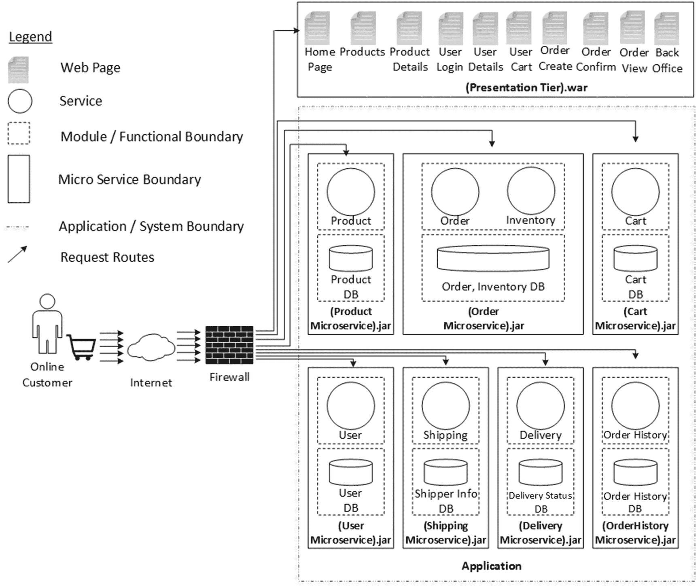
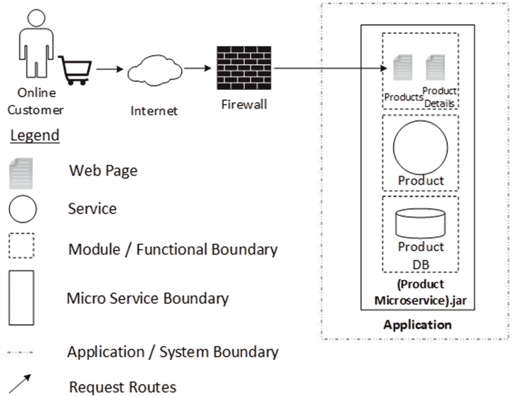
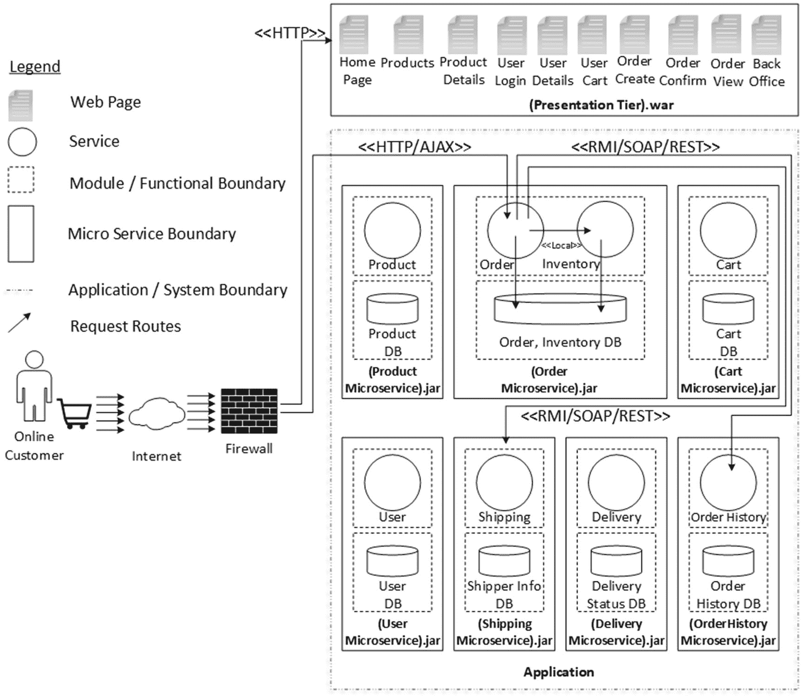
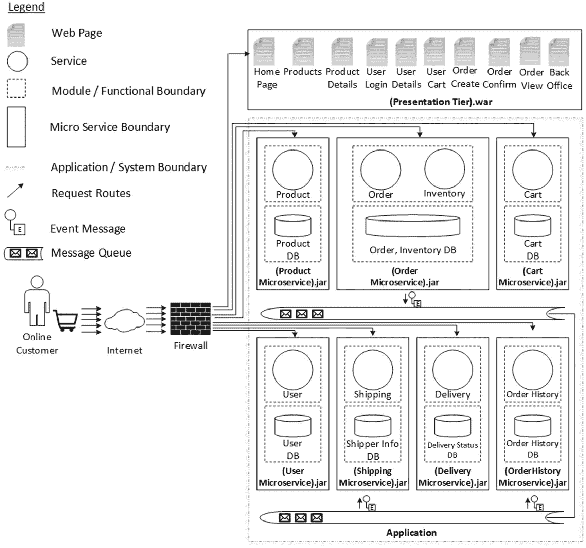
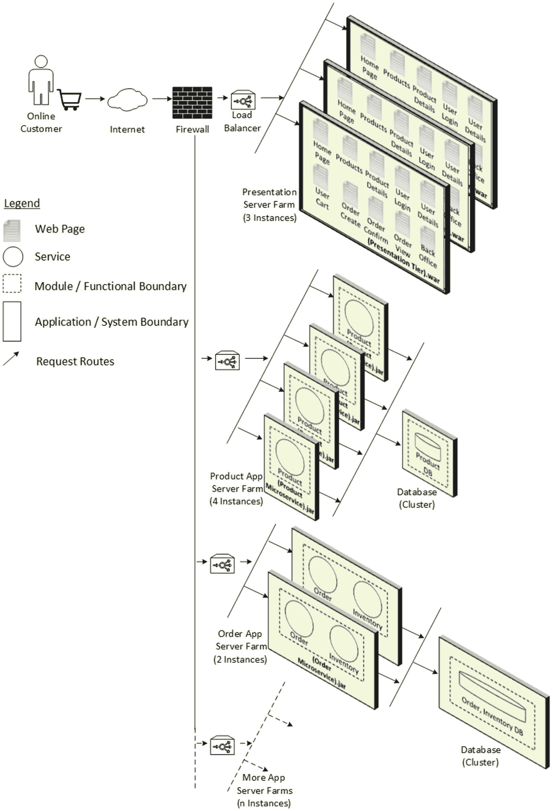
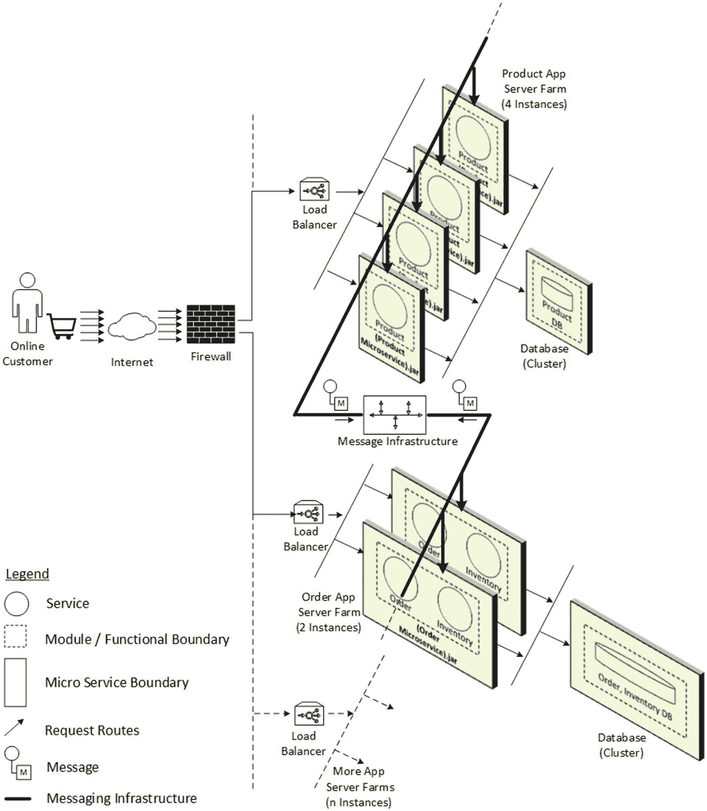
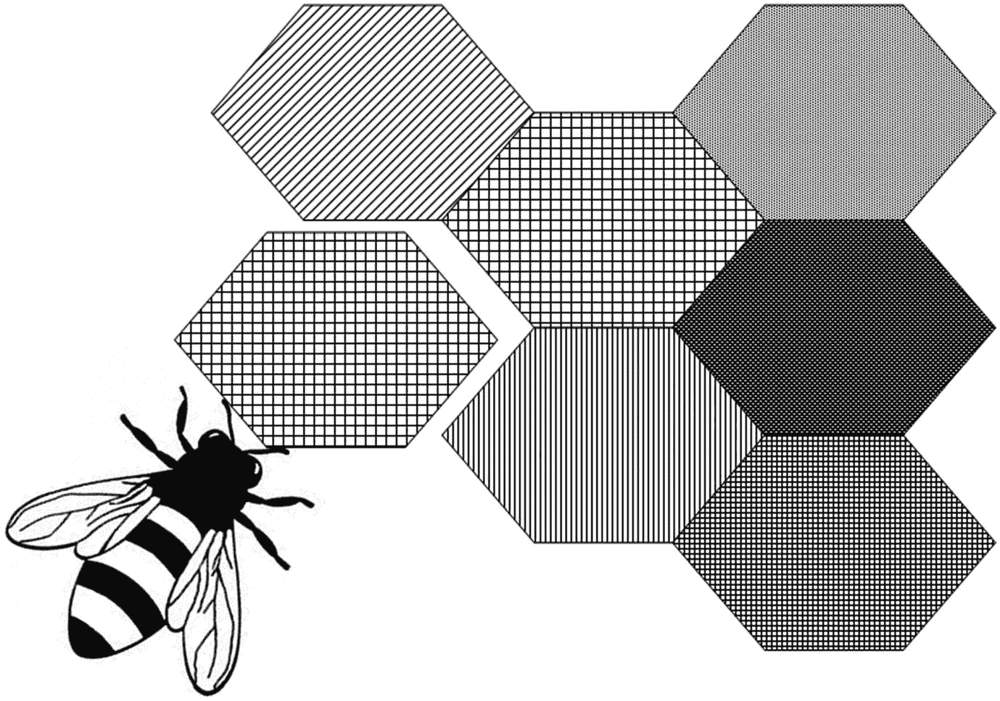

# 3. 深入理解微服务

正如你在第 2 章中所见，使用微服务是构建当今分布式软件解决方案的一种方法。过去二十年，软件行业在开发和部署分布式应用方面积累了经验，而微服务则提供了架构原则和模式，用于应对开发、部署和维护分布式应用中的诸多不足。我们在前两章讨论了微服务架构的背景和必要性，本章将更详细地探讨它。我将再次尝试结合现实世界应用（即我在第 1 章中介绍的电子商务应用）的上下文来解释概念。这将帮助你快速将各方面内容与你实际经验中的实践场景联系起来。

本章将探讨以下几个方面：

*   在微服务上下文中，电子商务架构将呈现何种形态
*   经典的分层与分层方法在微服务上下文中的关系
*   微服务的自治特性
*   微服务与传统 SOA 和 MOM 的关系
*   微服务架构的可伸缩性和可扩展性特征

## 微服务的外观与感受

你刚刚了解到，与传统单体应用相比，在谈论微服务时，许多特征和显著特性都被反转了。为了更好地理解这种反转究竟意味着什么，让我们先看一个实际的企业应用场景，并首先了解整体图景，这样细粒度且最重要的细节就更容易理解了。

### 电子商务微服务

第 1 章的“典型应用架构”部分介绍了电子商务应用。我解释了此类应用如何按照传统方法构建。第 1 章的图 1-3 描绘了不同的层以及管理软件复杂性的模块化方法。即使采用了层、分层和模块的原则，你仍然看到模块之间存在不当依赖的问题，这阻碍了软件工程生命周期的所有阶段。我将按照第 2 章介绍的微服务首要原则，以略微不同的风格来描绘那种单体架构。

图 3-1 展示了如果我们重新绘制第 1 章图 1-3 所示的传统基于单体架构，架构会是什么样子。与图 1-3 中的单体架构表示相比，我柔化了图中用点线和虚线样式表示的应用边界。这是为了强调一点：在微服务架构中，重要的不是应用边界，而是微服务边界。微服务边界用粗矩形表示。图中描绘了许多这样的微服务。简而言之，传统架构中表示的单一单体应用边界已经消失，取而代之的是许多微服务涌现出来，并且所有这些微服务都有清晰且具体的边界。



图 3-1

电子商务微服务架构

在这种新的架构表示中，我没有引入任何新模块。相反，我保留了单体架构中已有的模块，同时显著改变了软件模块的结构以及技术基础设施。让我们详细探讨这种结构变化。

### 无层，分布式

我在第 1 章的“系统架构”部分讨论了三层和 N 层分布式架构。据此，将微服务架构称为“无层，分布式”架构并无不妥。为了说明清楚，如果你重新审视三层或 N 层分布式架构，在一个应用内部存在多个层，例如客户端层、表示层、业务层等。这些层也能够部署到不同的分布式进程空间中。这一点在微服务架构中也被反转了。为了说明清楚，在微服务架构中，目标是让所有这些层保持在一起。但且慢，这同样不是一条硬性规定。没有什么能阻止我们将传统架构中的分层、层以及其他类似原则适配到微服务架构中。所有这些良好实践仍然有效。我们甚至可以将这些层部署到独立的进程空间中。但这样一来，我们可能需要质疑为什么要这样做。通过将紧密交互的部分（例如一个微服务的不同层）保持在一起，也许就在同一个进程内，我们可以带来许多优化，例如改善响应时间、实现可靠通信等。

我们也可以在三层架构本身的上下文中思考微服务架构。微服务可以通过在逻辑上分离不同层来构建，但在实际生产部署时，这些层可能会紧密地保持在一起，以获得所需的自治程度。让我们来看看这种自治意味着什么。


### 微单体

微服务之所以被称为微单体，是因为它们遵循分层和层级实践构建而成，但每个微服务的边界应当清晰可辨，并且应包含其独立运行和服务所需的一切，无需任何外部依赖。这体现在物理制品层面，例如微服务启动和运行所需的二进制文件、库和脚本。同时，这也必须体现在微服务运行时所需的任何依赖上，例如容器服务或持久化服务。物理上捆绑的微服务制品，在部署到运行时进程后，必须在其提供功能的能力方面展现出完全的自主性。下一节将进一步解释这一点。

由于我们将微服务组织为包罗万象的捆绑包，几乎不依赖或完全不依赖外部，这为平台和技术选择带来了某些优势。为某个微服务所做的任何平台、技术、工具或框架决策，都不应成为其他微服务的约束。这为跨微服务的团队提供了技术和架构选择的自由。但与此同时，这种自主性也给微服务带来了额外的责任：它必须拥有并管理其健康存在所需的所有资源，包括保持状态持久化所需的数据和数据库。数据独立性通常通过为每个微服务提供其自己的数据库来实现（或者甚至在共享数据库中为每个微服务提供其自己的模式，但在这种情况下，应避免所有跨模式操作）。通常，微服务所需的表示层服务也封装在微服务捆绑包内。图 3-2 展示了一个单一微服务——产品微服务的情况。



图 3-2

一个典型的微服务

在众多层级中，业务层负责核心的数据处理和加工工作，而可扩展性问题也常在此层出现。利用当今的技术能力，特别是使用**SPA**（**单页应用**）Web 框架和缓存框架，扩展其他层级相对直接。因此，在本文的大部分讨论中，当我们谈及微服务时，将主要关注业务层。不过，在必要时，我们也会涉及其他层级以呈现完整图景。因此，我们希望将图 3-2 中所示的微服务进行表示，将表示层组件分离出来，正如你在图 3-1 中所见。这会产生一些影响，但我们将在后续章节中讨论。

### 理解自包含微服务

由于微服务是面向 SOA 的（我们将在下一节讨论），它们需要 HTTP 服务器服务来暴露 SOA 或 REST 接口。在我们将传统单体包部署到 HTTP 容器的 web-app 文件夹时，对于微服务而言，一个轻量级的 HTTP 监听器被嵌入到微服务内部，从而消除了对外部或独立容器或服务器的需求。在 Java 范式中，对于传统部署，我们通常将 `.ear` 或 `.war` 文件部署到像 JBoss 这样的全能应用服务器或像 Tomcat 这样的 Web 服务器中。相比之下，对于微服务，则没有 Web 服务器或 `.war` 文件；相反，每个服务都有自己嵌入的 HTTP 监听器，例如 JAR 文件中的 Jetty、Tomcat 或 Undertow。当我们构建微服务时，构建阶段会创建这个“可执行的 fat JAR”文件，其中包含服务运行时，例如前面提到的 HTTP 监听器。

### 注意

Java 没有提供加载嵌套 JAR 文件（JAR 文件本身包含在另一个 JAR 中）的标准方法。如果你希望分发一个自包含的微服务，这可能会带来问题。

为了解决这个问题，许多开发者使用“uber”JAR。一个 uber JAR 将所有依赖 JAR 中的所有类打包到一个单一的归档文件中。它们也被称为 fat JAR。这种方法的问题在于，很难看出你的微服务中包含了哪些库。如果多个 JAR 中使用了相同的文件名（但内容不同），也可能会出现问题。

上一节指出，微服务应包含其启动和运行所需的所有物理制品，如二进制文件、库和脚本。在传统的单体部署中，我们可以将这些依赖放在应用服务器的 `lib` 文件夹中。在微服务世界中，可执行的 jar 文件是实现这一目标的一种手段。产品微服务的一个典型可执行 jar 文件的结构如代码清单 3-1 所示。

```
product.jar
|
+-META-INF
|  +-MANIFEST.MF
+-org
|  +-springframework
|     +-boot
|        +-loader
|           +-
+-BOOT-INF
+-classes
|  +-com
|     +-acme
|        +-ProductMain.class
+-lib
+-framework.jar
+-log4j.jar
+-jetty.jar
+-. . .
代码清单 3-1
可执行 jar 文件结构
```

通过这种方式，所有必需的库以及所需的运行时服务（如 HTTP、JMS 或 AMQP）都被嵌入到可执行的 jar 文件中。在第 7 章的“构建和打包 Spring Boot 应用程序”部分，你将编写代码、构建、打包并运行一个可执行的 fat jar 文件。


### 微服务与 SOA 的相似性

如前所述，一个应用程序由多个微服务组成。微服务必须能够被其他微服务或其他组件（如表示层组件）访问。由于大多数情况下微服务部署在独立的进程中，因此需要一种合适的进程间通信机制来实现微服务间的通信。你不必重新发明轮子，而应采纳所有从 SOA 圣经中借鉴的最佳实践。与 SOA 类似，微服务也有多种服务暴露方式可选，从高性能的二进制级 TCP-IP 套接字，到 Java RMI、.NET Remoting、RMI-IIOP 等远程协议，再到更符合 Web 风格的 SOAP 或 REST。

图 3-3 重新绘制了图 3-1 中的电商微服务架构，并突出显示了几个典型的请求流程。假设表示层服务器首次加载后，浏览器可以缓存大部分表示层组件，那么后续所有请求都可以由浏览器直接发送到服务层。图 3-3 展示的正是这种情况，以便我们更专注于微服务本身。请记住，即使我们采用传统的基于表示层的方法（所有请求始终仅通过表示层服务器路由），请求接下来也会到达微服务，这与不经过表示层服务器的请求流程并无本质区别。在图 3-3 中，假设一个确认订单的请求到达了订单微服务。它将访问自己的订单数据库并创建订单。同时，它还需要与库存服务通信，对库存数据库进行修改，以扣除新订购的数量。假设电商应用中还存在其他微服务，如物流微服务和订单历史微服务，那么订单微服务在创建订单时也需要向它们发送请求。物流微服务负责打包和发货，而订单历史微服务则会在订单历史数据库中创建一条记录，用于分析目的。总之，微服务必须能够被其他微服务以及其他组件访问。因此，微服务间的通信是一个需要关注的问题。



图 3-3

微服务通信是 SOA 友好的

仔细观察图 3-3 会发现微服务架构中的另一个重要问题：跨微服务维护数据一致性的难题。由于每个微服务管理自己的状态和持久化数据，并且每个微服务通常部署在独立的进程空间中，因此跨微服务维护数据一致性将是一项挑战。请注意订单微服务和库存微服务之间标记为“本地”协议的通信机制；我们将在第 17 章的“BASE 中的 ACID”一节中讨论它。

### 面向消息的微服务

当我们说微服务必须能够被其他微服务以及其他组件访问时，我们指的是微服务相互依赖的通信机制。在第 2 章的“模块间通信”一节中，我们讨论了同步和异步通信方式的优缺点。并没有硬性规定说不能在微服务之间使用同步调用。精心设计的 SOA 接口是设计微服务接口的最佳方式之一。通过 REST 接口使用 JSON（JavaScript 对象表示法）格式发送请求和接收响应是非常值得提倡的，因为无论是 Web 客户端、移动客户端还是其他物联网客户端，服务都可以被复用。然而，即使是 SOA 接口也会使一个微服务依赖于其他微服务。如果被调用的微服务运行不正常，调用方微服务的功能就无法完成，事务也容易失败。在图 3-3 的具体示例中，假设物流微服务或订单历史微服务运行不正常，这将导致创建订单事务失败。仔细分析后发现，情况并非必然如此。如果订单微服务不依赖于物流微服务或订单历史微服务，那么即使物流微服务或订单历史微服务运行不正常，订单微服务中的创建订单事务仍然可以成功。这怎么可能呢？

异步或即发即弃的模块间通信方式可以使微服务摆脱彼此之间的硬依赖。我们可以在微服务之间使用消息队列，这样微服务就可以通过队列发送消息进行通信，而不是直接进行同步调用。在图 3-4 中，架构已经过调整，在微服务之间引入了消息队列系统。微服务的其他基于 SOA 的接口并未完全消除；它们被保留了下来，但同时引入了消息队列。这是因为任何外部组件或服务都必须使用电商应用或电商微服务的 SOA 接口。与此同时，任何微服务间的通信都可以通过消息队列进行。因此，浏览器确认订单的请求将使用其基于 SOA 的 REST 接口到达订单微服务。订单微服务将访问自己的订单数据库并创建订单。同时，它还需要对库存数据库进行修改，以扣除刚订购的数量。



图 3-4

基于事件的微服务

订单微服务中的创建订单事务将以原子方式在订单数据库中创建条目、更新库存数据库中的条目，并向消息队列发送消息。如果这些操作中的任何一个失败，整个创建订单事务将失败。如果所有这些操作都成功，创建订单事务也将成功。在订单数据库中创建订单和在库存数据库中扣减库存可以在单个事务内完成。这里我们再次将这种复杂性留待后续详细讨论。

订单微服务在创建订单时发送到队列的消息，随后将由物流微服务和订单历史微服务接收。

## 高级微服务能力

你已经了解了如何将单体应用拆分为基于微服务的架构。你还学习了基于微服务架构中的消息队列，它有助于降低微服务间的耦合度。现在，让我们来看看其优势。


### 故障安全型微服务

在面向消息的微服务范式中，“创建订单”事务成功的唯一必要条件，是“创建订单”微服务（它同时包含了订单和库存数据库）及其关联的消息队列基础设施保持运行。发货微服务和订单历史微服务是否运行无关紧要。假设在创建订单时，发货微服务和订单历史微服务处于宕机状态。由订单微服务因创建订单而放置的任何消息都将在队列中安全保存。同样，我们可以假设存在多个订单微服务实例以实现冗余，并且集群化的消息队列将提高队列的可靠性。持久性消息一旦到达队列，也会立即写入磁盘。因此，如果消息队列是持久化的，即使在“创建订单”事务成功后，集群中的一个或所有消息基础设施服务器宕机，消息仍然安全地保存在磁盘上。当我们再次启动队列时，消息仍然可供消费。持久队列会持久地保留消息，供任何合适的消费者消费，即使消费者在消息到达时并未处于活动状态。持久队列无需关心未来将由哪个消费者来消费这些消息。每条消息只有一个副本，未来任何消费者都可以消费它。然而，持久主题则不同，因为它们必须在逻辑上为每个持久消费者持久化每条合适消息的一个实例，因为每个持久消费者都会获得自己的消息副本。因此，通过明智地结合消息基础设施中队列或主题的持久性和持久化能力，我们可以消除订单微服务对发货微服务和订单历史微服务的依赖。在稍后的某个时间点，当发货微服务或订单历史微服务再次启动时，它们将消费旨在由它们消费的消息，其余的功能流程将由各自的微服务继续执行。

### 可伸缩的微服务

在第 2 章的“可伸缩性困境”一节中，我们讨论了许多已登录和匿名用户将浏览许多产品类别和产品详情网页，而通过产品微服务处理这些请求的微服务将比订单微服务承受更大的压力。这是因为只有一部分浏览产品类别或产品详情网页的流量最终会转化为已确认的订单事务。因此，我们需要具备有选择地伸缩应用程序微服务的能力。我们已经将单体电子商务应用分解为基于微服务的电子商务应用。有选择地伸缩的能力是微服务架构免费提供的一项功能。图 3-5 正好展示了这一点。



图 3-5

横向扩展的微服务

图 3-5 展示了一个为选择性伸缩而部署的典型微服务架构。这意味着应用程序不同部分的可伸缩性可以被精细控制，并且可以独立于其他部分进行。这是终极的自由。

与图 3-1 中展示的电子商务微服务架构相比，图 3-5 将数据库置于微服务边界之外。但在“微服务是自包含的”一节中，我曾说过微服务包含了包括数据库在内的所有资源。这难道不是矛盾的吗？

以图 3-5 中的产品微服务为例。图中显示了四个产品微服务实例，因为我们预计浏览产品类别和产品详情网页的流量远高于应用程序的其他部分。但图中只显示了一个产品数据库，并且它位于产品微服务的边界之外。产品类别或产品详情是电子商务应用的一种主数据。一旦数据库被填充，除非我们向系统添加新的产品类别或产品，或者淘汰现有的产品类别或产品，否则它不会改变。因此，产品数据库是一个“只读”数据库。所以，即使有多个产品微服务应用服务器实例连接到单个产品数据库实例，也不会出现需要解决的数据一致性问题。此外，如果我们启用缓存，那么对产品数据库的访问次数可以进一步减少。简而言之，尽管我们将产品微服务实例展示在与产品数据库分离的进程中，但你可以将它们视为一个不可分割的整体块。因此，微服务包含了包括数据库在内的所有资源的定义仍然成立。

图中显示了两个订单微服务实例。同样，订单数据库被展示在订单微服务的边界之外。订单微服务是一个共享数据库，多个订单微服务实例访问单个订单数据库实例带来了处理任何潜在数据损坏的复杂性。我们可以考虑采用资源的分布式锁定来解决此类共享数据损坏问题。我们稍后将对此进行更多讨论，但暂时你可以认为，尽管订单数据库在物理上被展示在订单微服务的边界之外，但出于所有实际目的，它作为订单微服务的一个集成整体来运作。

但是，在“面向消息的微服务”一节中讨论的消息基础设施呢？为了降低复杂性，在图 3-5 中特意将其省略了。但现在你已经了解了微服务伸缩的基础知识，我将把面向消息的中间件引入微服务架构，以使参考架构在功能上完整。

请注意，图 3-6 中展示了图 3-1 所代表的众多微服务中的两个。这同样是为了使图表易于理解。你需要设想，在图 3-6 所示的架构中，所有已识别的微服务都必须进行适当的伸缩。



图 3-6

伸缩面向消息的微服务

如图 3-6 所示，任何微服务都只能通过消息基础设施以消息的形式与其他微服务交换信息。通过利用消息基础设施中队列或主题的持久性和持久化能力，我们可以消除一个微服务对另一个依赖微服务的直接依赖。因此，如果在用户事务发生时某些微服务不可用，业务流程仍然可以继续进行，并在稍后这些微服务重新上线时完成。


### 可扩展的微服务

大多数应用程序都设定了预期的生命周期终点（EoL）。即使这个终点遥不可及，应用程序在功能性和非功能性能力方面也在不断演进。随着业务扩张以及新的收购与合并发生，应用程序必须进行修改和扩展。对单体架构进行扩展或修改，其风险远高于微服务架构。这是因为，正如我们能够对微服务架构实现选择性扩展一样，我们也可以选择性地扩展或修改微服务。这给应用程序开发人员和运维团队带来了极大的便利。

我想借用拉杰什·R·V. 在其著作《Spring 微服务》（Packt 出版社）中使用的“蜂巢类比”。图 3-7 展示了我自己的理解。



图 3-7

微服务：蜂巢类比

图 3-7 展示了蜜蜂如何建造蜂巢。它从建造第一个蜂室开始，然后不断向蜂巢中添加越来越多的蜂室。因此，蜂巢会随着时间的推移而生长。建造不同蜂室所使用的材料可能并不相同；它们会根据建造该蜂室时可用的材料而有所差异。然而，每个新蜂室都能与整个蜂巢完美融合，整个蜂巢作为一个整体发挥着功能。

微服务架构遵循类似的类比。由于我们已经将应用程序分解成许多离散的部分，我们可以先逐个构建，或者仅先构建选定的几个部分，并快速将其部署到生产环境中。这大大缩短了上市时间，业务可以以较小的规模开始运作。例如，在我们的电子商务应用中，我们可以先构建产品微服务，这样产品目录和产品详情就可以首先被访问，为企业提供早期的网络存在感。接下来，我们可以将订单、运输和配送微服务添加到应用中，这样，一个最基本的电子商务应用就准备就绪并可以运行，供人们浏览商品分类并进行在线订购。也许作为下一步，我们可以构建更多功能，例如通知微服务，以便在订单状态发生变化时发送基于电子邮件和短信的通知。微服务架构的美妙之处在于，当我们不断向应用添加越来越多的微服务时，我们不会以任何方式触及生产数据中心中已有的微服务。它们保持原样，不受干扰地处理流量。当然，我们需要考虑许多问题才能将其变为现实，但这正是本书的唯一目标。因此，正如前言所述，我不会过多介绍微服务的基础知识或理论，因为其他相关书籍中已有足够多的内容。相反，我将提供一种务实的方法，让您（读者）真正动手，掌握正确的技能，以实现所讨论的特性；其中，选择性扩展和向现有应用热添加微服务只是其中的一小部分。

## 总结

如果您想获得微服务架构相对于传统单体架构的真正优势，那么您刚刚了解了基于微服务的架构所需的一些实用能力。您已经了解了这些关注点，并逐步了解了解决方案的复杂性，以便您的理解是渐进且连续的。生产部署中的选择性扩展和无缝可扩展性是现代应用的关键优势，这些应用无法容忍任何停机时间。在本章中，您已经看到了这在概念上是如何实现的。在后续章节中，您还将看到如何使用实际代码来实现这一点。但在此之前，让我们在下一章关于微服务架构的内容中，从更宏观的角度审视微服务概念的起源以及它为何对当今的企业如此重要。

