# 4. 微服务架构

在最初的三个章节之后，您现在已经具备了扎实的知识基础，能够区分微服务风格的软件架构与传统单体架构。您学习了将单体架构分解为多个称为微服务的、逻辑和物理上独立的小型分组的技术，从而以灵活的方式提高了横向扩展能力。在传统的单体架构模式中，您需要管理一个单一的、庞大的应用程序；而当同一个应用程序被重新设计为微服务架构时，它将不再是单一的部署单元，因此会出现更多诸如微服务间通信之类的关注点。在本章中，您将深入探讨这一系列新的架构关注点的细节。您还将探索软件范式中一些促使软件架构师远离传统架构风格的相关趋势。

在本章中，您将详细了解以下内容：

*   数字环境以及网格应用和服务架构（MASA）

*   服务粒度以及微服务的定位

*   基于领域的微服务划分

*   应对网络规模场景的云原生转型

*   云架构和服务模型，为您的部署设置环境

*   虚拟化和容器，以及它们如何影响微服务

*   微服务的宏观与微观架构视角

## 面向数字业务的架构

我们已经从大型机时代演进到台式机、笔记本电脑、移动设备，并且这种演进仍在继续。智能手机时代带来了无数可能性，让移动设备成为个人亲密的伴侣。我们都曾因为与老板或客户的会议无休止地延长，或者家庭紧急情况而错过午餐。但我们中有多少人能一个小时不看手机上的社交应用或聊天应用呢？设备已经开始变得像食物、水和空气一样亲密和必不可少！这给软件开发人员带来了新的挑战。我将在本节中进一步阐述。

### 数字时代

人类现在正处于数字业务时代。Gartner 对数字业务给出了如下定义：

> *数字业务是通过模糊数字世界与物理世界的界限来创造新的业务设计。*
> 
> ——Gartner

你可以轻松地将这个定义与一些现实场景联系起来，例如：

*   你使用谷歌地图通过提供地图或驾驶路线来引导你到达目的地。

*   你车上的电子稳定程序（ESP）通过检测并在意外时刻减少牵引力损失（打滑）来提高汽车的稳定性。

*   人们开始为了娱乐、休闲或商业目的前往太空旅行。

*   Skinput 提供了一种始终可用、天然便携且侵入性最小的体表手指输入系统。

*   仿生学使脑机接口成为下一个用户界面（UI）的现实，通过它你可以控制假肢。

*   生物芯片植入物有助于医疗管理。

*   一个智能标签可以告诉你，你不在时，你那瓶价值 200 美元的苏格兰威士忌是否被别人打开过。

这样的例子不胜枚举。列表中的每一项都给软件架构师带来了新的挑战。十年前，桌面浏览器在客户端层占据主导地位，我们使用它们来访问中间层服务。智能手机改变了这一点，它将微型浏览器和原生应用加入了客户端应用程序的行列。今天，我们有了物联网（IoT）和万维网（WoT），并且这种情况在不断演进，改变着软件架构的范式。

### 数字应用

数字业务通过重新定义应用的含义，将微浏览器和原生应用提升到了新的高度。在前文描述的数字时代背景下，应用的概念被扩展为任何能够访问后端服务、穿透企业防火墙或通过其他方式连接的客户端软件。这类客户端软件可以以嵌入式形式或其它方式，在之前提到的任何数字客户端设备上运行。此类客户端程序可能并不总是遵循 **WORA**（**一次编写，随处运行**）原则；相反，它们是“为特定目的而生”，并充当人类在物理世界中的延伸。它们可以根据人类触发、或物联网世界中任何互联网事物的触发而自主激活。见图 4-1。

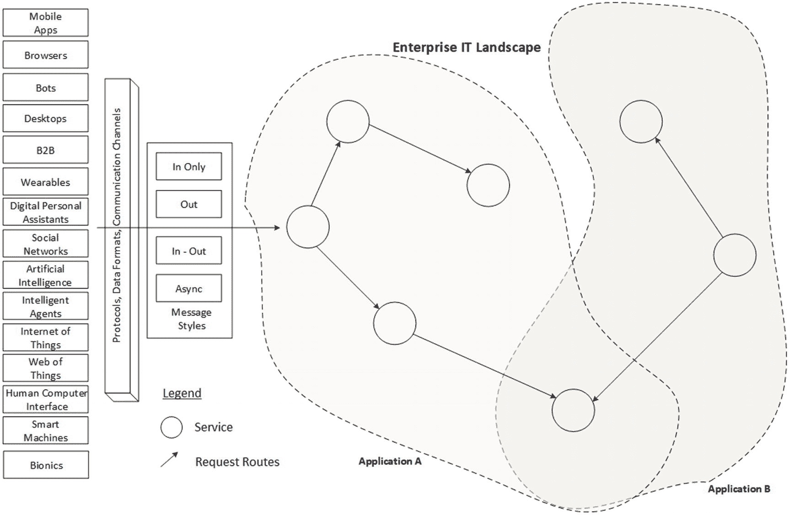

图 4-1.

数字应用上下文

来自数字应用的请求可以通过任何通信媒介（如互联网、微波、蓝牙、电子邮件，甚至传统邮件）传输，并触及企业的网络边界。采用 REST 风格的 JSON 格式数据是流行的数据传输方式，但在物联网和万维网（WoT）的背景下，新的发展正在演进。

### 网格应用与服务架构

Gartner^(³) 对 MASA 架构给出了如下定义：

> *MASA（网格应用与服务架构）是一种多渠道解决方案架构，支持多个用户以多种角色、使用多种设备、通过多种网络进行通信，以访问应用功能。在此架构中，移动应用、Web 应用、桌面应用和物联网应用连接到一个广泛的后端服务网格，共同构成用户所看到的“应用”。MASA 使用户能够在不同渠道间切换时，获得连续且沉浸式的体验。*
> 
> ——Gartner

如图 4-1 所示，当单体服务被微服务取代时，传统的防火墙和路由器也会被智能路由器所取代或增强。这些智能路由器是软件感知且软件定义的。它们可以统称为服务控制网关，所有 API 都通过这一智能层暴露给外部世界。外部世界可以包括数字应用，以及你的应用之外的其他微服务。

图 4-2 展示了包含服务控制网关的 MASA。你还可以看到被分组并命名为“应用 1”和“应用 2”的微服务。虽然应用内的微服务之间可以直接进行内部通信，但对微服务的外部调用始终通过网关进行路由。此外，还存在公共微服务的概念。如果通过网关进行路由，对公共微服务的访问，或对其他应用所拥有的微服务的访问，也可以得到控制。

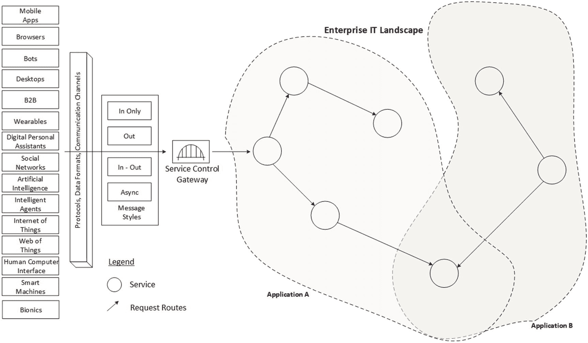

图 4-2.

数字应用上下文

## 微服务的背景

微服务并非一种革命性的新趋势；相反，它是软件计算领域近期趋势背景下的一种演进。甚至在有人首次使用“微服务”这个术语之前，你们中的许多人可能已经在自己的企业中遵循了类似的方法。组件化、面向服务以及 SaaS（软件即服务）都是与微服务具有相似原则的趋势。这些趋势（组件和服务）的微型化与公共云和自动扩展等近期趋势相关联，因此让我们简要探讨一下这一背景，以便更好地理解微服务。

### 服务的粒度

你可以根据服务设计和构建的粒度，将其分为不同的类别。尽管“微服务”一词暗示了“小”，但它相对于其他服务而言的“小”程度通常是相对的。换句话说，大小只是一个指示性特征；下面列出的更明确的特征决定了粒度：

*   敏捷性
*   可部署性
*   选择性可扩展性
*   独立性

为了帮助你理解，你可以将上述所有特征归入一个统称之下，即“云原生性”。见图 4-3。

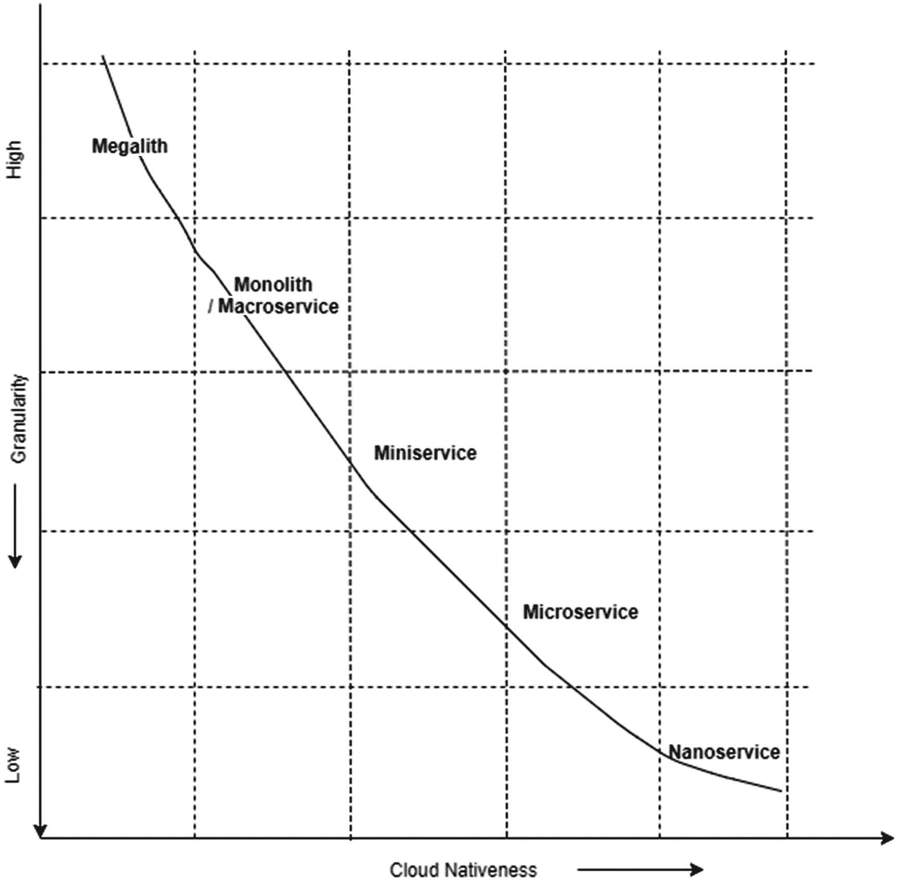

图 4-3.

服务的粒度

如图 4-3 所示，当粒度减小时，云原生性所需的大多数质量特性都会增加。

如果你重新审视单体应用，通过遵循 SOA 的最佳实践，你可以暴露粗粒度或组合服务。这类服务暴露了业务领域的单个能力。通过暴露 SOA 接口，它们支持灵活的企业应用集成，或者我们称之为面向服务的集成。这些服务被归类为“迷你服务”，并且它们通过服务组合促进了服务复用。迷你服务可以被其他迷你服务或客户端层访问。

当我们把单体应用拆分为基于微服务的架构时，服务的范围被限制在一个功能特性上。多个这样的功能特性共同构成一个能力，该能力可以暴露给客户端层。可以配置一个服务网关来暴露迷你服务，而迷你服务又会将调用委托给微服务。

让我们借助一些指示性示例，在不同的分类下审视服务粒度的细微差别。

图 4-4 仅展示了指示性示例。宏服务使用传统的 SOA 设计模式和技术实现，而迷你服务则聚合了与特定领域（即实体或资源）相关的功能。与微服务相比，迷你服务的范围更广，架构约束更宽松，并且可能使用也可能不使用独立的数据。

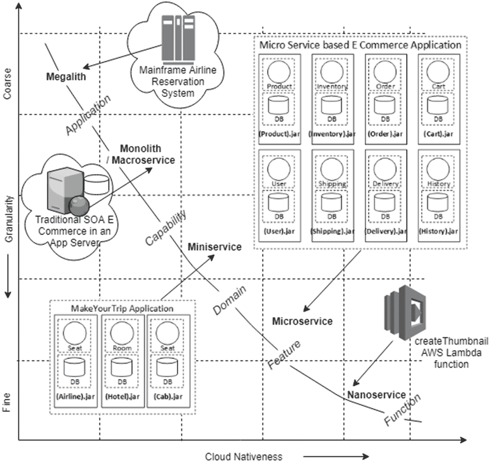

图 4-4.

服务粒度的指示性示例

再次强调，图 4-4 中标注的粒度单位（功能 > 特性 > 领域 > 能力 > 应用）在上述粒度尺度上并非固定不变。你希望将应用架构定位在何处，很大程度上取决于许多因素，例如应用类型和所需的云原生程度。将应用架构稍微向左或向右移动并非关键；相反，你确定架构位置背后的理由是基于约束条件以及随之而来的权衡取舍。如果你没有经验丰富的内部团队，教条式地遵循微服务架构可能是一项高成本、具有破坏性且往往难以预测的工作。我经常看到企业创建的应用更偏向于迷你服务的边界，却称其为微服务。这并非一个重大问题。相反，需要的是清晰理解这些边界中的每一个，然后你才能做出明智的决策，而不是偶然地趋同于某个决策。

### 网关

让我们重新审视电商微服务应用。假设网页正在显示商品详情页，它不仅仅展示商品名称、描述和价格等基本信息，还会显示其他细节，例如：

*   购物车中的商品数量
*   订单历史
*   库存不足警告
*   配送选项
*   各种推荐、评论和优惠

所有这些信息都必须从各自不同的微服务中获取。在单体应用架构中，浏览器只需向应用发起一次 REST 调用（`GET` [`api.acme.com/productdetails/productId`](http://api.acme.com/productdetails/productId)）即可获取这些数据；而在微服务架构下，网页需要分别访问各个微服务。从浏览器直接访问多个微服务存在诸多挑战和限制。即使客户端尝试通过局域网发起如此多的请求，在互联网环境下也可能效率极低，尤其是在移动网络通信时，会面临严重的性能开销。此外，如果所有微服务都没有暴露对 Web 友好的接口（它们并非强制要求这样做），这将是另一个挑战。更进一步，应用的扩展或演进可能需要对现有微服务进行拆分或合并，而这些内部变更应当对公开的 API 进行屏蔽。

API 网关可以在此处发挥作用。面向外部的 API 可以是粗粒度的，能够聚合来自多个内部微服务的响应，并一次性向客户端设备提供聚合后的响应。此外，这类外部 API 还可以根据请求响应的客户端设备类型进行某种形式的转换。这些增值功能可以提供给 API 网关层，从而使其比传统的防火墙或负载均衡器更加智能。

### 以领域为中心的划分

传统上，我们在满足应用的非功能性需求时，一直遵循“一刀切”的方法。这在应用扩展方面尤为明显。单体应用只能对其所有功能或模块边界进行统一扩展，而微服务原则则倡导基于业务领域来定义边界。

如图 4-5 所示，在以技术为中心的方法中，应用的各层或各层级可以整体进行扩展。而在微服务方法中，由于每个微服务的边界是基于业务或功能领域定义的，并且这种边界定义在应用的物理组织中也显而易见，因此可以选择性地对功能或领域进行扩展。这种应对非功能性需求的选择性方法，还提供了针对每个微服务级别定义服务级别协议（如服务正常运行时间等）的灵活性。

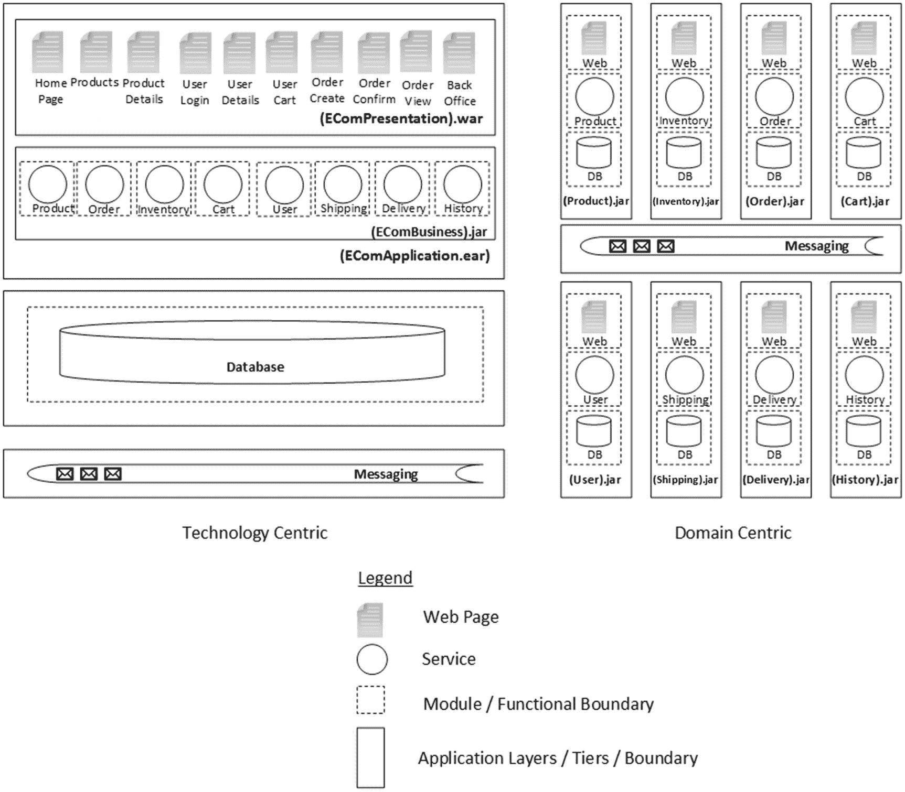

图 4-5. 以技术为中心 vs. 以领域为中心

在这个电商应用场景中，虽然商品、库存、订单和购物车微服务必须全年 365 天、全天候高度可用，以确保业务不中断，但像用户、配送、发货和订单历史等辅助微服务，则可以部署为具有较低可用性 SLA 的服务。这是因为，如果用户微服务宕机，客户仍然可以浏览、添加到购物车，并通过手动输入地址、电子邮件、联系电话以及其他详细信息来确认新订单，而无需检索之前保存的用户资料。稍后，当用户微服务恢复上线时，系统总可以将这个“匿名订单”与系统中已存在的客户资料关联起来。其他模块也存在类似情况，稍后我们重新审视电商应用时，你将详细研究这些情况。

### 云原生转型

长期以来，我们一直依赖专用基础设施来应对不断增长的业务需求，无论是采用横向扩展还是纵向扩展的理念。我们为网络连接添加冗余和更大的管道（InfiniBand），投资于工程系统（Exalogic）以增加计算能力，等等。最近的洞察和事件让企业架构师们睁开了眼睛，他们意识到这些系统存在局限性，并且迟早会受到这些局限性的制约。光纤提供的高吞吐量或内存计算提供的高性能，在图表初始阶段都能提供指数级的性能提升，但随后会达到极限，之后即使添加更多 CPU 或带宽，也只能获得微小的改进。量子计算和类似技术的进步将改变这一局面，但同样，企业无法等到这些技术变得普及且成本合理。

如今，公有云已经可用，其成本具有可比性且合理，甚至可能更便宜。像亚马逊和 Azure 这样的云平台提供商在数据中心配置了商用硬件，可以根据您的需求即时配置。当您的业务面临不可预测的超高速增长或超大规模需求时，云是一种相当正确的方法，既能控制总体成本，又能提供所需的敏捷性。我无意在此介绍云计算或云服务提供商（CSP）的特性，但我确实想讨论一下云原生的含义。

在本地部署模型中，可用性策略和 SLA 管理由数据中心管理员掌控。当您迁移到公有云模型时，这些策略会被转换并抽象到应用栈的更高层级。在 CSP 提供的 IaaS（基础设施即服务）或 PaaS（平台即服务）模型中，您对可用性或存储策略的控制力很弱，因此需要在应用栈层提供更好的控制和工具配置。您的软件层本身应该能够为您提供应对前所未有场景的钩子和控制手段。因此，为了让应用真正受益于 CSP 的优势，应用本身应足够智能，能够从故障、资源不可用、流量突增等情况中恢复。云原生架构阐述了您在构建软件应用以在公有云环境中高效运行时需要采用的模式和最佳实践。

### 网络规模计算

网络规模 IT 适用于任何规模的基础设施设计、部署和管理。利用网络规模 IT 的能力，企业或组织可以实现大规模扩展。在涉及网络规模 IT 时，IT 原则和实践是优先考虑的；当然，云、微服务和 DevOps 实践需要特别提及。像谷歌、亚马逊、Facebook 和 Netflix 这样的公司在此值得一提，因为仅凭其业务性质，它们的 IT 系统和实践就属于这一类别。分布式一切、容错、自愈和 API 驱动的方法只是围绕网络规模计算的几个原则。

## 不可或缺的云

云旨在以相对较低的成本，以自主的方式提供分布式计算、存储和网络基础设施。基于云的架构可以基于多种模型（即 IaaS、PaaS 和 SaaS），合适的配置可以为客户带来灵活的环境。在云中，客户可以使用云的 API 按需且近乎实时地分配资源。

### 云架构模型

业界将云架构划分为四个层次：

*   **硬件层**：硬件层包含云的物理资源，例如 CPU、磁盘和网络。

*   **基础设施即服务**：IaaS 层利用虚拟化技术抽象物理资源，从而创建一个计算资源池，并将其作为集成资源暴露给上层和最终用户。按需资源分配等功能在此层实现。

*   **平台即服务**：PaaS 层除了提供底层 IaaS 所提供的运行环境外，还提供应用程序开发工具和部署环境，旨在最大限度地减少将应用程序直接部署到虚拟机中的负担。关系型和非关系型存储、消息队列以及邮件服务器是通过封装合适的框架在此层提供的典型服务。

*   **软件即服务**：位于最顶层的是 SaaS 模型，它可以托管企业定制的最终用户应用程序或租用的第三方软件，以网络服务的形式提供，从而免去企业管理与维护云各架构层的烦恼。

图 4-6 展示了云架构的各层。通过按需自动扩展以实现更好的性能和可用性，这使得云应用程序优于部署在本地环境中的应用程序。

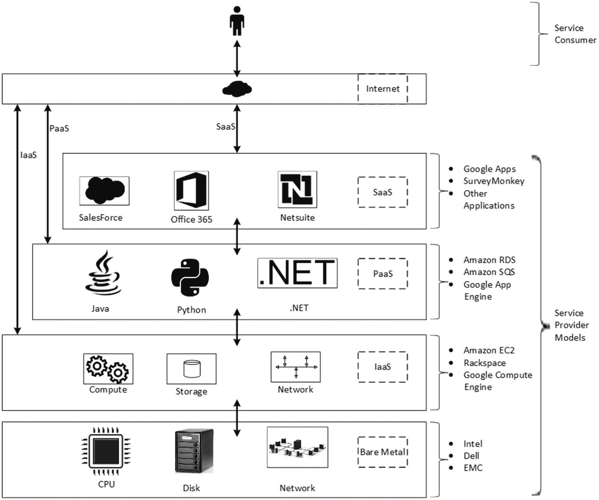

图 4-6.

云架构组件

### 云服务模型

云服务模型基于用户对资源使用方式可能拥有的控制程度。图 4-7 展示了不同的模型。

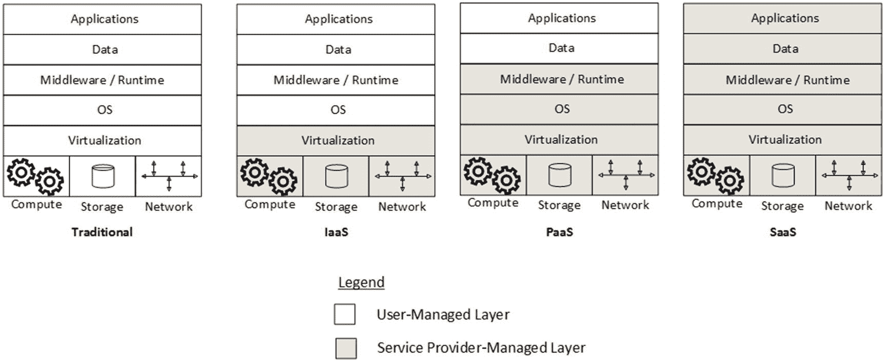

图 4-7.

云服务模型

通常，云架构本身可以映射到云服务模型。在传统服务模型中，用户或企业自身负责管理整个技术栈（例如，硬件、数据中心设施、软件和数据），而在云服务模型中，情况则有所不同，具体如下：

*   **基础设施即服务**：在 IaaS 服务模型中，用户仅请求计算能力、存储、网络及其相关资源，并按使用量付费。

*   **平台即服务**：在 PaaS 模型中，用户对底层基础设施（如 CPU、网络和存储）完全没有控制权，因为这些资源在平台层之下被抽象化了。相反，它提供了应用程序开发平台，允许使用支持的编程语言和相关工具创建应用程序，这些工具托管在云中，并通过接口（主要是浏览器）进行访问。很多时候，应用程序运行时和中间件也由云服务提供商提供，用户仅负责开发、安装、管理和操作软件应用程序及其数据。

*   **软件即服务**：这是一种“无需操心一切”的模型，用户甚至不拥有、管理或操作应用程序。应用程序在云基础设施上运行，并可从各种客户端设备访问。提供有限的用户配置。有时，同一个应用程序实例服务于多个企业（租户）的最终用户；这类应用程序被称为多租户应用程序。

### SaaS 成熟度模型

SaaS 成熟度模型是微软在十多年前提出的^(⁴)，此后，在我与架构师的讨论中，我曾多次提及这一信息。我将在此重复说明，因为当我们后续将其映射到微服务如何针对不同级别进行扩展时，理解这一点是必不可少的。图 4-8 描绘了 SaaS 成熟度的不同级别。此处使用术语“租户”来指代为其托管应用程序的企业；最终用户从这些托管的应用程序实例访问服务。因此，两家不同的航空公司或两家不同的电子商务企业就是两个不同的租户。SaaS 成熟度的不同级别如下：

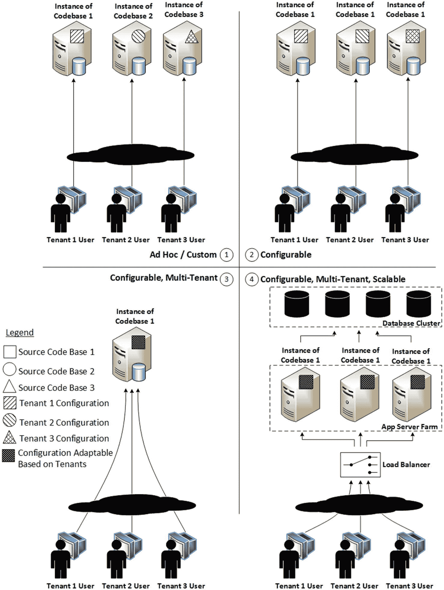

图 4-8.

SaaS 成熟度模型

*   **级别 1 – 临时/定制**：在此 SaaS 成熟度级别，每个企业或租户都拥有自己定制开发的应用程序。这些应用程序的源代码各不相同，并且为每个租户在本地或公有云中托管独立的应用程序实例。

*   **级别 2 – 可配置**：在此 SaaS 成熟度级别，只有一个代码库。该代码库可为每个租户单独配置，并且为每个租户在本地或公有云中托管独立的应用程序实例。

*   **级别 3 – 可配置、高效多租户**：在此 SaaS 成熟度级别，只有一个代码库。该单一代码库的单个实例在本地或公有云中托管，服务于所有租户的最终用户。在实例化应用程序时进行的代码配置，使得运行时特性（如功能、特性和外观）能够在一定程度上根据每个租户的意愿进行“适配”。通过采用合适的架构级分区，每个客户的数据与其他客户的数据保持隔离。但这里的限制是，如果租户数量或最终用户数量超过某个限制，则难以扩展。通过分区可以在一定程度上管理可扩展性，但超过一定程度后，应用程序只能通过迁移到更强大的服务器（垂直扩展）来扩展，直到收益递减使得无法以经济高效的方式增加更多性能为止。

*   **级别 4 – 可配置、高效多租户且可扩展**：在 SaaS 成熟度级别 4 中，在级别 3 的基础上增加了水平扩展的能力。可以水平添加多个应用服务器和数据库服务器实例，负载均衡路由器可以以轮询或平均分配的方式，将来自多个租户用户的负载分发到一组服务器实例池中。虽然使用应用服务器集群在应用服务器层进行水平扩展很简单，但在数据库层进行扩展则不那么直接，因为它需要一个数据库集群，而不仅仅是简单的服务器集群。稍后当你研究数据的“写入可扩展性”时，你将了解更多相关内容。

### 虚拟化

虚拟化是一个提供抽象机器的过程，该抽象机器使用针对抽象机器的设备驱动程序，以提供硬件的虚拟副本。类型 1 的虚拟机监控程序^(⁵)运行在裸机上，大多数中端到高端微处理器都可以被虚拟化。像 Intel 的 Xeon 这样的服务器处理器和 Arm Cortex-A 系列这样的应用处理器都是具有相同能力的硬件。虚拟化后，虚拟机将运行任何可在裸机硬件上运行的软件，同时提供与真实硬件的隔离。见图 4-9。

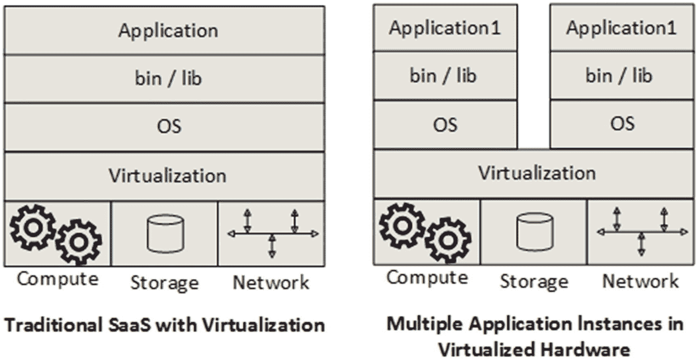

图 4-9.

基于抽象硬件的 SaaS

通过虚拟化技术，可以在单个硬件上有效地运行多个应用程序的实例或同一应用程序的多个实例。

### 虚拟化服务器 vs. 容器

容器提供了一种隔离应用程序的方式，并为应用程序的运行提供了一个虚拟平台。容器系统需要一个底层操作系统，该操作系统利用虚拟内存支持实现隔离，为所有容器化应用程序提供基础服务。这在虚拟化部分的图 4-10 中有所展示。虚拟机则拥有自己的操作系统，并利用硬件虚拟机支持。容器的开销相对低于虚拟机，容器系统通常针对运行成百上千个容器的环境。当需要在多台服务器上运行多个应用程序时，虚拟化可能是最佳选择；而如果需要运行单个应用程序的多个副本，容器则具有显著优势。我们来探讨一下这背后的原理。虚拟机为每个新虚拟机打包了虚拟硬件、内核（即操作系统）和用户空间。这提供了跨应用程序所需级别的隔离，如果它们是不同的应用程序，这通常是可取的，以便安全、数据和资源等关注点彼此完全隔离。

在 Linux 操作系统的语境下理解容器相当容易。Linux 内核有一个名为 cgroups 的功能。cgroups 限制、核算、优先处理并隔离操作系统进程的资源使用（计算、内存、磁盘 I/O、网络等），从而提供了所谓的“操作系统级虚拟化”。基于容器的虚拟化相对轻量（与传统虚拟机相比），几乎不增加开销，共享相同的操作系统内核，并且不需要特殊的硬件支持即可高效运行。所有这些都为容器定义一种新的软件应用封装模型铺平了道路，使它们能够在共享操作系统上隔离运行。不同的 Linux/Unix 发行版使用不同的机制来实现操作系统级虚拟化。例如，FreeBSD 有“jails”的概念，而 Solaris 有“zones”的概念。由于容器用于隔离内核的技术是 Linux 特有的，因此容器只能在基于 Linux 的操作系统上运行。

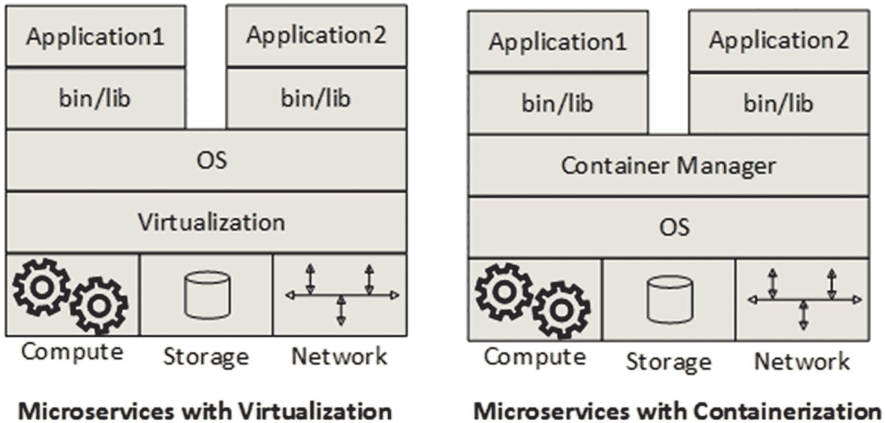

图 4-10.

虚拟化 vs. 容器

图 4-10 展示了资源在容器系统中是如何共享的。当你在同一台主机上使用相同的镜像启动两个（或更多）容器时，基础镜像的全部内容将被共享。相反，如果你使用不同的镜像启动多个容器，这些镜像可能会也可能不会共享一些公共层（bin、lib 等），这取决于镜像的每一层是如何构建的。

因此，对于每个虚拟机，整个组件栈都在运行，从操作系统到应用服务器和虚拟硬件（包括网络组件、CPU 和内存）都被模拟出来。然而，容器作为完全隔离的沙箱运行，每个容器仅包含操作系统所需的最小内核。底层系统的系统资源被容器共享，因此占用空间减小，这意味着在相同的硬件上，可以运行的容器数量远多于虚拟机。以这种方式共享资源将减少总体占用空间，这也有助于缩短启动容器实例所需的时间，相比于在虚拟机系统中实例化相同的应用程序。这就是容器的相关性所在，尤其是在需要即时自动扩展的云原生环境中。见图 4-11。

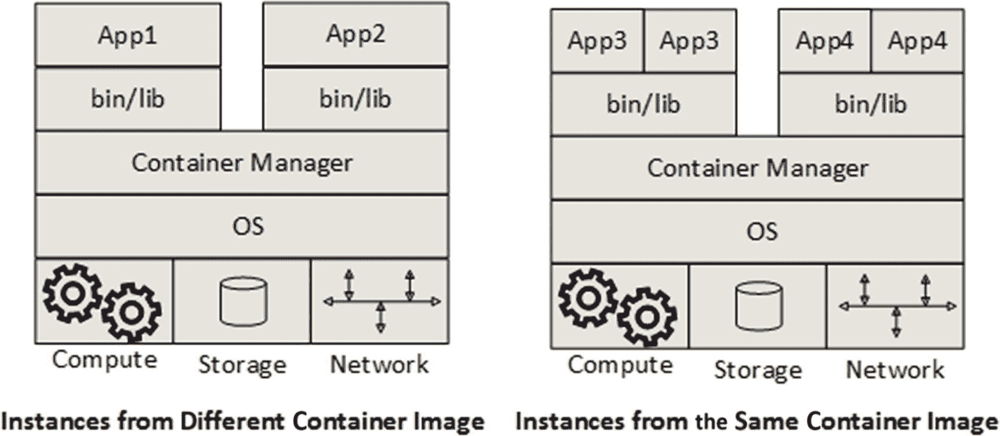

图 4-11.

容器实例共享资源

Docker，现在基于 Linux libcontainer，是一个用于在 Linux 平台上创建、管理和监控容器的管理系统。Docker 帮助在笔记本电脑上打包应用程序，然后该应用程序可以不加修改地在任何公有云、私有云甚至裸机上运行，遵循“一次构建，随处运行”的原则。与基于 VMWare 或 Hyper-V 等虚拟机监控程序的虚拟化相比，其基础设施占用空间最小。

Red Hat 青睐 Ansible，这是另一个容器管理系统。Kubernetes 是另一个用于自动化部署、扩展和管理容器化应用程序的开源系统。

Docker 是最流行的容器提供系统。由于它只能运行在基于 Linux 的操作系统上，如果你必须在 Windows 或 Mac 机器上设置 Docker，你首先需要使用 VirtualBox 启动一个 Linux 虚拟机，然后在这个虚拟机内部运行 Docker 容器。

当你从传统的基于单体架构的 SaaS 迁移到基于微服务的 SaaS 时，另一个特点是，像 Oracle Weblogic 或 IBM Websphere 这类所谓的重量级中间件将被相对轻量的运行时（如 Tomcat 或 Jetty）所取代。将这些运行时配置为在 Java 进程内嵌入运行也很常见，以便总体占用空间最小化。

## 微服务架构

微服务架构（MSA）可以定义为一种设计软件应用程序的方式，旨在实现交付的敏捷性、部署的灵活性和扩展的精确性。它有许多相关的好处，也有一系列你必须处理的复杂性。在本节中，让我们看看其中的一些以及与之相关的更宏观的图景。

### 架构反转

在 MSA 中，应用程序由小型、独立可部署的进程组成，这些进程使用与平台和编程语言无关的 API 和协议相互通信。每个进程托管着暴露紧密相关业务能力的应用程序组件。许多这样的进程为企业应用程序暴露了许多这样的能力。因此，在 MSA 中，单个能力、单个进程或单个微服务本身可能不足以代表任何规模可观的企业应用程序。

在单体架构中，是一个单一的（主）进程托管整个应用程序包。因此，单体应用程序中以下所有或大部分关注点都包含在单个进程空间内：

*   服务依赖管理
*   服务配置管理
*   服务检测
*   服务 SLA
*   服务管理与监控

在 MSA 中，由于有许多进程相互通信，与单体架构的情况不同，上述所有或大部分关注点并不仅限于单个进程。它们需要为所有这些协调进程处理，这意味着额外的进程复杂性。这是微服务的下一个最显著的特征，即早期单体架构中单个进程的内部关注点现在被外化到许多微服务的外部。这被称为“架构反转”（IoA）。

### 内部架构视角

由于微服务是独立、自治且自包含的软件包，可部署到各自的进程空间中，因此它们在自身架构上必须是完整的。图 4-5 展示了微服务拥有自己的表示层、业务层和数据组件，同时也拥有自己的消息传递基础设施。因此，在关注点分离、分层和面向接口设计方面，所有或大部分架构关注点仍然存在，并且应在每个微服务的架构中加以处理；这就是微服务的“内部架构”。

Gartner 提供了四个示例来解释微服务的内部架构：

*   **简单/可扩展**
*   **复杂/可扩展**
*   **外部化持久化**
*   **命令查询职责分离**

图 4-12 以示意图形式展示了这些示例场景。让我们通过合适的类比来介绍这些示例场景，以便清晰理解概念，并了解可用的选项及其涉及的复杂性。

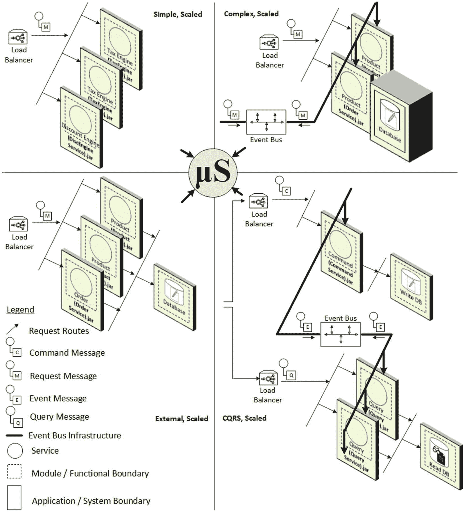

图 4-12.

微服务内部架构示例

*   **简单/可扩展**：这些微服务是无状态的，不需要持久化服务。它们用于执行计算密集型任务。图 4-12 将税务计算、折扣计算或优惠计算作为此类微服务的示例，其计算基于传递给微服务 API 的参数进行。

*   **复杂/可扩展**：在此示例中，持久化服务是微服务的一个组成部分。进行扩展时，可以实例化微服务的多个实例，并且所有这些实例都必须从同一个持久化服务获取数据。这意味着，如果任何实例修改了数据，则变更后的数据也必须传播到其他实例，而实现这一目标的最佳方式是通过发送事件。为了增强可扩展性，服务是无状态的，这样请求可以路由到任何实例，而不管来自同一客户端的上一个请求被路由到了哪个实例。

*   **外部化持久化**：这种中间方法确实使用了持久化服务，但它位于微服务外部。即使是成熟度较高的单体架构也会使用类似的架构。在这里，持久化的数据被限定并隔离在拥有它的微服务范围内，因此它也可以像复杂/可扩展拓扑一样进行部署。

*   **命令查询职责分离 (CQRS)**：该系统用于实现高吞吐量。它是复杂/可扩展或外部化持久化方案的扩展，但主要区别在于数据持久化的写入和读取部分被分离了。可以实例化无限数量的微服务实例来处理读取部分，从而实现最高程度的吞吐量。但在写入部分，状态变更必须传播到读取部分的其他实例，而实现这一目标的最佳方式同样是发送事件。

在后续章节介绍实际运行的电子商务应用时，我将再次回顾内部架构。为简洁起见，我将使用一种简单的表示法来区分内部架构和外部架构，如图 4-13 所示。在后续讨论中，我们将沿用这种表示法。

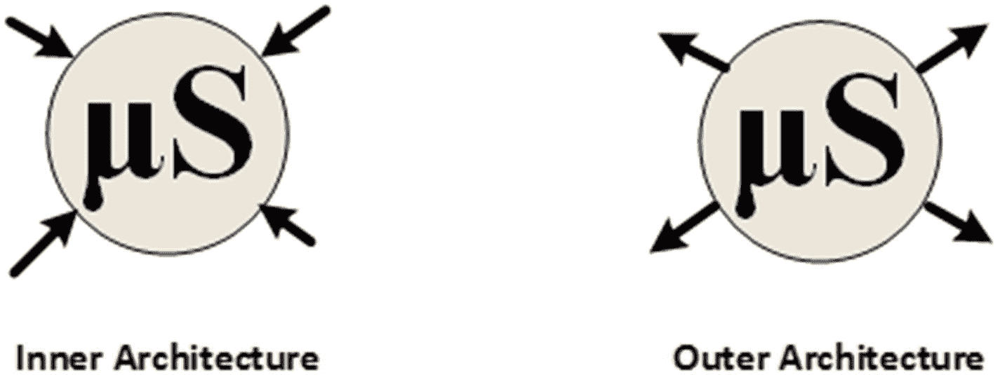

图 4-13.

微服务架构表示法

### 外部架构视角

我提到过，由于架构反转，许多过去在单体内部架构层面解决的问题，现在已成为外部架构的关注点。图 4-14 试图以示意图形式展示我们在微服务外部架构层面需要处理的关注点。微服务之间相互交互，这种进程空间之间的频繁通信增加了整体复杂性。容错、优雅重试和备用代码执行等关注点只是其中的一部分，这要求在微服务的外部架构层面进行强有力的管理、监控和控制。目标是在微服务架构中实现交付的敏捷性、部署的灵活性和扩展的精确性。为此，必须处理一系列新的关注点，这使得微服务的复杂性相比单体架构成倍增加。

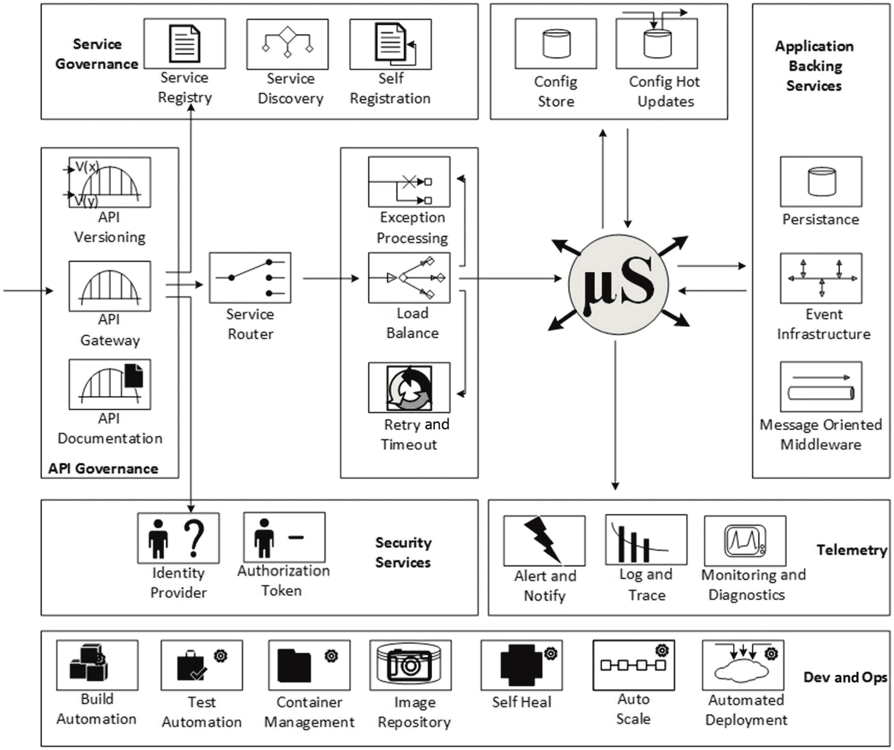

图 4-14.

微服务外部架构

在单体架构中，可以通过单个控制器轻松控制安全性；而在微服务架构中，由于分布在网络中的许多服务需要相互通信以提供完整的业务能力，安全性是分散的，必须在每个微服务级别进行控制。端到端的日志记录和追踪是另一个方面，其在微服务架构中的重要性成倍增加，因为一个调用图可能跨越多个微服务。为了支持微服务实例的无缝添加和退役，需要动态服务注册和发现。同样，自动扩展和自动部署是新的 DevOps 关注点，旨在使微服务实现云原生和网络规模。

### MASA 全景图

在讨论了微服务的内部架构和外部架构关注点之间的区别之后，现在是时候看看全景图了。

图 4-15 结合了微服务的内部架构和外部架构，提供了典型网格应用和服务架构的视图。微服务利用外部架构提供的功能与其环境及其他微服务进行交互，而每个微服务选择性扩展的能力则是通过其内部架构组织来构建和管理的。

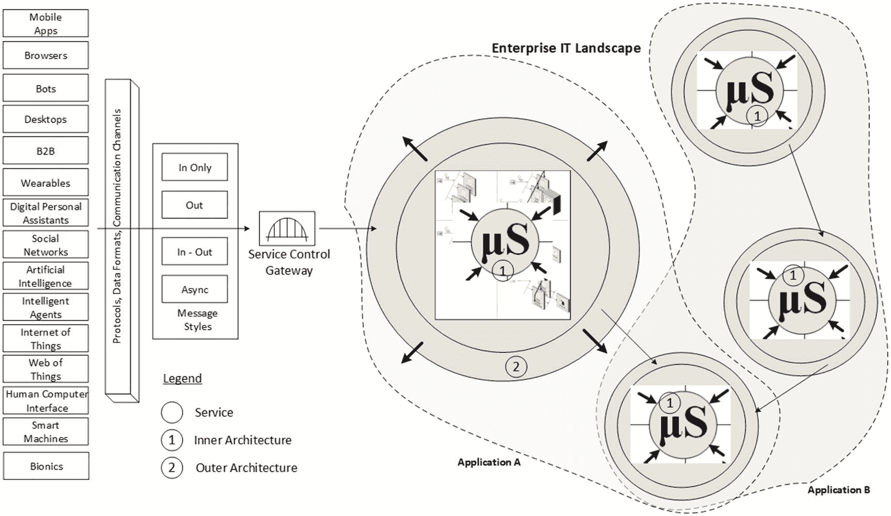

图 4-15.

微服务外部架构

图 4-15 只展示了少数几个微服务。对于任何规模可观的企业应用而言，情况并非如此。微服务的数量可能从十几个起步，达到数百个之多。与“微服务”这个名称给人的印象不同，微服务并不简单。它们比传统的单体架构复杂得多，实际上包含了单体架构的所有复杂性。因此，采用微服务的决策需要谨慎做出。如果企业的开发团队没有经验丰富的指导者，微服务就不是一个可选方案。当你阅读本书时，情况正在发生变化，因为工具供应商和云服务提供商正在推出新的产品；一旦这些产品成熟，它们应该能为开发者隐藏许多外部架构的复杂性。

## 摘要

在本章中，你了解了推动微服务演进的各种力量。连接人类与物理事物的数字应用，使得这种演进成为必然。架构反转是这种演进的正常结果，软件领域的整体复杂性已成倍增加，如今在微服务外部可见，并且必须在微服务之间进行显式管理。虽然采用微服务的冲动很诱人，但在任何此类尝试之前，必须进行定量的成本效益分析。一旦做出决定，下一个最重要的方面就是思考微服务的内部架构组织。虽然外部架构的关注点在不同上下文和场景中大致相同，但你的内部架构可以通过不同的权衡来设计。你将在第 5 章中更详细地探讨这一点。

脚注 1   2   3

