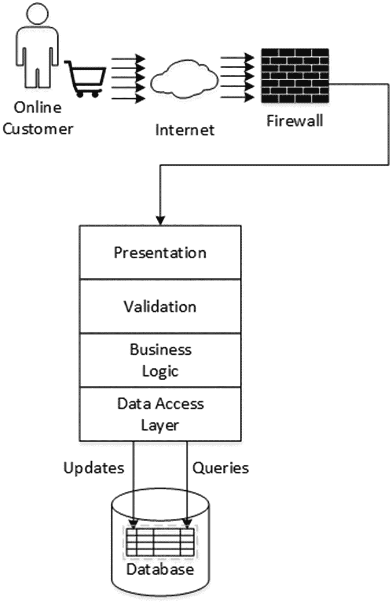
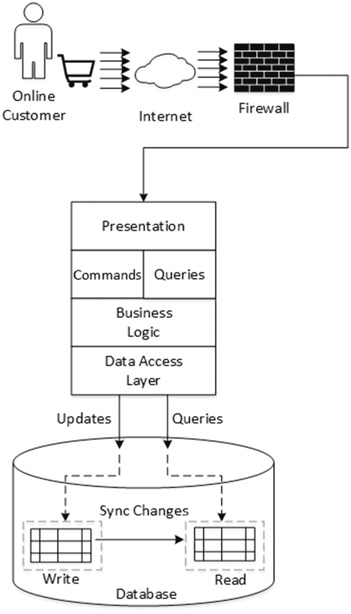
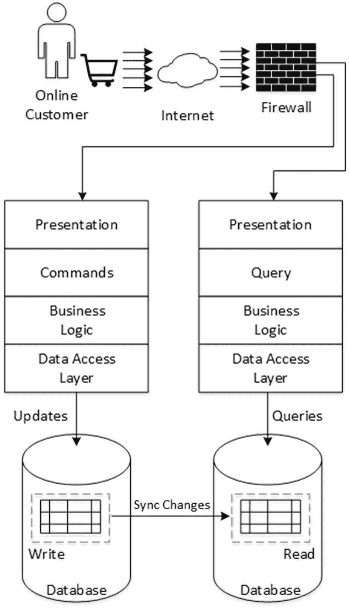
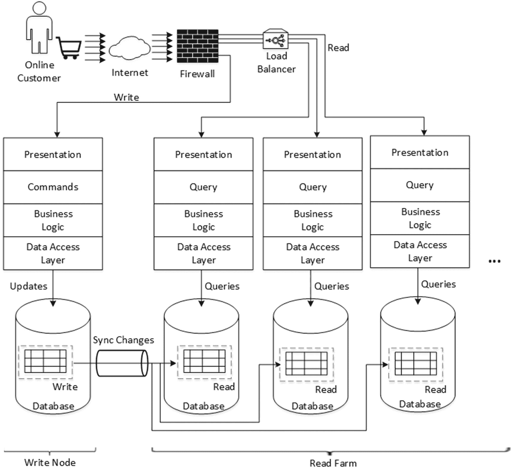
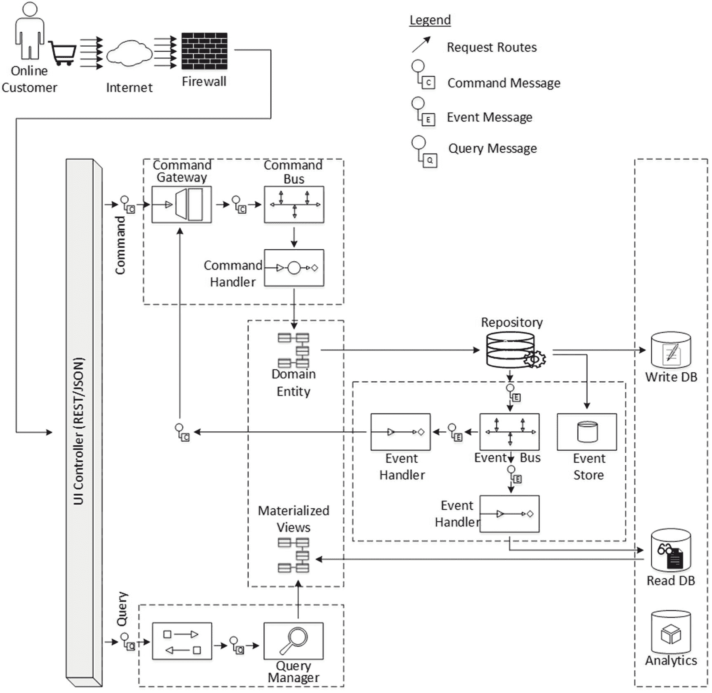
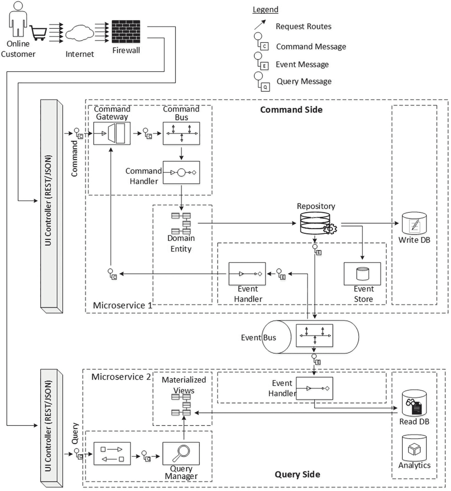
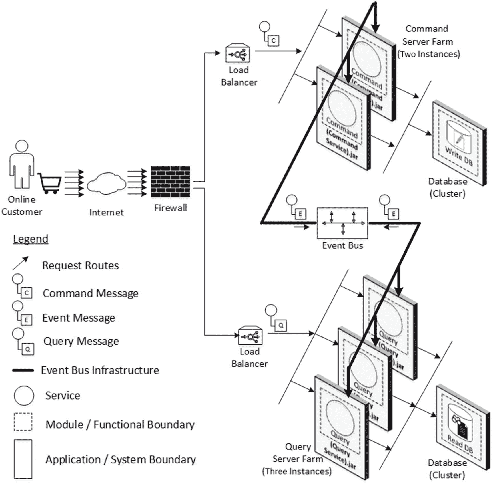

# 5. 微服务的基本模式

软件架构相对容易理解，尤其是在有足够相关文档的情况下。当你开始实现它们来解决实际问题时，困难才会显现。这时，架构模式将为你提供帮助。如果你理解当前的问题，并且能够合理地将此问题与你已解决过的类似场景联系起来，那么遵循你之前采用过的类似方法就相当容易。架构和设计模式帮助你选择和采用针对性质相似问题的解决方案。模式是对特定上下文中反复出现的同类问题的可复用解决方案。

在讨论了将单体应用拆分为多个微服务的必要性之后，现在让我们务实地审视任何应用架构师在设计可扩展应用时都会面临的一个主要问题：独立扩展任何应用的写入和读取集群。你将在本章中详细探讨这一方面。在此过程中，你还会探索一个强大的模式，通过采用其各种变体，该模式将有助于解决微服务架构的许多问题。

本章中你将深入探讨的概念如下：

*   独立扩展架构的读写事务能力的必要性

*   CQRS 模式

*   CQRS 模式的元模型以及将在本书后续章节中解释的更多示例场景

## 服务的正交扩展

如果我们抛开微服务架构背后的其他理由，一个主要需求是在单个应用中有选择地扩展组件或服务。你知道，在单体应用中，几乎不可能轻松拆分组件或服务，然后以选定的可扩展性程度进行部署；然而，这是我们在采用微服务架构时获得的一个主要优势。在前面的章节中，我讨论了与所需订单微服务实例数量相比，需要实例化更多数量的产品目录和产品详情微服务。类似的需求也适用于异构地处理应用领域状态变更和状态视图的事务扩展，所以让我们尝试详细理解这一点。

### 写入事务与读取事务

任何通过 B2B 或 B2C 渠道，或者通过物联网或可穿戴设备渠道发起的事务，通常都属于以下两类事务之一：

*   **写入事务**：写入事务通常会改变应用中实体的状态。电子商务结账、信用卡支付和航班座位确认是写入事务的典型例子，因为它们都会改变实体的状态，这些状态通常保存在服务器端内存中，并且在许多情况下，状态变更也会反映在底层持久化存储以及应用与之交互的任何其他 B2B 接口中。通常，写入事务是非幂等的^(⁶)，除非经过特殊设计使其行为不同。这意味着，一个信用卡支付事务，如果本意是只执行一次，但由于某种原因被执行了两次（执行一次并重放一次），并且这两次事务都成功了，那么支付将被处理两次，这可能不是期望的结果。

*   **读取事务**：读取事务通常查询实体的现有状态，无论是用于查看目的、缓存目的，还是作为另一个包含性写入事务的一部分以辅助决策步骤。无论哪种情况，典型的读取事务都是幂等的。它不会改变服务器端内存或底层持久化存储中实体的实际状态。重复的读取事务可能会创建或更新某些相关实体的状态，例如相应的审计或日志实体；然而，通常情况下，如果由于某种原因它被执行了两次（执行一次并重放一次或多次），并且所有这些事务都成功了，那么事务中涉及的主要实体的状态不会有任何明显变化。

### 浏览-预订挑战

我假设阅读本书的各位都已经进行过在线交易，尤其是在电子商务应用中。如果是这样，你就能理解，在你实际确认第一个写入事务（即创建订单）之前，需要经历多个步骤，浏览网页、填写表单等等。为了更清楚地说明，如果你在线购买一些零售商品，比如电子产品，你会遵循以下步骤：

1.  输入首页的 URL。

2.  浏览产品类别并选择感兴趣的产品。

3.  检索产品详情，包括评论、内容和媒体。

4.  决定购买该商品，将其添加到购物车，并填写支付信息。

5.  点击确认购买。

如果你检查上面列出的最少步骤，你可以将最后一个事务（即实际的确认购买事务）与其他事务区分开来。确认购买事务可以归入写入事务类别，而上面列出的大多数其他先前事务则属于读取事务类别。

### 注意

每执行一次写入事务，你都会执行更多次的读取事务。

在经典的航班座位预订场景中，每个已预订的 PNR 的读写比例大约在 500 甚至 1,000 或更多。这被称为“浏览-预订比”。当我们说平均浏览-预订比为 1,000 时，这意味着每为一个新预订创建的 PNR 执行一次写入（预订）事务，就应该已经有 1,000 次或更多的读取（浏览）事务命中了应用。在旺季或一周内促销活动的高峰时段，这个数字对于单次预订来说可能会上升到数千的量级！正是在这种背景下，微服务的选择性扩展能力才显得重要。

## CQRS：命令查询职责分离

如果我们设计的微服务具备选择性扩展的能力，那么这将是微服务架构的优势之一。在第 4 章的“内部架构视角”部分，我讨论了设计微服务架构时可达到的不同成熟度级别。我在那里介绍了 CQRS（命令查询职责分离）模式，因此让我们从架构和设计层面深入了解其细节。在本书的后续部分，你将看到许多示例，甚至是一个使用该模式实现的完整应用程序。

### 传统软件系统与基于 CQRS 的软件系统

在传统单体系统中，写入（更新实体）和读取（请求查看实体）操作都是针对单个数据仓库中的同一组实体执行的。通常，这些实体是关系型数据库（如 MySQL 或 PostgreSQL）中一个或多个表的部分行。图 5-1 展示了这种设计。

图 5-1

读写事务使用相同的模式

通常，在这类单体系统中，所有 CRUD（创建、读取、更新和删除）操作都应用于实体的同一物理表示。在 Java 中，表示内存实例的数据传输对象（DTO）由数据访问层（DAL）从数据存储中检索，并在客户端设备的浏览器上呈现。用户可以查看此表示，然后更新 DTO 的选定字段（可能通过遵循 MVC 或 MVVM 风格的数据绑定），然后 DTO 通过软件层传输并由 DAL 保存回数据存储。很多时候，同一个 DTO 可以同时用于读取和写入操作，如图所示。

尽管这种设计简单直接，并且你已经愉快地遵循多年，但它存在一些局限性：

*   写入和读取操作所需的实体表示可能与上层期望的不一致，因此可能存在不匹配。
*   即使允许并发读取，但如果正在进行写入，则必须根据应用程序期望的数据隔离规则来控制进一步的读取（更不用说另一个并发写入操作）。这需要同步和锁定，从而限制了应用程序的可扩展性。

在 CQRS 模式中，读取数据的操作与更新数据的操作通过不同的接口进行分离。这意味着用于查询实体和更新实体的数据模型也可能不同，尽管这不是绝对要求。

如果你决定分离数据模型，你还可以考虑将它们分离到各自的模式中。无论你是将读取和写入分离到不同的数据模型还是不同的模式，你还需要解决如何将写入模型中发生的任何更改复制回读取模型的问题。

如果写入模型和读取模型是分离的，那么通常很容易将读取部分扩展到多个副本，因为它们只是单个写入模型的副本或视图。这将帮助你扩展读取模型，以处理前面讨论的高查询预订比场景。在大多数情况下，与读取模型相比，写入模型的可扩展性需求是可控的。这意味着你可能不希望将写入模型扩展到与读取模型相同的程度。然而，出于备份、冗余等原因，写入模型也可能希望扩展到多个，这将在后面讨论。

所有这些都意味着，对于实体的读取和写入操作，你拥有独立的数据模型以及数据模式。再次记住，这两个模型或模式是同一实体所需的两个方面；就像你照镜子时，镜中你的脸像类似于读取模型，而你真实的脸类似于写入模型。如果你扇自己一巴掌，你会感到疼痛，而你的镜像只能“看到”疼痛，它无法“感受”疼痛，因为它类似于读取模型。让我们将这一改进引入图 5-1 的设计中；见图 5-2。

图 5-2

读写事务使用独立的模式

如前所述，读取存储可以是写入存储的只读副本，并且读取和写入存储可能具有完全不同的数据结构。一旦你在读取和写入存储之间实现了这种分离，就必须进行从写入存储到读取存储的变更同步。

一旦你将数据存储的写入部分与读取部分分离，无论这些读取和写入存储物理上位于同一节点还是两个不同节点，都必须进行同步。因此，一旦同步机制到位，下一个自然的想法就是将读取和写入计算分离到它们自己的独立节点或进程中，如图 5-3 所示。

图 5-3

读写事务使用独立的数据库节点

当你将读取和写入服务分离到不同的物理节点时，实际上你就抓住了“扩展”这一额外杠杆，通过实例化更多的读取服务并保持单个写入服务实例，来解决前面提到的高查询预订比问题。见图 5-4。

图 5-4

使用独立的读取和写入进程进行扩展

### CQRS 中的术语

CQRS 基于两个概念：命令和事件。命令和事件解释如下：

*   **命令**：改变实体状态的意图被建模为命令。
*   **事件**：一旦实体状态发生变化，事件表示发生了什么变化。

参考图 5-3，从客户端到表示层的写入事务由命令表示，这些命令将封装实现状态更改所需的所有信息。任何此类状态更改都会导致对数据持久化存储的相应写入。由于这种状态更改的动作或效果，应用程序中其他地方的组件或服务可能对更改的内容感兴趣，并且应该有一种机制将这些更改传播给那些感兴趣的服务。在这种情况下，事件就派上了用场。因此，如果写入数据实体的状态发生了更改，则可以以事件的形式将其传播给对应的读取数据实体。

## 基于事件的 CQRS 架构

之前我讨论了每当写模型发生变化时，同步读模型的必要性。这是将单一模型拆分为写模型和读模型后产生的副作用。当我们意识到大多数企业应用对于同一实体拥有不止一个视图，或者不止一个读模型时，情况会变得更糟。读存储和写存储可能具有完全不同的结构；多个读存储或读模型也会有不同的数据结构，因此使用读存储的多个只读副本可以显著提高查询性能和应用程序 UI 的响应速度。这其中还有更多复杂性，接下来让我们深入探讨这些方面。

### 基于事件的 CQRS 设计元模型

本书开始时，你了解了应用架构的单体模型，随后又接触了微服务。你还看到了随之增加的复杂性，尤其是在微服务之间的外部架构中。在本章中，你将进入下一个层次，将最精细的单一实体——微服务——拆分为多个，以满足可扩展性需求以及多视图的需求。先打个预防针，事情不会变得简单，现在让我们来讨论这些细节。

基于前几章和本章前几节所获得的知识，让我们列出 CQRS 架构的一些复杂性：

*   如果一个实体被拆分并以多个形式表示，则必须保持同步。
*   实体及其视图需要具备选择性扩展能力。
*   实体及其视图未来可能会有更多的交互方和关注方。

还有其他需求；不过，对于我们的讨论而言，以上列表已经足够。

让我们构思一个元模型来解决这里列出的问题。图 5-5 展示了这样一个模型。

图 5-5

基于 CQRS 架构的元模型

这个元模型借鉴了名为 Axon 的 CQRS 框架中实现的概念，Axon 是本书示例中将使用的开源 CQRS 框架，其细节将在后面介绍。让我们从概念层面看看模型中抽象出的主要组件；理解本章内容并不需要了解 Axon 框架的详细工作原理。

*   **控制器**：控制器通常是一个 UI 控制器，它拦截来自客户端的写事务和读事务。
*   **命令**：改变实体状态的意图被建模为命令。控制器根据客户端的写请求创建并发出命令。
*   **命令网关**：命令网关是一个便捷的接口，允许你选择命令分发机制，特别是通过采用同步或异步方式。
*   **命令处理器**：命令处理器响应特定类型的命令，并根据命令内容执行业务规则和逻辑。它检索领域实体并对其施加状态变更。
*   **领域实体**：领域实体是聚合实体，被建模以表示感兴趣领域中组件的状态。当聚合的状态发生变化时，会导致领域事件的生成。
*   **仓库**：当提供聚合实体的唯一标识符时，仓库负责查找聚合实例并提供对聚合的访问。仓库可以存储聚合本身的状态，在这种情况下它可以利用数据库等持久化存储；或者，它可以使用事件存储，通过之前记住的所有中间状态，将实体的状态恢复到历史中的任意时间点。
*   **事件存储**：事件存储通常存储应用于实体的变更。通过重放这些变更，可以将实体的状态恢复到历史中的任意时间点。事件存储也可以利用数据库来存储状态变更的审计轨迹。
*   **事件**：一旦实体的状态发生变化，事件就表示发生了什么变化。
*   **事件总线**：事件总线是生成的事件的通道。它们通常由消息主题支持，以便你在此通道上获得发布-订阅语义。
*   **事件处理器**：事件处理器接收事件并进行处理。多个事件处理器可以订阅特定的事件类型。一些处理器可能会更新用于查询的数据源或物化视图，而另一些处理器可能会向外部接口发送消息。事件处理器也可能创建新的命令。
*   **查询**：控制器将读事务路由到查询管理器，查询管理器随后在实体的特定物化视图上执行查询。

图 5-5 展示了一个基于 CQRS 架构的元模型，该模型利用了前面描述的全部或许多角色。所展示的 CQRS 元模型还解决了架构中的一些偶发情况，列举如下：

*   **命令-事件-命令循环**：当聚合的状态因命令而改变时，会导致领域事件的生成。这些事件表示发生了什么变化，并被注入到事件总线中。感兴趣的事件处理器消费事件并进行相应处理。在某些情况下，事件处理会创建新的命令，并且该循环可能会重复。
*   **事件总线** 暴露了发布-订阅语义，因此可以在不侵入现有组件的情况下，将更多的事件处理器附加到现有架构中。这为应用程序未来的可扩展性提供了支持。

需要注意的是，基于 CQRS 的架构并不强制要求你采用微服务架构。同样，采用微服务架构也并非必须使用基于 CQRS 的架构。话虽如此，将两者结合将为软件架构师提供独特的优势，使其能够以最大的灵活性来扩展应用程序。

### 使用事件进行命令查询分离

CQRS 架构可用于更好地构建基于微服务的系统。通过对 CQRS 元模型进行一些微调，可以轻松地将应用程序实体的读和写部分分离到完全不同的技术-业务领域。所谓“技术”，是指分离到不同的进程空间；所谓“领域”，是指分离到业务中不同的写和读事务需求。

图 5-6 是对图 5-5 中展示的简单 CQRS 元模型的改进。如你所见，同步实体写和读部分所需的全部就是事件总线。并且你已经看到，事件总线通常是一个消息骨干网，利用消息主题实现。通过适当地利用事件总线的持久性和耐用性特性，你实际上可以使所有读节点与写节点保持同步。

图 5-6

基于事件的 CQRS 架构元模型

### 基于 CQRS 的微服务横向扩展

请参考图 3-6，该图展示了面向消息的微服务的扩展方式。你可以将相同的原则应用于基于 CQRS 的微服务中的命令服务和查询服务的横向扩展，如图 5-7 所示。这仅仅是图 5-4 中“使用独立的读写进程进行横向扩展”的另一种视图；然而，这种视图与图 3-6 中的“面向消息的微服务扩展”更加一致，并额外具备了 CQRS 模式的能力。同样，在图 5-7 中，我没有重复图 5-6 中描述的所有 CQRS 组件，因此请假设它们仍然存在，并在图中被抽象化以保持清晰。

图 5-7

基于事件的 CQRS 架构横向扩展的元模型

仔细观察图 5-7 会发现另一个注意事项：图中展示了两个命令服务实例。虽然维护多个读取服务实例相当简单，但维护同一个写入服务的多个实例则并非易事，因为如果跨多个实例并发访问具有相同标识的实体进行修改，可能会导致数据一致性问题。你将在第 16 章中探讨这一方面；在此之前，请假设你只有一个写入服务节点。

## 总结

为业务实体维护多个视图是我们多年来一直采用的技术，而物化视图、缓存、只读副本等都是实现这一目标的手段。CQRS 是一种更形式化的模式，用于改进微服务的内部架构，从而将微服务的可扩展性提升数倍。虽然 CQRS 解决了业务实体读取部分的可扩展性问题，但写入部分被单独部署以处理数据一致性，这也将主导将实体状态的变更传播到所有读取部分。尽管与简单的微服务相比，这种架构更为复杂，但额外的复杂性将通过微服务可扩展性的指数级增长而得到回报。在将读取和写入部分拆分为独立的微服务后，你现在应该关注它们之间的外部架构问题，包括变更同步以及以可靠、灵活的方式进行其他类型的微服务间通信的需求。因此，请继续阅读第 6 章。

脚注 1

