# 6. 分布式消息传递

消息传递是构建企业级软件应用程序最强大的机制之一。如果我们没有发明消息传递，全球所有的软件应用程序都将像一个完整的工作团队，需要全年无休地每周 7 天、每天 24 小时工作，没有任何停机或故障的余地。但实际上，我们知道每个软件应用程序都容易发生停机或故障；更确切地说，每个软件应用程序都应该被设计为允许停机或故障。由于企业应用程序并非孤立存在，而是以分布式方式相互通信，当一个应用程序试图与一个已宕机的应用程序通信时会发生什么？消息传递有助于优雅地应对协调应用程序的意外停机或故障。在本章中，你将研究几个消息传递场景，这些场景将帮助你理解这些消息传递功能在分布式软件架构（尤其是在微服务上下文中）中发挥的关键作用。同样，我的目的不是从消息传递的基础知识开始，也不是深入探讨所有消息传递场景（这本身就可以写成一本书）。相反，我将展示几个对于理解消息传递在微服务架构中的作用至关重要的场景。

## 消息传递与弹性

假设你已经了解消息传递架构中的基本构造，那么让我们首先看看如何为消息传递设置带来弹性的一些基础知识。

### 消息持久化

消息持久化是一种机制，通过该机制，你可以将传递给消息代理的消息保存在持久化存储中。这将把消息在传输中或主内存中的状态从易失状态提升到永久安全状态。这在微服务环境中非常重要，因为协调微服务可以随时出现和消失、发生故障或重新启动等。

微服务生态系统中的每个服务只能使其一项活动符合一致性原则：要么安全地将消息放入消息存储中，要么安全地从消息存储中获取消息。消息代理位于这两个消息传递原语之间，通常消息代理将消息存储在其内存（RAM）中，并再次从其内存中传递消息。但是，如果消息代理发生故障，则该消息代理存储在内存中的所有消息都将丢失。这是不可取的。这就是消息持久化发挥作用的地方。可以配置消息代理，使其由合适的消息持久化机制（通常是磁盘上的消息存储）进行备份。将消息持久化到磁盘上的消息存储会带来性能成本，但这将提高消息传递架构的弹性。

当两个微服务想要相互连接时，它们会使用一个消息通道，其中一个微服务将信息写入该通道，另一个微服务从该通道读取信息。因此，发送微服务不仅仅是把信息扔进消息系统；相反，它将信息添加到一个特定的消息通道。接收信息的微服务也不是随机地从消息系统中拾取信息；相反，它从一个特定的消息通道（即它打算从中读取的通道）检索信息。

当使用消息存储时，我们可以利用消息传递架构的异步特性。当一个微服务向一个通道发送消息时，它会将消息的副本发送到一个特殊的通道，以便由消息存储收集。整个设置如图 6-1 所示。

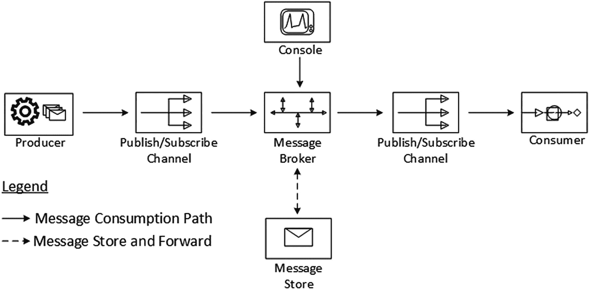

图 6-1

具有持久化功能的简单发布-订阅


### 针对微服务不同运行特性的设计

将单体应用拆分为微服务的主要目标之一，是让每个微服务在架构、技术、构建和运行约束方面实现完全独立。这意味着微服务无需关心与之交互的其他微服务是否正常运行。无论依赖的微服务是否正常运行，独立的微服务都应能完成自身操作并继续推进。由于本段开头提到了“为单个微服务带来完全独立性”，紧接着又谈到了它们的依赖关系，我需要澄清一下这里“依赖”一词的用法。要理解的是，在分布式环境中，许多或所有微服务之间都存在依赖关系，因为它们需要共享信息。因此，当我提到“为单个微服务带来完全独立性”时，实际意思是改变依赖的风格，从直接依赖变为间接依赖，或者用更技术性的术语来说，是倾向于使用异步风格而非同步风格。

在微服务之间使用消息代理是实现独立性的一种高度推荐的方法。图 6-2 展示了一个消息生产者和两个消息消费者。假设它们代表三个不同的微服务，并通过消息代理以异步方式进行通信。可以理解的是，一旦消息生产者将消息发布到消息通道，它就可以确信消息在代理基础设施中是安全的，从而可以忽略已发布的消息。当合适的时候，感兴趣的订阅者可以通过其订阅的通道从消息代理消费这些消息。生产者微服务或消费者微服务无需验证其他消费者微服务是否已收到消息。如果其他微服务正在运行并且消费消息的速度足够快，它几乎会立即从消息代理接收到消息，从而以与微服务间同步通信风格大致相当的性能水平进行响应。然而，如果该消费者微服务消费速度过慢，或者当生产者发布消息时该微服务未运行，消息存储可能会通过安全地持久化消息来提供帮助，直到所有已注册的、感兴趣的微服务都消费完该消息为止。

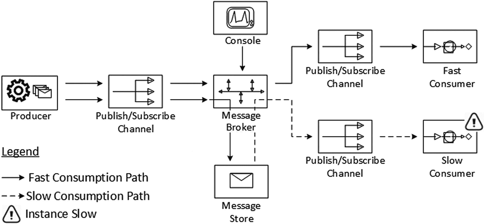

图 6-2
用于平衡运行特性的消息持久化

### 木桶效应：链条的强度取决于最薄弱的环节

这一点在分布式应用中极其重要，尤其是在期望应用具有弹性时：一个软件应用的弹性或可用性，取决于其最不具弹性或最不可用的微服务，或者整个基础设施中最薄弱的组件（环节）。

在图 6-2 中，相当重要的组件包括：

*   生产者微服务
*   消费者微服务
*   消息代理

当然，所示架构中还有其他组件，但假设我们已知处理这些组件弹性的机制，因为我们处理分布式系统已有二十年或更长时间。

我们也承认生产者和消费者微服务也需要具备弹性，但本节我们将重点考察消息代理的弹性。在图 6-2 所示的架构中，消息代理是中心化的单点故障。第 1 章的图 1-2 展示了如何通过采用合适的网络集成拓扑来解决此问题。然而，仅靠这些基本拓扑是不够的，因此让我们重新设计消息代理基础设施，以避免这种单点故障。

您可以通过向系统添加多个代理来提高消息系统的可扩展性，从而提供冗余。这将帮助您摆脱单台机器上部署的单个代理所固有的资源限制或弹性问题。通过在代理之间添加网络连接器，可以将消息代理组合成一个集群，这使您能够定义具有任意拓扑结构的代理网络，包括但不限于第 1 章图 1-2 所示的拓扑。当微服务作为网络连接在一起时，随着它们连接到网络或从网络断开，微服务之间的路由会被动态创建。换句话说，通过合适的拓扑，一个微服务可以连接到网络中的任何其他微服务，并且网络会自动路由来自网络中任何其他点所连接的微服务的消息。

如果集群要处理微服务的任何 PUT（发布）和 GET（订阅）原语，那么集群中至少应有一个消息代理实例处于运行状态，如图 6-3 所示的拓扑。这里一个值得注意的特性是，即使整个消息代理集群宕机，从微服务接收到的、已持久化的消息仍然是安全的，并等待投递。如果稍后同一消息代理集群的一个（或多个）实例启动，它将准备好投递这些待投递的消息。其他微服务的健康状况也是如此。如果某个消费者微服务宕机或无响应，待投递给该消费者微服务的消息在代理处是安全的，并且在最终成功投递之前不会被清除或删除。

所有这些都为微服务之间带来了绝对的独立性。

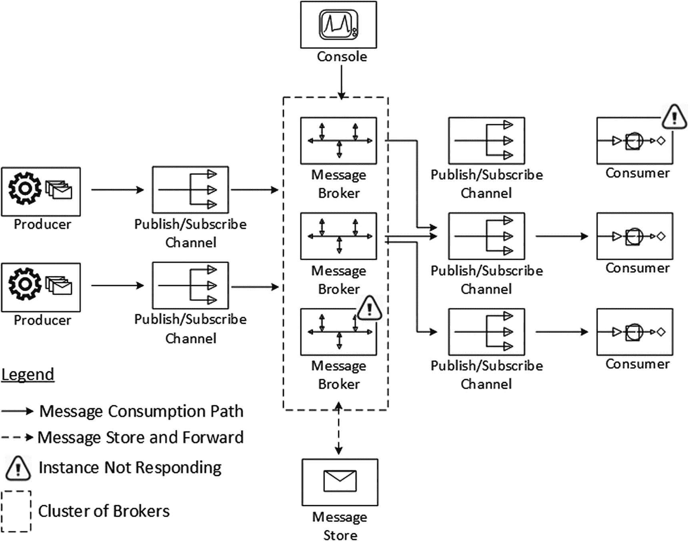

图 6-3
为弹性而集群化消息代理

## 同步与异步

现在，让我们来看微服务之间通信的两种主要风格：同步通信和异步通信。


### 微服务间的同步交互

微服务之间的同步交互风格，类似于两人握手。你伸出手去握对方的手，这好比一个微服务发起请求。你的手，以及随后的握手动作，只有当对方也清醒着，并且确认他/她愿意与你握手，并进一步尝试伸出自己的手来回应你时，才会被接收到。当这种情况发生时，你的手会被对方握住，你也会感觉到对方通过握住你的手来回应你。类似地，接收方微服务必须处于运行状态且不过于繁忙，以便它能够在合理的时间范围内（这样网络超时就不会阻碍进程）接受发送方微服务发送的请求，处理该请求，并立即发回响应（如果有的话）。

在组件世界中，特别是当两个组件在单个进程内相互交互时，典型的同步请求-响应周期通常发生在单个执行线程内。消费者组件和接收者组件可以共享该线程的相同栈变量。由于所有请求数据和临时栈数据都在单个线程上下文中可用和共享，当消费者组件从生产者组件接收到响应数据时，消费者可以确信它收到的响应对应于它向生产者发起的请求。如图 6-4 所示。

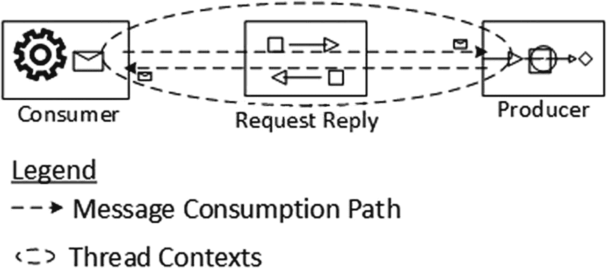

图 6-4

同步进程内通信

当交互的组件位于不同的进程空间时，情况会变得稍微复杂一些。如果组件或微服务必须进行进程间通信（这在分布式企业应用中始终是常态），则必须使用管道（网络）来连接这些进程。网络套接字为这些管道提供了良好的抽象。图 6-5 描述了这种情况。

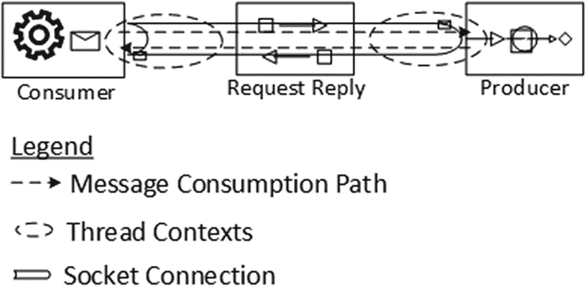

图 6-5

同步进程间通信

在这种场景下，端到端的请求-响应周期并非直接关联，而是间接关联。在消费者端，消费者进程发起一个套接字连接，该进程内的单个线程将通过此连接发送请求。一旦请求或任何附带数据被发送到套接字，请求线程除了等待和空闲直到收到任何响应外，什么也做不了。套接字连接会将此请求在连接的另一端弹出，以便提供者端的组件或微服务（无论哪个正在通过接受连接进行监听）能够接收到该请求。请注意，在提供者端，必须在提供者进程上下文中有一个不同的线程专门处理接收到的请求，该线程的任务还包括执行任何进一步的计算处理、准备适当的响应，并将响应推回套接字连接。该连接会将此响应传输回来，并在消费者端使其可用，消费者端那个最初发出请求、一直阻塞并等待从管道获取响应的旧线程将拾取该响应；这样就完成了一个请求-响应周期。简而言之，在同步交互风格中，协调线程会被阻塞并且必须等待。

图 6-6 展示了一个更复杂的场景，其中单个进程中的一个组件或微服务实例必须响应同一类型的并发请求。当同一类型的请求到来，并且它们被并发处理时，生产者面临的困境是如何将哪个响应数据返回给哪个请求者。

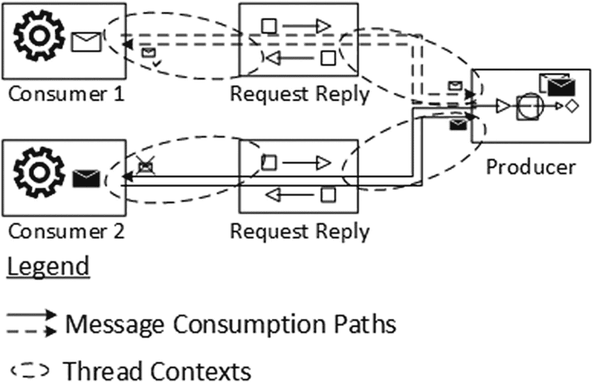

图 6-6

同步并发进程间通信

在图 6-6 中，在生产者端，来自多个消费者的请求正在被并发处理：白色信封请求和黑色信封请求。发送黑色信封请求的消费者 2 自然期望收到一个装在类似信封（黑色信封响应）中的回复消息。如果生产者发回的响应本应发送给其他消费者，那就属于错误场景，图中用叉号标记。幸运的是，像线程、上下文和会话这样的语言原语提供了良好的抽象，无需开发者做额外工作就能解决此类难题。换句话说，并发请求由不同的线程处理，因此每个线程都知道每个响应数据必须返回给哪个请求者。

到目前为止一切顺利，因为我们一直在讨论同步通信。现在让我们来看看异步风格。


### 微服务间的异步交互

在图 6-1 中，你看到了如何引入消息代理来实现组件或微服务间的异步交互。现在让我们进一步探讨这种交互的细节。

在微服务间的异步交互风格中，你可以将单个请求路径视为至少三个不同步骤的组合，如图 6-7 所示。这三个步骤虽然是顺序执行的，但彼此独立。

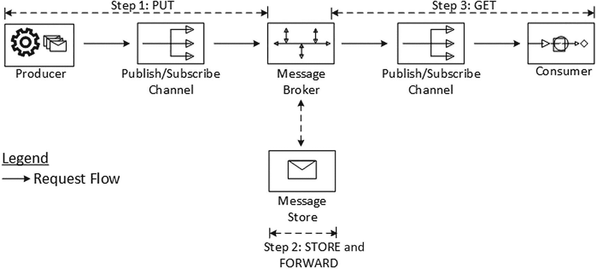

图 6-7

异步请求路由

1.  消息生产者微服务创建一条请求消息，并将其发布到消息代理的队列中。
2.  消息代理可以将请求消息保存在内存或持久化存储中，也可以尝试将其投递给订阅者。
3.  消息消费者微服务如果对该请求消息感兴趣，则可以消费该消息。

通过对不同的参与者（生产者、消费者和代理）引入适当程度的冗余，我们可以配置应用程序，使得即使托管这些组件的某个或多个服务器实例在任何时间点发生故障，请求消息仍然是安全的（至少由这些参与者中的任何一个持有），并且最终会被消费者消费一次且仅一次。

图 6-7 中另一个值得注意的特点是，与图 6-6 相比，生产者和消费者的角色发生了反转。这是因为在异步消息传递的世界中，创建并发布消息的一方被称为消息生产者，而消费消息的一方被称为消息消费者（相比之下，在同步的 SOA 风格交互中，请求服务的一方被称为消费者，提供服务的一方被称为提供者）。

图 6-7 中的请求路径必须通过一个包含响应消息的响应路径来完成。如图 6-8 所示。同样，你需要将单个响应路径视为至少三个不同步骤的组合，这些步骤同样是连续的。

1.  消息消费者在消费请求消息后，执行计算，创建响应，并将其发布到消息代理的队列中。
2.  消息代理可以将响应消息保存在内存或持久化存储中，也可以尝试将其投递给订阅者。
3.  先前的消息生产者微服务如果对该响应消息感兴趣，则可以消费该消息。

我在图 6-8 中特意划掉了生产者和消费者的角色，因为从消息传递的真正意义上讲，创建并发布响应的组件或微服务被称为生产者，反之亦然。但只要理解了这里讨论的概念，这些术语的重要性就降低了。

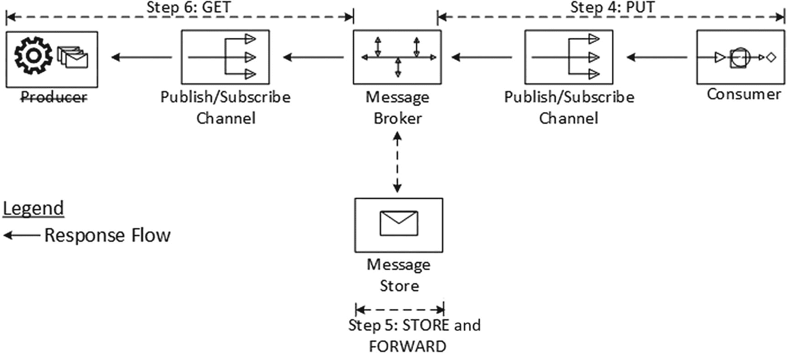

图 6-8

异步响应路由

说起来容易做起来难！现在你需要重新仔细审视上述六个步骤。图 6-6 中两个微服务之间的单一同步交互风格，已被拆分为六个不同且独立的步骤。只要存在一种机制能够关联通过这些步骤交换的状态或数据，每个步骤就对其后续步骤或前序步骤没有任何依赖关系。为了说明这一点，从图 6-7 中生产者代码处的线程上下文或栈变量开始，应该有一种方法能够将步骤 6 结束时消费的响应消息与此关联起来。然而，选择异步风格而非同步风格的原因是为了释放线程去做其他工作，而不是等待或空闲以获取响应。这意味着原始的发起线程可能不再存在，无法接收响应并从中继续处理。相反，启动请求的原始或发起代码段应保持暂停状态，其原始线程被释放以供其他上下文重用；当响应到达时，应通知或回调该代码段，并将正确的响应传递给微服务中的该程序段。

图 6-9 展示了一个场景，其中来自相同或不同微服务或组件的相似或不同消息，被发送到另一端的相同或不同微服务。消息也可以并发投递。请确保当响应返回时，它被正确的接收者接收。消息传递架构使用两种机制来处理这种情况：

*   **关联标识符**：使用这种方法，我们将每个回复消息与一个关联标识符绑定，该标识符是一个唯一标识符，指示此回复是针对哪个请求消息的。我们可以在消息头中用此关联标识符标记消息，以便可以声明式地或在程序员最少干预的情况下进行控制。

*   **返回地址**：下一种方法是在消息中包含一个返回地址，指示将回复消息发送到哪里。通过这样做，回复方微服务不需要知道将回复发送到哪里；它只需询问请求本身即可。如果发送给同一回复方微服务的不同消息需要回复到不同的地方，回复方就知道每个请求的回复应发送到哪里。这将关于使用哪些通道进行请求和回复的知识封装在生产者微服务中，因此这些决策不需要在回复方中硬编码。返回地址也放在消息头中，因为它不是正在传输的有效负载的一部分。

图 6-9 展示了此设置的一个参考示例。

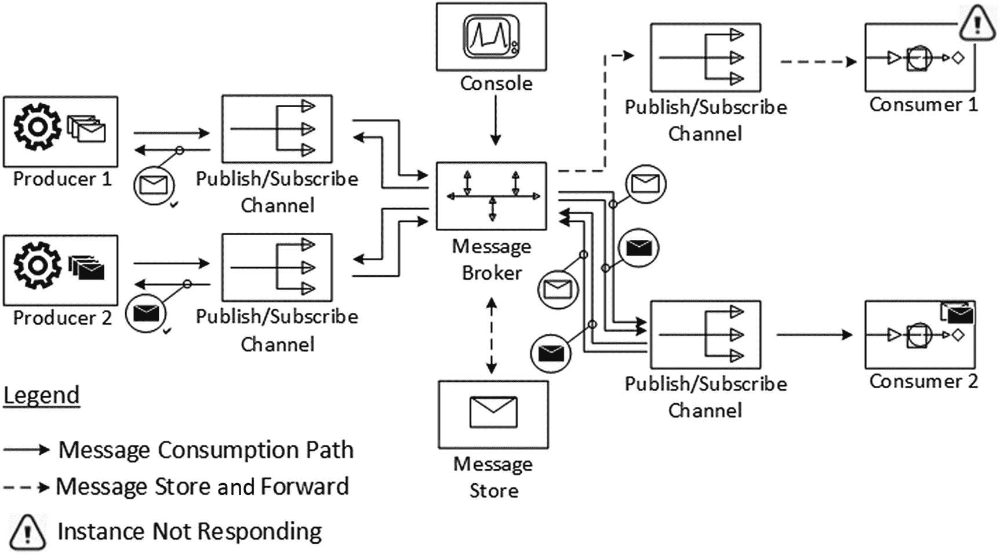

图 6-9

异步、并发的进程间交互

## 向单节点 RabbitMQ 代理发送和接收消息

现在你将看到一些代码，用于向 RabbitMQ 消息代理发送消息，并通过监听器从代理接收消息。请参考附录 B，按照逐步说明安装并启动 RabbitMQ 代理。本练习的完整且可运行的代码示例保存在名为 `ch06-01` 的文件夹中，该文件夹随书附带。


### RabbitMQ 消息发送者

你需要连接到 RabbitMQ 消息代理并发送一条消息。为此，你可以使用 RabbitMQ 库中的客户端包。清单 6-1 展示了执行此操作所涉及的步骤。

```
import com.rabbitmq.client.Channel;
import com.rabbitmq.client.Connection;
import com.rabbitmq.client.ConnectionFactory;
public class Send {
private final static String QUEUE_NAME = "hello";
public static void main(String[] argv) throws Exception{
ConnectionFactory factory = new ConnectionFactory();
factory.setHost("localhost");
Connection connection = factory.newConnection();
Channel channel = connection.createChannel();
channel.queueDeclare(QUEUE_NAME, false, false, false, null);
String message = "Hello World!";
channel.basicPublish("", QUEUE_NAME, null, message.getBytes("UTF-8"));
LOGGER.debug(" [!] Sent '" + message + "'");
channel.close();
connection.close();
}
}
清单 6-1
RabbitMQ 消息发送者 (ch06\ch06-01\src\main\java\com\acme\ch06\ex01\Send.java)
```

你创建了一个到 RabbitMQ 消息代理的连接。RabbitMQ 是一个符合 AMQP 规范的代理，你使用 `com.rabbitmq.client.ConnectionFactory` 来打开到 AMQP 代理的连接。`com.rabbitmq.client.ConnectionFactory` 是 RabbitMQ 库的一部分，但稍后你将看到如何使用非 RabbitMQ 的、纯 AMQP 客户端库连接到 RabbitMQ 代理。为了让 RabbitMQ 接受客户端连接，它需要绑定到一个或多个接口并监听特定于协议的端口。默认情况下，RabbitMQ 会在所有可用接口上监听端口 5672，但你可以根据需要，使用 `rabbit.tcp_listeners` 配置选项进行配置。或者，也可以使用 `setHost(String host)` 和 `setPort(int port)` 等方法来配置监听的主机、端口等。此外，你可以假设 RabbitMQ 已配置为允许使用默认用户名“guest”和默认密码“guest”进行连接。

接下来，你需要创建一个通道。通过使用消息通道，一个应用程序可以向通道写入信息，而另一个应用程序可以从该通道读取信息。现在，你必须声明一个队列来发送消息，完成后，你就可以向该队列发布一条消息。请注意，声明队列仅当队列不存在时才会创建一个新队列，因此该操作是幂等的。通道中的 `basicPublish` 方法期望消息内容以字节数组形式提供，因此你可以在此处编码任何你想要的内容。

### RabbitMQ 消息接收者

清单 6-2 展示了监听 RabbitMQ 消息代理以消费消息所需的代码。

```
import com.rabbitmq.client.Channel;
import com.rabbitmq.client.Connection;
import com.rabbitmq.client.ConnectionFactory;
import com.rabbitmq.client.Consumer;
import com.rabbitmq.client.DefaultConsumer;
import com.rabbitmq.client.Envelope;
import com.rabbitmq.client.AMQP;
public class Receive{
private final static String QUEUE_NAME = "hello";
public static void main(String[] argv) throws Exception{
ConnectionFactory factory = new ConnectionFactory();
factory.setHost("localhost");
Connection connection = factory.newConnection();
Channel channel = connection.createChannel();
channel.queueDeclare(QUEUE_NAME, false, false, false, null);
LOGGER.debug(" [!] Waiting for messages. To exit press CTRL+C");
Consumer consumer = new DefaultConsumer(channel){
@Override
public void handleDelivery(String consumerTag,
Envelope envelope, AMQP.BasicProperties
properties, byte[] body) throws IOException {
String message = new String(body, "UTF-8");
LOGGER.debug(" [x] Received '" + message + "'");
}
};
channel.basicConsume(QUEUE_NAME, true, consumer);
}
}
清单 6-2
RabbitMQ 消息接收者 (ch06\ch06-01\src\main\java\com\acme\ch06\ex01\Receive.java)
```

由于当代理中有更多消息到达该通道时，RabbitMQ 会将消息推送给消费者，因此你需要保持消费者运行以监听消息，并在消息到达代理时消费它们。你使用 `com.rabbitmq.client.Consumer` 作为应用程序回调对象，通过订阅从队列接收通知和消息。你在此处也声明了队列，因为如果你在发布者之前启动消费者，你需要确保在尝试从队列消费消息之前，队列在代理端已经存在。现在，你需要告诉代理从队列中投递消息。由于代理预计会异步推送消息，你需要提供一个回调对象，该对象将缓冲消息，直到你准备好使用它们。`com.rabbitmq.client.DefaultConsumer` 非常方便；它是一个便利类，提供了 `Consumer` 的默认实现。

### 构建并运行 RabbitMQ 示例

现在你将构建并运行代码示例。代码中同时提供了 Ant 和 Maven 脚本。

#### Maven 构建

`ch06-01\pom.xml` 包含运行示例所需的 Maven 脚本。确保 RabbitMQ 代理已启动并正在运行。

你首先构建并启动消费者，以便消费者准备好接收消息（见图 6-10）：

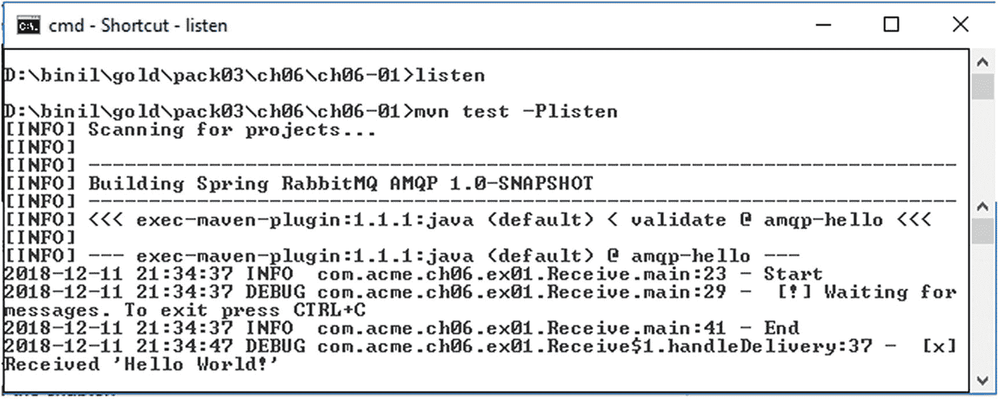

图 6-10

Maven 构建并运行 RabbitMQ 消费者

```
cd ch06-01
D:\binil\gold\pack03\ch06\ch06-01>listen
D:\binil\gold\pack03\ch06\ch06-01>mvn test -Plisten
```

接下来，你构建并启动消息生产者。生产者向代理发布消息，以便消费者可以接收消息（见图 6-11）：

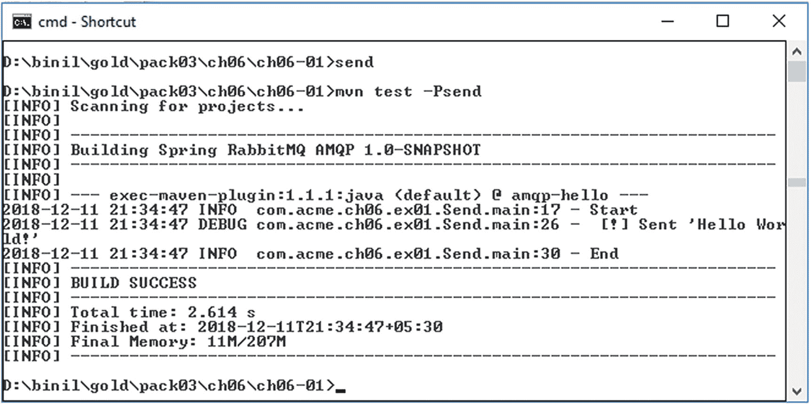

图 6-11

Maven 构建并运行 RabbitMQ 生产者

```
cd ch06-01
D:\binil\gold\pack03\ch06\ch06-01>send
D:\binil\gold\pack03\ch06\ch06-01>mvn test –Psend
```

#### Ant 构建

`ch06-01\build.xml` 包含运行示例所需的 Ant 脚本。同样，确保 RabbitMQ 代理已启动并正在运行。

你需要首先构建示例。执行以下命令：

```
cd ch06-01
D:\binil\gold\pack03\ch06\ch06-01>ant
```

现在启动消费者，并使其准备好接收消息。执行以下命令并查看图 6-12：

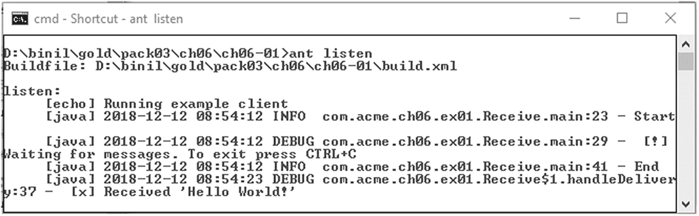

图 6-12

Ant 构建并运行 RabbitMQ 消费者

```
D:\binil\gold\pack03\ch06\ch06-01>ant listen
```

接下来，启动消息生产者。生产者向代理发布消息，以便消费者可以接收消息。在另一个窗口中执行以下命令并查看图 6-13：

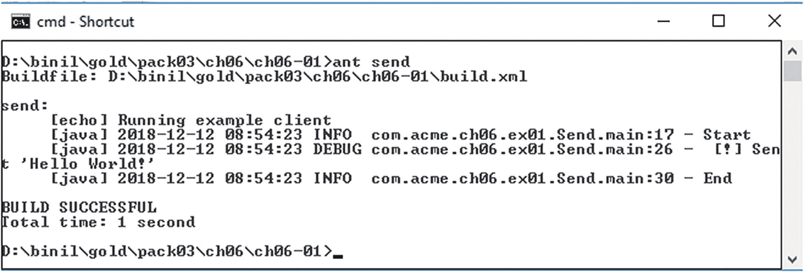

图 6-13

Ant 构建并运行 RabbitMQ 生产者

```
cd ch06-01
D:\binil\gold\pack03\ch06\ch06-01>ant send
```


## 使用 Spring AMQP 向 RabbitMQ 发送和接收消息

Spring AMQP 简化了基于 AMQP 的消息传递解决方案的开发。Spring AMQP 模板为发送和接收消息提供了高级抽象。Spring AMQP 包含两个部分，这也是 Spring Boot 与 Rabbit MQ 集成的默认方式：

*   `spring-amqp`：基础抽象层
*   `spring-rabbit`：RabbitMQ 特定实现

Spring AMQP 抽象的主要特性包括：

*   `Listener` 容器：用于异步处理入站消息
*   `RabbitTemplate`：用于发送和接收消息的 RabbitMQ 特定模板
*   Rabbit 管理工具：有助于快速自动声明队列、交换器和绑定

现在，让我们看一些代码，了解如何使用 Spring AMQP 向 RabbitMQ 消息代理发送消息，并通过监听器从代理接收消息。请参考附录 B，按照逐步说明安装并启动 RabbitMQ 代理。本练习的完整可运行代码示例位于随书附带的 `ch06-02` 文件夹中。

### Spring AMQP 消息监听器

使用 Spring 的优势在于可以将大部分配置通过 XML 进行装配。清单 6-3 展示了如何将消息监听器装配到 RabbitMQ 代理。

```

清单 6-3
Spring AMQP 监听器配置 (ch06\ch06-02\src\main\resources\rabbit-listener-context.xml)
```

在清单 6-3 中，你创建了一个交换器，然后将名为 `anonymousQueue` 的队列与 `my.routingkey.*` 绑定到 `SAMPLE_EXCHANGE`。绑定是你设置的一种“关联”或“链接”，用于将队列绑定到交换器。路由键是一个消息属性。交换器根据其类型，在决定如何将消息路由到队列时可能会查看此键。以 bean id “listener” 实例化的监听器类如清单 6-4 所示。

```
import org.springframework.amqp.core.Message;
import org.springframework.amqp.core.MessageListener;
public class Listener implements MessageListener {
public void onMessage(Message message) {
String messageBody= new String(message.getBody());
LOGGER.debug("Listener received message-----> " + messageBody);
}
}
清单 6-4
Spring AMQP 监听器 Bean (ch06\ch06-02\src\main\java\com\acme\ch06\ex02\Listener.java)
```

最后一步是在 Spring 上下文中加载监听器，如清单 6-5 所示。

```
import org.springframework.context.ApplicationContext;
import org.springframework.context.support.ClassPathXmlApplicationContext;
public class ListenerContainer {
private static final String LISTENER_CONTEXT =
"rabbit-listener-context.xml";
public static void main(String[] args) {
ApplicationContext context =
new ClassPathXmlApplicationContext(LISTENER_CONTEXT);
LOGGER.debug("Context successfully created from: "
+ LISTENER_CONTEXT);
}
}
清单 6-5
Spring AMQP 监听器容器 (ch06\ch06-02\src\main\java\com\acme\ch06\ex02\ListenerContainer.java)
```

为 Maven 构建引入所有必需依赖的最简单方法是将清单 6-6 中的代码片段声明到你的构建文件 `pom.xml` 中。

```
org.springframework.amqp
spring-rabbit
1.6.9.RELEASE

清单 6-6
Spring AMQP RabbitMQ 依赖 (ch06\ch06-02\pom.xml)
```

### Spring AMQP 消息生产者

同样，你首先使用指定参数创建一个 Rabbit 连接工厂。`RabbitTemplate` 为发送和接收消息提供了便捷的抽象，清单 6-7 展示了其配置。

```

清单 6-7
Spring AMQP 发送者配置 (ch06\ch06-02\src\main\resources\rabbit-sender-context.xml)
```

在清单 6-8 中，你创建了前一个 Spring XML 文件中定义的 bean 的模板，并发送了几条消息。

```
import org.springframework.amqp.core.AmqpTemplate;
public class Sender {
private static final Logger LOGGER = LoggerFactory.getLogger(Sender.class);
private static final String SENDER_CONTEXT = "rabbit-sender-context.xml";
private static final String BEAN_NAME = "sampleTemplate";
public static void main(String[] args) throws Exception {
ApplicationContext context = new
ClassPathXmlApplicationContext(SENDER_CONTEXT);
AmqpTemplate aTemplate =
(AmqpTemplate) context.getBean(BEAN_NAME);
String message = null;
for (int i = 0; i " + message);
}
}
}
清单 6-8
Spring AMQP 消息发送者 (ch06\ch06-02\src\main\java\com\acme\ch06\ex02\Sender.java)
```

### 构建并运行 Spring AMQP RabbitMQ 示例

现在你将构建并运行代码示例。代码中同时提供了 Ant 和 Maven 脚本。

`ch06-02\pom.xml` 包含运行示例所需的 Maven 脚本。确保 RabbitMQ 代理已启动并正在运行。首先构建并启动消费者，以便消费者准备好接收消息。执行以下命令，参见图 6-14：

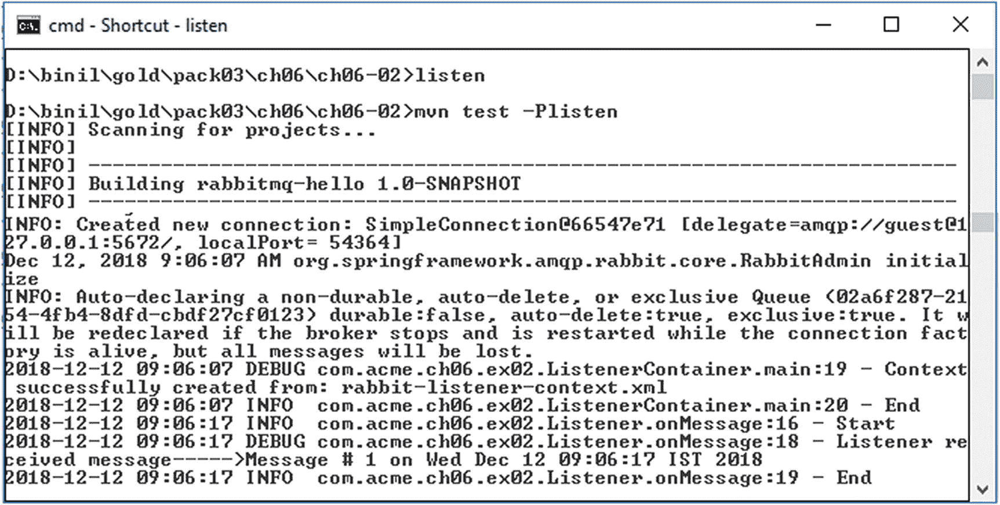

图 6-14

Maven 构建并运行 Spring AMQP 消费者

```
cd ch06-02
D:\binil\gold\pack03\ch06\ch06-02>listen
D:\binil\gold\pack03\ch06\ch06-02>mvn test -Plisten
```

接下来，启动消息生产者。生产者向代理发布一条消息，以便消费者可以接收该消息。在另一个窗口中执行以下命令，参见图 6-15：

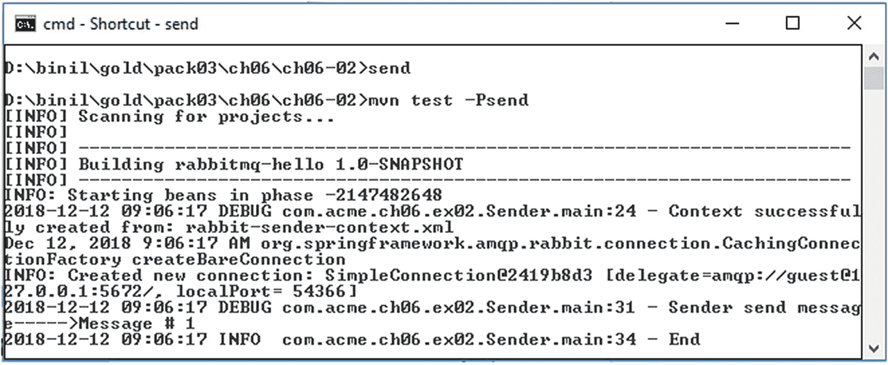

图 6-15

Maven 构建并运行 Spring AMQP 生产者

```
cd ch06-02
D:\binil\gold\pack03\ch06\ch06-02>send
D:\binil\gold\pack03\ch06\ch06-02>mvn test -Psend
```


## 向多节点 RabbitMQ 集群发送和接收消息

接下来，你将查看向 RabbitMQ 集群发送消息的代码。请再次参考附录 B，按照逐步说明安装并启动一个 RabbitMQ 集群。本节假设你已经拥有一个至少包含两个节点的、正在运行的 RabbitMQ 集群。此外，你还需要参考附录 C，按照逐步说明使用 Nginx 设置一个 TCP 负载均衡器，以便当多节点集群中的其他节点宕机时，来自消费者和生产者的流量（更确切地说是连接）可以被多路复用到至少一个活跃节点上。

本节之所以如此重要，是因为在基于消息基础设施的微服务环境中，消息基础设施本身的高可用性将决定整个基础设施的可靠性。你已经看到，在企业级生产环境中，微服务实例可以以任意顺序或任意速度启动（实例化、重启等）和停止（优雅关闭、崩溃、重启、强制终止等）。每个微服务实例都通过发送消息，经由消息基础设施或基于事件的基础设施与其他实例通信。因此，当一个微服务实例成功向消息基础设施发送消息时，它假定该消息会“最终”按预期到达接收方。消息基础设施的高可用性必须兑现这一承诺。

假设你拥有一个处于高可用模式的多节点 RabbitMQ 集群，并且还有一个 TCP 负载均衡器（配置为 TCP 反向代理的 Nginx），那么你就可以进行一些小型测试，以验证你的 RabbitMQ 集群是否已启动并正常运行。

你在上一节（`ch06-02`）中看到的示例可以稍作调整，以演示集群设置，并保存在文件夹 `ch06-03` 中。你可以按照以下顺序执行示例，进行快速演示。

如果你之前没有这样做，请将以下文件从 `samples` 目录（`ch06\ch06-03\`）复制到 RabbitMQ 服务器的 `sbin` 文件夹，然后在不同的窗口中按以下顺序执行脚本：

```
cd D:\Applns\RabbitMQ\rabbitmq_server-3.6.3\sbin
D:\Applns\RabbitMQ\rabbitmq_server-3.6.3\sbin>rabbitmq-server1.bat
cd D:\Applns\RabbitMQ\rabbitmq_server-3.6.3\sbin
D:\Applns\RabbitMQ\rabbitmq_server-3.6.3\sbin>rabbitmq-server2.bat
cd D:\Applns\RabbitMQ\rabbitmq_server-3.6.3\sbin
D:\Applns\RabbitMQ\rabbitmq_server-3.6.3\sbin>rabbitmq-cluster2.bat
```

上述命令将启动一个双节点 RabbitMQ 集群。请注意，你应该给这些命令足够的时间来完成，以确保集群完全形成。

现在，你可以通过执行 Nginx 脚本来设置 TCP 负载均衡器。请参考附录 C，按照逐步说明将 Nginx 配置为 TCP 反向代理。在 Nginx 配置文件中做出正确的条目后，如示例文件所示：

```
ch06\ch06-03\nginx.conf
```

按如下方式启动 Nginx 服务器：

```
cd D:\Applns\nginx\nginx-1.13.5
D:\Applns\nginx\nginx-1.13.5>nginx
```

当消息生产者想要向消息消费者发送消息时，它假定你只对当前流动的消息感兴趣，而不是旧消息。那么，每当你连接到 RabbitMQ 时，都需要一个全新的空队列；一旦你断开消费者连接，该队列应自动删除。要在 RabbitMQ 中实现这一点，你可以创建一个具有随机名称的队列，或者更好的方法是，让服务器为你选择一个随机队列名称。

当你希望在消息发送者和消息消费者之间共享队列时，为队列命名非常重要。因此，在

```
ch06\ch06-03\src\main\resources\rabbit-listener-context.xml
ch06\ch06-03\src\main\resources\rabbit-sender-context.xml
```

中，你将命名队列定义为：

```
配置 RabbitMQ 有多种组合方式，
执行示例程序以验证 RabbitMQ 集群也有多种顺序。
下面解释一种组合。

假设你的 RabbitMQ 实例正在监听端口 5672 和 5673，
并且你的 Nginx 服务器正在 TCP 端口 5671 上监听，
你可以使用以下配置让消息生产者和消息消费者都连接到集群：
```

其余配置与上一节示例中解释的类似。现在执行以下命令：

```
cd ch06-03
D:\binil\gold\pack03\ch06\ch06-03>mvn test –Psend
```

这将向 RabbitMQ 集群发送一条消息。消息发送者窗口将通过以下 DEBUG 消息确认：

```
2017-06-12 19:50:59 DEBUG com.acme.ch06.ex03.Sender.main:32 - Sender send message----->Message from Sender on Mon Jun 12 19:50:59 IST 2017
```

你现在可能想要检查 RabbitMQ 的日志文件。假设 rabbit1 和 rabbit2 是你集群中 RabbitMQ 服务器实例的节点名称，日志会写入我机器上的以下文件：

```
C:\Users\binil\AppData\Roaming\RabbitMQ\log\rabbit1.log
C:\Users\binil\AppData\Roaming\RabbitMQ\log\rabbit2.log
```

你应该能够在集群中任何一个 RabbitMQ 实例的日志中看到以下行：

```
=INFO REPORT==== 12-Jun-2017::19:50:59 ===
accepting AMQP connection  (127.0.0.1:54315 -> 127.0.0.1:5673)
=INFO REPORT==== 12-Jun-2017::19:50:59 ===
Mirrored queue 'remoting.queue' in vhost '/': Adding mirror on node rabbit1@tiger: 
```

上述日志验证了两个方面的内容：

*   该日志文件对应的实例已接受来自消息发送者的 AMQP 连接。
*   在收到来自消息发送者的消息后，该日志文件对应的实例已镜像该队列，这导致集群中 RabbitMQ 服务器的其他实例也收到了相同的消息。

你现在可以启动消息消费者：

```
cd ch06-03
D:\binil\gold\pack03\ch06\ch06-03>mvn test –Plisten
```

如果一切顺利，监听器将消费之前发送的消息，这可以在消息监听器窗口通过以下 DEBUG 消息确认：

```
2017-06-12 19:56:58 DEBUG com.acme.ch06.ex03.Listener.onMessage:19 - Listener received message-----> Message from Sender on Mon Jun 12 19:50:59 IST 2017
```

为了进行集群测试的下一阶段，请在消息消费者窗口中按 Ctrl+C 关闭消息消费者。

接下来，使用消息生产者向集群发送一条新消息。检查两个 RabbitMQ 实例的日志文件，找出哪个实例消费了该消息。消费了该消息的实例将有一个类似于以下的 INFO REPORT：

```
accepting AMQP connection  (127.0.0.1:54746 -> 127.0.0.1:5672)
```

然后，在消息消费者窗口中按 Ctrl+C 关闭消费了该消息的同一个实例。仅让集群的另一个实例运行，然后启动消息消费者。如果一切顺利，监听器将消费之前发送的消息。这验证了集群按预期工作，并且一个实例接收到的消息正在被镜像到另一个实例。

如果 RabbitMQ 集群实例退出或崩溃，除非你另有指示，否则它将忘记该实例中的队列和消息。要确保消息不丢失，需要做两件事：

*   你需要将队列和消息都标记为持久化（durable）。
*   你需要通过设置 `MessageProperties` 将消息标记为持久（persistent）。

你可以尝试这些选项以及其他选项。我在此不再赘述，因为它们不在本书的讨论范围之内。


连接消费者与生产者之间的纽带

使用消息传递基础设施的最大优势——使消息生产者和消息消费者流程解耦——本身有时会给应用程序开发者带来挑战。

在典型的客户端同步请求-响应调用中，服务器可以在单个线程中接受客户端的连接，在该线程中处理请求，并在同一线程中向客户端提供响应。然而，连接和线程是稀缺资源，需要有效利用它们。如果服务器端处理需要很长时间，或者服务器线程因等待 I/O 操作等空闲模式而被阻塞，那么阻塞线程是不可取的。相反，应该这样设计：接受连接的线程被释放以接受更多连接，而处理以及后续对客户端的响应由不同的线程在后台处理，并且这些处理恰好能在处理可以继续时进行，或者恰好能在响应准备好返回给客户端时进行。如果只有一个服务器和一个客户端，实现起来很简单。一旦有大量客户端同时连接到服务器，如果在建立连接之后、服务器向客户端返回响应之前释放了接受套接字连接的线程，那么当响应准备好时，服务器将面临一个挑战：如何将所有这些响应关联回对应的客户端。

关联 ID

在上述场景中，可以为每个请求创建一个回调队列。但这效率很低。幸运的是，有一种更好的方法：为每个客户端创建一个单一的回调队列。但这又引发了一个新问题：在该队列中收到响应后，不清楚该响应属于同一客户端的哪个特定请求。这就是使用 `correlationId` 属性的地方。可以为每个请求将其设置为一个唯一值。之后，当在回调队列中收到消息时，将查看此属性，并基于它能够将响应与请求匹配起来。

在设计处理来自多个客户端的请求和响应的服务器时，请确保在将 JMS 响应发送到队列之前，将响应的 JMS 关联 ID 值设置为请求的 JMS 关联 ID 值。

可以在接收消息时获取 JMS 关联 ID，使用

```
String getJMSCorrelationID()
```

此方法返回提供特定消息 ID 或应用程序特定字符串值的关联 ID 值。

要在发送消息时设置 JMS 关联 ID，请键入

```
void setJMSCorrelationID(String correlationID)
```

让我们看一个示例来理解这个概念。

编写一个自定义网络服务器以处理并发高流量

在本节中，将设计并实现一个使用 TCP/IP 服务器套接字进行监听的网络服务器。多个客户端或来自同一客户端的多个线程可以打开到此服务器的连接并提交作业；这些客户端或线程期望收到作业的响应。设计需要能够处理高流量。让我们来看看服务器中的架构和控制流。图 6-16 显示了整个设置的架构。

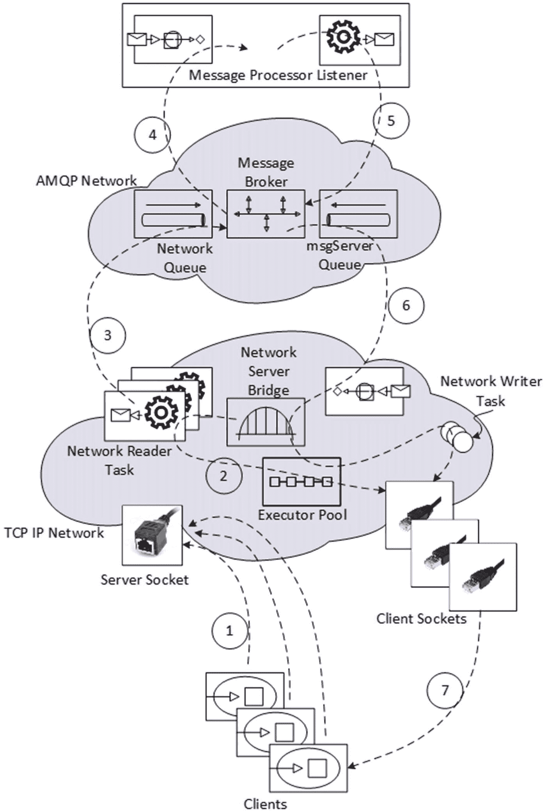

图 6-16
使用优化资源处理高流量的架构

这里显示了两个独立的域，分别名为 TCP IP 网络和 AMQP 网络。为简单起见，假设客户端到服务器的连接在 TCP IP 网络域中以“伪同步”^(⁷) 方式处理，而实际作业执行则异步提交给 AMQP 网络，并且响应也异步地从 AMQP 网络接收。这种架构确保 TCP IP 网络域不会因实际执行作业而承受压力，因此可以高效地进行连接管理。同时，向 AMQP 网络域提交作业是通过消息队列进行的，因此，如果 AMQP 网络域内的实际作业处理需要一些时间，提交到队列中的额外作业不会丢失，而是被缓冲，以便 AMQP 网络域中的消息处理器监听器可以在稍后处理它们。

应该注意到，虽然客户端与网络服务器之间的握手是同步的，但 TCP IP 网络中的网络服务器与 AMQP 网络域中的消息处理器监听器之间的握手却是异步的。因此，网络服务器与消息处理器之间的请求和响应流是分离的，需要关联哪个响应对应哪个请求，以便网络服务器可以将其路由回正确的客户端实例。

请注意，用虚线标记的流在某些情况下会经过多个组件，这样显示是有意为之，以表明所有这些组件都参与了该特定流。此练习的完整且可运行的代码示例保存在随书附带的名为 `ch06-04` 的文件夹中。让我们详细了解每个组件和控制流：

*   **客户端**：多个客户端或来自单个客户端的多个线程可以连接到服务器并提交作业。在此示例中，将只发送一条消息来代替繁重的作业。

*   **服务器套接字**：有一个服务器套接字实例在客户端已知的端口上监听，以便客户端可以发起连接。

*   **客户端套接字**：对于客户端线程打开的每个连接，在 TCP IP 网络端都有一个客户端套接字实例，消息通过由此创建的流在服务器和客户端之间双向传递。

*   **网络服务器**：此组件的“main”方法的主要工作是接受连接、进行任何处理，并将响应返回给客户端。设计约束是网络服务器必须以高效的方式完成所有这些工作。因此，每当客户端连接到网络服务器时，服务器首先接受连接，然后创建一个唯一 ID，用于关联请求和响应流。相应的客户端套接字将根据此关联 ID 建立索引，然后服务器从执行器池中获取一个线程，并通过将作业分配给网络读取器任务并提供关联 ID，要求该线程处理客户端的作业。完成这些工作后，服务器就空闲出来，可以处理更多客户端。

*   **执行器池**：执行器池是一个 ThreadPoolExecutor，它使用可能多个池化线程中的一个来执行每个提交的任务。

*   **网络读取器任务**：每当客户端连接到网络服务器时，一个单独的网络读取器任务会在一个池化线程内执行。它将读取客户端发送的消息（或作业），并将其提交到 networkQueue 以供消息处理器执行。


*   **消息处理器监听器**：消息处理器监听器是一个 AMQP 监听器。这是实际作业处理发生的地方。作业完成后，消息处理器将结果写回另一个队列 `msgServerQueue`。在此过程中，消息处理器监听器通过使用相同的关联 ID 来完成其关联请求和响应的部分。

*   **网络写入器任务**：虽然网络服务器的 `main` 方法处理连接管理，但网络服务器也是一个消息监听器，用于从 `msgServerQueue` 接收作业结果。因此，对于 `msgServerQueue` 中的每个结果，都有一个不同的消息监听器实例，其任务是实例化一个新的网络写入器任务实例，移交结果，并在池化线程中再次执行它。^(⁸) 网络写入器任务从消息中检索关联 ID，然后检索该消息要发送到的对应客户端套接字，并将消息发送回客户端。

至此，架构和流程介绍完毕。我们现在来看一下主要的代码片段。在单个请求-响应周期内执行的完整端到端步骤序列在图 6-16 中标记为 1 到 7。本练习的完整且可运行的代码示例保存在名为 `ch06-04` 的文件夹中，该文件夹随书附带。

客户端使用一个客户端任务，如代码清单 6-9 所示：

```
public void execute(){
Socket clientSocket = new Socket("localhost", 1100);
dataOutputStream.writeUTF(MSG_SEED + id);
dataOutputStream.flush();
String fromServer = dataInputStream.readUTF();
LOGGER.debug("Message Send to Server: " + MSG_SEED + id + ";
Message Received back from Server: " + fromServer);
)
Listing 6-9
Client-Side Task (ch06\ch06-04\src\main\java\com\acme\ch06\ex04\ClientSideTask.java)
```

这里，客户端打开一个到服务器的连接，并首先向套接字的流中写入一条消息。客户端被阻塞并等待，直到收到回复消息。当它收到回复消息时，它会记录发送和从服务器接收到的消息，以便您可以验证客户端确实收到了为其准备的响应。

代码清单 6-10 中的网络服务器接受连接，并创建一个用于关联请求和响应流的唯一 ID。客户端套接字根据此关联 ID 建立索引，服务器从执行器池中获取一个线程，并通过将作业分配给网络读取器任务并提供关联 ID，要求该线程为客户处理作业。网络服务器也是一个消息监听器，用于从 `msgServerQueue` 接收作业结果。

```
public class NetworkServer implements MessageListener{
private void listen(){
serverSocket = new ServerSocket(1100);
while(true){
clientSocket = serverSocket.accept();
correlationIdNew = getNextCorrelationId();
addItem(correlationIdNew, clientSocket);
networkReaderTask = new NetworkReaderTask(amqpTemplate,
correlationIdNew);
executorPool.execute(new Worker(networkReaderTask));
}
}
public void onMessage(Message message) {
NetworkWriterTask networkWriterTask =
new NetworkWriterTask(message);
executorPool.execute(new Worker(networkWriterTask));
}
}
Listing 6-10
Network Server (ch06\ch06-04\src\main\java\com\acme\ch06\ex04\NetworkServer.java)
```

代码清单 6-11 中的网络读取器任务读取客户端发送的消息（或作业），并将其提交到 `networkQueue` 以供消息处理器执行。

```
private void receiveFromNetwrokAndSendMessage(){
Socket clientSocket = NetworkServer.getItem(correlationId);
inputStream = clientSocket.getInputStream();
dataInputStream = new DataInputStream(inputStream);
String fromClient = dataInputStream.readUTF();
MessageProperties messageProperties = new MessageProperties();
messageProperties.setCorrelationId(
Long.toString(correlationId).getBytes());
Message message = new Message(fromClient.getBytes(), messageProperties);
amqpTemplate.send("my.routingkey.1", message);
}
Listing 6-11
Network Reader Task (ch06\ch06-04\src\main\java\com\acme\ch06\ex04\NetworkReaderTask.java)
```

代码清单 6-12 展示了执行作业处理的消息处理器。作业完成后，消息处理器将结果写回另一个队列。在此过程中，消息处理器通过使用从接收到的消息中获取的相同关联 ID 来完成其关联请求和响应的部分。

```
public void onMessage(Message message) {
/* ASSUME THAT WE RECEIVED THE HEAVY JOB FOR EXECUTION HERE */
String messageBody = new String(message.getBody());
String correlationId = new      String(
message.getMessageProperties().getCorrelationId());
/* ASSUME THAT THE HEAVY JOB EXECUTION TAKES PLACE HERE */
/* EXECUTE THE HEAVY JOB AND NOW WE CAN SEND THE
PROCESSED RESPONSE BACK */
MessageProperties messageProperties = new MessageProperties();
messageProperties.setCorrelationId(correlationId.getBytes());
Message messageToSend = new Message(messageBody.getBytes(),
messageProperties);
amqpTemplate.send("my.routingkey.1", messageToSend);
}
Listing 6-12
Message Processor (ch06\ch06-04\src\main\java\com\acme\ch06\ex04\MessageProcessorListener.java)
```

代码清单 6-13 中的网络写入器任务代码从消息中检索关联 ID，检索该消息要发送到的对应客户端套接字，并将消息发送回客户端。

```
private void receiveMessageAndRespondToNetwork(){
String messageBody = new String(message.getBody());
String correlationId = new String(
message.getMessageProperties().getCorrelationId());
Socket clientSocket =
NetworkServer.getItem(Long.parseLong(correlationId));
NetworkServer.removeItem(Long.parseLong(correlationId));
outputStream = clientSocket.getOutputStream();
dataOutputStream = new DataOutputStream(outputStream);
dataOutputStream.writeUTF(messageBody);
dataOutputStream.flush();
}
Listing 6-13
Network Writer Task (ch06\ch06-04\src\main\java\com\acme\ch06\ex04\NetworkWriterTask.java)
```

假设您的 RabbitMQ 集群和 Nginx 负载均衡器仍在运行，您可以按照以下步骤执行代码：

在一个窗口中，启动 AMQP 代理：

```
cd ch06-04
D:\binil\gold\pack03\ch06\ch06-04>mvn test –Pmsg
```

在另一个窗口中，启动网络服务器：

```
cd ch06-04
D:\binil\gold\pack03\ch06\ch06-04>mvn test –Pnet
```

现在在第三个窗口中执行客户端（参见图 6-17）：

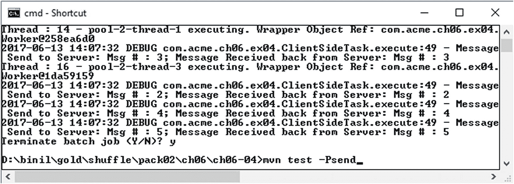

图 6-17
客户端控制台

```
cd ch06-04
D:\binil\gold\pack03\ch06\ch06-04>mvn test -Psend
```

注意记录到控制台的调试信息，它验证了客户端确实收到了为其准备的响应：

```
2017-06-13 14:07:32 DEBUG com.acme.ch06.ex04.ClientSideTask.execute:49 - Message
Send to Server: Msg # : 5; Message Received back from Server: Msg # : 5
```


