**实用 RichFaces（第二版）**

版权所有 © 2011，Max Katz 与 Ilya Shaikovsky

保留所有权利。未经版权所有者及出版者事先书面许可，不得以任何形式或通过任何方式（电子或机械，包括影印、录制或任何信息存储与检索系统）复制或传播本作品的任何部分。

ISBN-13（平装版）：978-1-4302-3449-4

ISBN-13（电子版）：978-1-4302-3450-0

本书中可能出现商标名称、标识及图像。我们仅在编辑风格中使用这些名称、标识和图像，以维护商标所有者的权益，并无意侵犯其商标权，因此不会在每次出现商标名称、标识或图像时都使用商标符号。

本出版物中使用的商品名称、商标、服务标记及类似术语，即使未被明确标识，也不应被视为对其是否受专有权利保护的表述。

总裁与出版人：Paul Manning

首席编辑：Steve Anglin

技术审校：Jason Lee

编辑委员会：Clay Andres, Steve Anglin, Mark Beckner, Ewan Buckingham, Gary Cornell, Jonathan Gennick, Jonathan Hassell, Michelle Lowman, James Markham, Matthew Moodie, Duncan Parkes, Jeffrey Pepper, Frank Pohlmann, Douglas Pundick, Ben Renow-Clarke, Dominic Shakeshaft, Matt Wade, Tom Welsh

协调编辑：Jessica Belanger

文字编辑：Kimberly Burton

排版：Mary Sudul

索引编制：Spi Global

封面设计：Anna Ishchenko

本书通过 Springer Science+Business Media, LLC. 在全球范围内发行图书贸易。地址：233 Spring Street, 6th Floor, New York, NY 10013。电话：1-800-SPRINGER，传真：(201) 348-4505，电子邮件：`orders-ny@springer-sbm.com`，或访问 [`www.springeronline.com`](http://www.springeronline.com)。

如需了解翻译事宜，请发送电子邮件至 `rights@apress.com`，或访问 [`www.apress.com`](http://www.apress.com)。

Apress 及 friends of ED 的书籍可批量购买用于学术、企业或促销用途。大多数图书也提供电子书版本及许可证。更多信息，请参考我们的特殊批量销售–电子书许可网页：[`www.apress.com/info/bulksales`](http://www.apress.com/info/bulksales)。

本书中的信息按“原样”提供，不附带任何担保。尽管在编写本书时已采取一切预防措施，但作者及 Apress 对因本书所含信息直接或间接导致的任何损失或损害，不向任何个人或实体承担任何责任。

本书的源代码可供读者在 [`www.apress.com`](http://www.apress.com.) 获取。成功下载代码前，您需要回答与本书相关的问题。

*献给 Victoria 和 Evelyn*

*——Max*

*谨以此书献给我的妻子 Zoya 和我们的儿子 Nikita，*

*他们是我所做一切的动力源泉*

*——Ilya*

## 内容概览

目录

关于作者

关于技术审校

致谢

引言

第 1 章：基础知识

第 2 章：入门指南

第 3 章：a4j:* 标签、特性与概念

第 4 章：Rich 组件入门

第 5 章：Rich 输入与选择组件

第 6 章：Rich 面板与输出组件

第 7 章：Rich 数据迭代组件

第 8 章：Rich 菜单组件

第 9 章：Rich 树形组件

第 10 章：Rich 拖放组件

第 11 章：Rich 验证

第 12 章：Rich 组件 JavaScript API、客户端函数及 jQuery 的使用

第 13 章：皮肤

第 14 章：RichFaces CDK：构建自定义组件

索引

## 目录

内容速览

关于作者

关于技术审校

致谢

引言

**第 1 章：基础知识**

先来聊聊 RichFaces！

什么是 JSF？

JSF 应用程序由 UI 组件构建而成

JSF 是一项标准

JSF 有两个主要版本

JSF 有两个主要实现

JSF 具有极强的可扩展性

JSF 最重要的特性

用户界面组件

事件

Ajax

RichFaces 概述

RichFaces 的组件标签库

RichFaces 皮肤

RichFaces 客户端验证

RichFaces 组件开发工具包

将 RichFaces 与 CDI 和依赖注入结合使用

RichFaces：历史视角

理解 JSF 应用程序在服务器上运行

开始使用 JSF 时，请保持开放心态

小结

**第 2 章：入门指南**

环境搭建

将 RichFaces 添加到现有 JSF 2 项目

使用 RichFaces 创建新项目

配置 RichFaces

配置皮肤

JSF 2 中的 Ajax

发送 Ajax 请求

部分视图渲染

部分视图处理

RichFaces <a4j:ajax>

render 属性选项

execute 属性选项

bypassUpdates 属性

JavaScript 交互或回调事件

小结

**第 3 章：a4j:* 标签、特性与概念**

发送 Ajax 请求

使用 <a4j:commandButton> 和 <a4j:commandLink>

通过 <a4j:jsFunction> 从任意事件或 JavaScript 函数发起 Ajax 请求

使用 <a4j:poll> 进行轮询

高级部分视图渲染选项

使用 <a4j:outputPanel> 实现自动渲染区域

使用 limitRender 属性关闭自动渲染面板

高级执行选项

使用 `<a4j:region>` 定义执行区域

在验证期间跳过模型更新

使用客户端队列控制流量

合并来自同一组件的事件

设置延迟

合并来自不同组件的事件

忽略“过时”响应

更多 a4j:* 标签与特性

使用 `<a4j:status>` 显示 Ajax 状态

使用 `<a4j:log>` 显示日志与调试信息

使用 `<a4j:actionListener>`

总结

**第 4 章：Rich 组件入门**

Rich 组件还是 Ajax 组件？

Rich 组件特性

使用 Facets 重新定义组件部分

发送 Ajax 请求

使用组件客户端 JavaScript API

总结

**第 5 章：Rich 输入与选择组件**

入门指南

使用 `<rich:inplaceInput>`

JavaScript API

使用 `<rich:inplaceSelect>`

JavaScript API

使用 `<rich:autocomplete>`

`<rich:autocomplete>` 客户端过滤器自定义

在 `<rich:autocomplete>` 弹出窗口中使用复杂标记

JavaScript API

使用 `<rich:select>`

JavaScript API

使用 `<rich:inputNumberSlider>`

JavaScript API

使用 `<rich_inputnumberspinner>`

JavaScript API

使用 `<rich:calendar>`

日历国际化

使用 CalendarDataModel 进行服务端自定义

使用 JavaScript 进行客户端自定义

JavaScript API

组件 Facets

使用 `<rich:fileUpload>` 上传文件

组件 Facets

组件 JavaScript API

总结

**第 6 章：Rich 面板与输出组件**

使用 `<rich:panel>`

使用 `<rich:collapsiblePanel>`

JavaScript API

使用 `<rich:tabPanel>` 和 `<rich:tab>`

JavaScript API

使用 `<rich:accordion>`

JavaScript API

使用 `<rich:togglePanel>`

JavaScript API

使用 `<rich:popupPanel>`

选择面板类型

打开和关闭弹出面板

组件定制

高级组件使用示例

JavaScript API

使用 `<rich:toolTip>`

在数据迭代组件中使用 `<rich:tooltip>`

JavaScript API

总结

**第 7 章：富数据迭代组件**

数据准备

使用 `<rich:dataTable>`

外观定制

使用子表并定义复杂表头标记

使用 `<rich:collapsibleSubTable>` 实现主从表

`<rich:dataTable>` JavaScript API

`<rich:collapsibleSubTable>` JavaScript API

使用 `<rich:extendedDataTable>`

`<rich:extendedDataTable>` JavaScript API

使用 `<rich:list>` 以列表形式显示数据

使用 `<rich:dataGrid>` 以网格形式显示数据

使用 `<a4j:repeat>` 迭代自定义标记

迭代组件高级用法

使用 `<rich:dataScroller>` 添加分页功能

自定义 `<rich:dataScroller>` 外观

将其他数据组件与 `<rich:dataScroller>` 结合使用

将 `<rich:dataScroller>` 与 `<rich:dataGrid>` 结合使用

`<rich:dataScroller>` JavaScript API

使用部分表格更新

迭代组件的请求变量

表格排序

按多列进行表格排序

表格过滤

迭代组件高级模型

总结

**第 8 章：富菜单组件**

使用 `<rich:toolbar>`

使用 `<rich:dropDownMenu>`

使用 `<rich:menuGroup>` 和 `<rich:menuSeparator>`

将 `<rich:menuItem>` 作为独立组件使用

使用菜单组件 JavaScript API

使用 `<rich:panelMenu>`

为组和项调用用户操作

使用面板菜单组件 JavaScript API

总结

**第 9 章：富树形组件**

使用 `<rich:tree>`

基于 Swing TreeNode 接口创建树模型

基于 RichFaces TreeNode 接口创建树模型

使用 <rich:treeNode> 定义树节点标记

在树中使用不同类型的节点

树的切换与选择模式

选择事件处理

展开事件处理

树节点的懒加载

使用 <rich:tree> 适配器构建数据模型

使用 <rich:treeModelAdaptor>

使用 <rich:treeModelRecursiveAdaptor>

总结

**第 10 章：Rich 拖放组件**

使用 <rich:dragSource> 和 <rich:dropZone>

在拖放时调用服务器端监听器

购物车示例

双向拖放操作

自定义拖放指示器

使用 <rich:dragIndicator>

在树组件中使用拖放功能

在表格内拖放

总结

**第 11 章：Rich 验证**

Bean 验证

RichFaces 客户端验证

使用 <rich:message> 和 <rich:messages>

自定义消息图标

分离摘要与详细信息的样式

更改 <rich:messages> 布局

回退到服务器端验证

图形验证器

总结

**第 12 章：Rich 组件 JavaScript API、客户端函数及使用 jQuery**

调用组件的 JavaScript API

使用 #rich:component(id) 函数

使用 <rich:componentControl>

其他 RichFaces 客户端函数

结合 <rich:jQuery> 使用 jQuery

总结

**第 13 章：皮肤**

使用内置皮肤

创建自定义皮肤

更改皮肤参数

使用皮肤与 CSS

基于皮肤的 CSS

重新定义基于皮肤的 CSS 类

用户自定义样式

动态切换皮肤

标准控件皮肤化

使用 #{richSkin} 隐式对象

总结

**第 14 章：RichFaces CDK：构建自定义组件**

开发计划

客户端原型设计

创建项目

创建组件库

创建抽象组件类

创建组件渲染器模板

CDK 渲染器模板标签及其他特性

创建示例应用程序

添加公共属性

实现禁用状态

为 Spinner 组件设置皮肤

总结

索引

## 关于作者

 **马克斯·卡茨**是 Exadel（一家软件开发公司）的高级系统工程师和首席 RIA（富互联网应用）战略师。他是一位知名演讲者，经常出现在众多会议、网络研讨会和 JUG（Java 用户组）会议上。

马克斯领导 Exadel 的 RIA 和移动战略。该职责的一部分是担任 Tiggr 移动应用构建器（`gotiggr.com`）的开发者倡导者，这是一个基于云的应用，用于为任何设备构建移动网页和原生应用。此外，马克斯还领导 Exadel 的开源项目（`exadel.org`），例如 Fiji、Flamingo 和 Eclipse 的 JavaFX 插件。

马克斯自 RichFaces 诞生之初便参与其中，发表了大量文章，提供咨询和培训，并撰写了《实用 RichFaces》第一版（Apress，2008 年）。马克斯还合著了 DZone RichFaces 3 参考卡和 DZone RichFaces 4 参考卡。你可以在他的博客 `mkblog.exadel.com` 上找到马克斯关于 RIA 和移动技术的文章，并可以在 Twitter 上通过 `@maxkatz` 了解他对这些话题及其他方面的见解。

马克斯拥有加州大学戴维斯分校的计算机科学学士学位和金门大学的 MBA 学位。

 **伊利亚·沙伊科夫斯基**是 Exadel 的产品工程师。自 RichFaces 项目启动以来，他就一直参与其中。

作为 RichFaces 项目的一部分，伊利亚收集了新的组件需求，构建了新的自定义组件，并开发了 RichFaces 演示应用程序。他还担任社区联络人，帮助回答客户和用户的问题。此外，伊利亚领导了多个使用 RichFaces 的大型企业开发项目，在此过程中解决了许多性能和可扩展性问题。他还领导了 Exadel Fiji 项目，这是一个用于将 Flash 和 JavaFX 封装为 JSF 组件的丰富 JSF 库。在参与 RichFaces 项目之前，伊利亚曾从事 Exadel Studio 产品线的工作，该产品线现在是 JBoss Developer Studio 和 JBoss Tools 的一部分。

伊利亚制作了大量关于 RichFaces 的信息。他担任了《实用 RichFaces》第一版的审稿人，并撰写了其中的一章。他还合著了 DZone RichFaces 3 参考卡和 DZone RichFaces 4 参考卡。除此之外，他还是两个与 RichFaces 相关的博客的作者：`in.relation.to/Bloggers/Ilya` 和 [`www.jroller.com/a4j/`](http://www.jroller.com/a4j/)。你可以在 Twitter 上通过 `@ilya_shaikovsky` 关注伊利亚。

伊利亚拥有白俄罗斯共和国白俄罗斯国立大学的计算机科学硕士学位。

## 关于技术审校

  **杰森·李**是甲骨文公司技术团队的高级成员，负责 GlassFish 项目的管理控制台和 RESTful 管理接口团队。他拥有超过 14 年的专业经验，涉及从 Java AWT 桌面应用到企业级 Web 应用的多种语言和框架。自 2005 年起，杰森便参与 JavaServer Faces 的开发，既是 JSF 参考实现 Mojarra 的提交者，也是 JSF 2.0 专家组的成员。他活跃于俄克拉荷马城 Java 用户组，曾担任演讲者和前主席。他在 [`http://blogs.steeplesoft.com`](http://blogs.steeplesoft.com) 上撰写关于各种技术的博客。杰森与妻子、两个儿子和一只拳师犬居住在俄克拉荷马州。

## 引言

我们参与 JSF 和 RichFaces 的开发已有多年，包括多年教授 JSF 和 RichFaces 课程。根据我们的经验，我们意识到许多开发者在使用 RichFaces 和 JSF 时，并未充分理解这些技术的全部潜力。缺乏这种理解，开发者就无法充分利用框架。

当然，经过一些试错，几乎每个人都能让他们的应用程序以某种形式运行起来。然而，开发者往往不明白为什么他们的特定应用程序能工作。更重要的是，开发者会感到沮丧，并逐渐对这项技术产生反感。这就是我们编写《实用 RichFaces》第二版的重要原因——提高开发者社区的理解水平，从而避免这种挫败感，让 RichFaces 和 JSF 作为优秀的技术得到应有的赏识。

本书完全基于全新改进的 JSF 2，并涵盖了全新且大幅改进的 RichFaces 4。我们涵盖了 RichFaces 中所有你需要了解的最重要的概念、特性、标签和组件——全部集中在一处。虽然本书并未试图涵盖每个组件的每一个属性，但这其实并无必要。然而，通过本书你将获得对核心概念、特性和标签的扎实理解，我们保证你将能够使用任何 RichFaces 组件。

### 谁应该阅读本书

本书适合任何具备 JSF 基础知识、希望学习如何使用 RichFaces 构建基于 Ajax 的应用程序的读者。如果你对 JSF 完全陌生，我们建议先阅读一本关于 JSF 2 的书籍。即使你已经在使用 RichFaces 4（或 RichFaces 3），本书也能填补许多知识空白。我们确信，在阅读本书的过程中，你至少会说一次：“我不知道 RichFaces 还能做到这个！”或者“我不知道我还能这样做！”

## 第 1 章

## 基础知识

欢迎阅读《实用 RichFaces》第二版。在你手中（或你的电脑/手机/平板电脑上），你已拥有使用 JSF 和 RichFaces 开始开发酷炫且丰富的 Ajax 应用程序所需的一切。在第一章中，我们将简要介绍 JavaServer Faces (JSF)，因为 RichFaces 是 JSF 的一个框架。虽然我们假设你具备一些 JSF 知识，但别担心——即使你刚刚入门，我们也确保本书中的材料和所有示例都非常易于理解。在介绍完 JSF 之后，我们将讨论 RichFaces：它的特性、背后的历史、它是如何起步的以及如今的发展状况。最后，我们将分享两个故事，帮助你使用 JSF 时保持开放的心态，并提供一些使用服务器端框架的技巧。这些故事来自我们的个人经验，应该能帮助你成为更好的 JSF 和 RichFaces 开发者。

### 先给我讲讲 RichFaces！

你购买这本书是为了学习 RichFaces，所以我们先插入这一小段，让你不必等待。然后我们将快速概述 JSF，再回来更详细地介绍 RichFaces。你可能认为 RichFaces 只是一个丰富的组件库（这也没错）。但是，它的功能远不止于此。丰富的组件只是 RichFaces 提供的主要特性之一。RichFaces 是一个用于 JSF 的丰富框架，提供两个标签库（`a4j:` 和 `rich:`）中的丰富和 Ajax 组件、皮肤功能、基于 JSR-303 Bean 验证的客户端验证扩展，以及 CDK（组件开发工具包）。

当然，你还会获得许多其他特性，我们将在本书中逐一介绍，例如高级渲染功能、事件处理选项和 Ajax 客户端队列优化。组件是你可以“感受和触摸”的东西，所以让我们快速举例说明 RichFaces 提供了哪些类型的组件。

`a4j:` 标签库提供了许多核心或基础组件，例如内置 Ajax 支持的按钮和链接、Ajax 轮询和 Ajax 状态。然而，在这个阶段，查看 `rich:` 标签库中的组件示例会更有趣。在图 1-1 中，你可以看到一个丰富的选项卡面板和日历组件。

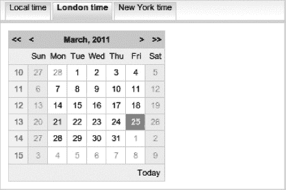

***图 1-1.** RichFaces 选项卡面板和日历（blueSky 皮肤）*

如果你正在阅读本书的电子版，那么图 1-1 将以浅蓝色显示。只需更改一个参数，我们就可以在 ruby 皮肤下渲染页面，如图 1-2 所示。图 1-2 的另一个区别是它还显示了一个可选的时间选择控件。每个组件都提供了大量的自定义选项。

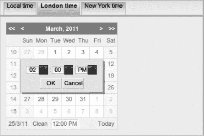

***图 1-2.** RichFaces 选项卡面板和带时间选择的日历（ruby 皮肤）*

选项卡可以通过 Ajax 切换，日历中的上/下个月也是如此。让我们再看一个丰富的组件，如图 1-3 所示。它显示了一个丰富的原地输入组件，展示了三种状态。原地输入最初渲染为标签（第一个组件）；点击后，它切换为输入框（第二个组件）；编辑完成后，又变回标签（第三个组件）。

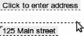

***图 1-3.** 丰富的原地输入组件（显示三种模式）*

我们希望你现在对 RichFaces 能做什么有了一个概念。请相信我们，它能做的远不止这些。现在我们将短暂绕道，向你介绍一些关于 JSF 的知识。为什么？因为 RichFaces 是一个 JSF 框架，它完全基于 JSF，因此了解底层框架的工作原理非常重要。

### 什么是 JSF？

让我们从最简单的定义开始。JSF 只是一个用于构建 Web 应用程序的框架。更具体一点，我们构建的是基于浏览器或 HTML 的应用程序，不涉及任何插件。你可能在想，至少有几十个其他框架也符合这个描述。JSF 有许多特性使其不同于其他框架。让我们来回顾一下。

#### JSF 应用程序由 UI 组件构建而成

JSF 是一个 Java 框架，用于通过可重用组件构建基于浏览器的用户界面 (UI)。JSF 的重点在于 UI 组件。使用 UI 组件时，你无需直接处理 HTML 标记，因为 JSF 和其他丰富的组件将提供构建应用程序所需的所有 UI 小部件。然而，HTML 标签在页面布局中仍然扮演着重要角色。在组件内部，渲染器（用于生成 HTML 的 Java 类）负责生成适当的标记。由于你正在构建 Web 应用程序，而客户端基本上就是浏览器，因此所需的标记是 HTML（尽管它可以是任何东西，如 WML、SGL 甚至 XML），因此组件的渲染器将生成发送到客户端（浏览器）的 HTML 标记。

#### JSF 是一项标准

JSF 是 Java 6（及 5）企业版（Java EE）平台的一部分。这意味着众多公司和个体共同协作，就框架的工作方式达成了一致。关于标准是好是坏的争论超出了本书的范畴，但至少该框架并非由单一实体设计而成。

#### JSF 有两个主要版本

目前存在两个 JSF 版本：1.2 版是 Java EE 5 平台的一部分，而 JSF 2 是 Java EE 6 平台的一部分。

#### JSF 有两个主要实现

由于 JSF 是一个规范，目前有两个主要实现。第一个是 Mojarra，来自 Oracle 的参考实现。另一个是来自 Apache 的 MyFaces。要了解更多关于 JSF 的信息，JavaServerFaces.org（[`www.javaserverfaces.org`](http://www.javaserverfaces.org)）是一个很好的去处。

#### JSF 具有极强的可扩展性

可扩展性特性很可能是使 JSF 成为构建 Web 应用程序流行工具的最主要原因。从一开始，JSF 就被设计为可扩展的。通过标准，JSF 允许你使用新功能和更高级的功能来扩展框架。你获得了新功能，但却是以标准且被认可的方式进行的。其中一个受益最大的领域是丰富的 UI 组件生态系统，其中包括 RichFaces。这个生态系统并不仅限于 UI 组件——自定义转换器、验证器、视图处理器以及其他扩展也被创建出来。

### 最重要的 JSF 特性

JSF 提供了长长的特性列表。然而，由于这不是一本专门的 JSF 书籍，我们将简要介绍三个最重要的特性：用户界面组件、事件以及 JSF 2 中新增的 Ajax 功能。如果你觉得需要复习 JSF 技能，我们推荐以下两本书：David Geary 和 Cay Horstmann 合著的 *Core JavaServer Faces, Third Edition*（Prentice Hall, 2010）以及 Ed Burns 和 Chris Schalk 合著的 *JavaServer Faces 2.0, The Complete Reference*（McGraw-Hill, 2009）。

 **提示** 开始学习 JSF 的两个绝佳去处是 [`http://javaserverfaces.org`](http://javaserverfaces.org) 和 [`http://jsfcentral.com`](http://jsfcentral.com)。

#### 用户界面组件

UI 组件是 JSF 框架的主要特性。JSF 自带约 30 个即开即用的用户界面组件。通常被称为标准组件，它们提供了用于输入、输出、命令（按钮和链接）、标签和布局的基本用户界面小部件，以及用于显示表格数据的简单控件。许多实用组件，如加载样式、脚本和 HTML 页面部分（head、body）也同样可用。

所有 JSF Web 应用程序都是由组件构建而成的。JSF UI 组件是一个服务器端的 Java 对象，能够处理输入、触发动作和渲染内容。组件层次结构是 JSF 处理的核心。而标签则用于构建该组件树。一个 JSF 组件可以简单如一个输入字段，也可以复杂如一个带标签的面板或树形控件。例如，以下标签代表一个输入组件：

`<h:inputText value="#{order.amount}"/>`

这是一个绑定（连接）到某个 Java 对象的输入组件。你会将此标签放在 JSF 页面上，而不是直接编写 HTML 代码。该标签背后的组件知道如何生成所有必要且正确的 HTML、CSS 和 JavaScript。标签代表服务器端的 UI 组件，并用于构建如图 1-4 所示的 JSF 组件树。

##### 组件渲染

JSF 框架将组件与其呈现方式（编码）以及输入处理方式（解码）分离开来。组件的表现形式可以轻松地根据可用的显示设备类型（例如，手机）进行变化。在本书中，你将只使用 JSF 开箱即用的 HTML 渲染工具包。

以下列表展示了渲染器提供的一些功能：

*   渲染可以由组件本身完成，或委托给一个特殊的渲染器类。
*   除了 HTML 之外，还可以渲染诸如 WML 和 XML 之类的标记语言。
*   标准 JSF 组件附带一个 HTML 4.0.1 渲染工具包。

图 1-4 展示了这一切是如何结合在一起的。

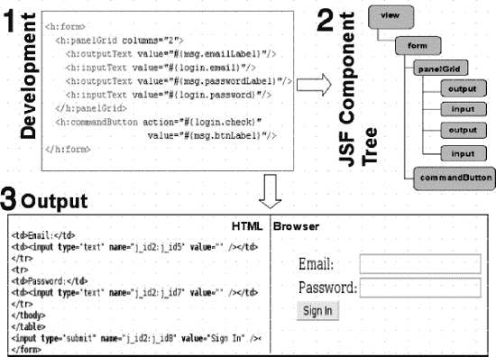

***图 1-4.** 标签代表服务器端组件。服务器端组件在 JSF 请求结束时渲染标记（HTML）。*

让我们逐一解读图中的编号部分。

1.  这是一个由 JSF 标签组成的 JSF 页面。当 JSF 处理该页面时，这些标签会创建图中第二部分所示的 JSF UI 组件（Java 类）。
2.  这是 JSF UI 组件树，代表了 JSF 页面上定义的组件。组件树会经历一个复杂的生命周期，期间会发生各种事情，例如转换和验证。最后，JSF 会要求每个组件渲染器渲染标记。
3.  左侧面板是生成的 HTML 代码，右侧面板显示用户在浏览器中看到的内容。这只是标准的 HTML 4.0.1 版本。

如你所见，通常你不会直接处理 HTML 标记。你只需使用那些能渲染所有必要标记的组件即可。

关于渲染其他标记语言的说明。在 JSF 早期，组件可以根据客户端设备渲染不同标记的想法很有趣。那时，可用的移动设备通常使用 XML 或 WML 等标记语言。如今情况大不相同。大多数现代移动设备，如智能手机和平板电脑，都配备了支持所有最新 HTML、JavaScript 和 CSS 功能的强大浏览器。在某些情况下，移动设备上的浏览器甚至比 PC 上的更好。这意味着生成 HTML 以外的标记已不再那么重要，或者随着支持 HTML 的手机和其他设备的普及而逐渐淡出。

这并不意味着渲染器不再扮演重要角色。尽管 HTML 现在在各种设备上都得到支持，但渲染器在生成何种标记（HTML）方面仍然发挥作用。随着移动设备的爆炸式增长，我们现在必须为大量不同的屏幕尺寸开发应用程序。无论是 3.5 英寸屏幕的手机、7 英寸屏幕的平板电脑，还是大屏幕笔记本电脑，能容纳的“内容”（或显示区域）都是有限的。这正是渲染器可以发挥作用的地方。基于设备、屏幕尺寸甚至屏幕分辨率，渲染器可以提供不同的标记。

#### 事件

JSF 超越了请求/响应范式，提供了一个强大的基于事件的模型。用于构建用户界面的 UI 组件会在被激活或点击时向服务器发送事件（例如，点击等浏览器事件会被映射到服务器端组件事件）。然后由监听器处理这些事件。例如，点击一个按钮（它是一个 UI 组件）就是一个由相应监听器处理的事件。（JSF 基于事件的模型为 UI 开发提供了一种类似于其他用户界面框架（如 Swing 和 Flex）的方法。）

例如，在动作属性中定义的 *`#{simpleBean.save}`* 表达式里，*`save`* 是 *`simpleBean`* Bean 中的一个方法。它通常被称为 JSF 动作，并会在按钮被点击时调用：

`<h:commandButton value="Submit" action="#{simpleBean.save}"/>`

在继续之前，你需要熟悉 图 1-5 中展示的 JSF 生命周期阶段，并理解每个阶段的作用。我们将使用同样的图表来展示 RichFaces 的概念。请确保你理解每个阶段的作用，以及在发生转换/验证错误或使用 `immediate="true"` 属性时，流程会发生什么变化。理解生命周期也有助于你通过阶段监听器调试 JSF 应用程序。你将在本书后面用到阶段监听器。如果你需要复习 JSF 阶段，Javabeat 上的这篇文章（[`www.javabeat.net/articles/54-request-processing-lifecycle-phases-in-jsf-1.html`](http://www.javabeat.net/articles/54-request-processing-lifecycle-phases-in-jsf-1.html)）是一个不错的参考。

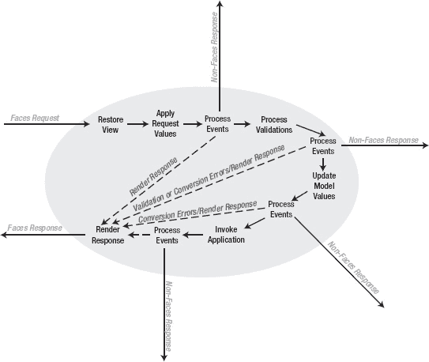

***图 1-5.** JSF 生命周期*

#### Ajax

当 JSF 1.x 被开发出来时，它没有任何 Ajax 特性，仅仅是因为当时 Ajax 还不像我们今天所熟知的那样存在。幸运的是，在 2006 年，RichFaces 出现了，它使得为现有或新的 JSF 应用程序添加 Ajax 功能变得非常容易。例如，如果你有一个像下面这样的标准输入文本组件：

*`<h:inputText value="#{order.amount}"/>`*

使用 RichFaces，基于某个事件发送 Ajax 请求非常容易。你只需添加 *`<a4j:support>`* 标签，指定触发 Ajax 请求的事件，并指定要重新渲染的组件，如下所示：

*`<h:inputText value="#{order.amount}">`*
*`   <a4j:support event="onkeyup" reRender="id1"/>`*
*`</h:inputText/>`*
*`<h:outputText value="#{order.total}" id="id1"/>`*

当 JSF EG（专家组）开始着手 JSF 2 版本时，他们将基本的 Ajax 支持引入了规范。JSF 2 中的 Ajax 行为 `<f:ajax>` 紧密地基于流行的 RichFaces 3 `<a4j:support>` 标签。以上面的例子为例，在 JSF 2 中添加 Ajax 支持是这样做的：

*`<h:inputText value="#{order.amount}">`*
*`   <f:ajax event="keyup" render="id1"/>`*
*`</h:inputText/>`*
*`<h:outputText value="#{order.total}" id="id1"/>`*

这个例子看起来与 RichFaces 3 的例子非常相似。明显的变化是使用了新的行为（`<f:ajax>`），事件指定时去掉了 *on* 前缀，并且使用了 *`render`* 属性代替了 reRender。然而，核心的 Ajax 概念非常相似。除了使用 `<f:ajax>` 行为，还可以通过编程方式发送 Ajax 请求，如下所示：

`<h:form id="form">`
`   <h:commandButton id="button" value="Update"`
`onclick="jsf.ajax.request(this,event, {render:'form:out'});` 
`      return false;" />`
`  <h:output Text value="#{timeBean.now}" id="out"/>`
`</h:form>`

尽管是基础功能，Ajax 现在已经是 JSF 2 标准的一部分。我们将在本书后面介绍更多 `<f:ajax>` 的特性。

在我们进一步介绍 RichFaces 之前，必须问一个问题：为什么要使用 JSF？嗯，最简单的答案是（经过短暂的学习曲线后）JSF 简化了开发。任何框架的基本目的都是通过隐藏所有应用程序共有的任务来简化开发。JSF 正是这样做的。你不再需要担心如何从请求中获取数据，如何定义导航，或者如何转换值。JSF 开箱即用地提供了所有这些功能，甚至更多。如果所有的基础管道工作都由框架处理，那么你就有更多时间专注于实际的应用程序。最后，JSF 的组件方法使其成为与 Ajax 结合使用的完美技术。

### RichFaces 概述

如果你想知道既然 JSF 2 现在有了 Ajax 功能，为什么还需要 RichFaces，那是因为 JSF 2 中的 Ajax 功能非常基础。你只能得到 `<f:ajax>` 行为。这不足以构建真正丰富的企业级 Ajax 应用程序。这正是你需要 RichFaces 的原因，它是一个用于 JSF 的丰富框架。它由以下部分组成：

*   分为两个标签库（`a4j:`，`rich:`）的丰富组件和 Ajax 组件
*   皮肤
*   用于 Bean 验证（JSR 303）的客户端和对象验证扩展
*   CDK（组件开发工具包）

除了这些主要部分，RichFaces 还扩展了标准的 JSF 2 Ajax 请求队列，并添加了各种渲染优化属性，我们将在本书中介绍这些内容。RichFaces 应用程序也可以部署在云端，例如 GAE（Google Apps Engine）、Amazon EC2、CloudBees 和 OpenShift。RichFaces 不仅扩展了 JSF，还使 JSF 更加丰富。事实上，没有 JSF 就无法使用 RichFaces。你可以将 RichFaces 与 Mojarra JSF（Oracle RI）实现或 MyFaces 实现一起使用。RichFaces 只是提供了现成的 Ajax 组件（和其他特性）来支持构建基于 Ajax 的应用程序。另一种看待它的方式是，它提供了超出标准 JSF 所提供的额外 JSF 组件。这些组件提供了所有必要的 JavaScript，因此你几乎不需要直接处理 JavaScript。

 **注意** 每当我们提到 RichFaces 时，我们总是指 RichFaces 4 版本。RichFaces 3.x 基于 JSF 1.2。RichFaces 3.3.3 支持 JSF 1.2，并对 JSF 2 有非常基本的支持。这个版本是为那些需要部署在 Java EE 6 应用服务器上的项目而引入的，这些服务器随附了 JSF 2，但当时 RichFaces 4 尚未可用。本书中的所有内容都基于 RichFaces 4 版本。客户端验证仅从 RichFaces 4 开始可用。

表 1-1 总结了 JSF 和 RichFaces 的版本兼容性。

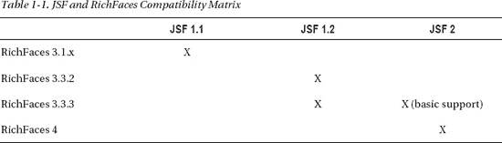

#### RichFaces 的组件标签库

RichFaces 组件分为两个标签库：一个标签库称为 `a4j:`，另一个称为 `rich:`。`a4j:` 标签库提供页面级别的 Ajax 支持和其他实用标签。它基本上提供了基础性的控件，让你决定如何发送请求、向服务器发送什么内容以及更新什么内容。这种方法为你提供了强大的能力和灵活性。`rich:` 标签库提供丰富的 UI 组件。丰富组件是指超出标准 HTML 标签所提供的任何内容；例如，一个选项卡面板。标准 JSF 或 HTML 都没有用于选项卡面板的标签，因此 RichFaces 提供了一个，使其成为一个丰富组件（超越了开箱即用的 HTML）。许多丰富组件还具有内置的 Ajax 支持。这些组件会触发 Ajax 请求并自动进行部分页面更新。并且它们中的大多数支持使用 `a4j:` 标签进行可插拔和可定制的 Ajax 行为。

#### RichFaces 皮肤

另一个主要特性是皮肤。可以创建任意数量的皮肤（通过属性文件定义），并具有不同的配色方案。当设置了特定的皮肤时，组件渲染器将引用该皮肤，并根据该皮肤生成颜色和样式。这意味着你可以通过简单地切换到不同的皮肤来轻松更改整个应用程序的外观和感觉。皮肤可以在 CSS 级别进行自定义、创建和覆盖。我们专门用第 12 章来讨论这个主题。

#### RichFaces 客户端验证

JSF 自带了许多开箱即用的验证器，而 JSF 2 现在也支持 Bean 验证（JSR 303）。RichFaces 4 将验证功能向前推进了一步，增加了基于 Bean 验证的客户端验证。现在可以根据 JSR-303 定义在客户端执行验证。这意味着基本的客户端验证不再需要创建自定义的 JavaScript 验证器并将其插入到组件中；它只是在框架层面为不同层同步这些验证器。

此外，使用 RichFaces，您将能够遵循 DRY（[`en.wikipedia.org/wiki/Don%27t_repeat_yourself`](http://en.wikipedia.org/wiki/Don%27t_repeat_yourself)）原则，在整个应用程序中实现这种验证。如果无法在客户端进行验证，则支持 Ajax 回退（服务器端）。此外，RichFaces 提供了所谓的对象验证，允许整体验证服务器端实体，即使某些属性在当前视图中不存在。客户端验证将在第 11 章中介绍。

#### RichFaces 组件开发工具包

该框架的另一部分是组件开发工具包（CDK）。CDK 包含各种 Maven 原型、代码生成工具、描述符和测试生成工具，以及一个允许仅使用页面代码创建渲染器类的模板工具。这些特性使组件开发者能够避免组件创建过程中的例行程序。CDK 极大地简化并加速了具有内置 Ajax 支持的富组件开发。本书的这一版现在包含了 CDK 的相关内容。CDK 将在第 13 章中介绍。

#### 将 RichFaces 与 CDI 和依赖注入结合使用

上下文与依赖注入（CDI，JSR 299）和 Java 依赖注入（JSR 330）都是 Java EE 6 平台的一部分。两者都提供服务与组件，以简化企业级 Java 应用程序的开发。尽管 JSF 2 现在提供了一种更简单的方式来使用注解配置 Bean，但使用 CDI Bean 而非 JSF Bean 通过提供统一的编程模型，为开发者带来了更多的灵活性和能力。JSF 2 开箱即用地支持 CDI Bean。由于 RichFaces 4 基于 JSF 2，CDI 也可以与任何 RichFaces 4 组件一起使用。为了避免引入另一层（这实际上超出了本书的范围），本书中的示例将使用标准的 JSF Bean。在所有示例中，JSF Bean 都可以轻松替换为 CDI Bean。

#### RichFaces：历史视角

如果您搜索 RichFaces，最终会看到对 Ajax4jsf 的引用。本节简要介绍 Ajax4jsf 的历史以及它如何成为 RichFaces 的一部分。Ajax4jsf 起源于 RichFaces。Ajax4jsf 框架由 Alexander Smirnov 创建和设计。在 2005 年初，他正寻求将一项“热门”新技术及其相关经验添加到他的简历中。大约在同一时间，Jesse James Garrett 正在确立 Ajax 的概念。与此同时，JSF 开始获得发展势头。Alexander 想，为什么不将两者合并，这样在 JSF 应用程序中就能轻松拥有 Ajax 功能呢？

他在 SourceForge.net 上启动了该项目，并将其命名为 Telamon（取自莎士比亚戏剧《*安东尼与克莉奥佩特拉*》），Ajax4jsf 由此诞生。同年秋天，Smirnov 加入了软件工程公司 Exadel，并继续开发该框架。Smirnov 的目标是创建一个易于使用的工具，为纯服务器端的 JSF 技术增加客户端丰富性，并且可以与任何现有的 JSF 组件库一起使用。

后来成为 Ajax4jsf 的第一个版本于 2006 年 3 月发布。它当时还不是一个完全独立的东西。相反，它是一个名为 Exadel RichFaces 产品的一部分。同年晚些时候，RichFaces 被分离出来，Ajax4jsf 框架诞生了。

RichFaces 提供开箱即用的组件，即所谓的以组件为中心的 Ajax 方法（组件完成您所需的一切），而 Ajax4jsf 则提供所谓的页面级 Ajax 支持。作为开发者，您指定在客户端用户操作后，页面的哪些部分应在服务器上处理，以及处理完成后哪些部分应被渲染回来（渲染在服务器端进行，部分 DOM 更新在客户端进行）。Ajax4jsf 成为一个托管在 Java.net 上的开源项目，而 RichFaces 则成为一个商业化的 JSF 组件库。Ajax4jsf 成为一个非常受欢迎的项目，因为它出现在正确的时间（恰逢人们开始将 Ajax 添加到他们的应用程序中），但更重要的是，因为它非常易于使用。

如果您有一个像这样的按钮

*`<h:commandButton value="Submit" action="#{bean.save}"/>`*

并且想要添加 Ajax 功能，您所要做的就是更改命名空间并添加一个 *`reRender`* 属性（RichFaces 3 代码），如下所示：

*`<a4j:commandButton value="Submit" action="#{bean.save}" reRender="id1, id2"/>`*

如果您有一个输入字段并想为其添加 Ajax 功能，那么接下来您要做的就是在其内部添加一个 `<a4:support>` 标签，如下所示：

*`<h:inputText value="#{order.amount}">`*
*`   <a4j:support event="onkeyup" reRender="id1, id2"/>`*
*`</h:inputText/>`*

时间快进到 2007 年 3 月。JBoss 和 Exadel 建立了合作伙伴关系，Ajax4jsf 和 RichFaces 将归入 JBoss 旗下，并分别称为 JBoss Ajax4jsf 和 JBoss RichFaces。RichFaces 也将是开源且免费的。2007 年 9 月，JBoss 和 Exadel 决定将 Ajax4jsf 和 RichFaces 重新合并到 RichFaces 名下。这是有道理的，因为这两个库都是免费且开源的。拥有单一产品解决了以前存在的许多版本和兼容性问题，例如确定哪个版本的 Ajax4jsf 与哪个版本的 RichFaces 兼容。

尽管今天您仍然会看到使用 `a4j:` 命名空间，但该产品现在被称为 RichFaces。

在结束本章之前，我们想根据个人经验提供一些建议，这些建议将帮助您成为更好的 JSF 和 RichFaces 开发者。

#### 理解 JSF 应用程序运行在服务器上

根据我们教授 JSF 的经验，对于刚接触 JSF 的人来说，有时很难理解 JSF 组件树的概念以及它如何与他们在浏览器中看到的内容相关联。重要的是要记住，JSF 是一个服务器端框架（因此得名 JavaServer Faces）。这意味着应用程序运行在服务器上。这也意味着任何事件处理都将在服务器上完成。那么，这一切如何与您在浏览器中看到的内容相契合呢？浏览器基本上是组件树的一个用户可读视图。它只是组件树的一个镜像，但采用您可以理解的格式（浏览器）。在构建 JSF 应用程序时，想象您始终在处理 JSF 组件树可能会有所帮助。您更改或调用的任何内容始终在组件树上，而浏览器只是用于显示页面的客户端。

您可能会想，那 Ajax 呢？在 JSF 的上下文中，当使用富组件时，它们会渲染所有必要的 JavaScript，以从浏览器向服务器发送 Ajax 请求。请求完成后，JSF 将从组件树中渲染一些组件，并将该响应发送回浏览器。收到响应后，浏览器中的 JavaScript 将执行 DOM 更新（或部分页面更新）。即使我们现在有了富组件，Ajax JSF 请求仍然会发送到服务器。为了让您有个初步了解，还有所谓的客户端事件。这些事件发生在浏览器上，例如展开或折叠面板。在这种情况下，不会向服务器发送请求。我们将在本书后面更详细地介绍它们。

#### 初学 JSF 时，请保持开放心态

不难找到一些论坛、博客文章和其他资源，它们来自刚开始接触 JSF 并对该框架感到不满的人。你必须记住，大多数刚开始学习 JSF 的人都是从 JSP、Struts 或类似的自制框架转过来的。当他们开始评估 JSF 时，他们带着与使用 JSP 和 Struts 时相同的风格和开发方法来对待 JSF。这就是所有问题的根源。

你不能用那种方法来使用 JSF。正如我们所解释的，它为 Web 开发提供了一种完全不同的范式。用户界面是由 UI 组件开发的；这与人们习惯用 JSP 和 Struts 做的事情截然不同。因此，当有人试图在 JSF 中以“JSP 的方式”做简单的事情时，他们会失败并感到沮丧。他可能会说：“但我用 JSP 大约五分钟就能搞定。”当然，他或她可能确实能做到，但 JSP 实际上不过是把 Java 和 HTML 混在一起。JSP 提供的抽象程度极低，以至于你基本上可以做任何事情——即使大多数情况下做得并不正确，关键在于它总归是完成了。

这种方法在 JSF 中不再适用。在你对 JSF 感到不满之前，重要的是至少花一些时间学习这个框架，了解它是如何工作的，然后再实际评估它是否适合某个项目。暂时把你的 JSP 或 Struts 方法放在一边，学习如何使用 UI 组件构建 Web 应用程序。我们保证，用这种方式使用 JSF，你会取得更大的成功。

### 小结

本章简要介绍了 JSF、Ajax 和 RichFaces。目的是让你大致了解所有这些技术是如何结合在一起的。在第 2 章中，你将安装本书中使用的工具，然后开始使用第一个 RichFaces 标签`<a4j:ajax>`。

## 第 2 章

## 入门

在本章中，我们将动手实践。我们将设置工作环境，以便你可以尝试所有示例。由于 JSF 2 现在内置了 Ajax 功能，我们将首先介绍这一点，然后转向 RichFaces，并开始向你展示 RichFaces 如何扩展该功能。

### 环境设置

RichFaces 可用于任何兼容 JSF 2 的容器。这意味着所有符合 Java EE 6 规范的服务器（JBoss AS6/7、Glassfish 3）以及所有主要的 Servlet 容器（Tomcat、Jetty 和 Resin）。

#### 将 RichFaces 添加到现有 JSF 2 项目

为了不让你局限于任何特定的 IDE（集成开发环境），我们将使用 Apache Maven 来设置项目。由于 RichFaces 构建在 JSF 2 之上，其安装就像向项目添加几个 JAR 文件一样简单。按照 JBoss 社区网站上位于[`http://community.jboss.org/wiki/MavenGettingStarted-Users`](http://community.jboss.org/wiki/MavenGettingStarted-Users)的 Maven 入门指南配置你的仓库。然后，只需将清单 2-1 添加到你的项目`pom.xml`中。完整的 Maven 指南可在[`http://www.sonatype.com/books/mvnref-book/reference`](http://www.sonatype.com/books/mvnref-book/reference)找到。

***清单 2-1.** 将此添加到你的项目`pom.xml`中*

`<dependencyManagement>`
`  <dependencies>`
`    <dependency>`
`      <groupId>org.richfaces</groupId>`
`      <artifactId>richfaces-bom</artifactId>`
`      <version>${richfaces.version}</version>`
`      <scope>import</scope>`
`      <type>pom</type>`
`    </dependency>`
`  </dependencies>`
`</dependencyManagement>`
`…`
`<dependency>`
`  <groupId>org.richfaces.ui</groupId>`
`  <artifactId>richfaces-components-ui</artifactId>`
`</dependency>`
`<dependency>`
`  <groupId>org.richfaces.core</groupId>`
`  <artifactId>richfaces-core-impl</artifactId>`
`</dependency>`

对于其他构建系统，如 Ant，只需将以下 JAR 文件添加到项目的`WEB-INF/lib`目录中：

*   `richfaces-core-api-<ver>.jar`
*   `richfaces-core-impl-<ver>.jar`
*   `richfaces-components-api-<ver>.jar`
*   `richfaces-components-ui-<ver>.jar`
*   `sac-1.3.jar`
*   `cssparser-0.9.5.jar`
*   `google-guava-r08.jar`

 **注意** `sac-x.x.jar`和`cssparster-x.x.x.jar`的版本是本书撰写时的最新版本。请访问 JBoss 社区 RichFaces 网站[`www.jboss.org/richfaces`](http://www.jboss.org/richfaces)查看最新版本。

##### 可选依赖项

根据你的部署或想要使用的功能，你可能需要向 RichFaces 项目添加一些可选的 JAR 文件（依赖项）。这些可选的 JAR 文件用于在使用 Apache Tomcat 时的客户端验证、缓存以及使用组件开发工具包注解。

###### 验证依赖项

如果你要部署到 Apache Tomcat 并将使用客户端验证，则还需要以下 JAR 文件：

*   `validation-api.jar`
*   `hibernate-validator.jar`
*   `slf4j-api.jar`
*   `slf4j-jdk14.jar`

清单 2-2 显示了应使用的 Maven 依赖项。

***清单 2-2.** 应使用的 Maven 依赖项*

`<dependency>`
`   <groupId>org.hibernate</groupId>`
`   <artifactId>hibernate-validator</artifactId>`
`   <version>4.1.0.Final</version>`
`</dependency>`

 **注意** `validation-api`将通过`hibernate-validator`传递引入。

如果部署到 Java EE 6 服务器，则应用程序不需要这些库，因为它们已包含在服务器中。仍然建议包含该依赖项，但将`scope`更改为`provided`，以便在应用程序构建期间使用。

###### 缓存依赖项

为了获得最佳性能，建议将以下缓存框架之一添加到应用程序类路径中：Ehcache、JBoss Cache 或 OSCache。当你使用 RichFaces Maven 原型创建新的 RichFaces 项目时，`pom.xml`文件中会存在 Ehcache 依赖项，如清单 2-3 所示。

***清单 2-3.** 使用 RichFaces Maven 原型创建新的 RichFaces 项目*

`<dependency>`
`   <groupId>net.sf.ehcache</groupId>`
`   <artifactId>ehcache</artifactId>`
`</dependency>`

###### CDK（组件开发工具包）注解依赖项

清单 2-4 显示了编译时依赖项。仅当你在应用程序操作或监听器中创建或访问 RichFaces 组件实例以定义 CDK 注解时才需要它。

***清单 2-4.** 显示编译时依赖项*

`<dependency>`
`   <groupId>org.richfaces.cdk</groupId>`
`   <artifactId>annotations</artifactId>`
`   <scope>provided</scope>`
`</dependency>`

### 使用 RichFaces 创建新项目

RichFaces 项目还包含多个 Maven 原型，用于快速创建项目（包括一个针对 Google App Engine 的项目）。

清单 2-5 展示了一个简单的项目生成过程，其中 `groupId` 定义了 Java 类（例如托管 Bean）的包，`artifactId` 定义了项目的名称。

***清单 2-5.** 展示一个简单的项目生成过程*

`mvn archetype:generate`
`  -DarchetypeGroupId=org.richfaces.archetypes`
`  -DarchetypeArtifactId=richfaces-archetype-simpleapp`
`  -DarchetypeVersion=<version>`
`  -DgroupId=<groupId>`
`  -DartifactId=<artifactId>`

清单 2-6 展示了生成一个 RichFaces 项目的实际代码。

***清单 2-6.** 生成一个 RichFaces 项目*

`mvn archetype:generate \`
`  -DarchetypeGroupId=org.richfaces.archetypes \`
`  -DarchetypeArtifactId=richfaces-archetype-simpleapp \`
`  -DarchetypeVersion=4.0.0.Final \`
`  -DgroupId=org.richfaces.book  \`
`  -DartifactId=richfaces4-start`

清单 2-7 展示了一个标准的 Maven 项目结构。

***清单 2-7.** 标准的 Maven 项目结构*

`richfaces4-start`
`   /src`
`   /target`
`   pom.xml`
`   readme.txt`

该项目附带一个简单的单页应用程序。让我们部署并运行该项目，以确保一切正常。如果你打开 `readme.txt` 文件，将会看到用于在 Tomcat 或 JBoss 6 服务器上构建应用程序的命令。

 **提示** 如果你想尝试最新的快照版本，请将版本号改为 4.0.1-SNAPSHOT 或 4.1.0-SNAPSHOT。

Tomcat 命令如下：

`mvn clean package`

以下是 Tomcat 和 JBoss 6 的命令：

`mvn clean package -P release`

如你所见，创建一个新的 RichFaces 4 项目非常简单，你可以轻松地在任何支持导入基于 Maven 项目的 IDE 中打开它。尽管可以使用普通的 Eclipse（我们推荐使用 Eclipse for Java EE Developer），但有一个 IDE 对 RichFaces 4 的支持最好，那就是 JBoss Tools 或 JBoss Developer Studio。

JBoss Tools 是一套开源且免费的 Eclipse 插件，它提供了用于构建 JSF 2 和 RichFaces 4 应用程序的向导、高级源代码和可视化工具。其他功能包括 Seam、CDI、JPA 和 Hibernate 工具。你可以从 [`www.jboss.org/tools`](http://www.jboss.org/tools) 下载 JBoss Tools。在撰写本书时，你应该下载适用于 Eclipse 3.6 的 JBoss Tools 3.2 版本（或适用于 Eclipse 3.7 的最新 3.3 版本）。

你还会找到如何安装 JBoss Tools 的说明。这相当简单：你需要下载最新支持的 Eclipse for Java EE 开发者版本，然后在 Eclipse 的 Install Software 界面中指向 JBoss Tools 插件的 URL。最后，你需要一个像 Tomcat 这样的 Servlet 容器来部署应用程序。我们推荐使用 Tomcat 7。

如果你希望从一个文件中安装所有内容（Eclipse、JBoss Tools），那么你可以选择 JBoss Developer Studio。你可以从 [`www.jboss.com/products/devstudio/`](http://www.jboss.com/products/devstudio/) 下载 JBoss Developer Studio。

一旦你设置好 Eclipse 或带有 JBoss Tools 的 Eclipse，有两种方法可以将 Maven 项目导入 Eclipse。一种方法是在项目根文件夹内执行以下命令：

`mvn eclipse:eclipse -Dwtpversion=2.0`

此命令通过添加 Eclipse 项目配置文件（如 `.project` 和 `.classpath`），使得可以将项目导入 Eclipse。在 Eclipse 中运行此命令后，选择 File/Import/General/Existing Project into Workspace，然后指向项目根目录。

另一种方法是安装 M2Eclipse ([`http://m2eclipse.sonatype.org/`](http://m2eclipse.sonatype.org/)) 插件，它有助于在 Eclipse 中处理基于 Maven 的项目。如果你安装了可选的 Integration with Web Tools Project (WTP) M2Eclipse 扩展，它将允许你轻松部署到 Tomcat 服务器。安装完成后，选择 File/Import/Maven/Existing Maven Projects，然后指向项目根目录。

 **提示** 如果你不喜欢 Eclipse，NetBeans 和 IntelliJ 也是优秀的 IDE，并且两者都提供一流的 Maven 支持。

### 配置 RichFaces

实际上，你不需要做任何事来配置 RichFaces。如果你查看生成项目中的 `web.xml` 文件，你会发现没有提到 RichFaces 过滤器。从 RichFaces 4 开始，你不需要在 `web.xml` 文件中注册过滤器。如果项目中存在 RichFaces JAR 包，RichFaces 就会被使用。

#### 配置皮肤

你可能想要配置的唯一功能是 RichFaces 皮肤。皮肤将在第 13 章中详细介绍，但要使用任何现成的皮肤，只需设置清单 2-8 中所示的上下文参数即可。

***清单 2-8.** 在 web.xml 文件中设置 RichFaces 皮肤*

`<context-param>`
`    <param-name>org.richfaces.skin</param-name>`
`    <param-value>ruby</param-value>`
`</context-param>`

*`ruby`* 是内置皮肤之一。你可以从以下列表中选择任意皮肤：

*   `DEFAULT`
*   `plain`
*   `emeraldTown`
*   `blueSky`
*   `wine`
*   `japanCherry`
*   `ruby`
*   `classic`
*   `deepMarine`
*   `NULL`

### JSF 2 中的 Ajax

JSF 2 内置了基本的 Ajax 功能。如果你使用过 RichFaces 3，那么你会看到 JSF 2 Ajax 在很大程度上受到了流行的 RichFaces `<a4j:support>` 标签的启发。你会发现概念是相同的，只是更改了一些内容，例如属性名称。如果你是 RichFaces 新手，请不要担心，本章我们将从头开始介绍所有内容。

JSF 2 中的 Ajax 以 `<f:ajax>` 行为的形式出现。请注意，我们称其为行为而不是组件。行为是 JSF 2 中的一个新概念。JSF 2 中的行为是添加到组件上的客户端行为（功能）。在我们介绍 RichFaces 之前，先来看看如何在 JSF 2 中使用标准的 Ajax 功能。

在 JSF 上下文中使用 Ajax 时，你需要记住三件事：第一，如何发送 Ajax 请求；第二，在服务器上处理什么（部分视图处理）；第三，渲染什么（部分视图渲染）。

#### 发送 Ajax 请求

发送 Ajax 请求相当直接：实际上你只有一个选项，那就是使用 `<f:ajax>` 行为。此行为始终附加到页面上的另一个 UI 组件上；它从不单独使用。清单 2-9 展示了一个示例。

***清单 2-9.** 发送 Ajax 请求*

`<h:inputText value="#{bean.text}">`
`   <f:ajax />`
`</h:inputText>`

这很简单，对吧？我们只是添加了在输入字段内的值发生变化时触发 Ajax 请求的能力。Ajax 请求从客户端（浏览器）发起，并且总是在某个浏览器事件（如 click、change 等）上触发。更准确地说，它可以是父 UI 组件支持的任何事件。组件代表浏览器中的 HTML 元素，因此它涵盖了该特定 HTML 元素所支持的所有事件。

托管 bean 如清单 2-10 所示。

***清单 2-10.** 托管 bean*

`@ManagedBean`
`@RequestScoped`
`public class Bean {`

`   private String text;`

`   // getter 和 setter`
`}`

你可能已经注意到，我们实际上并没有指定事件，但提到 Ajax 请求会在输入字段的值发生变化时触发。Ajax 请求会在值变化时触发的原因是使用了默认的 `change` 事件。JSF 2 中的每个 UI 组件都有一个标准事件，如果未明确指定，Ajax 请求将在此事件上触发。例如，对于 `<h:commandButton>`，默认事件是 `action`。

当我们希望在默认事件之外的其他事件上触发 Ajax 请求，或者仅仅想通过显示事件来使代码更具可读性时，就会使用 `event` 属性。该属性在表 2-1 中进行了描述。

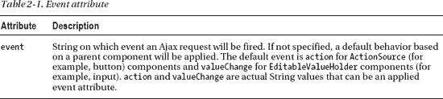

如果我们想在我们的示例中指定 `change` 事件（这也是默认事件），代码将如清单 2-11 所示，并且工作方式完全相同。

***清单 2-11.** 指定 change 事件*

`<h:inputText value="#{bean.text}">`
`   <f:ajax event="change"/>`
`</h:inputText>`

或者我们可以使用不同的事件，如清单 2-12 所示。

***清单 2-12.** 更改默认事件*

`<h:inputText value="#{bean.text}">`
`   <f:ajax event="keyup"/>`
`</h:inputText>`

 **注意** 如果你熟悉 RichFaces 3，你会使用 on [eventName] 来指定事件，例如 `onchange`。在 JSF 2 和 RichFaces 4 中，你只需指定实际的动作：`keyup`。

如果我们使用按钮，代码将如清单 2-13 所示。

***清单 2-13.** 示例按钮*

`<h:commandButton value="保存">`
`   <f:ajax/>`
`</h:commandButton>`

我们没有指定事件，因为它将默认为 click。如果我们想指定一个不同的事件，我们将使用清单 2-14 中所示的 `event` 属性。

***清单 2-14.** 事件属性*

`<h:commandButton value="保存">`
`   <f:ajax event="mouseover"/>`
`</h:commandButton>`

现在我们已经介绍了触发 Ajax 请求的基础知识，接下来让我们添加一个非常重要的部分：部分视图渲染。

#### 部分视图渲染

既然我们已经知道如何触发 Ajax 请求，我们还想进行部分页面更新或部分视图渲染。

 **注意** 从现在开始，每当我们使用 *`<f:ajax>`* 标签时，即使它是默认事件，我们也会指定该事件。我们认为这能使代码更具可读性且更易于理解。

由于我们处于 JSF 的上下文中，我们可以通过 `render` 属性指定要更新或渲染的组件，该属性在表 2-2 中进行了描述。

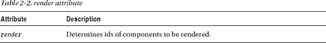

更新我们的示例将如清单 2-15 所示。

***清单 2-15.** 更新示例*

`<h:form>`
`   <h:panelGrid>`
`      <h:inputText value="#{bean.text}" >`
`         <f:ajax event="keyup" render="text"/>`
`      </h:inputText>`
`      <h:outputText id="text" value="#{bean.text}" />`
`   </h:panelGrid>`
`</h:form>`

每次 `keyup` 事件发生时，都会向服务器发起一个 Ajax 请求。该请求将经历标准的 JSF 生命周期，但不会渲染整个视图，我们只渲染 id 为 `text` 的 `<h:outputText>` 组件。

 **注意** 在 RichFaces 3 中，用于指定要重新渲染内容的属性称为 `reRender`。在 JSF 2 中，它被称为 `render`。由于 RichFaces 4 基于 JSF 2，它在所有组件中都使用 `render`。你也可以使用绝对寻址来定义 id，例如当更新放置在其他表单中具有相同“text” id 的组件时。例如，`render=":form2:text"`。

在前面的示例中，我们将 `render` 设置为一个组件。我们也可以决定渲染多个组件。在这种情况下，我们只需列出所有组件的 id，用空格分隔，如下所示：

`<f:ajax event="keyup" render="id1 id2 id3"/>`

如果你不想列出每一个单独的组件，也可以只渲染父容器，例如 `<h:panelGrid>`。在这种情况下，其所有子组件也将被渲染，如清单 2-16 所示。

***清单 2-16.** 渲染面板内的所有组件*

`<h:commandButton value="保存">`
`    <f:ajax event="click" render="out"/>`
`</h:commandButton>`
`…`
`<h:panelGrid id="out">`
`   <h:outputText />`
`   <h:outputText />`
`</h:panelGrid>`

除了组件 id 之外，*`render`* 也可以设置为一些预定义的值，如表 2-3 所示。

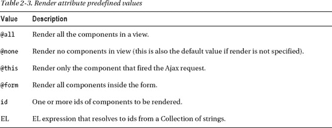

在我们继续讨论部分视图处理之前，还有一件事想告诉你。你会听到人们互换使用术语 *部分页面更新* 和 *部分视图渲染*。这完全没问题，但值得指出它们在 JSF 上下文中的关系。

在 JSF 中，视图是在服务器端渲染的。当我们添加 Ajax 时，视图仍然在服务器端渲染——我们只是不需要渲染所有内容。我们渲染指定的组件，因此我们称之为部分视图渲染。当渲染后的响应（在 Ajax 请求之后）被发送到浏览器时，部分页面更新就在浏览器中发生了。有一个 JavaScript 库负责接收响应并执行 DOM（文档对象模型）更新。使用部分页面更新或部分视图渲染都可以——只要你理解标记是在服务器端渲染的，而实际的页面更新发生在浏览器中。

#### 局部视图处理

在不使用 Ajax 的情况下，当页面（表单）被提交时，整个表单会在服务器端被处理。我们所说的*在服务器端处理*，指的是输入或动作组件会经历 JSF 生命周期；具体来说，包括应用请求值、处理验证、更新模型和调用应用程序等阶段。

同样，不使用 Ajax 时，处理过程很简单。整个表单或表单内的所有组件都会被处理。当使用 Ajax 时，情况就不同了。我们可能只想处理某个特定的组件，而不处理所有其他组件；例如，如果我们只想验证一个组件，而不需要验证其他任何东西。在这种情况下，我们需要能够选择哪个组件被处理。

决定处理什么内容是通过 `execute` 属性来完成的，如表 2-4 所述。

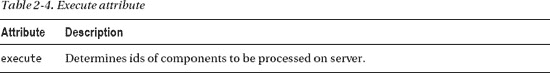

`execute` 属性可以有不同的值，如表 2-5 所示。

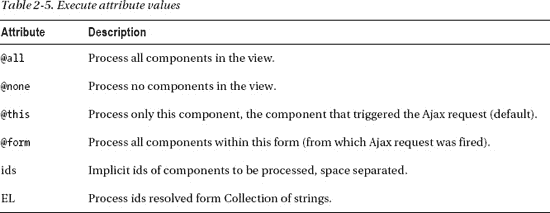

请注意，默认值是 `@this`，这意味着触发 Ajax 请求的组件默认会被处理。清单 2-17 展示了一个示例。

***清单 2-17.** 示例*

`<h:commandButton value="Click">`
`  <f:ajax render="id"/>`
`</h:commandButton>`

这等同于清单 2-18。

***清单 2-18.** 另一个示例*

`<h:commandButton value="Click">`
`  <f:ajax execute="@this" render="id"/>`
`</h:commandButton>`

如果我们只想处理（执行）按钮，一切都没问题。但是，如果我们遇到像清单 2-19 这样的情况会发生什么呢？

***清单 2-19.** 示例代码*

`<h:form>`
`   <h:panelGrid columns="2">`
`      <h:outputText value="Text:" />`
`      <h:inputText value="#{bean.text}" />`

`      <h:outputText value="Echo:" />`
`      <h:outputText id="text" value="#{bean.text}" />`

`      <h:outputText value="Count:" />`
`      <h:outputText id="count" value="#{bean.count}" />`
`   </h:panelGrid>`
`   <h:commandButton value="Submit">`
`      <f:ajax render="text count" listener="#{bean.countListener}" />`
`   </h:commandButton>`
`</h:form>`

托管 Bean 如清单 2-20 所示。

***清单 2-20.** 托管 Bean*

`@ManagedBean`
`@RequestScoped`
`public class Bean {`

`   private String text;`
`   private Integer count;`

`   public void countListener(AjaxBehaviorEvent event) {`
`      count = text.length();`
`   }`
`}`

一切看起来都很好，但当你运行它时，你会得到一个错误。你看到问题出在哪里了吗？我们将 Ajax 行为附加到一个按钮上，使用了 `execute` 的默认值 `@this`。当按钮被点击时，只有那个按钮被处理；输入字段没有被处理，在监听器中你会得到一个异常（因为 `text` 属性为 null，所以是 `NullPointerException`）。

这个代码示例引入了另一个 `<f:ajax>` 行为属性 `listener`，如表 2-6 所述。

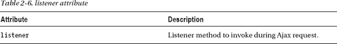

请注意，`listener` 接受一个 `AjaxBehaviorEvent` 类型的参数，如清单 2-21 所示。

***清单 2-21.** 监听器接受一个 AjaxBehaviorEvent 类型的参数*

`import javax.faces.event.AjaxBehaviorEvent;`

`public void listenerName(AjaxBehaviorEvent event) {`
`   …`
`}`

 **注意** 整个表单仍然会被提交到服务器。但只有按钮在服务器端被处理（执行）。如果你一直在使用 RichFaces 3，那么你会立即遇到这个问题，因为默认情况下整个表单都会被处理。

有多种方法可以解决这个问题。首先，我们可以在 `execute` 属性中列出我们想要处理的 id，如清单 2-22 所示。

***清单 2-22.** 在 execute 属性中列出我们想要处理的 id*

`<h:form>`
`   <h:panelGrid columns="2">`
`      <h:outputText value="Text:" />`
`<h:inputText` **`id="inputText"`** `value="#{bean.text}" />`

`      <h:outputText value="Echo:" />`
`      <h:outputText id="text" value="#{bean.text}" />`

`      <h:outputText value="Count:" />`
`      <h:outputText id="count" value="#{bean.count}" />`
`   </h:panelGrid>`
`   <h:commandButton value="Submit">`
`      <f:ajax render="text count" listener="#{bean.countListener}"`
**`execute="inputText"`**`/>`
`   </h:commandButton>`
`</h:form>`

 **注意** 即使我们没有在 `execute` 列表中列出按钮，该按钮也会被自动处理，因为它是被激活的控件。

除了列出 id，另一种选择是使用预定义值 `@form` 来处理整个表单，如清单 2-23 所示。

***清单 2-23.** 使用预定义值 @form 的选项*

`<h:form>`
`   <h:panelGrid columns="2">`
`      <h:outputText value="Text:" />`
`<h:inputText` **`id="inputText"`** `value="#{bean.text}" />`

`      <h:outputText value="Echo:" />`
`      <h:outputText id="text" value="#{bean.text}" />`

`      <h:outputText value="Count:" />`
`      <h:outputText id="count" value="#{bean.count}" />`
`   </h:panelGrid>`
`   <h:commandButton value="Submit">`
`      <f:ajax render="text count" listener="#{bean.countListener}"`
**`execute="@form"`**`/>`
`   </h:commandButton>`
`</h:form>`

此时你可能在想，RichFaces 的内容在哪里？嗯，我们想确保你首先熟悉 JSF 2 中的基本 Ajax 特性，因为 RichFaces 4 中的所有内容都基于核心的 JSF 2 功能。

既然我们已经介绍了基础知识，我们可以开始学习 RichFaces 如何升级并使这个基本功能集更加强大。如果你觉得需要更多关于 JSF 2 的内容，我们推荐以下两本书：David Geary 和 Cay Horstmann 合著的 *Core JavaServer Faces (Third Edition)*（Prentice Hall, 2010），以及 Ed Burns 和 Chris Schalk 合著的 *JavaServer Faces 2.0: The Complete Reference*（McGraw-Hill, 2009）。

### RichFaces <a4j:ajax>

我们首先要告诉你的是，过去常用且流行的 `a4j:support` 已经被淘汰了。取而代之的是新的、闪亮的 `<a4j:ajax>` 标签。为什么会有这个变化？RichFaces 4 基于 JSF 2，为了表明 RichFaces 只是扩展了核心功能，该标签遵循相同的命名约定，因此现在被称为 `<a4j:ajax>`。

此时你可能想知道标准的 `<f:ajax>` 和 `<a4j:ajax>` 标签之间有什么区别。首先，`<a4j:ajax>` 100% 基于 `<f:ajax>` 的行为功能。

清单 2-24 展示了本章中使用的一个示例。

***清单 2-24.** 示例*

`<h:inputText value="#{bean.text}">`
`   <f:ajax event="change"/>`
`</h:inputText>`

我们可以像清单 2-25 那样重写。

***清单 2-25.** 清单 2-24 的重写*

`<h:inputText value="#{bean.text}">`
`   <a4j:ajax event="change"/>`
`</h:inputText>`

它的工作方式完全相同。换句话说，在任何你看到 `<f:ajax>` 的地方，都可以用 `<a4j:ajax>` 替换，并且一切都会以完全相同的方式工作。除了名称更改，你还能得到什么？表 2-7 总结了使用 `<a4j:ajax>` 标签时获得的额外功能。

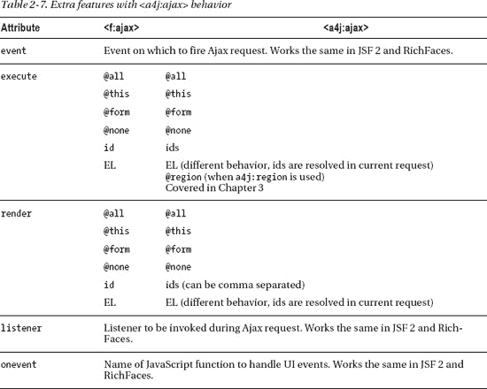

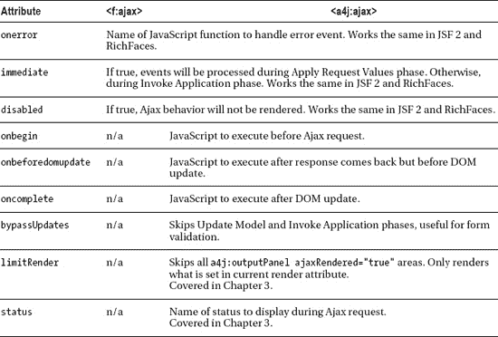

现在让我们更详细地探讨每个特性或升级。

#### render 属性选项

如您所见，`render` 属性的工作方式基本相同，但在使用 id 或 EL 时存在一些差异，如表 2-8 所示。

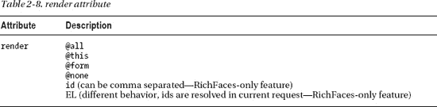

在标准 JSF 2 中，可以在 `render` 中列出任意数量的 id，每个 id 之间用空格分隔，如清单 2-26 所示。

***清单 2-26.** 列出任意数量的 id，每个 id 之间用空格分隔*

`<h:inputText value="#{bean.text}">`
`   <f:ajax event="change" render="id1 id2 id3 idX"/>`
`</h:inputText>`

使用 `<a4j:ajax>` 时，除了空格，还可以使用逗号 (,) 进行分隔，如清单 2-27 所示。

***清单 2-27.** 使用逗号而非仅空格分隔 id 的示例*

`<h:inputText value="#{bean.text}">`
`   <f:ajax event="change" render="id1, id2, id3, idN"/>`
`</h:inputText>`

我们认为，对于曾将 `<a4j:support>` 与 RichFaces 3 一起使用的用户来说，使用逗号稍微简单一些，也更熟悉，但这完全取决于您。

第二个差异更为重要。接下来，我们将通过一个示例来展示它在 JSF 2 中的工作方式。

##### 动态渲染

为了展示动态渲染在 JSF 2 中的工作方式，我们将创建一个示例页面，效果如图 2-1 所示。

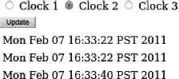

***图 2-1.** 三个时钟的动态渲染*

我们不会硬编码要渲染的组件，而是选择要更新的组件。现在，JSF 2 支持将 `render` 属性设置为 EL；但是，在使用 RichFaces 时，其工作方式略有不同。

清单 2-28 展示了 JSF 页面。

***清单 2-28.** 展示 JSF 页面*

`<h:form id="form">`
`   <h:panelGrid>`
`      <h:selectOneRadio value="#{bean.selection}">`
`         <f:selectItem itemValue="clock1" itemLabel="时钟 1" />`
`         <f:selectItem itemValue="clock2" itemLabel="时钟 2" />`
`         <f:selectItem itemValue="clock3" itemLabel="时钟 3" />`
`      </h:selectOneRadio>`
`      <h:commandButton id="updateButton" value="更新">`
`        <f:ajax event="click" execute="@form" listener="#{bean.selectComponents}"`
`                render="#{bean.renderComponents}" />`
`       </h:commandButton>`
`   </h:panelGrid>`
`   <h:panelGrid cellspacing="6">`
`      <h:outputText id="clock1" value="#{bean.clock1}" />`
`      <h:outputText id="clock2" value="#{bean.clock2}" />`
`      <h:outputText id="clock3" value="#{bean.clock3}" />`
`   </h:panelGrid>`
`</h:form>`

清单 2-29 展示了托管 bean。

***清单 2-29.** 展示托管 bean*

`import java.util.ArrayList;`
`import java.util.Date;`
`import java.util.List;`

`import javax.annotation.PostConstruct;`
`import javax.faces.bean.ManagedBean;`
`import javax.faces.context.FacesContext;`
`import javax.faces.event.AjaxBehaviorEvent;`

`@ManagedBean`
`@RequestScoped`
`public class Bean {`

`   private String selection;`
`   private List <String> renderComponents;`

`   @PostConstruct`
`   public void init (){`
`      renderComponents = new ArrayList <String>();`
`      renderComponents.add("updateButton");`
`   }`
`   public void selectComponents (AjaxBehaviorEvent event){`
`      renderComponents.add(selection);`
`   }`
`   public List<String> getRenderComponents() {`
`      return renderComponents;`
`   }`
`   public String getSelection() {`
`      return selection;`
`   }`
`   public void setSelection(String selection) {`
`      this.selection = selection;`
`   }`
`   public Date getClock1() {`
`      return new Date();`
`   }`
`   public Date getClock2() {`
`      return new Date();`
`   }`
`   public Date getClock3() {`
`      return new Date();`
`   }`
`}`

选择时钟 2 并按下更新。什么也没发生。现在继续选择时钟 3。点击更新。时钟 2 被更新了。这不是一个 bug，这就是 JSF 2 将 `render` 绑定到 EL 时的工作方式。

让我们逐步分析，如下所示：

1.  页面首次渲染
2.  选择任意时钟，比如时钟 1。点击提交。
3.  `Clock1` 的值被发送到服务器。此时，我们期望组件 `Clock1` 被渲染（但这只会在下一次请求时发生）。
4.  在渲染期间，解析 `#{bean.renderComponents}`，并将 `Clock1` 的 id 渲染到页面中。
5.  例如，当我们下次选择时钟 3 并触发请求时，之前渲染到页面中的 `Clock1` id 现在将被渲染。

如您所见，在 render 中使用 EL 时，渲染组件会有一个请求的延迟。这意味着要渲染的组件（id）需要来自浏览器。为了使所需的组件 id 在每次请求时都能更新，我们需要渲染实际的按钮——这样 `#{bean.renderComponents}` 就会被解析，并且新的值会被渲染出来。这通过以下 `init()` 方法实现：

`renderComponents.add("updateButton");`

为了解决这个问题，我们可以直接使用 JSF 的 `PartialViewContext` 类。这个类保存了要渲染的 id；如果我们以编程方式添加 id，那么渲染将在正确的时间发生。更新后的 `selectComponents` 方法将如清单 2-30 所示。

***清单 2-30.** 更新后的 selectComponents 方法*

`public void selectComponents (AjaxBehaviorEvent event){`
`   UIComponent button = event.getComponent();`
`   UIOutput output = (UIOutput)button.findComponent(selection);`
`   FacesContext.getCurrentInstance().getPartialViewContext().getRenderIds().`
`      add(output.getClientId());`
`}`

我们首先获取触发 Ajax 请求的按钮组件的引用。然后使用 `findComponent(id)` 方法找到我们想要渲染的输出组件。在最后一行，我们获取输出组件的客户端 id，并将要渲染的组件添加进去。

这允许我们在当前请求中包含要渲染的组件 id，而不是像之前那样延迟一个请求。通过此更改，我们还可以更新 `init()` 方法，如清单 2-31 所示。

***清单 2-31.** 更新 init() 方法*

`@PostConstruct`
`public void init (){`
`   renderComponents = new ArrayList <String>();`
`}`

我们可以移除 `render="#{bean.renderComponents}"`，因为它不再被使用。按钮将如清单 2-32 所示。

***清单 2-32.** 展示移除 `render="#{bean.renderComponents}"` 后按钮的样子*

`<h:commandButton id="updateButton" value="更新">`
`   <f:ajax event="click" execute="@form" listener="#{bean.selectComponents}"/>`
`</h:commandButton>`

这种方法可行，但我们认为应该更简单。我们认为，如果能够继续使用 `render="#{bean.renderComponents}"` 并在同一个请求中解析 id，那会更简单。如果我们使用 RichFaces 的 `<a4j:ajax>` 行为，这是可能的。

 **提示** JSF 2 只是将所有参数从客户端传递到服务器。RichFaces 4 也会在服务器端评估这些参数。

##### 使用 RichFaces 进行动态渲染

当使用 RichFaces 的 `<a4j:ajax>` 和 `render="#{bean.renderComponents}"` 时，需要渲染的组件 ID 会在当前请求中解析。回到我们最初的示例，只需改用 `<a4j:ajax>`，一切就能正常工作。清单 2-33 再次展示了这个 JSF 页面。

***清单 2-33.** 展示 JSF 页面*

`<h:form id="form">`
`   <h:panelGrid>`
`      <h:selectOneRadio value="#{bean.selection}">`
`         <f:selectItem itemValue="clock1" itemLabel="时钟 1" />`
`         <f:selectItem itemValue="clock2" itemLabel="时钟 2" />`
`         <f:selectItem itemValue="clock3" itemLabel="时钟 3" />`
`      </h:selectOneRadio>`
`      <h:commandButton id="updateButton" value="更新">`
`      <a4j:ajax event="click" execute="@form"`
`         listener="#{bean.selectComponents}"   `
`            render="#{bean.renderComponents}"/>`
`       </h:commandButton>`
`   </h:panelGrid>`
`   <h:panelGrid cellspacing="6">`
`      <h:outputText id="clock1" value="#{bean.clock1}" />`
`      <h:outputText id="clock2" value="#{bean.clock2}" />`
`      <h:outputText id="clock3" value="#{bean.clock3}" />`
`   </h:panelGrid>`
`</h:form>`

我们所做的只是将行为名称从 `<f:ajax>` 改为 `<a4j:ajax>`。

清单 2-34 展示了受管 bean。

***清单 2-34.** 展示受管 bean*

`@ManagedBean`
`@RequestScoped`
`public class Bean {`

`   private String selection;`
`   private List <String> renderComponents;`

`   @PostConstruct`
`   public void init (){`
`      renderComponents = new ArrayList <String>();`
`   }`
`   public void selectComponents (AjaxBehaviorEvent event){`
`      renderComponents.add(selection);`
`   }`
`   public List<String> getRenderComponents() {`
`      return renderComponents;`
`   }`
`   public String getSelection() {`
`      return selection;`
`   }`
`   public void setSelection(String selection) {`
`      this.selection = selection;`
`   }`
`   public Date getClock1() {`
`      return new Date();`
`   }`
`   public Date getClock2() {`
`      return new Date();`
`   }`
`   public Date getClock3() {`
`      return new Date();`
`   }`
`}`

请注意，我们不再需要将按钮添加到要渲染的组件列表中。运行应用程序，现在所有内容都会按预期更新。

简洁只是使用 `<a4j:ajax>` 和绑定到 EL 的 `render` 属性的优势之一。另一个优势是，在服务器端评估 ID 而非从客户端获取它们更加安全，因为任何人都可以使用 `<f:ajax>` 发送带有 ID 的请求。如果这种情况发生在 `<a4j:ajax>` 上，这些 ID 将被直接忽略。

 **注意** 其他 RichFaces 标签也提供相同的功能，例如 `<a4j:commandButton>`、`<a4j:commandLink>`、`<a4j:poll>` 和 `<a4j:jsFunction>`。我们将在第 3 章中介绍这些内容。我们在 `<f:ajax>` 或 `<a4j:ajax>` 行为上使用了 `listener` 属性。如果你在按钮或链接上设置了 action 或 `actionListener`，它们将以标准方式被调用。

#### execute 属性选项

与可以将 `render` 属性绑定到 EL 或在运行时决定渲染哪些组件一样，也可以在运行时决定执行哪些组件，或将 `execute` 属性绑定到 EL。例如：

`<f:ajax event="blur" execute="#{bean.executeComponents}" render="out"/>`

当仅使用 JSF 2 时，`execute` 在 ID 解析时机方面的工作方式与 `render` 类似。与 `render` 一样，`execute` 中的 ID 会被解析，然后渲染到页面上，并且仅在下一个请求中使用。当使用 RichFaces 的 `a4j:ajax` 行为而不是 *`f`*`:ajax` 时，ID 会被解析，并且这些组件会在当前请求中执行。

`<a4j:ajax event="blur" execute="#{bean.executeComponents}" render="out"/>`

虽然在运行时决定渲染哪些组件很常见，但决定执行哪些组件却很少使用（即便有的话）。但是，理解在使用 JSF 2 `<f:ajax>` 和 RichFaces `<a4j:ajax>` 行为时，ID 何时被解析以及何时被使用的区别非常重要。

RichFaces 通过其 `<a4j:region>` 标签提供了另一个用于决定执行内容的选项。该标签将在第 3 章中介绍。

#### bypassUpdates 属性

验证在任何 Web 应用中显然都是一项非常常见的任务。当仅验证表单输入时，通常不需要经历 JSF 生命周期的所有阶段，特别是更新模型阶段和调用应用阶段。在本节中，你将学习如何在验证表单字段时跳过这两个阶段，以优化 JSF 请求。让我们从一个非常简单的示例开始，该示例看起来像图 2-2。

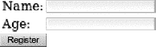

***图 2-2.** 一个简单的注册表单。*

图 2-3 显示了发生错误时的样子。

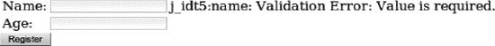

***图 2-3.** 带有错误消息的简单注册表单*

清单 2-35 展示了 `register.xhtml` 页面。

***清单 2-35.** 展示 `register.xhtml` 页面*

`<h:form>`
`   <h:panelGrid columns="3">`
`      <h:outputText value="Name:" />`
`      <h:inputText id="name" value="#{bean2.name}">`
`         <f:validateRequired/>`
`         <f:validateLength minimum="3"/>`
`         <a4j:ajax event="blur" render="errorName"/>`
`      </h:inputText>`
`      <h:message id="errorName" for="name"/>`

`      <h:outputText value="Age:" />`
`      <h:inputText id="age" value="#{bean2.age}">`
`         <f:validateRequired/>`
`         <f:validateLongRange minimum="0"/>`
`         <a4j:ajax event="blur" render="errorAge"/>`
`      </h:inputText>`
`      <h:message id="errorAge" for="age"/>`
`   </h:panelGrid>`
`   <h:commandButton value="Register" action="result"/>`
`</h:form>`

清单 2-36 展示了 `result.xhtml` 页面。

***清单 2-36.** 展示 `result.xhtml` 页面*

`<h:panelGrid>`
`      <h:outputText value="#{bean2.name}, #{bean2.age}" />`
`</h:panelGrid>`

清单 2-37 展示了受管 bean。

***清单 2-37.** 展示受管 bean*

`@ManagedBean`
`@RequestScoped`
`public class Bean2 {`
`   private String name;`
`   private Integer age;`

`   // getters and setters`
`}`

这是一个非常简单的带有基于 Ajax 验证的注册表单。换句话说，当我们使字段失去焦点（Tab 键移出或点击外部）时，会触发一个 Ajax 请求。我们开始经历 JSF 阶段。如果存在验证错误，在“处理验证”阶段之后，我们会转到“渲染响应”阶段。如果没有验证错误，那么我们会完成所有阶段，经历“更新模型”和“调用应用”阶段。为了观察实际效果，让我们创建一个阶段监听器，它会在我们经过每个阶段时向控制台打印一条消息。

如果你需要回顾 JSF 阶段，它们显示在图 2-4 中。

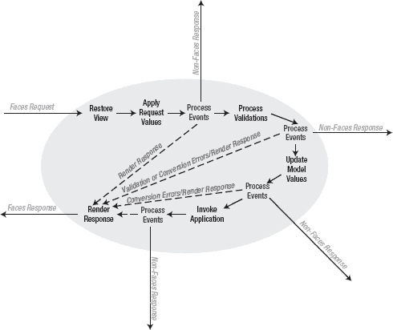

***图 2-4.** JSF 生命周期图*

JSF 在每个阶段之前和之后触发所谓的事件。我们可以编写一个监听器来监听这些事件，并向日志输出一条消息。阶段监听器可以用于其他任何目的，例如在阶段之间注入自定义功能。

阶段监听器如清单 2-38 所示。

***清单 2-38.** 阶段监听器*

`import javax.faces.event.PhaseEvent;`
`import javax.faces.event.PhaseId;`
`import javax.faces.event.PhaseListener;`

`public class PhaseTracker implements PhaseListener {`

`   public void afterPhase(PhaseEvent event) {`
`      event.getFacesContext().getExternalContext().log("AFTER`
`         "+event.getPhaseId());`
`   }`
`   public void beforePhase(PhaseEvent event) {`
`      event.getFacesContext().getExternalContext().log("BEFORE  `
`         "+event.getPhaseId());`
`   }`
`   public PhaseId getPhaseId() {`
`      return PhaseId.ANY_PHASE;`
`   }`
`}`

`beforePhase` 和 `afterPhase` 方法非常简单。我们所做的只是向日志打印一条消息。`getPhaseId()` 返回要调用此特定监听器的阶段 ID。我们希望监听器在每个阶段都被调用，因此我们返回 `PhaseId.ANY_PHASE`。也可以返回一个特定的阶段，例如 `PhaseId.INVOKE_APPLICATION`，或者也可以返回两个或更多阶段。

最后一步是在 JSF 配置文件（`faces-config.xml`）中注册此阶段监听器，如清单 2-39 所示。

***清单 2-39.** 在 JSF 配置文件中注册阶段监听器*

`<lifecycle>`
`  <phase-listener>org.richfaces..book.PhaseTracker</phase-listener>`
`</lifecycle>`

在 JSF 2 中，阶段监听器还没有注解。

当你加载页面时，将鼠标光标放在名称字段内，然后点击其他地方。你应该会看到如清单 2-40 所示的控制台输出。

***清单 2-40.** 显示的控制台输出*

`INFO: BEFORE RESTORE_VIEW 1`
`Feb 8, 2011 2:39:49 PM org.apache.catalina.core.ApplicationContext log`
`INFO: AFTER RESTORE_VIEW 1`
`Feb 8, 2011 2:39:49 PM org.apache.catalina.core.ApplicationContext log`
`INFO: BEFORE APPLY_REQUEST_VALUES 2`
`Feb 8, 2011 2:39:49 PM org.apache.catalina.core.ApplicationContext log`
`INFO: AFTER APPLY_REQUEST_VALUES 2`
`Feb 8, 2011 2:39:49 PM org.apache.catalina.core.ApplicationContext log`
`INFO: BEFORE PROCESS_VALIDATIONS 3`
`Feb 8, 2011 2:39:49 PM org.apache.catalina.core.ApplicationContext log`
`INFO: AFTER PROCESS_VALIDATIONS 3`
`Feb 8, 2011 2:39:49 PM org.apache.catalina.core.ApplicationContext log`
`INFO: BEFORE RENDER_RESPONSE 6`
`Feb 8, 2011 2:39:49 PM org.apache.catalina.core.ApplicationContext log`
`INFO: AFTER RENDER_RESPONSE 6`

我们到达了阶段 3，验证失败，然后我们跳转到了阶段 6。到目前为止，一切都很合理。现在为名称或年龄输入一个有效值。你现在应该会看到如清单 2-41 所示的控制台输出。

***清单 2-41.** 输入有效值后，你将看到以下控制台输出*

`INFO: BEFORE RESTORE_VIEW 1`
`Feb 8, 2011 2:41:23 PM org.apache.catalina.core.ApplicationContext log`
`INFO: AFTER RESTORE_VIEW 1`
`Feb 8, 2011 2:41:23 PM org.apache.catalina.core.ApplicationContext log`
`INFO: BEFORE APPLY_REQUEST_VALUES 2`
`Feb 8, 2011 2:41:23 PM org.apache.catalina.core.ApplicationContext log`
`INFO: AFTER APPLY_REQUEST_VALUES 2`
`Feb 8, 2011 2:41:23 PM org.apache.catalina.core.ApplicationContext log`
`INFO: BEFORE PROCESS_VALIDATIONS 3`
`Feb 8, 2011 2:41:23 PM org.apache.catalina.core.ApplicationContext log`
`INFO: AFTER PROCESS_VALIDATIONS 3`
`Feb 8, 2011 2:41:23 PM org.apache.catalina.core.ApplicationContext log`
`INFO: BEFORE UPDATE_MODEL_VALUES 4`
`Feb 8, 2011 2:41:23 PM org.apache.catalina.core.ApplicationContext log`
`INFO: AFTER UPDATE_MODEL_VALUES 4`
`Feb 8, 2011 2:41:23 PM org.apache.catalina.core.ApplicationContext log`
`INFO: BEFORE INVOKE_APPLICATION 5`
`Feb 8, 2011 2:41:23 PM org.apache.catalina.core.ApplicationContext log`
`INFO: AFTER INVOKE_APPLICATION 5`
`Feb 8, 2011 2:41:23 PM org.apache.catalina.core.ApplicationContext log`
`INFO: BEFORE RENDER_RESPONSE 6`
`Feb 8, 2011 2:41:23 PM org.apache.catalina.core.ApplicationContext log`
`INFO: AFTER RENDER_RESPONSE 6`

由于验证没有失败，我们完成了所有阶段。下一个问题是：当我们仅进行验证时，是否需要经历所有阶段？可能不需要。当仅进行验证时，到达阶段 3（处理验证）就足够了，即使输入正确，我们也可以跳转到“渲染响应”阶段。当我们实际上不需要时，为什么要调用“更新模型”和“调用应用”阶段呢？让我们让请求更快一些。

当点击 Register 按钮时，我们不想经历所有阶段，而是希望跳过“更新模型”和“调用应用程序”阶段。如何实现这一点？这时就需要用到 *`bypassUpdates`* 属性，该属性在表 2-9 中进行了描述。

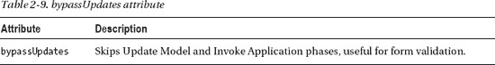

代码清单 2-42 展示了更新 JSF 页面并设置 `bypassUpdates="true"` 的方法。

***代码清单 2-42.** 更新 JSF 页面*

`<h:form>`
`   <h:panelGrid columns="3">`
`      <h:outputText value="名称：" />`
`      <h:inputText id="name" value="#{bean2.name}">`
`         <f:validateRequired/>`
`         <f:validateLength minimum="3"/>`
`<a4j:ajax event="blur" render="errorName"` **`bypassUpdates="true"`**`/>`
`      </h:inputText>`
`      <h:message id="errorName" for="name"/>`

`      <h:outputText value="年龄：" />`
`      <h:inputText id="age" value="#{bean2.age}">`
`         <f:validateRequired/>`
`         <f:validateLongRange minimum="0"/>`
`<a4j:ajax event="blur" render="errorAge"` **`bypassUpdates="true"`**`/>`
`      </h:inputText>`
`      <h:message id="errorAge" for="age"/>`
`   </h:panelGrid>`
`   <h:commandButton value="注册" action="result"/>`
`</h:form>`

再次运行页面并输入无效值会导致验证失败；然后从“处理验证”阶段直接跳转到“渲染响应”阶段，和之前一样。但是，当我们输入有效值时，由于设置了 *`bypassUpdates="true"`*，我们会得到相同的行为。例如，在名称字段中输入“Joe”，然后点击字段外部，你应该能在代码清单 2-43 所示的控制台中看到输出。

***代码清单 2-43.** 输入名称字段后的控制台示例*

`INFO: AFTER RESTORE_VIEW 1`
`Feb 8, 2011 3:01:28 PM org.apache.catalina.core.ApplicationContext log`
`INFO: BEFORE APPLY_REQUEST_VALUES 2`
`Feb 8, 2011 3:01:28 PM org.apache.catalina.core.ApplicationContext log`
`INFO: AFTER APPLY_REQUEST_VALUES 2`
`Feb 8, 2011 3:01:28 PM org.apache.catalina.core.ApplicationContext log`
`INFO: BEFORE PROCESS_VALIDATIONS 3`
`Feb 8, 2011 3:01:28 PM org.apache.catalina.core.ApplicationContext log`
`INFO: AFTER PROCESS_VALIDATIONS 3`
`Feb 8, 2011 3:01:28 PM org.apache.catalina.core.ApplicationContext log`
`INFO: BEFORE RENDER_RESPONSE 6`
`Feb 8, 2011 3:01:28 PM org.apache.catalina.core.ApplicationContext log`
`INFO: AFTER RENDER_RESPONSE 6`

一旦我们到达“处理验证”阶段，组件就会被验证，然后我们直接进入“渲染响应”阶段。同样，没有必要继续执行其他阶段，因为当点击 Register 按钮时它们会被调用。所以总结一下，`bypassUpdates` 在执行基于 Ajax 的验证时非常有用。

#### JavaScript 交互或回调事件

触发 Ajax 请求不需要编写任何 JavaScript 代码。使用 `<f:ajax>` 或更高级的 `<a4j:ajax>` 可以从任何组件触发 Ajax 请求。然而，在某些情况下，你可能希望在 Ajax 请求完成之前或之后调用或注入自定义的 JavaScript 函数。JSF 2 提供了两个回调事件，`onevent` 和 `onerror`，允许你在 Ajax 请求期间调用自定义 JavaScript。它们分别在表 2-10 中进行了描述。

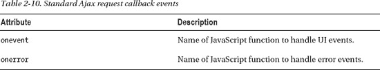

`onevent` 包含三个子事件，在表 2-11 中进行了描述。

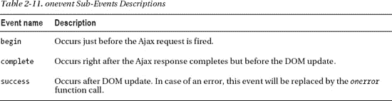

让我们从一个简单的例子开始。应用程序看起来像图 2-5 所示。

***图 2-5.** 一个带有不同颜色的简单表单*

代码清单 2-44 展示了 JSF 页面。

***代码清单 2-44.** 展示 JSF 页面*

`<h:form>`
`   <h:panelGrid id="panel" style="background-color: #{bean3.color}">`
`      <h:selectOneRadio value="#{bean3.color}">`
`         <f:selectItem itemValue="red" itemLabel="红色" />`
`         <f:selectItem itemValue="yellow" itemLabel="黄色" />`
`         <f:selectItem itemValue="blue" itemLabel="蓝色" />`
`         <f:ajax event="click" render="panel" />`
`      </h:selectOneRadio>`
`   </h:panelGrid>`
`</h:form>`

代码清单 2-45 展示了受管 bean。

***代码清单 2-45.** 展示受管 bean*

`@ManagedBean`
`@RequestScoped`
`public class Bean3 {`
`   private String color;`

`   // getter 和 setter`
`}`

让我们看看如何使用 *`onevent`* 回调来添加自定义 JavaScript，以便在 Ajax 请求期间被调用。请记住，这些是客户端（浏览器）事件。首先，我们需要创建 JavaScript 函数。我们可以将代码清单 2-46 放在 JSF 页面中 `<body>` 标签之后。

***代码清单 2-46.** 创建 JavaScript 函数*

``

因为 `ajaxRequestListener` JavaScript 函数会在 *`begin`*、*`complete`* 和 *`success`* 这三个时间点被调用三次，所以该函数包含三个 if 语句来分别处理每个事件。我们唯一需要做的就是将回调函数添加到 `<f:ajax>` 行为中，如代码清单 2-47 所示。

***代码清单 2-47.** 将回调函数添加到 `<f:ajax>` 行为中*

`<h:form>`
`   <h:panelGrid id="panel" style="background-color: #{bean3.color}">`
`      <h:selectOneRadio value="#{bean3.color}">`
`         <f:selectItem itemValue="red" itemLabel="红色" />`
`         <f:selectItem itemValue="yellow" itemLabel="黄色" />`
`         <f:selectItem itemValue="blue" itemLabel="蓝色" />`
`<f:ajax event="click" render="panel"` **`onevent="ajaxRequestListener"`**`/>`
`      </h:selectOneRadio>`
`   </h:panelGrid>`
`</h:form>`

图 2-6 展示了运行应用程序并选择新颜色的情况。

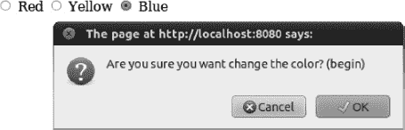

***图 2-6.** 选择蓝色，begin 子事件*

图 2-7 展示了 complete 子事件的警告对话框。

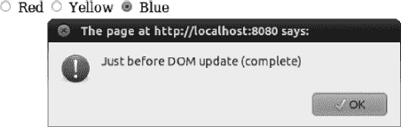

***图 2-7.** 选择蓝色，complete 子事件*

图 2-8 展示了 success 子事件的警告对话框。

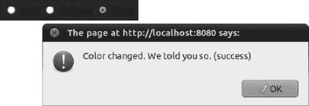

***图 2-8.** 选择蓝色，success 子事件*

现在我们来添加 *`onerror`* 回调函数。清单 2-48 展示了这个 JavaScript 函数。

***清单 2-48.** 展示 JavaScript 函数*

`function ajaxErrorListener (event){`
`   alert ('状态: '+event.status + "\nHTTP 错误: "+event.description );`
`}`

我们还需要在 `<f:ajax>` 标签中设置 `onerror` 属性。清单 2-49 展示了更新后的 `<f:ajax>` 标签。

***清单 2-49.** 在 `<f:ajax>` 行为中设置 onerror 属性*

`<f:ajax event="click" render="panel" onevent="ajaxRequest"  `
**`onerror="ajaxErrorListener"`**`/>`

要查看其工作原理，请加载页面，停止服务器，然后点击更改颜色。您将首先看到 `begin` 和 `complete` 消息。显示 `begin` 是因为触发了 Ajax 请求。显示 `complete` 是因为响应已完成，但出现了错误。此时，会调用 `onerror` 回调函数，您将看到如图 2-9 所示的消息。

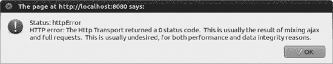

***图 2-9.** onerror 回调事件*

RichFaces 让回调函数的使用变得更简单。*`onevent`* 实际上由三个子事件（`begin`、`complete`、`success`）组成，如果您只对其中的一个感兴趣，则需要检查该事件，否则同一个函数会被三个事件都调用。RichFaces 通过在 `<a4j:ajax>` 行为上提供三个属性来简化操作：`onbegin`、`onbeforedomupdate` 和 `oncomplete`。每个属性都映射到不同的事件，如表 2-12 所述。

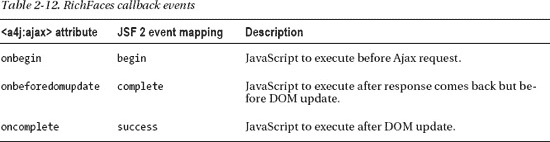

清单 2-50 展示了更新示例以使用带有这些属性的 `<a4j:ajax>`。

***清单 2-50.** 更新示例以使用 `<a4j:ajax>`*

`<h:form>`
`   <h:panelGrid id="panel" style="background-color: #{bean3.color}">`
`      <h:selectOneRadio value="#{bean3.color}">`
`         <f:selectItem itemValue="red" itemLabel="红色" />`
`         <f:selectItem itemValue="yellow" itemLabel="黄色" />`
`         <f:selectItem itemValue="blue" itemLabel="蓝色" />`
**`<a4j:ajax render="panel"`**

`               onbegin="if(!confirm('您确定要更改颜色吗？'))`
`        {form.reset(); return false;};"`
`        oncomplete="alert('颜色已更改。我们早就告诉过您。')"`
**`onbeforedomupdate="alert('即将更新 DOM')"`** `/>`
`      </h:selectOneRadio>`
`   </h:panelGrid>`
`</h:form>`

每个事件都作为一个独立的属性暴露出来，这使得使用更加方便。您不再需要定义一个函数并检查每个事件。请记住，这些属性仅在 RichFaces 的 `<a4j:ajax>` 行为上可用。

### 总结

在本章中，我们向您展示了如何使用 Maven 设置一个 RichFaces 项目，并介绍了如何使用 JSF 2 标准的 `<f:ajax>` 行为。然后，我们展示了 RichFaces 的 `<a4j:ajax>` 行为如何通过额外的功能和属性来升级标准的 `<f:ajax>`。

第 3 章将继续介绍 RichFaces 如何通过诸如 `<a4j:commandButton>`、`<a4j:commandLink>`、`<a4j:poll>`、`<a4j:jsFunction>` 和 `<a4j:region>` 等标签来升级和扩展标准的 Ajax 功能。请记住，我们在本章中介绍的所有功能和属性也适用于我们刚刚列出的这些标签。我们还将介绍高级客户端队列定制以及 RichFaces 在标准 JSF 2 队列之上提供的功能。

## 第 3 章

## a4j:* 标签、功能与概念

在前面的章节中，我们介绍了 RichFaces 的 `<a4j:ajax>` 标签，它通过更多功能和选项扩展并升级了标准的 *`<f:ajax>`* 标签。在本章中，我们将继续介绍 a4j:* 库的标签、功能和概念。我们将介绍更多触发 Ajax 请求的标签，例如 *`<a4j:poll>`*、*`<a4j:jsFunction>`*、使用 *`<a4j:outputPanel>`* 组件的高级渲染选项、高级执行选项，以及对标准 Ajax 客户端队列的众多升级。

### 发送 Ajax 请求

在本节中，您将学习如何使用三个新的 RichFaces 组件来发送 Ajax 请求：`<a4j:commandButton>`（和 `<a4j:commandLink>`）是一个内置 Ajax 行为的按钮；`<a4j:jsFunction>` 允许您从任何 HTML 事件或 JavaScript 函数发送 Ajax 请求；`<a4j:poll>` 使您能够定期发送 Ajax 请求。

#### 使用 `<a4j:commandButton>` 和 `<a4j:commandLink>`

为 JSF 按钮或链接添加 Ajax 行为并不困难，使用按钮时，其代码如清单 3-1 所示。

***清单 3-1.** 为 JSF 按钮添加 Ajax 行为*

`<h:form>`
`...`
`   <h:commandButton value="Send">`
`     <f:ajax event="click" render="out"/>`
`   </h:commandButton>`
`</h:form>`

使用链接代替按钮时，代码几乎完全相同，如清单 3-2 所示。

***清单 3-2.** 使用链接代替按钮*

`<h:form>`
`...`
`   <h:commandLink value="Send">`
`     <f:ajax event="click" render="out"/>`
`   </h:commandLink>`
`   <h:outputText id="out"/>`
`</h:form>`

在这两个示例中，当点击按钮时，会触发一个 Ajax 请求，并且 id 为 `out` 的组件会被重新渲染。在大多数情况下，你会有一组输入字段和一个用于提交它们的按钮，如清单 3-3 所示。

***清单 3-3.** 展示了一组输入字段和一个用于提交它们的按钮*

`<h:form>`
`   <h:panelGrid columns="2">`
`      <h:outputText value="Name:"/>`
`      <h:inputText value="#{bean.name}"/>`
`      <h:outputText value="Echo:"/>`
`      <h:outputText id="echo" value="#{bean.name}"/>`
`      <h:outputText value="Count:"/>`
`      <h:outputText id="count" value="#{bean.count}"/>`
`   </h:panelGrid>`
`   <h:commandButton value="Submit" action="#{bean.countAction}">`
`     <f:ajax event="click" render="echo count"/>`
`   </h:commandButton>`
`</h:form>`

托管 Bean 的代码如清单 3-4 所示。

***清单 3-4.** 托管 Bean 代码*

`@ManagedBean`
`@RequestScoped`

`public class Bean {`

`   private String name;`
`   private Integer count;`

`   public void countAction (){`
`      count = name.length();`
`   }`
`   // getters and setters`
`}`

当你运行上述示例时，它不会正常工作，因为我们忘记修改 `<f:ajax>` 行为上的 `execute` 属性。如果你还记得第 2 章的内容，`<f:ajax>` 的默认 `execute` 值是 `@this`。`@this` 意味着只有当前组件会被执行，而输入组件则不会。要修复这个问题，我们必须添加 `execute` 属性，如清单 3-5 所示。

***清单 3-5.** 添加 execute 属性*

`<h:form>`
`   <h:panelGrid columns="2">`
`      <h:outputText value="Name:"/>`
`      <h:inputText value="#{bean.name}"/>`
`      <h:outputText value="Echo:"/>`
`      <h:outputText id="echo" value="#{bean.name}"/>`
`      <h:outputText value="Count:"/>`
`      <h:outputText id="count" value="#{bean.count}"/>`
`   </h:panelGrid>`
`   <h:commandButton value="Submit" action="#{bean.countAction}">`
`     <f:ajax event="click" execute="@form" render="echo count"/>`
`   </h:commandButton>`
`</h:form>`

 **提示** `<f:ajax>` 行为中 `execute` 的默认值是 `@this`。此外，我们建议始终设置 `event` 属性，即使使用默认值，也能减少错误并使代码更具可读性。

RichFaces 通过提供内置 Ajax 支持的按钮和链接组件 `<a4j:commandButton>` 和 `<a4j:commandLink>`，使得使用支持 Ajax 的按钮或链接更加容易。清单 3-6 展示了一个我们之前见过的示例。

***清单 3-6.** 示例*

`<h:form>`
`...`
`   <h:commandButton value="Send">`
`     <f:ajax event="click" render="out"/>`
`   </h:commandButton>`
`</h:form>`

当使用 RichFaces 的 `<a4j:commandButton>` 时，该示例将如清单 3-7 所示。

***清单 3-7.** 使用 RichFaces `<a4j:commandButton>` 的示例*

`<h:form>`
`...`
`   <a4j:commandButton value="Send" render="out"/>`
`</h:form>`

我们从三行代码减少到仅一行。它看起来更简单、更简洁。还有一个区别需要告诉你。让我们使用 `<a4j:commandButton>` 重写这个示例，如清单 3-8 所示。

***清单 3-8.** 使用 `<a4j:commandButton>` 的示例*

`<h:form>`
`   <h:panelGrid columns="2">`
`      <h:outputText value="Name:"/>`
`      <h:inputText value="#{bean.name}"/>`
`      <h:outputText value="Echo:"/>`
`      <h:outputText id="echo" value="#{bean.name}"/>`
`      <h:outputText value="Count:"/>`
`      <h:outputText id="count" value="#{bean.count}"/>`
`   </h:panelGrid>`
`   <a4j:commandButton value="Submit" render="echo count" action="#{bean.countAction}"/>`
`</h:form>`

如果你运行清单 3-8 中的示例，它将按预期工作，并且请注意我们不必指定 `execute` 属性。因为在使用按钮时同时执行表单内的输入字段是非常常见的，所以 `<a4j:commandButton>`（和 `<a4j:commandLink>`）中的 `execute` 默认设置为 `@form`。你始终可以通过使用预定义值（如 `@all`）、ID 或 EL 来覆盖默认值，如表 3-1 所示。我们也不需要设置 `event` 属性。`<a4j:commandButton>` 默认使用 `click` 事件。

 **提示** `<a4j:commandButton>` 和 `<a4j:commandLink>` 的 `execute` 被设置为 `@form`。

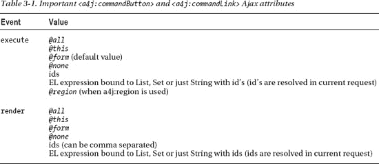

以下 Ajax 属性可用于 `<a4j:commandButton>` 和 `<a4j:commandLink>` 标签：`onbegin`、`onbeforedomupdate`、`oncomplete`、`bypassUpdates`、`limitRender`、`data` 和 `status`。

 **注意** `<a4j:commandLink>` 的工作方式与 `<a4j:commandButton>` 完全相同，但它渲染的是一个链接而不是按钮。

#### 使用 `<a4j:jsFunction>` 从任意事件或 JavaScript 函数发起 Ajax 请求

到目前为止，我们介绍了两种发起 Ajax 请求的方式：第一种是使用 `<a4j:ajax>` 行为，第二种是使用 `<a4j:commandButton>` 或 `<a4j:commandLink>`。`<a4j:ajax>`（以及它所基于的 `<f:ajax>`）是一种行为，它总是基于某个事件附加到另一个 UI 组件上，例如按钮、选择框等。它本身从不单独使用。`<a4j:commandButton>` 是一个内置 Ajax 行为的按钮，而 `<a4j:commandLink>` 是一个内置 Ajax 行为的链接。它们都提供了特定的功能。但是，假设我们想从一个 HTML 标签（而非 JSF 组件）发起 Ajax 请求。我们不能使用 `<a4j:ajax>`——它是一种行为，必须附加到另一个 JSF 组件上。这时，`<a4j:jsFunction>` 就派上用场了。它允许你从任何 JavaScript 事件或函数发起 Ajax 请求。

为了了解 `<a4j:jsFunction>` 的工作原理，让我们看一个上一节中的例子，如清单 3-9 所示。

***清单 3-9.** 展示 `<a4j:jsFunction>` 的工作原理*

`<h:form>`
`   <h:panelGrid columns="2">`
`      <h:outputText value="姓名：" />`
`      <h:inputText value="#{bean.name}" />`
`      <h:outputText value="回显：" />`
`      <h:outputText id="echo" value="#{bean.name}" />`
`      <h:outputText value="计数：" />`
`      <h:outputText id="count" value="#{bean.count}" />`
`   </h:panelGrid>`
`   <a4j:commandButton value="提交" render="echo, count"`
`      action="#{bean.countAction}" />`
`</h:form>`

现在，我们不使用 `<a4j:commandButton>`，而是使用 `<a4j:jsFunction>` 来发起 Ajax 请求，如清单 3-10 所示。

***清单 3-10.** 使用 `<a4j:jsFunction>` 发起 Ajax 请求*

`<h:form>`
`   <h:panelGrid columns="2">`
`      <h:outputText value="姓名：" />`
`      <h:inputText value="#{bean.name}" />`
`      <h:outputText value="回显：" />`
`      <h:outputText id="echo" value="#{bean.name}" />`
`      <h:outputText value="计数：" />`
`      <h:outputText id="count" value="#{bean.count}" />`
`   </h:panelGrid>`
`   <input type="button" value="提交" onclick="sendAjaxRequest();"/>`

`   <a4j:jsFunction name="sendAjaxRequest" execute="@form"`
`      action="#{bean.countAction}" render="echo, count"/>`
`</h:form>`

根据 JSF 的默认值，`<a4j:function>` 的 `execute` 属性被设置为 `@this`，因此我们在这里显式地将其改为 `@form`，以便处理所有输入。

清单 3-10 展示了我们所做的更改。首先，我们将 `<a4j:commandButton>` 替换为一个普通的 HTML 按钮；接着，我们定义了 `<a4j:jsFunction>`。请注意，该按钮还有一个 `click` 事件，它调用了一个名为 `sendAjaxRequest()` 的 JavaScript 函数。这个函数由 `<a4j:jsFuction>` 定义，它只是一个标准的 JavaScript 函数。如果我们查看渲染后的代码，我们调用的函数看起来像清单 3-11 所示。

***清单 3-11.** 此函数由 `<a4j:jsFuction>` 定义*

``

如果没有 `<a4j:jsFunction>`，我们就需要手动编写类似的代码。`<a4j:jsFunction>` 看起来就像其他任何发起 Ajax 请求的控件一样：它有 `execute` 属性、`action` 属性和 `render` 属性。我们学到的关于这些属性的所有知识在这里同样适用。你得到的能力是：可以从任何 HTML 标签，基于该标签支持的任何事件，发起一个标准的 Ajax 请求。

 **提示** `<a4j:jsFunction>` 的 `execute` 属性默认值为 `@this`。

在清单 3-11 中，我们直接从 `click` 事件调用了 `sendAjaxRequest()`。我们也可以轻松地从另一个 JavaScript 函数中调用 `sendAjaxRequest()`，这允许我们在发起请求之前调用任何其他逻辑，如清单 3-12 所示（更改部分以粗体显示）。

***清单 3-12.** 展示如何轻松地从另一个 JavaScript 函数调用 `sendAjaxRequest()`*

`<h:form>`
`   <h:panelGrid columns="2">`
`      <h:outputText value="姓名：" />`
`      <h:inputText value="#{bean.name}" />`
`      <h:outputText value="回显：" />`
`      <h:outputText id="echo" value="#{bean.name}" />`
`      <h:outputText value="计数：" />`
`      <h:outputText id="count" value="#{bean.count}" />`
`   </h:panelGrid>`
`   <input type="button" value="提交" onclick="doAjax();"/>`
`   <a4j:jsFunction name="sendAjaxRequest" execute="@form"`
`      action="#{bean.countAction}"  render="echo, count"/>`
**``**
`</h:form>`

还有一种情况，`<a4j:jsFunction>` 非常有用。你可以调用该函数从服务器获取值，将其序列化，并使用 `data` 属性传递给客户端。然后，你可以在某个客户端函数中使用接收到的数据。示例如清单 3-13 所示，其中从服务器接收到的数据通过 `oncomplete` 事件在警告窗口中显示。

***清单 3-13.** 从服务器接收到的数据显示在警告窗口中*

`<h:form>`
`   <input type="button" value="更新" onclick="updateName('Joe');"/>`
`   <a4j:jsFunction name="updateName" render="showname"`
`      data="#{jsFunctionNameBean.greeting}" oncomplete="alert(event.data)">`
`      <a4j:param name="param1" assignTo="#{jsFunctionNameBean.name}"/>`
`   </a4j:jsFunction>`
`   <h:outputText id="showname" value="#{jsFunctionNameBean.greeting}"/>`
`</h:form>`

受管 Bean 如清单 3-14 所示。

***清单 3-14.** 受管 Bean*

`@ManagedBean (name="jsFunctionNameBean")`
`@RequestScoped`
`public class JSFunctionNameBean {`

`   private String name; // setter 和 getter`

`   public String getGreeting () {`
`      return "你好 "+this.name;`
`   }`
`}`

在这个例子中，`#{jsFunctionNameBean.greeting}` 属性的值在服务器端设置名称后被序列化，然后传回客户端，并使用 JavaScript 的 `alert` 显示。在实际应用中，你可能希望从服务器获取任何附加数据，并调用一些真正的后处理 JavaScript 处理函数。如果你需要向服务器传递一些输入，获取结果，然后使用 `oncomplete` 脚本处理结果，这将非常有用。

在下一节中，我们将看到如何向由 `<a4j:jsFunction>` 创建的 JavaScript 函数传递参数，进而将它们发送到服务器。然后，我们将看到另一种使用标准 JSF 编程式 Ajax 方法从任何 HTML 事件或 JavaScript 脚本发送 Ajax 请求的方式。

##### 使用 <a4j:param> 传递参数

让我们看另一个例子，其中 Ajax 请求并非直接从 JSF 组件触发，而是当鼠标悬停在饮品名称上时，从一个 HTML 标签触发，如图 3-1 所示。

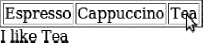

***图 3-1.** 将 <a4j:jsFunction> 与 <a4j:param> 结合使用*

清单 3-15 展示了 JSF 代码。

***清单 3-15.** JSF 代码*

`<table border="1">`
`   <tr>`
`      <td onmouseover="setdrink('Espresso')"`
`         onmouseout="setdrink('')">Espresso</td>`
`      <td onmouseover="setdrink('Cappuccino')"`
`         onmouseout="setdrink('')">Cappuccino</td>`
`      <td onmouseover="setdrink('Tea')"`
`         onmouseout="setdrink('')">Tea</td>`
`   </tr>`
`</table>`
`<h:outputText id="drink" value="I like #{jsFunctionDrinkBean.drink}" />`

`<h:form>`
`   <a4j:jsFunction name="setdrink" execute="@form" render="drink">`
`      <a4j:param name="param1" assignTo="#{jsFunctionDrinkBean.drink}" />`
`   </a4j:jsFunction>`
`</h:form>`

托管 Bean 的代码如清单 3-16 所示。

***清单 3-16.** 托管 Bean 代码*

`@ManagedBean (name="jsFunctionDrinkBean")`
`@RequestScoped`
`public class JSFunctionDrinkBean {`

`   private String drink;`
`   // setter and getter`
`}`

我们不再从 JSF 组件发起请求；当鼠标悬停在表格行上时（`onmouseover` 事件），Ajax 请求从 HTML 标签触发，当鼠标移出时（`onmouseout` 事件）也会触发。当这些事件之一发生时，会调用 `setdrink(..)`。`setdrink` 是由 `<a4j:jsFuction>` 定义的 JavaScript 函数，它进而触发 Ajax 请求，并且也能进行部分页面渲染。

你会注意到与上一个例子有一个不同之处；我们由 `<a4j:jsFunction>` 定义的 JavaScript 函数接受一个参数，要么是饮品的名称，要么是一个空字符串。我们必须以某种方式将其传递给 Bean，设置到 `drink` 属性中，然后渲染它。这是通过 `<a4j:param>` 标签完成的。参数将按照在 `<a4j:jsFunction>` 标签内定义的顺序传递。

`<a4j:param>` 与标准的 `<f:param>` 非常相似，但有一个主要且非常有用的区别。使用 `<f:param>` 时，值被添加到请求中，然后必须通过这段代码从请求中检索出来。清单 3-17 展示了一个使用 `<f:param>` 的非常简单的例子。

***清单 3-17.** 使用 `<f:param> 将值添加到请求中`*

`<a4j:commandButton>`
`   <f:param name="firstName" value="Tammy"/>`
`</a4j:commandButton>`

要在 Bean 内部获取该值，我们可以使用类似下面的代码：

`String value = FacesContext.getCurrentInstance().getExternalContext()`
`   .getRequestParameterMap().get("firstName");`

回到 `<a4j:param>`，它以相同的方式向请求添加参数，但同时会自动进行赋值。换句话说，它会将值设置到 Bean 的属性中，前提是该属性有 setter 方法。它只是 `<f:param>` 的一个升级版本，你无需做任何事就能获取值。清单 3-18 展示了一个使用 `<a4j:param>` 的例子。

***清单 3-18.** 使用 `<a4j:param> 替代 <f:param>`*

`<a4j:commandButton>`
`   <a4j:param name="firstName" value="Tammy" assignTo="#{paramBean.firstName}"/>`
`</a4j:commandButton>`

`firstName` 属性（需要在托管 Bean 中存在相应的 getter 和 setter）如清单 3-19 所示。

***清单 3-19.** 托管 Bean*

`@ManagedBean`
`@RequestScoped`
`public class ParamBean {`

`   private String firstName;`

`   public String getFirstName() {`
`      return firstName;`
`   }`
`   public void setFirstName(String firstName) {`
`      this.firstName = firstName;`
`   }`
`}`

当使用 `<a4j:jsFunction>` 定义一个接受参数的 JavaScript 函数时，`<a4j:param>` 用于定义该参数并将其赋值给 Bean 属性。如果你需要传递多个参数，可以根据需要包含任意数量的 `<a4j:param>` 标签，如清单 3-20 所示。

***清单 3-20.** 根据需要包含任意数量的 `<a4j:param>` 标签*

`<a4j:jsFunction>`
`   <a4j:param name="param1" assignTo="#{someBean.value1}" />`
`   <a4j:param name="param2" assignTo="#{someBean.value2}" />`
`   <a4j:param name="param3" assignTo="#{someBean.value3}" />`
`</a4j:jsFunction>`

名称必须采用 `param1`、`param2` 和 `param3` 的形式。

我们已经展示了如何从服务器端来回传递参数（作为从服务器端 EL 表达式或字符串常量编码的参数）。但实际上，也可以传递纯客户端参数。这意味着当 `noEscape` 属性设置为 `true` 时，你可以使用 `<a4j:param>` 传递 JavaScript 函数或 JavaScript 表达式的结果。清单 3-21 展示了这样一个例子。

***清单 3-21.** 使用 `<a4j:param>` 传递 JavaScript 函数或 JavaScript 表达式的结果*

`<a4j:commandButton value="Set position" >`
`   <a4j:param noEscape="true" value="(jQuery(window).width()/2)-250"`
`assignTo="#{someBean.left}"/>`
`   <a4j:param noEscape="true" value="(jQuery(window).height()/2)-150"`
`assignTo="#{someBean.top}"/>`
`</a4j:commandButton>`

 **提示** 你也可以将 `<a4j:param>` 与非 Ajax 动作组件（如 `<h:commandButton>`）以及 `GET` 组件（如 `<h:button>`）一起使用。

##### JSF 2 中的编程式 Ajax

JSF 2 确实提供了一种从客户端以编程方式发送 Ajax 请求的方法（可用于编程式发送 Ajax 请求的请求参数列于表 3-2）。为此，我们首先需要加载代码清单 3-22 中所示的 JavaScript 库。（当使用 `<f:ajax>` 行为或任何 RichFaces 标签时，JavaScript 库会自动加载。）

***代码清单 3-22.** 加载 JavaScript 库*

`<h:head>`
`   <h:outputScript name="jsf.js" library="javax.faces"/>`
`<h:/head>`

触发 Ajax 请求的代码如代码清单 3-23 所示。

***代码清单 3-23.** 触发 Ajax 请求*

`<h:form id="form">`
`   <h:panelGrid>`
`      <h:commandButton id="button" value="更新"`
`         onclick="jsf.ajax.request(this,event, {render:'form:out'}); return false;" />`
`      <h:outputText value="#{manualAjax.now}" id="out" />`
`   </h:panelGrid>`
`</h:form>`

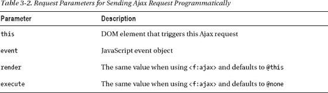

 **注意** `render` 必须指向客户端 ID，而非组件 ID。

代码清单 3-24 展示了另一个使用 `<h:inputText>` 的示例。

***代码清单 3-24.** 使用 `<h:inputText>` 的示例*

`<h:form id="form2">`
`   <h:panelGrid>`
`      <h:inputText value="#{manualAjax.text}"`
`         onkeyup="jsf.ajax.request(this, event, {render:'form2:out'});`
`            return false;" />`
`      <h:outputText value="#{manualAjax.text}" id="out" />`
`   </h:panelGrid>`
`</h:form>`

我们认为使用 `<a4j:jsFunction>` 更简单，因为您无需手动编写任何 JavaScript 代码，并且可以获得 `a4j:ajax` 行为中同样可用的所有额外特性和功能。

以下 Ajax 属性可用于 `<a4j:jsFunction>`：`onbegin`、`onbeforedomupdate`、`oncomplete`、`bypassUpdates`、`limitRender`、`data` 和 `status`。

`<a4j:jsFunction>` 可能看起来是一个非常简单的标签。虽然它易于使用，但实际上非常强大。与任何暴露客户端事件的 JSF 组件（几乎所有组件都如此）一样，`<a4j:jsFunction>` 可以与这些事件一起使用来触发 Ajax 请求。取任意 HTML 标签，`<a4j:jsFunction>` 都可以用于基于某个标签事件来触发 Ajax 请求。理论上，任何使用 `<a4j:ajax>` 的地方，`<a4j:jsFunction>` 都可以替代它，因为在渲染标记时，`<a4j:ajax>` 渲染的 JavaScript 与 `<a4j:jsFunction>` 渲染的非常相似。您可以将 `<a4j:jsFunction>` 视为所有 Ajax 触发标签和行为的底层或基础标签。

#### 使用 <a4j:poll> 进行轮询

`<a4j:poll>` 的工作方式与我们讨论过的所有其他动作组件几乎完全相同，但无需点击或输入内容来发送请求，该组件会定期向服务器发送（轮询）Ajax 请求。您可以轻松地通过 `render` 属性指定要更新的组件，以及要调用的 `action` 或 `actionListener`。我们之前涵盖的所有核心 Ajax 概念同样适用于此组件。让我们通过一个示例来了解，您将看到服务器时间在运行。您还可以停止和启动时钟。

页面加载时，应用程序将如图 3-2 所示。

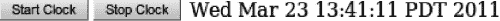

***图 3-2.** 使用 <a4j:poll>*

当页面首次加载时，时钟是关闭的。然后您可以使用按钮启动或停止时钟。在开始之前，请务必记住，使用 `<a4j:poll>` 组件时，`execute` 的默认值是 `@this`。

代码清单 3-25 展示了 JSF 页面。

***代码清单 3-25.** 展示 JSF 页面*

`<h:form>`
`   <a4j:poll id="poll" interval="500" enabled="#{clockBean.enabled}"`
`      render="clock" />`
`   <h:panelGrid columns="2">`
`      <h:panelGrid columns="2">`
`         <a4j:commandButton value="启动时钟"`
`            action="#{clockBean.startClock}"`
`            render="poll" />`
`         <a4j:commandButton value="停止时钟"`
`            action="#{clockBean.stopClock}"`
`            render="poll" />`
`      </h:panelGrid>`
`      <h:outputText id="clock" value="#{clockBean.now}" />`
`   </h:panelGrid>`
`</h:form>`

它有几个重要的属性：`interval` 定义了向服务器发送请求的频率（以毫秒为单位），`enabled` 根据其设置为 `true` 或 `false` 来决定组件是否发送请求。您需要能够在某些条件发生时停止或启动轮询。

当页面首次加载时，`enabled` 被评估为 `false`，因此轮询被禁用。当点击“启动时钟”按钮时，`startClock` 方法会将 `enabled` 设置为 `true`，从而启用轮询。`<a4j:poll>` 每 500 毫秒（半秒）轮询一次服务器，并更新显示时间的组件。当点击“停止时钟”按钮时，`enabled` 被设置为 `false`，从而禁用轮询。

每当您在运行时启用或禁用该组件时，都需要重新渲染该组件。这是必需的，以便读取 `enabled` 的新值，并在浏览器中更新 JavaScript 以启动或停止轮询。

另请注意，我们将 `<a4j:poll>` 与按钮放在同一个表单内。将 `<a4j:poll>` 放在同一个表单内是可以的，因为默认情况下其 `execute` 设置为 `@this`。即使表单内有其他输入组件，它们会被发送到服务器，但不会在服务器上被处理。您可以将 `<a4j:poll>` 放在其自己的表单中，以减少提交到服务器的数据量。我们的示例相当简单，尽管 `<a4j:poll>` 可以放在同一个表单中，但此概念可应用于更大的应用程序。

代码清单 3-26 展示了受管 bean。

***代码清单 3-26.** 受管 bean*

`@ManagedBean`
`@RequestScoped`
`public class ClockBean {`

`   private boolean enabled; // getter 和 setter`

`   public java.util.Date getNow() {`
`      return new java.util.Date();`
`   }`
`   public void stopClock() {`
`      enabled = false;`
`   }`
`   public void startClock() {`
`      enabled = true;`
`   }`
`}`

以下 Ajax 属性可用于 `<a4j:poll>`：`onbegin`、`onbeforedomupdate`、`oncomplete`、`bypassUpdates`、`limitRender`、`data` 和 `status`。

### 高级部分视图渲染选项

在本节中，您将学习 RichFaces 中可用的高级渲染特性。我们将首先介绍自动渲染面板——其内容会在任何 Ajax 请求时自动渲染——然后向您展示如何将渲染范围限制为仅在当前 `render` 属性中显示的组件。

#### 使用 `<a4j:outputPanel>` 实现自动渲染区域

要渲染一个或一组组件，我们使用 `render` 属性。`render` 属性可以接受以下任意值：`@all`、`@this`、`@form`、`@none`、ID，以及绑定到 Set、List 或包含 ID 的 String 的 EL 表达式。RichFaces 在使用 EL 时增加了一项重要特性：ID 会在同一个请求中被解析。我们在第 2 章中介绍过这个特性。RichFaces 提供的另一个功能是能够用逗号分隔 ID（而 JSF 2 中仅支持空格），如下所示：

`render="id1, id2, id3"`

使用带 ID 的 `render` 属性通常已经足够，但如果某些组件需要在每次请求时都渲染，情况就会变得相当复杂。此外，如果假设有大量组件会发送 Ajax 请求，我们就需要在每个这样的组件或行为上指定需要渲染的组件。RichFaces 通过提供一个特殊的 `<a4j:outputPanel>` 组件解决了这个问题：使用该组件后，面板内的所有组件都会在任何 Ajax 请求时自动渲染，无需通过 `render` 属性指向该面板或其内部的组件。

代码清单 3-27 展示了一个使用 `<a4j:outputPanel>` 的示例。就其本身而言，`<a4j:outputPanel>` 与 `<h:panelGroup>` 差别不大。然而，要使此面板及其内部所有内容自动渲染，我们需要设置一个特殊的 `ajaxRendered="true"` 属性，如代码清单 3-27 所示。

***代码清单 3-27.** 设置特殊的 `ajaxRendered="true"` 属性*

`<h:form>`
`   <a4j:commandButton value="更新时间" />`
`   <a4j:outputPanel ajaxRendered="true">`
`      <h:outputText value="#{clockBean.now}" />`
`   </a4j:outputPanel>`
`</h:form>`

请注意，`<a4j:commandButton>` 没有 `render` 属性，但时间仍然被渲染了，这是因为我们使用了 `<a4j:outputPanel ajaxRendered="true">`，这再次将整个面板标记为自动渲染区域。

`<a4j:outputPanel>` 另一个常见的用途是包装那些在页面初始显示时不渲染，但在 Ajax 请求后才渲染的组件。这也是许多用户在开始使用 JSF 和 Ajax 时经常遇到的问题。让我们以图 3-3 中所示的“世界七大奇迹”示例为例。

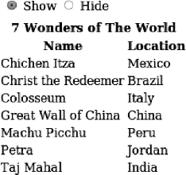

***图 3-3.** 显示或隐藏世界七大奇迹列表*

顶部有两个按钮，用于隐藏或显示表格。当页面首次渲染时，表格不渲染（隐藏）。然后，选择“显示”应渲染该表格。

JSF 页面如代码清单 3-28 所示。

***代码清单 3-28.** 展示 JSF 页面*

`<h:form>`
`   <h:panelGrid>`
`      <h:selectOneRadio value="#{dynamicUpdateBean.display}">`
`         <f:selectItem itemLabel="显示" itemValue="true" />`
`         <f:selectItem itemLabel="隐藏" itemValue="false" />`
`         <a4j:ajax execute="@this" render="wonderList" />`
`      </h:selectOneRadio>`
`   </h:panelGrid>`

`   <h:dataTable id="wonderList" value="#{wonderListBean.list}"`
`      var="wonder" rendered="#{dynamicUpdateBean.display}">`
`      <f:facet name="header">世界七大奇迹</f:facet>`
`      <h:column>`
`         <f:facet name="header">名称</f:facet>`
`         <h:outputText value="#{wonder.name}" />`
`      </h:column>`
`      <h:column>`
`          <f:facet name="header">位置</f:facet>`
`          <h:outputText value="#{wonder.location}" />`
`      </h:column>`
`   </h:dataTable>`
`</h:form>`

在代码清单 3-28 中，当页面首次渲染时，`#{dynamicUpdateBean.display}` 被设置为 `false`，因此表格不显示。当选择“显示”按钮时，我们使用 Ajax 请求将 `#{dynamicUpdateBean.display}` 设置为 `true`，然后渲染表格。如果你运行这段代码，表格将不会显示。正如我们之前提到的，这是刚开始使用 JSF 和 Ajax 的用户常遇到的障碍。问题的根源在于，我们试图重新渲染一个之前未在页面中渲染过的组件。在解释这个问题之前，代码清单 3-29 展示了 `Wonder` 类。

***代码清单 3-29.** 展示 Wonder 类*

`public class Wonder {`

`   private String name;`
`   private String location;`

`   public Wonder(String name, String location) {`

`      this.name = name;`
`      this.location = location;`
`   }`
`   // Getters 和 Setters`
`}`

代码清单 3-30 展示了保存奇迹列表的管理 Bean。

***代码清单 3-30.** 保存奇迹列表的管理 Bean*

`@ManagedBean`
`@RequestScoped`
`public class WonderListBean {`

`   private ArrayList <Wonder> list;`

`   public ArrayList<Wonder> getList() {`
`        return list;`
`   }`
`   @PostConstruct`
`   public void init () {`
`      list = new ArrayList <Wonder>();`
`      list.add(new Wonder("奇琴伊察", "墨西哥"));`
`      list.add(new Wonder("救世基督像", "巴西"));`
`      list.add(new Wonder("罗马斗兽场", "意大利"));`
`      list.add(new Wonder("中国长城", "中国"));`
`      list.add(new Wonder("马丘比丘", "秘鲁"));`
`      list.add(new Wonder("佩特拉古城", "约旦"));`
`      list.add(new Wonder("泰姬陵", "印度"));`
`   }`
`}`

当页面首次渲染时，表格组件没有被渲染。换句话说，没有向浏览器发送任何标记。当我们选择“显示”时，我们发送一个 Ajax 请求并将 `#{dynamicUpdateBean.display}` 设置为 `true`。同时我们也渲染了表格（`render="wonderList"`）。表格标记被发送到浏览器。现在的问题是，RichFaces 不知道应该更新浏览器中的哪个 DOM 节点来放置表格内容，仅仅因为之前不存在这样的节点。

Ajax 更新是基于 ID 完成的。当某些标记被渲染并发送到浏览器时，它会附带一个 ID。JavaScript 负责更新 DOM，并会尝试定位一个具有完全相同 ID 的节点。如果找到了这样的 ID，那么新内容将替换 DOM 中的旧内容，从而实现 Ajax 更新。如果找不到这样的节点（就像我们这种情况），那么新内容就会被简单地忽略。

解决方案是创建一个始终渲染的表格占位符。然后，我们不再更新（渲染）表格本身，而是渲染这个占位符。占位符内的任何内容都将毫无问题地始终更新。如果我们使用 `<a4j:outputPanel>`，实际上可以同时获得两个特性。首先，我们得到了一个占位符，其次，我们不再需要渲染表格，因为 `<a4j:outputPanel ajaxRendered="true">` 是一个自动渲染的面板。代码清单 3-31 展示了如何使用 `<a4j:outputPanel>` 实现这一点。

***代码清单 3-31.** 使用 `<a4j:outputPanel>`*

`<h:form>`
`   <h:panelGrid>`
`       <h:selectOneRadio value="#{dynamicUpdateBean.display}">`
`       <f:selectItem itemLabel="显示" itemValue="true" />`
`       <f:selectItem itemLabel="隐藏" itemValue="false" />`
**`<a4j:ajax execute="@this"/>`**
`       </h:selectOneRadio>`
`   </h:panelGrid>`
**`<a4j:outputPanel ajaxRendered="true" layout="block">`**
`      <h:dataTable id="wonderList" value="#{wonderListBean.list}"`
`         var="wonder" rendered="#{dynamicUpdateBean.display}">`
`          ...`
`      </h:dataTable>`
**`</a4j:outputPanel>`**
`</h:form>`

如果你查看页面代码，以 Firebug Firefox 插件（[`http://getfirebug.com`](http://getfirebug.com)）为例，你会看到 `<a4j:outputPanel>` 渲染了一个 `span` HTML 标签。如果我们不想使用自动渲染面板，仍然可以使用带 id 的 `<a4j:outputPanel>`，但必须像清单 3-32 所示那样进行渲染。

***清单 3-32.** 使用带 id 的 `<a4j:outputPanel>`*

`<h:form>`
`   <h:panelGrid>`
`       <h:selectOneRadio value="#{dynamicUpdateBean.display}">`
`       <f:selectItem itemLabel="Show" itemValue="true" />`
`       <f:selectItem itemLabel="Hide" itemValue="false" />`
**`<a4j:ajax execute="@this" render="wonderPanel"/>`**
`       </h:selectOneRadio>`
`   </h:panelGrid>`
**`<a4j:outputPanel id="wonderPanel" layout="block">`**
`      <h:dataTable id="wonderList" value="#{wonderListBean.list}"`
`         var="wonder" rendered="#{dynamicUpdateBean.display}">`
`          ...`
`      </h:dataTable>`
**`</a4j:outputPanel>`**
`</h:form>`

清单 3-33 用 `<h:panelGrid>` 替换了 `<a4j:outputPanel>` 作为占位符，其工作方式完全相同。

***清单 3-33.** 用 `<h:panelGrid>` 替换 `<a4j:outputPanel>`*

`<h:form>`
`   <h:panelGrid>`
`       <h:selectOneRadio value="#{dynamicUpdateBean.display}">`
`       <f:selectItem itemLabel="Show" itemValue="true" />`
`       <f:selectItem itemLabel="Hide" itemValue="false" />`
**`<a4j:ajax execute="@this" render="wonderPanel"/>`**
`       </h:selectOneRadio>`
`   </h:panelGrid>`
**`<h:panelGrid id="wonderPanel">`**
`      <h:dataTable id="wonderList" value="#{wonderListBean.list}"`
`         var="wonder" rendered="#{dynamicUpdateBean.display}">`
`          ...`
`      </h:dataTable>`
**`</h:panelGrid>`**
`</h:form>`

还有一个值得提及的功能。`<a4j:outputPanel>` 也可用于布局。它带有一个 `layout` 属性，可以设置为 `block` 以渲染 `
` 标签，或设置为 `inline` 以渲染 `` 标签（默认值）。清单 3-34 展示了一个使用 `block` 值的示例。

***清单 3-34.** 展示使用 `block` 值的示例*

`<a4j:outputPanel layout="block">`
`…`
`</a4j:outputPanel>`

 **注意** 与 `<h:panelGroup>` 类似，`<a4j:outputPanel>` 可以根据 `layout` 属性生成 `` 或 `
` 元素。默认编码为 ``。当使用块级 HTML 元素（如 `
` 和 `<table>`）时，将其定义为 `block` 非常重要，以确保生成有效的 HTML 编码。

#### 使用 limitRender 属性关闭自动渲染面板

自动渲染面板是一个很好的功能，因为它可以更轻松地标记页面中应始终渲染的部分。你不再需要使用 `render` 指向组件。然而，可能会出现这样的情况：页面上的某个特定 Ajax 操作不应更新自动渲染面板，而应仅限于当前 `render` 中设置的内容。我们将探讨如何在特定情况下关闭自动渲染面板。我们将使用图 3-4 所示的页面。

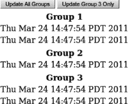

***图 3-4.** 关闭自动渲染面板*

JSF 页面如清单 3-35 所示。

***清单 3-35.** JSF 页面*

`<h:form>`
`   <h:panelGrid columns="2">`
`      <a4j:commandButton value="Update All Groups" render="group1, group2" />`
`      <a4j:commandButton value="Update Group 1 and 2 Only" render="group1, group2"`
`         limitRender="true" />`
`   </h:panelGrid>`
`   <h:panelGrid columns="1" id="group1">`
`      <f:facet name="header">Group 1</f:facet>`
`      <h:outputText value="#{timeBean.time1}" />`
`      <h:outputText value="#{timeBean.time2}" />`
`   </h:panelGrid>`
`   <h:panelGrid columns="1" id="group2">`
`      <f:facet name="header">Group 2</f:facet>`
`      <h:outputText value="#{timeBean.time3}" />`
`   </h:panelGrid>`
`   <a4j:outputPanel ajaxRendered="true" layout="block">`
`      <h:panelGrid id="group3">`
`         <f:facet name="header">Group 3</f:facet>`
`         <h:outputText value="#{timeBean.time4}" />`
`         <h:outputText value="#{timeBean.time5}" />`
`      </h:panelGrid>`
`   </a4j:outputPanel>`
`</h:form>`

在清单 3-5 中，当点击“Update All Groups”按钮时，所有时钟都会被渲染（更新）。Group 1 和 Group 2 通过 id 更新，因为按钮设置了 `render="group1, group2"`。Group 3 被更新是因为它位于自动渲染面板内。如果点击第二个按钮（仅更新 Group 1 和 Group 2），则只有 Group 1 和 Group 2 被渲染。位于自动渲染面板内的 Group 3 不会被更新。原因在于第二个按钮使用了 `limitRender="true"`。这意味着将渲染限制为当前 render 属性中设置的组件（在本例中是 Group1 和 Group2）。另一种理解方式是，我们针对这个特定按钮关闭了所有自动渲染面板。这是一个便捷的功能，为你自定义渲染内容提供了更大的灵活性和控制力。

 **注意** `limitRender="true"` 也可用于关闭 `<rich:message>` 和 `<rich:messages>` 组件的自动渲染。

### 高级执行选项

在本节中，你将学习 RichFaces 中提供的一些高级执行选项。我们将首先了解 RichFaces 的 `<a4j:region>` 标签，它允许你以更声明式的方式定义要执行的内容，然后学习如何在执行验证时跳过 JSF 生命周期中的阶段。

#### 使用 `<a4j:region>` 定义执行区域

发送 Ajax 请求时，始终需要牢记服务器端将要处理或执行的内容。如我们所知，使用 `<f:ajax>` 或 `<a4j:ajax>` 时，`execute` 属性默认为 `@this`（可设置的其他值包括：`@all`、`@form`、`@none`、ID、以及类似于 `render` 中使用的 EL 表达式）。使用 RichFaces 的 `<a4j:poll>` 或 `<a4j:jsFunction>` 时，`execute` 属性也默认为 `@this`。但是，使用 `<a4j:commandButton>` 或 `<a4j:commandLink>` 时，`execute` 属性则设置为 `@form` 值。为什么 RichFaces 要更改默认值？在大多数情况下，按钮或链接在表单内用于执行完整的表单提交。您输入信息后，点击按钮或链接进行提交。由于您刚刚输入了内容，因此也需要处理这些输入。如果 `execute` 设置为默认值 `@this`，我们就需要将表单内的每个输入组件也包含进来以便执行，或者将 `execute` 设置为 `@form`（或父容器的 ID）。将 `<a4j:commandButton>` 和 `<a4j:commandLink>` 的 `execute` 属性默认设置为 `@form`，使得开发更加便捷。

RichFaces 还增加了另一项功能，使标记要执行的内容更加简单。RichFaces 增加了 `<a4j:region>` 和 `@region` 关键字。清单 3-36 展示了一个无法正常工作的 JSF 示例，因为嵌套在 `<h:commandButton>` 内部的 `<a4j:ajax>` 没有设置 `execute` 属性。

***清单 3-36.** 展示一个无法正常工作的 JSF 示例*

`<h:form>`
`   <h:panelGrid>`
`      <h:selectOneMenu id="type" value="#{flowerRegionBean.type}">`
`         <f:selectItem itemValue="Roses" itemLabel="Roses" />`
`         <f:selectItem itemValue="Tulips" itemLabel="Tulips" />`
`         <f:selectItem itemValue="Irises" itemLabel="Irises" />`
`      </h:selectOneMenu>`
`      <h:selectOneMenu id="size" value="#{flowerRegionBean.size}">`
`         <f:selectItem itemValue="Small" itemLabel="Small" />`
`         <f:selectItem itemValue="Large" itemLabel="Large" />`
`         <f:selectItem itemValue="Extra Large" itemLabel="Extra Large" />`
`      </h:selectOneMenu>`
`      <h:selectOneMenu value="#{flowerRegionBean.vase}">`
`         <f:selectItem itemValue="Standard vase" itemLabel="Standard vase" />`
`         <f:selectItem itemValue="Premium vase" itemLabel="Premium vase" />`
`         <f:selectItem itemValue="No vase" itemLabel="No vase" />`
`      </h:selectOneMenu>`
`      <h:commandButton value="Buy Flowers!">`
`         <a4j:ajax event="click"/>`
`      </h:commandButton>`
`   </h:panelGrid>`
`   <a4j:outputPanel ajaxRendered="true" layout="block">`
`      <h:panelGrid>`
`         <h:outputText value="#{flowerRegionBean.type}" />`
`         <h:outputText value="#{flowerRegionBean.size}" />`
`         <h:outputText value="#{flowerRegionBean.vase}" />`
`      </h:panelGrid>`
`   </a4j:outputPanel>`
`</h:form>`

托管 Bean 如清单 3-37 所示。

***清单 3-37.** 托管 Bean*

`@ManagedBean`
`@RequestScoped`
`public class FlowerRegionBean {`

`   private String type;`
`   private String size;`
`   private String vase;`

`   // getters and setters`
`}`

要使其正常工作，我们要么必须在 `execute` 属性中列出所有输入组件，要么在面板网格上设置一个 ID 并将 `execute` 指向该 ID。另一种本质上更具声明性的方法是使用 `<a4j:region>`。因此，要使清单 3-37 中的示例正常工作，我们只需将输入组件和按钮包裹在 `<a4j:region>` 内，如清单 3-38 所示。

***清单 3-38.** 将输入组件和按钮包裹在 `<a4j:region>` 内*

`<h:form>`
**`<a4j:region>`**
`      <h:panelGrid>`
`         …`
`         <h:commandButton value="Buy Flowers!">`
`            <a4j:ajax event="click" />`
`         </h:commandButton>`
`      </h:panelGrid>`
**`</a4j:region>`**
`   <a4j:outputPanel ajaxRendered="true">`
`      <h:panelGrid>`
`         <h:outputText value="#{flowerRegionBean.type}" />`
`         <h:outputText value="#{flowerRegionBean.size}" />`
`         <h:outputText value="#{flowerRegionBean.vase}" />`
`      </h:panelGrid>`
`   </a4j:outputPanel>`
`</h:form>`

这种方法更具声明性，因为您不再需要指定要执行哪些 ID。来自该区域内的任何 Ajax 请求以及该区域内的所有输入组件都将被执行（除非其他 Ajax 组件或行为明确指定了要执行的组件，在这种情况下它们将覆盖该区域）。使用区域时，您还可以使用 `@region` 关键字，如下所示：

`<a4j:ajax event="click" execute="@region"/>`

这表示执行该区域内的所有内容，并且是可选的。即使我们没有像示例中那样指定 `@region`，该区域默认也会被执行。

#### 在验证期间跳过模型更新

仅在用户通过 Tab 键移出或点击其他位置时才验证输入字段，这是一种常用技术，使用 Ajax 的 `blur` 事件即可轻松实现。清单 3-39 展示了一个示例。

***清单 3-39.** 使用 Ajax 的 blur 事件验证输入字段*

`<h:form>`
`   <h:panelGrid columns="3">`
`      <h:outputText value="名称：" />`
`      <h:inputText id="name" value="#{bypassUpdatesBean.name}" >`
`         <a4j:ajax event="blur" render="nameMessage"/>`
`      </h:inputText>`
`      <h:message for="name" id="nameMessage"/>`

`      <h:outputText value="邮箱：" />`
`      <h:inputText id="email" value="#{bypassUpdatesBean.email}" >`
`         <a4j:ajax event="blur" render="emailMessage" />`
`      </h:inputText>`
`      <h:message for="email" id="emailMessage"/>`

`      <h:outputText value="年龄：" />`
`      <h:inputText id="age" value="#{bypassUpdatesBean.age}" >`
`         <a4j:ajax event="blur" render="ageMessage" />`
`      </h:inputText>`
`      <h:message for="age" id="ageMessage"/>`
`   </h:panelGrid>`
`   <h:commandButton value="提交" action="page2"/>`
`</h:form>`

每个输入字段都为其 `blur` 事件附加了一个 Ajax 行为。当输入内容后，用户点击其他位置或通过 Tab 键移出时，将发送一个 Ajax 请求。验证约束通过托管 Bean 内部的 Bean Validation 注解定义，如清单 3-40 所示。现在，一旦整个表单填写完毕并通过验证，就会有一个提交按钮，用于调用应用程序逻辑对输入内容进行处理，例如添加新记录。

***清单 3-40.** 验证约束通过托管 Bean 内部的 Bean Validation 注解定义*

`@ManagedBean`
`@RequestScoped`
`public class BypassUpdatesBean {`

`   @Length (min=3, message="名称长度至少为 {min} 个字符")`
`   private String name;`

`   @Email(message="无效的邮箱地址")`
`   private String email;`

`   @Min(value=1, message="年龄必须大于 0")`
`   private Integer age;`

`   // Getters 和 Setters`
`}`

让我们仔细看看 `blur` 事件发生时的情况。当 `blur` 事件发生时，会向服务器发送一个 Ajax 请求，并对组件的数据进行验证。如果我们查看发送此请求时经过的生命周期阶段，将会看到以下阶段（此外，在本节末尾，请阅读如何创建阶段跟踪器）：

*   恢复视图
*   应用请求值
*   处理验证
*   更新模型值
*   调用应用程序
*   渲染响应

那么，在仅进行验证时，是否真的有必要经历“更新模型”和“调用应用程序”阶段？答案是否定的。没有调用任何操作，并且当点击提交按钮时，我们才会按预期经历所有阶段。因此，在验证时，我们实际上只需要到达“处理验证”阶段，然后就可以安全地跳转到“渲染响应”阶段。如果验证失败，无论如何我们都会进入“渲染响应”阶段，但即使值有效，我们也希望直接进入“渲染响应”阶段。

如果你仔细观察 清单 3-41 中的 JSF 页面，你会注意到每个 `<a4j:ajax>` 都多了一个属性：`bypassUpdates="true"`。

***清单 3-41.** 注意每个 `<a4j:ajax>` 都多了一个属性：`bypassUpdates="true"`*

`<h:form>`
`   <h:panelGrid columns="3">`
`      <h:outputText value="名称：" />`
`      <h:inputText id="name" value="#{bypassUpdatesBean.name}" >`
`         <a4j:ajax event="blur" render="nameMessage" bypassUpdates="true"/>`
`      </h:inputText>`
`      <h:message for="name" id="nameMessage"/>`

`      <h:outputText value="邮箱：" />`
`      <h:inputText id="email" value="#{bypassUpdatesBean.email}" >`
`         <a4j:ajax event="blur" render="emailMessage" bypassUpdates="true"/>`
`      </h:inputText>`
`      <h:message for="email" id="emailMessage"/>`

`      <h:outputText value="年龄：" />`
`      <h:inputText id="age" value="#{bypassUpdatesBean.age}" >`
`         <a4j:ajax event="blur" render="ageMessage" bypassUpdates="true"/>`
`      </h:inputText>`
`      <h:message for="age" id="ageMessage"/>`
`   </h:panelGrid>`
`   <h:commandButton value="提交" action="page2"/>`
`</h:form>`

这个属性正好实现了我们的需求。它会将我们带到“处理验证”阶段，然后即使值有效，也会跳转到“渲染响应”阶段。我们将经历以下阶段：

*   恢复视图
*   应用请求值
*   处理验证
*   渲染响应

 **提示** 使用 `bypassUpdates` 来优化表单验证期间的 JSF 生命周期。

##### 创建阶段跟踪器

清单 3-42 展示了一个简单阶段跟踪器的示例。当在 JSF 配置文件中注册后，它将输出 JSF 请求期间经过的 JSF 阶段。

***清单 3-42.** 一个简单阶段跟踪器的示例*

`package org.richfaces.book.utils.PhaseTracker`
`public class PhaseTracker implements javax.faces.event.PhaseListener{`

`   public void afterPhase(PhaseEvent e) {`
`      e.getFacesContext().getExternalContext().log("after "+e.getPhaseId());`
`   }`
`   public void beforePhase(PhaseEvent e) {`
`      e.getFacesContext().getExternalContext().log("before "+e.getPhaseId());`
`   }`
`   public PhaseId getPhaseId() {`
`      return PhaseId.ANY_PHASE;`
`   }`
`}`

清单 3-43 展示了在 JSF 配置文件中的阶段跟踪器注册。

***清单 3-43.** 在 JSF 配置文件（`faces-config.xml`）中的阶段跟踪器注册*

`<lifecycle>`
`  <phase-listener>org.richfaces.book.utils.PhaseTracker</phase-listener>`
`</lifecycle>`

在运行阶段跟踪器时，清单 3-44 显示了发生验证错误时的输出。

***清单 3-44.** 显示发生验证错误时的输出*

`Apr 5, 2011 4:24:33 PM org.apache.catalina.core.ApplicationContext log`
`INFO: before RESTORE_VIEW 1`
`Apr 5, 2011 4:24:33 PM org.apache.catalina.core.ApplicationContext log`
`INFO: after RESTORE_VIEW 1`
`Apr 5, 2011 4:24:33 PM org.apache.catalina.core.ApplicationContext log`
`INFO: before APPLY_REQUEST_VALUES 2`
`Apr 5, 2011 4:24:33 PM org.apache.catalina.core.ApplicationContext log`
`INFO: after APPLY_REQUEST_VALUES 2`
`Apr 5, 2011 4:24:33 PM org.apache.catalina.core.ApplicationContext log`
`INFO: before PROCESS_VALIDATIONS 3`
`Apr 5, 2011 4:24:33 PM org.apache.catalina.core.ApplicationContext log`
`INFO: after PROCESS_VALIDATIONS 3`
`Apr 5, 2011 4:24:33 PM org.apache.catalina.core.ApplicationContext log`
`INFO: before RENDER_RESPONSE 6`
`Apr 5, 2011 4:24:33 PM org.apache.catalina.core.ApplicationContext log`
`INFO: after RENDER_RESPONSE 6`

### 使用客户端队列控制流量

JSF 2 内置了一个 Ajax 客户端队列。你无需做任何事；默认情况下每个页面都有这个队列。它是一个页面级队列，所有组件都会使用它。标准队列提供了基本功能。它会自动对请求进行排队，并确保在发送新请求之前，上一个 Ajax 请求已经完成。让我们追踪一下使用标准 Ajax 队列时的事件流程，如下所示：

1.  按钮被点击。
2.  一个 Ajax 请求被发送到服务器；我们称这个请求为 A1。
3.  在请求 A1 执行期间，同一个按钮或其他控件被激活了三次。
4.  现在有三个请求在队列中。
5.  一旦 A1 请求返回，队列中的第一个请求就会被发送。队列中还剩下两个请求。
6.  现在有两个请求在队列中。

RichFaces 在标准 JSF 2 队列的基础上增加了额外的功能，例如：

*   来自相同和不同组件的事件合并
*   请求延迟
*   忽略“过时”的响应
*   定义命名和未命名（视图、表单）队列
*   通过单个组件覆盖队列设置

非常重要的一点是，RichFaces 队列并不会替换现有的 JSF 2 队列，它使用的是同一个队列，只是通过额外的功能和高级特性对其进行了升级。

 **注意** Ajax 客户端队列仅适用于 Ajax 请求。它不用于常规（非 Ajax）请求。

让我们从如何定义队列开始。队列是通过 `<a4j:queue>` 标签添加的，并通过以下方式进行配置：

*   视图级队列（未命名）。队列在任何表单之外定义。所有组件使用相同的队列设置。
*   表单级队列（未命名）。队列在表单内部定义。表单内的所有组件都使用此队列设置。会覆盖在视图级队列中定义的设置。
*   队列被赋予一个名称（命名）。任何需要使用此队列的组件都必须通过其名称引用该队列。在这种情况下，对于引用了该命名队列的控件，默认队列（视图级和表单级）将被忽略。会覆盖在视图级和表单级队列中定义的设置。

清单 3-45 展示了一个视图级队列。

***清单 3-45.** 展示了一个视图级队列*

`<a4j:queue/>`
`<h:form>`
`...`
`</h:form>`
`<h:form>`
`     ...`
`</h:form>`

清单 3-46 展示了一个表单级队列。

***清单 3-46.** 展示了一个表单级队列*

`<h:form>`
`<a4j:queue/>`
`...`
`</h:form>`
`<h:form>`
`<a4j:queue/>`
`...`
`</h:form>`

清单 3-47 展示了一个视图级队列和一个表单级队列。表单 `"form1"` 内的组件将使用表单内部的队列。所有其他组件，包括表单 `"form2"` 内的组件，都将使用视图级队列。

***清单 3-47.** 展示了一个视图级队列和一个表单级队列*

`<a4j:queue/>`
`<h:form id="form1">`
`<a4j:queue/>`
`...`
`</h:form>`
`<h:form id="form2">`
`...`
`</h:form>`

清单 3-48 展示了一个命名队列。使用命名队列时，组件必须通过其名称引用该队列。这是通过一个名为 `<a4j:attachQueue>` 的特殊标签来完成的。

***清单 3-48.** 展示了一个命名队列*

`<a4j:queue name="ajaxQueue" />`
`<h:form>`
`   <a4j:commandButton>`
`       <a4j:attachQueue name="ajaxQueue"/>`
`    </a4j:commandButton>`
`</h:form>`

`<a4j:attachQueue>` 提供了与 `<a4j:queue>` 相同的属性（稍后描述）。它们应用于为特定组件重新定义队列设置。

`<a4j:attachQueue>` 标签也用于覆盖未命名队列的设置。在这种情况下，应省略 `name` 属性。

 **提示** 在页面上定义了名称的队列，不会被未显式引用该命名队列的组件使用。

让我们回顾一下标准队列是如何工作的，然后展示 RichFaces 为队列添加了哪些额外功能。标准的 JSF 队列会对所有事件进行排队，并且在服务器上执行的上一个请求返回之前，不会发送下一个请求。这是开箱即用的相当不错的功能，但你仍然缺少一些特性。

 **注意** 如果你想了解标准 JSF 2 队列是如何工作的，可以将所有 Ajax 请求切换为使用 `<f:ajax>` 行为来发送。

#### 合并来自同一组件的事件

RichFaces 在标准队列基础上增加的功能之一是能够合并来自同一组件的事件。如果某个特定按钮被多次点击（而此时服务器上还有另一个请求在处理），该按钮的所有事件将被“合并”。换句话说，当服务器上正在执行的请求完成后，只会发送一个请求来处理在此期间发生的多次点击。这通常是你想要的行为。如果同一个按钮被点击了七次，你只会希望发送一个请求。

我们来看一下代码清单 3-49 中的示例，其中展示了两个按钮。每个按钮都会更新其所在列的时间，当发送 Ajax 请求时，相应的状态会显示在浏览器的右上角。

***代码清单 3-49.** 展示两个按钮*

`<a4j:status name="action1Status" startText="按钮 A"`
`   startStyle="background-color: #ffA500;`
`   font-weight:bold;`
`   position: absolute;`
`   right: 5px;`
`   top: 1px;`
`   width: 140px;" />`
`<a4j:status name="action2Status" startText="按钮 B"`
`   startStyle="background-color: #FF0000;`
`   font-weight:bold;`
`   position: absolute;`
`   right: 5px;`
`   top: 1px;`
`   width: 120px;" />`

`<a4j:queue/>`

`<h:form>`
`   <h:panelGrid columns="2" border="1">`
`      <a4j:commandButton value="按钮 A" action="#{queueBean.action1}"`
`         render="now1" status="action1Status"/>`
`      <a4j:commandButton value="按钮 B" action="#{queueBean.action2}"`
`         render="now2" status="action2Status"/>`
`      <h:outputText id="now1" value="#{queueBean.now1}" />`
`      <h:outputText id="now2" value="#{queueBean.now2}" />`
`   </h:panelGrid>`
`</h:form>`

渲染后的页面如图 3-5 所示。

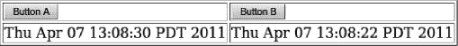

***图 3-5.** 使用 RichFaces 队列*

托管 Bean 相当简单，如代码清单 3-50 所示。需要指出一点，我们让两个操作都休眠一段时间，以便模拟更“真实”的场景。

***代码清单 3-50.** 托管 Bean*

`@ManagedBean`
`@RequestScoped`
`public class QueueBean {`

`   public Date getNow1 (){`
`      return (new Date ());`
`   }`
`   public Date getNow2 (){`
`      return (new Date ());`
`   }`
`   public void action1 () {`
`      try {`
`         Thread.sleep (4000);`
`      } catch (InterruptedException e) {`
`         e.printStackTrace();`
`      }`
`   }`
`   public void action2 () {`
`      try {`
`         Thread.sleep (1000);`
`      } catch (InterruptedException e) {`
`         e.printStackTrace();`
`      }`
`   }`
`}`

现在我们已经有了代码，让我们来研究队列是如何工作的。由于这是一个 RichFaces 应用程序，并且我们使用了 RichFaces 组件，因此我们获得了一些额外的功能。

如果你点击按钮 A 一次，一个请求（我们称之为 A1）将被发送到服务器，并且需要 4 秒才能完成。如果你在 4 秒内再次点击按钮 A（A2），新事件将被排队，并且只有在请求 A1 在服务器上执行完成后才会被发送。这并不新鲜，标准队列也能提供此功能。表 3-3 显示了事件序列。

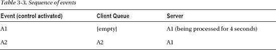

只有当请求 A1 完成时，A2 才会被触发。

让我们做类似的事情，但在请求 A1 在服务器上执行期间，我们多次点击该按钮。由于点击的是同一个按钮，每个新事件或点击将覆盖（或合并）当前排队的事件。无论你点击按钮多少次，只会有一个事件被发送到服务器。此功能可防止用相同的请求淹没服务器。事件序列如表 3-4 所示。

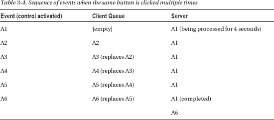

一旦请求 A1 完成，请求 A6 将被发送，并且客户端队列现在为空。

 **提示** 来自同一组件的事件会被“合并”在一起。

还有第二个按钮。让我们追踪混合点击两个按钮时的事件，如表 3-5 所示。

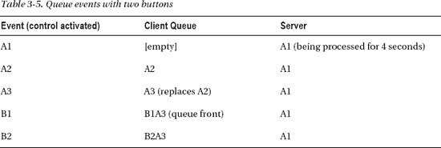

注意这里发生了一些不同的事情。只要我们在点击按钮 A，这些事件就会被合并。一旦我们点击了按钮 B，并且队列中的最后一个事件来自 A，事件就不再能被合并，并且该事件被添加到队列中。这意味着，只要刚刚激活的事件和队列中的最后一个事件来自同一组件，事件就可以被合并。

即使我们没有在页面上放置 `<a4j:queue>` 标签，RichFaces 队列功能仍然存在。事实上，每个页面都会自动获得一个队列。RichFaces 通过 `context` 参数在所有页面上提供此应用程序级别的功能，如代码清单 3-51 所示。

***代码清单 3-51.** RichFaces 通过 `context` 参数在所有页面上提供此应用程序级别的功能*

`<context-param>`
`   <param-name>org.richfaces.queue.global.enabled</param-name>`
`   <param-value>true</param-value>`
`</context-param>`

当定义我们之前提到的一些队列时——视图级别、表单级别和组件映射——都只是用更大作用域的队列覆盖一个队列。如果在某个时候你需要在这个全局队列上设置任何属性，队列的名称是 `org.richfaces.queue.global`，设置属性如下所示：

`<a4j:queue name="org.richfces.queue.global" requestDelay="2000">`

#### 设置延迟

你可以通过使用 *`requestDelay`* 属性来设置队列的延迟（在以下示例中设置为 4 秒）：

`<a4j:queue requestDelay="4000">`

这意味着每个请求在发送前都会被排队并延迟 4 秒。请注意，这是一个视图级别的队列，因此所有控件都将延迟 4 秒。另一种看待延迟的方式是，它是等待从同一组件触发新请求，并且让这个新事件替换已排队事件的时间。让我们通过表 3-6 来追踪事件。

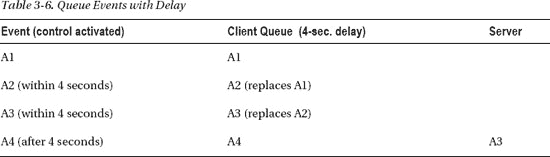

要使事件 A4 被触发，需要满足两个条件：服务器上的前一个请求必须完成，并且 A4 的延迟时间必须过去。

我们之前提到过，每个组件可以通过使用 `<a4j:attachQueue>` 行为来覆盖视图级别或表单级别的队列设置。现在我们的延迟是视图级别的。对于第二个按钮，让我们覆盖延迟并将其设置为 0，如代码清单 3-52 所示。

***代码清单 3-52.** 覆盖延迟并将其设置为 0*

`<a4j:commandButton value="按钮 B" action="#{queueBean.action2}" render="now2"`
`         status="action2Status">`
**`<a4j:attachQueue requestDelay="0"/>`**
`</a4j:commandButton>`

按钮 A 将使用视图级别的队列，每个事件将延迟 4 秒。按钮 B 仍将使用视图级别的队列，但通过将延迟设置为 0 来覆盖它。

在表 3-6 中，我们只使用了一个组件。让我们看看如果现在使用两个按钮会发生什么。假设我们排队了 A1，并且在 4 秒的延迟期内，我们点击了按钮 B。会发生的情况如表 3-7 所示：事件 A1 将立即触发，无需等待其延迟期过去。

如果你没有这本书，你的第一反应可能会认为这是一个 bug。但是，这不是 bug。事件 A1 无需等待其延迟过去就被发送的原因是，B1 无法与 A1 合并，并且由于没有更多可以合并到 A1 的事件排队，A1 会立即触发。为了强调，延迟可用于等待相同的事件（来自同一组件）被合并。

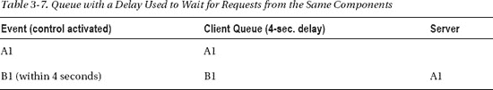

#### 合并来自不同组件的事件

我们展示了来自同一组件的事件（在排队时）会被合并。通过使用 *`requestGroupingId`* 属性将它们放入同一个请求组，也可以合并来自不同组件的事件。由于此设置适用于单个组件，我们使用 *`<a4j:attachQueue>`* 标签来设置该参数，如清单 3-53 所示。

***清单 3-53.** 使用* `<a4j:attachQueue>` *标签设置该参数*

`<a4j:commandButton value="按钮 A" action="#{queueBean.action1}"`
` render="now1"`
`   status="action1Status">`
**`<a4j:attachQueue requestGroupingId="ajaxGroup" />`**
`</a4j:commandButton>`

`<a4j:commandButton value="按钮 B" action="#{queueBean.action2}"`
` render="now2"`
`   status="action2Status">`
**`<a4j:attachQueue requestGroupingId="ajaxGroup" requestDelay="0" />`**
`</a4j:commandButton>`

一旦我们将两个按钮更新为属于同一个请求组，让我们追踪表 3-8 中的序列。

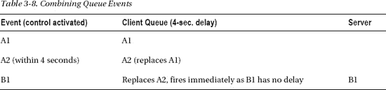

事件 A1 和 A2 被合并，因为它们来自同一个组件。当我们对事件 B1 进行排队时，它会合并（或替换）A2，因为两个按钮现在属于同一个请求组 ID。现在，B1 会立即触发，因为它没有任何延迟。例如，如果我们为其设置 1 秒（1000 毫秒）的延迟，那么 B1 将替换 A2 并在 1 秒后触发。

#### 忽略“过时”响应

让我们回顾一个之前看到的示例，其中小写字符串被转换为大写字符串。在之前的示例中，我们在点击按钮后调用操作。此示例略有更新；我们现在在 *`keyup`* 事件上调用操作。JSF 页面如清单 3-54 所示。

***清单 3-54.** JSF 页面*

`<h:form>`
`   <a4j:status startText="工作中..."`
`      startStyle="background-color: #ffA500;`
`      font-weight:bold;`
`      position: absolute;`
`      left: 520px;`
`      top: 1px;`
`      width: 100px;" />`

`   <a4j:queue requestDelay="500"/>`
`   <h:panelGrid>`
`      <h:panelGrid>`
`         <h:outputText value="输入要转换为大写的小写文本：" />`
`         <h:inputText value="#{queueIgnoreOldBean.text}" >`
`            <a4j:ajax event="keyup" render="upper"`
`               listener="#{queueIgnoreOldBean.upperCase}"/>`
`         </h:inputText>`
`      </h:panelGrid>`
`      <h:outputText id="upper" value="#{queueIgnoreOldBean.text}" />`
`   </h:panelGrid>`
`</h:form>`

请注意，我们在发送 Ajax 请求之前设置了半秒的延迟。这将允许我们“合并”事件。或者换句话说，等待用户输入更多字母。

托管 Bean 如清单 3-55 所示。

***清单 3-55.** 托管 Bean*

`@ManagedBean`
`@RequestScoped`
`public class QueueIgnoreOldBean {`
`   private String text;`

`   // Getter 和 Setter`

`   public void upperCase(AjaxBehaviorEvent event) {`
`      try {`
`         Thread.sleep(2500);`
`      } catch (InterruptedException e) {`
`         e.printStackTrace();`
`      }`
`      setText(text.toUpperCase());`
`   }`
`}`

假设我们输入单词“dog”。将发送一个请求，操作执行需要 2.5 秒，此时我们应该看到单词 DOG 呈现在页面上。让我们重复此操作，但当请求在服务器上执行时，快速删除“dog”并输入“cat”。

您将看到的结果是，首先会呈现 DOG，然后呈现 CAT。现在的问题是，如果用户已将输入更改为“cat”，呈现 DOG 是否有意义？答案取决于具体情况，但在大多数情况下，不再需要显示 DOG，因为用户输入了“cat”。在这种情况下，DOG 是一个“过时”的响应。是否要呈现 DOG 由您决定。幸运的是，RichFaces 提供了一个队列功能，允许您忽略“过时”的响应。RichFaces 队列提供了一个 `ignoreDupResponse` 属性，允许您实现这一点。当设置为 `true` 时，它将忽略来自同一组件的重复响应。重复是什么意思？重复意味着，如果当前正在执行一个请求，并且来自同一组件（或由 `requestGroupingId` 分组的组件）的另一个请求已排队，那么它将忽略原始响应或 DOM 更新。重要的是要理解，请求仍会在服务器上执行（我们无法在那里阻止它），只有 DOM 更新会被丢弃或忽略。

要忽略“过时”响应，我们将 `ignoreDupRepsonses` 属性添加到队列中，如下所示：

`<a4j:queue requestDelay="500" ignoreDupResponses="true"/>`

让我们再次运行页面。输入“dog”，并在请求执行期间（状态显示中），快速删除并输入“cat”。您现在应该只看到 CAT 被呈现。原始响应（DOG）已完成，但我们决定忽略此 DOM 更新。

重要的是要记住，RichFaces 提供了大量高级功能，但它只是升级了标准的 JSF 2 队列。

### 更多 a4j:* 标签和功能

本节将涵盖更多 a4j:* 标签和功能，例如如何在 Ajax 请求期间显示状态、如何显示 Ajax 请求/响应日志信息，以及一种更简单的调用操作监听器的方法。

#### 使用 <a4j:status> 显示 Ajax 状态

许多使用 Ajax 的网站会在屏幕顶部显示 Ajax 请求状态，例如一个移动的动画图像或一条“加载中…”消息。有些网站会在执行 Ajax 请求时阻止整个页面。显示 Ajax 请求状态可能有多种理由。由于没有完整的页面刷新，用户甚至可能不知道正在执行请求。显示状态可以表明有事情正在发生——这样用户或许就不会再次点击按钮或链接。不过，你可能已经知道，在 Web 开发中不存在“或许”这种说法。另一种用途是在执行 Ajax 请求时锁定屏幕，以防止用户在请求完成前点击任何操作。我们不再对此进行深入讨论，是否显示 Ajax 状态由你决定。我们的任务是向你展示如何在 RichFaces 中使用 `<a4j:status>` 组件。该组件用于显示 Ajax 请求状态。

以下是定义 `<a4j:status>` 的三种方式：

*   **按视图（页面）的状态**：状态放置在任意表单之外。此页面上任何触发 Ajax 请求的组件都会激活此状态。
*   **按表单的状态**：状态放置在表单内部。该表单内任何触发 Ajax 请求的组件都会激活此状态（视图状态不会被激活）。
*   **命名状态**：状态被赋予一个名称，触发 Ajax 请求的组件必须通过名称引用该状态。如果没有组件引用此状态，则不会显示该状态。

那么，如何定义组件显示的内容呢？最简单的方法是使用两个属性：`startText` 和 `stopText`。`startText` 在服务器端执行请求时显示文本，`stopText` 在没有活跃的 Ajax 请求时显示文本。第三个属性 `errorText` 可用于在服务器出错时显示文本。

以下三张图展示了 Ajax 在不同步骤中的状态。为了保持示例简单，同时展示 `<a4j:status>` 的全部功能，我们将获取一个输入的字符串并将其转换为大写。

图 3-6 展示了页面刚加载后的状态；然而，由于没有活跃的 Ajax 请求，`stopText` 已经显示出来。

***图 3-6.** 无活跃 Ajax 请求；页面刚加载*

 **提示** 为了避免在没有活跃 Ajax 请求时显示状态，只需不设置 `stopText` 属性（或 `stop` 区域）即可。

图 3-7 展示了服务器端有活跃请求时的状态。

***图 3-7.** 活跃 Ajax 请求期间*

图 3-8 展示了请求完成后的状态。

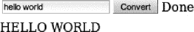

***图 3-8.** Ajax 请求完成后*

JSF 页面如代码清单 3-56 所示。

***代码清单 3-56.** JSF 页面*

`<h:form>`
`   <h:panelGrid>`
`      <h:panelGrid columns="3">`
`         <h:inputText value="#{ajaxStatusBean.text}" />`
`         <a4j:commandButton value="Convert" action="#{ajaxStatusBean.upperCase}"`
`            render="upper"/>`
`         <a4j:status startText="Working..." stopText="Done" />`
`      </h:panelGrid>`
`      <h:outputText id="upper" value="#{ajaxStatusBean.text}" />`
`   </h:panelGrid>`
`</h:form>`

在代码清单 3-56 中，状态被放置在表单内部，因此该表单内任何其他被激活的组件也会调用（显示）此状态。

受管 Bean 如代码清单 3-57 所示。

***代码清单 3-57.** 受管 Bean*

`@ManagedBean`
`@RequestScoped`
`public class AjaxStatusBean {`

`   private String text;`

`   public void upperCase () {`
`      try {`
`         Thread.sleep (3000);`
`      } catch (InterruptedException e) {`
`         e.printStackTrace();`
`      }`
`      setText(text.toUpperCase());`
`   }`
`   public String getText() {`
`      return text;`
`   }`
`   public void setText(String text) {`
`      this.text = text;`
`   }`
`}`

这个 Bean 相当简单。你唯一会注意到的是我们让动作休眠了 3 秒钟。如果没有这个休眠，动作会执行得非常快，很难看到状态。所以，这实际上只是为了“模拟”一个更真实的示例。

在页面首次加载时看到“Done”文本可能不是你期望的。完全不使用它，只定义 `startText` 也是完全可以的。当页面首次加载时，不会显示任何内容，当 Ajax 被激活时，会显示 `startText` 的内容。

`<a4j:status startText="Working..."/>`

你还可以使用 `startStyle` 属性（`stopStyle` 也可用）来设置显示的标签样式，如下所示：

`<a4j:status startText="Working..." startStyle="background-color:#ffA500"/>`

你不必将状态显示限制在按钮或链接旁边；使用 `style` 属性，你可以为状态指定绝对定位。让我们将状态移到表单外部；这意味着页面上的任何组件都会激活此状态，并且我们将状态移动到浏览器窗口的最顶部显示，如图 3-9 所示。

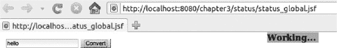

***图 3-9.** 为 Ajax 状态使用绝对定位*

代码如代码清单 3-58 所示。

***代码清单 3-58.** Ajax 状态的代码*

`<a4j:status id="ajaxStatus" startText="Working..."`
`          startStyle="background-color: #ffA500;`
`          font-weight:bold;`
`          position: absolute;`
`          left: 520px;`
`          top: 1px;`
`          width: 100px;" />`
`<h:form>`
`   <h:panelGrid>`
`      <h:panelGrid columns="3">`
`         <h:inputText value="#{ajaxStatusBean.text}" />`
`         <a4j:commandButton value="Convert"`
`            action="#{ajaxStatusBean.upperCase}"`
`            render="upper" />`
`      </h:panelGrid>`
`      <h:outputText id="upper" value="#{ajaxStatusBean.text}" />`
`   </h:panelGrid>`
`</h:form>`

现在任何组件都会显示此状态。让我们更新页面，使得仅当我们点击 Convert 按钮时才显示状态。我们首先需要给状态一个名称，如代码清单 3-59 所示。注意，我们设置的是名称，而不是 id。

***代码清单 3-59.** 为状态命名*

`<a4j:status id="ajaxStatus"` **`name="ajaxStatus"`** `startText="Working..."`
`          startStyle="background-color: #ffA500;`
`          font-weight:bold;`
`          position: absolute;`
`          left: 520px;`
`          top: 1px;`
`          width: 100px;" />`

接下来，我们需要更新 `<a4j:commandButton>` 以引用该状态，使用 `status` 属性如下：

`<a4j:commandButton value="Convert"`
`   action="#{ajaxStatusBean.upperCase}" render="upper"`
**`status="ajaxStatus"`**`/>`

该状态将仅在此按钮被激活时显示。页面上任何其他组件都不会激活此状态。同样，这被称为命名状态。

 **注意** 任何发送 Ajax 请求的 RichFaces 组件都可以显示（激活）`<a4j:status>`。如果没有组件通过名称引用命名状态，则该状态将不会显示。

到目前为止一切顺利，但你可能已经注意到，如果使用 `startText` 和 `stopText` 属性，我们只能显示文本。如果我们使用在 `<a4j:status>` 标签上定义的 facets（`start`、`stop` 和 `error`），则可以显示富内容，例如其他组件。你可能已经猜到了它们的工作方式——与 `startText`、`stopText` 和 `errorText` 相同，但允许你在其中显示任何内容。清单 3-60 展示了一个使用 `start` facet 并包含图片的示例。

***清单 3-60.** 使用 start facet 并包含图片的示例*

`<h:form>`
`   <h:panelGrid>`
`      <h:panelGrid columns="3">`
`         <h:inputText value="#{ajaxStatusBean.text}" />`
`         <a4j:commandButton value="Convert" action="#{ajaxStatusBean.upperCase}"`
`            render="upper" />`
`         <a4j:status>`
`            <f:facet name="start">`
`               <h:graphicImage value="/status/ajax-loader.gif" />`
`            </f:facet>`
`         </a4j:status>`
`      </h:panelGrid>`
`      <h:outputText id="upper" value="#{ajaxStatusBean.text}" />`
`   </h:panelGrid>`
`</h:form>`

结果如图 图 3-10 所示。

***图 3-10.** 使用图片显示 Ajax 状态*

##### 在 Ajax 请求期间显示弹出窗口

`<a4j:status>` 带有两个事件，可用于调用任何 JavaScript `onstart` 和 `onstop` 事件。将 `<a4j:status>` 的 `onstart` 和 `onstop` 事件与 `<rich:popupPanel>` 组件结合使用，我们可以在 Ajax 请求期间阻止页面。这可以用于防止用户在 Ajax 请求执行时点击页面上的任何其他按钮或链接。

清单 3-61 展示了如何将 `<a4j:status>` API 与 `<rich:popupPanel>` 结合使用。通过 `onstart`，我们显示一个弹出面板；通过 `onstop`，我们隐藏弹出面板。`<rich:popupPanel>` 也可以配置为非阻塞弹出窗口。我们将在第 6 章中介绍此组件。

***清单 3-61.** 将 `<a4j:status>` API 与 `<rich:popupPanel>` 结合使用*

`<h:form>`
`   <h:panelGrid>`
`      <h:panelGrid columns="3">`
`         <h:inputText value="#{ajaxStatusBean.text}" />`
`         <a4j:commandButton value="Convert"`
`            action="#{ajaxStatusBean.upperCase}"`
`            render="upper" />`
`         <a4j:status onstart="#{rich:component('statusPanel')}.show();"`
`            onstop="#{rich:component('statusPanel')}.hide();" />`
`      </h:panelGrid>`
`      <h:outputText id="upper" value="#{ajaxStatusBean.text}" />`
`   </h:panelGrid>`
`</h:form>`

`<rich:popupPanel id="statusPanel" header="Converting">`
`   <h:outputText value="Please wait.." />`
`</rich:popupPanel>`

结果如图 图 3-11 所示。

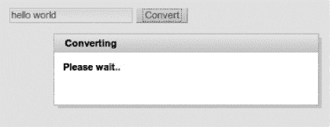

***图 3-11.** 通过 `<a4j:status>` JavaScript API 在 Ajax 请求时打开的弹出面板*

`<a4j:status>` 还附带 表 3-9 中列出的 JavaScript API。

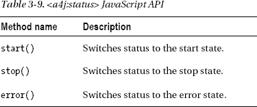

当您需要对非 Ajax 请求使用相同的状态（例如，通过在 `<h:commandButton>` 点击时调用 `start()`），或者在任何耗时的 JavaScript 活动期间显示它时，JavaScript API 非常有用。

#### 使用 <a4j:log> 显示日志记录和调试信息

*`<a4j:log>`* 是一个用于 Ajax 日志记录和调试的客户端实用程序。它会生成 JavaScript 代码，打开一个调试窗口，记录客户端处理信息，例如请求、响应和 DOM 更改。

要使用它，只需在页面上放置 `<a4j:log/>` 标签，如下所示：

`<a4j:log />`

它会在 Ajax 请求触发时显示输出，因此让我们将其与一个显示当前时间的按钮一起使用，如清单 3-62 所示。

***清单 3-62.** 一个显示当前时间的按钮*

`<h:form id="form">`
`   <h:panelGrid>`
`      <a4j:commandButton id="Update" value="Update" render="time"/>`
`      <h:outputText value="#{logBean.now}" id="time"/>`
`   </h:panelGrid>`
`   <a4j:log />`
`</h:form>`

当页面渲染并点击按钮后，你将看到如图 图 3-12 所示的输出。

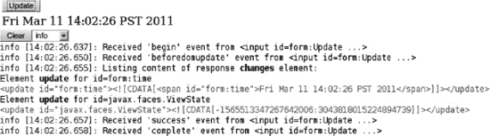

***图 3-12.** `<a4j:log>` 组件的输出*

选择 `debug` 级别并点击 Update 按钮将产生更详细的输出，如图 图 3-13 所示。

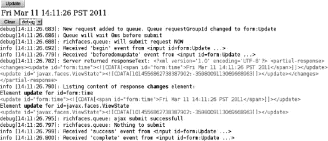

***图 3-13.** 选择 debug 级别后 `<a4j:log>` 组件的输出*

如果出现错误，例如服务器未运行，你可能会看到类似 图 3-14 的输出。

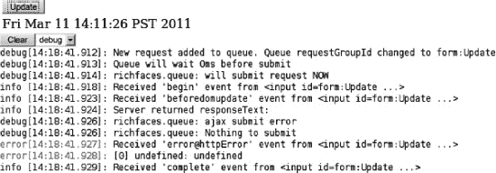

***图 3-14.** 服务器错误时 `<a4j:log>` 组件的输出*

如果你想在开发期间设置日志级别，可以使用 `level` 属性，如下所示：

`<a4j:log level="DEBUG"/>`

`level` 属性可以设置为以下值：

*   ERROR
*   DEBUG
*   INFO
*   WARN
*   ALL（默认设置，记录所有数据）

默认行为是日志在页面内渲染。或者，日志可以在弹出窗口中打开。为此，将 `mode` 属性设置为 `popup`，如下所示：

`<a4j:log mode="popup"/>`

要打开弹出窗口，请按 Ctrl+Shift+L。要重新配置热键组合，请将 `hotkey` 属性设置为一个新字母；例如，`hotkey="D"` 将在按下 Ctrl+Shift+D 时打开弹出窗口。

 **注意** 日志会在每次 Ajax 请求后自动更新。无需显式重新渲染。

#### 使用 `<a4j:actionListener>`

`<a4j:actionListener>` 是对 JSF 标准 `<f:actionListener>` 的一次小幅升级。使用 `<a4j:actionListener>`，可以在受管 Bean 中定义一个监听器方法，并通过标准的方法绑定表达式引用它，如清单 3-63 所示。

***清单 3-63.** 在受管 Bean 中定义监听器方法*

`<a4j:commandButton value="更新 (a4j:actionListener)" render="out">`
`   <a4j:actionListener listener="#{actionListenerBean.listener}"/>`
`</a4j:commandButton>`

在受管 Bean 内部，监听器的定义方式如清单 3-64 所示。

***清单 3-64.** 在受管 Bean 中定义监听器*

`public void listener (ActionEvent event){`
`  FacesContext.getCurrentInstance()`
`     .addMessage(null, new FacesMessage("a4j:actionListener - 监听器`
`        于 "+new Date()+" 被调用"));`
`}`

在受管 Bean 内部定义监听器，可以让你访问其他 Bean 的属性和方法。

 **提示** 使用 `<a4j:actionListener>` 是为组件添加多个监听器的一种好方法。

你可能知道，使用 JSF 标准的 `<f:actionListener>` 标签有两种定义动作监听器的方法。这两种方法都比我们刚才展示的 `<a4j:actionListener>` 稍微复杂一些。第一种方法是使用 `binding`，如清单 3-65 所示。

***清单 3-65.** 使用 binding 定义动作监听器*

`<a4j:commandButton value="更新 (binding)" render="out">`
`   <f:actionListener binding="#{actionListenerBean.anotherListener}"/>`
`</a4j:commandButton>`

在受管 Bean 内部，你需要为此监听器定义一个内部匿名类，如清单 3-66 所示。在这种情况下，你同样可以从匿名内部类中访问 Bean 的属性和方法。

***清单 3-66.** 为此监听器定义内部匿名类*

`public ActionListener getAnotherListener () {`
`   return new ActionListener (){`
`      public void processAction (ActionEvent event){`
`         FacesContext.getCurrentInstance()`
`            .addMessage(null, new FacesMessage("binding - 监听器于`
`               "+new Date()+" 被调用"));`
`         }`
`      };`
`}`

最后一种方法，可能也是最不常用的，是通过实现接口。我们将展示这种方法，以便你可以比较所有三种方式。清单 3-67 展示了该接口。请注意，该类并未注册为受管 Bean。

***清单 3-67.** 展示接口*

`public class YetAnotherListener  implements javax.faces.event.ActionListener{`
`   public void processAction(ActionEvent event) throws       AbortProcessingException {`
`         FacesContext.getCurrentInstance()`
`            .addMessage(null, new FacesMessage("接口 - 监听器于 `
`                "+new Date()+" 被调用"));`
`      }`
`}`

在页面上使用此方法的方式如清单 3-68 所示。请注意，我们使用了 `type` 属性，它接受完整的类名作为字符串，而不是值表达式。使用这种方法，你无法访问此页面的属性。

***清单 3-68.** 使用 type 属性，该属性接受完整的类名作为字符串*

`<a4j:commandButton value="更新 (接口)" render="out">`
`   <f:actionListener`
`      type="org.richfaces.book.actionlistener.YetAnotherListener"/>`
`</a4j:commandButton>`

现在你已经了解了所有三种方法，使用 `<a4j:actionListener>` 似乎是最直接的方式。你只需在受管 Bean 中定义一个监听器，然后通过标准的方法绑定表达式引用它即可。

 **提示** `<a4j:actionListener>` 标签支持所有 `<f:actionListener>` 标签的属性和特性。

### 总结

本章介绍了 RichFaces 在标准 JSF 基础上添加的一些最重要的升级。在本章中，我们向你展示了用于发送 Ajax 请求的其他 RichFaces 组件，例如 `<a4j:commandButton>`、`<a4j:commandLink>`、`<a4j:poll>` 和 `<a4j:jsFunction>`。然后，我们介绍了高级渲染选项，例如使用 `<a4j:outputPanel>` 组件和 `limitRender` 属性。

在决定执行 JSF 视图的哪一部分时，RichFaces 通过提供 `<a4j:region>` 组件增加了另一个高级选项。RichFaces 通过高级功能和灵活的定制选项极大地升级了标准的 JSF 队列。在下一章中，我们将继续 RichFaces 之旅，向你介绍富组件或 rich:* 标签库。

## 第 4 章

## 富组件入门

既然我们已经介绍了 RichFaces 基础、a4j:* 标签、高级特性和定制，本章我们将开始学习富组件或 rich:* 标签库。我们不会在这里涵盖所有组件；其他章节会专门介绍。在本章中，我们将向你展示所有富组件共享的概念和通用特性。一些通用特性包括使用 facet、组件 JavaScript API 和发送 Ajax 请求。一旦你掌握了这些概念，你将能够使用当前可用或未来 RichFaces 版本中引入的任何富组件。

### 富组件还是 Ajax 组件？

如果你在问——我应该使用富组件还是 Ajax 组件？——这并不重要。它可以是其中一种，甚至两者兼有，只要我们理解我们在谈论什么。让我们以 `<rich:inplaceInput>` 组件为例。该组件渲染为一个标签，如图 4-1 所示。

***图 4-1.** 标签状态下的 <rich:inplaceInput>*

当点击标签时，组件会切换到输入状态，如图 4-2 所示。

***图 4-2.** 输入状态下的 <rich:inplaceInput>*

这个组件是“富”的，因为它提供了丰富的 UI——或者说一种富有的输入方式。但同时，在幕后它只是一个普通的输入字段。这也能算作 Ajax 组件吗？可能可以。然而，重要的是要理解这个组件不会自动发送 Ajax 请求。换句话说，当从标签切换到输入或从输入切换到标签时，不会发送任何 Ajax 请求。所有更改只会在客户端（浏览器）上发生。对此更合适的称呼可能是富客户端组件。现在，不要气馁，有一种方法可以从这个组件发送 Ajax 请求，我们稍后会向你展示。

因此，RichFaces（rich:* 标签库）中有一些组件是富客户端组件，但它们不发送 Ajax 请求。但是，还有其他富客户端组件确实会发送 Ajax 请求。一个这样的例子是 `<rich:tabPanel>` 组件。换句话说，Ajax 行为（基于某些事件）是内置于它们之中的。

既然我们更清楚地了解了具体要处理什么，让我们探索一下富组件共享的通用特性和概念。

### 富组件特性

所有富组件都共享许多通用特性，如下所示：

*   使用 facet 重新定义组件的部分内容
*   发送 Ajax 请求
*   使用组件客户端 JavaScript API
*   触发客户端事件（可以将客户端行为附加到此类事件）
*   皮肤

 **注意** 某些富组件可能不具备所有这些特性。要获取最新信息，请访问 RichFaces 文档页面：[`www.jboss.org/richfaces/docs`](http://www.jboss.org/richfaces/docs)。

本书的第 13 章 深入介绍了皮肤。我们不会以同样的深度介绍其他三项的组件。这不是本章的目标。目标是向你展示所有富组件共享的重要概念。但是，同样，后续章节将更详细地介绍各种富组件。

#### 使用 Facet 重新定义组件的部分内容

让我们从流行的选项卡面板组件开始，如图 4-3 所示。

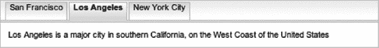

***图 4-3.** 丰富的选项卡面板*

JSF 页面代码如 清单 4-1 所示。

***清单 4-1.** JSF 页面代码*

`<h:form>`
`   <rich:tabPanel style="width:40%" switchType="ajax">`
`      <rich:tab header="San Francisco">`
`         <h:outputText value="San Francisco is a major city in northern California, on the`
`            West Coast of`
`            the United States" />`
`      </rich:tab>`
`      <rich:tab header="Los Angeles">`
`         <h:outputText value="Los Angeles is a major city in southern California, on the`
`            West Coast of    `
`            the United States" />`
`      </rich:tab>`
`      <rich:tab header="New York City">`
`         <h:outputText value="New York City is a major city on the East Coast of the United`
`States" />`
`         </rich:tab>`
`   </rich:tabPanel>`
`</h:form>`

`<rich:tabPanel>` 是一个容器，用于容纳一个或多个 `<rich:tab>` 组件。你可以在每个选项卡内放置任何内容或组件。每个选项卡的标题由 `header` 属性定义。这很好，但如果你想在名称旁边放置城市图片或市旗呢？使用 `header` 属性，我们实际上无法做到这一点，因为我们只能使用文本。

我们该如何实现呢？幸运的是，该组件（以及许多其他富组件）提供了 facet，这样我们就可以用任何内容重新定义组件的某些部分；在我们的例子中，这部分就是标题。使用名为 `header` 的 facet，我们可以用图片、文本或任何我们想要的内容重新定义每个选项卡的标题。我们不再局限于文本。在继续之前，请注意我们还将 `switchType` 属性设置为 `ajax`，这也是默认值。你也可以将 `switchType` 设置为 `client` 或 `server` 切换模式。

让我们为每个城市的标题添加市旗，如图 4-4 所示。

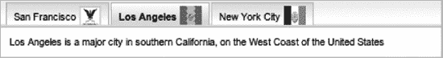

***图 4-4.** 选项卡标题中包含图片的丰富选项卡面板*

更新后的 JSF 页面如 清单 4-2 所示。

***清单 4-2.** 更新后的 JSF 页面*

`<h:form>`
`   <rich:tabPanel style="width:40%" switchType="ajax">`
`      <rich:tab>`
`         <f:facet name="header">`
`            <h:panelGrid columns="2">`
`               <h:outputText value="San Francisco" />`
`               <h:graphicImage value="/images/sf_flag.png" height="25" width="25" />`
`           </h:panelGrid>`
`         </f:facet>`
`         <h:outputText value="San Francisco is a major city in northern California, on the`
`            West Coast of`
`            the United States" />`
`      </rich:tab>`
`      <rich:tab>`
`         <f:facet name="header">`
`            <h:panelGrid columns="2">`
`               <h:outputText value="Los Angeles" />`
`               <h:graphicImage value="/images/la_flag.png" height="25" width="25" />`
`            </h:panelGrid>`
`         </f:facet>`
`         <h:outputText value="Los Angeles is a major city in southern California, on the`
`            West Coast of`
`            the United States" />`
`      </rich:tab>`
`      <rich:tab>`
`         <f:facet name="header">`
`            <h:panelGrid columns="2">`
`               <h:outputText value="New York City" />`
`               <h:graphicImage value="/images/nyc_flag.png" height="25" width="25" />`
`            </h:panelGrid>`
`         </f:facet>`
`         <h:outputText value="New York City is a major city on the East Coast of the United`
`States" />`
`         </rich:tab>`
`   </rich:tabPanel>`
`</h:form>`

如果你仔细查看 清单 4-2，我们添加了一个名为 `header` 的 facet。在该 facet 内部，我们放置了城市名称和市旗图片。同样重要的是要提到，城市名称和市旗图片都位于一个面板网格内。JSF facet 只能有一个子元素。如果我们想包含多个组件，需要将它们包裹在一个容器内。我们使用了 `<h:panelGrid>`，也可以使用 `<h:panelGroup>`。通过使用 `header` facet，我们能够用任何内容定义每个选项卡的标题；我们不再局限于纯文本。除了 `header` facet 之外，`<rich:tab>` 面板还提供了其他 facet。完整的 facet 列表如 表 4-1 所示。

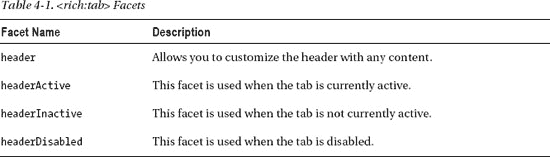

如何找到哪些 facet 可用？了解这一点的最佳途径是 RichFaces 组件指南。你可以通过访问 [`www.jboss.org/richfaces/docs`](http://www.jboss.org/richfaces/docs) 找到它。

许多其他 RichFaces 组件也提供了各种 facet，允许你重新定义组件的不同部分。

#### 发送 Ajax 请求

让我们来看看富组件中的另一个重要特性：发送 Ajax 请求。正如我们之前所说，有些组件内置了 Ajax 行为，而有些组件则是纯客户端组件。这些组件没有内置的 Ajax 行为，但我们可以轻松地为其添加。让我们使用选项卡示例。*`<rich:tab>`* 是一个内置了 Ajax 支持的富组件。

默认情况下，选项卡的切换是通过 Ajax 完成的，但也可以设置为客户端或服务器端。当我们选择一个新的选项卡时，会发送一个 Ajax 请求，并且新选项卡的全部内容将被渲染。你无需做任何操作。现在，也可以渲染选项卡外部的内容。稍后我们会向你展示这一点。

我们之前使用的带有选项卡面板的 JSF 页面如清单 4-3 所示。唯一的区别是我们添加了一个显示时间的组件。

***清单 4-3.** 之前使用的带有选项卡面板的 JSF 页面*

`<h:form>`
`   <rich:tabPanel style="width:40%" switchType="ajax">`
`      <rich:tab header="旧金山">`
`         <h:outputText value="旧金山是北加州的一个主要城市，位于`
`            美国西海岸"`
`          />`
`        <`**`h:outputText value="#{timeBean.now}" />`**
`      </rich:tab>`
`      <rich:tab header="洛杉矶">`
`         <h:outputText value="洛杉矶是南加州的一个主要城市，位于`
`            美国西海岸"`
`          />`
**`<h:outputText value="#{timeBean.now}" />`**
`      </rich:tab>`
`      <rich:tab header="纽约市">`
`         <h:outputText value="纽约市是美国东海岸的一个主要城市`
`          " />`
**`<h:outputText value="#{timeBean.now}" />`**
`      </rich:tab>`
`   </rich:tabPanel>`
`</h:form>`

在受管 bean 内部，有一个单一的方法，如清单 4-4 所示。

***清单 4-4.** 受管 bean 内部使用的单一方法*

`public Date getNow (){`
`   return new Date();`
`}`

每次切换选项卡时，对应选项卡中的时间组件都会被更新。在选项卡面板外部渲染内容非常简单：我们只需使用 `render` 属性。清单 4-5 展示了一个将时间组件放置在选项卡面板外部的页面。另外需要注意的一点是，每个 `<rich:tab>` 现在都设置了 `render` 属性，指向我们想要更新的组件。

***清单 4-5.** 展示了一个将时间组件放置在选项卡面板外部的页面*

`<h:form>`
`   <rich:tabPanel style="width:40%">`
`      <rich:tab header="旧金山" render="time">`
`         <h:outputText value="旧金山是北加州的一个主要城市，位于`
`            美国西海岸"`
`          />`
`      </rich:tab>`
`      <rich:tab header="洛杉矶" render="time">`
`         <h:outputText value="洛杉矶是南加州的一个主要城市，位于`
`            美国西海岸"`
`          />`
`      </rich:tab>`
`      <rich:tab header="纽约市" render="time">`
`         <h:outputText value="纽约市是美国东海岸的一个主要城市`
`          " />`
`      </rich:tab>`
`   </rich:tabPanel>`
`   <h:outputText value="#{timeBean.now}" id="time" />`
`</h:form>`

作为替代方案，除了通过 `render` 指向之外，另一种选择是将任何需要更新的组件包裹在 `<a4j:outputPanel ajaxRendered="true">` 内部。另外，请记住，我们在前几章中介绍的所有属性，例如 `limitRender` 和队列特性，都可以使用。

选项卡面板是一个内置了 Ajax 行为的富组件。现在让我们看看 `<rich:inplaceInput>` 组件。它是一个富客户端组件，但没有内置的 Ajax 行为。

当我们将该组件放置在页面上时，它提供了一种非常丰富的方式来输入任何内容，如下所示：

`<rich:inplaceInput value="#{inplaceInputBean.text}"`
`   defaultLabel="点击编辑" showControls="true"/>`

图 4-5 展示了该组件在页面上激活时的状态。

***图 4-5.** 处于输入模式的内联输入组件*

需要理解的关键点是，我们所做的所有更改都只发生在客户端；没有向服务器发送 Ajax 请求。为什么？嗯，因为它是一个富客户端组件（后台只是一个常规输入框）。如何发送 Ajax 请求？一种方法是在表单中，在该组件旁边放置一个按钮或链接。一旦在 `<rich:inplaceInput>` 组件中输入了值（并保存，组件会变为标签），就点击组件旁边的按钮或链接。这与使用标准输入字段没有太大区别。

假设我们想在 `<rich:inplaceInput>` 内部保存新值时发送一个 Ajax 请求。事实证明，这也非常简单。我们只需要基于一个事件添加 Ajax 行为，如清单 4-6 所示。

***清单 4-6.** 基于事件添加 Ajax 行为*

`<h:form>`
`   <h:panelGrid>`
`      <rich:inplaceInput value="#{inplaceInputBean.text}" defaultLabel="点击编辑"`
`         showControls="true">`
`         <a4j:ajax event="change" render="echo"/>`
`      </rich:inplaceInput>`
`      <h:outputText value="#{inplaceInputBean.text}" id="echo"/>`
`   </h:panelGrid>`
`</h:form>`

清单 4-6 展示了一个简单的示例，其中在 `<rich:inplaceInput>` 中输入并保存的值，将显示或回显在其旁边。这是通过基于 `change` 事件添加 `<a4j:ajax>` 行为来实现的。仅此而已。如你所见，即使 `<rich:inplaceInput>` 对你来说可能是一个新组件，使用它也非常简单。我们应用了我们已经知道的相同概念。这也意味着，任何定义了客户端事件处理程序（例如 *`onclick`* 或 *`onblur`*）的其他富组件，都可以附加 Ajax 行为。这是一个非常强大的概念，为你提供了极大的灵活性。

值得再次提及的是：所有其他属性，例如 *`limitRender`*、*`bypassUpdates`*、队列优化等等，也可以在 `<a4j:ajax>` 中使用。

如何查找组件上有哪些可用事件？位于 [`www.jboss.org/richfaces/docs`](http://www.jboss.org/richfaces/docs) 的 RichFaces 组件文档将列出组件上所有可用的客户端事件。

#### 使用组件的客户端 JavaScript API

JSF 是一个服务器端框架，这意味着在大多数情况下，当我们需要控制一个组件（例如更改值或属性）时，我们会向服务器发送请求，进行更改，然后更新客户端上的组件。

让我们再次以选项卡面板为例，在选项卡面板外部放置三个按钮或链接。每个按钮将标有城市名称。单击该按钮，将选中关联的选项卡。页面如图 4-6 所示。

***图 4-6.** 使用选项卡面板外部的组件选择选项卡*

这很容易实现。首先，我们为每个选项卡添加一个 *`name`* 属性。然后，我们将 *`activeItem`* 绑定到保存当前选项卡名称的 bean 属性，如下所示：

`activeItem="#{cityBean.selectedTab}"`

接下来，每个按钮上会有一个 `action`（或 `actionListener`*`）`*。在每个 action 内部，我们根据点击的按钮设置 *`activeItem`* 属性。清单 4-7 显示了页面代码。

***清单 4-7.** 显示页面代码*

`<h:form>`
`   <a4j:commandButton value="旧金山" action="#{cityBean.sfAction}" render="cities"/>`
`   <a4j:commandButton value="洛杉矶" action="#{cityBean.laAction}" render="cities"/>`
`   <a4j:commandButton value="纽约市" action="#{cityBean.nycAction}" render="cities"/>`
`   <rich:tabPanel id="cities" style="width:40%" activeItem="#{cityBean.selectedTab}">`
`      <rich:tab header="旧金山"  name="sf" >`
`         ...`
`      </rich:tab>`
`      <rich:tab header="洛杉矶" name="la">`
`         ...`
`      </rich:tab>`
`      <rich:tab header="纽约市" name="nyc">`
`         ...`
`      </rich:tab>`
`   </rich:tabPanel>`
`</h:form>`

清单 4-8 显示了包含 action 的受管 bean。

***清单 4-8.** 显示包含 action 的受管 bean*

`@ManagedBean`
`@RequestScoped`
`public class CityBean {`

`   private String selectedTab="sf"; // getter 和 setter`
`   public void sfAction () {`
`      this.selectedTab="sf";`
`   }`
`   public void laAction () {`
`      this.selectedTab ="la";`
`   }`
`   public void nycAction () {`
`      this.selectedTab ="nyc";`
`   }`
`}`

这是一种通过向服务器发送 Ajax 请求来切换选项卡的简单方法。假设我们想做同样的事情，但改用纯 HTML 按钮，并且不使用我们自己的任何代码来管理自定义监听器中的活动选项卡。许多富组件提供了客户端 JavaScript API，这使我们能够完全在客户端控制组件。`<rich:tabPanel>` 也提供了这样的 API。

在使用 API 之前，我们需要了解两件事。首先，我们需要在浏览器中获取对组件的引用。其次，我们需要知道有哪些方法可供我们调用。为了获取对组件的引用，我们将使用 RichFaces 内置的 `#{rich:component('id')}` 客户端函数。至于可用的 JavaScript API，您需要查阅 RichFaces 组件指南。但是，对于下一个示例，我们将告诉您可用的 JavaScript API。

让我们以选项卡为例，更改按钮以调用选项卡面板的 JavaScript API 来切换选项卡。清单 4-9 显示了更新按钮后的 JSF 页面。

***清单 4-9.** 显示更新按钮后的 JSF 页面*

`<h:form>`
`   <input type="button" value="旧金山"`
`      onclick="#{rich:component('cities')}.switchToItem('sf')"/>`
`   <input type="button"  value="洛杉矶"`
`      onclick="#{rich:component('cities')}.switchToItem('la')"/>`
`   <input type="button"  value="纽约市"`
`      onclick="#{rich:component('cities')}.switchToItem('nyc')"/>`
`   <rich:tabPanel id="cities" style="width:40%" >`
`      <rich:tab header="旧金山" name="sf">`
`         <h:outputText value="旧金山是北加州的一个主要城市，位于`
`            美国西海岸" />`
`      </rich:tab>`
`      <rich:tab header="洛杉矶" name="la">`
`         <h:outputText value="洛杉矶是南加州的一个主要城市，位于`
`            美国西海岸" />`
`      </rich:tab>`
`      <rich:tab header="纽约市" name="nyc">`
`         <h:outputText  value="纽约市是美国东海岸的一个主要城市`
`            " />`
`      </rich:tab>`
`   </rich:tabPanel>`
`</h:form>`

清单 4-9 中有许多有趣的地方。这三个按钮只是普通的 HTML 按钮。这意味着它们不会发送 Ajax 请求。您可能已经注意到，每个 `onclick` 属性都设置为一个有趣的表达式。这些正是我们调用客户端 JavaScript API 所需的两件事：一是对组件的引用，二是要调用的方法名称。

`#{rich:component('id')}` 是一个内置的 RichFaces 函数，它为我们提供了对组件 JavaScript 属性的引用，该属性包含所有可用的函数。一旦我们有了引用，只需调用我们需要的函数即可。在我们的例子中，函数名是 `switchToItem('itemName')`，我们传递要显示的选项卡名称。

您可能已经注意到，我们仍然向服务器发送了一个 Ajax 请求。发送该请求是因为选项卡面板上的 `switchType` 属性默认设置为 `ajax`。即使我们通过组件的 JavaScript API 切换到了另一个选项卡，选项卡内容也不可用，因此必须从服务器获取。要使其仅在客户端运行，请设置 `switchType="client"` 并再次尝试运行。您可以在页面上放置 `<a4j:log>`，您会看到现在没有发送 Ajax 请求。

表 4-2 列出了 `<rich:tabPanel>` 组件上的所有 JavaScript API。

如果我们想使用 `switchToItem(itemName)` 并使用预定义的名称，您将添加如清单 4-10 所示的代码。

***清单 4-10.** 使用 `switchToItem(itemName)` 和预定义的名称*

`<input type="button" value="第一个" onclick="#{rich:component('cities')}.switchToItem`
`('@first')"/>`
`<input type="button"  value="下一个" onclick="#{rich:component('cities')}.switchToItem`
`('@next')"/>`
`<input type="button"  value="上一个" onclick="#{rich:component('cities')}.switchToItem`
`('@prev')"/>`
`<input type="button"  value="最后一个" onclick="#{rich:component('cities')}.switchToItem`
`('@last')"/>`

许多其他富组件也提供客户端 API。您如何找到可用的 API？同样，请访问位于 [`www.jboss.org/richfaces/docs`](http://www.jboss.org/richfaces/docs) 的 RichFaces 组件指南。每个具有 API 的组件都将列在 JavaScript API 部分下。

这是 RichFaces 中一个非常强大的功能，它为您的应用程序增加了很大的灵活性。您可以完全在客户端控制富组件。

### 总结

在本章中，我们介绍了富组件共享的关键概念：使用 facet、从富组件发送 Ajax 请求以及使用组件的客户端 JavaScript API。这些概念非常重要，将是本书其余章节的基础。下一章将向您介绍富输入和选择组件。

## 第 5 章

## 富输入与选择组件

数据输入是任何 Web 应用的主要功能之一。RichFaces 提供了多种易于使用的富组件用于输入，例如 `<rich:inplaceSelect>`、`<rich:autocomplete>`、`<rich_calendar>` 等。与所有富组件一样，富输入组件具备皮肤功能、丰富的 JavaScript 客户端 API 以及便于重新定义组件标记的面板（facets）。所有富输入组件及其强大灵活的特性，将使您能够轻松地使用 RichFaces 创建应用程序。

 **注意** 尽管某些组件提供了开箱即用的 Ajax 功能，但其他组件（如 `<rich:toolbar>`）并不提供任何 Ajax 功能。这类组件仅提供丰富的用户界面。`rich:` 标签库中的所有组件也都可以应用皮肤。*皮肤* 功能（详见第 12 章）让您可以轻松且即时地更改应用程序的外观。我们在此提及这一点，以防您对 `<rich:toolbar>` 这样的组件为何被称为“富”组件感到疑惑。

 **注意** 当您在其他章节运行示例并注意到颜色不同时，无需担心。本书中的许多截图只是使用了不同的皮肤。本章使用的是 `blueSky` 皮肤。请跳转到第 12 章了解可用的皮肤类型。选择您喜欢的任意一种，并按照该章的说明在 `web.xml` 文件中进行设置。另请注意，如果您拥有的是印刷版书籍，截图将是黑白的；如果您拥有的是电子书，则可以看到彩色截图。

### 入门指南

本章描述的所有富输入组件都扩展了标准的 JSF 输入和选择组件，并增加了特定的富功能、定制选项和特性。这意味着每个组件都具备 `UIInput`（输入组件的基类）的核心功能。例如，与标准 JSF 输入组件一样，所有基于富输入的组件都支持以下特性：

*   使用 `value` 属性绑定到模型
*   附加转换器和验证器
*   能够禁用输入
*   自定义页面上输入组件的 Tab 键顺序

所有输入组件都拥有许多跨大多数组件统一的新特性，这些特性将在本章中展示，包括以下内容：

*   *默认标签支持*。当未指定初始值时，可以使用可选标签向用户提供提示；例如，“点击编辑”。
*   *许多控件可以通过键盘激活和使用*。也可以启用或禁用键盘支持。

 **注意** 本章描述的大多数特性适用于大多数输入组件，但有一个例外：`<rich:fileUpload>` 组件。虽然它也是一个输入组件，但它基于与其他输入组件不同的基础类。我们将在本章末尾介绍 `<rich:fileUpload>` 组件。

### 使用 <rich:inplaceInput>

`<rich:inplaceInput>` 是标准输入组件的富扩展；示例如图 5-1 所示。

***图 5-1.** <rich:inplaceInput> 组件*

您可以点击标签，使组件切换为输入字段。输入完成后，组件会切换回标签状态。那么，让我们从最简单的案例开始，如清单 5-1 所示。

***清单 5-1.** 最简单的案例*

`<h:form>`
`   <h:panelGrid columns="1">`
`      <rich:inplaceInput value="#{inplaceInputBean.name}"`
`         defaultLabel="点击编辑姓名"/>`
`      <rich:inplaceInput value="#{inplaceInputBean.email}"`
`         defaultLabel="点击编辑邮箱"/>`
`   </h:panelGrid>`
`</h:form>`

托管 Bean 如清单 5-2 所示。

***清单 5-2.** 托管 Bean*

`@ManagedBean`
`@RequestScoped`
`public class InplaceInputBean {`

`    private String email;`
`    private String name;`

`    // Setter 和 Getter 方法`
`}`

这与使用标准输入组件确实没有太大区别。我们在这里使用的一个额外属性是 `defaultLabel`，它设置了您可以点击以开始编辑值的标签。图 5-2 显示了这段代码产生的效果。

***图 5-2.** 带有默认标签的 <rich:inplaceInput>*

如果组件绑定的值有初始值，则会显示该值而不是标签。

一旦值被更改，左上角会出现一个红色小三角形来指示值的变更，如图 5-3 所示。

***图 5-3.** 值已更改的 <rich:inplaceInput>*

要开始编辑，请点击标签。编辑完成后，点击组件外部的任意位置即可保存输入。这一点很重要：请记住，没有任何内容发送到服务器。换句话说，没有向服务器发起 Ajax 请求。值仅在浏览器中发生了更改。这意味着它是一个富客户端组件。您需要点击按钮或链接来提交页面。或者，也可以在组件的 JavaScript 事件上使用 `<a4j:ajax>` 向服务器发送 Ajax 请求（事件将在后面展示）。

还有一个选项可以添加控件来保存或取消更改，如图 5-4 所示。要启用控件，请设置 `showControls="true"`。

***图 5-4.** 带有保存或取消输入控件的 <rich:inplaceInput>*

该组件提供了许多事件处理程序属性。最常见的是标准的 *`onchange`* 事件属性，通常用于在值更改时添加一些处理逻辑。您可以使用它来发送 Ajax 请求以验证新的输入。在清单 5-3 中，我们附加了在 `change` 事件上触发的 Ajax 行为。每次编辑和保存值都会导致输出组件更新为输入的字符串值。

***清单 5-3.** 附加在 change 事件上触发的 Ajax 行为*

`<h:form>`
`   <h:panelGrid columns="1">`
`      <rich:inplaceInput value="#{inplaceInputBean.name}"`
`         defaultLabel="双击编辑姓名" editEvent="dblclick">`
***`<a4j:ajax event="change" render="out" />`***
`      </rich:inplaceInput>`
`      <h:outputText value="#{inplaceInputBean.name}" id="out"/>`
`   </h:panelGrid>`
`</h:form>`

在组件中输入新值，然后通过失焦（Tab 键移出或点击组件外部）或按 Enter 键，都会导致向服务器发送一个包含新值的 Ajax 请求，从而更新输出组件。请注意，`editEvent` 属性允许您自定义触发组件切换到可编辑状态的事件。在我们的示例中，使用了 `dblclick`（双击）。

好的，作为高级文档工程师和翻译员，我将严格遵循您提供的注意事项和示例格式，将给定的英文文本翻译成中文。

让我们来看另一个特性。当控件失去焦点且值已被更改时，新值会被应用。这看起来类似于电子表格的功能（你按 Tab 键移出，新值就会被设置）。然而，在某些情况下，任何输入更改都可能与昂贵的服务器端数据库调用或复杂的服务调用相关联。在这种情况下，用户应在值被保存前进行确认。可以使用 `saveOnBlur="false"`，这将导致组件取消更改。当 `showControls="true"` 时，这很有用。

`<rich:inplaceInput value="#{inplaceInputBean.name}"`
***`saveOnBlur="false"`* `showControls="true" defaultLabel="点击编辑名称"/>`**

如果 `saveOnblur` 属性被设置为 `false`，则只能通过使用 Enter 键或点击保存 UI 控件来应用新值。失去焦点会将值重置为之前的值。

这涵盖了 `<rich:inplaceInput>` 组件。请再次记住，所有标准的转换和验证规则同样适用于此。

#### JavaScript API

该组件提供了 表 5-1 中所示的 JavaScript 函数，这些函数可以在客户端调用。

清单 5-4 展示了一个在客户端更新另一个 `<rich:inplaceInput>` 输入组件的示例。

***清单 5-4.** 在客户端更新另一个 `<rich:inplaceInput>` 输入组件*

`<h:panelGrid>`
`   <rich:inplaceInput defaultLabel="输入你的名字" id="name"`
***`onchange="#{rich:component('nickname')}.`***
***`setValue(#{rich:component('name')}.getValue());"`*** `/>`
`   <rich:inplaceInput defaultLabel="输入你的昵称" id="nickname" />`
`</h:panelGrid>`

使用 清单 5-4 中的代码，当 `name` 输入组件的值发生变化时（在 `change` 事件上），`nickname` 输入组件将被设置为在 `name` 输入组件中输入的值。请注意，此赋值是通过组件 JavaScript API 完成的，因此不会向服务器触发任何事件或 Ajax 请求。

### 使用 <rich:inplaceSelect>

`<rich:inplaceSelect>` 类似于 `<rich:inplaceInput>`，但它不是允许用户输入值，而是显示一个下拉列表，用户可以从中选择一个值，如 图 5-5 所示。

***图 5-5.** <rich:inplaceInput> 组件*

图 5-6 显示了激活时的组件。

***图 5-6.** <rich:inplaceSelect> 组件已激活*

清单 5-5 显示了 JSF 页面代码。

***清单 5-5.** 显示 JSF 页面代码*

`<rich:inplaceSelect value="#{inplaceSelectBean.fruit}"`
`   defaultLabel="选择水果">`
`   <f:selectItem itemValue="1" itemLabel="香蕉" />`
`   <f:selectItem itemValue="2" itemLabel="蔓越莓" />`
`   <f:selectItem itemValue="3" itemLabel="蓝莓" />`
`   <f:selectItem itemValue="4" itemLabel="橙子" />`
`   <f:selectItem itemValue="5" itemLabel="苹果" />`
`   <f:selectItem itemValue="6" itemLabel="草莓" />`
`</rich:inplaceSelect>`

示例的 bean 包含一个带有 getter 和 setter 的字符串属性，因此省略了它。相同的 `defaultLabel` 属性（如 `<rich:inplaceInput>` 中）设置了当 `#{inplaceSelectBean.fruit}` 被初始化为某个值时要显示的标签；然后该值将代替“选择水果”标签显示。

创建选项列表相当简单。你只需使用标准的 `<f:selectItem>` 或 `<f:selectItems>` 标签来构建列表。该组件的核心基于 JSF 标准的 `UISelectOne` 类。

与 `<rich:inplaceInput>` 一样，你可以通过设置 `showControls="true"` 向组件添加控件，以保存或取消编辑的值（参见 图 5-7）。

***图 5-7.** <rich:inplaceSelect> 附加 UI 控件*

同样类似于 `<rich:inplaceInput>`，这些组件提供了一组客户端事件处理程序，可以在客户端处理或用于触发 Ajax 请求。让我们使用在 *`change`* 组件事件上触发的 Ajax 请求创建一个简单的依赖选择组件。页面如 清单 5-6 所示。

***清单 5-6.** 使用 Ajax 请求创建简单的依赖选择组件*

`<h:form>`
`   <h:panelGrid>`
`<rich:inplaceSelect defaultLabel="双击选择项目类型"` 
`      value="#{inplaceSelectBean2.currentType}"`
***`valueChangeListener="#{inplaceSelectBean2.valueChanged}"   `***
`      editEvent="dblclick">`
`      <f:selectItems value="#{inplaceSelectBean2.firstList}" />`
*`<`**`a4j:ajax event="change" render="second" execute="@this" />`***
`      </rich:inplaceSelect>`
`      <a4j:outputPanel id="`***`second`***`" layout="block">`
`<rich:inplaceSelect value="#{inplaceSelectBean2.currentType}"` 
`            defaultLabel="点击选择项目"`
`            rendered="#{not empty inplaceSelectBean2.currentType}">`
`            <f:selectItems value="#{inplaceSelectBean2.secondList}" />`
`         </rich:inplaceSelect>`
`      </a4j:outputPanel>`
`      <h:panelGrid>`
`   </h:form>`

一个简单的 Java bean，它持有两个选择项列表，并在第一个列表中的选择更改时更改第二个列表，如 清单 5-7 所示。

***清单 5-7.** 一个简单的 Java bean*

`@ManagedBean`
`@RequestScoped`
`public class InplaceSelectBean2 {`
`   private static final String[] FRUITS = { "香蕉", "蔓越莓", "蓝莓", "橙子" };`
`private static final String[] VEGETABLES = { "土豆", "西兰花",` 
`      "大蒜", "胡萝卜" };`
`   private String currentItem = null;`
`   private String currentType = null;`
`   private List<SelectItem> firstList = new ArrayList<SelectItem>();`
`   private List<SelectItem> secondList = new ArrayList<SelectItem>();`

`   public InplaceSelectBean2() {`
`      SelectItem item = new SelectItem("fruits", "Fruits");`
`      firstList.add(item);`
`      item = new SelectItem("vegetables", "Vegetables");`
`      firstList.add(item);`
`      for (int i = 0; i < FRUITS.length; i++) {`
`         item = new SelectItem(FRUITS[i]);`
`      }`
`   }`

`public void` ***`valueChanged`***`(ValueChangeEvent event) {`
`      secondList.clear();`
`      if (null != event.getNewValue()) {`
`         String[] currentItems;`
`         if (((String) event.getNewValue()).equals("fruits")) {`
`            currentItems = FRUITS;`
`         } else {`
`            currentItems = VEGETABLES;`
`         }`
`         for (int i = 0; i < currentItems.length; i++) {`
`            SelectItem item = new SelectItem(currentItems[i]);`
`            secondList.add(item);`
`         }`
`      }`
`   }`
`   //Getters and setters`
`}`

页面渲染后，您应该会看到一个单选下拉框，如图 5-8 所示。

***图 5-8.** <rich:inplaceSelect> 组件*

选择一个值后，第二个下拉框将根据所选类型显示对应的选项，如图 5-9 所示。

***图 5-9.** 依赖型 <rich:inplaceSelect> 组件*

 **注意** 示例中使用的 `editEvent` 属性与 `<rich:inplaceInput>` 的工作方式相同。您需要双击才能触发切换到编辑状态。

有一些选项可以让您更谨慎地进行选择：`saveOnSelect` 和 `saveOnBlur`。您已经从 `<rich:inplaceInput>` 部分了解了 `saveOnBlur`，现在让我们看看 `saveOnSelect`。通常，您可以尝试一个示例选择，它会保存值并在做出选择后立即进入已保存状态。如果将该属性设置为 false，则选择后列表将关闭；但组件不会保存该值，而是等待额外的操作，例如按回车键、点击 UI 保存控件，或者如果 `saveOnBlur` 为 true，则组件失去焦点。

#### JavaScript API

该组件提供与 `<rich:inplaceInput>` 相同的 JavaScript API。表 5-2 显示了仅在 `<rich:inplaceSelect>` 组件上可用的方法。

以上内容涵盖了 RichFaces 4 版本中可用的 `<rich:inplaceSelect>` 组件。

### 使用 <rich:autocomplete>

`<rich:autocomplete>` 是一个输入组件，可在用户输入时提供建议。对于使用过 RichFaces 3 的用户来说，该组件经过重新设计，结合了 `<rich:suggestionBox>` 和 `rich:comboBox` 组件的功能。尽管 `<rich:autocomplete>` 提供了丰富的输入功能，但其底层只是一个基本的输入组件。

新的 `<rich:autocomplete>` 组件可以配置为以下四种模式工作：

*   *Ajax*。每次 *`keyup`* 都会触发一个 Ajax 请求，更新建议列表并向用户显示新结果。
*   *缓存 Ajax*。在此模式下，当输入最少字符数时，组件会请求数据，但如果前缀没有变化，则不会发出额外的请求。在前缀改变之前，进一步的列表过滤完全在客户端执行。
*   *客户端*。所有数据在组件渲染时都渲染到客户端。此后，仅使用客户端过滤来提供建议。不会向服务器发送 Ajax 请求。
*   *懒加载客户端*。与客户端模式类似，只有在组件被激活并输入最少字符数后，才会获取完整列表。此后，即使初始前缀发生变化，也不会执行额外的 Ajax 请求。随着进一步输入，客户端过滤会执行，因为组件期望所有数据都在一次 Ajax 请求中加载完成。

让我们回顾两种全新的模式：缓存 Ajax 和懒加载客户端。这两种模式的工作方式类似，但没有对请求数量进行额外优化。尽管我们提到了优化，但这两种模式在某些情况下仍然有用。例如，当列表非常小且不需要额外的 Ajax 请求来获取数据时，应仅使用客户端模式。或者，如果建议获取算法很复杂并且依赖于用户输入的每个字母，则应使用 Ajax 模式。

清单 5-8 展示了一个使用懒加载客户端模式的 *`<rich:autocompete>`* 示例。

***清单 5-8.** 使用懒加载客户端模式的* `<rich:autocompete>` *示例*

`<h:form>`
`<rich:autocomplete autocompleteList="#{autocompleteBean.suggestions}"` 
`      mode="lazyClient"/>`
`</h:form>`

清单 5-9 展示了受管 bean。

***清单 5-9.** 受管 bean*

`@ManagedBean`
`@SessionScoped`
`public class AutocompleteBean {`
`   private List<String> suggestions = null;`

`   public AutocompleteBean() {`
`      suggestions = new ArrayList<String>();`
`      suggestions.add("Banana");`
`      suggestions.add("Cranberry");`
`      suggestions.add("Blueberry");`
`      suggestions.add("Orange");`
`      suggestions.add("Apple");`
`      suggestions.add("Strawberry");`
`   }`
`   //Getter and setter`
`}`

图 5-10 显示了用户开始输入时的渲染效果。

***图 5-10.** <rich:autocomplete> 组件*

当输入第一个字母时，组件会通过 Ajax 获取所有建议，并假定列表不会改变。所有进一步的过滤将在客户端进行。仅在组件第一次被激活时发送一次 Ajax 请求以获取所有数据，之后不会再发送任何请求。如果我们在清单 5-8 中将模式改为 `client`，组件将在初始渲染时将所有数据渲染到客户端，并且根本不会发送任何 Ajax 请求。所有过滤都将在客户端完成。

`autocompleteList` 属性用于为组件定义数据。它将组件指向一个字符串列表。此外，该组件还提供了另一种定义数据的方式：`autocompleteMethod` 属性。该属性应定义为一个方法，该方法接受一个字符串参数并返回一个建议列表。传入的参数是来自客户端输入的当前值（前缀）。在该方法内部，你可以编写任何自定义逻辑，根据客户端传入的前缀返回一个建议列表。但是，如果你使用 `autocompleteMethod` 来填充建议（而不是在客户端或懒客户端模式下使用 `autocompleteList`），那么你不应考虑前缀，因为组件会假定所有数据都将被加载，因此不会在前缀更改时发出请求。清单 5-10 展示了使用 `cachedAjax` 模式时的工作方式。

***清单 5-10.** 使用 cachedAjax 模式*

`<h:form>`
`   <rich:autocomplete autocompleteMethod="#{autocompleteBean.autocomplete}"`
`      mode="cachedAjax" tokens="," minChars="2" />`
`</h:form>`

清单 5-11 展示了来自受管 bean 的方法代码（它使用了相同的 `suggestions` 列表）。

***清单 5-11.** 展示来自受管 bean 的方法代码*

`public List<String> autocomplete(String prefix) {`
`   List<String> result = new ArrayList<String>();`
`   for (String suggestion : suggestions) {`
`      if (suggestion.startsWith(prefix)){`
`         result.add(suggestion);`
`      }`
`   }`
`   return result;`
`}`

我们应该得到与上一个示例几乎相同的结果。但是，有两个不同之处。属性 `minChars` 指定了在组件向服务器端请求建议（发送 Ajax 请求）之前必须输入的最少字符数。只有在输入两个或更多字母后，你才会获得建议。`tokens` 属性被使用并设置为单个逗号 (,) 值。此属性应使用某个字符串定义，该标记字符串之后的每个字符都将成为单词之间的分隔符。因此，该字符串（使用 token 属性定义）中的每个字符都成为不同单词之间的分隔符。图 5-11 展示了使用标记后跟附加字符（前缀）时发生的情况。

***图 5-11.** <rich:autocomplete> 使用标记*

让我们尝试将模式从 `cachedAjax` 更改为仅 `ajax`。在这种情况下，你会看到，在输入两个字母后，每次 `keyup` 事件都会发送请求，而不仅仅是在前缀更改时调用。

现在，让我们回顾更多影响外观和感觉以及选择功能的属性。该组件可以渲染一个额外的按钮，即使 `minChars` 条件未满足，该按钮也会显示所有建议，如清单 5-12 所示。

***清单 5-12.** 渲染一个显示所有建议的额外按钮*

`<h:form>`
`<rich:autocomplete autocompleteList="#{autocompleteBean.suggestions}"` 
`mode="lazyClient"` ***`showButton="true" selectFirst="true"`*** `/>`
`</h:form>`

结果如图 5-12 所示。请注意输入框右侧的按钮（带有向下箭头）。另外，请注意第一个匹配的建议会显示在输入框内，并且当你失去焦点时，它将被设置到输入框中。这是通过将 `selectFirst` 属性设置为 `true` 来实现的。

***图 5-12.** <rich:autocomplete> 使用 selectFirst=”true”*

另一个与设计相关的属性是 `autofill`。如果设置为 *`true`*，组件将插入第一个匹配建议的剩余部分，如图 5-13 所示。它将以选中状态插入，因此后续输入将更新它。

***图 5-13.**<rich:autocomplete> 使用 autofill=”true”*

#### <rich:autocomplete> 客户端过滤自定义

你可以根据 *`autocompleteMethod`* 中的任何自定义过滤逻辑从服务器返回建议。但是，在使用客户端模式或仅使用 `autocompleteList` 获取数据时，同样可以在客户端完成此操作。你需要定义的是 `clientFilterFunction` 属性，该属性应设置为执行过滤的 JavaScript 函数名称。它应接受两个参数：输入的前缀和建议字符串。如果字符串匹配前缀，则应返回 true，否则返回 false。对于当前前缀的每个可用建议，组件都会调用该方法。默认的过滤函数使用“startsWith”逻辑来过滤结果，但你可以轻松地自定义它以使用其他任何逻辑。例如，清单 5-13 展示了一个使用“contains”规则对子字符串值执行过滤的 JavaScript 函数。

***清单 5-13.** 展示一个执行过滤的 JavaScript 函数*

``

`<h:form>`
`<rich:autocomplete autocompleteList="#{autocompleteBean.suggestions}"` 
`mode="lazyClient"` ***`clientFilterFunction="customFilter"`***`/>`
`</h:form>`

运行 JavaScript 自定义过滤函数的结果如图 5-14 所示。用户输入的“be”作为子字符串出现在列表中显示的所有三个值中。

***图 5-14.** <rich:autocomplete> 自定义客户端过滤*

如前所述，现在使用“contains”逻辑进行过滤，而不是默认的“startsWith”。

#### 在 `<rich:autocomplete>` 弹出窗口中使用复杂标记

到目前为止，我们向您展示的 `<rich:autocomplete>` 示例在弹出窗口中使用了简单的字符串列表作为用户输入的提示。通常，您可以自由使用任何自定义对象作为提示。在这种情况下，组件应使用弹出列表表示和自定义对象的属性来定义，当选中该对象时，该属性应实际插入到输入中。

让我们看一个使用自定义对象的示例，并从托管 bean 开始，如清单 5-14 所示。

***清单 5-14.** 使用自定义对象的示例*

`@ManagedBean`
`@SessionScoped`
`public class StatesSuggestionBean {`

`private List<State> statesList;`

`   private String state; // Getter 和 setter`

`   @PostConstruct`
`   public void init() {`
`      statesList = new ArrayList<State>();`
`      statesList.add(new State("Alabama", "Montgomery"));`
`      statesList.add(new State("Alaska", "Juneau"));`
`      statesList.add(new State("Arizona", "Phoenix"));`
`      statesList.add(new State("Arkansas", "Little Rock"));`
`      statesList.add(new State("California", "Sacramento"));`
`      statesList.add(new State("Colorado", "Denver"));`
`      statesList.add(new State("Connecticut", "Hartford"));`
`      statesList.add(new State("Delaware", "Dover"));`
`      statesList.add(new State("Florida", "Tallahassee"));`
`      statesList.add(new State("Georgia", "Atlanta"));`
`      statesList.add(new State("Hawaii", "Honolulu"));`
`      statesList.add(new State("Idaho", "Boise"));`
`      statesList.add(new State("Illinois", "Springfield"));`
`      statesList.add(new State("Indiana", "Indianapolis"));`
`      statesList.add(new State("Iowa", "Des Moines"));`
`      statesList.add(new State("Kansas", "Topeka"));`
`      statesList.add(new State("Kentucky", "Frankfort"));`
`      statesList.add(new State("Louisiana", "Baton Rouge"));`
`      statesList.add(new State("Maine", "Augusta"));`
`      statesList.add(new State("Maryland", "Annapolis"));`
`      statesList.add(new State("Massachusetts", "Boston"));`
`      statesList.add(new State("Michigan", "Lansing"));`
`      statesList.add(new State("Minnesota", "St. Paul"));`
`      statesList.add(new State("Mississippi", "Jackson"));`
`      statesList.add(new State("Missouri", "Jefferson City"));`
`      statesList.add(new State("Montana", "Helena"));`
`      statesList.add(new State("Nebraska", "Lincoln"));`
`      statesList.add(new State("Nevada", "Carson City"));`
`      statesList.add(new State("New Hampshire", "Concord"));`
`      statesList.add(new State("New Jersey", "Trenton"));`
`      statesList.add(new State("New Mexico", "Santa Fe"));`
`      statesList.add(new State("New York", "Albany"));`
`      statesList.add(new State("North Carolina", "Raleigh"));`
`      statesList.add(new State("North Dakota", "Bismarck"));`
`      statesList.add(new State("Ohio", "Columbus"));`
`      statesList.add(new State("Oklahoma", "Oklahoma City"));`
`      statesList.add(new State("Oregon", "Salem"));`
`      statesList.add(new State("Pennsylvania", "Harrisburg"));`
`      statesList.add(new State("Rhode Island", "Providence"));`
`      statesList.add(new State("South Carolina", "Columbia"));`
`      statesList.add(new State("South Dakota", "Pierre"));`
`      statesList.add(new State("Tennessee", "Nashville"));`
`      statesList.add(new State("Texas", "Austin"));`
`      statesList.add(new State("Utah", "Salt Lake City"));`
`      statesList.add(new State("Vermont", "Montpelier"));`
`      statesList.add(new State("Virginia", "Richmond"));`
`      statesList.add(new State("Washington", "Olympia"));`
`      statesList.add(new State("West Virginia", "Charleston"));`
`      statesList.add(new State("Wisconsin", "Madison"));`
`      statesList.add(new State("Wyoming", "Cheyenne"));`
`   }`

`   public List<State> getStatesList() {`
`      return statesList;`
`   }`
`}`

清单 5-15 展示了 `State` 类。

***清单 5-15.** 展示 State 类*

`public class State {`

`   private String name;`
`   private String capital;`
`   private String flagImage;`

`   // getters 和 setters`

`   public State (String name, String capital){`
`      this.name = name;`
`      this.capital = capital;`
`this.flagImage = "/images/states/flag_"+(name.toLowerCase()).replace("` 
`          ", "")+".gif";`
`   }`
`}`

后端逻辑或模型部分已经完成。我们还没有实现将返回建议值的监听器。我们很快就会实现。现在让我们编写 JSF 页面，如清单 5-16 所示。

***清单 5-16.** 编写 JSF 页面*

`<h:form>`
`<rich:autocomplete` ***`layout="table"`*** `autocompleteMethod="#{statesSuggestionBean.suggest}"`
`var="state"` ***`fetchValue="#{state.name}"`***`>`
`      <rich:column>`
`         <h:outputText value="#{state.name}"/>`
`      </rich:column>`
`      <rich:column>`
`          <h:outputText value="#{state.capital}"/>`
`      </rich:column>`
`      <rich:column>`
`          <h:graphicImage value="#{state.flagImage}"/>`
`      </rich:column>`
`   </rich:autocomplete>`
`</h:form>`

在这里，您可以看到在建议中使用自定义对象与仅使用字符串之间的区别。由于我们使用自定义对象，并且可以显示多个对象属性（如示例中所做的那样），因此使用 `<rich:column>` 标签在弹出窗口中定义数据列。这也允许您显示文本以外的内容，例如图像。接下来，我们需要创建 `suggest` 方法，该方法将根据提供的输入返回值。清单 5-17 展示了放置在托管 bean 中的方法。

***清单 5-17.** 展示放置在托管 bean 中的方法*

*`public ArrayList <State> suggest (String input){`*
`   ArrayList <State> result = new ArrayList <State>();`
`   for(State state : statesList) {`
`      if ((state.getName().toLowerCase()).startsWith(input.toLowerCase()))`
`         result.add(state);`
`      }`
`   return result;`
`}`

我们所做的只是遍历州列表，并检查当前州名称是否以输入的前缀开头。由于这是在托管 bean 内部，您可以自由实现任何其他检索建议值的方法。图 5-15 显示了结果。

***图 5-15.** 弹出窗口内包含复杂内容的 <rich:autocomplete>*

我们想告诉您的另一个属性是 `fetchValue`。当我们在建议弹出窗口中显示具有多个属性的对象时，我们提示从对象列表中选择时要插入的内容。在这种情况下，使用州名称进行插入。如果您不指定 `fetchValue`，则将插入对象的字符串表示形式（在本例中为 `State.toString()`）。

我们还使用了 `layout` 属性。此属性控制当显示复杂列表时组件将用于弹出窗口的标记。在我们的示例中，我们使用了 *`table`* 布局。所有可能的布局如表 5-3 所示。

如您所见，该组件非常灵活。您可以显示任何类型的信息，并且可以显示任意数量的列。

#### JavaScript API

表 5-4 显示了组件客户端 JavaScript API。

### 使用 `<rich:select>`

`<rich:select>` 是 RichFaces 4 中一个全新的组件，其底层基于标准的 `UISelectOne` 组件，如清单 5-18 所示。

***清单 5-18.** 使用 `<rich:select>`*

`<rich:select id="select" defaultLabel="选择值..." value="#{selectBean.value}">>`
`   <f:selectItem itemValue="0" itemLabel="香蕉" />`
`   <f:selectItem itemValue="1" itemLabel="蔓越莓" />`
`   <f:selectItem itemValue="2" itemLabel="蓝莓" />`
`   <f:selectItem itemValue="3" itemLabel="橙子" />`
`   <f:selectItem itemValue="4" itemLabel="草莓" />`
`   <f:selectItem itemValue="4" itemLabel="苹果" />`
`</rich:select>`

图 5-16 展示了渲染后的效果。

***图 5-16.** `<rich:select>` 组件*

点击该组件后，它会显示选项列表（与标准组件相同），如图 5-17 所示。

***图 5-17.** `<rich:select>` 弹出选择*

您可能会好奇，为什么 RichFaces 要重新实现标准的 `<h:selectOneMenu>` 组件？答案是 RichFaces 组件提供了许多额外功能。该组件使用 RichFaces 皮肤特性进行样式化，这与在不同浏览器中渲染效果各异且在某些浏览器中存在样式限制的标准组件不同。该组件提供了默认标签（所有 RichFaces 输入组件共有），并具备直接键盘输入功能。

您将在第 12 章中了解皮肤，现在先来看看直接键盘输入功能是如何工作的。要激活此功能，只需添加 `enableManualInput="true"`。组件渲染后，您将能够直接在输入字段中键入内容，组件会根据输入的前缀过滤列表，如图 5-18 所示。

***图 5-18.** 启用直接键入功能的 `<rich:select>`*

由于该组件提供了选择功能，如果您输入的值无法与任何选择项匹配，输入内容将被高亮显示为错误（错误输入将以红色显示），如图 5-19 所示。请注意，此类输入在提交页面时会导致验证错误。

***图 5-19.** 输入错误的 `<rich:select>`*

选择更改是一个客户端操作。与其他富客户端组件一样，我们可以将 Ajax 行为附加到某个组件事件上，以触发 Ajax 请求。让我们重复依赖选择示例，但现在使用 `<rich:select>` 组件。JSF 页面如清单 5-19 所示。

***清单 5-19.** JSF 页面*

`<h:form>`
`   <h:panelGrid>`
`<rich:select defaultLabel="点击选择项目类型"` 
`         value="#{selectBean.currentType}"  `
***`valueChangeListener="#{selectBean.valueChanged}"`***
`         editEvent="dblclick">`
`         <f:selectItems value="#{selectBean.firstList}" />`
***`<a4j:ajax event="change" render="second" execute="@this" />`***
`      </rich:select>`
`<a4j:outputPanel` ***`id="second"`*** `layout="block">`
`         <rich:select value="#{selectBean.currentType}"`
`            defaultLabel="点击选择项目"`
`            rendered="#{not empty selectBean.currentType}">`
`            <f:selectItems value="#{selectBean.secondList}" />`
`         </rich:select>`
`      </a4j:outputPanel>`
`   <h:panelGrid>`
`</h:form>`

如您所见，页面代码与 `<rich:inplaceSelect>` 示例（清单 5-7）完全相同。我们只是将 `<rich:inplaceSelect>` 组件替换为 `<rich:select>`。清单 5-20 展示了托管 Bean 代码，同样未作更改。

***清单 5-20.** 展示未更改的托管 Bean 代码*

`@ManagedBean`
`@RequestScoped`
`public class SelectBean {`
`   private static final String[] FRUITS = { "香蕉", "蔓越莓",  `
`      "蓝莓", "橙子" };`
`private static final String[] VEGETABLES = { "土豆", "西兰花",` 
`      "大蒜", "胡萝卜" };`
`   private String currentItem = null;`
`   private String currentType = null;`
`   private List<SelectItem> firstList = new ArrayList<SelectItem>();`
`   private List<SelectItem> secondList = new ArrayList<SelectItem>();`

`   public SelectBean() {`
`      SelectItem item = new SelectItem("fruits", "水果");`
`      firstList.add(item);`
`      item = new SelectItem("vegetables", "蔬菜");`
`      firstList.add(item);`
`      for (int i = 0; i < FRUITS.length; i++) {`
`         item = new SelectItem(FRUITS[i]);`
`      }`
`   }`
`public void` ***`valueChanged`***`(ValueChangeEvent event) {`
`      secondList.clear();`
`      if (null != event.getNewValue()) {`
`         String[] currentItems;`
`         if (((String) event.getNewValue()).equals("fruits")) {`
`            currentItems = FRUITS;`
`         } else {`
`            currentItems = VEGETABLES;`
`         }`
`         for (int i = 0; i < currentItems.length; i++) {`
`            SelectItem item = new SelectItem(currentItems[i]);`
`            secondList.add(item);`
`         }`
`      }`
`   }`
`   //Getter 和 Setter 方法`
`}`

图 5-20 展示了结果。当在第一个组件中进行类型选择后，第二个组件的列表会根据第一个组件中选择的值进行更新。

***图 5-20.** 动态 `<rich:select>` 组件*

#### JavaScript API

表 5-5 展示了组件的 JavaScript API。

### 使用 `<rich:inputNumberSlider>`

`<rich:inputNumberSlider>` 渲染一个用于输入数字的滑块，如图 5-21 所示。

***图 5-21.** <rich:inputNumberSlider> 组件*

代码相当简单，这就是渲染该组件所需的全部内容。

`<rich:inputNumberSlider value="#{inputNumberBean.numberOfItems}" />`

`InputNumberBean` 的代码也非常简单，只包含一个带有 getter 和 setter 的整数属性，因此此处省略。

由于这基本上只是一个富输入字段，所有标准的 JSF 规则，例如转换/验证和事件处理，都适用于此组件。

该组件提供了许多丰富的功能。您可以轻松设置最小值或最大值，以及图 5-22 中所示的步长值（拖动滑块手柄时数值增加或减少的量）。

***图 5-22.** 具有自定义边界值的 <rich:inputNumberSlider>*

代码清单 5-21 展示了配置了最小值、最大值以及步长的组件。

***代码清单 5-21.** 展示配置了最小值和最大值的组件*

`<rich:inputNumberSlider value="#{inputNumberBean.numberOfItems}"`
***`minValue="0"`***
***`maxValue="500"`***
***`step="2"`***`/>`

为了禁用手动输入，请将 `enableManualInput` 属性设置为 `false`。这将强制用户使用组件滑块来设置数值。图 5-23 显示了结果。

***图 5-23.** 禁用手动输入的 <rich:inputNumberSlider>*

代码清单 5-22 展示了禁用手动输入的组件。

***代码清单 5-22.** 展示禁用手动输入的组件*

`<rich:inputNumberSlider value="#{inputNumberBean.numberOfItems}"`
`   minValue="0"`
`   maxValue="500"`
`   step="2"`
***`enableManualInput="false"`***`/>`

要将输入字段放置在左侧，请设置 `inputPosition` 属性，如图 5-24 所示。

***图 5-24.** 输入框显示在左侧的 <rich:inputNumberSlider>*

代码清单 5-23 展示了将输入框定位在左侧的代码。

***代码清单 5-23.** 展示定位输入框的代码*

`<rich:inputNumberSlider value="#{inputNumberBean.numberOfItems}"`
`   minValue="0"`
`   maxValue="500"`
`   step="2"`
***`inputPosition="left"/`***`>`

默认值为 `right`。要完全隐藏输入字段，请设置 `showInput="false"`，如代码清单 5-24 所示。

***代码清单 5-24.** 完全隐藏输入字段*

`<rich:inputNumberSlider value="#{inputNumberBean.numberOfItems}"`
`   minValue="0"`
`   maxValue="500"`
`   step="2"`
**`showInput="false"/>`**

图 5-25 显示了隐藏输入字段后的组件。

***图 5-25.** 不显示输入框的 <rich:inputNumberSlider>*

为了在滑块两侧添加额外的箭头控件，请使用 `showArrows` 属性，如代码清单 5-25 所示。

***代码清单 5-25.** 使用 showArrows 属性*

`<rich:inputNumberSlider value="#{inputNumberBean.numberOfItems}"`
`   minValue="0" maxValue="500"`
`step="2"` ***`showArrows="true"`*** `/>`

图 5-26 显示了结果。

***图 5-26.** 边界值旁带有额外箭头的 <rich:inputNumberSlider>*

其他属性，例如 `showBoundaryValues`，决定了是否显示最小值/最大值。如果设置为 `false`，则 `showToolTip` 在拖动滑块手柄时将不会显示工具提示。工具提示会在拖动时显示组件的当前值。

与任何其他输入组件一样，`<rich:inputNumberSlider>` 提供了 `disabled` 属性，允许根据某些权限等禁用组件。图 5-27 显示了禁用组件的外观。

***图 5-27.** 禁用手动输入的 <rich:inputNumberSlider>*

#### JavaScript API

表 5-6 显示了组件的 JavaScript API。

### 使用 <rich_inputnumberspinner>

`<rich_inputnumberspinner>` 提供了一个熟悉的输入字段，但它渲染了一个带有向上和向下箭头的滑块来增加或减少数值，如图 5-28 所示。

***图 5-28.** <rich_inputnumberspinner> 组件*

代码同样相当简单；这就是渲染 `<rich:inplaceNumberSpinner>` 组件所需的全部内容。

`<rich_inputnumberspinner value="#{inputNumberBean.numberOfItems}"/>`

代码清单 5-26 展示了 `<rich_inputnumberspinner>` 上存在与 `<rich:inputNumberSlider>` 相似的属性。

***代码清单 5-26.** 展示存在相似的属性*

`<rich_inputnumberspinner value="#{inputNumberBean.numberOfItems}"`
`   maxValue="500"`
`   minValue="0"`
`   step="5"`
`   enableManualInput="false"/>`

您可以设置最小值和最大值、设置步长以及禁用手动输入。

此组件上可用的另一个属性是 `cycled`。当设置为 `true` 时，当数值达到其中一个边界（最小值/最大值）时，它将被设置为另一个边界或反向循环。

#### JavaScript API

表 5-7 显示了此组件上可用的 JavaScript API。

### 使用 <rich_calendar>

日历组件允许您以内联方式或通过弹出菜单选择日期和时间值。

`<rich_calendar value="#{calendarBean.today}"`
`   datePattern="dd/M/yy HH:mm:ss"/>`

其中 `#{calendarBean.today}` 是 `java.util.Date` 类型，并带有 getter 和 setter 方法。

 **注意** 日历允许将值绑定到不同类型的对象：String、Date、GregorianCalendar。它会根据值的类型自动转换当前值，或者您可以为自定义日期类型添加自定义转换器。

图 5-29 显示了一个选择日期的示例。请注意，默认情况下，日历会渲染一个输入字段。激活后，日历会以弹出窗口形式显示。

***图 5-29.** <rich_calendar> 组件*

图 5-30 显示了一个月份选择如何工作的示例。

***图 5-30.** 使用 <rich_calendar> 选择月份*

图 5-31 显示了一个选择时间的示例。

***图 5-31.** 使用 <rich_calendar> 选择时间*

 **注意** 当日历的模式包含时间时，时间选择会自动开启。如果模式只包含日期，则时间控件不会出现。

到目前为止，日历中展示的所有示例都是弹出式的。图 5-32 显示了一个内联日历。

***图 5-32.** 以内联方式渲染的 <rich_calendar>*

如图 5-32 所示，日历具有相同的外观和感觉，但没有显示输入字段。代码清单 5-27 展示了渲染内联日历的组件代码。

***代码清单 5-27.** 展示渲染内联日历的组件代码*

`<rich_calendar value="#{calendarBean.today}"`
`datePattern="dd/M/yy hh:mm:a"` ***`popup="false"`***`/>`

#### 日历国际化

日历组件提供了非常丰富的用户界面，如图 5-32 所示，并附带大量文本标签和其他内部控件。这引出了一个非常重要的日历特性：国际化支持。表 5-8 展示了可用于自定义与日期弹出表示相关标签的属性。

默认情况下，表 5-8 中的值使用当前 `Locale` 的数据设置，仅当您想定义自定义标签时才应使用。

我们还需要处理所有用户界面标签的本地化。日历组件并未为组件上所有可用的标签提供属性。原因很简单。标签集非常庞大，在页面上全部定义会使组件显得“臃肿”。因此，该组件使用消息包来获取预定义的本地化属性。表 5-9 列出了可用的日历属性。

这些属性可以在以下两个位置之一定义，选择权在于开发者。可以是应用程序消息包（在 JSF 配置文件中注册），也可以是单独的消息包，应放置在 `org.richfaces.renderkit` 包中，并命名为 `calendar.properties`。

让我们来看一个示例，如图 5-33 所示，该示例使用了意大利语区域的组件。

***图 5-33.** 使用意大利语区域的 <rich_calendar>*

为了实现这一点，我们在 Java 源代码根文件夹中创建了一个 `bundle_it.properties` 文件，其内容如 清单 5-28 所示。

***清单 5-28.** 在 Java 源代码根文件夹中创建 `bundle_it.properties` 文件*

`RICH_CALENDAR_APPLY_LABEL=Applica`
`RICH_CALENDAR_TODAY_LABEL=Oggi`
`RICH_CALENDAR_CLEAN_LABEL=Reimposta`
`RICH_CALENDAR_CANCEL_LABEL=Annulla`
`RICH_CALENDAR_OK_LABEL=Ok`
`RICH_CALENDAR_CLOSE_LABEL=Chiudi`

接下来，我们在 *`faces-config.xml`* 中添加了已注册的文件。

`<application>`
`   <message-bundle>bundle</message-bundle>`
`</application>`

现在，将日历设置为使用意大利语区域。

`<rich_calendar datePattern="dd/M/yy hh:mm:ss" locale="it"/>`

 **注意** 在大多数情况下，无需显式定义 locale 属性。应用当前区域设置将影响所有日历，并且相应的包将用于所有日历。您只需提供这些包即可。

#### 使用 CalendarDataModel 进行服务器端定制

日历组件支持数据模型定义，允许根据自定义数据模型自定义月份标记。为了创建数据模型，我们需要实现两个接口：`CalendarDataModel` 和 `CalendarDataModelItem`。实现 `CalendarDataModel` 的类将实现 `getData` 方法，并负责为给定的日期范围返回 `CalendarDataModelItem` 实例（例如，一个日期范围）。每个 `CalendarDataModelItem` 代表一个日历日。它还定义了一个 `getTooltip` 保留方法，该方法将用于未来的工具提示实现。`CalendarDataModelItem` 实现具有 表 5-10 中列出的方法。

在月份数据获取期间，日历将调用列出的所有方法，以便对每个日期单元格应用自定义设置。

日历组件以两种模式工作：Ajax 模式和客户端模式。在客户端模式下，日历在客户端切换月份，每次切换时都会重建月份标记。在 Ajax 模式下，新的月份数据从服务器获取。如果定义了 `dataModel`，则在两种情况下都会使用它。在 Ajax 模式下，切换月份以加载新月份数据时会调用它。对于客户端模式，我们必须指定 `preloadDateRangeBegin` 和 `preloadDateRangeEnd` 属性。这些属性定义了数据模型将加载到客户端的日期范围。然后，它将用于在客户端构建月份。

让我们看一个数据模型使用的示例。我们将使用 Ajax 模式。数据模型将定义简单的规则，如下所示：

*   当前日期之前的日期被禁用并具有相应的样式。
*   星期二和星期四被视为“忙碌”日，被禁用并以特殊方式设置样式。
*   星期六和星期日被禁用，并且也将具有特殊样式。

清单 5-29 显示了 JSF 页面代码。

***清单 5-29.** JSF 页面代码*

``
`<h:form>`
`   <rich_calendar mode="ajax" popup="false"`
`      dataModel="#{calendarModel}" />`
`</h:form>`

 **注意** 使用 Ajax 模式时，不要忘记将 `<rich_calendar>` 放在 `<h:form>` 内部。

托管 bean 代码如 清单 5-30 所示。

***清单 5-30.** 托管 bean 代码*

`@ManagedBean`
`@ApplicationScoped`
`public class CalendarModel implements CalendarDataModel {`
`   private static final String WEEKEND_DAY_CLASS = "wdc";`
`   private static final String BUSY_DAY_CLASS = "bdc";`
`   private static final String BOUNDARY_DAY_CLASS = "rf-ca-boundary-dates";`

`   private boolean checkBusyDay(Calendar calendar) {`
`      return (calendar.get(Calendar.DAY_OF_WEEK) == Calendar.TUESDAY ||`
`      calendar.get(Calendar.DAY_OF_WEEK) == Calendar.THURSDAY);`
`   }`

`   private boolean checkWeekend(Calendar calendar) {`
`      return (calendar.get(Calendar.DAY_OF_WEEK) == Calendar.SUNDAY ||`
`      calendar.get(Calendar.DAY_OF_WEEK) == Calendar.SATURDAY);`
`   }`

`   public CalendarDataModelItem[] getData(Date[] dateArray) {`
`      CalendarDataModelItem[] modelItems = new CalendarModelItem[dateArray.length];`
`      Calendar current = GregorianCalendar.getInstance();`
`      Calendar today = GregorianCalendar.getInstance();`
`      today.setTime(new Date());`
`      for (int i = 0; i < dateArray.length; i++) {`
`         current.setTime(dateArray[i]);`
`         CalendarModelItem modelItem = new CalendarModelItem();`
`         if (current.before(today)) {`
`            modelItem.setEnabled(false);`
`            modelItem.setStyleClass(BOUNDARY_DAY_CLASS);`
`         }`
`         else if (checkBusyDay(current)){`
`            modelItem.setEnabled(false);`
`            modelItem.setStyleClass(BUSY_DAY_CLASS);`
`         }`
`         else if (checkWeekend(current)){`
`            modelItem.setEnabled(false);`
`            modelItem.setStyleClass(WEEKEND_DAY_CLASS);`
`         }`
`         else{`
`            modelItem.setEnabled(true);`
`            modelItem.setStyleClass("");`
`         }`
`         modelItems[i] = modelItem;`
`      }`
`return modelItems;`
`}`

`   @Override`
`   public Object getToolTip(Date date) {`
`      return null;`
`   }`
`}`

`public class CalendarModelItem implements CalendarDataModelItem{`

`   private boolean enabled;`
`   private String styleClass;`

`   @Override`
`   public boolean isEnabled() {`
`      return enabled;`
`   }`

`   @Override`
`   public String getStyleClass() {`
`      return styleClass;`
`   }`

`   public void setEnabled(boolean enabled) {`
`      this.enabled = enabled;`
`   }`

`   public void setStyleClass(String styleClass) {`
`      this.styleClass = styleClass;`
`   }`
`   // 在此示例中，接口的所有其他方法均返回 null`
`      `
`}`

显示的日历如图 5-34 所示。

***图 5-34.** 使用自定义数据模型的 <rich_calendar>*

请注意，我们的“忙碌”日期已被禁用并应用了灰色样式。周末日期则应用了粗斜体样式。在创建当前月份的数据时（参见模型的 `getData` 方法），我们根据之前列出的要求设置了启用标志和样式类。此外，您看到的日历是内联显示的，因为我们设置了 `popup='false'` 属性。

#### 使用 JavaScript 进行客户端定制

日历组件也支持客户端定制。有两个可用属性：`dayClassFunction` 和 `dayDisableFunction`。这些属性应使用 JavaScript 函数名来定义。这些函数应接受一个日期参数，并返回一个 CSS 类和一个布尔标志，该标志指示该日期是否可供选择。清单 5-31 展示了一个示例，该示例在客户端实现了与之前使用数据模型几乎相同的结果。

***清单 5-31.** 在客户端使用数据模型*

``
`   `
`<rich_calendar dayDisableFunction="disablementFunction"`
`   dayClassFunction="disabledClassesProv"/>`

结果如图 5-35 所示。

***图 5-35.** <rich_calendar> 的客户端定制*

每隔两个日期显示为灰色，周末日期应用粗体和斜体样式，当前日期之前的所有日期均被禁用。

日历组件还提供了非常丰富的 JavaScript API，允许您在客户端控制其状态。清单 5-32 展示了两个日历之间的同步。假设用户已选择了开始日期，则用户应在开始日期之后选择第二个日期。在清单 5-32 中，我们默认在第二个日历中设置了相同的日期。由于我们使用了组件 JavaScript API，因此使用 `*#{rich:component('id')}*` 函数来引用日历并调用 JavaScript 方法。

***清单 5-32.** 使用* `<rich:component(id)`*`>`* *函数引用日历*

`<h:panelGrid columns="2">`
`   From:`
`   <rich_calendar id="c1"`
`      onchange="#{rich:component('c2')}.`
`      setValue(#{rich:component('c1')}.getValue())" />`
`   To:`
`   <rich_calendar id="c2" />`
`</h:panelGrid>`

图 5-36 显示了结果：在第一个日历组件中选择开始日期后，第二个日历组件会自动设置为该开始日期。

***图 5-36.** 使用 <rich_calendar> JavaScript API*

#### JavaScript API

该组件提供了非常丰富的 JavaScript API。表 5-11 列出了最重要的方法。有关日历 JavaScript API 的完整列表，请访问 JBoss Community RichFaces 网站：[`http://jboss.org/richfaces/docs`](http://jboss.org/richfaces/docs)。

#### 组件面（Facets）

表 5-12 中列出的 `<rich_calendar>` 面用于重新定义组件的部分内容。

### 使用 `<rich:fileUpload>` 上传文件

`<rich:fileUpload>` 组件（如图 5-37 所示）提供了异步文件输入功能，并具有高度可定制的丰富外观，可显示上传文件信息和进度指示。

***图 5-37.** `<rich:fileUpload>` 组件*

定义该组件的 JSF 页面代码如 清单 5-33 所示。

***清单 5-33.** JSF 页面代码*

`<h:form>`
`   <rich:fileUpload fileUploadListener="#{fileUploadBean.listener}"/>`
`<h:form>`

你必须使用的唯一属性是 `fileUploadListener`。它应使用一个方法表达式来定义，该监听器方法将负责处理上传的文件。它应该是一个接受单个 `org.richfaces.event.FileUploadEvent` 类型参数的无返回值方法。`FileUploadEvent` 提供了一个 `getUploadedFile` 方法，该方法返回一个已上传文件的实例，如 清单 5-34 所述。

让我们也来看一个简单的 Bean，它将上传的文件对象存储在会话中。

***清单 5-34.** 一个简单的受管 Bean*

`import org.richfaces.model.UploadedFile;`
`...`
`@ManagedBean`
`@SessionScoped`
`public class FileUploadBean {`
`   private UploadedFile file;`
`   public void listener(FileUploadEvent event) throws Exception {`
`      file = event.getUploadedFile();`
`   }`
`   //Getters and setters`
`}`

表 5-13 列出了可用于获取已上传文件信息的 *`UploadedFile`* 接口方法。

让我们回顾一些额外的设置。首先，与任何向服务器发送 Ajax 请求的组件一样，你必须使用一个表单来包裹该组件。但是，使用 RichFaces 文件上传组件时，你无需将表单设置为多部分表单，因为 RichFaces 会自动处理。使用标准的 `<h:form>` 就足够了。

文件上传组件有两个选项，它们在 `web.xml` 中定义为应用程序上下文参数，如 表 5-14 所示。

现在，让我们添加一个关于可以上传哪种文件类型的限制，如 清单 5-35 所示。

***清单 5-35.** 添加上传文件的限制*

`<rich:fileUpload id="fileUpload"` ***`acceptedTypes="jpg, gif, png"`***
`   fileUploadListener="#{fileUploadBean.listener}"   `
***`disabled="#{fileUploadBean.filesCountExceeded}"`***`/>`

现在，该组件将只允许上传 .jpg、.gif 和 .png 图片，并且一旦 `#{fileUploadBean.filesCountExceeded}` 评估为 true，该组件将被禁用，不再允许任何额外的上传。如果 `#{fileUploadBean.filesCountExceeded}` 在服务器端发生变化，则需要重新渲染该组件以更新其在客户端的状态。

让我们看另一个支持缩略图预览的图片上传示例，如 清单 5-36 所示。

***清单 5-36.** 支持缩略图预览的图片上传*

`<h:form>`
`   <h:panelGrid columns="2" columnClasses="top,top">`
`      <rich:fileUpload fileUploadListener="#{fileUploadBean.listener}"`
`         maxFilesQuantity="#{fileUploadBean.uploadsAvailable}" id="upload"`
`         acceptedTypes="jpg, gif, png, bmp">`
***`<a4j:ajax event="uploadcomplete" execute="@none" render="info" />`***
`      </rich:fileUpload>`
`<h:panelGroup` ***`id="info"`***`>`
`   <rich:panel bodyClass="info">`
`      <f:facet name="header">已上传文件信息</f:facet>`
`      <rich:dataGrid columns="1" value="#{fileUploadBean.files}" var="file" rowKeyVar="row">`
`         <rich:panel>`
`            <h:panelGrid columns="2">`
`            <a4j:mediaOutput element="img" mimeType="#{file.contentType}"`
`               createContent="#{fileUploadBean.paint}" value="#{row}" style="width:100px;`
`height:100px;"`
`               cacheable="false">`
`               <f:param value="#{fileUploadBean.timeStamp}" name="time" />`
`            </a4j:mediaOutput>`
`            <h:panelGrid columns="2">`
`               <h:outputText value="文件名：" />`
`               <h:outputText value="#{file.name}" />`
`               <h:outputText value="文件长度（字节）：" />`
`               <h:outputText value="#{file.size}" />`
`            </h:panelGrid>`
`            </h:panelGrid>`
`         </rich:panel>`
`      </rich:dataGrid>`
`   </rich:panel>`
`   </h:panelGroup>`
`   </h:panelGrid>`
`</h:form>`

相应的受管 Bean 代码片段如 清单 5-37 所示。

***清单 5-37.** 受管 Bean 代码片段*

`@ManagedBean`
`@SessionScoped`
`public class FileUploadBean {`
`   private ArrayList<UploadedFile> files = new ArrayList<UploadedFile>();`

`   public void paint(OutputStream stream, Object object) throws IOException {`
`      stream.write(getFiles().get((Integer) object).getData());`
`   }`

`   public void listener(FileUploadEvent event) throws Exception {`
`      UploadedFile item = event.getUploadedFile();`
`      files.add(item);`
`   }`

`   public Date getTimeStamp(){`
`      return new Date();`
`   }`

`   // Getters and setters`
`}`

文件上传后，`<a4j:ajax>` 会向服务器发起一个 Ajax 请求并更新缩略图面板，如图 5-38 所示。

***图 5-38.** 带有缩略图面板的 `<rich:fileUpload>`*

每个上传的文件都存储在一个列表中。然后我们使用 *`<rich:dataGrid>`* 组件遍历该列表，并将图片传递给 *`<a4j:mediaOutput>`* 组件以输出图片文件的缩略图。

#### 组件 Facet

`<rich:fileUpload>` 组件提供了一个 `progress` facet。它允许你重新定义组件内置的 `<rich:progressBar>` 功能。你可以将 `<rich:progressBar>` 放置在该 facet 内，并根据需要自定义其行为或外观。

#### 组件 JavaScript API

在撰写本书时，`<rich:fileUpload>` 组件不提供公共的 JavaScript API。JavaScript API 可能会在未来的版本中添加。请访问 JBoss 社区 RichFaces 网站 [`http://richfaces.org`](http://richfaces.org) 以获取更新。

### 总结

本章涵盖了 RichFaces 的输入组件。所有输入组件都提供了丰富的客户端功能，有些还内置了 Ajax 支持。对于未提供开箱即用 Ajax 支持的输入组件，你可以通过将 `<a4j:ajax>` 行为附加到组件可用的任何事件上，轻松地添加 Ajax 支持。

在使用这些组件时，请不要忘记许多组件提供的丰富的 JavaScript API。许多组件还提供了 facet 来重新定义组件的某些部分。所有这些特性使得 RichFaces 输入组件非常强大且灵活。

在底层，大多数组件只是输入组件，因此所有基本的 JSF 概念（例如转换和验证）同样适用。要查看所有输入组件的实际效果，请访问 JBoss 社区 RichFaces 网站上的组件演示，网址为 [`http://www.jboss.org/richfaces/demos`](http://www.jboss.org/richfaces/demos)。

现在我们已经完成了丰富的输入组件，下一章将介绍丰富的输出组件，例如弹出面板、选项卡等。

## 第 6 章

## 丰富的面板和输出组件

RichFaces 提供了大量开箱即用的组件，用于不同的数据展示。本章将介绍输出组件，例如简单面板、可折叠面板、选项卡面板、切换面板和弹出面板。请准备好迎接大量的示例以及常见用法，例如如何使用弹出面板来显示向导或状态消息。

### 使用 `<rich:panel>`

*`<rich:panel>`* 只是一个面板或容器，用于容纳任何其他内容。你可以在其中放置任何你想要的内容，例如文本或其他 JSF 组件。一个包含文本的面板示例如 图 6-1 所示。

***图 6-1.** 无标题面板*

该面板的代码如 清单 6-1 所示。

***清单 6-1.** 无标题面板的代码*

`<rich:panel style="width:450px">`
`   New York City (officially The City of New York) is the most populous city`
`   in the United States, with its metropolitan area ranking among the largest`
`   urban areas in the world. It has been the largest city in the United`
`   States since 1790, and was the country's first capital city and the site`
`   of George Washington's inauguration as the first president of the United`
`   States...`
`</rich:panel>`

你可以通过使用属性或使用同名的 `<f:facet>` 来设置 *`header`*，从而轻松添加面板 *`header`*，如 清单 6-2 所示。

***清单 6-2.** 使用 `<f:facet>` 添加面板标题*

`<rich:panel style="width:450px">`
***`   <f:facet name="header">New York City</f:facet>`***
`   New York City (officially The City of New York) is the most populous city`
`   in the United States, with its metropolitan area ranking among the largest`
`   urban areas in the world. It has been the largest city in the United`
`   States since 1790, and was the country's first capital city and the site`
`   of George Washington's inauguration as the first president of the United`
`   States...`
`</rich:panel>`

图 6-2 展示了其效果。

***图 6-2.** 带标题的面板*

请记住，你可以在其中放置任何其他 JSF 组件，并且该组件完全支持皮肤定制。

清单 6-3 是一个将第二个 `<rich:panel>` 嵌套在第一个面板内的示例。在此示例中，第一个面板内放置了一张图片，第二个面板的标题内也放置了一张图片。

***清单 6-3.** 将第二个 `<rich:panel>` 嵌套在第一个面板内的示例*

`<rich:panel style="width:450px">`
`   <f:facet name="header">New York City</f:facet>`
`   <h:graphicImage value="/images/NY-flag.png" style="float:right" />`
`   New York City (officially The City of New York) is the most populous city`
`   in the United States, with its metropolitan area ranking among the largest`
`   urban areas in the world. It has been the largest city in the United`
`   States since 1790, and was the country's first capital city and the site`
`   of George Washington's inauguration as the first president of the United`
`   States...`
`   <rich:panel>`
`      <f:facet name="header">`
`         <h:panelGroup>`
`            <h:graphicImage value="/images/yellow_lamp.gif" />`
`            <h:outputText value="5 Boroughs" />`
`         </h:panelGroup>`
`      </f:facet>`
`   New York City comprises five boroughs, each of which is coextensive with a`
`   county: The Bronx, Brooklyn, Manhattan, Queens and Staten Island. With`
`   over 8.2 million residents within an area of 322 square miles (830 km),`
`   New York City is the most densely populated major city in the United`
`   States.`
`   </rich:panel>`
`</rich:panel>`

图 6-3 显示了结果。

***图 6-3.** 包含各种内容的嵌套面板*

该组件还支持所有标准的鼠标和键盘事件处理器。让我们再看一个示例，展示如何使用组件事件处理器来高亮显示组件内容。页面代码如 清单 6-4 所示。

***清单 6-4.** 使用组件事件处理器*

``
`<rich:panel bodyClass="body" headerClass="header" style="width:450px"`
`   onmouseover="jQuery('.header').addClass('highlight-font');"`
`   onmouseout="jQuery('.header').removeClass('highlight-font');">`
`      <f:facet name="header">New York City</f:facet>`
`   New York City (officially The City of New York) is the most populous`
`   city in the United States, with its metropolitan area`
`   ...`
`</rich:panel>`

我们使用了相同的面板，但通过 *`mouseover`* 事件使面板内的字体变为粗体，如 图 6-4 所示。

***图 6-4.** 鼠标悬停时背景颜色改变的面板*

这里使用了两种方法。我们通过简单的 jQuery 语句添加了一个 CSS 类，用于给标题中的文本添加下划线。我们还通过标准的 CSS `hover` 选择器，对面板主体应用了字体粗细的更改。

### 使用 `<rich:collapsiblePanel>`

`<rich:collapsiblePanel>` 与 `<rich:panel>` 组件类似，但额外支持关闭或打开状态。清单 6-5 展示了一个示例。

***清单 6-5.** `<rich:collapsiblePanel> 示例`*

`<h:form>`
`   <rich:collapsiblePanel width="450px" switchType="ajax" header="纽约市">`
`   纽约市（官方名称为纽约市）是美国人口最多的城市，其都会区位列世界最大城市群之一。`
`   自 1790 年以来，它一直是美国最大的城市，也是美国第一个首都城市，`
`   并见证了乔治·华盛顿就任美国第一任总统的典礼...`
`   </rich:collapsiblePanel>`
`</h:form>`

你可以在图 6-5 和图 6-6 中看到面板折叠和展开时的效果。要改变面板的状态，你可以点击标题栏的任意位置。

***图 6-5.** 展开的面板*

***图 6-6.** 折叠的面板*

 **注意** 由于面板有两种状态（打开/关闭），你可以选择使用两个 facet 为标题定义不同的内容：`headerExpanded`（打开时）和 `headerCollapsed`（关闭时）。当使用 header 属性时，无论面板是打开还是关闭，标题标签都将保持不变。

现在，让我们通过使用其他图标来更改面板标题中的指示图标，如清单 6-6 所示。

***清单 6-6.** 更改指示图标*

`<rich:collapsiblePanel` ***`rightCollapsedIcon="triangleUp"`***
***`   leftCollapsedIcon="/images/yellow_lamp.gif"`***
***`   leftExpandedIcon="/images/yellow_lamp.gif "`***
***`   rightExpandedIcon="triangleDown"`*** `style="width:450px" switchType="ajax"`
`   header="纽约市">`

结果如图 6-7 和图 6-8 所示。

***图 6-7.** 使用自定义并重新定位的指示图标的展开面板*

***图 6-8.** 使用自定义并重新定位的指示图标的折叠面板*

除了 `triangleUp` 和 `triangleDown` 之外，`leftcollapsedIcon` 和 `rightCollapsedIcon` 属性还可以设置为以下预定义图标：`disc`、`grid`、`chevron`、`triangle`、`chevronUp`、`chevronDown`、`none` 和 `transparent`。`none` 表示没有图标，而 `transparent` 有助于在部分面板使用图标而其他面板不使用图标时，保持标题外观的一致性。

 **注意** 内置图标可用于所有面板以及一些其他组件，例如 `<rich:accordion>`、`<rich:panelMenu>` 等（计划在 4.0 首次发布后为某些组件添加支持），这些组件提供了图标属性。你将在本章及后续章节中看到其中一些组件的使用。也可以使用自定义图标——只需提供图标图像的 URI，如清单 6-6 所示。此外，如你所见，你应该成对使用属性来为两种状态定义左右图标。

现在让我们将注意力转向清单 6-6 中使用的 `switchType` 属性。共有三种可用的切换类型，列于表 6-1 中。

 **警告** `<rich:collapsiblePanel>` 和所有其他可切换面板在服务器和 Ajax 模式下都需要在其周围放置 `<h:form>` 才能执行提交。另请注意，无法在每个面板内部放置表单。

在 Ajax 和服务器模式下，组件将触发 `org.richfaces.event.PanelToggleEvent`，该事件可以通过使用 *`panelToggleListener`* 属性中定义的监听器来处理，类似于按钮和链接操作事件，如清单 6-7 和清单 6-8 所示。

 **注意** 第 3 章 中描述的所有 Ajax 请求自定义和优化属性，在切换模式为 *`Ajax`* 时均可用于面板。

***清单 6-7.** 使用* `panelToggleListener` *属性中定义的监听器*

`<rich:collapsiblePanel switchType="ajax" expanded="#{cityBean.isOpen}"`
***`   panelToggleListener=”#{bean.loadPanelData}”`***`>`
`   ...`
`</rich:collapsiblePanel>`

***清单 6-8.** 使用 `org.richfaces.event.PanelToggleEvent`*

`private void loadPanelData(`***`PanelToggleEvent event`***`){`
`   // 例如，在展开时根据需要刷新面板数据`
`}`

要控制组件首次渲染时是关闭还是打开，只需将 *`expanded`* 属性设置为 *`true`* 或 *`false`*，如下所示：

`<rich:collapsiblePanel switchType="ajax"` ***`expanded="false"`***`>`

你也可以指向一个 EL 表达式来控制托管 bean 中的属性，如下所示：

`<rich:collapsiblePanel switchType="ajax"` ***`expanded="#{cityBean.isOpen}"`***`>`

#### JavaScript API

该组件目前仅提供一个 JavaScript API 方法 `switchPanel()`，该方法可以在客户端调用，并将当前状态切换到相反状态。请访问 `www.jboss.org/richfaces/docs` 查看“RichFaces 组件参考”，了解 RichFaces 团队添加的新方法。

### 使用 `<rich:tabPanel>` 和 `<rich:tab>`

`<rich:tabPanel>` 和 `<rich:tab>` 允许您在页面上创建选项卡面板。`<rich:tabPanel>` 是一个容器，包含一个或多个选项卡 `(<rich:tab>)`。

`<rich:tab>` 是单个选项卡的容器，可以包含任何其他内容和任何 JSF 组件。

清单 6-9 展示了一个示例选项卡面板。

***清单 6-9.** 一个示例选项卡面板*

`<h:form>`
`   <rich:panel style="width:500px">`
`      <f:facet name="header">rich:tabPanel and rich:tab</f:facet>`
`      <rich:tabPanel switchType="ajax">`
`         <rich:tab header="New York City">`
`            Statue of Liberty`
`         </rich:tab>`
`         <rich:tab header="San Francisco">`
`            Golden Gate Bridge`
`         </rich:tab>`
`         <rich:tab header="Los Angeles">`
`            Hollywood`
`         </rich:tab>`
`      </rich:tabPanel>`
`   </rich:panel>`
`</h:form>`

结果如图 6-9 所示。

***图 6-9.** 简单的选项卡面板*

*`<rich:tab>`* 的标题创建方式与 *`<rich:panel>`* 相同，都是使用带有 `header` 名称的属性。

通过设置 *`disabled="true"`*，可以轻松地将任何选项卡标记为禁用。当然，*`disabled`* 属性可以指向一个 EL 表达式，并在运行时通过模型进行控制。

您还可以使用名为 *`header`* 的 facet 来代替相应的属性，以定义由任意数量组件组成的选项卡标题；例如，如果您想在每个选项卡的标题中包含图像，如图 6-10 所示。

***图 6-10.** 带有自定义标题的选项卡面板*

清单 6-10 展示了所使用的代码。

***清单 6-10.** 带有自定义标题的选项卡面板的代码*

`<h:form>`
`   <rich:panel style="width:500px">      <f:facet name="header">rich:tabPanel and`
` rich:tab</f:facet>`
`      <rich:tabPanel switchType="ajax">`
`         <rich:tab>`
`            <f:facet name="header">`
`               <h:panelGrid columns="2">`
`                  <h:graphicImage value="/images/yellow_lamp.gif"/>`
`                  <h:outputText value="New York City" />`
`               </h:panelGrid>`
`            </f:facet>`
`            <h:outputText value="Statue of Liberty" />`
`         </rich:tab>`
`         <rich:tab>`
`            <f:facet name="header">...</f:facet>`
`            <h:outputText value="Golden Gate Bridge" />`
`         </rich:tab>`
`<rich:tab` **`disabled="true"`**`>`
`            <f:facet name="header">...</f:facet>`
`            <h:outputText value="Hollywood" />`
`         </rich:tab>`
`      </rich:tabPanel>`
`   </rich:panel>`
`</h:form>`

对于 *`<rich:collapsiblePanel>`*，您可以使用相同的三种 *`s`*`witchType`：*`server`*、*`ajax`* 和 *`client`*。表 6-2 显示了可用的事件和监听器信息。

通过将 *`activeItem`* 属性设置为要显示的选项卡的 *`name`*，可以控制在页面首次加载时打开哪个选项卡。请注意，如果未设置 *`name`*，每个选项卡将根据其 *`id`* 生成 *`name`*。

清单 6-11 展示了如何打开特定选项卡并呈现图 6-11 所示的内容。

***清单 6-11.** 展示如何打开特定选项卡并呈现显示内容*

`<h:form>`
`   <rich:panel style="width:500px">`
`      <f:facet name="header">rich:tabPanel and rich:tab</f:facet>`
`<rich:tabPanel switchType="ajax"` ***`activeItem="sf"`***`>`
`<rich:tab header="New York City"` ***`name="nyc"`***`>`
`            Statue of Liberty`
`         </rich:tab>`
`<rich:tab header="San Francisco"` ***`name="sf"`***`>`
`            Golden Gate Bridge`
`         </rich:tab>`
`<rich:tab header="Los Angeles"` ***`name="la"`***`>`
`            Hollywood`
`         </rich:tab>`
`      </rich:tabPanel>`
`   </rich:panel>`
`</h:form>` 

***图 6-11.** 定义了初始选中选项卡的选项卡面板*

一个常见的问题是：如何在模型内部控制选中的选项卡？嗯，这非常简单。只需使用 EL 表达式将 *`activeItem`* 指向将保存当前活动选项卡名称的 bean 属性即可，如清单 6-12 所示。

***清单 6-12.** 使用 EL 表达式将* `activeItem` *指向 bean 属性*

`<h:form>`
`   <rich:panel style="width:500px">`
`      <h:selectOneRadio value="#{cityTabBean.city}"`
`         valueChangeListener="#{cityTabBean.changeCity}">`
`         <f:selectItem itemLabel="New York" itemValue="nyc" />`
`         <f:selectItem itemLabel="San Francisco" itemValue="sf" />`
`         <f:selectItem itemLabel="Los Angeles" itemValue="la" />`
***`<a4j:ajax event="change" render="cityTabs @this" />`***
`      </h:selectOneRadio>`
`   </rich:panel>`
`   <rich:panel style="width:500px" header="rich:tabPanel and rich:tab">`
`<rich:tabPanel switchType="ajax"` ***`id="cityTabs`*`"`**
`         activeItem="#{cityTabBean.selectedTab}">`
`         <rich:tab label="New York City" name="nyc">`
`            Statue of Liberty`
`         </rich:tab>`
`         <rich:tab label="San Francisco" name="sf">`
`            Golden Gate Bridge`
`         </rich:tab>`
`         <rich:tab label="Los Angeles" name="la">`
`            Hollywood`
`         </rich:tab>`
`      </rich:tabPanel>`
`   </rich:panel>`
`</h:form>`

通过选择一个单选按钮，会发送一个 Ajax 请求（通过 *`<a4j:ajax>`*），并且绑定到 *`activeItem`* 属性（该属性保存所选选项卡的名称）的 *`selectedTab`* 属性会在 select *`ValueChangeListener`* 中得到更新。这非常简单，对吧？

Java bean 代码如清单 6-13 所示。

***清单 6-13.** Java bean 代码*

`@ManagedBean`
`@SessionScoped`
`public class CityTabBean {`
`   private String city = "sf";`
`   private String selectedTab = "sf";`
`   public void changeCity(ValueChangeEvent event) {`
`      selectedTab = (String)event.getNewValue();`
`   }`
`   // getters and setters`
`}`

其呈现效果如图 6-12 所示。

***图 6-12.** 通过外部控件切换的选项卡面板*

通过外部控件切换选项卡面板的另一个选项是使用其 JavaScript API。清单 6-14 展示了使用 JavaScript API 切换选项卡的代码。

***清单 6-14.** 展示使用 JavaScript API 切换选项卡的代码*

`<rich:panel style="width:500px" header="rich:tabPanel and rich:tab">`
`   <h:form>`
`      <rich:panel>`
`         <a4j:commandLink value="First"`
`            onclick="#{rich:component('tp')}.switchToItem('@first');`
`            return false;" />`
`         <a4j:commandLink value="Previous"`
`            onclick="#{rich:component('tp')}.switchToItem('@prev');`
`            return false;" />`
`         <a4j:commandLink value="New York City"`
`            onclick="#{rich:component('tp')}.switchToItem('nyc');`
`            return false;" />`
`         <a4j:commandLink value="San Francisco"`
`            onclick="#{rich:component('tp')}.switchToItem('sf');`
`            return false;" />`
`         <a4j:commandLink value="Los Angeles"`
`            onclick="#{rich:component('tp')}.switchToItem('la');`
`            return false;" />`
`         <a4j:commandLink value="Next"`
`            onclick="#{rich:component('tp')}.switchToItem('@next');`
`            return false;" />`
`         <a4j:commandLink value="Last"`
`            onclick="#{rich:component('tp')}.switchToItem('@last');`
`            return false;" />`
`      </rich:panel>`
`      <rich:tabPanel switchType="ajax" id="tp">`
`         <rich:tab header="New York City" name="nyc">`
`            Statue of Liberty`
`         </rich:tab>`
`         <rich:tab header="San Francisco" name="sf">`
`            Golden Gate Bridge`
`         </rich:tab>`
`         <rich:tab header="Los Angeles" name="la">`
`            Hollywood`
`         </rich:tab>`
`      </rich:tabPanel>`
`   </h:form>`
`</rich:panel>`

图 6-13 展示了一个可以通过链接切换到特定选项卡，或使用快捷链接（First/Previous, Next/Last）切换到第一个和最后一个选项卡的选项卡面板。

***图 6-13.** 使用 JavaScript 切换选项卡面板*

*`<rich:tabPanel>`* 目前不提供选项卡的图标属性，并且选项卡组件目前也不支持将选项卡定位在右侧或侧面。这些功能计划在 RichFaces 的下一个版本中实现。请经常访问 RichFaces 社区 `www.jboss.org/richfaces/docs` 以获取更新和新功能。

 **注意** 无法在选项卡内部放置表单。

#### JavaScript API

*`<rich:tabPanel>`* 组件提供了 表 6-3 中所示的 JavaScript API 方法。

### 使用 <rich:accordion>

*`<rich:accordion>`* 允许您创建一组面板，当选择打开特定面板时，当前打开的面板会关闭或折叠，从而实现面板切换。每个面板的内容可以预先渲染到客户端。这意味着当您打开或关闭面板时，更改仅发生在客户端（浏览器）。这是 *`switchType = "client"`* 的一个示例。除了客户端切换类型外，该组件还可以通过使用 *`ajax（当前默认类型）`* 和 *`server`*（完全页面重新加载）模式进行切换。请注意，此组件必须位于表单内才能正常工作。

使用该组件相当简单。一个手风琴由一个或多个手风琴项组成，如 清单 6-15 所示。

***清单 6-15.** 一个手风琴由一个或多个手风琴项组成*

`<h:form>`
`   <rich:panel style="width:550px" header="Using rich:accordion">`
`      <rich:accordion>`
`         <rich:accordionItem header="New York">`
`            Statue of Liberty`
`         </rich:accordionItem>`
`         <rich:accordionItem header="San Francisco">`
`            Golden Gate Bridge`
`         </rich:accordionItem>`
`         <rich:accordionItem header="Los Angeles">`
`            Hollywood`
`         </rich:accordionItem>`
`      </rich:accordion>`
`   </rich:panel>`
`</h:form>`

结果如 图 6-14 所示。

***图 6-14.** 简单的手风琴控件*

要为每个手风琴项定义标题，面板使用名为 *`header`* 的面板片段（facet）或属性。当您需要自定义标题以包含不仅仅是简单文本（如图像或更复杂的内容）时，面板片段非常有用。对于更简单的文本情况，您可以使用 *`header`* 属性。与任何面板一样，您可以在每个手风琴项内放置任何内容。

图 6-15 展示了一个具有更复杂布局以及之前面板中已使用的一些自定义设置的组件示例。

***图 6-15.** 自定义的手风琴控件*

清单 6-16 显示了所使用的代码。

***清单 6-16.** 用于自定义手风琴控件的代码*

`<h:form>`
`   <rich:panel style="width:500px" header="Using rich:accordion">`
`      <rich:accordion itemRightIconInactive="chevronUp"`
`         itemRightIconActive="chevronDown" itemRightIconDisabled="grid">`
`         <rich:accordionItem>`
`            <f:facet name="header">`
`               <h:panelGrid columns="2">`
`                  <h:outputText value="New York City" />`
`                  <h:graphicImage value="/images/yellow_lamp.gif" />`
`               </h:panelGrid>`
`            </f:facet>`
`            <h:graphicImage value="/images/NY-flag.png"`
`               style="float:right" />`
`            New York City (officially The City of New York) is the most`
`            populous city in the United States, with its metropolitan area`
`            ranking among the largest urban areas in the world.`
`         </rich:accordionItem>`
`         ...`
`         <rich:accordionItem disabled="true">`
`            ...`
`         </rich:accordionItem>`
`      </rich:accordion>`
`   </rich:panel>`
`</h:form>`

从 清单 6-13 的代码可以看出，可以通过设置 *`disabled="true"`* 属性来禁用手风琴项。清单 6-17 展示了如何为手风琴项标题定义图标。

***清单 6-17.** 展示如何为手风琴项标题定义图标*

`<h:form>`
`   <rich:accordion itemRightIconInactive="chevronUp"`
`      itemRightIconActive="chevronDown"`
`      itemRightIconDisabled="grid">`
`      ...`
`   </rich:accordion>`
`</h:form>`

对于定义面板图标，您可以使用 RichFaces 内置图标，如 清单 6-17 所示。要使用自定义图标，您可以将图标属性指向自定义图像的 URI。该组件还提供了属性，用于将图标定位在手风琴项或组的左侧或右侧。内置图标名称和定位属性的完整列表可以在 http://jboss.org/richfaces/docs 的 RichFaces 文档中找到。

与其他面板一样，可以通过 *`activeItem`* 属性在状态集之间进行切换，该属性保存所选项目的名称，并且可以绑定到 EL 以在运行时控制选择。面板切换模式与我们介绍的其他面板类似：*`ajax`*、*`server`* 或 *`client`*。当使用 *`ajax`* 和 `server` 模式时，组件会触发服务器端的 *`org.richfaces.event.ItemChangeEvent`* 事件，并提供一个 *`itemChangeListener`* 属性，用于定义处理该事件的监听器。清单 6-18 展示了如何在组件上定义监听器。

***清单 6-18.** 展示如何在组件上定义监听器*

`<h:form>`
`   <rich:accordion activeItem="sf"`
`      itemChangeListener="#{panelsBean.processAccordionChange}"`
`      switchType="ajax">`
`      ...`
`   </rich:accordion>`
`</h:form>`

清单 6-19 展示了托管 Bean 内监听器的代码。

 **注意** 在 ajax 和 server 模式下，手风琴必须放置在表单内。

***清单 6-19.** 展示托管 Bean 内监听器的代码*

`@ManagedBean`
`@RequestScoped`
`public class PanelsBean {`
`   public void processAccordionChange(ItemChangeEvent event){`
`      // 处理事件...`
`   }`
`}`

#### JavaScript API

*`<rich:accordion>`* 组件提供了 表 6-4 中所示的 JavaScript API 方法。

### 使用 `<rich:togglePanel>`

*`<rich:togglePanel>`* 实际上是 *`<rich:accordion>`* 和 *`<rich:tabPanel>`* 的基础组件。之所以最后介绍它，是因为该组件是一个相当通用的面板实现，具备状态切换功能，而我们之前已经介绍过相关组件。

*`<rich:accordion>`*、*`<rich:tab>`* 和 *`<rich:collapsiblePanel>`* 更受欢迎且更常用。你可以在 *`<rich:togglePanel>`* 中使用 *`<rich:togglePanelItem>`* 定义两个或多个面板，并为组件（可以在面板内部或外部）添加 *`<rich:toggleControl>`* 切换行为，从而实现状态切换。

让我们看一个以名言作为面板内容的示例。图 6-16 展示了面板的外观。

***图 6-16.** 切换面板初始状态*

接下来，我们隐藏当前面板，并使用链接显示下一个面板，如图 6-17 所示。

***图 6-17.** 切换面板切换到下一项*

清单 6-20 展示了实现此功能的代码。

***清单 6-20.** 展示切换面板到下一项的代码*

`<h:form>`
`   <rich:panel style="width:450px">`
`      <rich:togglePanel id="quotes" switchType="ajax">`
`         <rich:togglePanelItem>`
`            <h:panelGrid>`
`               <h:outputText value="C makes it easy to shoot yourself in the`
`                  foot; C++ makes it harder, but when you do, it blows away`
`                  your whole leg." />`
`               <h:outputText value="- Bjarne Stroustrup"`
`                  style="font-style: italic" />`
`               <h:commandLink value="Next">`
`                  <rich:toggleControl targetItem="@next" />`
`               </h:commandLink>`
`            </h:panelGrid>`
`         </rich:togglePanelItem>`
`         <rich:togglePanelItem>`
`            <h:panelGrid>`
`               <h:outputText value="If you are going through hell,`
`                  keep going." />`
`               <h:outputText value="- Sir Winston Churchill (1874-1965)"`
`                  style="font-style: italic" />`
`               <h:commandLink value="Next">`
`                  <rich:toggleControl targetItem="@next" />`
`               </h:commandLink>`
`            </h:panelGrid>`
`         </rich:togglePanelItem>`
`         <rich:togglePanelItem>`
`            <h:panelGrid>`
`               <h:outputText value="Life is pleasant. Death is peaceful. It's`
`                  the transition that's troublesome." />`
`               <h:outputText value="- Isaac Asimov"`
`                  style="font-style: italic" />`
`               <h:commandLink value="Next">`
`                  <rich:toggleControl targetItem="@next" />`
`               </h:commandLink>`
`            </h:panelGrid>`
`         </rich:togglePanelItem>`
`         ...`
`      </rich:togglePanel>`
`   </rich:panel>`
`</h:form>`

通过使用 *`<rich:panel>`* 组件来添加面板。面板的状态（或内容）通过在内部添加 *`<rich:togglePanel>`* 以及一组嵌套的 *`<rich:togglePanelItem>`* 组件来定义（没有预定义的标记）。切换控件是一个简单的 *`<h:commandLink>`*，并带有 *`<rich:toggleControl>`* 行为。这增加了更大的灵活性，并允许在各种用例中使用该组件。

行为是 JSF 2 规范中一个很好的补充。我们可以将 *`<rich:toggleControl>`* 的行为插入到任何事件（本例中默认使用 *`click`* 事件）的任何控件上，因此我们不再局限于仅使用按钮或链接。在此示例中，我们使用链接并通过 *`@next`* 关键字在状态之间切换，但你也可以使用以下预定义关键字：*`@prev`*、*`@first`* 和 *`@last`*。

切换顺序由组件内子项的顺序决定。*`cycledSwitching`* 属性控制当您继续沿同一方向切换时，面板是否会从边界项切换到相反项。

还有另一种执行切换的方法。*`<rich:togglePanelItem>`* 可以使用 *`name`* 属性命名。然后在 *`<rich:toggleControl>`* 中，你可以在 *`targetItem`* 属性中使用该名称。

最后，带有行为的控件放置在面板本身内部，但你可以轻松地在面板组件外部使用它们。你需要在 *`<rich:toggleControl>`* 行为上使用 *`targetPanel`* 属性，该属性使用相应的面板 *`name`* 定义。在清单 6-21 中，我们对前面的示例稍作修改。

***清单 6-21.** 在 `<rich:toggleControl>` 行为上使用 `targetPanel` 属性*

`<h:form>`
`   <rich:panel style="width:450px">`
`      <rich:togglePanel id="tp2" switchType="ajax">`
`         <rich:togglePanelItem>`
`            <h:panelGrid>`
`               <h:outputText value="C makes it easy to shoot yourself in the`
`                  foot; C++ makes it harder, but when you do, it blows away`
`                  your whole leg." />`
`               <h:outputText value="- Bjarne Stroustrup"`
`                  style="font-style: italic" />`
`            </h:panelGrid>`
`         </rich:togglePanelItem>`
`         <rich:togglePanelItem>`
`            <h:panelGrid>`
`               <h:outputText value="If you are going through hell, keep`
`                  going." />`
`               <h:outputText value="- Sir Winston Churchill (1874-1965)"`
`                  style="font-style: italic" />`
`            </h:panelGrid>`
`         </rich:togglePanelItem>`
`         <rich:togglePanelItem name="einstein">`
`            <h:panelGrid>`
`               <h:outputText value="Make everything as simple as possible,`
`                  but not simpler" />`
`               <h:outputText value="- Albert Einstein (1879-1955)"`
`                  style="font-style: italic" />`
`            </h:panelGrid>`
`         </rich:togglePanelItem>`
`      </rich:togglePanel>`
`      <h:panelGrid columns="3">`
`         <h:commandButton value="Back">`
`            <rich:toggleControl targetPanel="tp2" targetItem="@prev" />`
`         </h:commandButton>`
`         <h:commandButton value="Einstein's quote">`
`            <rich:toggleControl targetPanel="tp2" targetItem="einstein" />`
`         </h:commandButton>`
`         <h:commandButton value="Next">`
`            <rich:toggleControl targetPanel="tp2" targetItem="@next" />`
`         </h:commandButton>`
`      </h:panelGrid>`
`   </rich:panel>`
`</h:form>`

请注意，我们使用了带有 *`<rich:toggleControl>`* 行为的按钮（而不是链接），并将它们放置在切换面板外部。图 6-18 显示了点击爱因斯坦按钮后的结果。

***图 6-18.** 点击 Bjarne 名言按钮后*

与其他面板一样，*`<rich:togglePanel>`* 可以使用三种常见模式进行切换：*`server`*、*`ajax`* 和 *`client`*。同样，它允许使用 *`activeItem`* 属性将当前面板 ID 绑定到模型，并使用 *`itemChangeListener`* 在 ajax 或 server 模式下处理项目切换。

 **注意** 在 ajax 和 server 模式下，面板必须放置在表单内。

现在，让我们再创建一个示例，以突出使用此组件的灵活性。RichFaces 提供了开箱即用的 *`<rich:tabPanel>`* 组件，但它不提供垂直选项卡对齐功能。让我们使用 *`<rich:togglePanel>`* 组件创建自定义实现，如图 6-19 所示。

***图 6-19.** 使用 `<rich:togglePanel>` 创建的自定义选项卡面板*

这个带有垂直选项卡的轻量级选项卡面板使用基本的 `<rich:togglePanel>` 组件非常容易构建，如清单 6-22 所示。

***清单 6-22.** 使用基本的 `<rich:togglePanel>` 组件*

``
`<h:form>`
`   <h:panelGrid columns="2" cellpadding="0" cellspacing="0">`
`      <rich:panel style="width:450px; height:100px;">`
`         <rich:togglePanel id="tp2" switchType="ajax">`
`            <rich:togglePanelItem name="stroustrup">`
`               <h:outputText value="C makes it easy to shoot yourself in the`
`                  foot; C++ makes it harder, but when you do, it blows away`
`                  your whole leg." />`
`            </rich:togglePanelItem>`
`            <rich:togglePanelItem name="churchill">`
`               <h:outputText value="If you are going through hell, keep`
`                  going." />`
`            </rich:togglePanelItem>`
`            <rich:togglePanelItem name="einstein">`
`               <h:outputText value="Make everything as simple as possible,`
`                  but not simpler."/>`
`            </rich:togglePanelItem>`
`         </rich:togglePanel>`
`      </rich:panel>`
`      <h:panelGroup>`
`         <rich:panel bodyClass="tab">`
`            <h:commandLink styleClass="control" value="Stroustrup's quote">`
`               <rich:toggleControl targetPanel="tp2"`
`                  targetItem="stroustrup"/>`
`            </h:commandLink>`
`         </rich:panel>`
`         <rich:panel bodyClass="tab">`
`            <h:commandLink styleClass="control" value="Churchill's quote">`
`               <rich:toggleControl targetPanel="tp2" targetItem="churchill"/>`
`            </h:commandLink>`
`         </rich:panel>`
`         <rich:panel bodyClass="tab">`
`            <h:commandLink styleClass="control" value="Einstein's quote">`
`               <rich:toggleControl targetPanel="tp2" targetItem="einstein" />`
`            </h:commandLink>`
`         </rich:panel>`
`      </h:panelGroup>`
`   </h:panelGrid>`
`</h:form>`

#### JavaScript API

*`<rich:togglePanel>`* 组件提供了表 6-5 中所示的 JavaScript API 方法。

### 使用 <rich:popupPanel>

*`<rich:popupPanel>`* 组件实现了一个弹出面板，具备拖拽、调整大小、屏幕遮挡等多种常见功能。弹出面板可以相互调用，并且可以轻松填充动态内容。面板的打开和关闭是通过客户端 JavaScript 代码完成的。

你可以在弹出面板内放置任何其他内容和任何其他 JSF 组件，但让我们从如何选择面板类型以及如何打开或关闭面板开始。你也可以将弹出面板视为当前页面中一个简单的 *`div`*，它只是被显示或隐藏。

#### 选择面板类型

RichFaces 4 中的弹出面板可以是模态的（遮挡整个屏幕），也可以是非模态的。RichFaces 3 仅提供 *`<rich:modalPanel>`*，它只提供模态弹出面板。

你可以根据用例需求使用 *`modal`* 布尔属性。默认情况下，它将作为模态面板打开。要以非模态方式打开弹出面板，请设置 *`modal="false"`*。清单 6-23 展示了一个示例。

***清单 6-23.** 以非模态方式打开弹出面板*

`<rich:popup` *`modal="false"`*`>`
`   ...`
`</rich:popup>`

#### 打开和关闭弹出面板

清单 6-24 展示了打开和关闭模态弹出面板的最简单方法。

***清单 6-24.** 打开和关闭模态弹出面板的最简单方法*

`<a href="#" onclick="#{rich:component('modalPanel')}.show()">打开</a>`

`<rich:popupPanel id="modalPanel">`
`   <h:outputText value="太棒了，我刚打开了一个模态面板！" />`
`   <a href="#" onclick="#{rich:component('modalPanel')}.hide()">隐藏</a>`
`</rich:popupPanel>`

此代码将生成如图 6-20 所示的图像。

***图 6-20.** 简单的模态弹出面板*

为了打开弹出面板，我们使用了 *`show()`* JavaScript API 方法。*`#{rich:component(id)}`* 函数是一个 RichFaces 客户端 EL 函数，它允许你引用任何组件。这在第 12 章中有更详细的描述。

要关闭它，你应该使用 *`hide()`* 函数，如下所示：

`<a href="#" onclick="#{rich:component('modalPanel')}.hide()">隐藏</a>`

##### 添加标题

可以通过添加名为 `header` 的 facet 或同名的属性来添加面板标题。这与向 `<rich:panel>` 添加标题几乎完全相同。有了标题，你现在可以在屏幕上拖拽该组件。清单 6-25 中的代码提供了一个示例。

***清单 6-25.** 在屏幕上拖拽组件的代码*

`<a href="#" onclick="#{rich:component('modalPanel2')}.show()">打开</a>`
`<rich:popupPanel id="modalPanel2">`
`   <f:facet name="header">`
`      模态面板`
`   </f:facet>`
`   <h:outputText value="太棒了，我刚打开了一个模态面板！" />`
`   <a href="#" onclick="#{rich:component('modalPanel2')}.hide()">隐藏</a>`
`</rich:popupPanel>`

这将生成如图 6-21 所示的图像。

***图 6-21.** 带标题的模态面板*

##### 添加标题控件

你还可以在标题右侧添加一个控件来关闭弹出面板。这是通过向弹出面板添加 *`control`* facets 来实现的，如清单 6-26 所示。

***清单 6-26.** 向弹出面板添加* `control` *facets*

`<a ref="#" onclick="#{rich:component('modalPanel3')}.show()">打开</a>`
`<rich:popupPanel id="modalPanel3">`
`   <f:facet name="header">`
`      模态面板`
`   </f:facet>`
`   <f:facet name="controls">`
`      <h:outputLink value="#" style="font-size:large; color:black; text-`
`         decoration:none;" onclick="#{rich:component('modalPanel3')}.hide();`
`         return false;">`
`            X`
`      </h:outputLink>`
`   </f:facet>`
`   <h:outputText value="太棒了，我刚打开了一个模态面板！" />`
`   <a href="#" onclick="#{rich:component('modalPanel3')}.hide()">隐藏</a>`
`</rich:popupPanel>`

在 facet 内部是一个“X”符号链接，点击它可以关闭面板。*`onclick`* 事件指向面板的 *`hide()`* 函数以关闭面板，如图 6-22 所示。

***图 6-22.** 标题中带有关闭控件的模态面板*

##### 打开/关闭面板的其他方法

除了使用 *`#{rich:component(id)}`*，你还可以使用 *`<rich:componentControl>`* 组件。如第 12 章所述，这是一种通用行为，允许根据父组件支持的已定义事件（例如 *`click`* 或 *`change`*）在任何 RichFaces 组件上调用 JavaScript API，如清单 6-27 所示。

***清单 6-27.** 使用* `<rich:componentControl>` *组件*

`<h:commandButton value="打开">`
`   <rich:componentControl operation="show" target="modalPanel4" />`
`</h:commandButton>`
`<rich:popupPanel id="modalPanel4" modal="false">`
`   <f:facet name="header">`
`      非模态弹出面板`
`   </f:facet>`
`   <f:facet name="controls">`
`      <h:graphicImage value="/modalPanel/close.png" style="cursor:pointer"`
`         onclick="Richfaces.hideModalPanel('modalPanel4')" />`
`   </f:facet>`
`   <h:outputText value="太棒了，我刚打开了非模态弹出面板！" />`
`   <h:outputLink value="#">`
`      <h:outputText value="隐藏" />`
`      <rich:componentControl event="click" operation="hide"`
`         target="modalPanel4" />`
`   </h:outputLink>`
`</rich:popupPanel>`

请注意，图 6-23 显示了一个处于非模态状态的弹出面板。

***图 6-23.** 通过按钮使用 <rich:componentControl> 调用的非模态弹出面板*

这种显示和隐藏弹出面板的方法与我们最初演示的方法基本相同。

##### 从服务器端操作打开/关闭面板

在 RichFaces 相关的博客和社区论坛帖子中经常出现的一个问题是如何在服务器端控制弹出面板的打开。这可能是由于控制是在客户端进行的；你在客户端显示或隐藏它，因此如何从服务器端控制它并不立即明确。

实际上这相当简单，如清单 6-28 所示。这是一个向用户显示的欢迎窗口（弹出面板）的示例。

***清单 6-28.** 欢迎窗口（弹出面板）示例*

`<rich:popupPanel id="modalPanel7" autosized="true" header="欢迎！"`
`   show="#{simplePopupBean.justRegistered}">`
`   我们希望您在使用 RichFaces 时获得很多乐趣！！`
`   <a href="#" onclick="#{rich:component('modalPanel7')}.hide()">隐藏</a>`
`</rich:popupPanel>`

在此示例中，我们使用 *`show`* 属性来决定页面加载时是否显示该组件。当该属性绑定到 EL 时，可以在运行时控制是否显示该组件。

只需记住一点：如果你通过 Ajax 进行更改，请不要忘记更新整个组件，以便它能够根据新值重新初始化并显示或隐藏。

#### 组件自定义

要管理插入弹出窗口的位置，请使用 *`zindex`* 属性，该属性类似于标准 HTML 样式，可以指定窗口相对于内容的位置。当从不同页面控件打开多个非模态弹出窗口时，这一点尤其重要。如果从一个面板打开另一个面板，后打开的面板将自动调整至最上层。

要管理窗口位置，请使用 *`left`* 和 *`top`* 属性。它们定义了窗口相对于窗口左上角的偏移量。这些参数（以及其他一些参数，如 *`size`* 参数）可以在标签级别定义，或者像我们接下来展示的那样传递给 *`show()`* 方法。后一种方法允许以更动态的方式使用弹出窗口。

弹出面板还可以支持客户端的调整大小和移动操作。要允许或禁止这些操作，请将 *`resizeable`* 和 *`moveable`* 属性设置为 *`true`* 或 *`false`*。弹出窗口的调整大小也受到 *`minWidth`* 和 *`minHeight`* 属性的限制，这些属性指定了最小尺寸。清单 6-29 展示了一个示例。

***清单 6-29.** 弹出窗口调整大小*

`<h:commandButton value="Show popup">`
`   <rich:componentControl target="modalPanel5" operation="show">`
`      <a4j:param noEscape="true" value="event" />`
`      <rich:hashParam>`
`         <f:param name="minWidth" value="300px" />`
`         <f:param name="minHeight" value="150px" />`
`         <a4j:param noEscape="true" name="left"`
`            value="(jQuery(window).width()/2)-250" />`
`            <a4j:param noEscape="true" name="top"`
`               value="(jQuery(window).height()/2)-150" />`
`      </rich:hashParam>`
`   </rich:componentControl>`
`</h:commandButton>`
`<rich:popupPanel id="modalPanel5" modal="false" resizeable="true"`
`   header="Dynamic popup panel" moveable="true">`
`   
Cool, I just opened non-modal popup panel passing parameters from`
`      script!
`
`   
It could be resized and moved to any part of the screen"
`
`   <a href="#" onclick="#{rich:component('modalPanel5')}.hide()">Hide</a>`
`</rich:popupPanel>`

图 6-24 展示了页面渲染后的结果。

***图 6-24.** 具有动态尺寸的弹出面板*

如您所见，我们在面板级别定义了一些功能参数，如 *`resizeable`* 和 *`moveable`*，但将定位和尺寸属性从具体的打开链接传递进来。这为组件增加了更多灵活性。在关于核心（a4j:tags、特性和概念）和杂项（RichFaces 函数、组件控制、杂项）组件的相应章节中，阅读更多关于 *`<a4j:param>`* 和 *`<rich:hashParam>`* 的内容。

#### 高级组件使用示例

到目前为止，我们向您展示了如何使用各种方法打开和关闭弹出面板，以及执行基本自定义。显然，您希望将面板用于更有趣的事情，例如输入和保存数据，甚至构建类似向导的行为。

##### 在 <rich:popupPanel> 内部执行内容更新

到目前为止，您一直在使用 JavaScript API 来打开和关闭弹出面板。这工作得很好，但您可能希望显示一些服务器端数据，例如来自受管 bean 的数据。为了在每次打开弹出面板时都能更新数据，内容必须在打开面板之前通过 Ajax 渲染。为了能够更新内容，请使用已知的 Ajax 控件，例如 *`<a4j:commandlLink>`* 或 *`<a4j:commandButton>`*。

假设您已在弹出面板中添加了一个时间显示，如清单 6-30 所示。

***清单 6-30.** 向弹出面板添加时间显示*

`<a href="#" onclick="#{rich:component('modalPanel6')}.show()">Open</a>`
`<rich:popupPanel id="modalPanel6" autosized="true" header="Time Panel">   <h:panelGrid>`
`      <h:outputText value="Cool, I just opened a modal panel!" />`
`      <h:outputText id="time" value="Time: #{simplePopupBean.now}">`
`         <f:convertDateTime />`
`      </h:outputText>`
`   </h:panelGrid>`
`   <a href="#" onclick="#{rich:component('modalPanel6')}.hide()">Hide</a>`
`</rich:popupPanel>`

*`#{simplePopupBean.now}`* 简单地返回当前服务器时间，如清单 6-31 所示。

***清单 6-31.** 使用* `#{simplePopupBean.now}`

`@ManagedBean`
`@RequestScoped`
`public class SimplePopupBean {`
`   public Date getNow(){`
`      return new Date();`
`   }`
`}`

当页面首次渲染时，服务器的时间将渲染在页面上。当弹出面板打开时，将显示之前渲染的值。该时间不会是当前时间，因为您尚未更新（重新渲染）它。为了解决这个问题，您将使用 *`<a4j:commandLink>`* 来打开弹出面板并重新渲染显示时间的组件。这样，每次打开弹出面板时，您都会从服务器获取最新时间，如清单 6-32 所示。

***清单 6-32.** 使用* `<a4j:commandLink>`

`<h:form>`
`   <a4j:commandLink value="Open"`
`      onclick="#{rich:component('modalPanel6')}.show()" render="time" />`
`</h:form>`
`<rich:popupPanel id="modalPanel6" autosized="true" header="Time Panel">`
`   <h:panelGrid>`
`      <h:outputText value="Cool, I just opened a modal panel!" />`
`      <h:outputText id="time" value="Time: #{simplePopupBean.now}">`
`         <f:convertDateTime />`
`      </h:outputText>`
`   </h:panelGrid>`
`   <a href="#" onclick="#{rich:component('modalPanel6')}.hide()">Hide</a>`
`</rich:popupPanel>`

图 6-25 显示了使用 Ajax 链接打开的弹出窗口。

***图 6-25.** 内容由 Ajax 更新的弹出面板*

再次强调，将弹出面板视为同一页面中可以显示或隐藏的一个部分，这将有助于您的理解。除此之外，所有关于 Ajax 渲染的规则都像之前一样适用。

##### 将弹出面板用作向导

让我们看一个在弹出面板中编辑信息的示例。当你在弹出面板中放置输入字段、按钮或链接时，需要确保弹出面板拥有自己的表单。需要记住的一点是，不允许嵌套表单，因此弹出面板不能同时放置在某个外部表单中。

 **注意** 为了避免弹出面板与位于较高 DOM 层级且具有相对定位的元素（这是 Internet Explorer 中的常见问题）的 z-index 重叠问题，弹出面板的根节点会被移动到 DOM 树的顶部。这就是为什么如果你想从此面板执行提交操作，应该在弹出面板内部使用一个独立的 `<h:form>`。

清单 6-33 展示了一个将弹出面板用作向导的示例。

***清单 6-33.** 用作向导的弹出面板*

`<rich:popupPanel id="modalPanel8" header="编辑用户信息"`
`   width="350" height="150" autosized="true">`
`   <h:form>`
`      <rich:tabPanel switchType="client">`
`         <rich:tab header="个人信息">`
`            <h:panelGrid columns="2">`
`               <h:outputText value="姓名：" />`
`               <h:inputText value="#{userBean.name}" label="用户名"/>`
`               <h:outputText value="年龄：" />`
`               <h:inputText value="#{userBean.age}" label="年龄"/>`
`            </h:panelGrid>`
`         </rich:tab>`
`         <rich:tab header="位置">`
`            <h:panelGrid columns="2">`
`               <h:outputText value="城市：" />`
`               <h:inputText value="#{userBean.city}" id="city"/>`
`               <h:outputText value="国家：" />`
`               <h:inputText value="#{userBean.country}" label="国家"/>`
`            </h:panelGrid>`
`         </rich:tab>`
`      </rich:tabPanel>`
`      <a4j:commandButton value="关闭" id="close"`
`         onclick="#{rich:component('modalPanel8')}.hide(); return false;" />`
`      <a4j:commandButton value="保存并关闭" id="save" render="input"`
`         oncomplete="if (#{facesContext.maximumSeverity==null})`
`         #{rich:component('modalPanel8')}.hide();" />`
`   </h:form>`
`</rich:popupPanel>`
`<a4j:outputPanel ajaxRendered="true">`
`   <rich:popupPanel id="msgPanel" modal="true" zindex="101" header="请修正`
`      您的输入！" autosized="true"`
`      show="#{facesContext.maximumSeverity!=null}">`
`      <h:messages style="color:red" />`
`      <a href="#" onclick="#{rich:component('msgPanel')}.hide()">隐藏</a>`
`   </rich:popupPanel>`
`</a4j:outputPanel>`
`<h:form>`
`   <h:panelGrid id="input">`
`      <h:outputText value="姓名: #{userBean.name}" />`
`      <h:outputText value="年龄: #{userBean.age}" />`
`      <h:outputText value="城市: #{userBean.city}" />`
`      <h:outputText value="国家: #{userBean.country}" />`
`      <a onclick="#{rich:component('modalPanel8')}.show()">编辑用户`
`         向导</a>`
`   </h:panelGrid>`
`</h:form>`

托管 Bean 仅包含简单的 *`User`* 属性，如清单 6-34 所示。

***清单 6-34.** 托管 Bean*

`@ManagedBean`
`@RequestScoped`
`public class UserBean {`
`   @Length(min = 3, max = 15, message="姓名应在 3 到 15 个字符之间")`
`   private String name = "";`
`   @Min(value = 18, message = "您必须年满 18 岁才能下单")`
`   @NotNull(message="必须指定年龄")`
`   private Integer age;`
`   @NotEmpty(message="必须指定城市")`
`   private String city=null;`
`   @NotEmpty(message="必须指定国家")`
`   private String country=null;`
`   // getters 和 setters`
`}`

启动一个向导来输入 *`#{userBean}`* 属性的值。在弹出面板中，您可以取消、编辑或在关闭面板时保存值。如果保存了值，输入的值随后会在主页面中更新。

需要注意的一点是，您需要将“保存并关闭”按钮的 *`render`* 属性指向 *`<h:panelGrid>`* 的 ID，如清单 6-33 所示，以便在父页面中看到更新后的值。请注意弹出面板内部独立的 *`<h:form>`*。

另外请注意，为了保存弹出面板内的输入，我们使用 *`<a4j:commandButton>`* 来执行 Ajax 提交，将值发送到服务器。一旦请求完成，*`oncomplete`* 事件将被处理并关闭弹出面板。

 **注意** 此示例再次向您展示了如何根据服务器端操作来打开面板。当验证失败时，显示消息的面板会自动出现，这取决于在请求期间是否向上下文中添加了消息。

所有步骤都在这里展示。图 6-26 显示了打开编辑面板之前的初始页面状态。

***图 6-26.** 填充属性之前的用户详细信息。*

图 6-27 显示了编辑弹出面板。

***图 6-27.** 显示接受用户输入的弹出面板*

图 6-28 显示了第二个弹出面板，其中包含关于表单验证失败的消息。

***图 6-28.** 显示因错误输入而产生的消息的弹出面板*

在图 6-29 中，您可以看到成功输入用户信息后的结果。

***图 6-29.** 使用弹出向导编辑完成后的用户详细信息*

##### 从表格内打开弹出面板

另一种常见用法是从表格内打开弹出面板，以查看或编辑所选记录。

图 6-30 展示了一个示例。

***图 6-30.** 包含航空公司信息的表格*

点击“查看”链接后，会打开一个弹出面板并显示所选记录的信息，如图 6-31 所示。

***图 6-31.** 表格行对应的详细信息弹出面板*

这些示例图的页面源代码如代码清单 6-35 所示。

***代码清单 6-35.** 页面源代码*

`<h:form>`
`   <rich:dataTable value="#{airlinesBean.airlines}" var="airline">`
`      <f:facet name="header">Airlines</f:facet>`
`      <rich:column>`
`         <f:facet name="header">Name</f:facet>`
`            #{airline.name}`
`      </rich:column>`
`      <rich:column>`
`         <f:facet name="header">Actions</f:facet>`
`         <a4j:commandLink value="View"`
`            oncomplete="#{rich:component('popupPanel9')}.show()"`
`            render="airlineInfo">`
`            <f:setPropertyActionListener value="#{airline}"`
`               target="#{airlinesBean.selected}" />`
`         </a4j:commandLink>`
`      </rich:column>`
`   </rich:dataTable>`
`</h:form>`
`<rich:popupPanel id="popupPanel9" width="250" height="100">`
`   <f:facet name="header">`
`      航空公司信息`
`   </f:facet>`
`   <h:panelGrid id="airlineInfo" columns="2">`
`      <h:outputText value="名称：" />`
`      <h:outputText value="#{airlinesBean.selected.name}" />`
`      <h:outputText value="代码" />`
`      <h:outputText value="#{airlinesBean.selected.code}" />`
`   </h:panelGrid>`
`   <a href="#" onclick="#{rich:component('popupPanel9')}.hide();return`
`      false;">关闭</a>`
`</rich:popupPanel>`

Java 代码非常简单。请注意代码清单 6-36 中的 `AirlinesBean` 代码。

***代码清单 6-36.** `AirlinesBean` 代码*

`@ManagedBean`
`@SessionScoped`
`public class AirlinesBean {`
`   private Airline selected;`
`   private List<Airline> airlines;`
`   public AirlinesBean() {`
`      airlines = new ArrayList<Airline>();`
`      airlines.add(new Airline("American Airlines", "AA"));`
`      airlines.add(new Airline("United Airlines", "UA"));`
`      airlines.add(new Airline("Delta", "DD"));`
`      airlines.add(new Airline("Southwest Airlines", "WN"));`
`      airlines.add(new Airline("US Airways", "US"));`
`   }`
`   //Getters and setters`
`}`

而 `Airline` 对象如代码清单 6-37 所示。

***代码清单 6-37.** Airline 对象*

`public class Airline {`
`   private String name;`
`   private String code;`

`   public Airline(String name, String code) {`
`      this.name = name;`
`      this.code = code;`
`   }`
`   //Getters and setters`
`}`

我们使用 <*`f:setPropertyActionListener>`* 来设置在表格中选择的对象。所选对象随后会在弹出面板内更新。这与选择同一对象并无区别，例如，你可以将对象显示在表格下方，而不是在弹出面板中显示。使用弹出面板时，你需要从服务器端视角将其视为同一页面。

 **注意** 关于迭代组件的更多细节，请参见第 7 章。

##### 使用弹出面板显示状态

弹出面板的另一个常见用途是显示某些操作的状态。由于模态弹出面板会阻塞底层视图，用户在当前操作执行期间无法点击任何其他按钮或链接。基本思路是：你点击某个功能，面板随即显示；操作完成后，面板隐藏。你还需要借助 *`<a4j:status>`* 来实现这一功能。*`<a4j:status>`* 实际上会负责显示和隐藏弹出面板。代码清单 6-38 展示了页面代码。

***代码清单 6-38.** 使用* `<a4j:status>`

`<h:form>`
`   <a4j:commandButton actionListener="#{bean.calculate}" value="计算" />`
`</h:form>`
`<rich:popupPanel id="mp" style="text-align:center">`
`   <h:outputText value="请稍候..." style="font-weight:bold;font-`
`      size:large" />`
`</rich:popupPanel>`
`<a4j:status id="actionStatus"`
`   onstart="#{rich:component('mp')}.show('',{height:'80', width:'150'})"`
`   onstop="#{rich:component('mp')}.hide()" />`

`calculate()` 方法（会导致一些长时间运行的处理）的定义如代码清单 6-39 所示。

***代码清单 6-39.** `calculate()` 方法*

`@ManagedBean`
`@RequestScoped`
`public class Bean {`
`   public void calculate(ActionEvent event){`
`      // 一些长时间运行的计算，或用于测试的代码：`
`      try {`

`          Thread.sleep(3000);`

`        } catch (InterruptedException e) {`

`           e.printStackTrace();`

`        }`
`   }`
`}`

图 6-32 展示了结果。

***图 6-32.** 用作阻塞操作状态窗口的弹出面板*

当按钮被点击时，*`#{bean.calculate}`* 监听器被调用。假设它需要几秒钟才能完成（如果你在测试，可以让当前线程休眠几秒钟）。你之前已经知道，可以在 Ajax 请求处理期间使用 *`<a4j:status>`* 来显示任何内容。在这个示例中，没有定义 facets，但我们使用 *`<a4j:status>`* 的 *`start`* 和 *`stop`* 事件来显示和隐藏弹出面板。同样，*`#{rich:component(id)}`* 是 RichFaces 客户端 EL 函数，允许你在引用的组件上调用 JavaScript API。这正是该示例所做的。在请求开始时，你在弹出面板上调用 *`show()`*。当请求完成时（调用了 *`onstop`* 事件处理器），你在弹出面板上调用 *`hide()`*。

##### 弹出面板与性能

实际应用程序中，各种弹出窗口在页面中被广泛使用。有人声称在页面上使用 `<rich:popupPanel>` 会导致性能下降。通常，这是因为试图将每个弹出面板的内容预渲染到客户端。过去，大多数用例是通过在主页面和详情页面之间进行导航来实现的。如今，许多富控件（如工具提示、弹出窗口、滑动面板等）可供设计人员使用，他们试图在同一个页面上保留尽可能多的内容，以构建类似单页的应用程序。

这对应用程序用户来说确实很方便。但如果没有延迟加载机制和其他一些优化技术，它可能会极大地影响性能。因此，在使用该组件时，您应牢记的主要事项是尽可能限制实例（尤其是重量级实例）的数量。并记住以下几点：

*   不要为了简单地生成带有行详细信息的弹出窗口而将弹出窗口包含在迭代组件中。
*   不要在模板中为所有应用程序页面使用多个不同的面板实例。如果面板本身使用了其他富组件，这一点尤其重要。
*   如果大多数视图用例中只有一个面板会被实际更新，则不要为每个面板都添加 Ajax 渲染区域（通过 *`<a4j:outputPanel>`*）。

仔细想想，这些都是有道理的。首先，每个面板实例都会增加需要在客户端渲染和加载的额外 HTML。其次，每个面板都会为弹出窗口本身以及标记中使用的组件增加额外的 JavaScript 初始化。第三，在模板中为面板定义 Ajax 渲染区域是有好处的，可以捕获所有更改，而无需费心查找需要更新（重新渲染）的具体面板。但在这种情况下，Ajax 响应的大小（以及时间）会增加，从而影响 Ajax 性能。

理想情况下，在可能的情况下，您应该在应用程序中使用类似清单 6-40 的方法。

***清单 6-40.** 用于提高性能的代码*

`<a4j:outputPanel id="updateMeToLoadPanel" layout="block">`
`   <rich:popupPanel rendered="#{controller.panelNeeded}">`
`      <a4j:outputPanel id="updateMeWhenPanelExist" layout="block">`
`         <ui:include src="#{controller.currentPanelURI}" />`
`      <a4j:outputPanel/>`
`   </rich:popupPanel>`
`</a4j:outputPanel>`

只使用一个面板实例，并且仅在需要时才添加它。如果面板已存在于视图中但需要更新，则只应重新渲染内部的 *`<a4j:outputPanel>`*，以避免弹出窗口的 JavaScript 重新初始化。并且指向子视图的 *`<ui:include>`* *`src`* 属性应在 Ajax 请求后显示。然后，可以使用 Ajax 控件的 *`oncomplete`* 来显示面板。

理想情况下，您应该只定义所需数量的弹出窗口实例来容纳嵌套面板，而不是为视图上的每个独立情况都定义一个。

#### JavaScript API

*`<rich:popupPanel>`* 组件提供了表 6-6 中所示的 JavaScript API 方法。

### 使用 <rich:toolTip>

*`<rich:toolTip>`* 允许您基于某些事件显示工具提示。最常见的情况是当您将鼠标移动到某个文本标签或图标图像上时。工具提示可以包含任何其他 JSF 组件和内容。

假设您从类似这样的内容开始，并希望在鼠标光标移动到城市名称上时显示关于纽约市的信息，如图 6-33 所示。

***图 6-33.** 带有城市名称的面板*

清单 6-41 展示了如何为这种情况定义一个简单的工具提示。工具提示的内容包含在 `<rich:toolTip>` 中。如果工具提示内容只是一小段文本，您也可以使用 `<rich:toolTip>` 的 *`value`* 属性。默认情况下，当 *`mouseover`* 事件发生时，工具提示会显示。我们将在本章后面向您展示如何隐式指定事件。

***清单 6-41.** 定义一个简单的工具提示*

`<rich:panel style="width:350px">`
`   <f:facet name="header">使用 rich:toolTip</f:facet>`
`   <h:form>`
`      <h:outputText id="nyc" value="纽约市" style="font-size: xx-`
`         large;" />`
`      <rich:tooltip mode="ajax" target="nyc">`
`         <h:panelGroup style="width:200px">`
`            纽约市是美国人口最多的城市，其都会区位列世界最大的城市区域之一。`
`            一个多世纪以来，它一直是世界主要的商业和金融中心之一。`
`         </h:panelGroup>`
`      </rich:tooltip>`
`   </h:form>`
`</rich:panel>`

清单 6-41 中的 *`target`* 属性指向其事件应激活工具提示的组件。也可以简单地将工具提示包裹在实际组件内部。我们将在本章后面展示一个示例。

最后，使用的加载模式是 *`ajax`*。换句话说，当鼠标光标移动到文本上时，会向服务器发送一个 Ajax 请求以获取工具提示的内容。另一种选择是使用 *`client`* 模式。当使用 `mode="client"` 时，工具提示内容将被预渲染到客户端。工具提示不提供 *`server`* 模式，因为没有理由仅仅为了显示工具提示而进行整页刷新。

图 6-34 显示了当 *`mouseover`* 发生在面板主体文本上时的结果。

***图 6-34.** 文本标签上方的工具提示*

当使用 *`ajax`* 模式时，您可以在从服务器检索工具提示内容时显示一条默认消息。如果获取工具提示内容的操作可能需要一些时间，这会很有用。要显示默认内容，您可以使用名为 *`loading`* 的 facet。图 6-35 展示了在 `ajax` 模式下，即使没有指定 facet，默认请求工具提示数据时的样子。

***图 6-35.** 工具提示“加载中”标签*

另一个有用的属性是 *`followMouse`*。当设置为 *`true`* 时，只要鼠标停留在元素上，工具提示就会跟随鼠标移动，如清单 6-42 所示。

***清单 6-42.** `followMouse`*

`<h:form>`
`<rich:panel style="width:350px" id="panel">`
`   <f:facet name="header">使用 rich:toolTip</f:facet>`

`<rich:tooltip mode="client"` **`followMouse="true"`**`>`
`         <f:facet name="loading">加载中...</f:facet>`
`         <h:panelGrid style="width:200px">`
`            纽约市是美国人口最多的城市，其都会区位列世界最大的城市区域之一。`
`            一个多世纪以来，它一直是世界主要的商业和金融中心之一。`
`         </h:panelGrid>`
`      </rich:tooltip>`
`      <h:outputText id="nyc" value="纽约市" style="font-size: xx-`
`         large;" />`

`   </rich:panel>`
`</h:form>`

在此示例中，您还会看到工具提示的定义未使用 *`target`* 属性。它被附加到父组件（*`<rich:panel>`*）上。

 **注意** JSF 中有一些组件除非您明确指定，否则不会将其 ID 编码到客户端。两个例子是 `<h:outputText>` 和 `<h:graphicImage>`。如果您将工具提示作为子组件添加到此类组件且未提供 ID，它将无法工作，因为找不到要附加的元素。为组件添加工具提示需要存在客户端 ID。因此，一个好的做法是始终为父组件添加 ID。

您可以在工具提示内包含任何其他 JSF 组件。让我们添加服务器时间、工具提示调用计数器以及一张图片。如清单 6-43 所示，我们将使用 *`mode="ajax"`*，因此每次显示工具提示时，时间和计数器都应更新。

***清单 6-43.** 使用* `mode="ajax"`

`<h:form>`
`   <rich:panel style="width:350px">`
`      <f:facet name="header">使用 rich:toolTip</f:facet>`
`      <h:outputText id="nyc" value="纽约市" style="font-size: xx-`
`         large;" />`
`      <rich:tooltip mode="ajax" for="nyc" followMouse="true"`
`         showEvent="click">`
`         <f:facet name="loading">加载中...</f:facet>`
`         <h:panelGrid style="width:200px">`
`            <b>#{tooltip.now}"</b>`
`            纽约市是美国人口最多的城市，其都市区位列世界最大城市区域之一。一个多世纪以来，它一直是世界主要的商业和金融中心之一。`
`            <h:graphicImage value="/images/NY-flag.png"/>`
`            <h:outputText value="工具提示已调用 #{tooltip.counter} 次"`
`               style="font-weight:italic" />`
`         </h:panelGrid>`
`      </rich:tooltip>`
`   </rich:panel>`
`</h:form>`

此代码生成图 6-36。

***图 6-36.** 包含复杂内容和服务器端数据的工具提示*

您会看到时间已更新。*`#{tooltip.now}`* 绑定到一个仅返回新时间的 getter，而 *`#{tooltip.counter}`* 在每次请求工具提示时递增，如清单 6-44 所示。

***清单 6-44.*** `#{tooltip.now}` *`和`* `#{tooltip.counter}`

`@ManagedBean`
`@SessionScoped`
`public class Tooltip {`
`   private int counter = 0;`

`   public Date getNow() {`
`      return new Date();`
`   }`

`   public int getCounter() {`
`      return ++counter;`
`   }`
`}`

如果您切换到 *`mode="client"`*，工具提示内容（包括时间）将被预渲染，并且不再更新。这也演示了如何为组件显示工具提示，并将其绑定到该组件支持的任何事件上。

我们使用 *`showEvent`* 属性中定义的 *`click`* 事件，如下所示：

`<rich:tooltip mode="ajax" for="nyc" followMouse="true" showEvent="click">`

 **注意** 您可以使用任何组件事件来显示工具提示，但该事件应提供定位信息。如果组件上的自定义事件不提供定位信息，工具提示将无法正确定位，因为它不知道事件发生的位置。*`focus`* 事件仅在输入通过鼠标激活时才提供定位信息。目前，当输入通过键盘 Tab 键获得焦点时，工具提示无法开箱即用地正确显示。

#### 将 <rich:tooltip> 与数据迭代组件一起使用

与弹出面板一样，*`<rich:toolTip>`* 组件在数据迭代组件中也非常有用。例如，当鼠标光标移动到特定行单元格上时，工具提示中会显示关于该记录的更多信息。

为每一行预渲染工具提示内容的一种方法是设置 *`mode="client"`*，如清单 6-45 所示。

***清单 6-45.** 为每一行预渲染工具提示内容*

`<rich:dataTable id="statesTable"`
`   value="#{statesBean.statesList}" var="state">`
`   <h:column>`
`      <f:facet name="header">州</f:facet>`
`      <h:outputText value="#{state.name}" />`
`      <rich:tooltip mode="client" >`
`         <h:panelGrid>`
`            <h:outputText value="#{state.name}" style="font-weight:bold"/>`
`            <h:outputText value="#{state.capital}" />`
`            <h:graphicImage value="#{state.flagImage}"/>`
`         </h:panelGrid>`
`      </rich:tooltip>`
`   </h:column>`
`</rich:dataTable>`

这生成图 6-37。

***图 6-37.** 表格单元格上的工具提示*

您可能想知道如何显示工具提示但不将其预渲染到客户端。这绝对是个好问题，因为在迭代组件内部预渲染工具提示的使用，如果工具提示组件包含复杂的标记，并且迭代组件（如表）中有许多行，也可能会影响性能。不过，这里并不复杂——您只需将模式更改为 ajax，只有默认的 facet 会被预渲染。工具提示内容将在请求工具提示时通过 Ajax 加载。

 **注意** 最好的解决方案是将工具提示定义在表格外部，并仅显示特定单元格的信息（理想情况下无需任何额外请求）。但在当前版本的 RichFaces 中，这并不简单。目前尚未实现客户端模板功能。没有该功能，您将需要在显示之前使用自定义 JavaScript 更新工具提示内容，或者通过 `ajax` 进行更新。

#### JavaScript API

*`<rich:tooltip>`* 组件提供了表 6-7 中描述的 JavaScript API 方法。

### 总结

RichFaces 提供了广泛的富输出组件，从基本面板到弹出窗口和工具提示。本章向您展示了如何使用和自定义这些组件的许多不同示例和技巧。与任何 RichFaces 组件一样，您可以使用皮肤自定义这些组件的外观和感觉。第 13 章 专门介绍皮肤及其自定义。要查看这些组件及其他组件的实际效果，请访问 JBoss 社区 RichFaces 网站 `www.jboss.org/richfaces` 上的 RichFaces 组件演示应用程序。

现在您已经了解了输出组件，我们将在下一章介绍数据迭代组件。

## 第 7 章

## 富数据迭代组件

如果你已经知道如何使用标准的 JSF `<h:dataTable>` 组件，那么基本上你就知道如何使用 RichFaces 中提供的任何数据迭代组件了。现在，RichFaces 在标准数据表组件提供的基础功能之上，还提供了许多特性，例如高级模型、懒加载、排序、过滤、皮肤和部分表格更新。

JSF 2 提供了两个用于迭代数据的组件：`<h:dataTable>` 和 `<ui:repeat>`。`<h:dataTable>` 组件会生成一个 HTML `<table>..</table>` 结构。`<ui:repeat>` 组件允许你使用任何 HTML 标记来包装集合并进行迭代。然而，在实际的企业级应用中显示集合时，简单的表格格式并不总是合适的。你可能还需要为表格添加滚动条、实现懒加载、选择、列宽调整以及排序自定义。或者，你可能希望显示各种 HTML 列表，例如定义列表、有序列表或无序列表。这正是 RichFaces 组件发挥作用的地方。

 **注意** 本章中的大多数截图都使用了 wine 皮肤。第 13 章 介绍了如何更换皮肤。

RichFaces 提供了以下用于显示集合的组件：

1.  `<rich:dataTable>`
2.  `<rich:extendedDataTable>`
3.  `<rich:collapsibleSubTable>`
4.  `<rich:list>`
5.  `<rich:dataGrid>`
6.  `<a4j:repeat>`

所有这些组件都可以绑定到与标准 `<h:dataTable>` 组件相同的数据类型；然而，在简单情况下，绑定到任何类型数据迭代组件的最常见对象是 `java.util.List`。在更复杂的情况下，我们将向你展示如何使用高级的 RichFaces 数据模型。

### 数据准备

让我们从创建将在示例中使用的数据开始。你可能需要花几分钟时间来回顾一下（尽管它非常简单），因为为了节省篇幅，我们不会在后续的代码清单中重复它，而只会添加需要添加到数据 bean 中以实现特定功能的方法。这个简单的基于 `List` 的模型将填充自 19 世纪开始的奥运会信息。我们将使用 JAXB 从 XML 文件加载数据。（此示例使用了 Java 6。）清单 7-1 展示了 XML 文件的内容。

 **提示** Java 架构 for XML Binding (JAXB) 提供了一种快速便捷的方式在 XML 模式和 Java 表示之间进行绑定，使 Java 开发人员能够轻松地在 Java 应用程序中整合 XML 数据和数据处理功能。了解更多信息，请访问 [`jaxb.java.net/`](http://jaxb.java.net/)。如果你不熟悉 JAXB 或对基于 XML 的数据创建不感兴趣，可以跳过本节。只需查看 `GameDescriptor` 类即可。本章中的示例数据将由 `java.util.List` 中的 `GameDescriptor` 类组成。通常，任何包含在列表中的、具有若干属性的 Java bean 都可以用作数据模型对象。

***清单 7-1.** XML 文件*

`<games>`
`   <game>`
`      <city>Athens</city>`
`      <country>Greece</country>`
`      <continent>Europe</continent>`
`      <flag>greece_old</flag>`
`      <number>1</number>`
`      <season>Summer</season>`
`      <fromDate>4/6/1896</fromDate>`
`      <toDate>4/15/1896</toDate>`
`   </game>`

`<!-- 其他游戏条目 -->`
`</games>`

清单 7-2 展示了用于存储单个游戏信息的 GameDescriptor 对象。

***清单 7-2.** 用于存储单个游戏信息的 GameDescriptor 对象*

`public class GameDescriptor implements Serializable {`
`   private String city;`
`   private String country;`
`   private String continent;`
`   private String flagName;`
`   private int number;`
`   private Calendar fromDate = new GregorianCalendar(Locale.US);`
`   private Calendar toDate = new GregorianCalendar(Locale.US);`
`   private seasons season;`
`   private statuses status = statuses.passed;`
`   private enum statuses {passed, future, canceled};`
`private enum seasons {Winter,` `Summer``};`
`   public int getYear() {`
`      return fromDate.get(Calendar.YEAR);`
`   }`
`   public String getFrom() {`
`      if (!status.equals(statuses.canceled)) {`
`         return fromDate.get(Calendar.DAY_OF_MONTH) + " "`
`            + fromDate.getDisplayName(Calendar.MONTH, Calendar.LONG, Locale.US);`
`      } else return "";`
`   }`
`   public String getTo() {`
`      if (!status.equals(statuses.canceled)) {`
`         return toDate.get(Calendar.DAY_OF_MONTH) + " "`
`            + toDate.getDisplayName(Calendar.MONTH, Calendar.LONG, Locale.US);`
`      } else return "";`
`   }`
`   public String getFlagURI() {`
`      return "/images/flags/" + flagName + ".png";`
`   }`
`   @XmlElement`
`   public String getCity() {`
`      return city;`
`   }`
`   // Getters and setters`
`}`

如前所述，示例中使用了 `JAXB` 来解析 XML 并创建 `GameDescriptor` 对象。请注意，如清单 7-2 所示，所有 getter 方法都标记了 `@XmlElement` 注解，例如 `getCity`。

`getYear`、`getTo` 和 `getFrom` 用于获取将在表格中使用的特定日期表示。图片放置在 `WebApp/images/flags` 文件夹中，`getFlagURI` 方法会将 XML 文件中的图片名称转换为页面内使用的图片 URI。

`fromDate` 和 `toDate` 的 getter 方法都标注了 `@XmlJavaTypeAdapter(value = CalendarConverter.class)` 注解。`CalendarConverter` 用于将 XML 中的 `String` 类型日期解组为 `java.util.Calendar` 属性实例。由于 XML 中的日期采用美国地区的短格式提供，因此该转换过程相当简单。`CalendarConverter` 如清单 7-3 所示。

***清单 7-3.** CalendarConverter*

`public class CalendarConverter extends XmlAdapter<String, Calendar> {`

`   @Override`
`   public String marshal(Calendar v) throws Exception {`
`      return null;`
`   }`
`   @Override`
`   public Calendar unmarshal(String v) throws Exception {`
`      Calendar calendar = Calendar.getInstance(Locale.US);`
`      calendar.setTime(DateFormat.getDateInstance(DateFormat.SHORT, Locale.US).parse(v));`
`      return calendar;`
`   }`
`}`

接下来，我们来看用于解析数据的 `GameParser.java` 类，如清单 7-4 所示。

***清单 7-4.** GameParser.java 类*

`@ManagedBean`
`@ApplicationScoped`
`public class GamesParser {`
`   private List<GameDescriptor> gamesList;`

`   @XmlRootElement(name = "games")`
`   private static final class GameDescriptorsHolder {`
`      private List<GameDescriptor> games;`

`      @XmlElement(name = "game")`
`      public List<GameDescriptor> getGameDescriptors() {`
`         return games;`
`      }`
`      public void setGameDescriptors(List<GameDescriptor> games) {`
`         this.games = games;`
`      }`
`   }`
`   public synchronized List<GameDescriptor> getGameDescriptorsList() {`
`      if (gamesList == null) {`
`         ClassLoader ccl = Thread.currentThread().getContextClassLoader();`
`         URL resource = ccl.getResource("games.xml");`
`         JAXBContext context;`
`         try {`
`            context = JAXBContext.newInstance(GameDescriptorsHolder.class);`
`            GameDescriptorsHolder gamesHolder = (GameDescriptorsHolder) context`
`               .createUnmarshaller().unmarshal(resource);`
`            gamesList = gamesHolder.getGameDescriptors();`
`         } catch (JAXBException e) {`
`            throw new FacesException(e.getMessage(), e);`
`         }`
`      }`
`      return gamesList;`
`   }`
`   public List<GameDescriptor> getGamesList() {`
`      if (gamesList == null){`
`         gamesList = getGameDescriptorsList();`
`      }`
`      return gamesList;`
`   }`
`   public void setGamesList(List<GameDescriptor> gamesList) {`
`      this.gamesList = gamesList;`
`   }`
`}`

清单 7-5 展示了持有 `GamesDescriptors` 列表的管理 Bean。

***清单 7-5.** GamesDescriptors 列表的管理 Bean*

`@ManagedBean`
`@ViewScoped`
`public class OlympicGamesBean implements Serializable{`
`   @ManagedProperty(value="#{gamesParser.gamesList}")`
`   private List<GameDescriptor> games = new ArrayList<GameDescriptor>();`
`   // Getters and setters`
`}`

现在，我们已经准备好为各种 RichFaces 迭代组件创建所有示例。下一节将从 `<rich:dataTable>` 开始。

 **注意** 本书不涉及 JAXB 的详细内容。有关其工作原理的更多信息，请参考官方 JAXB 文档。

### 使用 <rich:dataTable>

如前所述，`<rich:dataTable>` 基本提供了与 `<h:dataTable>` 相同的功能，并增加了许多附加特性，例如皮肤、部分行更新以及行和列的合并。让我们从清单 7-6 中的示例开始。

***清单 7-6.** `<r`ich:dataTable>*

`<rich:panel style="width:650px" header="rich:dataTable sample">`
`   <rich:dataTable value="#{olympicGamesBean.games}" var="game">`
`      <f:facet name="header">Olympic Games List</f:facet>`
`      <rich:column>`
`         <f:facet name="header">Flag</f:facet>`
`         <h:graphicImage value="#{game.flagURI}" />`
`      </rich:column>`
`      <rich:column>`
`         <f:facet name="header">City</f:facet>`
`         #{game.city}`
`      </rich:column>`
`      <rich:column>`
`         <f:facet name="header">Country</f:facet>`
`         #{game.country}`
`      </rich:column>`
`      <!--More columns-->`
`   </rich:dataTable>`
`</rich:panel>`

图 7-1 展示了这段代码生成的表格。

***图 7-1.** 使用 <rich:dataTable>*

#### 外观定制

让我们从外观定制开始，对组件进行更深入的探讨。首先，我们添加斑马纹样式、行悬停效果以及额外的列样式。对于斑马纹效果和列样式，我们将使用一些属性，如果你之前用过 `<h:dataTable>`，应该对这些属性很熟悉。但是，为了添加悬停时的行高亮效果，我们将使用 RichFaces 表格特有的事件。对于标准事件，例如 `onmouseover`、`onclick` 等，RichFaces 表格组件也提供了行事件，比如 `onrowclick`、`onrowdblclick` 以及其他类似事件。

由于我们只会添加 `<rich:dataTable>` 属性，让我们先看一下清单 7-7 中的表格定义。所有列保持不变。

***清单 7-7.** 添加 `<rich:dataTable>` 属性*

``

`<rich:panel style="width:650px" header="rich:dataTable sample">`
`   <rich:dataTable value="#{olympicGamesBean.games}" var="game" rowClasses="odd, even"`
`      columnClasses=",cityColumn" onrowmouseover="this.style.fontWeight='bold'"`
`      onrowmouseout="this.style.fontWeight='normal'">`
`      ...`
`   </rich:dataTable>`
`</rich:panel>   `

结果如图 7-2 所示。请注意，`rowClasses` 属性改变了奇数列和偶数列的背景色。这是一个标准属性，它会将逗号分隔的类名依次应用于相应的行元素。同时，`columnClasses` 定义了第二列的样式类。

最后，我们使用了两个行事件处理器——`onrowmouseout` 和 `onrowmouseover`——它们实际上与标准的 HTML `onmouseover` 和 `onmouseout` 类似，但为每个组件行上的相应事件定义了处理器。这些处理器会将鼠标悬停行的所有单元格字体加粗，当鼠标离开该行时，再将字体恢复为正常（非粗体）。

***图 7-2.** 具有列样式和行悬停事件的富数据表格*

现在，让我们回顾最后一个与 CSS 样式相关且最有趣的属性。`rowClass` 是 RichFaces 表格特有的属性。它在迭代过程中被求值，这与 `rowClasses` 相反，后者在迭代数据模型之前被求值，因此无法根据模型动态填充。

让我们将已取消比赛行的背景色改为红色。添加此功能的代码如清单 7-8 所示。

***清单 7-8.** 将已取消比赛行的背景色改为红色*

`.red{`
`    color:red;`
`}`
`</style>`
`<rich:panel style="width:650px" header="rich:dataTable sample">`
`    <rich:dataTable value="#{olympicGamesBean.games}" var="game"`
`        rowClasses="odd, even" columnClasses="cityColumn"`
`        onrowmouseover="this.style.fontWeight='bold'"`
`        onrowmouseout="this.style.fontWeight='normal'"`
`        rowClass="#{game.status == 'canceled' ? 'red' : ''}">`

图 7-3 显示了结果。

***图 7-3.** 根据迭代数据设置行样式的富数据表格*

就是这样。现在，你可以轻松地将任何类应用于整个行。其他可能需要此功能的用例包括任务、问题或电子邮件表格，在这些表格中，行应根据项目的重要性来设置样式。过去，你必须将相同的类添加到所有列；这不仅难以维护，还会导致表格标记中渲染出更多的 HTML 代码。

#### 使用子表格和定义复杂表头标记

在实际应用中，你经常需要处理更复杂的基于表格的数据表示。你的表格可能需要使用列和行合并，即定义复杂表头结构的能力，以便恰当地添加表格内容描述。幸运的是，RichFaces `<rich:dataTable>` 组件允许你使用嵌套的子表格来定义丰富的主从表格。

在我们开始示例之前，先介绍一下 `<rich:collapsibleSubTable>` 组件。它与 `<rich:dataTable>` 一起使用，允许你实现任意复杂度的主从表格。它应该作为 `<rich:dataTable>` 或 `<rich:collapsibleSubTable>` 的子元素放置，并遍历嵌套的数据模型。正如你可能根据其名称猜到的，在 RichFaces 4 中，它开箱即用地提供了折叠/展开功能。那么，让我们从一个简单的示例开始。我们需要实现的表格如图 7-4 所示。

***图 7-4.** 可折叠数据表格*

现在，让我们看一下清单 7-9，其中显示了用于创建此表格的代码。

***清单 7-9.** 可折叠数据表格*

`<rich:dataTable value="#{olympicGamesBean.gamesMapKeys}" var="continent">`
`   <f:facet name="header">`
`      <rich:columnGroup>`
`         <rich:column colspan="9">按大洲划分的比赛</rich:column>`
`         <rich:column colspan="2" breakRowBefore="true"></rich:column>`
`         <rich:column colspan="3">地点</rich:column>`
`         <rich:column colspan="3">日期</rich:column>`
`         <rich:column>备注</rich:column>`
`         </rich:columnGroup>`
`      </f:facet>`
`      <rich:column colspan="9">#{continent}</rich:column>`
`      <rich:collapsibleSubTable value="#{olympicGamesBean.gamesMap[continent]}" var="game">`
`         <rich:column>`
`            <f:facet name="header">季节</f:facet>`
`               #{game.season}`
`            </rich:column>`
`         <rich:column>`
`            <f:facet name="header">届数</f:facet>`
`               #{game.number}`
`         </rich:column>`
`         <!--更多列-->`
`   </rich:collapsibleSubTable>`
`</rich:dataTable>`

我们将清单 7-10 中所示的代码片段添加到了之前清单 7-5 中展示的 `OlympicGamesBean` bean 中。

***清单 7-10.** 添加到 `OlympicGamesBean` bean 的代码片段*

`private Map<String, List<GameDescriptor>> gamesMap;`

`public Map<String, List<GameDescriptor>> getGamesMap(){`
`   if (gamesMap==null){`
`      gamesMap = new HashMap<String, List<GameDescriptor>>();`
`      for (GameDescriptor game : games) {`
`         List<GameDescriptor> gamesFromMap = gamesMap.get(game.getContinent());`
`            if (gamesFromMap == null){`
`               gamesFromMap = new ArrayList<GameDescriptor>();`
`            }`
`            gamesFromMap.add(game);`
`            gamesMap.put(game.getContinent(), gamesFromMap);`
`      }`
`   }`
`   return gamesMap;`
`}`

`public List<String> getGamesMapKeys(){`
`   Map<String, List<GameDescriptor>> map = getGamesMap();`
`   List<String> continents = new ArrayList<String>();`
`   Iterator<String> it = map.keySet().iterator();`
`   while (it.hasNext()){`
`      continents.add(it.next());`
`   }`
`   Collections.sort(continents);`
`   return continents;`
`}`

让我们看看表头。`<rich:columnGroup>` 组件用于将一组列编码到一行中，并将它们包裹在一个单独的 `<tr>` 中。通过在第一个列上使用 `colspan="9"`，在第二个列上使用 `breakBefore="true"`，我们将第一个单元格拉伸至表格宽度，并让下一个单元格在渲染前编码为一个新行。再次使用 `colspan="3"`，我们使其他单元格将相似的列分组到共同的“地点”和“日期”表头下。

让我们使用 `rowspan` 稍微改变一下表头布局，假设不需要“备注”这个公共表头，因为它应用于一个拥有自己表头的单列。

要创建图 7-5 所示的表头，我们修改了表头定义，如代码清单 7-11 所示。

***图 7-5.** 表格中的复杂表头*

***代码清单 7-11.** 修改表头定义*

`<f:facet name="header">`
`   <rich:columnGroup>`
`      <rich:column rowspan="2" colspan="2"></rich:column>`
`      <rich:column colspan="6">按大洲划分的运动会</rich:column>`
`      <rich:column rowspan="2" colspan="2"></rich:column>`
`      <rich:column colspan="3" breakRowBefore="true">地点</rich:column>`
`      <rich:column colspan="3">日期</rich:column>`
`   </rich:columnGroup>`
`</f:facet>`

表头的创建就这些内容。现在让我们看看表格的其余部分。

#### 使用 <rich:collapsibleSubTable> 实现主从表

根据 bean 代码的变更，我们有一个大洲名称列表，用作映射的 `String` 键：`public List<String> getGamesMapKeys()`。该映射由 `GameDescriptor` 对象列表组成：`public Map<String, List<GameDescriptor>> getGamesMap()`。因此，`<rich:dataTable>` 组件遍历键列表，并使用该键编码一个单列，该列通过 `colspan` 拉伸至整个表格长度。然后，`<rich:collapsibleSubtable>` 遍历映射中的每个列表，通过当前大洲名称检索它们，并使用相应数据编码其余列。

 **注意** 稍后您将看到，`<rich:dataTable>` 和 `<rich:extendedDataTable>` 使用相似的定义共享许多功能。但是，行和列跨度的特定功能（在表头和正文中）以及 `<rich:collapsibleSubTable>` 的使用仅适用于 `<rich:dataTable>`。这将在 `<rich:extendedDataTable>` 部分进一步介绍。

现在让我们介绍 `<rich:collapsibleSubTable>` 组件，它用于展开和折叠内容。要能够展开或折叠，您只需在表格的某一列中添加 `<rich:collapsibleSubTableToggler>` 并指向子表。

图 7-6 显示了仅展开“大洋洲”子表的表格。

***图 7-6.** 带有可折叠子表的表格*

代码清单 7-12 显示了用于创建此表格的代码。

***代码清单 7-12.** 带有可折叠子表的表格*

`<rich:dataTable value="#{olympicGamesBean.gamesMapKeys}" var="continent">`
`   <f:facet name="header">`
`      <!--表头内容-->`
`   </f:facet>`
`   <rich:column colspan="9">`
`      <rich:collapsibleSubTableToggler for="sbtable"/>`
`         #{continent}`
`   </rich:column>`
`   <rich:collapsibleSubTable id="sbtable" value="#{olympicGamesBean.gamesMap[continent]}"`
`      var="game">`
`   <rich:column>`
`      <f:facet name="header">季节</f:facet>`
`         #{game.season}`
`      </rich:column>`
`      <!--其他列>`
`   </rich:collapsibleSubTable>`
`</rich:dataTable>`

默认情况下，切换器编码为一个图标（实际上显示两个图标，分别对应不同状态：一个用于展开，一个用于折叠）。要自定义图标，请使用 `expandedLabel`、`collapsedLabel`、`expandedIcon` 和 `collapsedIcon` 属性。如果您需要使用 `expanded` 和 `collapsed` 面板，则可以覆盖完整的标记。`for` 属性用于将切换器指向应由此组件控制的子表。

现在让我们检查 `<rich:collapsibleSubTable>`，这些属性应用于控制其状态切换。首先提一下 `expandMode`。与具有状态切换的 RichFaces 组件一样，该属性的有效值为 `ajax`、`server` 和 `client`。子表的初始和当前状态可以使用绑定到模型中布尔属性的 `expanded` 属性进行管理。如果设置为 `true`，则当前行的子表将被展开。

基本的 `<rich:dataTable>` 功能使用就这些内容。还有其他高级功能，但由于它们由其他数据迭代组件共享，本章后面的“迭代组件高级用法”部分将涵盖排序、过滤、分页和高级数据模型等功能。

#### <rich:dataTable> JavaScript API

`<rich:dataTable>` 组件提供了表 7-1 中所示的 JavaScript 函数。

#### <rich:collapsibleSubTable> JavaScript API

`<rich:dataTable>` 组件提供了表 7-2 中所示的 JavaScript 函数。

### 使用 `<rich:extendedDataTable>`

`<rich:extendedDataTable>` 组件的基本工作方式与 `<h:dataTable>` 和 `<rich:dataTable>` 类似。但顾名思义，它在标准实现的基础上增加了一系列额外功能。该组件为表格主体部分提供了垂直和水平滚动、左侧冻结列、使用垂直滚动时通过 Ajax 进行懒加载、列宽调整与列重排以及行选择功能。对于一个开箱即用的表格组件来说，这听起来相当不错。那么，让我们从一个基本示例开始，然后更详细地介绍这些功能。

我们将使用与 `<rich:dataTable>` 第一个示例相同的代码，但会将表格标签改为创建扩展表格。 图 7-7 展示了结果。

***图 7-7.** 扩展数据表格*

代码清单 7-13 展示了与我们第一个 `<rich:dataTable>` 示例几乎相同的代码。

***代码清单 7-13.** 创建扩展数据表格*

`<rich:panel style="width:1000px">`
`   <rich:extendedDataTable value="#{olympicGamesBean.games}" var="game">`
`      <f:facet name="header">奥运会列表</f:facet>`
`      <rich:column>`
`         <f:facet name="header">旗帜</f:facet>`
`            <h:graphicImage value="#{game.flagURI}" />`
`      </rich:column>`
`      <rich:column>`
`         <f:facet name="header">城市</f:facet>`
`            #{game.city}`
`      </rich:column>`
`         <!--其他列-->`
`   </rich:extendedDataTable>`
`</rich:panel>`

就是这样！要开始使用这个组件，你确实不需要了解任何特定的知识。

让我们逐一回顾这些功能，从列宽调整功能开始。你可能已经注意到，在图 7-7 中，右侧有一些额外的空白空间。原因很简单。列宽调整功能对于该组件始终是启用的；如果未显式设置，每一列都有一个默认宽度。表格可以拉伸到其父元素的宽度（在我们的例子中是 1000 像素）。剩余的空间由一个没有任何样式的空列保留，以备你尝试调整任何列的大小时使用。调整大小是通过拖放列标题来完成的。

 **注意** 如果我们减小面板的宽度，我们会看到右侧的列会隐藏在面板边框后面。这就是组件的工作方式；只有当所有列的宽度总和不超过父元素宽度时，表格才会拉伸到父元素的大小，然后表格会放大以容纳所有列。一种解决方案是为某些具体的列设置较小的宽度。但是，如果之后用户调整了它们的大小，随着表格宽度的增加，右侧的列会再次被隐藏。在这种情况下，应该激活滚动功能。

接下来我们看看滚动功能。你只需要在该组件上指定 `width` 和 `height` 属性。定义的大小属性会使相应的滚动在组件上生效。让我们来看一个例子。我们将减小包装面板的尺寸，同时定义表格大小以适应那个面板。代码如代码清单 7-14 所示。

***代码清单 7-14.** 使用滚动功能*

`<rich:panel style="width:650px" header="rich:extendedDataTable 示例">`
`   <rich:extendedDataTable value="#{olympicGamesBean.games}" var="game" style="`**`height:200px;`**
**`width:620px;`**`">`
`      <f:facet name="header">奥运会列表</f:facet>`
`      <rich:column>`
`         <f:facet name="header">旗帜</f:facet>`
`            <h:graphicImage value="#{game.flagURI}" />`
`      </rich:column>`
`      <rich:column>`
`         <f:facet name="header">城市</f:facet>`
`            #{game.city}`
`      </rich:column>`
`      <!--其他列-->`
`   </rich:extendedDataTable>`
`</rich:panel>`

图 7-8 展示了结果。

***图 7-8.** 扩展数据表格*

使用这段代码会使所有表格数据加载到客户端，并在不进行任何额外数据获取的情况下滚动。但是，对于大型数据集来说，这不是一个好主意，因为它会大大降低性能。因此，我们要介绍的下一个功能是在执行垂直滚动时对行进行 Ajax 懒加载。为了使用这个功能，我们只需要定义一个属性：`clientRows`。标准的 `rows` 属性决定了加载到客户端的行数，并允许你使用外部控件实现分页。`clientRows` 属性告诉组件应该在客户端预加载的行数，以及在垂直滚动后加载的行数。下面是一个简单的例子：

`<rich:extendedDataTable value="#{olympicGamesBean.games}" var="game"`
`style="height:200px; width:620px;"` **`clientRows="20"`**`>`

在组件初始渲染以及垂直滚动位置改变时，只会加载 20 行。与滚动位置相对应的接下来的 20 行将通过 Ajax 获取。

 **注意** 与任何执行 Ajax 请求的其他组件一样，当使用 Ajax 懒加载时，`<rich:extendedDataTable>` 需要在其周围放置 `<h:form>`。

定义右侧列数为“固定”或“冻结”是另一个功能。将 `frozenColumns` 属性设置为一个数字，意味着该数量的列将不受水平滚动的影响。让我们看下面的例子：

`<rich:extendedDataTable value="#{olympicGamesBean.games}" var="game"`
**`frozenColumns="2"`** `style="height:200px; width:620px;" clientRows="20">`

这使得表格可以水平滚动，如图 7-9 所示。请注意，即使其他列滚动了，旗帜和城市这两列作为前两列仍然可见。

***图 7-9.** 带有“冻结”列的扩展数据表格*

`<rich:extendedDataTable>` 的最后一个独特功能是行选择。它由表 7-3 中所示的一组属性控制。

查看 `selectionMode` 属性的默认值，选择功能默认是开启的，可以通过同时使用 SHIFT 和 CTRL 键并点击行来选择多行。

让我们来看一个选择示例。页面代码在代码清单 7-15 中。

***代码清单 7-15.** 使用选择功能*

`<h:form>`
`   <rich:panel style="width:600px" header="rich:extendedDataTable 示例">`
`      <h:panelGrid columns="2" columnClasses="top, top">`
`         <rich:extendedDataTable value="#{olympicGamesBean.games}" var="game"`
`frozenColumns="2"` **`selection="#{olympicGamesBean.selection}"`** `style="height:300px">`
`            <f:facet name="header">奥运会列表</f:facet>`
**`<a4j:ajax event="selectionchange" render="details"`**
**`listener="#{olympicGamesBean.showSelectionDetails}" />`**
`            <rich:column>`
`               <f:facet name="header">季节</f:facet>`
`               #{game.season}`
`            </rich:column>`
`            <rich:column>`
`               <f:facet name="header">届数</f:facet>`
`               #{game.number}`
`             </rich:column>`
`             <rich:column>`
`                <f:facet name="header">年份</f:facet>`
`                #{game.year}`
`             </rich:column>`
`         </rich:extendedDataTable>`
`<rich:dataTable` **`value="#{olympicGamesBean.selectedGames}"`** `var="sgame"` **`id="details"`**`>`
`            <f:facet name="header">已选比赛详情</f:facet>`
`            <rich:column>`
`               <f:facet name="header">旗帜</f:facet>`
`               <h:graphicImage value="#{sgame.flagURI}" />`
`            </rich:column>`
`            <rich:column>`
`               <f:facet name="header">国家</f:facet>`
`               #{sgame.country}`
`            </rich:column>`
`            <rich:column>`
`               <f:facet name="header">城市</f:facet>`
`               #{sgame.city}`
`            </rich:column>`
`            <rich:column>`
`               <f:facet name="header">开始日期</f:facet>`
`               #{sgame.from}`
`            </rich:column>`
`            <rich:column>`
`               <f:facet name="header">结束日期</f:facet>`
`               #{sgame.to}`
`            </rich:column>`
`         </rich:dataTable>`
`      </h:panelGrid>`
`   </rich:panel>`
`</h:form>`

每次选择发生变化时，我们使用 `<a4j:ajax>` 发送一个 Ajax 请求。所选行的行键将存储在 `#{olympicGamesBean.selection}` 集合中。调用 `showSelectionDetails()` 监听器后，它会将相应的对象放入 `#{olympicGamesBean.selectedGames}` 列表中，结果表将更新为所选行的详细信息。

清单 7-16 展示了我们为实现此功能而添加的 Bean 代码。

***清单 7-16.** 管理 <rich:extendedDataTable> 选择的 Java 代码*

`private Collection<Object> selection = null;`
`private List<GameDescriptor> selectedGames = null;`
`...`
`public void showSelectionDetails(AjaxBehaviorEvent event){`
`   UIExtendedDataTable table = (UIExtendedDataTable)event.getComponent();`
`   selectedGames = new ArrayList<GameDescriptor>();`
`   Object storedRowKey = table.getRowKey();`
`   for (Object rowKey : selection) {`
`      table.setRowKey(rowKey);`
`      selectedGames.add((GameDescriptor)table.getRowData());`
`   }`
`   table.setRowKey(storedRowKey);`
`   ...`

`}`
`// Getters and setters`

结果如图 7-10 所示。

***图 7-10.** 支持行数据选择的扩展数据表*

 **注意** `<rich:dataTable>` 未实现选择功能。未来可能会为该组件添加选择功能。目前，当您需要选择功能时，可以像使用 `<rich:dataTable>` 一样使用 `<rich:extendedDataTable>`。

以上涵盖了 `<rich:extendedDataTable>` 中最重要的功能。我们将在本章后面的“迭代组件高级用法”部分介绍更多高级功能。

#### <rich:extendedDataTable> JavaScript API

`<rich:extendedDataTable>` 组件提供了表 7-4 中所示的 JavaScript 函数。

### 使用 <rich:list> 在列表中显示数据

`<rich:list>` 组件允许从模型创建不同的 HTML 列表。图 7-11 展示了一个动态填充的无序列表的简单示例。

***图 7-11.** 作为无序列表的 RichFaces <rich:list>*

用于创建该列表的页面代码如清单 7-17 所示。

***清单 7-17.** 作为无序列表的 RichFaces <rich:list>*

`<rich:panel style="width:280px" header="rich:list 示例">`
`   <rich:list value="#{olympicGamesBean.games}" var="game">`
`      #{game.year}: #{game.country}, #{game.city}`
`   </rich:list>`
`</rich:panel>`

此组件最有趣的属性是 `type`。它指定要渲染的列表类型。可以定义为 `ordered`、`unordered` 和 `definitions` 值。从清单 7-17 可以看出，`unordered` 是默认值。图 7-12 显示了当使用以下代码将值更改为 `ordered` 时将渲染的内容：

`<rich:list type="ordered" …/>.`

***图 7-12.** 作为有序列表的 RichFaces <rich:list>*

如果我们想渲染一个定义列表，则需要为列表术语使用一个 facet。清单 7-18 展示了填充定义列表的代码。

***清单 7-18.** 填充定义列表*

`<rich:panel style="width:280px" header="rich:list 示例">`
`   <rich:list type="definitions" value="#{olympicGamesBean.games}" var="game">`
`      <f:facet name="term"><b>#{game.year}</b></f:facet>`
`      #{game.country}, #{game.city}, #{game.from} - #{game.to}`
`   </rich:list>`
`</rich:panel>`

在此示例中，我们使用年份属性作为术语。对于描述，我们列出了奥运会的国家、城市和日期，如图 7-13 所示。

***图 7-13.** 作为定义列表的 RichFaces <rich:list>*

以上就是 `<rich:list>` 组件的全部内容。如您所见，这是一个非常直接的组件。至于 `<rich:dataTable>`，您可以使用不同的类属性（`rowClasses`、`rowClass`）或事件处理程序属性（`onclick`、`onrowclick`）来自定义基本外观、感觉和行为。

### 使用 <rich:dataGrid> 在网格中显示数据

`<rich:dataGrid>` 是 `<rich:dataTable>` 和 `<h:panelGrid>` 的混合体。虽然该组件仍然像本章中的所有其他组件一样遍历数据模型，但它将组件输出为 `<h:panelGrid>`，并放置指定数量的列。

例如，使用清单 7-19 中的以下代码，每三条记录（对象）将占据一行。

***清单 7-19.** 每三条记录（对象）将占据一行*

`<rich:panel style="width:650px" header="rich:dataGrid 示例">`
`   <rich:dataGrid  value="#{olympicGamesBean.games}" var="game" columns="3">`
`      <rich:panel style="with:200px;">`
`         <h:graphicImage value="#{game.flagURI}" />`
`         <b>#{game.country} - #{game.city}</b> `
`         <i>#{game.from} - #{game.to}</i>`
`      </rich:panel>`
`   </rich:dataGrid>`
`</rich:panel>`

此代码产生的结果如图 7-14 所示。

***图 7-14.** <rich:dataGrid> 迭代信息面板*

例如，如果我们将 `columns` 更改为“2”，则每行将看到两个对象（面板）。

并且，与表格组件类似，您可以使用名为 `header` 和 `footer` 的 facet 为网格添加页眉和页脚。

### 使用 `<a4j:repeat>` 遍历自定义标记

尽管 `<a4j:repeat>` 组件是 a4j 标签库的一部分，但我们决定在本节中介绍它，因为它是 RichFaces 中所有数据迭代组件的基础组件。那么，为什么在所有其他迭代组件之后才提到它呢？我们想先重点介绍更常用的具体实现。

该组件的理念与 Facelets 的 `<ui:repeat>` 相同。它用于遍历数据模型；但是，它不会生成任何 HTML 标记。您作为开发者，需要负责添加任何需要迭代的内容、HTML 或 JSF 标签。如果您需要遍历一个值列表，但现成的组件都无法满足您的需求，那么这就是您要使用的组件。

RichFaces 团队添加了特殊的实现，以增加 `<ui:repeat>` 中不可用的功能。除了能够绑定到高级 RichFaces 数据模型之外，它还支持部分表格渲染和分页。

让我们介绍一些基本功能。更高级的功能也将在“迭代组件高级用法”部分中介绍。

假设我们需要输出与上一节中 `<rich:dataGrid>` 组件类似的结果（或者假设我们根本没有 `<rich:dataGrid>`）。此外，我们希望列数取决于浏览器窗口的宽度。调整窗口大小应增加列数，而减小宽度则应减少列数。请查看代码清单 7-20 中的代码。

***代码清单 7-20.** 调整窗口大小并减小宽度*

`<a4j:repeat value="#{olympicGamesBean.games}" var="game"  >`
`   <rich:panel style="width:220px; height:60px; float:left; margin:5px;">`
`      <h:graphicImage value="#{game.flagURI}" />`
`      <b>#{game.country} - #{game.city}</b> `
`      <i>#{game.from} - #{game.to}</i>`
`   </rich:panel>`
`</a4j:repeat>`

请注意，该组件不会生成任何标记，但会为每个数据对象渲染一个 `<rich:panel>`。如果我们打开页面并将浏览器窗口缩小到大约 800 像素，我们将看到图 7-15 中的结果。

***图 7-15.** 使用 `<a4j:repeat>` 创建网格*

将浏览器窗口放大一倍，我们将在同一行中看到六列。因此，当您需要使用动态模型迭代来实现任何特定布局时，`<a4j:repeat>` 是最佳选择。

由于它是所有其他迭代组件的基础组件，本书其余部分介绍的大多数功能也可以与 `<a4j:repeat>` 一起使用。

### 迭代组件高级用法

本节将介绍数据迭代组件可用的高级功能。大多数功能适用于所有 RichFaces 数据迭代组件。

#### 使用 `<rich:dataScroller>` 添加分页

在之前的示例中，我们没有使用大型数据集（自 1896 年以来的 50 多届奥运会）。但在实际的企业应用中，您会处理更大的数据集。表示此类数据集的经典模式之一是为表格添加分页控件，该控件允许每页使用固定数量的对象。幸运的是，RichFaces 提供了一个名为 `<rich:datascroller>` 的组件，它提供了分页功能。

那么，让我们从一个简单的示例开始。我们将每页的游戏数量限制为 10 个，并将 `<rich:dataScroller>` 添加到表格页脚。图 7-16 展示了实际效果。

***图 7-16.** 使用 `<rich:dataScroller>` 组件*

我们只需要添加带有每页行数的 `rows` 属性，并将 `<rich:dataScroller>` 标签添加到表格页脚，无需任何其他属性。（`rows` 是 `<h:dataTable>` 组件的标准属性。）请查看代码清单 7-21 中的这些更改。

***代码清单 7-21.** 将 `<rich:dataScroller>` 标签添加到表格页脚*

`<h:form>`
`<rich:dataTable value="#{olympicGamesBean.games}" var="game"` **`rows="10"`**`>`
`      <f:facet name="header">奥运会列表</f:facet>`
`         <rich:column>`
`            <f:facet name="header">国旗</f:facet>`
`            <h:graphicImage value="#{game.flagURI}" />`
`         </rich:column>`
`         <rich:column>`
`            <f:facet name="header">城市</f:facet>`
`            #{game.city}`
`         </rich:column>`
`         <!--其他列-->`
`      <f:facet name="footer">`
**`<rich:dataScroller />`**
`      </f:facet>`
`   </rich:dataTable>`
`</h:form>`

我们在表格周围添加了 `<h:form>`。任何发送 Ajax 请求的组件都需要放在表单内部。

 **注意** `<rich:extendedDataTable>` 可以使用相同的代码来添加分页。它使用相同的 `rows` 属性将模型拆分为多个页面。正如我们在 `<rich:extendedDataTable>` 部分中提到的，该组件还使用单独的 `clientRows` 属性通过垂直滚动添加 Ajax 加载。该组件甚至可以同时定义这两个属性。但是，您应该记住，由 `clientRows` 大小的部分完成的 Ajax 加载受限于“rows”——定义的行数。仍然应使用 `<rich:dataScroller>` 来切换页面。

我们还需要提到，您可以使用在表格外部定义的 `<rich:dataScroller>`；甚至可以在一个页面上放置多个滚动器实例。示例如图 7-17 所示。

***图 7-17.** 在表格外部使用多个滚动器*

要在表格外部使用 `<rich:dataScroller>` 组件，您应该使用指向表格 id 的 `for` 属性。更新后的代码如代码清单 7-22 所示。

***代码清单 7-22.** 使用指向表格 id 的 `for` 属性*

`<h:form>`
`<rich:dataScroller` **`for="table"`**`/>`
`   <rich:dataTable value="#{olympicGamesBean.games}" var="game" rows="5" id="table">`
`       <!--列定义-->`
`   </rich:dataTable>`
`<rich:dataScroller` **`for="table"`**`/>`
`</h:form>`

还有一些重要的属性也应该提及。首先，`page` 属性可以由当前显示的页面定义。它允许您在从详细信息屏幕返回到包含表格的视图时恢复之前的状态。为了允许这种动态页面设置，可以使用 EL 来定义它，如下所示：

`<rich:dataScroller for="table"` **`page="#{viewController.gamesTablePage}"`**`/>`

 **注意** 如果您定义了一个不存在的页码或无效的值，组件将重置为某个边界值。例如，如果您将第 10 页设置为当前页，而表格只有 9 页，那么将自动设置第 9 页（最后一页）。如果该值无效或小于 1，则将显示第一页。当使用不正确的值时，控制台会显示一条关于修正的警告消息。

#### 自定义 `<rich:dataScroller>` 的外观与风格

`<rich:dataScroller>` 允许灵活的外观与风格自定义。如果数据模型中的所有值都能恰好放在一页上，则可以将其定义为隐藏，如下所示：

`<rich:dataScroller renderIfSinglePage="false"/>`

前进和后退按钮的行为可以类似地自定义。有三个属性来控制它们：`boundaryControls`（用于首页和末页）、`fastControls`（用于向前或向后跳转几页）和 `stepControls`（上一页和下一页）。

所有属性都可以接受以下值：`show`（默认）、`hide` 和 `auto`。如果值为 `hide`，则不会渲染相应的控件。如果值为 `auto`，则在边界滚动器状态下不会渲染控件（当表格在第一页时，首页、后退和上一步控件将不会被编码）。如果值为 `show`，则控件会被渲染，但如果操作不可用，则会处于禁用状态。

默认情况下，快速步进控件会切换到上一页或下一页。使用 `fastStep` 属性，您可以配置要切换或跳转的页数。它应使用一个整数值来定义，该值指示使用该控件滚动时应跳过的页数。

以下是一个使用这些属性的示例：

`<rich:dataScroller stepControls="hide" boundaryControls="auto" fastControls="auto" fastStep="3"/>`

此示例演示了：下一页/上一页控件不会被渲染；首页/末页和快速步进控件将始终被渲染；并且每次激活快速步进控件时，将切换三页。

除了控制步进和边界按钮的行为外，您还可以自定义这些按钮的外观。该组件提供了多种 facet 来控制 `first`、`last`、`next`、`previous`、`fastforward` 和 `fastrewind` 控件（及其禁用状态下的对应控件）的外观。

您可以为活动（可点击）和非活动（不可点击）控件创建 facet。例如，当您查看最后一页且 `next` 控件被禁用时，该控件即为非活动控件。

清单 7-23 展示了一个定义了所有 facet 的示例。

***清单 7-23.** 所有控件 facet 均已定义*

`<rich:dataScroller >`
`   <f:facet name="first">首页</f:facet>`
`   <f:facet name="first_disabled">首页</f:facet>`
`   <f:facet name="last">末页</f:facet>`
`   <f:facet name="last_disabled">末页</f:facet>`
`   <f:facet name="next">下一页</f:facet>`
`   <f:facet name="next_disabled">下一页</f:facet>`
`   <f:facet name="previous">上一页</f:facet>`
`   <f:facet name="previous_disabled">上一页</f:facet>`
`   <f:facet name="fastForward">快进</f:facet>`
`   <f:facet name="fastForward_disabled">快进</f:facet>`
`   <f:facet name="fastRewind">快退</f:facet>`
`   <f:facet name="fastRewind_disabled">快退</f:facet>`
`</rich:dataScroller>`

此代码产生的结果如图 7-18 所示。

***图 7-18.** 使用 facet 自定义滚动器控件*

此示例使用文本来创建控件，但也可以使用任何其他组件以及图像来创建控件。

以上涵盖了边界和步进按钮。现在让我们来看页码控件。如果您的数据集包含数百页，您肯定不希望显示所有页码。因此，可以通过设置 `maxPages` 属性来控制显示的页码数量。

我们还想提一下 `lastPageMode` 属性。它指定了最后一页要显示的行数。如果最后一页只包含一行，并且您希望表格在任何页面都具有相同的大小，则应将此属性设置为 `full`。假设您有 42 条记录，并且每页显示 5 个对象。当您切换到最后一页时，它只会列出最后两个对象。将 `lastPageMode` 设置为 `full` 后，最后一页将从第 38 行开始显示 5 个对象。如果您只想显示实际剩余的行，请使用 `short` 值。完整模式的用法示例将在后续的 JavaScript API 示例中展示。

#### 将 `<rich:dataScroller>` 与其他数据组件一起使用

我们一直使用 `<rich:dataTable>` 来演示如何使用 `<rich:dataScroller>`，但您可以以类似的方式将 `<rich:datascroller>` 与任何其他数据迭代组件一起使用。

清单 7-24 是一个将 `<rich:list>` 与 `<rich:dataScroller>` 结合使用的示例。请注意，`for` 属性指向 `<rich:list>`。

***清单 7-24.** 将 `<rich:list>` 与 `<rich:dataScroller>` 结合使用*

`<h:form>`
`   <rich:panel header="使用 rich:datascroller">`
`<rich:list type="definitions" value="#{olympicGamesBean.games}" var="game"` **`rows="5"`**
**`id="list"`**`>`
`         <f:facet name="term"><b>#{game.year}</b></f:facet>`
`            #{game.country}, #{game.city}, #{game.from} - #{game.to}`
`      </rich:list>`
`      <`**`rich:dataScroller for="list" maxPages="4"/>`**
`   </rich:panel>`
`</h:form>`

图 7-19 展示了代码将产生的结果。

***图 7-19.** 将 <rich:dataScroller> 与 <rich:list> 结合使用*

#### 将 `<rich:dataScroller>` 与 `<rich:dataGrid>` 结合使用

清单 7-25 展示了 `<rich:dataGrid>` 与滚动器结合使用的示例。将滚动器与 `<rich:dataTable>` 和 `<rich:dataGrid>` 结合使用有一个区别。`<rich:dataGrid>` 使用 `elements` 属性而不是 `rows`。

***清单 7-25.** `<rich:dataGrid>` 与滚动器结合使用*

`<h:form>`
`<rich:dataGrid value="#{olympicGamesBean.games}" var="game" columns="3"` **`elements="9"`**
`      id="grid">`
`      <rich:panel>`
`         <h:graphicImage value="#{game.flagURI}" />`
`         <b>#{game.country} - #{game.city}</b>  `
`         <i>#{game.from} - #{game.to}</i>`
`      </rich:panel>`
`      <f:facet name="footer">`
**`<rich:dataScroller maxPages="4" />`**
`      </f:facet>`
`   </rich:dataGrid>`

`</h:form>`

在此示例中，我们使用了 `elements="9"` 属性。它与其他所有迭代组件的 `rows` 属性含义相同。之所以重命名，是因为 `<rich:dataGrid>` 按行渲染对象，因此 `rows` 属性不太合适。图 7-20 显示了结果。

***图 7-20.** 将 <rich:dataScroller> 与 <rich:dataGrid> 结合使用*

#### `<rich:dataScroller>` JavaScript API

`<rich:dataScroller>` 组件提供了表 7-5 中所示的 JavaScript 函数。

#### 使用部分表更新

接下来我们将介绍迭代组件的部分更新功能。这是一个非常重要且强大的特性，它允许你更新指定行中的部分组件，而无需执行完整的表更新。

我们将从基础开始，学习如何在当前行的上下文中执行更新。当前行内的 Ajax 组件可以通过指向组件 ID 来更新同一行内的任何组件。此功能开箱即用。

在本节中，我们将不再使用奥运会列表示例，而是创建一个展示简单、可编辑销售报告的模型。清单 7-26 展示了 `SalesItem` 对象的代码。

***清单 7-26.** SalesItem 对象*

`public class SalesItem {`
`   private int productCode;`
`   private double proposedPrice;`
`   private double salesCost;`
`   private String reason;`
`   private double discount = 0;`
`   public ArrayList<SelectItem> getReasons() {`
`   ArrayList<SelectItem> reasons = new ArrayList<SelectItem>();`
`   if (proposedPrice != 0.0) {`
`      if (proposedPrice <= salesCost) {`
`         reasons.add(new SelectItem("Nobody Needs It"));`
`         reasons.add(new SelectItem("Bad Quality"));`
`         reasons.add(new SelectItem("Partly Broken"));`
`      } else {`
`         reasons.add(new SelectItem("Just Good"));`
`         reasons.add(new SelectItem("Everybody Asks for It"));`
`         }`
`      }`
`      return reasons;`
`   }`
`   public SalesItem(int productCode, double salesCost) {`
`      super();`
`      this.productCode = productCode;`
`      this.salesCost = salesCost;`
`   }`
`   public double getProposedGrossMargin() {`
`      if (proposedPrice == 0)`
`         return 0;`
`      else {`
`         return (proposedPrice-salesCost)/proposedPrice ;`
`      }`
`   }`
`   // Getters and setters`
`}`

清单 7-27 展示了 `SalesReport` Bean 的代码。

***清单 7-27.** SalesReport Bean 代码*

`@ManagedBean`
`@ViewScoped`
`public class SalesReport {`
`   List<SalesItem> items = null;`
`   private void initData() {`
`      items = new ArrayList<SalesItem>();`
`      items.add(new SalesItem(1, 20.00));`
`      items.add(new SalesItem(2, 10.00));`
`      items.add(new SalesItem(3, 20.00));`
`      items.add(new SalesItem(4, 20.00));`
`   }`
`   public List<SalesItem> getItems() {`
`      if (items == null)`
`         initData();`
`      return items;`
`   }`
`   // Getters and setters`
`}`

我们将在“使用部分表更新”部分的所有示例中使用此模型。

现在，让我们来看一下清单 7-28 中的页面定义。

***清单 7-28.** 页面定义*

`<h:form>`
`   <rich:panel header="Partial updates in tables">`
`      <rich:dataTable value="#{salesReport.items}" var="item" rowKeyVar="key">`
`         <rich:column>`
`            <f:facet name="header">Product Code</f:facet>`
`            <h:outputText value="#{item.productCode}" />`
`         </rich:column>`
`         <rich:column>`
`            <f:facet name="header">Proposed Price</f:facet>`
`            <h:inputText value="#{item.proposedPrice}" size="7">`
`<a4j:ajax event="valueChange"` **`render="reason, margin"`** `/>`
`            </h:inputText>`
`         </rich:column>`
`         <rich:column>`
`            <f:facet name="header">Sales Cost</f:facet>`
`            <h:outputText value="#{item.salesCost}" />`
`         </rich:column>`
`         <rich:column>`
`            <f:facet name="header">Reason</f:facet>`
`<h:selectOneMenu` **`id="reason"`** `required="true" value="#{item.reason}">`
`               <f:selectItems value="#{item.reasons}" />`
`            </h:selectOneMenu>`
`         </rich:column>`
`         <rich:column>`
`            <f:facet name="header">Proposed Gross Margin</f:facet>`
`<h:outputText` **`id="margin"`** `value="#{item.proposedGrossMargin}">`
`               <f:convertNumber pattern="$###0.000" />`
`            </h:outputText>`
`         </rich:column>`
`      </rich:dataTable>`
`   </rich:panel>`
`</h:form>`

如你所见，我们将 `render` 属性设置为其他列中的 `reason` 和 `margin` 组件 ID，并在同一行内发生更新时进行更新。这是行上下文中的部分表渲染示例。

图 7-21 展示了修改多个价格后的结果。

***图 7-21.** 行上下文中组件的部分更新*

“原因”和“建议毛利率”列的内容通过发送到客户端进行更新。

现在让我们来看一个更复杂的示例。假设我们需要更新某些对象的子集，并希望渲染相应的列。如你所知，你可以使用 EL 表达式为所有 RichFaces Ajax 组件定义 `render` 属性，这允许我们填充一个待更新组件的动态 ID 列表。这是一种填充更新 ID 列表的解决方案。但这并不是一个真正方便或可维护的解决方案，因为模型需要知道表 ID（包括父级命名容器 ID）以及放置在列中的组件的 ID。

RichFaces（从 4.0 版本开始）提供了一个特殊的 `@rows(rowKeysCollection)` 函数，用于定义动态行更新。你需要一组模型行键，用于定义表中要更新的行。让我们用一个实际示例来说明。假设我们有一个已填充数据的表，并希望为所有“建议毛利率”为负值的项目设置折扣。清单 7-29 展示了修改后的页面，其中包含一个新的折扣列，以及我们添加到表单中的按钮。

***清单 7-29.** 包含新折扣列和按钮的修改后页面*

`<h:form>`
`   <rich:panel header="Partial updates in tables">`
`      <rich:dataTable value="#{salesReport.items}" var="item" rowKeyVar="key" id=”`**`table`**`”>`
`    <!--All the other columns -->`
**`<rich:column>`**
**`<f:facet name="header">Discount</f:facet>`**
**`<h:outputText id="discount" value="#{item.discount}">`**
**`<f:convertNumber type="percent"/>`**
**`</h:outputText>`**
**`</rich:column>`**
`     </rich:dataTable>`
**`<a4j:commandButton execute="@this" value="Set 20% discount to unprofitable products"`**
**`action="#{salesReport.addDiscounts}"`**
**`render="table:@rows(salesReport.updatedItems):discount"/>`**
`  </rich:panel>`
`</h:form>`

让我们回顾一下我们在代码中添加的内容。最重要的部分是 `<a4j:commandButton>` 中定义的 `render` 属性。它由一个表格 id（`table`）、一个 `@rows()` 函数和一个折扣组件 id（discount）组成，所有这些都用命名容器分隔符（通常是“:”，尽管它可以根据每个应用程序进行配置，所以请小心处理）分隔。`updatedItems` 将被解析为要更新 `discount` 组件 id 的行 id。您可能想知道为什么使用特殊的 `@rows()` 语法。我们不能真正使用标准的 EL，例如 `#{rows()}`，因为它只会在评估后给我们一个单一的字符串表示。在我们的案例中，我们需要一组用于渲染的 id。而那个特定的函数用法正好实现了这个目的。

 **提示** 在执行部分表格更新时，您无需处理客户端 id 或容器 id。RichFaces 让这一切变得非常简单，您只需使用组件 id 和行键即可定义所有内容。

现在让我们看看 清单 7-30 中的 `addDiscount` 方法和 `updatedItems` 列表，它们保存了来自 `SalesReport` 的行键。

***清单 7-30.** `addDiscount` 方法和 `updatedItems` 列表*

`private List<Integer> updatedItems = new ArrayList<Integer>();`
`public void addDiscounts() {`
`   for (SalesItem item : items) {`
`      if (item.getProposedGrossMargin() < 0) {`
`         item.setDiscount(0.2);`
`         updatedItems.add(items.indexOf(item));`
`      }`
`   }`
`}`
`// Getters and setters`

这里我们简单地遍历模型，寻找具有负值 `proposedGrossMargin` 的对象。然后我们为该对象添加折扣，并将其 `rowKey` 放入 `updatedItems` 列表中。请注意，对于我们简单的、基于列表的模型，`rowKey` 将等于列表中的索引。对于更复杂的模型（带有过滤/排序等），您不应返回原始集合中的索引，而应返回一个单独的对象 `rowKey`。我们将在本章后面介绍这一点。运行时，我们看到只有两个组件被更新，如 图 7-22 所示。

***图 7-22.** 使用部分表格更新来更新一组行*

我们刚刚描述的两个功能——更新同一行内的组件和更新一组行内的组件——适用于任何 RichFaces 迭代组件，包括基础的 `<a4j:repeat>`。

RichFaces 还提供了另一个非常方便的部分表格更新功能，它允许您仅更新表头、表尾或表格主体。为此，RichFaces 提供了三个预定义值：`@body`、`@header` 和 `@footer`。`<rich:dataTable>` 和 `<rich:extendedDataTable>` 都支持它们。

例如，以下代码放置在表格外部，将更新整个表格主体；`tableId` 将被替换为实际的表格 id。

`<a4j:commandButton value="Update Data" render="tableId@body"/>`

如果组件放置在表格内部，则无需指定表格 id，如下所示：

`<a4j:commandButton value="Update Data" render="@body"/>`

#### 迭代组件的请求变量

除了标准的 `var` 属性（它提供一个绑定到当前迭代对象的请求范围变量）之外，RichFaces 组件还提供了两个实用变量：`rowKeyVar` 和 `iterationStatusVar`。

`rowKeyVar` 允许您引用当前迭代对象的 `rowKey`。如果您将 `<rich:dataTable>` 绑定到一个简单的对象 `List`，它将等于当前迭代中对象的行索引。图 7-23 显示了一个表格，其中第一列包含对象索引。

***图 7-23.** 使用 rowKey 的行索引*

清单 7-31 显示了页面代码。

***清单 7-31.** 使用 rowKey 的行索引*

`<rich:dataTable value="#{olympicGamesBean.games}" var="game"`
**`rowKeyVar="key"`** `rows="10" id="table">`
`   <f:facet name="header">Olympic Games List</f:facet>`
`   <rich:column>`**`#{key}`**`</rich:column>    ... </rich:dataTable>`

请注意，这仅在未使用排序和过滤时才有效。（`rowKey` 将在本章后面更详细地介绍。）您将看到这个值是一个已识别的对象，而不是行索引。当您对表格进行排序或过滤时，键将不对应于索引，因为它们将与绑定对象一起在页面上被过滤。

另一个更正确地展示属性用法的示例是将 `rowKey` 作为参数传递，以便在 bean 内部识别或选择一个对象。清单 7-32 中显示了这样一个示例。

***清单 7-32.** 传递 `rowKey` 作为参数以在 bean 内部识别或选择一个对象*

`<h:form>`
**`<a4j:jsFunction name="updateDetails" render="details">`**
**`<a4j:param name="rowKey" assignTo="#{olympicGamesBean.currentRow}" />`**
**`</a4j:jsFunction>`**
`   <rich:panel style="width:650px" header="rich:dataTable sample">`
`      <h:panelGrid columns="2">`
`         <rich:dataTable value="#{olympicGamesBean.games}" var="game" style="cursor:pointer;"`
**`rowKeyVar="key"`** `rows="5" id="table"` **`onrowclick="updateDetails(#{key})"`**`>`
`            <f:facet name="header">Olympic Games List</f:facet>`
`            <rich:column>`
`               <f:facet name="header">Country</f:facet>`
`               #{game.country}`
`            </rich:column>`
`            <!--Other columns-->`
`         </rich:dataTable>`
`         <rich:panel id="`**`details`**`" header="Selected Game:">`
`            <a4j:outputPanel layout="block" rendered="#{olympicGamesBean.currentGame ne null}">`
`               <h:graphicImage value="#{olympicGamesBean.currentGame.flagURI}" />`
`               <h:panelGrid columns="2">`
`                  <h:outputText value="Continent:" /> #{olympicGamesBean.currentGame.continent}`
`                  <h:outputText value="Country:" /> #{olympicGamesBean.currentGame.country}`
`                  <h:outputText value="City:" /> #{olympicGamesBean.currentGame.city}`
`                  <h:outputText value="From date:" /> #{olympicGamesBean.currentGame.from}`
`                  <h:outputText value="To date:" /> #{olympicGamesBean.currentGame.to}`
`               </h:panelGrid>`
`            </a4j:outputPanel>`
`         </rich:panel>`
`      </h:panelGrid>`
`   </rich:panel>`
`</h:form>`

请注意，我们使用了 `rowKey`，通过 `<a4j:param>` 的 `assignTo` 属性将当前行键传递给服务器。现在让我们看一个简单的 getter，我们需要为当前示例将其添加到我们的 bean 中。此方法将使用传递的对象返回当前游戏。清单 7-33 显示了 Java 代码。

***清单 7-33.** Java 代码*

`private Integer currentRow; //Getter and setter`

`public GameDescriptor getCurrentGame(){`
`   return (currentRow==null) ? null : games.get(currentRow);`
`}`

即使您使用内置的排序或筛选功能对表格进行了排序或筛选，它仍会返回一个有效的对象，因为正如我们之前提到的，行键始终绑定到相同的对象。本章稍后，我们将向您展示另一个使用数据库键的示例。

图 7-24 展示了点击某一行后的页面。

***图 7-24.** 将 rowKey 传递给服务器以识别被点击的行，并显示详细信息*

`iterationStatusVar` 是另一个请求变量。它允许您引用一个迭代状态对象，该对象提供了一组有用的属性，用于获取当前迭代属性的信息。表 7-6 列出了可在页面上使用的属性。

如果您只需要像第一个使用 `rowKey` 的示例那样输出索引，那么这个变量会更有用。

代码清单 7-34 是一个使用 `iterationStatusVar` 的示例。

***代码清单 7-34.** 使用 iterationStatusVar*

``
`<h:form>`
`   <rich:panel style="width:650px" header="rich:dataTable sample">`
`      <rich:dataTable value="#{olympicGamesBean.games}" var="game" rows="10"`
**`iterationStatusVar="iter" rowClass="#{iter.even?'even':'odd'}">`**
`         <f:facet name="header">Olympic Games List</f:facet>`
`         <rich:column`**`>#{iter.index+1}`**`</rich:column>`
`         <rich:column>`
`            <f:facet name="header">Flag</f:facet>`
`            <h:graphicImage value="#{game.flagURI}" />`
`         </rich:column>`
`         <rich:column>`
`            <f:facet name="header">City</f:facet>`
`            #{game.city}`
`         </rich:column>`
`         <!--Other Columns-->`
`         <f:facet name="footer">`
`            <rich:dataScroller />`
`         </f:facet>`
`      </rich:dataTable>`
`   </rich:panel>`
`</h:form>`

我们使用此变量执行两项任务。首先，我们根据行是偶数行还是奇数行来渲染列样式。其次，我们在某一列内渲染当前行的索引。使用此变量，行索引将始终正确，并且不会受到分页、排序或筛选的影响。图 7-25 显示了结果。

***图 7-25.** 用于样式和行索引输出的 iterationStatusVar 用法*

 **注意** 当使用 `index` 属性显示行号时，它将从 0 开始。大多数情况下，您希望从 1 开始，因此应使用 `#{iter.index+1}`。此问题应在未来的 RichFaces 版本中修复，或者将引入另一个从 1 开始的变量。

#### 表排序

本节将介绍 RichFaces 数据迭代组件中可用的排序功能。我们将使用一个基于 `List` 的示例，并在“迭代组件高级模型”部分介绍一个使用自定义数据模型的更复杂示例。

基本排序功能可以通过两种方式实现：使用 JavaScript API 或使用外部控件。

 **注意** 截至本书编写时，尚未实现用于排序和筛选的内置控件。我们将介绍基本的 API。请查阅 JBoss 社区的 RichFaces 组件参考文档 [`www.jboss.org/richfaces/docs`](http://www.jboss.org/richfaces/docs) 以及其他信息资源，以了解何时可能添加此类控件。

要开始排序，您需要做的就是在 `<rich:column>` 标签中添加 `sortBy` 属性，并将其指向某个对象属性（基于您想要排序的内容）。为了在请求之间存储排序状态，请使用 `sortOrder` 属性，该属性应绑定到服务器端对象，其值来自 `org.richfaces.component.SortOrder` 集合（`unsorted`、`ascending` 或 `descending`）。

`comparator` 是另一个 `<rich:column>` 属性，您可以使用它来自定义排序。它可以替代 `sortBy` 使用，以便定义一个自定义比较器，该比较器将在排序期间由组件调用，根据您的规则对对象进行比较。

 **提示** 我们在示例中使用了 `<rich:dataTable>`；但是，相同的代码也可以与 `<rich:extendedDataTable>` 组件一起使用。

首先，让我们回顾一下使用外部控件进行排序。代码清单 7-35 是我们用于定义可排序的奥运会表格的三个列的代码。

***代码清单 7-35.** 定义表格的三个列*

`<h:form>`
`    <rich:panel style="width:650px" header="rich:dataTable 示例">`
`        <rich:dataTable value="#{olympicGamesBean.games}" var="game" id="table" rows="10">`
`            <f:facet name="header">奥运会列表</f:facet>`
`            <rich:column>`
`                <f:facet name="header">旗帜</f:facet>`
`                <h:graphicImage value="#{game.flagURI}" />`
`            </rich:column>`
`<rich:column` **`sortBy="#{game.city}" sortOrder="#{sortingBean.sortOrders['city']}"`**`>`
`                <f:facet name="header">`
**`<a4j:commandLink value="城市" render="table" action="#{sortingBean.sort}">`**
**`<a4j:param name="sortProperty" value="city" />`**
**`</a4j:commandLink>`**
`                </f:facet>`
`                #{game.city}`
`            </rich:column>`
`<rich:column` **`sortBy="#{game.country}"`**
**`sortOrder="#{sortingBean.sortOrders['country']}">`**
`                <f:facet name="header">`
**`<a4j:commandLink value="国家" render="table"`**
**`action="#{sortingBean.sort}">`**
**`<a4j:param name="sortProperty" value="country" />`**
**`</a4j:commandLink>`**
`                </f:facet>`
`                #{game.country}`
`            </rich:column>`
`            <rich:column>`
`                <f:facet name="header">季节</f:facet>`
`                #{game.season}`
`            </rich:column>`
`            <rich:column>`
`                <f:facet name="header">届数</f:facet>`
`                #{game.number}`
`            </rich:column>`
`<rich:column` **`sortOrder="#{sortingBean.sortOrders['year']}"`**
**`comparator="#{sortingBean.yearComparator}">`**
`                <f:facet name="header">`
**`<a4j:commandLink value="年份" render="table" action="#{sortingBean.sort}">`**
**`<a4j:param name="sortProperty" value="year" />`**
**`</a4j:commandLink>`**
`                </f:facet>`
`                #{game.year}`
`            </rich:column>`
`            <rich:column>`
`                <f:facet name="header">开始日期</f:facet>`
`                    #{game.from}`
`            </rich:column>`
`            <rich:column>`
`                <f:facet name="header">结束日期</f:facet>`
`                #{game.to}`
`            </rich:column>`
`        </rich:dataTable>`
`    </rich:panel>`
`</h:form>`

清单 7-36 展示了 `SortingBean` bean，随后是对此示例的进一步说明。

***清单 7-36.** `SortingBean` bean*

`@ManagedBean`
`@ViewScoped`
`public class SortingBean implements Serializable{`

`   private Map<String, SortOrder> sortOrders = new HashMap<String, SortOrder>();`
`   private static final String SORT_PROPERTY = "sortProperty";`

`   // getters 和 setters`

`   private void modifySortProperty(Map<String, SortOrder> orders, String sortProperty, SortOrder`
`      currentOrder) {`
`      if ((currentOrder == null) || (currentOrder == SortOrder.ascending)) {`
`         orders.put(sortProperty, SortOrder.descending);`
`      } else {`
`         orders.put(sortProperty, SortOrder.ascending);`
`      }`
`   }`
`   private String getSortProperty() {`
`      String sortProperty = FacesContext.getCurrentInstance()    `
`         .getExternalContext().getRequestParameterMap().get(SORT_PROPERTY);`
`      return sortProperty;`
`   }`
`   public Comparator<GameDescriptor> getYearComparator() {`
`      return new Comparator<GameDescriptor>() {`
`         @Override`
`         public int compare(GameDescriptor o1, GameDescriptor o2) {`
`            return o1.getFromDate().compareTo(o2.getFromDate());`
`         }`
`      };`
`   }`
`   public void sort() {`
`      String sortProperty = getSortProperty();`
`      SortOrder currentOrder = sortOrders.get(sortProperty);`
`      sortOrders.clear();`
`      modifySortProperty(sortOrders, sortProperty, currentOrder);`
`   }`
`}`

让我们从城市列开始回顾代码。我们添加了指向 `#{game.city}` 的 `sortOrder`，因此城市字符串值将用于排序。我们将 `sortOrder` 属性指向 map 对象，并将其置于城市键下。实际上，这里可以使用任何键，并且你可以自由实现任何类型的对象来存储排序顺序。对于这个简单案例，我们只是使用了更便捷和简单的代码。

接下来，我们添加了 `<a4j:commandLink>` 控件，它将执行一个 Ajax 请求来对表格进行排序。排序后整个表格会发生变化，因此我们将表格的 id 添加到了该链接的 render 属性中。

现在，让我们看看 Java 代码。我们将当前点击的列标题链接的 `sortOrder` 放入我们映射排序顺序的 map 中；如果该排序顺序已存在，则将其反转。我们在页面上使用的名称，用于从通过 `<a4j:param>` 标签传递的 map 中获取排序顺序。因此，所有命名定义实际上都是在视图层完成的，我们使用一个常量从请求变量中获取用于排序的列名。

国家列也使用了相同的简单定义。年份列则更有趣。我们可以将 `sortBy` 设置为年份属性，并依赖内置排序，因为我们希望当年份相同时，列排序能考虑月份和日期属性。为此，我们将添加一个比较器。对象（本例中为 `#{game}`）被传入比较器，以便可以检查和比较任何属性。在我们的 bean 中，我们使用了默认的 Date 对象比较器方法，如下所示：

`            return o1.getFromDate().compareTo(o2.getFromDate());`

现在我们可以确信，只要年份相同，我们就会比较包含月份和日期的开始日期。

图 7-26 展示了按年份排序后的结果。

***图 7-26.** 使用年份属性进行表格排序*

关于使用 `sortBy` 属性进行内置排序，有一点重要说明。在对字符串属性进行排序时，你可以使用 `Collator` 来执行本地化敏感的字符串比较。在这种情况下，只需在你的 `web.xml` 应用程序中将 `org.richfaces.datatableUsesViewLocale` 上下文参数设置为 `true` 即可。

#### 多列表格排序

要实现多列排序，几乎不需要做任何特殊处理。正如你在上一个示例中所记得的，我们在放置新的排序顺序之前，清除了用于存储排序顺序的映射。基本上，我们只需要删除那段代码，如清单 7-37 所示。

***清单 7-37.** 删除代码*

`<h:form>`
`    <rich:panel style="width:650px" header="rich:dataTable sample">`
`        <rich:dataTable value="#{olympicGamesBean.games}" var="game" id="table2" rows="10"`
**`sortPriority="#{sortingBean.sortPriorities}"`**`>`
`            <f:facet name="header">奥运会列表</f:facet>`
`            …`
`            <rich:column sortBy="#{game.city}" id="city"`
`                sortOrder="#{sortingBean.sortOrdersMultiple['city']}">`
`                <f:facet name="header">`
`                    <a4j:commandLink value="城市" render="table2"`
`                       action="#{sortingBean.sortMultiple}">`
`                        <a4j:param name="sortProperty" value="city" />`
`                    </a4j:commandLink>`
`                </f:facet>`
`                #{game.city}`
`            </rich:column>`
`            <!--更多列-->`
`        </rich:dataTable>`
`        <a4j:commandButton value="重置排序" render="table2"`
`            action="#{sortingBean.resetSorting}"/>`
`    </rich:panel>`
`</h:form>`

请注意，我们在 `<rich:dataTable>` 中使用了 `sortPriority` 属性。该属性应绑定到一个列 ID 的集合。它用于定义执行排序的顺序。因此，该集合中 ID 的顺序将决定列排序的顺序。图 7-27 显示了先按国家排序，再按城市排序后的结果。请注意，城市现在也根据其所属国家进行了排序。

***图 7-27.** 按多个属性进行表格排序*

Java 代码如清单 7-38 所示。

***清单 7-38.** Java 代码*

`@ManagedBean`
`@ViewScoped`
`public class SortingBean implements Serializable{`

**`private Map<String, SortOrder> sortOrdersMultiple = new HashMap<String, SortOrder>();`**
**`private List<String> sortPriorities = new ArrayList<String>();`**
`   private static final String SORT_PROPERTY = "sortProperty";`
`   private void modifySortProperty(Map<String, SortOrder> orders,`

`   public void resetSorting() {`
`      this.sortOrdersMultiple.clear();`
`      this.sortPriorities.clear();`
`   }`
`   String sortProperty, SortOrder currentOrder) {`
`   if ((currentOrder == null) || (currentOrder == SortOrder.ascending)) {`
`      orders.put(sortProperty, SortOrder.descending);`
`      } else {`
`      orders.put(sortProperty, SortOrder.ascending);`
`      }`
`   }`
`   private String getSortProperty() {`
`      String sortProperty = FacesContext.getCurrentInstance()`
`         .getExternalContext().getRequestParameterMap().get(SORT_PROPERTY);`
`      return sortProperty;`
`   }`
`   public Comparator<GameDescriptor> getYearComparator() {`
`      return new Comparator<GameDescriptor>() {`
`         @Override`
`         public int compare(GameDescriptor o1, GameDescriptor o2) {`
`            return o1.getFromDate().compareTo(o2.getFromDate());`
`         }`
`      };`
`   }`
`public void` **`sortMultiple()`** `{`
`      String sortProperty = getSortProperty();`
`      SortOrder currentOrder = sortOrdersMultiple.get(sortProperty);`
`      modifySortProperty(sortOrdersMultiple, sortProperty, currentOrder);`
`      if (!sortPriorities.contains(sortProperty))`
`         sortPriorities.add(sortProperty);`
`      }`
`   }`
`}`

正如我们提到的，我们引入了一个新的 `sortPriorities` 列表，并在对该列进行排序后（仅当之前未添加时）将列 ID 添加到其中。现在，在添加或更改 `sortOrder` 之前，我们不会从映射中移除任何内容。此外，你还会看到一个简单的 `resetSorting` 方法，它清除了 `sortOrders` 映射和 `sortPriorities` 列表。

现在我们已经涵盖了所有属性，你可以完全控制表格组件的排序状态。在后续章节中使用更复杂的自定义数据模型时，你将应用相同的基本属性。

我们想介绍的另一个示例是使用 JavaScript API 进行排序。对于不需要使用带有自定义 Ajax 请求选项的链接的简单情况，这是最佳选择。事实上，我们使用的示例很简单，使用 JavaScript API 就足够了。

表格客户端对象提供了 `sort()` 方法，该方法应接受三个参数：列 ID、排序顺序和一个清除布尔标志。最后两个参数是可选的。基本上，你通过它来定义表格应按哪一列排序。然后，如果需要，可以为该列定义一个新的排序顺序（如果未传递，则会反转）。最后一个参数，即清除标志，告诉表格是否希望在应用新排序之前重置所有先前的排序。

清单 7-39 展示了 JavaScript API 排序示例。

***清单 7-39.** JavaScript API 排序*

`<h:form>`
`   <rich:panel style="width:650px" header="rich:dataTable sample">`
`      <rich:dataTable value="#{olympicGamesBean.games}" var="game" id="table3" rows="10">`
`         <f:facet name="header">奥运会列表</f:facet>`
`         <rich:column>`
`            <f:facet name="header">旗帜</f:facet>`
`            <h:graphicImage value="#{game.flagURI}" />`
`         </rich:column>`
`<rich:column` **`sortBy="#{game.city}" id="city"`**`>`
`            <f:facet name="header">`
**`<h:commandLink value="城市">`**
**`<rich:componentControl target="table3" operation="sort">`**
**`<f:param name="column" value="city" />`**
**`<f:param value="" />`**
**`<f:param name="reset" value="true" />`**
**`</rich:componentControl>`**
**`</h:commandLink>`**
`            </f:facet>`
`            #{game.city}`
`         </rich:column>`
`<rich:column` **`sortBy="#{game.country}" id="country">`**
`            <f:facet name="header">`
**`<h:commandLink value="国家">`**
**`<rich:componentControl target="table3" operation="sort">`**
**`<f:param name="direction" value="country" />`**
**`<f:param value="" />`**
**`<f:param name="reset" value="true" />`**
**`</rich:componentControl>`**
**`</h:commandLink>`**
`            </f:facet>`
`            #{game.country}`
`         </rich:column>`
`         <!--更多列-->`
`<rich:column` **`comparator="#{sortingBean.yearComparator}" id="year">`**
`            <f:facet name="header">`
**`<h:commandLink value="年份">`**
**`<rich:componentControl target="table3" operation="sort">`**
**`<f:param name="column" value="year" />`**
**`</rich:componentControl>`**
**`</h:commandLink>`**
`            </f:facet>`
`            #{game.year}`
`         </rich:column>`
`         <!--更多列-->`
`      </rich:dataTable>`
`   </rich:panel>`
`</h:form>`

我们使用了 `<rich:componentControl>`（在第 12 章中有详细描述）来声明式地定义 JavaScript 调用，并通过嵌套的 `<f:param>` 标签传递参数。我们没有使用 `sortOrder`，因为在通过客户端 API 进行排序时，我们依赖于组件状态保存，它会在停留在同一视图时存储排序顺序。按城市和国家排序会重置所有先前的排序，并根据点击的链接执行新的排序。点击日期会按日期对表格进行排序，而不会重置先前的城市或国家排序。图 7-28 显示了先按国家排序，再按年份排序后表格的外观。

***图 7-28.** 使用 JavaScript API 按“城市”和“国家”列排序的表格*

 **注意** 即使页面上没有 Ajax 控件，仍然需要用 `<h:form>` 包裹表格，因为在调用 `sort()` 方法后，`<rich:dataTable>` 自身会发起一个 Ajax 请求来对数据进行排序。

您可能想知道如何在页面上反映排序状态。到目前为止，我们所有的示例都缺乏关于当前状态的视觉信息。RichFaces 尚未提供此类功能，因此需要由我们自行实现。最简单的方法是使用条件渲染，为依赖于相同 `sortOrder` 值的标记进行渲染。清单 7-40 展示了一个排序示例，我们在表头中添加了简单的文本指示。在您的应用程序中，可以添加一些向上和向下的图标。

***清单 7-40.** 向表头添加简单的文本指示*

`<h:form>`
`    <rich:panel style="width:650px" header="rich:dataTable sample">`
`        <rich:dataTable value="#{olympicGamesBean.games}" var="game" id="table" rows="10">`
`            <f:facet name="header">奥林匹克运动会列表</f:facet>`
`            <rich:column>`
`                <f:facet name="header">旗帜</f:facet>`
`                <h:graphicImage value="#{game.flagURI}" />`
`            </rich:column>`
`            <rich:column sortBy="#{game.city}" sortOrder="#{sortingBean.sortOrders['city']}">`
`                <f:facet name="header">`
`                    <a4j:commandLink value="城市" render="table" action="#{sortingBean.sort}">`
`                        <a4j:param name="sortProperty" value="city" />`
`                    </a4j:commandLink>`
**`<h:outputText value="(升)"`**
**`rendered="#{sortingBean.sortOrders['city']=='ascending'}"`**
**`style="font-weight:bold"/>`**
**`<h:outputText value="(降)"`**
**`rendered="#{sortingBean.sortOrders['city']=='descending'}"`**
**`style="font-weight:bold"/>`**
`                </f:facet>`
`                #{game.city}`
`            </rich:column>`
`            <!--更多列-->`
`        </rich:dataTable>`
`    </rich:panel>`
`</h:form>`

排序后的结果将如图 图 7-29 所示。

***图 7-29.** 按“城市”列排序的表格，带有排序状态的简单文本指示*

#### 表格过滤

本节介绍 RichFaces 中表格过滤的基础知识。我们采用与排序部分类似的方法，展示可应用于 `<rich:dataTable>` 或 `<rich:extendedDataTable>` 组件的主要基本过滤功能。我们将在“迭代组件高级模型”部分中介绍更复杂的情况，包括使用基于数据库的过滤。

与表格排序类似，过滤功能可以通过两种方式实现：使用 JavaScript API 或使用 RichFaces 操作控件。

 **注意** 与排序功能类似，表格组件不提供内置的过滤控件。我们将使用 `<a4j:ajax>` 和 JavaScript API 来实现它们。请务必遵循 RichFaces 组件指南，以了解此类内置控件何时可用。

让我们从用于实现过滤的基本属性开始。然后我们将构建两个不同的示例。

第一个属性是 `filterExpression`。它是 `<rich:column>` 上的一个属性。对于使用表格内置过滤的简单情况，应将其设置为一个 EL 表达式，该表达式计算结果为布尔值，如果当前迭代对象满足该列的过滤条件，则返回 `true`。您可以在该属性中使用 JSTL、Seam 或任何自定义函数。

声明式方法的替代方案是使用 `filter` 属性。该属性应使用一个 EL 表达式来定义，该表达式指向一个实现了 `org.richfaces.model.Filter<T>` 接口的对象。该对象应实现一个 `accept(T t)` 方法，该方法接收行对象作为参数，并返回一个类似的布尔结果，指示该对象是否满足过滤条件。

现在我们已经介绍了这些概念，让我们来看一个过滤实现的示例，该示例使用表头中的输入框，并为其添加 `<a4j:ajax>` 行为，以便在值发生变化时过滤表格。

在此示例中，我们将使用 JSTL 函数，因此需要向页面添加适当的命名空间，如下所示：

好的，作为一名高级文档工程师和翻译员，我将严格遵循您提供的注意事项和示例，将给定的英文文本翻译成中文。

清单 7-41 展示了页面代码。    ***清单 7-41.** 页面代码*  `<h:form>` `    <rich:panel style="width:650px" header="rich:dataTable sample">` `        <rich:dataTable value="#{olympicGamesBean.games}" var="game" id="table">` `            <f:facet name="header">奥运会列表</f:facet>` `            <rich:column>` `                <f:facet name="header">旗帜</f:facet>` `                <h:graphicImage value="#{game.flagURI}" />` `            </rich:column>` `<rich:column` **`filterExpression="#{fn:startsWith(game.city,`** **`filteringBean.cityFilterString)}"`**`>` `                <f:facet name="header">` **`<h:inputText value="#{filteringBean.cityFilterString}">`** **`<a4j:ajax render="table@body" />`** **`</h:inputText>`** `                </f:facet>` `                #{game.city}` `            </rich:column>` `<rich:column` **`filterExpression="#{fn:containsIgnoreCase(game.country,`** **`filteringBean.countryFilterString)}">`** `                <f:facet name="header">` **`<h:inputText value="#{filteringBean.countryFilterString}">`** **`<a4j:ajax render="table@body" />`** **`</h:inputText>`** `                </f:facet>` `                #{game.country}` `            </rich:column>` `            <rich:column>` `                <f:facet name="header">季节</f:facet>` `                #{game.season}` `            </rich:column>` `<rich:column` **`filter="#{filteringBean.centuryFilter}">`** `                <f:facet name="header">` **`<h:selectOneMenu value="#{filteringBean.centuryFilterNumber}">`** **`<a4j:ajax render="table@body" />`** `                        <f:selectItem itemLabel="" itemValue="0" />` `                        <f:selectItem itemLabel="19 世纪" itemValue="19" />` `                        <f:selectItem itemLabel="20 世纪" itemValue="20" />` `                        <f:selectItem itemLabel="21 世纪" itemValue="21" />` `                    </h:selectOneMenu>` `                </f:facet>` `                #{game.year}` `            </rich:column>` `        </rich:dataTable>` `    </rich:panel>` `</h:form>`  在页面上，我们看到三列被定义为可过滤的。城市列使用了 `fn:startWith` JSTL 函数，国家列使用了 `fn:containsIgnoreCase`。第三列使用了绑定到 `FilteringBean` 中 `centuryFilter` 对象的 `filter` 属性。前两列的当前过滤值存储在两个字符串属性中，这两个属性绑定到输入 `cityFinteringString` 和 `countryFilteringString`，以及一个存储在 `FilteringBean` 的 `centuryFilteringNumber` 字段中的整数属性。作为过滤的结果，我们应该只更新表格中的数据，并且不丢失输入焦点。我们使用 `body` 元组件，通过 `<a4j:ajax>` 仅更新了表格的主体，这在本章的“使用部分表格更新”部分中提到过。    清单 7-42 展示了 Bean 的代码。    ***清单 7-42.** Bean 代码*  `@ManagedBean` `@ViewScoped` `public class FilteringBean implements Serializable{`  `    private String cityFilterString;` `    private String countryFilterString;` `    private int centuryFilterNumber;`  `    public Filter<GameDescriptor> getCenturyFilter() {` `        return new Filter<GameDescriptor>() {` `            @Override` `            public boolean accept(GameDescriptor t) {` `                switch (centuryFilterNumber) {` `                    case 19:` `                        return (t.getYear() >= 1800) && (t.getYear() < 1900);` `                    case 20:` `                        return (t.getYear() >= 1900) && (t.getYear() < 2000);` `                    case 21:` `                        return (t.getYear() >= 2000);` `                    default:` `                    return true;` `                }` `            }` `        };` `    }` `    //Getters and Setters` `}`  `cityFilteringString` 和 `countryFilteringString` 属性会根据 `filterExpression` 属性中定义的 JSTL 函数，与每个奥运会的相应属性进行比较。`CenturyFilter` 对象可能是我们最感兴趣的。正如我们之前所说，类似于排序 `comparator` 的用法，迭代对象（`GameDescriptor`）会在每次迭代时传递给 `accept` 方法，以检查它是否满足过滤条件。我们根据可能的选择组件值使用一个简单的 `switch` 语句来检查当前对象的年份是否与所选世纪匹配。    图 7-30 展示了按国家和世纪过滤后的表格外观。    ***图 7-30.** 表格过滤*    非常简单，不是吗？现在让我们向您展示第二种方法，即使用 JavaScript API。表格客户端对象提供了 `filter()` API 方法。此方法需要传入三个参数：列 ID、当前过滤值和清除标志。第一个和第二个参数是必需的，无需解释。第三个参数决定了在调用新的过滤时，是清除其他过滤规则还是将其添加到之前的规则中。    清单 7-43 展示了 API 使用示例的页面代码。    ***清单 7-43.** API 使用*  `<h:form>` `    <rich:panel style="width:650px" header="rich:dataTable sample">` `        <a4j:outputPanel ajaxRendered="true" layout="block">` `            <a4j:repeat value="#{filteringBean.continents}" var="cont">` **`<h:outputLink value="#"`** **`styleClass="#{filteringBean.continentFilterString==cont ?`** **`'bold':''}">`** **`#{cont}`** **`<rich:componentControl target="table2" operation="filter" event="click">`** **`<f:param value="contCol"/>`** **`<f:param value="#{cont}"/>`** **`</rich:componentControl>`** **`</h:outputLink> |`** `            </a4j:repeat>` `        </a4j:outputPanel>` `        <a4j:outputPanel ajaxRendered="true" layout="block">` `            <h:outputLink value="#" styleClass="#{filteringBean.centuryFilterNumber==0 ?` `               'bold':''}"` `                onclick=`**`"#{rich:component('table2')}.filter('centCol', 0);`** `return false;">` `                    全部可用` `            </h:outputLink> |` `            <h:outputLink value="#" styleClass="#{filteringBean.centuryFilterNumber==19 ?` `               'bold':''}"` `                onclick=`**`"#{rich:component('table2')}.filter('centCol', 19);`** `return false;">` `                19 世纪` `            </h:outputLink> |` `            <h:outputLink value="#" styleClass="#{filteringBean.centuryFilterNumber==20 ?` `               'bold':''}"` `                onclick=`**`"#{rich:component('table2')}.filter('centCol', 20);`** `return false;">` `                20 世纪` `            </h:outputLink> |` `            <h:outputLink value="#" styleClass="#{filteringBean.centuryFilterNumber==21 ?` `               'bold':''}"` `                onclick=`**`"#{rich:component('table2')}.`**`filter('centCol', 21); return false;">` `                21 世纪` `            </h:outputLink> |` `        </a4j:outputPanel>` `        <rich:dataTable value="#{olympicGamesBean.games}" var="game" id="table2">` `            <f:facet name="header">奥运会列表</f:facet>` `            <!--其他列-->` `<rich:column id="contCol"` **`filterValue="#{filteringBean.continentFilterString}"`** **`filterExpression="#{(filteringBean.continentFilterString=='') ||`** **`(game.continent==filteringBean.continentFilterString)}">`** `                <f:facet name="header">大洲</f:facet>` `                    #{game.continent}` `            </rich:column>` `            <!--其他列-->` `<rich:column` **`filter="#{filteringBean.centuryFilter}"`** **`filterValue="#{filteringBean.centuryFilterNumber}"`** `id="centCol">` `                <f:facet name="header">年份</f:facet>` `                #{game.year}` `            </rich:column>` `        </rich:dataTable>` `    </rich:panel>` `</h:form>` 我们添加了与清单 7-42 中相同的世纪过滤器，对于大洲，我们使用了空或相等条件。为了执行过滤，我们调用了 `filter()` API 方法，并传入了目标列 ID 和过滤值参数。    我们添加到 Bean 中的所有内容是一个带有 getter 方法的 `continents` 数组，以便动态填充我们的过滤面板，如下所示：  `public final static String[] continents = { "欧洲", "亚洲", "北美洲", "南美洲", "大洋洲" };`  图 7-31 展示了点击“北美洲”和“21 世纪”链接后的结果。    ***图 7-31.** 通过 JavaScript API 过滤的表格*    由于我们没有为过滤器定义输入，我们需要定义 `filterValue` 属性，其 EL 表达式设置为 Bean 属性，该属性将使用当前过滤值进行更新，因此可以在 `Filter` 对象中使用，并在 `filterExpression` 中定义。    如果过滤器没有返回数据，您可以使用 `noDataLabel` 属性或 `noData` 面板来定义在这种情况下要显示的内容。添加面板的方法如清单 7-44 所示。    清单 7-44. 为通过 JavaScript API 过滤的表格添加面板。  `<f:facet name="noData">` `    <h:outputText value="未找到符合当前过滤条件的比赛" style="font-weight:bold"/>` `</f:facet>`  点击“亚洲”和“19 世纪”后，结果将如图 7-32 所示。    ***图 7-32.** 过滤后无结果显示*    #### 迭代组件高级模型    如果您以前使用过 JSF 表格，您知道不仅可以向 `<rich:dataTable>` 值传递一个简单的 `List`，还可以将表格指向一个数据模型，该模型是扩展了 `javax.faces.model.DataModel<E>` 抽象类的类的对象。    RichFaces 添加了以下两个数据模型：    *   `org.ajax4jsf.model.ExtendedDataModel<E>`：一个基础模型抽象类。它定义了抽象模型契约，有助于在复杂的迭代组件中管理复杂的数据结构，如树、电子表格等。 *   `org.richfaces.model.ArrangeableModel`：一个模型实现，它扩展了 `ExtendedDataModel` 并实现了 `org.richfaces.model.Arrangeable` 接口。此模型添加了过滤和排序操作。    让我们来探讨一下为什么需要这些特殊的数据模型。    `ExtendedDataModel` 向 JSF 模型添加了 `rowKey` 实体，并使用 `rowKey` 代替（在某些情况下与 `rowIndex` 一起使用）。这个键是一个抽象属性，允许我们在包装的集合中标识对象。例如，这个键可以是您的数据库实体 ID。使用键而不是仅仅使用索引，可以保证我们在分页模型中，在启用了内置组件选择的情况下，能够轻松、正确地从包装模型中获取对象。使用基于索引的 `javax.faces.model.DataModel`，我们需要设计和实现额外的“模型索引”或“数据库对象”查找功能。而使用 `ExtendedDataModel`，所有必要的方法和默认实现都已提供。    `ExtendedDataModel` 有一个简单的实现 `org.ajax4jsf.model.SequenceDataModel<E>`，用作迭代组件的默认模型（当排序和过滤功能未激活时）。它通过 `org.richfaces.model.TreeSequenceKeyModel<V>` 进行扩展，后者也是一个抽象类，其实现用于树组件。    最后，`ArrangeableModel` 扩展了 `ExtendedDataModel`，为抽象类提供了默认实现，并实现了 `Arrangeable` 接口。它使用扩展模型中的相同方法，并增加了一个 `arrange()` 方法，用于从组件级别向模型设置排序和过滤规则。    让我们通过创建两个示例来回顾这两个模型。    ##### 数据准备    为了更接近真实世界的应用程序，我们将向应用程序添加一个数据库层，并使用 Hibernate 来处理数据。    在我们的示例中，我们将使用 HSQLDB（版本 1.8.0.2）作为数据库，以及 Hibernate Core（版本 3.6.2）。    下一步是将 Hibernate 配置文件（hibernate.cfg.xml）添加到应用程序资源中。其内容如清单 7-45 所示。    ***清单 7-45.** 将 Hibernate 配置文件添加到应用程序资源*  `<?xml version='1.0' encoding='utf-8'?>` `<!DOCTYPE hibernate-configuration PUBLIC` `"-//Hibernate/Hibernate Configuration DTD//EN"` `"http://hibernate.sourceforge.net/hibernate-configuration-3.0.dtd">` `<hibernate-configuration>` `    <session-factory>` `        <property name="hibernate.connection.driver_class">org.hsqldb.jdbcDriver</property>` `        <property name="hibernate.connection.url">jdbc:hsqldb:mem:iteration-sample</property>` `        <property name="hibernate.connection.username">sa</property>` `        <property name="hibernate.connection.password"></property>` `        <property name="hibernate.connection.pool_size">10</property>` `        <property name="show_sql">true</property>` `        <property name="dialect">org.hibernate.dialect.HSQLDialect</property>` `        <property name="hibernate.hbm2ddl.auto">create</property>` **`<mapping resource="gameDescriptor.hbm.xml" />`** `    </session-factory>` `</hibernate-configuration>`  这是一个非常简单的 Hibernate 配置文件，所以我们不会花太多时间在上面。如果您需要更多关于 Hibernate 的信息，请访问 JBoss 社区的 Hibernate 页面 [`http://hibernate.org`](http://hibernate.org)。最有趣的是使用 `<mapping>` 元素定义的映射。清单 7-46 展示了该映射。    ***清单 7-46.** 映射 Hibernate 配置文件*  `<?xml version="1.0" encoding="UTF-8"?>` `<!DOCTYPE hibernate-mapping PUBLIC` `    "-//Hibernate/Hibernate Mapping DTD 3.0//EN"` `    "http://hibernate.sourceforge.net/hibernate-mapping-3.0.dtd">` `<hibernate-mapping>` `    <class name="org.richfaces.book.examples.model.GameDescriptor">` `        <id name="id">` `            <generator class="increment" />` `        </id>` `        <property name="city" />` `        <property name="country" />` `        <property name="continent" />` `        <property name="flagName" />` `        <property name="number" />` `        <property name="season" />` `        <property name="status" />` `        <property name="fromDate" />` `        <property name="toDate" />` `    </class>` `</hibernate-mapping>`  这是 `GameDescriptor` 类，`id` 字段定义了类对象和字段。您已经熟悉这个类本身，因为我们在整章中都使用了它，我们只是使用该描述符将其映射到数据库。我们在代码中还做了一件事，就是定义 `GameDescriptor` 类扩展了 `BaseDescriptor` 类。而 `BaseDescriptor` 是一个简单的类，如清单 7-47 所示，它提供了一个单一的 `id` 属性和访问器方法。因此，我们在映射中使用了那个 `id` 属性。    ***清单 7-47.** `BaseDescriptor`*  `public class BaseDescriptor implements Serializable{` `   private Integer id;` `   public Integer getId() { return id; }` `   public void setId(Integer id) { this.id = id; }` `}`  您可能想知道为什么我们没有使用注解。我们本可以在 `GameDescriptor` 类本身中通过注解添加相同的映射，使其看起来更现代。但是，我们只是不想给已经定义了几个 JAXB 注解（用于从 XML 初始化）的类添加更多注解。    对我们来说，填充数据库最简单的方法是持久化我们已经从 XML 初始化并用于之前所有示例的集合。清单 7-48 展示了填充数据库的应用程序作用域 Bean。    ***清单 7-48.** 应用程序作用域 Bean*  `@ApplicationScoped` `@ManagedBean(eager = true)` `public class GamesHibernateBean {`  `   @ManagedProperty(value = "#{gamesParser.gamesList}")` `   private List<GameDescriptor> games = new ArrayList<GameDescriptor>();` `   private static final String[] GAME_FIELDS = {"country", "city", "continent", "season",` `      "number", "year"};`  `   @PostConstruct` `   public void fillDatabase(){` `      Session hibernateSession = HibernateUtils.getSessionFactory().openSession();` `         for (BaseDescriptor game : games) {` `            try {` `               hibernateSession.persist(game);` `            }catch (HibernateException e){` `                e.printStackTrace();` `            }` `        }` `        hibernateSession.flush();` `        hibernateSession.close();` `    }`  `    public String[] getGameFields(){` `        return GAME_FIELDS;` `    }`  `    public void setGames(List<GameDescriptor> games) {` `        this.games = games;` `    }` `    public List<GameDescriptor> getGames() {` `        return games;` `    }` `}`  根据 `eager=true` 的定义，应用程序作用域的 Bean 将在应用程序启动时创建。gamesList 将从本章开头使用的 `GameParser` 注入。我们只需遍历注入的列表并将每个对象持久化到数据库中。    为了获取 Hibernate 会话，我们使用了流行的 `HibernateUtils` 类，它提供了来自 Hibernate 文档的会话工厂编程式查找的基本实现，如清单 7-49 所示。    ***清单 7-49.** `HibernateUtils`*  `public class HibernateUtils {` `    private static final SessionFactory sessionFactory;` `    static {` `        try {` `            sessionFactory = new Configuration().configure().buildSessionFactory();` `        } catch (Throwable ex) {` `            System.err.println("Initial SessionFactory creation failed." + ex);` `            throw new ExceptionInInitializerError(ex);` `        }` `    }`  `    public static SessionFactory getSessionFactory() {` `        return sessionFactory;` `    }` `}`   **注意** 我们特意决定采用非常基础的 JSF-Hibernate 配置。展示将 Hibernate 或 JPA 等插入 JSF 应用程序的不同高级选项超出了本书的范围；我们希望专注于 UI 组件数据模型。    ##### 用于分页的 ExtendedDataModel 实现    `ExtendedDataModel` 实现用于分页的主题是那些使用迭代组件和 JSF/RichFaces 的人中最受欢迎的主题之一。所有组件库参考都展示了将表格组件指向托管 Bean 中的列表，并在该模型之上实现附加功能的非常简单的示例。但是，后来，将这样的 Bean 连接到数据库层似乎非常耗时，例如，获取完整列表以仅使用 `first` 和 `rows` 表格属性显示 10 到 20 行。    同样的问题也适用于 RichFaces `<rich:dataTable>`–`<rich:dataScroller/>` 组件对。简单地将表格指向 `List` 并默认包装到 `SequenceDataModel` 中，会获取整个列表并使用 `first`、`rows` 和 `page` 属性对其进行部分编码。但是，实际应用程序的常见任务是优化数据库调用，并仅获取与要显示的当前页面对应的数据。接下来，我们将正确实现模型以达到该结果。     **注意** 这是新开发人员非常常见的问题（甚至是期望）。开发人员期望表格能够执行部分数据获取，因为它提供了一个数据滚动组件。然而，JSF 中的 UI 组件对底层模型一无所知，并且如果没有提供适当的自定义实现，则完全依赖于默认实现。默认实现会获取完整列表，将其包装为模型，并使其可用于页面。    让我们在清单 7-50 中更详细地回顾 `ExtendedDataModel` 抽象类。    ***清单 7-50.** `ExtendedDataModel` 抽象类*  `public abstract class ExtendedDataModel<E> extends DataModel<E> {` `    public abstract void setRowKey(Object key);` `    public abstract Object getRowKey();` `    public abstract void walk(FacesContext context, DataVisitor visitor, Range range, Object` `       argument);` `}`  它定义了三个新方法，扩展了标准的 JSF `DataModel`。对于复杂的数据模型和功能，仅拥有 `rowIndex` 确实不够。此外，应该实现 `walk()` 方法，并提供使用“访问者”模式迭代模型的功能。使用基于此模型的迭代组件将在不同的请求阶段多次调用 `walk()` 方法。以下参数将传递给该方法：一个 `FacesContext` 实例，一个将执行当前迭代数据处理的 `visitor` 对象，一个指定迭代组件范围的 `range` 对象，并且可以根据实现接受一个或多个参数。    当我们知道应该与标准 `DataModel` 比较哪些方法时，让我们看看清单 7-51，它展示了我们的自定义模型（其他方法将很快解释）。    ***清单 7-51.** 自定义模型*  `public abstract class BasePageableHibernateModel<T extends BaseDescriptor> extends`  `   ExtendedDataModel<T> {` `   protected Class<T> entityClass;` `   protected SequenceRange cachedRange = null;` `   protected Integer cachedRowCount = null;` `   protected List<T> cachedItems = null;` `   protected Object rowKey;`  `   public BasePageableHibernateModel(Class<T> entityClass) {` `      super();` `      this.entityClass = entityClass;` `   }`  `   @Override` `   public Object getRowKey() {` `      return rowKey;` `   }`  `   @Override` `   public void setRowKey(Object key) {` `      this.rowKey = key;` `   }`  `protected Criteria` `createCriteria``(Session session) {` `      return session.createCriteria(entityClass);` `   }`  `   @Override` `   public void walk(FacesContext facesContext, DataVisitor visitor, Range range, Object` `      argument) {` `      // 将在本章后面详细描述` `   }`  `   @Override` `   public int getRowCount() {` `      if (this.cachedRowCount == null) {` `         Session session = HibernateUtils.getSessionFactory().openSession();` `         try {` `            Criteria criteria = createCriteria(session);` `            this.cachedRowCount = criteria.list().size();` `         } finally {` `            session.close();` `         }` `      }` `      return this.cachedRowCount;` `   }`  `   @Override` `   public T getRowData() {` `      for (T t : cachedItems) {` `         if (t.getId().equals(this.getRowKey())) {` `            return t;` `         }` `      }` `      return null;` `   }`  `   @Override` `   public boolean isRowAvailable() {` `      return (getRowData() != null);` `   }` `   // 其他方法见下面的注释` `}`   **注意** 为了保持代码简洁，我们跳过了此实现中未使用的几个方法。    这是一个通用模型。它被标记为抽象的，并使用对象类进行参数化。这允许您稍后在应用程序中为所有不同的对象使用相同的模型代码。    让我们回顾一下从 `ExtendedDataModel` 重写的方法。正如我们之前所说，数据库中包装对象的 id 被用作对象的 `rowKey`。`getRowData()` 简单地遍历缓存的项目（在 `walk()` 方法执行期间收集），并查找与当前 `rowKey` 相等的对象 id。    `isRowAvailable()` 是来自 `DataModel` 的标准方法，简单地返回检查当前 `rowData` 值的结果。在查看 `walk()` 方法之前，让我们回顾另一个简单的 `getRowCount()` 方法。    我们使用 Hibernate Criteria API 来检索实体。我们创建了 `Criteria`，没有添加任何新的 `Criterions`，以获取结果集的大小。我们使用 `cachedRowCount` Bean 属性在会话中对该大小进行简单缓存。    请注意，非常重要的部分——`getRowIndex()` 和 `setRowIndex()`——在使用简单的 `<rich:dataTable>` 组件时不需要正确实现。我们只将它们添加为存根方法。但是，如果您想使用 `<rich:extendedDataTable>`，它需要这些方法具有用于选择功能的正确实现。原因很简单：由于表格允许顺序选择行范围（例如，标准的 UI SHIFT 键 + 鼠标单击选择），它不能仅使用 `rowKeys`，因为您无法使用索引以外的任何东西来表征范围。如果您需要选择功能，则需要实现以下两个方法：    1.  `setRowIndex(index)`：此方法调用 `setRowKey(rowKey)` 方法，并传递对象的 `rowKey`，该对象对应于给定范围以及应用于包装模型的排序/过滤规则的索引。 2.  `getRowIndex()`：返回当前设置的 `rowKey` 的对象在包装模型中的索引。    在清单 7-52 中，让我们详细回顾最重要的 `walk()` 方法以及一个辅助方法。    ***清单 7-52.** `walk()` 方法以及一个辅助方法*  `protected static boolean areEqualRanges(SequenceRange range1, SequenceRange range2) {` `   if (range1 == null || range2 == null) {` `      return range1 == null && range2 == null;` `   } else {` `      return range1.getFirstRow() == range2.getFirstRow() && range1.getRows() == range2.getRows();` `   }` `}`  `@Override` `public void walk(FacesContext facesContext, DataVisitor visitor, Range range, Object argument) {` `   SequenceRange sequenceRange = (SequenceRange) range;` `   if (this.cachedItems == null || !areEqualRanges(this.cachedRange, sequenceRange)) {` `      Session session = HibernateUtils.`*`getSessionFactory`*`().openSession();` `      try {` `         Criteria criteria = createCriteria(session);` `         if (sequenceRange != null) {` `            int first = sequenceRange.getFirstRow();` `            int rows = sequenceRange.getRows();` `            criteria.setFirstResult(first);` `            if (rows > 0) {` `               criteria.setMaxResults(rows);` `            }` `         }` `         this.cachedRange = sequenceRange;` `         this.cachedItems = criteria.list();` `      } finally {` `         session.close();` `      }` `   }` `   for (T item : this.cachedItems) {` `      visitor.process(facesContext, item.getId(), argument);` `   }` `}`  如您所见，思路非常简单。首先，我们检查是否尚未缓存数据。即使数据已缓存，我们也会检查缓存的数据范围是否与表格传递的当前范围匹配。如果不匹配，则组件是首次渲染，或者使用 `<rich:dataScroller>` 组件或通过更改 `first` 和/或 `rows` 属性切换到了不同的页面。在这种情况下，我们使用 `Criteria` API，将 `Range` 中的参数设置为条件参数（要获取的第一个对象索引和应获取的对象数量）。获取结果后，我们将其与当前的 `Range` 对象一起缓存在会话中。    最后，我们遍历刚刚获得的结果集，调用 `Visitor` 的 `process()` 方法。     **注意** 传递给访问者的 `rowKey` 会为每次迭代添加到嵌套组件的 `clientId` 中。`getRowKey()` 必须返回一个基于字符串的值，并且与 `javax.faces.component.UIComponent#getClientId(FacesContext ctx)` 兼容。在其他情况下，您必须使用相应的迭代组件属性提供 `rowKeyConverter`。    最后，我们需要检查特定 `GameDescriptor` 对象的模型类以及定义 `<rich:dataTable>` 组件的页面。清单 7-53 展示了 `PageableHibernateModel` 类。    ***清单 7-53.** `PageableHibernateModel` 类*  `@ManagedBean` `@SessionScoped` `public class PageableHibernateModel extends BasePageableHibernateModel<GameDescriptor> {`  `   public PageableHibernateModel() {` `      super(GameDescriptor.class);` `   }`  `}`  您见过比这更简单的模型类吗？到现在，您应该意识到为数据对象提供通用模型是多么重要。一旦实现，它通常会使具体模型的实现变得最容易。我们只需将 `GameDescriptor` 类传递给初始化。我们之前回顾的抽象模型实现了我们需要的一切。     **注意** 我们希望保持示例简单，但请记住，将数据放在会话作用域中并不总是一个好主意，因为您可能会遇到并发访问问题。    在清单 7-54 中，让我们看看使用该模型的页面，并使用有限的页面大小和 `<rich:dataScroller>` 控件渲染表格。    ***清单 7-54.** 使用有限的页面大小和 `<rich:dataScroller>` 控件渲染表格*  `<rich:dataTable value="#{`**`pageableHibernateModel`**`}" var="game" rows="`**`10`**`" id="table">` `   <f:facet name="header">奥运会列表</f:facet>` `   <c:forEach items="#{`**`gamesHibernateBean.gameFields`**`}" var="column">` `      <rich:column id="#{column}">` `         <f:facet name="header">` `            <h:outputText value="#{column}"/>` `         </f:facet>` `         <h:outputText value="#`**`{game[column]}`**`"/>` `      </rich:column>` `   </c:forEach>` `   <f:facet name="footer">` **`<rich:dataScroller/>`** `   </f:facet>` `</rich:dataTable>`  这里的事情非常简单。我们使用注册的数据模型作为表格值，并使用 rows 属性将每页的行数限制为 10。    最值得注意的是 `<c:forEach>` 的使用，它提供了一种遍历 `gameFields`（存储在 `GamesHibernateBean` 中的列名）并动态向表格添加列的方法。     **注意** 在这种情况下需要使用 `<c:forEach>` 而不是 `<ui:repeat>`。在需要在视图创建阶段在 JSF 树中创建实际组件的情况下，必须使用 `<c:forEach>`，而不是在渲染响应阶段遍历单个实例（就像 `<ui:repeat>` 那样）。有许多很好的 JSF 相关资源可以提供更多信息。    页脚面板包含 `<rich:dataScroller>` 组件。    图 7-33 展示了它在初始渲染时的样子。    ***图 7-33.** 具有动态列并由自定义模型支持的 <rich:dataTable>*    当我们点击其他页面时，表格将切换，如图 7-34 所示。    ***图 7-34.** 页面更改后具有动态列并由自定义模型支持的 <rich:dataTable>*    您可以通过调试或向模型添加一些日志记录代码轻松检查，数据库调用仅通过以下方式执行：    1.  在初始渲染时执行两次，以缓存所有对象计数并获取前 10 条记录。 2.  页面更改时执行一次，加载接下来的 10 条记录。在复杂情况下，不应以这种简单方式缓存行数，因为表大小可能会改变；但对于具有静态表的简单情况，它是有效的。    事实证明，`walk()` 方法在每个请求中被调用多次；次数与组件需要根据 JSF 规范（解码、渲染）迭代值的次数一样多。并且 `rowCount` 也会被 `<rich:dataTable>` 和 `<rich:dataScoller>` 组件调用多次。因此，如前所述，如果表格直接指向数据库结果集，而不是像我们创建的那样使用模型，您将在初始渲染或单个请求中看到大量的数据库调用。这种实现的性能将非常低。    ##### 用于过滤和排序的 ArrangeableModel 实现    本节向您展示 `ArrangeableModel` 的实现，以便在数据库内实现排序和过滤。`ArrangeableModel` 基于相同的 `ExtendedDataModel`，但也实现了 `Arrangeable` 接口。我们不会从头开始在我们的 `ArrangeableModel` 中实现所有基本功能。相反，我们将扩展我们的 `BasePageableModel`。    但首先，在清单 7-55 中，让我们看看页面将如何更改。    ***清单 7-55.** ArrangeableModel 实现的代码*  `<h:form>` **`<a4j:outputPanel ajaxRendered="true" layout="block">`** **`<a4j:repeat value="#{filteringBean.continents}" var="cont">`** **`<h:outputLink value="#" styleClass="#{filteringBean.continentFilterString==cont ?`** **`'bold':''}">`** **`#{cont}`** **`<rich:componentControl target="table" operation="filter" event="click">`** **`<f:param value="continent" />`** **`<f:param value="#{cont}" />`** **`</rich:componentControl>`** **`</h:outputLink> |`** **`</a4j:repeat>`** **`</a4j:outputPanel>`** `   <rich:dataTable value="`**`#{arrangeableHibernateModel}`**`" var="game" rows="10" id="table">` `      <f:facet name="header">奥运会列表</f:facet>` `      <c:forEach items="#{gamesHibernateBean.gameFields}" var="column">` `<rich:column id="#{column}"` **`sortBy="#{column}" filterExpression="#{column}"`**`>` `            <f:facet name="header">` **`<h:commandLink value="#{column}">`** **`<rich:componentControl target="table" operation="sort">`** **`<f:param value="#{column}" />`** **`<f:param value="" />`** **`<f:param name="reset" value="true" />`** **`</rich:componentControl>`** **`</h:commandLink>`** `            </f:facet>` `            <h:outputText value="#{game[column]}"/>` `         </rich:column>` `      </c:forEach>` `      <f:facet name="footer">` `         <rich:dataScroller/>` `      </f:facet>` `   </rich:dataTable>` `</h:form>`  差异包括以下内容：    1.  列的 `sortBy` 和 `filterExpression` 属性来自过滤和排序部分。我们没有将它们设置为对象属性或简单的布尔表达式，而是将列名作为参数传递，以便选择在模型级别激活的列名。 2.  `FilteringBean` 与上一个示例中保持不变。它包含相同的静态大洲数组。 3.  用于过滤的链接块，使用简单的 JavaScript API。 4.  标题中用于排序的链接也基于简单的 JavaScript API。    现在是时候深入研究 `BaseArrangeableHibernateModel` 的代码了（它只是通用模型的一个具体实现），如清单 7-56 所示。它扩展了 `BasePageableHibernateModel`，因此所有基础模型方法都保留在超类级别，我们将只看到新增和更改的方法。为了使代码更清晰，我们跳过了一些实用方法，但会在初始模型审查后解释它们。    ***清单 7-56.** `BaseArrangeableHibernateModel` 的代码*  `public abstract class BaseArrangeableHibernateModel<T extends BaseDescriptor> extends` `   BasePageableHibernateModel<T> implements Arrangeable {` `  private List<FilterField> filterFields;` `  private List<SortField> sortFields;`  `  public BaseArrangeableHibernateModel(Class<T> entityClass) {` `    super(entityClass);` `  }`  `  private void appendFilters(FacesContext context, Criteria criteria) {` `      // 稍后详细描述。向 Criteria 添加过滤器。` `  }`  `  private void appendSorts(FacesContext context, Criteria criteria) {` `      // 稍后详细描述。向 Criteria 添加排序。` `  }`  `  private String getPropertyName(FacesContext facesContext, Expression expression) {` `      // 稍后详细描述。用于获取 sortBy 和 filterExpression 中定义的属性名称。` `  }`  `  @Override` `  public void walk(FacesContext facesContext, DataVisitor visitor, Range range, Object argument) {` `    SequenceRange sequenceRange = (SequenceRange) range;` `    if (this.cachedItems == null || !areEqualRanges(this.cachedRange, sequenceRange)) {` `       Session session = HibernateUtils.getSessionFactory().openSession();` `         try {` `            Criteria criteria = createCriteria(session);` `            appendFilters(facesContext, criteria);` `            appendSorts(facesContext, criteria);` `            if (sequenceRange != null) {` `               int first = sequenceRange.getFirstRow();` `               int rows = sequenceRange.getRows();` `               criteria.setFirstResult(first);` `               if (rows > 0) {` `                  criteria.setMaxResults(rows);` `               }` `            }` `            this.cachedRange = sequenceRange;` `            this.cachedItems = criteria.list();` `         } finally {` `            session.close();` `         }` `    }` `    for (T item : this.cachedItems) {` `      visitor.process(facesContext, item.getId(), argument);` `    }` `  }`  `  @Override` `  public int getRowCount() {` `    if (this.cachedRowCount == null){` `          Session session = HibernateUtils.getSessionFactory().openSession();` `          try {` `             Criteria criteria = createCriteria(session);` `             appendFilters(FacesContext.getCurrentInstance(), criteria);` `             cachedRowCount = criteria.list().size();` `          } finally {` `             session.close();` `          }` `        }` `     return this.cachedRowCount;` `  }`  `  public void arrange(FacesContext facesContext, ArrangeableState state) {` `    if (state != null) {` `      this.filterFields = state.getFilterFields();` `      this.sortFields = state.getSortFields();` `      this.cachedItems = null;` `      this.cachedRange = null;` `      this.cachedRowCount=null;` `    }` `  }` `}`  现在让我们回顾一下我们在这里做了什么，从 `getRowCount()` 方法开始。它创建 Criteria 并在行数尚未标记为缓存时获取列表大小。它仅在获取结果集大小之前将过滤器附加到 Criteria。    新的 `arrange()` 方法接受 `FacesContext` 和 `ArrangeableState` 对象作为参数。`ArrangeableState` 对象提供了三个方法：`getFilterFields()`、`getSortFields()` 和 `getLocale()`。过滤字段包含有关附加到列的 `filterValue`、`filterExpression` 和 `Filter` 对象的信息。排序字段包含有关 `sortValue`、`sortBy` 和已定义 `Comparator` 的信息。    如果您检查 RichFaces 源代码，您会看到在默认的 `ArrangeableModel` 实现中，`arrange()` 方法执行排序和过滤。但对于自定义模型，情况通常并非如此。因为与默认实现不同，它不操作完整列表，而是根据 `walk()` 中的当前页面范围部分加载列表。因此，我们在该方法中存储排序和过滤字段，以便在 `walk()` 中进行进一步处理。    让我们回顾一下 `walk()` 方法，它看起来与可分页模型中的 `walk()` 方法非常相似；唯一的区别是在获取结果列表之前，它将排序和过滤附加到 Criteria。    我们将在清单 7-57 中更详细地查看这些精简方法。    ***清单 7-57.** 精简方法*  `private String getPropertyName(FacesContext facesContext, Expression expression) {` `   try {` `   return (String) ((ValueExpression) expression).getValue(facesContext.getELContext());` `   } catch (ELException e) {` `    throw new FacesException(e.getMessage(), e);` `   }` `}`  `private void appendSorts(FacesContext context, Criteria criteria) {` `  if (sortFields != null) {` `    for (SortField sortField : sortFields) {` `      SortOrder ordering = sortField.getSortOrder();` `      if (SortOrder.ascending.equals(ordering) || SortOrder.descending.equals(ordering)) {` `        String propertyName = getPropertyName(context, sortField.getSortBy());` `        Order order = SortOrder.ascending.equals(ordering) ? Order.asc(propertyName) :` `          Order.desc(propertyName);` `        criteria.addOrder(order.ignoreCase());` `      }` `    }` `  }` `}`   `private void appendFilters(FacesContext context, Criteria criteria) {` `  if (filterFields != null) {` `    for (FilterField filterField : filterFields) {` `      String propertyName = getPropertyName(context,filterField.getFilterExpression());` `      String filterValue = (String)filterField.getFilterValue();` `      if (filterValue != null && filterValue.length() != 0) {` `        criteria.add(Restrictions.like(propertyName, filterValue,` `           MatchMode.ANYWHERE).ignoreCase());` `      }` `    }` `  }` `}`  这个方法看起来相当不言自明。每个 `append*()` 方法都会遍历排序或过滤字段，获取当前用于过滤或排序的值，并通过其 API 将其应用于 Criteria。`getPropertyName()` 方法通过从给定的 `ValueExpression` 中获取值来获取使用 `sortBy` 和 `filterExpression` 传递的列名。    是时候看看结果了，首先看看清单 7-58 中显示的简单具体对象模型类。    ***清单 7-58.** 简单具体对象模型类*  `@ManagedBean` `@SessionScoped` `public class ArrangeableHibernateModel extends BaseArrangeableHibernateModel<GameDescriptor> {` `   public ArrangeableHibernateModel() {` `      super(GameDescriptor.class);` `   }` `}`  图 7-35 显示了初始渲染后的表格。    ***图 7-35.** 由 ArrangeableModel 自定义实现支持的表格*    图 7-36 显示了排序（按城市）和过滤（按大洲）后的表格。    ***图 7-36.** 过滤和排序后的表格*    以上就是与模型及其提供的先进功能相关的所有内容。我们相信您现在拥有了使用 RichFaces 数据迭代组件实现复杂数据模型所需的所有信息。    ### 总结    本章介绍了各种数据迭代组件，从最基本的 `<a4j:repeat>`（它不产生任何标记）到复杂的组件，如 `<rich:extendedDataTable>`。所有数据迭代组件的一个独特功能是部分表格更新，您可以在其中指定要更新的特定行。所有组件的外观和感觉都可以通过皮肤进行高度自定义，这将在第 13 章 中介绍。最后，我们介绍了在数据表组件中使用自定义模型实现复杂的数据库内分页/排序/过滤操作。    ## 第 8 章    ## 丰富的菜单组件    在本章中，您将探索 RichFaces 中可用的各种菜单组件。首先，我们将介绍工具栏和下拉菜单组件，然后向您展示一个面板菜单组件。上下文菜单不幸地没有包含在 RichFaces 4.0 最终版本中，但肯定会在第一个 4.x 更新中添加。     **注意** 本章中的组件图像使用了略微自定义的 blueSky 皮肤，并使用了更大的通用字体大小。如果您想使用它，请创建一个新皮肤并按如下方式覆盖字体大小：  `baseSkin=blueSky` `generalSizeFont=12px`  如果您不确定如何使用此自定义皮肤，第 13 章 将详细介绍皮肤。    ### 使用 <rich:toolbar>    `<rich:toolbar>` 创建一个水平条，可以容纳任何其他 JSF 组件，包括任何动作组件。    您可以轻松地将 `<rich:toolbar>` 与 `<rich:panel>` 结合使用，其中面板保存与工具栏中链接相关联的一些信息。图 8-1 展示了它的外观。    ***图 8-1.** 简单的工具栏*    代码如清单 8-1 所示。    ***清单 8-1.** 简单的工具栏代码*  `<h:form>` `   <rich:toolbar>` `      <a4j:commandLink id="nyc" value="纽约市" actionListener=` `"#{toolbarBean.cityListener}" />` `      <a4j:commandLink id="sf" value="旧金山" actionListener=` `"#{toolbarBean.cityListener}" />` `      <a4j:commandLink id="la" value="洛杉矶" actionListener=` `"#{toolbarBean.cityListener}" />` `   </rich:toolbar>` `</h:form>` `<rich:panel>` `   <a4j:outputPanel ajaxRendered="true">` `      <h:panelGrid rendered="#{toolbarBean.nyc}">` `         纽约市是美国人口最多的城市，其都会区是世界上最大的城市区域之一。一个多世纪以来，它一直是世界主要的商业和金融中心之一。纽约市因其在全球媒体、政治、教育、娱乐、艺术和时尚领域的影响力而被评为世界级城市。该市也是外交事务的主要中心，联合国总部所在地。` `      </h:panelGrid>` `      <h:panelGrid rendered="#{toolbarBean.sf}">` `         旧金山是加利福尼亚州第四大城市，美国第 14 大城市。旧金山是一个受欢迎的国际旅游目的地，以其陡峭起伏的山丘、维多利亚式和现代建筑的折衷组合以及著名地标而闻名，包括金门大桥、恶魔岛、缆车、科伊特塔和唐人街。` `      </h:panelGrid>` `      <h:panelGrid rendered="#{toolbarBean.la}">` `         洛杉矶是加利福尼亚州最大的城市，也是美国第二大城市。洛杉矶是世界文化、技术、媒体、商业和国际贸易中心之一。` `      </h:panelGrid>` `   </a4j:outputPanel>` `</rich:panel>`  组件上提供了两个属性 `width` 和 `height`，以便在不使用 CSS 的情况下简单定义这些基本属性。我们将在所有示例中使用 `height`，`width` 将默认设置为 100%。除了使用属性之外，您还可以使用皮肤 CSS（`rf-tb` 类）定义相同的大小，以避免为所有工具栏重复定义。皮肤将在后面的章节中描述，但现在请记住，您可以使用 CSS 来代替此处使用的尺寸属性。    在此示例中，工具栏包含三个命令链接，但请记住，任何 JSF 组件都可以放置在工具栏内部。这些链接只是更改渲染面板的内容，并且在 `<a4j:outputPanel>` 自动更新后（因为 `ajaxRendered=true`），相应的描述会被渲染。为了使示例完整，请参见清单 8-2 中的 Bean 代码。    ***清单 8-2.** Bean 代码*  `@ManagedBean` `@ViewScoped` `public class ToolbarBean implements Serializable {` `   private boolean nyc = true;` `   private boolean sf = false;` `   private boolean la = false;`  `   public void cityListener(ActionEvent event){` `      if (event.getComponent().getId().equals("nyc")) nyc = true; else nyc = false;` `      if (event.getComponent().getId().equals("sf")) sf = true; else sf = false;` `      if (event.getComponent().getId().equals("la")) la = true; else la = false;` `   }` `   // Getters and setters` `}`  也可以在工具栏上的项目（组件）之间指定分隔符。有四个内置分隔符可用：`none`、`line`、`square` 和 `disc`。我们使用以下代码将工具栏设置为使用 `line` 分隔符：  `<rich:toolbar height="24px" itemSeparator="line">`  结果如图 8-2 所示。    ***图 8-2.** 带有项目分隔符的工具栏*    您也可以使用自定义分隔符图像。假设我们再次稍微修改声明，如下所示：  `<rich:toolbar itemSeparator="/img/ico.gif">`  我们看到应用了相应的自定义图标，而不是图 8-2 中的线条。    也可以通过创建一个名为 `itemSeparator` 的面板来放置自定义分隔符。清单 8-3 显示了一个示例。    ***清单 8-3.** 放置自定义分隔符*  `<rich:toolbar height="24px">` `   <f:facet name="itemSeparator">` `      <h:outputText value="|"/>` `   </f:facet>` `   ...` `<rich:toolbar>`  结果如图 8-3 所示。    ***图 8-3.** 带有自定义项目分隔符的工具栏*    您可以将任何组件放置在面板内。只需记住，一个面板只能容纳一个子组件。如果您需要放置多个组件，请使用 `<h:panelGroup>` 包装它们（JSF 限制）。    也可以在需要时对工具栏上的项目进行分组。假设您想将西海岸的城市分组在一起，如清单 8-4 所示。    ***清单 8-4.** 将西海岸的城市分组在一起*  `<h:form>` `   <rich:toolbar itemSeparator="disc" height="24px">` `      <a4j:commandLink id="nyc" value="纽约市" actionListener=` `         "#{toolBarBean.cityListener}" />` `      <rich:toolbarGroup itemSeparator="square" location="right">` `         <a4j:commandLink id="sf" value="旧金山" actionListener=` `            "#{toolBarBean.cityListener}" />` `         <a4j:commandLink id="la" value="洛杉矶" actionListener=` `            "#{toolBarBean.cityListener}" />` `      </rich:toolbarGroup>` `   </rich:toolbar>` `<h:form>` `<!-- 内容面板 -->`  分组时，您可以为组指定不同的 `itemSeparator`，以及组的 `location`。在前面的示例中，该组被放置在右侧，产生如图 8-4 所示的结果。    ***图 8-4.** 组右对齐的工具栏*    您可以在工具栏内定义任意数量的左对齐和右对齐组，它们将根据页面上的定义顺序对齐。    您可以轻松地将任何 JSF 组件放置在工具栏内。例如，清单 8-5 展示了如何在内部使用图像。    ***清单 8-5.** 在工具栏内放置任何 JSF 组件*  `<rich:panel>` `   <rich:toolbar itemSeparator="line" height="24px">` `      <h:graphicImage value="/images/states/flag_california.gif" width="24" height="21"/>` `       <h:graphicImage value="/images/states/flag_newyork.gif" width="24" height="21"/>` `       <h:graphicImage value="/images/states/flag_florida.gif" width="24" height="21"/>` `       <h:graphicImage value="/images/states/flag_massachusetts.gif" width="24" height="21"/>` `   </rich:toolbar>` `</rich:panel>`  产生的结果如图 8-5 所示。    ***图 8-5.** 带有图像的工具栏*    当然，为了使工具栏有用，我们需要将图像包装在链接中或添加一些点击处理行为。    让我们创建一个更有趣的使用示例。您已经从第 6 章 了解了 `<rich:popupPanel>` 组件。让我们将其附加到 `<rich:toolbar>`，并在单击相应链接时激活它。让我们在清单 8-6 中看看它。    ***清单 8-6.** 将 `<rich:popupPanel>` 附加到 `<rich:toolbar>`*  `<rich:toolbar height="24px">` `   <h:outputLink value="#" id="ll">` `      <rich:componentControl event="click" operation="show" target="loginPane">` `         <a4j:param name="event" value="event" noEscape="true" />` `         <rich:hashParam>` `            <a4j:param noEscape="true" name="top"` `               value="jQuery(#{rich:element('ll')}.parentNode).offset().top +` `               jQuery(#{rich:element('ll')}.parentNode).height()" />` `            <a4j:param noEscape="true" name="left"` `               value="jQuery(#{rich:element('ll')}.parentNode).offset().left" />` `         </rich:hashParam>` `      </rich:componentControl>` `      账户` `   </h:outputLink>` `</rich:toolbar>` `<rich:messages/>` `<rich:popupPanel id="loginPane"  modal="false" autosized="true">` `   <h:form>` `      <h:panelGrid columns="2">` `         名称:` `         <h:inputText value="#{userBean.userName}" />` `         密码:` `         <h:inputSecret value="#{userBean.password}" />` `      </h:panelGrid>` `      <h:commandButton value="登录"` `             onclick="#{rich:component('loginPane')}.hide();" action="#{userBean.login}"/>` `   </h:form>` `</rich:popupPanel>`  这允许您将弹出组件（`<rich:popupPanel>`）附加到 `<rich:toolbar>` 控件，如图 8-6 所示。    ***图 8-6.** 带有附加弹出面板的工具栏*    我们使用了 `<rich:popupPanel>` JavaScript API，并从 JavaScript 动态传递了位置坐标。     **注意** `<rich:hashParam>` 在第 12 章 中有详细描述。在此示例中，您需要理解的是，它将嵌套参数分组到 JavaScript 哈希（类似于 Java 哈希映射）中。使用它是因为 `<rich:popupPanel>` `show()` API 方法接受两个参数，事件和带有命名选项的哈希映射（我们在那里传递了 left 和 top 位置）。    `UserBean` 代码如清单 8-7 所示。    ***清单 8-7.** UserBean 代码*  `@ManagedBean` `@SessionScoped` `public class UserBean {`  `   private String userName;` `   private String password;`  `   public void login() {` `      FacesContext.getCurrentInstance().addMessage(null,` `         new FacesMessage(FacesMessage.SEVERITY_INFO, userName + " 已登录!", userName +`  `            " 已登录!"));` `   }` `  //Getters and setters` `}`  单击按钮时，将执行 `login()` 操作，并且关于成功登录的消息将出现在工具栏下方。    以上就是 `<rich:toolbar>` 组件的全部内容。在下一节介绍 `<rich:dropDownMenu>` 组件时，我们将继续使用它。    ### 使用 <rich:dropDownMenu>    `<rich:dropDownMenu>` 生成一个下拉菜单，如图 8-7 所示。    ***图 8-7.** 简单的下拉菜单*    每个菜单项都可以与特定的操作或操作侦听器相关联，通过标准的 `POST` 请求进行完整页面更新或通过 Ajax 调用。所有标准的 Ajax 概念也适用于此，例如 `render`、`execute` 和其他 Ajax 选项。    创建此菜单的代码如清单 8-8 所示。    ***清单 8-8.** 创建简单下拉菜单的代码*  `<h:form>` `   <rich:toolbar>` `      <rich:dropDownMenu mode="ajax" label ="文件">` `         <rich:menuItem label="新建" />` `         <rich:menuItem label="打开文件..." />` `         <rich:menuItem label="关闭" />` `         <rich:menuItem label="全部关闭" />` `      </rich:dropDownMenu>` `      <rich:dropDownMenu mode="ajax" >` `         <f:facet name="label">` `            <h:outputText value="编辑" />` `         </f:facet>` `         <rich:menuItem label="撤销" />` `      </rich:dropDownMenu>` `      <rich:dropDownMenu mode="ajax" >` `         <f:facet name="label">` `            <h:outputText value="帮助" />` `         </f:facet>` `         <rich:menuItem label="关于" />` `      </rich:dropDownMenu>` `   </rich:toolbar>` `</h:form>`  `<rich:toolbar>` 是容器组件，我们之前已经介绍过。在内部，您放置一个或多个 `<rich:dropDownMenu>` 组件。您可以使用 `label` 面板或属性来定义顶层菜单标签。然后，使用 `<rich:menuItem>` 创建每个菜单项。这非常简单。     **注意** 您不需要使用 `<rich:toolbar>` 作为下拉菜单的父级。您可以选择任何其他包装组件，甚至自己创建。    请注意，`mode` 属性设置为 `ajax`。它有三个可能的值：`ajax`、`server` 和 `client`。`client` 意味着不会向服务器发送请求。在这种情况下，您应该使用一些自定义的 JavaScript 处理程序方法、行为或附加 `<a4j:ajax>` 来自己处理点击事件。您还可以在特定的 `<rich:menuItem>` 上设置 `mode` 属性，这将覆盖父级 `<rich:dropDownMenu>` 组件上的 `mode`。    您希望让每个菜单实际执行一些操作。我们将向您展示如何为每个菜单添加一个操作侦听器。只是为了演示侦听器确实被调用，您可以每次显示所选菜单的名称。    更改相当小。您将为每个菜单项添加一个操作侦听器。这意味着您需要首先创建一个托管 Bean，所以让我们从清单 8-9 中的代码开始。    ***清单 8-9.** 创建托管 Bean*  `@ManagedBean` `@RequestScoped` `public class DropDownBean {`  `   private String menuSelected;`  `   public String getMenuSelected() {` `      return menuSelected;` `   }` `   public void listenerNew(ActionEvent event) {` `      menuSelected = "新建";` `   }` `   public void listenerOpenFile(ActionEvent event) {` `      menuSelected = "打开文件...";` `   }` `   public void listenerClose(ActionEvent event) {` `      menuSelected = "关闭";` `   }` `   public void listenerCloseAll(ActionEvent event) {` `      menuSelected = "全部关闭";` `   }` `   public void listenerUndo(ActionEvent event) {` `      menuSelected = "撤销";` `   }` `}`  使用清单 8-9 中的代码，您已经为每个菜单项定义了一个侦听器，并创建了一个属性来显示选定的菜单项，您将在页面上显示该属性。让我们看看 JSF 页面需要哪些更改。更改如清单 8-10 所示。    ***清单 8-10.** JSF 页面*  `<h:form>` `   <h:panelGrid columns="2">` `      <rich:toolbar width="150px">` `         <rich:dropDownMenu mode="ajax" label="文件">` `            <rich:menuItem label="新建" actionListener="#{dropDownBean.listenerNew}"` `               render="menu" />` `            <rich:menuItem label="打开文件..." actionListener="#{dropDownBean.listener` `               OpenFile}"` `               render="menu" />` `            <rich:menuItem label="关闭" actionListener="#{dropDownBean.listenerClose}"` `               render="menu" />` `            <rich:menuItem label="全部关闭" actionListener="#{dropDownBean.listenerCloseAll}"` `               render="menu" />` `         </rich:dropDownMenu>` `         <rich:dropDownMenu label="编辑" mode="ajax">` `            <rich:menuItem label="撤销" actionListener="#{dropDownBean.listenerUndo}"` `               render="menu" />` `         </rich:dropDownMenu>` `         <rich:dropDownMenu label="帮助">` `            <rich:menuItem mode="ajax" label="关于" />` `         </rich:dropDownMenu>` `      </rich:toolbar>` `      <h:panelGroup id="menu">` `         <h:outputText value="#{dropDownBean.menuSelected}" />` `      </h:panelGroup>` `   </h:panelGrid>` `</h:form>`  每个菜单项都有一个关联的操作侦听器，并且 `menuSelected` 属性在选择时更新以显示所选内容。就是这样！    图 8-8 显示了选择编辑  撤销后页面的外观。现在选择文件  打开文件，也如图 8-8 所示。    ***图 8-8.** 选择撤销项后标签更新*    “打开文件...”现在显示在菜单的右侧，如图 8-9 所示。    ***图 8-9.** 选择打开文件项后标签更新*     **注意** 在清单 8-10 中，我们为每个菜单项使用了不同的操作侦听器。我们也可以为每个菜单只使用一个操作侦听器，例如 `actionListener="#{dropDownBean.select}"`。在这种情况下，我们需要使用传递给侦听器的 `ActionEvent` 来确定哪个组件激活了它。也可以使用 `action` 在服务器上调用方法。`action` 也可以用于导航。    您将“帮助”菜单中的“关于”菜单项留空，没有任何操作。让我们利用我们已经介绍过的内容，使用客户端模式在选择帮助  关于时打开一个模态弹出窗口。    首先，您需要创建弹出面板，如清单 8-11 所示。    ***清单 8-11.** 创建弹出面板*  `<rich:popupPanel id="about">` `   <f:facet name="header">` `      <h:panelGroup>` `         <h:graphicImage value="/images/icons/yellow_lamp.gif" />` `         <h:outputText value="关于" />` `      </h:panelGroup>` `   </f:facet>` `   <h:panelGrid>` `      <h:outputText value="关于文本放在这里" />` `      <a href="#" onclick="#{rich:component('about')}.hide();return false">确定 </a>` `   </h:panelGrid>` `</rich:popupPanel>`  接下来，您需要在选择帮助  关于时打开菜单。这非常简单。只需将“关于”菜单项声明更改为以下内容：  `<rich:menuItem mode="client" label="关于" onclick="#{rich:component('about')}.show();" />`  `#{rich:component('about')}.show()` 用于显示弹出窗口。运行应用程序将在选择帮助  关于时产生您在图 8-10 中看到的结果。    ***图 8-10.** 在菜单项点击时打开的弹出窗口*    现在让我们为菜单项添加一些图标。`<rich:menuItem>` 为此提供了 `icon` 和 `iconDisabled` 属性。一个简单的用法如清单 8-12 所示。    ***清单 8-12.** 为菜单项添加图标*  `<rich:toolbar width="150px">` `   <rich:dropDownMenu mode="ajax" label="文件">` `      <rich:menuItem label="新建" icon="/images/icons/new.gif" />` `      <rich:menuItem label="打开文件..." icon="/images/icons/open.gif" />` `      <rich:menuItem label="保存" icon="/images/icons/save.gif" />` `      <rich:menuItem label="全部保存" icon="/images/icons/save_all.gif" />` `   </rich:dropDownMenu>` `</rich:toolbar>`  结果如图 8-11 所示。    ***图 8-11.** 带有图标的菜单项*    #### 使用 <rich:menuGroup> 和 <rich:menuSeparator>    还有两个组件可用于创建丰富的菜单：`<rich:menuGroup>` 和 `<rich:menuSeparator>`。    `<rich:menuGroup>` 允许您定义一个子菜单，`<rich:separator>` 允许您在两个项目之间添加一条水平线分隔符。请注意，菜单组可以根据需要嵌套。使用这些组件，您将能够创建任何深度和复杂度的菜单。让我们看看图 8-12 中的示例。    ***图 8-12.** 带有嵌套子菜单和项目分隔符的复杂菜单*    此菜单的创建代码如清单 8-13 所示。    ***清单 8-13.** 创建复杂菜单的代码*  `<rich:toolbar>` `   <rich:dropDownMenu mode="ajax" label="文件">` `      <rich:menuItem label="新建" icon="/images/icons/new.gif" />` `      <rich:menuItem label="打开文件..." icon="/images/icons/open.gif" />` `      <rich:menuGroup label="保存">` `         <rich:menuItem label="保存" icon="/images/icons/save.gif" />` `         <rich:menuItem label="另存为..." icon="/images/icons/save_as.gif" />` `         <rich:menuItem label="全部保存" icon="/images/icons/save_all.gif" />` `      </rich:menuGroup>` `      <rich:menuSeparator />` `      <rich:menuItem label="打印" icon="/images/icons/print.gif"/>` `      <rich:menuItem label="打印预览" icon="/images/icons/print_preview.gif"/>` `   </rich:dropDownMenu>` `</rich:toolbar>`  #### 将 <rich:menuItem> 用作独立组件    `<rich:menuItem>` 不仅用于构造 `<rich:dropDownMenu>` 的菜单项，还可以用作独立组件。您可能想知道何时以及为什么要使用它。    假设您正在使用工具栏，但除了菜单之外，您还想放置其他项目，例如“关于”链接——它只是一个顶层链接，没有菜单弹出窗口。在这种情况下，您可以像我们在 `<rich:toolbar>` 部分展示的那样，在工具栏内放置一个链接。但是，同时，您希望它看起来与菜单中的其他项目一致。因此，您需要添加样式和悬停 CSS 选择器。您还需要添加一个图标并将其与链接对齐。这可能更适合由复合组件来完成。回到 `<rich:menuItem>`，能够将此组件用作独立组件，我们可以在不进行任何额外工作的情况下实现相同的功能。图 8-13 显示了一个示例。    ***图 8-13.** 工具栏中的菜单项*    创建这样一个工具栏的非常简单代码如清单 8-14 所示。    ***清单 8-14.** 创建工具栏的简单代码*  `<rich:toolbar width="100px;">` `   <rich:menuItem label="新建" icon="/images/icons/new.gif" />` `   <rich:menuItem label="打开文件..." icon="/images/icons/open.gif" />` `</rich:toolbar>`  #### 使用菜单组件 JavaScript API    `<rich:dropDownMenu>` 提供了 JavaScript API，如表 8-1 所示。        `<rich:menuItem>` 提供了一个 `activate()` 方法，如果用作独立组件，直接调用该方法会很有用。    ### 使用 <rich:panelMenu>    `<rich:panelMenu>` 构建一个垂直的、可折叠的菜单，具有任意深度级别。让我们看看图 8-14。    ***图 8-14.** 简单的面板菜单*    要开始构建此菜单，您首先从 `<rich:panelMenu>` 开始，它充当所有菜单项或节点的主容器。在容器内部，您可以放置任意数量的菜单项（`<rich:panelMenuItem>`）或组（`<rich:panelMenuGroup>`）。每个组又可以包含许多菜单项或附加组，依此类推。您可以创建的菜单深度没有限制。    清单 8-15 显示了创建图 8-14 所示菜单的代码。    ***清单 8-15.** 显示简单面板菜单的代码*  `<h:form>` `   <rich:panel style="width:450px" header="使用 rich:panelMenu">` `      <rich:panelMenu mode="ajax" topItemLeftIcon="disc" itemLeftIcon="grid"` `         topGroupExpandedLeftIcon="chevronDown" groupExpandedLeftIcon="triangleDown"` `         expandSingle="false">` `         <rich:panelMenuGroup label="组 1">` `            <rich:panelMenuItem label="项目 1.1" />` `            <rich:panelMenuItem label="项目 1.2" />` `            <rich:panelMenuGroup label="组 1.3">` `               <rich:panelMenuItem label="项目 1.3.1" />` `               <rich:panelMenuGroup label="组 1.3.2">` `                  <rich:panelMenuItem label="项目 1.3.2.1" />` `               </rich:panelMenuGroup>` `            </rich:panelMenuGroup>` `         </rich:panelMenuGroup>` `         <rich:panelMenuGroup label="组 2">` `            <rich:panelMenuItem label="项目 2.1" />` `         </rich:panelMenuGroup>` `         <rich:panelMenuItem label="项目 3" />` `      </rich:panelMenu>` `   </rich:panel>` `</h:form>`  您可以在 `<rich:panelMenuGroup>` 中使用带有 `label` 名称的面板来代替相应的属性。`<rich:panelMenuItem>` 的内容可以使用任何其他嵌套组件进行自定义。清单 8-16 中的代码将渲染与图 8-14 相同的菜单。    ***清单 8-16.** 渲染图 8-14 所示菜单的代码*  `<h:form>` `   <rich:panelMenu mode="ajax" topItemLeftIcon="disc" itemLeftIcon="grid"` `      topGroupExpandedLeftIcon="chevronDown" groupExpandedLeftIcon="triangleDown"` `      expandSingle="false">` `      <rich:panelMenuGroup>` `         <f:facet name="label">` `            <h:outputText value="组 1" />` `         </f:facet>` `         <rich:panelMenuItem>` `            <h:outputText value="项目 1.1" />` `         </rich:panelMenuItem>` `         <rich:panelMenuItem>` `            <h:outputText value="项目 1.2" />` `         </rich:panelMenuItem>` `         ...` `      </rich:panelMenuGroup>` `      ...` `   </rich:panelMenu>` `</h:form>`  请注意在 `<rich:panelMenu>` 上使用的 `expandSingle` 属性。如果设置为 `true`，则同一级别只能展开一个组，下一次展开将折叠前一个组。我们在此处将其设置为 `false`，以便您可以看到两个顶层组都打开。    下一个有趣的属性是 `bubbleSelection`。如果设置为 `true`，则如果选择了某个子项，所有父组都将被视觉高亮显示。在其他情况下，只有当前选定的菜单项会被选中。    任何组或项目都可以使用 `disabled="true"` 声明来禁用。    与组件外观和感觉相关的最后一个功能是使用图标属性。查看图 8-14，您可以看到较高层级的组和项目具有与子组和项目不同的特殊外观和感觉（为顶层和嵌套项目及组使用了单独的样式和图标属性）。此外，组和项目可以同时具有右侧和左侧图标，并且可以为所有状态（折叠、展开和禁用）设置不同的图标。由于自定义此功能的属性数量相当多，请参阅 [`www.jboss.org/richfaces/docs`](http://www.jboss.org/richfaces/docs) 上的 RichFaces 参考指南，或者使用您的 IDE 内容辅助来查找所有可用属性。图标属性可以使用第 6 章 中提到的标准图标（我们已经在之前的示例中使用过它们），当然，也可以使用自定义图标的 URI 来定义。图 8-15 显示了一个使用图标的示例。    ***图 8-15.** 同时使用标准和自定义图标的面板菜单*    创建图 8-15 中菜单的代码如清单 8-17 所示。我们对顶层组使用了标准的 RichFaces 图标，对项目使用了自定义图标。    ***清单 8-17.** 创建图 8-15 中菜单的代码*  `<h:form>` `   <rich:panelMenu topGroupCollapsedLeftIcon="chevronUp" width="200px"` `      topGroupExpandedLeftIcon="chevronDown">` `      <rich:panelMenuGroup label="文件">` `         <rich:panelMenuItem label="新建" leftIcon="/images/icons/new.gif"/>` `         <rich:panelMenuItem label="打开文件..." leftIcon="/images/icons/new.gif"/>` `         <rich:panelMenuItem label="保存" leftIcon="/images/icons/save.gif"/>` `         <rich:panelMenuItem label="全部保存" leftIcon="/images/icons/save_all.gif" />` `      </rich:panelMenuGroup>` `      <rich:panelMenuGroup label="帮助">` `         <rich:panelMenuItem label="关于" leftIcon="/images/icons/yellow_lamp.gif" />` `      </rich:panelMenuGroup>` `   </rich:panelMenu>` `</h:form>`  #### 为组和项目调用用户操作    让我们结束与 UI 相关的功能回顾，并继续介绍组件的功能部分。项目和组可以配置为使用不同的模式。让我们检查一下表 8-2 中 `<rich:panelMenu>` 组件上可用的属性。        模式可以在面板级别为所有组和项目定义，但也可以使用组或项目标签上的 `mode` 属性为特定组或项目重新定义。    让我们也回顾一下表 8-3 中组件提供的服务器端事件和侦听器。        理论已经足够——现在我们将构建一个使用组件服务器端操作和侦听器的示例。我们将使用与 `<rich:dropDownMenu>` 部分中使用的代码非常相似的代码。让我们看看清单 8-18 中的页面代码。    ***清单 8-18.** 页面代码*  `<h:form>` `   <h:panelGrid columns="2">` `      <rich:panelMenu topGroupCollapsedLeftIcon="chevronUp" width="200px"` `         topGroupExpandedLeftIcon="chevronDown">` `         <rich:panelMenuGroup selectable="true" mode="ajax" label="文件" render="menu"` `            action="#{panelMenuBean.listenerFileGroup}">` `            <rich:panelMenuItem label="新建" leftIcon="/images/icons/new.gif"` `               actionListener="#{panelMenuBean.listenerNew}" render="menu" />` `            <rich:panelMenuItem label="打开文件..." leftIcon="/images/icons/new.gif"` `               actionListener="#{panelMenuBean.listenerOpenFile}" render="menu" />` `            <rich:panelMenuItem label="保存" leftIcon="/images/icons/save.gif"` `               actionListener="#{panelMenuBean.listenerSave}" render="menu" />` `            <rich:panelMenuItem label="全部保存" leftIcon="/images/icons/save_all.gif"` `               actionListener="#{panelMenuBean.listenerSaveAll}" render="menu" />` `         </rich:panelMenuGroup>` `         <rich:panelMenuGroup label="帮助">` `            <rich:panelMenuItem label="关于" leftIcon="/images/icons/yellow_lamp.gif" />` `         </rich:panelMenuGroup>` `      </rich:panelMenu>` `      <h:panelGroup id="menu">` `         <h:outputText value="#{panelMenuBean.menuSelected}" />` `      </h:panelGroup>` `   </h:panelGrid>` `</h:form>`  托管 Bean 代码如清单 8-19 所示。    ***清单 8-19.** 托管 Bean 代码*  `@ManagedBean` `@RequestScoped` `public class PanelMenuBean {`  `    private String menuSelected;`  `    public String getMenuSelected() {` `        return menuSelected;` `    }`  `    public PanelMenuBean() {` `    }`  `    public void listenerNew(ActionEvent event) {` `        menuSelected = "新建";` `    }`  `    public void listenerOpenFile(ActionEvent event) {` `        menuSelected = "打开文件...";` `    }`  `    public void listenerSave(ActionEvent event) {` `        menuSelected = "保存";` `    }`  `    public void listenerSaveAll(ActionEvent event) {` `        menuSelected = "全部保存";` `    }`  `    public void listenerFileGroup() {` `        menuSelected = "文件组";` `    }` `}`  基本上，我们只是存储激活的组或项目的标签，并在页面上更新它。展开“文件”组后的结果如图 8-16 所示。    ***图 8-16.** 文件组展开后标签更新*    “打开文件”菜单项激活的结果如图 8-17 所示。    ***图 8-17.** 打开文件菜单项激活后标签更新*    还有一个更有趣的属性会影响菜单行为及其外观和感觉。`selectable="true"` 在“文件”组中意味着该组在被选中时将像一个项目一样工作，并且任何先前选定的项目都将被清除。保存当前选定项目的 `activeItem` 属性将设置为选定的组名。换句话说，组不仅成为项目的容器，而且成为一个更高级别的项目。    什么时候会用到这个？当展开组会更新页面上的某些部分并显示与组相关的内容时，这很有用。而当单击此组中的项目时，它将显示特定于该项目的更新内容。如果 `selectable` 设置为 *`false`*，该组仍然可以展开和折叠，但组上的操作或侦听器将不会被调用，并且在组展开后 `activeItem` 属性将不会设置为该菜单组名称。换句话说，如果组设置了 `selectable="false"`，则只有项目可以存储为模型中的活动项。在这种情况下，组简单地成为一个项目容器。    在第 6 章 中，我们向您展示了如何使用 `activeItem` 属性管理当前选定的项目。它应该设置为某个菜单组 `name`（如果组是可选择的）或某个菜单项 `name`。此外，对于组，您可以使用 `expanded` 属性来控制其当前状态（如果为 `true`，则组将渲染为展开状态）。这两个属性都支持 EL，因此您可以在操作中轻松管理 `<rich:panelMenu>` 状态。    清单 8-20 和 8-21 展示了如何定义选定的项目或组。    ***清单 8-20.** 定义组*  `<rich:panelMenu activeItem="fileGroup">` `   ...` `   <rich:panelMenuGroup name="fileGroup" selectable="true" label="文件">` `   ...`  ***清单 8-21.** 定义项目*  `<rich:panelMenu activeItem="aboutItem">` `   ...` `   <rich:panelMenuItem name="aboutItem" label="关于">` `   ...`  展开状态可以以相同的方式控制，如下所示：  `<rich:panelMenuGroup expanded="true" label="文件">`  正如我们在下拉菜单部分已经做的那样，让我们添加一个“关于”项目，它使用带有客户端操作的 `client` 模式。在前面的示例中，我们没有为菜单项定义处理程序。所以让我们修改它，如清单 8-22 所示。    ***清单 8-22.** 修改菜单项*  `<rich:panelMenuGroup label="帮助">` `   <rich:panelMenuItem label="关于" leftIcon="/images/icons/yellow_lamp.gif" mode="client"` `      onclick="#{rich:component('about')}.show()"/>` `</rich:panelMenuGroup>`  并且我们应该将弹出窗口添加到页面，如清单 8-23 所示。    ***清单 8-23.** 将弹出窗口添加到页面*  `<rich:popupPanel id="about" header="关于">` `   <h:outputText value="该弹出窗口从 &lt;rich:panelMenuItem&gt; 组件打开。" />` `   <h:commandLink value="隐藏" onclick="#{rich:component('about')}.hide();return false;"/>`  `</rich:popupPanel>`  单击“关于”菜单项的结果如图 8-18 所示。    ***图 8-18.** 从面板菜单打开的弹出面板*    #### 使用面板菜单组件 JavaScript API    `<rich:panelMenu>` 提供了 JavaScript API，如表 8-4 所示。        `<rich:panelMenuGroup>` 提供了 JavaScript API，如表 8-5 所示。        `<rich:panelMenuItem>` 只提供了 `select()` 方法，用于选择一个项目。    ### 总结    本章涵盖了各种 RichFaces 菜单组件。我们在不同的模式下使用它们来调用一些服务器端操作和执行简单的 JavaScript 调用。每当菜单项触发 Ajax 请求时，我们为 `<a4j:ajax>` 介绍的所有基本原则，例如 `render`、`execute` 和客户端队列使用，也同样适用。    尽管在撰写本文时 `<rich:contextMenu>` 尚不可用，但它肯定会在未来的 RichFaces 版本中添加。请访问 [`www.jboss.org/richfaces`](http://www.jboss.org/richfaces) 上的 JBoss 社区 RichFaces 网站以获取更新。    ## 第 9 章    ## 丰富的树组件    树是表示分层数据的理想组件。它们是任何 UI 库中最流行的复杂组件之一（可能仅次于表格）。树对于构建菜单、构建分层过滤器等非常有用。RichFaces 树组件提供了以树状结构表示数据所需的一切。本章将解释基础知识，并使用 RichFaces 树组件提供高级示例。    ### 使用 <rich:tree>    `<rich:tree>` 是一个通用组件的实现，旨在显示分层数据。与任何其他 JSF 迭代组件一样，它必须绑定到一个为树提供数据的模型。图 9-1 展示了树组件的实际应用。    ***图 9-1.** 一个简单的 RichFaces 树*    需要记住的一点是，此组件不能仅通过页面代码以静态方式设计（通常，其他组件可以将组件放在页面上而无需绑定到模型）。将来可能会为 RichFaces 添加将组件放在页面上而无需绑定到数据模型的功能。    #### 创建基于 Swing TreeNode 接口的树模型    让我们从数据模型创建开始。如果您曾经使用过 Swing 的 `javax.swing.tree.TreeNode`，那么您已经知道如何为 RichFaces 树组件创建模型。让我们从 Swing 树节点支持开始，并在接下来的部分中探索 RichFaces 专有的 `org.richfaces.model.TreeNode` 接口。     **注意** 如果您有一个项目，其中数据是使用 Swing 的 TreeNode 组织的，那么您应该能够使用该项目中的数据 and 类。    让我们创建一个简单的 `SwingTreeNodeImpl` 类，它实现 `javax.swing.tree.TreeNode` 接口。清单 9-1 展示了该类。    ***清单 9-1.** 展示该类*  `public class SwingTreeNodeImpl implements TreeNode {` `   private List<SwingTreeNodeImpl> childNodes;` `   private String data;`  `   // Getters and setters`  `   public SwingTreeNodeImpl(String data) {` `      super();` `      this.data = data;` `   }` `   public void addChild(SwingTreeNodeImpl child) {` `      if (child != null) {` `         if (childNodes == null) {` `            childNodes = new ArrayList<SwingTreeNodeImpl>();` `         }` `         childNodes.add(child);` `      }` `   }` `   @Override` `   public TreeNode getChildAt(int childIndex) {` `      return (childNodes == null) ? null : childNodes.get(childIndex);` `   }` `   @Override` `   public int getChildCount() {` `      return (childNodes == null) ? null : childNodes.size();` `   }` `   @Override` `   public TreeNode getParent() {` `      return null;` `   }` `   @Override` `   public int getIndex(TreeNode node) {` `      return (childNodes == null) ? null : childNodes.indexOf(node);` `   }` `   @Override` `   public boolean getAllowsChildren() {` `      return true;` `   }` `   @Override` `   public boolean isLeaf() {` `      return (childNodes == null);` `   }` `   @Override` `   public Enumeration children() {` `      return Iterators.asEnumeration(childNodes.iterator());` `   }` `   @Override` `   public String toString() {` `      return data;` `   }` `}`  如果您熟悉 `TreeNode`，那么这段代码应该不言自明。每个节点都有一个存储子节点的列表和一个包含该节点信息的简单字符串 `data` 字段。所有其他方法都是 `TreeNode` 接口的实现方法，并返回处理节点和允许数据修改所需的所有信息。     **注意** 除了实现 Swing TreeNode，您还可以扩展 RichFaces 提供的默认 `org.richfaces.model.SwingTreeNodeImpl<T>` 实现。    既然我们已经介绍了树节点实现，让我们看看清单 9-2 来了解如何填充 `SwingTreeNodeBean` 中显示的树。    ***清单 9-2.** 填充 SwingTreeNodeBean 中显示的树*  `@ManagedBean` `@ViewScoped` `public class SwingTreeNodeBean {`  `   List<SwingTreeNodeImpl> rootNodes = null;`  `   public void initNodes() {` `      rootNodes = new ArrayList<SwingTreeNodeImpl>();` `      SwingTreeNodeImpl node = new SwingTreeNodeImpl("台式机类型");` `      node.addChild(new SwingTreeNodeImpl("紧凑型"));` `      node.addChild(new SwingTreeNodeImpl("日常型"));` `      node.addChild(new SwingTreeNodeImpl("游戏型"));` `      node.addChild(new SwingTreeNodeImpl("高级型"));` `      rootNodes.add(node);` `      node = new SwingTreeNodeImpl("客户评价");` `      node.addChild(new SwingTreeNodeImpl("最高评价"));` `      rootNodes.add(node);` `      node = new SwingTreeNodeImpl("当前优惠");` `      node.addChild(new SwingTreeNodeImpl("促销中"));` `      node.addChild(new SwingTreeNodeImpl("特价优惠"));` `      node.addChild(new SwingTreeNodeImpl("套餐优惠"));` `      node.addChild(new SwingTreeNodeImpl("融资方案"));` `      node.addChild(new SwingTreeNodeImpl("奥特莱斯中心"));` `      rootNodes.add(node);` `      node = new SwingTreeNodeImpl("可用性");` `      node.addChild(new SwingTreeNodeImpl("店内及在线"));` `      node.addChild(new SwingTreeNodeImpl("仅限在线"));` `      rootNodes.add(node);` `   }` `   public void setRootNodes(List<SwingTreeNodeImpl> rootNodes) {` `      this.rootNodes = rootNodes;` `   }` `   public List<SwingTreeNodeImpl> getRootNodes() {` `      if (rootNodes == null){` `         initNodes();` `      }` `      return rootNodes;` `   }` `}`  现在我们已经初始化了数据，让我们看看 RichFaces 树的实际应用。清单 9-3 展示了显示树的页面代码。    ***清单 9-3.** 显示树的页面代码*  `<h:form>` `   <rich:tree value="#{swingTreeNodeBean.rootNodes}" var="node" />` `</h:form>`  非常简单，不是吗？渲染的树如图 9-2 所示。    ***图 9-2.** 使用 Swing TreeNode 构建的 <rich:tree>*    请注意，我们不需要为树节点定义任何标记。树是使用默认实现渲染的，并借助 `SwingTreeNodeImpl toString()` 方法返回节点名称的字符串值。这在您刚开始时没问题，但仍然希望有更多灵活性来定义树节点，例如绑定到节点数据模型对象中的不同属性。    #### 创建基于 RichFaces TreeNode 接口的树模型    RichFaces 也支持 `org.richfaces.model.TreeNode` 接口，并为该接口提供默认实现。清单 9-4 展示了该接口。    ***清单 9-4.** `org.richfaces.model.TreeNode` 接口*  `public interface TreeNode {` `   public TreeNode getChild(Object key);` `   public int indexOf(Object key);` `   public Iterator<Object> getChildrenKeysIterator();` `   public boolean isLeaf();` `   public void addChild(Object key, TreeNode child);` `   public void insertChild(int idx, Object key, TreeNode child);` `   public void removeChild(Object key);` `}`  假设您已经阅读了第 7 章 中关于 RichFaces 数据迭代组件的内容，您应该注意到该接口与 Swing 接口之间的主要区别。它使用键-子节点关系而不是索引-子节点关系。这类似于第 7 章 数据模型部分中解释的 `<rich:dataTable>` 行键-行数据关系。您还记得，RichFaces 中的所有迭代组件，包括像树这样的复杂组件，都使用 `ExtendedDataModel` 作为基础抽象模型，并使用 `rowKey` 来标识模型中的数据。这使得组件与数据库层更好地集成。实际上，即使在定义基于 Swing 的模型时，您仍然在底层使用 `ExtendedDataModel`，因为树会自动将您的模型包装到其中。    让我们回到代码。这次我们将不处理所有接口方法的实现。相反，我们将扩展默认的 `TreeNodeImpl` 实现，如清单 9-5 所示。    ***清单 9-5.** 扩展默认的 `TreeNodeImpl` 实现*  `public class RichFacesTreeNode extends TreeNodeImpl {`  `   private String data;`  `   public RichFacesTreeNode(String data) {` `      super();` `      this.data = data;` `   }` `   public String getData() {` `      return data;` `   }` `   public void setData(String data) {` `      this.data = data;` `   }` `   @Override` `   public String toString() {` `return` `data;` `   }` `}`   **注意** 我们将在本章剩余的所有示例中使用 RichFaces TreeNode 对象。    清单 9-6 展示了一个 Bean，我们在其中填充了树。它看起来与我们使用 Swing 树模型创建的 Bean 非常相似。    ***清单 9-6.** 展示用于填充树的 Bean*  `@ManagedBean` `@ViewScoped` `public class RichFacesTreeNodeBean {`  `   private TreeNode rootNode = null;`  `   public void initNodes() {` `      rootNode = new TreeNodeImpl();` `RichFacesTreeNode` `node = new` `RichFacesTreeNode``("台式机类型");` `node.addChild("1_1",new` `RichFacesTreeNode``("紧凑型"));` `node.addChild("1_2",new` `RichFacesTreeNode``("日常型"));` `node.addChild("1_3",new` `RichFacesTreeNode``("游戏型"));` `node.addChild("1_4",new` `RichFacesTreeNode``("高级型"));` `      rootNode.addChild("1",node);` `      // 其他初始化代码` `   }`  `   public void setRootNode(TreeNode rootNode) {` `      this.rootNode = rootNode;` `   }`  `   public TreeNode getRootNode() {` `      if (rootNode == null) {` `         initNodes();` `      }` `      return rootNode;` `   }`  }    基于 RichFaces TreeNode 的模型应该只有一个根节点（Swing 模型支持根节点 `Collection` 作为值绑定）。它不是一个实际的根，而只是一个不会被渲染到视图中的虚拟节点，因此不应包含任何数据。它只是一个占位符，用于存放将成为实际根节点集的子节点（这样设计是为了支持与以前 RichFaces 版本的向后兼容性）。    清单 9-7 展示了页面，它看起来仍然非常简单。    ***清单 9-7.** 简单的页面*  `<h:form>` `   <rich:tree value="#{richFacesTreeNodeBean.rootNode}" var="node"/>` `</h:form>`  渲染的树如图 9-3 所示。    ***图 9-3.** 使用 RichFaces TreeNode 构建的 <rich:tree>*    您可能想知道为什么叶节点与有子节点的节点具有相同的表示形式，而没有显示为叶节点？这就是它的设计方式。当我们实现 Swing 的 TreeNode 接口时，我们实现了 `isLeaf()` 方法来返回一个布尔值，该值确定集合是否为空。RichFaces 默认的 Swing 节点实现也做了同样的事情。    另一方面，`org.richfaces.model.TreeNodeImpl` 不会根据子节点的存在来决定节点是否为叶节点。它必须通过传递给构造函数的标志来定义，或者其 `isLeaf()` 方法必须被正确覆盖。这样做是为了允许开发人员手动指定叶节点属性，如果开发人员想要实现延迟节点加载或只需要空节点表示的话。因此，一个节点可能没有初始化子节点，但默认情况下 `isLeaf()` 返回 true。我们稍后将向您展示如何初始化 RichFaces `TreeNodeImpl` 使其成为叶节点。    #### 使用 <rich:treeNode> 定义树节点标记    现在让我们看看如何替换使用 `toString()` 方法，而是编码迭代对象属性。我们只需要向 `<rich:tree>` 添加一个 `<rich:treeNode>` 对象，并使用 `var` 属性在内部定义节点的内容，就像表格中 `<rich:column>` 的内容一样。然后每个节点都将使用该标记进行渲染。为了创建相同的表示形式但不依赖于 `toString()` 方法，我们只对页面代码进行更改。清单 9-8 展示了页面代码。    ***清单 9-8.** 页面代码*  `<h:form>` `  <rich:tree value="#{richFacesTreeNodeBean.rootNode}" var="node">` `    <rich:treeNode>` `      #{node.data}` `    </rich:treeNode>` `  </rich:tree>` `</h:form>`  使用此代码，我们得到在图 9-4 中渲染的树。    ***图 9-4.** 使用 <rich:treeNode> 创建自定义节点*    使用 `<rich:treeNode>` 允许您放置诸如链接、图像、格式化文本等输出。下一节将向您介绍 `<rich:treeNode>` 的另一个功能，并演示渲染节点的不同方法。    #### 在树中使用不同类型的节点    假设我们需要根据模型节点的某些条件或属性以不同的方式显示节点。`<rich:tree>` 可以轻松地让您做到这一点。`<rich:treeNode>` 提供了 `type` 属性，应该用于此目的。要使用不同类型的节点，您需要做的就是向节点的模型对象添加一个属性，该属性将标识节点类型。它可以是任何具有任何值的属性。然后，您需要向 `<rich:tree>` 添加一组 `<rich:treeNode>` 组件作为子组件，并根据可能的模型类型定义 `type` 属性。最后，在每个 `<rich:treeNode>` 内部定义标记。    为了决定应为当前迭代渲染哪个节点，`<rich:tree>` 组件提供了 `nodeType` 属性。您应该使用它来定义节点上存储其类型的属性。或者，使用一个简单的 EL 表达式，该表达式将被评估为可能的类型。    在前面的示例中，我们向 `RichFacesTreeNode` 添加了一个简单的字符串数据属性，用于在客户端表示节点。现在让我们添加另一个属性来标识节点类型，如清单 9-9 所示。    ***清单 9-9.** 添加另一个标识节点类型的属性*  `public class TypifiedRichFacesTreeNode extends TreeNodeImpl {` `   private String data;` `   private SimpleTreeNodeTypes type;`  `   public TypifiedRichFacesTreeNode(String data, SimpleTreeNodeTypes type) {` `      super(type.equals(SimpleTreeNodeTypes.LEAF));` `      this.data = data;` `      this.type = type;` `   }`  `   public String getData() {` `      return data;` `   }` `   public void setData(String data) {` `      this.data = data;` `   }`  `   public SimpleTreeNodeTypes getType() {` `      return type;` `   }`  `   public void setType(SimpleTreeNodeTypes type) {` `      this.type = type;` `   }` `}`   **注意** `TreeNodeImpl` 提供了一个带有 leaf 参数的构造函数。在我们的对象中，它扩展了 `TreeNodeImpl`，我们根据类型定义调用传递 leaf 参数的 `super()`。因此，对于使用 true leaf 值初始化的对象，组件会将其正确渲染为叶节点。    清单 9-10 显示了节点类型的枚举。    ***清单 9-10.** 显示节点类型的枚举*  `public enum SimpleTreeNodeTypes {` `    NODE, LEAF` `}`  修改后的初始化树数据的 Bean 如清单 9-11 所示。    ***清单 9-11.** 修改后的 Bean*  `@ManagedBean` `@ViewScoped` `public class TypifiedRichFacesTreeNodeBean {`  `   private TreeNode rootNode = null;`  `   public void initNodes() {` `      rootNode = new TreeNodeImpl();`  `      TypifiedRichFacesTreeNode node = new TypifiedRichFacesTreeNode(` `         "台式机类型", SimpleTreeNodeTypes.NODE);` `      node.addChild("1_1", new` `         TypifiedRichFacesTreeNode("紧凑型",SimpleTreeNodeTypes.LEAF));` `      node.addChild("1_2", new` `         TypifiedRichFacesTreeNode("日常型",SimpleTreeNodeTypes.LEAF));` `      node.addChild("1_3", new` `         TypifiedRichFacesTreeNode("游戏型",SimpleTreeNodeTypes.LEAF));` `      node.addChild("1_4", new` `         TypifiedRichFacesTreeNode("高级型",SimpleTreeNodeTypes.LEAF));` `      rootNode.addChild("1", node);` `      //其他节点初始化` `   }` `   public void setRootNode(TreeNode rootNode) {` `      this.rootNode = rootNode;` `   }` `   public TreeNode getRootNode() {` `      if (rootNode == null) {` `         initNodes();` `      }` `      return rootNode;` `   }` `}`  请注意，我们不再需要 `toString()` 方法，因为我们使用一组嵌套的 `<rich:treeNode>` 标签来定义表示形式。查看清单 9-12，注意 `<rich:tree>` 的 `nodeType` 属性和每个 `<rich:treeNode>` 上定义的 `type` 属性。这是将 `<rich:treeNode>` 指向我们为每个迭代的树节点定义的模型类型的方法。    ***清单 9-12.** 使用一组嵌套的 <rich:treeNode> 标签定义表示形式*  `<rich:tree value="#{typifiedRichFacesTreeNodeBean.rootNode}" var="node"` **`nodeType="#{node.type}"`** `   toggleType="client" selectionType="client">` `<rich:treeNode` **`type="NODE"`**`>` `      <h:outputText value="#{node.data}" />` `   </rich:treeNode>` `<rich:treeNode` **`type="LEAF"`**`>` `      <h:outputLink value="#">` `         #{node.data}` `      </h:outputLink>` `   </rich:treeNode>` `</rich:tree>`  最后，图 9-5 显示了结果。注意在第二级渲染的链接，与根节点处的纯文本标签形成对比。    ***图 9-5.** <rich:tree> 中不同的自定义节点*    在数据模型迭代期间，使用 `var` 属性中定义的当前对象评估在 `nodeType` 属性中定义的 EL 表达式。然后在嵌套组件中查找具有相同类型的节点。如果找到具有相应类型的节点，它将用于节点标记渲染。如果未找到节点，树将查找未指定类型的节点，该节点将成为所有无法与任何类型关联的对象的默认节点。如果也未找到默认节点，树将创建一个默认节点，就像在前面的示例中未使用 <rich:treeNode> 时一样。     **注意** 如果 `<rich:treeNode>` 的 `rendered` 属性在迭代上下文中评估为 `false`，则该节点将不会被渲染，也不会使用或创建默认节点。    #### 树切换和选择模式    RichFaces 树可以定义为不同的模式，用于用户执行树节点展开或选择特定节点时。表 9-1 显示了应用于定义模式的属性。        `toggleType` 定义每个树节点子节点将如何加载。使用 `client` 类型，完整的树将在页面加载时渲染，节点切换将通过 JavaScript（在客户端）完成。在 `ajax` 和 `server` 模式下，`<rich:tree>` 将通过 Ajax 或标准 POST 执行表单提交，以便在树节点展开时加载子组件。    `selectionType` 可以设置为类似的值——`client`、`ajax`、`server`——但用于选择用户操作。我们将在稍后创建的所有示例中使用 `ajax` `selectionType`，以向您展示在服务器端处理树事件的不同选项。     **注意** `<rich:tree>` 需要放置在 `<h:form>` 内部才能执行 Ajax（或标准）请求。     **提示** 一个常见的问题是如何实现一个简单的导航树，它不执行操作，而是通过简单的链接重定向到另一个视图。设置 `selectionType=client` 并使用 `<h:outputLink>` 作为树节点。树本身不会发送 Ajax 请求，但您可以通过 `<h:outputLink>` 进行导航。    #### 选择事件处理    在实际应用程序中，除了渲染树之外，我们还需要知道如何处理用户选择特定树节点时的操作。    除了 `selectionType` 定义之外，我们还需要将树指向一个服务器端侦听器方法。`<rich:tree>` 提供了 `selectionChangeListener` 属性来实现这一点。该属性应使用方法表达式定义，并且该方法接受 `TreeSelectionChangeEvent` 作为参数。该事件提供了两个方法，应用于处理选择：`getOldSelection()` 和 `getNewSelection()`。这些方法返回 `rowKey` 的集合，以标识先前和新的选择。    清单 9-13 显示了定义了侦听器的树定义。    ***清单 9-13.** 显示树定义*  `<h:form>` `   <rich:tree value="#{richFacesTreeNodeBean.rootNode}" var="node" toggleType="client"` `      selectionType="ajax"` `         selectionChangeListener="#{richFacesTreeNodeBean.selectionChanged}">` `      <rich:treeNode>` `         #{node.data}` `      </rich:treeNode>` `   </rich:tree>` `</h:form>`  现在我们需要向 `RichFacesTreeNodeBean` Bean 添加一些代码，用于处理用户选择。我们将添加一个列表，用于存储选定的对象，例如面板和侦听器方法，如清单 9-14 所示。    ***清单 9-14.** 用于处理用户选择的 Bean*  `private List<String> selection = new ArrayList<String>();`  `public void selectionChanged(TreeSelectionChangeEvent event){` `   selection.clear();` `   UITree tree = (UITree)event.getComponent();` `   Object storedRowKey = tree.getRowKey();` `   for (Object rowKey : event.getNewSelection()) {` `      tree.setRowKey(rowKey);` `      selection.add(((RichFacesTreeNode)tree.getRowData()).getData());` `   }` `   tree.setRowKey(storedRowKey);` `}`  看起来相当直接，不是吗？我们只是遍历传递给侦听器的新选择对象的 `rowKey` 集合，从与该键对应的树模型对象中获取对象，并将其数据放入结果列表中。     **注意** 在我们的示例中，`getData()` 只返回选定的节点对象，但您也可以获取任何其他对象属性或完整对象。    现在我们只需要添加一个组件来遍历结果列表，以在页面上显示选择。我们将使用 `<a4j:repeat>` 来实现，如清单 9-15 所示。    ***清单 9-15.** 使用 `<a4j:repeat>`*  `<a4j:outputPanel layout="block"` **`ajaxRendered="true"`**`>` `<rich:panel header="当前选择:"` **`rendered="#{not empty`** **`      richFacesTreeNodeBean.selection}"`**`>` `<a4j:repeat` **`value="#{richFacesTreeNodeBean.selection}"`** `var="nodeData">` `         #{nodeData}` `      </a4j:repeat>` `   </rich:panel>` `</a4j:outputPanel>`  目前就这些。如果选择列表已填充，面板将被渲染，并且面板内部定义的 repeat 将遍历选择列表。图 9-6 显示了选定节点的结果。    ***图 9-6.** 带有节点选择的树*     **注意** `event.getNewSelection()` 返回一个 `Collection`，尽管目前只支持单个节点选择。这样做是因为组件的未来版本应该支持多选。    #### 展开事件处理    接下来，让我们为节点展开或折叠添加类似的处理。您只需要向 `<rich:tree>` 页面定义添加 `toggleListener`。清单 9-16 显示了用于创建此类示例的简单页面。    ***清单 9-16.** 向 <rich:tree> 页面定义添加 `toggleListener`*  `<h:form>` `<rich:tree value="#{richFacesTreeNodeBean.rootNode}" var="node"` **`toggleType="ajax"`** **`      toggleListener="#{richFacesTreeNodeBean.nodeToggled}"`**`>` `    <rich:treeNode>` `      #{node.data}` `    </rich:treeNode>` `  </rich:tree>` `</h:form>`  我们使用与之前相同的 `richFacesTreeNode` Bean，它包含使用简单 `RichFacesTreeNode` 构建的树。我们将添加一个属性来保存状态更改的节点的数据，以及一个填充数据的侦听器，如清单 9-17 所示。    ***清单 9-17.** 添加填充数据的侦听器*  `private String toggledNodeData = null;`  `public void nodeToggled(TreeToggleEvent event) {` `   toggledNodeData = ((RichFacesTreeNode)((UITree)event.getComponent()).getRowData()).getData();` `}`  清单 9-18 显示了一个额外的输出组件，用于显示页面中的更改。    ***清单 9-18.** 显示一个额外的输出组件以显示页面中的更改*  `<a4j:outputPanel layout="block" ajaxRendered="true">` `   <h:outputText value="#{`**`richFacesTreeNodeBean.toggledNodeData`**`} 的状态已更改！"` `      rendered="#{not empty richFacesTreeNodeBean.toggledNodeData}" />` `</a4j:outputPanel>`  图 9-7 显示了渲染结果。    ***图 9-7.** 树节点切换处理*    #### 树节点延迟加载    现在让我们创建一个更有趣的示例，其中我们处理节点事件。让我们实现简单的节点延迟加载，其中仅在展开父节点时才将附加节点添加到模型中。这是一个很好的例子，因为您将能够在处理大型数据集（例如从数据库或远程服务调用获取数据）时应用这些概念。    首先，让我们创建保存 `org.richfaces.model.TreeNode` 基于模型的 Bean，如清单 9-19 所示。    ***清单 9-19.** 创建保存 `org.richfaces.model.TreeNode` 基于模型的 Bean*  `@ManagedBean` `@ViewScoped` `public class LazyTreeBean {`  `   private TreeNode rootNode = null;`  `   public void initNodes() {` `      rootNode = new TreeNodeImpl();` `      RichFacesTreeNode node = new RichFacesTreeNode("节点 1");` `      rootNode.addChild("1", node);` `      node = new RichFacesTreeNode("节点 2");` `      rootNode.addChild("2", node);` `      node = new RichFacesTreeNode("节点 3");` `      rootNode.addChild("3", node);` `      node = new RichFacesTreeNode("节点 4");` `      rootNode.addChild("4", node);` `   }` `   public void setRootNode(TreeNode rootNode) {` `      this.rootNode = rootNode;` `   }` `   public TreeNode getRootNode() {` `      if (rootNode == null) {` `         initNodes();` `      }` `      return rootNode;` `   }` `}`  如您所见，我们最初只实例化了四个没有任何子节点的根节点。现在让我们在页面上放置一个将使用此数据模型的树，如清单 9-20 所示。    ***清单 9-20.** 在页面上放置一个将使用此数据模型的树*  `<h:form>` `   <rich:tree value="#{lazyTreeBean.rootNode}" var="node" toggleType="ajax">` `      <rich:treeNode>` `         #{node.data}` `      </rich:treeNode>` `   </rich:tree>` `</h:form>`  图 9-8 显示，渲染时，树将像往常一样显示；但是在节点展开时不会显示任何内容，因为该节点只是一个没有子节点的叶节点。    ***图 9-8.** 没有子节点的树*    接下来，让我们创建一个切换侦听器，它将向展开的节点添加子节点。侦听器如清单 9-21 所示。    ***清单 9-21.** 创建将添加子节点的切换侦听器*  `public void toggleListener(TreeToggleEvent event) {` `   UITree tree = (UITree) event.getComponent();` `   RichFacesTreeNode modelNode = (RichFacesTreeNode)tree.getRowData();` `   for (int i = 0; i < 5; i++) {` `      RichFacesTreeNode node =` `         new RichFacesTreeNode(modelNode.getData() + "." + i);` `      modelNode.addChild(i, node);` `   }` `}`  请注意，我们从事件中获取 `UITree` 实例，而不是当前切换的节点对象。根据设计，它被传递给侦听器，因为切换的节点数据可以通过 `getRowData()` 方法轻松访问，但同时您可以选择使用其 API 操作完整的树实例。    获取切换的节点数据对象后，我们只需创建五个虚拟子节点，并将它们作为子节点添加到当前节点。`<rich:tree>` 将自动标记要更新的切换节点，因此我们不需要在页面上添加任何额外的 `render` 定义。我们唯一需要做的就是将树组件指向侦听器方法。  `<rich:tree ... toggleListener="#{lazyTreeBean.toggleListener}">`  我们现在准备尝试这个示例。打开页面并执行几次展开操作后，您应该会看到如图 9-9 所示的结果。    ***图 9-9.** 延迟加载子节点的树*    这非常简单，并且可以轻松用于任何需要在运行时加载新节点的场景。    现在让我们继续下一节，其中描述了声明式模型的使用。    ### 使用 <rich:tree> 适配器构建数据模型    RichFaces 提供了两个适配器来构建 `<rich:tree>` 数据模型。`<rich:treeModelRecursiveAdaptor>` 和 `<rich:treeModelAdaptor>` 都允许您以声明方式将树指向现有的、非层次化的数据模型。这意味着，如果您已经有一个基于 `Collection` 或 `Map` 的模型，则无需像我们之前展示的那样手动将它们转换为层次化模型。您可以借助适配器标签轻松地按原样使用所有这些数据来创建树。    #### 使用 <rich:treeModelAdaptor>    `<rich:treeModelAdaptor>` 允许您将树指向某个 `Collection` 或 `Map` 及其中的任何对象，并将它们作为节点添加到树模型中。它有一个 `nodes` 属性，用于将适配器指向数据。树可以在同一级别定义任意数量的适配器，并且适配器也可以嵌套以根据需要定义子节点。    让我们创建一个示例。首先，我们将创建将数据存储在 `List` 中的模型。清单 9-22 显示了基础对象，它将定义一个抽象实体（我们称之为 `Entry`），并带有一组定义的属性。    ***清单 9-22.** 显示基础对象的示例*  `public class Entry {` `   private String name;`  `   private List<String> properties;` `   // Getters and setters`  `   public Entry(String name) {` `      super();` `      this.name = name;` `   }`  `}`  该类定义了两个属性：`properties` 列表，表示与条目相关的简单字符串属性列表；以及 `name` 字符串，存储条目的名称。接下来，在清单 9-23 中，让我们创建将初始化条目集合的托管 Bean，我们将使用它来构建树。    ***清单 9-23.** 托管 Bean*  `@ManagedBean` `@SessionScoped` `public class DeclarativeTreeNodesBean {`  `   private List<Entry> entries = null;`  `   public void initEntries(){` `      entries = new ArrayList<Entry>();`  `      Entry entry = new Entry("台式机类型");` `      List<String> childEntries = new ArrayList<String>();` `      childEntries.add("紧凑型");` `      childEntries.add("日常型");` `      childEntries.add("游戏型");` `      childEntries.add("高级型");` `      entry.setProperties(childEntries);` `      entries.add(entry);`  `      entry = new Entry("客户评价");` `      childEntries = new ArrayList<String>();` `      childEntries.add("最高评价");` `      entry.setProperties(childEntries);` `      entries.add(entry);`  `      //更多初始化内容` `   }` `   public List<Entry> getEntries() {` `      if (entries == null) {` `         initEntries();` `      }` `      return entries;` `   }` `   public void setEntries(List<Entry> entries) {` `      this.entries = entries;` `   }` `}`  我们有一个 `Entry` 对象列表，每个 `Entry` 都使用其属性进行初始化。我们使用了与上一个示例相同的数据。在清单 9-24 中，让我们回顾一下页面代码，它定义了 `<rich:tree>` 并使用 `<rich:treeModelAdaptor>` 标签将其指向普通数据模型。    ***清单 9-24.** 回顾页面代码*  `<rich:tree var="node" toggleType="client">` `   <rich:treeModelAdaptor nodes="#{declarativeTreeNodesBean.entries}">` `      <rich:treeNode>` `         #{node.name}` `      </rich:treeNode>` `      <rich:treeModelAdaptor nodes="#{node.properties}"/>` `   </rich:treeModelAdaptor>` `</rich:tree>`  图 9-10 展示了它的外观。请仔细查看代码。    ***图 9-10.** 使用模型适配器构建的树*     **注意** 适配器不提供 `var` 属性。`<rich:tree> var` 变量可以在任何级别使用。    这绝对是我们期望看到的。请注意，我们仅通过使用页面标签就实现了结果，而无需在模型级别进行任何修改，也无需创建任何类型的 `TreeNode` 对象并以层次结构方式存储它们。    让我们再次查看页面代码。第一个 `<rich:treeModelAdaptor>` 遍历我们的条目列表并构建树的第一级。我们像往常一样使用 `<rich:treeNode>` 来定义创建的树节点的标记。在我们的例子中，我们需要命名要渲染为节点标签的 `Entry` 属性。    正如我们之前提到的，适配器可以不受限制地嵌套。在我们的例子中，嵌套适配器遍历当前迭代的 `Entry` 的属性列表。属性对象只是字符串对象，因此我们不需要在 `<rich:treeNode>` 中使用它，因为每个属性将仅用作标签。    #### 使用 <rich:treeModelRecursiveAdaptor>    `<rich:treeModelRecursiveAdaptor>` 是 `<rich:treeNodesAdaptor>` 组件的扩展。顾名思义，它提供了一种通过递归迭代现有模型来创建树模型的简单方法。它应该使用两个基本属性来定义：`roots` 属性定义在递归顶层使用的集合或映射，`nodes` 用于递归添加嵌套节点。    这种模型最常见且可能最常用的示例是文件系统表示。我们将向您展示如何使用没有树特定对象的代码创建这样一个示例。树数据模型将再次由组件借助适配器标签自动创建。    在我们的示例中，我们将从应用程序的 Web 根文件夹中获取所有目录和文件列表。清单 9-25 显示了基础 `FileSystem` 节点类的代码。    ***清单 9-25.** 显示基础 `FileSystem` 节点类的代码*  `public class FileSystemNode {` `   private String path;` `   private List<FileSystemNode> directories;` `   private List<String> files;` `   private String shortPath;`  `   private static final Function<String, FileSystemNode> FACTORY =` `      new Function<String,  FileSystemNode>() {` `         public FileSystemNode apply(String from) {` `            return new FileSystemNode(from.substring(0, from.length() - 1));` `         };` `   };` `   private static final Function<String, String> TO_SHORT_PATH = new` `      Function<String, String>() {` `      public String apply(String from) {` `         int idx = from.lastIndexOf('/');` `         if (idx < 0) {` `            return from;` `         }` `         return from.substring(idx + 1);` `      };` `   };` `   public FileSystemNode(String path) {` `      this.path = path;` `      int idx = path.lastIndexOf('/');` `      if (idx != -1) {` `         shortPath = path.substring(idx + 1);` `      } else {` `         shortPath = path;` `      }` `   }   ` `   public synchronized List<FileSystemNode> getDirectories() {` `      if (directories == null) {` `         directories = Lists.newArrayList();` `         Iterables.addAll(directories,` `         Iterables.transform(Iterables.filter(getResourcePaths(), Predicates.containsPattern("/$")),` `         FACTORY));` `      }` `      return directories;` `   }` `   public synchronized List<String> getFiles() {` `      if (files == null) {` `         files = new ArrayList<String>();` `         Iterables.addAll(files, Iterables.transform(` `         Iterables.filter(getResourcePaths(),` `            Predicates.not(Predicates.containsPattern("/$"))),` `            TO_SHORT_PATH));` `      }` `      return files;` `   }` `   private Iterable<String> getResourcePaths() {` `      FacesContext facesContext = FacesContext.getCurrentInstance();` `      ExternalContext externalContext = facesContext.getExternalContext();` `      Set<String> resourcePaths = externalContext.getResourcePaths(this.path);` `      if (resourcePaths == null) {` `         resourcePaths = Collections.emptySet();` `      }` `      return resourcePaths;` `   }   ` `   public String getShortPath() {` `      return shortPath;` `   }` `}`  `FileSystemNode` 对象返回给定级别的目录和文件列表，并定义了一组实用方法，用于转换路径字符串，为它们提供简单的表示形式。它使用了 Google 的 Guava 库，这使得处理集合更加简单。您可以从 Guava: Google Core Libraries for Java 1.5+ 的 [`http://code.google.com/p/guava-libraries`](http://code.google.com/p/guava-libraries) 了解更多关于该项目的信息。    定义根级别并使用 `FileSystemNode` 对象从根目录开始获取文件系统结构的 Bean 如清单 9-26 所示。    ***清单 9-26.** 定义根级别并使用 `FileSystemNode` 对象的 Bean*  `@ManagedBean` `@RequestScoped` `public class FileSystemBean {`  `   private List<FileSystemNode> rootDirs;` `   private List<String> rootFiles;` `   private FileSystemNode rootNode = new FileSystemNode("/");`  `   public List<FileSystemNode> getRootDirs() {` `      if (rootDirs == null) {` `         rootDirs = rootNode.getDirectories();` `      }` `      return rootDirs;` `   }` `   public List<String> getRootFiles() {` `      if (rootFiles == null) {` `         rootFiles = rootNode.getFiles();` `      }` `      return rootFiles;` `   }` `}`  让我们看看我们有什么。Bean 返回根级别的文件和目录列表。除了每个实际上代表一个目录的 `FileSystemNode` 之外，还可以在其中创建目录和文件列表。现在我们只需要使用适配器标签在 `<rich:tree>` 页面定义中反映这一点，如清单 9-27 所示。    ***清单 9-27.** 在内部创建目录和文件列表*  `<rich:tree toggleType="client" var="item">` **`   <rich:treeModelRecursiveAdaptor roots="#{fileSystemBean.rootDirs}"` `      nodes="#{item.directories}">`** `   <rich:treeNode>` `     #{item.shortPath}` `   </rich:treeNode>` **`      <rich:treeModelAdaptor nodes="#{item.files}">`** `      <rich:treeNode>#{item}</rich:treeNode>` `   </rich:treeModelAdaptor>` `  </rich:treeModelRecursiveAdaptor>` **`      <rich:treeModelAdaptor nodes="#{fileSystemBean.rootFiles}">`** `      <rich:treeNode>#{item}</rich:treeNode>` `  </rich:treeModelAdaptor>` `</rich:tree>`  首先定义的递归树节点适配器，从 `rootDirs` 开始遍历目录，并根据 `nodes` 属性中的定义递归检索目录。除了嵌套的 `<rich:treeModelAdaptor>` 之外，适配器还遍历每个目录内的文件。    嵌套在 `<rich:tree>` 内部的第二个适配器遍历根级别的目录文件。图 9-11 显示了树渲染并展开几个节点后的结果。    ***图 9-11.** 使用递归模型适配器构建的树*     **注意** 在撰写本书和 RichFaces 4.0 的第一个版本时，树组件不提供 JavaScript API。我们预计这样的 API 将在未来的 RichFaces 版本中添加。    ### 总结    本章涵盖了 RichFaces 中最重要的组件之一：树。尽管也被认为是最难使用的组件之一（在任何框架中），但 RichFaces 提供了许多功能，使得使用树变得相当简单，同时又灵活且强大。    RichFaces 允许您基于现有的 Swing 模型构建和显示树结构，但也允许您构建自定义模型。我们还向您展示了如何展开和折叠节点，以及在选择节点时调用服务器端侦听器。最后，我们介绍了如何使用强大的 RichFaces 树适配器获取列表结构并将其呈现在树结构中。    ## 第 10 章    ## 丰富的拖放组件    能够在浏览器内拖放项目很酷，并且正在成为一个重要的功能。RichFaces 提供了一组功能，使您能够拖放几乎任何 JSF 组件。可用的拖放组件提供了您所需的一切，因此您无需处理任何 JavaScript。尽管拖放发生在客户端，但 RichFaces 允许将拖放事件绑定到服务器端侦听器。另一件要记住的事情是，拖放组件实际上只是功能组件（类似于 JSF 中的核心标签库），因此它们在 UI 方面提供的功能不多，只提供拖放其他组件的功能。    ### 使用 <rich:dragSource> 和 <rich:dropZone>    使用 RichFaces 在 JSF 页面中启用拖放只需使用两个标签：`<rich:dragSource>` 和 `<rich:dropTarget>`。`<rich:dragSource>` 嵌套在您想要拖动的组件内部，`<rich:dropTarget>` 嵌套在应该成为放置区域的组件内部。让我们首先介绍一些基本属性，然后运行一个示例。    正如我们提到的，这些拖放组件作为子组件添加到任何组件中，并将编码所有必要的 JavaScript，使源可拖动，目标成为放置区域。清单 10-1 显示了一个使图像组件可拖动的示例。    ***清单 10-1.** 使图像组件可拖动的示例*  `<h:graphicImage value="/images/nikon-dx3100.png"` **`id="dragImage">`** **`   <rich:dragSource/>`** `</h:graphicImage>`  图像被渲染，但现在也可以拖动。像处理任何桌面项目一样用鼠标拖动它。结果如图 10-1 所示。    ***图 10-1.** 拖动的图像*     **注意** JSF 中两个不向客户端编码 id 的组件示例是 `<h:outputText>` 和 `<h:graphicImage>`，除非您显式指定 id。如果您向此类组件添加拖放功能并且没有 id，则拖放将不起作用。向组件添加拖放功能要求客户端 id 存在。因此，一个好的做法是始终为组件指定 id。    到目前为止，释放元素后什么也没有发生。拖动的图像只是从屏幕上消失；但这是预期的行为。RichFaces 拖放组件不提供 DOM 树内元素的客户端重新排序或任何类型的绝对位置更改。要处理组件的放置，我们需要定义一个放置区域。一旦组件被放入此区域，我们可以发送一个 Ajax 请求来处理放置事件。基本上，`<rich:dropTarget>` 提供了一种为放置操作附加客户端侦听器的方法，该侦听器将发送一个标准的 Ajax 请求。让我们将 `<rich:dropTarget>` 添加到页面。请记住，两个标签都在父组件上注册侦听器，因此我们将使用 `<rich:panel>` 作为放置区域。清单 10-2 显示了代码。    ***清单 10-2.** 将 `<rich:dropTarget>` 添加到页面*  `<h:form>` `   <a4j:status startText="处理放置事件"/>` `   <rich:panel id="dropZone" header="拖放到此处">` `      <rich:dropTarget/>` `   </rich:panel>` `</h:form>`  结果如图 10-2 所示。    ***图 10-2.** 作为放置区域的 <rich:panel>*    如您所见，我们还添加了 `<a4j:status>` 来显示 Ajax 请求状态。但是，在我们拖动图像并将其放入面板后，我们仍然没有看到状态组件激活。所以请求没有被发送。我们仍然缺少一件东西来使其工作。    您可以将拖动组件附加到任何组件，也可以将放置组件附加到任何组件。需要声明哪些拖动源对应于哪些放置区域。换句话说，您需要定义类型 A 的项目，例如，只能放入一个特定的放置区域，而不能放入其他区域。    为了使其工作，我们需要在 `<rich:dragSource>` 组件上定义一个 `type` 属性。它应该是任何字符串标识符，用于将其附加到放置目标。然后，我们应该为 `<rich:dropTarget>` 定义一个 `acceptedTypes` 属性。它应该设置为所有接受的拖动源。您可以使用逗号或空格分隔字符串值，或者将属性绑定到保存 `Set` 或 `List` 类型的 Bean 属性。    清单 10-3 显示了所有更新后的代码。    ***清单 10-3.** 显示更新后的代码*  `<h:graphicImage value="/images/nikon-dx3100.png" id=`**`"dragImage"`**`>` `<rich:dragSource` **`type="img"/>`** `</h:graphicImage>` `<a4j:status startText="处理放置事件" />` `<h:form>` `   <rich:panel id="dropZone" header="拖放到此处">` `<rich:dropTarget` **`acceptedTypes="img"/>`** `   </rich:panel>` `</h:form>`  最后，将图像放入面板后，应显示 Ajax 请求状态，如图 10-3 所示。    ***图 10-3.** 放置事件后发送的 Ajax 请求*    在此示例中，我们设置了拖动源类型（`type="img"`），然后定义了 `acceptedTypes="img"` 以确保只有该类型的组件可以放入此放置区域。如果您有一个放置区域应该接受任何类型的可拖动组件，那么，与其列出每个接受的类型，不如将放置区域设置为接受任何类型，例如：  `acceptedTypes="@all"`  尽管现在任何组件都可以放入此放置区域，但我们仍然需要为每个 `<rich:dragSource>` 组件定义拖动源类型。    ### 在放置时调用服务器端侦听器    事情看起来不错——我们可以拖放组件——但我们仍然缺少一些东西。缺少的部分是在发生放置时调用服务器端侦听器的能力，以便为这些操作添加一些业务逻辑。    要添加服务器端侦听器，我们为 `<rich:dropTarget>` 定义 `dropListener` 属性，并使用指向 Bean 内侦听器的方法表达式。侦听器方法签名如下：  `public void listenerName(org.richfaces.event.DropEvent event)`  我们稍后将讨论 `DropEvent` 以及它在侦听器代码中公开的信息，但现在让我们介绍两个应该用于在服务器端处理放置操作并且与 `DropEvent` 相关的属性。在 `<rich:dragSource>` 上定义的 `dragValue` 和在 `<rich:dropTarget>` 上定义的 `dropValue` 用于向侦听器传递附加信息。    现在让我们更仔细地回顾 `DropEvent`。表 10-1 列出了 `DropEvent` 对象上可用的方法。         **注意** 也可以使用 `<f:param>` 或 `<a4j:param>` 标签向 `<rich:dropTarget>` 传递参数，就像我们对 JSF 链接、按钮或任何其他操作组件所做的那样。但是，由于 `<rich:dragSource>` 不是操作组件，它不会处理附加参数。    ### 购物车示例    让我们创建一个包含产品列表和购物车的示例。将产品移动到购物车将使用拖放来实现。清单 10-4 显示了 `Product` 对象。    ***清单 10-4.** 显示 `Product` 对象*  `public class Product {`  `   private static final String IMAGES_EXT = ".jpg";` `   private static final String IMAGES_DIR = "/images/";` `   private String title;` `   private String description;` `   private String img;`  `   public Product(String title, String description, String img) {` `      super();` `      this.title = title;` `      this.description = description;` `      this.img = img;` `   }`  `   public String getIconURI() {` `      return IMAGES_DIR + this.img +  IMAGES_EXT;` `   }` `   // Getters and setters` `}`  `Product` 对象提供了三个属性——`name`、`description` 和 `icon`——都用于在列表中表示它。    清单 10-5 显示了一个初始化产品集合的 Bean。    ***清单 10-5.** 显示一个初始化产品集合的 Bean*  `@ManagedBean` `@RequestScoped` `public class ShoppingCartBean {` `   public List<Product> items;` `   public List<Product> cartItems;`  `   public String getProductsCountString() {` `      return cartItems.size() + " 个产品在购物车中";` `   }` `   public ShoppingCartBean() {` `      items = new ArrayList<Product>();` `      cartItems = new ArrayList<Product>();` `      items.add(new Product("尼康 D3100",` `         "14.2MP 数码单反相机，配备 18-55mm f/3.5-5.6 AF-S DX VR 尼克尔变焦镜头", "nikon-d3100"));` `      items.add(new Product("佳能 Rebel XS",` `         "10.1MP 数码单反相机，配备 EF-S 18-55mm f/3.5-5.6 IS 镜头（黑色）", "canon-xs"));` `         //更多项目初始化代码` `    }` `    //Getters and setters` `}`  这里没有太多需要解释的。我们创建购物项目并将它们放在一个列表中。    现在，让我们创建将显示项目列表并为其添加拖放功能的页面。清单 10-6 显示了初始页面代码。    ***清单 10-6.** 显示初始页面代码*  `<h:form>` `   <h:panelGrid columns="2" id="panel">` `      <rich:panel header="产品" style="width:300px">` `         <rich:dataGrid value="#{shoppingCartBean.items}" var="item">` `            <rich:panel style="width:275px">` **`<rich:dragSource type="products" dragValue="#{item}" />`** `                  <h:panelGrid columns="2">` `                     <h:graphicImage value="#{item.iconURI}" />` `                        <fieldset>` `                        <legend><b>#{item.title}"</b></legend>` `                        #{item.description}` `                        </fieldset>` `                  </h:panelGrid>` `            </rich:panel>` `         </rich:dataGrid>` `      </rich:panel>` `      <rich:panel header="购物车">` **`<rich:dropTarget render="panel" acceptedTypes="products"`** **`dropListener="#{shoppingCartBean.processDrop}" />`** `         <h:panelGrid>` `            <h:outputText value="#{shoppingCartBean.productsCountString}"` `               rendered="#{not empty shoppingCartBean.cartItems}" />` `            <h:graphicImage value="#{empty shoppingCartBean.cartItems ?` `               '/images/empty_cart.png' :` `               '/images/cart.png'}" />` `            <h:link outcome="checkout" rendered="#{not empty` `               shoppingCartBean.cartItems}">       ` `               结账` `            </h:link>` `         </h:panelGrid>` `      </rich:panel>` `   </h:panelGrid>` `</h:form>`  现在让我们回顾一下代码。我们创建了两个面板。左侧面板将使用 `<rich:dataGrid>` 组件显示产品列表。在每个单元格内部，显示一个带有产品详细信息的面板。然后我们使用 `<rich:dragSource>` 向面板添加拖动功能。`<rich:dragSource>` 组件使用 `products` 类型定义，并且还使用 `dragValue` 属性将拖动值定义为当前迭代对象。    右侧面板包含一个购物车图标，当项目放入其中时将被更新。它将显示添加的产品数量，并且一旦项目添加到购物车，指向结账页面的链接将变为可用。`<rich:dropTarget>` 将整个面板定义为放置区域，并定义相同的 `products` 作为接受的类型。    图 10-4 显示了页面初始渲染时的样子。    ***图 10-4.** 带有购物车的产品页面*    我们唯一缺少的是放置侦听器方法的实现。所以让我们将其添加到 `ShoppingCartBean` 类中，如清单 10-7 所定义。    ***清单 10-7.** 将放置侦听器方法添加到 `ShoppingCartBean` 类*  `public void processDrop(DropEvent event) {` `   Product dragValue = (Product)event.getDragValue();` `   cartItems.add(dragValue);` `   items.remove(dragValue);` `}`  回想一下，我们传递了 `Product` 对象，该对象作为迭代变量和拖动值（`#{item}`）公开。在侦听器内部，我们获取该对象并将其添加到 `cartItems` 列表，然后将其从 `items` 列表中移除。图 10-5 显示了拖放两个项目后的页面。    ***图 10-5.** 几个产品被放入购物车。*    看起来非常简单，不是吗？最后，为了完成示例，让我们通过使用带有 `checkout` 结果的 `<h:link>` 导航到结账页面。这意味着在与购物页面相同的目录中有 `checkout.xhtml` 页面。清单 10-8 显示了该页面。    ***清单 10-8.** 通过使用带有 `checkout` 结果的 `<h:link>` 导航到结账页面*  `<rich:dataTable value="#{shoppingCartBean.cartItems}" var="item">` `   <f:facet name="header">结账项目</f:facet>` `   <rich:column>#{item.title}</rich:column>` `<rich:column>#{item.description}</rich:column>` `</rich:dataTable>`  我们使用一个绑定到 `ShoppingCartBean` 对象中 `cartItems` 列表的表格。当我们点击购物车中的结账链接时，我们应该会看到如图 10-6 所示的结果。    ***图 10-6.** 结账页面*    ### 双向拖放操作    让我们改进我们的示例，并能够从购物车中移除一些项目并将它们放回产品列表。这里没有什么复杂的；我们只需要在目标项目（购物车）上提供相同的拖动支持，并在源列表（产品列表）上定义放置支持。    让我们分段回顾页面更改，从产品尺寸的更改开始。清单 10-9 显示了修改后的产品面板。    ***清单 10-9.** 显示修改后的产品面板*  `<rich:panel header="产品" style="width:300px">` **`<rich:dropTarget acceptedTypes="targetProducts"`** **`dropListener="#{shoppingCartBean.processRemove}" render="panel"/>`** `   <rich:dataGrid value="#{shoppingCartBean.items}" var="item">` `      <rich:panel style="width:275px">` `         <rich:dragSource type="products" dragValue="#{item}" />` `         <h:panelGrid columns="2">` `            <h:graphicImage value="#{item.iconURI}" />` `            <fieldset>` `               <legend><b>#{item.title}"</b></legend>` `               #{item.description}` `            </fieldset>` `         </h:panelGrid>` `      </rich:panel>` `   </rich:dataGrid>` `</rich:panel>`  这与之前几乎相同，但现在我们向整个产品面板添加了 `<rich:dropTarget>`，它接受 `targetProducts` 类型的拖动元素，并从同一个 `ShoppingCartBean` Bean 调用 `processRemove()` 放置侦听器。清单 10-10 显示了方法代码。    ***清单 10-10.** 方法代码*  `public void processRemove(DropEvent event) {` `   Product dragValue = (Product)event.getDragValue();` `   cartItems.remove(dragValue);` `   items.add(dragValue);` `}`  清单 10-11 显示了带有购物车的修改后的面板。    ***清单 10-11.** 带有购物车的修改后的面板*  `<rich:panel header="购物车">` `   <h:panelGrid>` `      <h:outputText value="#{shoppingCartBean.productsCountString}"  ` `         rendered="#{not empty shoppingCartBean.cartItems}" />` `      <h:graphicImage value="#{empty shoppingCartBean.cartItems ?          '/images/empty_cart.png' : '/images/cart.png'}" />` `      <h:link outcome="checkout" rendered="#{not empty` `         shoppingCartBean.cartItems}">` `         结账` `      </h:link>` **`<rich:dataGrid value="#{shoppingCartBean.cartItems}" var="item">` `         <a4j:outputPanel layout="block">` `            <rich:dragSource type="targetProducts" dragValue="#{item}" />` `            <h:panelGrid columns="2">` `               <h:graphicImage value="#{item.iconURI}" style="width:30px; height:30px;" />` `               #{item.title}` `            </h:panelGrid>` `         </a4j:outputPanel>` `      </rich:dataGrid>`** `   </h:panelGrid>` `   <rich:dropTarget render="panel" acceptedTypes="products"` `      dropListener="#{shoppingCartBean.processDrop}" />` `</rich:panel>`  在那里，我们添加了一个出现在购物车下方的小项目列表。每个项目都使用 `<rich:dragSource>` 添加了拖动功能，类型为 `targetProducts`，值为当前迭代对象 `(#{item}`)。现在我们可以将项目在两个列表之间来回传递。图 10-7 显示了将两个项目添加到购物车时的页面。    ***图 10-7.** 购物车中的列表允许您返回拖放项目*    现在，您可以获取购物车中的任何项目，将其从购物车中移除，并通过拖放将其放回产品列表。    ### 自定义拖动指示器    图 10-8 显示了使用默认拖动指示器在页面上拖动项目时看到的内容。    ***图 10-8.** 拖动状态的默认指示*    默认情况下，拖动指示元素是通过克隆正在拖动的 DOM 部分来实现的。    使用默认设置很好，但我们希望可以选择自定义正在拖动的对象，例如添加一些样式和其他选项。    幸运的是，与 RichFaces 中的其他所有内容一样，这非常容易做到。RichFaces 拖放功能添加了一组预定义的 CSS 类（与 UI 丰富组件相同），这些类在不同状态下应用于克隆的指示器元素。表 10-2 显示了样式名称并说明了何时使用它们。        现在，使指示器在不同状态下更改以更好地通知用户当前操作选项应该是一项非常简单的任务。在清单 10-12 中，让我们将 CSS 类添加到我们之前的示例页面。    ***清单 10-12.** 将 CSS 类添加到我们之前的示例页面*  ``  基于此样式，指示器被定义为在拖动时看起来像这样。当悬停在接受此对象的放置区域上时，会添加绿色边框。并且，当将组件悬停在不接受此对象类型的放置区域上时，会显示红色边框。因此，当我们将其中一个项目悬停在购物车上时，我们会看到它更新为绿色边框，如图 10-9 所示。    ***图 10-9.** 在接受状态下使用绿色边框自定义的拖动指示器*    能够以这种方式进行样式设置看起来更加用户友好。    下一节将描述如何使用特殊的 `<rich:dragIndicator>` 组件使用自定义内容自定义拖动指示器。    ### 使用 <rich:dragIndicator>    `<rich:dragIndicator>` 是一个非常简单的组件，允许您定义一些自定义的静态内容，这些内容在执行拖动操作时显示在鼠标光标下方。    开始使用此组件需要了解两件事。首先，指示器的内容应使用任何嵌套组件定义。其次，指示器本身应使用 `<rich:dragSource>` 行为上同名的 `dragIndicator` 属性（指定了指示器 `id`）附加到 `<rich:dragSource>`。    那么，让我们继续一个示例。使用购物车示例，我们将指示器添加到页面的任何位置，如清单 10-13 所示。    ***清单 10-13.** 使用购物车示例将指示器添加到页面的任何位置*  `<rich:dragIndicator id="indicator">` `   <rich:panel>` `      <h:outputText value="将产品拖放到购物车" />` `   </rich:panel>` `</rich:dragIndicator>`  现在您只需要使用如下代码将我们的拖动行为指向它：  `<rich:dragSource ... dragIndicator="indicator" />`  当您拖动任何产品时，您将不再看到面板。相反，您将看到一个只有定义内容的小面板。并且，如果我们不删除 `rf-ind-drag` 和其他两个样式（放置接受、放置不接受）的样式类定义，我们应该会看到如图 10-10 和 10-11 所示的结果。    ***图 10-10.** 带有静态指示器拖动的面板*    ***图 10-11.** 放置区域上带有静态指示器的面板*    除了应用于页面中所有指示器的 rf-* 类之外，您还可以使用 `<rich:dragIndicator>` 组件属性来定义该特定指示器的特定样式。这些属性是 `acceptClass`、`draggingClass` 和 `rejectClass`。     **注意** 在撰写本书时，没有选项可以重新定义不同指示器状态的标记，只能使用 CSS 重新设置样式。换句话说，如果您需要在指示器内部显示不同的图标来表示拒绝或接受状态，可以做到——但只能通过使用 CSS 选择器（在某些状态下隐藏和显示某些元素）或使用 CSS 类中定义的背景图像。重新定义标记的选项可能会在未来的版本中添加，因此请经常访问 [`www.jboss.org/richfaces`](http://www.jboss.org/richfaces) 上的 JBoss 社区 RichFaces 页面以获取新更新。    ### 将拖放与树组件一起使用    将拖放与树组件一起使用听起来可能很复杂；但是，一旦您完成本节，您将看到它实际上并不那么困难。我们所做的就是将第 9 章 的知识与本章的知识结合起来。我们将实现在不同父节点之间移动叶节点。尽管这是一个基本示例，但您应该能够将其扩展到任何更复杂的情况。    让我们创建一个简单的树模型，就像我们在第 9 章 中所做的那样。清单 10-14 显示了 Swing 的 `TreeNode` 实现的代码，它将用于创建树模型。    ***清单 10-14.** 显示 Swing 的 `TreeNode` 实现的代码*  `public class FileSystemNode extends org.richfaces.model.SwingTreeNodeImpl<Object> {` `   private String label;`  `   public FileSystemNode(String label) {` `      super();` `      this.label = label;` `   }`  `   public String getNodeType() {` `      return isLeaf() ? "leaf" : "node";` `   }` `}`   **注意** 我们使用来自 richfaces-api 的 `SwingTreeNodeImpl` 默认实现类，因为它对于这个特定示例更方便，因为它已经提供了实现的 `getParent()` 方法。我们将使用该方法来更轻松地在节点之间执行移动。`org.richfaces.TreeNodeImpl` 没有这样的方法，如果我们想切换到该实现，我们必须添加它。    它尽可能简单。它将存储文件或目录名称，并根据 `isLeaf()` 方法返回两个字符串类型 `leaf` 和 `node`。稍后，我们将在页面上使用不同类型的节点。    现在，让我们看看在清单 10-15 中初始化模型的 Bean。    ***清单 10-15.** 初始化模型的 Bean*  `@ManagedBean` `@SessionScoped` `public class TreeDnDBean {`  `   private List<SwingTreeNodeImpl<Object>> nodes;`  `   public TreeDnDBean() {` `      nodes = new ArrayList<SwingTreeNodeImpl<Object>>();` `      for (Integer i = 1; i < 5; i++) {` `         FileSystemNode rootNode = new FileSystemNode("文件夹 " + i);` `         for (Integer j = 1; j <= 5; j++) {` `            FileSystemNode leafNode =` `               new FileSystemNode("pic" + i + "." + j + ".jpg");` `            rootNode.addChild(leafNode);` `         }` `         nodes.add(rootNode);` `      }` `   }` `   public List<SwingTreeNodeImpl<Object>> getNodes() {` `      return nodes;` `   }` `}`  这个 Bean 创建了一组“文件夹”节点，并在内部添加了许多“pic”叶节点。我们已经知道如何使用 `SwingTreeNodeImpl` 和其他选项创建树模型，因此让我们直接跳到 JSF 页面，如清单 10-16 所示。    ***清单 10-16.** JSF 页面*  `<h:form>` `   <rich:tree value="#{treeDnDBean.nodes}" nodeType="#{node.nodeType}" var="node"` `      id=" tree" toggleType="client">` `      <rich:treeNode type="leaf">` `         <h:outputText value="#{node.label}" />` `      </rich:treeNode>` `      <rich:treeNode type="node">` `         <h:outputText value="#{node.label}" />` `      </rich:treeNode>` `   </rich:tree>` `</h:form>`  请注意，我们在页面上使用了两个 `<rich:treeNode>` 标签，它们的内容相同。我们为什么这样做？我们将要在不同节点之间实现叶节点的拖放。实现这一点的最简单方法是将叶节点定义为可拖动的，将节点定义为放置区域。一个简单的方法是拥有不同的占位符来放置拖放行为。在更复杂的情况下，您可能需要支持移动文件夹，您需要将文件夹同时作为拖动源和放置区域，并且能够处理诸如不能将节点拖放到自身之类的限制。    现在让我们看看页面渲染的结果。在继续添加拖放功能之前，我们应该检查我们的树是否已成功创建。正确的树如图 10-12 所示。    ***图 10-12.** 树组件*    现在我们准备向树添加拖放功能。更新后的页面如清单 10-17 所示，随后是对我们所做工作的解释。    ***清单 10-17.** 向树添加拖放功能*  `` `<h:form>` `   <rich:tree value="#{treeDnDBean.rootNode}" nodeType="#{node.type}" var="node"` `      toggleType="client" id="tree">` `      <rich:treeNode type="node">` `         <a4j:outputPanel>` `            <rich:dropTarget acceptedTypes="file" render="tree" execute="tree"` `               dropListener="#{treeDnDBean.moveFile}" dropValue="#{node}" />` `            <h:outputText value="#{node.label}" />` `         </a4j:outputPanel>` `      </rich:treeNode>` `      <rich:treeNode type="leaf">` `         <a4j:outputPanel>` `            <rich:dragSource type="file" dragValue="#{node}" />` `            <h:outputText value="#{node.label}" />` `         </a4j:outputPanel>` `      </rich:treeNode>` `   </rich:tree>` `</h:form>`  叶节点使用 `<rich:dragSupport>` 标记为可拖动，节点使用 `<rich:dropTarget>` 成为放置区域。我们将两个组件的值属性（`dragValue`、`dropValue`）指向 `#{node}` 迭代变量，因此我们将在侦听器内部获取相应的节点对象。    `<rich:dropTarget>` 执行完整的树重新渲染，以便在节点移动后更新标记。我们将 `execute` 属性设置为树本身，以在提交期间保存其状态。（根据 `toggleType` 属性，节点切换发生在客户端，因此默认情况下，我们会丢失状态。）    理想情况下，您可能希望使用更新节点的部分渲染。但这超出了本示例的范围，并且会使代码更复杂。我们希望专注于拖放功能。迭代组件章节中描述的 `@rows()` 函数的部分渲染也可以用于树。     **注意** 我们将可拖动节点的内容包装在一个额外的 `<a4j:outputPanel>` 中，因为默认创建的拖动指示器只是拖动元素的克隆，我们不希望嵌套的树结构以及选择和连接线（在具有子节点的可拖动节点的情况下）被克隆。在当前标记中，拖动时只会移动一个带有文本标签的 ``。对于放置区域节点也是如此。我们希望只有节点本身（没有其子组件）成为放置目标。    最后一步是创建实际执行叶节点从一个父节点移动到另一个父节点的放置侦听器方法。让我们看看清单 10-18 中的代码。    ***清单 10-18.** 创建放置侦听器方法*  `public void moveFile(DropEvent event) {` `   FileSystemNode draggedNode = (FileSystemNode) event.getDragValue();` `   FileSystemNode droppedNode = (FileSystemNode) event.getDropValue();` `    ((FileSystemNode) draggedNode.getParent()).removeChild(draggedNode);` `   droppedNode.addChild(draggedNode);` `}`  如您在代码中所见，`DropEvent` 提供了两个值：拖动值和放置值。由于我们在 value 属性中传递了完整的节点对象（使用树迭代 `var` 引用），我们在侦听器中获取了这些对象。接下来，我们从其父节点中移除拖动的节点，并将其添加到放置到的节点。图 10-13 显示了将“文件夹 1”中的两个文件拖放到“文件夹 2”后的树。    ***图 10-13.** 通过拖放从一个文件夹移动到另一个文件夹的节点*    如您所见，树的拖放并不复杂。我们将一些节点组件定义为可拖动的，将一些节点组件定义为放置区域。唯一的区别是我们现在处理的是树节点和叶节点；除此之外，所有概念都是相同的。    ### 在表格内拖放    在表格内使用拖放并不困难（实际上甚至比在树内拖放更容易），我们将在这一小节中给您一些提示。    正如我们已经知道的，拖放总是添加到父组件。这意味着拖放可以添加到表格本身或表格内的列，但不能添加到行。也就是说，如果我们将 `<rich:dragSupport>` 作为表格的直接子元素添加，整个表格将是可拖动的——这可能不是我们需要的。如果我们将 `<rich:dragSupport>` 添加到 `<rich:column>`，我们将只能拖动该单个列；其他列将不可拖动。    如果您想要实现“行拖动”功能，解决方案是在表格的每一列中嵌入一个拖动支持组件。基本上，当我们向每一列添加拖动支持时，我们就获得了整个行的拖动功能。    创建一个好的拖动指示器也是一个好主意，这样您就不会只拖动当前列的内容（默认拖动指示器与正在拖动的内容相同）。使用自定义指示器，无论实际选择哪一列进行拖动，指示器都将显示相同的信息，并且看起来就像只拖动了一行。     **注意** 未来计划为迭代组件启用原生拖放支持的功能。例如，可能会添加诸如可拖放的行上下文之类的功能。请访问 [`www.jboss.org/richfaces`](http://www.jboss.org/richfaces) 上的 JBoss 社区 RichFaces 页面以获取更新。    ### 总结    在本章中，我们向您展示了使用 RichFaces 向 JSF 应用程序添加拖放功能非常简单。为了能够拖动页面上的任何组件，我们添加了 `<rich:dragSource>` 行为。为了使页面上的任何区域充当放置区域，我们添加了 `<rich:dragTarget>` 行为。尽管拖放发生在客户端，但为了将拖放操作传达给服务器，我们使用了标准的侦听器方法。此外，RichFaces 提供了选项来强制执行哪些项目可以放入哪些特定的放置区域，以及自定义拖动指示器的能力。最后，我们向您展示了如何向树添加拖放功能，并提供了有关如何在表格内实现拖放的提示。    ## 第 11 章    ## 丰富的验证    验证用户输入是任何 Web 应用程序的主要部分。JSF 提供了许多标签来启用基本验证，并且使得构建自定义验证器非常容易。JSF 2 通过为流行的 Bean 验证（JSR 303）提供开箱即用的支持，使验证变得更加简单。RichFaces 将验证提升到了一个新的水平，并通过提供客户端验证来扩展 Bean 验证。客户端验证允许基于 Bean 验证约束在客户端执行验证。这是高性能企业网站必备的功能。除了客户端验证之外，RichFaces 还提供了一个跨字段或对象验证功能，其中可以一起验证一个或两个字段。这正是我们将在本章中介绍的内容。    ### Bean 验证    要开始使用客户端验证，我们首先需要告诉您 JSF 2 中的 Bean 验证支持。Bean 验证是 Java EE 堆栈的一部分，源自 Hibernate Validator。事实上，Hibernate Validator 是 Bean 验证的参考实现。与其将验证放在视图中，不如将验证约束放在模型上，并让视图调用这些验证。例如，在清单 11-1 中，Bean 验证约束应用于三个属性。`name` 必须至少三个字符长，`age` 必须在 2 到 120 之间，`email` 必须匹配正则表达式。    ***清单 11-1.** Bean 验证约束应用于三个属性*  `@ManagedBean` `@RequestScoped` `public class ValidationBean {` `   @Size (min=3)` `   private String name;`  `   @Min (2) @Max (120)` `   private Integer age;`  `   @Pattern (regexp=".+@.+\\.[a-z]+")` `   private String email;` `   // getters and setters` `}`    **注意** 我们用于电子邮件的正则表达式相当简单。您可以找到更严格的表达式来验证电子邮件地址。    为什么这比将验证放在 JSF 页面中更好？如果您将从各种 JSF 视图访问模型，但也以非 JSF 视图的其他方式访问模型，那么您不需要重复验证定义，并且验证可以被重用。幸运的是，JSF 2 中的 Bean 验证支持是内置的；换句话说，您不需要做任何事情。只需将 JSF 组件绑定到具有 Bean 验证注解的属性，验证将像往常一样在“处理验证”阶段被调用。清单 11-2 显示了 JSF 页面，其中组件绑定到清单 11-1 中的属性。    ***清单 11-2.** 显示 JSF 页面*  `<h:form>` `   <h:panelGrid columns="3">` `      <h:outputText value="名称:" />` `      <h:inputText id="name" value="#{validationBean.name}" >` `         <a4j:ajax render="nameMsg"/>` `      </h:inputText>` `      <h:message for="name" id="nameMsg"/>` `      <h:outputText value="电子邮件:" />` `      <h:inputText id="email" value="#{validationBean.email}" >` `         <a4j:ajax render="emailMsg"/>` `      </h:inputText>` `      <h:message for="email" id="emailMsg"/>` `      <h:outputText value="年龄:" />` `      <h:inputText id="age" value="#{validationBean.age}" >` `         <a4j:ajax render="ageMsg"/>` `      </h:inputText>` `      <h:message for="age" id="ageMsg"/>` `   </h:panelGrid>` `</h:form>`    **提示** 使用 `<a4j:ajax>`，您还可以设置 `bypassUpdates="true"`。这将绕过或跳过“更新模型”阶段和“调用应用程序”阶段，即使值有效。这在仅验证表单时很有用。仅验证时，您很少需要更新模型和调用应用程序。`bypassUpdates` 在第 3 章 中有更详细的介绍。    这里没有什么新内容；它看起来像一个非常标准的 JSF 页面。验证（Ajax 请求）将在 `change` 事件上发送。为了显示错误消息，我们使用了 `<h:message>` 组件。页面本身没有任何验证。相反，当页面提交时，用户输入的值将根据托管 Bean 中通过 Bean 验证注解指定的约束进行检查。同样，您可以通过 JSF 2 开箱即用地获得所有这些。运行页面将产生如图 11-1 所示的结果。    ***图 11-1.** Bean 验证标准错误消息*    关于错误消息的说明：渲染的消息是 Bean 验证的标准消息。自定义错误消息的一种方法是在验证注解上设置 `message` 属性。有关自定义消息的更多方法，请参阅 Bean 验证文档（请参阅以下提示中建议的互联网资源）。例如，更改电子邮件验证的消息可以像下面这样：  `@Pattern (regexp=".+@.+\\.[a-z]+", message="电子邮件格式无效")`    **提示** 在 Java Community Process Program 网站 [`www.jcp.org/en/jsr/detail?id=303`](http://www.jcp.org/en/jsr/detail?id=303) 和 Java EE 6 教程：使用 Bean 验证页面 [`http://download.oracle.com/javaee/6/tutorial/doc/gircz.html`](http://download.oracle.com/javaee/6/tutorial/doc/gircz.html) 上了解更多关于 Bean 验证（JSR 303）的信息。    ### RichFaces 客户端验证    RichFaces 通过提供客户端验证将验证提升到了一个新的水平。换句话说，验证可以在客户端完成，而无需发送 Ajax 请求。RichFaces 是如何做到的呢？RichFaces 通过将验证带到客户端来扩展标准的 Bean 验证。您可能想知道为什么在可以通过 Ajax“快速”验证时还需要客户端验证？通过 Ajax 验证确实很快，但仍然会向服务器发送一个 Ajax 请求。在高性能、高流量的应用程序中，能够在客户端进行验证而无需发送 Ajax 请求可以极大地提高性能。    让我们获取我们的页面并向其添加客户端验证。向表单添加客户端验证非常容易，可能太容易了。我们需要做的就是将 `<rich:validator>` 标签放在正在验证的输入组件内部。默认情况下，客户端验证将在 `change` 事件上调用，但我们可以通过设置 `event` 属性来使用任何其他事件。我们唯一需要做的另一件事是使用 `<rich:message>` 或 `<rich:messages>` 标签来显示错误消息。客户端验证错误消息将不会使用标准的 `<h:message>` 标签显示。Bean 中没有变化，因为我们使用相同的 Bean 验证，但现在将其带到客户端。    清单 11-3 显示了带有客户端验证的更新页面。    ***清单 11-3.** 显示带有客户端验证的更新页面*  `<h:form>` `   <h:panelGrid columns="3">` `      <h:outputText value="名称:" />` `      <h:inputText id="name" value="#{validationBean.name}" >` **`<rich:validator/>`** `      </h:inputText>` **`<rich:message for="name" />`** `      <h:outputText value="电子邮件:" />` `      <h:inputText id="email" value="#{validationBean.email}" >` **`<rich:validator/>`** `      </h:inputText>` **`<rich:message for="email"/>`** `      <h:outputText value="年龄:" />` `      <h:inputText id="age" value="#{validationBean.age}" >` **`<rich:validator/>`** `      </h:inputText>` **`<rich:message for="age"/>`** `   </h:panelGrid>` `</h:form>`  如您所见，`<rich:validator>` 现在嵌套在每个输入字段内部。实际上，它是一个客户端行为，就像 `<a4j:ajax>` 一样。并且，作为一种行为，它附加到父 UI 组件事件，就像 `<a4j:ajax>` 一样。由于验证是在输入组件上执行的，`<rich:validator>` 附加到的默认事件是 `change`。我们还用 `<rich:message>` 替换了 `<h:message>`，因为客户端验证消息只有在使用 `<rich:message>` 或 `<rich:messages>` 时才会显示。当页面渲染时，RichFaces 将通过查看 Bean 属性及其注解来渲染所有必要的 JavaScript 到客户端以执行验证。运行页面将产生如图 11-2 所示的结果。    ***图 11-2.** RichFaces 客户端验证*    要更改触发客户端验证的事件，请设置 `event` 属性。例如，以下代码将在 `blur` 事件上调用客户端验证：  `<rich:validator event="blur"/>`    **注意** 使用客户端验证时，必须使用 `<rich:message>` 或 `<rich:messages>`。这些组件提供了必要的 JavaScript 以在客户端更新。当然，它们也适用于标准的服务器端验证。    尽管 Bean 验证是在 JSF 2 中添加验证的首选方式，但 RichFaces 客户端验证仍然支持标准的 JSF 验证。这使得可以在已经使用标准 JSF 验证器标签的页面上添加客户端验证。    在撰写本书时，客户端验证仅支持基于单个字段的验证。这意味着可以在特定字段上发生 `change` 事件（默认事件）或 `blur` 事件（或 UI 组件支持的任何其他事件）时调用客户端验证。如果有一个控件用于提交整个表单，例如单击按钮或链接时，则不会执行客户端验证，而是执行标准的服务器端验证。未来有计划在提交表单时添加客户端验证支持。    ### 使用 <rich:message> 和 <rich:messages>    `<rich:message>` 和 `<rich:messages>` 用于显示消息或错误消息，其工作方式与标准的 `<h:message>` 和 `<h:messages>` 标签类似，但具有许多额外的功能。提醒一下，`<h:message>` 或 `<rich:message>` 通过 `for` 属性显示特定组件的消息。另一方面，`<h:messages>` 或 `<rich:messages>` 显示当前 JSF 请求中的所有当前消息。    至于区别，一个主要区别是消息会自动渲染，这意味着您不需要通过 `render` 属性指向组件。如果您还记得，我们可以使用 `<a4j:outputPanel ajaxRendered="true">` 实现类似的结果，而无需使用 render。清单 11-4 显示了这样一个示例。    ***清单 11-4.** 一个示例*  `<a4j:outputPanel ajaxRendered="true">` `   <h:message for="email"/>` `</a4j:outputPanel>`  `<a4j:outputPanel ajaxRendered="true">` 总是自动渲染。因此，以下内容与清单 11-4 相同：  `<rich:message for="email"/>`  此消息将自动渲染。我们可以这样总结。`<a4j:outputPanel ajaxRendered="true">` 是一个自动渲染的面板，而 `<rich:message>` 或 `<rich:messages>` 是一个自动渲染的消息。     **注意** 可以通过在操作组件和 `<a4j:ajax>` 行为上设置 `limitRender="true"` 属性来关闭自动渲染的面板或消息。这个 `limitRender` 属性在第 2 章 中介绍过。    #### 自定义消息图标    您可能注意到的另一个额外功能是，图 11-2 中的错误消息现在有一个图标。这再次是因为我们使用了 `<rich:message>` 标签。要移除图标，我们必须覆盖组件使用的一个皮肤 CSS 类，如清单 11-5 所示。    ***清单 11-5.** 覆盖组件使用的一个皮肤 CSS 类*  ``  当然，您也可以将该 CSS 属性指向您自己的图像以用作图标，而不是移除图标。    我们展示的 CSS 类适用于具有 `ERROR` 严重性的消息；对于其他严重级别的消息，请使用以下 CSS 类：`.rf-msg-ftl (FATAL)`、`.rf-msg-inf (INFO)` 和 `.rf-msg-wrn (WARNING)`。    还要记住，`<rich:messages>` 使用 `rf-msgs-*` 类，而 `<rich:message>` 使用 `rf-msg-*` 类。    #### 分离摘要和详细信息样式    另一个简单但很酷的外观和感觉自定义改进是将消息的详细信息和摘要部分作为单独的 HTML 元素渲染，并支持单独设置它们的样式。清单 11-6 显示了一个包含按钮和消息的页面。假设按钮需要在某些业务操作所需的服务无响应时添加用户友好的消息。请仔细查看示例中使用的两个预定义类。    ***清单 11-6.** 显示一个包含按钮和消息的页面*  `` `<h:form>` `   <h:panelGrid>       <!--表单元素-->` `      <rich:messages showDetail="true" showSummary="true"/>` `      <a4j:commandButton value="提交"          action="#{beanValidation2.serviceAction}"/>    </h:panelGrid>` `</h:form>`  操作的代码如清单 11-7 所示。    ***清单 11-7.** 操作的代码*  **`public void`** `serviceAction(){` `   //业务代码` `   FacesMessage message = new FacesMessage("服务错误。",` `      "抱歉，您遇到了我们正在进行的维护。");` `   FacesContext.`*`getCurrentInstance`*`().addMessage(null, message);` `}`  消息由两部分组成。摘要反映消息类别，例如服务错误，详细信息提供更具体的信息。使用不同的 CSS 类，可以分别设置摘要和详细信息的样式。所有内容一起显示在图 11-3 中。    ***图 11-3.** 显示摘要和详细信息部分*    #### 更改 <rich:messages> 布局    默认情况下，`<rich:messages>` 渲染为一组 `` 元素，并定义了 `display="block"` CSS 属性。消息垂直对齐，左侧带有图标图像。如果您想将消息显示为简单的 HTML 无序列表，您可以将这些 `` 元素的显示属性更改为 `list-item`，如清单 11-8 所示。    ***清单 11-8.** 将这些  元素的显示属性更改为 list-item*  `` `<h:form>` `   <rich:messages/>` `   <h:panelGrid columns="2">` `      <h:outputText value="名称:" />` `      <h:inputText label="名称" id="name" required="true">` `         <f:validateLength minimum="3" />` `      </h:inputText>` `      <h:outputText value="工作:" />` `      <h:inputText label="工作" id="job" required="true">` `         <f:validateLength minimum="3" maximum="50" />` `      </h:inputText>` `      <f:facet name="footer">` `         <a4j:commandButton value="Ajax 验证"/>` `      </f:facet>` `   </h:panelGrid>` `</h:form>`  页面上有两个输入，应用了一些使用 JSF 标签的验证，以及一个 Ajax 按钮，用于验证表单和 `<rich:messages>` 组件。    请注意，我们添加了 `<style>` 定义。我们只是将 `display` 属性更改为 `list-item`，移除图标，并进行了由于其基于 span 的标记所需的一些小调整。结果如图 11-4 所示。    ***图 11-4.** 将消息显示为简单列表*    如果您需要基于表格的标记，请将 `display` 属性更新为 `table-row` 值，并考虑到 span 作为表格行进行 CSS 调整。    #### 回退到服务器验证    当您使用没有客户端实现的验证时，例如使用自定义验证时，RichFaces 将自动回退到服务器端 Ajax 验证。您无需做任何事情。目前，RichFaces 仅为 Bean 验证（JSR 303）规范中的所有验证提供客户端实现。如果我们采用 Hibernate Validator，它是参考实现（在我们的示例中使用），它超出了规范的范围，并提供了额外的验证，例如 `@Email`。`@Email` 将确保输入具有有效的电子邮件格式。RichFaces 目前不支持此注解，在我们的示例中，我们使用了 `@Pattern` 注解。但是，使用 `@Email`，我们可以精确地看到何时使用客户端验证以及何时使用服务器端验证。     **注意** RichFaces 为 `javax.validation.*` 包中的所有验证器提供客户端实现。注解列表可以在 Java EE 6 教程：使用 Bean 验证页面 [`http://download.oracle.com/javaee/6/tutorial/doc/gircz.html`](http://download.oracle.com/javaee/6/tutorial/doc/gircz.html) 上找到。    首先，我们需要更新 Bean。清单 11-9 显示了在 `email` 属性上使用 `@Email` 而不是 `@Pattern` 注解（仅显示与 `@Email` 注解相关的部分代码）。    ***清单 11-9.** 更新后的托管 Bean*  `import org.hibernate.validator.constraints.Email;` `// 其他导入` `@ManagedBean` `@RequestScoped` `public class ValidationBean {` `   @Email` `   private String email;` `   // 其他属性、getter 和 setter` `}`  您会注意到 `@Email` 注解来自 `org.hibernate.validator.*` 包。    当您运行页面时，您不会看到任何差异，这是期望的结果。即使没有为 `@Email` 约束提供客户端实现，一切也按预期工作；`email` 的验证在后台回退到了服务器端。在页面上放置 `<a4j:log>` 标签是一种非常快速和简单的方法，可以查看何时调用客户端验证以及何时调用服务器端验证。如果您还记得，`<a4j:log>` 显示 Ajax 请求和响应信息。如果使用了客户端验证，那么 `<a4j:log>` 将不会显示任何输出。如果使用了服务器端验证，那么 `<a4j:log>` 将显示 Ajax 请求和响应信息。    ### 图形验证器    在 JSF 中验证组件的值很简单，但比较两个输入是否相等或根据任何其他验证规则进行验证，不幸的是，并不是一项容易的任务。没有内置的 JSF 功能允许我们在验证期间“查看”两个或多个值。您可以找到变通方法，但 RichFaces 通过其 `<rich:graphValidator>` 标签使这项任务变得简单得多。最简单的理解方法是看一个示例，最简单的示例是查看两个字符串输入是否相等。让我们从清单 11-10 中显示的 JSF 页面开始。    ***清单 11-10.** JSF 页面*  `<rich:messages />` `<h:form>` `   <h:panelGrid columns="2">` `      <h:outputText value="文本 1:" />` `      <h:inputText id="text1" value="#{graphValidationBean.text1}" />` `      <h:outputText value="文本 2:" />` `      <h:inputText id="text2" value="#{graphValidationBean.text2}" />` `   </h:panelGrid>` `   <h:commandButton action="result.xhtml" value="检查输入" />` `</h:form>`  页面非常简单；它只有两个输入。我们的目标是单独验证每个输入，但也要确保两个输入相等。这与您今天在许多表单上看到的确认密码字段非常相似。还有一点需要注意的是，错误消息使用 `<rich:messages>` 显示在页面顶部。    单击按钮时，如果输入有效且相等，我们将导航到 `result.xhtml` 页面。此页面可以简单到显示以下内容：  `<h4>输入相等。</h4>`  验证约束在清单 11-11 中定义。    ***清单 11-11.** 定义验证约束*  `@ManagedBean` `@RequestScoped` `public class GraphValidationBean implements java.lang.Cloneable{` `   @NotNull` `   @Size (min=3,max=10, message="文本 1 必须在 {min} 和 {max} 之间。")` `   private String text1;`  `   @NotNull` `   @Size (min=3,max=10, message="文本 2 必须在 {min} 和 {max} 之间。")` `   private String text2;`  `   @AssertTrue (message="文本 1 和文本 2 不相等")` `   public boolean isTextEqual (){` `      return text1.equals(text2);` `   }    @Override` `   public Object clone() throws CloneNotSupportedException {` `      return super.clone();` `   }` `   // Getters and setters` `}`  我们可以继续运行页面。验证应该按预期被调用。但是，即使输入中的值不相等，我们也能够导航到下一页。如果您仔细查看页面和 Bean，您会注意到输入组件绑定到 `text1` 和 `text2` 属性。但是，还有一个使用 `@AssertTrue` 定义的约束。它没有绑定到页面上的任何 UI 组件，但这也是我们需要的约束。它将检查两个输入是否相同。我们如何确保检查此约束？我们将所有输入包含在 `<rich:graphValidator>` 内部，并将标签的 `value` 属性设置为指向名为 `graphValidator` 的托管 Bean，如清单 11-12 所示。    ***清单 11-12.** 使用 `<rich:graphValidator>`*  `<rich:messages for="gv"/>` `<h:form>` **`<rich:graphValidator value="#{graphValidatorBean}" id="gv">`** `      <h:panelGrid columns="2">` `         <h:outputText value="文本 1:" />` `         <h:inputText id="text1" value="#{graphValidationBean.text1}" />` `         <h:outputText value="文本 2:" />` `         <h:inputText id="text2" value="#{graphValidationBean.text2}" />` `      </h:panelGrid>` **`</rich:graphValidator>`** `   <h:commandButton action="result.xhtml" value="检查输入" />` `</h:form>`  当页面提交时，每个组件都会像往常一样在“处理验证”阶段进行验证。错误消息显示在页面顶部，如图 11-5 所示。    ***图 11-5.** 单独验证每个输入*    如果每个单独的组件都通过了验证，那么图形验证器就派上用场了。如您所见，`<rich:graphValidator>` 的 value 属性绑定到托管 Bean。这就是触发对整个 Bean 再次运行验证的原因，包括未绑定到任何 UI 组件的约束。所以基本上，所有绑定的属性都会被再次验证，并且它们已经持有有效的值。此外，我们验证了 Bean 中的所有其他约束。在我们的示例中，那就是 `@AssertTrue`，如图 11-6 所示。    ***图 11-6.** 图形验证器错误消息*    这个验证在哪里发生？它发生在“处理验证”阶段。您可能想知道，如果值尚未设置到属性中（因为我们还没有通过“更新模型”阶段），如何对整个 Bean 调用验证？RichFaces 会复制或克隆（称为 `clone()`）Bean，提交的值被复制到克隆的副本中，然后对克隆的副本调用验证。这就是为什么我们需要将所有绑定到该 Bean 属性的输入包装在 `<rich:graphValidator>` 标签中，并且 Bean 必须实现 `java.lang.Cloneable` 接口。唯一的例外在下面的注意事项中说明。     **注意** 如果 Bean 没有实现 `Cloneable`，则会抛出 `CloneNotSupportedException` 异常。在这种情况下，当 RichFaces 尝试克隆对象时，验证将在“更新模型”阶段之后进行（在模型实际更新后，所有值都可用）。不用担心，您不会看到此异常，因为 RichFaces 会捕获它，并将在“更新模型”阶段执行验证。     **注意** 为了使图形验证器在“处理验证”阶段被调用，`clone()` 方法必须被覆盖并且是公共的。在简单属性的情况下，您不需要做任何事情，只需调用 `super()`。如果存在其他属性——例如自定义对象（因此需要深克隆）、列表或映射——则克隆机制必须由开发人员实现。    ### 总结    验证是任何 Web 应用程序的关键部分。JSF 2 通过为强大且流行的 Bean 验证提供开箱即用的支持，使验证变得容易。RichFaces 通过提供客户端验证将验证提升到了一个新的水平。RichFaces 通过将验证模型带到客户端来简单地扩展它。验证可以在客户端执行，而无需发送 Ajax 请求。在特定验证的客户端实现不可用的情况下，RichFaces 会静默地回退到服务器端验证，而无需开发人员做任何事情。最后，RichFaces 提供了图形验证器，它可以再次验证整个 Bean。图形验证器验证所有绑定到 UI 组件的属性，以及未绑定到 UI 组件的属性。图形验证器对于条件验证很有用，例如比较两个输入是否满足验证规则。    ## 第 12 章    ## 丰富的组件 JavaScript API、客户端函数和使用 jQuery    在本章中，我们将介绍许多杂项但重要的组件和函数。我们将从广泛使用的 `#{rich:component()}` 客户端函数和 `<rich:componentControl>` 行为开始。两者都使得调用组件上可用的 JavaScript API 成为可能。然后我们将介绍其他客户端函数。最后，我们将介绍剩余的两个组件：`<rich:jQuery>`，它将 jQuery JavaScript 框架集成到 JSF 应用程序中，以及 `<rich:hashParam>`，它允许将一组客户端参数传递给客户端组件。    ### 调用组件的 JavaScript API    在本节中，我们将向您展示两种不同的调用组件 JavaScript API 的方法。    #### 使用 #rich:component(id) 函数    我们在第 4 章 中介绍丰富组件时已经介绍了 `#{rich:component()}`。但让我们在这里再次简要介绍它。如您所知，许多 RichFaces 组件都提供了 JavaScript API。当组件提供 JavaScript API 时，可以在客户端控制该组件，例如在选项卡组件的情况下切换选项卡，或者在弹出组件的情况下显示和隐藏。在我们可以在组件上调用 JavaScript 函数之前，我们需要在客户端获取对该组件的引用，而这正是 `#{rich:component()}` 所做的。当放置在页面上时，它会渲染一个 JavaScript，该 JavaScript 在浏览器中获取对组件的引用。    让我们通过一个示例来看看它是如何工作的。我们将从 RichFaces 中最流行的组件之一开始：`<rich:popupPanel>`。此弹出窗口通常渲染在页面上，但它是隐藏的。显示和隐藏弹出窗口是在客户端（例如浏览器）上完成的。清单 12-1 显示了一个弹出面板。    ***清单 12-1.** 一个弹出面板*  `<h:outputLink value="#"  ` `   onclick="#{rich:component('popup')}.show();return` `      false;">打开</h:outputLink>` `   <rich:popupPanel header="RichFaces" id="popup">` `      <h:panelGrid>` `         <h:outputText value="这是一个 RichFaces 弹出窗口" />` `         <h:outputLink value="#"` `            onclick="#{rich:component('popup')}.hide();">关闭</h:outputLink>` `      </h:panelGrid>` `</rich:popupPanel>`  最重要的代码在打开和关闭链接的 `onclick` 事件中。正如我们已经提到的，显示和隐藏面板是在客户端完成的，因此我们需要在客户端获取对弹出组件的引用并调用 JavaScript API。这正是我们使用 `#{rich:component()}` 所做的。`#{rich:component()}` 提供了对所有组件 JavaScript API 的引用。有了这个引用，我们可以调用任何可用的函数。在我们的示例中，我们调用 `show()` 来显示组件，调用 `hide()` 来隐藏组件。您如何知道哪些 API 可用？RichFaces 文档列出了每个组件的所有函数。每当您需要获取组件 JavaScript API 的引用时，您可以使用 `#{rich:component()}`，并将组件 id 传递给它，如下所示：  `#{rich:component(id)}`  需要指出的是，该函数接受组件 id，而不是客户端 id。     **提示** [`www.jboss.org/richfaces`](http://www.jboss.org/richfaces) 上的 RichFaces 文档列出了每个组件的所有 JavaScript API。    到目前为止，我们使用 `show()` 时没有带任何参数。如果我们想向弹出面板传递任何参数，我们必须使用此签名：`show(event, {param1:value, param2:value})`。清单 12-2 显示了更新后的弹出示例。    ***清单 12-2.** 向弹出面板传递参数*  `<h:outputLink value="#" onclick="#{rich:component('popup')}.show(event,` `   {top:5,left:5,width:200,height:250});">打开</h:outputLink>`  `<rich:popupPanel header="RichFaces" id="popup">` `   <h:panelGrid>` `      <h:outputText value="这是一个 RichFaces 弹出窗口" />` `      <h:outputLink value="#"` `         onclick="#{rich:component('popup')}.hide();">关闭</h:outputLink>` `   </h:panelGrid>` `</rich:popupPanel>`  `event` 是一个变量，参数以 JSON 格式传递。     **提示** 任何接受参数的组件 JavaScript 函数要么在没有参数的情况下调用（如果支持仅使用默认值调用），要么应该传递所有参数，其中 `event` 是第一个：`foo(event, options)`。    让我们尝试另一个使用手风琴组件的示例。使用手风琴时，要切换到不同的项目，我们只需单击该项目。另一种切换项目的方法是使用组件提供的 JavaScript API。图 12-1 显示了手风琴，后面是代码清单。    ***图 12-1.** 包含三个美国主要城市的 RichFaces 手风琴面板*    清单 12-3 显示了页面代码。    ***清单 12-3.** 页面代码*  `<h:form>` `   <rich:panel style="width:350px">` `      <rich:accordion id="cities">` `         <rich:accordionItem header="纽约市" name="nyc">` `            <h:outputText value="您选择了纽约市" />` `         </rich:accordionItem>` `         <rich:accordionItem header="旧金山" name="sf">` `            <h:outputText value="您选择了旧金山" />` `         </rich:accordionItem>` `         <rich:accordionItem header="洛杉矶" name="la">` `            <h:outputText value="您选择了洛杉矶" />` `         </rich:accordionItem>` `      </rich:accordion>` `   </rich:panel>` `</h:form>`  手风琴提供了用于切换项目的 JavaScript API。我们将为每个城市添加一个按钮，当单击按钮时，将选择与该城市对应的项目。清单 12-4 显示了这三个按钮。    ***清单 12-4.** 显示这三个按钮*  `<h:form>` `   <rich:panel style="width:350px">` `      <rich:accordion id="cities">` `         <rich:accordionItem header="纽约市" name="nyc">` `            <h:outputText value="您选择了纽约市" />` `         </rich:accordionItem>` `         <rich:accordionItem header="旧金山" name="sf">` `            <h:outputText value="您选择了旧金山" />` `         </rich:accordionItem>` `         <rich:accordionItem header="洛杉矶" name="la">` `            <h:outputText value="您选择了洛杉矶" />` `         </rich:accordionItem>` `      </rich:accordion>`  `      <input type="button" value="纽约市"` `         onclick="#{rich:component('cities')}.switchToItem('nyc')" />` `      <input type="button" value="旧金山"` `         onclick="#{rich:component('cities')}.switchToItem('sf')" />` `      <input type="button" value="洛杉矶"` `         onclick="#{rich:component('cities')}.switchToItem('la')" />` `   </rich:panel>` `</h:form>`  我们再次使用 `#{rich:component()}` 客户端函数来首先获取对手风琴组件的引用（`cities` id）。一旦我们有了引用，我们就可以调用组件上任何可用的 JavaScript 函数。在我们的示例中，我们调用 `switchToItem()`，并将要切换到的手风琴项目的名称传递给它。    在清单 12-4 中，按钮被放置在表单内部。这不是必需的，按钮也可以放在表单外部。通常，当调用 JavaScript 函数时，不需要表单，因为我们没有向服务器发出任何请求。但是，组件本身可能会根据调用的 API 发送 Ajax 请求。手风琴的默认切换类型是 `ajax`。这意味着当单击按钮时，它会调用 `<rich:accordion>` 上的 API 方法来切换项目，并且 `<rich:accordion>` 会向服务器发送一个 Ajax 请求。检查这一点的一个简单方法是在页面上放置一个 `<a4j:log>` 组件。每当发送 Ajax 请求时，此组件将输出请求/响应信息。如果我们将手风琴的 `switchType="client"` 更改，则不会发送任何请求，因为所有项目都在首次页面加载时渲染，进一步的切换完全在客户端完成。    除了像我们在示例中所做的那样切换到命名项目之外，清单 12-4 中的手风琴还支持切换到第一个、最后一个、下一个和上一个项目。清单 12-5 显示了这四个按钮。    ***清单 12-5.** 显示第一个、最后一个、下一个和上一个项目按钮*  `<input type="button" value="第一个"` `   onclick="#{rich:component('cities')}.switchToItem('@first')" />` `<input type="button" value="下一个"` `   onclick="#{rich:component('cities')}.switchToItem('@next')" />` `<input type="button" value="上一个"` `   onclick="#{rich:component('cities')}.switchToItem('@prev')" />` `<input type="button" value="最后一个"` `   onclick="#{rich:component('cities')}.switchToItem('@last')" />`  手风琴提供了用于切换到这些选项卡的预定义名称，例如 @first，并且这种命名格式紧密遵循 JSF 2 约定。     **提示** 其他可以切换并且由“项目”构建的 RichFaces 组件，例如 `<rich:accordionItem>`，提供相同的 `switchToItem()` API 和相同的预定义名称。    #### 使用 <rich:componentControl>    在上一节中，我们向您展示了如何使用 `#{rich:component()}` 函数调用组件的 JavaScript API。还有另一种调用 API 的方法。这第二种方法更加声明式，并使用 `<rich:componentControl>` 行为。组件的名称暗示了它的作用。它使得从一个组件控制另一个组件成为可能，这是通过 JavaScript 完成的。    让我们从前面部分中选取两个示例，并将它们更新为使用 `<rich:componentControl>`。清单 12-6 显示了使用 `<rich:componentControl>` 而不是 `#{rich:component()}` 函数更新的弹出面板示例。    ***清单 12-6.** 显示使用 `<rich:componentControl>` 而不是 `#{rich:component()}` 函数更新的弹出面板示例*  `<h:outputLink value="#">` `   <h:outputText value="打开" />` `   <rich:componentControl event="click" target="popup" operation="show" />` `</h:outputLink>`  `<rich:popupPanel header="RichFaces" id="popup">` `   <h:panelGrid>` `      <h:outputText value="这是一个 RichFaces 弹出窗口" />` `      <h:outputLink value="#">` `      <h:outputText value="关闭" />` `         <rich:componentControl event="click" target="popup"` `            operation="hide" />` `      </h:outputLink>` `   </h:panelGrid>` `</rich:popupPanel>`  让我们仔细看看打开链接。我们没有使用 `#{rich:component()}`，而是在内部嵌套了 `<rich:componentControl>` 行为。`<rich:componentControl>` 将自身附加到父组件，然后在另一个组件上调用 JavaScript 函数。我们指定了以下三个属性：`event="click"` 指示在父组件上监听哪个事件；`target="popup"` 指示在哪个组件上调用函数；`operation="show"` 指示在组件上调用哪个函数。这看起来与使用 `#{rich:component()}` 非常相似，只是以更声明式的方式完成。要关闭（隐藏）弹出窗口，我们使用相同的设置，但不是调用 show 操作（`show()` 函数），而是调用 hide 操作（`hide()` 函数）。这两种方法之间的一个主要区别是，`#{rich:component()}` 函数可以与任何 HTML 标签一起使用，但作为一种行为，`<rich:componentControl>` 只能附加到另一个 JSF 组件。     **提示** 在 `<rich:componentControl>` 中指定操作时，只使用操作（函数）名称，不带括号 ()。    ##### 使用 <a4j:param> 传递参数    现在让我们更新手风琴示例以使用 `<rich:componentControl>`。我们不会重新发布手风琴标记，因为它保持不变。我们只会更新按钮。当我们切换手风琴项目时，我们将项目的名称传递给 `switchToItem()` 函数。让我们看看如何使用 `<rich:componentControl>` 实现相同的功能。清单 12-7 显示了在外部按钮上使用 `<rich:componentControl>` 来控制项目。    ***清单 12-7.** 在外部按钮上使用 `<rich:componentControl>` 来控制项目*  `<h:commandButton value="纽约">` `   <rich:componentControl event="click" target="cities"` `      operation="switchToItem">` `      <a4j:param value="nyc" />` `   </rich:componentControl>` `</h:commandButton>` `<h:commandButton value="旧金山">` `   <rich:componentControl event="click" target="cities"` `      operation="switchToItem">` `      <a4j:param value="sf" />` `   </rich:componentControl>` `</h:commandButton>` `<h:commandButton value="洛杉矶">` `   <rich:componentControl event="click" target="cities"` `      operation="switchToItem">` `      <a4j:param value="la" />` `   </rich:componentControl>` `</h:commandButton>`  请注意，对于 `operation` 属性，我们只指定了函数名称；没有选项可以在那里传递参数。我们如何传递参数？我们在 `<rich:componentControl>` 内部包含带有手风琴项目名称的 `<a4j:param>`。可以传递多个参数；它们将按照 `<a4j:param>` 标签列出的顺序应用。    除了 `<a4j:param>`，我们也可以使用标准的 `<f:param>` 标签。两者都会给我们相同的结果。清单 12-8 显示了在按钮上使用 `<f:param>`。    ***清单 12-8.** 在按钮上使用 `<f:param>`*  `<h:commandButton value="纽约">` `   <rich:componentControl event="click" target="cities"` `      operation="switchToItem">` `      <f:param value="nyc" />` `   </rich:componentControl>` `</h:commandButton>`  然而，`<a4j:param>` 增加了一个非常重要的功能。除了将从服务器端表达式评估的参数传递给客户端函数之外，当 `noEscape` 属性设置为 `true` 时，`<a4j:param>` 的值也可以作为客户端 JavaScript 表达式进行评估。我们将在下一节中展示一个示例。    ##### 使用 <rich:hashParam> 传递 JavaScript 哈希    在前面的部分中，我们看到了如何传递基于字符串的参数。然而，也可以向函数传递一个 JavaScript 哈希。RichFaces 现在附带了一个名为 `<rich:hashParam>` 的新组件，它允许您向 JavaScript 函数传递一个 JavaScript 哈希或哈希表。哈希表与哈希映射非常相似；它由键和关联值组成。    让我们看看清单 12-9 中的示例，它显示了打开一个弹出面板并通过 `<rich:hashParam>` 标签传递诸如宽度、高度和定位等信息。    ***清单 12-9.** 打开一个弹出面板并通过 `<rich:hashParam>` 标签传递信息*  `<h:outputLink value="#">` `   <h:outputText value="打开" />` `   <rich:componentControl event="click" target="popup" operation="show">` `      <a4j:param noEscape="true" value="event" />` `      <rich:hashParam>` `         <a4j:param name="width" value="500" />` `         <a4j:param name="height" value="300" />` `         <a4j:param name="minWidth" value="300" />` `         <a4j:param name="minHeight" value="150" />` `         <a4j:param noEscape="true" name="left"` `            value="(jQuery(window).width()/2)-250" />` `         <a4j:param noEscape="true" name="top"` `            value="(jQuery(window).height()/2)-150" />` `      </rich:hashParam>` `   </rich:componentControl>` `</h:outputLink>`  `<rich:popupPanel header="RichFaces" id="popup">` `   <h:panelGrid>` `      <h:outputText value="这是一个 RichFaces 弹出窗口" />` `      <h:outputLink value="#">` `         <h:outputText value="关闭" />` `         <rich:componentControl event="click" target="popup"` `            operation="hide"/>` `      </h:outputLink>` `   </h:panelGrid>` `</rich:popupPanel>`  从清单 12-9 中，传递给弹出窗口的所有参数都使用 `<rich:hashParam>` 标签插入到 JavaScript 哈希表中。实际参数使用 `<a4j:param>` 标签定义，但您也可以使用标准的 `<f:param>` 来处理除 top、left 和 event 参数之外的所有参数。对于 top 和 left，该值不是基于字符串的值，而是一个根据当前浏览器窗口大小计算定位的 jQuery 函数。在这些情况下需要设置 `noEscape="true"`；否则，参数将被视为服务器端表达式，并且 jQuery 函数将不会被调用。     **注意** 在撰写本书时，只有 `<rich:popupPanel>` 组件接受 JavaScript 哈希表作为其 API 的参数。我们预计未来会有更多组件支持 JavaScript 哈希表参数。     **注意** 您可能想知道为什么我们传递 `<a4j:param noEscape="true" value="event">` 作为第一个参数。这是必需的，因为 show 方法具有以下签名：`show(event, options)`。您可以在没有参数的情况下调用 `show()`，但如果您确实提供了参数，则必须同时指定两者。    ### 其他 RichFaces 客户端函数    除了广泛使用的 `#{rich:component()}` 来调用客户端 JavaScript API 之外，RichFaces 还提供了以下客户端函数：    *   #{rich:clientId(id)}：从传递的组件 id 返回客户端 id *   #{rich:element(id)}：从传递的组件 id 返回 DOM 元素 *   #{rich:findComponent(id)}：从传递的组件 id 返回服务器端组件实例 *   #{rich:isUserInRole(role)}：返回用户是否具有指定的角色    让我们在一个示例中尝试前三个，然后再回到 `#{rich:userInRole()}` 函数。首先，我们将在页面上放置一个 `<rich:calendar>`，如清单 12-10 所示，并将此组件与所有函数一起使用。    ***清单 12-10.** 在页面上放置一个 `<rich:calendar>`*  `<h:form id="form">` `   <rich