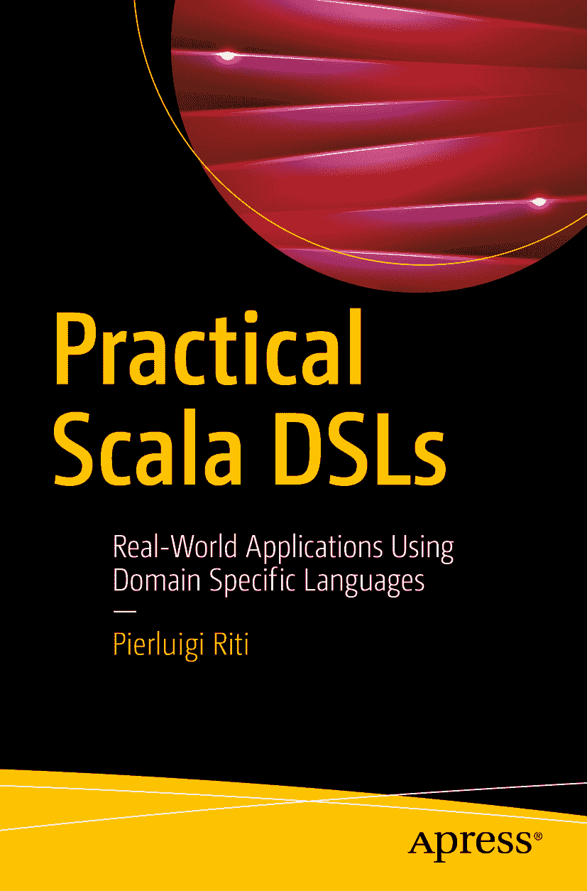

皮耶路易吉·里蒂《实用 Scala DSL：使用领域特定语言构建真实世界应用》

作者在本书中引用的任何源代码或其他补充材料，读者均可通过本书在 GitHub 上的产品页面获取，网址为[`www.apress.com/9781484230350`](http://www.apress.com/9781484230350)。如需更详细信息，请访问[`http://www.apress.com/source-code`](http://www.apress.com/source-code)。  
ISBN 978-1-4842-3035-0  
电子书 ISBN 978-1-4842-3036-7  
[`doi.org/10.1007/978-1-4842-3036-7`](https://doi.org/10.1007/978-1-4842-3036-7)  
美国国会图书馆控制号：2017962308  
© 皮耶路易吉·里蒂 2018  
本作品受版权保护。出版商保留所有权利，包括全部或部分材料的翻译、重印、插图复用、朗诵、广播、微缩胶片或其他物理形式的复制、信息存储与检索的传输与电子化改编、计算机软件，以及目前已知或未来开发的任何类似或不同方法的权利。  
本书中可能出现商标名称、标识和图像。我们仅在编辑性用途中使用这些名称、标识和图像，以维护商标所有者的权益，无意侵犯商标权，而非在每次出现时添加商标符号。  
本书中使用的商品名称、商标、服务标记及类似术语，即使未明确标识，也不应被视为对其是否受专有权利保护的立场表达。  
尽管本书中的建议和信息在出版时被认为是真实准确的，但作者、编辑和出版商均不对可能存在的任何错误或遗漏承担法律责任。出版商对本书内容不作任何明示或暗示的担保。  
本书采用无酸纸印刷  
全球图书贸易由施普林格科学与商业媒体纽约公司发行，地址：233 Spring Street, 6th Floor, New York, NY 10013。电话：1-800-SPRINGER，传真：(201) 348-4505，电子邮件：orders-ny@springer-sbm.com，或访问 www.springeronline.com。  
Apress Media, LLC 是一家加利福尼亚有限责任公司，其唯一成员（所有者）是施普林格科学与商业媒体金融公司（SSBM Finance Inc）。SSBM Finance Inc 是一家特拉华州公司。  
献给我的妻子玛拉·埃斯特，她带给我任何人所能收到的最珍贵的礼物：我的两个孩子，妮可尔和马蒂亚。我爱你们。  
引言

你好，欢迎阅读《实用 Scala DSL》。Scala 已经变得非常流行，随着越来越多的公司每天采用这门语言，其受欢迎程度和增长势头日益高涨。

DSL 是一种利用其固有技术设计软件的方式，本质上是一组能够用“通俗英语”描述软件的模式。本书并不试图涵盖 DSL 背后的所有理论。马丁·福勒的精彩著作《领域特定语言》（Addison-Wesley Professional, 2010）为此提供了基础理解。

通过本书，我希望描述如何在日常项目中使用 DSL。本书的目标是让读者了解如何在工作中运用 DSL，并在阅读结束时看到 DSL 如何应用于不同的项目。我意在展示如何从实践角度处理 DSL，并教会读者思考如何将 DSL 融入日常工作生活。

为了更好地理解本书，读者需要熟悉 Scala，能够用 Scala 编写简单程序，并对其架构有所了解。理想情况下，读者还应具备一些 Java 编程经验。这是因为 Scala 和 Java 都使用 Java 虚拟机（JVM），文中讨论的一些示例会突出 Scala 与 Java 的差异。最后，读者应熟悉一种编辑器。我使用 IntelliJ，但任何编辑器都可以。

目录 第 1 章：Scala 简介 1 基本语法 2 Scala 中的变量和值 3 Scala 中的命名规范 5 Scala 中的第一个示例 5 在 Scala 中定义方法和函数 6 Scala 中的类 8 单例对象 9 Scala 中的类型 10 数值类型转换 10 Scala 中的字符串 11 Scala 中的表达式 14 条件表达式 16 模式匹配表达式 16 区间与循环 20 其他循环 22 数据结构 24 数组 24 列表 25 集合 26 元组 26 映射 27 总结 28 第 2 章：DSL 简介 29 DSL 的定义 29 内部 DSL 与外部 DSL 的区别 30 设计一个好的 DSL 31 分析领域 32 创建通用词典 34 DSL 示例 35 DSL 目标 36 实现 DSL 38 语法与数据解析 40 第一个 DSL 实现 41 常见 DSL 模式 42 结论 43 第 3 章：内部 DSL 45 创建内部 DSL 45 方法链 46 创建流畅接口 48 设计解析层 51 使用函数设计解析层 54 结论 57 第 4 章：外部 DSL 59 内部 DSL 与外部 DSL 的对比 59 语法与句法 60 创建外部 DSL 62 生成输出 65 什么是解析器？ 66 选择何种 DSL 风格 68 结论 69 第 5 章：Web API 与微服务 71 什么是微服务 71 通信 75 团队 77 创新 77 何时使用微服务 78 REST 架构 79 在 Scala 中设计微服务 83 安装 Play 框架 83 设计 REST 微服务 86 在 Play 中创建微服务 87 我们自己的 DSL 微服务 89 结论 95 第 6 章：用户识别系统 97 语法 98 Scala 解析器组合子库 99 一个简单的解析器示例 101 定义领域问题与语法 103 准备解析器 105 描述解析器 107 改进 JSON 解析器 108 结论 112 第 7 章：创建自定义语言 113 什么是“语言”？ 114 设计语言的模式 115 设计语言 121 创建语言 123 创建读取器类 123 定义令牌 130 为语言创建翻译器 132 执行语言 136 结论 137 第 8 章：移动开发 139 Android 移动开发简介 139 开始 Android 开发 140 Android 应用程序剖析 144 我们的第一个 Scala-Android 应用程序 147 在 Android 中创建服务 153 定义我们的 DSL 155 结论 158 第 9 章：外汇交易系统 159 什么是外汇交易系统？ 159 设计 DSL 系统 161 实现系统 163 改进基础类 165 创建订单 166 为什么设计一个好的 API 很重要 167 设计新的 DSL API 169 使用第一个 API 172 改进 API 172 添加最后的功能 174 结论 179 第 10 章：游戏开发 181 游戏团队结构 181 工程团队 182 美术团队 183 其他参与角色 184 游戏引擎的定义 184 设计我们新的 DSL 游戏引擎 186 定义通用组件 188 其他组件 200 结论 207 第 11 章：云与 DevOps 209 什么是 DevOps？ 209 常见 DevOps 实践 211 从 AWS 开始 212 在 AWS 中部署与构建 214 在 AWS 中创建项目 215 创建基础文件 216 创建构建文件 218 最终结论 220 索引 221 关于作者与技术审校者 关于作者 关于技术审校者

