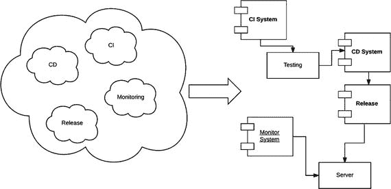

# 2. DSL 简介

DSL（领域特定语言）无处不在。例如，当我们去吃披萨或汉堡时，我们会使用一种“特定”的语言来点餐。DSL 是一种用于特定领域以解决特定问题的语言。

DSL 与通用语言（例如英语或意大利语）相反。当我们使用 DSL 时，我们实际上是在使用一种通用语言（GPL）。当我们去咖啡店点饮料时，我们使用通用语言（英语）来解决一个领域问题——点单，例如，点一大杯冰镇法布奇诺。而“一大杯冰镇法布奇诺”本质上就是一种 DSL。

在本章中，我将阐述 DSL 的关键概念，并提供一些现有 DSL 的示例。

## DSL 的定义

DSL 是一种专门针对特定领域的计算机语言。DSL 本质上与 GPL 相反。我所说的 GPL，是指所有可用于开发软件的语言。例如，Java、C# 和 Scala 都是 GPL 语言。使用 DSL，我们只想解决特定的领域问题，因此我们专门为这个领域设计语言。DSL 不能在领域之外使用，因为它并非为灵活性而设计。

在 IT 领域，存在大量的 DSL。一个例子是超文本标记语言（HTML）。这种语言仅在我们设计网页时有效，但如果我们想设计一个图形界面，它就完全无用了。

我们可以识别出两种 DSL：内部 DSL（或嵌入式 DSL）和外部 DSL。这两种类型的区别在于它们的创建方式。

### 内部 DSL 与外部 DSL 的区别

内部 DSL（或嵌入式 DSL）是在 GPL 内部创建的 DSL，例如，当我们使用 Java 创建一组类来解决一个领域问题时。内部 DSL 对于创建应用程序编程接口（API）非常有用。

当我们使用嵌入式 DSL 时，我们实际上是在使用 GPL 的一个子集来创建我们的语言，因此，我们失去了与 GPL 相关的所有灵活性。但另一方面，我们可以构建领域专家更易读的软件。这意味着开发者可以更快地解决问题或更改功能。例如，如果我们想解析一个 Excel 文件，我们可以编写如下代码：

```
LoadFile("C:\file.xls")
.read_column("A1")
.read_column("A2")
.save_CSV("file.csv")
```

这段代码本质上使用了一种 DSL 来从 Excel 文件中读取两列，并将其保存为逗号分隔值（CSV）文件。我们可以使用任何语言来创建这个调用链。如果我们需要更改 Excel 列，只需使用不同的列值来创建调用链即可。

外部 DSL 是一种与特定语言无关的 DSL。CSS 或正则表达式就是外部 DSL 的典型例子。

DSL 的区别不仅在于它们的定义，还在于它们的实现方式。例如，当我们创建外部 DSL 时，我们必须定义一种语言并解析它。相反，当我们创建内部 DSL 时，我们可以创建一个流畅的 API。这意味着我们可以定义一个特定的模式，该模式可以像流畅接口一样被调用。这个术语由 Eric Evans 和 Martin Fowler 创造，反映了这样一个事实：当我们使用这种模式时，我们实际上是在创建像普通英语一样可读的 API。

我们可以将这种模式用于我们的语言，因为它提高了代码的可读性，并有助于实现 DSL 的目标。


### 设计优秀的 DSL

在设计 DSL 时，无论是内部 DSL 还是外部 DSL，我们只需遵循一些基本规则就能获得良好效果。

*   **封装**：优秀的 DSL 必须隐藏问题的实现细节，仅暴露解决问题所必需的部分。
*   **效率**：由于实现细节被隐藏，开发者在更改 DSL 的使用方式时应能减少工作量。当然，要做到这一点，负责创建 DSL 的工程师必须谨慎地以良好且简单的方式设计 API。为此，需要格外关注 API 和 DSL 的设计。更好的 API 设计意味着更好的使用体验，并在例如消费者需要更新时减少工作量。当开发者使用我们的 DSL 时，重要的是它具备相同的功能。这意味着，当我们为了改进新功能而需要更改 API 时，必须小心不要破坏已实现的实际功能。这可以通过使用正确的接口和设计层级来实现。
*   **沟通**：由于 DSL 是为解决特定领域问题而设计的，方法必须赋予领域专家能够理解的名称。这意味着，对于领域专家来说，更容易在软件创建过程中发现问题。

当然，创建优秀的 DSL 并非易事。为了遵守所有规则，我们在配置（例如内部 DSL 的 API）时，必须编写文档完善且基本自解释的代码。我们必须确保拥有良好的抽象层级，并设计出优秀的 API。

在创建 DSL 时，我们必须识别问题领域，并基于此定义一个能够解决问题的通用词典。我们需要做的是定义领域模型。通过这种方式，更容易定义词典并与开发者共享。在 DSL 中，本质上是领域驱动着语言的定义。以下是一些示例：

*   RubyDSL，用于 Puppet 中定义配置清单
*   SQL
*   HTML

这些语言本质上都是 DSL 语言，因为它们专门用于解决某一类问题，不能用于创建通用程序。

### 分析领域

在设计 DSL 时，我们必须确定工作中要使用的领域模型。定义领域模型是定义正确 DSL 的基础。在分析领域模型时，我们本质上是在识别与领域相关的所有实体和关系。当我们设计并识别出正确的实体领域后，就可以开始为 DSL 定义通用词典。通用词典对于改善沟通是必要的，当然，这也是获得优秀 DSL 设计支柱之一。问题领域是我们识别实体和约束的过程。识别这些实体和约束是我们必须进行的一项练习，以便更好地理解领域中的问题。进行这项练习时，我们会找出领域的通用语言，即我们必须用来与领域专家沟通的语言。

当我们识别出问题领域后，就可以定义解决方案领域。解决方案领域提供了所有可用于解决问题的工具。在问题被识别、解决方案领域建立之后，我们就可以开始对领域进行建模。

例如，假设我们要识别并建模一个持续集成系统。首先，我们必须识别所有实体，然后开始设计我们的系统（见图 2-1）。



图 2-1

将问题领域转化为解决方案领域

当我们识别出问题领域后，就可以设计解决方案领域。解决方案领域是系统的架构。在这里，我们识别出解决问题必须实现的主要组件。基于此，我们可以设计一个通用词典，为 DSL 定义通用语言。

### 创建通用词典

在设计解决方案领域时，我们本质上是在识别 DSL 中涉及的所有实体。通用词典对于识别用于讨论系统的语言非常重要，就像我们去最喜欢的咖啡店点一杯冰法布奇诺一样。这对于工程师和业务人员之间相互理解问题至关重要。这对于提高沟通质量和系统质量也很重要。可以识别出与创建通用词典相关的一些优势。

*   通用词典可以轻松用于测试，并且是描述测试计划的基础。基于此，我们可以轻松识别软件流程。
*   通用词典有助于用通俗易懂的英语描述流程，并以此为基础进行解决方案领域的设计。
*   开发者可以使用通用词典来设计软件。在通用词典中，我们不仅定义术语，同时还定义一些描述该术语用法的短语。

在定义通用词典时，我们识别并描述系统中涉及的每一个实体。这项练习有助于帮助开发者理解领域并开始开发。例如，假设要描述我们想要定义的持续集成系统必须执行的某个操作。这个短语可能是：“持续集成系统必须连接到 Git，下载特定语言的源代码，并编译它。”

当我们定义这个短语时，我们本质上是在使用通用词典并创建软件的一个用例，从而开始设计我们的 DSL 来解决问题。

## DSL 示例

现在假设我们想编写一个简单的 DSL 代码示例来描述一个持续集成系统。代码看起来如下：

```
object ContinousIntegration {
object Connect { def git = (x: source.type) => x }
object source { def control = (x: language.type) => x }
object language { def kind = (x: language.type ) => x}
object compile { def scala = (x: language.type ) => x }
implicit def string(s : String) : language.type = language
def main(args: Array[String]): Unit = {
Connect git source control language kind "Scala"
}
}
```

在这个简短示例中，描述了一个持续集成系统的功能。我们本质上创建了一组对象，然后使用这些对象编写了一个可以用通俗易懂的英语阅读的短语。在这个例子中，我们编写了“`Connect Git source control language kind "Scala"`”。这本质上就是业务功能，并且很容易判断我们是否犯了错误。

Scala 在这方面非常出色，以这种方式编写代码能为用户提供非常清晰、紧凑、易于阅读和维护的代码。

注意

在 Scala 中，“点号表示法”不是强制性的。在上述代码中，我们调用函数时没有使用点号来调用方法。这使得开发者能够创建可以像通俗英语一样阅读的代码。

在业务场景中，专家可以轻松阅读我们编写的代码并指出错误所在。如果存在错误，那就在业务逻辑中。这就是 DSL 的真正力量。通过让业务人员理解代码，业务团队和工程团队之间的沟通得到了极大改善。

在这个例子中，我们创建了一个内部 DSL。这是因为我们使用了一种通用编程语言 Scala 来定义语言的一个特定子集，在本例中，是 CI 流程的一种表示。我们可以看到，我们编写了一个内部 DSL 来匹配已定义的用例故事。这就是 DSL 的真正力量。我们可以轻松地在用户故事和我们开发的语言之间建立联系，这使得每个人都能从一开始就通过测试用例来验证我们的故事。这减少了错误并提高了软件质量。


## DSL 目标

在创建一门 DSL 语言时，你必须在脑海中有一个清晰的目标。DSL 应当对业务用户来说是可理解且可验证的。为了设计出优秀的 DSL，必须遵循一些特定的规则。

*   DSL 设计了一门“语言”。这意味着用户无需了解实现的细节。开发者只需使用通用词典来定义业务，然后将重点转移到方法的正确实现上。
*   DSL 定义了一种非常小的语言。我们定义了有限的词汇集，用于实现业务领域的解决方案。正因如此，开发者能够轻松掌握这些术语并提升其知识水平。
*   DSL 源于将业务领域映射为通用语言的想法。为了实现这一点，我们定义了一个通用词典，在其中定义词汇及其功能，然后由开发者将词汇翻译成函数。例如，假设我们想为金融应用创建一个 DSL。我们需要定义一个特定的术语。这是因为开发者可能不了解诸如“买价”或“卖价”等金融术语。创建通用词典有助于定义术语，从而帮助开发者理解 DSL 的范围。

在设计 DSL 时实现上述三个目标，要求我们设计的软件也必须具备良好的质量。如今，语言种类繁多，有些语言（如 Scala）允许开发者编写非常优秀的 DSL。

当我们想为项目实现 DSL 时，应从项目的第一天就开始。就软件和解决方案架构而言，这意味着我们开始设计软件时要遵循以下规则：函数内部应有良好的文档记录，同时函数名应是业务中有效的名称。正确的 DSL 实现会使用一些已定义的架构模式。例如，在 Martin Fowler 的《领域特定语言》一书中，可以找到可用于设计和实现 DSL 的所有模式的详细描述。

使用 DSL 的另一个巨大好处是消除了业务用户与开发者之间的沟通障碍。当我们设计和实现 DSL 时，开发者必须理解业务领域。为此，我们定义了一个通用词典，但围绕“设计”通用词典的实践也提升了开发者的业务知识。我们几乎每天都在使用 DSL 语言，但并未意识到这一点。一些常见的 DSL 语言包括：

*   SQL
*   RSpec
*   Cucumber
*   SBT
*   ANT
*   HTML
*   CSS
*   ANTLR

这些语言仅代表了 DSL 的一小部分。每个人可能都在生活中的某个时刻使用过其中一种语言，而自己并未察觉。然而，所有这些语言都是为了解决特定的业务领域问题而设计的。

## 实现 DSL

现在我们继续讨论如何实现 DSL。到目前为止，我只介绍了设计 DSL 时可以遵循的流程。现在，我们的重点可以转移到从开发者的角度来看，我们可以做些什么来实现这门语言。

我们必须做出的第一个决定是如何构建语言的结构。这意味着，首先我们必须决定是使用内部 DSL 还是外部 DSL。这不是一个容易的决定，因为使用其中一种技术会驱动架构的定义，并从根本上决定开发者和业务人员如何将业务解决方案转化为软件。

为了定义 DSL，我们必须做出的首要决定是：

*   为两种 DSL（内部和外部）定义语言的语法，并定义用于描述业务的特定语法。这意味着我们必须定义一个完整的语法来创建这门“语言”。
*   创建必要的解析器来定义语言的语义模型。当我们有了语法后，还必须创建解析器，将语言“翻译”成软件。

如何实现这些步骤定义了外部 DSL 和内部 DSL 之间的区别。DSL 的一个共同点是它们的语法。区别在于我们需要解析 DSL 的时候。对于内部 DSL，为了解析语法，我们通常会定义一些 API，例如使用表达式构建器模式来创建最终的语句。对于外部 DSL，解析器通常从外部文件（例如）读取文本，解析所有文件，然后调用相应的 API 以满足业务需求。

最终，这两种技术解决了相同的问题。唯一的区别在于如何解析语法。对于内部 DSL，语法是通过调用内部 API 的一组序列来解决的。API 调用的顺序定义了业务需求，并最终实现业务需求。

一个用于解析语法的流畅 API 示例是 JMock。例如，在 JMock 中，我们可以编写如下代码：

```
mock.expects(once()).method("my_method").with(or(stringContains("hello"),stringContains("howyourday")) );
```

这段代码本质上解析了一个语法，在本例中，是检查方法名是否包含我们要测试的单词的方法。

对于外部 DSL，例如，我们使用语法来创建一个外部文件。程序调用该文件，并将其放入三部分语法中。当我们有了这三个部分，就开始调用 API，并使用结果来定义一个动作或调用另一个 API。

### 语法与数据解析

当我们定义 DSL 时，最重要的方面之一就是语法。语法来源于通用词典，应用于定义业务解决方案。

“语法”一词指的是我们可以用来将文本流转化为软件的一组规则。每个开发者每天都在使用语法。例如，在 Scala 中创建变量时，我们使用特定的语法。想象一下，我们想定义一个新的语法来执行两个数字的求和。语法可能是 `sum:= number '+' number`。这告诉我们如何执行一个操作，如果我们找到表达式 2 + 2，那么这对系统来说是有效的。语法并没有告诉我们如何解析表达式，只说明该表达式是有效的。

告诉我们执行何种操作的是上下文。例如，我们可以定义一个两数求和操作，一个针对数字，另一个针对字符串。对于数字，我们可以执行求和，因此操作 2 + 2 返回 4。对于两个字符串，2 + 2 的结果是 22。操作的上下文由我们想要定义的语义驱动。在前面的例子中，我们使用了数字或字符串。

在定义了语言的语法之后，另一个重要的步骤是解析数据。解析器必须根据我们定义的语法以及我们指示如何使用该语法的方式，来读取语言。这一步对于 DSL 的效率至关重要。当我们解析数据时，可能需要在内存中存储更多信息。为了加快处理速度，我们可以创建一个符号表。这不过是一个字典。键是我们需要解析的语法词汇，例如 `+`，值是我们必须用参数调用的操作对象。符号表是我们解析器的核心。它将所有词汇和函数保存在内存中，从而帮助开发者将语言翻译成代码。解析器使用符号表来创建调用函数，该函数将语法翻译成代码。


### 首次实现 DSL

到目前为止，讨论主要集中在 DSL 背后的理论上。现在，我将展示一段非常简短的代码，来说明 DSL 是什么样子。是时候展示一些实际实现的例子，看看如何创建一个真正的 DSL 了。

定义 DSL 的第一步是设计通用词典。现在让我们看看如何定义通用词典。我将以 CI 系统为例（见表 2-1）。

表 2-1

一个通用词典示例

| 词语 | 定义 |
| --- | --- |
| 仓库 | 存储软件的地方。要连接到仓库，我们必须知道 URL、用户名和密码。我们可以指定仓库的类型，例如 Git。每个仓库可能有不同的参数。 |
| 编译 | 构建特定的软件语言，编译时，我们必须定义要使用的语言。这需要不同的工具来执行操作。结果总是一条消息，指示编译是否成功。 |
| 连接 | 从仓库执行和下载软件的基本操作。建立连接后，可以下载软件，然后进行编译。 |

这是一个通用词典的简要示例。根据我们在通用词典中看到的内容，我们定义了术语及其简要描述。这个描述很有用，因为它准确地告诉开发者这个词的含义以及它在业务中的意义。

这些知识对于创建良好的软件是必要的。它使开发者能够编写良好的测试用例，这对于确保 DSL 所需的质量是必要的。

### 常见 DSL 模式

要将 DSL 翻译成另一种语言，我们通常会使用一些特定的设计模式。最常见的模式有：

*   **流畅接口**：流畅接口允许用户调用一系列连接的 API。例如，当我们调用 CI 流程时，会使用这种技术，如下所示：`Connect git source control language kind "Scala"`，通过这个调用，我们实际上为软件创建了一个流畅接口。
*   **语义模型**：在 DSL 中，语义模型是我们在内存中必须解析的结构的一种表示。语义模型本质上是语法创建的对象之间的连接。
*   **解析器生成器**：解析器生成器用于从 DSL 的语法生成解析器。解析的结果本质上就是语义模型。

以上是对一些常见模式的简要描述。在下一章中，我们将深入探讨，并尝试分离和描述可用于内部和外部 DSL 的模式。

## 结论

在本章中，我讨论了 DSL 背后的基本理论。定义了内部和外部两种 DSL 类型，并提供了一个简单的 DSL 示例。当然，DSL 背后的理论非常广泛，我们将在后续章节中深入探讨。目前，我们已经确定了一些设计 DSL 的基本模式。在接下来的章节中，我将更详细地描述什么是内部和外部 DSL，并确定我们可以用于设计的常见模式。

