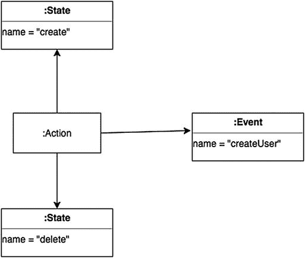

# 3. 内部 DSL

在上一章中，您对不同类型的 DSL 有了简要的了解。在本章中，您将看到如何构建内部 DSL。有些语言使用缩写 DSL 来表示日常生活中使用的语言子集。例如，我们可以想到 Chef 或 Puppet 这样的软件，在这些软件中，可以使用“RubyDSL”来编写配置文件。

## 创建内部 DSL

到目前为止，我主要从理论角度讨论了 DSL，并介绍了采用 DSL 时需要考虑的一些问题和好处。当我们创建内部 DSL 时，会面临一些与语言相关的限制。这意味着我们创建的所有表达式对于宿主语言来说都必须是有效的。我们不应忘记，在创建内部 DSL 时，我们是在通用编程语言内部创建了一个新的指令子集。当你想到 DSL 时，必须将其视为一种用于创建另一种语言的语言。

Ruby 社区使用并生成了大量 DSL。这是因为借助元编程技术，很容易创建出优秀的 DSL。当然，使用相同的技术在其他语言中可能无法获得相同的结果。Scala 天生具有非常简洁的语法，这使得它能够创建出非常出色且清晰的 DSL。当我们需要创建内部 DSL 时，通常会使用一些特定的模式来辅助这一过程。用于定义内部 DSL 的技术之一是流畅接口。我们可以将流畅接口视为内部 DSL 的同义词。

当我们考虑流畅接口时，可以考虑构建一组 API 函数，用于以通俗易懂的英语构建调用。我们可以使用一些不同的模式来实现这种技术。最常见的是方法链。使用这种模式，我们创建一系列方法来调用对象。

### 方法链

使用方法链时，会以链式方式调用一组方法来创建一个对象，这是面向对象编程的典型特征。例如，假设我们想使用方法链创建一个 `Student` 对象。

```
case class Student(private val name: String = null , private val year: Int = 0 ) {
def setName(newName: String) = Student( newName, this.year )
def setYear(newYear: Int) = Student( this.name, newYear )
def introduce { println( s"Hello, my name is $name and I am on the $year ." ) }
}
object App {
def main(args: Array[String]) {
Student().setName("Peter").setYear(2).introduce
}
}
```

现在我们可以看到，我们已经建立了一个用于创建对象的方法链。因此，方法链是一系列被调用的方法，用于设置我们想要创建的对象上的数据。

注意

在上述代码中，我们使用了一个 case 类来定义我们的对象。case 类默认是不可变的，并且可以用于模式匹配。它通过结构相等性进行比较，而不是通过引用。实例化 case 类不需要 `new` 关键字，我们可以看到定义非常简洁且易于使用。

当我们想要定义不可变数据时，case 类非常有用。我们可以使用以下语法：`case class User( name :String)`。此语法创建了一个名为 `User` 的 case 类。要使用该类，我们可以简单地调用并赋值。

```
scala> case class User(name :String)
defined class User
scala> val user=User("Pierluigi Riti")
user: User = User(Pierluigi Riti)
```

case 类不需要关键字 `new` 来实例化。这是因为默认情况下，我们有一个 `apply` 方法，它负责类的实例化。

在数学和计算机科学中，`Apply` 函数是将函数应用于参数的函数。在 Scala 中，它用于填补面向对象编程和函数式编程之间的空白。例如，`apply` 函数可以覆盖一个值，如下所示：

```
scala> class TestApply {
|     def apply() = "Hello World"
| }
defined class TestApply
scala> val test= new TestApply()
test: TestApply = TestApply@3b42121d
scala> test()
res0: String = Hello World
```

这里我们可以看到，当我们创建类的实例时，`apply` 函数被调用了，而这个 `Apply` 就是类的函数。

使用方法链，对象的构建比经典的构建方法更容易。还记得“流畅接口”这个术语吗？它是我们可以用来指代方法链的另一个名称。这些技术创建了一系列方法，用于构建最终对象。对象的级联是通过每个方法返回一个设置了其参数的对象来实现的。这样，当我们构建链时，我们向对象添加一个值，最终我们就创建了一个完整的对象。


### 创建流畅接口

马丁·福勒（Martin Fowler）描述了一种用于创建 API 调用链的流畅接口，它本质上是一种改变对象调用方式的方法。传统上，在面向对象编程中，如果我们想调用一个对象，会使用如下语法：

```
Student s = new Student("Pierluigi Ri", 2);
Course c1 = new Course("Programming");
Course c2 = new Course("Mathematics");
return new Year(s, c1, c2);
```

可以看到，我们通过一组调用来创建程序，最后将最终对象传入先前创建的对象中。这是每个开发者几乎每天都会用来创建对象的经典技术。

如果在这个例子中使用方法链，我们可以创建一系列函数。每个函数都会返回对象本身。最终，我们会得到一个完整的对象，其语法如下：

```
Years()
.student()
.name("Pierluigi Riti")
.class(2)
.course("Programming")
.course("Mathematics")
.create()
```

现在这段代码读起来更像普通英语，领域专家也更容易理解。别忘了：DSL 的目标是促进开发者和领域专家之间的沟通。使用 Scala 这样的语言，我们可以用函数代替对象，从而使用福勒所说的函数序列。我们不再使用对象和方法，而只使用函数。借助 Scala，我们可以运用这种模式，构建出解决实际问题的英语短语。

```
Years()
Student()
name("Pierluigi Riti")
class(2)
course("Programming")
course("Mathematics")
create
```

上述字符串对于领域专家来说简单易读且易于理解。这减少了开发者和领域专家之间产生误解的可能性，当然也提高了软件质量。

流畅接口的本质在于我们如何思考和设计一个对象。通常，当我们想到一个像盒子一样的对象时，我们只考虑如何与之交互。我们可能会定义一个方法，然后访问该方法，所有这一切都是为了创建一个盒子来解决问题。如果我们使用流畅接口来思考软件，我们就会以不同的方式对待对象。在这种情况下，对象不仅仅是一个黑盒。我们必须思考一种与之交互的新方式。我们必须考虑一组命令和查询。每个命令执行一个动作，在我们的例子中是 `create`，而每个查询选择一组数据，在我们的例子中是其他函数。以这种方式思考对象，不仅反映了一种定义对象的新方法，更是一种思维转变，尤其能使开发者在内部或外部 DSL 时以不同的方式思考。

将对象设计的方法分离为查询和命令并不是定义软件的新方法；它是一种命令式编程的方法论，由伯特兰·迈耶（Bertrand Meyer）详细阐述，并被称为命令-查询分离。命令和查询的分离基于一个简单的想法。

*   **查询**：返回一个值，但不改变系统状态。它没有副作用，因此非常适合函数式编程。
*   **命令**：改变系统状态，但不返回任何值。

这种范式背后的理念是，在改变系统值的函数和仅读取系统状态的方法之间进行清晰划分。由于系统只读取系统的不可变状态，这种范式与流畅接口紧密相关。通过这种模式，我们可以创建一个命令来改变系统状态，最后通过一个查询来检索系统状态，从而遵循流畅 API 的调用。由于查询本质上没有副作用，因此非常适合函数式编程。命令-查询分离的本质是，每个方法必须返回一个查询或一个命令，并且如果我们不改变初始值，结果永远不会改变。基本上，方法或函数不能有副作用。

> **注意**
>
> 无副作用是每种函数式语言的原则之一。由于 Scala 是一种函数式语言，使用命令-查询分离并不违反这一原则，反而有助于开发者遵守它。

在设计内部 DSL 时，我们必须考虑使用这一原则，以便更好地隔离函数或方法，并避免副作用。当然，流畅接口和命令-查询分离并不相同。具体来说，流畅接口用于处理对象。相反，命令-查询分离更适合函数。由于 Scala 同时支持这两种范式，最好定义并阐明如何使用其中一种。在任何情况下，最好使用领域专家能理解的名称来定义函数或方法。


## 设计解析层

编写一个好的 DSL 需要一个解析层。该层是必要的，用于将形式语法转换为构建 DSL 所使用的通用编程语言（GPL）的指令。无论我们讨论的是内部 DSL 还是外部 DSL，都必须创建这一层。

就内部 DSL 而言，解析层与我们为创建 DSL 所提供的函数紧密相连。当我们创建解析层时，必须考虑一种特定的模式。我们可以使用表达式构建器为我们的流畅接口创建正确的方法。表达式构建器本质上是一个对象，其唯一任务是构建一个由普通对象组成的模型。通过表达式构建器，我们可以轻松地创建流畅接口。

我们使用表达式构建器，是因为在定义 DSL 时，我们可能会有一个不同的接口，在这种情况下，设计一个正确且流畅的接口并不总是那么容易。表达式构建器是我们的好帮手。想象一下，我们想要创建一个代码来保存或更新系统中的新用户。条件是用户是否存在于系统中。代码可以如下所示：

```
class InsertUser {
private val user = new User()
def add(name: String, surname: String): User = {
actualUser = new User(name, surname)
user.addUser(actualUser)
this
}
def setLevel(level:String): User = {
user.level(level)
this
}
def getUser: User = user
}
```

`InsertUser` 类定义了对象和方法。我们可以按以下方式使用该类：

```
val user = new InsertUser().add("Pierluigi","Riti").setLevel("admin")
```

现在我们可以看到，创建用户的调用可以像普通英语一样阅读，并且我们创建的用户在每次调用时本质上都是不同的。

当我们定义一个表达式构建器时，每个方法都会返回一个对象，该对象填充了方法的值。这允许用户创建正确的流畅接口。

解析器的另一个重要部分是语义模型。它用于翻译 DSL 中定义的语法和文法。这种模式在内存中创建一个包含所有数据的对象，并将其翻译用于 DSL 生成。这种模式通常与符号表一起使用，符号表是另一种用于定义 DSL 的模式。通过符号表，我们基本上存储了对象与每个任务之间的链接。这用于填充语义模型，语义模型是一个包含模型和类的集合，用于将输入翻译成类。从图形上看，我们可以将其想象成如图 3-1 所示的样子。



图 3-1

语义模型示意图

用于填充模型的代码可以如下所示：

```
events
createUser
end
state create
createUser create
end
```

这段代码创建了可用于表示我们刚刚创建的模型的代码。现在，我们可以看到，我们需要做的是翻译这段代码。通常，为了做到这一点，我们使用解析器组合子。在本书的后面部分，你将看到如何编写一个。

使用三种不同模式——语义模型、表达式构建器和符号表——背后的理念是，我们可以分别测试每一种模式，当然，这也能减少出错的可能性。所有这些模式都用于构建一个表达式构建器，以创建我们的 DSL。

## 使用函数设计解析层

到目前为止，我只讨论了使用对象构建内部 DSL 的模式，但我们也可以使用函数来构建它。为此，我们必须使用不同的模式。

显然，我们必须创建相同的结果，为此，我们必须创建一个良好的表达式构建器，但这次是使用函数。我们必须复制我们使用对象所做的工作，这意味着我们必须创建一些可以在函数之间共享的公共变量。通常，我们通过全局变量和全局函数来实现这一点，但这并不是解决问题的最佳方式。因为使用全局函数，我们可以改变最终结果，另一个进程可能会错误地改变变量的值，从而改变我们流程的结果。想象一下，例如，在多线程环境中工作。

解决这个问题的最佳方式是使用称为上下文变量的模式。上下文变量用于在解析时捕获变量中的值，并在解析新值后分配一个新值。例如，考虑我们调用一个名为 `Course` 的函数。这个函数必须知道 `Student` 正在上什么课程。使用上下文变量，我们可以保存这个值，并在解析新值时更改它。假设，例如，我们想编写一个 `User` 类。该类将如下所示：

```
class User() {
var name = ""
var surname = ""
var username = ""
def saveUser():Unit ={
println(username)
}
}
```

现在，我们可以看到，在上下文中定义的变量可以用作方法。例如，当我们想在初始化类时定义一些特定的值发送给解析器时，就会这样做。我们可以通过以下方式设置变量的值：

```
scala> val user=new User()
user: User = User@2001e48c
scala> user.username = "Pippo"
user.username: String = Pippo
scala> user.saveName()
Pippo
```

当然，该变量在某些方面仍然是全局的。如果我们想完全移除全局变量，我们可以使用另一种模式，称为对象作用域。每当我们尝试创建流畅接口时，我们必须记住一组变量，以允许流畅接口创建我们的最终调用来创建最终对象。我们可以通过对象作用域来避免这种情况。通过对象作用域，我们创建一个用于存储数据的公共对象。换句话说，所有变量都存储在一个公共区域中，这样，我们就可以使用它们来创建我们的最终调用。这意味着我们不必将值存储在全局变量中，并且可以更好地隔离每个变量的作用域。我们在创建表达式构建器时使用这种技术。方法如下：

```
def add(name: String, surname: String): User = {
actualUser = new User(name, surname)
user.addUser(actualUser)
this
}
```

这本质上是一种隔离变量的方法。通过这样做，就没有全局变量了，从而减少了副作用。

我们可以用于创建使用函数的流畅接口的最后一个模式称为嵌套函数。使用嵌套函数，我们构建一个可以接受其他函数（如变量）的函数。在函数式编程中，这类函数被称为高阶函数。使用嵌套函数，我们可以完全避免全局变量，并将任何可能的副作用减少到零。这样，我们就不会违反函数式编程的任何规则，并且可以提高质量，减少程序本身可能引发的错误。嵌套函数的一个例子可以编写如下：

```
object NestedFactorial {
def factorial(i: Int): Int = {
def nestedfactorial(i: Int, accumulator: Int): Int = {
if (i <= 1)
accumulator
else
nestedfactorial(i - 1, i * accumulator)
}
nestedfactorial(i, 1)
}
}
```

在这个例子中，我们定义了一个函数 `factorial`，并且我们还有另一个函数 `nestedfactorial`。在这种情况下，该函数执行阶乘计算并将值返回给前一个函数。当然，嵌套函数可以执行完全不同的操作并完全改变作用域。根据我们执行的情况，这种技术将核心函数与外部世界完全隔离，并从根本上消除了副作用。


## 结论

本章介绍了一组可用于构建内部 DSL 的模式。每种模式都为特定问题提供了解决方案。编写一个优秀的内部 DSL 并非易事，它需要我们改变对 API 的思考方式。例如，必须创建不同的层来解决一个全局性问题。

在本章中，我重点介绍了设计 DSL 时最常用的一些模式。后续章节将探讨如何使用这些模式来创建内部 DSL。要创建一个优秀的 DSL，需要更深入地理解理论并积累更多经验。正如我所指出的，我更喜欢“亲自动手”的方法，因此我在此仅做简要介绍，以便后续展开阐述构建卓越 DSL 所涉及的概念。

