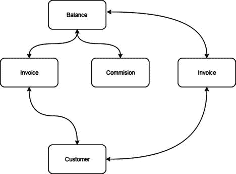
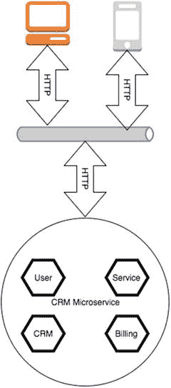
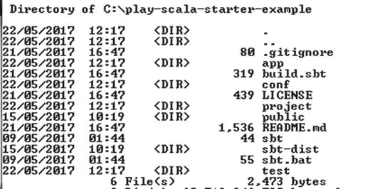
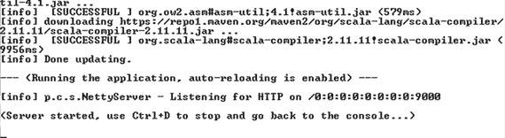
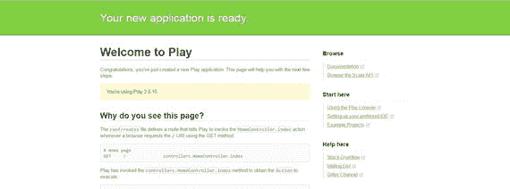
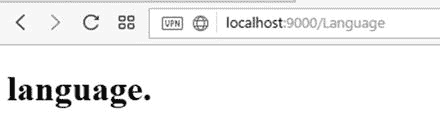
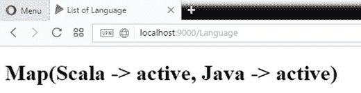
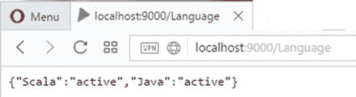

# 5. Web API 与微服务

到目前为止，我已经介绍了 DSL 背后的理论。在本章中，我将讨论 DSL 的实际用例，从实现一些 Web API 和微服务开始。

微服务是 Web/云开发中使用的新范式。其原因在于微服务本身的特性。在本章中，我将向你展示如何使用 DSL 在 Scala 中创建微服务。同时，你将了解微服务以及如何在 Scala 中开发和运用它们。


## 什么是微服务

服务架构的首次迭代是面向服务的架构（SOA）。当架构师设计 SOA 时，他/她本质上将软件视为一项服务，其中的每个小部分都将被组合起来构建一个更大的服务。

在 SOA 中定义服务时，架构师通常会确定服务的粒度级别。这指的是服务所提供信息的规模和详细程度。SOA 中服务的粒度定义了返回所需信息需要涉及多少个实体。为了更好地解释这个概念，请参见下图（图 5-1）。



图 5-1

服务的剖析

我们可以看到，为了保持平衡，我们必须调用不同的实体。我们调用的实体数量定义了服务的粒度类型。服务规模小意味着需要组合更多这样的服务才能获取必要信息，而这并不总是理想的。我们在后端创建了大量调用来获取所需信息。另一方面，当我们需要升级或更改其中一个服务时，拥有不同的服务会有所帮助。如果我们不更改接口，其他服务基本上不关心该服务的内部实现。

当我们定义微服务时，我们定义的仍然是一个松耦合的服务。这意味着该服务具有更少的相互依赖性、更少的信息流和更少的协调性。

与高度依赖的系统相比，定义松耦合的服务系统具有一些优势。首先，服务对数据的了解有限，且相互依赖性低。这意味着每个服务都可以在无需深入了解其他服务的情况下进行开发和部署，即只需要了解我们需要使用的服务接口的基本知识。松耦合意味着其他服务可以在内部进行更改，但不会影响我们的软件。

微服务本质上只是 SOA 的演进。要设计微服务，我们本质上是在设计一个本地耦合的服务。这意味着我们试图减少系统对外部的依赖，以便在发生故障时提高系统的可维护性。使用微服务，系统由数百个小型服务协同工作来解决一个问题。

微服务是一种细粒度的服务。每个服务专注于业务的某一个特定方面，因为微服务本身的性质最适合设计大型系统。原因在于服务本身的特性：微服务旨在保持小巧。我们可以把它想象成一块乐高积木。每个服务都是一块积木，它们共同构建了一个庞大的架构。

当我们创建微服务时，必须牢记三个支柱来设计它。

*   沟通
*   团队
*   创新

当我们设计微服务架构时，可以用图形表示，如图 5-2 所示。



图 5-2

微服务的表示

本质上，当我们设计服务时，我们定义了每一个独立的服务器。每个服务器都是隔离的，可以连接到一个数据表或另一个服务。该服务是隔离的，就像一个迷你应用程序。现在我们可以看到如何使用 HTTP 在服务与外部世界之间建立连接。

### 沟通

当我们设计微服务时，必须确保建立正确的沟通实践——无论是在团队内部还是与其他团队之间——因为微服务是一种高度专业化的服务。我们必须确保团队之间沟通顺畅。

确保高效沟通的最重要原则之一被称为康威定律。这项研究首次出现在梅尔·康威于 1967 年在《哈佛商业评论》上发表的文章《委员会如何发明？》中。该研究最重要的启示如下：

> 任何设计系统的组织，最终产生的设计方案都将是该组织沟通结构的复制。

阅读这句简单的话，我们可以理解沟通对于设计高质量微服务的重要性。如果整个公司内部没有良好的沟通，就不可能设计出好的服务。同样，糟糕的沟通意味着糟糕的信息共享，当然也意味着对需求的理解不到位。

如果在实践中沟通不畅，我们可能会遇到一些隐藏的依赖关系。这是因为在讨论服务的会议中，公司内的其他部门无法可靠地解释他们真正需要从该服务中获得什么。这可能会在我们开始测试服务时引发意想不到的反应，进而转化为花费更多时间调试和修复问题，并可能导致项目失败。

我们可以采取以下步骤来改善沟通：

*   我们必须认识到团队之间存在隔阂是正常的。我们不必与之对抗，但必须花一些时间共同协作。我们必须理解这种天然的差异并接受它，但同时，我们必须有一种共同的沟通和解决问题的方式。例如，在设计软件时，我们必须与负责在生产环境中维护软件的人员讨论他们需要什么才能高效地解决问题。
*   使用一些沟通工具来帮助我们改善彼此之间的沟通方式。例如，在必要时使用像 Slack 或 Skype 这样的工具来创建虚拟会议。这些工具可以减少障碍并改善沟通。
*   改变决策过程。当我们设计软件并做出决策时，必须让公司所有部门都参与进来。这意味着我们必须做出全局性的决策，并改变我们对业务的既有认知。公司所有部门必须对业务以及最终目标有相同的理解。

实施正确的沟通是设计优秀微服务的支柱之一。

### 团队

团队是设计优秀微服务的第二个支柱。如果我们有一个大团队，例如 20 或 30 人，那么在现场管理和确保良好沟通可能会很困难。另一方面，我们实际上可以用只有五到十个人的团队来实现一个系统。

在后一种情况下，最好的解决方案是使用敏捷方法。每个团队负责一个特定的微服务，然后使用沟通工具来分享知识。让一个小团队协作共享信息可以带来更快的发布速度和更好的团队内部沟通。除此之外，工作也能得到更好的管理，因为我们可以每天了解团队的进展。

### 创新

拥有良好的沟通和良好的团队结构，最重要的原因是为了创新。微服务非常有利于提升公司的创新能力，因为微服务的本质允许业务更快地改进并更迅速地达成目标。

但是团队和沟通如何帮助实现创新呢？答案很简单。想象一下，业务有了一个新想法，这个想法源于新的用户需求所催生的新必要性。如果我们有良好的沟通流程，就可以根据新的市场需求轻松设计出一个新服务。

一旦建立了适当的沟通，并且设计完成，拥有一个能够实施新微服务的敏捷团队就很重要了。有了小团队，更容易分配工作并每日检查改进情况。

同时，创新也驱动着知识共享。如果一家公司进行了创新，通常开发人员和每个相关人员都必须增加他们对服务的了解。这对公司来说是积极的，因为它提升了公司自身的价值。


## 何时使用微服务

关于微服务，我们必须做出的最重要决定是何时使用它。当我们必须设计大型系统时，微服务通常特别有用。这是因为我们可以更高效地分配工作，同时改进软件的不同领域。这缩短了软件发布到生产环境所需的时间。

微服务本质上是目标导向的。这意味着当我们创建微服务时，我们是在思考解决一个特定的问题。每个服务通常解决一个特定的问题，而这些解决方案可以组合起来解决更大的问题。

微服务背后的一个理念是其可替换性。由于微服务是一个非常小的服务，如果我们需要改进或为其添加某些功能，最好的做法是替换整个服务，而不是维护或改进现有的服务。

微服务具有一些独特的特性，可以帮助企业做出更好的决策。

*   微服务体积小。
*   微服务通过消息进行工作。
*   每个微服务都针对特定的领域上下文。
*   每个微服务独立开发工作。
*   微服务可以自动部署和发布。

现在，我们可以看到微服务实现了一些重要的功能。对一些架构师来说，微服务就像一个乌托邦，允许同时实施许多实践。实际上，如果我们看到这些实践正是 DevOps 所解决的问题，那么公司会采用 DevOps 来更轻松地实现微服务。

采用微服务的另一个巨大优势是系统的可扩展性。这意味着系统可以毫无问题地增长。在这种情况下，我们只需要构建更多的微服务。微服务的这一特性使得这种架构在考虑大型公司或任何希望与市场保持同步的公司时成为理想选择。

## REST 架构

微服务使用 REST（表述性状态转移）架构来允许与其他服务通信。这意味着 REST 是设计和实现良好微服务架构的基础。这是因为客户端无需了解 API 的任何结构，只需知道如何与之通信。

当我们创建 REST 架构时，我们是从“资源”的角度思考。这意味着我们不必只考虑如何使用服务器以及如何响应服务。我们并不真正关心 API 是如何构建的以及它的结构是什么。我们只考虑如何调用 API。

当我们使用 REST API 时，我们使用四种 HTTP 方法：`GET`、`PUT`、`POST` 和 `DELETE`。每个 REST API 都使用这些方法来激活服务器上的 API。客户端调用此 HTTP 方法，并将其作为 HTTP 状态码发送回来。微服务通常被构建得较小，这意味着在构建时，我们设计时心中要想着组合和可重用性。由于该架构提倡使用小型服务，微服务通常与 REST 一起使用。这与 SOAP（简单对象访问协议）服务相反。当我们有一个基于 XML 的服务时，一个主要的区别尤其与服务的使用者有关。对于微服务，端点更易于读取和调用。另一个主要区别是构建 REST 架构需要更少的技术资源。通常，当我们使用 SOAP 时，我们必须有一个服务发现服务，用于获取端点。之后，我们必须将 WSDL（Web 服务描述语言）转换为接口，并通过接口来读取数据的方法。

REST API 通常使用 JSON（JavaScript 对象表示法）进行通信。当然，有些服务使用 XML，但通常，系统技术与 JSON 相关联。当使用 REST 服务时，我们使用 JSON 结构调用 API，并处理响应。例如，如果我们需要获取用户信息，我们使用 HTTP 方法 `GET` 来请求资源信息并返回结果。例如，如果我们想使用 CURL 查询服务，我们会编写以下内容：

```
CURL -X GET http://myservice/user/1
```

你可以看到我们使用 HTTP 方法来调用站点。API 的响应将如下所示：

```
{
"id":1
"name":"Pierluigi"
"surname":"Riti"
}
```

这是一个简单的 JSON 结构，是 REST API 发送给客户端的唯一响应。我们可以看到 JSON 是一个简单的文本文件，其结构是人类可读的。REST 架构是微服务架构的支柱。

当我们谈论 REST 架构时，我们指的是具有某些属性的架构。这些特性可以总结如下：

*   **性能**：我们将架构设计得更快、更易于连接。因为我们使用 HTTP 的状态，我们可以立即理解响应的状态，而不是解析 WSDL。
*   **可扩展性**：由于服务被设计得很小，我们可以实现水平或垂直扩展，这可以为服务器增加更多资源并在服务器上部署服务。
*   **易于维护**：大多数 REST Web 服务通常部署在云端。这意味着在出现问题时，很容易替换出故障的微服务。同时，由于微服务的范围非常有限，因此很容易隔离和修复有问题的代码。
*   **可移植性**：由于微服务被设计得很小并且通常部署在云端，数据与服务是分离的。这意味着我们可以轻松地将服务部署到另一台服务器上而不会丢失数据。


REST Web 服务天生就是相互独立的。当我们构思和设计服务时，我们只考虑服务本身。我们定义一个或多个与服务通信的动作，并暴露一些端点。这种设计允许开发者无需真正了解其实现细节即可使用 Web 服务。这样一来，就很容易在不同的上下文中构建和重用 Web 服务。

REST 架构在设计时考虑了一些约束条件。

*   **关注点分离**：当我们定义微服务架构时，仍然必须定义客户端-服务器架构。我们必须在应用程序的每一个独立部分之间明确划分职责。
*   **必须无缓存**：微服务通常构建在 Web 服务器中。这意味着信息可以被缓存以供下次使用，但当我们使用微服务时，必须确保从服务器中移除上一次的信息。
*   **必须无状态**：当我们设计微服务时，必须确保它是无状态的。这意味着我们不记忆服务的状态。每次调用时，服务都处于一个新的状态。
*   **服务必须通过统一接口访问**：微服务基于使用 URI（统一资源标识符）的 Web。例如，当我们为端点创建资源时，我们会使用类似 `<server>/user/1` 这样的方式来标识服务。这为我们架构开启了另一个要点。
*   **资源应在请求中指明**：例如，当我们请求 `/user` 时，我们指明了必须使用哪个资源以及想要操作哪个资源。
*   **微服务必须使用超媒体作为应用状态引擎（HATEOAS）**：这个约束是 REST 架构特有的。它意味着客户端只能通过超媒体与服务器交互。客户端无需了解服务器的任何信息。与其他服务器应用程序（如 SOA 或 CORBA（公共对象请求代理架构））不同，在那些架构中，客户端必须知道使用什么协议与服务器通信，以及需要发送什么类型的信息来启动通信；而在 REST 中，只有信息对客户端是重要的。客户端通过超媒体发送请求，并请求获得典型的响应结果。这是通过在请求中使用 `content-type` 规范来完成的。

使用这些约束有助于设计出良好的微服务。如果我们想找出微服务背后的哲学，可以参考 Unix 哲学：“编写只做一件事并且把它做好的程序。”

## 使用 Scala 设计微服务

至此，我已经介绍了一些微服务背后的基本理论，但本书的目标是如何使用 Scala 编写 DSL。所以，现在是时候动手写一些代码了。我们的指导原则是微服务必须允许更好的透明度和通信。DSL 帮助微服务的消费者增强通信。我们教授 DSL 的方式不仅是一种编写代码的技术，更是一种编写可读性如同纯英文代码的技术。DSL 用于定义微服务的资源，特别是 DSL 背后的原则，以及在内部编写可读性如同纯英文的代码。

Scala 有一个用于编写 Web 应用程序的出色框架。我指的是 Play。Play 是一个 MVC 框架，可以在 Java 或 Scala 中使用，因此我们首先要做的就是在我们的机器上安装 Play。

### 安装 Play 框架

要安装 Play 框架，我们首先必须下载它。要下载该软件，请访问以下网址：[`www.playframework.com/download`](http://www.playframework.com/download) 。

开始使用 Play 的最佳方式是下载一个“入门项目”。下载 Scala 项目的 zip 文件（图 5-3）。


图 5-3

从 Play 中选择一个入门项目

解压文件并打开文件夹。其结构应类似于图 5-4。



图 5-4

Play 模板结构

要启动一个新的 Play 项目，如果我们处于 Linux 环境中，可以执行以下简单命令：

```
./sbt run
```

如果我们使用的是 Windows，命令是：

```
sbt.bat run
```

该命令会启动 `sbt` 构建，并下载执行 Play 项目所需的所有文件。

注意

SBT（简单构建工具）是一个开源软件，类似于 Maven，用于在 Scala 和 Java 中构建项目。SBT 在 Scala 中被广泛使用，并提供对构建 Scala 代码的原生支持。这使得它在构建我们的 Scala 项目时成为首选。构建描述符是使用特定的 DSL 用 Scala 编写的。另一个重要特性是与 Scala 解释器的完全集成，以实现更快的调试。

当 `sbt` 完成 Scala 项目的构建后，我们可以看到服务器已启动并正在运行。



图 5-5

Play 服务器已启动并正在运行

```
[info] Done updating.
--- (Running the application, auto-reloading is enabled) ---
[info] p.c.s.NettyServer - Listening for HTTP on /0:0:0:0:0:0:0:0:9000
(Server started, use Ctrl+D to stop and go back to the console...)
```

要查看 Play，请打开浏览器并访问网址 `http://localhost:9000`。图 5-6 显示了 Play 站点。



图 5-6

Play 站点已启动并正在运行

您可以看到 Play 现在已经启动并运行。下一步是创建我们自己的 Web 应用和微服务站点。这个操作非常简单，只需要几个命令。

首先，我们必须创建要运行项目的文件夹。

```
media practicalscala_dsl
cd practicalscala_dsl
```

创建文件夹后，我们可以将之前下载的 Play 文件夹中的代码复制到新文件夹中。我们可以使用以下命令运行应用程序：

```
sbt run
```

这将运行我们的站点，我们可以检查一切是否正常工作。

### 设计 REST 微服务

第一步是实现 REST 微服务，当然还有 Web API，以设计每个 HTTP 方法的响应。这有助于定义微服务的资源以及如何与之通信。

同时，我们创建一个通用字典。这个通用字典不仅可以用于定义资源，还可以同时用于建立开发者和业务之间的通用语言。

那么，让我们开始为项目定义一些资源。在这种情况下，我们想定义一个用于管理系统持续集成的站点，因此我们需要定义一些基本资源（见表 5-1）。

表 5-1

一个简单的资源表，可用于指示系统中的资源

| 资源 | HTTP 方法 | 响应 |
| --- | --- | --- |
| `\Language` | GET | 所有语言的列表 |

使用 Scala 和 Play 实现这些资源非常容易，因此第一步是打开您偏好的 Scala 编辑器并创建我们的 Play 项目。


### 在 Play 中创建微服务

创建微服务本质上就是构建一个细粒度的 Web API。使用 Play 可以轻松实现这一点。在 `conf` 文件夹中，有一个名为 `routes` 的文件。该文件负责识别应用程序中的资源。

```
# 路由
# 此文件定义了所有应用程序路由（优先级高的路由在前）
# ~~~~
# 一个示例控制器，展示一个示例主页
GET     /                           controllers.HomeController.index
# 一个示例控制器，展示如何使用依赖注入
GET     /count                      controllers.CountController.count
# 一个示例控制器，展示如何编写异步代码
GET     /message                    controllers.AsyncController.message
# 将 /public 文件夹中的静态资源映射到 /assets URL 路径
GET     /assets/*file               controllers.Assets.versioned(path="/public", file: Asset)
```

你可以看到，我们使用 HTTP 方法和用于响应调用的控制器方法定义了所有资源。

为了创建我们的系统，我们只需在 `routes` 文件中添加资源，然后在控制器类中添加相应的方法。我们想要做的是使用 DSL 来创建我们的微服务。这意味着我们必须从资源入手。资源名称应该能被领域专家理解。我们必须以 DSL 的方式编写所有代码，那么让我们开始编写第一个资源。要在 Play 中创建微服务，我们本质上必须构建一个控制器来响应我们在路由中定义的端点。

每个控制器都必须响应一个特定的端点，因为微服务是独立开发的，但我们可以让一个“服务”使用多个控制器来构建新的端点。例如，假设我们想创建一个计费服务。我们可以为用户定义端点，用于创建、更新和删除用户。

另一个微服务可以为该用户创建新订单。该微服务可以创建订单，并使用用户微服务来组合调用。该微服务在路由文件中指示的所有内容，都被定义并迁移到了控制器部分。现在，我们可以看到路由文件定义了一个由三部分组成的 API：

*   HTTP 动作：`GET`、`POST` 等，在我们的例子中都是 `GET`。
*   端点的路径：例如，`/count` 或 `/message`。
*   用于响应端点的控制器：例如，`controllers.Assets.versioned(path="/public", file: Asset)`。

控制器是管理我们端点的核心，因为它也是微服务的核心。现在，我们通过一个真实的示例场景来看看如何开发我们的微服务。

### 我们自己的 DSL 微服务

创建我们自己的微服务的第一步是将资源插入到 `routes` 文件中。为此，我们在文件中添加资源名称。假设，例如，我们想使用 `GET` HTTP 方法语言。第一步是添加路由，如下所示：

```
GET     /Language                   controllers.LanguageController.language
```

这一行定义了 HTTP 方法 `GET` 以及解析该方法的动作。因此，要运行该软件，我们必须定义控制器来启动该动作。

我们定义了一个名为 `LanguageController` 的新控制器，其代码如下：

```
package controllers
import javax.inject.Inject
import play.api.mvc.{Action, Controller}
/**
* 由用户于 2017 年 5 月 29 日创建
*/
class LanguageController @Inject() extends Controller{
def language = Action{
Ok(views.html.language("language."))
}
}
```

这个简单的方法响应 `GET` HTTP 方法并返回一个页面。最后一步是定义显示结果的页面。

在 Play 中，我们可以创建一个模板来定义页面。模板使用 Scala 和 HTML 定义。控制器发送应在页面中渲染的值。对于我们的简单页面，模板如下所示：

```
@(message: String)
@main("语言渲染") {
@message
}
```

我们可以运行我们的应用程序并导航到语言页面以查看结果（图 5-7）。



图 5-7

语言页面

现在，我们将从头到尾定义我们所有的 MVC（模型-视图-控制器）路由。这是一个简单的页面，所以我们想使用 DSL。通常，控制器并不这么简单，因此我们更倾向于使用 DSL 来设计业务逻辑，而控制器仅用于发送需要渲染的数据。

因此，这个特定功能的业务逻辑很简单。我们必须读取一个配置文件，并在表格中显示所有语言：活跃的和非活跃的。文件结构非常简单。我们可以这样定义它：

```
language.list = "Scala,Java,C"
language.status = "active,active,inactive"
```

我们在 `conf` 文件夹中创建一个名为 `language.conf` 的文件，其中包含语言配置。我们现在想要做的是读取该文件并在我们的控制器中使用它。

我们可以使用 DSL 创建一个文本解析器来读取文件并形成内存结构。我们可以使用这个结构来响应控制器，然后设计页面。该类的代码如下：

```
package utils
import com.typesafe.config.ConfigFactory
final class ConfigurationReader {
// 创建用于解析器的全局变量，这本质上用于定义全局变量
private var language_list = Map[String,String]()
private var language_status = Map[String,String]()
var result = Map[String,String]()
// 此方法读取文件并获取语言，我们可以看到如何创建语言和状态映射
def language() = {
val language = ConfigFactory.load("language.conf").getString("language.list").split(",")
val status = ConfigFactory.load("language.conf").getString("language.status").split(",")
for(i <- 0 until language.length){
language_list += (language(i) -> status(i))
}
this
}
// 此方法用于读取文件的状态
def status(status:String) = {
if (status == "all"){
for((_key,_value) <- language_list){
language_status += (_key -> _value)
}
}
else{
for((_key,_value) <- language_list){
if(_value == status) language_status += (_key -> _value)
}
}
this
}
// 根据语言状态创建过滤器，如果没有过滤器，函数将输出所有活跃状态
def filter():Map[String, String] = {
this.language_status
}
}
```

这段代码使用 Scala 创建了方法链。对于 Scala 中的方法链模式，我们只需要在方法末尾使用 `this` 关键字。


单词 `this` 告诉 Scala 返回方法本身，本质上，每次我们返回方法的值时都是如此。通过这样做，我们可以串联方法并创建方法链。我们使用全局变量技术，使代码能够操作同一个变量。基本上，我们只需定义一个全局私有变量，并在方法内部定义其值。这样，对象始终会填充之前的值，并逐步在方法之间传递处理。

要使用该方法，我们必须修改之前为设计语言视图而创建的默认控制器。控制器的代码如下：

```
package controllers
import javax.inject.Inject
import play.api.mvc.{Action, Controller}
import utils._
import play.api.libs.json.Json
import play.api.libs.json._
class LanguageController @Inject() extends Controller{
def language = Action{
val configurationReader=new ConfigurationReader()
val filter_language = configurationReader
.language()
.status("active")
.filter()
Ok(views.html.language(filter_language.toString()))
}
}
```

方法链的核心是这段代码。这段代码是控制器中用于定义语言控制器的部分。现在，我们可以在端点中定义它。该控制器用于响应浏览器调用：`http://localhost:9000/Language`。DSL 部分就是我们为读取结果而创建的“链”。

```
val configurationReader=new ConfigurationReader()
val filter_language = configurationReader
.language()
.status("active")
.filter()
```

这段代码展示了如何在控制器中通过方法链调用该方法。我们可以看到，过滤响应状态会在 `status` 函数上设置一个值。在我们的案例中，我们只想要活跃的语言。如果现在运行 Play，我们可以看到经过过滤的语言视图（图 5-8）。



图 5-8

过滤后的语言列表

我们可以看到，该方法返回了一个按活跃状态过滤后的所有语言列表。这正是我们对代码的要求。

我们可以看到，创建 DSL 代码非常简单。在我们的案例中，我们使用了内部 DSL 模式来组合代码。使用 DSL 的优势在于能够改善我们与领域专家的沟通。方法链让用户可以像阅读普通英语一样阅读过滤语言的调用。

微服务使用 JSON，因此我们必须修改控制器处理 JSON 响应的方式。我们可以指示控制器这样做。

```
def language = Action{
val configurationReader=new ConfigurationReader()
val filter_language = configurationReader
.language()
.status("active")
.filter()
Ok(Json.toJson(filter_language))
}
```

我们修改了响应并移除了视图。我们使用 JSON Play 库以 JSON 格式返回响应。现在，如果运行代码，我们可以在页面上看到新的响应（图 5-9）。



图 5-9

来自微服务的 JSON 响应

我们现在已经了解了如何创建一个简单的微服务，以及如何以 JSON 格式查看该服务的回复。在我们的案例中，我们对微服务应用了一个过滤器。例如，如果我们请求所有语言，所有语言都会出现在列表中。基于此，我们可以格式化响应，但这不在本书的讨论范围内。该响应可以被手机或任何 UI 软件读取。

现在，我们可以开始设计我们的控制器，以使用 DSL 技术。当然，数据源也可以是数据库。本章的范围是展示如何使用 DSL 编写控制器，以及这如何帮助我们让控制器的输出读起来像普通英语。这提高了生产力，当然，也明确了控制器的功能。

## 结论

我们刚刚创建了第一个简单的微服务。本质上，我们构建了一个简单的服务，并为我们的 Web 服务初始化了一个 JSON 响应。我们使用了简单的方法链来过滤结果。

这个微服务只是一个基本示例，展示了我们可以仅使用少量 DSL 就能用 Play 实现的功能。分析代码，我们可以看到外部 DSL。这尤其体现在我们使用配置文件来定义必须处理的语言列表。

我们看到了使用正常开发流程创建 DSL 是多么简单。基本上，我们无需考虑巨大的复杂性，只需使用宿主语言来构建 DSL 所需的最简单功能。创建 DSL 不应令人望而生畏。DSL 让我们能够专注于业务和沟通，因此简单的功能就能帮助我们解决领域问题。

在接下来的章节中，我们将增加 DSL 的复杂性。这意味着我们将开始使用更复杂的模式，并设计更复杂的功能。

