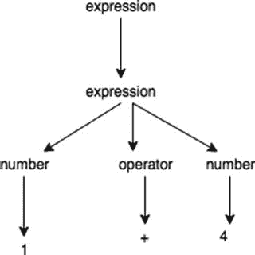
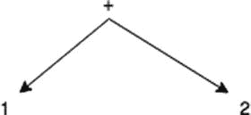
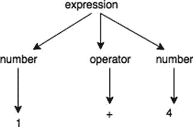

# 7. 创建自定义语言

到目前为止，我们已经逐步深入了解了 DSL。在这个阶段，我们能够创建外部和内部 DSL。在本章中，我们将更深入地研究外部 DSL，并开始开发一种自定义语言。

许多软件都有内部语言。一个例子是 Chef 中用于生成 cookbook 的 RubyDSL。这种语言始于一种 GPL 语言，并通过 DSL 实现成为一种新语言。该语言通常用于解决特定问题。在 Chef 或 Puppet 的情况下，我们使用一种“新语言”来自动在系统中安装补丁和软件。

我们创建的语言可以具有我们想到的任何范围。例如，我们可以创建一种专门用于数学的语言，或者用于“复制”另一种语言。在我们的例子中，我们想要创建一种类似于旧版 BASIC 的语言。

在本章中，我将讨论创建我们自己的语言的一般规则。当然，我们没有编译器，所以它不会是一种真正的新 GPL 语言。我们想要的是创建一种基于 Scala 的新语言。为此，我们必须学习编写 AST（抽象语法树），以便在内存中解析命令，然后执行函数。但是，首先，为了开始实现，最好先介绍一点理论。


## 什么是“语言”？

我们所说的语言，是指一种遵循语法的句法，用于定义一组词汇，我们可以组合这些词汇来进行交流并解决问题。

当我们定义一种语言时，我们定义了一组规则，可以用这些规则来定义我们自己的语言结构。这可以用来解决一些特定的问题。

在日常生活中，当我们用英语、意大利语或法语交谈时，我们每天都在使用语言。我们使用一组遵循特定语法的词汇来构建一个句子，让所有了解相同句法和语法的人都能理解。

我们所编写的是编程语言。通过“编程语言”这个术语，我们定义了一种形式语言，用于定义一组指令以产生输出。每种编程语言通常由两个组件定义。

*   **句法**：如何编写语言，语言的基本词汇是什么，例如 `if… then`、`for loop` 等。
*   **语义**：语言的含义，例如，当我们编写 `for` 或 `if then` 时。

每种编程语言都用于解决一个算法。当我们使用该语言时，我们利用句法来定义解决特定算法所需的语义。

定义我们自己的语言，首先要做的就是定义我们希望语言使用的句法。所谓句法，指的是我们组合起来设计语言语义的所有词汇和规则。

例如，我们必须定义保留字，即专门用于该语言的词汇，例如，用于标识行尾或判断是否存在 `if`…`else` 结构的词汇。

## 设计语言的模式

在设计语言时，我们必须考虑其诸多方面。我们必须定义语法、句法，并思考如何将输入翻译成指令。

为了正确地将输入翻译成一种语言，我们必须启动一些特定的阶段。

1.  识别句法并构建中间表示（IR）。这一步由读取器完成。
2.  执行语义分析。这一步通过解释器完成。
3.  生成语言。这一步使用翻译器。
4.  产生输出。

当我们想要构建自己的语言时，所有这些阶段都很重要。如你所见，在每个阶段中，我们基本上都有三个宏观组件。这个组件是每个语言解析器的基础。现在，我们可以尝试描述这些组件。

*   **读取器**：读取器负责从输入中构建一个数据结构。本质上，读取器是将输入翻译成数据结构的地方。
*   **解释器**：解释器遍历由读取器创建的结构，并执行操作。
*   **翻译器**：翻译器是读取器和解释器的结合。基本上，它接收输入并产生输出。

为了实现所有阶段，我们可以使用不同的模式。我们可以使用的主要模式是**递归下降识别器**。这些识别器用于将短语和句子翻译成语言的基本语法。

最基本且最常用的读取器组件是**递归下降词法分析器**。这种模式从一个字符创建一组词法单元，用于识别语言的词汇。该模式通常与递归下降识别器一起使用来创建解析器。假设我们要解析一个表达式。我们可以按以下方式设计解析器（图 7-1）。



图 7-1.

一种树形语法结构

现在，我们可以看到我们从基本表达式 `1+4` 开始。这是第一个输入。接下来，该表达式进入另一个步骤，并被拆分成各个独立部分。此时，每个单独的字符都被拆分成部分，例如运算符和数字。

这种模式是大多数语言解析器的基础，但每个解析器的起点都是定义句法的三个组件。实现这一点的常见模式称为**抽象语法树（AST）**。使用 AST，我们为语法中使用的每个重要词法单元创建一个节点。AST 是使用经典的三节点结构构建的。要创建 AST，我们可以使用两种不同的模式。

*   我们可以使用**解析树模式**。这种模式描述了如何识别输入句子并对其进行解析。下图（图 7-2）对此进行了说明。现在你可以看到我们如何检查运算符。随着数字的下降，解析器终止操作的开始，并将该操作应用于数字。



图 7-2.

应用于特定函数的解析器，本例中为带有两个参数的 `+` 函数
*   我们可以使用的另一种模式是**同质 AST**。这种模式的实现比前一种更简单。在这种模式中，我们使用单节点数据类型实现 AST，并在子列表表示类似于下图（图 7-3）的图表后对其进行规范化。


图 7-3.

同质 AST 树解析器

这种模式将第一个节点直接拆分成一个子节点集合。每个子节点都代表我们必须解析的表达式的一部分。


我们可以使用标准化的异构 AST 来规范化节点。这适用于具有多种节点类型的树，或者当我们希望开发具有多种节点数据类型的同构 AST 时。但所有子节点都可以被规范化。例如，当我们处理更复杂的语言时，会使用同构 AST。所有解析器都有一个共同点，即我们可以将其定义为 AST。AST 本质上是一棵树——这在编程中并不新鲜。我们如何构建和创建这棵树，就定义了解析器。对于同构 AST，我们有以下类似的结构：

```
class HomogenousAST()
{
var token:ParserToken = null
var children:List[ParserToken] = null
def this(token: ParserToken) {
this()
this.token = token
}
def apply(tokenType: Int) {
this.token = new AST(tokenType)
}
def getNodeType: Int = token.`type`
def addChild(t: AST): Unit = {
if (children == null) children = new util.ArrayList[AST]
children.add(t)
}
}
```

另一种可用于创建 AST 的模式是不规则异构 AST。这种模式是三种模式中最复杂的，因为它使用了多个节点。这些节点并非都是规则的，并且具有不同的子节点表示形式。这种模式与同构 AST 的不同之处在于，节点具有名称。通常，这种模式是一个链表。我们可以这样定义该模式：

```
var previous:ParserNode
var next:ParserNode
def addingNode(previous:ParserNode, next:ParserNode):Unit = {
this.next = next
this.previous = previous
}
```

所有这些模式都可以用来创建我们的 AST。它们是创建一棵树的基础，我们可以遍历这棵树来创建我们的语言。为了遍历树，我们可以使用另一种特定的模式。每种模式都有不同的用途。以下是这些模式的简要列表：

*   **嵌入式异构树遍历器**：此模式使用递归函数遍历异构 AST。该解析器的伪代码如下所示。在这里，我们可以看到实际节点是从根节点派生出来的，然后我们识别实际节点的操作并执行该操作。之后，我们开始读取实际节点的其他子节点。

```
    class  extends 
    {
    def ():Unit = {

}
    }
    ```

*   **外部树访问者**：此模式创建一个访问者类，用于遍历树节点。此模式遵循与嵌入式版本相同的逻辑。唯一的区别是代码是外部的，因此我们调用另一个类来执行遍历。我们可以这样定义伪代码：

```
    trait 
    {
    def operationNode()
    def numberNode
    }
    ```

现在我们看到的是一个接口，其中每个部分都定义了一种读取节点的方式。
*   **树语法**：此模式用于创建外部访问者。此模式本质上定义了外部访问者必须使用的语法。这通常使用 ANTLR 完成。定义操作的语法示例如下：

```
    match(operation);
    match(number);
    match(operation);
    ```

此语法用于标识解析器所使用的树语法片段。
*   **树模式匹配器**：此模式用于在找到与模式相关的某个术语时触发一个动作。此模式没有实际的实现，而是一种以图形方式翻译解析器工作方式的方法。当我们为不同的解析器设计语法时，可以看到此模式的一个示例，如图 7-4 所示。



图 7-4.

树模式匹配器生成器

当我们想要构建外部 DSL 时，会用到所有这些模式。最终，当我们创建自己的语言时，仍然需要创建一个外部 DSL。我们接收输入并解析它，以生成特定的输出。

## 设计语言

到目前为止，我们已经定义了可用于解析语言的不同模式，但在设计新语言时，我们还需要定义另一个步骤。首先要做出的决定是语言的语法。为了定义语法，我们使用 EBNF 语言。我们想要设计的语言类似于 BASIC 语言，因此 EBNF 如下所示：

```
Unary_Op       ::=     -    |    !
Binary_Op      ::=     +    |    -    |    *    |    /    |    %
|      =    |        |    =    |    
|      &    |    ' | '
Expression     ::=     integer
|      variable
|      "string"
|      Unary_Op   Expression
|      Expression   Binary_Op   Expression
|      ( Expression )
Command ::=    REM string
|      GOTO integer
|      SUB MAIN block
|      DIM variable = Expression
|      PRINT Expression
|      INPUT variable
|      IF Expression THEN integer
Line    ::=    integer Command
Program ::=    Line
|      Line Program
Phrase  ::=    Line | RUN | LIST | END
```

在这里，我们定义了语言的每一个元素。请记住：我们想要尝试重新创建一种 BASIC 语言，因此我们使用了早期 BASIC 的语法。本质上，我们定义了语言的每一个部分。这个定义为我们提供了创建语言基础模型。

使用前面描述的语法，我们可以编写如下程序：

```
PRINT "Table of Squares"
PRINT
PRINT "How many values would you like?"
INPUT num
```

## 创建语言

定义了语法之后，我们就可以开始创建我们的语言了。首先，从我们的语言开始，我们可以为解析器识别出三个主要组件。

*   **读取器**：本质上，这是定义所有语法和保留字的解析器。它会创建一个 AST。
*   **解释器**：它遍历在读取器中创建的 AST。
*   **翻译器**：一些 Scala 类使用它将解释器的结果翻译成输出。

当我们定义解析器时，必须使用语言的保留字，那么让我们开始创建`Reader`类。

### 创建 Reader 类

我们解析器的核心是`Reader`类。这个类继承了 Scala 的`StandardTokenParsers`。这是我们解析器的基础。我们首先创建语言使用的保留字，如下所示：

```
class Reader extends StandardTokenParsers {
lexical.reserved += ("DIM", "PRINT", "IF", "SUB", "THEN", "FUNCTION", "SUB", "MAIN", "RETURN", "END FUNCTION")
lexical.delimiters += ("*", "/", "%", "+", "-", "(", ")", "=", "", "==", "!=", "=", ",", ":")
```

你可以看到，我们首先定义了 Scala 解析器将使用的所有保留字和分隔符。这些是我们用来对语言进行词法分析的单词。

如前所述，我们可以使用不同的技术来创建 AST，因此我们必须定义要应用于语言的规则。这些规则用于创建我们稍后可以用来翻译语言的树。要编译这些规则，我们需要做的是将我们定义的 EBNF 翻译成 Scala 语法。

我们要建立的第一个规则是程序的入口点。在 BASIC 中，这通常是`SUB MAIN`。其代码如下：

```
def mainPoint: Parser[Program] = (rep(function)  new Program(f, c)
}
```

我们可以暂停一下来分析这个第一个函数。我们可以看到这个函数使用了我在第 6 章中介绍的元素。

```
(rep(function) <~ ("SUB" ~ "MAIN")) ~ block
```

程序包含多个可以重复的函数。在单词`SUB MAIN`之后，我们找到一个块。这本质上是规则的另一部分，它标识了我们在主函数内部可以编写的代码块。我们现在可以继续编写其他简单的规则来定义该语言。


```
/*
通过此函数，我们定义了节点 "function"。当遇到单词 FUNCTION() 时，会创建此节点。我们构建一个复合节点，包含 FUNCTION 和一些参数。在 () 之后，我们期望一个 "block" 以及可选的 return 语句。此函数使用了第 6 章定义的 Helper 解析器。该函数需要一个 END FUNCTION 来闭合。block 的结构类似如下：
FUNCTION Test()
PRINT "Test"
END FUNCTION
*/
def function: Parser[Function] = ("FUNCTION" ~> ident) ~ ("(" ~> arguments) ~ (")" ~> block) ~ opt(returnStatement)  new Function(a, b, c, Number(0))
case a ~ b ~ c ~ d => new Function(a, b, c, d.get)
}
//通过此函数，我们定义了 RETURN 单词，用于 FUNCTION 方法中
def returnStatement: Parser[Expr] = "RETURN" ~> expr ^^ {
e => e
}
def arguments: Parser[Map[String, Int]] = repsep(ident, ",") ^^ {
argumentList => {
(for (a  0)) toMap
}
}
//此函数定义了一个 block，block 是一组用于定义代码功能的语句
def block: Parser[List[Statement]] = rep(statement) ^^ { a => a }
def statement: Parser[Statement] = positioned(variableAssignment | outStatement | ifStatement | executeFunction | outStatement) ^^ { a => a }
//此定义了用于定义变量的保留字 DIM
def variableAssignment: Parser[VariableDefinition] = "DIM" ~> ident ~ "=" ~ positioned(executeFunction | expr) ^^ { case a ~ "=" ~ b => { new VariableDefinition(a, b) } }
def outStatement: Parser[PrintStatement] = "PRINT" ~> positioned(expr) ^^ { case a => new PrintStatement(a) }
//此定义了 if 语句，这意味着当代码遇到 if 时，我们可以看到它找到了 conditional ~ block，这意味着我们必须使用 conditional 函数来定义要使用的单词。这本质上是一个节点，内部包含子节点的定义
def ifStatement: Parser[IfStatement] = conditional ~ block ^^ {
case a ~ b ~ c => {
c match {
case None => new IfStatement(a, b, List())
case _ => new IfStatement(a, b, c.get)
}
}
}
//此定义了代码块中使用的条件语句，现在我们看到在单词 IF( ) THEN 中，我们可以定义一些条件，代码可以是 IF(TRUE)THEN
def conditional: Parser[Condition] = "IF" ~ "(" ~> condition  or " | "==" | "!=" | "=") ~ positioned(expr) ^^ {
case a ~ b ~ c => {
new Condition(b, a, c)
}
}
def iterations: Parser[Int] = numericLit ^^ { _ toInt }
//这主要负责解析 FUNCTION，我们使用 Scala 的 Parser Helper 并调用相关函数，这有助于将代码翻译成功能
def executeFunction: Parser[CallFunctionMethod] = ((ident)  new CallFunctionMethod(a, l)
}
def functionCallArguments: Parser[Map[String, Expr]] = repsep(functionArgument, ",") ^^ {
_ toMap
}
def functionArgument: Parser[(String, Expr)] = (ident  (a, b)
}
//此函数执行操作的解析器，将操作 + 或 – 应用于项，项是用于创建操作的数字，我们可以看到在这个例子中，另一个小的解析器片段得以保留
def expr: Parser[Expr] = term ~ rep(("+" | "-") ~ term) ^^ {
case a ~ List() => a
case a ~ b => {
def appendExpression(c: Operator, p: Operator): Operator = {
p.left = c
p
}
var root: Operator = new Operator(b.head._1, a, b.head._2)
for (f  new Operator("+", null, f._2)
case "-" => Operator("-", null, f._2)
}
root = appendExpression(root, parent)
}
root
}
}
//此函数定义了一个项，本质上识别表达式的每一个单独部分
def term: Parser[Expr] = multiplydividemodulo ^^ { l => l } | factor ^^ {
a => a
}
def multiplydividemodulo: Parser[Expr] = factor ~ rep(("*" | "/" | "%") ~ factor) ^^ {
case a ~ List() => a
case a ~ b => {
def appendExpression(e: Operator, t: Operator): Operator = {
t.left = e.right
e.right = t
t
}
var root: Operator = new Operator(b.head._1, a, b.head._2)
var current = root
for (f  Operator("*", null, f._2)
case "/" => Operator("/", null, f._2)
case "%" => Operator("%", null, f._2)
}
current = appendExpression(current, rightOperator)
}
root
}
}
def factor: Parser[Expr] = numericLit ^^ { a => Number(a.toInt) } |
"(" ~> expr  e } |
ident ^^ { new Identifier(_) }
```

上述代码代表了 `Reader` 的全部代码。我们编写代码来解析语言的每一个元素，并介绍了用于创建解析器的概念。本质上，我们将每个单独的命令（例如 `if` 或函数）拆分成一段用于创建令牌的代码。我们基本上对元素进行了词法分析。有了这个元素，我们就可以创建 AST。现在我们可以为语言定义最后一个函数并关闭读取器。我们必须实现从我们为启动解析器而扩展的特质中继承的 `parseAll` 函数，如下所示：

```
def parseAllT: ParseResult[T] = {
phrase(p)(new lexical.Scanner(in))
}
```

`parseAll` 函数调用 `lexical.Scanner` 并为我们的语言创建解析器。此函数为语言的每个元素创建令牌。

这段代码介绍了一些我们必须开发以创建语言的元素。基本上，我们从一些需要定义的结构中创建一个调用，以生成读取器的输出。此代码解决了我们解析器的第一步，并满足了创建我们自己的语言的第一个要求。下一步是创建翻译器。这不是一个简单的类，而是用于翻译语言的类的一个分支。首先，为了描述翻译器，我们必须定义代码如何构建 AST。

### 定义令牌

为了在内存中构建 AST，我们必须定义用于创建 AST 的令牌。这是将我们的代码翻译成其他内容的第一步。

这些类用于定义我们语言中的每一个单独操作。为了构建我们的 AST，我们开始创建基础类 `Expr` 和特质 `Statement`，如下所示：

```
import scala.util.parsing.input.Positional
trait Statement extends Positional
```

上述代码展示了特质 `Statement`。其他类使用此类来生成令牌。因此，我们创建了一组可用于解析语言中每个单独操作的类。Scala 中的特质类似于 Java 或其他语言中的接口。在这种情况下，特质定义了一个我们可以用来定义解析器的接口。在这里，我们扩展了一个 `Positional` 方法。当我们想要为语言的某个元素定义一个特定位置时，会使用这个特定的特质。想象一下，例如，我们想要定义一个 `If`。我们必须在一个精确的位置拥有我们想要检查的元素。在这种情况下，特质 `Positional` 帮助我们精确定义它。

我们为每个命令生成一个类，例如，`If` 语句在此类中定义，如下所示：

```
package practical.dsl.parsers.model
case class IfStatement(condition: Condition, trueBranch: List[Statement], falseBranch: List[Statement]) extends Statement
```

我们可以看到，该类扩展了 `Statement` 特质，并使用 `case` 类来定义功能。使用这种技术来创建解析器，使我们能够以简单的方式创建 AST。唯一没有使用 `Statement` 特质的类是 `Expr` 类。

```
package practical.dsl.parsers.model
import scala.util.parsing.input.Positional
class Expr extends Positional
case class Number(value: Int) extends Expr
case class Operator(op: String, var left: Expr, var right: Expr) extends Expr
case class Identifier(name: String) extends Expr
```

此类用于定义语言中的每个操作。我们定义了 `Number`、`Operator` 和 `Identifier`。`Expr` 类扩展了 `Positional` 特质。此特质给出了对象的位置。本质上，我们可以识别代码中每个单独的对象。如果我们想要在操作中翻译软件，这将非常有用。


## 为语言创建翻译器

`Translator` 类是将我们的 AST 翻译成其他内容的起点。`Translator` 的代码如下：

```
class Translator(program: Program) {
var currentScope = new Scope("global", null)
def run() {
walk(program.statements)
}
private def getVariable(ident: Identifier): Expr = {
var s: Scope = currentScope
while ((!s.name.equals("global")) && !s.variables.contains(ident.name)) s = s.parentScope
if (s.variables.contains(ident.name)) s.variables(ident.name)
else {
sys.error("Error: Undefined variable " + ident.name )
}
}
//通过此方法，我们想要识别可以对数字应用哪些操作
private def calculateExpr(e: Expr): Int = {
e match {
case Number(value) => value
case Identifier(name) => {
calculateExpr(getVariable(e.asInstanceOf[Identifier]))
}
case Operator(op, left, right) => {
op match {
case "*" => calculateExpr(left) * calculateExpr(right)
case "/" => calculateExpr(left) / calculateExpr(right)
case "%" => calculateExpr(left) % calculateExpr(right)
case "+" => calculateExpr(left) + calculateExpr(right)
case "-" => calculateExpr(left) - calculateExpr(right)
}
}
}
}
private def isConditionTrue(condition: Condition): Boolean = {
val a = calculateExpr(condition.left)
val b = calculateExpr(condition.right)
condition.op match {
case "==" => (a == b)
case "!=" => (a != b)
case " (a  (a =" => (a >= b)
case ">" => (a > b)
}
}
private def executeFunction(f: Function, arguments: Map[String, Expr]) {
currentScope = new Scope(f.name, currentScope)
for (v  {
val f = program.functions.filter(x => x.name == name)
if (f.size  {
if (value.isInstanceOf[FunctionCall]) {
val functionCall = value.asInstanceOf[FunctionCall]
val function = program.functions.filter(x => x.name == functionCall.name)
if (function.size  {
println(calculateExpr(value))
walk(tree.tail)
}
case IfStatement(condition, trueBranch, falseBranch) => {
if (isConditionTrue(condition)) walk(trueBranch) else walk(falseBranch)
currentScope = currentScope.parentScope
walk(tree.tail)
}
case _ => ()
}
}
}
}
```

翻译器使用 AST 创建的标记来遍历树。对于翻译器，我们本质上采用了树遍历模式。不同的标记由 AST 创建，并在模型中定义。模型本质上是用于创建语法的普通类。

解释器基本上实现了一种外部树访问者模式。我们使用在模型中创建的类来读取 AST 并将其翻译成一种语言。涉及的类是一个普通的 Scala 类，它们共同设计用于将输入翻译为输出。

所有翻译器的核心是 `walk` 函数。它实现了该模式。该函数获取树（一个语句列表），检查每条语句，并调用相应的类将 AST 翻译成一种语言。

## 执行语言

最后一步是创建执行语言的代码。一个对象负责读取输入文件并调用解析器。相关代码如下：

```
object Language {
def main(args: Array[String]) {
val inputFile = Source.fromFile("source/practical.bascala")
val inputSource = inputFile.mkString
val parser = new SmallLanguageParser
parser.parseAll(parser.program, inputSource) match {
case parser.Success(r, n) => {
val interpreter = new Interpreter(r)
try {
interpreter.run
} catch {
case e: RuntimeException => println(e.getMessage)
}
}
case parser.Error(msg, n) => println("Error: " + msg)
case parser.Failure(msg, n) => println("Error: " + msg)
case _ =>
}
}
}
```

代码非常简单。它调用输入文件 `practical.bascala` 并执行它以获得结果。输入文件内容如下：

```
FUNCTION printVoid()
PRINT "Hello World"
END FUNCTION
SUB MAIN
printVoid()
END SUB
```

## 结论

在本章中，我们进一步深入探讨了外部 DSL。我们使用外部 DSL 创建了一种新语言，您可以看到，即使并非总是容易，这也可以很有趣。

您了解了实现语言的不同模式以及涉及的三个主要对象。最后，我们创建了自己的解析器和语言。

当然，这只是一个简单的语言示例，但我们发现了与外部 DSL 以及使用 Scala 语言的解析器组合器相关的更有趣的技术。您现在可以轻松创建自己的语言，并将其用于我们的项目。

