# 8. 移动开发

移动开发在日常开发中变得越来越重要。越来越多的公司现在拥有移动开发团队。在本章中，您将学习移动开发的基础知识，以及如何使用 Scala 和 DSL 创建自己的应用程序。

## Android 移动开发简介

Android 是由 Android 公司（后来成为 Google 的子公司）开发的开源操作系统。Android 的特性允许开发者为不同的设备（例如台式计算机或手机）使用相同的源代码。

Android 不仅仅是一个操作系统，更是一个生态系统。社区为您提供了完整的开发工具。Android 是移动社区的游戏规则改变者。要理解为什么 Android 对技术社区变得如此重要，有必要了解移动软件发展的历史。

最初的移动开发基本上基于专有操作系统。在开发方面，所有移动公司都定义并发布了 WAP（无线应用协议），这是一种用于定义网页导航的技术标准。借助 WAP，可以启动移动网页开发。每家公司都发布了 WAP 浏览器，使开发者能够创建第一个移动网站。诺基亚是第一个改进开发的公司。从诺基亚开始，我们拥有了自己的框架，这使开发者能够创建自己的游戏。继诺基亚之后，其他公司也开发了自己的移动开发库。当然，这些软件是专有的，只能用于相应品牌的手机。

当 Android 诞生时，它允许开发者在不大量修改代码的情况下，为大量设备创建更好的应用程序。对于 Android 开发，Google 发布了 Android Studio，这是一个可以简单方式开发 Android 应用程序的工具。我们将使用此工具来开发我们的 Scala 应用程序，因此，首先我们必须安装 Android Studio。


### 开始 Android 开发

要开始 Android 开发，第一步是下载 SDK（软件开发工具包）。新版 Android SDK 与 Android Studio 相关联。Android Studio 是一款基于 JetBrains IntelliJ 的编辑器。SDK 的下载链接是 [`https://developer.android.com/studio/index.html`](https://developer.android.com/studio/index.html)。

请为正确的操作系统下载软件，并按照说明安装 Android Studio。当 Android Studio 安装并启动后，您将看到类似图 8-1 的界面。

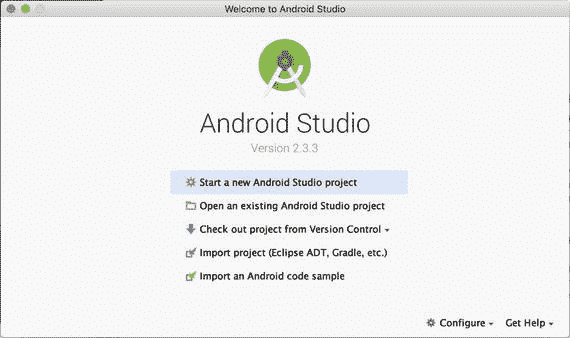

图 8-1

Android Studio 启动页面

要开始我们的 Scala Android 项目，我们必须安装 Scala 插件，方法是从“配置”菜单中选择“插件”（图 8-2）。

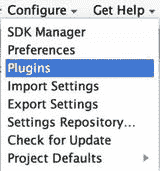

图 8-2

“配置”菜单

在“插件”菜单中，选择“从仓库浏览”，然后在新菜单中输入 Scala。这将显示所有 Scala 插件。选择 Android Scala 插件，如图 8-3 所示。

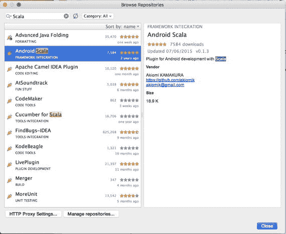

图 8-3

选择 Android Scala 插件

安装该插件，然后重启程序。这将在 Android Studio 上安装 Scala 插件。现在，我们已经准备好创建第一个 Android 项目了。

要创建一个应用程序，请从启动页面选择“开始新的 Android Studio 项目”链接。这将显示创建项目所涉及的步骤。首先，我们必须指定项目名称和包名（图 8-4）。

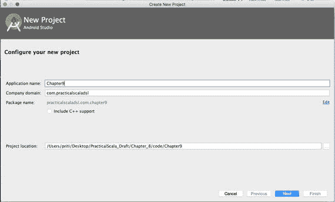

图 8-4

创建新的 Android 项目

点击“下一步”，选择目标 Android 设备。选择设备后点击“下一步”。接下来的屏幕显示了我们想要创建的基本项目类型。选择“基本活动”（图 8-5）。

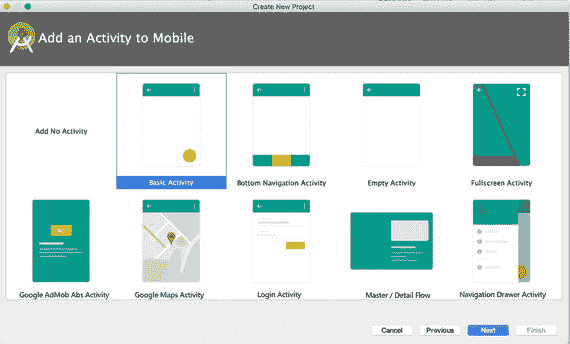

图 8-5

活动移动设备选择

下一步是自定义主活动。对于应用程序的主活动，我们可以保留默认设置并点击“下一步”。最后，项目就准备好了，如果您按照所有步骤操作，您将看到类似图 8-6 的界面。

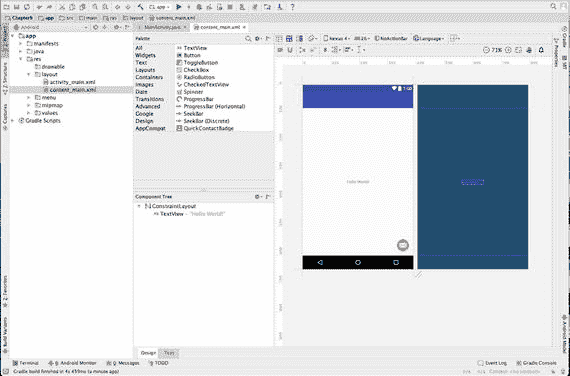

图 8-6

Android 项目已就绪

### Android 应用程序剖析

首先，要编写我们的代码，我们必须了解 Android 应用程序的结构。我们可以在 Android Studio 项目的左侧看到这个结构（图 8-7）。

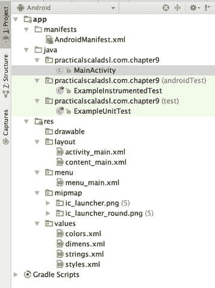

图 8-7

Android 应用程序剖析

我们可以识别出三个主要文件夹。

*   `manifests`：此文件夹包含 `AndroidManifest.xml`。该文件提供了关于应用程序的基本信息。
*   `java`：此文件夹包含所有 Java 代码。Android 主要使用 Java 开发。在我们的案例中，Scala 文件也放在这里。
*   `res`：此文件夹包含应用程序所需的所有非代码文件。在这里，我们可以找到 XML 文件、UI、图形文件等。

`AndroidManifest.xml` 是每个 Android 应用程序所必需的，用于定义我们应用程序中使用的资源。Android 使用 `Activity` 来定义一组由我们的应用执行的任务。例如，在我们的基本程序中，您可以找到定义的主活动，如下所示：

您可以看到，本质上，Android 使用其自己的外部 DSL。当我们读取 XML 时，为了定义活动，我们看到了一些用于定义它的特定工作和操作。这本质上是一个用于解析外部 DSL 的语法定义。每个应用程序的每个活动对于任务目的都是唯一的。所有活动都继承自 `Activity` 类。这是每个 Android 应用程序的构建块。

`Activity` 类派生自 `Context` 类。在 Android 中，活动本质上是一个窗口。从我们在应用程序中看到的情况来看，`Context` 是 Android 应用程序的中央命令中心。大多数应用程序功能都可以直接使用 `Context` 类访问。这本质上是一个抽象类。该类允许访问应用程序的所有资源，例如配置文件等。从这个类，我们可以派生操作系统的所有其他类。


## 我们的第一个 Scala-Android 应用

目前，要创建我们的 Scala Android 应用，我们可以将其命名为 `PracticalScalaDSL`。这是因为之前的项目不能是空项目。为了更好地理解整个过程，最好从一个空项目开始。为此，我们启动 Android Studio 并创建一个新的空项目（图 8-8）。

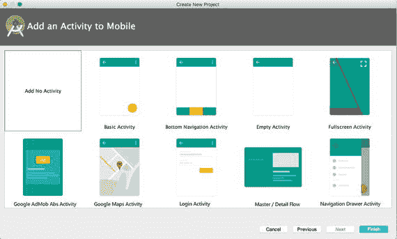

图 8-8

创建一个无活动的新项目

创建好一个空的 Android 项目后，我们可以利用这个项目开始添加 Scala 类，并开发我们的 Scala Android 应用。

我们首先需要创建一个主窗口来显示简单的“Hello World”。这样，我们就能了解如何使用 Scala 编写 Android 应用。为此，我们右键点击文件夹 `practicalscaladsl.com.practicalscaladsl`，然后选择新建文件，如图 8-9 所示。

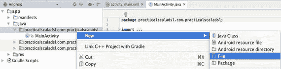

图 8-9

创建一个新文件

我们将文件命名为 `MainActivity.scala`，由于尚未设置 Scala SDK，编辑器会提示我们进行设置，如图 8-10 所示。


图 8-10

系统提示我们设置 Scala SDK

点击链接“Setup Scala SDK ➤ AndroidStudio”，会显示所有可用的 Scala 编辑器。为我们的项目选择一个，如图 8-11 所示。

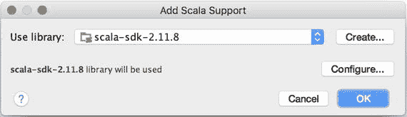

图 8-11

添加 Scala 支持

我们编写的第一个代码是用于创建主窗口的。代码非常简单，如下所示：

```
package practicalscaladsl.com.chapter_8
import android.app.Activity
import android.os.Bundle
class MainActivity extends Activity {
override def onCreate(savedInstanceState: Bundle) {
super.onCreate(savedInstanceState)
setContentView(R.layout.main_layout)
}
}
```

这段代码非常简单易懂。我们继承了 `Activity` 类并重写了 `onCreate` 函数。通过这个方法，我们调用了布局文件，在本例中是 `activity_main.xml`。

布局本质上是 Android 中的一种资源。我们可以在 `res` 包中定义布局。它是一个简单的 `.xml` 文件。该文件创建在 `res` 文件夹下的 `layout` 子文件夹中，如图 8-12 所示。

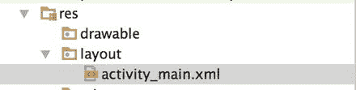

图 8-12

layout 文件夹

这个文件的内容非常简单。

```

//这段代码用于定义一个 TextView，本质上是一个带有文本的视图。我们定义的资源主要涉及布局类型、文本的显示方式以及文本内容本身。

```

这个简单的文件创建了布局。在我们的例子中，我们添加了一个简单的 `TextView`（一个用于显示文本的 Android 组件），并定义了一些属性。

Android 应用需要定义 `Context` 来调用其他资源，因此我们必须创建另一个资源文件来定义它。在这种情况下，我们在同一个文件夹中创建了另一个名为 `content_main` 的文件。文件内容如下：

该文件定义了我们在 Android 应用中可使用的资源。这些是启动应用的基础。我们现在要做的是启动代码。为此，我们只需点击 Android Studio 中的“运行”按钮，如图 8-13 所示。

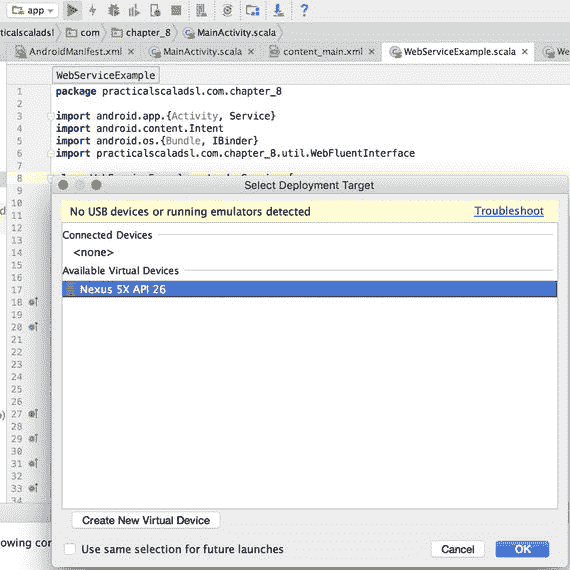

图 8-13

运行应用

选择我们已有的设备，然后启动代码。你将看到类似图 8-14 的画面。

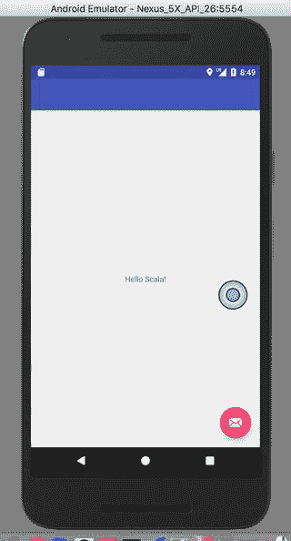

图 8-14

Scala Android 应用

现在我们已经定义了布局，并且可以看到 Android 如何使用外部 DSL 来定义资源。但现在是时候创建我们自己的 DSL 了。我们的 DSL 将用于创建一个服务应用，这是一种后端类型的应用，用于连接 Web 服务并获取数据。在我们的例子中，我们创建一个内部 DSL，用于创建一个服务，即我们可以在 Android 应用中定义的另一个软件组件。

### 在 Android 中创建服务

Android 应用不仅仅由用户界面构成。服务是应用的一个重要组成部分。Android 服务类似于 Web 应用的后端组件。它没有任何界面，在后台运行，并且与用户没有特定的交互。

我们可以定义不同类型的服务。例如，我们可以定义以下服务：

*   **检查邮件**：我们可以有一个在后台运行的服务，用于检查新收到的邮件并在界面上显示。
*   **检查社交网络**：我们可以有一个专门用于检查社交网络（例如 Facebook、Twitter、LinkedIn）的服务，并在界面上显示通知。

这只是我们每天在手机上使用的两个服务示例。我们的服务只需要检查一个 Web 服务并显示一些更新。目前，我们将专注于创建连接该服务所需的 DSL。

从开发者的角度来看，创建服务相对简单。我们继承 `android.app.Service` 类，然后编写服务的代码。在我们的例子中，服务通过流畅的 API 调用我们的 DSL，从组件部分构建我们的操作。我们本质上所做的就是调用一个外部 Web 服务来获取一些结果，并将其绘制到 Android 应用中。

```
package practicalscaladsl.com.chapter_8
import android.app.{Activity, Service}
import android.content.Intent
import android.os.{Bundle, IBinder}
class WebServiceExample extends Service {
val mStartMode:Int
var mBinder:IBinder
val mAllowRebind:Boolean
override def onCreate():Unit
override def onStartCommand(intent:Intent, flags:Int, startId:Int):Int = return mStartMode
override def onBind(intent:Intent):IBinder = return mBinder
override def onUnbind(intent:Intent):Boolean = return mAllowRebind
override def onRebind(intent:Intent)
override def onDestroy():Unit
}
```

我们的代码继承了 `Service` 类。这个类定义了一些我们在创建方法时需要重写的接口。在集成代码时，你将了解更多关于这些方法的信息。我们现在开始创建用于调用服务的 DSL。服务是在 Android 应用后台启动的一个组件。例如，当应用需要连接网络或执行某些后台操作时，就会使用这个类。当应用调用 `serviceStart` 操作时，服务启动。一旦启动，服务就在后台运行并持续工作，即使应用被销毁也不会停止。要停止服务，我们必须通过代码关闭它。要停止代码，我们必须调用 `stopService` 方法。


### 定义我们的领域特定语言

众所周知，领域特定语言（DSL）用于改善沟通，并允许开发者更好地定义创建 API 时所使用的接口和方法。因此，我们从一些可用于流畅接口的方法开始。第一步是定义通用词典以及我们想要解决的操作（表 8-1）。

表 8-1

我们领域特定语言的基本定义

| 方法 | 定义 |
| --- | --- |
| `Connect` | 在 Web 服务上执行连接 |
| `Find(string Name)` | 使用 Web 服务查找用户 |
| `Add(string Name)` | 向系统添加新用户 |

我们为服务定义了三个简单的操作。我们实际上不需要添加更多操作来展示如何创建领域特定语言。我们的目标是展示如何将领域特定语言集成到 Android 开发中。

我们现在开始使用流畅接口来创建我们的领域特定语言。这种方法用于创建一系列可以像阅读英语一样阅读的调用链。因此，我们现在为接口创建代码，它看起来如下所示：

```
package practicalscaladsl.com.chapter_8.util
import java.util
import sun.net.www.http.HttpClient
class WebFluentInterface {
private var entity=""
private var httpResponse= ""
private var httpClient=""
private var webService = ""
case class Username(username:String)
def Connect(webservice:String):Unit ={
this.webService= webservice
this
}
def Find(username:String):Unit ={
httpClient = new DefaultHttpClient()
httpResponse = httpClient.execute(new HttpGet(webservice))
entity = httpResponse.getEntity()
this
}
def add(username:String):Unit = {
val user = new Username(username)
val userJson = new Gson().toJson(user)
val post = new HttpPost(this.webService)
val nameValuePairs = new util.ArrayList[NameValuePair]()
nameValuePairs.add(new BasicNameValuePair("JSON", userJson))
post.setEntity(new UrlEncodedFormEntity(nameValuePairs))
val client = new DefaultHttpClient
val response = client.execute(post)
println("--- HEADERS ---")
response.getAllHeaders.foreach(arg => println(arg))
this
}
}
```

这段代码是一个简单的流畅接口调用。我们有三个方法可以用来调用 Web 服务并发布数据。代码的重要部分是我们如何在 Android 中使用它。

我们可以通过改进我们刚刚编写的 `Service` 类来实现这一点，如下所示：

```
package practicalscaladsl.com.chapter_8
import android.app.{Activity, Service}
import android.content.Intent
import android.os.{Bundle, IBinder}
import practicalscaladsl.com.chapter_8.util.WebFluentInterface
class WebServiceExample extends Service {
val mStartMode:Int
var mBinder:IBinder
val mAllowRebind:Boolean
val webFluentInterface:WebFluentInterface
override def onCreate():Unit
override def onStartCommand(itent:Intent, flags:Int, startId:Int):Int = {
webFluentInterface.
Connect("http://localhost:8080/add").
Add("Test")
return mStartMode
}
override def onBind(intent:Intent):IBinder = return mBinder
override def onUnbind(intent:Intent):Boolean = return mAllowRebind
override def onRebind(intent:Intent)
override def onDestroy():Unit
}
```

你可以看到，我们在 `onStartCommand` 方法中创建了对该方法的调用。这创建了在 Web 服务中添加新用户所需的调用。这是从 Android 应用程序和我们的领域特定语言创建连接的最简单方法。

## 结论

移动开发是当前的热门领域。在本章中，我们只是浅尝辄止。你已经了解了如何创建 Android 项目以及 Android 开发的基础知识。当然，这仅仅是个开始。

要深入了解移动开发，可能需要另一本书。我们现在将使用 Scala 代替 Java，同时，了解如何使用领域特定语言为服务定义一些工具类。在我们的开发中使用领域特定语言只是一种新的工作方式。我们不需要将领域特定语言视为某种奇特的技术，而只是将其视为编写代码的一种简单方式。

在下一章中，我们将了解领域特定语言的其他用途，以及它们如何简单地应用于我们的日常工作中。

