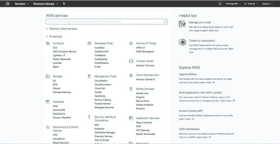
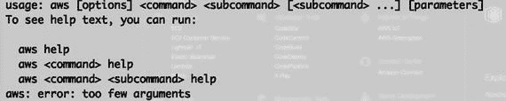
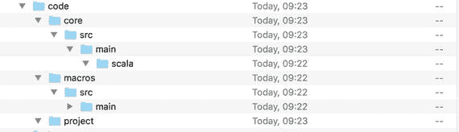

# 11. 云与 DevOps

云与 DevOps 目前是许多组织的热门话题。越来越多的企业正在迁移到云端并采用 DevOps 来满足其日常需求。

DevOps 帮助组织缩短其产品和/或服务的上市时间，而云计算则有助于降低基础设施成本。通过使企业免于维护自己的服务器，并帮助更快地解决问题，成本得以降低。例如，如果服务器出现问题，如果它在云端，可以创建一个新服务器，而不是花费资源去修复损坏的服务器。

特别是，DevOps 和云被用于微服务，正如第 5 章所讨论的。在本章中，我将介绍一些 DevOps 实践，并描述如何使用 Scala 和 DSL 在云端创建和部署服务。

## 什么是 DevOps？

DevOps 是一个合成词，由“dev”（开发人员）和“ops”（运维）组合而成。这两个词涵盖了整个软件生命周期，并代表了一组实践，其理念是消除开发生命周期中的一切摩擦。DevOps 的发展与云的发展同步。看到云公司采用 DevOps 来管理其开发生命周期并不罕见。

Gartner 在 2013 年将 DevOps 描述为“处于上升期”。这个描述当时是针对一项新兴技术。在过去的四年里，DevOps 已成为许多公司的最新热潮。

如果我们想定义 DevOps，可以说它是一套贯穿整个公司的实践，目标是缩短每项举措的上市时间并提高产品发布的质量。

这个简单的定义是 DevOps 的核心。

*   **质量**：DevOps 的目标是在每一次部署中改进并保证软件质量。这样做是为了在开发和部署过程中实施一些通用流程。
*   **缩短上市时间**：缩短从代码提交到仓库到最终构建的时间非常重要。为此，DevOps 采用持续集成（CI）。代码的每个组件都会被立即构建和测试。
*   **改善公司内部沟通**：DevOps 的目的是减少公司内部的摩擦。为了实现这一点，它在全公司范围内共享通用实践。

当然，成功采用 DevOps 需要一些通用实践。这些实践有助于在全公司范围内引入 DevOps，并确保其实施成功。

## 通用 DevOps 实践

为了取得成功，DevOps 引入了一些实践，使运维更顺畅、更高效。这些实践可以总结如下：

*   **运维专业人员应成为软件架构的主导者**。他们是负责维护代码的人员。让他们参与架构设计有助于创建更好的日志，这在出现错误时意味着更短的降级时间。
*   **开发人员应对生产环境中的代码故障负责**。通常，开发人员完成工作后，他们的参与就结束了。这造成了一种心态，即开发人员并不真正关心生产环境中发生的事情。让开发人员在生产环境出现问题时负责有两个显著的好处。首先，开发人员可以更快地帮助解决问题；其次，开发人员能够了解代码在何时出现故障。
*   **公司应确保所有员工使用相同的构建流程**。在公司内部拥有清晰的构建和部署流程有助于提高质量并缩短上市时间。
*   **应采用持续部署（CD）和持续集成（CI）**，以获得更好的构建流程和更优的发布。这两种实践确保了更顺畅、更快速的构建。这些流程只涉及代码的新部分，而不是全部代码，从而减少了构建时间，并有助于更快地识别错误。
*   **应实施基础设施即代码设计**，这确保了更好、更可靠的基础设施，尤其是在云端。

所有这些实践应结合起来，以帮助启动良好的 DevOps 流程并缩短上市时间。它们应得到管理层的批准和支持。管理层理解这些流程的价值并以正确的方式帮助实施它们至关重要。DevOps 对于每家公司当前在业务上取得成功都至关重要。

至此，我们想要开始创建一些可用于设计我们基础设施的代码。我们用来做这件事的软件是 Scala 和 AWS。它们将支持每个项目中的 CI 和 CD。当然，我们必须有一些基本的方法论，特别是测试驱动开发（TDD）。通过这种软件开发方式，使用极限编程（XP），开发人员首先为代码编写测试。测试基于用户输入，然后编写通过测试的代码。这基本上就是 CI 和 CD 实践中所发生的事情。

## 从 AWS 开始

AWS 开发的第一步是创建一个免费的 AWS 账户。要创建一个为期一年的免费账户，请访问[`https://aws.amazon.com/`](https://aws.amazon.com/)。请记住：您必须输入有效的信用卡凭证才能开始试用。当您登录新账户后，您将看到类似图 11-1 的内容。



图 11-1

AWS 控制台

我们可以看到有许多不同的服务可供我们使用。本章我们要重点关注的是 EC2 和 Lambda。

要开始开发，我们必须安装一个 SDK。不幸的是，亚马逊没有为 Scala 提供 SDK，但我们可以使用 Java 版本，所以下一步是从 Java 安装 SDK。要下载 SDK，请访问[`https://aws.amazon.com/sdk-for-java/`](https://aws.amazon.com/sdk-for-java/) `install`，并尝试通过控制台查看 SDK 是否已正确安装。为此，只需在控制台中输入`aws`。如果一切正常，您将看到类似图 11-2 的内容。



图 11-2

AWS 命令行界面

这表明 AWS 已安装。现在我们可以开始编写代码了。


## 在 AWS 中的部署与构建

如前所述，DevOps 的本质是缩短产品上市时间。到目前为止，你已经学会了如何使用 DSL 和 Scala 来构建和部署新服务。现在，我们将使用 AWS CodeBuild 来完成这项工作。

AWS CodeBuild 是一个完全托管的云端构建管理器。借助这项 AWS 服务，我们可以直接在云端构建代码。该流程遵循所有 CI 和 CD 实践。首先，我们执行测试，当测试通过后，再编译并发布代码。当公司采用 CI 和 CD 进行开发时，这能够减少并加速发布流程。这是因为，正如我所指出的，组件会被立即构建和测试。实现这一目标的最佳工具之一是 Jenkins。借助 Jenkins，我们可以创建一组构建任务，从而运行并检查每次构建的状态。每次构建都与代码发布同时进行，这有助于我们在构建时发现任何错误。

当我们需要以快速且可靠的方式创建并发布微服务时，这项服务非常有用。现在，我们要做的是准备一些代码，并看看如何为此使用 DSL 技术。

由于我们是在云端执行代码，我建议使用一个用于 `sbt` 的 Docker 镜像。这是因为它的设置和使用都很简单。以下是下载我所用 Docker 镜像的命令：

```
docker pull hseeberger/scala-sbt
```

这包含了启动项目所需的一切。

下载镜像后，我们就可以开始编写一些代码了。在我们的案例中，目录结构非常重要。最终的目录结构将如图 11-3 所示。



图 11-3

AWS Scala 宏包结构

这是我们第一个示例代码所使用的结构。现在，是时候开始编写一些代码了。

### 在 AWS 中创建项目

首先，要为项目创建 AWS 资源，我们必须使用 AWS CLI。相关代码如下：

```
{
"name": "chapt_11_practicalscala",
"source": {
"type": "S3",
"location": "codebuild-region-ID-account-ID-input-bucket/PracticalScalaDSL.zip"
},
"artifacts": {
"type": "S3",
"location": "codebuild-region-ID-account-ID-output-bucket",
"packaging": "ZIP",
"name": "PracticalScalaDSLOutput.zip"
},
"environment": {
"type": "LINUX_CONTAINER",
"image": "scala-image-ID",
"computeType": "BUILD_GENERAL1_SMALL"
},
"serviceRole": "arn:aws:iam::account-ID:role/role-name",
"encryptionKey": "arn:aws:kms:region-ID:account-ID:key/key-ID"
}
```

可以使用以下命令执行该代码：

```
aws create-project aws_project.json
```

这会在我们的 AWS 实例中创建代码的结构。

注意

代码中的一些数据应由用户添加，特别是 `account-id` 和 `region-id`。当用户创建自己的 AWS 账户时，即可获取所有这些数据。

这段代码为我们的代码创建了基本的构件。现在，我们可以开始创建项目所需的其他文件了。

### 创建基本文件

我们创建的第一个文件是 `buildspec.yml`。该文件用于定义构建软件所需的所有命令。例如，我们可能会有如下所示的文件：

```
version: 0.2
phases:
build:
commands:
- echo Build started on `date`
- echo Run the test and package the code...
- sbt run
post_build:
commands:
- echo Build completed on `date`
- sbt package
artifacts:
files:
- core/target/scala-2.11/core_2.11-1.0.0.jar
```

我们可以看到，这个文件使用了 DSL，这是一种用于定义构建每个阶段的特定语言。该文件用于构建我们的项目。你可以看到，我们正在使用 `sbt` 命令来构建我们的 Scala 项目。

在 DevOps 中，编写测试是必要的，因此我们创建的第二个文件是一个简单的测试文件。

```
object PracticalScalaDSLTest extends App {
PracticalScalaDSL.sayHello
}
```

这段代码非常简单，它从另一个对象中调用了 `sayHello` 方法。这个 Scala 文件就是我们在构建代码时执行的文件。

现在，我们想要编写能够通过测试的代码。相关代码如下：

```
import scala.language.experimental.macros
import scala.reflect.macros.Context
object PracticalScalaDSL {
def impl(c: Context) = {
import c.universe._
c.ExprUnit""")
}
def sayHello: Unit = macro impl
}
```

这段代码使用了 Scala 宏。宏是一种定义代码的新方式，在 Scala 2.10 版本中引入，对于定义 DSL 代码非常有用。宏本质上是一个在编译期间由编译器调用的函数。在我们的案例中，函数 `impl` 在编译期间被调用并创建。这是 DSL 的另一个用途。我们可以定义不同的函数，但在编译之前不会使用它们。这种技术被称为元编程。

现在你已经了解了如何在 `sayHello` 函数中调用宏。`macro impl` 这一行本质上就是调用宏的执行。该函数不知道宏具体做什么，只负责调用宏的实现。这可以用于在不同的上下文中定义不同的函数，而这种灵活性正是 DSL 的精髓所在。

### 创建构建文件

我们现在必须做的是为项目创建 Scala 构建文件。该文件如下：

```
import sbt._
import Keys._
object BuildSettings {
val buildSettings = Defaults.defaultSettings ++ Seq(
organization := "practical.scaladsl",
version := "1.0.0",
scalaVersion := "2.11.8",
crossScalaVersions := Seq("2.10.2", "2.10.3", "2.10.4", "2.10.5", "2.10.6", "2.11.0", "2.11.1", "2.11.2", "2.11.3", "2.11.4", "2.11.5", "2.11.6", "2.11.7", "2.11.8"),
resolvers += Resolver.sonatypeRepo("snapshots"),
resolvers += Resolver.sonatypeRepo("releases"),
scalacOptions ++= Seq()
)
}
object PracticalScalaDSLBuuld extends Build {
import BuildSettings._
lazy val root: Project = Project(
"root",
file("."),
settings = buildSettings ++ Seq(
run = 11 =>
libraryDependencies.value
// 在 Scala 2.10 中，准引号由 macro paradise 提供
case Some((2, 10)) =>
libraryDependencies.value ++ Seq(
compilerPlugin("org.scalamacros" % "paradise" % "2.1.0-M5" cross CrossVersion.full),
"org.scalamacros" %% "quasiquotes" % "2.1.0-M5" cross CrossVersion.binary)
}
}
)
)
lazy val core: Project = Project(
"core",
file("core"),
settings = buildSettings
) dependsOn(macros)
}
```

这段代码本质上创建了我们的构建流程，并定义了在云端安装服务所需的一切。该代码本质上是一个特定于构建的大型 DSL。

## 最终结论

你已经了解了如何跨不同平台和需求创建和使用 DSL。本章展示了如何构建云端软件。这可以与微服务协同使用，以部署我们的架构并将其发布到云端。我定义了一些 DevOps 实践，并展示了如何将这些实践与 DSL 结合使用。至此，我们的旅程就结束了，希望你喜欢。

现在你明白了，DSL 不仅是一种编程技术，本质上更是一种开发更优质代码的方式。


索引 A 抽象位图 抽象语法树（AST）模式 异构 同构 不规则异构 归一化异构 账户类型 Android Studio 应用程序编程接口（API） _account_value 导入包 规则与经验 AWS 命令行界面 项目创建 Scala 宏包 B 巴科斯-诺尔范式（BNF） 定义规则 语法分析 C 逗号分隔值（CSV） 条件表达式 持续集成（CI） 康威定律 CurrencyPair 类 D 数据结构 数组 列表 映射 集合 元组 分隔符 直接交易 DevOps 定义 实践 Scala 构建文件 领域问题 EBNF 语法 JSON 解析器 解析器准备规则 创建语言解析器 领域特定语言（DSL） 编码 通用字典 创建 定义 设计 通信 效率 封装 目标 实现 常见模式 语法与数据解析 示例 通用字典 内部与外部差异 模型 领域 E 嵌入式 异构树遍历器 表达式 条件 模式匹配 多条件 模式守卫 范围与循环 类型 扩展巴科斯-诺尔范式（EBNF） 外部 DSL BNF 参见巴科斯-诺尔范式（BNF） 创建 ANTLR 上下文变量 分隔符 直接交易 语法 解析器 解析器生成器 递归下降解析器 语义模型 风格 语法分析 语法导向翻译 语法 与内部 DSL 语法 F 一等函数 流畅接口 命令-查询分离 函数序列 副作用 语法 外汇交易系统 Account 类 BigDecimal 货币对 字典项 take_profit 形式语言 函数序列 G 游戏引擎 音频 currentFrame 定义 图形组件 GraphicsSystem ImageRegion 隐式类 playMode 状态机 结构 通用编程语言（GPL） GraphicHelper 动画 键与事件 UpdateCanvas H 高阶函数 HTTP 方法 超文本标记语言（HTML） I 不可变值 内部 DSL 流畅接口 方法链 J, K JavaScript 对象表示法（JSON） 解析器 L 语言创建 定义令牌读取器类 设计执行 解析器组件 解释器 读取器 翻译器 模式 设计 AST 组件 语言解析器 嵌入式 异构树遍历器 外部树访问器 不规则异构 AST 归一化异构 AST 阶段 翻译 递归下降词法分析器 树语法 树模式匹配器 语义 语法 翻译器创建 词法解析器 循环 do while for while 松散耦合服务系统 M 元编程 方法链 微服务（μservice）架构 创建 Web API 定义 剖析 设计 REST 微服务设计支柱 通信 创新 团队 DSL 编码 过滤语言 全局变量技术 JSON language.conf 语言控制器 语言页面 方法链模式 路由文件 模板 文本解析器 创建特性 决策 细粒度服务 松散耦合服务系统 Play 框架安装 Play 模板结构 服务器启动与运行 启动项目选择 sbt 构建 REST 架构 路由文件 Scala 设计 SOA 解决方案 移动开发 Android 活动类 activity 活动 移动选择 AndroidManifest.xml Android Studio 应用程序剖析 配置菜单 Context 类 项目 Scala 插件 软件开发工具包（SDK） Scala-Android 应用程序 活动类 添加 Scala 支持 content_main DSLs 文件夹 布局 MainActivity.scala onStartCommand 方法 PracticalScalaDSL 运行应用程序 服务创建 设置 Scala SDK WAP 多行字符串 可变变量 N 命名标识符 归一化异构 AST 数值数据类型 O 面向对象编程 操作系统（OS） 订单 P, Q 解析器组合子 解析器生成器 解析层 设计 表达式构建器 流畅接口 函数 上下文变量 表达式构建器 嵌套函数 对象作用域 减少错误 变量定义 InsertUser 解析器 解析器组合子 语义模型 符号表 模式守卫 编程语言 R 读取-求值-打印-循环（REPL） 递归下降词法分析器 递归下降识别器 表述性状态转移（REST）架构 约束 特性 性能 可移植性 可扩展性 维护简便性 HTTP 方法 Ruby 社区 S Scala Android 应用 冒泡排序算法 类 辅助解析器 方法与函数 数值数据类型 解析器 解析器组合子库 单例对象 字符串 语法 变量与值 语义模型 面向服务的架构（SOA） 简单对象访问协议（SOAP） 单例对象 字符串插值 T 测试驱动开发（TDD） TradingSystem 翻译器 代码 树构建 树模式匹配器 树语法 U, V 用户识别系统 语法 BNF 定义 EBNF 数学表达式 运算符 解析库 W, X, Y, Z Web 服务描述语言（WSDL） 无线应用协议（WAP）
