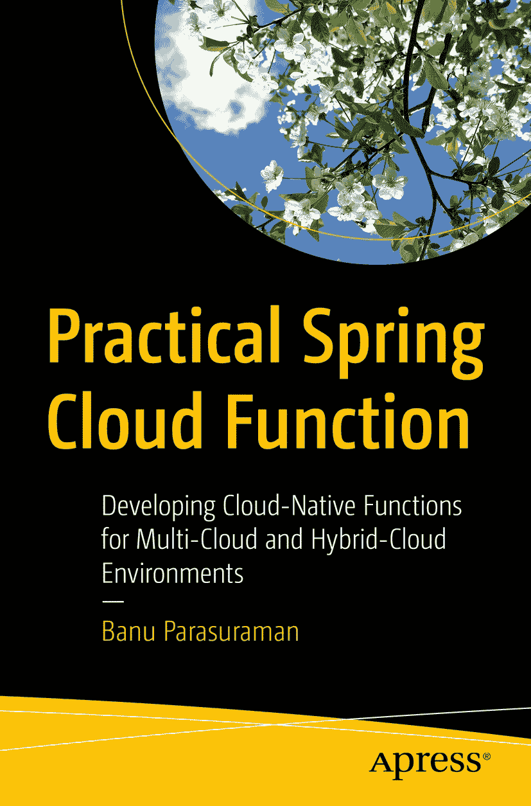

ISBN 978-1-4842-8912-9e-ISBN 978-1-4842-8913-6 [`doi.org/10.1007/978-1-4842-8913-6`](https://doi.org/10.1007/978-1-4842-8913-6) © Banu Parasuraman 2023 本作品受版权保护。所有权利（包括但不限于整体或部分内容）均专属于出版商，具体包括翻译权、重印权、使用插图的再利用权、朗诵权、广播权、微缩胶片复制权或其他任何形式的复制和传播权，以及电子适应、计算机软件或通过现在已知或将来开发的类似或不同的方法进行信息存储和检索的权利。本出版物中使用的一般描述性名称、注册名称、商标、服务标志等，并不意味着在缺乏明确声明的情况下，这些名称免受相关保护法律和法规的约束，因此可以自由用于一般用途。出版商、作者和编辑均认为本书中的建议和信息在出版时是真实且准确的。出版商、作者或编辑不对本书内容或可能存在的任何错误或遗漏提供明示或暗示的保证。出版商对出版地图和机构隶属关系中的司法主张保持中立。

本 APRESS imprint 由 Spring Nature 旗下的注册公司 APRESS Media, LLC 出版。

注册公司地址是：1 New York Plaza, New York, NY 10004, U.S.A.

*I would like to dedicate this book to my wife Vijaya and my wonderful children Pooja and Deepika, who stuck with me through the trials and tribulations during the writing of this book. I also dedicate this to my mom, Kalpana Parasuraman.*

引言

25 年前，我进入信息技术（IT）领域，此前曾在销售和营销领域工作过一段时间。我是一名普通的程序员，从未深入钻研硬核编程。在 IT 早期职业生涯中，我曾参与开发底特律老虎队的棒球模拟系统。我使用 C++帮助构建了该模拟系统的视频捕获驱动程序。尽管这是一个具有高度可见性的重大项目，但从未真正成为我成为硬核程序员的激情所在。

我很快转向了解决方案架构领域。这似乎完美地将我的营销技能与技术技能结合在一起。我开始从营销的角度审视解决方案。这种方法构成了本书写作的基础。因为，如果不知道如何在实际生活中应用技术，技术本身又有什么用呢？

函数式编程是一项新兴技术。像 AWS、Google 和 Azure 这样的云服务提供商创建了无服务器环境，通过诸如 Firecracker 虚拟化技术等创新，使基础设施可以缩放到零。这使得客户无需为未使用的资源付费，而是采用按使用付费的模式，从而获得巨大的成本节约。

最初，这些运行在无服务器环境中的函数是基于 NodeJS 或 Python 构建的。这些函数也具有厂商特定性。Spring.io 开发了 Spring Cloud Function 框架，使函数能够在云中无厂商依赖的环境中运行。重点在于“一次编写，多处部署”的理念。这在云函数领域是一个重大突破。

在撰写本书之前，我一直是 Pivotal Cloud Foundry 和 Kubernetes 的坚定倡导者。我推崇编写可移植的代码。当 Knative 在 2018 年由 IBM 和 Google 联合推出时，我感到非常兴奋。Knative 被设计为建立在 Kubernetes 之上的无服务器基础设施，使无服务器基础设施具备可移植性。结合 Spring Cloud Function 和 Knative 的威力与可移植性，你将拥有一个真正可移植的系统，具备零缩放能力。

这是我想要撰写和推广的内容。但我认为单纯讲述技术本身及其运作方式可能不够吸引人。我更想探讨人们如何在现实世界中使用这项技术。

在本书中，你将看到如何使用 Spring Cloud Function 编程和部署现实中的示例。它从在 AWS Lambda、Google Cloud Function 和 Azure Function 等无服务器环境中编写代码和部署的示例开始。然后介绍你在 Kubernetes 上的 Knative 环境。编写和部署代码是不够的，在大规模分布式环境中，自动化部署是关键。你还将通过示例了解如何自动化 CI/CD 流水线。

本书还将带你进入数据管道、人工智能/机器学习（AI/ML）和物联网（IoT）的世界。本书以石油和天然气（IoT）、制造业（IoT）和对话式 AI（零售）等现实世界的示例结束。本书涉及 AWS、Google Cloud Platform（GCP）、Azure、IBM Cloud 和 VMware Tanzu 等平台。

这些项目的代码可在 GitHub 上获取：[`github.com/banup-kubeforce`](https://github.com/banup-kubeforce)。它也提供在`github.com/apress/practical-spring-cloud-function`。这将帮助你快速掌握这些技术。因此，在完成本书后，你将拥有 AI/ML、IoT、数据管道、CI/CD 以及当然的 Spring Cloud Function 的实践经验。

我希望你能享受阅读和编写本书的过程。

致谢

能够撰写这本书并帮助你理解 Spring Cloud Function 在现实中的应用，对我来说是一种极大的荣幸。感谢你的阅读。

在 SpringOne 2020 的演讲后，我收到了来自 APRESS 的 Steve Anglin 在 LinkedIn 上的消息。他问我是否愿意撰写一本关于 Spring Cloud Function 的书。起初，我有些犹豫，因为当时我正忙于许多客户项目，占据了大部分工作时间。我担心由于对客户的专注，无法充分展现这个主题。但经过长时间的思考和与家人的深入讨论后，我决定接受这个挑战。

我想感谢 Steve Anglin，作为副主编，他联系了我并给了我撰写这本书的机会。

编辑运营经理 Mark Powers 在本书的完成过程中起到了关键作用。他不断督促和鼓励，帮助我完成了整个项目。谢谢，Mark。

技术审校者 Manuel Jordan 提供了极大的帮助。他的评论让我保持诚实，避免偷工减料。他帮助提升了我在这本书中呈现的解决方案的质量。谢谢，Manuel。

我也要感谢 APRESS 的 Nirmal Selvaraj 和其他同事，他们协助将这本书完成。

没有我妻子 Vijaya 和女儿们 Pooja 和 Deepika 在这一旅程中给予的必要情感支持，这本书是不可能完成的。

关于作者 关于技术审校者

