# 1. 为什么使用 Spring Cloud Function

本章通过一个示例用例——人力资源管理系统（HRM）来探讨 Spring Cloud Function。重点在于企业内部的系统。本章涉及 FaaS（函数即服务）概念，并解释它在企业中的发展趋势。本章还深入探讨其在云环境中的实现。你将了解代码和容器层面存在的可移植性问题，并阅读有关 Knative 在 Kubernetes 上的实现等概念，其中包括容器可移植性。你还将学习 Spring Cloud Function 在 AWS、GCP、Azure、VMware Tanzu 和 Red Hat OpenShift 等平台上的高级实现。

## 1.1 无服务器函数（FaaS）

FaaS 是一种革命性技术。它为开发者和企业带来了巨大价值。FaaS 通过使开发团队能够以“高”速度开发产品和功能，帮助企业快速适应不断变化的业务需求，从而提升其平均市场响应时间（MTTM）。开发者可以专注于函数开发，无需担心底层基础设施的搭建、配置或维护。FaaS 模型还设计为仅使用适量的基础设施和计算时间。它们还可以通过按调用次数计费而非按运行时间计费来精确满足需求。FaaS 包含两个部分，如图 1-1 所示。

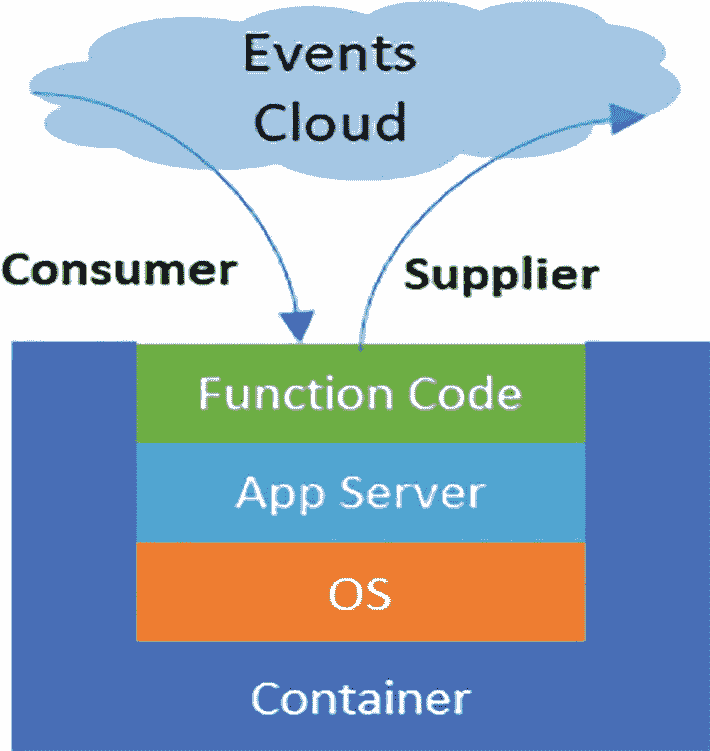

一幅示意图展示了一个容器，其中包含函数代码、应用服务器和操作系统。事件云从消费者流向容器，容器将数据流向事件云。

图 1-1

FaaS 组件架构

*   函数代码封装了任何语言的业务逻辑，例如 Java、C#、Python、Node 等。

*   底层容器承载了应用服务器和操作系统。

### 1.1.1 企业应用的实现

想象一下在云上运行单个薪资系统所需的所有基础设施。该应用程序可能仅消耗 16GB 的 RAM 和八核 vCPU，但您会为其整个运行时间持续付费。根据简单的 AWS 计价公式，这每年大约需要 1000 美元。这种成本涵盖了应用程序整个运行期间，无论是否被使用。当然，您可以通过总拥有成本（TCO）计算来证明其合理性，这有助于您确定应用程序如何为公司创造收入或价值以抵消成本。这种收入生成模式更适合为公司创造收入的应用程序，例如电商平台。但对于运行在企业后端的支持性应用程序，证明其对公司的价值则更为困难。

### 1.1.2 应用组合的迁移投资回报率

如果您计划将企业中大量应用程序迁移到云上，价值计算公式会变得更加复杂。

假设您作为公司的首席技术官（CTO）或首席信息官（CIO），拥有约一千个应用程序的组合并计划迁移到云上。在众多因素中，需要重点考虑的包括：

*   当前支持这些应用程序的基础设施是什么？

*   这些应用程序的利用率如何？

应用程序的利用率是决定其价值的关键因素之一。请考虑以下情况——在分析应用程序利用率后，您会发现该组合的分布如下：

*   10%的应用程序利用率高达 80%

*   40%的应用程序利用率约为 50%

*   50%的应用程序利用率仅为 20%

如果使用 AWS 成本计算器计算计费成本，您会发现每年需要花费 100 万美元。这笔支出涵盖了关键且高利用率的应用程序，以及利用率极低的应用程序。这种成本源于云服务提供商对应用程序整个运行期间消耗基础设施的计费方式。关键在于，基础设施在整个应用程序生命周期中都被完全分配。试想一下，如果仅在应用程序运行并提供服务期间分配基础设施，您能节省多少成本？这将是一种极佳的成本和资源节约方案。云服务提供商已经考虑到这一点，因为他们也面临有限的基础设施压力，并评估了额外基础设施配置所需的时间。

### 1.1.3 无服务器函数概念

为解决有限基础设施利用率的问题，AWS 创建了 Lambda 无服务器函数。这是个天才的发明。该服务的订阅者只需为应用程序被调用的时间付费。当未被调用时，基础设施不会被分配。这样，AWS 可以通过将基础设施重新分配给其他需要的应用程序，从而节省成本并将其节约传递给客户。这是一种双赢模式。值得思考的是，您是否可以将这种方案应用于公司当前的所有企业应用程序？您将能够节省大量资金。此外，如果将这项技术引入数据中心，您也能获得 AWS 所实现的相同效益。这不是非常棒吗？

### 1.1.4 将无服务器函数概念应用于企业应用程序

让我们深入探讨函数的概念以及 AWS 如何实现基础设施节约的魔力。函数是包含单一输入和单一输出的微型代码片段，并通过一个处理层（谓词）作为粘合剂。这与企业应用程序形成对比，后者被设计为执行多种功能。以一个简单的薪资系统为例。薪资系统包含多个输入接口和多个输出接口。以下是一些示例接口：

*   时间卡系统以获取员工每月的工作时长

*   绩效评估系统

*   同事反馈系统

*   通货膨胀调整计算器系统

*   向美国国税局（IRS）的输出接口

*   向医疗保险提供商的输出接口

*   向内部网络门户的输出接口（员工可在此下载工资单）

运行此类薪资应用程序并不简单。我曾见过这样的薪资系统使用以下配置：

*   十四个专用中间件应用服务器

*   两个关系型数据库管理系统（RDBMS）数据库存储

*   两个集成工具（如消息队列和 FTP）

*   四个专用裸金属服务器，每个服务器配置为 128GB RAM、32 核 CPU、4TB HDD 和 10TB vSAN 等

确定此类应用程序是否可以部署在 Lambda 等无服务器函数基础设施上的关键因素是应用程序的启动时间（冷启动时间）和关闭时间。启动和关闭时间越短，成本节约就越大。

此外，这些时间必须足够短，以避免造成中断。如果您研究大型企业应用程序（如薪资系统）的启动时间，会发现情况并不乐观。所有组件的平均启动时间约为 15 分钟，应用程序关闭时间需要另外 15 分钟。这种延迟显然不可接受。试想一下，如果将此类应用程序部署到 AWS Lambda 无服务器函数，每次调用都需要 30 分钟的停机时间？这显然行不通。您的用户会完全放弃该应用程序。正如您所看到的，大型应用程序无法从资源释放和重新分配中获益，因为它们启动和关闭时间过长，这将影响应用程序的整体运行。

您能让这个大型薪资系统以符合无服务器函数预期的方式运行吗？答案是肯定的。虽然需要大量重构，但这是可以实现的。

#### 云中的无服务器函数

所有云服务提供商现已将其无服务器函数整合到基础设施服务中。AWS 提供 Lambda 函数，Google 提供 Cloud Functions，Azure 提供 Azure Functions。这些提供商在追求让客户依赖其服务的过程中，确保在其环境中引入了专有元素。运行函数所需的两个核心组件是：

*   提供函数服务的无服务器函数代码

*   支持代码的无服务器基础设施（容器）

#### 为什么无服务器函数需要是非专有的？

企业正逐渐转向多云、混合云的云策略。如图 1-2 所示，对 3000 名全球受访者的调查表明，76%的企业已经在多云环境中开展工作。这意味着它们不再局限于单一云服务商。采用多云策略可以缓解供应商锁定的风险。

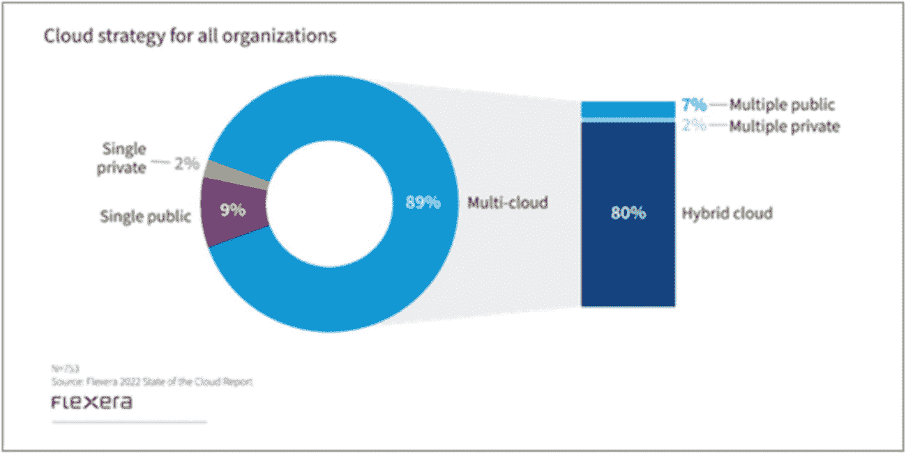

一个圆形图展示了所有组织的云策略。2%为单一私有云，9%为单一公有云，89%为多云。多云部分进一步细分为 80%混合云、7%多公有云、2%多私有云。

图 1-3

多云采用报告 来源：*https://info.flexera.com/CM-REPORT-State-of-the-Cloud?lead_source=Website%20Visitor&id=Blog*

在多云世界中，企业必须订阅能够轻松在云之间迁移的服务。这对于标准化服务尤为重要。

FaaS（无服务器函数）近期已成为一种标准化服务，所有提供商都围绕 FaaS 提供了相关服务。因此，FaaS 容器必须避免包含专有代码。

当无服务器函数不使用专有代码时，它们才能实现可移植性。可移植的无服务器函数允许工作负载在云之间迁移。例如，如果 AWS Lambda 函数成本高昂而 Azure Functions 成本较低，企业可以轻松利用成本优势，将 Lambda 工作负载迁移到 Azure Functions。

后续章节将详细探讨这些可移植性问题，并解释如何解决它们。

## 1.2 代码可移植性问题

清单 1-1 展示了使用 Java 编写的 AWS Lambda 示例代码。这段代码是通过 AWS SAM（Serverless Application Model）模板生成的。观察代码可以发现，AWS 特定的库引用和方法调用将代码绑定到了 AWS。虽然这部分内容不多，但其影响非常显著。在企业中，通常会有数百甚至数千段此类代码，若要将其迁移到其他云服务商，必须进行重构。这是一项昂贵的操作。

清单 1-1. 使用 AWS SAM 框架的示例代码

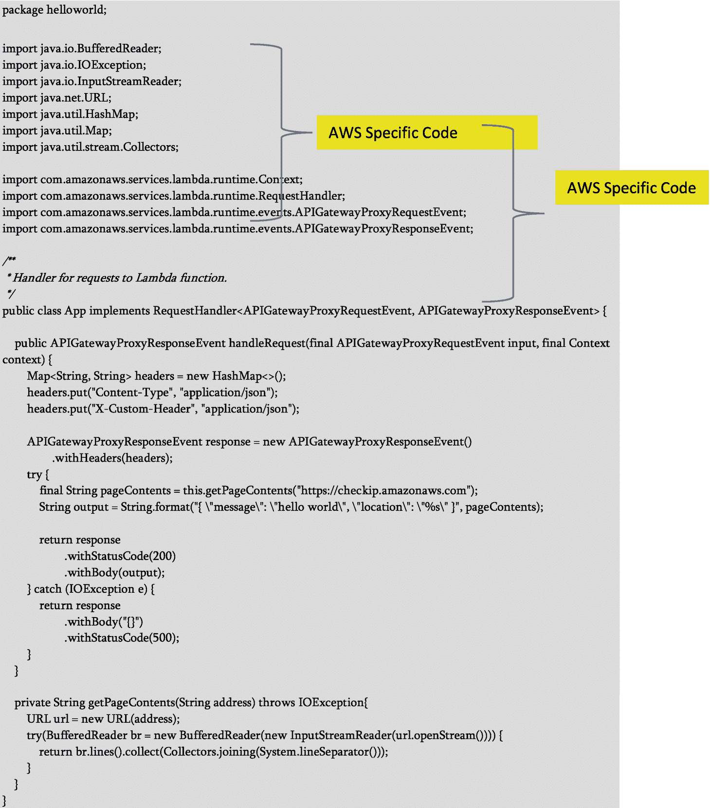

亚马逊网络服务的无服务器应用模型框架。包名为 HelloWorld。它描述了亚马逊网络服务特定的代码和方法调用，这些将代码绑定到亚马逊网络服务。

下一节将探讨底层无服务器容器的可移植性问题，这会影响多云迁移的实施方式。

### 1.2.1 无服务器容器可移植性问题

Lambda 底层的无服务器框架如何？它是否具有可移植性？

深入研究 AWS Lambda 会发现，其使用的虚拟化技术是 Firecracker。Firecracker 基于 KVM（基于内核的虚拟机）创建和管理微虚拟机。您可以在 [`aws.amazon.com/blogs/aws/firecracker-lightweight-virtualization-for-serverless-computing/`](https://aws.amazon.com/blogs/aws/firecracker-lightweight-virtualization-for-serverless-computing/) 查阅更多关于 Firecracker 的信息。

Firecracker 的极简设计原则使其具备快速启动和关闭的特性。另一方面，Google Cloud Functions 使用 gVisor 技术，且不兼容 Firecracker。gVisor 是容器的应用内核。更多信息请访问 [`github.com/google/gvisor`](https://github.com/google/gvisor)。

Azure Functions 则采用完全不同的方法，以 PaaS 服务 App Service 作为其基础。因此，您可以看到主要云服务商都使用自己的框架来管理函数容器。这使得函数在多云环境中的迁移变得困难。由于容器层缺乏可移植性，这一可移植性问题更加突出。

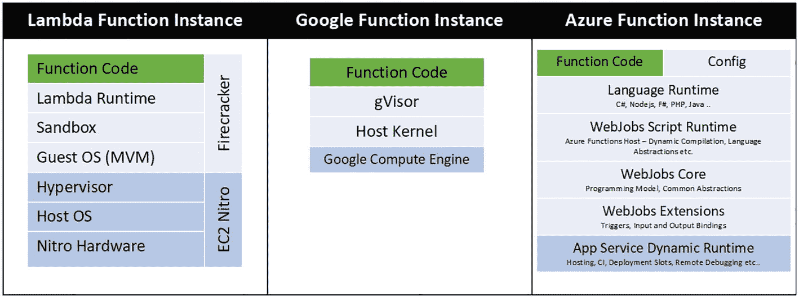

一个比较表格。Lambda 的函数代码包括 Lambda 运行时、沙箱、客户操作系统。对于 Google，包含 gVisor、主机内核和 Google 计算引擎。对于 Azure，部分包含语言运行时和 Web 作业脚本运行时。

图 1-3

无服务器架构比较

您可以看到，代码和容器都与提供商相关，且难以实现可移植性。

到目前为止的讨论中，您已了解与 FaaS 相关的以下问题：

* 代码的可移植性  
* 无服务器容器的可移植性  
* 无服务器环境的冷启动

如何解决这些问题？

引入 Spring Cloud Function 和 Knative。Spring Cloud Function 解决函数代码的可移植性问题，而 Knative 解决容器的可移植性问题。

关于 Spring Cloud Function 的信息请访问 [`spring.io/projects/spring-cloud-function`](https://spring.io/projects/spring-cloud-function)，关于 Knative 的信息请访问 [`knative.dev/docs/`](https://knative.dev/docs/)。

后续章节将深入探讨这些主题。

## 1.3 Spring Cloud Function：一次编写，部署到任意云平台

正如你从之前的讨论中所学到的，为 AWS Lambda、Google Cloud Functions 或 Azure Functions 编写函数是一种专有操作。你必须为超大规模云服务提供商编写特定的代码。超大规模云服务提供商指的是像 AWS、Google 或 Azure 这样的大型云平台，它们拥有完整的硬件和设施组合，能够扩展到数千台服务器。如果你的策略是建立与单一超大规模云服务提供商的强关联关系，这种做法并不算坏，但随着时间推移，当你的策略转变为混合云或多云时，你可能需要重新思考你的方法。

> *混合云由私有云和公有云组成，并作为一个整体进行管理。多云包含多个公有云，不包含私有云组件。*

这就是 Spring Cloud Function 的用武之地。Spring.io 团队启动 Spring Cloud Function 项目时设定了以下目标：

* 通过函数实现业务逻辑的推广。

* 将业务逻辑的开发生命周期与任何特定运行时目标解耦，使得相同代码可以作为 Web 端点、流处理器或任务运行。

* 支持跨无服务器提供商的统一编程模型，以及能够独立运行（本地或 PaaS 环境）的能力。

* 在无服务器提供商上启用 Spring Boot 特性（自动配置、依赖注入、指标监控）。

来源：[`spring.io/projects/spring-cloud-function`](https://spring.io/projects/spring-cloud-function)

关键目标包括与特定运行时解耦，并支持跨无服务器提供商的统一编程模型。

这些目标是如何实现的呢？

* 使用 Spring Boot

* 为 Function<T, R>（Predicate）、Consumer<T>和 Supplier<T>提供包装 Bean

* 通过适配器将函数打包部署到目标平台，如 AWS Lambda、Azure Functions、Google Cloud Functions 和 Knative

* Spring Cloud Function 的另一个令人兴奋的特点是它使函数能够在本地执行。这允许开发者在无需部署到云平台的情况下进行单元测试

图 1-4 和图 1-5 展示了如何部署 Spring Cloud Function。当 Spring Cloud Function 与特定库捆绑时，它可以部署到 AWS Lambda、Google Cloud Functions 或 Azure Functions。

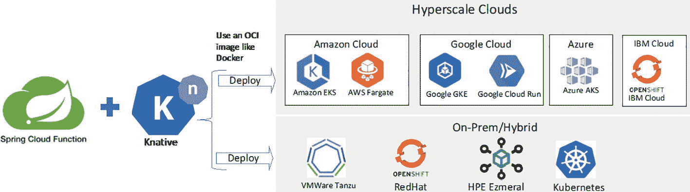

模型图描述了 spring cloud function 与 K native 的部署方式。它被部署到超大规模云平台以及本地或混合云环境。

图 1-5

在云提供商提供的 Kubernetes 环境中部署 Spring Cloud Function 到 Knative serverless

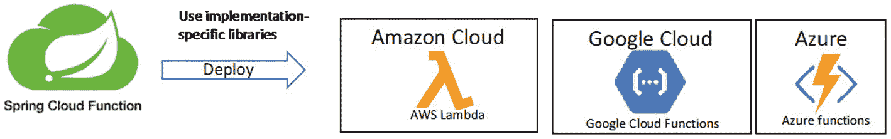

模型图描述了 spring cloud function 的部署。使用特定实现库，spring cloud function 被部署到 Amazon 云、Google 云和 Azure。

图 1-4

直接将 Spring Cloud Function 部署到云提供商提供的 FaaS 环境

当 Spring Cloud Function 在 Knative 中容器化时，它可以部署到任何 Kubernetes 环境，无论是云平台还是本地环境。这是在混合云和多云环境中部署的首选方式。

## 1.4 Project Knative 与可移植的无服务器容器

拥有可移植的无服务器容器同样重要。这可以最小化在云平台之间迁移所需的复杂性和时间。在云平台之间迁移以利用折扣定价，能够大幅节省成本。一种使用的方法称为*云爆发*（图 1-6）。云爆发通过向云平台添加资源来弥补本地缺乏基础设施的问题。这通常是混合云的一个特性。

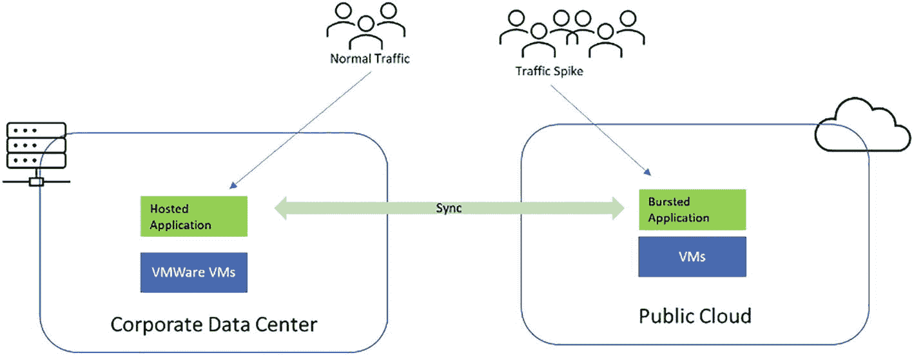

模型图描述了正常流量流向托管应用程序，流量激增时流向爆发应用程序。企业数据中心和公有云与托管和爆发应用程序同步。

图 1-6

云爆发

图 1-6 显示，当流量激增时，为了弥补私有云资源不足的问题，资源会被分配到公有云平台，流量会被路由到那里。当流量激增结束后，公有云资源会被移除。这使得成本和资源的使用更加精准——即仅在流量激增期间使用额外资源。像黑色星期五购物节这样的电商活动期间的活动激增是一个很好的流量激增示例。

仅靠可移植代码无法轻松实现这一点。你需要的不仅是可移植的代码，还需要可移植的容器。这样，容器才能跨云边界迁移以应对流量激增。在图 1-6 中，你可以看到 VMware 的虚拟机被用作容器。由于数据中心和云平台中托管的虚拟机在结构上相似，因此云爆发成为可能。

将这一概念应用于函数即服务（FaaS），你需要一种新的方法来实现底层无服务器容器的可移植性。

云函数领域的一种革命性方法是 Knative。下一节将深入探讨 Knative。

### 1.4.1 容器、无服务器平台与 Knative

为何需要容器/无服务器平台？

在 IT 发展的过程中，需要对运行中的进程进行安全隔离。在 90 年代初期，基于 chroot jail 的隔离允许开发者创建和托管软件系统的虚拟化副本。2008 年引入了 Linux Containers（LXC），为开发者提供了虚拟化环境。2011 年 Cloud Foundry 引入了容器的概念，2019 年通过 Warden 实现了容器编排。2013 年推出的 Docker 提供了可以托管任何操作系统的容器。2014 年推出的 Kubernetes 提供了基于 Docker 的容器编排能力。最终，2018 年推出的 Knative 扩展了 Kubernetes，使其能够运行无服务器工作负载。

无服务器工作负载（Knative）的出现源于帮助开发者快速创建和部署应用程序的需求，而无需担心底层基础设施。无服务器计算模型负责资源的配置、管理、调度和补丁，使云提供商能够实现“按资源使用付费”的模式。

借助 Knative，你可以在任何 Kubernetes 环境中运行可移植的无服务器容器。这使得 FaaS 在多云或多混合云环境中具备可移植性。

除了提升开发者的生产力，无服务器环境还提供了更快的部署速度（参见图 1-7）。开发者可以采用“快速失败、频繁失败”的模式，更快地启动或关闭代码和基础设施，这有助于推动快速创新。

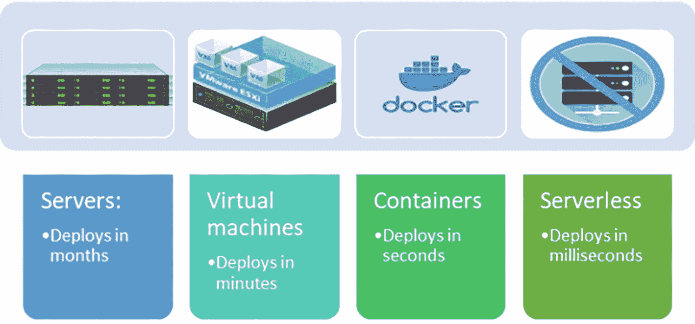

模型图描述了服务器在月度部署、虚拟机在分钟级部署、容器在秒级部署、无服务器在毫秒级部署。

图 1-7

无服务器部署速度最快

### 1.4.2 什么是 Knative？

Knative 是 Kubernetes 的扩展，使无服务器工作负载能够在 Kubernetes 集群上运行。与 Kubernetes 工作相比，开发人员将代码从 IDE 部署到 Kubernetes 的过程中需要的工具数量庞大，这与 Kubernetes 所宣称的环境敏捷性背道而驰。Knative 通过 Kubernetes 原生的提供者操作符自动完成构建包和部署到 Kubernetes 的过程。因此，名称中包含“K”和“Native”。

Knative 有两个主要组件：

*   *服务（Serving）*：提供组件，使无服务器容器能够快速部署，自动扩展和实现时间点快照功能

*   *事件驱动（Eventing）*：通过提供从生产者到订阅者/接收器的事件路由工具，帮助开发人员使用事件驱动架构

您可以在 [`​Knative.​dev/​docs`](https://Knative.dev/docs) 了解更多关于 Knative 的信息。

## 1.5 示例用例：薪资应用程序

让我们看看如何将无服务器函数应用于现实中的例子。

我们在本章开头介绍了薪资应用程序，现在将在此基础上进行扩展。考虑一个如图 1-8 所示的薪资应用程序配置。

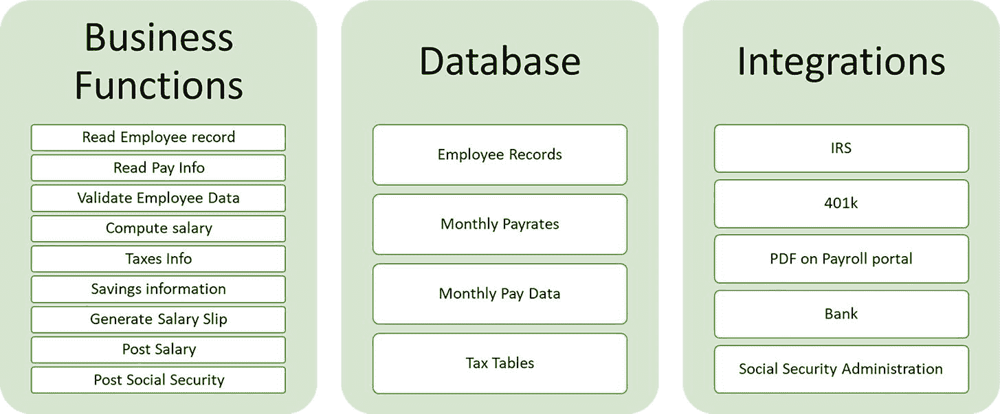

一张表格描述了业务功能数据库和集成。其中一些功能涉及读取员工记录数据库中的员工记录和支付信息，而集成部分则涉及 I R S。

图 1-8

薪资应用程序组件

图 1-9 显示了该配置。

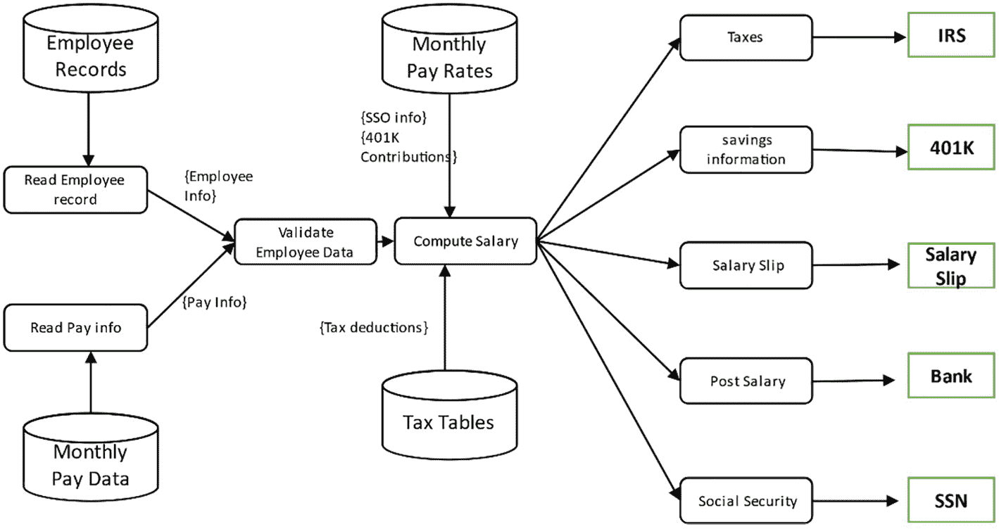

一个流程图描述了员工记录和月度薪资数据流，用于验证员工数据以计算薪资。月度薪资率和税率表用于计算薪资，其中包含部分税收和储蓄信息。

图 1-9

薪资应用程序流程

将此流程图转换为可在企业数据中心部署的实际实现，结果如图 1-10 所示。您会发现这些函数被开发为通过批量模式执行的 REST API。这些 REST API 暴露了 SAP ECC 薪资模块。这些 REST API 每 15 天作为批量作业运行。数据库托管在 Oracle 上，集成通过 IBM API Connect (APIC) 暴露。请注意，这不是按需流程，当空闲时可能会消耗大量资源。由于 SAP NetWeaver 组件启动时间通常在 JVM 配置不同情况下为 2 到 15 分钟，这些 REST API 无法轻易关闭和启动。这些应用程序组件必须持续运行，以防止薪资应用程序崩溃。

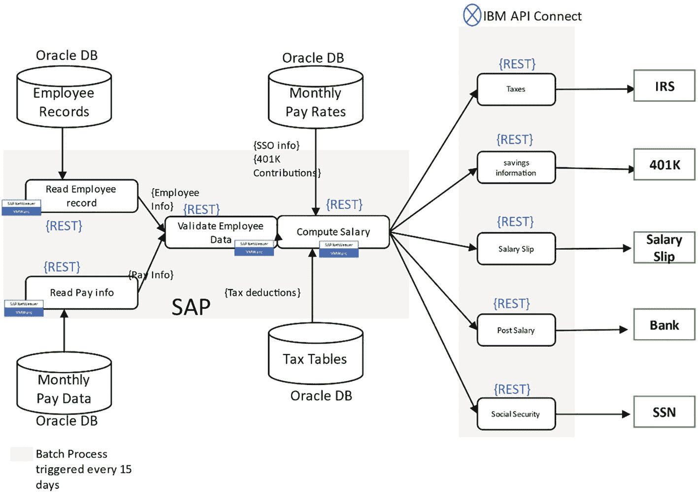

架构图描述了 Oracle 数据库中的员工记录关系型数据库和月度薪资数据流，用于验证员工数据以计算薪资。月度薪资率和税率表用于计算薪资。

图 1-10

当前薪资架构

使用此用例，后续章节将探讨如何利用 Spring Cloud Function 将此应用程序现代化并转换为一个高效、可扩展且可移植的系统。

## 1.6 Spring Cloud Function 支持

Spring Cloud Function 几乎在所有云服务中都得到支持，如表 1-1 所示。

表 1-1

云提供商对 Spring Cloud Function 的支持情况

| AWS | Azure | Google | IBM Cloud | 本地部署 |
| --- | --- | --- | --- | --- |
| Lambda | Azure Functions | Cloud Functions | IBM Functions | Tanzu with Knative |
| EKS with Knative | AKS with Knative | GKE with Knative | Tanzu with Knative | OpenShift with Knative |
| Fargate with Knative | ARO with Knative | OpenShift with Knative | OpenShift with Knative | 任何支持 Knative 的 Kubernetes 服务 |
| ROSA with Knative | Tanzu with Knative | Tanzu with Knative | IBM Kubernetes with Knative |   |
| Tanzu with Knative |   |   |   |   |

缩写说明：ROSA: AWS 上的 Red Hat OpenShift；ARO: Azure Red Hat OpenShift；EKS: Elastic Kubernetes Services；AKS: Azure Kubernetes Services；GKE: Google Kubernetes Engine

### 1.6.1 在 AWS Lambda 上的 Spring Cloud Function

将本地部署的应用程序转换为利用 AWS Lambda 环境并实现可移植性，需要编写抽象掉 AWS Lambda 硬依赖的函数代码。此示例使用 Spring Cloud Function 作为函数代码框架，Lambda 作为容器。通过使用 Spring Cloud Function 一次编写，您可以利用后续章节中讨论的 DevOps 流水线将应用程序部署到其他无服务器环境。图 1-11 展示了 AWS 及其组件如何帮助在云中实现薪资应用程序。

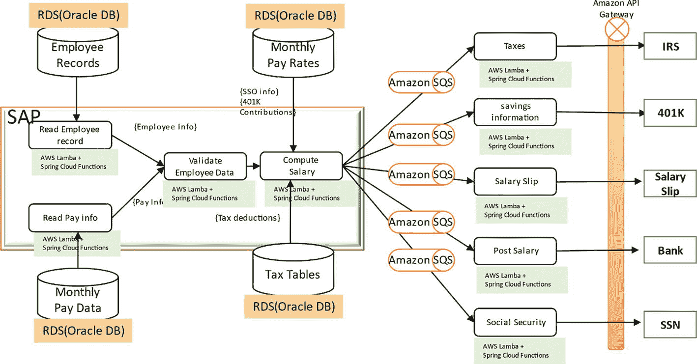

架构图描述了员工详细信息的关系型数据库和月度薪资数据流，用于验证员工数据以计算薪资。薪资率和税率通过 Amazon S Q S 流向 Spring Cloud Function。

图 1-11

在 AWS 上的 Spring Cloud Function

现在需要在 AWS Lambda 上部署薪资系统。部署顺序很重要，您需要先部署 SAP ECC 和 Oracle 数据库，然后进行集成并配置 API 和消息传递以与 SAP 集成。Spring Cloud Function 可以使用虚拟数据进行创建和测试，但必须在与 SAP ECC 的集成测试后部署：

1.  在 AWS EC2 实例上部署 SAP ECC。

2.  将 Oracle DB 部署为 RDS 实例。

3.  配置 SAP 与 Oracle 的集成。

4.  在 AWS 上部署 Spring Cloud Function。

5.  设置 Amazon API 网关。

6.  设置 Amazon SQS 用于消息传递。

### 1.6.3 Google Cloud Functions 上的 Spring Cloud Function

Google Cloud Functions 提供了一种云替代方案，用于 AWS Lambda 函数。虽然 Google Cloud Functions 的推出时间晚于 Lambda，但借助 Anthos 战略，它正在迅速占据函数计算领域的重要地位。Spring.io 与 Google 紧密合作，使 Spring.io 组件能够无缝集成到 Google Cloud 组件中。

要在 Google Cloud Functions 上部署薪资系统，请按照此处描述的流程（见图 1-13）操作：在开发和部署 Spring Cloud Function 之前，确保 SAP ECC 和 Oracle 数据库已启动并完成集成：

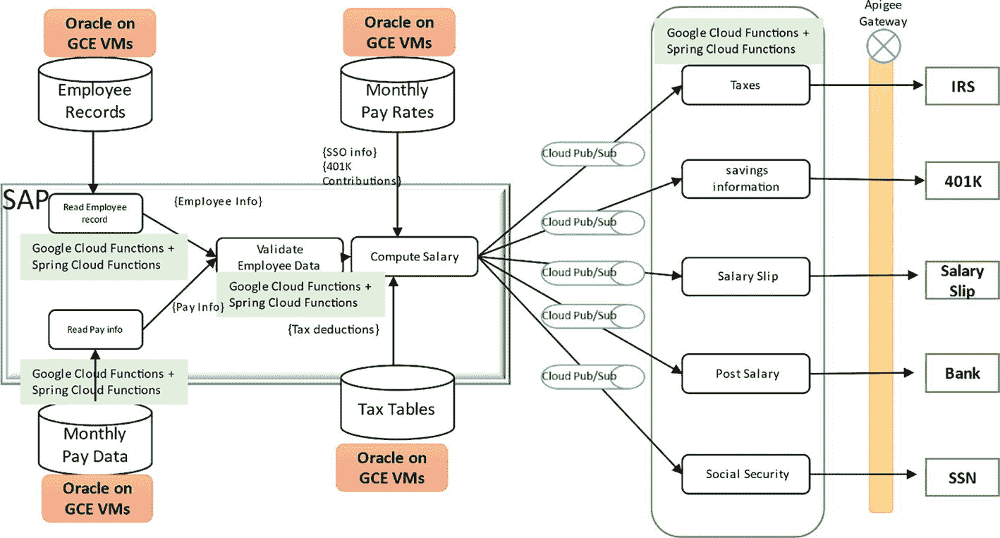

架构图描述了 Oracle 数据库在 GCE VMs 上处理员工详细信息的流程，从验证到计算薪资。数据流通过云 Pub/Sub 平台传输至 Spring Cloud Function。

图 1-13

Google Cloud Functions 上的 Spring Cloud Function

1. 将 SAP ECC 部署到 GCE。
2. 在 GCE VMs 上部署 Oracle 数据库，因为 GCP 上没有类似 AWS RDS 的服务。
3. 配置 SAP 与 Oracle 的集成。
4. 设置 Google Cloud Functions 项目。
5. 将 Spring Cloud Function 部署到 Google Cloud Functions。
6. 在 GCP 上部署 Apigee 以托管函数 API。
7. 设置 Google Cloud Pub/Sub 消息平台。

### 1.6.4 Knative 和 GCP 上的 GKE

如前所述，Knative 是一种实现函数可移植性的方法。顺便提及的是，Knative 是由 Google 创建的。在 GCP 上，您可以将 Knative 部署在 GKE（Google Kubernetes Engine）上，这是 Google 提供的 Kubernetes 引擎。

要在 GCP GKE 上部署薪资系统，请按照此处描述的流程（图 1-14）操作：在开发和部署 Spring Cloud Function 之前，确保 SAP ECC 和 Oracle 数据库已启动并完成集成：

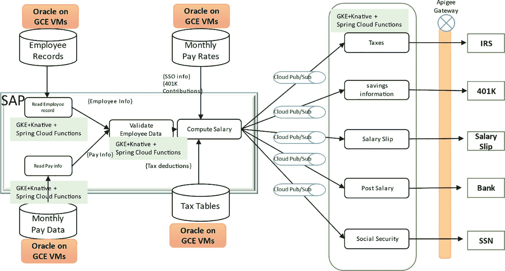

架构图描述了 Oracle 数据库在 GCE VMs 上处理员工详细信息的流程，从验证到计算薪资。薪资率和税收数据流经验证后计算薪资。数据流通过云 Pub/Sub 平台传输至 Spring Cloud Function。

图 1-14

GCP 上的 Knative Spring Cloud Function

1. 将 SAP ECC 作为 Docker 镜像部署到 GKE 集群。
2. 将 Oracle 数据库作为 Docker 镜像部署到 GKE 集群。
3. 配置 SAP 与 Oracle 的集成。
4. 在 GKE 集群中配置 Knative。
5. 将 Spring Cloud Function 部署到 Knative。
6. 设置 Apigee API 网关。
7. 在 GKE 上设置 RabbitMQ 用于消息传递。

### 1.6.5 Azure Functions 上的 Spring Cloud Function

部署在 Azure Functions 上的 Spring Cloud Function 由于显式使用 Azure Function Invoker 类，因此不具备可移植性。虽然 Lambda 和 Google Cloud Functions 需要修改 Pom.xml（如果使用 Maven），但 Azure 需要额外的类。这使得其可移植性较低。如果您有一千个在 AWS 上运行的 Spring Cloud Function 需要迁移到 Azure，必须进行大量开发工作，这会带来显著的中断。

要在 Azure Functions 上部署薪资系统，请按照此处描述的流程（见图 1-15）操作：在开发和部署 Spring Cloud Function 之前，确保 SAP ECC 和 Oracle 数据库已启动并完成集成：

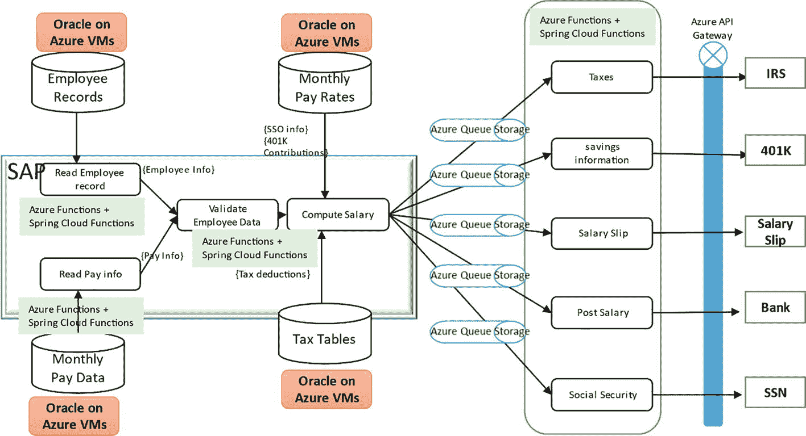

架构图描述了 Oracle 数据库在 Azure VMs 上处理员工详细信息的流程，从验证到计算薪资。数据流通过 Azure 队列传输至 Azure Function 加上 Spring Cloud Function。

图 1-15

Azure 上的 Spring Cloud Function

1. 在 Azure VMs 上部署 SAP ECC。
2. 在 Azure VMs 上部署 Oracle 数据库。
3. 配置 SAP 与 Oracle 的集成。
4. 配置 Azure Functions。
5. 将 Spring Cloud Function 部署到 Azure Functions。
6. 在 Azure 上设置 Azure API 网关。
7. 在 Azure 上设置 Azure 队列存储用于消息传递。

### 1.6.6 Knative 和 Azure AKS 上的 Spring Cloud Function

在 Azure AKS 上部署 Knative 是唯一能让 Spring Cloud Function 在 Azure 上实现可移植性的选项。如同任何 Kubernetes 实现一样，它需要 Knative 的实现来运行函数。将薪资应用迁移到 AKS 需要一个 AKS 集群。

要在 Azure AKS 环境中部署薪资系统，请按照此处描述的流程（图 1-16）操作：在开发和部署 Spring Cloud Function 之前，确保 SAP ECC 和 Oracle 数据库已启动并完成集成：

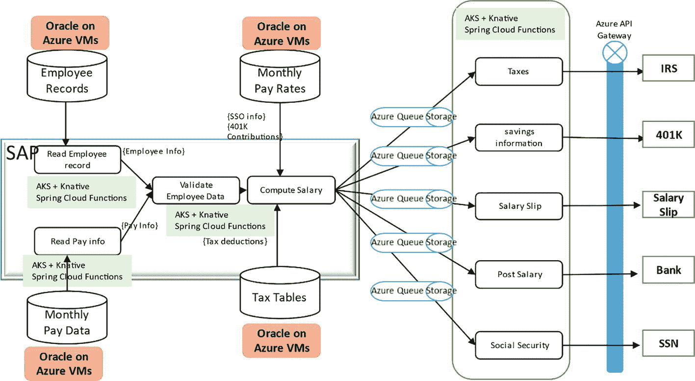

架构图描述了 Oracle 数据库在 Azure VMs 上处理员工详细信息的流程，从验证到计算薪资。数据流通过 Azure 队列存储传输至 AKS 加上 Knative 的 Spring Cloud Function。

图 1-16

Azure 上的 Knative Spring Cloud Function

1. 在 Azure VMs 上部署 SAP ECC 作为 Docker 镜像。
2. 在 Azure VMs 上部署 Oracle 数据库作为 Docker 镜像。
3. 配置 SAP 与 Oracle 的集成。
4. 在 AKS 集群中配置 Knative。
5. 将 Spring Cloud Function 部署到 Knative。
6. 在 AKS 上设置 Spring Cloud 网关作为 API 网关。
7. 在 AKS 上设置 RabbitMQ 用于消息传递。

### 1.6.7 VMware Tanzu（TKG, PKS）上的 Spring Cloud Function

VMware Tanzu 是 Pivotal Cloud Foundry（PCF）的演进版本。熟悉 PCF 的用户应该了解“cf push”的体验。这是一种一键式资源分配方法，在开发者社区中非常流行。Knative 通过其 Knative 构建功能提供了类似体验。要将薪资应用迁移到 VMware Tanzu，需要使用 Tanzu Kubernetes Grid（TKG）。TKG 基于 Kubernetes 主分支代码构建，可以在本地和云端部署，支持多云或混合云策略。您可以通过提供商市场订阅服务，在 AWS、Azure 或 Google 上启动 TKG 实例。

在数据中心中，您需要一组服务器或类似 VxRail 的超融合基础设施，并配备 PRA（Pivotal Ready Architecture）。您还需要将 vSphere 升级到版本 7。

回到薪资应用，您需要按照此处描述的流程（图 1-17）操作：在开发和部署 Spring Cloud Function 之前，确保 SAP ECC 和 Oracle 数据库已启动并完成集成：

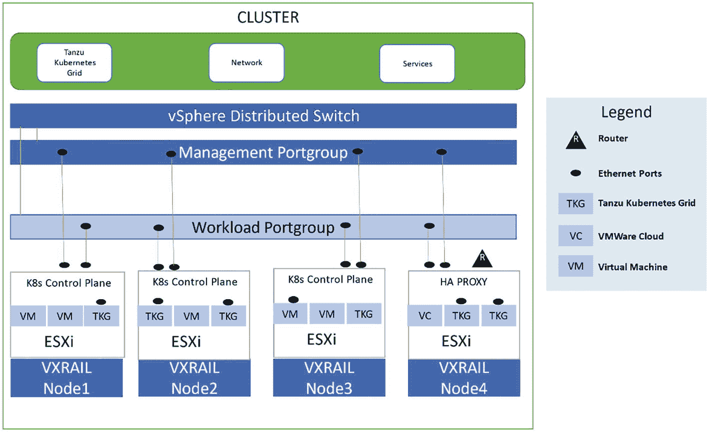

图表描述了集群。它包含 Tanzu Kubernetes Grid、网络和服务。通过管理端口组和工作负载端口组的 vSphere 分布式交换机连接到 K8s 控制平面。

图 1-18

带有 HAProxy 的四节点 VxRail P570F 集群用于 vSphere with Tanzu

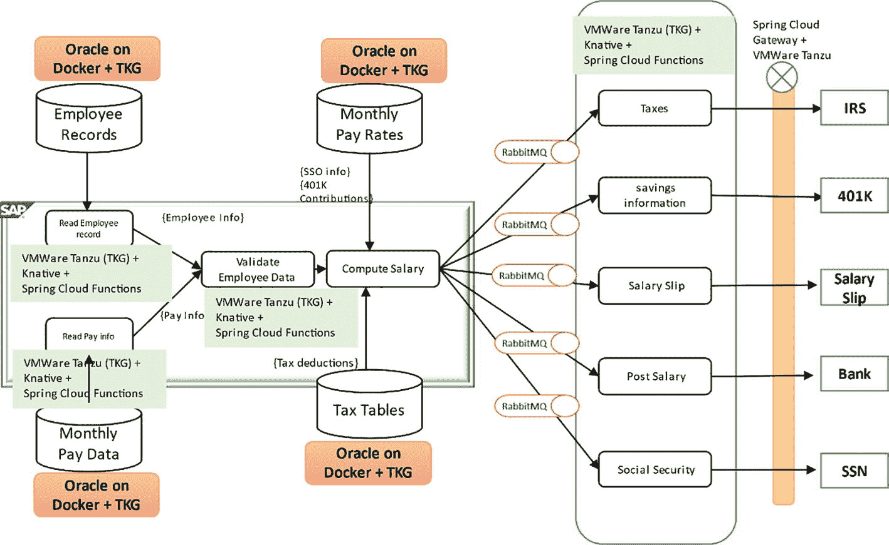

架构图描述了 Oracle 数据库在 Docker 加上 TKG 上处理员工详细信息的流程，从验证到计算薪资。数据流通过 RabbitMQ 传输至 TKG 加上 Knative 的 Spring Cloud Function。

图 1-17

TKG 上的 Spring Cloud Function

1. 将 SAP ECC 作为 Docker 镜像部署到 TKG。
2. 将 Oracle 数据库作为 Docker 镜像部署到 TKG。
3. 配置 SAP 与 Oracle 的集成。
4. 在 TKG 集群中配置 Knative。
5. 将 Spring Cloud Function 部署到 Knative。
6. 在 TKG 上设置 Spring Cloud 网关作为 API 网关。
7. 在 TKG 上设置 RabbitMQ 用于消息传递。

### 1.6.8 Spring Cloud Function 在 Red Hat OpenShift (OCP)上部署

Red Hat OpenShift 可以作为部署 Spring Cloud Function 的本地选项。与任何 Kubernetes 实现一样，它需要实现 Knative 才能运行函数。OpenShift 拥有自己的无服务器实现，称为 OpenShift serverless。将薪资系统应用程序转换为 OpenShift 需要一个 OpenShift 集群。

要将薪资系统部署到 VMware vSphere 环境上的 OpenShift，需遵循以下流程。首先确保 SAP ECC 和 Oracle DB 已启动并集成，然后再在 Knative 上开发和部署 Spring Cloud Function：

1.  将 SAP ECC 作为 Docker 镜像部署到 OpenShift 集群中。
2.  将 Oracle DB 作为 Docker 镜像部署到 OpenShift 集群中。
3.  配置 SAP 与 Oracle 的集成。
4.  在 OpenShift 集群中配置 Knative。
5.  将 Spring Cloud Function 部署到 Knative。
6.  在 OpenShift 上设置 Red Hat 3scale API 网关。
7.  在 TKG 上设置 RabbitMQ 用于消息传递。

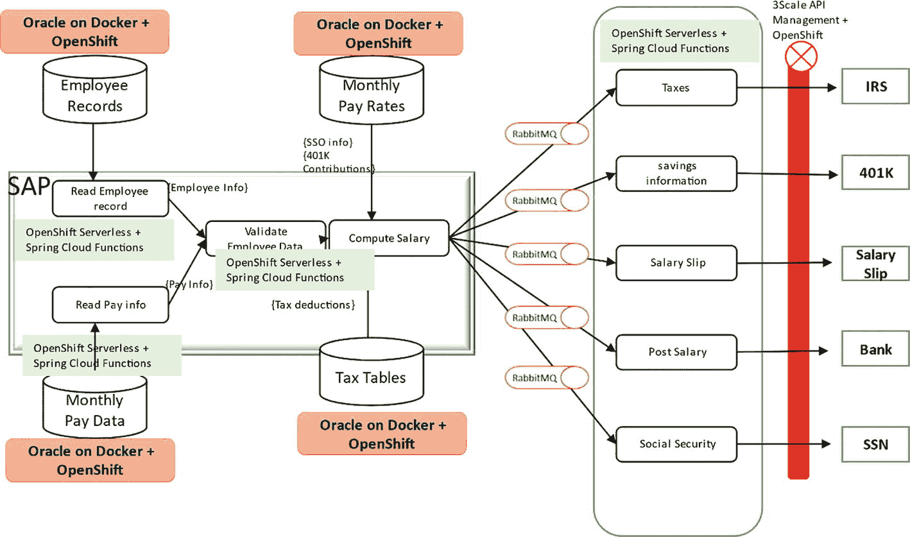

架构图描述了 Oracle 在 Docker 上加上 OpenShift 的员工详细信息流程，从验证到计算薪资。该流程通过 RabbitMQ 流向 OpenShift 无服务器架构加上 Spring Cloud Function。

图 1-19

Spring Cloud Function 在 Red Hat OpenShift 上

## 1.7 总结

本章讨论了 FaaS 环境、Spring Cloud Function 和 Knative。您了解到 AWS、Google 或 Microsoft Azure 提供的 FaaS 容器/环境不具备可移植性，因为底层组件的架构不同，导致难以在云服务商之间迁移 FaaS 容器。您还看到 Spring Cloud Function 可以抽象依赖的 AWS 和 Google 库，提供一种可移植的替代方案。在 Knative 上使用 Spring Cloud Function 可以实现“一次编写，随处部署”，从而提升开发者效率。您学习了如何将 Spring Cloud Function 和 Knative 应用于企业薪资系统，并了解了各种实现方式。下一章将逐步演示部署过程。您还将看到如何使用 IntelliJ 或 VS Code 等单一 IDE 开发并部署代码到不同目标环境，如 AWS、GCP、Azure、OpenShift 和 VMware Tanzu。这将帮助您理解 Spring Cloud Function 的强大功能。

