# 2. 使用 Spring Cloud Function 入门

本章讨论如何使用 Spring Cloud Function 开发代码，并将其部署到云环境、本地（本地数据中心）和笔记本电脑上。它包含编码和部署函数的逐步方法。

提供了一个薪资系统的示例用例，包括插入薪资详情和检索薪资信息。以下是这些环境中需要执行的一些常见任务：

1.  设置 Spring Boot 框架的 IDE。
2.  添加 JPA、H2（本示例使用嵌入式数据库来演示 CRUD 操作）、Spring Cloud Function 和 Spring Web 支持。
3.  完成`EmployeeFunction`、`EmployeeConsumer`和`EmployeeSupplier`代码的编写。

请注意，在所有环境中代码保持不变，您唯一需要修改的是`pom.xml`文件。您还会看到一个关于 Azure Functions 的`FunctionInvoker` `<Message<String>`, `<String>`类的介绍。Azure 构建过程会在构建时寻找此类。另一个与 Azure 的不同之处是，您必须使用 JDK 11 及以上版本才能在 IDE 中获取 Azure 模板。

在 Knative 和 Kubernetes 环境（如 EKS、AKS、GKE、OpenShift 和 Kubernetes 网格）中，您将执行以下常见任务：

1.  创建代码的 Docker 镜像。
2.  在所有环境中设置 Knative。
3.  将代码部署到 Knative。

将 Spring Cloud Function 部署到 Knative 将展示真正的可移植性。

您还将看到如何使用单一 IDE（如 IntelliJ 或 VS Code）执行所有功能（即构建和部署到目标环境）。

我使用了多种设备来设置本地和本地 Kubernetes 环境。我建议使用 VMware 虚拟机。您可以从 VMware 免费获取 VMware Workstation Player：[`https://www.vmware.com/products/workstation-player.xhtml`](https://www.vmware.com/products/workstation-player.xhtml)。您也可以使用其他替代方案，如 Windows Subsystem for Linux (WSL)或 Virtual Box。

所有代码均可在 GitHub 上获取：`https://github.com/banup-kubeforce payroll-h2.git`。

快乐编码！


### 2.1.1 步骤 1：创建 Spring Boot 项目骨架

在 IntelliJ 中，使用 Spring Initializer 创建 Spring Boot 项目。确保提供项目名称并选择 JDK 11。然后提供名称和组名。点击下一步进入新项目界面，如图 2-1 所示。

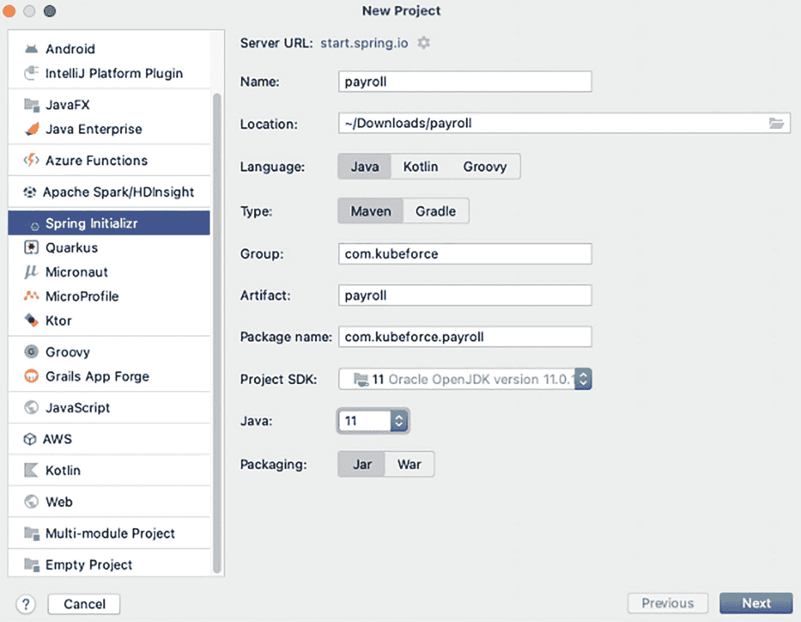

一个应用程序截图。左侧包含项目类型，右侧包含新项目配置。其中包括 URL、名称、位置、语言、类型、组和工件等。

图 2-1

IntelliJ 中的 Spring Initializer 配置

在下一页中，重要的是选择 Spring Web 和 Function。如果你只选择 Function，将无法在本地测试该功能，因为函数不会持久化。参见图 2-2。

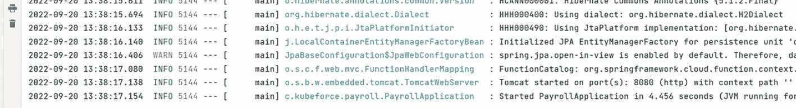

Spring Boot 部署日志截图。它允许通过工具测试该功能。

图 2-3

Spring Boot 部署和运行

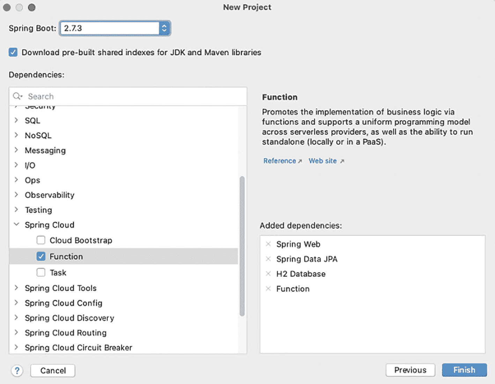

新项目的应用程序截图。左侧包含一组依赖项。从依赖项中选择函数，函数描述和添加依赖项在右侧。

图 2-2

选择项目依赖项

如图 2-2 中的"Added Dependencies"部分所示，我还包含了 H2 数据库。你可以使用自己喜欢的数据库。

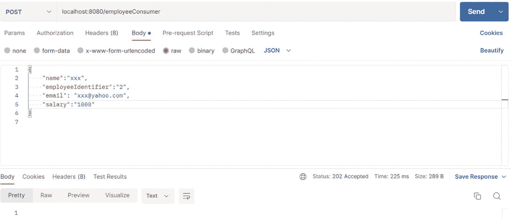

Postman 测试截图。页面包含授权、头信息、正文、预请求脚本、测试和设置。正文包含名称、员工标识符、电子邮件和薪资。

图 2-4

Postman 测试

点击完成按钮后，IDE 将创建代码片段并带你进入项目界面。或者，你可以通过克隆项目从 GitHub 获取代码。

清单 2-1 展示了包含 Maven 依赖项的`pom.xml`文件。

```
org.springframework.boot
spring-boot-starter-data-jpa

org.springframework.boot
spring-boot-starter-data-rest

org.springframework.boot
spring-boot-starter-web

org.springframework.cloud
spring-cloud-function-web

com.h2database
h2
runtime

清单 2-1
包含 Maven 依赖项的 pom.xml 文件
```

清单 2-2 展示了`application.properties`文件。我添加了`spring.h2.console.enabled=true`以验证数据库是否已填充。

```
spring.cloud.function.definition=employeeConsumer
spring.datasource.url=jdbc:h2:mem:employee
spring.datasource.driverClassName=org.h2.Driver
spring.datasource.username=sa
spring.datasource.password=
spring.jpa.hibernate.ddl-auto=create
spring.h2.console.enabled=true
清单 2-2
application.properties
```

如清单 2-3 所示，`PayrollApplication.java`是应用程序的主要入口点。重要的是定义三个代表消费者、供应商和函数的 bean，以便在部署后访问这些功能。

如果你不这样做，将无法调用该函数。

```
package com.kubeforce.payroll;
import org.springframework.boot.SpringApplication;
import org.springframework.boot.autoconfigure.SpringBootApplication;
import org.springframework.cloud.function.context.FunctionalSpringApplication;
import org.springframework.context.annotation.Bean;
@SpringBootApplication
public class PayrollAwsApplication {
public static void main(String[] args) {SpringApplication.run(PayrollApplication.class,args);
//SpringApplication.run 可用于在本地运行函数应用。
//在部署到无服务器平台（如 lambda、knative 等）时，将 SpringApplication.run 改为 FunctionalSpringApplication.run
}
@Bean
public EmployeeFunction employeeFunction() {
return new EmployeeFunction();
}
@Bean
public EmployeeConsumer employeeConsumer() {
return new EmployeeConsumer();
}
@Bean
public EmployeeSupplier employeeSupplier() {
return new EmployeeSupplier();
}
}
清单 2-3
PayrollApplication.java
```

一旦项目骨架和代码片段完成，你就可以进行下一步，即创建员工模型。

### 2.1.2 步骤 2：创建员工模型

模型为 ID、名称、员工 ID、电子邮件和薪资创建了 getter 和 setter 方法。

我手动创建了这个模型，但你可以使用 Spring JPA 数据模型生成器为存储在 Oracle、MYSQL 或 SQL Server 等关系型数据库，或 MongoDB 等文档数据库中的数据生成代码。使用 Spring JPA 生成代码的数据库支持取决于适配器，详情请参见 [`https://docs.spring.io/spring-integration/reference/html/jpa.xhtml#jpa`](https://docs.spring.io/spring-integration/reference/html/jpa.xhtml%2523jpa)。

清单 2-4 中创建的模型允许对 H2 数据库执行 CRUD 操作。

```
package com.kubeforce.payroll;
import javax.persistence.Entity;
import javax.persistence.GeneratedValue;
import javax.persistence.Id;
import javax.persistence.Table;
@Entity
@Table(name= "employee")
public class Employee {
@Id
@GeneratedValue(generator = "UUID")
private Long id;
private String name;
private int employeeid;
private String email;
private String salary;
public Employee(String name, int employeeIdentifier, String email, String salary)
{
this.name = name;
this.employeeid = employeeIdentifier;
this.email = email;
this.salary = salary;
}
public Employee() {
}
public String getName ()
{
return name;
}
public void setName (String name)
{
this.name = name;
}
public int getEmployeeIdentifier ()
{
return employeeid;
}
public void setCustomerIdentifier (int employeeIdentifier)
{
this.employeeid = employeeIdentifier;
}
public String getEmail ()
{
return email;
}
public void setEmail (String email)
{
this.email = email;
}
public String getSalary ()
{
return salary;
}
public void setSalary (String salary)
{
this.salary = salary;
}
public Long getId ()
{
return id;
}
public void setId (Long id)
{
this.id = id;
}
}
清单 2-4
员工实体模型
```

一旦模型创建完成，就可以继续编写将数据写入数据库的消费者和从数据库读取数据的供应商代码。

### 2.1.3 步骤 3：编写消费者

在此步骤中，你将编写一个消费者，用于将数据写入数据库。这里会暴露函数属性，如名称、员工标识符、电子邮件和薪资，从而允许你将数据传递给函数。

```
package com.kubeforce.payroll;
import org.slf4j.Logger;
import org.slf4j.LoggerFactory;
import org.springframework.beans.factory.annotation.Autowired;
import java.util.Map;
import java.util.function.Consumer;
public class EmployeeConsumer implements Consumer> {
public static final Logger LOGGER = LoggerFactory.getLogger(EmployeeConsumer.class);
@Autowired
private EmployeeRepository employeeRepository;
@Override
public void accept (Map map)
{
LOGGER.info("Creating the employee", map);
Employee employee = new Employee (map.get("name"), Integer.parseInt(map.get(
"employeeIdentifier")), map.get("email"), map.get("salary"));
employeeRepository.save(employee);
}
}
清单 2-5
Employee Entity Model
```


### 2.1.4 步骤 4：编写供应商

此示例中的供应商函数允许您获取数据库中的所有数据。您可以根据需要对其进行修改。

请注意，您将使用 Spring Data 仓库与数据库进行交互。这是 Spring Data REST 和 Spring Cloud Function 的常见方式。

```
package com.kubeforce.payrol;
import org.slf4j.Logger;
import org.slf4j.LoggerFactory;
import org.springframework.beans.factory.annotation.Autowired;
import org.springframework.stereotype.Component;
import java.util.List;
import java.util.function.Supplier;
@Component
public class EmployeeSupplier implements Supplier
{
public static final Logger LOGGER = LoggerFactory.getLogger(EmployeeSupplier.class);
@Autowired
private EmployeeRepository employeeRepository;
@Override
public Employee get ()
{
List employees = employeeRepository.findAll();
LOGGER.info("获取我们选择的员工 - ", employees);
return employees.get(0);
}
}
Listing 2-6
EmployeeSupplier.java
```

### 2.1.5 步骤 5：编写函数

此步骤是可选的，您可以从代码中看到，可以在消费者和供应商之外创建函数定义，并允许获取特定 ID 关联的数据。参见 2-7。

```
package com.kubeforce.payroll;
import org.springframework.beans.factory.annotation.Autowired;
import java.util.Optional;
import java.util.function.Function;
public class EmployeeFunction implements Function  {
@Autowired
private EmployeeRepository employeeRepository;
@Override
public Employee apply (Long s)
{
Optional employeeOptional = employeeRepository.findById(s);
if (employeeOptional.isPresent()) {
return employeeOptional.get();
}
return null;
}
}
Listing 2-7
EmployeeFunction.java
```

开发完代码后，您可以本地运行该函数。运行本地的关键步骤是修改主类以包含：

```
SpringApplication.run(PayrollApplication.class, args)
```

若要部署到 Lambda 等其他环境，请使用：

```
FunctionalSpringApplication.run(PayrollApplication.class, args)
```

使用`SpringApplication`可以让代码持续运行，从而可以使用 Postman 等工具测试函数。

### 2.1.6 步骤 6：本地部署和运行代码

在此步骤中，您会像运行任何其他 Spring Boot 代码一样运行代码。

请注意代码运行后会在端口 8080 上可用。

这使得可以使用 Postman 和 curl 等工具测试该函数。

### 2.1.7 步骤 7：测试该函数

您可以使用 curl 或 Postman 来测试您的函数。这里我使用 Postman。您可以在 [`https://www.postman.com/downloads/`](https://www.postman.com/downloads/) 下载 Postman。

在 Postman 中，选择`POST`，输入`http://localhost:8080/employeeConsumer` URL，并使用 JSON 格式输入。

```
{
"name": "xxx",
"employeeIdentifier":"2",
"email": xxx@yahoo.com,
"salary":"1000"
}
```

您可以在本节中测试所有三个接口，但当您部署到 Lambda 或其他环境时，将只能使用一个接口。

您还可以通过访问 H2 控制台验证数据是否已添加，如图 2-5 所示。

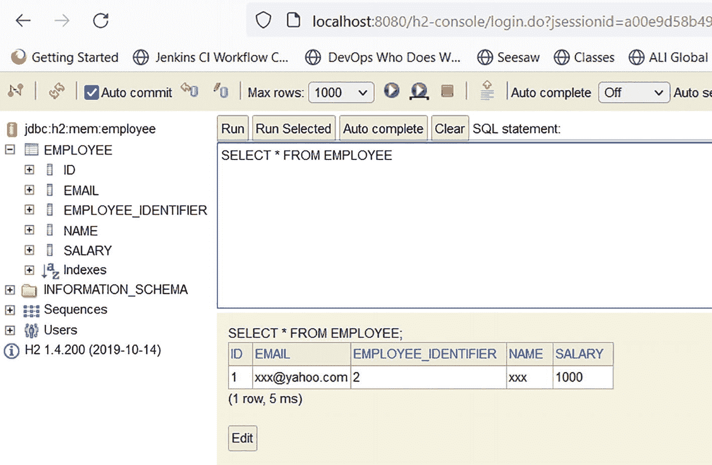

H2 控制台的截图。SQL 语句是 Select star from an employee。员工详情包括 ID、邮箱、员工标识符、姓名和薪资。

图 2-5

显示员工表正在被更新的 H2 控制台

这完成了创建、运行和测试本地函数代码的步骤。

在接下来的章节中，您将看到如何几乎不修改代码即可将其部署到您选择的无服务器函数容器中。

## 2.2 设置 Spring Cloud Function 和 AWS Lambda

本节讨论如何将您创建的代码部署到 AWS Lambda。

您需要对代码进行一些调整以使其兼容 Lambda。这些调整不会造成太大影响。再次强调，在真实场景中如果您有超过千个函数需要迁移到 AWS，这种调整不会显得特别重要。当然，这取决于您开始为哪个云提供商创建函数。理想情况下，我看到企业倾向于使用 Lambda，但也有企业从 Azure 或 Google 开始。无论如何，要使这些函数跨云平台可移植，需要进行一些代码修改和某些`pom.xml`修改。

前提条件：

*   AWS 账户

*   AWS Lambda 函数订阅

*   AWS CLI（可选）

*   GitHub 上的代码 [`https://github.com/banup-kubeforce/payroll-aws`](https://github.com/banup-kubeforce/payroll-aws)

步骤 1：首先按照第 2.1 节中概述的步骤 1-6 进行操作。代码对于任何云提供商的无服务器服务都保持不变。

在代码层面引入的更改将出现在名为`PayrollApplication`的主 Spring Boot 类中。您需要将此：

```
SpringApplication.run(PayrollApplication.class, args )
```

更改为：

```
FunctionalSpringApplication.run(PayrollApplication.class, args)
```

此过程在 2-8 中展示。

```
package com.kubeforce.payrollaws;
import org.springframework.boot.SpringApplication;
import org.springframework.boot.autoconfigure.SpringBootApplication;
import org.springframework.cloud.function.context.FunctionalSpringApplication;
import org.springframework.context.annotation.Bean;
@SpringBootApplication
public class PayrollAwsApplication {
public static void main(String[] args) {SpringApplication.run(PayrollAwsApplication.class,args);
//SpringApplication.run 可用于本地运行函数应用。
//在部署到无服务器平台（如 lambda、knative 等）时，将 SpringApplication.run 更改为 FunctionalSpringApplication.run
}
@Bean
public EmployeeFunction employeeFunction() {
return new EmployeeFunction();
}
@Bean
public EmployeeConsumer employeeConsumer() {
return new EmployeeConsumer();
}
@Bean
public EmployeeSupplier employeeSupplier() {
return new EmployeeSupplier();
}
}
Listing 2-8
PayrollAwsApplication.java
```

下一步是修改`pom.xml`文件以添加 AWS Lambda 适配器。

步骤 2：将 POM 修改为包含 AWS 依赖项和插件，如 2-9 所示。

```

4.0.0

org.springframework.boot
spring-boot-starter-parent
2.7.3

com.kubeforce
payroll-aws
0.0.1-SNAPSHOT
payroll-aws
payroll-aws

2021.0.1
3.9.0

org.springframework.boot
spring-boot-starter-data-jpa

org.springframework.boot
spring-boot-starter-web

org.springframework.cloud
spring-cloud-function-web

com.amazonaws
aws-lambda-java-core
1.2.1
provided

org.springframework.cloud
spring-cloud-function-adapter-aws

com.amazonaws
aws-lambda-java-events
3.9.0

com.h2database
h2
runtime

org.springdoc
springdoc-openapi-ui
1.6.11

org.springdoc
springdoc-openapi-webflux-ui
1.6.11

org.springframework.boot
spring-boot-starter-test
test

org.springframework.cloud
spring-cloud-dependencies
${spring-cloud.version}
pom
import

org.apache.maven.plugins
maven-deploy-plugin

true

org.springframework.boot
spring-boot-maven-plugin

org.springframework.boot.experimental
spring-boot-thin-layout
1.0.28.RELEASE

org.apache.maven.plugins
maven-shade-plugin
3.2.4

false
true
aws

Listing 2-9
pom.xml 文件
```

POM 需要修改以支持 AWS 的 Spring Cloud Function 适配器、Lambda 事件以及 Maven shade 插件（可选）。

这些更改将创建一个可部署到 AWS Lambda 的包。

步骤 3：将应用程序打包为 JAR 文件以部署到 AWS Lambda。图 2-6 展示了如何在 IntelliJ 中触发 Maven 打包运行。请注意`payroll-aws-0.0.1-SNAPSHOT-aws.jar`会在目标文件夹中生成。


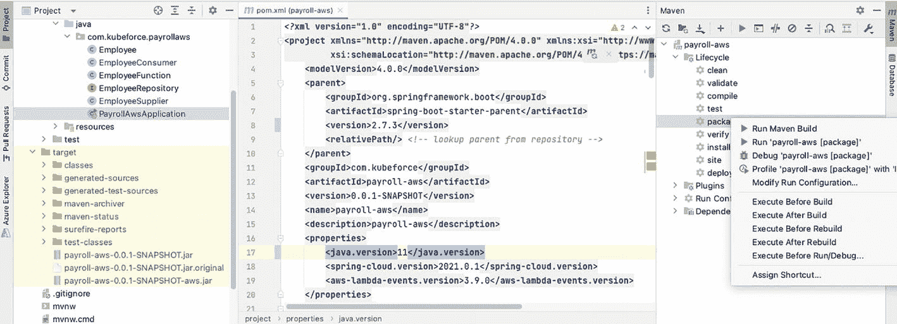

Run Maven 的截图。左侧显示项目详情，右侧显示 Maven。其中包含运行 Maven 构建、运行 payroll-a w s、调试 payroll-a w s 以及配置 payroll-a w s 的选项。

图 2-6

Run Maven: 从 IDE 运行 package

步骤 4：在 AWS Lambda 中创建函数定义。

登录 AWS 并订阅 AWS Lambda 服务。有关如何订阅 Lambda 的信息，请参阅 [`https://docs.aws.amazon.com/lambda/latest/dg/getting-started.xhtml`](https://docs.aws.amazon.com/lambda/latest/dg/getting-started.xhtml)。

通过 Lambda 门户/仪表板创建函数，如图 2-7 所示。

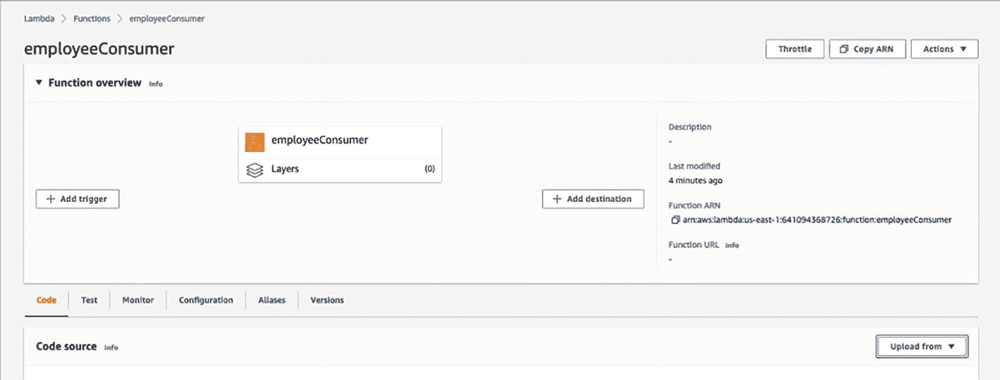

员工消费者页面的截图。页面包含函数概览和员工消费者层。

图 2-8

将 JAR 文件上传至 AWS Lambda 仪表板

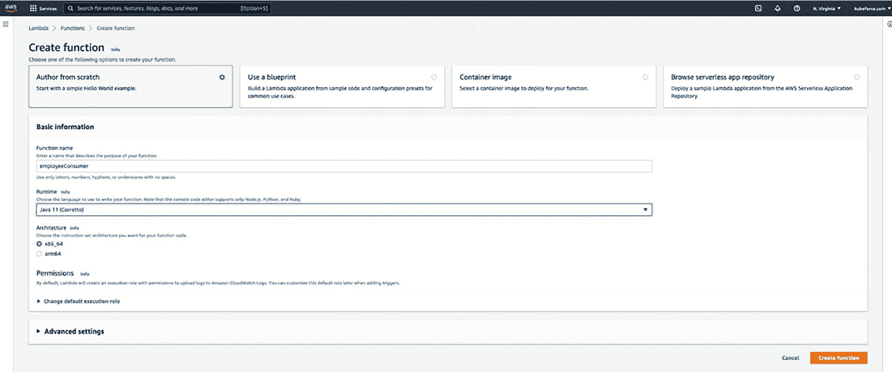

创建函数的截图。页面包含从头开始编写和使用蓝图、容器镜像的选项。从头开始编写包含基本信息、权限和高级设置。

图 2-7

AWS Lambda 函数创建仪表板

上传步骤 3 中创建的 JAR 文件并提供相关设置，如图 2-7 所示。

使用“从文件上传”按钮（如图 2-9 所示），以访问上传文件的选项。

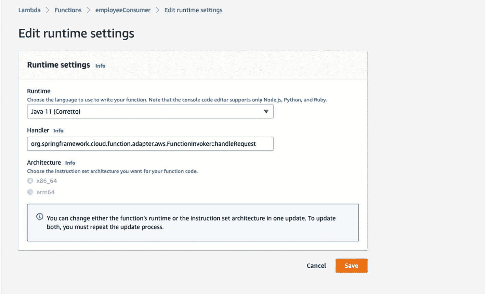

运行时设置页面的截图。页面包含运行时设置、运行时为 Java 11、处理器和架构信息。

图 2-9

AWS Lambda 运行时设置

按照图中所示设置处理器。Lambda 函数处理器是您函数代码中处理事件的方法。这将表明当函数被调用时，Spring Cloud Function 适配器将被触发。我使用了 Java 11，请参考`pom.xml`。

一旦点击保存，即可开始测试流程。

步骤 5：测试函数。AWS 门户允许开发者针对函数运行测试。点击“测试”标签将带您进入测试仪表板，如图 2-10 所示。

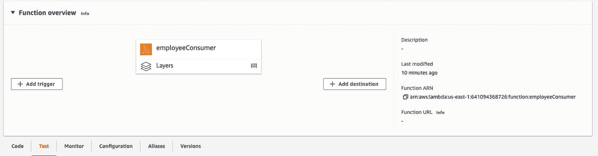

测试函数的函数概览页面截图。页面包含员工消费者层及其描述、最后修改详情、函数 ARN 和函数 URL。

图 2-10

AWS Lambda 函数测试标签

测试仪表板允许您将 JSON 文件作为事件发送以触发函数。

在“测试事件”部分，您可以提供事件名称或选择其他设置。出于测试目的，您可以仅使用默认值运行事件；唯一需要提供的参数是输入的 JSON 负载。准备好后点击“测试”，如图 2-11 所示。

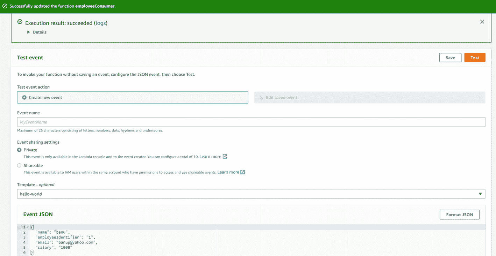

测试事件页面的截图。页面包含测试事件操作、事件名称、事件共享设置为私有以及模板（可选）。事件 JSON 包含名称、员工标识符、电子邮件和薪资信息。

图 2-11

测试仪表板

图 2-12 展示了测试的详细信息。请注意测试已成功。

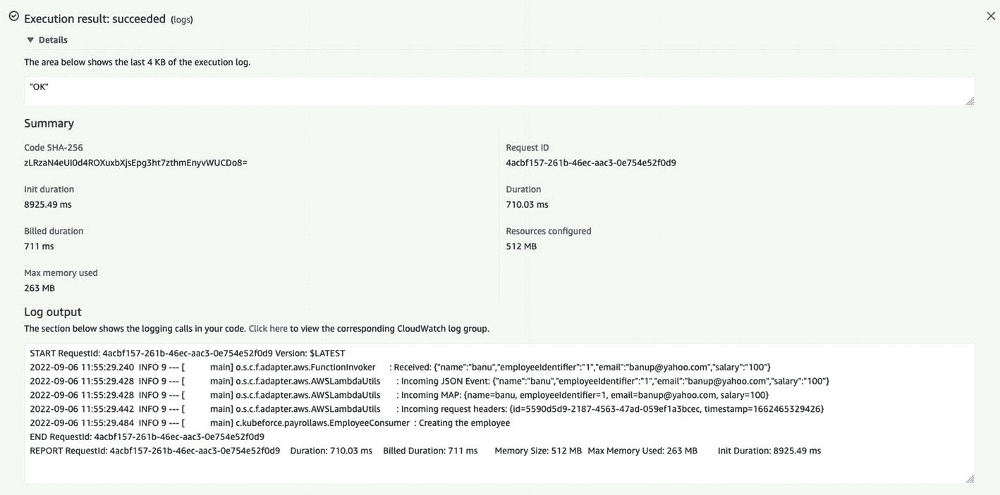

成功执行结果的截图。页面包含测试详情、摘要和日志输出。摘要包含代码、请求 ID 和持续时间。

图 2-12

AWS Lambda 函数测试结果

## 2.3 配置 Spring Cloud Function 和 Google Cloud Functions

您将使用第 2.1 节中的相同示例，并对其进行少量修改以使其在 Google Cloud Functions 上运行。方法与 AWS Lambda 类似，但您将使用 Google 的库。

前提条件：

*   Google 账户

*   Google Cloud Functions 订阅

*   Google CLI（这是关键，因为它比通过 Google 门户更高效）

*   GitHub 上的代码 [`https://github.com/banup-kubeforce/payroll-gcp`](https://github.com/banup-kubeforce/payroll-gcp)

步骤 1：按照第 2.1 节中概述的步骤 1-6 操作。此步骤与您在 AWS Lambda 中完成的步骤相同。代码与 AWS 代码非常相似。请参阅清单 2-10。

```
package com.kubeforce.payrollgcp;
import org.springframework.boot.SpringApplication;
import org.springframework.boot.autoconfigure.SpringBootApplication;
import org.springframework.cloud.function.context.FunctionalSpringApplication;
import org.springframework.context.annotation.Bean;
@SpringBootApplication
public class PayrollGcpApplication {
public static void main(String[] args) {
FunctionalSpringApplication.run(PayrollGcpApplication.class, args);
}
@Bean
public EmployeeFunction exampleFunction() {
return new EmployeeFunction();
}
@Bean
public EmployeeConsumer employeeConsumer() {
return new EmployeeConsumer();
}
@Bean
public EmployeeSupplier exampleSupplier() {
return new EmployeeSupplier();
}
}
清单 2-10
PayrollGcpApplication.java
```

步骤 2：配置 POM。`pom.xml`文件需要修改以包含 Spring Cloud Function 适配器和任何特定于 GCP 的插件。请参阅清单 2-11。

您将添加一些特定于 GCP 函数的依赖项，例如`spring-cloud-gcp-starter`、`spring-cloud-function-adapter-gcp`、`spring-cloud-gcp-dependencies`和`spring-cloud-function-adapter-gcp`。

```

4.0.0

org.springframework.boot
spring-boot-starter-parent
2.6.5

com.kubeforce
payroll-gcp
0.0.1-SNAPSHOT
payroll-gcp
payroll-gcp

3.1.0
2021.0.1
4.0.0-SNAPSHOT

org.springframework.boot
spring-boot-starter-data-jpa

org.springframework.boot
spring-boot-starter-web

com.google.cloud
spring-cloud-gcp-starter

org.springframework.cloud
spring-cloud-function-web

org.springframework.cloud
spring-cloud-function-adapter-gcp

com.h2database
h2
runtime

org.springframework.boot
spring-boot-starter-test
test

org.springframework.cloud
spring-cloud-dependencies
${spring-cloud.version}
pom
import

com.google.cloud.functions
spring-cloud-gcp-dependencies
${spring-cloud-gcp.version}
pom
import

maven-deploy-plugin

true

org.springframework.boot
spring-boot-maven-plugin

target/deploy

org.springframework.cloud
spring-cloud-function-adapter-gcp
3.2.2

com.google.cloud.functions
function-maven-plugin
0.9.1

org.springframework.cloud.function.adapter.gcp.GcfJarLauncher

清单 2-11
pom.xml 文件
```

步骤 3：构建、打包并部署到 Google Cloud Functions。此活动的 Google 云网站略显笨拙。您需要将整个目录压缩为 ZIP 文件并上传。某些企业可能不允许此操作，因此我改用 CLI 来完成此任务。请参见图 2-13。

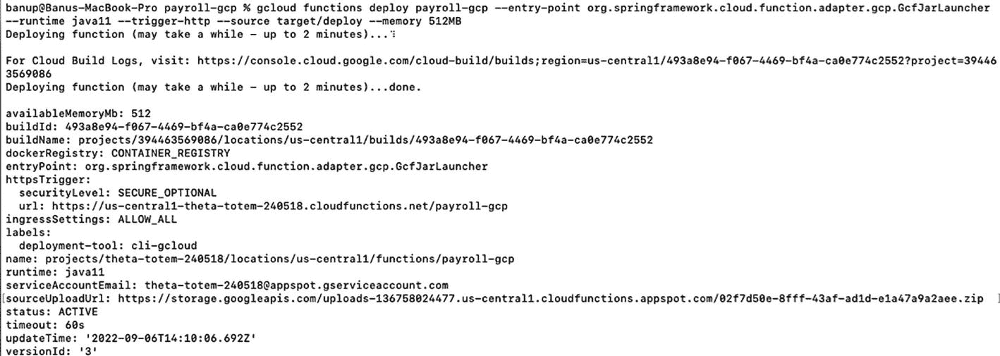

G Cloud CLI 执行结果的截图。它使用 CLI 完成任务。页面上的部分细节包含可用内存 MB、构建 ID、构建名称、镜像仓库和入口点。

图 2-13

Gcloud CLI 执行结果

此命令必须在项目根目录下运行：

```
$gcloud functions deploy payroll-gcp --entry-point org.springframework.cloud.function.adapter.gcp.GcfJarLauncher --runtime java11 --trigger-http --source target/deploy --memory 512MB
```

一旦命令成功执行，您可以前往 Google Cloud Functions 控制台查看已部署的函数。请参见图 2-14。


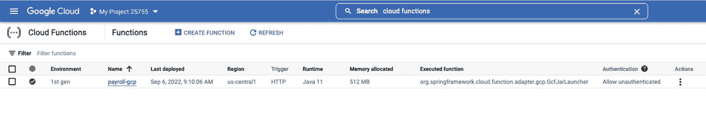

Google 云函数仪表板的截图。它包含云函数和函数。其中包含的详细信息包括环境、名称、最后部署时间、区域、触发器、运行时和分配的内存。

图 2-14

云函数仪表板

现在你可以测试它以验证其功能。

步骤 4：在 GCP 中测试函数。Google 提供了从网站本身进行测试的方式。你可以像之前一样通过 JSON 文件提供输入，然后执行测试。

图 2-15 展示了测试成功执行的结果。

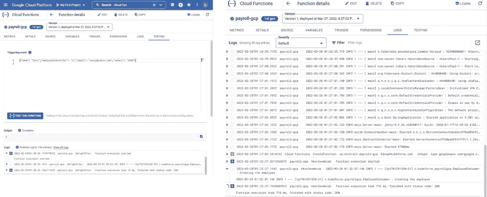

一组两张云函数测试仪表板的截图。a. Google 云平台描述的触发事件。b. 云函数 payroll g c p。

图 2-15

云函数测试仪表板

## 2.4 设置 Spring Cloud Function Azure 函数

你将使用第 2.1 节中的相同示例，并对其进行少量修改以使其在 Azure 函数上运行。你将看到 Azure 函数的处理方式与其他云平台（如 AWS 或 Google）不同。你需要添加一个名为`EmployeeConsumerHandler`的类，该类继承自`FunctionInvoker<I,O>`。这个`FunctionInvoker`类仅仅是`EmployeeConsumer`函数的简单传递。

前提条件：

* Azure 账户
* Azure 函数订阅
* Azure 函数 CLI。你可以通过 [`https://docs.microsoft.com/en-us/azure/azure-functions/functions-run-local`](https://docs.microsoft.com/en-us/azure/azure-functions/functions-run-local) 下载相关工具
* GitHub 上的代码 [`https://github.com/banup-kubeforce/payroll-azure`](https://github.com/banup-kubeforce/payroll-azure)

步骤 1：按照第 2.1 节中概述的步骤 1-6 进行操作。

你需要引入一个名为`FunctionInvoker <I,O>`的类，这会使代码无法在其他云平台上直接运行。虽然 AWS 和 Google 会将函数调用外部化（如前几节所示），但 Azure 要求你提供一个继承自`FunctionInvoker`的处理类。

清单 2-12 引入了名为`EmployeeConsumerHandler`的类，该类继承自`FunctionInvoker`。该`FunctionInvoker`的输入将是一个`Map<String,String>`，它会接收传递的 JSON 对象。然后该对象会被发送到`EmployeeConsumer`函数进行处理。

```
package com.kubeforce.payrollazure;
import com.microsoft.azure.functions.*;
import com.microsoft.azure.functions.annotation.*;
import org.aspectj.weaver.NewConstructorTypeMunger;
import org.springframework.cloud.function.adapter.azure.FunctionInvoker;
import java.util.List;
import java.util.Map;
import java.util.Optional;
import org.springframework.messaging.Message;
import org.springframework.messaging.support.MessageBuilder;
public class EmployeeConsumerHandler extends FunctionInvoker<String, String> {
@FunctionName("employeeConsumer")
public String execute(
@HttpTrigger(name = "request", methods = {HttpMethod.GET, HttpMethod.POST}, authLevel = AuthorizationLevel.ANONYMOUS) HttpRequestMessage<String> request,
ExecutionContext context) {
String message = "成功插入： " +request.getBody().get().getName();
return message;
}
}
清单 2-12
EmployeeConsumerHandler.java
```

步骤 2：构建并打包函数。IntelliJ 提供了通过 Maven 窗口执行 Maven 命令的功能，如图 2-16 所示。

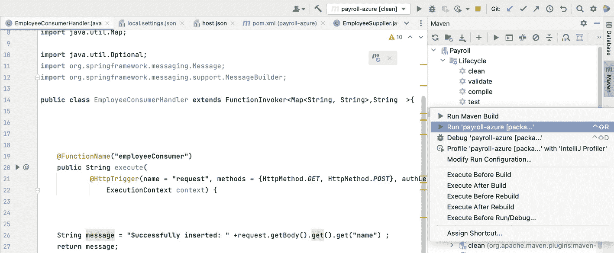

Maven 打包的截图。左侧包含编码内容，右侧包含命令。"运行 payroll Azure 打包命令"已被选中。

图 2-16

Maven 打包

在运行`maven package`命令前，你需要先运行`maven clean`命令。这些命令位于 Maven 窗口的生命周期菜单下。运行 Maven 打包以获取可部署的 JAR 文件。这些 JAR 文件会存储在项目目录的 target 文件夹中。

图 2-17 展示了 Maven 打包的成功运行。

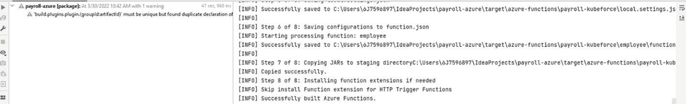

成功打包的截图。包含 payroll Azure 打包日志。

图 2-17

Azure 函数构建和成功打包

步骤 3：在 Azure 上部署函数。你将在 target 文件夹中看到一些生成的工件。`Payroll-azure-0.0.1-SNAPSHOT.jar`是你要关注的文件。该文件需要部署到 Azure 云。

IntelliJ 提供了用于 Azure 的插件功能，你可以启用该功能。一旦启用该功能，就可以通过 IDE 执行基于 Azure 函数的操作。

在这种情况下，要开始部署过程，请从 Azure 函数列表中选择"运行 Azure 函数 ➤ 部署"，如图 2-18 所示。

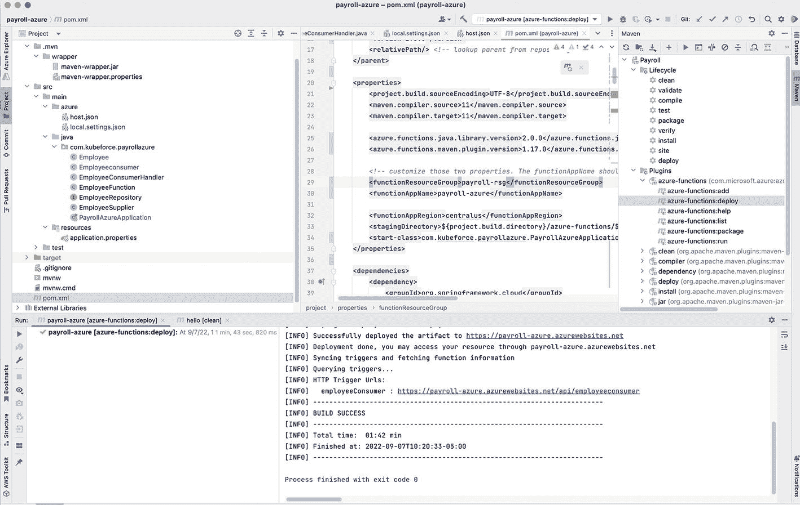

payroll-azure 的截图。左侧包含项目，target 被选中。在编码 payroll 中，选择了一个函数。右侧包含命令，"Azure 函数部署"已被选中。

图 2-18

使用 Azure 函数，通过 Maven 部署到 Azure

函数成功部署到 Azure 云后，你可以使用提供的 URL 在 Postman 中运行测试，或前往 Azure 函数控制台进行测试。

Azure 函数控制台如图 2-19 所示。

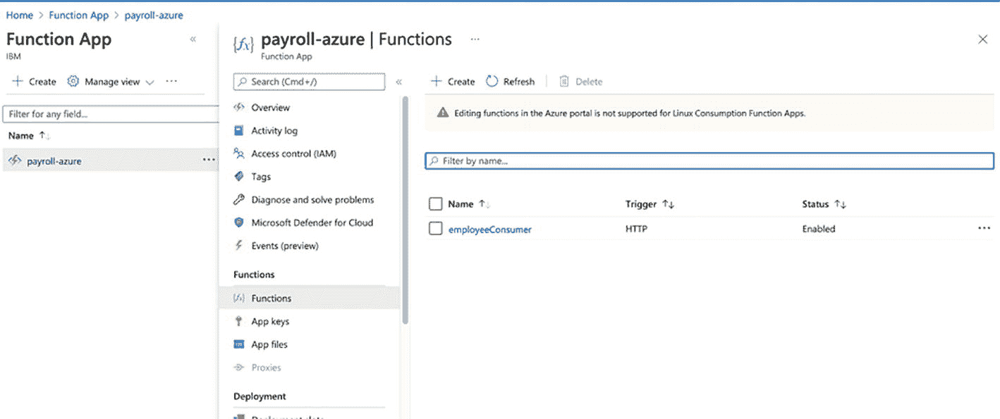

函数应用的截图。选择了一个 payroll-azure 函数。在 payroll-azure 函数中，选择了函数标签，其中包含名称、触发器和状态信息。

图 2-19

Azure 函数控制台

你将看到该函数已在 Azure 上部署并正在运行。

步骤 4：测试。点击`employeeConsumer`函数将带你进入详细控制台，如图 2-20 所示。在此处，你可以通过点击"代码+测试"链接进行测试。仪表板包含一个输入部分，你可以在其中指定请求体中的 JSON，选择 HTTP 方法为 POST（在此示例中），然后点击运行按钮。你可以通过命令控制台查看执行结果，如图 2-21 所示。

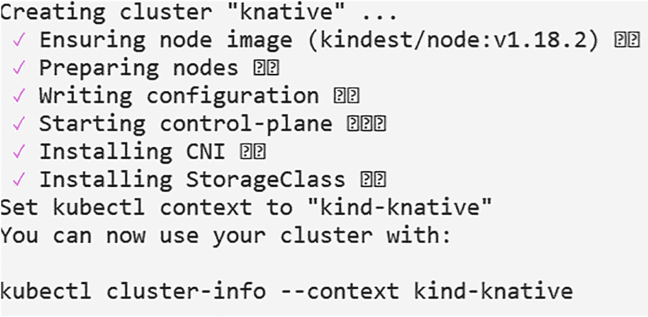

执行日志的截图。包含创建集群 k native。部分检查包括确保节点镜像、准备节点和写入配置。输出是你现在可以使用你的集群。

图 2-22

集群已成功创建

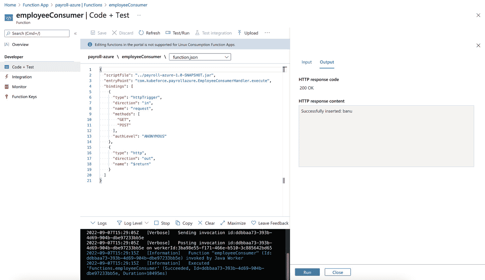

员工消费者代码+测试页面的截图。选择了代码+测试标签。输出是 HTTP 响应代码，成功的 HTTP 响应内容。包含运行日志。

图 2-21

测试成功运行

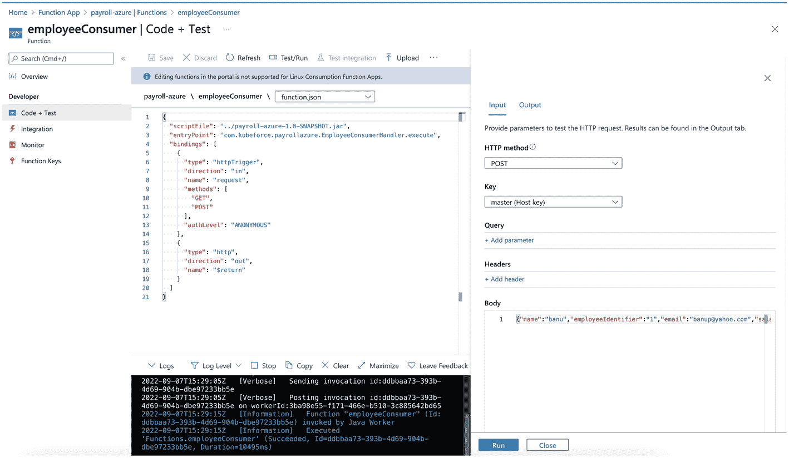

员工消费者代码+测试页面的截图。选择了测试标签。在 payroll-azure 中，员工消费者输入包含 HTTP 方法、密钥、查询、头信息和请求体。包含运行页面。

图 2-20

使用输入运行测试

图 2-21 展示了测试的成功执行。


## 2.5 使用 Kubernetes、Knative 和 Spring Cloud Function 本地设置

本节探讨了另一种部署 Spring Cloud Function 的方法。Kubernetes，如您所知，是一种可移植的容器化和运行容器的方法。Kubernetes 允许您托管以镜像形式打包并部署在 Kubernetes Pod 上的容器。

Knative 是建立在 Kubernetes 之上的环境，可以托管函数。第 1 章解释了云提供商如何创建诸如 AWS Lambda 这样的环境，这些环境可以按需启动并在线资源未使用时关闭。类似地，您也可以使用 Knative 为函数创建这样的按需环境。本节将探讨如何在本地设置 Knative 环境，这在 AWS 和 Google Functions 上较为困难，并部署和使用您的函数在本地和云端。本节首先介绍本地部署，然后过渡到云端。

您会注意到我使用了 `EmployeeSupplier` 作为函数。为此，您需要预先在 H2 数据库中填充一些数据，以便可以使用 `EmployeeSupplier` 函数查询数据库。

前提条件：

*   Docker（适用于 Mac、Linux 或 Windows）

*   Kind（Kubernetes in Docker）

*   Knative serving

*   IntelliJ、Eclipse、VS Code 或其他 IDE

*   GitHub 上的代码

以下是设置 Kubernetes 和 Knative 并部署 Spring Cloud Function 的过程。

步骤 1：本地设置 Kubernetes 集群。在此步骤中，您安装一个本地 Kubernetes 集群。您将部署一个 KIND（Kubernetes IN Docker）集群。当然，您也可以使用 Minikube 或 Minishift 进行本地部署。

首先，您需要 Docker。

1.  安装 Docker。

我使用的是 Ubuntu 虚拟机，因为它是一种流行的 Linux 发行版。提供的命令行是按顺序排列的，您可以按照流程操作。参见 Listing 2-13。

```
$sudo apt-get update
$sudo apt-get install -y \
apt-transport-https \
ca-certificates \
curl \
gnupg-agent \
software-properties-common
$curl -fsSL https://download.docker.com/linux/ubuntu/gpg | sudo apt-key add -
$sudo add-apt-repository \
"deb [arch=amd64] https://download.docker.com/linux/ubuntu \
$(lsb_release -cs) \
stable"
$sudo apt-get update
$sudo apt-get install -y docker-ce docker-ce-cli containerd.io
$sudo usermod -aG docker $USER
Listing 2-13
安装 Docker
```

一旦运行这些命令，您将拥有一个正在运行的 Docker 实例。

1.  安装 Kubectl。

此步骤是必需的，因为您需要 Kubectl 来与 Kubernetes 集群交互

```
$sudo curl -L "https://storage.googleapis.com/kubernetes-release/release/`curl -s https://storage.googleapis.com/kubernetes-release/release/stable.txt`/bin/linux/amd64/kubectl" -o /usr/local/bin/kubectl
```

运行 `chmod` 命令使 Kubectl 可执行：

1.  安装 KIND。

```
$sudo chmod +x /usr/local/bin/kubectl
```

```
$sudo curl -L "https://kind.sigs.k8s.io/dl/v0.8.1/kind-$(uname)-amd64" -o /usr/local/bin/kind
```

运行 `chmod` 命令使 KIND 可执行：

```
$sudo chmod +x /usr/local/bin/kind
```

现在您拥有 KIND 的组件，可以安装集群并部署 Knative。

步骤 2：配置 Knative。为了配置 Knative，您需要一个 KIND 集群。您将使用自定义配置文件创建集群。

使用名为 `clusterconfig.yaml` 的配置文件创建集群。请注意，集群的名称是 "`knative`"。您可以使用不同的名称，但必须使用该集群来部署 Knative；参见 Listing 2-14。

```
$cat > clusterconfig.yaml << EOF
kind: Cluster
apiVersion: kind.x-k8s.io/v1alpha4
nodes:
- role: control-plane
extraPortMappings:
## 将节点的端口 31380 暴露为主机的端口 80
- containerPort: 31080
hostPort: 80
## 将节点的端口 31443 暴露为主机的端口 443
- containerPort: 31443
hostPort: 443
EOF
$kind create cluster --name knative --config clusterconfig.yaml
Listing 2-14
创建 clusterconfig.yaml 并运行创建集群
```

为了设置 Knative，您需要安装和配置以下组件：

*   Knative serving（关于 Knative serving 的信息可在 [`https://knative.dev/docs/serving`](https://knative.dev/docs/serving) 找到）

*   Kourier 是一个轻量级的 Knative serving 入口，可在 [`https://github.com/knative-sandbox/net-kourier`](https://github.com/knative-sandbox/net-kourier) 找到。

*   Magic DNS 是一个 DNS 提供商，可在 [`https://knative.dev/docs/install/yaml-install/serving/install-serving-with-yaml/#configure-dns`](https://knative.dev/docs/install/yaml-install/serving/install-serving-with-yaml/%2523configure-dns) 找到。

安装 Knative serving

1.  安装 Knative serving 组件（即 `crds` 和 `core`）：

1.  使用 Kourier 设置网络：

```
$ kubectl apply -f https://github.com/knative/serving/releases/download/knative-v1.6.0/serving-crds.yaml
$ kubectl apply -f https://github.com/knative/serving/releases/download/knative-v1.6.0/serving-core.yaml
```

1.  将文件更改为使用 nodePort，如 Listing 2-15 所示。

```
$curl -Lo kourier.yaml https://github.com/knative/net-kourier/releases/download/knative-v1.6.0/kourier.yaml
```

1.  安装 Kourier。

```
apiVersion: v1
kind: Service
metadata:
name: kourier
namespace: kourier-system
labels:
networking.knative.dev/ingress-provider: kourier
spec:
ports:
- name: http2
port: 80
protocol: TCP
targetPort: 8080
nodePort: 31080
- name: https
port: 443
protocol: TCP
targetPort: 8443
nodePort: 31443
selector:
app: 3scale-kourier-gateway
type: NodePort
Listing 2-15
配置 nodePort
```

通过运行以下命令安装 Kourier（参见 Figure 2-23）：

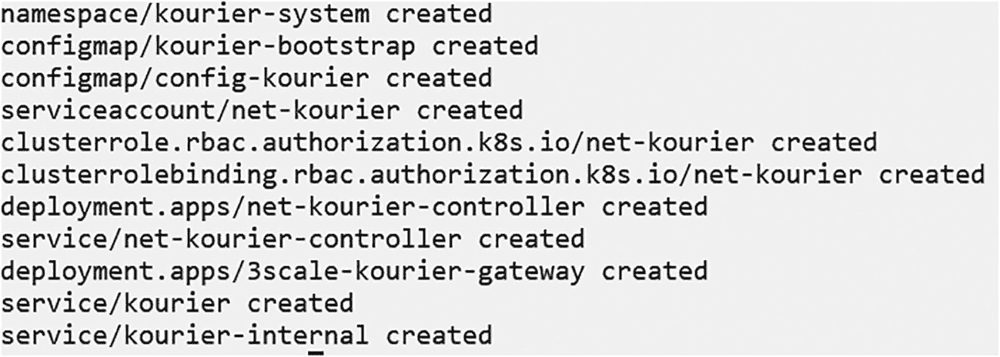

执行日志的截图。它包含 kourier 的配置、服务账户、集群角色、部署和服务。输出为 service kourier-internal 创建成功。

Figure 2-23

Kourier 安装成功

```
$ kubectl apply --filename kourier.yaml
```

1.  通过安装以下补丁将 Kourier 设置为默认网络层：

1.  使用 `sslip.io` 设置通配符 DNS：

```
$ kubectl patch configmap/config-network \
--namespace knative-serving \
--type merge \
--patch '{"data":{"ingress-class":"kourier.ingress.networking.knative.dev"}}'
```

1.  使用 `sslip.io` 进行补丁：

```
$ kubectl apply -f https://github.com/knative/serving/releases/download/knative-v1.6.0/serving-default-domain.yaml
```

1.  获取 Knative serving 中 Pod 的状态：

```
$ kubectl patch configmap/config-domain \
--namespace knative-serving \
--type merge \
--patch '{"data":{"127.0.0.1.sslip.io":""}}'
```

```
$ kubectl get pods -n knative-serving
```

您可以在 Figure 2-24 中看到所有组件都已启动并运行。您可以继续下一步，将 Spring Cloud Function 应用发布到 Knative。

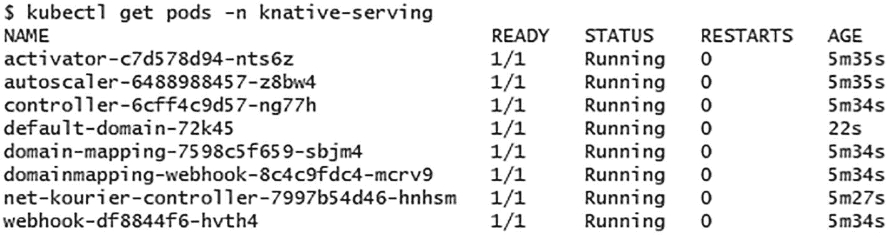

运行日志的截图。它包含 knative-serving 命名空间中的 kubernetes get pods 命令、activator、autoscaler、默认域和域映射。

Figure 2-24

Knative 服务 Pod 已启动并运行

步骤 3：将应用容器化并推送到仓库。使用 Listing 2-16 中所示的参数设置创建 Dockerfile。我使用了 jdk8。

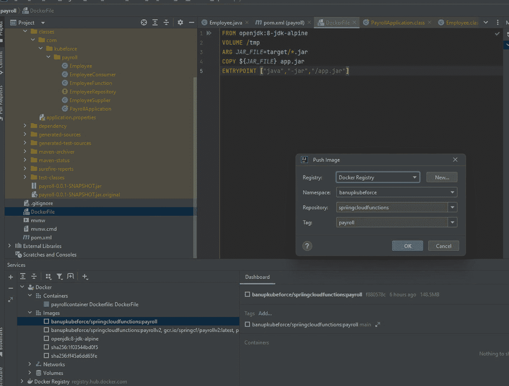

Docker 文件的截图。左侧包含项目，选中了 Docker 文件，创建了推送镜像页面。它包含注册表、命名空间、仓库和标签。

Figure 2-25

从 IntelliJ 推送 Docker 镜像

1.  推送至 Dockerhub。您可以使用 IDE 的 Docker 功能将应用推送到 Docker 注册表，如 Figure 2-25 所示。

```
FROM openjdk:8-jdk-alpine
ARG JAR_FILE=target/*.jar
COPY ${JAR_FILE} app.jar
ENTRYPOINT ["java","-jar","/app.jar"]
Listing 2-16
Dockerfile
```


步骤 4：将应用部署到 Knative。您需要为服务创建一个 YAML 文件。请注意使用的镜像。我推送了一个名为“`main`”的 Docker 镜像，该镜像暴露了`employeeSupplier`。您会看到在推送到其他云服务提供商时，我会使用不同的镜像。这是为了让您熟悉如何使用不同的镜像和暴露的端点进行推送。参见清单 2-17。

1. 下一步是将应用部署到 Knative。

```
apiVersion: serving.knative.dev/v1 # 当前 Knative 版本
kind: Service
metadata:
name: payroll # 应用名称
namespace: default # 应用使用的命名空间
spec:
template:
spec:
containers:
- image: docker.io/banupkubeforce/springcloudfunctions:main # 应用镜像的 URL
env:
- name: TARGET # 样例应用打印的环境变量
value: "employeesupplier"
清单 2-17
payroll.yaml
```

运行以下命令使用 Knative 服务安装应用：

```
$ kubectl apply -f payoll.yaml
```

或者，您可以使用 Knative CLI。更多信息请参见 [`https://knative.dev/docs/client/#kubectl`](https://knative.dev/docs/client/%2523kubectl)。

```
$ kn service create payroll –image docker.io/banupkubeforce/springcloudfunctions:main
```

YAML 执行方式可为您提供对目标环境的更多控制。请注意此 URL，因为它在测试步骤中是必需的。此处示例显示的 URL 是 [`https://payroll.default.127.0.0.1.sslip.io`](https://payroll.default.127.0.0.1.sslip.io)。

您可以运行以下命令获取 URL 并检查端点是否已准备好进行测试。

步骤 5：测试。由于`employeeSupplier`查询数据库并获取记录，您需要使用`GET`操作。参见图 2-26。

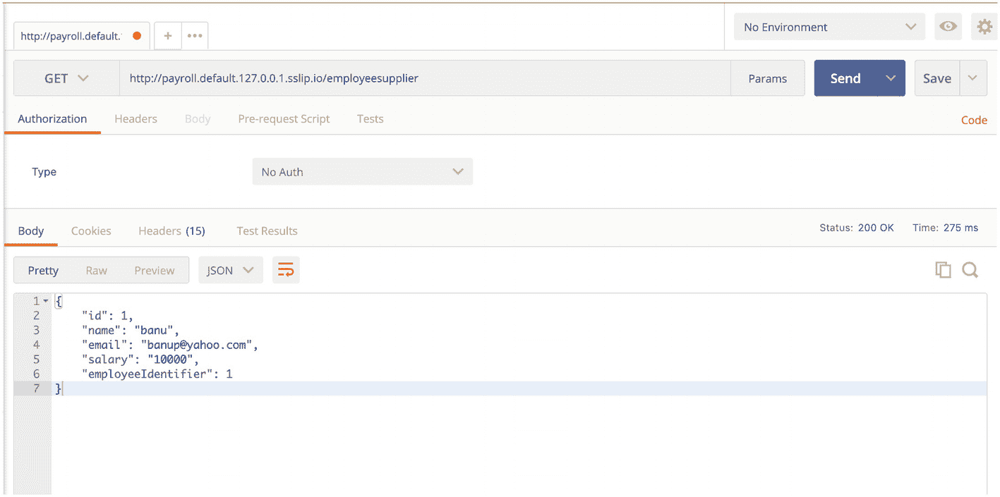

使用 Postman 进行测试的截图。选择授权标签，请求体包含 ID、姓名、电子邮件、薪资和员工标识符。

图 2-26

使用 Postman 测试

在本节中，您创建了一个基于 KIND 的 Kubernetes 集群，配置了 Knative，并部署了应用。您创建了一个可移植的镜像，该镜像可以部署到任何已配置 Knative 的 Kubernetes 集群。

## 2.6 使用 EKS 和 Knative 设置 AWS 与 Spring Cloud Function

本节探讨在已配置 Knative 的 AWS EKS 集群上部署应用。您会发现与第 2.5 节有相似之处，因为您需要创建集群、启用 Knative 并部署 Docker 镜像。

前提条件：

* AWS 订阅 ([`https://aws.amazon.com/`](https://aws.amazon.com/))

* AWS CLI，可在 [`https://aws.amazon.com/cli/`](https://aws.amazon.com/cli/) 找到

* Eksctl CLI ([`https://eksctl.io/`](https://eksctl.io/))

* Knative 服务 ([`https://knative.dev/docs/serving`](https://knative.dev/docs/serving))

* Knative CLI ([`https://knative.dev/docs/client/install-kn/`](https://knative.dev/docs/client/install-kn/))

* IntelliJ、Eclipse、VS Code 或其他 IDE

* GitHub 代码

* 注册在 Docker hub 的 Docker 镜像

步骤 1：使用 EKS 设置 Kubernetes 集群。在运行清单 2-18 中的命令前，确保您已正确连接到 AWS 并拥有创建集群的订阅和权限。更多信息请参见 [`https://docs.aws.amazon.com/eks/latest/userguide/getting-started.xhtml`](https://docs.aws.amazon.com/eks/latest/userguide/getting-started.xhtml)。

```
apiVersion: eksctl.io/v1alpha5
kind: ClusterConfig
metadata:
name: payroll-clstr
region: us-east-2
nodeGroups:
- name: payroll-nodes
instanceType: m5.large
desiredCapacity: 3
volumeSize: 80
清单 2-18
cluster.yaml
```

使用以下命令创建您的 Amazon EKS 集群：

```
$eksctl create cluster -f cluster.yaml
```

此过程需要 10 到 15 分钟。在过程结束时，您将在 EKS 中创建了一个集群。可以在 AWS EKS 控制台中验证。参见图 2-27。

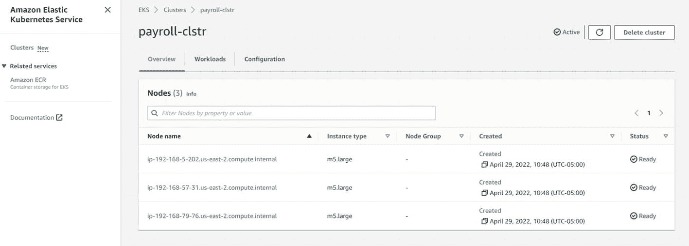

Amazon 弹性 Kubernetes 服务的截图。Payroll 集群包含概览及其节点的详细信息。它们包括节点名称、实例类型、节点组、创建时间和状态。

图 2-27

EKS 控制台

您会看到仪表板显示了在清单 2-18 中提供的集群名称，并且创建了三个节点，如清单中设置的`desiredCapacity`所示。

验证集群是否已启动并运行（参见图 2-28）。您可以通过运行以下命令来完成此操作：

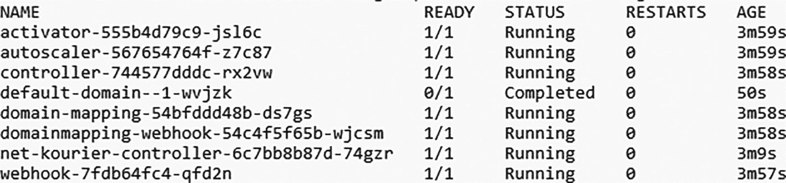

Knative 组件运行日志的截图。包含名称、就绪状态、状态、重启次数和年龄。所有命名空间均处于运行状态。

图 2-29

Knative 组件在 EKS 上运行

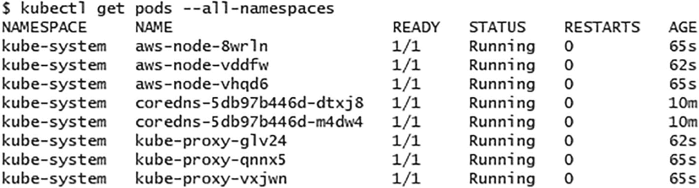

弹性 Kubernetes 服务运行日志的截图。包含`kubectl get pods`所有命名空间的信息，名称、就绪状态、状态、重启次数和年龄。所有命名空间均成功运行。

图 2-28

EKS 集群成功运行

```
$kubectl get pods --all-namespaces
```

步骤 2：在 EKS 上配置 Knative。在此步骤中，您将配置在之前创建的 EKS 集群上的 Knative。参见清单 2-19。

```
$kubectl apply -f https://github.com/knative/serving/releases/download/knative-v1.4.0/serving-crds.yaml
$kubectl apply -f https://github.com/knative/serving/releases/download/knative-v1.4.0/serving-core.yaml
$kubectl apply -f https://github.com/knative/net-kourier/releases/download/knative-v1.4.0/kourier.yaml
$kubectl patch configmap/config-network \
--namespace knative-serving \
--type merge \
--patch '{"data":{"ingress-class":"kourier.ingress.networking.knative.dev"}}'
$kubectl --namespace kourier-system get service kourier
$kubectl apply -f https://github.com/knative/serving/releases/download/knative-v1.4.0/serving-default-domain.yaml
清单 2-19
安装和配置 Knative
```

步骤 3：使用 Docker 容器化应用并将其推送到仓库（可选）。


这是一个可选步骤，因为您已经在第 2.5 节部署了镜像。您可以跳过此步骤，直接进入步骤 4。我这里使用的是 JDK 8，但您可以通过将`FROM`语句更改为`FROM adoptopenjdk/openjdk11:latest`来使用最新版的 JDK。详见清单 2-20。

```
FROM openjdk:8-jdk-alpine
ARG JAR_FILE=target/*.jar
COPY ${JAR_FILE} app.jar
ENTRYPOINT ["java","-jar","/app.jar"]
Listing 2-20
Dockerfile
```

步骤 4：将镜像推送到 Docker Hub。下一步是将 Docker 镜像推送到 Docker Hub 仓库，如图 2-30 所示。请务必登录到 [`https://hub.docker.com/`](https://hub.docker.com/) 并创建仓库和命名空间。您将在推送镜像时需要这些信息。

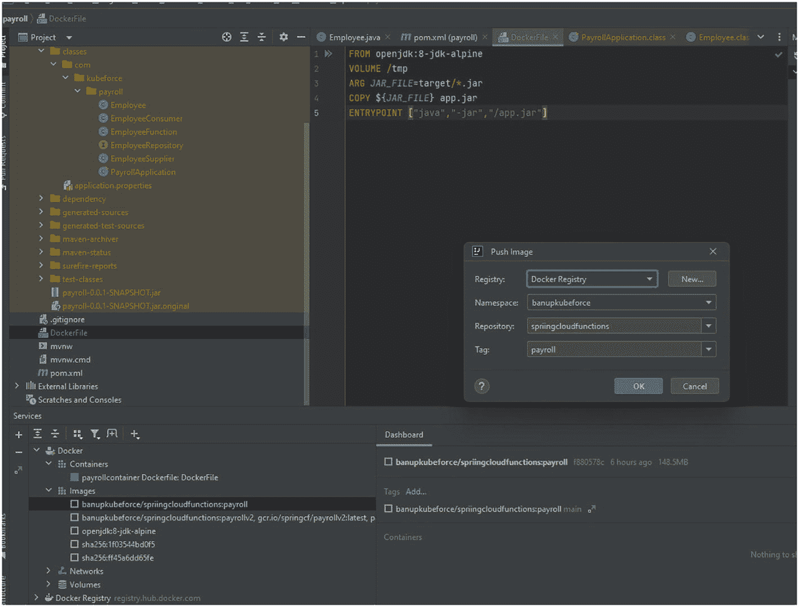

薪资截图。左侧包含项目，在该项目中选中了一个 docker 文件，创建了推送镜像页面。该页面包含注册表、命名空间、仓库和标签。

图 2-30

从 IntelliJ IDE 推送 Docker 镜像

推送成功后，您可以访问 Docker Hub 查看镜像的部署情况，如图 2-31 所示。

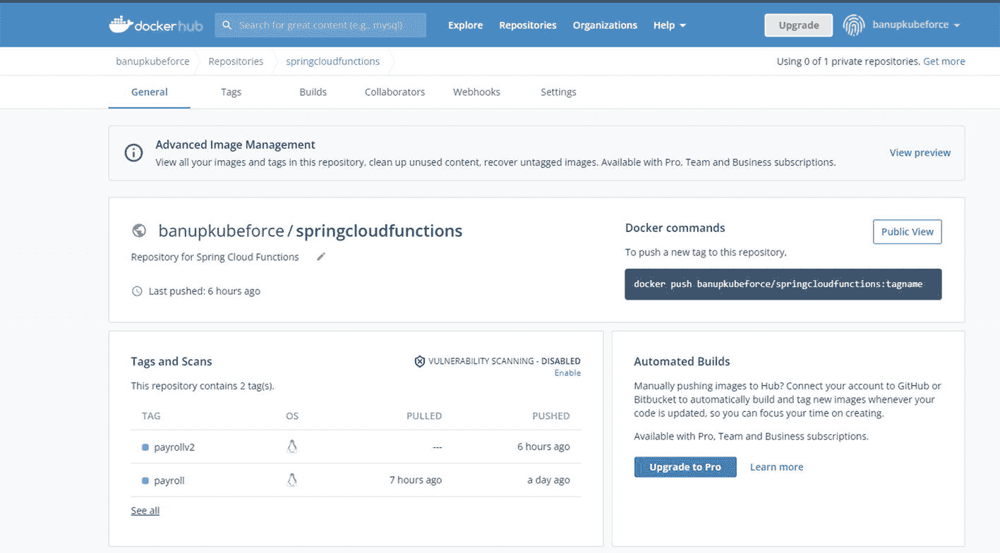

Docker Hub 部署镜像的截图。主页面包含 Spring Cloud Functions、Docker 命令、标签和扫描、以及自动构建功能。

图 2-31

Docker Hub 已成功部署镜像

您可以通过运行以下命令获取 URL 并检查端点是否准备好进行测试：

```
$ kn services list
```

您需要用于测试或发布的目标 URL 是 `payroll.default.13.58.221.247.sslip.io`

步骤 6：测试。使用步骤 5 中获得的 URL 运行测试。该 URL 为 [`https://payroll.default.13.58.221.247.sslip.io/employeeConsumer`](https://payroll.default.13.58.221.247.sslip.io/employeeConsumer)

您可以使用 Postman 或 curl 进行测试。图 2-33 展示了 Postman 的测试结果。

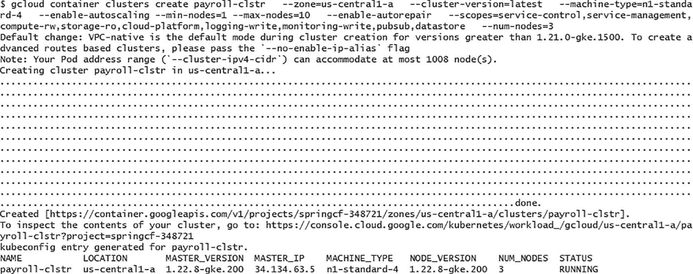

集群运行日志的截图。包含名称、位置、主版本、主 IP、机器类型、节点版本、节点数量和状态。

图 2-34

集群已正常运行

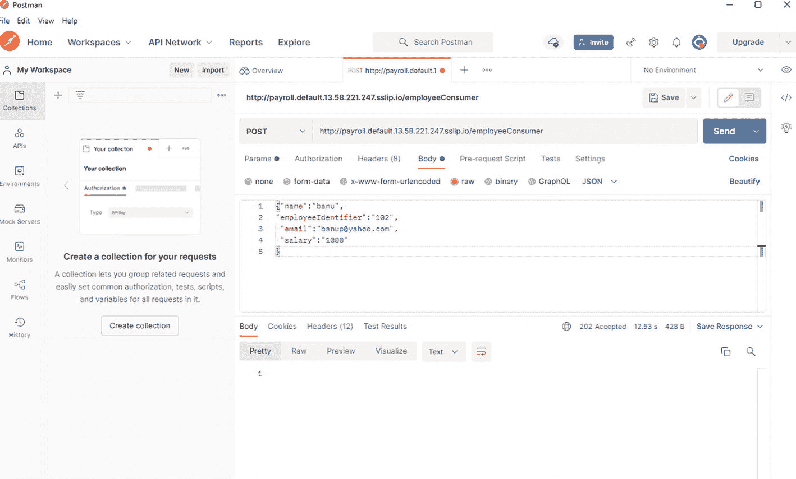

Postman 页面的截图。页眉标签包括首页、工作区、API 网络、报告和探索。页面正文包含名称、员工标识符、电子邮件和薪资。

图 2-33

使用 URL 通过 Postman 测试


## 2.7 在 GCP 上设置 Cloud Run/GKE 和 Knative 与 Spring Cloud Function

本节将探讨在 GCP 上部署一个已配置 Knative 的 GKE 集群。你将看到与第 2.5 节的相似之处，因为你会创建集群、启用 Knative 并部署 Docker 镜像。

前提条件：

*   GCP 订阅([`https://cloud.google.com/`](https://cloud.google.com/))

*   Gcloud CLI，可在[`https://cloud.google.com/sdk/docs/install`](https://cloud.google.com/sdk/docs/install)找到

*   kubectl([`https://kubernetes.io/docs/tasks/tools/`](https://kubernetes.io/docs/tasks/tools/))

*   Knative 服务([`https://knative.dev/docs/serving`](https://knative.dev/docs/serving))

*   Knative CLI([`https://knative.dev/docs/client/install-kn/`](https://knative.dev/docs/client/install-kn/))

*   IntelliJ、Eclipse、VS Code 或其他 IDE

*   GitHub 上的代码（如果使用 Dockerhub 上的镜像则可选）

*   注册在 Docker hub 上的 Docker 镜像

步骤 1：使用 GKE 设置 Kubernetes 集群。在此步骤中，你将创建一个 GKE 集群。请确保你拥有足够的权限来创建集群。更多信息请参见[`https://cloud.google.com/kubernetes-engine/docs/deploy-app-cluster`](https://cloud.google.com/kubernetes-engine/docs/deploy-app-cluster)。

在运行命令前，请确保已使用 Gcloud CLI 登录 GCP。运行列表 2-22 中的命令。

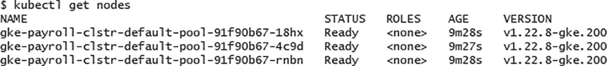

一个 GKE 集群状态的截图。包含名称、状态、角色、年龄和版本。所有状态都已就绪。

图 2-35

GKE 集群状态

```
$gcloud container clusters create payroll-clstr \
--zone=us-central1-a \
--cluster-version=latest \
--machine-type=n1-standard-4 \
--enable-autoscaling --min-nodes=1 --max-nodes=10 \
--enable-autorepair \
--scopes=service-control,service-management,compute-rw,storage-ro,cloud-platform,logging-write,monitoring-write,pubsub,datastore \
--num-nodes=3
列表 2-22
在 GCP 上创建集群
```

通过运行以下命令检查集群状态：

```
$kubectl get nodes
```

导航至 Google Cloud 的 GKE 仪表板以验证集群。参见图 2-36。


Kourier 运行日志的截图。包含命名空间、类型和补丁。网络已成功分发。

图 2-37

Kourier 已成功补丁

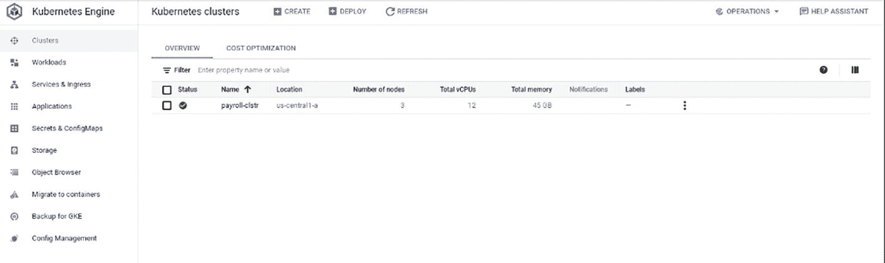

Google Kubernetes Engine 的截图。选中了集群标签。包含 Kubernetes 集群。其概览包含状态、名称、位置、节点数量、总 VCPU 和总内存。

图 2-36

Google Cloud 上的 GKE 仪表板

步骤 2：在 GKE 上配置 Knative。此步骤与之前使用 EKS 或本地 Kubernetes 时的操作类似：

1.  通过运行以下命令安装 Knative 服务组件：

1.  通过运行以下命令安装用于入口的 Kourier 组件：

```
$kubectl apply -f https://github.com/knative/serving/releases/download/knative-v1.4.0/serving-crds.yaml
$kubectl apply -f https://github.com/knative/serving/releases/download/knative-v1.4.0/serving-core.yaml
```

1.  通过以下命令配置 Kourier 用于入口：

```
$kubectl apply -f https://github.com/knative/net-kourier/releases/download/knative-v1.4.0/kourier.yaml
```

```
$kubectl patch configmap/config-network \
--namespace knative-serving \
--type merge \
--patch '{"data":{"ingress-class":"kourier.ingress.networking.knative.dev"}}'
```

1.  通过以下命令应用默认域名：

1.  通过运行以下命令检查 Knative 组件状态：

```
$kubectl apply -f https://github.com/knative/serving/releases/download/knative-v1.4.0/serving-default-domain.yaml
```

```
$kubectl get pods -n knative-serving
```


1.  运行以下命令以获取 Kourier 入口信息：

```
$kubectl –namespace kourier-system get service kourier
```

现在您已经配置并运行了 Knative，可以继续进行下一步：将应用镜像推送到 Knative。

步骤 3：使用 Docker 容器化应用并推送到仓库（可选）。

这是一个可选步骤，因为您已经在第 2.5 节部署了镜像。可以跳过此步骤，直接进入步骤 4。此处我使用了 JDK 8，但您可以通过将`FROM`语句改为`FROM adoptopenjdk/openjdk11:latest`使用最新版 JDK，如列表 2-23 所示。

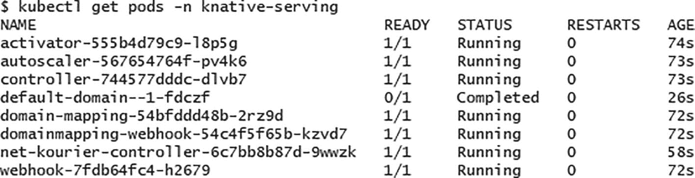

K native 服务运行日志的截图。包含名称、就绪状态、状态、重启次数和运行时间。所有命名空间均运行成功。

图 2-38

Knative 服务运行成功

```
FROM openjdk:8-jdk-alpine
ARG JAR_FILE=target/*.jar
COPY ${JAR_FILE} app.jar
ENTRYPOINT ["java","-jar","/app.jar"]
列表 2-23
用于创建容器和镜像的 Dockerfile
```

步骤 4：推送至 Docker 仓库。下一步是将 Docker 镜像推送到 Dockerhub 仓库，如图 2-40 所示。请确保登录至 Dockerhub 的地址为[`https://hub.docker.com/`](https://hub.docker.com/)，并创建仓库和命名空间。您需要这些信息来进行 Docker 推送。

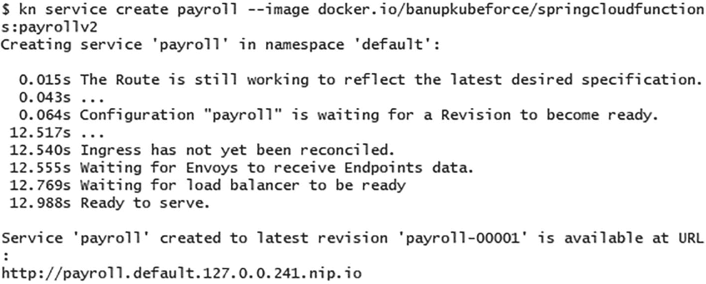

在 TKG 上使用 K native 日志的应用部署截图。命令仍处于路由状态，且准备就绪。输出是创建了服务 payroll 到最新版本 payroll。

图 2-50

在 TKG 上应用部署

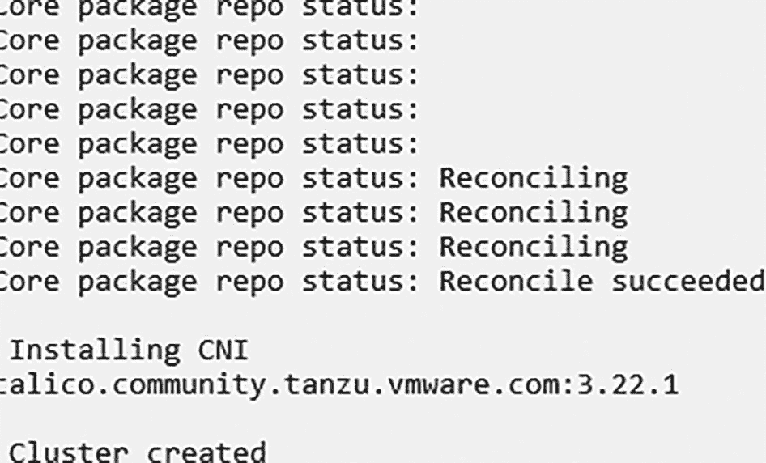

TKG 集群安装的截图。包含核心包仓库状态。输出是集群已创建。

图 2-49

TKG 集群成功安装

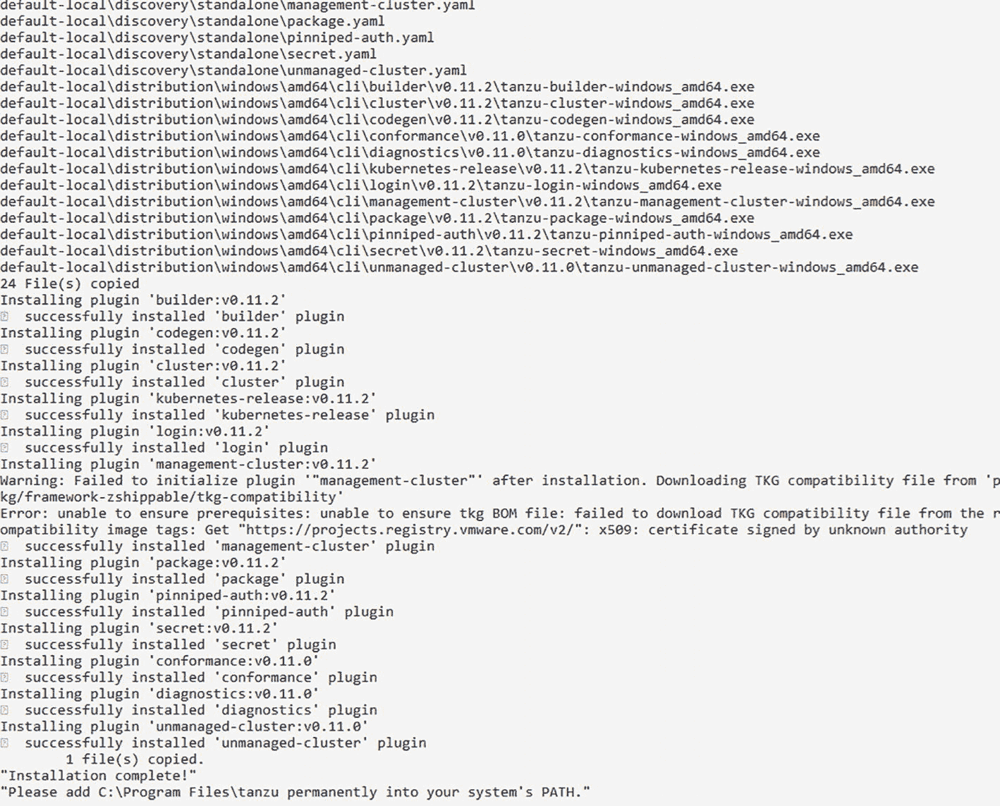

在本地机器上安装 TKG 组件的日志截图。安装构建器、集群、Kubernetes 发布、登录和管理集群。输出是安装已完成。

图 2-48

在本地机器上成功安装 TKG 组件

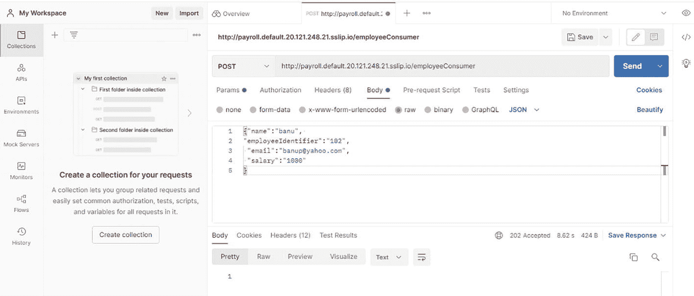

在 AKS 上使用 K native 测试 payroll 的截图。选择了集合标签并显示创建集合标签。正文包含名称、员工标识符、电子邮件和薪资。

图 2-47

在 AKS 上成功测试 payroll 示例

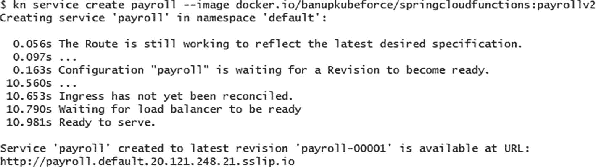

在 AKS 上部署的应用日志截图。命令仍处于路由状态，且准备就绪。输出是服务 payroll 创建到最新版本。

图 2-46

应用成功部署在 AKS 上

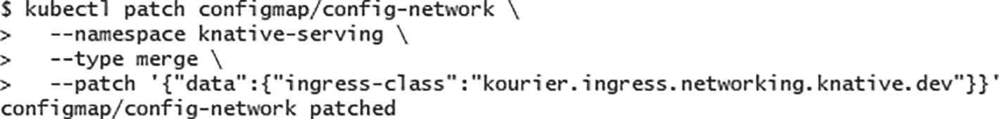

Kourier 入口修补运行日志的截图。包含命名空间、类型合并和修补。输出配置的网络已修补。

图 2-45

Kourier 入口已修补

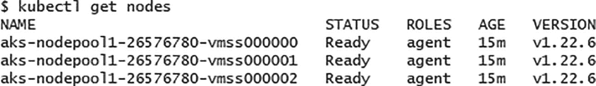

AKS 集群运行日志的截图。包含名称、状态、角色和运行时间。所有集群均处于就绪状态。

图 2-44

AKS 集群已就绪

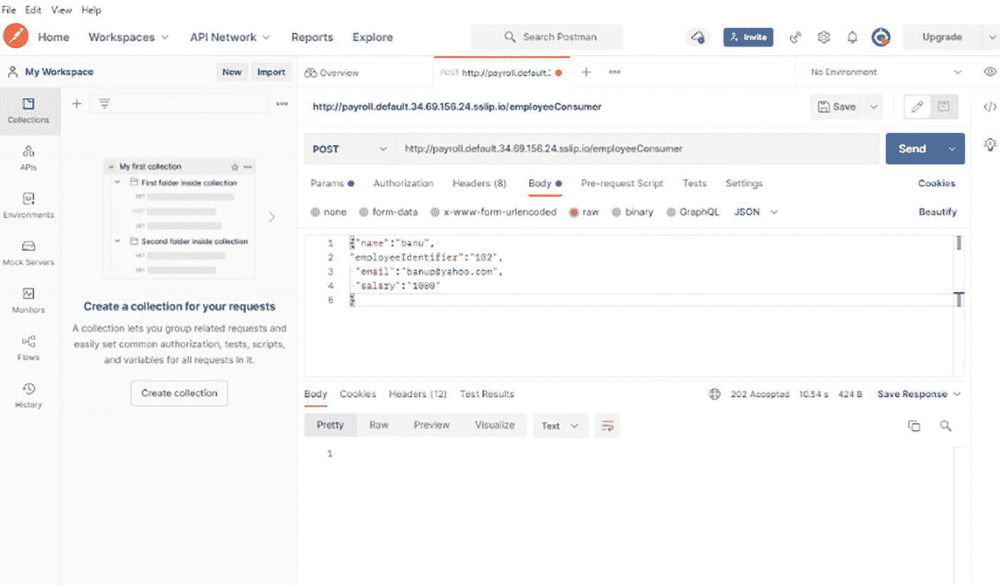

使用 Postman 成功测试的截图。标题标签包括主页、工作区、API 网络、报告和探索。正文包含名称、员工标识符、电子邮件和薪资。

图 2-43

使用 Postman 成功测试

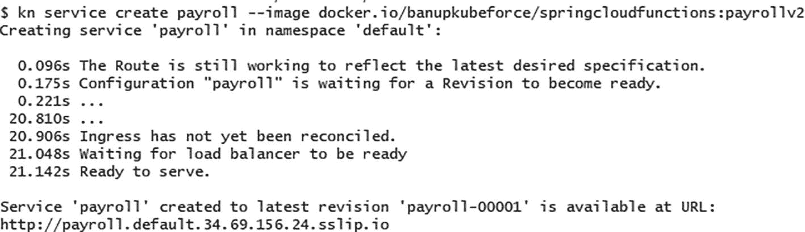

payroll 应用运行日志的截图。命令仍处于路由状态，配置 payroll 正在等待，且准备就绪。输出是服务 payroll 创建到最新版本。

图 2-42

payroll 应用部署在 GKE 上

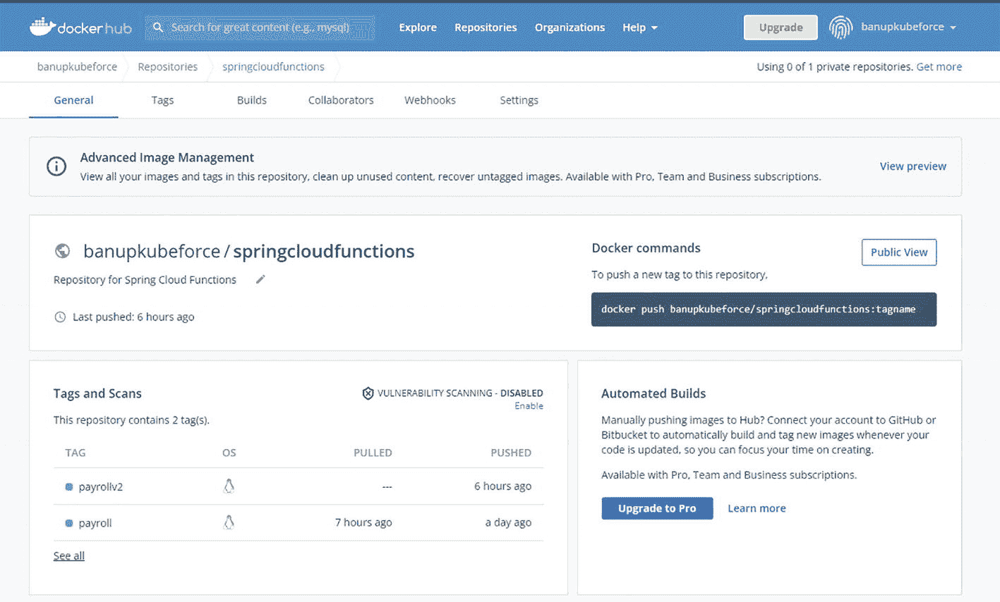

Docker 仓库部署镜像的截图。包含 Spring Cloud Functions、Docker 命令、标签和扫描，以及自动构建。

图 2-41

Docker 仓库中的部署镜像

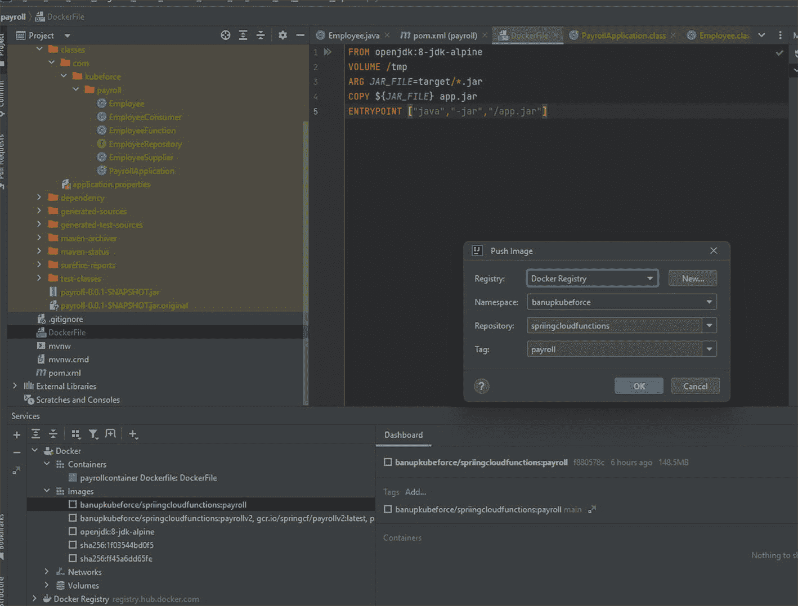

payroll 应用的截图。左侧包含项目，在该项目中选择了 Docker 文件。创建了推送镜像页面，包含注册表、命名空间、仓库和标签。

图 2-40

从 IDE 推送 Docker 镜像

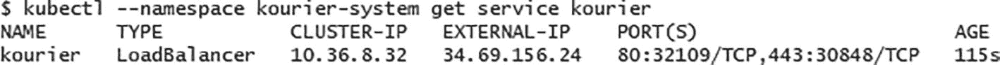

Kourier 服务状态运行日志的截图。包含名称、类型、集群 IP、外部 IP、端口和运行时间。

图 2-39

Kourier 服务状态显示外部 IP

一旦推送成功，您可以导航至 Dockerhub 检查镜像的部署情况，如图 2-41 所示。

步骤 5：将应用部署到 GKE 上的 Knative。我跳过了第 2.6 节步骤 4 中使用的 Kubectl 部署方法，改用 Knative 命令行工具进行部署。如果您需要对部署有更多控制，可以使用第 2.6 节步骤 4 中建议的方法。

```
$ kn service create payroll –image docker.io/banupkubeforce/springcloudfunctions:payrollv2
```

图 2-42 显示了运行`kn cli`的结果。YAML 执行可为您提供对目标环境的更多控制。请注意 URL，因为测试步骤需要它。此处示例显示的 URL 为[`https://payroll.default.34.69.156.24.sslip.io`](https://payroll.default.34.69.156.24.sslip.io)。

步骤 6：测试。使用步骤 5 中提供的 DNS 名称，测试以下 URL：

[`https://payroll.default.34.69.156.24.sslip.io/employeeConsumer`](https://payroll.default.34.69.156.24.sslip.io/employeeConsumer)

现在您已成功将 payroll 应用部署在 GKE 上。


## 2.8 使用 AKS 和 Knative 配置 Azure 与 Spring Cloud Function

本节将探讨在已配置 Knative 的 Azure AKS 集群上部署应用。你将看到与第 2.5 节相似的内容，因为你会创建集群、启用 Knative 并部署 Docker 镜像。

前提条件：

*   Azure 订阅 ([`https://portal.azure.com`](https://portal.azure.com)`/`)

*   Azure CLI，可在 [`https://docs.microsoft.com/en-us/cli/azure/install-azure-cli`](https://docs.microsoft.com/en-us/cli/azure/install-azure-cli) 找到

*   kubectl ([`https://kubernetes.io/docs/tasks/tools/`](https://kubernetes.io/docs/tasks/tools/))

*   Knative 服务 ([`https://knative.dev/docs/serving`](https://knative.dev/docs/serving))

*   Knative CLI ([`https://knative.dev/docs/client/install-kn/`](https://knative.dev/docs/client/install-kn/`)`

*   IntelliJ、Eclipse、VS Code 或其他 IDE

*   GitHub 上的代码（如果你仅使用 Dockerhub 上的镜像则可选）

*   注册在 Docker hub 上的 Docker 镜像

步骤 1：使用 AKS 设置 Kubernetes 集群。在此步骤中，你将创建一个 AKS 集群。请确保你拥有足够的权限来创建集群。更多信息请参见 [`https://docs.microsoft.com/en-us/azure/aks/learn/quick-kubernetes-deploy-cli`](https://docs.microsoft.com/en-us/azure/aks/learn/quick-kubernetes-deploy-cli)。

在运行以下命令之前，请确保已使用 Azure CLI 登录 Azure。然后运行清单 2-24 中的命令。

```
az aks create --resource-group $RESOURCE_GROUP \
--name $CLUSTER_NAME \
--generate-ssh-keys \
--kubernetes-version 1.22.6 \
--enable-rbac \
--node-vm-size Standard_DS3_v2
Listing 2-24
Dockerfile
```

通过运行清单 2-25 中的命令，配置你的 `kubeconfig` 以使用你创建的 AKS 集群。

```
$ az aks get-credentials --resource-group payroll-rsg --name payrollclstr
Listing 2-25
设置 Kubeconfig
```

通过运行清单 2-26 中的命令，检查集群状态。

```
kubectl get nodes
Listing 2-26
检查状态
```

步骤 2：在 AKS 上配置 Knative。此步骤与之前在 EKS 或本地 Kubernetes 上的操作类似。

安装 Knative 服务：

```
$kubectl apply -f https://github.com/knative/serving/releases/download/knative-v1.4.0/serving-crds.yaml
$kubectl apply -f https://github.com/knative/serving/releases/download/knative-v1.4.0/serving-core.yaml
$kubectl apply -f https://github.com/knative/net-kourier/releases/download/knative-v1.4.0/kourier.yaml
```

使用以下命令配置 Kourier 以用于入口（ingress）：

```
$kubectl patch configmap/config-network \
--namespace knative-serving \
--type merge \
--patch '{"data":{"ingress-class":"kourier.ingress.networking.knative.dev"}}'
```

使用以下命令应用默认域名：

```
$kubectl apply -f https://github.com/knative/serving/releases/download/knative-v1.4.0/serving-default-domain.yaml
```

通过运行清单 2-27 中的命令，获取 Kourier 入口信息。

```
$kubectl –namespace kourier-system get service kourier
Listing 2-27
获取入口信息
```

现在你已经配置并运行了 Knative，可以继续下一步将应用镜像推送到 Knative。

步骤 3：使用 Docker 容器化应用并将其推送到仓库。如果你选择创建并部署到 Dockerhub 仓库，则可参考第 2.5、2.6 或 2.7 节的步骤 3。

步骤 4：将应用部署到 AKS 上的 Knative。在此，我再次使用 Knative CLI `kn` 部署应用，因为这对这个简单的练习来说非常方便。

运行清单 2-28 中的命令。

```
$ kn service create payroll –image docker.io/banupkubeforce/springcloudfunctions:payrollv2
Listing 2-28
部署 Payroll 应用
```

注意生成的 URL。你将使用此 URL 进行测试。

步骤 5：测试。使用步骤 4 提供的 DNS 名称，测试以下 URL：

[`https://payroll.default.20.121.248.sslip.io/employeeConsumer`](https://payroll.default.20.121.248.sslip.io/employeeConsumer)

## 2.9 在 VMware Tanzu TKG 上设置与 Knative

与其他 Kubernetes 产品类似，在本地笔记本电脑上设置和安装 Tanzu Kubernetes Grid（TKG）上的 Knative 非常简单。

VMware 发布了一个社区版，可在本地安装。更多信息请参见 [`https://tanzucommunityedition.io/download/`](https://tanzucommunityedition.io/download/)。

前提条件：

*   TKG 下载 ([`https://tanzucommunityedition.io/download/`](https://tanzucommunityedition.io/download/))

*   kubectl ([`https://kubernetes.io/docs/tasks/tools/`](https://kubernetes.io/docs/tasks/tools/))

*   Knative 服务 ([`https://knative.dev/docs/serving`](https://knative.dev/docs/serving))

*   Knative CLI (`https://knative.dev/docs/client/install-kn/`)

*   IntelliJ、Eclipse、VS Code 或其他 IDE

*   GitHub 上的代码（如果你仅使用 Dockerhub 上的镜像则可选）

*   注册在 Docker hub 上的 Docker 镜像

以下是配置和部署 Spring Cloud Function 到 VMware Tanzu 的步骤：

*   步骤 1：在本地设置 TKG。

*   步骤 2：为你的应用创建 Kubernetes 集群。

*   步骤 3：在 TKG 集群上安装 Knative。

*   步骤 4：在 Knative 上部署应用。

步骤 1：在本地设置 TKG。按照网站上的说明在本地设置 TKG。这将为你提供一个非管理集群。

图 2-48 展示了一个成功的安装。

步骤 2：为你的应用创建集群。在此，你将为 payroll 示例创建一个集群。运行以下命令：

```
$tanzu unmanaged-cluster create payroll
```

你将收到一条消息，表明 payroll 集群已完成，如图 2-49 所示。

步骤 3：在 TKG 集群上安装 Knative。运行以下命令在 TKG 集群上安装 `kantive-serving`：

```
$tanzu package install knative-serving --package-name knative-serving.community.tanzu.vmware.com --version 1.0.0
```

步骤 4：如图 2-50 所示，在 Knative 上部署应用。

注意提供的 URL。在这种情况下，它是 `http://payroll.default.127.0.0.241.nip.io`。

步骤 5：测试。参考第 2.5 节的步骤 5，使用 Postman 或 curl 测试 [`http://payroll.default.127.0.0.241.nip.io/employeeConsumer`](http://payroll.default.127.0.0.241.nip.io/employeeConsumer) URL。

这完成了 Tanzu Kubernetes Grid 或 TKG 的成功部署。

## 2.10 总结

本章解释了如何使用 Spring Cloud Function 开发和部署到各种目标平台，包括 AWS Lambda、Google Functions、Azure Functions 以及 Kubernetes 环境如 AWS EKS、Google 的 GKE、Azure AKS、VMware Tanzu 等。借助 Kubernetes，你可以使用 Knative 将相同镜像部署到所有其他 Kubernetes 平台，而无需更改代码。Knative 确保代码可以在任何 Kubernetes 平台中移植。这一点至关重要，因为它确保了在迁移至任何云平台时的最小中断。总结来说，你现在应该对如何使用 Spring Cloud Function 构建无服务器函数有了良好的理解。下一章将探讨如何自动化 Spring Cloud Function 的部署过程。


