# 3. 使用 Spring Cloud Function 进行 CI/CD

正如你在第 2 章所学到的，你可以构建一个 Spring Cloud Function 并将其部署到多个环境中。你可以使用各种手动方法，例如 Azure-Function:Deploy、Gcloud CLI、AWS CLI、Kubectl 和 Knative CLI。在拥有众多团队、大量程序员和大量代码的企业中，这些手动方法并不可持续。如果每个团队成员都使用自己的方法来构建和部署代码，这将是一个管理噩梦。此外，正如你所看到的，这个过程是可重复的。由于其可重复性，有机会利用自动化。

本章探讨了自动化部署过程的方法。它利用了一些流行的自动化部署方案。它将探讨 GitHub Actions 用于部署 Lambda、Google Cloud Functions 和 Azure Functions，并且你会将其与 ArgoCD 集成以推送到 Kubernetes/Knative 环境。虽然你可以单独使用 GitHub Actions 来处理所有环境，但这需要自定义脚本来推送至 Kubernetes。ArgoCD 内置了用于部署到 Kubernetes 的钩子，这是更优选的方式。有关 GitHub Actions 的更多信息，请参见 [`https://github.com/features/actions`](https://github.com/features/actions)，有关 ArgoCD 的更多信息，请参见 [`https://argoproj.github.io/cd/`](https://argoproj.github.io/cd/)。

让我们深入探讨 GitHub Actions 和 ArgoCD。

## 3.1 GitHub Actions

这是一个与 GitHub 紧密集成的 CI/CD 平台；它允许你从 GitHub 创建和触发工作流。因此，如果你是 GitHub 的粉丝，你会非常喜欢这个新功能。当你注册 GitHub 时，GitHub Actions 会自动集成到你的项目中，因此你无需使用 Jenkins 或 Circle CI 等独立工具。当然，这意味着你的代码仓库必须限制在 GitHub 上。创建工作流非常简单。你可以通过导航到你的项目并点击 Actions 选项卡中的“新建工作流”按钮，在 GitHub 网站上直接创建工作流，如图 3-1 所示。

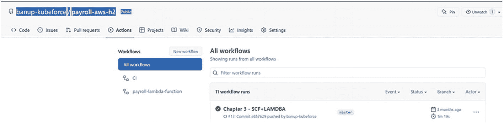

banup-kubeforce 窗口的截图。选中了动作选项卡。它描述了所有工作流。包含所有工作流的运行记录、事件、状态、品牌和操作者。

图 3-1

创建新的 GitHub Actions 工作流

点击“新建工作流”后，如图 3-2 所示，你会进入工作流“市场”，可以选择建议的工作流或自行设置工作流。点击“自行设置工作流”链接以开始创建自定义工作流。

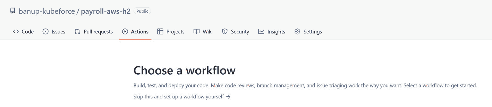

banup-kubeforce 窗口的截图。选中了动作选项卡，该选项卡显示了一条选择工作流的消息。

图 3-2

选择工作流设置的市场

如图 3-3 所示，点击“自行设置工作流”窗口会带你到可以编写工作流脚本的页面。

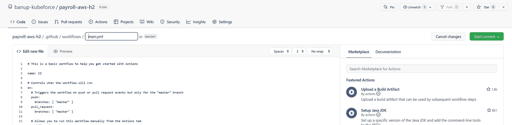

banup-kubeforce 窗口的截图。选中了代码选项卡。窗口左侧显示代码，右侧在市场选项卡下包含特色操作，如上传构建产物和设置 Java JDK。

图 3-3

创建自定义工作流的页面

如图 3-3 所示，工作流指向在项目根目录下的`./github/workflows`目录中创建的`main.yaml`文件。你也可以在 IDE 中创建相同文件，一旦提交代码，它就会出现在 Actions 选项卡下。列表 3-1 展示了为 AWS Lambda 部署的示例代码。

```
name: CI
on:
  push:
    branches: [ "master" ]
jobs:
  build-deploy:
    runs-on: ubuntu-latest
    steps:
    - uses: actions/checkout@v2
    - uses: actions/setup-java@v2
      with:
        java-version: '8'
        distribution: 'temurin'
        cache: maven
    - uses: aws-actions/setup-sam@v1
    - uses: aws-actions/configure-aws-credentials@v1
      with:
        aws-access-key-id: ${{ secrets.AWS_ACCESS_KEY_ID }}
        aws-secret-access-key: ${{ secrets.AWS_SECRET_ACCESS_KEY }}
        aws-region: us-east-2
    - name: 使用 Maven 构建
      run: mvn -B package --file pom.xml
    # sam package
    - run: sam package --template-file template.yaml --output-template-file packaged.yaml --s3-bucket payrollbucket
    # 运行单元测试- 指定单元测试
    # sam deploy
    - run: sam deploy --no-confirm-changeset --no-fail-on-empty-changeset --stack-name payroll-aws --s3-bucket payrollbucket --capabilities CAPABILITY_IAM --region us-east-2
```

列表 3-1
用于在 AWS Lambda 上部署的 Payroll 函数工作流

让我们深入分析 YAML 文件的各个组件。

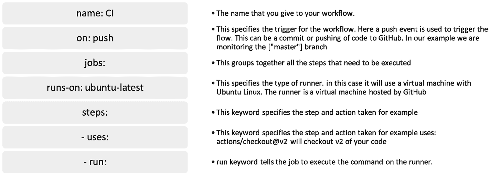

工作流代码的详细说明。包含名称、on-push、jobs、runs-on ubuntu-latest、步骤、uses 和 run 及其详细信息。

图 3-4

工作流代码说明

这设置了 GitHub Actions 工作流及其触发器。现在，每次你向 GitHub 上的此项目仓库提交或推送代码时，该工作流都会执行。图 3-5 展示了该工作流的执行示例。

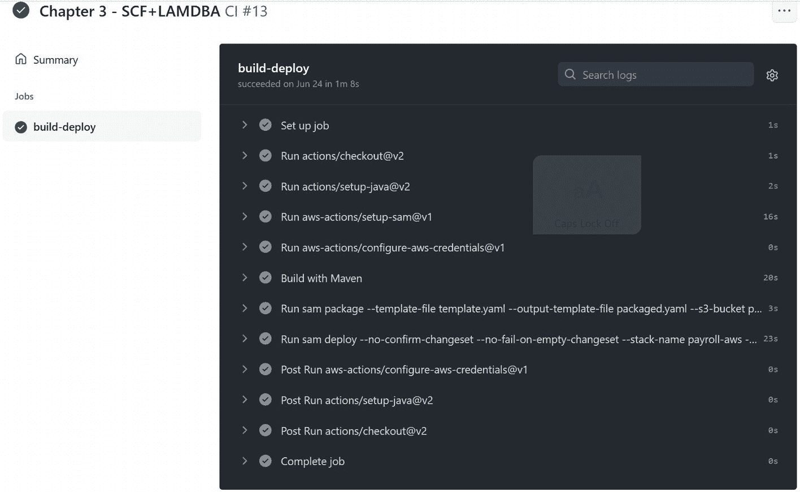

第 3 章 S C F 加 Lambda 的截图。在 jobs 下选中了 build-deploy。build-deploy 窗口包含设置任务、运行操作、运行 aws-actions、使用 Maven 构建、运行 Sam 打包和部署、post 运行 aws 等。

图 3-5

工作流的成功执行


## 3.2 ArgoCD

虽然 GitHub Actions 可以将代码推送到 Lambda 等无服务器环境，但在 Kubernetes 环境中，它缺乏对已部署代码的良好图形化表示。Kubernetes 是容器编排工具，拥有大量管理部署的服务。ArgoCD 是专为 Kubernetes 设计的，它是一个声明式 CD（持续交付）工具，这意味着应用程序定义、配置和环境都可以进行版本控制。与 GitHub Actions 类似，ArgoCD 使用 Git 仓库作为单一真实来源。这也被称为*GitOps*。

> *声明式意味着配置由一组事实保证，而不是由一组指令保证。*

声明式 GitOps 允许程序员或应用程序创建者控制应用程序运行环境的配置。这意味着程序员无需依赖基础设施团队或 DevOps 团队来管理应用程序的各个部分。程序员掌控一切，这是件好事。

ArgoCD 的设置主要通过编程方式完成，并依赖于底层 Kubernetes 的 configmaps。正如你所看到的，这与其他工具如 Jenkins 不同。

以下是 ArgoCD 环境的设置方法。

前提条件：

*   一个 Kubernetes 集群

*   配置好的 Kubectl CLI 以访问你的集群

*   ArgoCD CLI 的安装说明可在 [`https://argo-cd.readthedocs.io/en/stable/cli_installation/`](https://argo-cd.readthedocs.io/en/stable/cli_installation/) 找到

步骤 1：为 ArgoCD 创建一个命名空间。

在你的 Kubernetes 集群上运行以下命令：

```
$kubectl create namespace argocd
```

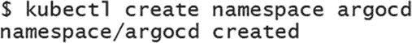

创建 ArgoCD 命名空间的截图。截图显示，美元符号 Kubectl create namespace ArgoCD 命名空间 斜杠 ArgoCD 创建成功。

图 3-6

创建 ArgoCD 命名空间

步骤 2：安装 ArgoCD。

```
$kubectl apply -n argocd -f https://raw.githubusercontent.com/argoproj/argo-cd/stable/manifests/install.yaml
```

这将执行一个较长的安装过程。一旦安装成功，你可以使用以下命令验证：

```
$kubectl get all -n argocd
```

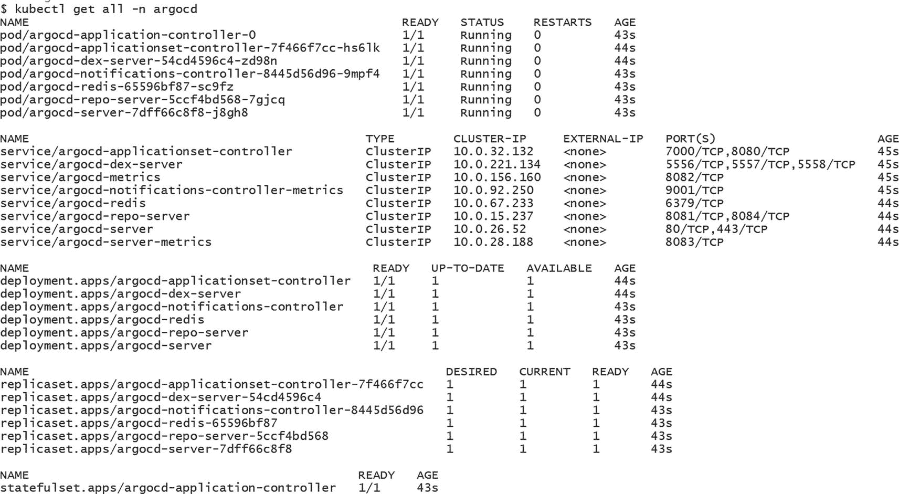

截图描述了 ArgoCD 安装运行日志的状态。它包含名称、状态、重启次数等信息。

图 3-7

查看 ArgoCD 安装状态

现在你可以看到 ArgoCD 服务已启动并运行。请注意，`service/argocd-server`尚未分配外部 IP。

运行以下命令将 LoadBalancer 附加到`argocd-server`：

```
$kubectl patch svc argocd-server -n argocd -p '{"spec": {"type": "LoadBalancer"}}'
```

现在运行以下命令：

```
$kubectl get svc -n argocd
```

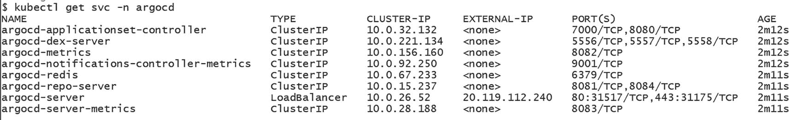

ArgoCD 服务器外部 IP 运行日志的截图。它包含名称、类型、集群 IP、外部 IP、端口和年龄信息。

图 3-8

记录`argocd-server`的外部 IP

你将看到`argocd-server`已关联外部 IP。这将允许你连接到`argocd-server`。

在开始使用 ArgoCD 之前，你需要更改“admin”用户的密码。你可以使用 Kubectl 读取与“admin”用户关联的密钥。

运行以下命令：

```
$ kubectl -n argocd get secret argocd-initial-admin-secret -o jsonpath="{.data.password}" | base64 -d; echo
```

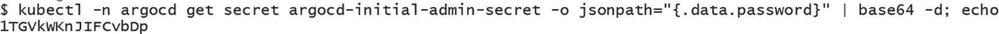

获取“admin”用户密码的截图。截图展示了一段代码。

图 3-9

获取“admin”用户的密码

该命令的输出是“admin”用户的密码。

现在你可以使用网络浏览器登录。然后导航到 20.119.112.240 网址以更改密码。

使用以下命令登录 ArgoCD：

```
$argocd login 20.119.112.240
```

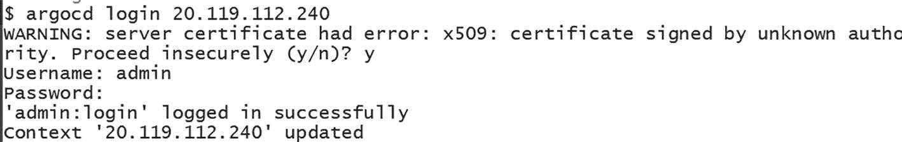

ArgoCD 登录运行日志的截图。如果出现警告错误，命令提示证书由未知权威机构签署。运行日志包含详细信息，并显示管理员成功登录。

图 3-10

ArgoCD 登录

你已成功安装并连接到 ArgoCD。图 3-11 展示了 ArgoCD UI 的示例。

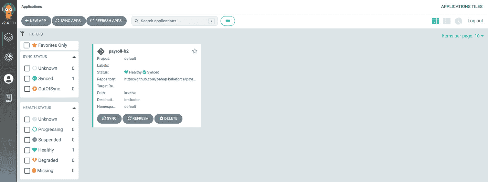

ArgoCD UI 中部署应用程序的截图。它展示了 Payroll-h2 项目，包含项目、标签、状态、仓库、路径、目标等信息。状态为健康且同步。

图 3-11

ArgoCD UI 显示已部署的应用程序

现在你已经了解了 GitHub Actions 和 ArgoCD，可以继续部署你的应用程序并自动化 CI/CD 流程。

## 3.3 使用 Spring Cloud Function 构建简单示例

你将使用与第 2 章相同的示例，但这次示例使用的是`EmployeeSupplier`而非`EmployeeConsumer`接口。为此，你需要一个预填充的数据库。随后，你将使用供应商函数查询数据库。你可以在此处找到代码： [`https://github.com/banup-kubeforce/payroll-h2`](https://github.com/banup-kubeforce/payroll-h2)。

以下是所需的更改。

步骤 1：创建脚本以在函数启动时填充 H2 数据库。创建一个生成`employee`表的模式。将脚本存储在名为`Schema.sql`的文件中，如清单 3-2 所示。

```
DROP TABLE IF EXISTS employee;
CREATE TABLE employee (
id INT AUTO_INCREMENT PRIMARY KEY,
name varchar(250),
employeeid varchar(250),
email varchar(250),
salary varchar(250)
);
清单 3-2
Schema.sql
```

使用`INSERT`语句填充数据库。然后创建一个名为`Data.sql`的文件，并将`INSERT`语句存储其中，如清单 3-3 所示。

```
INSERT INTO employee (name, employeeid, email, salary) values
('banu','001','banup@yahoo.com','10000');
清单 3-3
Data.sql
```

将这两个文件添加到主项目的 resources 文件夹中，如图 3-12 所示。

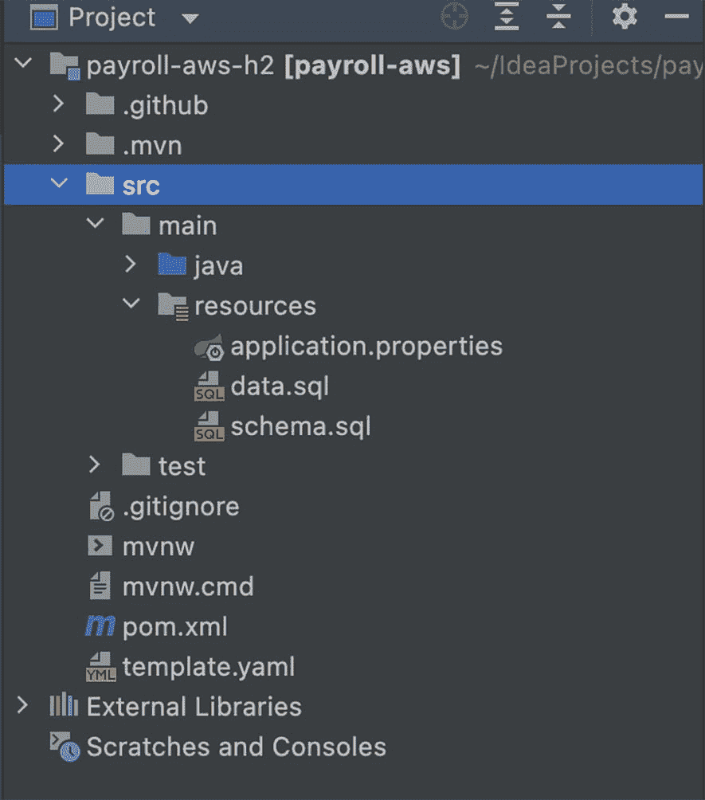

Spring Boot 项目结构的截图。在项目结构中，选中了 src 文件夹。它包含 resources 文件夹。resources 文件夹包括 data.sql、schema.sql 文件夹及其他文件夹。

图 3-12

包含 data.sql 和 schema.sql 的 Spring Boot 项目结构

按照以下方式修改`Application.properties`。将`spring.cloud.function.definition`从`employeeConsumer`更改为`employeeSupplier`。这将使函数调用路由到`employeeSupplier`。参见清单 3-4。

```
spring.cloud.function.definition=employeeSupplier
spring.datasource.url=jdbc:h2:mem:employee
spring.datasource.driverClassName=org.h2.Driver
spring.datasource.username=sa
spring.datasource.password=
spring.h2.console.enabled=true
spring.jpa.database-platform=org.hibernate.dialect.H2Dialect
spring.jpa.defer-datasource-initialization=true
清单 3-4
Application.properties
```

同时添加`spring.jpa.defer-datasource-initialization=true`以确保启动时数据被填充。

无需进行其他代码更改。需要注意的是，你所做的更改仅影响配置文件。


## 3.4 设置 CI/CD 流水线以部署到目标平台

如本章引言中所讨论的，您将使用两个工具进行 CI/CD 流程。GitHub Actions 可用作 CI（持续集成）和 CD（持续交付）的工具，而 ArgoCD 是专门用于 CD 的工具。

ArgoCD 是为 Kubernetes 设计的，因此您可以专门使用该工具进行 Knative/Kubernetes 部署。您将使用 GitHub Actions 来处理 Lambda 等无服务器环境。

图 3-13 展示了将代码部署到 AWS Lambda、Google Cloud Functions 和 Azure Functions 等无服务器环境时的流程。

流程步骤如下：

1. 创建代码并将代码推送到 GitHub 仓库。
2. GitHub Actions 检测到提交事件触发器，并启动在 actions 脚本中定义的无服务器环境的构建和部署流程。

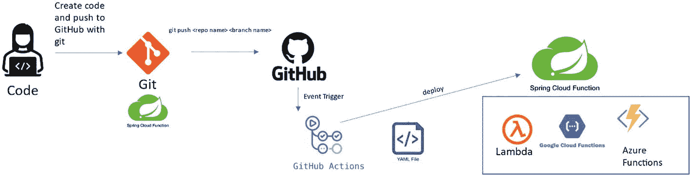

部署到无服务器函数的流程图。通过 Git 流将代码推送到 GitHub 仓库，GitHub 事件触发导致 GitHub Actions 执行并将 Spring Cloud Function 部署到 Lambda。

图 3-13

部署到无服务器函数环境

图 3-13 展示了将 Spring Cloud Function 部署到配置了 Knative 的 Kubernetes 环境时的流程。

流程步骤如下：

1. 创建代码并将代码推送到 GitHub 仓库。
2. GitHub Actions 检测到提交事件触发器，启动构建流程并将生成的容器镜像部署到 Docker Hub。
3. ArgoCD 轮询 GitHub 的更改并触发“同步”操作。然后从 Docker Hub 获取容器镜像，并将其部署到 Kubernetes 上的 Knative。参见图 3-14。

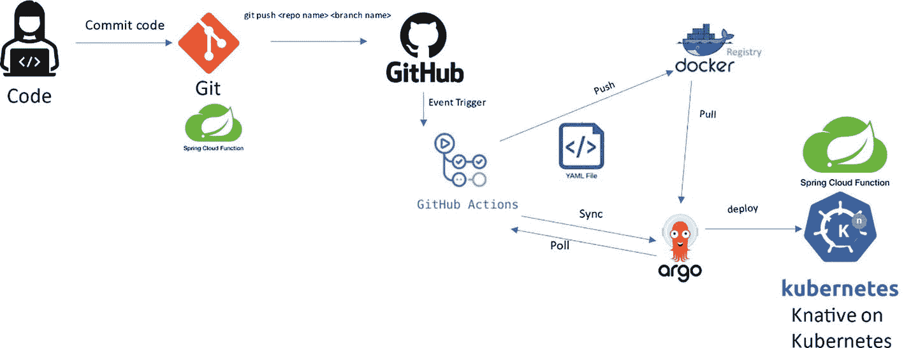

描述部署到 Knative-Kubernetes 环境的流程图。通过 Git 提交的代码被推送到 GitHub，GitHub 事件触发的 Actions 将代码推送到 Docker 并同步，Argo 则拉取镜像进行部署。Spring Cloud Function 在 Kubernetes 上运行。

图 3-14

部署到 Knative-Kubernetes 环境

## 3.5 部署到目标平台

本节将探讨将 Spring Cloud Function 部署到目标环境（如 AWS Lambda、Google Cloud Functions、Azure Functions 和 Kubernetes 上的 Knative）的流程。

所有环境的前置条件如下：

* 部署到 GitHub 的代码仓库
* 访问和连接目标环境的权限信息
* 每个环境的第 2 章所有前置条件。请参见第 2 章获取每个环境的详细信息
* 使用第 2 章中成功部署的案例作为每个部署的参考

### 3.5.1 部署到 AWS Lambda

部署到 AWS Lambda 需要使用基于 SAM（Serverless Application Model）的 GitHub Actions 脚本。本节将解释如何使用 SAM 和 GitHub Actions。无需额外编码。

前置条件：

* AWS 账户
* AWS Lambda 函数订阅
* 存储代码构建的 S3 存储桶
* （可选）AWS CLI 以通过 CLI 验证部署
* GitHub 上的代码：[`github.com/banup-kubeforce/payroll-aws-h2`](https://github.com/banup-kubeforce/payroll-aws-h2)

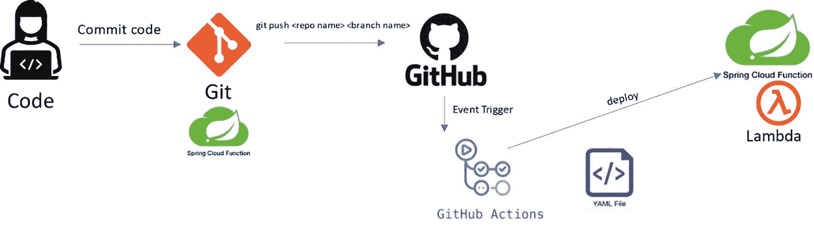

描述通过 GitHub Actions 部署 Spring Cloud Function 的流程图。通过 Git 提交的代码被推送到 GitHub，GitHub 事件触发的 Actions 将 Spring Cloud Function 部署到 Lambda。

图 3-15

通过 GitHub Actions 在 AWS Lambda 上部署 Spring Cloud Function

步骤 3：执行 GitHub Actions。一旦工作流配置完成，即可通过 GitHub 控制台或通过`sam-pipeline.yaml`文件中定义的代码提交触发操作。

```
on:
push:
branches: [ "master" ]
```

GitHub Actions 执行 YAML 文件中列出的步骤，并将函数部署到 AWS Lambda。图 3-17 展示了成功运行的示例。

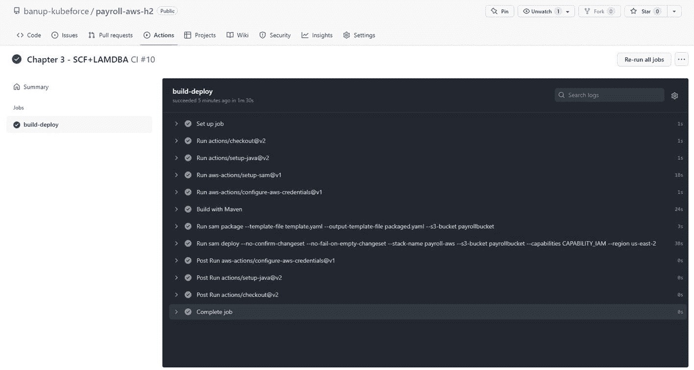

banup-kubeforce 窗口的截图。选中了构建部署按钮，显示了构建部署窗口，包含设置任务、使用 Maven 构建、运行 Sam package 等操作。

图 3-17

GitHub Actions 在 AWS Lambda 上的成功执行

步骤 4：验证 AWS Lambda 中函数是否正常运行。

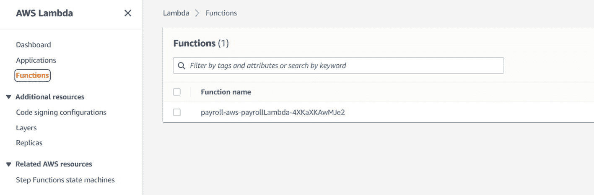

AWS Lambda 窗口的截图。选中了函数，显示了函数名称。

图 3-18

GitHub Actions 执行后创建的函数

由于`payroll-aws-h2`应用程序暴露了`EmployeeSupplier`，您可以通过对函数执行简单的`GET`请求，查看 Spring Cloud Function 启动时插入数据库的数据是否返回结果。

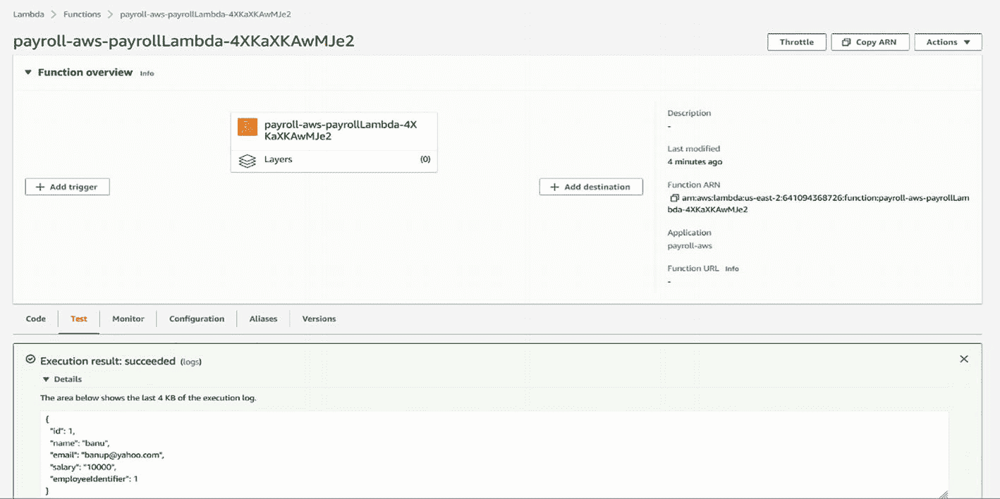

Lambda 函数窗口的截图。展示了函数的概述及其描述。

图 3-19

测试函数是否成功。查看 JSON 响应

在图 3-19 中，您可以看到测试已成功，并查看了数据库中的 JSON 结果。


## 3.6 部署到 GCP 云函数

使用 GitHub Actions 将代码部署到 GCP 云函数有点侵入性，因为您需要在 resources 文件夹中添加一个 `MANIFEST.MF` 文件。请查看 GitHub 中的代码。

前提条件：

*   一个包含代码的 GitHub 仓库。您可以通过 [`https://github.com/banup-kubeforce/payroll-gcp-h2.git`](https://github.com/banup-kubeforce/payroll-gcp-h2.git) 获取代码

*   在 Google Cloud Functions 中注册 Google 账户

*   如果您仅使用 GitHub Actions 网站，Gcloud CLI 是可选的

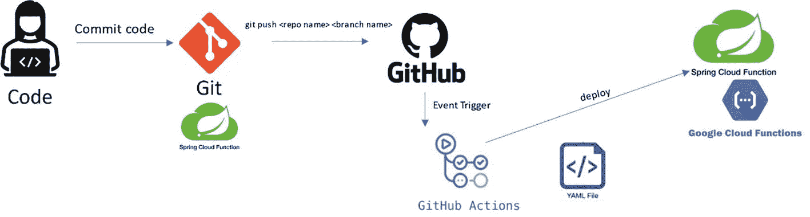

流程图描述了 GCP 与 GitHub Actions 的交互流程。通过 Git 提交的代码会被推送到 GitHub。事件触发的 GitHub Actions 会将 Spring Cloud Function 部署到 Google 云函数。

图 3-20

GCP 与 GitHub Actions 流程

步骤 1：GitHub 中的 Spring Cloud Function 代码。将您的代码推送到 GitHub。如果您已经克隆了 [`https://github.com/banup-kubeforce/payroll-gcp-h2.git`](https://github.com/banup-kubeforce/payroll-gcp-h2.git)，则您已具备将代码推送到仓库所需的所有内容。

步骤 2：设置 Cloud Functions 动作。

设置 GitHub Actions 以运行 Cloud Functions 命令。您有两个选择：

*   使用 `deploy-cloud-functions runner`

*   使用 `gcloud-cli`

列表 3-6 显示了 GitHub Actions 文件。

```
name: Google Cloud Functions
on:
push:
branches: [ "master" ]
jobs:
build-deploy:
runs-on: ubuntu-latest
steps:
- uses: actions/checkout@v2
- uses: actions/setup-java@v2
with:
java-version: '11'
distribution: 'temurin'
cache: maven
- name: 使用 Maven 构建
run: mvn -B package --file pom.xml
- id: 'auth'
uses: 'google-github-actions/auth@v0'
with:
credentials_json: '${{ secrets.GCP_CREDENTIALS }}'
- name: '设置 Cloud SDK'
uses: 'google-github-actions/setup-gcloud@v0'
- name: '使用 gcloud CLI'
run: 'gcloud functions deploy payroll-gcp --entry-point org.springframework.cloud.function.adapter.gcp.GcfJarLauncher --runtime java11 --trigger-http --source target/deploy --memory 512MB'
列表 3-6
部署到 GCP 云函数的 Payroll 函数工作流
```

请注意，您需要在 GitHub 密钥仪表板中存储 `GCP_CREDENTIALS`。

与之前的 AWS Lambda 示例类似，注意检出、设置和构建 Maven 的步骤是相同的。对于认证和部署，您使用 Google Cloud CLI。设置 Cloud SDK 任务会下载并配置 Google CLI。您可以使用与第 2 章节中从笔记本电脑部署时相同的命令行脚本。

步骤 3：提交并推送代码以触发 GitHub Actions。此触发器由 actions 代码定义。在此示例中，任何对“master”分支的推送或提交都会触发 GitHub Actions。

```
on:
push:
branches: [ "master" ]
```

这可以在 GitHub Actions 网站或 IDE 中完成。您可以通过在“master”分支上进行简单修改来提交更改。这将启动 GitHub Action 流程。

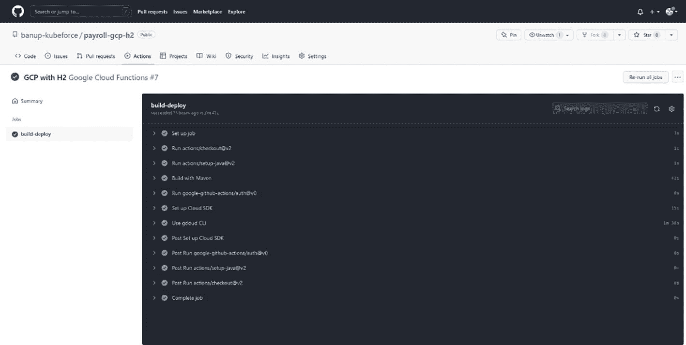

banup-kubeforce 窗口的截图。已选择“构建部署”按钮。构建部署窗口显示了一个新界面，包括设置任务、使用 Maven 构建、运行 Sam 包装等。

图 3-21

代码提交触发 GitHub Actions

一旦 actions 成功完成任务，您可以前往 Google 云函数仪表板并测试该函数。同样，您只需对 `EmployeeSupplier` 函数执行一个简单的 GET 请求即可。

步骤 4：测试函数。

在测试函数之前，请确保从未认证设备（如您的笔记本电脑）调用该函数。完成测试后，请移除权限以避免不必要的调用。


payroll-g c p- h 2 的未认证设置截图。已允许设置，其中包括指向第一代 payroll 的链接及其他详细信息。

图 3-22

允许 payroll-gcp-h2 的未认证设置

您可以前往 Google 云函数仪表板中的函数控制台并执行测试。您无需提供任何输入，只需点击“测试函数”按钮即可执行测试。您将在“输出”部分看到 `EmployeeSupplier` 的输出结果，如图 3-23 所示。

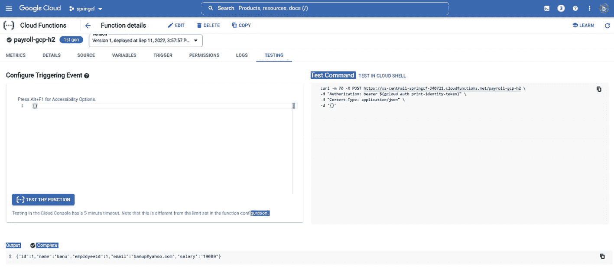

Google 云窗口的截图。显示了云函数。在 payroll-g c p-h 2 中，已选择一个函数。它配置了触发事件并显示了测试命令。

图 3-23

GCP 云函数中 Spring Cloud Function 测试的成功输出


## 3.7 部署到 Azure Functions

在 Azure Functions 上部署 Spring Cloud Function 需要一些调整，正如你在第 2 章中所学到的。这是因为配置未实现外部化，与 AWS Lambda 或 GCP Cloud Functions 不同。这并不意味着你无法轻松部署。你需要理解 Azure Function 代码如何解释 Spring Cloud Function 代码并执行。有关此问题的讨论，请参见第 2 章；在将代码推送到 Azure 云之前，请务必在本地执行和测试。

步骤 1：在 GitHub 上的 Spring Cloud Function 代码。将你的代码推送到 GitHub。如果你克隆了 [`https://github.com/banup-kubeforce/payroll-azure-h2.git`](https://github.com/banup-kubeforce/payroll-azure-h2.git)，则你已具备将代码推送到仓库所需的一切。

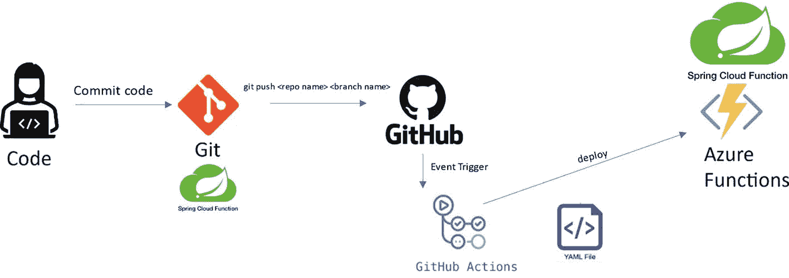

一个流程图描述了在 Azure 上部署 Spring Cloud Function 的流程。通过 Git 提交的代码被推送到 GitHub。事件触发的 GitHub 操作和部署 Spring Cloud Function 到 Azure Functions。

图 3-24

在 Azure 上部署 Spring Cloud Function 的流程

步骤 2：设置 Azure Function 应用操作。参见清单 3-7。

```
name: Deploy Java project to Azure Function App
on:
push:
branches: [ "master" ]
# 配置
# 如需帮助，请访问 https://github.com/Azure/Actions
#
# 1\. 在仓库中设置以下密钥：
#   AZURE_FUNCTIONAPP_PUBLISH_PROFILE
#
# 2\. 根据你的配置更改这些变量：
env:
AZURE_FUNCTIONAPP_NAME: payroll-kubeforce-new      # 设置为 Azure 上的函数应用名称
POM_XML_DIRECTORY: '.'                     # 设置为包含 pom.xml 文件的目录
POM_FUNCTIONAPP_NAME: payroll-kubeforce-new       # 设置为本地开发环境中的函数应用名称
JAVA_VERSION: '11'                      # 设置为要使用的 Java 版本
jobs:
build-and-deploy:
runs-on: ubuntu-latest
environment: dev
steps:
- name: 'Checkout GitHub Action'
uses: actions/checkout@master
- name: Setup Java Sdk ${{ env.JAVA_VERSION }}
uses: actions/setup-java@v1
with:
java-version: ${{ env.JAVA_VERSION }}
- name: '使用 Mvn 恢复项目依赖'
shell: bash
run: |
pushd './${{ env.POM_XML_DIRECTORY }}'
mvn clean package
popd
- name: '运行 Azure Functions 操作'
uses: Azure/functions-action@v1
id: fa
with:
app-name: ${{ env.AZURE_FUNCTIONAPP_NAME }}
# package: './${{ env.POM_XML_DIRECTORY }}/target/azure-functions/${{ env.POM_FUNCTIONAPP_NAME }}'
package: './${{ env.POM_XML_DIRECTORY }}/target/azure-functions/${{ env.POM_FUNCTIONAPP_NAME }}'
#        package: '${{ env.POM_XML_DIRECTORY }}/target/azure-functions/${{ env.POM_FUNCTIONAPP_NAME }}'
#  package: 'target/azure-functions/${{ env.POM_FUNCTIONAPP_NAME }}'
publish-profile: ${{ secrets.AZURE_FUNCTIONAPP_PUBLISH_PROFILE }}
清单 3-7
用于在 Azure Functions 上部署 Payroll 函数的工作流
```

步骤 3：执行 GitHub 操作。GitHub 操作通过 `actions` 文件中的以下设置执行：

```
on:
push:
branches: [ “master” ]
```

任何对 “master” 分支的提交或推送都会触发 GitHub 操作的执行；参见图 3-25。

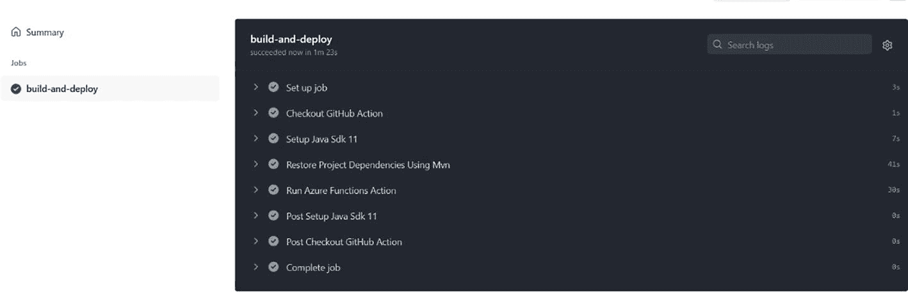

测试窗口的截图。选中“构建和部署”按钮，显示包含设置任务、使用 Maven 构建、运行 Sam 包装等的构建部署窗口。

图 3-25

使用 GitHub 操作成功部署 Payroll Spring Cloud Function

在成功使用 GitHub 操作部署后，你需要通过 Azure Functions 控制台验证部署；参见图 3-26。

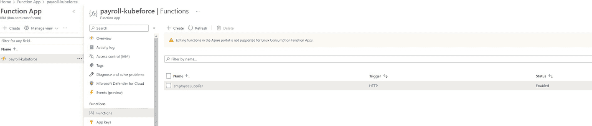

Azure Functions 控制台的截图。在 payroll-kubeforce 下选中的函数包括名称、触发器和状态等详细信息。

图 3-26

Azure Functions 控制台显示函数 employeeSupplier 已部署

点击 `employeeSupplier` 链接以查看图 3-27。

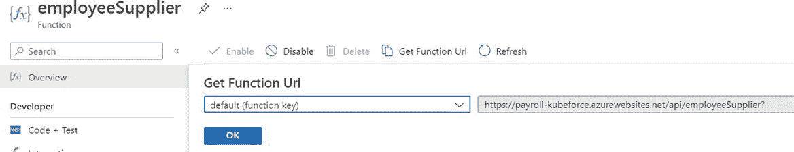

employee supplier 控制台的截图。选中“概览”标签。显示获取函数 URL、默认函数密钥和 ok 标签。

图 3-28

获取函数的 URL

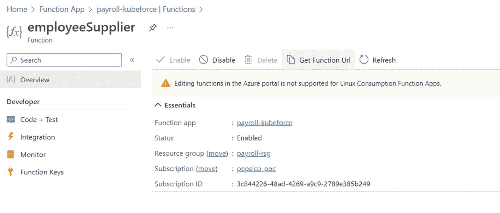

employee supplier 控制台的截图。选中“概览”标签，选中“概览”下的获取函数，显示基本信息及其他详细信息（如函数应用、状态等）。

图 3-27

在 employeeSupplier 控制台点击获取函数 URL

函数的 URL 是 [`https://payroll-kubeforce.azurewebsites.net/api/employeeSupplier`](https://payroll-kubeforce.azurewebsites.net/api/employeeSupplier)。使用此 URL 进行测试。

步骤 4：测试。你将使用外部测试工具来验证已部署的函数是否正常运行。此处使用的工具是 Postman。

你可以简单地使用 `GET` 操作进行测试，如图 3-29 所示。

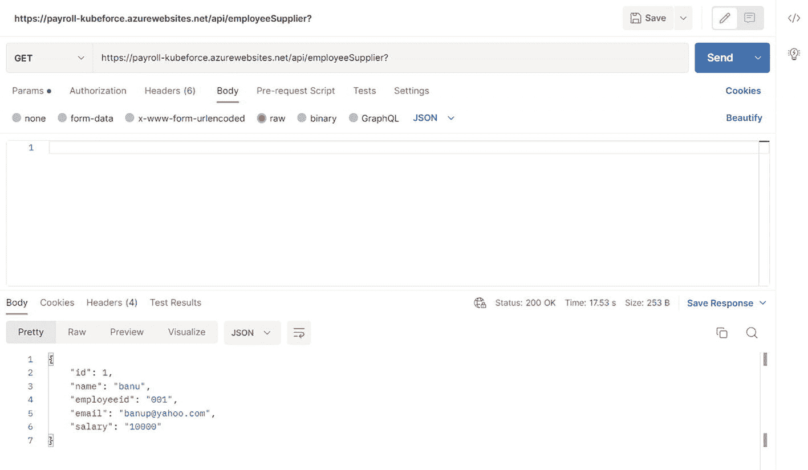

测试 payroll-Kubeforce Azure 网站的窗口截图。选中“正文”标签。显示原始、二进制和 Graph Q L 等选项及其他详细信息。

图 3-29

使用 Postman 成功测试结果

至此，已完成通过 GitHub 操作在 Azure Functions 上部署 Spring Cloud Function 的流程。


## 3.8 在 Kubernetes 上部署到 Knative

在 Kubernetes 上部署 Spring Cloud Function 的 CI/CD 流程对于所有平台都相似，唯一不同的是集群名称。本节使用 ArgoCD ([`http://argoproj.github.io`](http://argoproj.github.io)) 进行持续交付，尽管你也可以使用 GitHub Actions 实现相同效果。我发现 GitHub Actions 需要较多的代码配置，因此希望将 CD 流程与开发过程分离，并使用能够直观展示部署状态的工具。ArgoCD 提供了良好的可视化界面。

为了拥有适用于所有云环境的公共仓库，本示例将使用 Docker Hub。Docker Hub 提供了良好的镜像管理界面，并且受到开发者的广泛欢迎。如果你使用 ECR、GCR 或 ACR，可能会面临厂商锁定的风险。

在任何 Kubernetes 平台上部署的前提条件是相同的：

* 从 GitHub 获取代码。你可以使用 [`https://github.com/banup-kubeforce/payroll-h2.git`](https://github.com/banup-kubeforce/payroll-h2.git) 或推送自定义代码

* 一个 Docker Hub 账户

* 一个用于推送至 Docker Hub 的 Dockerfile

* 项目中的 GitHub Actions 代码

* 一个配置了 Knative 的 Kubernetes 集群

* ArgoCD 已启动运行

* ArgoCD 中配置了用于轮询 GitHub 项目的应用


流程图描述了使用 GitHub Actions 和 ArgoCD 部署 Spring Cloud Function 的流程。通过 Git 提交代码会推送至 GitHub，事件触发的 GitHub Actions 会将代码推送到 Docker 并从 GitHub 拉取同步至 ArgoCD，最终在 Kubernetes 中部署 Spring Cloud Function。

图 3-30

使用 GitHub Actions 和 ArgoCD 部署 Spring Cloud Function 的流程

一旦前提条件准备就绪，你就可以开始配置自动化 CI/CD 流水线。对于本示例实现，你将使用 GitHub 上的代码 [`https://github.com/banup-kubeforce/payroll-h2.git`](https://github.com/banup-kubeforce/payroll-h2.git)。

步骤 1：GitHub 上的 Spring Cloud Function 代码。将你的代码推送到 GitHub。你可以使用 GitHub 中的 `payroll-h2` 代码。

步骤 2：创建 GitHub Action。列表 3-8 显示了该操作的代码。

```
name: ci
on:
push:
branches:
- 'main'
jobs:
docker:
runs-on: ubuntu-latest
steps:
-
name: 设置 QEMU
uses: docker/setup-qemu-action@v2
-
name: 设置 Docker Buildx
uses: docker/setup-buildx-action@v2
- uses: actions/checkout@v2
- uses: actions/setup-java@v2
with:
java-version: '8'
distribution: 'temurin'
cache: maven
-
name: 登录 DockerHub
uses: docker/login-action@f054a8b539a109f9f41c372932f1ae047eff08c9
with:
username: ${{ secrets.DOCKERHUB_USERNAME }}
password: ${{ secrets.DOCKERHUB_TOKEN }}
- name: 提取 Docker 元数据（标签、标签）
id: meta
uses: docker/metadata-action@98669ae865ea3cffbcbaa878cf57c20bbf1c6c38
with:
images: banupkubeforce/springcloudfunctions
- name: 构建并推送 Docker 镜像
uses: docker/build-push-action@ad44023a93711e3deb337508980b4b5e9bcdc5dc
with:
context: .
file: ./DockerFile
push: true
tags: ${{ steps.meta.outputs.tags }}
labels: ${{ steps.meta.outputs.labels }}
列表 3-8
推送 Payroll 函数镜像至 Docker Hub 的工作流
```

此代码会创建 Docker 镜像并推送到 Docker Hub。你可以在 GitHub 网站上将用户名和密码存储为密钥（见图 3-31）。

```
username: ${{ secrets.DOCKERHUB_USERNAME }}
password: ${{ secrets.DOCKERHUB_TOKEN }}
```

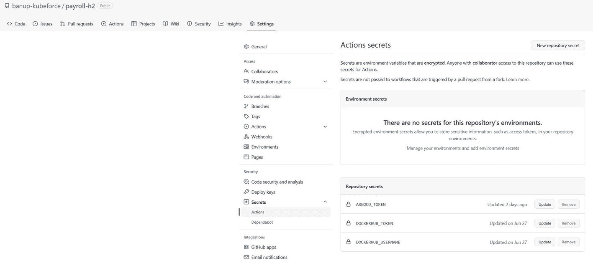

Payroll-Kubeforce 窗口的截图。在设置中选择操作，显示环境和仓库密钥及其详细信息。

图 3-31

GitHub 密钥存储用于配置和凭证管理

步骤 3：执行 GitHub Actions 构建并推送 Docker 镜像。

GitHub Actions 的执行可以通过推送/提交触发。触发器在 GitHub Actions 的 YAML 文件中定义：

```
on:
push:
branches:
- 'main'
```


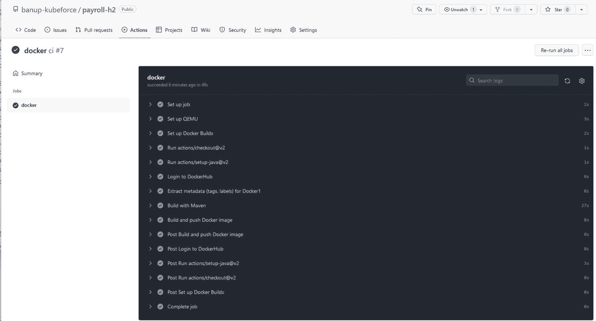

banup-kubeforce 窗口的截图。Docker 按钮已被选中。在 Docker 下方显示了设置任务、设置 Q E M U、使用 Maven 构建、运行 Sam 包等操作。

图 3-32

GitHub Actions 成功运行

步骤 4：配置 ArgoCD。

按照本章引言中概述的步骤进行 ArgoCD 配置。在执行此命令之前，需要在本地机器上连接到您的集群；请参见列表 3-9。

```
$ argocd app create payroll-h2 --repo https://github.com/banup-kubeforce/payroll-h2.git --path knative --dest-server https://kubernetes.default.svc --dest-namespace default –upsert
列表 3-9
ArgoCD 创建项目并指向 payroll-h2 仓库的脚本
```

这将在 ArgoCD 中创建`app payroll-h2`，如图 3-33 所示。

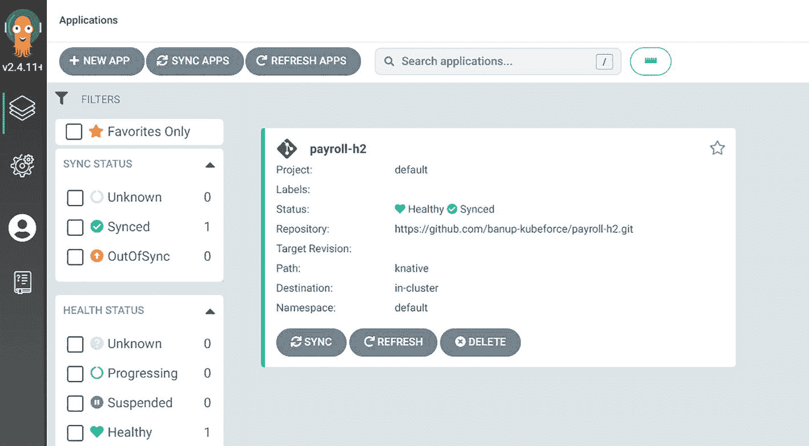

应用程序窗口的截图。展示了包含项目、标签、状态、仓库、路径、目标、目的地和名称的 Payroll-h 2 信息。状态显示为健康且已同步。

图 3-33

ArgoCD 中 Payroll-h2 应用程序的同步按钮

步骤 5：在 Argo CD 中同步项目。

现在您已创建应用程序并将其指向 GitHub 仓库，请确保已连接到仓库，如图 3-34 所示。我通过 HTTPS 连接到仓库。这将允许应用程序轮询更改并触发将 Docker 镜像推送到指定 Kubernetes 环境的流程。

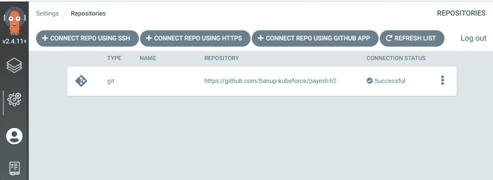

仓库窗口的截图。展示了类型、名称、仓库和连接状态。

图 3-34

通过 HTTPS 连接 payroll-h2 到仓库

您也可以通过点击 SYNC 手动运行部署，如图 3-35 所示。

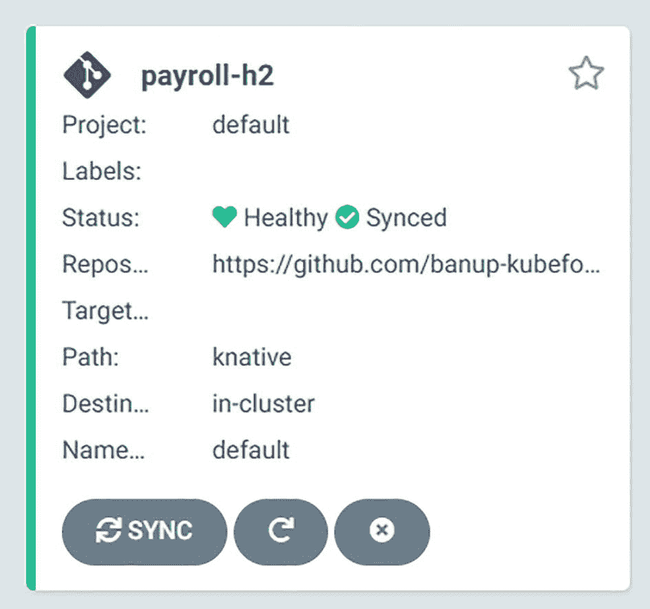

payroll-h 2 窗口的截图。展示了项目、标签、状态、仓库、目标、路径、目的地和名称。状态显示为健康且已同步。

图 3-35

ArgoCD 中 payroll-h2 应用程序的 SYNC 按钮

图 3-36 展示了 ArgoCD 中成功的同步过程。

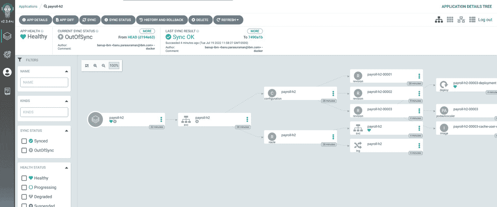

应用程序部署窗口的截图。选择同步按钮。显示 Payroll-h 2 信息，包括应用程序健康状态、当前同步状态和最后一次同步结果。

图 3-36

ArgoCD 中 payroll-h2 部署的同步流程成功运行

步骤 6：检查函数是否已部署。通过 Azure 门户访问 Kubernetes 仪表板并验证服务是否已部署。请参见图 3-37。

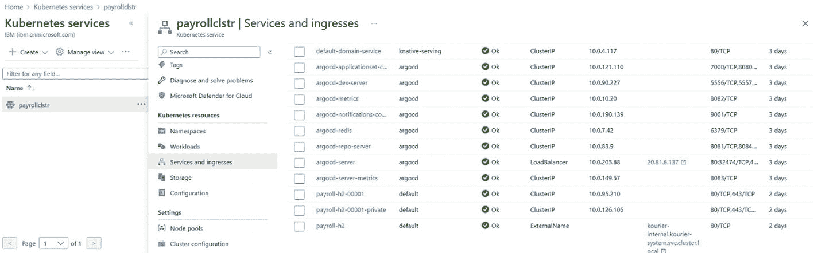

Kubernetes 服务仪表板的截图。显示了 payroll c l s t r 服务和 ingresses。服务和 ingresses 被选中，状态均为正常。

图 3-37

Spring Cloud Function（payroll-h2）在 Azure 上的成功部署

步骤 7：测试。获取测试 URL 的最佳方法是通过命令行连接到集群并获取 URL，如第 2 章所述。

运行`$kn service list`以获取测试 URL，如图 3-38 所示。

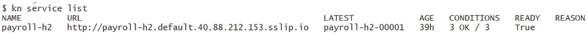

服务列表运行日志的截图。包含名称、URL、最新状态、年龄、条件、就绪状态和原因。

图 3-38

payroll-h2 的测试 URL

您可以使用 Postman 进行测试。请参见图 3-39。

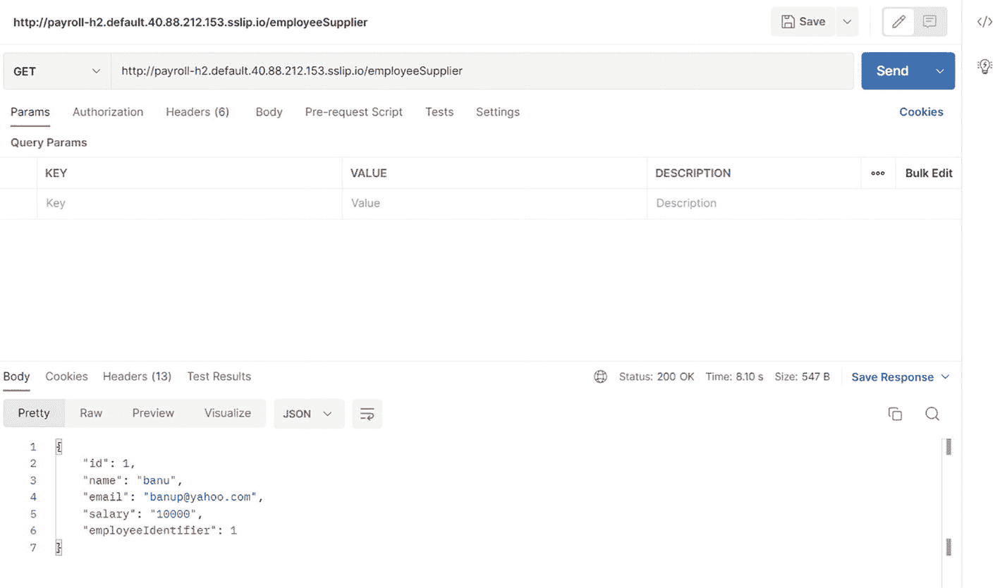

获取窗口的截图。选中了 params 参数。包含查询参数的键、值、描述和批量编辑功能。正文包含代码及其他选项卡（如 pretty、raw、preview 等）。

图 3-39

针对部署在 AKS Knative 上的 payroll-h2 执行测试的成功示例

使用 GitHub Actions 和 ArgoCD 完成 Spring Cloud Function 的成功部署。

## 3.9 总结

在本章中，您学习了如何设置一些 CI/CD 工具以为您 Spring Cloud Function 创建自动部署。

您还学习了如何在 Lambda、Google Cloud Functions 和 Azure Functions 上触发函数的部署。

此外，您了解到可以将存储在 Docker hub 中的 Docker 镜像构建与 ArgoCD 结合，将镜像部署到任何运行 Knative 的 Kubernetes 集群。

如果您希望实现“一次编写，随处部署”，必须考虑使用 Kubernetes 和 Knative。Spring Cloud Function 实际上是一个可移植的函数。

