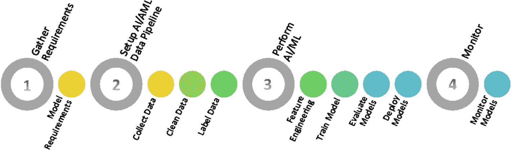
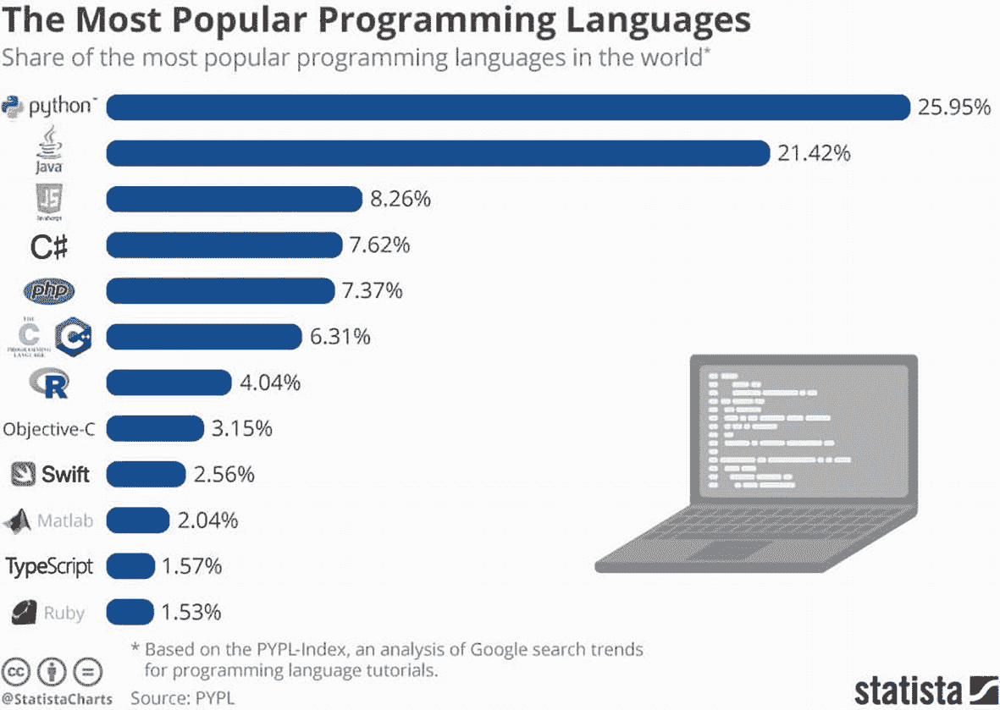
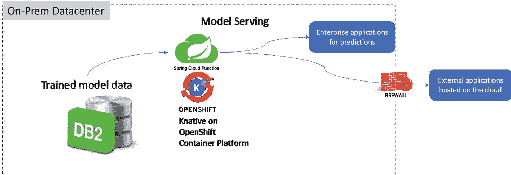
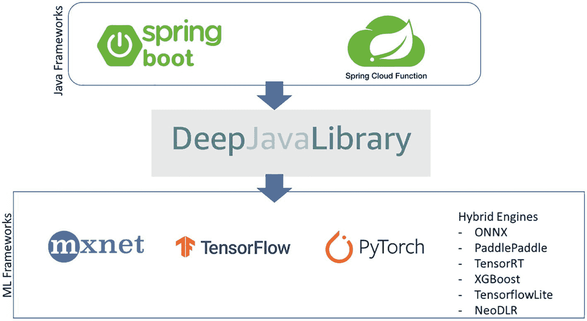

# 5. 使用 Spring Cloud Function 构建 AI/ML 训练的无服务器端点

本章探讨了 Spring Cloud Function 如何在 AI/ML 领域发挥作用。您将了解 AI/ML 流程，并学习 Spring Cloud Function 在该流程中的定位。您还将了解云服务提供商（如 AWS、Google 和 Azure）的一些服务。

在深入探讨 Spring Cloud Function 实现细节之前，您需要理解 AI/ML 流程。这将为实现 Spring Cloud Function 奠定基础。

## 5.1 AI/ML 简明概述

AI/ML 正在变得越来越流行，因为几乎所有云服务提供商都提供了相关服务。为了确保 AI/ML 正常运行，理解其背后流程非常重要。参见图 5-1。



机器学习生命周期流程。四个处理步骤包括：收集需求、设置 AI/ML 管道、执行 AI/ML 以及监控。

图 5-1

机器学习生命周期

让我们深入探讨图 5-1 中所示的流程，并了解其完成的工作。

1. 收集需求
    * 模型需求

这是 AI/ML 流程中的重要步骤。这决定了 AI/ML 模型活动的最终成败。模型的需求必须与业务目标相匹配。

* 期望从该活动中获得的投资回报率（ROI）是什么？

* 目标是什么？示例可能包括降低制造成本、减少设备故障或提高操作员生产力。

* 需要包含在模型中的特征有哪些？

* 在字符识别中，可以是计算水平和垂直方向上黑色像素数量的直方图，内部孔的数量等。

* 在语音识别中，可以是识别音素。

* 在计算机视觉中，可以包含大量特征，如物体、边缘、形状尺寸、深度等。

* 部署数据的差异

* 差异指的是学习算法对训练数据集的敏感性。每次尝试拟合模型时，输出参数可能会有细微变化，这将改变预测结果。在模型已部署的生产环境中，如果这些差异未及时修正，可能会产生显著影响。

* 数据完整性变化

* 机器学习数据是动态的，需要调整以确保向模型提供正确的数据。存在三种类型的数据完整性问题——缺失值、范围违规和类型不匹配。持续监控和管理这些问题对于良好的运营机器学习非常重要。

* 数据漂移

* 当训练数据集与生产环境中的输出数据不匹配时，就会发生数据漂移。

* 概念漂移

* 概念漂移是指随时间推移输入数据与输出数据之间关系的变化。例如，当您尝试预测消费者购买行为时，行为可能受您模型中未指定的因素影响。这些未在模型预测中显式使用的因素称为隐藏上下文。

1. 设置数据管道
    * 数据收集
        1. 需要整合哪些数据集

2. 数据来源是什么

3. 数据集是否可用

* 数据清洗：此活动涉及从数据集中移除不准确或噪声记录。这可能包括修正拼写和语法错误、标准化数据集、移除空字段以及删除重复数据。45%的数据科学家时间用于数据清洗（[`https://analyticsindiamag.com/data-scientists-spend-45-of-their-time-in-data-wrangling/`](https://analyticsindiamag.com/data-scientists-spend-45-of-their-time-in-data-wrangling/)）。


2.  执行 AI/ML 任务
    *   特征工程：这指的是所有用于从原始数据中提取和选择特征以构建预测模型的活动。这包括利用领域知识从原始数据中选择并转换最相关的变量。特征工程的目标是提升机器学习算法的性能。预测模型的成功或失败取决于特征工程，并确保模型对人类可解释。

    *   训练模型：在此步骤中，机器学习算法会通过足够的训练数据进行学习。训练模型的数据集包含样本输出数据和影响输出的输入数据集。这是一个迭代过程，将输入数据通过算法进行处理，并将其与样本输出进行关联。然后使用结果调整模型。这个迭代过程称为“模型拟合”，直到模型精度达到目标。

    *   模型评估：此过程涉及使用指标来理解模型的性能，包括其优势和不足。例如，在进行分类预测时，指标可以包括真正例、真负例、假正例和假负例。其他衍生指标可以是准确率、精确率和召回率。模型评估可帮助您判断模型的表现、模型的实用性、额外训练如何提升性能，以及是否需要增加更多特征。

    *   部署模型：此过程涉及将模型部署到实际运行环境中。这些模型可以通过模型服务的方式暴露给其他流程。模型的部署可能涉及将模型存储在如 Google Cloud Storage 等存储服务中。

3.  监控 AI/ML 模型

在此过程中，您需要确保模型正常运行且预测结果有效。需要监控模型的原因是，模型可能因以下因素随时间推移而退化：

让我们从计算角度评估这些活动。这将帮助我们确定可以分配给这些流程的计算元素类型。

此过程中的某些活动是短暂的，而另一些则是长期运行的流程。例如，部署模型和访问已部署的模型是短暂的流程。而训练模型和模型评估则需要手动和编程干预，并且会消耗大量计算时间。

表 5-1 展示了可用于这些流程的计算类型。某些流程是手动操作的。

表 5-1

在 AI/ML 流程中使用 Spring Cloud Function 的场景

| AI/ML 流程 | 人工 | 计算 |   |
| --- | --- | --- | --- |
|   |   | **Spring Cloud Function（短时运行）** | **批量处理（长时运行）** |
| 模型需求 | 人工/手动流程 |   |   |
| 收集数据 |   | 集成触发器、数据管道源或目标 | 数据管道流程-转换 |
| 数据清洗 |   | 集成触发器 | 转换流程 |
| 数据标注 |   | 标注离散元素-更新、删除 | 批量标注 |
| 特征工程 | 手动 |   |   |
| 训练模型 |   | 训练触发器 | 训练流程 |
| 模型评估 | 手动 | 评估触发器 | 批量评估 |
| 部署模型 |   | 模型服务、模型 | 批量存储 |
| 监控模型 |   | 报警 |   |

AI/ML 流程需要的计算和存储需求各不相同。根据模型规模、训练所需时间、模型复杂度等因素，流程在不同阶段可能需要不同的计算和存储资源。因此，环境需要具备可扩展性。在早期，AI/ML 活动通常通过固定基础设施进行，如过度分配的虚拟机、专用的裸金属服务器或并行/并发处理单元。这种方式使整个过程成本高昂，只有资金充足的公司才能开展规范的 AI/ML 活动。

如今，随着各大云服务商通过 API 或 SaaS 方式提供 AI/ML 功能，并支持按使用量付费或按需付费模式，大小企业都开始在计算活动中应用 AI/ML。

云函数等范式使利用云提供的可扩展平台变得更加容易。模型存储和检索等操作可以通过云函数按需完成。通过云函数提供预训练模型非常简便，且这些模型可以无需安装客户端库即可对任何客户端可用。以下是云函数在 AI/ML 中的优势：

*   无需编写代码即可进行推理，使入门变得简单
*   可扩展的基础设施
*   无需管理基础设施
*   模型独立存储，便于追踪版本和比较性能
*   成本结构允许按使用量付费
*   支持使用不同框架

### 5.1.1 在 AI/ML 中选择 Java、Python 或其他语言的考量

大多数流行框架（如 TensorFlow）是用 Python 编写的，因此模型输出也基于 Python。因此，从事 AI/ML 工作的任何人都可以轻松使用 Python。参见图 5-2。



一张展示最流行编程语言的水平条形图。图中提到了全球语言的标志、百分比和笔记本电脑图像。Python 占比最高为 25.95%，Ruby 占比最低为 1.53%。

图 5-2

AI/ML 语言流行度

需要明确的是，语言的流行度并不等同于其在 AI/ML 中的适用性。选择 Java 而非 Python 或 R 的原因包括：

*   企业已标准化使用 Java，因此更倾向于使用 Java 开发 AI/ML 平台以简化与现有系统的集成。

*   Apache.org 作为 Java 的开源社区非常强大，拥有大量经过优化的库和工具，这些工具针对计算速度、数据处理等方面进行了调优。Hadoop、Hive 和 Spark 等工具是 AI/ML 流程的重要组成部分。开发者可以轻松在 Java 代码中使用这些工具和库。

*   Java 可以在 AI/ML 流程的所有环节中使用，包括数据收集、清洗、标注、模型训练等。这样您就可以统一使用一种语言满足 AI/ML 需求。

*   JVM 允许应用程序在不同机器类型间移植。

*   由于 Java 的面向对象机制和 JVM，使其更容易实现扩展。

*   在算法和 JVM 层面进行适当调优后，基于 Java 的 AI/ML 计算可以实现更快的性能。因此，Twitter、Facebook 等平台更倾向于使用 Java。

*   Java 是一种强类型编程语言，意味着开发者必须明确且具体地定义变量和数据类型。

*   最后，生产代码库通常使用 Java 编写。如果您希望构建企业级应用，Java 是首选语言。

由于 Java 是 AI/ML 企业的首选语言，我们可以安全地认为，Spring Cloud Function 是开发企业级 AI/ML 函数时更优的框架。

本章将探讨不同云服务商提供的各项服务，并解释如何使用 Spring Cloud Function 与这些服务进行整合。


## 5.2 Spring 框架与 AI/ML

在 Java 中已经开发了许多框架，可以利用 Spring 框架进行使用。这些框架中最新的由 AWS 开发，名为 DJL（Deep Java Library）。该库可以与基于 PyTorch、TensorFlow、Apache MXNet、ONNX、Python 和 TFLite 的模型进行集成。

您需要的重要能力之一是模型服务，可以通过 Spring Cloud Function 来提供训练好的模型服务，而 DJL 内置了这一功能。它被称为 djl-serving。

Spring Cloud Function 在跨越本地和云环境方面具有独特能力，尤其是在 AI/ML 领域。尽管云服务已变得流行，但并非所有公司都完全迁移到云环境。事实上，大多数公司采用了混合方法。一些应用程序和数据仍然驻留在公司自有的数据中心中，或与第三方服务提供商运营的数据中心共存。围绕数据中心内数据进行的 AI/ML 活动将需要使用能够部署在数据中心的云函数来提供训练并存储的模型服务。部署在数据中心的云函数比部署在云环境中的云函数更接近数据源，因此性能更优。这就是 Spring Cloud Function 能够帮助在本地提供模型服务的原因。参见图 5-3。



本地数据中心的模型示意图。数据流包括训练好的模型数据、模型服务、企业应用、防火墙和外部应用。

图 5-3

模型服务的本地部署与 Spring Cloud Function 部署

## 5.3 使用 Spring Cloud Function 和 DJL 进行模型服务

在探索云服务商选项之前，建议先在本地尝试。为此，您需要安装一个框架并访问良好的张量模型和图像。本示例中使用的框架称为`djl-serving`。

### 5.3.1 什么是 DJL？

深度学习库（DJL） [`https://docs.djl.ai/`](https://docs.djl.ai/) 是一个高级、引擎无关的 Java 深度学习框架。它允许您连接到任何框架（如 TensorFlow 或 PyTorch），并从 Java 进行 AI/ML 活动。

DJL 还与 Spring Boot 有很好的集成能力，可以通过 Spring 框架轻松调用。DJL 在不同框架之间充当抽象层，使与这些框架的交互变得简单，如图 5-4 所示。



深度学习库（DJL）的分层模型。包括带有 Spring Boot 标志的 Java 框架、Spring Cloud Function，以及 MXNet、TensorFlow、PyTorch 等机器学习框架。深度学习库（DJL）在框架之间被提及。

图 5-4

深度学习库（DJL）的分层结构

DJL 包含许多有用的组件，但其模型服务功能尤为引人注目。

运行以下命令获取`djl-serving`组件。然后将文件解压到您选择的目录，并将路径设置为`~\serving-0.19.0\bin\serving.bat`。这样您就可以在机器上的任何位置执行服务。

```
curl -O https://publish.djl.ai/djl-serving/serving-0.19.0.zip
unzip serving-0.19.0.zip
```

清单 5-1 展示了使用 TensorFlow 模型运行`djl-serving`的示例。


