# 从 TFHub 加载 TensorFlow 模型
C:\Users\banua>serving -m "resnet=https://tfhub.dev/tensorflow/resnet_50/classification/1"
[INFO ] - 开始启动 djl-serving: 0.19.0 ...
[INFO ] -
模型服务器目录: C:\Users\banua
当前目录: C:\Users\banua
临时目录: C:\Users\banua\AppData\Local\Temp\
命令行:
CPU 数量: 16
最大堆内存大小: 8114
配置文件: 无
推理地址: http://127.0.0.1:8080
管理地址: http://127.0.0.1:8080
默认任务队列大小: 1000
默认批量大小: 1
默认最大批处理延迟: 300
默认最大空闲时间: 60
模型存储: 无
初始模型: resnet=https://tfhub.dev/tensorflow/resnet_50/classification/1
初始工作流: 无
Netty 线程数: 0
最大请求大小: 67108864
[INFO ] - 初始化模型: resnet=https://tfhub.dev/tensorflow/resnet_50/classification/1
[INFO ] - 下载 https://publish.djl.ai/tensorflow-2.7.0/win/cpu/api-ms-win-core-synch-l1-2-0.dll.gz ...
[INFO ] - 下载 https://publish.djl.ai/tensorflow-2.7.0/win/cpu/api-ms-win-core-file-l1-2-0.dll.gz ...
[INFO ] - 下载 https://publish.djl.ai/tensorflow-2.7.0/win/cpu/THIRD_PARTY_TF_JNI_LICENSES.gz ...
[INFO ] - 下载 https://publish.djl.ai/tensorflow-2.7.0/win/cpu/api-ms-win-core-file-l1-1-0.dll.gz ...
[INFO ] - 下载 https://publish.djl.ai/tensorflow-2.7.0/win/cpu/api-ms-win-crt-environment-l1-1-0.dll.gz ...
[INFO ] - 下载 https://publish.djl.ai/tensorflow-2.7.0/win/cpu/api-ms-win-core-synch-l1-1-0.dll.gz ...
[INFO ] - 下载 https://publish.djl.ai/tensorflow-2.7.0/win/cpu/api-ms-win-core-string-l1-1-0.dll.gz ...
[INFO ] - 下载 https://publish.djl.ai/tensorflow-2.7.0/win/cpu/api-ms-win-core-memory-l1-1-0.dll.gz ...
[INFO ] - 下载 https://publish.djl.ai/tensorflow-2.7.0/win/cpu/msvcp140.dll.gz ...
[INFO ] - 下载 https://publish.djl.ai/tensorflow-2.7.0/win/cpu/api-ms-win-core-util-l1-1-0.dll.gz ...
[INFO ] - 下载 https://publish.djl.ai/tensorflow-2.7.0/win/cpu/api-ms-win-core-datetime-l1-1-0.dll.gz ...
[INFO ] - 下载 https://publish.djl.ai/tensorflow-2.7.0/win/cpu/vcruntime140.dll.gz ...
[INFO ] - 下载 https://publish.djl.ai/tensorflow-2.7.0/win/cpu/concrt140.dll.gz ...
[INFO ] - 下载 https://publish.djl.ai/tensorflow-2.7.0/win/cpu/api-ms-win-core-sysinfo-l1-1-0.dll.gz ...
[INFO ] - 下载 https://publish.djl.ai/tensorflow-2.7.0/win/cpu/ucrtbase.dll.gz ...
[INFO ] - 下载 https://publish.djl.ai/tensorflow-2.7.0/win/cpu/api-ms-win-core-interlocked-l1-1-0.dll.gz ...
[INFO ] - 下载 https://publish.djl.ai/tensorflow-2.7.0/win/cpu/api-ms-win-core-processenvironment-l1-1-0.dll.gz ...
[INFO ] - 下载 https://publish.djl.ai/tensorflow-2.7.0/win/cpu/api-ms-win-core-file-l2-1-0.dll.gz ...
[INFO ] - 下载 https://publish.djl.ai/tensorflow-2.7.0/win/cpu/tensorflow_cc.dll.gz ...
[INFO ] - 下载 https://publish.djl.ai/tensorflow-2.7.0/win/cpu/libiomp5md.dll.gz ...
[INFO ] - 下载 https://publish.djl.ai/tensorflow-2.7.0/win/cpu/vcomp140.dll.gz ...
[INFO ] - 下载 https://publish.djl.ai/tensorflow-2.7.0/win/cpu/api-ms-win-core-timezone-l1-1-0.dll.gz ...
[INFO ] - 下载 https://publish.djl.ai/tensorflow-2.7.0/win/cpu/jnitensorflow.dll.gz ...
[INFO ] - 下载 https://publish.djl.ai/tensorflow-2.7.0/win/cpu/api-ms-win-crt-convert-l1-1-0.dll.gz ...
[INFO ] - 下载 https://publish.djl.ai/tensorflow-2.7.0/win/cpu/api-ms-win-core-errorhandling-l1-1-0.dll.gz ...
[INFO ] - 下载 https://publish.djl.ai/tensorflow-2.7.0/win/cpu/api-ms-win-core-namedpipe-l1-1-0.dll.gz ...
[INFO ] - 下载 https://publish.djl.ai/tensorflow-2.7.0/win/cpu/api-ms-win-crt-math-l1-1-0.dll.gz ...
[INFO ] - 下载 https://publish.djl.ai/tensorflow-2.7.0/win/cpu/api-ms-win-crt-locale-l1-1-0.dll.gz ...
[INFO ] - 下载 https://publish.djl.ai/tensorflow-2.7.0/win/cpu/api-ms-win-crt-heap-l1-1-0.dll.gz ...
[INFO ] - 下载 https://publish.djl.ai/tensorflow-2.7.0/win/cpu/api-ms-win-core-profile-l1-1-0.dll.gz ...
[INFO ] - 下载 https://publish.djl.ai/tensorflow-2.7.0/win/cpu/LICENSE.gz ...
[INFO ] - 下载 https://publish.djl.ai/tensorflow-2.7.0/win/cpu/api-ms-win-crt-utility-l1-1-0.dll.gz ...
[INFO ] - 下载 https://publish.djl.ai/tensorflow-2.7.0/win/cpu/api-ms-win-core-heap-l1-1-0.dll.gz ...
[INFO ] - 下载 https://publish.djl.ai/tensorflow-2.7.0/win/cpu/api-ms-win-core-localization-l1-2-0.dll.gz ...
[INFO ] - 下载 https://publish.djl.ai/tensorflow-2.7.0/win/cpu/api-ms-win-core-debug-l1-1-0.dll.gz ...
[INFO ] - 下载 https://publish.djl.ai/tensorflow-2.7.0/win/cpu/api-ms-win-core-processthreads-l1-1-1.dll.gz ...
[INFO ] - 下载 https://publish.djl.ai/tensorflow-2.7.0/win/cpu/api-ms-win-core-libraryloader-l1-1-0.dll.gz ...
[INFO ] - 下载 https://publish.djl.ai/tensorflow-2.7.0/win/cpu/api-ms-win-crt-time-l1-1-0.dll.gz ...
[INFO ] - 下载 https://publish.djl.ai/tensorflow-2.7.0/win/cpu/api-ms-win-core-rtlsupport-l1-1-0.dll.gz ...
[INFO ] - 下载 https://publish.djl.ai/tensorflow-2.7.0/win/cpu/api-ms-win-crt-runtime-l1-1-0.dll.gz ...
[INFO ] - 下载 https://publish.djl.ai/tensorflow-2.7.0/win/cpu/api-ms-win-crt-stdio-l1-1-0.dll.gz ...
[INFO ] - 下载 https://publish.djl.ai/tensorflow-2.7.0/win/cpu/api-ms-win-core-console-l1-1-0.dll.gz ...
[INFO ] - 下载 https://publish.djl.ai/tensorflow-2.7.0/win/cpu/vcruntime140_1.dll.gz ...
[INFO ] - 下载 https://publish.djl.ai/tensorflow-2.7.0/win/cpu/api-ms-win-core-processthreads-l1-1-0.dll.gz ...
[INFO ] - 下载 https://publish.djl.ai/tensorflow-2.7.0/win/cpu/api-ms-win-core-handle-l1-1-0.dll.gz ...
[INFO ] - 下载 https://publish.djl.ai/tensorflow-2.7.0/win/cpu/api-ms-win-crt-filesystem-l1-1-0.dll.gz ...
[INFO ] - 下载 https://publish.djl.ai/tensorflow-2.7.0/win/cpu/api-ms-win-crt-multibyte-l1-1-0.dll.gz ...
[INFO ] - 下载 https://publish.djl.ai/tensorflow-2.7.0/win/cpu/api-ms-win-crt-string-l1-1-0.dll.gz ...
2022-09-21 12:09:38.465035: I external/org_tensorflow/tensorflow/core/platform/cpu_feature_guard.cc:151] 此 TensorFlow 二进制文件经过优化，使用 oneAPI 深度神经网络库（oneDNN）以在性能关键操作中使用以下 CPU 指令：AVX2
要启用其他操作中的这些指令，请使用适当的编译器标志重新构建 TensorFlow。
[INFO ] - 为 resnet（cpu()）初始化工作线程: -1, -1
[INFO ] - 在 cpu() 上加载模型 resnet
2022-09-21 12:09:38.595923: I external/org_tensorflow/tensorflow/cc/saved_model/reader.cc:43] 从路径 C:\Users\banua\.djl.ai\cache\repo\model\undefined\ai\djl\localmodelzoo\ffdb59c80e9d66dc0ce00e409e06e710 读取 SavedModel
2022-09-21 12:09:38.641647: I external/org_tensorflow/tensorflow/cc/saved_model/reader.cc:107] 读取带有标签 { serve } 的 meta graph
2022-09-21 12:09:38.641933: I external/org_tensorflow/tensorflow/cc/saved_model/reader.cc:148] 从路径 C:\Users\banua\.djl.ai\cache\repo\model\undefined\ai\djl\localmodelzoo\ffdb59c80e9d66dc0ce00e409e06e710 读取 SavedModel 调试信息（如果存在）
2022-09-21 12:09:38.837590: I external/org_tensorflow/tensorflow/cc/saved_model/loader.cc:210] 恢复 SavedModel 包。
2022-09-21 12:09:39.330251: I external/org_tensorflow/tensorflow/cc/saved_model/loader.cc:194] 在路径 C:\Users\banua\.djl.ai\cache\repo\model\undefined\ai\djl\localmodelzoo\ffdb59c80e9d66dc0ce00e409e06e710 的 SavedModel 包上运行初始化操作
2022-09-21 12:09:39.746608: I external/org_tensorflow/tensorflow/cc/saved_model/loader.cc:283] 为标签 { serve } 加载 SavedModel；状态：成功：OK。耗时 1150043 微秒。
[INFO ] - 扫描插件...
[INFO ] - 未找到插件目录:C:\Users\banua\plugins
[INFO ] - 0 个插件被发现并加载。
[INFO ] - 使用 NioServerSocketChannel 初始化 BOTH 服务器。
[INFO ] - BOTH API 绑定到: http://127.0.0.1:8080
[INFO ] - 模型服务器已启动。
列表 5-1
djl-serving 以 TensorFlow 模型运行


首次运行时，您指定的模型将被加载：

```
"resnet=https://tfhub.dev/tensorflow/resnet_50/classification/1"
```

后续运行时，模型服务器将在 `http://localhost:8080` 端口提供服务。

此示例提供了一张小猫的图片，并尝试通过输出概率来识别小猫：

```
$curl -O https://resources.djl.ai/images/kitten.jpg
```

这将显示图 5-5 中的图片。


一只闭着眼睛、四肢摊开的小猫的照片。

图 5-5

用于模型预测的小猫图片

接下来，运行以下代码，您将看到带有概率的输出。

您向运行在 `http://localhost:8080/predictions` 的 djl-`serving` 实例提供当前目录下的小猫图片，将获得如图 5-6 所示的响应，表明该图片很可能是一只虎斑猫。概率为 0.4107377231121063。这非常接近。

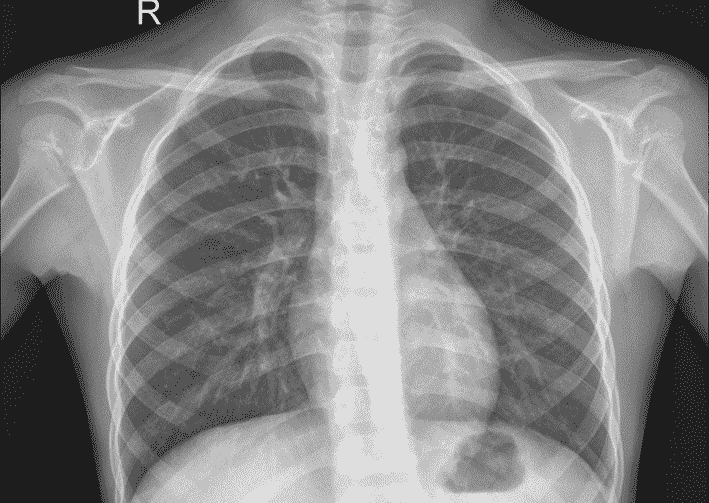

X 射线图像。使用保存的模型诊断肺部。

图 5-7

提供给 saved_model 的 X 射线图像

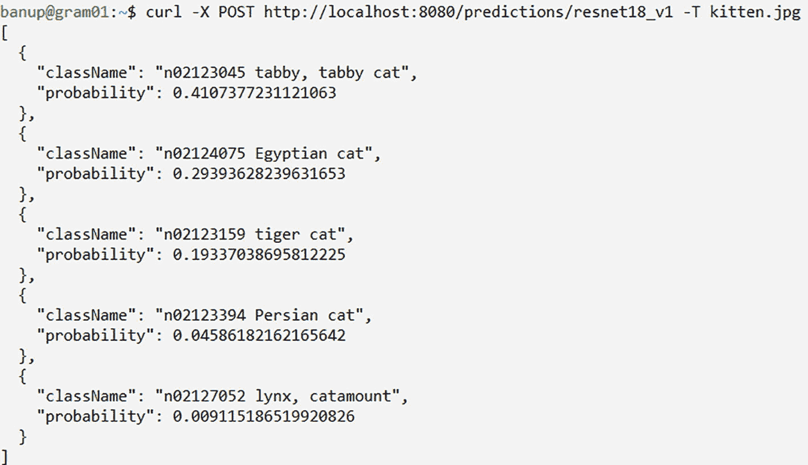

窗口截图。包含类别名称和概率的输入输出。代表 D J L 的结果。

图 5-6

DJL 对图片的预测结果

接下来，您将看到如何使用 DJL 创建 Spring Cloud Function 来服务模型。

### 5.3.2 使用 DJL 的 Spring Cloud Function

对于此示例，我们借用了一个名为肺炎检测的 DJL 示例。该示例可在 [`https://github.com/deepjavalibrary/djl-demo/tree/master/pneumonia-detection`](https://github.com/deepjavalibrary/djl-demo/tree/master/pneumonia-detection) 找到。

此示例使用来自 [`https://djlai.s3.amazonaws.com/resources/images/chest_xray.jpg`](https://djlai.s3.amazonaws.com/resources/images/chest_xray.jpg) 的 X 射线图像。

它使用来自 [`https://djl-ai.s3.amazonaws.com/resources/demo/pneumonia-detection-model/saved_model.zip`](https://djl-ai.s3.amazonaws.com/resources/demo/pneumonia-detection-model/saved_model.zip) 的模型进行预测。

您创建的 Spring Cloud Function 将接收一张图片，加载模型并提供预测，就像猫的示例一样。

前提条件：

*   DJL 库

*   模型：[`https://djl-ai.s3.amazonaws.com/resources/demo/pneumonia-detection-model/saved_model.zip`](https://djl-ai.s3.amazonaws.com/resources/demo/pneumonia-detection-model/saved_model.zip)

*   要分析的图片 URL：[`https://djl-ai.s3.amazonaws.com/resources/images/chest_xray.jpg`](https://djl-ai.s3.amazonaws.com/resources/images/chest_xray.jpg)

步骤 1：使用 DJL 框架创建 Spring Cloud Function。向 Hadoop 文件添加依赖项。

添加 DJL 高亮显示的依赖项，以及 `spring-cloud-function-web` 和 GCP 依赖项，如清单 5-2 所示。

```

org.springframework.boot
spring-boot-starter-web

org.springframework.cloud
spring-cloud-function-web

ai.djl
bom
0.12.0
pom

ai.djl
api
0.12.0

ai.djl.tensorflow
tensorflow-api
0.12.0

ai.djl.tensorflow
tensorflow-engine
0.12.0

ai.djl.tensorflow
tensorflow-native-auto
2.4.1
runtime

org.projectlombok
lombok
true

清单 5-2
D JL 依赖项
```

步骤 2：创建 Spring Cloud Function。

现在创建一个 `XRAYFunction`，从提供的 URL 加载模型：[`https://djl-ai.s3.amazonaws.com/resources/demo/pneumonia-detection-model/saved_model.zip`](https://djl-ai.s3.amazonaws.com/resources/demo/pneumonia-detection-model/saved_model.zip)。请参见清单 5-3。

```
package com.kubeforce.djlxray;
import ai.djl.inference.Predictor;
import ai.djl.modality.Classifications;
import ai.djl.modality.cv.Image;
import ai.djl.modality.cv.ImageFactory;
import ai.djl.modality.cv.translator.ImageClassificationTranslator;
import ai.djl.modality.cv.util.NDImageUtils;
import ai.djl.repository.zoo.Criteria;
import ai.djl.repository.zoo.ZooModel;
import ai.djl.translate.Translator;
import lombok.SneakyThrows;
import org.slf4j.Logger;
import org.slf4j.LoggerFactory;
import java.io.IOException;
import java.util.Arrays;
import java.util.List;
import java.util.Map;
import java.util.function.Function;
public class XRAYFunction implements Function, String> {
private static final Logger logger = LoggerFactory.getLogger(XRAYFunction.class);
private static final List CLASSES = Arrays.asList("Normal", "Pneumonia");
String imagePath;
String savedModelPath;
@SneakyThrows
@Override
public String apply(Map imageinput) {
imagePath= imageinput.get("url");
savedModelPath = imageinput.get("savedmodelpath");
Image image;
try {
image = ImageFactory.getInstance().fromUrl(imagePath);
} catch (IOException e) {
throw new RuntimeException(e);
}
Translator translator =
ImageClassificationTranslator.builder()
.addTransform(a -> NDImageUtils.resize(a, 224).div(255.0f))
.optSynset(CLASSES)
.build();
Criteria criteria =
Criteria.builder()
.setTypes(Image.class, Classifications.class)
//                           .optModelUrls("https://djl-ai.s3.amazonaws.com/resources/demo/pneumonia-detection-model/saved_model.zip")
.optModelUrls(savedModelPath)
.optTranslator(translator)
.build();
try (ZooModel model = criteria.loadModel();
Predictor predictor = model.newPredictor()) {
Classifications result = predictor.predict(image);
logger.info("Diagnose: {}", result);
return result.toJson();
}
}
}
清单 5-3
XRAYFunction.java
```

步骤 3：本地测试。运行 Spring Cloud Function 并调用端点 `http://localhost:8080/xrayFunction`

提供输入：

```
{
"url":"https://djl-ai.s3.amazonaws.com/resources/images/chest_xray.jpg",
"savedmodelpath":https://djl-ai.s3.amazonaws.com/resources/demo/pneumonia-detection-model/saved_model.zip
}
```

此操作在 Postman 中执行，如图 5-8 所示。

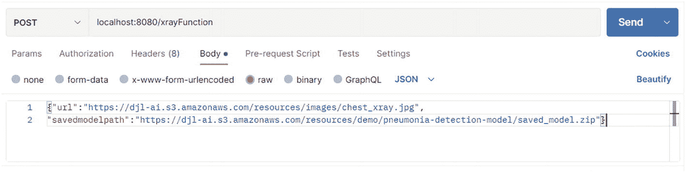

Postman 测试截图。突出显示本地主机、正文和行选项的测试程序。

图 5-8

使用 Postman 的 POST 请求进行测试

调用函数时，模型将被下载并加载到内存中。加载过程大约需要一分钟，之后会返回成功消息。模型加载耗时 802066 微秒（80 秒），这对您的函数调用至关重要，因为您需要考虑此模型加载时间。请参见图 5-9。

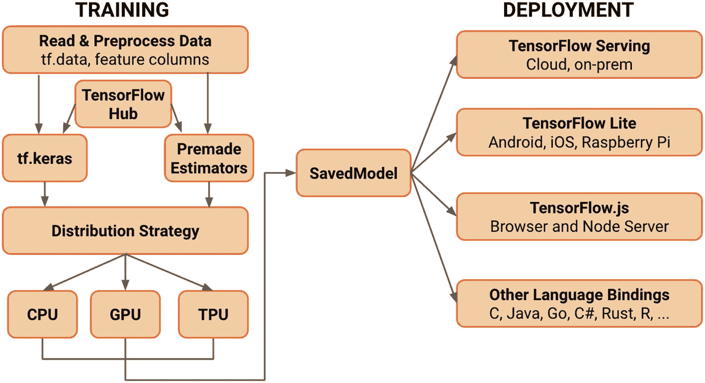

保存模型的流程图。分为训练和部署两个分类。代表 tensor flow 组件。训练的输出将发送到保存模型，再进一步发送到部署。

图 5-10

TensorFlow 组件^(¹)

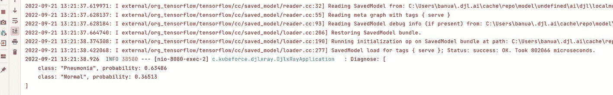

包含数字、日期和时间的编程函数截图。代表图像评估的结果。

图 5-9

图像评估的预测结果

本节成功演示了 Spring Cloud Function 可作为 AI/ML 模型服务器的功能。这是一个关键功能，因为您可以将模型的加载和服务从传统服务器迁移到基于函数的“按需付费”模型。

您还学习了如何在函数中使用深度学习 Java 库。如第 2 章所述，您可以将此 Spring Cloud Function 部署到任何云平台。

## 5.4 使用 Google Cloud Functions 和 TensorFlow 通过 Spring Cloud Function 进行模型服务

本节探讨了在 Google 上的模型服务。它使用 TensorFlow，这是 Google 的 AI/ML 产品，并解释了如何使用 MNIST (`https://en.wikipedia.org/wiki/MNIST_database`) 等数据集构建和保存 AI 模型。


### 5.4.1 TensorFlow

TensorFlow 是由 Google 开发的开源机器学习平台。它是表达和执行机器学习算法的接口。TensorFlow 的美妙之处在于，用 TensorFlow 表达的模型可以几乎无需修改地在移动设备、笔记本电脑或配备多个 GPU 和 CPU 的大规模系统上运行。TensorFlow 具有高度灵活性，能够表达大量算法，包括深度神经网络的训练和推理算法、语音识别、机器人技术、药物发现等。

在图 5-9 中，你可以看到 TensorFlow 可以部署到多个平台，并支持多种语言接口。不幸的是，TensorFlow 是用 Python 编写的，因此大多数模型都是用 Python 编写和部署的。这对采用 Java 标准化的企业来说提出了独特的挑战。

尽管 TensorFlow 是用 Python 编写的，但仍有大量基于 Java 的框架可以与保存的模型配合使用。

让我们看看如何在 Google Cloud 平台上使用 TensorFlow。

Google Cloud 提供了多种处理模型的方式。你可以使用基于容器或 Kubernetes 的方法、基于 SaaS 的方法，或基于 Cloud Functions 的方法。每种方法都有其优缺点。Google 发布了一篇优秀的指南，帮助你根据需求选择合适的平台，如表 5-2 所示。

表 5-2

Google 和 AI/ML 环境^(²)

| 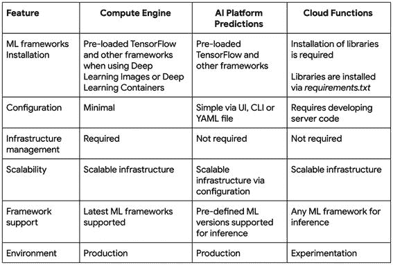一个包含 4 列 6 行的表格。列标题为特征、计算引擎、AI 平台预测、云函数。它对特征和描述进行了分类。 |

从表 5-2 可以看出，云函数被推荐用于实验。Google 建议对于生产部署，使用计算引擎搭配 TF Serving，或其 SaaS 平台（AI 平台）进行预测。

这种方法的问题在于，基于函数的方案不仅仅是实验环境。函数是一种通过 API 暴露预测服务能力的方式，同时节省成本。这是一种无服务器架构，因此企业无需担心扩展问题。

### 5.4.2 示例模型训练与服务

在本节中，你将看到如何在本地训练 AI 模型并上传到 Google Cloud Storage。随后，你将下载该模型并通过 Cloud Function API 测试一张图片。你将使用基于 MNIST 的模型。关于 MNIST 的更多信息可以访问 `https://en.wikipedia.org/wiki/MNIST_database`。

在本示例中，你将在 Python 中开发模型，然后通过 Spring Cloud Function 和 DJL 暴露该模型；如图 5-11 所示。

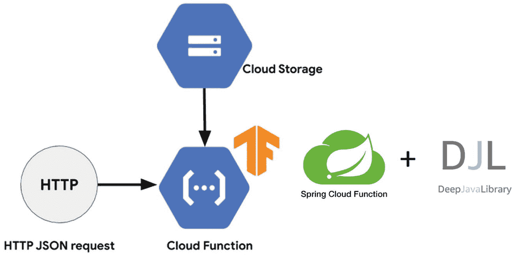

Spring Cloud Function 模型。它展示了 HTTP JSON 请求、云存储和云函数的 TensorFlow 流程，包含两个 Spring Cloud Function 标志和深度 Java 库。

图 5-11

Spring Cloud Function 与 DJL 和 TensorFlow

你将使用在 `https://cloud.google.com/blog/products/ai-machine-learning/how-to-serve-deep-learning-models-using-tensorflow-2-0-with-cloud-functions` 中概述的相同示例。这将使你能够更专注于即将创建的 Spring Cloud Function 代码，而不是 Python 的实际实现。

随后，你将使用 Spring Cloud Function 来服务该模型。

步骤 1：安装 TensorFlow。

```
python3 -m pip install tensorflow
```

步骤 2：创建项目。创建一个名为`MNIST`的项目，然后使用列表 5-4 中的代码创建一个`main.py`文件。我使用 PyCharm 运行了这段代码。

在你的 Mac 上，运行代码前请确保执行以下命令；否则会出现证书错误。代码尝试从`googleapis`下载包：

```
open /Applications/Python\ 3.7/Install\ Certificates.command
```

我运行了`main.py`，整个过程耗时 13 分钟。最终，我得到了两个模型文件作为输出。


```
from __future__ import absolute_import
from __future__ import division
from __future__ import print_function
from __future__ import unicode_literals
import tensorflow as tf
from tensorflow.keras.layers import Dense, Flatten, Conv2D
from tensorflow.keras import Model
EPOCHS = 10
mnist = tf.keras.datasets.mnist
fashion_mnist = tf.keras.datasets.fashion_mnist
(x_train, y_train), (x_test, y_test) = fashion_mnist.load_data()
x_train, x_test = x_train / 255.0, x_test / 255.0
# Add a channels dimension e.g. (60000, 28, 28) => (60000, 28, 28, 1)
x_train = x_train[..., tf.newaxis]
x_test = x_test[..., tf.newaxis]
train_ds = tf.data.Dataset.from_tensor_slices(
(x_train, y_train)).shuffle(10000).batch(32)
test_ds = tf.data.Dataset.from_tensor_slices((x_test, y_test)).batch(32)
class CustomModel(Model):
def __init__(self):
super(CustomModel, self).__init__()
self.conv1 = Conv2D(32, 3, activation='relu')
self.flatten = Flatten()
self.d1 = Dense(128, activation='relu')
self.d2 = Dense(10, activation='softmax')
def call(self, x):
x = self.conv1(x)
x = self.flatten(x)
x = self.d1(x)
return self.d2(x)
model = CustomModel()
loss_object = tf.keras.losses.SparseCategoricalCrossentropy()
optimizer = tf.keras.optimizers.Adam()
train_loss = tf.keras.metrics.Mean(name='train_loss')
train_accuracy = tf.keras.metrics.SparseCategoricalAccuracy(name='train_accuracy')
test_loss = tf.keras.metrics.Mean(name='test_loss')
test_accuracy = tf.keras.metrics.SparseCategoricalAccuracy(name='test_accuracy')
@tf.function
def train_step(images, labels):
with tf.GradientTape() as tape:
predictions = model(images)
loss = loss_object(labels, predictions)
gradients = tape.gradient(loss, model.trainable_variables)
optimizer.apply_gradients(zip(gradients, model.trainable_variables))
train_loss(loss)
train_accuracy(labels, predictions)
@tf.function
def test_step(images, labels):
predictions = model(images)
t_loss = loss_object(labels, predictions)
test_loss(t_loss)
test_accuracy(labels, predictions)
for epoch in range(EPOCHS):
for images, labels in train_ds:
train_step(images, labels)
for test_images, test_labels in test_ds:
test_step(test_images, test_labels)
template = 'Epoch {}, Loss: {}, Accuracy: {}, Test Loss: {}, Test Accuracy: {}'
print(template.format(epoch + 1,
train_loss.result(),
train_accuracy.result() * 100,
test_loss.result(),
test_accuracy.result() * 100))
# Save the weights
model.save_weights('fashion_mnist_weights')
tf.saved_model.save(model, export_dir="c://Users//banua//Downloads/MNIST/models")
Listing 5-4
main.py
```

关键是 `tf.saved_model.save(model, export_dir="c://Users//banua//Downloads/MNIST/models")`。

这将保存模型，以便任何模型服务器都可以使用它。

步骤 3：运行项目。

从 IDE 中执行 `main.py`。参见图 5-12。

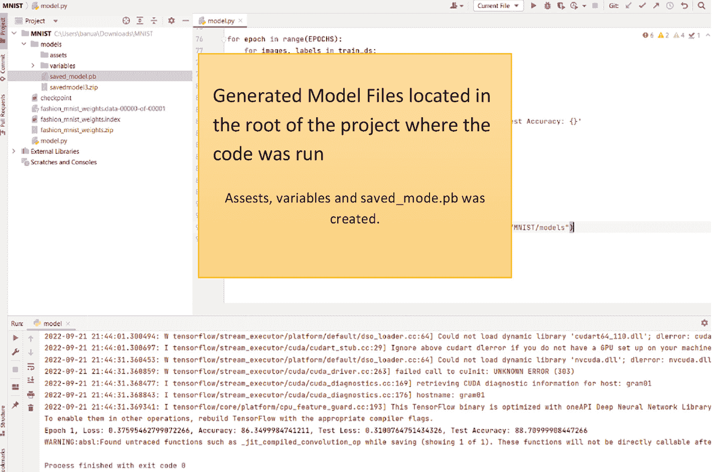

窗口截图。它表示 MNIST 的成功运行。弹出文本显示生成的模型文件位于项目的根目录。

图 5-12

MNIST 成功运行及模型构建

将资产、变量和 `saved_model.pb` 文件打包为 `Savedmodel3.zip`，并上传到 Google Cloud Storage。

步骤 4：将模型上传到 Cloud Storage。前往您的 Google Cloud Console 并订阅 Cloud Storage 服务。它可在 `cloud.google.com` 访问。

在 Google Cloud Storage 中创建一个存储桶，并将这两个文件上传到存储桶中。此示例使用默认设置。如果您使用的是 Google 的免费信用额度，此存储应包含在内。

我创建了一个名为 `mnist-soc` 的存储桶。您将在 Cloud Functions 调用中使用该存储桶名称。参见图 5-13。

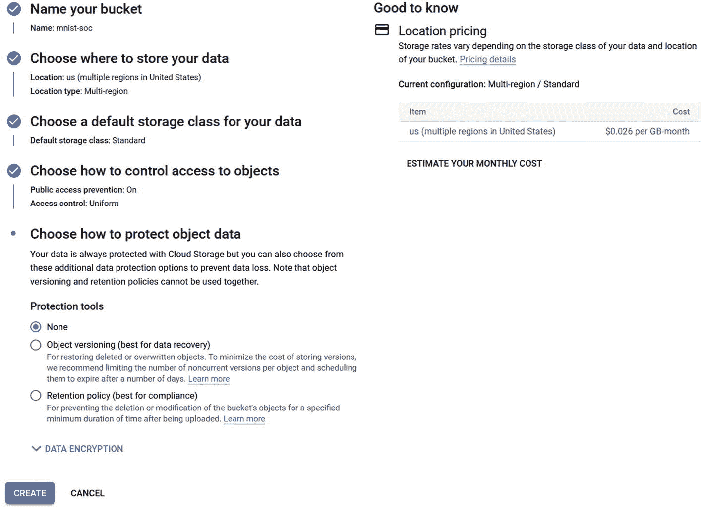

Google 云存储存储桶的截图。其中包括存储桶名称、选择存储数据、选择默认存储、选择控制访问以及用高亮线条保护访问的说明。

图 5-13


Google Cloud Storage 存储桶创建步骤

将存储桶命名为`mnist-soc`，并将其他选项保留为默认值；然后点击创建。

通过点击上传文件，将`savedmodel3.zip`文件上传到此文件夹。参见图 5-14。

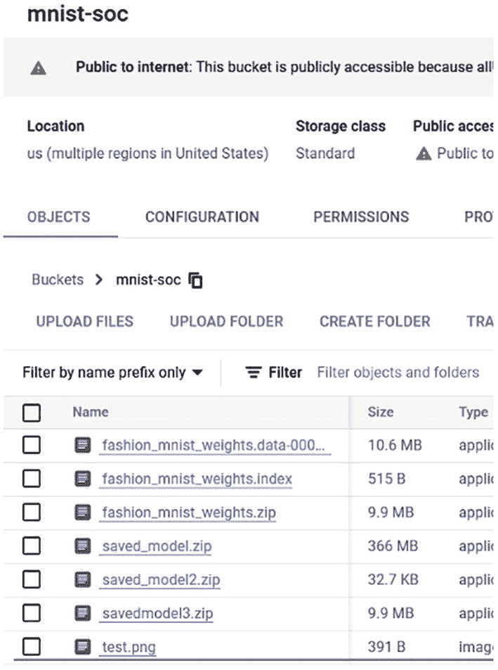

一张 mnist soc 应用的截图。它突出显示了对象选项，并提到了模型的名称、大小和类型。它表示存储在云存储中的模型。

图 5-14

部署到云存储的模型

点击文件以获取需要连接的 URL 详细信息，如图 5-15 所示。

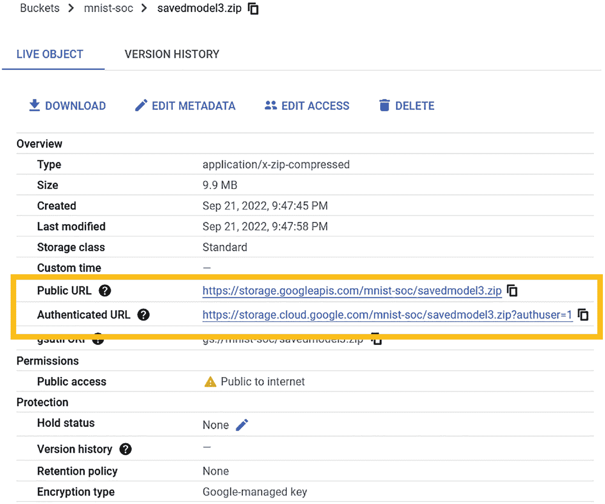

一张截图表示模型的 URL。它指示一个 mnist soc 应用，带有实时对象选项。它突出显示了公共和认证 URL，并带有链接。

图 5-15

savedmodel3.zip 的 URL

用于测试此示例的 URL 是 [`https://storage.googleapis.com/mnist-soc/savedmodel3.zip`](https://storage.googleapis.com/mnist-soc/savedmodel3.zip)。

用于此示例的测试图像 [`https://storage.googleapis.com/mnist-soc/test.png`](https://storage.googleapis.com/mnist-soc/test.png)。

请注意，您在第 5.2 节中创建的函数将在第 5 步中部署。如果您使用`savedmodel3.zip`和`test.png`，它将失败。但您会知道函数正在工作，因为会收到模型无法加载的错误信息。这是您创建的模型可以接受的结果。

第 5 步：将 Spring Cloud Function 部署到 Google 云函数。在此步骤中，您将第 5.2 节中创建的函数部署到 Google Cloud Functions 环境。前提条件和步骤与第 2 章中讨论的内容相同。

前提条件：

*   Google 账户

*   Google Cloud Functions 订阅

*   Google CLI（这是关键的，因为它比通过 Google 门户更高效）

*   GitHub 上的代码 [`https://github.com/banup-kubeforce/DJLXRay-GCP.git`](https://github.com/banup-kubeforce/DJLXRay-GCP.git)

修改 Spring Cloud Function 以适配 Google Cloud Functions 环境。参见列表 5-5。

```
org.springframework.cloud
spring-cloud-function-adapter-gcp

org.springframework.cloud
spring-cloud-dependencies
${spring-cloud.version}
pom
import

com.google.cloud
spring-cloud-gcp-dependencies
3.3.0
pom
import

org.springframework.boot
spring-boot-maven-plugin

target/deploy

org.springframework.cloud
spring-cloud-function-adapter-gcp
3.2.7

com.google.cloud.functions
function-maven-plugin
0.9.1

org.springframework.cloud.function.adapter.gcp.GcfJarLauncher

列表 5-5
添加的 GCP 依赖项
```

将 Spring Cloud Function 部署到 Google Cloud Functions。确保在运行以下命令前进行构建和打包。JAR 文件必须存在于项目根目录的`target/deploy`目录中。

您要测试的保存模型大小为 400MB，因此必须通过增加内存到 4096MB 并设置超时时间为 540 秒来适应：

```
gcloud functions deploy DJLXRay-GCP --entry-point org.springframework.cloud.function.adapter.gcp.GcfJarLauncher --runtime java11 --trigger-http --source target/deploy --memory 4096MB --timeout 540
```

一旦成功运行，您将获得图 5-16 中所示的输出。

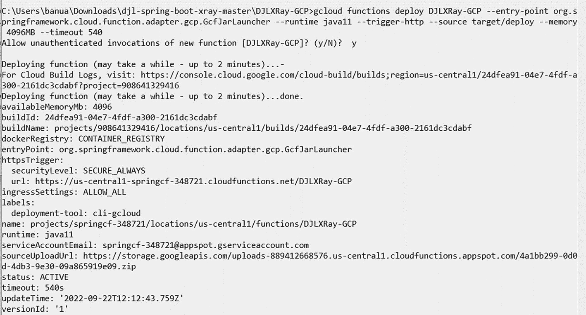

一张截图显示多个编程函数。它表示已部署的函数、内存和时间。

图 5-16

成功部署的函数（指定内存和超时）

前往 Google Cloud Functions 控制台以验证并获取测试 URL。参见图 5-17。

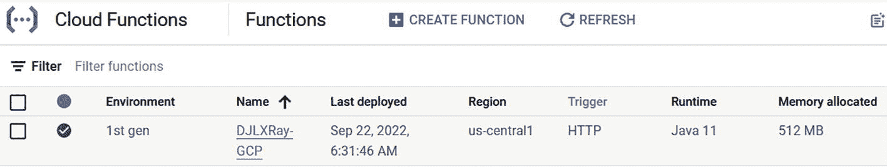

一张截图包含控制台中的函数和云函数。它突出显示了创建函数和刷新选项。它指示第一代的详细信息过滤选项。

图 5-17

函数在控制台中显示

现在您可以通过在云函数控制台中提供输入进行测试（参见图 5-18）。请注意，为了安全起见，您必须将内存增加到 4096MB，并将超时时间设置为 540 秒：

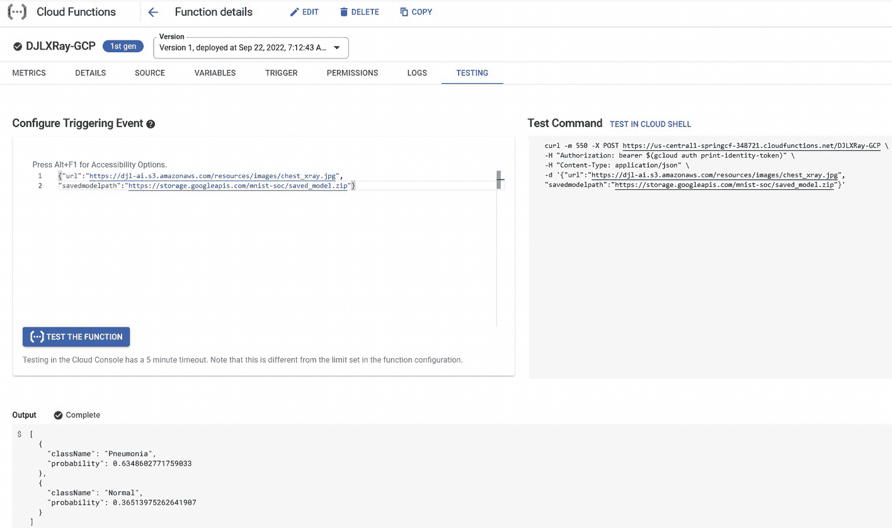

一张截图突出显示了云函数 D JL X ray -G CP。测试选项“测试函数”被突出显示。测试已成功执行。

图 5-18

测试成功执行

```
{"url":"https://djl-ai.s3.amazonaws.com/resources/images/chest_xray.jpg",
"savedmodelpath":"https://storage.googleapis.com/mnist-soc/saved_model.zip"}
```

如果向下滚动测试控制台，您将获得执行时间。这表明函数执行耗时 16392ms，如图 5-19 所示。这是 16 秒的执行时间，非常惊人。这是因为您将保存模型存储在 Google Cloud Storage 中，这比函数更接近。


一张截图显示了多个输出日志。它突出显示了一个日志代码 no-16392，code-200 带有框。它显示了执行时间。

图 5-19

日志显示了执行时间

**本**节探讨了 TensorFlow 的能力，并解释了如何使用 D JL 和 Spring Cloud Function 共同访问保存的 TensorFlow 模型。D JL 使 Java 程序员能够轻松访问使用 Python 框架（如 PyTorch (`pytorch.org`)和 TensorFlow）生成的保存模型。

您还发现必须根据保存模型的大小设置内存和超时时间，并将模型存储在更接近函数的位置，例如 Google 的存储服务。

## 5.5 使用 AWS Lambda 和 TensorFlow 通过 Spring Cloud Function 进行模型服务

本节模拟了第 2 章中针对 Lambda 的操作。最好在尝试此操作前完成第 2 章的练习。

前提条件与第 2 章相同。以下是供您参考的内容：

*   AWS 账户

*   AWS Lambda 函数订阅

*   AWS CLI（可选）

*   GitHub 上的代码 [`https://github.com/banup-kubeforce/DJLXRay-AWS.git`](https://github.com/banup-kubeforce/DJLXRay-AWS.git)

步骤 1：准备 Lambda 环境。确保您拥有访问和订阅 AWS Lambda 环境的权限。

步骤 2：修改 Spring Cloud Function 以适配 AWS Lambda 环境。您需要在第 2 章中创建的`pom.xml`文件中添加 D JL 依赖项；参见列表 5-6。

```
ai.djl
api
0.12.0

ai.djl.tensorflow
tensorflow-api
0.12.0

ai.djl.tensorflow
tensorflow-engine
0.12.0

ai.djl.tensorflow
tensorflow-native-auto
2.4.1
runtime

org.projectlombok
lombok
true

列表 5-6
DJL 依赖项
```

步骤 3：将 Spring Cloud Function 部署到 Lambda。您应按照第 2 章中概述的流程构建和打包 Spring Cloud Function，并将其部署到 Lambda。

步骤 4：测试。一旦将函数部署到 Lambda，使用 Postman 进行测试。您应该获得图 5-20 中所示的结果。

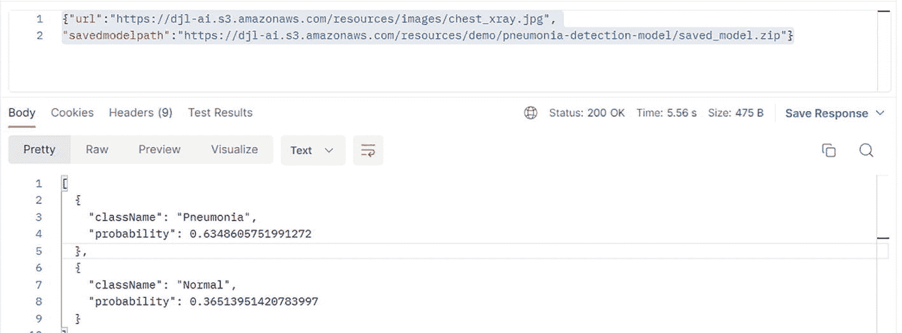

一张成功执行窗口的截图。它突出显示了正文和美化选项，并提到了带有概率的类名。

图 5-20

成功执行


## 5.6 使用 AWS SageMaker 或 AI/ML 的 Spring Cloud Function

本节探讨了 AWS 提供的 SageMaker 服务，并展示如何使用 Spring Cloud Function 与之结合。

AWS SageMaker ([`https://aws.amazon.com/sagemaker/`](https://aws.amazon.com/sagemaker/)) 是一个全面的 AI/ML 平台。它类似于创建和部署 ML 模型的一站式商店。图 5-21 展示了 AWS SageMaker 的流程。

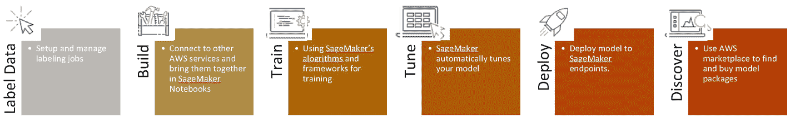

AWS SageMaker 模型示意图。流程包括数据标注、构建、训练、调优、部署和发现。每个步骤都有对应的图标。

图 5-21

AWS SageMaker 流程

SageMaker 允许您使用 Python 作为首选语言来构建和部署模型，但当涉及到端点时，有类似 AWS Glue 的 Java SDK，可以创建预测 API 或为后续处理提供模型服务。您可以利用 Lambda 函数来实现这些 API。

因此，正如您在 TensorFlow 中看到的那样，您需要同时使用 Python 和 Java 来建模并对外暴露模型。

让我们通过一个典型示例来演示，之后您就可以在 Spring Cloud Function 中暴露 API 了。

注意

此示例使用与 AWS 动手教程中相同的样本数据来构建、训练和部署模型。

[`https://aws.amazon.com/getting-started/hands-on/build-train-deploy-machine-learning-model-sagemaker/`](https://aws.amazon.com/getting-started/hands-on/build-train-deploy-machine-learning-model-sagemaker/)

步骤 1：创建一个笔记本实例。登录 SageMaker 并创建笔记本实例，如图 5-22 所示。注意：假设您已经完成了 Amazon 提供的教程。

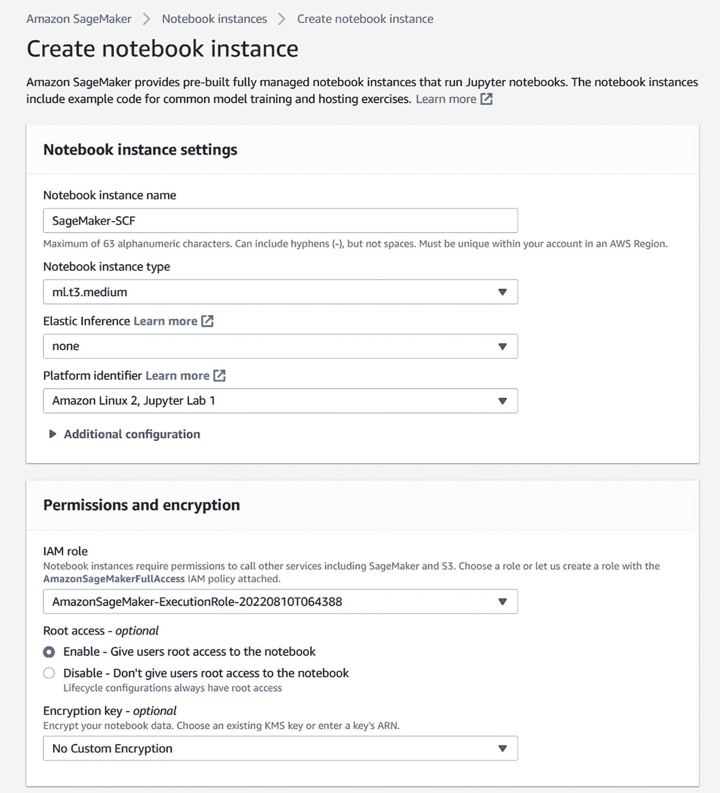

创建笔记本实例的窗口截图。包含笔记本实例设置、权限和加密选项。需要输入笔记本实例名称、类型、弹性推理、平台标识符和 IAM 角色。

图 5-22

SageMaker 笔记本实例属性设置

您的笔记本实例将如图 5-23 所示创建完成。

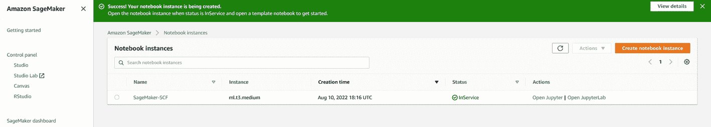

笔记本部署窗口截图。突出显示了 Amazon SageMaker 和搜索笔记本实例选项。需要输入名称、实例、创建时间、状态和操作。

图 5-23

笔记本成功部署

步骤 2：准备数据。使用 Python 准备数据。此示例使用 XGBoost ML 算法。参见图 5-24。

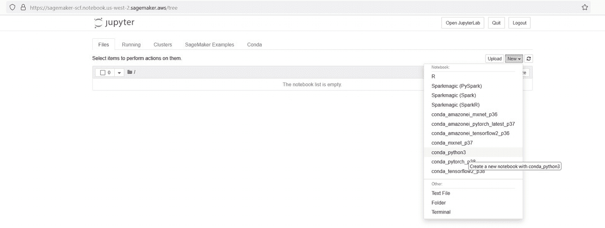

Jupyter 笔记本窗口截图。突出显示了新笔记本选项。包含标题文件、运行、集群、SageMaker 示例和 Conda 选项。

图 5-24

在 Jupyter 笔记本中选择框架

从列表可以看出，大多数框架使用 Python。此示例使用`conda_python3`，如 AWS 教程中建议的那样。

将 Python 代码复制粘贴到 Jupyter 笔记本单元格中并运行。您将获得如图 5-25 所示的“成功”消息。

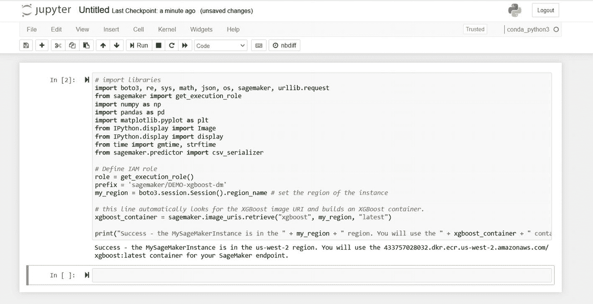

Jupyter 笔记本代码窗口截图。创建了 SageMaker 实例。在此程序中，日志提到了导入库、定义 IAM 角色和 XGBoost 容器。

图 5-25

创建 SageMaker 实例的代码

将代码复制粘贴到创建`s3`存储桶以存储模型的窗口中，如图 5-26 所示。

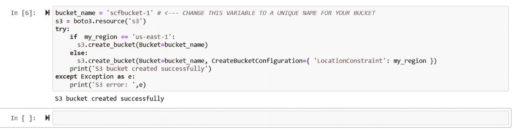

存储桶创建窗口截图。此程序包含存储桶名称、步骤和流程。存储桶已成功创建。

图 5-26

创建存储桶

现在将代码复制粘贴到下载数据到数据框的窗口中，如图 5-27 所示。

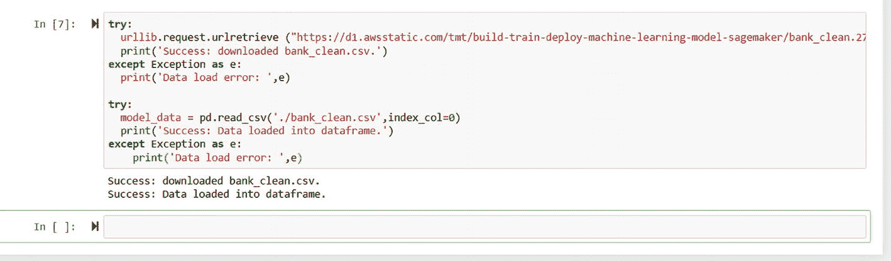

将数据下载到数据框的窗口截图。程序包含尝试、异常处理和打印数据的流程。

图 5-27

将数据下载到数据框

如图 5-28 所示，对数据集进行打乱和分割。

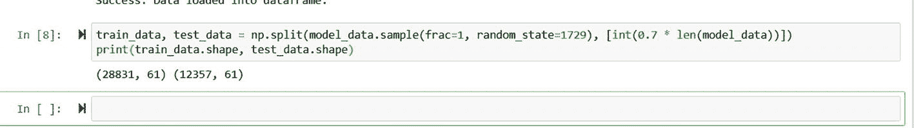

数据集处理窗口截图。程序包含分割数据集为训练数据、测试数据、分割数据和打印操作。

图 5-28

数据集处理

步骤 3：训练模型。参见图 5-29。

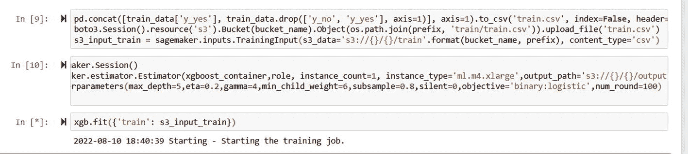

输入输出窗口截图。表示模型训练的 3 个步骤。

图 5-29

模型训练

在部署模型之前，需要等待步骤 3 完成；参见图 5-30。

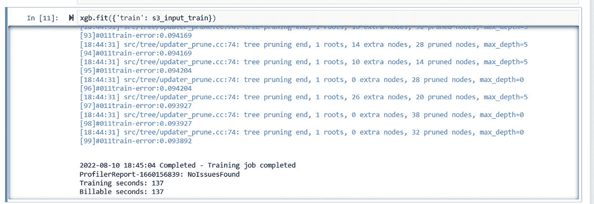

输入输出窗口截图。表示 S3 训练完成。提到训练任务已完成。

图 5-30

训练已完成

步骤 4：部署模型。记录使用的计算规模。这将影响您的计费。参见图 5-31。

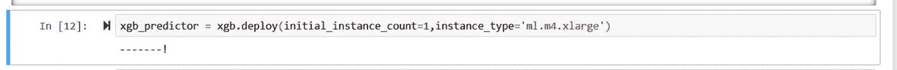

模型部署窗口截图。表示编程功能。

图 5-31

模型部署

步骤 5：记录端点信息。参见图 5-32 和图 5-33。

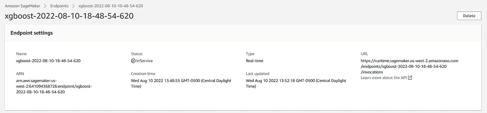

端点设置窗口截图。包含名称、类型、ARN、创建时间、状态、最后更新时间和 URL。

图 5-33

端点详情

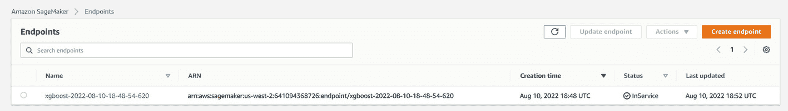

Amazon SageMaker 窗口截图。包含端点信息，包括名称、ARN、创建时间、状态和最后更新时间。

图 5-32

部署端点

步骤 6：创建 Spring Cloud Function 代码以访问端点。列表 5-7 显示了 POM 依赖项。

```
com.amazonaws
aws-java-sdk-sagemakerruntime
1.11.979

com.amazonaws
aws-java-sdk-core

com.amazonaws
aws-java-sdk-core
1.11.979

列表 5-7
AWS SDK 依赖项
```

创建一个`Supplier`类以调用并获取 SageMaker 端点的结果。与第 5.3 节讨论的不同，`SupplierFunction`将调用端点 URL 并提供结果。此处使用 SageMaker 自身的模型服务功能。Spring Cloud Function 作为 SageMaker 的客户端。参见图 5-34。

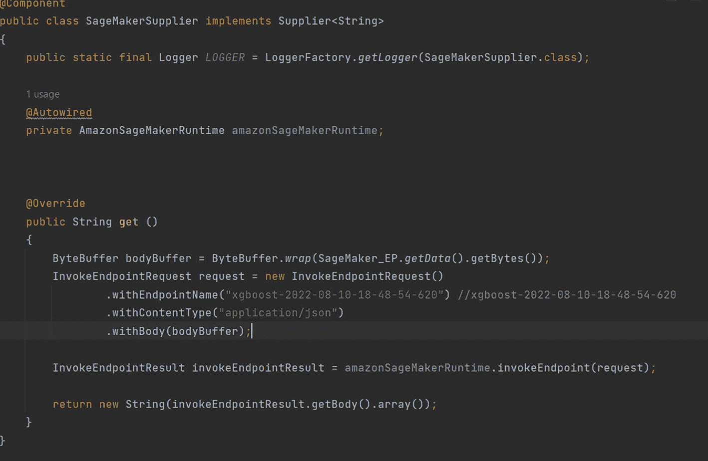

编程函数输入输出组件窗口截图。表示 Java 中的 SageMaker Supplier。

图 5-34

SageMakerSupplier.java

如第 2 章所示，将函数部署到 Lambda 中。

本节解释了如何在 AWS SageMaker 上创建和部署模型。然后您使用部署在 AWS Lambda 中的 Spring Cloud Function 通过 SageMaker JDK 客户端调用 SageMaker 端点。

通过使用如 GraalVM 等机制，基于 Java 的 Lambda 函数可以调整为更响应且冷启动时间更短。


## 5.7 总结

正如你在本章所学到的，你可以使用 Spring Cloud Function 来部署模型。但你也了解到，使用 Spring Cloud Function 和 Java 来部署 AI/ML 模型有些牵强，因为这些模型是用 Python 编写的。虽然 Python 可能很流行，但也要注意，在企业环境中，Java 才是主导。在 AI/ML 中找到利用 Java 的方法，是构建企业统一环境的关键。基于 Python 的函数冷启动耗时较长。这就是为什么使用 Java 和 GraalVM 等框架可以加快启动时间。

下一章将探讨 IoT 和对话式 AI 的一些实际应用案例，并解释 Spring Cloud Function 的使用方法。

脚注 1   2

