# 6. Spring Cloud Function 与 IoT

本章将介绍 Spring Cloud Function 与 IoT 的实现方式。你将看到一些来自制造业和物流领域的实际案例。你将探索 Spring Cloud Function 如何与现有的云平台和数据中心 IoT 平台协同工作。你还将了解一些在 Penske 中的具体实现，这些实现几乎可以应用于所有 IoT 相关场景。

在开始探索解决方案之前，你需要先深入了解 IoT 和当前 IoT 市场的状况。你还将查看一些调查报告，了解为什么 Java 是 IoT 开发的首选企业语言。

### 6.1 IoT 现状

IoT（物联网）正在快速增长，预计 2022 年将增长 22%。这种惊人的增长导致了大量数据需要被采集和处理。

根据 IoT Analytics Research 在 2021 年 9 月的研究，IoT 设备市场预计会以惊人的速度增长，到 2025 年预计将达到 250 亿台设备。更多关于该研究的信息可访问 [`https://iotbusinessnews.com/2021/09/23/13465-number-of-connected-iot-devices-growing-9-to-12-3-billion-globally-cellular-iot-now-surpassing-2-billion/`](https://iotbusinessnews.com/2021/09/23/13465-number-of-connected-iot-devices-growing-9-to-12-3-billion-globally-cellular-iot-now-surpassing-2-billion/)。

凭借这种增长潜力，你可以合理假设支持技术也会随之增长。这些技术不仅包括硬件传感器和 IoT 网关，还包括微服务和函数等技术。IoT 行业最适合实施这些技术，因为它们高度分布式，且严重依赖于小型高效的软件组件。

按需触发的无服务器函数环境非常适合 IoT，因为它们可以显著降低成本。传统的 IoT 方法依赖于全天候运行的专用应用程序。这些应用消耗大量资源，增加了运营成本。而无服务器函数几乎瞬时的特性，使得这种成本可以转换为“按使用付费”的模式。

在开始处理 IoT 与 Spring Cloud Function 的一些示例之前，最好先理解为何需要使用 Java 进行编码。虽然有许多替代语言可供选择，但 Java 在 IoT 领域表现最佳，原因如下：

*   Java 的设计初衷就考虑到了 IoT。如果你查看 Sun Microsystems 早期的 Java 示例，会发现经常提到数字时钟的同步。

*   Java 已被移植到许多微控制器上。

*   Java 专为在资源受限的环境（如传感器）中运行而设计。

*   JVM 使得代码可以在不同平台间移植；一次编写，随处运行。

根据 [`iot.eclipse.org`](http://iot.eclipse.org) 进行的 IoT 调查（ [`https://iot.eclipse.org/community/resources/iot-surveys/assets/iot-developer-survey-2020.pdf`](https://iot.eclipse.org/community/resources/iot-surveys/assets/iot-developer-survey-2020.pdf) ），你可以看到 Java 在边缘计算和云端都是首选语言。根据研究，边缘端的实现正在转向容器化，这对边缘上的 Knative on Kubernetes 部署非常有利。

此外，Spring 框架已成为许多工业物联网（IIoT）项目的首选平台。你可以在 2017 年 SpringOne 活动的演示中查看相关信息，访问 [`https://youtu.be/MReQD9tXQuA`](https://youtu.be/MReQD9tXQuA)。

Spring Cloud Streams、Spring Cloud Data Flow、Spring Integration、Spring MQTT、Spring Data 和 Spring XD 等组件在 IoT 数据采集、存储和转换管道中发挥着重要作用。

### 6.1.1 Spring 实现示例

考虑一个 Spring 及其组件在互联车队场景中的示例实现。

Penske 团队利用基于 Spring 的微服务，结合 Spring Cloud Streams 和 Spring Cloud Data Flow，从安装在 Penske 卡车上的传感器中采集数据。该应用程序使 Penske 能够监控卡车、进行预测性维护，并实时管理卡车。参见图 6-1。

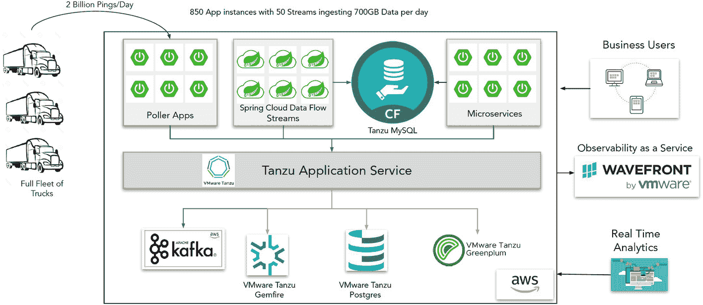

一张图表展示了 Penske 互联车队的组件。卡车车队每天向采集应用发送 20 亿次心跳信号，这些信号通过 Spring Cloud Data Flow 流和微服务连接到 Tanzu 应用服务。AWS 上的 Kafka 以及 VMware Tanzu GemFire、Postgres 和 Greenplum 接收这些数据。最终用户包括业务用户、实时分析和 Wavefront 观测服务。

图 6-1

Penske 基于 Spring Cloud 的互联车队实现

更多关于此主题的信息可在 SpringOne 网站上找到，访问 [`https://springone.io/2020/sessions/iot-scale-event-stream-processing-for-predictive-maintenance-at-penske`](https://springone.io/2020/sessions/iot-scale-event-stream-processing-for-predictive-maintenance-at-penske)。

让我们更深入地探讨 IoT 流程；参见图 6-2。

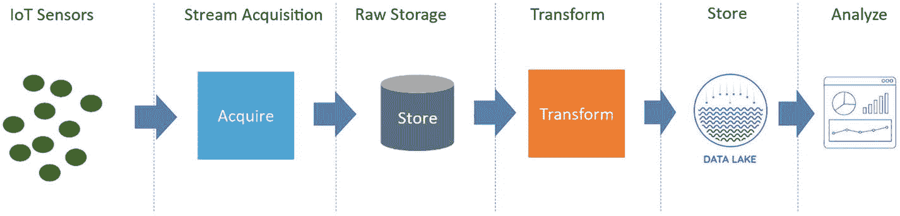

一个流程图展示了 IoT 流程，从 IoT 传感器开始，经过数据流采集、原始数据存储、转换、数据湖存储，最终到达分析阶段。

图 6-2

IoT 流程图


### 6.1.2 在本地部署无服务器函数的优势

由于传感器是按间隔发送数据，因此最好由云函数处理输入，而不是专用的微服务。专用微服务需要在环境中运行，并且在调用时无法缩放到零。它们只能在需要调用时存在的环境中进行配置。这使得微服务成为一种高成本的方法。另一方面，函数仅在有事件触发时才会被调用。如果未被调用，资源利用率可以降至零。这是因为底层的无服务器基础设施（如 Lambda 和 Knative）在未被调用时可以缩放到零。

这使其成为一种更具成本效益的替代方案。该方案适用于本地部署和云端环境。如果是在本地部署，反对在无服务器环境中使用云函数的论点是：基础设施成本已经计入。因此，始终在线的专用微服务是可行的。将资源浪费在拥有它们上并不是高效使用 IT 资源的明智方式。在无服务器环境中运行的函数（如在 OpenShift 或 VMware Tanzu 上运行的 Knative）可以帮助本地节省资源，这些资源可以用于运行其他活动。本地资源是有限的，因此充分利用它们是明智的。

## 6.2 使用 AWS IoT 在云端部署 Spring Cloud Function

考虑一个使用案例：一家汽车装配工厂希望确保其机器人正常运行。工程师们希望监控每个机器人数据以检测异常，并在发生故障时及时收到警报。该装配工厂设有防火墙，任何需要分析的数据都可以发送到云端。

解决方案是一个混合云环境，隔离装配工厂的车间但连接云端以传输车间数据。图 6-3 展示了使用 AWS 产品实现的解决方案，这些产品可在本地部署并连接云端，以与决策相关的其他系统同步数据。

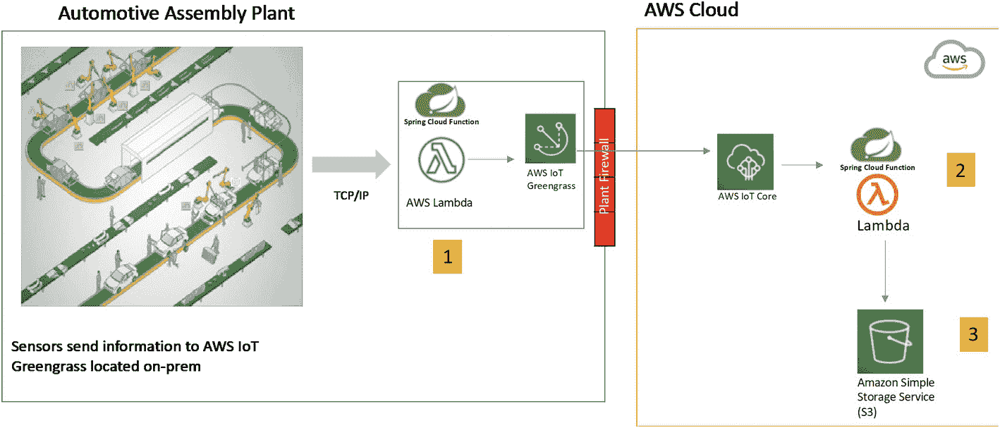

一个流程图包含 2 个模块和 3 个步骤。步骤 1：在汽车装配工厂模块中，传感器将数据发送到本地部署的 Spring Cloud 组件，包括 AWS Lambda 和 AWS IoT Greengrass。步骤 2：在 AWS 云模块中，AWS IoT Core 通过防火墙接收来自工厂模块的数据，并将其发送到 Lambda。步骤 3：Lambda 的数据存储在亚马逊的简单存储服务 S3 中。

图 6-3

使用 AWS 和 Spring Cloud Function 的制造工厂流程

解决方案组件：

*   本地部署的 AWS IoT Greengrass

*   用于捕获传感器数据的预构建 AWS Lambda 函数

*   云端部署的 AWS IoT Core

*   在 AWS Lambda 上运行的 Spring Cloud Function

*   用于存储数据的 S3 存储

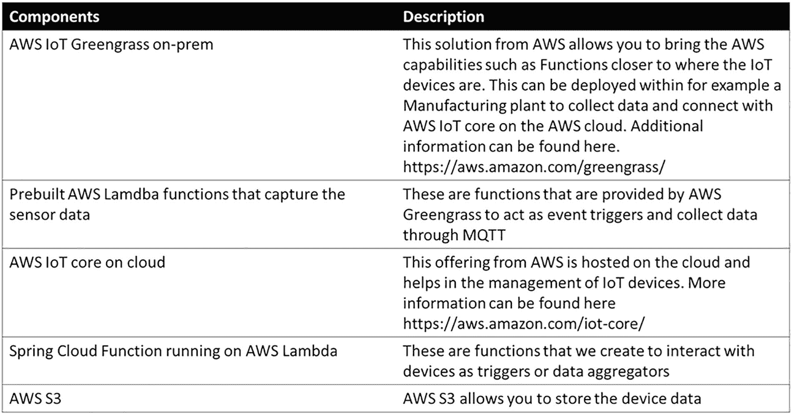

一个包含 5 行 2 列的表格。它描述了组件及其说明。组件包括：本地部署的 AWS IoT Greengrass、用于捕获传感器数据的预构建 AWS Lambda 函数、云端部署的 AWS IoT Core、在 AWS Lambda 上运行的 Spring Cloud Function，以及 AWS S3。

您可以使用 AWS IoT Greengrass 构建解决方案，并利用部署在 Lambda 上的 Spring Cloud Function。本练习的目的是理解 Spring Cloud Function 作为解决方案核心组件的能力。

AWS IoT Greengrass 的实现将 AWS 云扩展到本地环境。您可以在 Greengrass 的边缘运行 Lambda 函数。

步骤 1：安装 AWS IoT Greengrass。在设备上安装 AWS IoT Greengrass（[`https://docs.aws.amazon.com/greengrass/v1/developerguide/install-ggc.xhtml`](https://docs.aws.amazon.com/greengrass/v1/developerguide/install-ggc.xhtml)）。为了测试，我在 Windows 上安装了该软件。我使用了[`aws.amazon.com/blogs/iot/aws-iot-greengrass-now-supports-the-windows-operating-system/`](https://aws.amazon.com/blogs/iot/aws-iot-greengrass-now-supports-the-windows-operating-system/)上的教程来实现我的第一个 Greengrass 方案。

一旦 AWS IoT 运行起来，您需要创建一个函数以连接设备并收集数据。让我们创建一个示例函数。

步骤 2：Spring Cloud Function 发布 MQTT 消息。您可以从 GitHub 克隆项目（[`https://github.com/banup-kubeforce/AWSIots3-V2.git`](https://github.com/banup-kubeforce/AWSIots3-V2.git)）。

设备通过 MQTT 进行通信，因此您需要利用 MQTT 作为协议。创建一个 Spring Cloud Function 以发布 MQTT 消息，并创建一个消费者函数来调用 MQTT 发布。

该消费者将使用`MqttPublish`类发布数据，并将成为 Lambda 暴露的函数；详见列表 6-1。


```
package com.kubeforce.awsgreengrassiot;
import org.hibernate.cache.internal.StandardTimestampsCacheFactory;
import org.slf4j.Logger;
import org.slf4j.LoggerFactory;
import org.springframework.beans.factory.annotation.Autowired;
import java.util.Map;
import java.util.function.Consumer;
public class MqttConsumer  implements Consumer> {
public static final Logger LOGGER = LoggerFactory.getLogger(MqttConsumer.class);
@Autowired
private MqttPublish mqttPublish;
@Override
public void accept (Map map )
{
LOGGER.info("Adding Device info", map);
MqttPublish mqttPublish= new MqttPublish();
}
}
清单 6-1
MqttConsumer.java
```

接下来，创建一个`publish`类以向 MQTT 发布消息。

`MqttPublish`类使用 AWS Greengrass SDK 提供的`IoTDataClient`来构建和发送数据。详见清单 6-2。

```
import java.nio.ByteBuffer;
import java.util.Timer;
import java.util.TimerTask;
import com.amazonaws.services.lambda.runtime.Context;
import com.amazonaws.greengrass.javasdk.IotDataClient;
import com.amazonaws.greengrass.javasdk.model.*;
public class MqttPublish {
static {
Timer timer = new Timer();
// 每 5 秒重复发布一次消息
timer.scheduleAtFixedRate(new PublishDeviceInfo(), 0, 5000);
}
public String handleRequest(Object input, Context context) {
return "这里是设备信息";
}
}
class PublishDeviceInfo extends TimerTask {
private IotDataClient iotDataClient = new IotDataClient();
private String publishMessage = String.format("从运行在平台: %s-%s 上的设备发送的设备信息", System.getProperty("os.name"), System.getProperty("os.version"));
private PublishRequest publishRequest = new PublishRequest()
.withTopic("device/info")
.withPayload(ByteBuffer.wrap(String.format("{\"message\":\"%s\"}", publishMessage).getBytes()))
.withQueueFullPolicy(QueueFullPolicy.AllOrException);
public void run() {
try {
iotDataClient.publish(publishRequest);
} catch (Exception ex) {
System.err.println(ex);
}
}
}
清单 6-2
MqttPublish.java
```

步骤 3：在 AWS Greengrass 本地部署 Spring Cloud Function。

AWS 提供了在 Greengrass 核心上运行 Lambda 函数的优秀指南，详见 [`在 AWS IoT Greengrass 核心上运行 Lambda 函数 - AWS IoT Greengrass (amazon.com)`](https://docs.aws.amazon.com/greengrass/v1/developerguide/lambda-functions.xhtml)。

如第 2 章所述，您将打包 Spring Cloud Function 并发布到 Lambda。或者，您也可以使用以下 CLI 命令：

```
aws lambda create-function \
--region aws-region \
--function-name  MqttConsumer \
--handler executable-name \
--role role-arn \
--zip-file fileb://Application_Name.zip \
--runtime arn:aws:greengrass:::runtime/function/executable
```

前往 AWS IoT 管理控制台，然后点击 Greengrass，再点击部署。您可以查看已部署的组件。图 6-4 展示了管理控制台的示例。

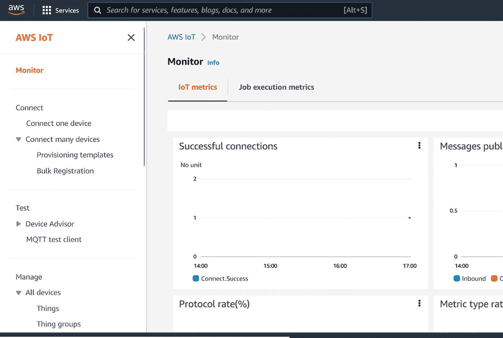

AWS IoT 管理控制台的截图。左侧的监控选项卡被选中。它包含 IoT 指标和作业执行指标选项。IoT 指标有 4 个图表，标题包括成功连接和协议速率。左侧的其他主要选项卡是连接、测试和管理。

图 6-4

AWS IoT 管理控制台显示部分成功连接

步骤 4：创建一个 Spring Cloud Function 以从 IoT 核心获取数据。创建一个类以订阅并从 Mqtt 获取消息。

如果您想访问已发布的数据，可以从命令行运行`MqttSubscriber.java`。您可以使用`MqttSubscriber.java`。它订阅特定主题（例如`device/info`），并获取消息。详见清单 6-3。

```
import software.amazon.awssdk.crt.CRT;
import software.amazon.awssdk.crt.CrtRuntimeException;
import software.amazon.awssdk.crt.mqtt.MqttClientConnection;
import software.amazon.awssdk.crt.mqtt.MqttClientConnectionEvents;
import software.amazon.awssdk.crt.mqtt.QualityOfService;
import software.amazon.awssdk.iot.iotjobs.model.RejectedError;
import java.nio.charset.StandardCharsets;
import java.util.concurrent.CompletableFuture;
import java.util.concurrent.CountDownLatch;
import java.util.concurrent.ExecutionException;
import java.util.concurrent.atomic.AtomicReference;
public class MqttSubscriber  {
static String ciPropValue = System.getProperty("aws.crt.ci");
static boolean isCI = ciPropValue != null && Boolean.valueOf(ciPropValue);
static String topic = "device/info";
static String message = "设备信息";
static int    messagesToPublish = 10;
static CommandLineUtils cmdUtils;
static void onRejectedError(RejectedError error) {
System.out.println("请求被拒绝: " + error.code.toString() + ": " + error.message);
}
/*
* 在 CI 运行期间调用时，抛出异常以使 exec:java 任务失败
* 否则，打印出错信息（如有）并继续（返回 main）
*/
static void onApplicationFailure(Throwable cause) {
if (isCI) {
throw new RuntimeException("BasicPubSub 执行失败", cause);
} else if (cause != null) {
System.out.println("发生异常: " + cause.toString());
}
}
public String MqttSubscribe(){
final String[] payload = {""};
cmdUtils = new CommandLineUtils();
cmdUtils.registerProgramName("PubSub");
cmdUtils.addCommonMQTTCommands();
cmdUtils.addCommonTopicMessageCommands();
cmdUtils.registerCommand("key", "", "PEM 格式的密钥路径。");
cmdUtils.registerCommand("cert", "", "PEM 格式的客户端证书路径。");
cmdUtils.registerCommand("client_id", "", "要使用的客户端 ID（可选，默认='test-*'）。");
cmdUtils.registerCommand("port", "", "连接到端点的端口号（可选，默认='8883'）。");
cmdUtils.registerCommand("count", "", "要发布的消息数量（可选，默认='10'）。");
topic = cmdUtils.getCommandOrDefault("topic", topic);
message = cmdUtils.getCommandOrDefault("message", message);
messagesToPublish = Integer.parseInt(cmdUtils.getCommandOrDefault("count", String.valueOf(messagesToPublish)));
MqttClientConnectionEvents callbacks = new MqttClientConnectionEvents() {
@Override
public void onConnectionInterrupted(int errorCode) {
if (errorCode != 0) {
System.out.println("连接中断: " + errorCode + ": " + CRT.awsErrorString(errorCode));
}
}
@Override
public void onConnectionResumed(boolean sessionPresent) {
System.out.println("连接恢复: " + (sessionPresent ? "现有会话" : "干净会话"));
}
};
try {
MqttClientConnection connection = cmdUtils.buildMQTTConnection(callbacks);
if (connection == null)
{
onApplicationFailure(new RuntimeException("MQTT 连接创建失败！"));
}
CompletableFuture connected = connection.connect();
try {
boolean sessionPresent = connected.get();
System.out.println("连接到 " + (!sessionPresent ? "新" : "现有") + "会话！");
} catch (Exception ex) {
throw new RuntimeException("连接期间发生异常", ex);
}
CountDownLatch countDownLatch = new CountDownLatch(messagesToPublish);
CompletableFuture subscribed = connection.subscribe(topic, QualityOfService.AT_LEAST_ONCE, (message) -> {
payload[0] = new String(message.getPayload(), StandardCharsets.UTF_8);
System.out.println("消息: " + payload[0]);
countDownLatch.countDown();
});
subscribed.get();
countDownLatch.await();
CompletableFuture disconnected = connection.disconnect();
disconnected.get();
// 现在完全完成连接，关闭连接
connection.close();
} catch (CrtRuntimeException | InterruptedException | ExecutionException ex) {
onApplicationFailure(ex);
}
return payload[0];
}
}
清单 6-3
带命令行工具的 MqttSubscriber.java 用于向 AWS IoT 发布
```


创建一个类将消息上传到 S3 存储桶。您可以使用提供的`S3Upload.java`；参见清单 6-4。

```
package com.kubeforce.awsiots3;
import software.amazon.awssdk.core.sync.RequestBody;
import software.amazon.awssdk.regions.Region;
import software.amazon.awssdk.services.s3.model.PutObjectRequest;
import software.amazon.awssdk.services.s3.S3Client;
public class S3Upload {
public String S3upload(String payload) {
//set-up the client
Region region = Region.US_WEST_2;
S3Client s3 = S3Client.builder().region(region).build();
String bucketName = "greengrass";
String key = "IoT";
s3.putObject(PutObjectRequest.builder().bucket(bucketName).key(key)
.build(),
RequestBody.fromString(payload));
s3.close();
return ("success");
}
}
清单 6-4
S3upload.java
```

最后，创建一个名为`Consumer`的 Spring Cloud Function，调用`MqttSubscriber`和`S3Upload`类。参见清单 6-5。

```
import java.util.Map;
import java.util.function.Consumer;
public class IoTConsumer implements Consumer> {
@Override
public void accept (Map map)
{
MqttSubscriber mqttSubscriber = new MqttSubscriber();
S3Upload s3Upload = new S3Upload();
s3Upload.S3upload(mqttSubscriber.MqttSubscribe());
}
}
清单 6-5
IoTConsumer.java
```

此函数可以作为 Lambda 函数部署，如第 2 章所示。

您可以在 GitHub 上找到示例执行和结果，地址为 [`https://github.com/banup-kubeforce/AWSIots3-V2.git`](https://github.com/banup-kubeforce/AWSIots3-V2.git)。

在本节中，您能够本地部署 AWS IoT Greengrass，使用 Spring Cloud Function 代码部署本地 Lambda 函数，将数据发布到云端，并通过另一个 Spring Cloud Function 将数据存储到`S3`中。

这非常直接，因为 AWS 提供了基于 Java 的 SDK 来帮助构建 Spring Cloud Function 客户端。您还了解到可以本地部署 Lambda 函数。

## 6.3 在云端使用 Azure IoT 的 Spring Cloud Function

这是与前一个示例相同的用例，其中一家汽车装配厂希望确保其机器人运行良好。需要从传感器收集数据并分析异常。每个装配厂都通过防火墙与公共互联网隔离。

使用 Azure 的解决方案与 AWS Greengrass 的方案非常相似。您需要一种方法从工厂楼层获取设备信息，对其进行分析，并在工厂楼层内采取行动，然后将数据发送到云端进行进一步处理。可操作的洞察力更接近设备。

组件：

*   Azure IoT Edge 设备

*   Azure IoT 中心

*   在 Azure Functions 环境中运行的 Spring Cloud Function，并部署在 Azure IoT Edge 上

*   Azure Blob 存储用于在云端存储数据

### 6.3.1 Azure IoT Edge 设备

IoT Edge 设备管理下游终端设备与 IoT 中心之间的通信。在这种情况下，终端设备是带有传感器的机器人。IoT Edge 设备具有一个运行时，可在设备上启用云逻辑。它支持在边缘设备上运行 Azure Functions。参见图 6-5。

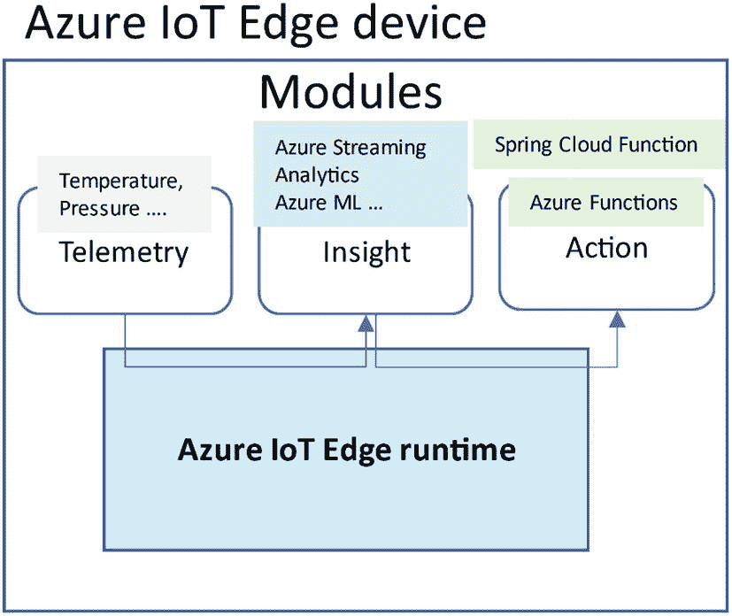

Azure IoT Edge 设备的示意图包含连接到三个模块的 Azure IoT Edge 运行时：遥测、洞察和操作。遥测包括温度和压力数据。洞察包括 Azure 流分析和 Azure 机器学习。操作包括 Spring Cloud Function 和 Azure Functions。

图 6-5

Azure IoT Edge 设备实现

### 6.3.2 Azure IoT 中心

该中心是 Azure 提供的托管服务，允许您从 IoT 设备收集数据并将其发送到其他 Azure 服务进行进一步处理。这是一个 IoT 网关，您可以通过单一门户连接和管理设备。更多信息请参见 [`https://docs.microsoft.com/en-us/azure/architecture/reference-architectures/iot`](https://docs.microsoft.com/en-us/azure/architecture/reference-architectures/iot)。


## 6.4 Spring Cloud Function 在 Azure IoT Edge 上

Spring Cloud Function 将部署在 Azure IoT Edge 设备上。Azure IoT Edge 允许部署容器化函数。更多信息请参见 [`https://learn.microsoft.com/en-us/azure/iot-edge/tutorial-deploy-function?view=iotedge-1.4`](https://learn.microsoft.com/en-us/azure/iot-edge/tutorial-deploy-function%253Fview%253Diotedge-1.4)。

图 6-6 展示了该解决方案。

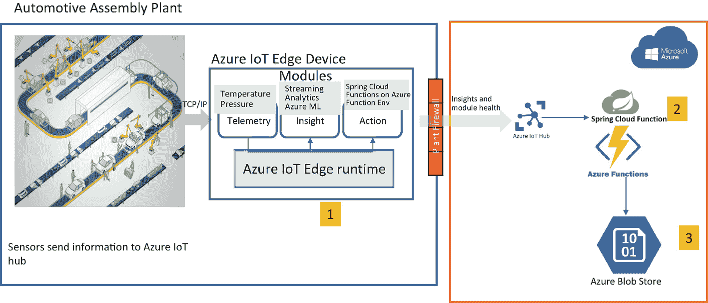

一个流程图包含 2 个模块。在汽车装配工厂模块中，传感器通过 TCP/IP 向 Azure IoT Edge 设备发送数据。数据随后通过工厂防火墙传输至 Azure 云模块，该模块包含 Azure IoT Hub、Spring Cloud Function Azure Functions 环境以及 Azure Blob 存储组件。

图 6-6

使用 Azure 和 Spring Cloud Function 的制造工厂数据处理

让我们来实现这个解决方案。

前提条件：

*   配置为 Spring Boot 的 VS Studio Code，因为其与 Azure IoT 集成非常好

*   用于存储容器化 Spring Cloud Function 的 Azure Container Registry

*   GitHub 上的代码 [`https://github.com/banup-kubeforce/AzureIoTSimulator.git`](https://github.com/banup-kubeforce/AzureIoTSimulator.git)

*   已设置并配置的 Azure IoTEdge 和 Azure IoTHub

步骤 1：安装 Azure IoT Edge 设备。您可以按照 [`https://docs.microsoft.com/en-us/azure/iot-edge/quickstart-linux?view=iotedge-2020-11`](https://docs.microsoft.com/en-us/azure/iot-edge/quickstart-linux%253Fview%253Diotedge-2020-11) 中的说明启用 Windows 或 Linux 设备。

步骤 2：将设备连接到 Azure IoT。由于您无法部署 Azure Stack hub，最好使用 Azure IoT hub 的网页版。

您可以在 Azure 门户中启用它。有关如何将边缘设备配置为连接到 IoT hub 的更多信息，请参见 [`https://docs.microsoft.com/en-us/azure/iot-edge/quickstart-linux?view=iotedge-2020-11`](https://docs.microsoft.com/en-us/azure/iot-edge/quickstart-linux%253Fview%253Diotedge-2020-11)。

您还需要在 hub 上注册设备。参见图 6-7。

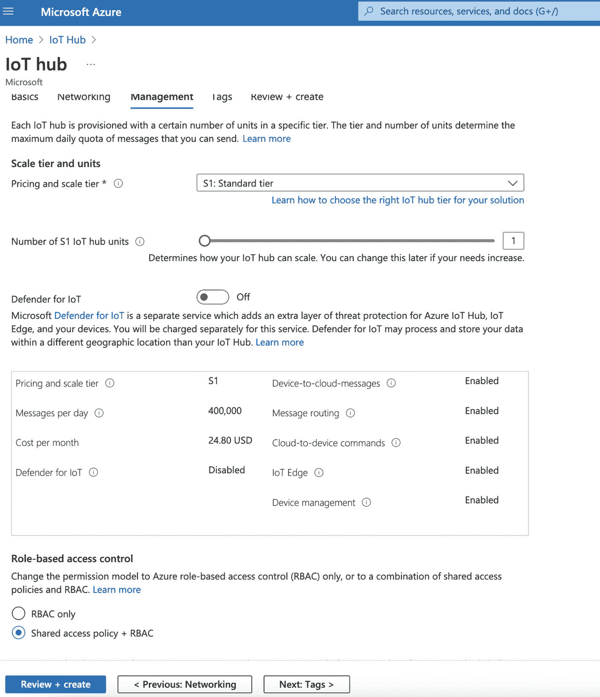

微软 Azure 门户的截图。选中了 IoT hub 订阅页面。管理标签页包含标题、缩放层级和单位、以及基于角色的访问控制（RBAC）及其下选项。顶部的其他标签页包括基础信息、网络、标签和审查加创建。

图 6-7

Azure 门户中的 IoT hub 订阅

以下是示例命令行：

```
az iot hub device-identity create --device-id myEdgeDevice --edge-enabled --hub-name {hub_name}
az iot hub device-identity connection-string show --device-id myEdgeDevice --hub-name {hub_name}
```

步骤 3：创建 Spring Cloud Function 并将其部署到 Azure IoT Edge。

此代码可在 [`https://github.com/banup-kubeforce/AzureIoTSimulator.git`](https://github.com/banup-kubeforce/AzureIoTSimulator.git) 找到。

您可以创建一个 Spring Cloud Function，将信息从边缘设备发送到 IoT hub。请确保您已获取步骤 1 中创建的连接字符串。

依赖项：

```
com.microsoft.azure.sdk.iot
iot-device-client
2.1.1

```

编写连接到 IoT hub 的代码。`iot.connection.string` 变量中存储您在步骤 1 中获取的连接字符串。

```
import com.microsoft.azure.sdk.iot.device.DeviceClient;
import com.microsoft.azure.sdk.iot.device.IotHubClientProtocol;
import org.springframework.beans.factory.annotation.Value;
import org.springframework.context.annotation.Bean;
import org.springframework.context.annotation.Configuration;
import java.net.URISyntaxException;
@Configuration
public class IOTConfiguration {
@Bean
public DeviceClient deviceClient(@Value("${iot.connection.string}") String connString) throws URISyntaxException {
return new DeviceClient(connString, IotHubClientProtocol.HTTPS);
}
}
```

创建用于构建消息的负载实体：

```
package com.kubeforce.azureiotsimulator;
import java.time.LocalDateTime;
public class PayloadEntity {
private final LocalDateTime timestamp;
private final String message;
public PayloadEntity(LocalDateTime timestamp, String message) {
this.timestamp = timestamp;
this.message = message;
}
public LocalDateTime getTimestamp() {
return timestamp;
}
public String getMessage() {
return message;
}
}
```

创建发送消息的函数：

```
package com.kubeforce.azureiotsimulator;
import com.microsoft.azure.sdk.iot.device.DeviceClient;
import com.microsoft.azure.sdk.iot.device.Message;
import com.microsoft.azure.sdk.iot.device.MessageSentCallback;
import com.microsoft.azure.sdk.iot.device.exceptions.IotHubClientException;
import org.slf4j.Logger;
import org.slf4j.LoggerFactory;
import org.springframework.beans.factory.annotation.Autowired;
import java.lang.invoke.MethodHandles;
import java.util.function.Function;
public class SendtoIoTFunction implements Function {
public static final Logger LOGGER = LoggerFactory.getLogger(MethodHandles.lookup().lookupClass());
@Autowired
private DeviceClient deviceClient;
Message message=null;
@Override
public String apply(PayloadEntity payloadEntity) {
try {
deviceClient.open(false);
deviceClient.sendEventAsync(message, new MessageSentCallback() {
@Override
public void onMessageSent(Message message, IotHubClientException e, Object o) {
LOGGER.info("IOT 响应 || 状态码 || {}",message.toString());
}
}, null);
deviceClient.close();
} catch (IotHubClientException e) {
throw new RuntimeException(e);
}
return null;
}
}
```

步骤 4：将函数部署到 Azure Function 上的边缘设备。

您需要按照第 2 章中讨论的方法对函数进行容器化。与推送到 Dockerhub 不同，您需要将它推送到 Azure Container Registry。Azure Container Registry 的相关信息请参见 [`https://azure.microsoft.com/en-us/products/container-registry/`](https://azure.microsoft.com/en-us/products/container-registry/)。

使用 VS Studio Code 的功能。GitHub 上提供了更多信息：

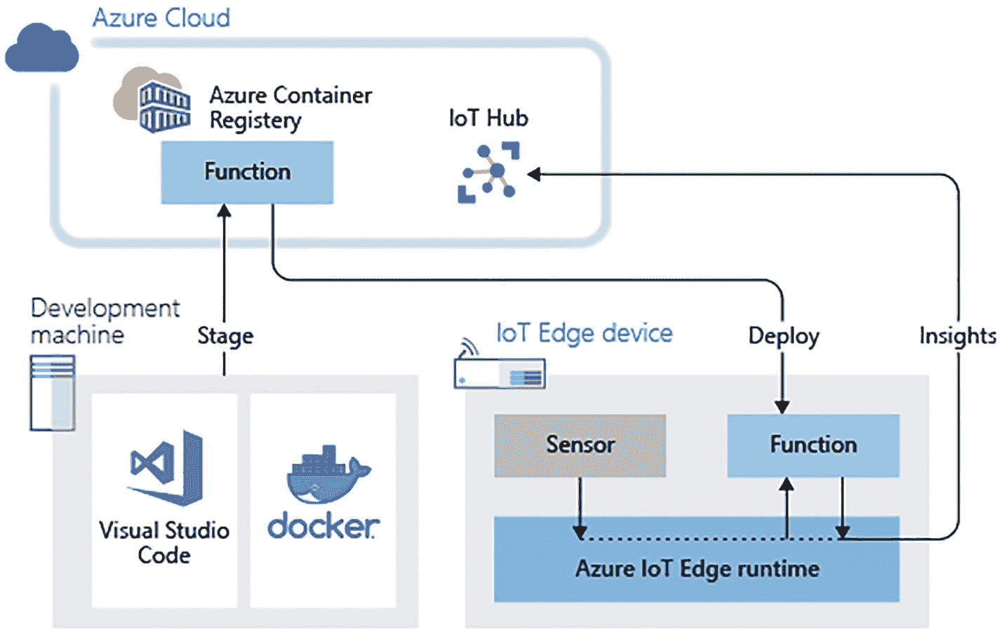

一个流程图。开发机器阶段连接到 Azure 云函数，该函数随后部署到 IoT 边缘设备函数。Azure IoT Edge 运行时使用传感器和函数，并将洞察结果返回到 Azure 云 IoT hub。

图 6-8

使用 Azure IoT Edge 运行时在 IoT 边缘设备上部署 Azure 函数（来源：[*https://learn.microsoft.com/en-us/azure/iot-edge/media/tutorial-deploy-function/functions-architecture.png?view=iotedge-1.4*](https://learn.microsoft.com/en-us/azure/iot-edge/media/tutorial-deploy-function/functions-architecture.png%253Fview%253Diotedge-1.4)）

1.  为单个设备创建部署。

2.  在 `config` 文件夹中选择 `deployment.amd64.jso`。点击选择边缘部署清单。

3.  展开模块以查看已部署和运行的模块列表。参见图 6-8。

本节展示了如何将制造装配工厂和传感器的相同用例应用 Azure IoT 解决方案。

您创建了一个 Spring Cloud Function，并通过 Azure Function 部署到 Azure IoTEdge。GitHub 上提供了详细信息 [`https://github.com/banup-kubeforce/AzureIoTSimulator.git`](https://github.com/banup-kubeforce/AzureIoTSimulator.git)。

您还了解到，可以使用 Azure IoT Edge 运行时与 Azure IoT Edge 设备收集传感器数据。这与在 AWS 中的操作非常相似。


## 6.5 使用 SaaS 提供商物联网网关的本地部署 Spring Cloud Function（SmartSense）

不希望使用任何云服务商物联网组件的企业可以将传感器数据收集工作外包给第三方公司。这些第三方公司随后可以将数据以流式或批量形式发送到企业数据中心内托管的系统中。

图 6-9 展示了不使用 Azure 或 AWS 等超大规模云服务商的实现方案。

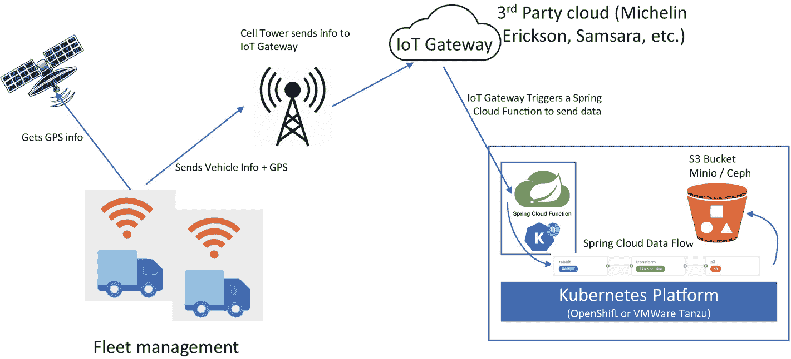

一个示意图。车队管理通过蜂窝基站将 GPS 和车辆信息发送到第三方云物联网网关。网关触发 Spring Cloud Function 将数据发送到 Kubernetes 平台，该平台可部署在 OpenShift 或 VMware Tanzu 上。

图 6-9

车队管理示例

对于此用例，公司希望管理其车辆车队，并向消费者提供有关车辆健康状况、位置、维护、维修信息、驾驶员信息等数据，以实现车队和货物的可视化。车辆数据需要在自己的数据中心中进行收集和处理。详见表 6-1。

表 6-1

组件描述

| 传感器 | 首选传感器 |
| --- | --- |
| 物联网网关 | 您的首选网关产品 |
| IBM Cloud Functions | [`https://cloud.ibm.com/functions/`](https://cloud.ibm.com/functions/) |
| IBM Watson IoT 平台 | [`https://www.ibm.com/cloud/watson-iot-platform`](https://www.ibm.com/cloud/watson-iot-platform) |
| IBM Watson IoT 平台-消息网关 | [`https://www.ibm.com/docs/en/wip-mg`](https://www.ibm.com/docs/en/wip-mg) |
| IBM 事件流 | [`https://www.ibm.com/cloud/event-streams`](https://www.ibm.com/cloud/event-streams) |
| IBM Cloudant 数据库 | [`https://www.ibm.com/cloud/cloudant`](https://www.ibm.com/cloud/cloudant) |

解决方案：

* 第三方物联网网关提供商，如米其林、Erickson、Samsara 等
* 本地部署的 Kubernetes 平台，如 OpenShift 或 VMware Tanzu
* Spring Cloud Data Flow
* 数据中心内托管的 S3 存储桶，如 Minio 或 Ceph
* Knative 上的 Spring Cloud Function

步骤 1：联系您的第三方提供商获取其物联网中心的信息。由于传感器数据的采集工作已外包给第三方提供商，您可以假设数据会从车辆中被收集并路由到第三方云。

一旦数据在第三方网关中被收集，它将通过调用函数被路由到公司的数据中心。

步骤 2：在您的环境中设置 Spring Cloud Data Flow。

* 在 Kubernetes 环境（如 OpenShift 或 VMware Tanzu）中安装 Spring Cloud Data Flow
* 创建 Spring Cloud Data Flow 数据管道

Spring Cloud Data Flow 的安装内容详见第 4 章。

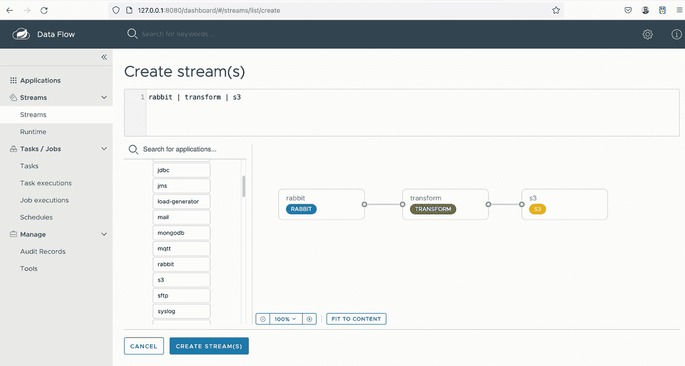

Spring Cloud Data Flow 窗口的截图。选中了"流"标签页，"创建流"为页面标题。在数据管道旁有一个搜索选项，包含 rabbit、transform 和 s3 模块。下方有"取消"和"创建流"按钮。

图 6-10

Spring Cloud Data Flow

此示例使用 RabbitMQ 作为数据源，S3 Minio/Ceph 作为数据接收端。

步骤 3：发布到 RabbitMQ。有关如何发布到 RabbitMQ 的详细信息，请参见第 4 章。

步骤 4：如第 2 章所述，在 Knative 上部署 Spring Cloud Function，并为物联网网关暴露一个公共端点。

这完成了使用第三方物联网网关的本地部署方案的实现。您可以像使用 AWS Lambda 或 Azure Functions 一样利用无服务器环境。Kubernetes 上的 Knative 为 Spring Cloud Function 提供了该无服务器环境。

您利用 Spring Cloud Data Flow 作为数据管道来收集和处理传感器数据。

更多项目信息请访问 [`https://github.com/banup-kubeforce/onpremIoT.git`](https://github.com/banup-kubeforce/onpremIoT.git)。

## 6.6 总结

正如您在本章所学到的，可以使用 Spring Cloud Function 构建基于物联网的解决方案，既可以在本地环境，也可以在 AWS 和 Azure 等云平台上实现。

Spring Cloud Function 是 Java 世界中最灵活的框架之一。它可以部署在专有云的无服务器环境中，也可以部署在 Knative 上，使其成为一个非常便携的组件。

无论是制造工厂与公共互联网隔离，还是车队管理在道路上运行，您都可以使用 Spring Cloud Function 构建安全可靠的解决方案。

