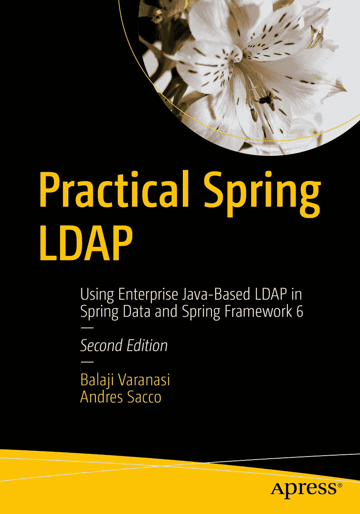

ISBN 979-8-8688-0001-6e-ISBN 979-8-8688-0002-3 [`doi.org/10.1007/979-8-8688-0002-3`](https://doi.org/10.1007/979-8-8688-0002-3) © Balaji Varanasi 和 Andres Sacco 2013, 2023 本作品受版权保护。所有权利均由出版商独家拥有，无论涉及材料的全部或部分，具体包括翻译权、重印权、重用插图权、朗诵权、广播权、微缩胶片复制权或以其他任何形式进行的复制，以及电子传输或信息存储和检索的适应性权利，包括计算机软件或通过现在已知或将来开发的类似或不同的方法。本出版物中使用的一般描述性名称、注册名称、商标、服务标志等，并不意味着在没有明确声明的情况下，这些名称免受相关保护法律和法规的约束，因此可以自由用于一般用途。出版商、作者和编辑可以合理假设，本书中提供的建议和信息在出版时被认为是真实和准确的。出版商、作者或编辑不对其中包含的材料或可能存在的任何错误或遗漏提供明示或暗示的保证。出版商对出版地图和机构隶属关系中的司法主张保持中立。

本 APress imprint 由注册公司 APress Media, LLC 出版，该公司隶属于 Springer Nature。

注册公司地址为：纽约市 1 号纽约广场，纽约，纽约州 10004，美国。

*致我的祖父母，他们教会了我不断学习新事物的重要性。*

*致我的妻子和孩子们，感谢他们在写作本书期间的支持。*

简介

*Practical Spring LDAP* 详细介绍了 Spring LDAP 框架，该框架旨在简化 LDAP 编程的复杂性。本书首先解释 LDAP 的基本概念，并指导读者如何设置开发环境。随后深入探讨 Spring LDAP，分析其设计解决的问题。接着，本书聚焦于 LDAP 单元测试和集成测试的实践方面。随后深入讲解 LDAP 控制和 Spring LDAP 特性，如对象-目录映射（Object-Directory Mapping）和 LDIF（LDAP 数据交换格式）解析。最后，本书以对 LDAP 认证和连接池的讨论作为结尾。

## 本书内容

*章节* *1* 从目录服务器概述开始，随后讨论 LDAP 基础并介绍四种 LDAP 信息模型。最后以用于表示 LDAP 数据的 LDIF 格式简介结束。

*章节* *2* 聚焦于 Java 命名和目录接口（JNDI）。在本章中，您将学习如何使用纯 JNDI 创建与 LDAP 交互的应用程序。

*章节* *3* 解释 Spring LDAP 及其为何是企业开发人员工具箱中的重要选项。在本章中，您将设置开发环境以创建 Spring LDAP 应用程序，并了解其他重要工具，如 Maven 和测试 LDAP 服务器。最后，您将使用注解实现一个基本但完整的 Spring LDAP 应用程序。

*章节* *4* 涵盖单元测试和集成测试的基础知识。随后，您将学习如何使用嵌入式 LDAP 服务器进行单元测试，或通过 Testcontainers 使用 Docker 镜像运行 LDAP。您还将回顾可用于生成测试数据的工具。最后，您将使用 Mockito 库对 LDAP 代码进行模拟测试。

*章节* *5* 介绍 JNDI 对象工厂的基本概念，并使用这些工厂创建对应用程序更有意义的对象。随后，您将研究使用 Spring LDAP 和对象工厂实现的完整数据访问对象（DAO）层。

*章节* *6* 涉及 LDAP 搜索。本章首先介绍 LDAP 搜索的基本原理，然后引入多种 Spring LDAP 过滤器以简化 LDAP 搜索。最后，您将学习如何创建自定义搜索过滤器以应对当前过滤器集合不足的情况。

*章节* *7* 提供了对 LDAP 控制的深入概述，这些控制可用于扩展 LDAP 服务器功能。随后，本书将转向使用排序和分页控制对 LDAP 结果进行排序和分页。

*章节* *8* 讨论对象-目录映射（ODM），这是 Spring LDAP 的一个特性。在本章中，您将学习如何弥合领域模型与目录服务器之间的差距，并重新实现 DAO 以使用 ODM 概念。

*章节* *9* 在分析 Spring 框架提供的事务抽象之前，先介绍事务和事务完整性的核心概念。最后，本书将探讨 Spring LDAP 的补偿事务支持。

## 目标读者

*Practical Spring LDAP* 旨在为希望使用 LDAP 构建 Java/JEE 应用程序的开发人员提供帮助。它还教授如何为 LDAP 应用程序创建单元/集成测试的技术。本书假设读者具备 Spring 框架的基础知识，虽然对 LDAP 的先前接触是有帮助的，但并非必需。已经熟悉 Spring LDAP 的开发人员将发现本书提供的最佳实践和示例，能够充分利用该框架。

## 先决条件

您应在机器上安装 Java JDK^(¹) 21 或更高版本、Maven^(²) 3.8.0 或更高版本，以及某些 IDE。IDE 的一些选项可以是 Eclipse^(³)、IntelliJ IDEA^(⁴)、Visual Studio Code^(⁵)等，但您可以选择最适合自己的。

为了减少在机器上安装所有 LDAP 供应商的复杂性，我建议您安装 Docker^(⁶)，并使用它来运行每个 LDAP。Docker 的使用和安装超出了本书的范围，但有一些教程^(⁷)或速查表^(⁸)包含最常见的命令。

注意

如果您尚未在机器上安装相关工具，可以参阅附录 A、B 和 C，其中包含安装不同工具和加载 LDAP 信息的指南。

安装完所有工具后，在阅读不同章节之前，必须检查它们是否正确安装。

对于 Java，您需要运行以下命令：

```
% java -version
openjdk 21 2023-09-19
OpenJDK Runtime Environment (build 21+35-2513)
OpenJDK 64-Bit Server VM (build 21+35-2513, mixed mode, sharing)
```

随后，您需要使用以下命令检查 Maven 版本是否正确：

```
% mvn --version
Apache Maven 3.9.1
Maven home: /usr/share/maven
```

最后，如果您想检查 Docker 是否在机器上正常运行，可以使用以下命令：

```
% docker --version
Docker version 24.0.2, build cb74dfc
```

请记住，我之前提到 Docker 是可选的。它仅推荐用于减少在机器上安装 LDAP 供应商的复杂性。

## 下载源代码

本书示例的源代码可以从 [`www.apress.com`](http://www.apress.com) 下载。有关定位本书源代码的详细信息，请访问 [`www.apress.com/gp/services/source-code`](http://www.apress.com/gp/services/source-code)。代码按章节组织，并可通过 Maven 进行构建。


## 问题？

如果您有任何问题或建议，请通过`sacco.andres@gmail.com`联系作者。

致谢

我要感谢在本书写作过程中给予我鼓励和支持的家人和朋友们：

*   我的妻子吉塞拉，她总是在我长时间坐在电脑桌前工作时保持耐心

*   我的小女儿弗朗西斯卡，她在撰写每一章时帮助我放松心情

*   我的宝宝阿莱格拉，她是新家庭成员，也是我撰写本书的灵感来源

*   我的朋友德国·卡纳尔和朱利安·德尔利，他们始终信任我能够写出一本书，并在我困难时期给予支持

特别感谢曼努埃尔·乔丹在提升本书质量方面给予的指导。

衷心感谢 Apress 的美丽团队在本书出版过程中给予的支持。感谢 Shonmirin P.A.提供的卓越支持。最后，感谢 Mark Powers 和 Melissa Duffy 建议并允许我撰写本书。同时，我想提及 Balaji Varanasi 在本书第一版中所做的出色工作，为撰写第二版奠定了基础。

关于作者 技术审校者 注释 1   2   3   4   5   6   7   8

