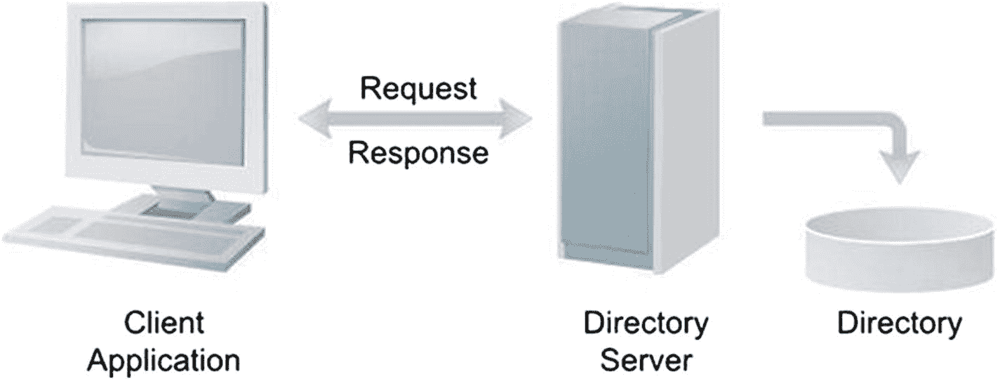
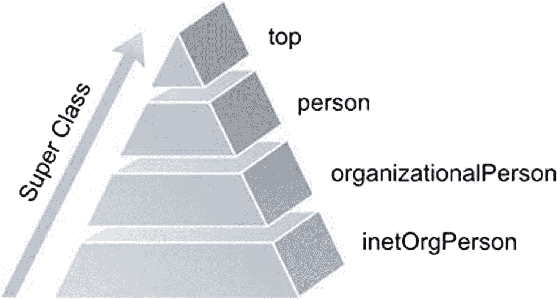
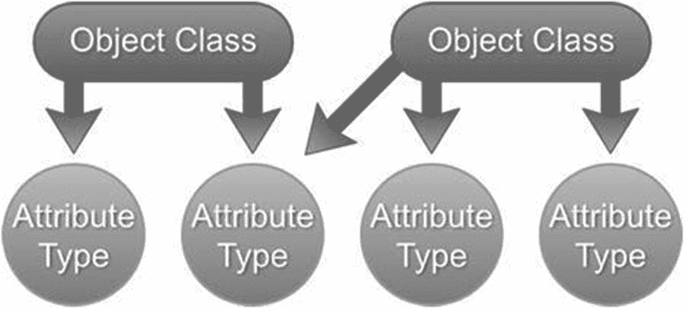
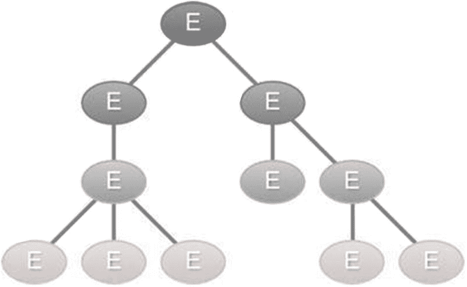
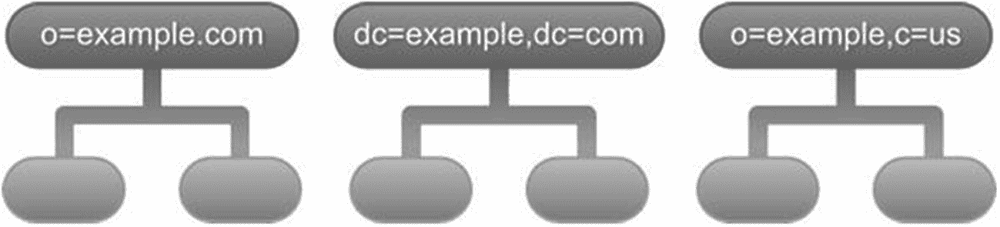
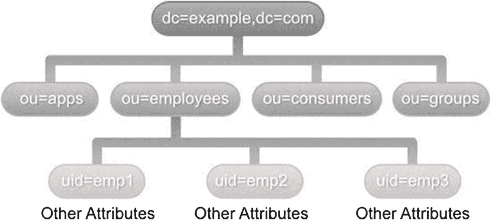
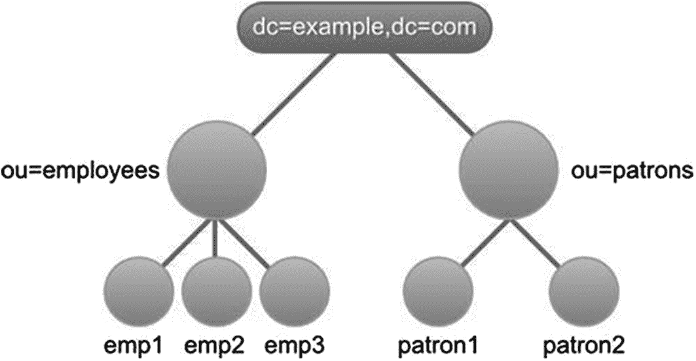

# 1. LDAP 简介

我们每天都与目录打交道。我们使用电话簿查找电话号码，到图书馆时使用图书目录查找想阅读的书籍，用文件系统目录在计算机上存储文件和文档。简而言之，目录就是信息存储库。这些信息通常以易于检索的方式组织。

网络上的目录通常通过客户端/服务器通信模型进行访问。希望读取或写入目录数据的应用程序会与专用服务器通信。目录服务器在实际目录上执行读取或写入操作。图 1-1 展示了这种客户端/服务器交互。



服务器与客户端的交互示意图。客户端应用程序通过请求和响应与目录服务器互联。目录服务器在实际目录上进行读取或写入操作。

图 1-1

目录服务器与客户端的交互

目录服务器与客户端应用程序之间的通信通常通过标准化协议实现。轻量级目录访问协议（LDAP）为与目录通信提供了标准协议。实现 LDAP 协议的目录服务器通常被称为 LDAP 服务器。LDAP 协议基于早期的 X.500^(⁹)标准，但显著更简单（轻量级）且易于扩展。多年来，LDAP 协议经历了多次迭代，目前版本为 3.0。

## LDAP 概述

LDAP 定义了目录客户端和目录服务器使用的消息协议。通过考虑以下四个模型，可以更好地理解 LDAP：

*   信息模型决定了存储在目录中的信息结构。

*   命名模型定义了信息在目录中的组织方式和标识方法。

*   功能模型定义了对目录执行的操作。

*   安全模型定义了如何防止信息被未经授权的访问。

我们将在后续章节中逐一探讨这些模型。

### 目录与数据库

初学者常常需要澄清，会将 LDAP 目录想象成关系型数据库。与数据库类似，LDAP 目录存储信息。然而，一些关键特性使目录与关系型数据库有所区别。

LDAP 目录通常存储相对静态的数据。例如，存储在 LDAP 中的员工信息（如电话号码或姓名）通常不会每天发生变化。然而，用户和应用程序会频繁查找这些信息。由于目录中的数据访问频率高于更新频率，LDAP 目录遵循 WORM 原则^(¹⁰,) ^(¹¹)，并高度优化读取性能。将经常变化的数据存储在 LDAP 中是没有意义的。

关系型数据库采用参照完整性与锁机制来确保数据一致性。LDAP 中存储的数据通常不需要如此严格的一致性要求。因此，这些功能大多需要在 LDAP 服务器上实现。此外，LDAP 规范中未定义事务语义以支持回滚操作。

关系型数据库遵循规范化原则以避免数据重复和冗余。另一方面，LDAP 目录以分层、面向对象的方式组织。这种组织方式违反了一些规范化原则。同时，LDAP 中需要引入表连接的概念。

尽管目录缺少上述关系型数据库管理系统（RDBMS）^(¹²)的一些特性，但许多现代 LDAP 目录是建立在关系型数据库（如 DB2^(¹³)、MySQL^(¹⁴)和 PostgreSQL^(¹⁵)）之上的。

在某个阶段，LDAP 具有与非关系型数据库（如 Cassandra^(¹⁶)、MongoDB^(¹⁷)等）相似的特性，其中写入/读取性能、高可用性和可扩展性比一致性更为重要。


## 信息模型

LDAP 中存储的基本单位是条目（entry）。条目保存有关现实世界对象的信息，例如员工、服务器、打印机和组织。LDAP 目录中的每个条目包含零个或多个属性（attributes）。属性是键值对，用于保存条目所代表对象的信息。属性的键部分也称为属性类型（attribute type），描述了可以存储在该属性中的信息类型。属性的值部分包含实际信息。表 1-1 展示了一个代表员工的条目部分。条目左侧列包含属性类型，右侧列保存属性值。

表 1-1

员工 LDAP 条目

| 员工条目 |
| --- |
| `objectClass` | inetOrgPerson |
| `givenName` | John |
| `surname` | Smith |
| `mail` | `john@inflix.com``jsmith@inflix.com` |
| `mobile` | +1 801 100 1000 |

注意

属性名称默认是大小写不敏感的。然而，在 LDAP 操作中建议使用驼峰命名格式。

您会注意到 mail 属性包含两个值。允许存储多个值的属性称为多值属性（multivalued attributes）。另一方面，单值属性（single-valued attributes）只能保存一个值。LDAP 规范不保证多值属性中值的顺序。

每个属性类型都与一种语法（syntax）相关联，该语法决定了作为属性值存储的数据格式。例如，mobile 属性类型具有`telephoneNumber`语法。这会强制属性值必须为长度在 1 到 32 之间的字符串。

此外，语法还定义了属性值在搜索操作中的行为。例如，`givenName`属性具有`DirectoryString`语法。该语法规定只能使用字母数字字符作为值。表 1-2 列出了一些常见属性及其关联的语法描述。

表 1-2

常见条目属性

| 属性类型 | 语法 | 描述 |
| --- | --- | --- |
| `commonName` | DirectoryString | 存储人员的通用名称。 |
| `company` | DirectoryString | 存储公司的名称。 |
| `employeeNumber` | DirectoryString | 存储人员在组织中的员工编号。 |
| `givenName` | DirectoryString | 存储用户的首名。 |
| `jpegPhoto` | Binary | 存储人员的一个或多个图像。 |
| `mail` | IA5 String | 存储人员的 SMTP 邮件地址。 |
| `mobile` | TelephoneNumber | 存储人员的手机号码。 |
| `postalAddress` | Postal Address | 存储用户的邮政编码或 ZIP 码。 |
| `postalCode` | DirectoryString | 存储用户的邮政编码或 ZIP 码。 |
| `st` | DirectoryString | 存储州或省的名称。 |
| `street` | DirectoryString | 存储街道地址。 |
| `surname` | DirectoryString | 存储人员的姓氏。 |
| `telephoneNumber` | TelephoneNumber | 存储人员的主要电话号码。 |
| `uid` | DirectoryString | 存储用户 ID。 |
| `title` | DirectoryString | 存储职位名称或公司的职能名称。 |
| `wwwhomepage` | DirectoryString | 存储公司的官方网页。

表 1-2 中的属性是开发人员和工具最常使用的属性。然而，根据您的供应商或工具是否支持，还有大量其他属性可供使用；例如，在微软官方网页^(¹⁸)上，所有属性均支持 Active Directory。

## 对象类

在面向对象语言（如 Java）中，我们创建一个类并将其用作创建对象的蓝图。该类定义了这些实例可以拥有的属性（数据）和行为（方法）。类似地，LDAP 中的对象类决定了 LDAP 条目可以拥有的属性。这些对象类还定义了哪些属性是必需的，哪些是可选的。每个 LDAP 条目都有一个特殊属性，恰当地命名为`objectClass`，用于保存其所属的对象类。查看表 1-1 中员工条目的 objectClass 值，我们可以得出结论：该条目属于`inetOrgPerson`类。表 1-3 展示了标准 LDAP 人员对象类的必需属性和可选属性。`cn`属性保存人员的通用名称，而`sn`属性保存人员的姓氏或家族名称。

表 1-3

人员对象类

| 必需属性 | 可选属性 |
| --- | --- |
| `sn` | `description` |
|   | `telephoneNumber` |
| `cn` | `userPassword` |
| `objectClass` | `seeAlso` |

如同 Java，对象类可以继承其他对象类。这种继承关系将允许子类对象类继承父类的属性。例如，人员对象类定义了通用名称和姓氏等属性。`inetOrgPerson`对象类继承了人员类，因此继承了所有人员类的属性。

此外，`inetOrgPerson`定义了人员在组织中工作所需的属性，例如`departmentNumber`和`employeeNumber`。一个特殊的对象类`top`没有父类。所有其他对象类都是`top`的子类，并继承其声明的所有属性。`top`对象类包含必需的`objectClass`属性。图 1-2 展示了对象继承关系。



LDAP 对象继承关系的三角示意图。从下到上的层级是互联网组织人员、组织人员、人员和 top。箭头方向表示超类。

图 1-2

LDAP 对象继承

大多数 LDAP 实现都包含标准对象类，可以直接使用。表 1-4 列出了一些常见的 LDAP 对象类及其常用的属性。

表 1-4

常见 LDAP 对象类

| 对象类 | 属性 | 描述 |
| --- | --- | --- |
| `top` | `objectClass` | 定义根对象类。所有其他对象类必须继承此类。 |
| `organization` | `o` | 表示公司或组织。o 属性通常保存组织名称。 |
| `organizationalUnit` | `ou` | 表示组织内部的部门或类似实体。 |
| `person` | `sn``cn``telephoneNumber userPassword` | 表示目录中的人员，要求包含`sn`（姓氏）和`cn`（通用名称）属性。 |
| `organizationalPerson` | `registeredAddress postalAddress postalCode` | 表示组织中的人员的子类。 |
| `inetOrgPerson` | `uid departmentNumber employeeNumber givenName manager` | 提供额外属性，可用于表示在当今基于互联网和内联网组织中工作的人员。uid 属性保存人员的用户名或用户 ID。 |

在 Oracle 的官方网站上，^(¹⁹)您可以找到 LDAP 对象类列表，并了解每个对象类对应的请求评论（RFC）信息。

注意

在本书中，您将看到许多关于 RFC 的引用。请求评论（RFC）是由互联网工程任务组（IETF）^(²⁰)发布的一系列技术文档，用于定义某些标准。

每个 RFC 名称中包含一个数字，并包含一系列关于规范的章节。RFC 可能会因新技术的出现而被许多其他 RFC 取代，例如 LDAP 的新版本。

在 RFC 编辑器网站上，^(²¹)您可以找到关于 RFC 的信息以及新 RFC 的发布流程。


## 目录架构

LDAP 目录架构是一组规则，用于确定目录中存储的信息类型。架构可以被视为打包单元，包含属性类型定义和对象类定义。在将条目存储到 LDAP 之前，必须验证架构规则。这种架构检查确保条目包含所有必需的属性，并且不包含架构之外的属性。图 1-3 表示一个通用的 LDAP 架构。



LDAP 通用架构示意图。一组 2 个对象类包含 2 个属性类型。对象类 2 映射到对象类 1 的属性。

图 1-3

LDAP 通用架构

与数据库类似，目录架构必须精心设计以解决数据冗余等问题。在实施您的架构之前，查看公开的标准架构是有价值的。这些标准架构通常包含存储所需数据的所有定义，并且更重要的是，确保与其他目录的互操作性。

## 命名模型

LDAP 命名模型定义了目录中条目如何组织。它还决定了如何唯一标识特定条目。命名模型建议以分层方式逻辑存储条目。这棵条目树通常称为目录信息树（DIT）。图 1-4 提供了一个通用目录树的示例。



通用目录信息树示意图。节点 E 后面跟着两个节点 E。每个节点后面都有节点 E 的分支。

图 1-4

通用 DIT

这棵树的根通常称为目录的基或后缀。该条目代表拥有目录的组织。后缀的格式可能因实现而异，但通常有三种推荐方法，如图 1-5 所列。



一组 3 个目录后缀命名规范的流程图。方法分别是 0 等于 example.com，dc 等于 example.dc 等于 com，o 等于 example.c 等于 us。每种方法都有对应的分类。

图 1-5

目录后缀命名规范

注意

DC 代表域组件。

第一种推荐技术是使用组织的域名作为后缀。例如，如果组织的域名是 `example.com`，目录后缀将是 o=example.com。第二种技术也使用域名，但每个名称组件都以“dc=”开头，并用逗号连接。因此，域名 `example.com` 会生成后缀 dc=example, dc=com。这种技术在 RFC 2247^(²²)中提出，并且在 Microsoft Active Directory 中很流行。第三种技术使用 X.500 模型，并以 o=组织名称, c=国家代码 的格式创建后缀。在美国，组织 example 的后缀将是 o=example, c=us。

命名模型还定义了目录中条目的命名和唯一标识方式。具有相同直接父节点的条目通过其相对区分名（RDN），也称为区分名（DN）来唯一标识。RDN 通过条目中一个或多个属性/值对计算得出。在最简单的情况下，RDN 通常为 attribute-name = attribute value 的形式。图 1-6 提供了一个简化版的组织目录示意图。每个位于 ou=employees 下的人员条目都有一个唯一的 uid。因此，第一个人员条目的 RDN 是 uid=emp1，其中 emp1 是员工的用户 ID。



组织目录的流程图。dc=example, dc=com 被分类为 ou=appa, employees, consumers, groups。ou=employees 被分类为 3 个其他属性。

图 1-6

组织目录示例

注意

区分名不是条目中的实际属性。它是一个与条目关联的逻辑名称。

需要记住的是，RDN 不能在整个树中唯一标识条目。然而，通过将从树顶到该条目的路径中所有条目的 RDN 组合起来，可以轻松实现这一点。这种组合的结果称为区分名（DN）。在图 1-6 中，人员 1 的 DN 为 uid=emp1, ou=employees, dc=example, dc=com。由于 DN 由 RDN 组合而成，如果某个条目的 RDN 发生变化，该条目及其所有子条目的 DN 也会发生变化。

可能存在某些条目集没有唯一属性的情况。在这种情况下，一种选择是通过组合多个属性来创建唯一性。例如，我们可以使用之前目录中的消费者通用名称和电子邮件地址作为 RDN。多值 RDN 通过用加号（+）分隔每个属性对来表示，如下所示：

```
cn =  Balaji  Varanasi +            mail=balaji@inflinx.com
```

RDN 中的一些特殊字符必须转义以防止出现不同问题。这些特殊字符包括 +（加号）、=（等号）、<（小于号）、>（大于号）、;（分号）、,（逗号）、\（反斜杠）、#（井号）和 "（引号）。

有多种方法可以转义这些字符，例如在特殊字符前添加反斜杠（“\” ASCII 92）；这种方法是最常用的。另一种方法是用反斜杠和十六进制数字替换特殊字符，最后一种方法则是用引号（“”）包围属性值。

注意

多值 RDN 通常不被推荐。在这些情况下，建议创建一个唯一的序列属性以确保唯一性。

## 功能模型

LDAP 功能模型描述了使用 LDAP 协议对目录执行的访问和修改操作。这些操作分为三类：查询、更新和认证。

查询操作用于搜索和检索目录中的信息。因此，每当需要读取某些信息时，必须构建并执行针对 LDAP 的搜索查询。搜索操作需要指定 DIT 中的起始点、搜索深度以及条目必须满足的属性。在第 6 章 6，您将深入探讨搜索并查看所有可用选项。

更新操作用于添加、修改、删除和重命名目录条目。正如其名，添加操作将新条目添加到目录中。此操作需要创建条目的 DN 和构成该条目的属性集。删除操作需要完整的 DN 来删除条目。LDAP 协议仅允许删除叶节点条目。修改操作更新现有条目。此操作需要条目的 DN 和一组修改内容，例如添加新属性、更新现有属性或删除属性。重命名操作可以重命名或移动目录中的条目。

认证操作用于在客户端与 LDAP 服务器之间建立和结束会话。绑定操作在客户端和服务器之间启动 LDAP 会话。通常，这会导致匿名会话。客户端可以提供 DN 和凭证以认证并创建已认证会话。另一方面，解绑操作可用于终止现有会话并断开与服务器的连接。

LDAP V3 引入了一个框架，允许在不更改协议的情况下扩展现有操作并添加新操作。您将在第 7 章 7 中查看这些操作。


## 安全模型

LDAP 安全模型保护 LDAP 目录信息免受未经授权的访问。该模型指定了哪些客户端可以访问目录的哪些部分以及允许哪些操作（搜索 vs. 更新）。

LDAP 安全模型基于客户端向服务器进行身份验证。如前所述，此身份验证过程或绑定操作涉及客户端提供一个标识自身的 DN 和密码。如果客户端未提供 DN 和密码，则会建立匿名会话。RFC 2829^(²³) 定义了 LDAP V3 服务器必须支持的一组身份验证方法。成功身份验证后，会查阅访问控制模型以确定客户端是否有权限执行请求的操作。不幸的是，目前尚无统一的访问控制模型标准，每个供应商都提供了自己的实现方案。

## LDIF 格式

LDAP 数据交换格式（LDIF）是一种用于表示目录内容和更新请求的标准文本格式。LDIF 格式在 RFC 2849 中定义。^(²⁴) LDIF 文件通常用于将数据从一个目录服务器导出并导入到另一个目录服务器中。它也常用于目录数据归档以及对目录进行批量更新。你将使用 LDIF 文件来存储测试数据，并在单元测试之间刷新目录服务器。

在 LDIF 文件中表示的条目基本格式如下：

```
#comment
dn: 
objectClass:  
objectClass:  
...
...
: 
: 
...
```

以 # 字符开头的 LDIF 文件行被视为注释。`dn` 和至少一个 `objectClass` 条目定义被视为必需项。属性以名称/值对的形式表示，名称和值之间用冒号分隔。多个属性值通过单独的行表示，且具有相同的属性类型。由于 LDIF 文件是纯文本格式，因此二进制数据在存储为 LDIF 文件的一部分前需要进行 Base64 编码。

空白行用于分隔 LDIF 文件中的多个条目。列表 1-1 展示了一个包含三个员工条目的 LDIF 文件。请注意，`cn` 属性是多值属性，每个员工的 `cn` 属性都表示两次。

```
# Barbara 的条目
dn: cn=Barbara J Jensen,  dc=example, dc=com
# 多值属性
cn: Barbara J Jensen
cn:  Babs Jensen
objectClass:  person
sn: Jensen
# Bjorn 的条目
dn: cn=Bjorn J Jensen,  dc=example, dc=com
cn: Bjorn J Jensen
cn:  Bjorn Jensen
objectClass:  person
sn: Jensen
# Base64 编码的 JPEG 图片
jpegPhoto:: /9j/4AAQSkZJRgABAAAAAQABAAD/2wBDABALD A4MChAODQ4SERATGCgaGBYWGDEjJR0oOjM9PDkzODdASFxOQ ERXRTc4UG1RV19iZ2hnPk1xeXBkeFxlZ2P/2wBDARESEhgVG
# Jennifer 的条目
dn: cn=Jennifer  J Jensen,  dc=example, dc=com
cn: Jennifer J Jensen
cn: Jennifer  Jensen
objectClass: person
sn: Jensen
列表 1-1
包含三个员工条目的 LDIF 文件
```

## LDAP 历史

LDAP 由 Tim Howes、Steve Kille 和 Wengyik Yeong 开发，旨在创建一种网络协议以获取数据。1993 年出现了 RFC 1487 的第一版草案，^(²⁵) 其中包含了基于 X.500 访问的 LDAP 规范。

第一个版本作为 X.500 目录的代理或网关，X.500 是 1980 年代开发的综合目录服务。

Tim Howes 与其同事创建了 *Open Source University of Michigan LDAP Implementation*（密歇根大学开源 LDAP 实现），这成为所有 LDAP 服务器的参考标准。该项目的网站目前仍处于活动状态^(²⁶)，仅用于历史参考。

第二个版本（首个可运行版本 LDAPv2）于 1993 年发布，作为互联网工程任务组（IETF）的建议标准，包含基本操作如搜索和修改信息。此版本功能有限，且在安全机制方面存在一些问题。

第三个版本（最新可用版本）于 1997 年发布，包含许多与安全相关的改进，如传输层安全协议（TLS）和对引用的支持。它基于 RFC 2251^(²⁷) 和 RFC 4519^(²⁸) 等 RFC 文档，这些文档解释了协议和支持的数据模型。此版本成为目录服务的实际上标准，许多应用程序都支持集成和使用 LDAP 以获取特定信息。


## 示例应用

贯穿本书，你将使用一个假设图书图书馆的目录结构进行操作。我选择图书馆作为示例，是因为其概念具有普遍性且易于理解。图书馆通常存储书籍和其他多媒体资料供借阅者借阅。图书馆还雇佣人员负责日常运营。为简化管理，该目录将不存储书籍信息。关系型数据库更适合记录书籍信息。图 1-7 展示了我们图书馆应用程序的 LDAP 目录树。



图书馆 DIT 的树状图示。DC 等于 example，DC 等于 com 映射到 OU 等于 employees 和 patrons。OU 等于 employees 映射到 3 名员工，OU 等于 patrons 映射到 2 名借阅者。

图 1-7

图书馆 DIT

我在此目录树中使用了 RFC 224714 的命名规范。该目录树的基项包含两个组织单位条目，分别存储员工和借阅者的信息。树中的 ou=employees 部分将包含所有图书馆员工条目，ou=patrons 部分将包含图书馆借阅者条目。员工和借阅者的条目类型均为 `inetOrgPerson objectClass`。员工和借阅者均通过其唯一的登录 ID 访问图书馆应用程序。因此，`uid` 属性将被用作条目的相对区分名（RDN）。

## 总结

LDAP 及其交互应用已成为当今企业的重要组成部分。本章介绍了 LDAP 目录的基础知识。你了解到 LDAP 以条目形式存储信息。每个条目由属性组成，属性本质上是键值对。这些条目可通过其区分名访问。你还了解到 LDAP 目录具有模式（schema），用于定义可存储的信息类型。

下一章将探讨如何使用 Java 命名和目录接口（JNDI）与 LDAP 目录通信。在后续章节中，你将专注于使用 Spring LDAP 开发 LDAP 应用程序。

脚注 1   2   3   4   5   6   7   8   9   10   11   12   13   14   15   16   17   18   19   20

