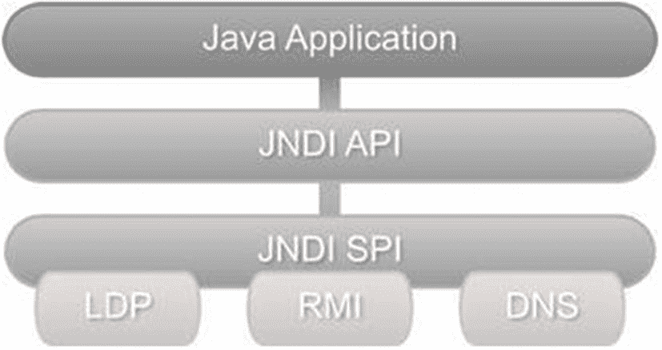

# 2. Java 对 LDAP 的支持

正如其名称所示，Java 命名和目录接口（JNDI）提供了标准化的编程接口，用于访问命名和目录服务。它是一个通用的应用程序编程接口（API），可以访问多种系统，包括文件系统、企业 Java Bean（EJB）[²⁹]、公共对象请求代理架构（CORBA）[³⁰]，以及目录服务如网络信息服务和 LDAP。JNDI 对目录服务的抽象可以视为与 Java 数据库连接（JDBC）对关系型数据库的抽象类似。

JNDI 架构由应用程序编程接口（API）和服务提供者接口（SPI）组成。开发者使用 JNDI API 编写 Java 应用程序以访问目录/命名服务。供应商通过实现 SPI 来处理与特定服务/产品的实际通信细节。这些实现被称为服务提供者。图 2-1 展示了 JNDI 架构以及一些命名和目录服务提供者。这种可插拔架构提供了统一的编程模型，避免了为每个产品学习单独 API 的需求。



JNDI 的流程图。Java 应用程序后接 JNDI API 和 JNDI SPI。JNDI SPI 包含 LDAP、RMI 和 DNS。

图 2-1

JNDI 架构

自 Java 1.3 版本以来，JNDI 就已成为标准 JDK 发行版的一部分，与其他包不同，它未迁移到 Jakarta。API 本身分布在五个包中：

*   **javax.naming**[³¹] 包包含用于查找和访问命名服务对象的类和接口。

*   **javax.naming.directory**[³²] 包包含扩展核心 javax.naming 包的类和接口。这些类可以访问目录服务并执行过滤搜索等高级操作。

*   **javax.naming.event**[³³] 包提供在访问命名和目录服务时的事件通知功能。

*   **javax.naming.ldap**[³⁴] 包包含支持 LDAP 版本 3 控制和操作的类和接口。后续章节将详细探讨这些控制和操作。

*   **javax.naming.ldap.spi**[³⁵] 包包含用于定义 LDAP 自定义 DNS 的类。该功能自 Java 12 起已得到支持。

*   **javax.naming.spi**[³⁶] 包包含 SPI 接口和类。如前所述，服务提供者实现 SPI，本书将不涉及这些类。

## 使用 JNDI 访问 LDAP

虽然 JNDI 可以访问目录服务，但必须记住 JNDI 本身并不是目录或命名服务。因此，我们需要一个正在运行的 LDAP 目录服务器才能通过 JNDI 访问 LDAP。

通过 JNDI 访问 LDAP 通常涉及三个步骤：

*   连接到 LDAP

*   执行 LDAP 操作

*   关闭资源

注意

请检查你的机器是否安装了正确版本的 Java。为此，请参阅附录 A，它解释了如何完成此操作。

如果没有可用的测试 LDAP 服务器，请参考附录 B 中的步骤安装本地 LDAP 服务器或使用 Docker 运行。如何安装 Docker 并验证是否正常运行的说明请参阅附录 A。

本章旨在展示如何在不使用任何框架的情况下，通过 Java 对 LDAP 执行各种操作。通过这种方法，你将看到某些操作的复杂性，并理解借助框架（如 Spring LDAP）可以简化简单操作所需的代码行数。


## 连接到 LDAP

所有通过 JNDI 进行的命名和目录操作都是相对于一个上下文进行的。因此，在使用 JNDI 时，第一步是创建一个上下文，它作为 LDAP 服务器上的起始点。这种上下文被称为初始上下文。一旦建立了初始上下文，就可以查找其他上下文或添加新对象。

***Context***接口和***InitialContext***类在***javax.naming***包中可用于创建初始命名上下文。由于我们在这里处理的是目录，因此将使用更具体的***DirContext***接口及其实现类***InitialDirContext***。***DirContext***和***InitialDirContext***均在***javax.naming.directory***包中可用。目录上下文实例可以通过属性进行配置，这些属性提供了关于 LDAP 服务器的信息。清单 2-1 中的代码为运行在本地端口 1389 上的 LDAP 服务器创建了一个上下文。

```
Properties environment =  new  Properties();
environment.setProperty(DirContext.INITIAL_CONTEXT_FACTORY, "com.sun.jndi.ldap.LdapCtxFactory");
environment.setProperty(DirContext.PROVIDER_URL, "ldap://localhost:11389");
DirContext context  =  new  InitialDirContext(environment);
Listing 2-1
如何使用 LDAP 创建基本连接
```

注意

在本章的后续部分，我将详细解释与连接和执行某些 LDAP 操作最相关的部分。

在本章结束时，您将看到不同方法执行后的不同输出。

在清单 2-1 中，我们使用了***INITIAL_CONTEXT_FACTORY***常量来指定需要使用的服务提供者类。此处我们使用的是 sun 提供者***com.sun.jndi.ldap.LdapCtxFactory***，它是标准 JDK 发行版的一部分。PROVIDER_URL 用于指定 LDAP 服务器的完整 URL。该 URL 包含协议（非安全连接使用 LDAP，安全连接使用 LDAPs）、服务器主机名和端口号。

注意

在声明不同属性时，您会注意到**DirContext**类多次出现，这不是最佳做法。如果您想减少重复，可以通过静态导入简化。例如，可以声明静态导入如下：***import static javax.naming.directory.DirContext.INITIAL_CONTEXT_FACTORY***，然后在声明变量时只需使用***PROVIDER_URL***。

在上下文创建过程中出现的任何问题都会以***javax.naming.NamingException***实例的形式报告。***NamingException***是 JNDI API 抛出的所有异常的超类。这是一个受检异常，必须正确处理才能使代码通过编译。表 2-1 列出了我们在 JNDI 开发中可能遇到的常见异常。

表 2-1

常见 LDAP 异常

| 异常 | 描述 |
| --- | --- |
| AttributeInUseException | 当操作尝试添加已存在的属性时抛出。 |
| AttributeModificationException | 当操作尝试添加/删除/更新属性且违反属性的模式或状态时抛出。例如，向单值属性添加两个值会导致此异常。 |
| CommunicationException | 当应用程序无法与 LDAP 服务器通信（网络问题）时抛出。 |
| InvalidAttributesException | 当操作尝试添加或修改未完全或错误指定的属性集时抛出。例如，未指定所有必需属性就添加新条目会导致此异常。 |
| InvalidAttributeValueException | 当操作尝试添加或修改与模式定义冲突的属性值时抛出。 |
| InvalidSearchFilterException | 当搜索操作被提供格式错误的搜索过滤器时抛出。 |
| LimitExceededException | 当搜索操作因用户或系统指定的结果限制而突然终止时抛出。 |
| NameAlreadyBoundException | 当条目无法添加因为关联的名称已绑定到其他对象时抛出。 |
| NotContextException | 当操作需要继续处理上下文时抛出。 |
| OperationNotSupportedException | 当上下文实现不支持特定操作时抛出。 |
| PartialResultException | 当仅返回部分预期结果且操作无法完成时抛出。 |
| SizeLimitExceededException | 当方法生成的结果超过与大小相关的限制时抛出。 |
| TimeLimitExceededException | 当方法生成的结果超过与时间相关的限制时抛出。 |

## LDAP 操作

一旦我们获得初始上下文，就可以使用上下文在 LDAP 上执行各种操作。这些操作可能包括查找其他上下文、创建新上下文以及更新或删除现有上下文。以下是使用 DN uid=emp1,ou=employees,dc=inflinx,dc=com 查找另一个上下文的示例：

```
DirContext anotherContext  =  context.lookup("uid=emp1,ou=employees,dc=inflinx,dc=com");
```

我们将在接下来的章节中详细探讨这些操作。

## 关闭资源

在完成所有所需的 LDAP 操作后，重要的是要正确关闭上下文和任何其他相关资源。关闭 JNDI 资源只需在其上调用 close 方法。清单 2-3 展示了与关闭***DirContext***相关的代码。代码显示 close 方法也会抛出***NamingException***，需要正确处理。

```
try {
context.close();
} catch  (NamingException e)  {
// 对异常进行处理，例如记录错误。
}
Listing 2-3
如何通过 LDAP 关闭连接
```

注意

前面的代码块未使用“try-with-resources”，因为 DirContext 并未实现 AutoCloseable 接口。


## 创建新的条目

考虑这样一个场景：一名新员工加入我们的假设图书馆，我们需要将其信息添加到 LDAP 中。正如我们之前所见，在将条目添加到 LDAP 之前，必须获取一个 InitialDirContext。列表 2-4 定义了一个用于实现此功能的可重用方法。

```
private DirContext getContext() throws NamingException{
Properties environment = new Properties();
environment.setProperty(DirContext.INITIAL_CONTEXT_FACTORY, "com.sun.jndi.ldap.LdapCtxFactory");
environment.setProperty(DirContext.PROVIDER_URL, "ldap://localhost:1389");
environment.setProperty(DirContext.SECURITY_PRINCIPAL, "cn=Directory Manager");
environment.setProperty(DirContext.SECURITY_CREDENTIALS, "secret");
return new InitialDirContext(environment);
}
Listing 2-4
创建与 LDAP 连接的方法
```

一旦我们获得了初始上下文，添加新员工信息就变得非常直接，如列表 2-5 所示。

```
public void addEmployee(Employee employee)  {
DirContext context  =  null;
try  {
context =  getContext();
// 填充属性
Attributes attributes  =  new  BasicAttributes();
attributes.put(new  BasicAttribute("objectClass", "inetOrgPerson"));
attributes.put(new BasicAttribute("uid", employee.getUid()));
attributes.put(new BasicAttribute("givenName", employee.getFirstName()));
attributes.put(new BasicAttribute("surname", employee.getLastName()));
attributes.put(new BasicAttribute("commonName", employee.getCommonName()));
attributes.put(new BasicAttribute("departmentNumber", employee.getDepartmentNumber()));
attributes.put(new  BasicAttribute("mail", employee.getEmail()));
attributes.put(new BasicAttribute("employeeNumber", employee.getEmployeeNumber()));
Attribute  phoneAttribute =
new  BasicAttribute("telephoneNumber");
for(String phone : employee.getPhone())  {
phoneAttribute.add(phone);
}
attributes.put(phoneAttribute);
// 获取完整的 DN
String dn   =  "uid="+employee.getUid() +  "," +  BASE_PATH;
// 添加条目
context.createSubcontext("dn", attributes);
} catch(NamingException e)  {
// 处理异常并显示问题描述
} finally  {
closeContext(context);
}
}
Listing 2-5
如何在 LDAP 中添加新条目
```

如你所见，该过程的第一步是创建一组需要添加到条目中的属性。JNDI 提供了名为 ***javax.naming.directory.Attributes*** 的接口及其实现 ***javax.naming.directory.BasicAttributes*** 来抽象属性集合。随后我们使用 JNDI 的 ***javax.naming.directory.BasicAttribute*** 类逐个向集合中添加员工属性。请注意，我们在创建 BasicAttribute 类时采用了两种方法。第一种方法通过将属性名和值传递给 BasicAttribute 的构造函数来添加单值属性。为了处理多值属性 telephone，我们首先仅通过属性名创建 BasicAttribute 实例，然后将电话值逐个添加到属性中。所有属性添加完成后，我们调用初始上下文的 createSubcontext 方法来添加条目。createSubcontext 方法需要条目完整的 DN。

请注意，我们将上下文的关闭委托给了一个单独的 closeContext 方法。列表 2-6 展示了其具体实现。

```
private void closeContext(DirContext context) {
try {
if (null != context) {
context.close();
}
} catch (NamingException e) {
// 处理异常并显示问题描述
}
}
Listing 2-6
如何与 LDAP 断开连接
```

## 更新条目

修改现有的 LDAP 条目可能涉及以下任何操作：

*   添加新属性和值（或向现有多值属性添加新值）。
*   替换现有属性值。
*   删除属性及其值。

为了允许对条目进行修改，JNDI 提供了一个名为 ***javax.naming.directory.ModificationItem*** 的类。

一个 ModificationItem 包含要进行的修改类型以及待修改的属性。以下代码创建了一个用于添加新电话号码的修改项：

```
Attribute telephoneAttribute =  new  BasicAttribute("telephone", "80181001000");
ModificationItem modificationItem  =  new  ModificationItem(DirContext. ADD_ATTRIBUTE,  telephoneAttribute);
```

请注意，在上述代码中，我们使用了常量 ADD_ATTRIBUTE 来表示希望执行添加操作。表 2-2 提供了支持的修改类型及其描述。

Table 2-2

LDAP 修改类型

| 修改类型 | 描述 |
| --- | --- |
| ADD_ATTRIBUTE | 将提供的值或值列表添加到条目中。如果属性不存在，则会创建该属性。如果属性是多值的，此操作会将指定的值添加到现有列表中。然而，对已存在单值属性执行此操作会导致 AttributeInUseException。 |
| REPLACE_ATTRIBUTE | 用提供的值替换条目中现有属性的值。如果属性不存在，则会创建该属性。如果属性已存在，所有值都会被替换。 |
| REMOVE_ATTRIBUTE | 从现有属性中移除指定的值。如果没有指定值，整个属性将被移除。如果指定的值不存在于属性中，操作将抛出 NamingException。如果被移除的值是属性的唯一值，该属性也会被移除。 |

条目更新的代码如列表 2-7 所示。modifyAttributes 方法接收条目完整的 DN 和一个修改项数组。

```
public void update(String dn, ModificationItem[] items) {
DirContext context = null;
try {
context = getContext();
context.modifyAttributes(dn, items);
} catch (NamingException e) {
// 处理异常并显示问题描述
} finally {
closeContext(context);
}
}
Listing 2-7
如何更新 LDAP 条目
```


## 删除条目

使用 JNDI 删除条目是一个简单的过程，如列表 2-8 所示。destroySubcontext 方法需要传入要删除的条目完全限定的 DN（Distinguished Name）。

```
public void remove(String dn) {
DirContext context = null;
try {
context = getContext();
context.destroySubcontext(dn);
} catch (NamingException e) {
// Handle the exception and show the description of the problem
} finally {
closeContext(context);
}
}
Listing 2-8
如何删除条目
```

许多 LDAP 服务器在条目存在子条目时不允许直接删除。在这些服务器中，删除非叶节点条目需要先遍历子树并删除所有子条目，然后再删除非叶节点条目。列表 2-9 展示了删除子树涉及的代码。

```
public void removeSubtree(DirContext ctx, String root) throws NamingException {
NamingEnumeration enumeration = null;
try {
enumeration = ctx.listBindings(root);
while (enumeration.hasMore()) {
Binding childEntry = (Binding) enumeration.next();
LdapName childName = new LdapName(root);
childName.add(childEntry.getName());
try {
ctx.destroySubcontext(childName);
} catch (ContextNotEmptyException e) {
removeSubtree(ctx, childName.toString());
ctx.destroySubcontext(childName);
}
}
} catch (NamingException e) {
// Handle the exception and show the description of the problem
} finally {
try {
enumeration.close();
} catch (Exception e) {
// Handle the exception and show the description of the problem
}
}
}
Listing 2-9
如何删除元素子树
```

注意

OpenDJ LDAP 服务器支持一种特殊的子树删除控制，当附加到删除请求时，可以导致服务器删除非叶节点条目及其所有子条目。我们将在第 7 章详细探讨使用 LDAP 控制。

## 查询条目

查询信息通常是针对 LDAP 服务器最常见的操作。要执行查询，我们需要提供诸如查询范围、查询内容以及需要返回的属性等信息。在 JNDI 中，这些查询元数据通过 SearchControls 类来提供。列表 2-10 展示了一个带有子树范围的查询控制示例，返回***givenName***和***telephoneNumber***属性。子树范围表示查询应从给定的基准条目开始，并搜索其所有子树条目。我们将在第 6 章详细探讨可用的不同查询范围。

```
SearchControls searchControls  =  new  SearchControls();
searchControls.setSearchScope(SearchControls.SUBTREE_SCOPE);
searchControls.setReturningAttributes(new String[]{"givenName",
"telephoneNumber"});
Listing 2-10
每个条目需要返回的属性
```

一旦定义了查询控制，下一步就是调用***DirContext***实例中的多个查询方法之一。列表 2-11 提供了搜索所有员工并打印其姓名和电话号码的代码示例。

```
public void search() {
DirContext context = null;
NamingEnumeration searchResults = null;
try {
context = getContext();
// Setup Search meta data
SearchControls searchControls = new SearchControls();
searchControls.setSearchScope(SearchControls.SUBTREE_SCOPE);
searchControls.setReturningAttributes(new String[] { "givenName", "telephoneNumber" });
searchResults = context.search("dc=inflinx,dc=com", "(objectClass=inetOrgPerson)", searchControls);
while (searchResults.hasMore()) {
SearchResult result = searchResults.next();
Attributes attributes = result.getAttributes();
String firstName = (String) attributes.get("givenName").get();
// Read the multi-valued attribute
Attribute phoneAttribute = attributes.get("telephoneNumber");
String[] phone = new String[phoneAttribute.size()];
NamingEnumeration phoneValues = phoneAttribute.getAll();
for (int i = 0; phoneValues.hasMore(); i++) {
phone[i] = (String) phoneValues.next();
}
//You can use logback or system.out
logger.info(firstName + "> " + Arrays.toString(phone));
}
} catch (NamingException e) {
// Handle the exception and show the description of the problem
} finally {
try {
if (null != searchResults) {
searchResults.close();
}
closeContext(context);
} catch (NamingException e) {
// Handle the exception and show the description of the problem
}
}
}
Listing 2-11
如何查询元素
```

在此，我们使用了带有三个参数的 search 方法：一个确定查询起始点的基准，一个缩小查询结果的过滤器，以及一个查询控制。search 方法返回 SearchResult 的枚举。每个查询结果包含 LDAP 条目的属性。因此，我们遍历查询结果并读取属性值。请注意，我们为多值属性获取了另一个枚举实例，并逐个读取其值。在代码的最后部分，我们关闭了结果枚举和上下文资源。


## 检查操作如何工作

之后，阅读所有不同操作的源代码可能是个好主意，以检查一切是否正常运行。要做到这一点，一种可能的方法是创建一个类，该类调用使用 JNDI 访问 LDAP 的不同方法。

清单 2-12 展示了一个名为 App 的类，它创建了 ***JndiLdapDaoImpl*** 类的实例，该类包含了从清单 2-4 到 2-11 所见的不同操作的所有方法。在清单 2-12 的情况下，你只会执行一个操作，因为这样更便于分析日志。

```
public class App {
public static void main(String[] args) {
JndiLdapDaoImpl jli = new JndiLdapDaoImpl();
//搜索
jli.search();
}
}
Listing 2-12
调用 search 方法的类
```

如果你使用前面的代码块运行应用程序，你会看到类似清单 2-13 的内容。

```
12:23:40.978 [main] INFO com.apress.book.ldap.dao.impl.JndiLdapDaoImpl - Chie> [+1 622 858 9026]
12:23:40.978 [main] INFO com.apress.book.ldap.dao.impl.JndiLdapDaoImpl - Chin> [+1 191 452 7983]
12:23:40.978 [main] INFO com.apress.book.ldap.dao.impl.JndiLdapDaoImpl - ChinFui> [+1 439 500 8383]
12:23:40.978 [main] INFO com.apress.book.ldap.dao.impl.JndiLdapDaoImpl - Ching-Long> [+1 407 407 2419]
12:13:14.186 [main] INFO com.apress.book.ldap.dao.impl.JndiLdapDaoImpl - Chip> [+1 833 470 1660]
Listing 2-13
从 LDAP 获取所有员工的结果
```

在添加新员工后，下一步要检查的是从 LDAP 删除条目。你必须以这样的方式发送 dn：**uid=employee29,ou=employees,dc=inflinx,dc=com** 来移除 employee29。让我们对 App 类进行一些小的修改，如清单 2-16 所示。

```
public class App {
public static void main(String[] args) {
JndiLdapDaoImpl jli = new JndiLdapDaoImpl();
//删除和搜索
jli.remove("uid=employee29,ou=employees,dc=inflinx,dc=com");
jli.search();
}
}
Listing 2-16
调用 remove 和 search 方法的类
```

如果你使用前面的代码块运行应用程序，你会看到类似清单 2-17 的内容。将此执行的输出与清单 2-16 进行比较，你会发现从员工列表中删除了“Andres”之前的员工，即编号为 29、名字为“Chip”的员工。

```
12:23:40.978 [main] INFO com.apress.book.ldap.dao.impl.JndiLdapDaoImpl - Chie> [+1 622 858 9026]
12:23:40.978 [main] INFO com.apress.book.ldap.dao.impl.JndiLdapDaoImpl - Chin> [+1 191 452 7983]
12:23:40.978 [main] INFO com.apress.book.ldap.dao.impl.JndiLdapDaoImpl - ChinFui> [+1 439 500 8383]
12:23:40.978 [main] INFO com.apress.book.ldap.dao.impl.JndiLdapDaoImpl - Ching-Long> [+1 407 407 2419]
12:13:14.187 [main] INFO com.apress.book.ldap.dao.impl.JndiLdapDaoImpl - Andres> [+54 9 1161484]
Listing 2-17
删除员工并从 LDAP 获取所有员工的结果
```

最后要检查的操作是更新 LDAP 中的现有条目。为了使这个过程更有趣，你将更新清单 2-14 中添加的员工的 ***givenName*** 属性。请修改应用程序的主类以调用 update 方法，如清单 2-18 所示。

```
public class App {
public static void main(String[] args) {
JndiLdapDaoImpl jli = new JndiLdapDaoImpl();
//更新和搜索
BasicAttribute attribute = new BasicAttribute("givenName", "Andy");
ModificationItem[] items = {new ModificationItem(DirContext.REPLACE_ATTRIBUTE, attribute)};
jli.update("uid=employee30,ou=employees,dc=inflinx,dc=com", items);
jli.search();
}
}
Listing 2-18
调用 update 和 search 方法的类
```

如果你使用前面的代码块运行应用程序，你会看到类似清单 2-19 的内容。检查最后一条记录，确认 ***givenName*** 属性已从“Andres”更改为“Andy”。

```
12:23:40.978 [main] INFO com.apress.book.ldap.dao.impl.JndiLdapDaoImpl - Chie> [+1 622 858 9026]
12:23:40.978 [main] INFO com.apress.book.ldap.dao.impl.JndiLdapDaoImpl - Chin> [+1 191 452 7983]
12:23:40.978 [main] INFO com.apress.book.ldap.dao.impl.JndiLdapDaoImpl - ChinFui> [+1 439 500 8383]
12:23:40.978 [main] INFO com.apress.book.ldap.dao.impl.JndiLdapDaoImpl - Ching-Long> [+1 407 407 2419]
12:13:14.187 [main] INFO com.apress.book.ldap.dao.impl.JndiLdapDaoImpl - Andy> [+54 9 1161484]
Listing 2-19
更新员工属性并从 LDAP 获取所有员工的结果
```

从不同操作结果的示例中可以看出，所有操作都正常运行并提供了你请求的信息。然而，如果在操作执行过程中发生意外情况，NamingException 将提供有关异常原因的信息，因此建议使用一种机制将日志保存在任何人都可以访问的地方。

## JNDI 的缺点

尽管 JNDI 为访问目录服务提供了良好的抽象，但它存在一些缺点：

*   显式资源管理

    开发人员需要负责关闭所有资源。这非常容易出错，可能导致内存泄漏。

*   管道代码

    上述方法包含大量管道代码，这些代码可以轻松抽象和重用。这些管道代码使测试变得困难，开发人员必须学习 API 的细节。

*   检查异常

    在不可恢复的情况下使用检查异常是有疑问的。在这些情况下，必须显式处理 NamingException 通常会导致空的 try-catch 块。


## 总结

Java 为您提供了一组接口和类，可以简单地访问和执行不同 LDAP 操作，只要您不需要进行复杂操作。

下一章将探讨如何使用 Spring LDAP 进行某些操作，正如您在本章中所看到的。其目的是向您展示 Spring LDAP 如何通过像 Spring Data 对需要访问数据库的应用程序那样，简化某些操作的复杂性。

脚注 1   2   3   4   5   6   7   8

