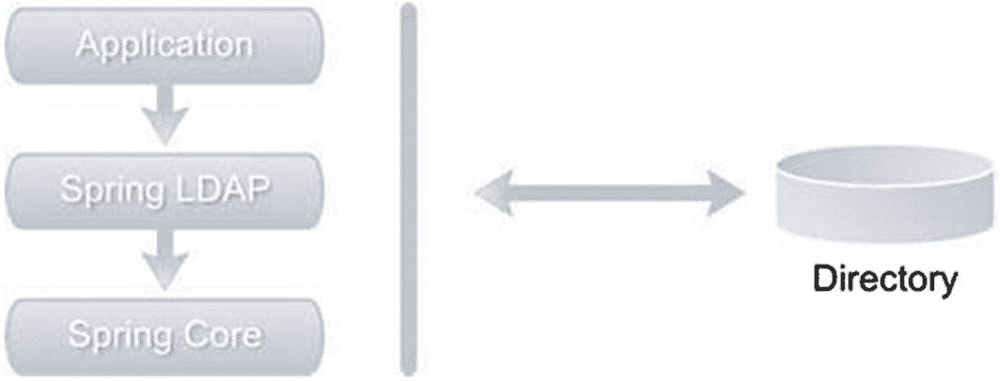
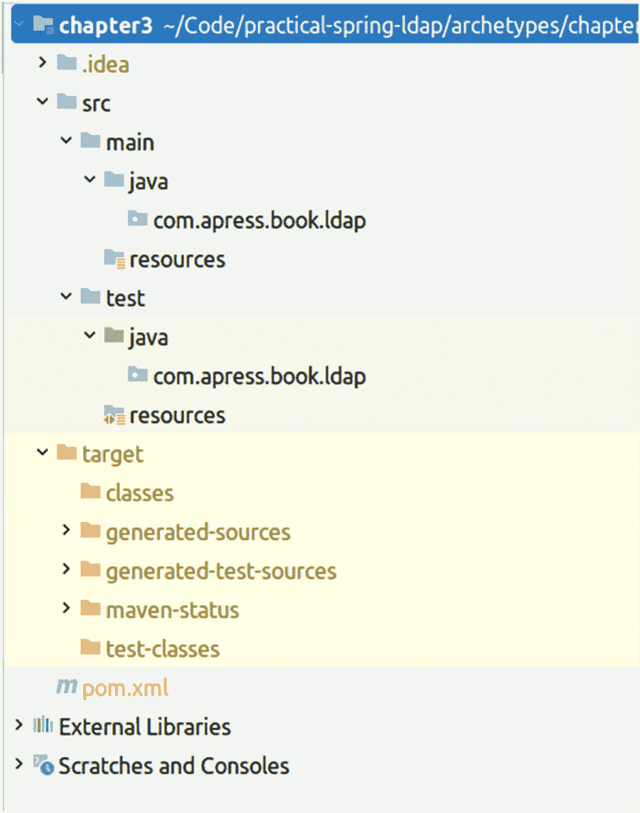
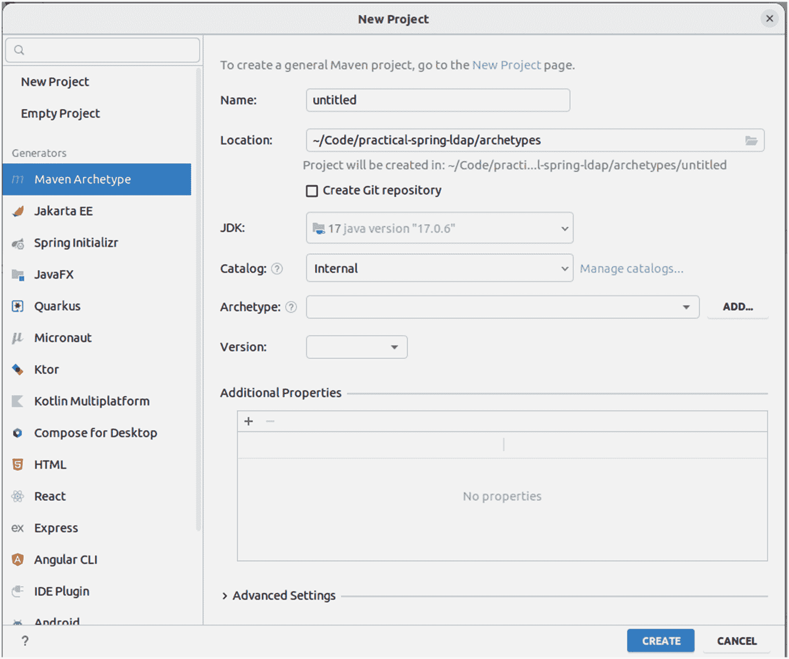
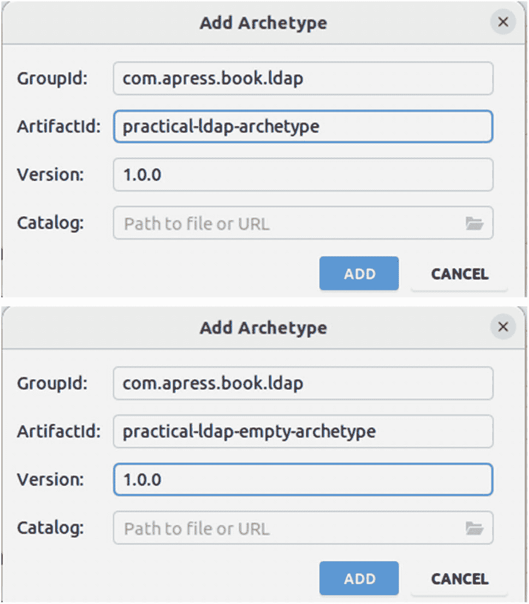
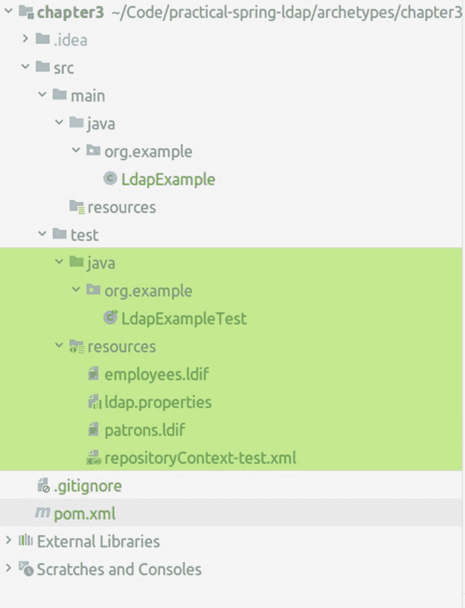

# 3. 介绍 Spring LDAP

Spring LDAP^(³⁷) 为 Java 中的 LDAP 编程提供了简单、整洁且全面的支持。该项目最初于 2006 年在 SourceForge 上以 LdapTemplate 名称启动，旨在通过 JNDI 简化对 LDAP 的访问。该项目后来成为 Spring Framework 产品组合的一部分，并取得了长足的发展。图 3-1 展示了基于 Spring LDAP 的应用程序架构。



Spring LDAP 架构图。应用程序后接 Spring LDAP 和 Spring 核心。所有组件均与目录互联。

图 3-1

Spring LDAP 架构图

应用程序代码使用 Spring LDAP API 执行 LDAP 服务器操作。Spring LDAP 框架包含所有特定于 LDAP 的代码和抽象层。然而，Spring LDAP 会依赖 Spring Framework 来满足其部分基础设施需求。

Spring Framework 已成为开发基于 Java 的企业应用程序的标准。除了许多其他功能外，它还提供了一种基于依赖注入的轻量级替代方案，用于 JEE 编程模型。Spring Framework 是 Spring LDAP 及其他所有 Spring 产品项目的基石，例如 Spring MVC 和 Spring Security。

## 动机

在上一章中，我们讨论了 JNDI API 的不足之处。JNDI 的一个显著缺点是其代码冗长；第 2 章中的几乎所有代码都与底层实现相关，而与应用程序逻辑关联较少。Spring LDAP 通过提供模板和实用类来解决这个问题，这些类处理底层代码，使开发者能够专注于业务逻辑。

JNDI 的另一个显著问题在于需要开发者显式管理资源，如 LDAP 上下文。这可能会导致非常容易出错。忘记关闭资源可能导致泄漏，并在高负载下迅速导致应用程序崩溃。Spring LDAP 会为您管理这些资源，并在您不再需要时自动关闭它们。它还提供了对 LDAP 上下文进行池化的功能，这可以提高性能。

在执行 JNDI 操作时出现的任何问题都会以`NamingException`或其子类的形式报告。`NamingException`是一个受检异常，因此开发者被迫处理它。数据访问异常通常不可恢复，且大多数情况下只能做很少的处理来捕获这些异常。为了解决这个问题，Spring LDAP 提供了一致的未受检异常层次结构，模仿`NamingException`。这使应用程序设计者能够选择何时以及何处处理这些异常。

最后，普通的 JNDI 编程对新开发者来说很困难且令人望而生畏。Spring LDAP 通过其抽象层使与 JNDI 的工作更加愉快。此外，它还提供了诸如对象-目录映射和事务支持等特性，使其成为任何企业 LDAP 开发者的必备工具。

## Spring LDAP 文档和源代码

Spring Framework 产品项目可以在官方网站的文档中查阅。^(³⁸) Spring LDAP 网站上有一个直接链接，^(³⁹) 或者您可以在 GitHub 仓库中查看源代码。^(⁴⁰)

Spring LDAP 的源代码可以为您提供有关框架架构的宝贵见解。它还包括一个丰富的测试套件，可以作为额外的文档并帮助您理解框架。您应该下载并查看源代码。Git 仓库还包含一个沙盒文件夹，其中包含一些实验性功能，这些功能可能或可能不会被纳入框架。

## Spring LDAP 打包

现在您已经可以访问 Spring LDAP 框架的文档和源代码，让我们深入了解不同的组件。LDAP 框架被打包成六个组件，表 3-1 简要描述了每个组件。

表 3-1

Spring LDAP 发行模块

| 组件 | 描述 |
| --- | --- |
| `spring-ldap-core` | 包含使用 LDAP 框架所需的所有类。此 jar 文件是所有应用程序的必需品。 |
| `spring-ldap-core-tiger` | 包含特定于 Java 5 及以上版本的类和扩展。运行在 Java 5 上的应用程序不应使用此 jar 文件。 |
| `spring-ldap-test` | 包含简化测试的类和工具。它还包括启动和停止 ApacheDS LDAP 服务器内存实例的类。 |
| `spring-ldap-ldif-core` | 包含解析 ldif 格式文件的类。 |
| `spring-ldap-ldif-batch` | 包含将 ldif 解析器与 Spring Batch 框架集成所需的类。 |
| `spring-ldap-odm` | 包含启用和创建对象-目录映射的类。 |

除了 Spring Framework，您还需要额外的 jar 文件来使用 Spring LDAP 编译和运行应用程序。表 3-2 列出了一些这些依赖 jar 文件，并描述了它们的用途。

表 3-2

Spring LDAP

| 库 | 描述 |
| --- | --- |
| `slf4j`^(⁴¹) | 日志记录在 Spring LDAP 和 Spring Framework 内部使用。这是必须包含在应用程序中的 jar 文件。 |
| `spring-core` | 包含 Spring LDAP 内部使用的核心工具的 Spring 库。这是使用 Spring LDAP 的必需库。 |
| `spring-beans` | 用于创建和管理 Spring Bean 的 Spring Framework 库。Spring LDAP 需要另一个库。 |
| `spring-context` | 负责依赖注入的 Spring 库。这是在 Spring 应用程序中使用 Spring LDAP 时必需的。 |
| `spring-tx` | 提供事务抽象的 Spring Framework 库。这是在使用 Spring LDAP 事务支持时必需的。 |
| `spring-jdbc` | 该库简化了通过 JDBC 底层访问数据库的操作。这是一个可选库，应用于事务支持。 |
| `commons-pool`^(⁴²) | Apache Commons Pool 库提供池化支持。在使用 Spring LDAP 池化支持时应包含此库。 |


## 使用 Maven 安装 Spring LDAP

在您可以安装并开始使用 Spring LDAP 之前，必须确保您的机器上已安装 Java 开发工具包（JDK）；您可以在附录 A 中找到如何操作的解释。最新版本的 Spring LDAP 3.1.0 要求使用 JDK 17 及以上版本和 Spring 6.0 及以上版本。请记住，我们将使用 JDK 21 来利用最新的长期支持版本（LTS）。

Apache Maven 是一个开源的、基于标准的项目管理框架，它简化了项目的构建、测试、报告和打包过程。如果您是 Maven 的新手并想了解该工具，Maven 官网^([43])(#fn43)提供了其功能特性和许多有用的链接信息。以下是采用 Maven 的一些优势：

*   *标准化的目录结构*：Maven 标准化了项目的布局和组织方式。每次启动新项目时，都需要花费大量时间决定源代码的存放位置或配置文件的放置路径。此外，这些决策在不同项目和团队之间可能存在巨大差异。Maven 的标准化目录结构使得开发者和甚至 IDE 之间的采用变得容易。

*   *声明式依赖管理*：使用 Maven 时，您可以在单独的`pom.xml`文件中声明项目依赖项。Maven 随后会自动从仓库下载这些依赖项，并在构建过程中使用它们。Maven 还能智能地解析并下载传递性依赖项（依赖项的依赖项）。

*   *原型*：Maven 原型是用于快速生成新项目的项目模板。这些原型是分享最佳实践和在 Maven 标准目录结构之外强制一致性的绝佳方式。

*   *插件*：Maven 采用基于插件的架构，使得添加或自定义功能变得简单。数百个插件可以执行各种任务，从编译代码到生成项目文档。激活和使用插件只需在`pom.xml`文件中声明对插件的引用。

*   *工具支持*：当今所有主流 IDE 都提供对 Maven 的工具支持。这包括生成项目的向导、创建 IDE 特定文件以及分析依赖项的图形工具。

## Spring LDAP 原型

为了快速启动 Spring LDAP 开发，本书使用了以下两个原型，您可以在本书的仓库中找到它们：

*   **practical-ldap-empty-archetype**：此原型可以创建一个包含所有必要 LDAP 依赖项的空 Java 项目。

*   **practical-ldap-archetype**：与上述原型类似，此原型创建一个包含所有必要 LDAP 依赖项的 Java 项目。它还包含 Spring LDAP 配置文件、示例代码以及用于运行内存 LDAP 服务器进行测试的依赖项。

在您可以使用这些原型创建项目之前，需要先将它们安装到本地仓库。如果您尚未完成安装，可以从 Apress 下载配套的源代码/下载文件。在下载的分发包中，您将找到***practical-ldap-empty-archetype-1.0.0.jar***和***practical-ldap-archetype-1.0.0.jar***原型。一旦下载了这些 jar 文件，请运行以下命令将第一个原型安装到本地仓库：

```
$ mvn install:install-file \
-DgroupId=com.apress.book.ldap \
-DartifactId=practical-ldap-empty-archetype \
-Dversion=1.0.0 \
-Dpackaging=jar  \
-DgeneratePom=true  \
-Dfile=/practical-ldap-empty-archetype-1.0.0.jar
```

如果运行该命令且一切正常，您将看到类似以下的日志输出：

```
[INFO] 扫描项目...
[INFO]
[INFO] -------------------------------------
[INFO] 构建 Maven 占位项目（无 POM） 1
[INFO] --------------------------------[ pom ]---------------------------------
[INFO]
[INFO] --- install:3.1.0:install-file (default-cli) @ standalone-pom ---
[INFO] 将/home/asacco/Code/practical-spring-ldap/archetypes/practical-ldap-empty-archetype-1.0.0.jar 安装到/home/asacco/.m2/repository/com/apress/book/ldap/practical-ldap-empty-archetype/1.0.0/practical-ldap-empty-archetype-1.0.0.jar
[INFO] 将/tmp/mvninstall5365651156751300254.pom 安装到/home/asacco/.m2/repository/com/apress/book/ldap/practical-ldap-empty-archetype/1.0.0/practical-ldap-empty-archetype-1.0.0.pom
[INFO] ------------------------------------------------------------------------
[INFO] 构建成功
[INFO] ------------------------------------------------------------------------
[INFO] 总耗时:  0.103 s
[INFO] 完成时间: 2023-08-01T11:32:00-03:00
[INFO] ------------------------------------------------------------------------
```

现在使用以下命令重复上述步骤，将下一个原型安装到您的本地仓库：

```
$ mvn install:install-file \
-DgroupId=com.apress.book.ldap \
-DartifactId=practical-ldap-archetype \
-Dversion=1.0.0 \
-Dpackaging=jar  \
-DgeneratePom=true  \
-Dfile=/practical-ldap-archetype-1.0.0.jar
```

这些 Maven 安装命令将把两个原型安装到您的本地 Maven 仓库中。使用其中一个原型创建项目只需运行以下命令：

```
$ mvn archetype:generate \
-DarchetypeGroupId=com.apress.book.ldap \
-DarchetypeArtifactId=practical-ldap-empty-archetype \
-DarchetypeVersion=1.0.0 \
-DgroupId=com.apress.book.ldap \
-DartifactId=chapter3 \
-DinteractiveMode=false
```

执行该命令后，您将看到以下输出：


```
[INFO] 扫描项目...
[INFO]
[INFO] ---------------------------------
[INFO] 从 Maven Stub 项目（无 POM）1 构建
[INFO] --------------------------------[ pom ]-----------------------------
[INFO]
[INFO] >>> archetype:3.2.0:generate (default-cli) > generate-sources @ standalone-pom >>>
[INFO]
[INFO] <<< archetype:3.2.0:generate (default-cli) < generate-sources @ standalone-pom <<<
[INFO]
[INFO]
[INFO] --- archetype:3.2.0:generate (default-cli) @ standalone-pom ---
[WARNING] 参数'localRepository'已弃用核心表达式；避免使用 ArtifactRepository 类型。如果需要访问本地仓库，请切换到'${repositorySystemSession}'表达式并通过其获取 LRM。
[INFO] 以批处理模式生成项目
[WARNING] 未在任何目录中找到原型。将回退到中央仓库。
[WARNING] 如果原型的仓库位于其他位置，请在 settings.xml 中添加一个 id 为'archetype'的仓库。
[INFO] ------------------------------------------------------------------------
[INFO] 使用以下参数从原型创建项目：practical-ldap-empty-archetype:1.0.0
[INFO] ------------------------------------------------------------------------
[INFO] 参数: groupId, 值: com.apress.book.ldap
[INFO] 参数: artifactId, 值: chapter3
[INFO] 参数: version, 值: 1.0-SNAPSHOT
[INFO] 参数: package, 值: com.apress.book.ldap
[INFO] 参数: packageInPathFormat, 值: com/apress/book/ldap
[INFO] 参数: package, 值: com.apress.book.ldap
[INFO] 参数: groupId, 值: com.apress.book.ldap
[INFO] 参数: artifactId, 值: chapter3
[INFO] 参数: version, 值: 1.0-SNAPSHOT
[INFO] 项目创建路径：/home/asacco/practical-spring-ldap/code/chapter3
[INFO] ------------------------------------------------------------------------
[INFO] 构建成功
[INFO] ------------------------------------------------------------------------
[INFO] 总耗时：2.142 s
[INFO] 完成时间：2023-08-03T11:46:08-03:00
[INFO] ------------------------------------------------------------------------
```

注意该命令是在目录`practical-spring-ldap/code`中执行的。该命令指示 Maven 使用原型 practical-ldap-empty-archetype 生成名为第 3 章 3 的项目。生成的项目目录结构如图 3-2 所示。



Maven 生成的项目结构截图。它包含一组文件和文件夹。其中有一些是.dot idea、s r c、target、外部库和临时文件夹。

图 3-2

Maven 生成的项目结构

该目录结构包含一个`src`文件夹，其中存放所有代码和相关资源，如 XML 文件。`target`文件夹包含生成的类文件和构建产物。`src`下的主文件夹通常包含最终进入生产环境的代码。`test`文件夹包含相关测试代码。这两个文件夹都包含 Java 和资源子文件夹。正如其名，`java`文件夹包含 Java 代码，`resources`文件夹通常包含配置 XML 文件。

根目录下的`pom.xml`文件包含 Maven 所需的配置信息。例如，它包含编译代码所需的所有依赖 jar 文件信息（见列表 3-1）。

```

4.0.0
com.apress.book.ldap
chapter3
jar
1.0.0
chapter3

sacco.andres@gmail.com
Andres Sacco
sacco.andres

3.8.1
UTF-8
UTF-8

6.0.11
3.1.1
2.0.7
1.3.5
5.9.2
3.1.1
2.13.0
2.6

2.8.1
3.11.0
3.3.0

org.springframework.ldap
spring-ldap-core
${org.springframework.ldap.version}

commons-logging
commons-logging

org.slf4j
slf4j-api

org.springframework.ldap
spring-ldap-odm
${org.springframework.ldap.version}

commons-logging
commons-logging

org.springframework.ldap
spring-ldap-ldif-core
${org.springframework.ldap.version}

commons-logging
commons-logging

org.springframework
spring-core
${org.springframework.version}
compile

org.springframework
spring-beans
${org.springframework.version}
compile

org.springframework
spring-expression
${org.springframework.version}
compile

org.springframework
spring-aop
${org.springframework.version}
compile

org.springframework
spring-context
${org.springframework.version}
compile

commons-logging
commons-logging

org.springframework
spring-context-support
${org.springframework.version}
compile

org.springframework
spring-tx
${org.springframework.version}
compile

org.slf4j
slf4j-api
${org.slf4j.version}

org.slf4j
jcl-over-slf4j
${org.slf4j.version}

ch.qos.logback
logback-core
${logback.version}

ch.qos.logback
logback-classic
${logback.version}

org.slf4j
slf4j-api

org.junit.jupiter
junit-jupiter-engine
${junit-jupiter-engine.version}
test

org.springframework
spring-test
${org.springframework.version}
test

org.springframework.ldap
spring-ldap-test
${org.springframework.ldap.version}
test

com.unboundid
unboundid-ldapsdk
${unboundid-ldapsdk.version}
test

commons-io
commons-io
${commons-io.version}
test

commons-lang
commons-lang
${commons-lang.version}
test

列表 3-1
使用 LDAP 所需的所有依赖
```

列表 3-1 中的`pom.xml`片段表明项目在编译时需要`spring-ldap-core.jar`文件。

Maven 需要组 ID 和项目 ID 来唯一标识依赖项。组 ID 通常是项目或组织独有的，类似于 Java 包的概念。项目 ID 通常是项目名称或生成的组件名称。作用域决定了依赖项在哪个构建阶段包含在类路径中。以下是几种可能的值：

*   *测试*: 测试作用域表示依赖项仅在测试阶段包含在类路径中。JUnit 就是此类依赖项的示例。

*   *已提供*: 已提供作用域表示依赖项仅在编译阶段包含在类路径中。已提供作用域的依赖项通常通过 JDK 或应用容器在运行时可用。

*   *编译*: 编译作用域表示依赖项始终包含在类路径中。

`pom.xml`文件中的另一部分包含 Maven 可用于编译和构建代码的插件信息。其中一个插件声明如列表 3-2 所示。它指示 Maven 使用版本为 3.11.0 的'`maven-compiler-plugin`'插件来编译 Java 代码，注意列表 3-2 中引用了列表 3-1 中声明的属性。`finalName`表示生成的构件名称。在这种情况下，它将是`chapter3.jar`。此外还有两个插件用于格式化所有源代码以遵循标准，以及一个插件用于检查项目依赖项是否存在冲突。

```

org.apache.maven.plugins
maven-compiler-plugin
${maven-compiler-plugin.version}

${java.version}
${java.version}
--enable-preview

org.apache.maven.plugins
maven-enforcer-plugin
${maven-enforcer-plugin.version}

enforce-versions

enforce

${maven.version}

${java.version}

net.revelc.code.formatter
formatter-maven-plugin
${formatter-maven-plugin.version}

${project.build.sourceEncoding}

format

**/*.java

列表 3-2
项目使用的插件
```

从命令行运行以下命令来构建此生成的应用程序。该命令会清理 target 文件夹，编译源文件，并在 target 文件夹内生成一个 jar 文件：

```
$ mvn clean compile package
```

执行上述命令后，控制台将显示以下输出：


```
[INFO] 正在扫描项目...
[INFO]
[INFO] -----------------------------------
[INFO] 构建 chapter3 1.0-SNAPSHOT
[INFO]   从 pom.xml 文件生成
[INFO] --------------------------------[ jar ]-----------------------------
[INFO]
[INFO] --- clean:3.2.0:clean (default-clean) @ chapter3 ---
[INFO] 删除 /home/asacco/Code/practical-spring-ldap/archetypes/chapter3/target
[INFO]
[INFO] --- enforcer:3.3.0:enforce (enforce-versions) @ chapter3 ---
[INFO] 规则 0: org.apache.maven.enforcer.rules.dependency.DependencyConvergence 通过
[INFO] 规则 1: org.apache.maven.enforcer.rules.version.RequireMavenVersion 通过
[INFO] 规则 2: org.apache.maven.enforcer.rules.version.RequireJavaVersion 通过
[INFO]
[INFO] --- formatter:2.8.1:format (default) @ chapter3 ---
[INFO] 使用 'UTF-8' 编码格式化源文件。
[INFO] 需要格式化的文件数量：0
[INFO]
[INFO] --- resources:3.3.0:resources (default-resources) @ chapter3 ---
[INFO] 复制 0 个资源
[INFO]
[INFO] --- compiler:3.11.0:compile (default-compile) @ chapter3 ---
[INFO] 没有需要编译的内容 - 所有类都是最新的
[INFO]
[INFO] --- enforcer:3.3.0:enforce (enforce-versions) @ chapter3 ---
[INFO] 规则 0: org.apache.maven.enforcer.rules.dependency.DependencyConvergence 通过
[INFO]
[INFO] --- formatter:2.8.1:format (default) @ chapter3 ---
[INFO] 使用 'UTF-8' 编码格式化源文件。
[INFO] 需要格式化的文件数量：0
[INFO]
[INFO] --- resources:3.3.0:testResources (default-testResources) @ chapter3 ---
[INFO] 复制 0 个资源
[INFO]
[INFO] --- compiler:3.11.0:testCompile (default-testCompile) @ chapter3 ---
[INFO] 没有需要编译的内容 - 所有类都是最新的
[INFO]
[INFO] --- surefire:3.0.0:test (default-test) @ chapter3 ---
[INFO]
[INFO] --- jar:3.3.0:jar (default-jar) @ chapter3 ---
[INFO] 构建 JAR 包: /home/asacco/Code/practical-spring-ldap/archetypes/chapter3/target/chapter3.jar
[INFO] --------------------------------------------------------------------
[INFO] 构建成功
[INFO] --------------------------------------------------------------------
[INFO] 总耗时: 0.705 s
[INFO] 结束时间: 2023-08-03T12:52:12-03:00
[INFO] --------------------------------------------------------------------
```

这种配置加上文本编辑器就足以开始开发和打包基于 Java 的 LDAP 应用程序。然而，使用图形化 IDE 开发和调试应用程序显然会更高效。目前有多种 IDE，其中 Eclipse、NetBeans 和 IntelliJ IDEA 是最流行的。在本书中，我们将使用 IntelliJ IDEA。

## 使用 IntelliJ 创建项目

在前面的“Spring LDAP 原型”章节中，您使用了 practical-ldap-empty-archetype 原型通过命令行生成项目。现在让我们看看如何通过 IntelliJ 生成相同的项目。



一个新项目创建的截图。左侧的生成器中选择了 Maven 原型。页面包含名称、位置、JDK、仓库、原型、版本和附加属性。

图 3-3

新项目

1.  从文件菜单中选择 新建➤项目。它将启动新建项目向导（参见图 3-3）。选择 Maven 原型，本书使用的 JDK 版本是 17。此外，将项目名称写为“chapter3”。



添加原型的两个截图。包含组 ID、工件 ID、版本和仓库。工件 ID 在 A 中高亮显示，版本在 B 中高亮显示。

图 3-4

原型详情

1.  在原型下拉菜单（参见图 3-4）中点击“添加”。这一步假设您已经按照前面提到的方式安装了原型。填写添加原型对话框，内容与图 3-4 中的细节一致，然后点击“添加”。对其他原型重复相同操作。



生成的项目结构截图。包含文件和文件夹列表。Java 文件和测试资源分别列出。

图 3-5

生成的项目结构

1.  完成上述步骤后，只需点击“创建”按钮。如果一切正常，您将看到图 3-5 中的结构，前提是您选择了“practical-ldap-archetype”原型。

您可以通过命令行或 IDE 创建项目；两种方法生成的项目结构相同。


## Spring LDAP 入门示例

掌握了这些信息后，让我们进入 Spring LDAP 的世界。您将从编写一个简单的搜索客户端开始，该客户端会读取 ou=patrons LDAP 分支中的所有借阅者姓名。这与您在第 2 章看到的示例类似。清单 3-3 展示了搜索客户端代码。

```
public class SearchClient {
private static final Logger logger = LoggerFactory.getLogger(SearchClient.class);
@SuppressWarnings("unchecked")
public List search() {
LdapTemplate ldapTemplate = getLdapTemplate();
return ldapTemplate.search("dc=inflinx,dc=com", " (objectclass=person)", (AttributesMapper) attributes -> (String)attributes.get("cn").get());
}
// 仅用于验证功能，但应将上下文源的创建委托给 Spring
private LdapTemplate getLdapTemplate() {
// 上下文设置 - 将在后面实现
}
}
清单 3-3
手动连接到 LDAP
```

Spring LDAP 框架的核心是`org.springframework.ldap.core.LdapTemplate`类。基于模板方法设计模式，^(⁴⁴) `LdapTemplate`类处理 LDAP 编程中不必要的底层实现。它提供了多个重载的搜索、查找、绑定、认证和解除绑定方法，使 LDAP 开发变得轻松。`LdapTemplate`是线程安全的，可以被并发线程共享使用。

注意

Spring LDAP 1.3 版本引入了一个名为`SimpleLdapTemplate`的`LdapTemplate`变体。这是基于 Java 5 的经典`LdapTemplate`的便捷包装器。`SimpleLdapTemplate`为查找和搜索方法添加了 Java 5 泛型支持。这些方法现在接受`ParameterizedContextMapper<T>`的实现作为参数，使搜索和查找方法能够返回类型化的对象。

`SimpleLdapTemplate`仅暴露`LdapTemplate`中可用操作的一个子集。然而，这些操作是最常用的操作，因此在许多情况下使用`SpringLdapTemplate`就足够了。`SimpleLdapTemplate`还提供了`getLdapOperations()`方法，该方法暴露了封装的`LdapOperations`实例，并可以调用较少使用的模板方法。

随着 Spring LDAP 3.0.0 版本的发布，`SpringLdapTemplate`类被移除以简化代码，因此如果发现应用程序中存在使用旧版 Spring LDAP 的代码块，只能使用`LdapTemplate`。

您通过获取`LdapTemplate`类的实例来开始搜索方法的实现。然后调用`LdapTemplate`的搜索方法变体。搜索方法的第一个参数是 LDAP 基础，第二个参数是搜索过滤器。搜索方法使用基础和过滤器执行搜索，并将每个`javax.naming.directory.SearchResult`结果传递给作为第三个参数提供的`org.springframework.ldap.core.AttributesMapper`实现。在清单 3-3 中，`AttributesMapper`实现通过创建一个匿名类来实现，该类读取每个`SearchResult`条目并返回条目的通用名称。

在清单 3-3 中，`getLdapTemplate`方法是空的。现在让我们看看如何实现这个方法。为了使`LdapTemplate`能够正确执行搜索，它需要在 LDAP 服务器上有一个初始上下文。Spring LDAP 提供了`org.springframework.ldap.core.ContextSource`接口抽象及其实现`org.springframework.ldap.core.support.LdapContextSource`用于配置和创建上下文实例。清单 3-4 展示了`getLdapTemplate`方法的完整实现。

```
private LdapTemplate getLdapTemplate() {
LdapContextSource contextSource = new LdapContextSource();
contextSource.setUrl("ldap://localhost:11389");
contextSource.setUserDn("cn=Directory Manager");
contextSource.setPassword("secret");
try {
contextSource.afterPropertiesSet();
} catch(Exception e) {
logger.error(e.getClass() + ": " + e.getMessage());
}
LdapTemplate ldapTemplate = new LdapTemplate();
ldapTemplate.setContextSource(contextSource);
return ldapTemplate;
}
清单 3-4
LDAPTemplate 的配置
```

您通过创建一个新的`LdapContextSource`并用 LDAP 服务器的信息（如服务器 URL 和绑定凭证）填充它来开始方法实现。然后调用上下文源上的`afterPropertiesSet`方法，允许 Spring LDAP 执行初始化操作。最后，创建一个新的`LdapTemplate`实例并传入新创建的上下文源。

这完成了您的搜索客户端示例。清单 3-5 展示了调用搜索操作并打印姓名到控制台的 main 方法。

```
public static void main(String[] args) {
SearchClient client = new SearchClient();
List names = client.search();
for(String name: names) {
System.out.println(name);
}
}
清单 3-5
运行应用程序并执行搜索操作的 main 方法
```

这个搜索客户端实现使用了 Spring LDAP API，而没有涉及任何 Spring 框架特定的范式。在接下来的章节中，您将学习如何将此应用程序 Spring 化。但在那之前，让我们快速了解一下 Spring ApplicationContext。

## Spring ApplicationContext

每个 Spring 框架应用程序的核心概念是 ApplicationContext。该接口的实现负责创建和配置 Spring bean。应用程序上下文还充当 IoC 容器，并负责执行依赖注入。Spring bean 本质上是一个标准的 POJO，带有在 Spring 容器中运行所需的元数据。

在标准的 Spring 应用程序中，ApplicationContext 通过 XML 文件、Java 注解和 JavaConfig 进行配置。清单 3-6 展示了一个包含单个 bean 声明的简单应用程序上下文文件。bean `myBean`的类型是`com.apress.book.ldap.SimplePojo`。当应用程序加载上下文时，Spring 会创建`SimplePojo`的实例并对其进行管理。

```

清单 3-6
简单 POJO 的配置
```


## 基于 Spring 的搜索客户端

我们的搜索客户端实现转换始于`applicationContext.xml`文件，如清单 3-7 所示。

```
清单 3-7
应用程序配置
```

在上下文文件中，您需要声明一个`contextSource` bean 来管理与 LDAP 服务器的连接。为了让`LdapContextSource`能够正确创建`DirContext`实例，您需要为其提供有关 LDAP 服务器的信息。`url`属性采用完全限定的 URL（`ldap://server:port`格式）指向 LDAP 服务器。`base`属性可用于指定所有 LDAP 操作的根后缀。`userDn`和`password`属性用于提供认证信息。接下来，您需要配置一个新的`LdapTemplate` bean 并注入`contextSource` bean。

在上下文文件中声明所有依赖项后，您可以重新实现搜索客户端，如清单 3-8 所示。请注意，清单 3-8 相比第 2 章中看到的示例有一些改进，因为该实现直接使用了 Spring 的上下文。

```
package com.apress.book.ldap;
import java.util.List;
import javax.naming.NamingException;
import javax.naming.directory.Attributes;
import org.springframework.beans.factory.annotation.Autowired;
import org.springframework.beans.factory.annotation.Qualifier;
import org.springframework.context.ApplicationContext;
import org.springframework.context.support.ClassPathXmlApplicationContext;
import org.springframework.ldap.core.AttributesMapper;
import org.springframework.ldap.core.LdapTemplate;
import org.springframework.stereotype.Component;
@Component
public class SpringSearchClient {
private LdapTemplate ldapTemplate;
@Autowired
public SpringSearchClient(@Qualifier("ldapTemplate") LdapTemplate ldapTemplate) {
this.ldapTemplate = ldapTemplate;
}
@SuppressWarnings("unchecked")
public List search() {
return ldapTemplate.search("dc=inflinx,dc=com", "(objectclass=person)",
new AttributesMapper() {
@Override
public Object mapFromAttributes(Attributes attributes) throws NamingException {
return (String)attributes.get("cn").get();
} });
}
}
清单 3-8
无需配置上下文即可获取信息的另一种方式。
```

您会注意到这段代码与清单 3-4 中看到的`SearchClient`代码没有区别。您只是将`LdapTemplate`的创建提取到了外部配置文件中。`@Autowired`注解指示 Spring 注入`ldapTemplate`依赖项。这简化了搜索客户端类，使您能够专注于搜索逻辑。

运行新搜索客户端的代码如清单 3-9 所示。您首先创建`ClassPathXmlApplicationContext`的新实例。`ClassPathXmlApplicationContext`将`applicationContext.xml`文件作为其参数。然后从上下文中获取`SpringSearchClient`的实例并调用搜索方法。

```
public static void main(String[] args) {
ApplicationContext context = new ClassPathXmlApplicationContext("classpath:applicationContext.xml");
SpringSearchClient client = context.getBean(SpringSearchClient.class);
List names = client.search();
for(String name: names) {
System.out.println(name);
}
}
清单 3-9
应用程序的主类
```

如果运行上一个类，您将获得与之前连接 LDAP 并遍历 objectClass person 相同的结果。

```
00:13:54.161 [main] DEBUG o.s.c.s.ClassPathXmlApplicationContext - 刷新 org.springframework.context.support.ClassPathXmlApplicationContext@64d7f7e0
00:13:54.234 [main] DEBUG o.s.c.a.ClassPathBeanDefinitionScanner - 识别候选组件类：文件[/home/asacco/Code/practical-spring-ldap/chapter3/target/classes/com/apress/book/ldap/LdapOperationsClient.class]
00:13:54.235 [main] DEBUG o.s.c.a.ClassPathBeanDefinitionScanner - 识别候选组件类：文件[/home/asacco/Code/practical-spring-ldap/chapter3/target/classes/com/apress/book/ldap/SearchClient.class]
00:13:54.235 [main] DEBUG o.s.c.a.ClassPathBeanDefinitionScanner - 识别候选组件类：文件[/home/asacco/Code/practical-spring-ldap/chapter3/target/classes/com/apress/book/ldap/SpringSearchClient.class]
00:13:54.245 [main] DEBUG o.s.b.f.xml.XmlBeanDefinitionReader - 从类路径资源[applicationContext.xml]加载了 9 个 bean 定义
00:13:54.252 [main] DEBUG o.s.b.f.s.DefaultListableBeanFactory - 创建单例 bean'org.springframework.context.annotation.internalConfigurationAnnotationProcessor'的共享实例
00:13:54.265 [main] DEBUG o.s.b.f.s.DefaultListableBeanFactory - 创建单例 bean'org.springframework.context.event.internalEventListenerProcessor'的共享实例
00:13:54.265 [main] DEBUG o.s.b.f.s.DefaultListableBeanFactory - 创建单例 bean'org.springframework.context.event.internalEventListenerFactory'的共享实例
00:13:54.266 [main] DEBUG o.s.b.f.s.DefaultListableBeanFactory - 创建单例 bean'org.springframework.context.annotation.internalAutowiredAnnotationProcessor'的共享实例
00:13:54.268 [main] DEBUG o.s.b.f.s.DefaultListableBeanFactory - 创建单例 bean'ldapOperationsClient'的共享实例
00:13:54.274 [main] DEBUG o.s.b.f.s.DefaultListableBeanFactory - 创建单例 bean'ldapTemplate'的共享实例
00:13:54.277 [main] DEBUG o.s.b.f.s.DefaultListableBeanFactory - 创建单例 bean'contextSource'的共享实例
00:13:54.287 [main] DEBUG o.s.l.c.s.AbstractContextSource - 未设置认证源 - 使用默认实现
00:13:54.287 [main] DEBUG o.s.l.c.s.AbstractContextSource - 不使用 LDAP 连接池
00:13:54.288 [main] DEBUG o.s.l.c.s.AbstractContextSource - 尝试使用提供者 URL：ldap://localhost:11389
00:13:54.296 [main] DEBUG o.s.b.f.s.DefaultListableBeanFactory - 创建单例 bean'searchClient'的共享实例
00:13:54.296 [main] DEBUG o.s.b.f.s.DefaultListableBeanFactory - 创建单例 bean'springSearchClient'的共享实例
00:13:54.308 [main] DEBUG o.s.l.c.s.AbstractContextSource - 在服务器'ldap://localhost:11389'上获取了 LDAP 上下文
Cherise Andric
Cherish Andros
Cherlyn Andrukat
Cherri Andrusiak
………………………………………
```

## Spring LdapTemplate 操作

在上一节中，您使用`LdapTemplate`实现了搜索功能。现在，让我们看看如何使用`LdapTemplate`在 LDAP 中添加、删除和修改信息。


## 添加操作

`LdapTemplate` 类提供了多个 bind 方法，允许您创建新的 LDAP 条目。这些方法中最简单的是以下方法：

```
public void bind(String dn, Object obj, Attributes attributes)
```

此方法的第一个参数是要绑定的对象的唯一区分名称。第二个参数是要绑定的对象，通常是 `DirContext` 接口的实现。第三个参数是要绑定的对象的属性。这三个参数中，只有第一个是必需的，其余两个可以传入 null。

清单 3-10 展示了创建包含最少信息的新借阅者条目所需的代码。您首先通过创建 `BasicAttributes` 类的新实例来开始方法实现，以保存借阅者的属性。单值属性通过将属性名和值传递给 put 方法添加。要添加多值属性 objectclass，您需要创建 `BasicAttribute` 类的新实例，然后将条目的 objectClass 值添加到 `objectClassAttribute` 中，并将其添加到属性列表中。最后，您通过调用 `LdapTemplate` 的 bind 方法，传入借阅者信息和借阅者的完整限定 DN，从而将借阅者条目添加到 LDAP 服务器中。

```
public void addPatron() {
// 设置借阅者属性
Attributes attributes = new BasicAttributes();
attributes.put("sn", "Patron999");
attributes.put("cn", "New Patron999");
// 添加多值属性
BasicAttribute objectClassAttribute = new BasicAttribute("objectclass");
objectClassAttribute.add("top");
objectClassAttribute.add("person");
objectClassAttribute.add("organizationalperson");
objectClassAttribute.add("inetorgperson");
attributes.put(objectClassAttribute);
ldapTemplate.bind("uid=patron999,ou=patrons,dc=inflinx,dc=com", null, attributes);
}
Listing 3-10
添加借阅者操作
```

## 修改操作

考虑一个场景，您想向新添加的借阅者添加一个电话号码。为此，`LdapTemplate` 提供了一个便捷的 `modifyAttributes` 方法，其签名如下：

```
public void modifyAttributes(String dn, ModificationItem[] mods)
```

此 `modifyAttributes` 方法的变体将要修改的条目的完整限定唯一 DN 作为其第一个参数。第二个参数接受一个 `ModificationItem` 数组，每个修改项包含需要修改的属性信息。清单 3-11 展示了一个 *修改属性* 的示例，例如向借阅者添加新电话号码。

```
public void addTelephoneNumber() {
Attribute attribute = new BasicAttribute("telephoneNumber", "801 100 1000");
ModificationItem item = new ModificationItem(DirContext.ADD_ATTRIBUTE, attribute);
ldapTemplate.modifyAttributes("uid=patron999,ou=patrons,dc=inflinx,dc=com", new ModificationItem[] {item});
}
Listing 3-11
向借阅者添加新电话号码
```

在此实现中，您只需创建一个包含电话信息的 `BasicAttribute`，然后创建一个 `ModificationItem` 并传入 `ADD_ATTRIBUTE` 代码，表示您要添加属性。最后，您通过调用 `modifyAttributes` 方法，传入借阅者的 DN 和修改项。`DirContext` 提供了 `REPLACE_ATTRIBUTE` 代码，用于替换属性值。同样，`REMOVE_ATTRIBUTE` 代码会从属性中移除指定值。

## 删除操作

与添加和修改类似，`LdapTemplate` 通过 `unbind` 方法轻松实现条目的删除。清单 3-12 提供了实现 `unbind` 方法并删除借阅者的代码。如您所见，`unbind` 方法接受需要删除的条目的 DN。

```
public void removePatron() {    ldapTemplate.unbind("uid=patron999,ou=patrons,dc=inflinx,dc=com");
}
Listing 3-12
删除一个元素
```

一种检查所有操作的方法是创建一个包含所有这些方法的类，命名为 `LdapOperationsClient`，并创建一个主类来验证所有方法是否正常运行。清单 3-13 展示了该类的 main 方法，它调用了所有操作。

```
@Component
public class LdapOperationsClient {
private LdapTemplate ldapTemplate;
@Autowired
public LdapOperationsClient(@Qualifier("ldapTemplate") LdapTemplate ldapTemplate) {
this.ldapTemplate = ldapTemplate;
}
// 之前清单中出现的方法
public static void main(String[] args) {
ApplicationContext context = new ClassPathXmlApplicationContext("classpath:applicationContext.xml");
LdapOperationsClient client = context.getBean(LdapOperationsClient.class);
client.addPatron();
client.addTelephoneNumber();
client.removePatron();
}
}
Listing 3-13
调用所有操作的主方法
```

当您运行所有方法时，控制台将显示以下输出：


```
00:36:41.457 [main] DEBUG o.s.c.s.ClassPathXmlApplicationContext - Refreshing org.springframework.context.support.ClassPathXmlApplicationContext@1c72da34
00:36:41.535 [main] DEBUG o.s.c.a.ClassPathBeanDefinitionScanner - Identified candidate component class: file [/home/asacco/Code/practical-spring-ldap/code/chapters/chapter3/target/classes/com/apress/book/ldap/LdapOperationsClient.class]
00:36:41.536 [main] DEBUG o.s.c.a.ClassPathBeanDefinitionScanner - Identified candidate component class: file [/home/asacco/Code/practical-spring-ldap/code/chapters/chapter3/target/classes/com/apress/book/ldap/SearchClient.class]
00:36:41.536 [main] DEBUG o.s.c.a.ClassPathBeanDefinitionScanner - Identified candidate component class: file [/home/asacco/Code/practical-spring-ldap/code/chapters/chapter3/target/classes/com/apress/book/ldap/SpringSearchClient.class]
00:36:41.546 [main] DEBUG o.s.b.f.xml.XmlBeanDefinitionReader - Loaded 9 bean definitions from class path resource [applicationContext.xml]
00:36:41.553 [main] DEBUG o.s.b.f.s.DefaultListableBeanFactory - Creating shared instance of singleton bean 'org.springframework.context.annotation.internalConfigurationAnnotationProcessor'
00:36:41.567 [main] DEBUG o.s.b.f.s.DefaultListableBeanFactory - Creating shared instance of singleton bean 'org.springframework.context.event.internalEventListenerProcessor'
00:36:41.568 [main] DEBUG o.s.b.f.s.DefaultListableBeanFactory - Creating shared instance of singleton bean 'org.springframework.context.event.internalEventListenerFactory'
00:36:41.569 [main] DEBUG o.s.b.f.s.DefaultListableBeanFactory - Creating shared instance of singleton bean 'org.springframework.context.annotation.internalAutowiredAnnotationProcessor'
00:36:41.570 [main] DEBUG o.s.b.f.s.DefaultListableBeanFactory - Creating shared instance of singleton bean 'ldapOperationsClient'
00:36:41.578 [main] DEBUG o.s.b.f.s.DefaultListableBeanFactory - Creating shared instance of singleton bean 'ldapTemplate'
00:36:41.582 [main] DEBUG o.s.b.f.s.DefaultListableBeanFactory - Creating shared instance of singleton bean 'contextSource'
00:36:41.598 [main] DEBUG o.s.l.c.s.AbstractContextSource - AuthenticationSource not set - using default implementation
00:36:41.599 [main] DEBUG o.s.l.c.s.AbstractContextSource - Not using LDAP pooling
00:36:41.599 [main] DEBUG o.s.l.c.s.AbstractContextSource - Trying provider Urls: ldap://localhost:11389
00:36:41.612 [main] DEBUG o.s.b.f.s.DefaultListableBeanFactory - Creating shared instance of singleton bean 'searchClient'
00:36:41.612 [main] DEBUG o.s.b.f.s.DefaultListableBeanFactory - Creating shared instance of singleton bean 'springSearchClient'
00:36:41.644 [main] DEBUG o.s.l.c.s.AbstractContextSource - Got Ldap context on server 'ldap://localhost:11389'
00:36:41.653 [main] DEBUG o.s.l.c.s.AbstractContextSource - Got Ldap context on server 'ldap://localhost:11389'
00:36:41.657 [main] DEBUG o.s.l.c.s.AbstractContextSource - Got Ldap context on server 'ldap://localhost:11389'
```

如你所见，没有关于操作执行情况的参考信息，因为控制台没有任何输出。要检查不同操作是否正常工作，最好的方法是单独测试每个操作，并通过工具验证 LDAP 信息是否正常。

## 总结

Spring LDAP 框架旨在简化 Java 中的 LDAP 编程。在本章中，你获得了 Spring LDAP 的高层次概述以及与 Spring 框架相关的某些概念。你还查看了使用 Spring LDAP 进行开发所需的设置。在下一章中，你将专注于测试 Spring LDAP 应用程序。

脚注 1   2   3   4   5   6   7   8

