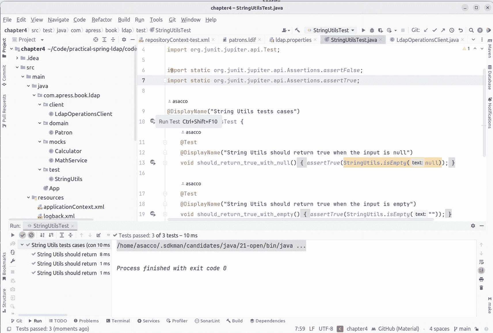
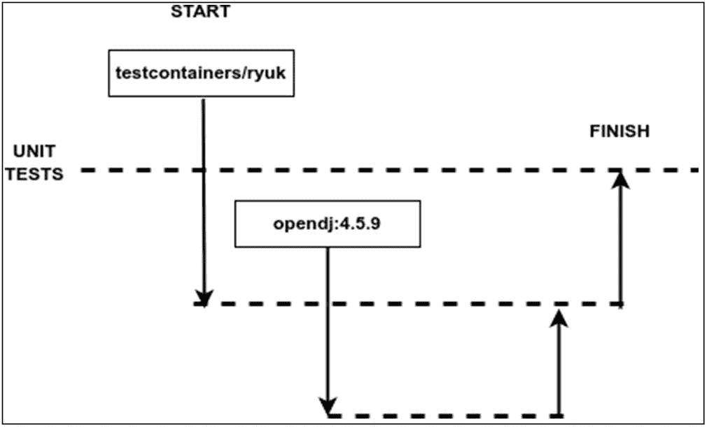

# 4. 测试 LDAP 代码

测试是软件开发过程中必不可少的环节。除了检测错误外，它还有助于验证所有需求是否得到满足，并确保软件按预期工作。如今，无论正式还是非正式，测试几乎被包含在软件开发过程的每个阶段。根据测试内容和测试目的的不同，我们会得到多种类型的测试。开发人员最常见的测试是单元测试，它确保各个单元按预期工作。集成测试通常在单元测试之后进行，专注于已测试组件之间的交互。开发人员通常会参与创建自动化集成测试，尤其是涉及数据库和目录的测试。接下来是系统测试，对完整的集成系统进行评估，以确保所有需求都得到满足。性能和效率等非功能性需求也会作为系统测试的一部分进行测试。验收测试通常在最后进行，以确保交付的软件满足客户/业务用户的需求。

**注意**  
本章仅涵盖单元测试和集成测试的基本方面。如需了解更多关于测试的内容，可以阅读 Martin Fowler 的^(⁴⁵)博客，该博客涉及 BDD、各种测试类型和良好实践等主题。

## 测试相关概念

在深入探讨检查 LDAP 不同操作的测试创建之前，澄清一些与测试相关的术语是有必要的。


### 单元测试

单元测试是一种方法论，通过在隔离状态下单独验证和确认应用程序的最小组成部分（称为单元）来确保其正确性。在结构化编程中，单元可以是单个方法或函数；在面向对象编程（OOP）中，对象是最小的可执行单元。对象之间的交互是任何 OOP 设计的核心，通常通过调用方法实现。因此，面向对象的单元测试可以涵盖从测试单个方法到测试一组对象的范围。

编写单元测试需要开发者的投入时间和精力。但这种投资已被证明能带来诸多不可否认的好处。

注意

测量单元测试覆盖了多少代码至关重要。为此，可以使用多种工具，例如 Emma、Clover 和 Jacoco。在这些工具中，使用最广泛的是 Jacoco，它允许您将度量数据上传到 Sonar5，从而集中管理所有应用程序的覆盖率信息，并为您提供定义质量门禁的可能性，以指示公司接受的最低覆盖率标准。

如果您想了解更多关于代码覆盖率的含义以及工具如何生成覆盖率百分比，Martin Fowler 的博客上有一篇优秀的文章。

单元测试最重要的优势在于它能在开发的早期阶段帮助发现错误。仅在 QA 或生产环境中发现的错误会消耗大量调试时间和成本。此外，一套良好的单元测试可以作为安全网，在代码重构时提供信心。单元测试还能帮助改进设计，甚至充当文档。

优秀的单元测试应具备以下特征：

* 每个单元测试必须独立于其他测试。这种原子性至关重要，每个测试不应影响其他测试的执行。单元测试还应具有顺序无关性。

* 单元测试必须可重复执行。为了具有任何价值，单元测试必须产生一致的结果。否则，它无法在重构期间用作简单的验证手段。

* 单元测试必须易于设置和清理。因此，它们不应依赖外部系统，如数据库和服务器。

* 单元测试必须快速且能立即提供反馈。在进行另一次更改前等待长时间运行的测试是不高效的。

* 单元测试必须自我验证。每个测试应包含足够的信息以自动判断测试是否通过或失败。无需手动干预即可解读结果。

企业应用程序通常会使用外部系统，如数据库、目录和网络服务。这在 DAO 层尤为常见。例如，测试数据库代码可能需要启动数据库服务器、加载模式和数据、运行测试并关闭服务器。这会迅速变得复杂和棘手。一种方法是使用模拟对象隐藏外部依赖。当这种方法不足时，可能需要使用集成测试并保留外部依赖进行测试。

在 Java 应用程序测试中，最常用的库是 JUnit，这些库还包括为 JUnit 添加额外功能的其他库，例如 Spring Boot Test，它使用最新的 JUnit 版本执行某些操作。考虑其他 Java 测试替代方案，如 Spock 或 TestNG。不过，这些内容超出了本书的讨论范围，本书仅涵盖使用 Mockito 创建模拟对象的最相关方面。如果您想深入了解这个优秀的库，可以阅读 Ken Kousen 的《Mockito Made Clear》。

### 模拟测试

在测试中使用模拟对象的目标是通过受控方式模拟真实对象。模拟对象实现与真实对象相同的接口，但被脚本化以模仿/伪造并跟踪其行为。没有限制使用模拟对象的测试类型，但在这种情况下，它被应用于单元测试。

例如，考虑一个`UserAccountService`，它有一个创建新用户账户的方法。实现此类服务通常涉及将账户信息与业务规则进行验证、将新创建的账户存储到数据库中，并发送确认邮件。数据持久化和邮件通知通常被抽象到其他层的类中。当编写单元测试以验证账户创建相关的业务规则时，您可能不关心邮件通知部分的细节。但您确实希望验证是否生成了邮件。这正是模拟对象派上用场的地方。要实现这一点，只需为`UserAccountService`提供一个模拟的`EmailService`实现，该实现负责发送邮件。模拟实现将标记邮件请求并返回硬编码结果。模拟对象是隔离测试复杂依赖的绝佳方式，使测试能够更快运行。

注意

如果您想深入了解模拟对象、桩（stubs）和其他类型的伪造响应，Martin Fowler 的博客上有一篇优秀的文章。此外，您还可以阅读 Manning 出版的《Effective Software Testing》，这是学习模拟和其他测试相关主题的另一重要资源。

多个开源框架使使用模拟对象变得更加简单。流行的框架包括 Mockito、EasyMock、JMock 和 PowerMock。在本书的案例中，您将使用 Mockito，它是创建模拟对象最流行的选项之一，与许多其他库（如 JUnit）集成良好，文档齐全且拥有庞大的用户社区。

这些框架中的一些允许为不实现任何接口的类创建模拟对象。无论使用哪种框架，使用模拟对象进行单元测试通常涉及以下步骤：

* 创建一个新的模拟实例。

* 设置模拟对象。这包括指示模拟对象预期的行为和返回值。

* 运行测试，将模拟实例传递给被测试组件。

* 验证结果。

注意

本书的范围不包括解释每个框架的所有可能功能、优缺点，因此本章仅涵盖使用 Mockito 创建模拟对象的最相关方面。如果您想深入了解这个优秀的库，可以阅读 Ken Kousen 的《Mockito Made Clear》。

### 集成测试

尽管模拟对象作为占位符非常有用，但您很快会遇到仅伪造无法满足的情况。这在 DAO 层代码中尤为明显，您必须验证 SQL 查询的执行并确认数据库记录的修改。测试此类代码属于集成测试的范畴。如前所述，集成测试关注在存在依赖项的情况下组件之间的交互。

如今，开发者通常使用单元测试工具编写自动化集成测试，这模糊了两者的界限。然而，重要的是要记住，集成测试通常运行速度较慢且无法独立运行。框架如 Spring 提供了容器支持，使编写和执行集成测试变得容易。嵌入式数据库、目录和服务器的可用性提高，使开发者能够编写更快的集成测试。

在本章的案例中，您将看到两种不同的创建集成测试的替代方案。一种使用嵌入式 LDAP，另一种使用 Docker 容器运行本书各章节中使用的 LDAP 供应商镜像。以下部分将更详细地介绍这两种替代方案的区别。

## 用于测试的库

在 LDAP 的情况下，存在多个用于测试的库，但在本节中，您将了解 Java 社区中最常用的库的基础知识。


### JUnit

它已成为 Java 应用程序单元测试的事实上的标准。JUnit 4.x 中引入的注解使得创建测试和断言预期值的测试结果变得更加简单。随着 JUnit 5.x 的发布，出现了简化开发人员日常工作的新功能，例如在一句话中包含所有可能的检查条件，这样在某个测试失败时，可以立即知道所有失败的条件。JUnit 可以轻松地与构建工具如 Gradle^(⁶¹)和 Maven.^(⁶²)集成。它还在所有流行的 IDE 中提供了强大的工具支持。

使用 JUnit 时，标准做法是编写一个包含测试方法的独立类。这个类通常被称为测试用例，每个测试方法旨在测试一个单独的工作单元。也可以将测试用例组织到称为测试套件的组中。

学习 JUnit 的最佳方式是编写一个测试方法。列表 4-1 展示了一个简单的`StringUtils`类，其中包含一个`isEmpty`方法。该方法接受一个`String`参数，并在该字符串为 null 或空时返回 true。

```
public class StringUtils {
public static boolean isEmpty(String text) {
return text == null || "".equals(text);
}
}
Listing 4-1
检查字符串是否为空的方法简单示例
```

让我们为列表 4-1 创建一个测试，检查不同的条件；你可以看到列表 4-2 是包含测试方法的 JUnit 类。

```
import org.junit.jupiter.api.Test;
import static org.junit.jupiter.api.Assertions.assertFalse;
import static org.junit.jupiter.api.Assertions.assertTrue;
@DisplayName("String Utils 测试用例")
class StringUtilsTest {
@Test
@DisplayName("当输入为 null 时，String Utils 应返回 true")
void should_return_true_with_null() {
assertTrue(StringUtils.isEmpty(null));
}
@Test
@DisplayName("当输入为空时，String Utils 应返回 true")
void should_return_true_with_empty() {
assertTrue(StringUtils.isEmpty(""));
}
@Test
@DisplayName("当输入包含值时，String Utils 应返回 false")
void should_return_false_with_text() {
assertFalse(StringUtils.isEmpty("Practical Spring Ldap"));
}
}
Listing 4-2
检查每种可能场景的不同测试
```

要使用 JUnit 的不同类，你需要在列表 4-3 中包含依赖项。在本章的情况下，你将使用不同的原型，这些原型包含与测试相关的某些依赖项。

```
org.junit.jupiter
junit-jupiter-engine
${junit-jupiter-engine.version}
test

Listing 4-3
必须包含在 POM 文件中的 JUnit 依赖项
```

请注意，我遵循了命名约定<被测试类名>Test 来命名测试类。在 JUnit 4.x 之前，测试方法需要以“test”开头。在 4.x 版本中，测试方法必须使用注解@Test 标记。同时，请注意所有测试都使用了@DisplayName 注解以提供关于测试意图的更多信息。

运行测试有两种方式：

*   *使用命令行和 Maven*：你需要打开终端或使用 IDE 并执行命令**mvn test**，这将产生以下输出：



截图包含给定程序代码的输出。

Figure 4-1

测试执行的输出

*   *使用 IDE*：此方法因 IDE 而异，但大多数情况下运行测试的方式是相同的。如果你使用 IntelliJ，可以在类或方法上找到绿色的运行按钮，点击并选择要运行测试，输出将类似于图 4-1。

```
➔  ~ mvn test
[INFO] 扫描项目...
[INFO]
[INFO] -----------------------------------
[INFO] 构建 chapter4 1.0.0
[INFO]   从 pom.xml
[INFO] --------------------------------[ jar ]----------------------------
[INFO]
[INFO] --- enforcer:3.3.0:enforce (enforce-versions) @ chapter4 ---
[INFO] 规则 0：org.apache.maven.enforcer.rules.dependency.DependencyConvergence 通过
[INFO] 规则 1：org.apache.maven.enforcer.rules.version.RequireMavenVersion 通过
[INFO] 规则 2：org.apache.maven.enforcer.rules.version.RequireJavaVersion 通过
[INFO]
[INFO] --- formatter:2.8.1:format (default) @ chapter4 ---
[INFO] 使用'UTF-8'编码格式化源文件。
[INFO] 需要格式化的文件数：7
[INFO] 成功格式化：          0 个文件
[INFO] 格式化失败：                  0 个文件
[INFO] 跳过：                         7 个文件
[INFO] 只读跳过：               0 个文件
[INFO] 预估耗时：          0 秒
[INFO]
[INFO] --- resources:3.3.0:resources (default-resources) @ chapter4 ---
[INFO] 复制 2 个资源
[INFO]
[INFO] --- compiler:3.11.0:compile (default-compile) @ chapter4 ---
[INFO] 没有需要编译的内容 - 所有类都是最新的
[INFO]
[INFO] --- resources:3.3.0:testResources (default-testResources) @ chapter4 ---
[INFO] 复制 6 个资源
[INFO]
[INFO] --- compiler:3.11.0:testCompile (default-testCompile) @ chapter4 ---
[INFO] 检测到更改 - 重新编译模块！ :source
[INFO] 使用 javac [debug target 21] 编译 1 个源文件到 target/test-classes
[INFO]
[INFO] --- surefire:3.0.0:test (default-test) @ chapter4 ---
[INFO] 使用自动检测的提供者 org.apache.maven.surefire.junitplatform.JUnitPlatformProvider
[INFO]
[INFO] -------------------------------------------------------
[INFO]  T E S T S
[INFO] -------------------------------------------------------
[INFO] 运行 com.apress.book.ldap.test.StringUtilsTest
[INFO] 已执行测试：3，失败：0，错误：0，跳过：0，耗时：0.02 s - 在 com.apress.book.ldap.test.StringUtilsTest 中
[INFO]
[INFO] 结果：
[INFO]
[INFO] 已执行测试：3，失败：0，错误：0，跳过：0
[INFO]
[INFO] ------------------------------------------------------------------------
[INFO] 构建成功
[INFO] ------------------------------------------------------------------------
[INFO] 总耗时：  1.345 s
[INFO] 结束时间： 2023-10-14T19:51:24-03:00
[INFO] ------------------------------------------------------------------------
```

表 4-1 列出了 JUnit 5 中的一些重要注解。

Table 4-1

JUnit 5 注解

| 注解 | 描述 |
| --- | --- |
| @Test | 将方法标记为 JUnit 测试方法。该方法应具有公共作用域且返回类型为 void。 |
| @BeforeEach | 标记一个方法在每次测试方法运行前执行。适用于设置测试夹具。超类的@Before 方法会在当前类之前运行。 |
| @AfterEach | 标记一个方法在每次测试方法运行后执行。适用于拆卸测试夹具。超类的@After 方法会在当前类之后运行。 |
| @Disabled | 标记一个方法在测试运行时被忽略。这有助于避免对未完成的测试方法进行注释。 |
| @DisplayName | 此注解为类或方法赋予特定名称。在该注解上，你可以使用特殊字符、数字、空格或表情符号。 |
| @BeforeAll | 标记一个方法在任何测试方法运行前执行。对于测试用例，该方法仅运行一次，可用于提供类级别的设置工作。 |
| @AfterAll | 标记一个方法在所有测试方法运行后执行。这可用于在类级别执行任何清理工作。 |
| @ExtendWith | 指定类扩展另一个类的测试方法。 |

请注意，该表格仅展示了你在测试中需要使用的最相关注解；JUnit 官方网站上还有许多其他注解.^(⁶³)


### Mockito

Mockito^(⁶⁴) 是一个用 Java 编写的模拟框架，因其提供简洁的语法和与许多其他测试库（如 JUnit）的兼容支持，已成为创建和管理模拟对象的最受欢迎选项之一。使用此库，您可以根据要测试的场景，在模拟的接口/类上声明不同类型的响应，从返回特定值到抛出异常。

与 JUnit 采用的相同方法，学习 Mockito 最有效的方式是通过实际示例。让我们定义两个具有某种关联的简单类来构建场景。列表 4-4 展示了一个简单的服务类，该类接收两个数字并执行加法操作。

```
public class MathService {
public int add(int numberOne, int numberTwo){
return numberOne + numberTwo;
}
}
Listing 4-4
执行数学运算的简单类
```

下一步是创建另一个依赖 MathService 的类，该类将被模拟。列表 4-5 展示了一个调用服务相同方法的类。

```
public class Calculator {
private final MathService service;
public Calculator(MathService service) {
this.service = service;
}
public int add(int numberOne, int numberTwo){
return service.add(numberOne, numberTwo);
}
}
Listing 4-5
调用其他类的服务类
```

在创建任何测试并生成模拟对象之前，必须添加与 JUnit 5 兼容的依赖项，如列表 4-6 所示。

```
org.mockito
mockito-junit-jupiter
${mockito-junit-jupiter.version}
test

org.mockito
junit-jupiter
${mockito-junit-jupiter.version}
test

Listing 4-6
必须包含在 POM 文件中的 Mockito 依赖项
```

最后一步是创建一个模拟 MathService 类的测试，因为您只想测试 Calculator 类的行为。列表 4-7 展示了上下文定义和一个简单测试。

```
import org.junit.jupiter.api.BeforeEach;
import org.junit.jupiter.api.DisplayName;
import org.junit.jupiter.api.Test;
import static org.junit.jupiter.api.Assertions.assertEquals;
import static org.mockito.Mockito.*;
@DisplayName("Calculator 测试用例")
class CalculatorTest {
private MathService mathService;
private Calculator calculator;
@BeforeEach
public void setUp() {
mathService = mock(MathService.class); // 该类是一个模拟对象
calculator = new Calculator(mathService);
}
@Test
@DisplayName("检查两个数字的求和是否正常")
void should_sum_two_numbers() {
// Given - 创建模拟对象
when(mathService.add(1, 4)).thenReturn(5);
// When - 执行操作
int result = calculator.add(1, 4);
// Then - 验证结果和与模拟对象的交互
verify(mathService).add(1, 4);
assertEquals(5, result);
}
}
Listing 4-7
使用 Mockito 的简单测试
```

如您在列表 4-7 中看到的，有一些静态方法如 when、mock 和 verify，这些方法是 Mockito 的特性，不仅用于创建模拟对象，还用于验证模拟对象是否在测试中被使用。

表 4-2 列出了一些 Mockito 中重要的方法。

Table 4-2

Mockito 方法

| 方法 | 描述 |
| --- | --- |
| mock | 此方法为特定类创建一个模拟对象，拦截所有调用，并允许您更改类的行为。 |
| verify | 此方法可帮助您检查特定参数的模拟对象是否被调用。这对于理解逻辑是否正常运行非常有用。 |
| any | 您可以使用此方法表示希望模拟对象接收任何值，从而激活新行为。 |
| doThrow | 您可以使用此方法在模拟对象被调用时特定条件下抛出异常。 |
| when/given | 您可以使用此方法指定调用模拟对象所需的条件。 |

请注意，该表仅展示了在测试中需要使用的最相关注解，Mockito 官方网站上还有许多其他注解。^(⁶⁵)

### Testcontainers

Testcontainers^(⁶⁶) 是一个轻量级且开源的库，允许您在应用程序中运行不同容器并复用不同的测试用例。该库支持多种测试框架，如不同版本的 JUnit 和 Spock，您可以在 Java 或 Kotlin 项目中使用它。

这些容器可以是您的应用程序所需的数据库或其他服务；例如，如果您的应用程序需要使用 AWS 的特定服务，可以使用 LocalStack 的镜像。^(⁶⁷) Testcontainers 开发了一组模块^(⁶⁸)，以降低运行容器和配置特定镜像的复杂性；例如，存在针对最受欢迎数据库和队列的模块。

在后台，此库使用 Docker^(⁶⁹) 下载并运行不同容器，因此在使用项目之前，请检查与库所需 Docker 版本相关的通用要求。^(⁷⁰) 此外，自 2020 年 11 月起，Docker Hub 对仓库中的不同镜像引入了下载次数等限制，但开源项目不受这些限制影响，因为其理念是让 Docker Hub 作为中央仓库。请注意，如果您在流水线中使用此库，运行的机器也需要满足相同的条件。

在创建任何使用容器的测试之前，必须添加与 JUnit 5 兼容的依赖项，如列表 4-8 所示。

```
org.testcontainers
testcontainers
${testcontainers.version}
test

org.testcontainers
junit-jupiter
${testcontainers.version}
test

Listing 4-8
必须包含在 POM 文件中的 Testcontainers 依赖项
```

完成上述步骤后，让我们创建一个简单的测试，仅运行一个简单的 hello-world 镜像，如列表 4-9 所示。

```
import org.junit.jupiter.api.DisplayName;
import org.junit.jupiter.api.Test;
import org.testcontainers.containers.GenericContainer;
import org.testcontainers.junit.jupiter.Container;
import org.testcontainers.junit.jupiter.Testcontainers;
import org.testcontainers.utility.DockerImageName;
@Testcontainers
@DisplayName("Hello world 容器测试用例")
class HelloWorldContainerTest {
@Container
public static GenericContainer container = new GenericContainer(DockerImageName.parse("testcontainers/helloworld"));
@Test
@DisplayName("检查测试和容器是否正常运行")
void should_works_the_container() {
}
}
Listing 4-9
在测试中使用的容器声明
```

如您所见，列表 4-9 包含了一个名为 @Testcontainers 的新注解，该注解负责在测试执行期间管理容器的生命周期。此外，测试中还有一个名为 @Container 的注解，表示您声明的变量需要 Testcontainers 运行容器。如果您在终端运行 **mvn test** 命令，将在日志中看到类似以下内容：

```
11:10:21.531 [main] INFO org.testcontainers.DockerClientFactory - 连接到 docker:
服务器版本: 23.0.5
API 版本: 1.42
操作系统: Docker Desktop
总内存: 7579 MB
11:10:21.539 [main] DEBUG org.testcontainers.utility.RyukResourceReaper - Ryuk 已启用
11:10:21.541 [main] DEBUG org.testcontainers.utility.PrefixingImageNameSubstitutor - 未配置前缀
11:10:21.541 [main] DEBUG org.testcontainers.utility.ImageNameSubstitutor - 未找到 testcontainers/ryuk:0.5.1 的替代镜像（使用镜像替换器: DefaultImageNameSubstitutor（由 'ConfigurationFileImageNameSubstitutor' 和 'PrefixingImageNameSubstitutor' 组成））
```


之前的日志表明，**Testcontainers** 与 **Docker** 连接，使用 **testcontainers/ryuk** 镜像，该镜像将包含你在不同测试中使用的所有容器。因此，使用这个库，你将在 **Docker** 中运行 **Docker**，正因如此，你可以在不同测试之间选择共享或不共享同一个数据库容器。图 4-2 展示了执行测试时 TestContainers 的工作方式。



一个流程图，从连接 Docker 的测试容器开始，然后结束。

图 4-2

容器的执行流程

请注意，这种方法比前一种方法耗时更长，因为你运行的是真实的 LDAP 供应商。

## 创建测试

在简要介绍了不同的测试概念之后，是时候详细了解一下那些能帮助你在项目中创建不同类型测试的库了。为此，请使用第 3 章中的相同命令来创建一个名为 chapter4 的新项目：

```
$ mvn archetype:generate \
-DarchetypeGroupId=com.apress.book.ldap \
-DarchetypeArtifactId=practical-ldap-empty-archetype \
-DarchetypeVersion=1.0.0 \
-DgroupId=com.apress.book.ldap \
-DartifactId=chapter4 \
-DinteractiveMode=false
```

注意

在后续章节中，将仅提及此指令，以避免在每个章节中重复相同的句子。

让我们创建一个简单的应用程序，用于访问 LDAP 并执行常见操作，例如获取所有元素、添加、删除或修改元素。首先，你需要创建一个代表 Patron 的对象，因此创建一个如清单 4-10 所示的领域类；该类并未包含 LDAP 中可能存在的所有属性，但足以展示如何创建测试。

```
public class Patron {
private String uid;
private String firstName;
private String lastName;
private String commonName;
private String email;
public Patron() {
}
public Patron(String uid, String firstName, String lastName, String commonName, String email) {
this.uid = uid;
this.firstName = firstName;
this.lastName = lastName;
this.commonName = commonName;
this.email = email;
}
// Setters and getters
}
清单 4-10
表示 LDAP 上对象的领域类
```

下一步是创建一个类，其中包含与第 3 章示例大致相似的所有操作。不过，其理念不是将所有内容硬编码到不同的方法中，而是创建动态方法，通过参数接收执行特定操作所需的值。

```
@Component
public class LdapOperationsClient {
private LdapTemplate ldapTemplate;
public LdapOperationsClient(@Autowired @Qualifier("ldapTemplate") LdapTemplate ldapTemplate) {
this.ldapTemplate = ldapTemplate;
}
public void add(String id, Patron patron) {
// 设置 Patron 属性
Attributes attributes = new BasicAttributes();
attributes.put("sn", patron.getLastName());
attributes.put("givenName", patron.getFirstName());
attributes.put("cn", patron.getCommonName());
attributes.put("mail", patron.getEmail());
// 添加多值属性
BasicAttribute objectClassAttribute = new BasicAttribute("objectclass");
objectClassAttribute.add("top");
objectClassAttribute.add("person");
objectClassAttribute.add("organizationalperson");
objectClassAttribute.add("inetorgperson");
attributes.put(objectClassAttribute);
ldapTemplate.bind("uid=" + id + ",ou=patrons,dc=inflinx,dc=com", null, attributes);
}
public void updateEmail(String uid, String mail) {
Attribute attribute = new BasicAttribute("mail", mail);
ModificationItem item = new ModificationItem(DirContext.REPLACE_ATTRIBUTE, attribute);
ldapTemplate.modifyAttributes("uid=" + uid + ",ou=patrons,dc=inflinx,dc=com", new ModificationItem[] { item });
}
public void remove(String uid) {
ldapTemplate.unbind("uid=" + uid + ",ou=patrons,dc=inflinx,dc=com");
}
public List search() {
return ldapTemplate.search("dc=inflinx,dc=com", "(objectclass=person)", (AttributesMapper) attributes -> {
Patron patron = new Patron();
patron.setUid((String) attributes.get("uid").get());
patron.setFirstName((String) attributes.get("givenName").get());
patron.setLastName((String) attributes.get("sn").get());
patron.setEmail((String) attributes.get("mail").get());
patron.setCommonName((String) attributes.get("cn").get());
return patron;
});
}
}
清单 4-11
表示 LDAP 上对象的领域类
```

仅这两个类就足以创建使用 Mockito 进行模拟、嵌入式服务器或 Testcontainers 的不同测试场景。

### 模拟模板

这种方法是最简单的，因为它不要求你运行整个应用程序来测试某些功能是否正常。你可以将这类测试视为单元测试，因为你只想测试自己的类，而不使用或检查其他类的情况。对于清单 4-11 中的情况，你需要模拟 `LdapTemplate`，并仅检查你的逻辑。在清单 4-12 中，我们在模板上创建了一个模拟，以模拟你在测试中想要的任何响应。

```
import com.apress.book.ldap.domain.Patron;
import org.junit.jupiter.api.BeforeEach;
import org.junit.jupiter.api.DisplayName;
import org.junit.jupiter.api.Test;
import org.springframework.ldap.core.AttributesMapper;
import org.springframework.ldap.core.LdapTemplate;
import javax.naming.directory.Attributes;
import javax.naming.directory.BasicAttributes;
import java.util.ArrayList;
import java.util.List;
import static org.junit.jupiter.api.Assertions.*;
import static org.mockito.ArgumentMatchers.*;
import static org.mockito.Mockito.mock;
import static org.mockito.Mockito.when;
@DisplayName("使用模拟的 LDAP 操作测试")
public class LdapOperationsClientMockTest {
LdapOperationsClient client;
LdapTemplate ldapTemplate;
@BeforeEach
public void setup() {
ldapTemplate = mock(LdapTemplate.class);
this.client = new LdapOperationsClient(ldapTemplate);
}
//Tests
}
清单 4-12
使用模拟的测试类
```

注意

Mockito 库并非原型的一部分，因此你需要手动添加它。

下一步是创建测试，这些测试使用我们类的模拟，并在尝试搜索 LDAP 并将结果转换为 Patron 对象时返回一个元素。清单 4-13 展示了如何通过仅模拟对 LDAP 的访问来为某些操作创建测试。

```
@Test
@DisplayName("检查搜索操作是否返回一个 patron")
public void should_return_patrons() {
Attributes attribute = new BasicAttributes();
attribute.put("sn", "Sacco");
attribute.put("givenName", "Andres");
List attributes = new ArrayList();
attributes.add(attribute);
//模拟响应
when(ldapTemplate.search(anyString(), anyString(), any(AttributesMapper.class))).thenReturn(attributes);
List patrons = client.search();
assertAll(() -> assertNotNull(patrons), () -> assertEquals(1, patrons.size()));
}
清单 4-13
使用模拟的测试类
```

如果你使用 IDE 或从控制台运行这些测试，一切都会正常。可以想象，这种方法对于检查某些业务逻辑来说很棒，但缺点是，你无法测试一切是否按照你在 LDAP 上预期的方式发生；因此，你需要使用服务器创建一个集成测试。


### 使用嵌入式服务器进行测试

ApacheDS、^(⁷¹) OpenDJ、^(⁷²) 和 UnboundID^(⁷³) 是开源的 LDAP 目录，可以嵌入到 Java 应用程序中。嵌入式目录是应用程序 JVM 的一部分，使得自动化任务（如启动和关闭）变得简单。它们启动时间短且通常运行速度快。嵌入式目录还消除了为每个开发人员或构建机器单独维护 LDAP 服务器的需求。

过去，嵌入 LDAP 服务器需要手动创建并启动/停止服务器，但多年前随着 Spring 和 JUnit 新版本的推出，这一责任被委托给框架处理。这种方法是最推荐的，但如果你想管理嵌入 LDAP 服务器的生命周期，可以在每次测试执行时添加启动和停止的逻辑。

在 Spring LDAP 的情况下，你可以使用两种不同的嵌入式服务器替代方案，分别基于 ApacheDS^(⁷⁴) 或 UnboundID.^(⁷⁵) 在本书中，我们将使用第二种方案，因为 Spring 不支持 ApacheDS 的最新版本，而 UnboundID 对供应商无依赖。

注意

OpenDJ 在该供应商的旧版本中包含嵌入式服务器，但该功能几年前已被弃用。在源代码中，你会看到这些类仍然存在，但如果你有遗留应用程序需要进行测试，仍需注意这一点。

在引入嵌入式服务器概念后，现在需要修改 pom 文件并添加依赖项。清单 4-14 显示了需要包含的不同库。

```
org.springframework
spring-test
${org.springframework.version}
test

org.springframework.ldap
spring-ldap-test
${org.springframework.ldap.version}
test

com.unboundid
unboundid-ldapsdk
${unboundid-ldapsdk.version}
test

清单 4-14
使用嵌入式服务器的依赖项
```

接下来，你需要创建一个包含所有配置的文件，放在 **src/test/resources** 目录下。让我们从清单 4-15 中显示的基本配置开始。

```

清单 4-15
应用程序配置
```

现在需要添加修改以创建嵌入式服务器并在启动时填充相同的信息。清单 4-16 设置了基本配置并加载了 **patrons.ldif** 文件，你需要将该文件包含在项目 **src/test/resources** 目录中。所有这些操作都是为了在 LDAP 中填充基本信息以测试不同的操作。

```

清单 4-16
嵌入式服务器配置
```

需要考虑的是，每次执行测试时服务器都会被重新创建，因此如果你对 LDAP 中的信息进行了修改，不会影响使用相同数据的其他测试。

在完成所有配置后，最后的任务是创建一个简单的测试，验证搜索方法是否正常工作并返回 Patrons 列表，如清单 4-17 所示。

```
@ExtendWith(SpringExtension.class)
@ContextConfiguration("classpath:repositoryContext-test.xml")
@DisplayName("使用嵌入式 LDAP 的 LDAP 操作测试")
public class LdapOperationsClientEmbbededTest {
@Autowired
LdapOperationsClient client;
@Test
@DisplayName("检查搜索操作是否返回 Patrons")
public void should_return_patrons() {
List patrons = client.search();
assertAll(() -> assertNotNull(patrons), () -> assertEquals(100, patrons.size()));
}
}
清单 4-17
使用嵌入式服务器的简单测试
```

如果你运行此测试，一切都会正常工作。如果你在同一类中创建多个测试，每次执行测试时服务器都会重新加载信息。

### 迁移到 Testcontainers 测试

在创建了验证 LDAP 逻辑是否正确的测试后，下一步是使用与前几章运行源代码相同的版本的容器替换嵌入式服务器，以使用真实的 LDAP 服务器。

正如上一节所示，使用嵌入式 LDAP 进行测试非常简单，因此你可能会想：“为什么还要使用 Testcontainers 而不是嵌入式？” 这个问题的答案很简单，因为使用嵌入式 LDAP 存在一些问题：

*   并非所有供应商都提供嵌入式选项，因此你的测试可能正常运行，但在真实环境中可能会导致逻辑失败。

*   嵌入式 LDAP 不支持某些供应商的所有版本；例如，在 ApacheDS 的情况下，你只能使用到 1.5.5 的版本，因此这个问题看起来与上一个问题类似。

使用 Testcontainers 并不意味着一切都完美，因为它意味着测试执行需要一些时间，直到容器启动并处于健康状态才能用于测试。

现在开始创建使用 Testcontainers 的测试；对于 LDAP，没有特定的模块简化配置过程，但你可以运行一个 Docker-compose 文件，如清单 4-18 所示。请记住创建名为 **docker-compose.yml** 的文件，并将其放入 **src/tests/resources** 文件夹中。

```
version: '3.0'
services:
opendj:
image: openidentityplatform/opendj:4.5.9
ports:
- 18880:1389
environment:
- ROOT_USER_DN=uid=admin,ou=system
- ROOT_PASSWORD=secret
- BASE_DN=dc=inflinx,dc=com
清单 4-18
包含 LDAP 配置的简单 docker-compose 文件
```

下一步是复制清单 4-15 和 4-16 中的文件，并将其重命名为 ***repositoryContext-testcontainers.xml*** 以与其他配置区分开，同时移除与嵌入式服务器配置相关的部分。

最后一步是创建运行清单 4-18 中定义的文件的测试。为此，你需要使用库核心中的 ***DockerComposeContainer*** 类。清单 4-19 显示了如何配置 Testcontainers 并等待 LDAP 准备好接收请求。

```
import com.apress.book.ldap.domain.Patron;
import org.junit.jupiter.api.Test;
import org.junit.jupiter.api.extension.ExtendWith;
import org.springframework.beans.factory.annotation.Autowired;
import org.springframework.test.context.ContextConfiguration;
import org.springframework.test.context.junit.jupiter.SpringExtension;
import org.testcontainers.containers.DockerComposeContainer;
import org.testcontainers.containers.wait.strategy.Wait;
import org.testcontainers.junit.jupiter.Container;
import org.testcontainers.junit.jupiter.Testcontainers;
import java.io.File;
import java.util.List;
import static org.junit.jupiter.api.Assertions.*;
@Testcontainers
@ExtendWith(SpringExtension.class)
@ContextConfiguration("classpath:repositoryContext-testcontainers.xml")
@DisplayName("使用 Testcontainers 的 LDAP 操作测试")
public class LdapOperationsClientContainerTest {
@Container
public static DockerComposeContainer ldap = new DockerComposeContainer(
new File("src/test/resources/docker-compose.yml"))
.waitingFor("opendj_1", Wait.forLogMessage(".*started*\\n", 1)).withLocalCompose(true);
@Autowired
LdapOperationsClient client;
@Test
@DisplayName("检查删除操作是否正常工作")
public void should_return_patrons() {
List patrons = client.search();
assertAll(() -> assertNotNull(patrons), () -> assertEquals(100, patrons.size()));
}
}
清单 4-19
使用 Testcontainers 的测试示例
```


如果你运行这个特定的测试，直到收到一切正常确认信息可能需要几秒钟，因为 LDAP 容器需要一些时间才能准备就绪。这是检查你的代码是否与特定供应商和版本兼容的好方法。

## 总结

在本章中，你深入探讨了 LDAP 代码的测试。你首先了解了测试概念的概述，然后花时间设置 UnboundID 进行嵌入式测试。虽然嵌入式测试简化了流程，但有时你希望测试代码，以尽量减少对外部基础设施的依赖，但请记住，如果你想确保源代码中的所有内容都正常工作，Testcontainers 是最佳选择。

在下一章中，你将学习如何创建与 LDAP 交互的数据访问对象（DAO），使用对象工厂。

脚注 1   2   3   4   5   6   7   8   9   10   11   12   13   14   15   16   17   18   19   20   21   22   23   24   25   26   27   28   29   30   31

