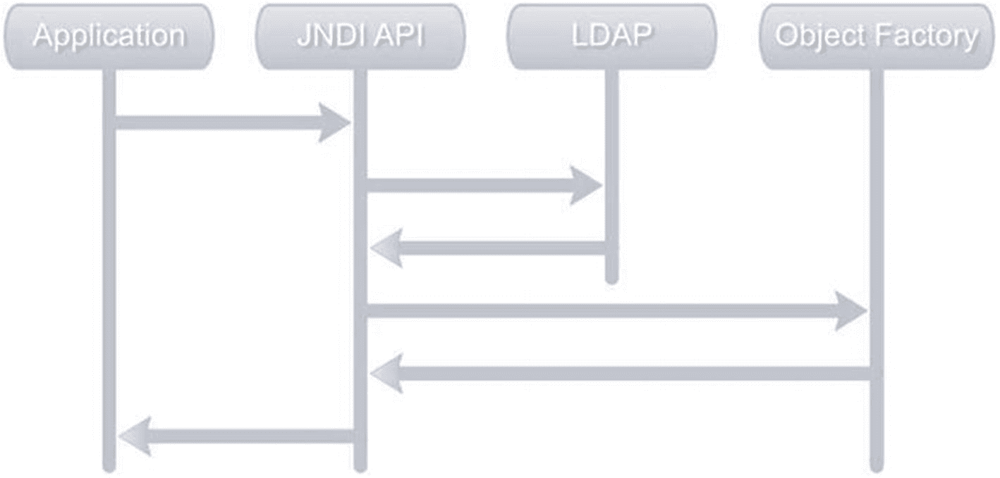

# 5. 高级 Spring LDAP

## JNDI 对象工厂

JNDI 提供了对象工厂的概念，这使得处理 LDAP 信息更加简便。正如其名，对象工厂将目录信息转换为应用程序有意义的对象。例如，对象工厂可以让搜索操作返回像 `Patron` 或 `Employee` 这样的对象实例，而不是普通的 `javax.naming.NamingEnumeration`。

图 5-1 展示了应用程序使用对象工厂执行 LDAP 操作时的流程。流程始于应用程序调用搜索或查找操作。JNDI API 将执行请求的操作并从 LDAP 获取条目。这些结果随后传递给已注册的对象工厂，将其转换为对象。这些对象再被传递给应用程序。



JNDI 或对象工厂流程的示意图。应用程序、JNDI API、LDAP 和对象工厂模块按顺序相互连接。

图 5-1

JNDI/对象工厂流程

处理 LDAP 的对象工厂必须实现 `javax.naming.spi.DirObjectFactory` 接口。列表 5-1 展示了一个 `Patron` 对象工厂的实现，它接收传入的信息并创建 `Patron` 实例。`getObjectInstance` 方法的 `obj` 参数包含有关对象的引用信息。`name` 参数包含对象的名称。`attrs` 参数包含与对象相关的属性。在 `getObjectInstance` 中，你读取所需的属性并填充新创建的 `Patron` 实例。

```
package com.apress.book.ldap;
import java.util.Hashtable;
import javax.naming.Context;
import javax.naming.Name;
import javax.naming.directory.Attributes;
import javax.naming.directory.BasicAttributes;
import javax.naming.spi.DirObjectFactory;
import com.apress.book.ldap.domain.Patron;
public class PatronObjectFactory implements DirObjectFactory {
@Override
public Object getObjectInstance(Object obj, Name name, Context nameCtx, Hashtable environment,
Attributes attrs) {
Patron patron = new Patron();
patron.setUid(attrs.get("uid").toString());
patron.setFullName(attrs.get("cn").toString());
return patron;
}
@Override
public Object getObjectInstance(Object obj, Name name, Context nameCtx, Hashtable environment){
return getObjectInstance(obj, name, nameCtx, environment, new BasicAttributes());
}
}
列表 5-1
如何将对象中的属性映射到实例的示例
```

在使用此对象工厂之前，必须在初始上下文创建时进行注册。列表 5-2 展示了在查找操作中使用 `PatronObjectFactory` 的示例。你使用 `DirContext.OBJECT_FACTORIES` 属性注册 `PatronObjectFactory` 类。请注意，上下文的查找方法现在返回 `Patron` 实例。

注意

请记住，附录 C 提供了所有关于配置 LDAP 服务器的信息。

```
package com.apress.book.ldap;
import java.util.Properties;
import javax.naming.NamingException;
import javax.naming.directory.DirContext;
import javax.naming.ldap.InitialLdapContext;
import javax.naming.ldap.LdapContext;
import com.apress.book.ldap.domain.Patron;
import org.slf4j.Logger;
import org.slf4j.LoggerFactory;
public class JndiObjectFactoryLookupExample {
private static final Logger logger = LoggerFactory.getLogger(JndiObjectFactoryLookupExample.class);
private LdapContext getContext() throws NamingException {
Properties environment = new Properties();
environment.setProperty(DirContext.INITIAL_CONTEXT_FACTORY, "com.sun.jndi.ldap.LdapCtxFactory");
environment.setProperty(DirContext.PROVIDER_URL, "ldap://localhost:11389");
environment.setProperty(DirContext.SECURITY_PRINCIPAL, "cn=Directory Manager");
environment.setProperty(DirContext.SECURITY_CREDENTIALS, "secret");
environment.setProperty(DirContext.OBJECT_FACTORIES, "com.apress.book.ldap.PatronObjectFactory");
return new InitialLdapContext(environment, null);
}
public Patron lookupPatron(String dn) {
Patron patron = null;
try {
LdapContext context = getContext();
patron = (Patron) context.lookup(dn);
} catch (NamingException e) {
logger.error(e.getClass() + ": " + e.getMessage());
}
return patron;
}
public static void main(String[] args) {
JndiObjectFactoryLookupExample jle = new JndiObjectFactoryLookupExample();
Patron p = jle.lookupPatron("uid=patron99,ou=patrons,dc=inflinx,dc=com");
logger.info(p.toString());
}
}
列表 5-2
执行某些操作的示例
```

如果你运行前面的示例，将看到以下输出：

```
11:53:14.630 [main] INFO  c.a.b.l.JndiObjectFactoryLookupExample - Full name:cn: Aggie Aguirre
```

请注意，使用 Spring LDAP 时，之前的示例都没有这种复杂程度。


## Spring 与对象工厂

Spring LDAP 提供了一个名为 `org.springframework.ldap.core.support.DefaultDirObjectFactory` 的开箱即用的 `DirObjectFactory` 实现。正如上一节所展示的，`PatronObjectFactory` 会从找到的上下文中创建 `Patron` 实例。类似地，`DefaultDirObjectFactory` 会从找到的上下文中创建 `org.springframework.ldap.core.DirContextAdapter` 实例。

`DirContextAdapter` 类是一个通用类，可以视为 LDAP 条目数据的容器。该类提供了多种实用方法，大大简化了属性的获取和设置操作。正如后续章节所示，当对属性进行修改时，`DirContextAdapter` 会自动记录这些更改，并简化 LDAP 条目数据的更新操作。`DirContextAdapter` 与 `DefaultDirObjectFactory` 的简单性使您能够轻松地将 LDAP 数据转换为领域对象，从而减少编写和注册大量对象工厂的需求。

在后续章节中，您将使用 `DirContextAdapter` 创建一个 Employee DAO，该 DAO 抽象了对 Employee LDAP 条目的读写访问。

注意

当今大多数 Java 和 JEE 应用程序都会访问持久化存储来执行日常操作。持久化存储的类型从流行的关联系统数据库到 LDAP 目录，再到遗留的主机系统不等。根据持久化存储的类型，获取和操作数据的机制会存在很大差异。这可能导致应用程序与数据访问代码之间产生紧密耦合，使得在不同实现之间切换变得困难。这就是数据访问对象（DAO）模式可以发挥作用的地方。

数据访问对象是一种流行的核心 JEE 模式，它封装了对数据源的访问。通过 DAO，底层的数据访问逻辑（如连接数据源和操作数据）被清晰地抽象到一个单独的层。DAO 的实现通常包括：

1. 一个提供 CRUD 方法契约的 DAO 接口  
2. 使用特定数据源 API 实现接口的具体类  
3. DAO 返回的领域对象或传输对象  

有了 DAO 的支持，应用程序的其余部分无需关注底层数据实现，可以专注于高层次的业务逻辑。

## 使用对象工厂实现 DAO

通常，在 Spring 应用程序中创建的 DAO 都包含一个作为 DAO 契约的接口和一个包含实际数据存储或目录访问逻辑的实现。清单 5-3 展示了您将实现的 Employee DAO 的 `EmployeeDao` 接口。该 DAO 包含用于修改员工信息的 `create`、`update` 和 `delete` 方法，还包含两个查找方法：一个通过 id 获取员工，另一个返回所有员工。

```
package com.apress.book.ldap.repository;
import java.util.List;
import com.apress.book.ldap.domain.Employee;
public interface EmployeeDao {
void create(Employee employee);
void update(Employee employee);
void delete(String id);
Employee find(String id);
List findAll();
}
Listing 5-3
包含最相关方法的 DAO 定义
```

之前的 `EmployeeDao` 接口使用了 `Employee` 领域对象。清单 5-4 展示了这个 `Employee` 领域对象。`Employee` 实现类包含了图书馆员工的所有基本属性。请注意，这里没有使用完整的 DN，而是使用 `uid` 属性作为对象的唯一标识符。

```
package com.apress.book.ldap.domain;
public class Employee {
private String uid;
private String firstName;
private String lastName;
private String commonName;
private String email;
private String employeeNumber;
private String[] phone;
// getters and setters omitted
}
Listing 5-4
Employee 类的定义
```

您将从 `EmployeeDao` 的基本实现开始，如清单 5-5 所示。

```
package com.apress.book.ldap.repository;
import java.util.List;
import org.springframework.beans.factory.annotation.Autowired;
import org.springframework.beans.factory.annotation.Qualifier;
import org.springframework.ldap.core.LdapTemplate;
import com.apress.book.ldap.domain.Employee;
@Repository("employeeDao" )
public class EmployeeDaoLdapImpl implements EmployeeDao {
private LdapTemplate ldapTemplate;
public EmployeeDaoLdapImpl(@Autowired @Qualifier("ldapTemplate") LdapTemplate ldapTemplate) {
this.ldapTemplate = ldapTemplate;
}
@Override
public List findAll() { return null; }
@Override
public Employee find(String id) { return null; }
@Override
public void create(Employee employee) {}
@Override
public void delete(String id) {}
@Override
public void update(Employee employee) {}
}
Listing 5-5
DAO 实现的默认定义
```

在这个实现中，您注入了一个 `LdapTemplate` 实例。`LdapTemplate` 的实际创建将在外部配置文件中完成。清单 5-6 展示了位于 **src/test/resources** 文件夹中的 `repositoryContext.xml` 文件，其中包含 `LdapTemplate` 及相关 bean 的声明。

```

Listing 5-6
应用程序的默认配置
```

这个配置文件与第 3 章节中看到的类似。您将 LDAP 服务器信息传递给 `LdapContextSource` 以创建 `contextSource` bean。通过将 base 设置为 `"ou=employees,dc=inflinx,dc=com"`，您已将所有 LDAP 操作限制在 LDAP 树的员工分支中。需要特别注意的是，使用此处创建的上下文无法对 `"ou=patrons"` 分支执行搜索操作。如果需要搜索 LDAP 树的所有分支，则 base 属性需要设置为空字符串。

`LdapContextSource` 的一个重要属性是 `dirObjectFactory`，可以用来设置要使用的 `DirObjectFactory`。然而，在清单 5-6 中，您并未使用此属性来指定使用 `DefaultDirObjectFactory` 的意图。这是因为默认情况下，`LdapContextSource` 会将其 `DirObjectFactory` 注册为 `DefaultDirObjectFactory`。

在配置文件的最后部分，您有 `LdapTemplate` 的 bean 声明。您将 `LdapContextSource` bean 作为构造函数参数传递给了 `LdapTemplate`。


## 实现查找方法

实现员工 DAO 的`findAll`方法需要通过 LDAP 搜索所有员工条目，并使用返回的条目创建`Employee`实例。为此，你将使用`LdapTemplate`类中的以下方法：

```
public  List search(String base, String filter, ParameterizedContextMapper mapper)
```

由于你使用的是`DefaultDirObjectFactory`，每次执行搜索或查找操作时，LDAP 树中找到的每个上下文都会被返回为`DirContextAdapter`实例。就像你在列表 3-8 中看到的搜索方法一样，前面的搜索方法也接受`base`和`filter`参数。此外，它还接受一个`AbstractContextMapper<T>`实例。前面的`search`方法会将返回的`DirContextAdapters`传递给`ContextMapper<T>`实例进行转换。

列表 5-7 提供了将`Employee`实例映射的上下文映射器实现。如你所见，`EmployeeContextMapper`继承自`AbstractContextMapper`，这是一个实现了`ContextMapper`接口的抽象类。

```
package com.apress.book.ldap.repository.mapper;
import com.apress.book.ldap.domain.Employee;
import org.springframework.ldap.core.DirContextOperations;
import org.springframework.ldap.core.support.AbstractContextMapper;
public class EmployeeContextMapper extends AbstractContextMapper {
@Override
protected Employee doMapFromContext(DirContextOperations context) {
Employee employee = new Employee();
employee.setUid(context.getStringAttribute("uid"));
employee.setFirstName(context.getStringAttribute("givenName"));
employee.setLastName(context.getStringAttribute("sn"));
employee.setCommonName(context.getStringAttribute("cn"));
employee.setEmployeeNumber(context.getStringAttribute("employeeNumber"));
employee.setEmail(context.getStringAttribute("mail"));
employee.setPhone(context.getStringAttributes("telephoneNumber"));
return employee;
}
}
Listing 5-7
映射器实现示例
```

在列表 5-7 中，`doMapFromContext`方法的`DirContextOperations`参数是`DirContextAdapter`接口的实现。如你所见，`doMapFromContext`的实现涉及创建一个新的`Employee`实例，并从提供的上下文中读取感兴趣的属性。

有了`EmployeeContextMapper`，`findAll`方法的实现变得非常简单。由于所有员工条目都具有`objectClass inetOrgPerson`属性，因此将使用`"(objectClass=inetOrgPerson)"`作为搜索过滤器。列表 5-8 展示了`findAll`的实现。

```
@Override
public List findAll() {
return ldapTemplate.search("", "(objectClass=inetOrgPerson)", new EmployeeContextMapper());
}
Listing 5-8
从 LDAP 中查找所有信息的实现
```

其他查找方法可以通过使用过滤器(`uid=<supplied employee id>`)搜索 LDAP 树，或通过员工 DN 执行 LDAP 查找来实现。由于带有过滤器的搜索操作比查找 DN 更昂贵，因此你将使用查找方式实现`find`方法。列表 5-9 展示了`find`方法的实现。

```
@Override
public Employee find(String id) {
DistinguishedName dn = new DistinguishedName();
dn.add("uid", id);
return ldapTemplate.lookup(dn, new EmployeeContextMapper());
}
Listing 5-9
在 LDAP 中查找单个元素的实现
```

你首先通过构建员工的 DN 来开始实现。由于初始上下文基础被限制在员工分支，你只需指定了员工条目的 RDN 部分。然后使用`lookup`方法查找员工条目，并使用`EmployeeContextMapper`创建`Employee`实例。

这完成了两个查找方法的实现。现在让我们创建一个 JUnit 测试类来测试你的查找方法。测试用例如列表 5-10 所示。

```
package com.apress.book.ldap.repository;
import java.util.List;
import com.apress.book.ldap.domain.Employee;
import org.springframework.beans.factory.annotation.Autowired;
import org.springframework.beans.factory.annotation.Qualifier;
import org.springframework.ldap.core.DirContextAdapter;
import org.springframework.ldap.core.DirContextOperations;
import org.springframework.ldap.core.DistinguishedName;
import org.springframework.ldap.core.LdapTemplate;
import org.springframework.stereotype.Repository;
import com.apress.book.ldap.repository.mapper.EmployeeContextMapper;
@Repository("employeeDao")
public class EmployeeDaoLdapImpl implements EmployeeDao {
private LdapTemplate ldapTemplate;
public EmployeeDaoLdapImpl(@Autowired @Qualifier("ldapTemplate") LdapTemplate ldapTemplate) {
this.ldapTemplate = ldapTemplate;
}
@Override
public List findAll() {
return ldapTemplate.search("", "(objectClass=inetOrgPerson)", new EmployeeContextMapper());
}
@Override
public Employee find(String id) {
DistinguishedName dn = getDistinguishedName(id);
return ldapTemplate.lookup(dn, new EmployeeContextMapper());
}
private DistinguishedName getDistinguishedName(String id) {
DistinguishedName dn = new DistinguishedName();
dn.add("uid", id);
return dn;
}
// 后续页面将添加相关逻辑
@Override
public void create(Employee employee) {}
@Override
public void delete(String id) {}
@Override
public void update(Employee employee) {}
}
Listing 5-10
对搜索方法的测试实现
```

请注意你在`ContextConfiguration`中指定了`repositoryContext-test.xml`测试上下文文件。该测试上下文文件如列表 5-11 所示。你创建了一个嵌入式 LDAP 服务器，在端口 18880 上运行，并使用位于**src/test/resources**文件夹中的`employee.ldif`文件进行初始化，该文件包含本书中将使用的测试数据。

```

Listing 5-11
上下文配置
```

请记住每个测试都会清空数据库，因此你可以在不影响其他测试的情况下执行大量操作。


## 创建方法

`LdapTemplate` 提供了多个 `bind` 方法用于向 LDAP 添加条目。要创建一个新的员工，您将使用以下 `bind` 方法变体：

```
public void bind(DirContextOperations ctx)
```

此方法以 `DirContextOperations` 实例作为参数。`bind` 方法会调用传入的 `DirContextOperations` 实例的 `getDn` 方法，并获取条目的完整限定名（DN）。然后将所有属性绑定到 DN 并创建新条目。

Employee DAO 中的 `create` 方法实现如 Listing 5-12 所示。您会首先创建一个 `DirContextAdapter` 的新实例，然后使用员工信息填充上下文的属性。方法的最后一行执行实际的绑定操作。

```
@Override
public void create(Employee employee) {
DistinguishedName dn = getDistinguishedName(employee.getUid());
DirContextAdapter context = new DirContextAdapter();
context.setDn(dn);
context.setAttributeValues("objectClass",
new String[] { "top", "person", "organizationalperson", "inetorgperson" });
context.setAttributeValue("givenName", employee.getFirstName());
context.setAttributeValue("sn", employee.getLastName());
context.setAttributeValue("cn", employee.getCommonName());
context.setAttributeValue("mail", employee.getEmail());
context.setAttributeValue("employeeNumber", employee.getEmployeeNumber());
context.setAttributeValues("telephoneNumber", employee.getPhone());
ldapTemplate.bind(context);
}
Listing 5-12
在 LDAP 上创建新员工的方法
```

注意

将 Listing 5-12 中的代码与 Listing 3-10 中的代码进行对比。您会发现 `DirContextAdapter` 在简化属性操作方面表现出色。

我们可以通过 Listing 5-13 中的 JUnit 测试用例快速验证 `create` 方法的实现。

```
@Test
@DisplayName("检查创建一个员工的操作")
public void should_create_a_new_employee() {
String empUid = "employee1000";
Employee employee = new Employee();
employee.setUid(empUid);
employee.setFirstName("Test");
employee.setLastName("Employee1000");
employee.setCommonName("Test Employee1000");
employee.setEmail("employee1000@inflinx.com");
employee.setEmployeeNumber("45678");
employee.setPhone(new String[] { "801-100-1200" });
employeeDao.create(employee);
employee = employeeDao.find(empUid);
assertNotNull(employee);
}
Listing 5-13
验证创建方法是否正常工作的测试
```

为了简化测试，只需验证对象是否不为 null，但建议尝试验证所有字段的值。

## 更新方法

更新条目涉及添加、替换或删除其属性。最简单的方法是删除整个条目并使用新的属性集重新创建。这种技术称为重新绑定（rebinding）。删除并重新创建条目可能更高效，而且对更改的值进行操作更有意义。

在第 3 章中，您使用了 `modifyAttributes` 和 `ModificationItem` 实例来更新 LDAP 条目。尽管 `modifyAttributes` 是一种不错的做法，但它需要手动生成 `ModificationItem` 列表，这需要大量工作。幸运的是，`DirContextAdapter` 自动完成这一操作，使更新条目变得非常简单。Listing 5-14 展示了使用 `DirContextAdapter` 实现的 `update` 方法。

```
@Override
public void update(Employee employee) {
DistinguishedName dn = getDistinguishedName(employee.getUid());
DirContextOperations context = ldapTemplate.lookupContext(dn);
context.setAttributeValues("objectClass",
new String[] { "top", "person", "organizationalperson", "inetorgperson" });
context.setAttributeValue("givenName", employee.getFirstName());
context.setAttributeValue("sn", employee.getLastName());
context.setAttributeValue("cn", employee.getCommonName());
context.setAttributeValue("mail", employee.getEmail());
context.setAttributeValue("employeeNumber", employee.getEmployeeNumber());
context.setAttributeValues("telephoneNumber", employee.getPhone());
ldapTemplate.modifyAttributes(context);
}
Listing 5-14
更新属性的方法
```

在这个实现中，您会注意到首先使用员工的 DN 查找现有的上下文，然后像在 `create` 方法中那样设置所有属性。（区别在于 `DirContextAdapter` 会跟踪对条目所做的值更改。）最后，将更新后的上下文传递给 `modifyAttributes` 方法。`modifyAttributes` 方法会从 `DirContextAdapter` 中获取修改的项目列表，并在 LDAP 条目上执行这些修改。Listing 5-15 展示了验证更新员工姓名的关联测试用例。

```
@Test
@DisplayName("检查更新一个员工的操作")
public void should_update_an_employee() {
Employee employee = employeeDao.find("employee1");
employee.setFirstName("Employee New");
employeeDao.update(employee);
employee = employeeDao.find("employee1");
assertEquals(employee.getFirstName(), "Employee New");
}
Listing 5-15
测试更新方法
```

建议：当上传整个对象时，验证所有字段是否具有正确的值；在此简化场景中，测试仅检查一个属性。

## 删除方法

Spring LDAP 通过 `LdapTemplate` 中的 `unbind` 方法使解绑定操作变得简单。Listing 5-16 展示了删除员工涉及的代码。

```
@Override
public void delete(String id) {
DistinguishedName dn = getDistinguishedName(id);
ldapTemplate.unbind(dn);
}
Listing 5-16
使用 uid 的删除方法
```

由于您的操作都是基于初始上下文 `ou=employees,dc=inflinx,dc=com` 的，因此只需使用 uid 创建 DN，即条目的 RDN。调用 `unbind` 操作将删除条目及其所有相关属性。

Listing 5-17 展示了验证条目删除的关联测试用例。一旦条目成功删除，对该名称的任何查找操作都会抛出 `NameNotFoundException`。测试用例验证了这一假设。

```
@Test
@DisplayName("检查删除一个员工的操作")
public void should_delete_an_employee() {
String empUid = "employee11";
employeeDao.delete(empUid);
assertThrows(NameNotFoundException.class, () -> {
employeeDao.find(empUid);
});
}
Listing 5-17
使用 uid 测试删除方法
```

这是 DAO 的最后一步操作，概述了如何使用 Spring LDAP 执行不同的操作。

## 总结

在本章中，您了解了 JNDI 对象工厂的世界。然后查看了 Spring LDAP 的对象工厂实现 `DefaultDirObjectFactory`。其余部分专注于使用 `DirContextAdapter` 和 `LdapTemplate` 实现 Employee DAO。

在下一章中，您将深入 LDAP 搜索和搜索过滤器的世界。

