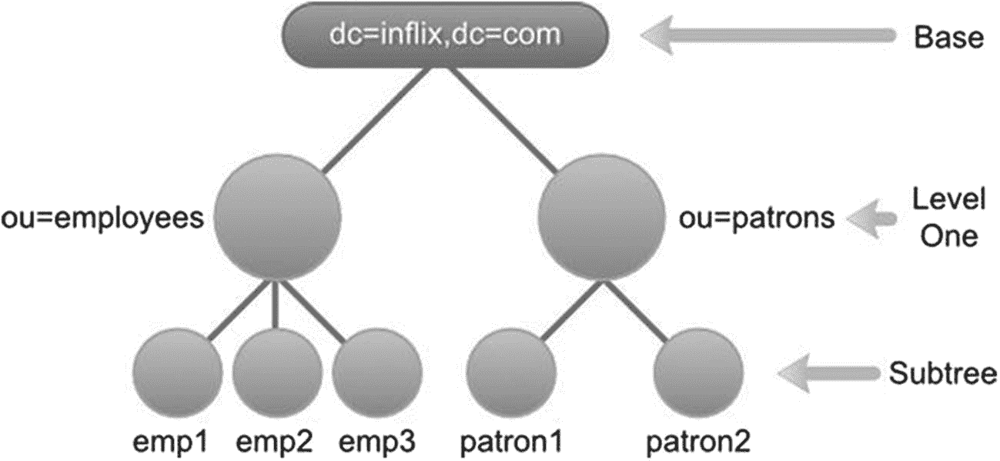
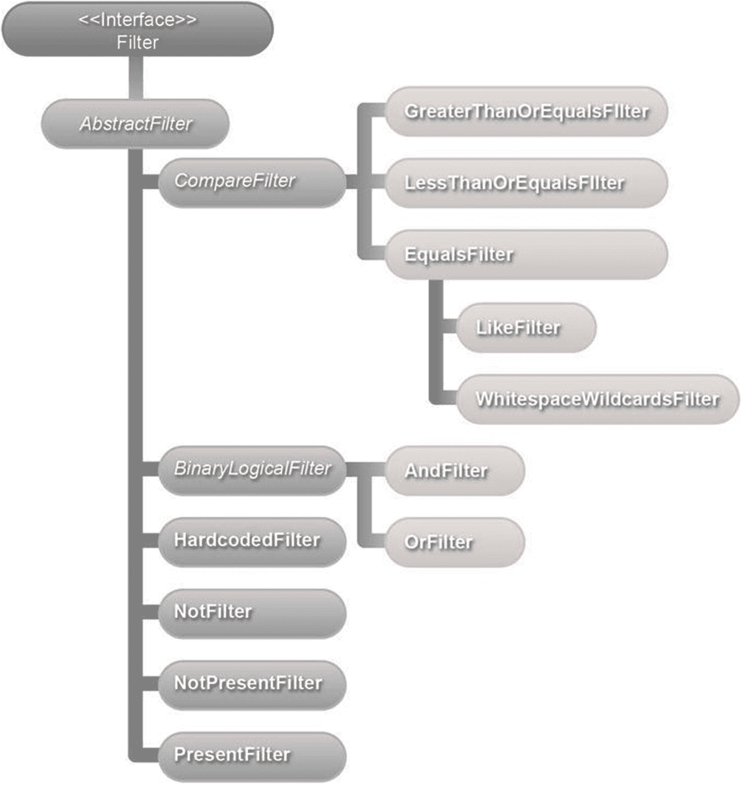

# 6. 搜索 LDAP

搜索信息是针对 LDAP 的最常见操作。客户端应用程序通过传递搜索条件（即决定搜索位置和搜索内容的信息）来发起 LDAP 搜索。在接收到请求后，LDAP 服务器会执行搜索并返回所有匹配条件的条目。


### 基础参数

搜索的基础部分是一个区分名（DN），用于标识将要搜索的树状结构分支。例如，基础参数为 `"ou=patrons, dc=inflinx, dc=com"` 表示搜索将从 Patron 分支开始并向下进行。也可以指定一个空的基础参数，这将导致搜索根 DSE 条目。

注意

根 DSE 或 DSA 特定条目是 LDAP 服务器中的特殊条目。它通常包含服务器特定的数据，例如供应商名称、供应商版本以及其支持的不同控制和功能。

### 范围参数

范围参数决定了相对于基础参数，LDAP 搜索需要深入多少层级。LDAP 协议定义了三种可能的搜索范围：基础、单层和子树。图 6-1 展示了不同范围下被评估的条目。



一个图表展示了不同范围下的搜索条目。从基础开始，可能的搜索范围依次为单层和子树。

图 6-1

搜索范围

*   基础范围限制搜索仅针对由基础参数标识的 LDAP 条目。搜索过程中不会包含其他条目。在您的图书馆应用程序模式中，若基础为 `DN dc=inflinx,dc=com` 且范围为基础，搜索将仅返回根组织条目，如图 6-1 所示。

单层范围表示搜索所有直接位于基础下的一层条目。基础条目本身不会被包含在搜索中。因此，若基础为 `dc=inflinx,dc=com` 且范围为单层，搜索所有条目将仅返回 **employees** 和 **patrons** 组织单元。

最后，子树范围包括基础条目及其所有子条目。这是三种范围中最慢且最耗费资源的选项。在您的图书馆示例中，若使用此范围且基础为 `dc=inflinx, dc=com`，搜索将返回所有条目。

### 过滤器参数

在您的图书馆应用程序 LDAP 服务器中，假设您想查找所有居住在 Midvale 地区的借阅者。从 LDAP 模式中，您知道借阅者条目具有 `city` 属性，用于存储其所在城市名称。因此，这一需求本质上等同于检索所有 `city` 属性值为“Midvale”的条目。这就是搜索过滤器的作用。搜索过滤器定义了所有返回条目必须具备的特征。逻辑上，过滤器会应用于由基础和范围确定的条目集合中的每个条目。只有与过滤器匹配的条目才会成为返回的搜索结果的一部分。

一个 LDAP 搜索过滤器包含三个组成部分：属性类型、操作符和属性值（或值范围）。根据操作符的不同，值部分可能是可选的。这些组件必须始终包含在括号内，格式如下：

```
Filter = (attributetype operator value)
```

掌握这些信息后，用于查找所有居住在 Midvale 地区的借阅者的搜索过滤器应如下所示：

```
(city=Midvale)
```

现在，假设您想查找所有居住在 Midvale 地区且拥有电子邮件地址的借阅者，以便向他们发送偶尔的图书馆活动新闻。这种情况下，搜索过滤器需要结合两个过滤器项：一个用于标识 Midvale 地区的借阅者，另一个用于标识拥有电子邮件地址的借阅者。您已经见过第一个过滤器项。以下是第二个过滤器项：

```
(mail=*)
```

操作符 `=*` 表示属性的存在性。因此，表达式 `mail=*` 将返回所有在 `mail` 属性中包含值的条目。LDAP 规范定义了多种过滤器操作符，用于组合多个过滤器并创建复杂的过滤器。以下是组合过滤器的格式：

```
Filter = (operator filter1 filter2)
```

请注意使用前缀表示法，即操作符写在操作数之前以组合两个过滤器。针对您的使用场景，所需的过滤器应如下所示：

```
(&(city=Midvale)(mail=*))
```

此过滤器中的 `&` 是一个 *And* 操作符。LDAP 规范定义了多种搜索过滤器操作符。表 6-1 列出了一些常用的过滤器操作符。

表 6-1

搜索过滤器操作符

| 名称 | 符号 | 示例 | 描述 |
| --- | --- | --- | --- |
| 等值过滤器 | = | (sn=Smith) | 匹配所有姓氏为 Smith 的条目。 |
| 子串过滤器 | =, * | (sn=Smi*) | 匹配所有姓氏以 Smi 开头的条目。 |
| 大于等于过滤器 | >= | (sn>=S*) | 匹配所有按字母顺序大于或等于 S 的条目。 |
| 小于等于过滤器 | <= | (sn<=S*) | 匹配所有按字母顺序小于或等于 S 的条目。 |
| 存在性过滤器 | =* | (objectClass=*) | 匹配所有包含 `objectClass` 属性的条目。这是用于检索 LDAP 中所有条目的常用表达式。 |
| 近似匹配过滤器 | ∼= | (sn∼=Smith) | 匹配所有姓氏与 Smith 相近的条目。因此，此操作符可能返回 Smith 和 Snith 等变体。 |
| 与过滤器 | & | (&(sn=Smith)(zip=84121)) | 返回所有姓氏为 Smith 且居住在 84121 地区的条目。 |
| 或过滤器 | &#124; | (&#124;(sn=Smith) (sn=Lee)) | 返回所有姓氏为 Smith 或 Lee 的条目。 |
| 非过滤器 | ! | (!(sn=Smith)) | 返回所有姓氏不为 Smith 的条目。 |

### 可选参数

除了上述三个参数外，还可以包含多个用于控制搜索行为的可选参数。例如，`timelimit` 参数表示搜索完成所需的时间。同样，`sizelimit` 参数对返回结果中条目的数量设置上限。

一个非常常用的可选参数涉及提供属性名称列表。当执行搜索时，LDAP 服务器默认会返回所有在搜索结果中找到的条目关联的属性。有时这可能并不理想。在这种情况下，您可以提供一个属性名称列表作为搜索的一部分，LDAP 服务器将仅返回包含这些属性的条目。以下是 LdapTemplate 中一个搜索方法的示例，它接受属性名称数组（`ATTR_1`、`ATTR_2` 和 `ATTR_3`）：

```
ldapTemplate.search("SEARCH_BASE", "uid=USER_DN", 1, new String[]{"ATTR_1", "ATTR_2", ATTR_3}, new SomeContextMapperImpl());
```

当执行此搜索时，返回的条目将仅包含 `ATTR_1`、`ATTR_2` 和 `ATTR_3`。这可以减少从服务器传输的数据量，并在高流量场景中非常有用。

自版本 3 起，LDAP 服务器可以为每个条目维护属性，仅用于纯行政目的。这些属性称为操作属性，不属于条目本身的 `objectClass`。在执行 LDAP 搜索时，默认情况下返回的条目不包含操作属性。若要检索操作属性，必须在搜索条件中明确列出操作属性名称。

注意

操作属性的示例包括 `createTimeStamp`，它存储条目创建的时间；以及 `pwdAccountLockedTime`，它记录用户账户被锁定的时间。


### LDAP 注入

LDAP 注入是一种技术，攻击者通过修改 LDAP 查询来在目录服务器上执行任意的 LDAP 语句。LDAP 注入可能导致未经授权的数据访问或对 LDAP 树结构的修改。那些未对输入进行适当验证或未对输入进行清理的应用程序容易受到 LDAP 注入攻击。这种技术与针对数据库的流行 SQL 注入攻击类似。

为了更好地理解 LDAP 注入，考虑一个使用 LDAP 进行身份验证的 Web 应用程序。此类应用程序通常提供一个网页，让用户输入用户名和密码。为了验证用户名和密码是否匹配，应用程序会构建一个 LDAP 搜索查询，其形式大致如下：

```
(&(uid=USER_INPUT_UID)(password=USER_INPUT_PWD))
```

假设应用程序简单地信任用户输入且不进行任何验证。现在如果你输入用户名为`jdoe)(&))(`，密码为任意随机文本，生成的搜索查询过滤器将如下所示：

```
(&(uid=jdoe)(&))((password=randomstr))
```

如果用户名`jdoe`是 LDAP 中的有效用户 ID，那么无论输入的密码是什么，该查询都会始终评估为真。这种 LDAP 注入将允许攻击者绕过身份验证并进入应用程序。文章“LDAP 注入与盲 LDAP 注入”^(⁷⁶)详细讨论了各种 LDAP 注入技术。

防止 LDAP 注入以及其他类型的注入攻击，首先需要进行正确的输入验证。在将输入数据用于搜索过滤器之前，必须对其进行清理和正确编码。

## Spring LDAP 过滤器

在上一节中，你了解到 LDAP 搜索过滤器对于缩小搜索范围和识别条目至关重要。然而，动态创建 LDAP 过滤器可能很繁琐，尤其是在组合多个过滤器时。确保所有括号正确闭合容易出错。此外，正确转义特殊字符也很重要。

Spring LDAP 提供了多个过滤器类，使创建和编码 LDAP 过滤器变得简单。所有这些过滤器都实现`Filter`接口，并属于`org.springframework.ldap.filter`包。列表 6-1 显示了`Filter API`接口。

```
package org.springframework.ldap.filter;
public interface Filter {
String encode();
StringBuffer encode(StringBuffer buf);
boolean equals(Object o);
int hashCode();
}
Listing 6-1
包含所有方法的 Filter 接口定义
```

此接口中的第一个`encode`方法返回过滤器的字符串表示形式。第二个`encode`方法接受`StringBuffer`作为参数，并返回过滤器的编码版本。在常规开发过程中，你使用返回字符串的第一个`encode`方法版本。

`Filter`接口的继承关系如图 6-2 所示。该继承关系表明`AbstractFilter`实现了`Filter`接口，并作为所有其他过滤器实现的根类。`BinaryLogicalFilter`是用于二进制逻辑操作（如 AND 和 OR）的抽象超类。`CompareFilter`是用于比较值的过滤器（如`EqualsFilter`和`LessThanOrEqualsFilter`）的抽象超类。

注意

大多数 LDAP 属性值，默认情况下，搜索时是不区分大小写的。



继承关系图以过滤器开始，接着是抽象过滤器，然后细分为比较过滤器、二进制逻辑过滤器、硬编码过滤器、非过滤器、非存在过滤器和存在过滤器。

图 6-2

过滤器继承关系

在接下来的章节中，你将逐一查看图 6-2 中的每个过滤器。在开始之前，让我们创建一个可重用的方法来帮助你测试过滤器。列表 6-2 显示了使用传入的`Filter`实现参数并使用其执行搜索的`searchAndPrintResults`方法。然后它将搜索结果输出到控制台。请注意，你将搜索 LDAP 树中的 Patron 分支。

```
package com.apress.book.ldap.filter;
import java.util.List;
import com.apress.book.ldap.domain.Patron;
import com.apress.book.ldap.mapper.PatronContextMapper;
import org.slf4j.Logger;
import org.slf4j.LoggerFactory;
import org.springframework.beans.factory.annotation.Autowired;
import org.springframework.beans.factory.annotation.Qualifier;
import org.springframework.ldap.core.LdapTemplate;
import org.springframework.ldap.filter.Filter;
import org.springframework.stereotype.Component;
@Component("searchFilter")
public class SearchFilter {
private static final Logger logger = LoggerFactory.getLogger(SearchFilter.class);
private LdapTemplate ldapTemplate;
public SearchFilter(@Autowired @Qualifier("ldapTemplate") LdapTemplate ldapTemplate) {
this.ldapTemplate = ldapTemplate;
}
public List searchAndPrintResults(Filter filter) {
List results = ldapTemplate.search("ou=patrons,dc=inflinx,dc=com", filter.encode(), new PatronContextMapper());
logger.info("搜索到的结果数量: " + results.size());
for (Patron patron : results) {
logger.info(patron.toString());
}
return results;
}
}
Listing 6-2
Search 类接收一个过滤器
```

列表 6-2 中的类使用了你在前几章中见过的**Patron**类，以及一个遵循前几章相同理念的**PatronContextMapper**类，用于定义从 LDAP 到具体对象的转换类。列表 6-3 展示了该类的实现方式。

```
package com.apress.book.ldap.mapper;
import com.apress.book.ldap.domain.Patron;
import org.springframework.ldap.core.DirContextOperations;
import org.springframework.ldap.core.support.AbstractContextMapper;
public class PatronContextMapper extends AbstractContextMapper {
@Override
protected Patron doMapFromContext(DirContextOperations context) {
Patron patron = new Patron();
patron.setUid(context.getStringAttribute("uid"));
patron.setFirstName(context.getStringAttribute("givenName"));
patron.setLastName(context.getStringAttribute("sn"));
patron.setFullName(context.getStringAttribute("cn"));
patron.setEmail(context.getStringAttribute("mail"));
return patron;
}
}
Listing 6-3
上下文映射器将对象的属性转换为具体对象
```

Patron 对象包含更多属性，但为了简化示例，仅展示最相关的属性。


### EqualsFilter

一个`EqualsFilter`可以用来检索具有指定属性和值的所有条目。假设你想检索所有姓氏为***Abbi***的会员。为此，你需要创建一个`EqualsFilter`的新实例：

```
EqualsFilter filter = new EqualsFilter("givenName", "Abbi");
```

构造函数的第一个参数是属性名称，第二个参数是属性值。对这个过滤器调用`encode`方法会生成字符串`(givenName=Abbi)`。

列表 6-4 展示了调用`searchAndPrintResults`方法时使用前面的`EqualsFilter`参数的测试用例。方法的控制台输出也显示在列表中。请注意，结果中包含姓氏为***Abbi***的会员。这是因为`sn`属性，像大多数 LDAP 属性一样，在模式中被定义为不区分大小写的。

```
@Test
@DisplayName("检查使用 equals 过滤器的搜索操作是否正常工作")
public void should_works_equalsFilter() {
Filter filter = new EqualsFilter("givenName", "Abbi");
List results = searchFilter.searchAndPrintResults(filter);
assertAll(
()-> assertNotNull(results),
()-> assertEquals(1, results.size()),
()-> assertEquals("Abbi Abbott", results.get(0).getFullName())
);
}
搜索结果: 1
完整姓名: Abbi Abbott
列表 6-4
equals 过滤器示例
```

### LikeFilter

`LikeFilter`在仅知道属性部分值时搜索 LDAP 非常有用。LDAP 规范允许使用通配符*来描述这些部分值。假设你想检索所有姓氏以“Abb.”开头的用户。为此，你需要创建一个`LikeFilter`的新实例，并将通配符子字符串作为属性值传递：

```
LikeFilter filter = new LikeFilter("givenName", "Abb*");
```

对这个过滤器调用`encode`方法会生成字符串`(givenName=Abb*)`。列表 6-5 展示了使用`LikeFilter`调用`searchAndPrintResults`方法的测试用例及其结果。

```
@Test
@DisplayName("检查使用 like 过滤器的搜索操作是否正常工作")
public void should_works_likeFilter() {
Filter filter = new LikeFilter("givenName", "Abb*");
List results = searchFilter.searchAndPrintResults(filter);
assertAll(
()-> assertNotNull(results),
()-> assertEquals(7, results.size())
);
}
搜索结果: 7
完整姓名: Abbey Abbie
完整姓名: Abbi Abbott
完整姓名: Abbie Abdalla
完整姓名: Abby Abdo
完整姓名: Abbye Abdollahi
完整姓名: Abbas Abbatantuono
完整姓名: Abbe Abbate
列表 6-5
like 过滤器示例
```

子字符串中的通配符`*`用于匹配零个或多个字符。但需要注意的是，LDAP 搜索过滤器不支持正则表达式。表 6-2 列出了部分子字符串示例。

表 6-2

LDAP 子字符串示例

| LDAP 子字符串 | 描述 |
| --- | --- |
| (givenName=*son) | 匹配所有姓氏以 son 结尾的会员。 |
| (givenName=J*n) | 匹配所有姓氏以 J 开头且以 n 结尾的会员。 |
| (givenName=*a*) | 匹配所有姓氏包含字符 a 的会员。 |
| (givenName=J*s*n) | 匹配姓氏以 J 开头、包含字符 s 且以 n 结尾的会员。 |

你可能会疑惑，为什么需要`LikeFilter`，因为你可以通过直接使用`EqualsFilter`实现相同的过滤表达式，例如：

```
EqualsFilter filter = new EqualsFilter("uid", "Ja*");
```

在这种情况下使用`EqualsFilter`将不起作用，因为`EqualsFilter`的`encode`方法会将`Ja*`中的通配符`*`视为特殊字符并正确转义。因此，当用于搜索时，前面的过滤器会匹配所有姓氏以 Ja*开头的条目。

### PresentFilter

`PresentFilter`用于检索具有指定属性至少一个值的 LDAP 条目。考虑之前的情景，你想检索所有拥有电子邮件地址的会员。为此，你需要创建一个`PresentFilter`，如所示：

```
PresentFilter presentFilter = new PresentFilter("mail");
```

对`presentFilter`实例调用`encode`方法会生成字符串`(mail=*)`。列表 6-6 展示了使用前面的`presentFilter`调用`searchAndPrintResults`方法的测试代码及其结果。

```
@Test
@DisplayName("检查使用存在过滤器的搜索操作是否正常工作")
public void should_works_presentFilter() {
Filter filter = new PresentFilter("mail");
List results = searchFilter.searchAndPrintResults(filter);
assertAll(
()-> assertNotNull(results),
()-> assertEquals(101, results.size())
);
}
搜索结果: 100
完整姓名: Aaccf Amar
完整姓名: Aaren Atp
完整姓名: Abbey Abbie
完整姓名: Abbi Abbott
完整姓名: Abbie Abdalla
.........
.........
列表 6-6
存在过滤器示例
```

### NotPresentFilter

`NotPresentFilter`用于检索没有指定属性的条目。在条目中没有值的属性被视为不存在。现在，假设你想检索所有没有电子邮件地址的会员。为此，你需要创建一个`NotPresentFilter`的实例，如所示：

```
NotPresentFilter notPresentFilter = new NotPresentFilter("email");
```

`notPresentFilter`的编码版本会生成表达式`!(email=*)`。运行`searchAndPrintResults`方法会生成列表 6-7 中所示的输出。第一个空值对应组织单位条目`"ou=patrons,dc=inflinx,dc=com"`。

```
@Test
@DisplayName("检查使用非存在过滤器的搜索操作是否正常工作")
public void should_works_notPresentFilter() {
Filter filter = new NotPresentFilter("email");
List results = searchFilter.searchAndPrintResults(filter);
assertAll(
()-> assertNotNull(results),
()-> assertEquals(1, results.size())
);
}
搜索结果: 1
完整姓名: Aggy Ahad
列表 6-7
非存在过滤器示例
```

### Not Filter

`NotFilter`用于检索不符合特定条件的条目。在“LikeFilter”部分，你查看了检索所有以 Ja 开头的条目。现在，假设你想检索所有不以***Ade***开头的条目。这时`NotFilter`就派上用场了。以下是实现此需求的代码：

```
NotFilter notFilter = new NotFilter(new LikeFilter("givenName", "Ade*"));
```

编码此过滤器会生成字符串`!(givenName=Ade*)`。如你所见，`NotFilter`会在其构造函数中传入的过滤器前添加否定符号（!）。调用`searchAndShowResults`方法会生成列表 6-8 中所示的输出。

```
@Test
@DisplayName("检查使用非过滤器的搜索操作是否正常工作")
public void should_works_notFilter() {
NotFilter notFilter = new NotFilter(new LikeFilter("givenName", "Ade*"));
List results = searchFilter.searchAndPrintResults(notFilter);
assertAll(
()-> assertNotNull(results),
()-> assertEquals(86, results.size())
);
}
搜索结果: 86
完整姓名: Aaccf Amar
完整姓名: Aaren Atp
完整姓名: Abbey Abbie
完整姓名: Abbi Abbott
完整姓名: Abbie Abdalla
.........
.........
列表 6-8
非过滤器示例
```

还可以将`NotFilter`与`PresentFilter`结合使用，以创建等效于`NotPresentFilter`的表达式。以下是检索所有没有电子邮件地址的条目的新实现：

```
NotFilter notFilter = new NotFilter(new PresentFilter("email"));
```


### GreaterThanOrEqualsFilter

`GreaterThanOrEqualsFilter` 用于匹配所有与给定属性值按字典顺序相等或更高的条目。例如，搜索表达式 `(postalCode >= 57018)` 可以检索出所有邮政编码在 58018 及之后的条目，包括 58018。列表 6-9 展示了该实现及其输出结果。

```
@Test
@DisplayName("检查使用大于等于过滤器的搜索操作是否正常工作")
public void should_works_greaterThanOrEqualsFilter() {
Filter filter = new GreaterThanOrEqualsFilter("postalCode", "57018");
List results = searchFilter.searchAndPrintResults(filter);
assertAll(
()-> assertNotNull(results),
()-> assertEquals(46, results.size())
);
}
搜索结果数量：46
完整姓名：Abbey Abbie
完整姓名：Aggy Ahad
完整姓名：Abbie Abdalla
完整姓名：Abbye Abdollahi
完整姓名：Abdalla Abdou
.........
.........
列表 6-9
大于等于过滤器示例
```

### LessThanOrEqualsFilter

`LessThanOrEqualsFilter` 可用于匹配所有与给定属性值按字典顺序相等或更低的条目。因此，搜索表达式 `(postalCode<=57018)` 将返回所有邮政编码低于或等于 57018 的条目。列表 6-10 展示了调用此需求的 `searchAndPrintResults` 实现及其输出结果。

```
@Test
@DisplayName("检查使用小于等于过滤器的搜索操作是否正常工作")
public void should_works_lessThanOrEqualsFilter() {
Filter filter = new LessThanOrEqualsFilter("postalCode", "57018");
List results = searchFilter.searchAndPrintResults(filter);
assertAll(
() -> assertNotNull(results),
() -> assertEquals(56, results.size())
);
}
搜索结果数量：56
完整姓名：Aaccf Amar
完整姓名：Aaren Atp
完整姓名：Abbi Abbott
完整姓名：Abby Abdo
完整姓名：Abdallah Abdul-Nour
.........
.........
列表 6-10
小于等于过滤器示例
```

如前所述，搜索包含邮政编码为 57018 的条目。LDAP 规范中并未提供小于（`<`）运算符。然而，可以通过将 `NotFilter` 与 `GreaterThanOrEqualsFilter` 组合来实现“小于”功能。以下是该思路的实现示例：

```
NotFilter lessThanFilter = new NotFilter(new GreaterThanOrEqualsFilter("postalCode", "557018"));
```

### AndFilter

`AndFilter` 用于组合多个搜索过滤器表达式以创建复杂的搜索过滤器。生成的过滤器将匹配满足所有子过滤器条件的条目。例如，`AndFilter` 适合用于实现早期需求，即获取居住在 Midvale 区域且拥有电子邮件地址的所有用户。以下代码展示了该实现：

```
AndFilter andFilter = new AndFilter();
andFilter.and(new EqualsFilter("postalCode", "95571"));
andFilter.and(new PresentFilter("mail"));
```

在此过滤器上调用 `encode` 方法将生成 `(&(postalCode=95571)(email=*))`。列表 6-11 展示了创建 `AndFilter` 并调用 `searchAndPrintResults` 方法的测试用例。

```
@Test
@DisplayName("检查使用 and 过滤器的搜索操作是否正常工作")
public void should_works_andFilter() {
AndFilter andFilter = new AndFilter();
andFilter.and(new EqualsFilter("postalCode", "95571"));
andFilter.and(new PresentFilter("mail"));
List results = searchFilter.searchAndPrintResults(andFilter);
assertAll(
() -> assertNotNull(results),
() -> assertEquals(1, results.size())
);
}
搜索结果数量：1
完整姓名：Abbey Abbie
列表 6-11
and 过滤器示例
```

### OrFilter

与 `AndFilter` 类似，`OrFilter` 也可以组合多个搜索过滤器。然而，生成的过滤器将匹配满足任意子过滤器条件的条目。以下是 `OrFilter` 的一个实现示例：

```
OrFilter orFilter = new OrFilter();
orFilter.add(new EqualsFilter("postalcode", "51911"));
orFilter.add(new EqualsFilter("postalcode", "48200"));
```

此 `OrFilter` 将检索所有居住在邮政编码为 51911 或 48200 的用户。`encode` 方法返回表达式 `(|(postalcode =51911)(postalcode=48200))`。`OrFilter` 的测试用例如列表 6-12 所示。

```
@Test
@DisplayName("检查使用 or 过滤器的搜索操作是否正常工作")
void should_works_orFilter() {
OrFilter orFilter = new OrFilter();
orFilter.or(new EqualsFilter("postalCode", "51911"));
orFilter.or(new EqualsFilter("postalCode", "48200"));
List results = searchFilter.searchAndPrintResults(orFilter);
assertAll(
() -> assertNotNull(results),
() -> assertEquals(2, results.size())
);
}
搜索结果数量：2
完整姓名：Aggi Aguinsky
完整姓名：Aggie Aguirre
列表 6-12
or 过滤器示例
```

### HardcodedFilter

`HardcodedFilter` 是一个便捷类，使在构建搜索过滤器时添加静态过滤器文本变得简单。假设你正在开发一个允许管理员在文本框中输入搜索表达式的管理应用程序。如果你想将此表达式与其他过滤器结合进行搜索，可以使用 `HardcodedFilter`，如以下示例所示：

```
String searchExpression = "(sn=Aguirre)";
AndFilter filter = new AndFilter();
filter.and(new HardcodedFilter(searchExpression));
filter.and(new EqualsFilter("givenName", "Aggie"));
```

在此代码中，`searchExpression` 变量包含用户输入的搜索表达式。当搜索过滤器的静态部分来自属性文件或配置文件时，`HardcodedFilter` 也非常有用。需要注意的是，此过滤器不会对传入的文本进行编码，因此在处理用户输入时要格外谨慎。

此 `HardcodedFilter` 将检索同时满足两个表达式的用户。`encode` 方法返回表达式 `(&(sn=Aguirre)(givenName=Aggie))`。`HardcodedFilter` 的测试用例如列表 6-13 所示。

```
@Test
@DisplayName("检查使用硬编码过滤器的搜索操作是否正常工作")
public void should_works_HardcodedFilter() {
String searchExpression;
AndFilter filter = new AndFilter();
filter.and(new HardcodedFilter("(sn=Aguirre)"));
filter.and(new EqualsFilter("givenName", "Aggie"));
List results = searchFilter.searchAndPrintResults(filter);
assertAll(
() -> assertNotNull(results),
() -> assertEquals(1, results.size())
);
}
搜索结果数量：1
完整姓名：Aggie Aguirre
列表 6-13
硬编码过滤器示例
```

### WhitespaceWildcardsFilter

`WhitespaceWildcardsFilter` 是另一个便捷类，使创建子字符串搜索过滤器更加简单。与它的父类 `EqualsFilter` 类似，该类接受属性名称和值。然而，如其名称所示，它会将属性值中的所有空格转换为通配符。考虑以下示例：

```
WhitespaceWildcardsFilter filter = new WhitespaceWildcardsFilter("cn", "John Will");
```

此过滤器生成的表达式为 `(cn=*John*Will*)`。在开发搜索和查找应用程序时，此过滤器可能非常有用。列表 6-14 展示了此过滤器的测试用例及其结果。

```
@Test
@DisplayName("检查使用空格通配符过滤器的搜索操作是否正常工作")
void should_works_WhitespaceWildcardsFilter() {
WhitespaceWildcardsFilter filter = new WhitespaceWildcardsFilter("cn", "Abbey Abbie");
List results = searchFilter.searchAndPrintResults(filter);
assertAll(() -> assertNotNull(results), () -> assertEquals(1, results.size()));
}
搜索结果数量：1
完整姓名：Abbey Abbie
列表 6-14
空格通配符过滤器示例
```


### 特殊字符处理

在某些情况下，您需要使用具有特殊含义的字符（如 ( 或 *）构建搜索过滤器。为了成功执行这些过滤器，必须正确转义这些特殊字符。转义格式为 \xx，其中 xx 表示字符的十六进制表示。表 6-3 列出了特殊字符及其转义值。

表 6-3

特殊字符和转义值

| 特殊字符 | 转义值 |
| --- | --- |
| ( | \28 |
| ) | \29 |
| * | \2a |
| \ | \5c |
| / | \2f |

除了表 6-3 中的字符，如果在 DN（区分名）中使用以下字符，也需要正确转义：逗号（,）、等号（=）、加号（+）、小于号（<）、大于号（>）、井号（#）和分号（;）。

## LDAP 查询构建器参数

有一种替代方法可以使用过滤器执行对 LDAP 的查询以查找信息；Spring LDAP 提供了一个 QueryBuilder，其结构类似于 SQL 语句，从而降低了理解查询功能的复杂性。此外，它也非常方便在一个语句中组合大量条件。

QueryBuilder 支持以下参数：

*   *base*: 定义 LDAP 树的起始点，即搜索的起点。

*   *searchScope*: 确定搜索过程中 LDAP 树的探索范围。

*   *attributes*: 指定从搜索中检索的所需属性。默认设置会检索所有属性。

*   *countLimit*: 设置搜索返回的条目数上限。

*   *timeLimit*: 设定搜索操作的最大允许时长（以毫秒为单位）。

*   *search filter*: 指定条目必须满足的条件，以被包含在搜索结果中。

如您所见，查询是之前章节中读取的大多数过滤器的组合，但使用了***countLimit***来限制方法返回的借阅者数量。清单 6-16 展示了一个测试用例，用于验证该方法是否正常工作。

```
package com.apress.book.ldap.builder;
import com.apress.book.ldap.domain.Patron;
import org.junit.jupiter.api.Test;
import org.junit.jupiter.api.extension.ExtendWith;
import org.springframework.beans.factory.annotation.Autowired;
import org.springframework.test.context.ContextConfiguration;
import org.springframework.test.context.junit.jupiter.SpringExtension;
import org.junit.jupiter.api.DisplayName;
import java.util.List;
import static org.junit.jupiter.api.Assertions.*;
@ExtendWith(SpringExtension.class)
@ContextConfiguration("classpath:repositoryContext-test.xml")
@DisplayName("Search Builder 测试用例")
public class SearchBuilderTest {
@Autowired
private SearchBuilder searchBuilder;
@Test
@DisplayName("检查使用姓氏和邮政编码的搜索操作是否正常工作")
public void should_works_builder() {
List results = searchBuilder.getPatronByLastNameAndPostalCode("Abbott", "07007");
assertAll(
()-> assertNotNull(results),
()-> assertEquals(1, results.size()),
()-> assertEquals("Abbi Abbott", results.get(0).getFullName())
);
}
}
清单 6-16
验证 QueryBuilder 工作方式的测试
```

表 6-4 展示了您可以使用的所有 QueryBuilder 方法及其功能。

表 6-4

QueryBuilder 方法

| 方法 | 描述 |
| --- | --- |
| query( ) | 此方法表示您要执行的查询的初始化。 |
| filter( ) | 设置 LDAP 查询的过滤条件。您可以使用 and()、or()、not()等方法以及各种比较方法构建复杂过滤器。 |
| build( ) | 根据配置的参数构建最终的 LDAP 查询。 |
| base( ) | 指定 LDAP 查询应从何处开始的基准 DN（区分名）。 |
| countLimit( ) | 设置查询返回的最大条目数。 |
| timeLimit( ) | 设置 LDAP 查询可执行的最大时间（以毫秒为单位）。 |
| attributes( ) | 指定查询中要检索的属性。您可以将属性名称作为参数传递。 |
| and( ) | and 方法允许您使用“and”运算符组合多个过滤器。 |
| or( ) | or 方法允许您使用“or”运算符组合多个过滤器。 |
| not( ) | 您可以使用 not 方法否定一个过滤器。 |
| is( ) | 此方法作为等于过滤器，检查一个属性的值是否等于特定值。 |
| isPresent( ) | 此方法检查特定属性是否存在。 |
| gte( ) | 此方法检查属性值是否大于特定值。 |
| lte( ) | 此方法检查属性值是否小于特定值。 |
| like( ) | 此方法与 LikeFilter 的功能相同。 |

## 总结

在本章中，您学习了如何通过搜索过滤器简化 LDAP 搜索。我从 LDAP 搜索概念概述开始本章，然后介绍了您可以用来以不同方式检索数据的各种搜索过滤器。此外，您还学习了如何使用 QueryBuilder 实现相同功能，其用法类似于编写 SQL 语句。

在下一章中，您将学习如何对从 LDAP 服务器获取的结果进行排序和分页。

脚注 1

