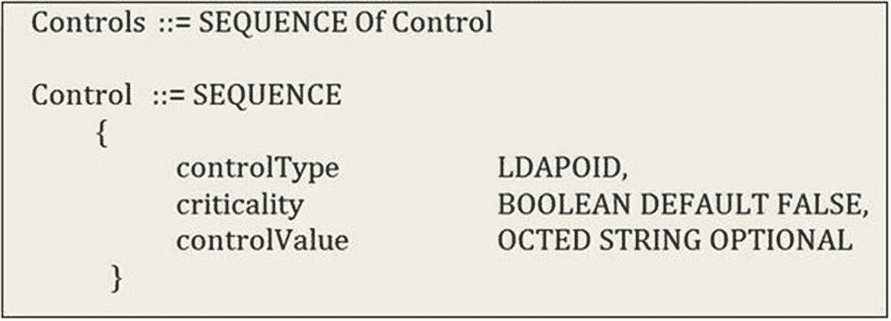
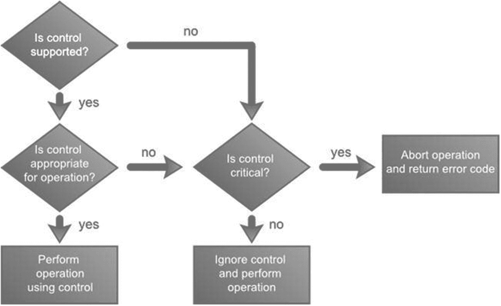
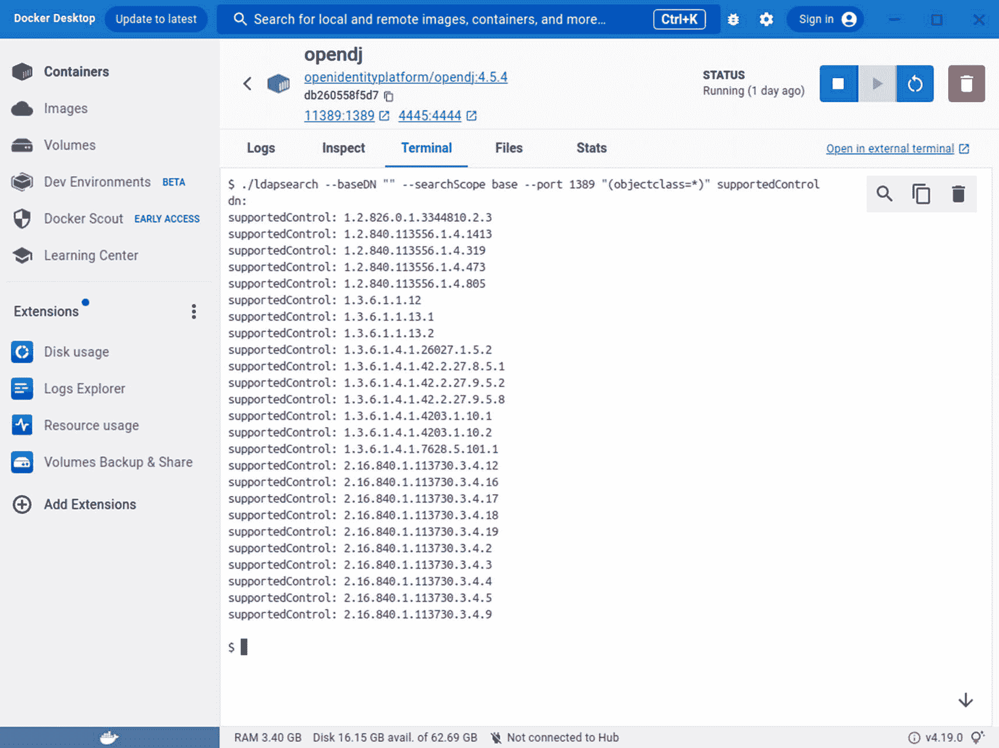
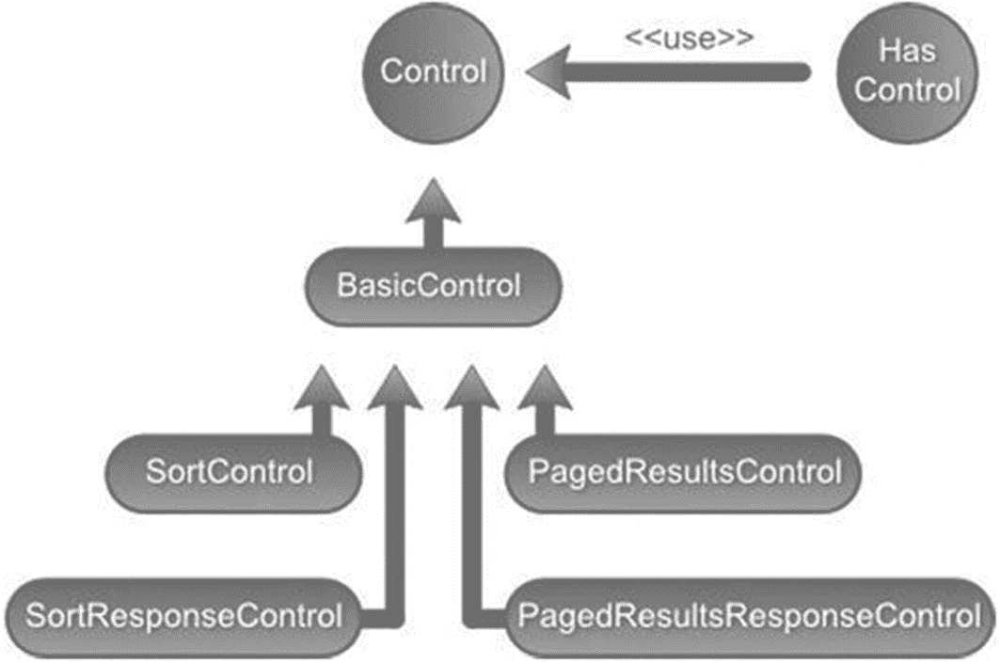
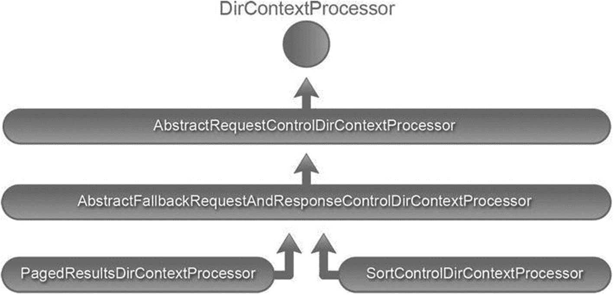
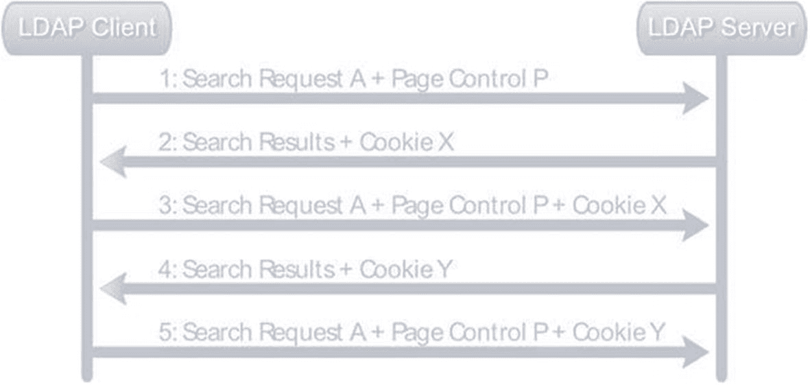

# 7. 对结果进行排序和分页


## LDAP 控制

LDAP 控制提供了一种标准化的方式来修改 LDAP 操作的行为。可以将控制简单地视为客户端发送给 LDAP 服务器（或反之）的消息。作为客户端请求一部分发送的控制可以向服务器提供额外信息，指示如何解释和执行该操作。例如，LDAP 删除操作可以指定删除子树控制。当 LDAP 服务器接收到删除请求时，默认行为只是删除条目。然而，当在删除请求中附加了删除子树控制时，服务器会自动删除该条目及其所有从属条目。这类控制被称为请求控制。

LDAP 服务器也可以在响应消息中发送控制，以指示操作的处理方式。例如，LDAP 服务器可能在绑定操作期间返回密码策略控制，表明客户端的密码已过期或即将过期。此类由服务器发送的控制被称为响应控制。可以随操作发送任意数量的请求或响应控制。

LDAP 控制（请求和响应控制）包含三个组成部分：

*   *对象标识符（OID）用于唯一标识控制*：这些 OID 防止控制名称之间的冲突，通常由创建控制的供应商定义。这是控制的必填组成部分。

*   *指示控制对操作是关键还是非关键*：这也是必填组成部分，可以是 TRUE 或 FALSE。

*   *与控制相关的可选信息*：例如，用于分页搜索结果的分页控制需要页面大小来确定每页返回的条目数量。

根据 RFC 2251^(⁷⁷) 中的正式定义，如图 7-1 所示。然而，该 LDAP 规范并未定义任何具体的控制。LDAP 供应商通常会提供控制定义，且不同服务器之间的支持程度差异很大。



LDAP 控制规范的截图。控制是控制类型的序列，包含控制类型、关键性以及控制值。

图 7-1

LDAP 控制规范

当 LDAP 服务器接收到操作中的控制时，其行为取决于该控制及其相关联的信息。图 7-2 中的流程图展示了服务器在接收到请求控制时的行为。



LDAP 服务器控制交互的决策树流程图。部分功能包括是否支持控制、控制是否适用于当前操作、使用控制进行操作，以及中止操作并返回错误代码。

图 7-2

LDAP 服务器控制交互

一些常见支持的 LDAP 控制及其 OID 和描述如表 7-1 所示。

表 7-1

常用控制

| 控制名称 | OID | 描述（RFC） |
| --- | --- | --- |
| 排序控制 | 1.2.840.113556.1.4.473 | 请求服务器在发送搜索结果给客户端前对其进行排序。这是 RFC 2891 的一部分。 |
| 分页搜索控制 | 1.2.840.113556.1.4.319 | 请求服务器以指定数量的条目为单位分页返回搜索结果。仅允许对搜索结果进行顺序迭代。这是 RFC 2696 的一部分。 |
| 删除子树控制 | 1.2.840.113556.1.4.805 | 请求服务器删除条目及其所有子条目。 |
| 虚拟列表视图控制 | 2.16.840.1.113730.3.4.9 | 与分页搜索结果类似，但允许客户端请求任意子集的条目。此控制描述于 Internet-Drafts 文件 VLV 04 中。 |
| 密码策略控制 | 1.3.6.1.4.1.42.2.27.8.5.1 | 由服务器发送的控制，用于存储因密码策略问题导致操作失败的信息（例如，密码需要重置、账户已被锁定，或密码已过期或即将过期）。 |
| 管理 DSA/IT 控制 | 2.16.840.1.113730.3.4.2 | 请求服务器将“ref”属性条目（引用）视为常规 LDAP 条目。 |
| 持久搜索控制 | 2.16.840.1.113730.3.4.3 | 该控制允许客户端接收 LDAP 服务器中匹配搜索条件的条目变更通知。 |


## 识别支持的控件

在使用某个特定控件之前，确保所使用的 LDAP 服务器支持该控件非常重要。LDAP 规范要求每个符合 LDAP v3 标准的服务器在根*DSA 特定条目*（DSE）的`supportedControl`属性中发布所有支持的控件。因此，搜索根 DSE 条目中的`supportedControl`属性将列出所有支持的控件。清单 7-1 展示了连接到运行在端口 11389 上的 OpenDJ 服务器并将其控件列表打印到控制台的代码。

```
package com.apress.book.ldap;
import org.slf4j.Logger;
import org.slf4j.LoggerFactory;
import java.util.Properties;
import javax.naming.NamingEnumeration;
import javax.naming.NamingException;
import javax.naming.directory.Attribute;
import javax.naming.directory.Attributes;
import javax.naming.directory.DirContext;
import javax.naming.directory.InitialDirContext;
public class SupportedControlApplication {
private static final Logger logger = LoggerFactory.getLogger(SupportedControlApplication.class);
public void displayControls() {
String ldapUrl = "ldap://localhost:11389";
try {
Properties environment = new Properties();
environment.setProperty(DirContext.INITIAL_CONTEXT_FACTORY, "com.sun.jndi.ldap.LdapCtxFactory");
environment.setProperty(DirContext.PROVIDER_URL, ldapUrl);
DirContext context = new InitialDirContext(environment);
Attributes attributes = context.getAttributes("", new String[] { "supportedcontrol" });
Attribute supportedControlAttribute = attributes.get("supportedcontrol");
NamingEnumeration controlOIDList = supportedControlAttribute.getAll();
while (controlOIDList != null && controlOIDList.hasMore()) {
logger.info(controlOIDList.next().toString());
}
context.close();
} catch (NamingException e) {
logger.error(e.getClass() + ": " + e.getMessage());
}
}
public static void main(String[] args) throws NamingException {
SupportedControlApplication supportedControlApplication = new SupportedControlApplication();
supportedControlApplication.displayControls();
}
}
清单 7-1
检测支持控件的类
```

清单 7-2 是运行清单 7-1 中代码后的输出结果。

```
1.2.826.0.1.3344810.2.3
1.2.840.113556.1.4.1413
1.2.840.113556.1.4.319
1.2.840.113556.1.4.473
1.2.840.113556.1.4.805
1.3.6.1.1.12
1.3.6.1.1.13.1
1.3.6.1.1.13.2
1.3.6.1.4.1.26027.1.5.2
1.3.6.1.4.1.42.2.27.8.5.1
1.3.6.1.4.1.42.2.27.9.5.2
1.3.6.1.4.1.42.2.27.9.5.8
1.3.6.1.4.1.4203.1.10.1
1.3.6.1.4.1.4203.1.10.2
1.3.6.1.4.1.7628.5.101.1
2.16.840.1.113730.3.4.12
2.16.840.1.113730.3.4.16
2.16.840.1.113730.3.4.17
2.16.840.1.113730.3.4.18
2.16.840.1.113730.3.4.19
2.16.840.1.113730.3.4.2
2.16.840.1.113730.3.4.3
2.16.840.1.113730.3.4.4
2.16.840.1.113730.3.4.5
2.16.840.1.113730.3.4.9
清单 7-2
支持控件类执行后的输出结果
```

OpenDJ 安装提供了一个命令行工具 ldapsearch，也可以用于列出支持的控件；如果您使用的是包含 OpenDJ 的 Docker 镜像，同样的情况也会发生。假设您使用的是 OpenDJ，需要访问 LDAP 服务器所在的根目录，并使用以下命令获取支持的控件列表：

```
ldapsearch --baseDN "" --searchScope base --port 11389 "(objectclass=*)" supportedControl
```

图 7-3 显示了运行此命令的结果。请注意，您使用了 base 搜索范围来搜索根 DSE，并未提供 base DN。此外，图中显示的 supported control OID 与运行清单 7-1 中 Java 代码获得的 OID 一致。



Docker 桌面中 open D J L D A P 搜索命令的截图。选择了终端菜单，显示了一组命令代码。

图 7-3

OpenDJ ldapsearch 命令

JNDI API 中的`javax.naming.ldap`包支持 LDAP V3 特定的功能，如控件和扩展操作。虽然控件用于修改或增强现有操作的行为，但扩展操作允许定义额外的操作。图 7-4 中的 UML 图展示了`javax.naming.ldap`包中一些重要的控件类。



Java LDAP 控件类继承结构的示意图。排序响应控件、分页结果响应控件、排序控件和分页结果控件随后是基本控件，最终以控件结尾。

图 7-4

Java LDAP 控件类继承结构

`javax.naming.ldap.Control`接口为请求和响应控件提供了抽象。JDK 中提供了该接口的多个实现，如`SortControl`和`PagedResultsControl`。此外，LDAP 增强包中还提供了其他控件，如`Virtual-ListViewControl`和`PasswordExpiringResponseControl`。

`javax.naming.ldap`包中的核心组件是`LdapContext`接口。该接口扩展了`javax.naming.DirContext`接口，并提供了执行 LDAP V3 操作的额外方法。`javax.naming.ldap`包中的`InitialLdapContext`类提供了该接口的具体实现。

使用 JNDI API 操作控件非常简单。清单 7-3 中的代码提供了使用控件的算法。

```
LdapContext context = new InitialLdapContext();
Control[] requestControls = // 具体控件实例数组
context.setRequestControls(requestControls);
/* 使用上下文执行搜索操作 */
context.search(parameters);
Control[] responseControls = context.getResponseControls();
// 分析响应控件
清单 7-3
使用控件的算法
```

在该算法中，您首先创建要包含在请求操作中的控件实例。然后执行并处理操作结果。最后分析服务器发送的任何响应控件。在接下来的章节中，您将结合排序和分页控件查看该算法的具体实现。


## Spring LDAP 与控件

Spring LDAP 在使用 `LdapTemplate` 的搜索方法时，无法访问目录上下文。因此，你无法向上下文中添加请求控件或处理响应控件。为了解决这个问题，Spring LDAP 提供了一个目录上下文处理器，它自动向上下文中添加和分析 LDAP 控件。列表 7-4 展示了 `DirContextProcessor` 接口的代码。

```
package org.springframework.ldap.core;
import javax.naming.NamingException;
import javax.naming.directory.DirContext;
public interface DirContextProcessor {
void preProcess(DirContext var1) throws NamingException;
void postProcess(DirContext var1) throws NamingException;
}
Listing 7-4
DirContextProcessor 接口
```

`DirContextProcessor` 接口的具体实现类会传递给 LdapTemplate 的搜索方法。`preProcess` 方法会在执行搜索前被调用，因此具体实现类会在 `preProcess` 方法中添加请求控件到上下文中。`postProcess` 方法会在搜索执行后被调用，具体实现类会在 `postProcess` 方法中读取并分析 LDAP 服务器发送的响应控件。

图 7-5 展示了 `DirContextProcessor` 及其所有实现类的 UML 表示。



目录上下文处理器类层次结构示意图。图中展示了分页结果和排序控件的目录上下文处理器，接着是抽象的回退请求和响应控件以及抽象请求控件的目录上下文处理器，最终以一个目录上下文处理器结束。

图 7-5

DirContextProcessor 类层次结构

`AbstractRequestControlDirContextProcessor` 实现了 `DirContextProcessor` 的 `preProcess` 方法，并在 `LdapContext` 上应用单个 `RequestControl`。`AbstractRequestDirContextProcessor` 通过 `createRequestControl` 模板方法将实际创建请求控件的逻辑委托给子类。

`AbstractFallbackRequestAndResponseControlDirContextProcessor` 类继承自 `AbstractRequestControlDirContextProcessor`，并大量使用反射来自动化处理 `DirContext`。它负责加载控件类、创建其实例并将其应用到上下文中。同时，它还处理响应控件的大部分后处理工作，通过委托给子类的模板方法来执行实际的值获取。

`PagedResultsDirContextProcessor` 和 `SortControlDirContextProcessor` 用于管理分页和排序控件。你将在后续章节中看到它们的使用。

## 排序控件

排序控件提供了一种机制，用于请求 LDAP 服务器在将搜索结果发送给客户端之前对其进行排序。该控件在 RFC 2891 中定义。^(⁷⁸) 排序请求控件接受一个或多个 LDAP 属性名称，并将它们提供给服务器以进行排序。

让我们看看如何使用排序控件与原始 JNDI API 结合。列表 7-5 展示了对所有搜索结果按姓氏排序的代码。首先，创建 `javax.naming.ldap.SortControl` 的新实例，并通过 `sn` 属性指示按姓氏排序的意图。你还通过向构造函数传递 CRITICAL 标志表明这是一个关键控件。此请求控件随后通过 `setRequestControls` 方法添加到上下文中，并执行 LDAP 搜索操作。接着，遍历返回的结果并将其打印到控制台。最后，检查响应控件。排序响应控件保存了排序操作的结果。如果服务器未能成功排序结果，你将通过抛出异常来表明这一点。

```
package com.apress.book.ldap.sorting;
import org.slf4j.Logger;
import org.slf4j.LoggerFactory;
import java.util.Properties;
import javax.naming.NamingEnumeration;
import javax.naming.NamingException;
import javax.naming.directory.DirContext;
import javax.naming.directory.SearchControls;
import javax.naming.directory.SearchResult;
import javax.naming.ldap.Control;
import javax.naming.ldap.InitialLdapContext;
import javax.naming.ldap.LdapContext;
import javax.naming.ldap.SortControl;
import javax.naming.ldap.SortResponseControl;
public class SortingJndi {
private static final Logger logger = LoggerFactory.getLogger(SortingJndi.class);
// 我们将获取 LDAP 上下文
private LdapContext getContext() {
Properties environment = new Properties();
environment.setProperty(DirContext.INITIAL_CONTEXT_FACTORY, "com.sun.jndi.ldap.LdapCtxFactory");
environment.setProperty(DirContext.PROVIDER_URL, "ldap://localhost:11389");
environment.setProperty(DirContext.SECURITY_PRINCIPAL, "cn=Directory Manager");
environment.setProperty(DirContext.SECURITY_CREDENTIALS, "secret");
try {
// 第二个参数是需要作为连接请求一部分发送的控件列表
// 创建 LDAP 上下文
return new InitialLdapContext(environment, null);
} catch (NamingException e) {
logger.error(e.getClass() + ": " + e.getMessage());
return null;
}
}
public void sortByLastName() {
try {
LdapContext context = getContext();
Control lastNameSort = new SortControl("sn", Control.CRITICAL);
context.setRequestControls(new Control[] { lastNameSort });
SearchControls searchControls = new SearchControls();
searchControls.setSearchScope(SearchControls.SUBTREE_SCOPE);
NamingEnumeration results = context.search("dc=inflinx,dc=com", "(objectClass=inetOrgPerson)",
searchControls);
// 遍历搜索结果并显示会员条目
while (results != null && results.hasMore()) {
SearchResult entry = (SearchResult) results.next();
logger.info(entry.getAttributes().get("sn") + " ( " + (entry.getName()) + " )");
}
// 现在遍历完成后，需要检查响应控件
Control[] responseControls = context.getResponseControls();
if (null != responseControls) {
for (Control control : responseControls) {
if (control instanceof SortResponseControl) {
SortResponseControl sortResponseControl = (SortResponseControl) control;
if (!sortResponseControl.isSorted()) {
// 排序未执行。通过抛出异常来指示
throw sortResponseControl.getException();
}
}
}
}
context.close();
} catch (Exception e) {
logger.error(e.getClass() + ": " + e.getMessage());
}
}
public static void main(String[] args) {
SortingJndi sortingJndi = new SortingJndi();
sortingJndi.sortByLastName();
}
}
Listing 7-5
使用 JNDI 的排序示例
```

输出应按以下方式显示已排序的会员：


```
sn: Aalders ( uid=patron4,ou=patrons )
sn: Aasen ( uid=patron5,ou=patrons )
sn: Abadines ( uid=patron6,ou=patrons )
sn: Abazari ( uid=patron7,ou=patrons )
sn: Abbatantuono ( uid=patron8,ou=patrons )
sn: Abbate ( uid=patron9,ou=patrons )
sn: Abbie ( uid=patron10,ou=patrons )
sn: Abbott ( uid=patron11,ou=patrons )
sn: Abdalla ( uid=patron12,ou=patrons )
......................................
```

现在，让我们看看如何使用 Spring LDAP 实现相同的行为。列表 7-6 显示了相关代码。在此实现中，您需要创建一个新的 `org.springframework.ldap.control.SortControlDirContextProcessor` 实例。`SortControlDirContextProcessor` 构造函数接受一个 LDAP 属性名称，该属性将在控制创建时用作排序键。下一步是创建 `SearchControls` 和一个过滤器来限制搜索范围。最后，调用搜索方法，传入创建的实例以及一个映射器以将数据映射到目标对象。

```
package com.apress.book.ldap.sorting;
import java.util.List;
import javax.naming.directory.SearchControls;
import org.slf4j.Logger;
import org.slf4j.LoggerFactory;
import org.springframework.beans.factory.annotation.Autowired;
import org.springframework.beans.factory.annotation.Qualifier;
import org.springframework.ldap.control.SortControlDirContextProcessor;
import org.springframework.ldap.core.DirContextOperations;
import org.springframework.ldap.core.DirContextProcessor;
import org.springframework.ldap.core.LdapTemplate;
import org.springframework.ldap.core.support.AbstractContextMapper;
import org.springframework.ldap.filter.EqualsFilter;
import org.springframework.stereotype.Component;
@Component("sorting")
public class SpringSorting {
private static final Logger logger = LoggerFactory.getLogger(SpringSorting.class);
private LdapTemplate ldapTemplate;
public SpringSorting(@Autowired @Qualifier("ldapTemplate") LdapTemplate ldapTemplate) {
this.ldapTemplate = ldapTemplate;
}
public List sortByLastName() {
DirContextProcessor scdcp = new SortControlDirContextProcessor("sn");
SearchControls searchControls = new SearchControls();
searchControls.setSearchScope(SearchControls.SUBTREE_SCOPE);
EqualsFilter equalsFilter = new EqualsFilter("objectClass", "inetOrgPerson");
@SuppressWarnings("unchecked")
AbstractContextMapper lastNameMapper = new AbstractContextMapper() {
@Override
protected String doMapFromContext(DirContextOperations context) {
return context.getStringAttribute("sn");
}
};
List lastNames = ldapTemplate.search("", equalsFilter.encode(), searchControls, lastNameMapper, scdcp);
for (String ln : lastNames) {
logger.info(ln);
}
return lastNames;
}
}
Listing 7-6
使用 Spring 实现的排序示例
```

调用此方法将产生与之前不使用 Spring 的实现相同的结果。

为了验证一切正常运行，我们可以创建一个测试用例，如列表 7-7 所示。

```
package com.apress.book.ldap.sorting;
import org.junit.jupiter.api.DisplayName;
import org.junit.jupiter.api.Test;
import org.junit.jupiter.api.extension.ExtendWith;
import org.springframework.beans.factory.annotation.Autowired;
import org.springframework.test.context.ContextConfiguration;
import org.springframework.test.context.junit.jupiter.SpringExtension;
import java.util.List;
import static org.junit.jupiter.api.Assertions.*;
@ExtendWith(SpringExtension.class)
@ContextConfiguration("classpath:repositoryContext-test.xml")
@DisplayName("Spring 排序用例")
class SpringSortingTest {
@Autowired
private SpringSorting springSorting;
@Test
@DisplayName("按姓氏排序")
void should_sort_byLastName() {
List results = springSorting.sortByLastName();
assertAll(() -> assertNotNull(results), () -> assertEquals(101, results.size()),
() -> assertEquals("Aalders", results.get(0)));
}
}
Listing 7-7
排序的测试用例
```

完整的应用程序上下文配置文件位于 **src/test/resources** 文件夹中，如列表 7-8 所示。

```

Listing 7-8
应用程序上下文配置
```

如果运行该测试用例，所有功能将正常运行。


## 实现自定义 DirContext 处理器

在 Spring LDAP 中，`SortControlDirContextProcessor` 只能对单一 LDAP 属性进行排序。然而 JNDI API 允许你对多个属性进行排序。由于在某些情况下你希望根据多个属性对搜索结果进行排序，让我们实现一个全新的 `DirContextProcessor` 来支持这一功能。

正如你所看到的，排序操作需要一个请求控制并会发送一个响应控制。因此，实现此功能的最简单方式是继承 `AbstractFallbackRequestAndResponseControlDirContextProcessor`。清单 7-9 展示了包含空抽象方法实现的初始代码。你会注意到，这里使用了三个实例变量来保存控制的状态。`sortKeys` 用于保存排序属性名称，`sorted` 和 `resultCode` 变量则保存从响应控制中提取的信息。

```
package com.apress.book.ldap.control;
import javax.naming.ldap.Control;
import org.springframework.ldap.control.AbstractFallbackRequestAndResponseControlDirContextProcessor;
public class SortMultipleControlDirContextProcessor
extends AbstractFallbackRequestAndResponseControlDirContextProcessor {
// 排序的键
private String[] sortKeys;
// 结果是否已排序
private boolean sorted;
// 操作的结果代码
private int resultCode;
@Override
public Control createRequestControl() {
// 后续实现
return null;
}
@Override
protected void handleResponse(Object control) {
// 后续实现
}
public String[] getSortKeys() {
return sortKeys;
}
public boolean isSorted() {
return sorted;
}
public int getResultCode() {
return resultCode;
}
}
清单 7-9
多排序的基本实现
```

下一步是为 `AbstractFallbackRequestAndResponseControlDirContextProcessor` 提供必要的信息以加载控制。`AbstractFallbackRequestAndResponseControlDirContextProcessor` 期望从子类获取两段信息：请求和响应控制的完整类名，以及作为回退控制使用的类名。清单 7-10 展示了实现这一功能的构造函数代码。

```
public SortMultipleControlDirContextProcessor(String... sortKeys) {
if (sortKeys.length == 0) {
throw new IllegalArgumentException("你必须至少提供一个排序键");
}
this.sortKeys = sortKeys;
this.sorted = false;
this.resultCode = -1;
this.defaultRequestControl = "javax.naming.ldap.SortControl";
this.defaultResponseControl = "javax.naming.ldap.SortResponseControl";
this.fallbackRequestControl = "com.sun.jndi.ldap.ctl.SortControl";
this.fallbackResponseControl = "com.sun.jndi.ldap.ctl.SortResponseControl";
loadControlClasses(); // 该方法存在于父类中
}
清单 7-10
上下文初始化
```

请注意，你为默认控制提供了 JDK 自带的控制类，为回退控制提供了 LDAP 增强包中的控制类。构造函数最后一行指示 `AbstractFallbackRequestAndResponseControlDirContextProcessor` 类将这些类加载到 JVM 中以供使用。

实现过程的下一步是编写 `createRequestControl` 方法。由于父类 `AbstractFallbackRequestAndResponseControlDirContextProcessor` 会处理控制的实际创建，你只需提供创建控制所需的必要信息。以下代码展示了这一点：

```
@Override
public Control createRequestControl() {
return super.createRequestControl(new Class[] { String[].class, boolean.class },
new Object[] { sortKeys, critical });
}
```

实现的最后一步是分析响应控制并获取操作完成的相关信息。清单 7-11 展示了涉及的代码。请注意，你正在使用反射从响应控制中获取排序状态和结果代码信息。

```
@Override
protected void handleResponse(Object control) {
this.sorted = (Boolean) invokeMethod("isSorted", responseControlClass, control);
this.resultCode = (Integer) invokeMethod("getResultCode", responseControlClass, control);
}
清单 7-11
处理响应的实现
```

现在你已经创建了一个新的 `DirContextProcessor` 实例，可以实现多属性排序功能，让我们进行实际测试。清单 7-12 展示了一个名为 `sortByLocation` 的方法，该方法存在于使用 `SortMultipleControlDirContextProcessor` 的 `SpringSorting` 类中。该方法使用 `st` 和 `l` 属性对结果进行排序。

```
// 现有导入和包声明
@Component("sorting")
public class SpringSorting {
private static final Logger logger = LoggerFactory.getLogger(SpringSorting.class);
private LdapTemplate ldapTemplate;
public SpringSorting(@Autowired @Qualifier("ldapTemplate") LdapTemplate ldapTemplate) {
this.ldapTemplate = ldapTemplate;
}
public List sortByLocation() {
String[] locationAttributes = { "st", "l" };
SortMultipleControlDirContextProcessor smcdcp = new SortMultipleControlDirContextProcessor(locationAttributes);
SearchControls searchControls = new SearchControls();
searchControls.setSearchScope(SearchControls.SUBTREE_SCOPE);
EqualsFilter equalsFilter = new EqualsFilter("objectClass", "inetOrgPerson");
@SuppressWarnings("unchecked")
AbstractContextMapper locationMapper = new AbstractContextMapper() {
@Override
protected String doMapFromContext(DirContextOperations context) {
return context.getStringAttribute("st") + "," + context.getStringAttribute("l");
}
};
List results = ldapTemplate.search("", equalsFilter.encode(), searchControls, locationMapper, smcdcp);
for (String r : results) {
logger.info(r);
}
return results;
}
// 之前的源代码
}
清单 7-12
具体示例
```

让我们创建一个测试用例来验证搜索方法是否正常工作。清单 7-13 检查列表中第一个元素的内容。

```
package com.apress.book.ldap.sorting;
import org.junit.jupiter.api.DisplayName;
import org.junit.jupiter.api.Test;
import org.junit.jupiter.api.extension.ExtendWith;
import org.springframework.beans.factory.annotation.Autowired;
import org.springframework.test.context.ContextConfiguration;
import org.springframework.test.context.junit.jupiter.SpringExtension;
import java.util.List;
import static org.junit.jupiter.api.Assertions.*;
@ExtendWith(SpringExtension.class)
@ContextConfiguration("classpath:repositoryContext-test.xml")
@DisplayName("Spring 排序使用案例")
class SpringSortingTest {
@Autowired
private SpringSorting springSorting;
// 之前的测试
@Test
@DisplayName("按位置排序")
void should_sort_by_location() {
List results = springSorting.sortByLocation();
assertAll(() -> assertNotNull(results), () -> assertEquals(101, results.size()),
() -> assertEquals("AK,Abilene", results.get(0)));
}
}
清单 7-13
验证按位置搜索功能的测试用例
```

最后，如果你希望使用 ***LdapQueryBuilder*** 创建查询，可能会遇到问题，因为默认情况下不支持排序功能，需要编写大量复杂逻辑才能获取结果；因此本章仅介绍了排序结果的基本方法。


## 分页搜索控制

分页搜索控制允许 LDAP 客户端控制 LDAP 搜索操作结果返回的速率。LDAP 客户端创建一个带有指定页面大小的页面控制，并将其与搜索请求关联。当服务器接收到请求后，会将结果分批返回，每批包含指定数量的结果。分页搜索控制在处理大型目录或构建具有分页功能的搜索应用程序时非常有用。此控制描述于 RFC 2696。（^(⁷⁹））

图 7-6 描述了使用页面控制的 LDAP 客户端与服务器的交互。



页面控制交互示意图。LDAP 客户端和服务器通过搜索请求页面控制和搜索结果 cookie 进行交互。

图 7-6

页面控制交互

注意

LDAP 服务器通常使用 sizeLimit 指令来限制搜索操作返回的结果数量。如果搜索结果超过指定的 sizeLimit，会抛出大小限制超出异常 javax.naming.SizeLimitExceededException。分页方法不允许您绕过这个限制。

LDAP 客户端发送搜索请求时会同时发送页面控制。当服务器接收到请求后，会执行搜索操作并返回第一批次的结果。此外，服务器还会发送一个 cookie，客户端需要使用该 cookie 来请求下一批结果。这个 cookie 使服务器能够维护搜索状态。客户端不得对 cookie 的内部结构做出任何假设。当客户端请求下一批结果时，会发送相同的搜索请求页面控制和 cookie。服务器将返回新的结果集和新的 cookie。当没有更多搜索结果返回时，服务器会发送一个空 cookie。

使用分页搜索控制进行分页是单向且顺序的。客户端无法在页面之间跳转或回退。现在您已经了解了分页控制的基本原理，清单 7-14 展示了如何使用纯 JNDI API 实现该功能。

调用该方法后，分页的借阅者信息将如清单 7-14 所示在控制台显示。

```
sn: Amar ( uid=patron0,ou=patrons )
sn: Atp ( uid=patron1,ou=patrons )
sn: Atpco ( uid=patron2,ou=patrons )
...............
清单 7-14
使用 JNDI 进行分页的示例
```

在清单 7-14 中，您首先通过获取 LDAP 服务器的上下文开始实现。然后创建`PagedResultsControl`，并将其构造参数指定为页面大小。您将该控制添加到上下文中并执行搜索操作。接着，您遍历搜索结果并在控制台显示信息。下一步，您需要检查响应控制以确定服务器是否发送了`PagedResultsResponseControl`。从该控制中，您可以提取 cookie 和本次搜索的估计总结果数。结果数是可选信息，服务器可以简单地返回零，表示未知总数。最后，您使用页面大小和 cookie 作为构造参数创建新的`PagedResultsControl`。这个过程会重复进行，直到服务器发送一个空（null）cookie，表示没有更多结果需要处理。

Spring LDAP 抽象了清单 7-14 中的大部分代码，使得使用`PagedResultsDirContextProcessor`处理页面控制变得简单。

在此实现中，您使用页面大小和 cookie 创建`PagedResultsDirContextProcessor`。请注意，您使用的是`org.springframework.ldap.control.PagedResultsCookie`类来抽象服务器发送的 cookie。初始时 cookie 的值为 null。然后您执行搜索并遍历结果。服务器发送的 cookie 会从`DirContextProcessor`中提取，并用于后续的搜索请求。您还使用`LastNameMapper`类从结果上下文中提取姓氏。清单 7-15 给出了`LastNameMapper`类的实现。

```
private class LastNameMapper extends AbstractContextMapper {
@Override
protected String doMapFromContext(DirContextOperations context) {
return context.getStringAttribute("sn");
}
}
清单 7-15
映射器实现
```

请注意，您可以像上一章中那样创建映射器，其中有一个包含所有映射逻辑的公共类，但在本章中为了简化，它是一个仅包含一个属性的私有类。

现在让我们创建一个测试用例，验证清单 7-15 的功能，如清单 7-16 所示。

```
package com.apress.book.ldap.paging;
import org.junit.jupiter.api.DisplayName;
import org.junit.jupiter.api.Test;
import org.junit.jupiter.api.extension.ExtendWith;
import org.springframework.beans.factory.annotation.Autowired;
import org.springframework.test.context.ContextConfiguration;
import org.springframework.test.context.junit.jupiter.SpringExtension;
import static org.junit.jupiter.api.Assertions.*;
import static org.junit.jupiter.api.Assertions.assertEquals;
@ExtendWith(SpringExtension.class)
@ContextConfiguration("classpath:repositoryContext-test.xml")
@DisplayName("Spring 分页使用案例")
class SpringPagingTest {
@Autowired
private SpringPaging springPaging;
@Test
@DisplayName("验证所有结果是否被分页")
void should_paginate_all_results() {
springPaging.pagedResults();
}
}
清单 7-16
与分页相关的测试用例
```

调用该测试用例后，分页的借阅者信息将如以下所示在控制台显示：

```
起始页：1
Amar
Atp
Abbie
Ahad
Abbott
Abdalla
Abdo
Abdollahi
Abdou
Abdul-Nour
Abdulla
Abdullah
Abe
Atpco
Abedi
Abel
Abell
Abella
Abello
Abelow
起始页：2
Abernathy
Abernethy
```

另一种实现此分页机制以仅返回一页的方法是修改清单 7-15 中的内容，使其类似于清单 7-17。


```
package com.apress.book.ldap.paging;
import java.util.List;
import javax.naming.directory.SearchControls;
import com.apress.book.ldap.domain.Page;
import com.apress.book.ldap.domain.Pagination;
import org.slf4j.Logger;
import org.slf4j.LoggerFactory;
import org.springframework.beans.factory.annotation.Autowired;
import org.springframework.beans.factory.annotation.Qualifier;
import org.springframework.ldap.control.PagedResultsCookie;
import org.springframework.ldap.control.PagedResultsDirContextProcessor;
import org.springframework.ldap.core.DirContextOperations;
import org.springframework.ldap.core.LdapTemplate;
import org.springframework.ldap.core.support.AbstractContextMapper;
import org.springframework.ldap.filter.EqualsFilter;
import org.springframework.stereotype.Component;
@Component("springPaging")
public class SpringPaging {
private static final Logger logger = LoggerFactory.getLogger(SpringPaging.class);
private LdapTemplate ldapTemplate;
public SpringPaging(@Autowired @Qualifier("ldapTemplate") LdapTemplate ldapTemplate) {
this.ldapTemplate = ldapTemplate;
}
//previous code
public Pagination pagedResults(Page page) {
int pageNumber = 0;
PagedResultsCookie cookie = null;
SearchControls searchControls = new SearchControls();
searchControls.setSearchScope(SearchControls.SUBTREE_SCOPE);
if (page.getCookie() != null) {
pageNumber = page.getActualPage();
cookie = page.getCookie();
}
logger.info("Page: " + page);
PagedResultsDirContextProcessor processor = new PagedResultsDirContextProcessor(20, cookie);
EqualsFilter equalsFilter = new EqualsFilter("objectClass", "inetOrgPerson");
List lastNames = ldapTemplate.search("", equalsFilter.encode(), searchControls, new LastNameMapper(),
processor);
for (String l : lastNames) {
logger.info(l);
}
return new Pagination(lastNames,
new Page(processor.getPageSize(), processor.getResultSize(), pageNumber + 1, processor.getCookie()));
}
//previous code
}
Listing 7-17
使用 Spring 实现分页的一个示例
```

Page 类的定义很简单。它仅包含实际页面和限制信息，如清单 7-18 所示。

```
import org.springframework.ldap.control.PagedResultsCookie;
public class Page {
int pageSize;
int numberElements;
int actualPage;
PagedResultsCookie cookie;
public Page() {
}
public Page(int pageSize, int numberElements, int actualPage,
PagedResultsCookie cookie) {
this.pageSize = pageSize;
this.numberElements = numberElements;
this.actualPage = actualPage;
this.cookie = cookie;
}
//setters and getters
}
Listing 7-18
页面类的一个示例
```

Pagination 类包含实际页面的所有元素以及用于分页结果的信息，如清单 7-19 所示。

```
import java.util.List;
public class Pagination {
List result;
Page page;
public Pagination(List result, Page page) {
this.result = result;
this.page = page;
}
//setters and getters
}
Listing 7-19
分页类的一个示例
```

接下来，我们将修改之前的测试类，添加一个验证方法是否正常工作的测试用例。清单 7-20 展示了它的实现方式。

```
package com.apress.book.ldap.paging;
import com.apress.book.ldap.domain.Page;
import com.apress.book.ldap.domain.Pagination;
import org.junit.jupiter.api.DisplayName;
import org.junit.jupiter.api.Test;
import org.junit.jupiter.api.extension.ExtendWith;
import org.springframework.beans.factory.annotation.Autowired;
import org.springframework.test.context.ContextConfiguration;
import org.springframework.test.context.junit.jupiter.SpringExtension;
import static org.junit.jupiter.api.Assertions.*;
import static org.junit.jupiter.api.Assertions.assertEquals;
@ExtendWith(SpringExtension.class)
@ContextConfiguration("classpath:repositoryContext-test.xml")
@DisplayName("Spring 分页使用案例")
class SpringPagingTest {
@Autowired
private SpringPaging springPaging;
//previous test
@Test
@DisplayName("验证第一页面的结果")
void should_paginate_first_pade() {
Pagination result = springPaging.pagedResults(new Page());
assertAll(() -> assertNotNull(result), () -> assertEquals(1, result.getPage().getActualPage()),
() -> assertEquals(20, result.getPage().getPageSize()),
() -> assertEquals(101, result.getPage().getNumberElements()),
() -> assertEquals("Amar", result.getResult().get(0)));
}
}
Listing 7-20
分页类的一个示例
```

执行测试后，分页的用户信息将如所示显示在控制台中：

```
Starting Page: 1
Amar
Atp
Abbie
Ahad
Abbott
Abdalla
Abdo
Abdollahi
Abdou
Abdul-Nour
Abdulla
Abdullah
Abe
Atpco
Abedi
Abel
Abell
Abella
Abello
Abelow
```

这是一种可能的分页实现方式，但你可以根据自己的需求创建不同的实现方式。

## 总结

在本章中，你学习了与 LDAP 控制相关的基础概念。随后，你了解了排序控制的使用，该控制可用于在服务器端对结果进行排序。你看到了 Spring LDAP 如何显著简化排序控制的使用。分页控制可用于分页 LDAP 结果，在高流量条件下非常有用。

在下一章中，你将学习如何使用 Spring LDAP ODM 技术来实现数据访问层。

脚注 1   2   3

