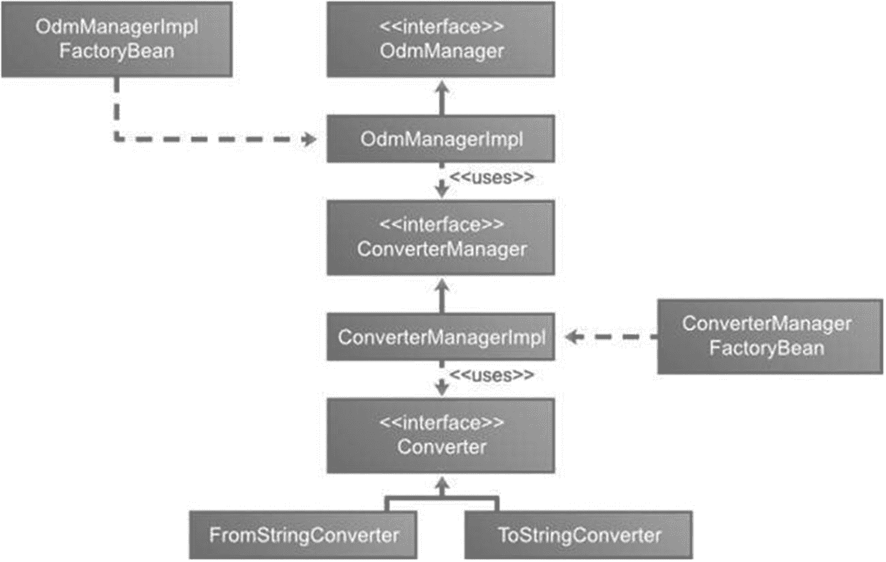

# 8. 对象-目录映射

企业 Java 开发者使用面向对象（OO）技术来构建模块化、复杂的应用程序。在 OO 范式中，对象是系统的核心，代表现实世界中的实体。每个对象都有身份、状态和行为。对象可以通过继承或组合与其他对象相关联。另一方面，LDAP 目录以层次树结构表示数据和关系。这种差异导致了对象-目录范式的不匹配，可能在面向对象环境和目录环境之间造成通信问题。

Spring LDAP 提供了一个对象-目录映射（ODM）框架，该框架弥合了对象模型和目录模型之间的差距。ODM 框架允许我们在两个模型之间映射概念，并协调将 LDAP 目录条目自动转换为 Java 对象的过程。ODM 与连接对象和关系数据库世界的对象-关系映射（ORM）方法类似。诸如 Hibernate^(⁸⁰)和 TopLink^(⁸¹)等框架使 ORM 流行起来，并成为开发者工具集的重要组成部分。此外，像 Spring Data^(⁸²)这样的其他框架使用 Hibernate 在后台实现，并提供相同的功能来访问数据库。

尽管 Spring LDAP ODM 与 ORM 共享相同的概念，但它有以下不同之处：

*   默认情况下无法缓存 LDAP 条目，但可以使用 Caffeine、Guava 或 EhCache 等库来封装访问 LDAP 的逻辑。
*   ODM 元数据通过类级别的注解表达。
*   不支持 XML 配置。
*   无法实现条目的懒加载。
*   不支持如 HQL 之类的查询语言。对象的加载通过 DN 查找和标准 LDAP 搜索查询完成，或者可以使用 Spring LDAP 提供的方法编写查询。


## Spring ODM 基础

Spring LDAP ODM 作为独立模块从核心 LDAP 项目中分发。要将 Spring LDAP ODM^(⁸³)包含到项目中，需要在项目`pom.xml`文件中添加以下依赖项：

```
org.springframework.ldap
spring-ldap-odm
${org.springframework.ldap.version}

commons-logging
commons-logging

```

Spring LDAP ODM 通过`org.springframework.ldap.odm`包及其子包提供访问。

上述依赖项是执行任何操作并使用 ODM 优势所必需的，但在不同版本的 Spring LDAP 中，执行不同操作的方式从使用`OdmManager`类转变为使用`LdapTemplate`类。

注意

在 Spring LDAP 2.0.0 版本之前，操作是通过`OdmManager`类和一些注解来执行的，这些注解用于指示哪个属性代表 LDAP 上的属性。图 8-1 展示了在 Spring LDAP 2.0.0 之前使用的类结构。



LDAP ODM 核心类的框架结构。部分模块包括 odm manager impl factory bean、converter manager impl、接口 odm manager、converter manager 和 converter。

图 8-1

之前的 Spring LDAP ODM 核心类

LDAP ODM 的核心是`OdmManager`，它提供了通用的搜索和 CRUD 操作。它充当中介，将 LDAP 条目与 Java 对象之间进行数据转换。Java 对象通过注解提供转换元数据。在列表 8-1 中，你可以看到`OdmManager`的源代码及其所有方法。

```
package org.springframework.ldap.odm.core;
import java.util.List;
import javax.naming.Name;
import javax.naming.directory.SearchControls;
import org.springframework.ldap.query.LdapQuery;
public interface OdmManager {
T read(Class clazz, Name dn);
void create(Object entry);
void update(Object entry);
void delete(Object entry);
List findAll(Class clazz, Name base, SearchControls searchControls);
List search(Class clazz, Name base, String filter, SearchControls searchControls);
List search(Class clazz, LdapQuery query);
}
列表 8-1
OdmManager API
```

如列表 8-2 所示，某些方法接收一个对象；该对象代表我们的领域对象，如 Patron 或 Employee，但带有特定注解以提供 Spring 执行不同操作所需的元数据。

## ODM 元数据

`org.springframework.ldap.odm.annotations`包包含可用于将简单 Java POJO 转换为 ODM 可管理实体的注解。列表 8-3 展示了将转换为 ODM 实体的`Patron` Java 类。

```
package com.apress.book.ldap.domain;
import java.util.List;
import javax.naming.Name;
public class Patron {
private Name dn;
private String lastName;
private String firstName;
private String telephoneNumber;
private String fullName;
private String mail;
private List objectClasses;
private int employeeNumber;
//Setters and getters
@Override
public String toString() {
return "Dn: " + dn + ", firstName: " + firstName + ", fullName: " + fullName + ", Telephone Number: " + telephoneNumber;
}
}
列表 8-3
没有设置方法和获取方法的 Patron 实体
```

转换过程的第一步是使用`@Entry`注解类。这个标记注解告诉 ODM 该类是一个实体。它还提供了实体映射的`objectClass`定义。列表 8-4 展示了注解后的`Patron`类。

```
package com.apress.book.ldap.domain;
import java.util.List;
import javax.naming.Name;
import org.springframework.ldap.odm.annotations.Entry;
@Entry(objectClasses = { "inetorgperson", "organizationalperson", "person", "top" })
public class Patron {
// Fields and getters and setters
}
列表 8-4
声明实体类型的 Patron 实体
```

接下来需要添加的注解是`@org.springframework.ldap.odm.annotations.Id`。这个注解指定了条目的 DN，并且只能放置在继承自`javax.naming.Name`类的字段上。你将在`Patron`类中创建一个名为`dn`的新字段来解决这个问题。列表 8-5 展示了修改后的`Patron`类。

```
package com.apress.book.ldap.domain;
import java.util.List;
import javax.naming.Name;
import org.springframework.ldap.odm.annotations.Entry;
import org.springframework.ldap.odm.annotations.Id;
@Entry(objectClasses = { "inetorgperson", "organizationalperson", "person", "top" })
public class Patron {
@Id
private Name dn;
// Fields and getters and setters
}
列表 8-5
声明实体类型和 ID 的 Patron 实体
```

在 Java 持久化 API 中，`@Id`注解指定了实体 Bean 的`identifier`属性。此外，其放置位置决定了 JPA 提供者在映射时使用的默认访问策略。如果`@Id`放置在字段上，则使用字段访问；如果放置在获取方法上，则使用属性访问。然而，Spring LDAP ODM 仅允许字段访问。

`@Entry`和`@Id`是使`Patron`类成为 ODM 实体所需的唯一注解。默认情况下，`Patron`实体类中的所有字段都会自动变为可持久化字段。默认策略是在持久化或读取时使用实体字段名称作为 LDAP 属性名称。在`Patron`类中，这适用于`telephoneNumber`或`mail`等属性，因为字段名称与 LDAP 属性名称相同。然而，对于`firstName`和`fullName`等字段，由于其名称与 LDAP 属性名称不同，会导致问题。为了解决这个问题，ODM 提供了`@Attribute`注解，将实体字段映射到对象类字段。此注解允许你指定 LDAP 属性名称、可选的语法 OID 以及可选的类型声明。列表 8-6 展示了完全注解的`Patron`实体类。


```
package com.apress.book.ldap.domain;
import java.util.List;
import javax.naming.Name;
import org.springframework.ldap.odm.annotations.Attribute;
import org.springframework.ldap.odm.annotations.Entry;
import org.springframework.ldap.odm.annotations.Id;
@Entry(objectClasses = { "inetorgperson", "organizationalperson", "person", "top" })
public class Patron {
@Id
private Name dn;
@Attribute(name = "sn")
private String lastName;
@Attribute(name = "givenName")
private String firstName;
private String telephoneNumber;
@Attribute(name = "cn")
private String fullName;
private String mail;
@Attribute(name = "objectClass")
private List objectClasses;
@Attribute(name = "employeeNumber", syntax = "2.16.840.1.113730.3.1.3")
private int employeeNumber;
// 字段和 getter、setter 方法
@Override
public String toString() {
return "Dn: " + dn + ", firstName: " + firstName + ", fullName: " + fullName + ", 电话号码: " + telephoneNumber;
}
}
清单 8-6
带有属性及其注解的 Patron 实体
```

有时你可能不希望将实体类中的某些字段持久化。通常这些字段涉及计算得出的属性。此类字段可以使用`@Transient`注解进行标注，表示 ODM 应忽略该字段。

## ODM 服务类

基于 Spring 的企业应用程序通常包含一个服务层，用于存放应用程序的业务逻辑。服务层中的类会将持久化细节委托给 DAO 或仓库层。在第 5 章中，你使用`LdapTemplate`实现了一个 DAO。清单 8-7 展示了你将要实现的服务类接口。

```
package com.apress.book.ldap.service;
import com.apress.book.ldap.domain.Patron;
public interface PatronService {
void create(Patron patron);
void delete(String id);
void update(Patron patron);
Patron find(String id);
}
清单 8-7
Patron 服务接口
```

服务类的实现位于清单 8-8 中。在实现中，你注入一个`LdapTemplate`实例。`create`和`update`方法的实现简单地将调用委托给`LdapTemplate`。`find`方法将传入的`id`参数转换为完全限定的 DN，并委托给`LdapTemplate`的`findByDn`方法。最后，`delete`方法使用`find`方法读取 patron，并通过`LdapTemplate`的`delete`方法删除它。

```
package com.apress.book.ldap.service;
import org.springframework.beans.factory.annotation.Autowired;
import org.springframework.beans.factory.annotation.Qualifier;
import org.springframework.ldap.core.DistinguishedName;
import org.springframework.ldap.core.LdapTemplate;
import org.springframework.stereotype.Service;
import com.apress.book.ldap.domain.Patron;
@Service("patronService")
public class PatronServiceImpl implements PatronService {
private static final String PATRON_BASE  = "ou=patrons,dc=inflinx,dc=com";
private LdapTemplate ldapTemplate;
public PatronServiceImpl(@Autowired @Qualifier("ldapTemplate") LdapTemplate ldapTemplate) {
this.ldapTemplate = ldapTemplate;
}
@Override
public void create(Patron patron) {
ldapTemplate.create(patron);
}
@Override
public void update(Patron patron) {
ldapTemplate.update(patron);
}
@Override
public Patron find(String id) {
DistinguishedName dn = new DistinguishedName(PATRON_BASE);
dn.add("uid", id);
return ldapTemplate.findByDn(dn, Patron.class);
}
@Override
public void delete(String id) {
ldapTemplate.delete(find(id));
}
}
清单 8-8
Patron 服务实现
```

验证`PatronService`实现的 JUnit 测试如清单 8-9 所示。

```
package com.apress.book.ldap.service;
import org.junit.jupiter.api.DisplayName;
import org.junit.jupiter.api.Test;
import org.junit.jupiter.api.extension.ExtendWith;
import org.springframework.beans.factory.annotation.Autowired;
import org.springframework.ldap.NameNotFoundException;
import org.springframework.ldap.core.DistinguishedName;
import org.springframework.test.context.ContextConfiguration;
import com.apress.book.ldap.domain.Patron;
import org.springframework.test.context.junit.jupiter.SpringExtension;
import static org.junit.jupiter.api.Assertions.*;
@ExtendWith(SpringExtension.class)
@ContextConfiguration("classpath:repositoryContext-test.xml")
class PatronServiceImplTest {
@Autowired
private PatronService patronService;
@Test
@DisplayName("检查添加操作是否在 LDAP 上创建新条目")
void should_create_a_patron() {
Patron patron = new Patron();
patron.setDn(new DistinguishedName("uid=patron10001,ou=patrons,dc=inflinx,dc=com"));
patron.setFirstName("Patron");
patron.setLastName("Test 1");
patron.setFullName("Patron Test 1");
patron.setMail("balaji@inflinx.com");
patron.setEmployeeNumber(1234);
patron.setTelephoneNumber("8018640759");
patronService.create(patron);
// 让我们读取 patron
Patron result = patronService.find("patron10001");
assertAll(
() -> assertNotNull(result),
() -> assertEquals(patron.getDn().toString(), result.getDn().toString())
);
}
@Test
void should_find_a_patron() {
Patron result = patronService.find("patron100");
assertAll(
() -> assertNotNull(result),
() -> assertEquals("uid=patron100,ou=patrons,dc=inflinx,dc=com", result.getDn().toString())
);
}
@Test
@DisplayName("检查搜索操作是否返回 patron")
void should_delete_a_patron() {
patronService.delete("patron92");
assertThrows(NameNotFoundException.class, ()-> patronService.find("patron92"));
}
@Test
@DisplayName("检查更新操作是否能修改 LDAP 上的条目")
void should_update_a_patron() {
Patron patron = patronService.find("patron1");
assertNotNull(patron);
patron.setTelephoneNumber("8018640850");
patronService.update(patron);
patron = patronService.find("patron1");
assertEquals(patron.getTelephoneNumber(), "8018640850");
}
@Test
@DisplayName("检查删除操作是否有效")
void should_delete_a_patron() {
patronService.delete("patron92");
assertThrows(NameNotFoundException.class, () -> patronService.find("patron92"));
}
}
清单 8-9
服务的 JUnit 测试
```

位于**src/test/resources**文件夹中的`repositoryContext-test.xml`文件包含你见过的配置片段。清单 8-10 给出了 XML 文件的完整内容。

```

清单 8-10
测试配置
```


## 创建自定义转换器

考虑这样一个场景：你的`Patron`类使用自定义的`PhoneNumber`类来存储借阅者的电话号码。现在，当需要持久化`Patron`类时，你需要将`PhoneNumber`类转换为 String 类型。同样，当你从 LDAP 读取`Patron`类时，电话属性中的数据需要转换为`PhoneNumber`类。默认的`ToStringConverter`和`FromStringConverter`对于这种转换将不再适用。列表 8-11 展示了新的`PhoneNumber`类，该类包含以不同格式表示电话号码的属性。

```
package com.apress.book.ldap.custom;
public class PhoneNumber {
private int areaCode;
private int exchange;
private int extension;
public PhoneNumber(int areaCode, int exchange, int extension) {
this.areaCode = areaCode;
this.exchange = exchange;
this.extension = extension;
}
// 设置器和获取器
public boolean equals(Object obj) {
if(obj == null || obj.getClass() != this.getClass()) { return false; }
PhoneNumber p = (PhoneNumber) obj;
return (this.areaCode ==  p.areaCode) && (this.exchange == p.exchange) && (this.extension == p.extension);
}
public String toString() {
return String.format("+1 %03d %03d %04d", areaCode, exchange, extension);
}
// 满足 hashCode 协议
public int hashCode() {
int result = 17;
result = 37 * result + areaCode;
result = 37 * result + exchange;
result = 37 * result + extension;
return result;
}
}
列表 8-11
包含所有属性的 PhoneNumber 类
```

现在，让我们修改`Patron`类，如列表 8-12 所示。

```
package com.apress.book.ldap.custom;
import java.util.List;
import javax.naming.Name;
import org.springframework.ldap.odm.annotations.Attribute;
import org.springframework.ldap.odm.annotations.Entry;
import org.springframework.ldap.odm.annotations.Id;
@Entry(objectClasses = { "inetorgperson", "organizationalperson", "person", "top" })
public class Patron {
@Id
private Name dn;
@Attribute(name = "sn")
private String lastName;
@Attribute(name = "givenName")
private String firstName;
@Attribute(name = "telephoneNumber")
private PhoneNumber phoneNumber;
@Attribute(name = "cn")
private String fullName;
private String mail;
@Attribute(name = "objectClass")
private List objectClasses;
@Attribute(name = "employeeNumber", syntax = "2.16.840.1.113730.3.1.3")
private int employeeNumber;
// 字段和设置器、获取器
@Override
public String toString() {
return "Dn: " + dn + ", firstName: " + firstName + ", fullName: " + fullName + ", 电话号码: " + phoneNumber;
}
}
列表 8-12
包含电话号码修改的 Patron 实体
```

为了将`PhoneNumber`转换为`String`，你需要创建一个新的`FromPhoneNumberConverter`转换器。列表 8-13 展示了其实现。实现过程非常简单，只需调用`toString`方法完成转换。

```
package com.apress.book.ldap.converter;
import com.apress.book.ldap.custom.PhoneNumber;
import org.springframework.ldap.odm.typeconversion.impl.Converter;
public class FromPhoneNumberConverter implements Converter  {
@Override
public  T convert(Object source, Class toClass) throws Exception {
T result = null;
if(PhoneNumber.class.isAssignableFrom(source.getClass()) && toClass.equals(String.class)) {
result = toClass.cast(source.toString());
}
return result;
}
}
列表 8-13
从 PhoneNumber 对象到 String 的转换器
```

接下来，你需要实现一个转换器，将 LDAP 字符串属性转换为 Java`PhoneNumber`类型。为此，你需要在同一包中创建`ToPhoneNumberConverter`，如列表 8-14 所示。

```
package com.apress.book.ldap.converter;
import com.apress.book.ldap.custom.PhoneNumber;
import org.springframework.ldap.odm.typeconversion.impl.Converter;
public class ToPhoneNumberConverter implements Converter {
@Override
public  T convert(Object source, Class toClass) throws Exception {
T result = null;
if (String.class.isAssignableFrom(source.getClass()) && toClass == PhoneNumber.class) {
// 简单的实现
String[] tokens = ((String)source).split(" ");
int i = 0;
if(tokens.length == 4) {
i = 1;
}
result = toClass.cast(new PhoneNumber(Integer.parseInt(tokens[i]), Integer.parseInt(tokens[i+1]), Integer.parseInt(tokens[i+2])));
}
return result;
}
}
列表 8-14
从 String 到 PhoneNumber 的转换器
```

由于`LDAPTemplate`取代了`OdmManager`，许多内容发生了变化，因此要使用这些转换器，一种替代方案是创建`ConverterManager`的新实现以简化配置过程。列表 8-15 展示了`DefaultConverterManagerImpl`类。如你所见，它内部使用了`ConverterManagerImpl`类。

```
package com.apress.book.ldap.converter;
import com.apress.book.ldap.custom.PhoneNumber;
import org.springframework.ldap.odm.typeconversion.ConverterManager;
import org.springframework.ldap.odm.typeconversion.impl.Converter;
import org.springframework.ldap.odm.typeconversion.impl.ConverterManagerImpl;
import org.springframework.ldap.odm.typeconversion.impl.converters.FromStringConverter;
import org.springframework.ldap.odm.typeconversion.impl.converters.ToStringConverter;
public class DefaultConverterManagerImpl implements ConverterManager {
private static final Class[] classSet = {
java.lang.Byte.class,
java.lang.Integer.class,
java.lang.Long.class,
java.lang.Double.class,
java.lang.Boolean.class};
private ConverterManagerImpl converterManager;
public DefaultConverterManagerImpl() {
converterManager = new ConverterManagerImpl();
Converter fromStringConverter = new FromStringConverter();
Converter toStringConverter = new ToStringConverter();
for(Class clazz : classSet) {
converterManager.addConverter(String.class, null, clazz, fromStringConverter);
converterManager.addConverter(clazz, null, String.class, toStringConverter);
}
Converter toPhoneNumberConverter = new ToPhoneNumberConverter();
converterManager.addConverter(String.class, null, PhoneNumber.class, toPhoneNumberConverter);
Converter fromPhoneNumberConverter = new FromPhoneNumberConverter();
converterManager.addConverter(PhoneNumber.class, null, String.class, fromPhoneNumberConverter);
}
@Override
public boolean canConvert(Class fromClass, String syntax, Class toClass) {
return converterManager.canConvert(fromClass, syntax, toClass);
}
@Override
public  T convert(Object source, String syntax, Class toClass) {
return converterManager.convert(source,syntax,toClass);
}
}
列表 8-15
新的转换器管理器
```

最后，在配置中整合所有内容，创建一个名为`repositoryContext-test-converter.xml`的新文件，位于**src/test/resources**目录下，如列表 8-16 所示。

```

列表 8-16
转换器管理器配置
```

如列表 8-16 所示，你使用新的转换器管理器替代原始实现，并在`LdapTemplate`的配置中添加相关设置。

修改后的测试用例用于验证新添加的转换器，如列表 8-17 所示。


```
package com.apress.book.ldap.custom;
import org.junit.jupiter.api.Test;
import org.junit.jupiter.api.extension.ExtendWith;
import org.springframework.beans.factory.annotation.Autowired;
import org.springframework.ldap.core.DistinguishedName;
import org.springframework.test.context.ContextConfiguration;
import org.springframework.test.context.junit.jupiter.SpringExtension;
import org.junit.jupiter.api.DisplayName;
import static org.junit.jupiter.api.Assertions.*;
@ExtendWith(SpringExtension.class)
@ContextConfiguration("classpath:repositoryContext-test-converter.xml")
@DisplayName("Patron Service Custom test cases")
class PatronServiceImplCustomTest {
@Autowired
private PatronService patronService;
@Test
@DisplayName("Check that operation add create a new entry on the LDAP")
void should_create_a_patron() {
Patron patron = new Patron();
patron.setDn(new DistinguishedName("uid=patron10001,ou=patrons,dc=inflinx,dc=com"));
patron.setFirstName("Patron");
patron.setLastName("Test 1");
patron.setFullName("Patron Test 1");
patron.setMail("balaji@inflinx.com");
patron.setEmployeeNumber(1234);
patron.setPhoneNumber(new PhoneNumber(801, 864, 8050));
patronService.create(patron);
// Lets read the patron
Patron result = patronService.find("patron10001");
assertAll(
() -> assertNotNull(result),
() -> assertEquals(patron.getDn().toString(), result.getDn().toString()),
() -> assertEquals(801, patron.getPhoneNumber().getAreaCode()),
() -> assertEquals(864, patron.getPhoneNumber().getExchange()),
() -> assertEquals(8050, patron.getPhoneNumber().getExtension())
);
}
@Test
@DisplayName("Check that operation search return a patron")
void should_find_a_patron() {
Patron result = patronService.find("patron100");
assertAll(
() -> assertNotNull(result),
() -> assertEquals("uid=patron100,ou=patrons,dc=inflinx,dc=com", result.getDn().toString()),
() -> assertEquals(232, result.getPhoneNumber().getAreaCode()),
() -> assertEquals(25, result.getPhoneNumber().getExchange()),
() -> assertEquals(4008, result.getPhoneNumber().getExtension())
);
}
@Test
@DisplayName("Check that operation update an entry on the LDAP")
void should_update_a_patron() {
Patron patron = patronService.find("patron1");
assertNotNull(patron);
patron.setPhoneNumber(new PhoneNumber(1, 2, 3));
patronService.update(patron);
Patron result = patronService.find("patron1");
assertAll(
() -> assertNotNull(result),
() -> assertEquals("uid=patron1,ou=patrons,dc=inflinx,dc=com", result.getDn().toString()),
() -> assertEquals(1, result.getPhoneNumber().getAreaCode()),
() -> assertEquals(2, result.getPhoneNumber().getExchange()),
() -> assertEquals(3, result.getPhoneNumber().getExtension())
);
}
}
```
清单 8-17  
用于检查转换器的测试用例

通过这些小的修改，您可以使用复杂对象来表示 LDAP 中的简单属性。

## 总结

Spring LDAP 的对象-目录映射（ODM）架起了对象模型与目录模型之间的桥梁。在本章中，您学习了 ODM 的基础知识，并查看了定义 ODM 映射的注解。随后，您深入探讨了 ODM 框架，并构建了一个 Patron 服务和自定义转换器。

到目前为止，您已经在本书中创建了多个服务和 DAO 实现的变体。在下一章中，您将探索 Spring LDAP 的事务支持。

脚注 1   2   3   4

