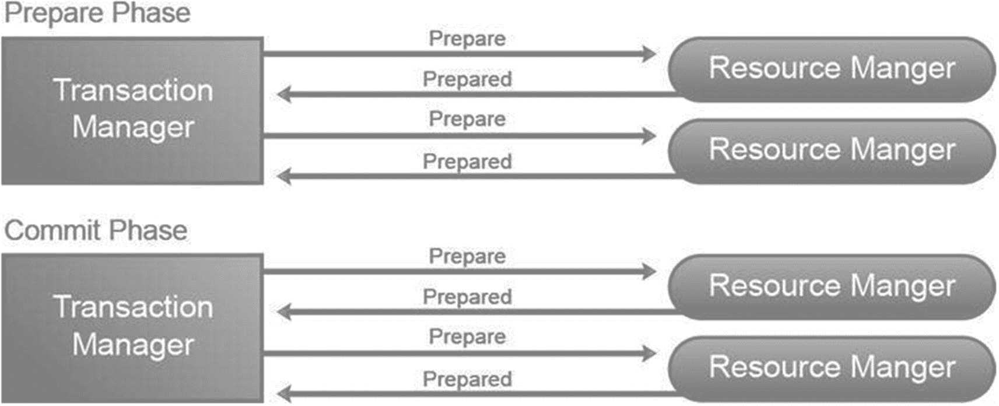
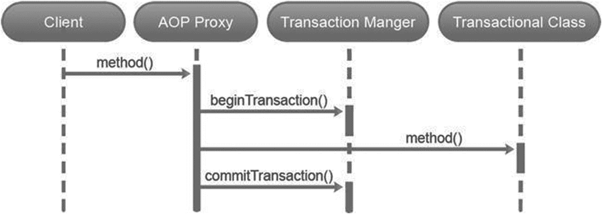
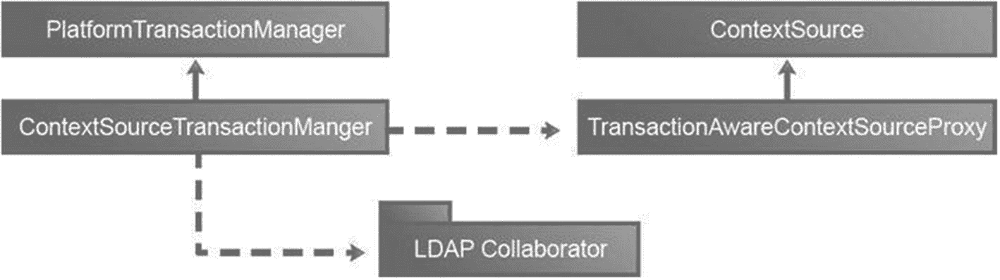

# 9. LDAP 事务

在本章中，您将学习

*   事务的基础知识

*   Spring 事务抽象

*   Spring LDAP 对事务的支持

## 事务基础

事务是企业应用程序的重要组成部分。简而言之，事务是一系列协同执行的操作。要完成或提交事务，必须确保其所有操作都成功。如果由于任何原因某个操作失败，整个事务将失败并回滚。在这种情况下，所有之前成功执行的操作都必须被撤销。这确保了事务结束后的状态与事务开始前的状态一致。

在您的日常生活中，您经常会遇到事务。考虑一个在线银行场景，您希望从储蓄账户向支票账户转账 300 美元。此操作涉及从储蓄账户扣除 300 美元，并向支票账户增加 300 美元。如果操作中的扣除部分成功而增加部分失败，您最终的账户总额将减少 300 美元。（理想情况下，我们都希望扣除操作失败而增加操作成功，但银行可能第二天会来敲您的门。）银行通过使用事务确保账户永远不会处于这种不一致的状态。

事务通常与以下四个众所周知的特性相关联，这些特性也被称为 ACID 属性：

表 9-1

隔离级别

| 隔离级别 | 描述 |
| --- | --- |
| `Read Uncommitted` | 此隔离级别允许正在运行的事务中的查询看到其他未提交事务所做的更改。即使该事务尚未完成，其更改也会对其他事务可见。这是最低级别的隔离，可以更恰当地视为缺乏隔离。由于它违反了 ACID 属性之一，大多数数据库供应商不支持它。 |
| `Read Committed` | 此隔离级别允许正在运行的事务中的查询仅看到查询开始前已提交的数据。然而，在查询执行期间，所有未提交的更改或并发事务提交的更改都不会被看到。这是大多数数据库（包括 Oracle、MySQL 和 PostgreSQL）的默认隔离级别。 |
| `Repeatable Read` | 此隔离级别允许正在运行的事务中的查询每次执行时都读取相同的数据。为实现这一点，事务会在检查所有行（不仅仅是获取的行）时获取锁，直到事务完成。 |
| `Serializable` | 这是所有隔离级别中最严格且成本最高的。交错事务会被排队，以便按顺序执行而不是并发执行。在该隔离级别下，查询只会看到事务开始前已提交的数据，绝不会看到其他事务的未提交更改或提交操作。 |

*   *原子性*：此属性确保事务要么完全执行，要么完全不执行。因此，在我们之前的示例中，我们要么成功转账，要么转账失败。这种全有或全无的特性也被称为单个或逻辑工作单元。

*   *一致性*：此属性确保事务完成后系统处于一致状态。例如，数据库系统会满足所有完整性约束，如主键或参照完整性。


*   **隔离性**：这一特性确保事务独立于其他并行事务执行。未完成的事务的更改或副作用永远不会被其他事务看到。在资金转账场景中，其他账户所有者只能看到转账前或转账后的余额。只有当事务执行时间较长时，才会看到中间余额。许多数据库系统会放宽这一特性，提供多个隔离级别。表 9-1 列出了主要的事务级别及其描述。随着隔离级别提高，事务并发性降低，事务一致性提高。

*   **持久性**：这一特性确保已提交事务的结果不会因故障而丢失。以银行转账场景为例，当您收到转账成功的确认后，持久性特性确保该更改成为永久性的。

## 本地事务与全局事务

事务通常根据参与的资源数量被分类为本地事务或全局事务。这些资源示例包括数据库系统或 JMS 队列。资源管理器（如 JDBC 驱动程序）通常用于管理资源。

本地事务涉及单一资源。最常见的例子是与单一数据库关联的事务。这些事务通常通过用于访问资源的对象进行管理。在 JDBC 数据库事务中，使用`java.sql.Connection`接口的实现来访问数据库。这些实现还提供了`commit`和`rollback`方法用于管理事务。在 JMS 队列的情况下，`javax.jms.Session`实例提供了控制事务的方法。

全局事务则处理多个资源。例如，一个全局事务可以在同一事务中从 JMS 队列读取消息并写入数据库记录。

全局事务使用外部的事务管理器进行管理。它负责与资源管理器通信，并对分布式事务做出最终的提交或回滚决策。在 Java/JEE 中，全局事务通过 Java 事务 API（JTA）实现。JTA 为事务管理器和参与事务的组件提供了标准接口。

事务管理器采用“两阶段提交”协议来协调全局事务。正如其名所示，两阶段提交协议包含两个阶段：

*   **准备阶段**：在此阶段，所有参与的资源管理器会被询问是否准备好提交其工作。收到请求后，资源管理器尝试记录其状态。如果成功，资源管理器会返回肯定响应；如果无法提交，则返回否定响应并撤销本地更改。

*   **提交阶段**：如果事务管理器收到所有肯定响应，它将提交事务并通知所有提交参与者。如果收到一个或多个否定响应，它将回滚整个事务并通知所有参与者。

两阶段提交协议如图 9-1 所示。



2 个请求-响应图。准备阶段和提交阶段各包含一个事务管理器和 2 个资源管理器。事务管理器向每个资源管理器发送准备请求，资源管理器将准备响应返回给事务管理器。

图 9-1

两阶段提交协议

## 编程式与声明式事务

在为应用程序添加事务功能时，开发者有两种选择。

## 编程式

在此场景中，事务管理代码（用于启动、提交或回滚事务）包围业务代码。这可以提供极大的灵活性，但也可能使维护变得困难。以下代码示例展示了使用 JTA 和 EJB 3.0 的编程式事务：

```
@Stateless
@TransactionManagement(TransactionManagementType.BEAN)
public class OrderManager {
@Resource
private UserTransaction transaction;
public void create(Order order) {
try {
transaction.begin();
// 处理订单的业务逻辑
verifyAddress(order);
processOrder(order);
sendConfirmation(order);
transaction.commit();
} catch(Exception ex) {
transaction.rollback();
}
}
}
```

## 声明式

在此场景中，容器负责启动、提交或回滚事务。开发者通常通过注解或 XML 指定事务行为。此模型清晰地将事务管理代码与业务逻辑分离。以下代码示例展示了使用 JTA 和 EJB 3.0 的声明式事务。当订单处理过程中发生异常时，会调用会话上下文的`setRollbackOnly`方法；这标记了事务必须回滚。

```
@Stateless
@TransactionManagement(TransactionManagementType.CONTAINER)
public class OrderManager {
@Resource
private SessionContext context;
@TransactionAttribute(TransactionAttributeType.REQUIRED)
public void create(Order order) {
try {
// 处理订单的业务逻辑
verifyAddress(order);
processOrder(order);
sendConfirmation(order);
} catch(Exception ex) {
context.setRollbackOnly();
}
}
}
```


## Spring 事务抽象

Spring 框架为处理全局和本地事务提供了统一的编程模型。事务抽象隐藏了不同事务 API（如 JTA、JDBC、JMS 和 JPA）的内部实现细节。它允许开发者以环境无关的方式编写支持事务的代码。在后台，Spring 仅将事务管理委托给底层的事务提供者。无需使用 EJB 即可支持编程式和声明式事务管理模型，通常推荐使用声明式方法，本书也将采用这种方法。

Spring 事务管理的核心是 `PlatformTransactionManager` 抽象。它以技术无关的方式暴露了事务管理的关键方面。该接口负责创建和管理事务，是声明式和编程式事务的必需组件。该接口有多种现成实现，例如 `JtaTransactionManager`^(⁸⁴)、`DataSourceTransactionManager`^(⁸⁵)、`JdbcTransactionManager`^(⁸⁶) 和 `JmsTransactionManager`^(⁸⁷)。`PlatformTransactionManager`^(⁸⁸) API 如清单 9-1 所示。

```
public interface PlatformTransactionManager extends TransactionManager {
TransactionStatus getTransaction(@Nullable TransactionDefinition definition) throws TransactionException;
void commit(TransactionStatus status) throws TransactionException;
void rollback(TransactionStatus status) throws TransactionException;
}
清单 9-1
PlatformTransactionManager 的源代码
```

`PlatformTransactionManager` 中的 `getTransaction` 方法用于获取现有事务。如果未找到活动事务，该方法可能会根据 `TransactionDefinition` 实例中指定的事务属性创建新事务。`TransactionDefinition` 接口抽象了以下属性列表：

*   *只读*：此属性表示该事务是否为只读事务。

*   *超时*：此属性规定事务必须完成的时间。如果事务在指定时间内未完成，将自动回滚。

*   *隔离级别*：此属性控制事务之间的隔离程度。可能的隔离级别在表 9-1 中讨论。

*   *传播行为*：考虑一个场景，当存在活动事务时，Spring 遇到需要在事务中执行的代码。一种选择是继续使用现有事务执行代码，另一种选择是挂起现有事务并启动新事务执行代码。传播属性可用于定义此类事务行为。`Propagation`^(⁸⁹) 枚举中包含的可能值有 `PROPAGATION_REQUIRED`、`PROPAGATION_REQUIRES_NEW`、`PROPAGATION_SUPPORTS` 等。

`getTransaction` 方法返回一个 `TransactionStatus` 实例，表示当前事务的状态。应用程序代码可以使用此接口检查该事务是否为新事务或是否已完成。该接口还可用于请求程序回滚事务。`PlatformTransactionManager` 中的另外两个方法 `commit` 和 `rollback`，如其名称所示，可用于提交或回滚事务。

## 使用 Spring 的声明式事务

Spring 提供了两种方式将事务行为声明式地添加到应用程序中：纯 XML 和注解。注解方法非常流行，且大大简化了配置。为了演示声明式事务，考虑一个简单的场景：向数据库中的 `Person` 表插入新记录。清单 9-2 展示了实现此场景的 `PersonRepositoryImpl` 类及其 `create` 方法。

```
import org.springframework.jdbc.core.JdbcTemplate;
import org.springframework.stereotype.Repository;
@Repository
public class PersonRepositoryImpl implements PersonRepository {
private JdbcTemplate jdbcTemplate;
@Override
public void create(String firstName, String lastName) {
String sql = "INSERT INTO PERSON (FIRST_NAME, " + "LAST_NAME) VALUES (?, ?)";
jdbcTemplate.update(sql, new Object[]{firstName, lastName});
}
}
清单 9-2
插入一行的示例源代码
```

清单 9-3 展示了前一个类实现的 `PersonRepository` 接口。

```
public interface PersonRepository {
void create(String firstName, String lastName);
}
清单 9-3
仓库示例
```

下一步是使 `create` 方法具备事务性。这通过在方法上添加 `@Transactional` 注解实现，如清单 9-4 所示。（注意：我是在实现类的方法上添加注解，而非接口方法。）

```
import org.springframework.transaction.annotation.Transactional;
import org.springframework.stereotype.Repository;
@Repository
public class PersonRepositoryImpl implements PersonRepository {
...........
@Transactional
public void create(String firstName, String lastName) {
...........
}
}
清单 9-4
事务示例
```

`@Transactional` 注解包含多个属性，可用于指定额外信息，如传播行为和隔离级别。清单 9-5 展示了使用默认隔离级别和 `REQUIRES_NEW` 传播行为的方法。

```
@Transactional(propagation=Propagation.REQUIRES_NEW, isolation=Isolation.DEFAULT)
public void create(String firstName, String lastName) {
// 方法逻辑
}
清单 9-5
使用默认传播行为的方法示例
```

下一步是为 Spring 指定事务管理器。由于您只使用单个数据库，清单 9-6 中的 `org.springframework.jdbc.datasource.DataSourceTransactionManager` 是理想选择。从清单 9-6 可以看出，`DataSourceTransactionManager` 需要一个数据源来获取和管理数据库连接。

```
清单 9-6
事务数据源的示例配置
```

声明式事务管理的完整应用程序上下文配置文件如清单 9-7 所示。

```
清单 9-7
所有配置的示例
```

`<tx:annotation-driven/>` 标签表示您正在使用基于注解的事务管理。该标签与 `<aop:aspectj-autoproxy />` 一起指示 Spring 使用面向切面编程（AOP）并创建代理，这些代理代表注解类管理事务。因此，当调用事务性方法时，代理会拦截调用并使用事务管理器获取事务（新或现有）。然后调用该方法，如果方法成功完成，代理将通过事务管理器提交事务；如果方法失败并抛出异常，事务将被回滚。基于 AOP 的事务处理如图 9-2 所示。



请求-响应图示。客户端将方法发送给 AOP 代理。AOP 代理将开始事务的指令发送给事务管理器，随后将方法发送给事务类，并在最后将提交事务的指令发送给事务管理器。

图 9-2

基于 AOP 的 Spring 事务

注释

关于事务的解释旨在让读者理解核心概念以及哪些操作隐含事务行为。


## LDAP 事务支持

LDAP 协议要求所有 LDAP 操作（修改或删除）必须遵循 ACID 属性。这种事务性行为确保了 LDAP 服务器中存储的信息的一致性。然而，LDAP 并未定义跨多个操作的事务。考虑这样一个场景：你希望将两个 LDAP 条目作为一个原子操作添加。完成该操作意味着两个条目都会被添加到 LDAP 服务器中。如果发生故障且其中一个条目无法添加，则服务器会自动撤销另一个条目的添加。这种事务性行为并不属于 LDAP 规范的一部分，也不在 LDAP 的实际实现中存在。此外，缺乏事务语义（如提交和回滚）使得无法在多个 LDAP 服务器之间保证数据一致性。

尽管事务性功能未被包含在 LDAP 规范中，但像 IBM Tivoli Directory Server 和 ApacheDS 这样的服务器提供了事务支持。IBM Tivoli Directory Server 支持的"开始事务"（OID 1.3.18.0.2.12.5）和"结束事务"（OID 1.3.18.0.2.12.6）扩展控制可以限制事务内的操作集合。RFC 5805^(⁹⁰)试图标准化 LDAP 中的事务功能，目前仍处于实验阶段。

注意

在 LDAP 的模式、控制和扩展操作中，常用元素使用 OID 或对象标识符。

## Spring LDAP 事务支持

LDAP 中缺乏事务性功能可能起初显得令人意外。更重要的是，这可能会阻碍企业广泛采用目录服务器。为了解决这个问题，Spring LDAP 提供了非 LDAP/JNDI 特定的补偿事务支持。这种事务支持紧密集成于你之前章节中看到的 Spring 事务管理基础设施。图 9-3 展示了负责 Spring LDAP 事务支持的组件。



流程图。上下文源事务管理器连接到平台事务管理器、事务感知上下文源代理以及 LDAP 协作方。事务感知上下文源代理连接到上下文源。

图 9-3

Spring LDAP 事务支持

`ContextSourceTransactionManager`类实现了`PlatformTransactionManager`接口并管理基于 LDAP 的事务。该类及其协作方会跟踪事务中执行的 LDAP 操作，并在每个操作前记录状态。如果事务需要回滚，事务管理器将采取措施恢复原始状态。事务管理器通过使用`TransactionAwareContextSourceProxy`实现此行为，而不是直接操作`LdapContextSource`。这个代理类还确保在整个事务过程中使用单一的`javax.naming.directory.DirContext`实例，并且该实例不会在事务完成前关闭。

## 补偿事务

补偿事务会撤销先前已提交事务的效果，并将系统恢复到之前的稳定状态。考虑一个涉及预订机票的事务场景，该场景中的补偿事务就是取消预订的操作。在 LDAP 中，如果一个操作添加了新的 LDAP 条目，对应的补偿事务仅仅是删除该条目。

补偿事务对于没有标准事务支持的资源（如 LDAP 和 Web 服务）非常有用。但需要记住的是，补偿事务只是一种模拟，永远无法替代真正的事务。因此，如果在补偿事务完成前服务器崩溃或与 LDAP 服务器的连接丢失，你将面临数据不一致的问题。此外，由于事务已经提交，并发事务可能会看到无效数据。补偿事务还会导致额外的开销，因为客户端需要处理额外的撤销操作。

大多数你可以在事务中执行的操作，回滚过程可能相对简单，但在某些情况下则意味着复杂的处理流程。让我们通过表 9-2 了解每个操作的具体含义。

表 9-2

操作与回滚过程

| 操作 | 描述 | 回滚 |
| --- | --- | --- |
| `bind` | 该操作意味着使用 DN 创建记录。 | 使用 DN 解除绑定的条目。 |
| `rename` | 该操作意味着更改条目名称。 | 将名称恢复为之前的状态。 |
| `unbind` | 该操作意味着使用 DN 创建记录并生成临时 DN。 | 在临时位置使用条目重命名并恢复到之前的状态。 |
| `rebind` | 使用 DN 创建记录并添加新属性；这意味着计算新的 DN。 | 在临时位置使用条目重命名并恢复到之前的状态。 |
| `modifyAttributes` | 该操作会修改记录的某些属性。 | 检查需要撤销的属性变更。 |

如你从上表中看到，大多数操作都意味着创建包含先前信息的临时记录，因此在发生异常时，LDAP 会将记录重命名为之前的名称。你会感觉这一切就像数据库事务一样运作。

在理解 Spring LDAP 事务时，需要考虑重命名策略，这决定了 Spring LDAP 如何定义移动到临时位置的先前记录的名称。截至本书版本，仅有两种不同的策略：

*   *DefaultTempEntryRenamingStrategy*：这是最简单的策略，因为它意味着在每个记录的 DN 上添加后缀。你可以为每个值指定特定的*temporal-suffix*。在以下代码块中，你会看到***transaction-manager***的配置示例：

*   *DifferentSubtreeTempEntryRenamingStrategy*：在这个策略中，临时记录会在 DN 上附加一部分。例如，如果你有一个记录*cn=Doe, ou=Patrons*，临时信息会存在于*cn=Doe, ou=tempEntries*。在以下代码块中，你会看到***transaction-manager***的配置示例：

为了更好地理解 Spring LDAP 事务，让我们创建一个具有事务行为的 Patron 服务。清单 9-8 展示了`PatronService`接口，其中仅包含一个`create`方法。

```
package com.apress.book.ldap.transactions;
import java.util.List;
import com.apress.book.ldap.domain.Patron;
public interface PatronService {
void create(Patron patron);
}
清单 9-8
用于创建 Patron 的服务接口
```

清单 9-9 展示了该服务接口的实现。`create`方法的实现简单地将调用委托给 DAO 层。


```
package com.apress.book.ldap.transactions;
import java.util.List;
import com.apress.book.ldap.domain.Patron;
import com.apress.book.ldap.repository.PatronDao;
import org.slf4j.Logger;
import org.slf4j.LoggerFactory;
import org.springframework.beans.factory.annotation.Autowired;
import org.springframework.beans.factory.annotation.Qualifier;
import org.springframework.stereotype.Service;
import org.springframework.transaction.annotation.Transactional;
@Service("patronService")
@Transactional
public class PatronServiceImpl implements PatronService {
private static final Logger logger = LoggerFactory.getLogger(PatronServiceImpl.class);
private PatronDao patronDao;
public PatronServiceImpl(@Autowired @Qualifier("patronDao") PatronDao patronDao) {
this.patronDao = patronDao;
}
@Override
public void create(Patron patron) {
logger.info("Begining the transaction");
patronDao.create(patron);
logger.info("Ending the patron creation");
}
}
Listing 9-9
实现创建 Patron 的服务
```

请注意在类声明顶部使用的`@Transactional`注解。列表 9-10 展示了 Dao 的`PatronDao`接口。

```
package com.apress.book.ldap.repository;
import java.util.List;
import com.apress.book.ldap.domain.Patron;
public interface PatronDao {
void create(Patron patron);
}
Listing 9-10
创建 Patron 的 Dao 接口
```

列表 9-11 展示了`PatronDao`的实现。

```
package com.apress.book.ldap.repository;
import com.apress.book.ldap.domain.Patron;
import com.apress.book.ldap.mapper.PatronContextMapper;
import org.slf4j.Logger;
import org.slf4j.LoggerFactory;
import org.springframework.beans.factory.annotation.Autowired;
import org.springframework.beans.factory.annotation.Qualifier;
import org.springframework.ldap.core.DirContextAdapter;
import org.springframework.ldap.core.DirContextOperations;
import org.springframework.ldap.core.DistinguishedName;
import org.springframework.ldap.core.LdapTemplate;
import org.springframework.ldap.filter.EqualsFilter;
import org.springframework.stereotype.Repository;
import org.springframework.transaction.annotation.Transactional;
@Repository("patronDao")
@Transactional
public class PatronDaoImpl implements PatronDao {
private static final Logger logger = LoggerFactory.getLogger(PatronDaoImpl.class);
private static final String PATRON_BASE = "ou=patrons,dc=inflinx,dc=com";
private LdapTemplate ldapTemplate;
public PatronDaoImpl(@Autowired @Qualifier("ldapTemplate") LdapTemplate ldapTemplate) {
this.ldapTemplate = ldapTemplate;
}
@Override
public void create(Patron patron) {
logger.info("Inside the create method ...");
DistinguishedName dn = new DistinguishedName(PATRON_BASE);
dn.add("uid", patron.getUid());
DirContextAdapter context = new DirContextAdapter(dn);
context.setAttributeValues("objectClass",
new String[] { "top", "uidObject", "person", "organizationalPerson", "inetOrgPerson" });
context.setAttributeValue("sn", patron.getLastName());
context.setAttributeValue("cn", patron.getFullName());
ldapTemplate.bind(context);
}
}
Listing 9-11
创建 Patron 的 Dao 实现
```

从这两个列表中可以看出，您按照第 5 章讨论的概念创建了 Patron DAO 及其实现。下一步是创建一个 Spring 配置文件，用于自动装配组件并包含事务语义。列表 9-12 给出了配置文件的内容，该文件位于***src/test/resources***目录下，名为`repositoryContext-test.xml`。在这里，您正在使用本地安装的 OpenDJ LDAP 服务器。

```

Listing 9-12
应用使用事务的所有配置
```

在此配置中，您首先定义一个新的`LdapContextSource`并为其提供 LDAP 信息。到目前为止，您使用`contextSource`作为该 bean 的 id，并将其注入到`LdapTemplate`中供使用。然而，在这个新配置中，您将其命名为`contextSourceTarget`。然后，您配置一个`TransactionAwareContextSourceProxy`实例，并将`contextSource` bean 注入其中。这个新配置的`TransactionAwareContextSourceProxy` bean 的 id 为`contextSource`，并被`LdapTemplate`使用。最后，您使用`ContextSourceTransactionManager`类配置事务管理器。如前所述，这种配置允许在单个事务中使用一个`DirContext`实例，从而实现事务提交/回滚。

在具备这些信息后，让我们验证在事务回滚时您的`create`方法和配置是否表现正确。为了模拟事务回滚，让我们修改`PatronServiceImpl`类的`create`方法以抛出`RuntimeException`，如所示：

```
@Override
public void create(Patron patron) {
logger.info("Begining the transaction");
patronDao.create(patron);
logger.info("Ending the patron creation");
throw new RuntimeException(); // 将回滚事务
}
```

验证预期行为的下一步是编写一个测试用例，调用`PatronServiceImpl`的`create`方法以创建新的`Patron`。该测试用例如列表 9-13 所示。`repositoryContext-test.xml`文件包含列表 9-12 中定义的 XML 配置。

```
package com.apress.book.ldap.transactions;
import com.apress.book.ldap.domain.Patron;
import org.junit.jupiter.api.DisplayName;
import org.junit.jupiter.api.Test;
import org.junit.jupiter.api.extension.ExtendWith;
import org.springframework.beans.factory.annotation.Autowired;
import org.springframework.transaction.IllegalTransactionStateException;
import org.springframework.test.context.ContextConfiguration;
import org.springframework.test.context.junit.jupiter.SpringExtension;
import static org.junit.jupiter.api.Assertions.*;
@ExtendWith(SpringExtension.class)
@ContextConfiguration("classpath:repositoryContext-test.xml")
@DisplayName("带有事务的 Patron 服务用例")
class PatronServiceImplTest {
@Autowired
private PatronService patronService;
@Test
@DisplayName("事务将在过程中中止")
void should_not_create_a_patron() {
Patron patron = new Patron();
patron.setUid("patron10001");
patron.setLastName("Patron10001");
patron.setFullName("Test Patron10001");
assertThrows(RuntimeException.class, () -> {
patronService.create(patron);
});
assertThrows( IllegalTransactionStateException.class, () -> {
patronService.find("patron10001");
});
}
}
Listing 9-13
验证 create 方法是否工作的测试用例
```

当您运行测试时，Spring LDAP 应该会创建一个新的 patron；事务回滚将删除新创建的 patron。Spring LDAP 的补偿事务内部运作可以在 OpenDJ 日志文件中看到。日志文件名为*access*，位于`OPENDJ_INSTALL\logs`文件夹中，但请注意，只有在使用真实 LDAP 服务器而非嵌入式服务器时才能看到该日志文件，嵌入式服务器仅在控制台显示应用程序日志。

列表 9-14 展示了此创建操作的日志文件部分内容。您会注意到，当调用`PatronDaoImpl`的`create`方法时，会向 OpenDJ 服务器发送一个“ADD REQ”命令以添加新的`Patron`条目。当 Spring LDAP 回滚事务时，会发送一个“DELETE REQ”命令以删除该条目。


```
[14/Sep/2023:15:03:09 -0300] 连接 conn=52 来自=127.0.0.1:54792 到=127.0.0.1:11389 协议=LDAP
[14/Sep/2023:15:03:09 -0300] 绑定请求 conn=52 操作=0 消息 ID=1 类型=SIMPLE dn="cn=Directory Manager"
[14/Sep/2023:15:03:09 -0300] 绑定响应 conn=52 操作=0 消息 ID=1 结果=0 认证 DN="cn=Directory Manager,cn=Root DNs,cn=config" etime=0
[14/Sep/2023:15:03:09 -0300]            添加请求            conn=52 操作=1 消息 ID=2 dn="uid=patron10001,ou=patrons,dc=inflinx,dc=com"
[14/Sep/2023:15:03:09 -0300] 添加响应 conn=52 操作=1 消息 ID=2 结果=0 etime=2
[14/Sep/2023:15:03:09 -0300]            删除请求            conn=52 操作=2 消息 ID=3 dn="uid=patron10001,ou=patrons,dc=inflinx,dc=com"
[14/Sep/2023:15:03:09 -0300] 删除响应 conn=52 操作=2 消息 ID=3 结果=0 etime=4
[14/Sep/2023:15:03:09 -0300] 解除绑定请求 conn=52 操作=3 消息 ID=4
[14/Sep/2023:15:03:09 -0300] 断开连接 conn=52 原因="客户端解除绑定""
清单 9-14
OpenDJ 的事务日志
```

```
15:10:30.570 [main] DEBUG o.s.l.t.c.m.ContextSourceTransactionManager - 创建名为[com.apress.book.ldap.transactions.PatronServiceImpl.create]的新事务: PROPAGATION_REQUIRED,ISOLATION_DEFAULT
15:10:30.571 [main] DEBUG o.s.l.c.s.AbstractContextSource - 在服务器'ldap://127.0.0.1:18880'上获取到 LDAP 上下文
15:10:30.571 [main] INFO  c.a.b.ldap.repository.PatronDaoImpl - 在创建方法内部...
15:10:30.572 [main] DEBUG o.s.l.t.c.LdapCompensatingTransactionOperationFactory - 记录绑定操作
15:10:30.572 [main] DEBUG o.s.l.t.c.BindOperationExecutor - 执行绑定操作
15:10:30.573 [main] DEBUG o.s.l.t.c.m.TransactionAwareDirContextInvocationHandler - 关闭上下文
15:10:30.573 [main] DEBUG o.s.l.t.c.m.TransactionAwareDirContextInvocationHandler - 保持事务上下文开启
15:10:30.574 [main] INFO  c.a.b.ldap.repository.PatronDaoImpl - 结束 Patron 创建
15:10:30.574 [main] DEBUG o.s.l.t.c.m.ContextSourceTransactionManager - 启动事务回滚
15:10:30.574 [main] DEBUG o.s.t.c.s.DefaultCompensatingTransactionOperationManager - 执行回滚
15:10:30.574 [main] DEBUG o.s.l.t.c.m.ContextSourceTransactionManagerDelegate - 关闭目标上下文
清单 9-15
应用程序的操作结果日志
```

此测试验证了 Spring LDAP 的补偿事务基础设施会在事务回滚时自动删除新添加的条目。

让我们继续实现`PatronServiceImpl`方法并验证其事务行为。清单 9-16 和 9-17 分别展示了添加到`PatronService`接口和`PatronServiceImpl`类中的`delete`方法。同样，`delete`方法的实际实现非常直接，只需调用`PatronDaoImpl`的`delete`方法即可。

```
package com.apress.book.ldap.transactions;
import java.util.List;
import com.apress.book.ldap.domain.Patron;
public interface PatronService {
void create(Patron patron);
void delete(String id);
}
清单 9-16
用于创建和删除 Patron 的服务接口
```

清单 9-17 展示了服务的实现。

```
// 注解和导入已省略
public class PatronServiceImpl implements PatronService {
// 创建方法已省略
@Override
public void delete(String id) {
patronDao.delete(id);
}
}
清单 9-17
用于删除 Patron 的服务实现
```

现在，让我们定义清单 9-18 中出现的`PatronDao`方法。

```
package com.apress.book.ldap.repository;
import java.util.List;
import com.apress.book.ldap.domain.Patron;
public interface PatronDao {
void create(Patron patron);
void delete(String id);
}
清单 9-18
用于创建 Patron 的 Dao 接口
```

清单 9-19 展示了`PatronDaoImpl`的`delete`方法实现。

```
package com.apress.book.ldap.repository;
import java.util.List;
import com.apress.book.ldap.domain.Patron;
// 注解和导入已省略
public class PatronDaoImpl implements PatronDao {
// 其他方法已省略
@Override
public void delete(String id) {
DistinguishedName dn = new DistinguishedName(PATRON_BASE);
dn.add("uid", id);
ldapTemplate.unbind(dn);
}
}
清单 9-19
用于创建 Patron 的 Dao 实现
```

有了这段代码，现在让我们编写一个在事务中调用你的`delete`方法的测试用例。清单 9-20 展示了该测试用例。"uid=patron98" 是你 OpenDJ 服务器上已有的条目，是在第 3 章通过 LDIF 导入创建的。

```
// 注解和导入已省略
class PatronServiceImplTest {
// 其他方法已省略
@Test
@DisplayName("事务将正常工作")
public void should_delete_a_patron() {
patronService.delete("patron98");
}
}
清单 9-20
测试以检查删除功能是否正常
```

当你运行此测试用例并在事务中调用`PatronServiceImpl`的`delete`方法时，Spring LDAP 的事务基础设施会将条目重命名为一个新计算的临时 DN。通过重命名，Spring LDAP 会将你的条目移动到 LDAP 服务器上的不同位置。在成功提交后，临时条目将通过“DELETE REQ”命令被删除。在回滚时，条目会被重命名，从而从临时位置移回原始位置。

清单 9-22 显示了应用程序控制台上的日志。


```
17:07:25.338 [main] DEBUG o.s.l.t.c.m.ContextSourceTransactionManager - 创建名为 [com.apress.book.ldap.transactions.PatronServiceImpl.delete] 的新事务：PROPAGATION_REQUIRED,ISOLATION_DEFAULT
17:07:25.339 [main] DEBUG o.s.l.c.s.AbstractContextSource - 在服务器 'ldap://127.0.0.1:18880' 上获取 LDAP 上下文
17:07:25.341 [main] DEBUG o.s.l.t.c.UnbindOperationExecutor - 执行解绑定操作 - 重命名为临时条目
17:07:25.343 [main] DEBUG o.s.l.t.c.m.TransactionAwareDirContextInvocationHandler - 关闭上下文
17:07:25.343 [main] DEBUG o.s.l.t.c.m.TransactionAwareDirContextInvocationHandler - 保持事务上下文打开
17:07:25.343 [main] DEBUG o.s.l.t.c.m.ContextSourceTransactionManager - 启动事务提交
17:07:25.343 [main] DEBUG o.s.t.c.s.DefaultCompensatingTransactionOperationManager - 执行提交
17:07:25.343 [main] DEBUG o.s.l.t.c.UnbindOperationExecutor - 提交解绑定操作 - 解绑定临时条目
17:07:25.343 [main] DEBUG o.s.t.c.s.AbstractCompensatingTransactionManagerDelegate - 清理存储的事务同步
17:07:25.343 [main] DEBUG o.s.l.t.c.m.ContextSourceTransactionManagerDelegate - 关闭目标上下文
清单 9-22
应用程序操作结果的日志
```

让我们模拟 `PatronServiceImpl` 类中 `delete` 方法的回滚操作，如清单 9-23 所示。

```
// 导入和注解已简化
public class PatronServiceImpl implements PatronService {
// 创建方法已简化
@Override
public void delete(String id) {
patronDao.delete(id);
throw new RuntimeException(); // 需要此代码来模拟回滚
}
}
清单 9-23
删除 Patron 的服务实现
```

让我们使用一个已知存在于 OpenDJ 服务器中的新 `Patron` ID 更新测试用例，如清单 9-24 所示。

```
// 注解和导入已简化
class PatronServiceImplTest {
// 已移除其他方法
@Test
void should_delete_a_patron() {
assertThrows(RuntimeException.class, () -> {
patronService.delete("patron96");
});
}
}
清单 9-24
验证删除功能的测试
```

当运行此代码时，预期行为是 Spring LDAP 会通过更改 DN 将 patron96 条目重命名为临时条目，然后在回滚时将其重命名为原始 DN。清单 9-25 显示了前述操作的 OpenDJ 的 *access* 日志。请注意，`delete` 操作首先通过发送第一个 MODIFYDN REQ 条目进行重命名，回滚时会发送第二个 "MODIFYDN REQ" 来将条目重命名为原始位置。

```
[14/Sep/2023:16:33:43 -0300] 连接 conn=55 来自=127.0.0.1:54829 到=127.0.0.1:11389 协议=LDAP
[14/Sep/2023:16:33:43 -0300] 绑定 REQ conn=55 操作=0 消息 ID=1 类型=SIMPLE dn="cn=Directory Manager"
[14/Sep/2023:16:33:43 -0300] 绑定 RES conn=55 操作=0 消息 ID=1 结果=0 认证 DN="cn=Directory Manager,cn=Root DNs,cn=config" etime=0
[14/Sep/2023:16:33:43 -0300]            修改 DN REQ            conn=55 操作=1 消息 ID=2 dn="uid=patron96,ou=patrons,dc=inflinx,dc=com" 新 RDN="uid=patron96_temp" 删除旧 RDN=true 新上级="ou=patrons,dc=inflinx,dc=com"
[14/Sep/2023:16:33:43 -0300] 修改 DN RES conn=55 操作=1 消息 ID=2 结果=0 etime=1
[14/Sep/2023:16:33:43 -0300]            修改 DN REQ            conn=55 操作=2 消息 ID=3 dn="uid=patron96_temp,ou=patrons,dc=inflinx,dc=com" 新 RDN="uid=patron96" 删除旧 RDN=true 新上级="ou=patrons,dc=inflinx,dc=com"
[14/Sep/2023:16:33:43 -0300] 修改 DN RES conn=55 操作=2 消息 ID=3 结果=0 etime=0
[14/Sep/2023:16:33:43 -0300] 解绑定 REQ conn=55 操作=3 消息 ID=4
[14/Sep/2023:16:33:43 -0300] 断开连接 conn=55 原因="客户端解绑定"
清单 9-25
带有事务的 OpenDJ 日志
```

```
17:19:17.284 [main] DEBUG o.s.l.t.c.m.ContextSourceTransactionManager - 创建名为 [com.apress.book.ldap.transactions.PatronServiceImpl.delete] 的新事务：PROPAGATION_REQUIRED,ISOLATION_DEFAULT
17:19:17.285 [main] DEBUG o.s.l.c.s.AbstractContextSource - 在服务器 'ldap://127.0.0.1:18880' 上获取 LDAP 上下文
17:19:17.286 [main] DEBUG o.s.l.t.c.UnbindOperationExecutor - 执行解绑定操作 - 重命名为临时条目
17:19:17.288 [main] DEBUG o.s.l.t.c.m.TransactionAwareDirContextInvocationHandler - 关闭上下文
17:19:17.288 [main] DEBUG o.s.l.t.c.m.TransactionAwareDirContextInvocationHandler - 保持事务上下文打开
17:19:17.288 [main] DEBUG o.s.l.t.c.m.ContextSourceTransactionManager - 启动事务回滚
17:19:17.288 [main] DEBUG o.s.t.c.s.DefaultCompensatingTransactionOperationManager - 执行回滚
17:19:17.289 [main] DEBUG o.s.t.c.s.AbstractCompensatingTransactionManagerDelegate - 清理存储的事务同步
17:19:17.289 [main] DEBUG o.s.l.t.c.m.ContextSourceTransactionManagerDelegate - 关闭目标上下文
清单 9-26
应用程序操作结果的日志
```

对于更新操作，正如你所猜测的，Spring LDAP 基础设施会计算对条目所做的修改的补偿 `ModificationItem` 列表。提交时无需任何操作，但回滚时会将计算出的补偿 `ModificationItem` 列表写回。

## 总结

在本章中，你探索了事务的基础知识，并查看了 Spring LDAP 的事务支持。Spring LDAP 在操作前会记录 LDAP 树的状态。如果发生回滚，Spring LDAP 会执行补偿操作以恢复之前的状态。请记住，这种补偿事务支持提供了原子性的假象，但并不能保证真正的原子性。

在下一章中，你将探索 Spring LDAP 的其他功能，例如连接池和 LDIF 文件解析。

脚注 1   2   3   4   5   6   7

