# 1. 什么是 Apache NetBeans

一项技术能够席卷全球并持续二十多年成为技术领域的重要部分，这种情况并不常见。然而，Java 语言正是少数这样的技术之一。Java 编程语言最初由 Sun Microsystems 于 1995 年开发，多年来已发展成为一个庞大的生态系统。Java 虚拟机（JVM）是一台由规范定义的虚拟计算机，Java 编程语言可用于编写在 JVM 上运行的应用程序。JVM 几乎可以安装到市面上任何计算机或硬件设备上。因此，JVM 已安装在全世界数百万台设备上，并且已有数十种不同的编程语言构建在 JVM 之上，这些语言编译成 Java 字节码，使开发者能够使用不同的语言语法在 JVM 上运行。这意味着什么？坦率地说，这意味着 JVM 和 Java 无处不在，人们可以使用多种语言编写几乎能在任何地方运行的应用程序。Java 是一个始于 1995 年的生态系统，并且将在未来长期存在。

作为最著名的开发平台之一的开发者，人们可以通过多种不同的方式开发应用程序。可以在文本编辑器中编写 Java 代码，通过终端使用 `java` 可执行文件编译并运行，然后继续工作。也可以完全通过终端创建文件和项目库，无需使用任何专门的开发工具。然而，尽管可以这样做，但如果没有代码编辑器或包含项目系统的“开发环境”，开发过程可能会变得繁琐，而 Apache NetBeans 正是 Java 平台上最流行的开发环境之一，它有助于简化开发。虽然 Apache NetBeans 是一个出色的开发工具，但它远不止是一个编辑器。Apache NetBeans 是一个全面的开发工具，支持多种语言；它是一个用于创建富客户端应用程序的开发平台；同时也是一个充满活力的开源社区，拥有来自全球的成员。

## Apache NetBeans 的发展历程

1996 年，在布拉格查尔斯大学数学与物理学院的指导下，一个学生项目启动了。该项目旨在让 Java 开发变得更加容易，为代码提供语法编辑器，帮助减少错误并加快编程时的开发速度。它允许用户只需点击几下按钮就能编译和构建整个项目。该项目最初名为 Xelfi，1997 年围绕该项目成立了一家公司，并将其更名为 NetBeans IDE。Sun Microsystems 非常喜欢这个项目，于 1999 年收购了它，并在一年后将 NetBeans IDE 开源。

Sun Microsystems 收购 Apache NetBeans 后，其用户群和社区开始蓬勃发展。由于 IDE 是开源的，当时主要由 Sun Microsystems 开发和维护的社区能够提供补丁、增强功能等。然而，NetBeans 的整体路线图和方向由商业实体控制。这未必是坏事，因为它有助于促进 IDE 和整个 Java 生态系统的发展，因为 NetBeans 同时面向初学者和经验丰富的 Java 开发者。

NetBeans 是 Oracle 于 2010 年 1 月从 Sun Microsystems 收购的投资组合的一部分。作为该投资组合的一部分，Oracle 努力推动 NetBeans 成为首个支持 Java SE 和 Java EE 最新特性的 IDE。Oracle 还致力于使 NetBeans 成为支持多种语言的 IDE；他们甚至聘请了 Python 和 Ruby 开发者来帮助促进这些语言在 JVM 上的对应版本，即 Jython 和 JRuby。作为该计划的一部分，NetBeans IDE 通过使用单独安装的 NetBeans 模块获得了对这些语言的支持。由于 NetBeans 是作为模块化 IDE 开发的，因此随着时间的推移，可以轻松添加功能，而不会增加核心 IDE 的占用空间。

Oracle 在推动 NetBeans 发展方面做得非常出色：它仍然是一个开源 IDE，社区也发挥了重要作用。然而，Oracle 仍然掌控着路线图，并且在 Oracle 的开源流程下，为 NetBeans 贡献代码并不十分直接。NetBeans 社区围绕该 IDE 组织了会议。许多人开发了模块来扩展 IDE。还有更多人发表了关于 NetBeans 功能的演讲或编写了教程。IDE 发展的下一步是让贡献变得更加容易，并将 IDE 的路线图和源代码交给社区。

Oracle 于 2016 年秋季将 NetBeans IDE 的源代码和教程捐赠给了 Apache。尽管 Oracle 将 IDE 捐赠给了 Apache，但它仍然深度参与 Apache NetBeans 的开发，但现在由社区控制路线图。现在，为 Apache NetBeans 贡献代码就像创建一个 GitHub Pull Request 一样简单。自捐赠以来，Apache NetBeans 改变了其发布节奏，现在其发布更紧密地针对 Java 发布周期。Apache NetBeans 仍然是首个支持最新版本 JDK 的 IDE，社区也一如既往地充满活力。

## 安装 Apache NetBeans

根据您的用途，有几种不同的方法可以将 Apache NetBeans 安装到您的机器上。对于那些有兴趣修改 Apache NetBeans 的人，可以在克隆 Git 仓库后从源代码构建 IDE。对于那些只想将 Apache NetBeans 用作开发工具的人，可以下载并解压归档文件，然后调用可执行文件。本节将简要说明如何通过解压 Apache NetBeans 进行安装。如果您有兴趣从源代码构建，请参考第 14 章。

使用 Apache NetBeans 的首要条件是安装 Java 开发工具包。Apache NetBeans 支持 JDK 8 和 11。必须安装 JDK 才能从源代码构建 IDE 或运行 IDE。要下载 Apache NetBeans，请访问下载区域 [`​netbeans.​apache.​org/​download/​`](https://netbeans.apache.org/download/) 并获取最新版本。下载页面包含获取每个版本源代码或二进制文件的链接。它还包含有关从源代码构建 IDE 的信息。要下载二进制文件，请单击“Binaries”链接，然后会显示“Apache Download Mirrors”页面。选择一个下载镜像并单击以获取归档文件。

下载归档文件后，将其解压到一个文件夹中。解压后的归档文件应类似于图 1-1 所示。可执行文件位于 `bin` 目录中。

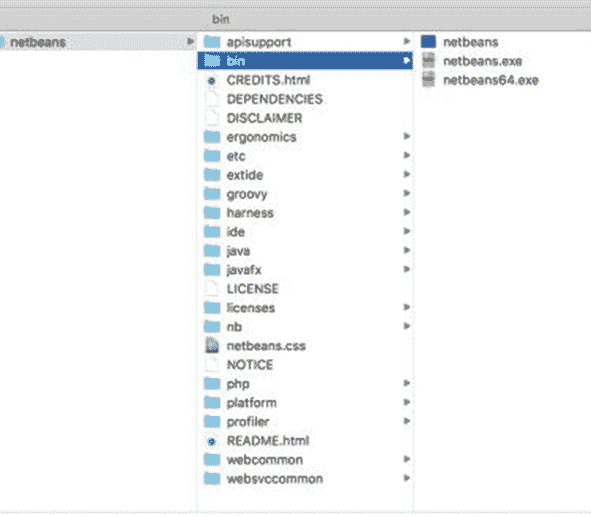

图 1-1

Apache NetBeans 安装

如果安装了多个 Java 版本，请相应地编辑 `etc/netbeans.conf` 文件，并添加应用于运行 Apache NetBeans 的 `JAVA_HOME`。要运行 Apache NetBeans，请双击位于 `bin` 目录中对应工作站平台的可执行文件。

### 注意

要了解如何从源代码构建 Apache NetBeans，请参考第 14 章。


## 集成开发环境

Apache NetBeans 最为人所知的身份是集成开发环境（IDE）。因此，它通常被称为 NetBeans IDE。最初，它是为 Java 开发的开发环境，但多年来，Apache NetBeans IDE 的适用范围已大幅扩展，成为支持多种不同语言的开发工具。自 Apache NetBeans 10 发布以来，该 IDE 对多种语言提供了一流支持，包括 Java、PHP 和 JavaScript。这种支持不仅意味着编辑器具备良好的语法着色或关键字高亮功能，通常还包含诸如根据语言标准自动缩进、关键字和代码片段的自动补全，以及在某些情况下为简化调试和开发生命周期而进行的项目自动重建等功能。源代码编辑器使得通过键盘快捷键和鼠标点击轻松跳转到代码的不同部分成为可能。编辑器的字体、颜色等可以在 Apache NetBeans 的首选项中进行修改。

我提到调试了吗？是的，该开发环境还包含针对多种语言的完整调试器，包括设置断点、在实时调试期间检查变量值以及执行热代码刷新的能力。该开发环境还包含一个针对 Java 应用程序的全功能性能调优解决方案。你可以使用性能工具来运行应用程序，并精确定位可能导致问题的代码问题或线程。

当需要构建项目时，很少有像 Apache Maven 那样被广泛使用的构建框架。Apache NetBeans IDE 对 Apache Maven 提供了出色的支持，使得这个有时令人生畏的构建框架变得易于使用。如果用户选择直接使用 XML 来引入 Maven 依赖项，那么 XML 编辑器将全程提供协助；但如果用户更愿意直接输入所需的依赖项并让它们自动添加，那也是另一种选择。

开发过程中最重要的部分之一是工作流程和团队协作。NetBeans IDE 对 Git 和 Subversion 等版本控制系统提供了一流支持，使协作变得轻而易举。你可以在 IDE 内部直接克隆 Git 仓库、更新代码、提交更改并推送到远程仓库。使用 DIFF 比较工具来比较文件之间的差异也非常容易。

在接下来的几个章节中，我们将针对一些最常见的用例，介绍 Apache NetBeans IDE 的一些基本功能。

## Java 代码编辑器

首先也是最重要的，Apache NetBeans IDE 是一个世界级的 Java 编辑器。该编辑器包含许多辅助开发者的功能，使应用程序开发的各个方面都更具生产力。尽管本节专门介绍 Java 代码编辑功能，但需要注意的是，许多相同的功能也适用于其他语言，例如 JavaScript 和 PHP。

代码补全为开发者提供了助力，它使代码编写更轻松、按键次数更少，并且对于输入那些你不太记得的方法名和变量也非常有用。在输入时按下 `CTRL-Space` 会自动调用代码补全。这样做会出现一个下拉菜单，其中包含许多用于继续当前代码行的代码建议。这些代码建议是基于上下文的，在列表顶部提供对当前代码最有意义的建议，而意义较小的建议则排在底部。当然，代码补全是可配置的，因此可以设置为在输入时或输入特定字符时自动打开代码补全下拉菜单。默认情况下，当输入“.”字符时，会出现基于上下文的建议，这对于轻松完成方法名等操作非常有益。

代码模板和代码片段对于根据需要插入骨架代码段非常方便，使完成逻辑变得更加容易。可以通过点击建议图标或输入各种代码字符串（例如“sout”）来调用模板。当输入“sout”然后按下空格键时，代码“System.out.println(“”)”会被展开，光标会停留在括号内以便继续输入。你可以为经常使用的代码定义自定义代码片段。此外，还有重构选项，用于自动完成简单的样板代码，例如无需编码即可创建 getter 和 setter。

## Java SE 应用程序

Apache NetBeans 最初是为开发 Java 标准版（Java SE）应用程序而构建的：即包含一个或多个 Java 类、一个起点以及为用户提供功能的操作或图形用户界面的 Java 应用程序。传统的 Java 开发要求 Java 类在运行之前必须先编译。应用程序的编译和执行通常通过命令提示符或终端进行，使用 `javac` 编译器和 `java` 命令来执行生成的类文件。此外，如果应用程序包含多个类文件或资源，则必须在执行之前将其打包成 *Java 归档文件（JAR）*。手动执行这些任务可能既耗时又繁琐。为什么不将这些琐碎的任务自动化，以便开发者可以将更多时间用于创造，而不是执行例行任务呢？这就是 Apache NetBeans IDE 的初衷……通过减少所需例行任务的数量，使开发更轻松、更高效。


### 注意

在安装 Apache NetBeans 之前，请确保已安装 JDK。如果你计划开发 Java EE/Jakarta EE 应用程序，请务必安装与应用程序部署目标容器所用版本一致的 JDK。安装完成后，应将位于 `etc/netbeans.conf` 中的配置变量 `netbeans_jdkhome` 设置为用于运行 Apache NetBeans 的 JDK 路径。

接下来，我们将逐步开发一个简单的“Hello World” Java 应用程序，并介绍 Apache NetBeans IDE 的一些核心功能。首先，打开 Apache NetBeans，通过选择“文件” ➤ “新建项目”或点击工具栏中的“新建项目”图标来创建一个新项目。

然后，在“新建项目”对话框中，从 *类别* 选择列表中选择“Java”类别，再从 *项目* 选择列表中选择“Java 应用程序”。此时将出现一个“新建 Java 应用程序”对话框（图 1-2），您可以在此提供**项目名称**、**项目位置**和**项目文件夹**。输入“HelloApacheNetBeans”作为项目名称。

接下来，在计算机上选择一个位置来存储项目文件。Apache NetBeans 允许您提供一个公共区域来存储第三方库，但暂时跳过这一步，并确保勾选“创建主类”，保持默认的*主类*名称不变。点击“完成”来创建项目。

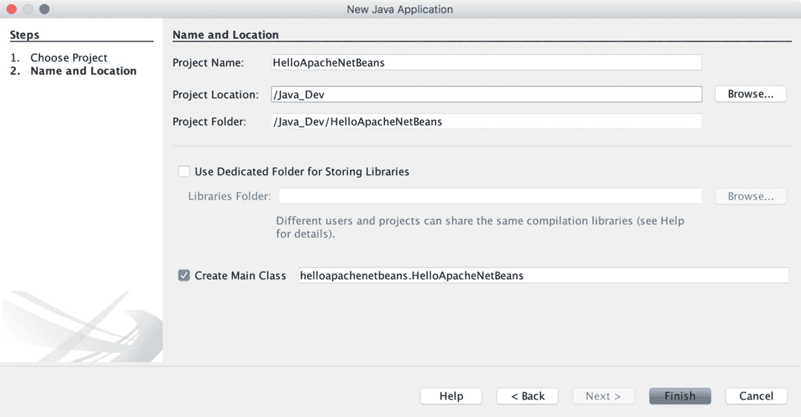

图 1-2

新建 Java 应用程序对话框

Apache NetBeans 将在编辑器中打开 `HelloApacheNetBeans` 主类，您会看到该项目已添加到左侧导航器中（图 1-3）。展开左侧导航器中的项目菜单时，会在包 `helloapachenetbeans` 下显示一个名为 `HelloApacheNetBeans.java` 的源文件，并且在“库”节点下可以看到已在 Apache NetBeans 中注册的默认 JDK。默认情况下，`HelloApacheNetBeans.java` 文件会在源代码编辑器中打开。

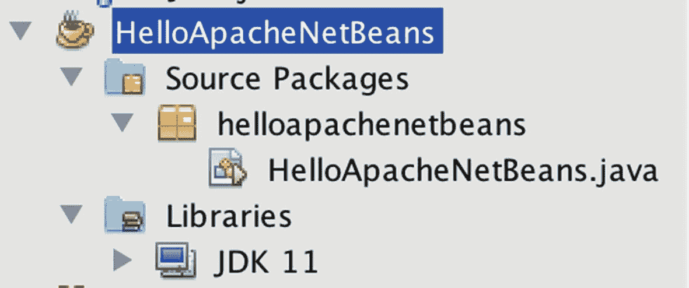

图 1-3

项目菜单

项目以增强格式显示，便于浏览项目文件和查看项目依赖关系。左侧导航器顶部有“项目”、“文件”和“服务”选项卡。默认显示“项目”选项卡，其中将以增强视图显示当前打开的每个 Apache NetBeans 项目。“文件”选项卡则根据磁盘上的实际项目文件来显示当前打开的每个 Apache NetBeans 项目。如果您知道某个文件的位置并需要编辑它，这有时会很有用。它之所以有用，还因为 Apache NetBeans 默认会隐藏部分项目文件以组织项目并简化导航，而且这些隐藏文件在大多数情况下无需编辑。“服务”选项卡包含大量用于处理数据库、Web 服务、Maven 仓库、Docker 等的选项。本书后续章节将详细介绍这些服务中的许多内容。

为了体验编辑器操作，请将光标置于打开的编辑器中 `HelloApacheNetBeans.java` 文件的 `main()` 方法内，位于如下代码注释之后：

```
// TODO code application logic here
```

按下回车键开始一个新空白行，然后开始输入：`System.out.println("Hello Apache NetBeans");` 在输入过程中，会出现自动补全选项以简化编码。实际上，只需输入 `sout` 并按下 Tab 键，该行就会通过代码模板自动补全。在 `println()` 方法中输入字符串“Hello Apache NetBeans”。代码应如下所示：

```
public static void main(String[] args) {
// TODO code application logic here
System.out.println("Hello Apache NetBeans");
}
```

在项目导航器中，右键点击会弹出上下文菜单，提供许多额外选项。本书后续将介绍其中大部分选项，但现在请右键点击项目导航器中的 `HelloApacheNetBeans` 项目，并选择“清理并构建”。此操作会从磁盘中删除所有已编译的代码，并执行构建，包括项目的所有外部依赖项。接下来，右键点击项目名称并点击“运行”。编辑器下方有多个选项卡，其中一个是“输出”选项卡。运行项目时，“输出”选项卡应显示以下内容：

```
run:
Hello Apache NetBeans
BUILD SUCCESSFUL (total time: 0 seconds)
```

## Java Web 应用程序

Java Web 应用程序通常需要协调多个流程才能进行开发和测试。例如，大多数 Web 应用程序需要部署到某种应用服务器容器中，并且许多应用程序需要访问数据库。Apache NetBeans 允许在一个地方维护所有这些独立的流程，从而简化 Java Web 应用程序的开发、部署和测试。此外，它还包含一个调试器模式，可以轻松地以调试模式部署应用程序，然后逐步执行断点以帮助排查问题。有关调试器的更多详细信息，请参见第 5 章。

Java Web 应用程序通常包含多种不同的代码和样式文件，而 Apache NetBeans 代码编辑器几乎能够编辑任何类型的文件。该代码编辑器支持多种不同的语言，并提供语法高亮、自动补全和错误标记等功能。尤其是在处理 Web 应用程序时，能够在同一个编辑器中编辑不同类型的文件至关重要。Apache NetBeans 插件门户还为开发者提供了为 IDE 创建第三方扩展的能力，这使得支持的文件类型和扩展选项变得无限可能。例如，有许多应用服务器容器的第三方插件可用，这些插件为这些服务器提供了特殊功能。更多详细信息，请参见第 11 章：为 NetBeans 编写插件。

在 Apache NetBeans 中开发 Web 应用程序有多种选择。每种选择都对应不同的项目类型。在“新建项目”对话框的“Java Web”类别下，有三个可用选项：Web 应用程序、基于现有源的 Web 应用程序和 Web 自由格式应用程序。“Web 应用程序”通常用于创建一个使用 Apache Ant 作为构建系统的新 Web 应用程序项目。此类项目要求开发者使用 Apache Ant 手动管理资源。“基于现有源的 Web 应用程序”允许您从现有的基于 Apache Ant 的 Web 应用程序创建项目。此外，还可以利用“Java EE”和“Maven”类别下的其他选项来创建 Web 应用程序。通常，较旧风格的 Java 企业应用程序可以从“Java EE”类别中的选项创建。“Maven”类别提供了使用 Apache Maven 构建系统创建 Java EE 项目的选项。如果不确定从何入手，最安全且最现代的 Web 应用程序项目风格可以通过选择 Maven 的“Web 应用程序”项目来创建。


### 注意

如果使用 Apache NetBeans 11.0 之前的版本，你需要安装“Java EE”插件才能创建新的 Web 应用程序项目。在 11.0+ 版本中，该插件已集成到 IDE 中。

让我们逐步开发一个简单的“Hello World”Web 应用程序。首先，打开“新建项目”对话框，选择“Java Web”类别，然后选择“Web 应用程序”项目类型。选择后，将显示“新建 Web 应用程序”对话框。将 Web 应用程序命名为“HelloWorldWeb”，并为项目选择一个合适的存放位置（图 1-4）。

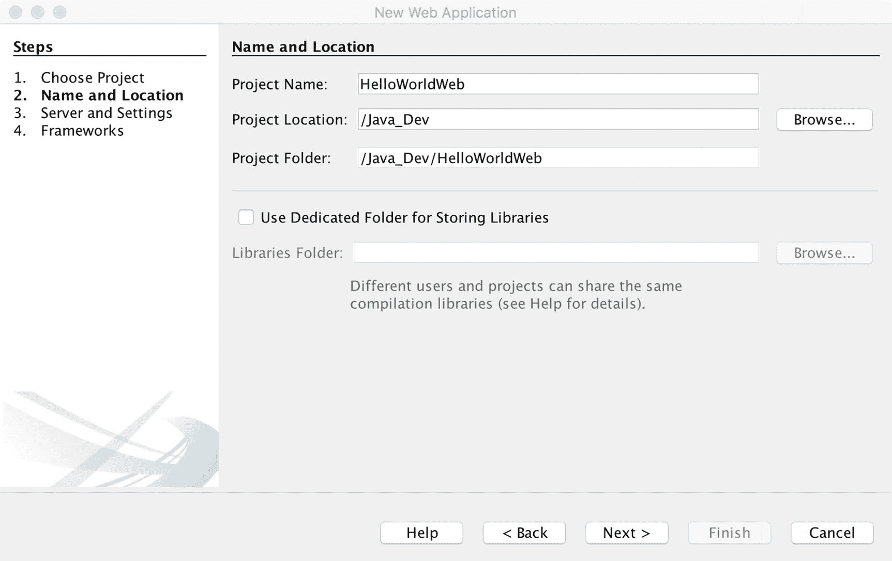

图 1-4

新建 Web 应用程序对话框

点击“下一步”，然后选择要支持的应用程序服务器和“Java EE 版本”。在此示例中，选择了“Payara 5.183.1”服务器（参见如何向 Apache NetBeans 添加新服务器的章节），并选择“Java EE 7 Web”作为 **Java EE 版本**。保持**上下文路径**不变（图 1-5）。

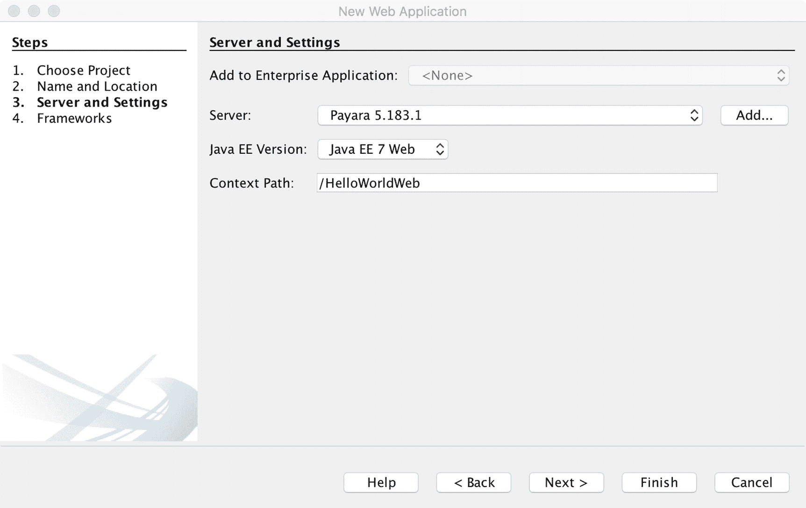

图 1-5

服务器和设置

“新建 Web 应用程序”向导的最后一部分是**框架**对话框。在此部分中，如果你想使用特定的 Java Web 框架，可以在此处选择它，以便为所选框架添加任何必需的依赖项和配置文件。在此示例中，不要选择任何内容，直接点击“完成”。该项目将出现在左侧菜单的“项目”导航器中，并且项目的 `index.html` 文件将在编辑器中打开。该项目包含以下节点：“Web 页面”、“源包”、“库”和“配置文件”，如图 1-6 所示。

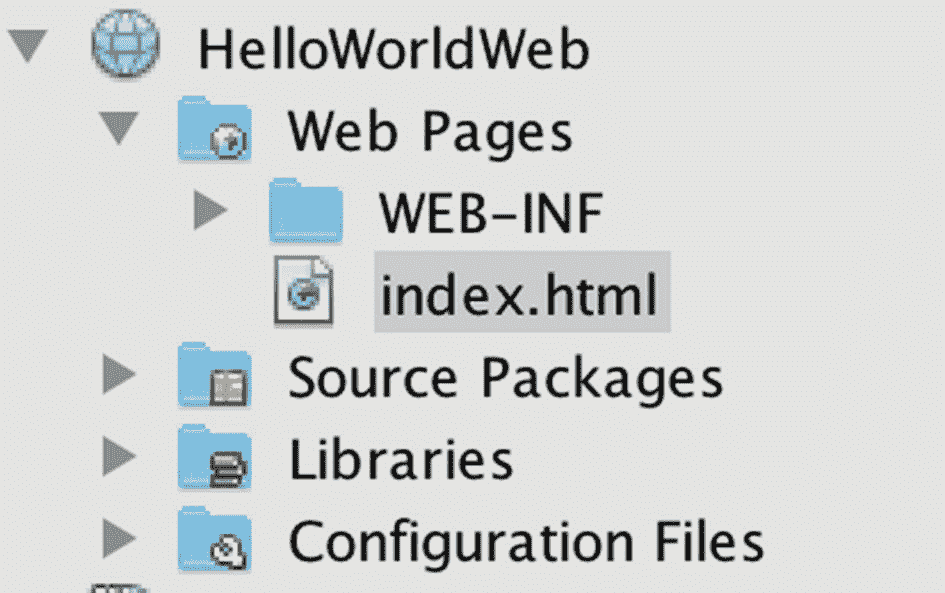

图 1-6

Java Web 项目结构

此时，项目已准备好部署到指定的应用程序服务器，可以通过右键单击项目并选择“运行”来完成。选择“运行”后，指定的应用程序服务器将启动，应用程序将被编译和部署。包含 HTML 文件的编辑器将提供编辑 HTML 的选项，如果创建了 CSS 或 JavaScript 文件，则编辑器将提供特定于这些文件类型的选项。当然，所有适用于 Java SE 项目的功能也适用于 Java Web 项目。

## PHP 和其他语言

尽管 Apache NetBeans 最初是为开发 Java 应用程序而创建的，但多年来社区已增加了对许多其他语言的支持。在 Apache NetBeans 中支持出色的语言之一是 PHP。另一个支持良好的语言是 JavaScript。在 Apache NetBeans 10 中，PHP 在 IDE 中获得了完全支持，因此可以使用诸如多重捕获异常处理、可空类型、上下文相关词法分析器等特性。代码编辑器包含 PHP 特定的功能，例如 void 返回类型的提示、不正确的非抽象方法的提示、严格类型声明的建议等。还支持 HTML 表单面板，以帮助开发 PHP Web 表单。

要创建 PHP 项目，在“新建项目”➤“PHP”类别下有几个选项。选项如下：“PHP 应用程序”、“基于现有源的 PHP 应用程序”和“来自远程服务器的 PHP 应用程序”。第一个选项允许从头开始创建一个 PHP 项目，为调试和运行项目提供了灵活性。第二个选项“基于现有源的 PHP 应用程序”允许将现有的 PHP 项目导入到标准 IDE 项目中并立即开始使用。第三个选项允许下载一个远程项目，并为其创建一个标准 IDE 项目。第三个选项还会自动配置新创建的标准 IDE 项目，使其自动将本地更改上传到远程服务器。

## Maven 支持

Java 应用程序最流行的构建系统是 Apache Maven。因此，Apache NetBeans 对此构建系统提供了一流支持也就不足为奇了。IDE 包含各种基于 Apache Maven 项目格式的入门项目。任何 Maven 项目都可以在 Apache NetBeans IDE 中打开，并且会立即被识别，从而可以开始开发。

要在 Apache NetBeans 中打开现有的 Maven 项目，只需使用文件浏览器浏览到该项目并打开即可。IDE 将自动检测语言类型，并使用与所选项目相关的模板打开一个项目。例如，如果打开一个 Java SE Maven 项目，则将使用 Java SE Apache NetBeans 项目模板。

使用 Maven，项目依赖项会在构建项目时被下载并添加到生成的归档文件中。因此，当在 Apache NetBeans 中使用“与依赖项一起构建”选项时，Maven 正是这样做的。通过右键单击项目导航器中的“依赖项”节点并选择“添加依赖项”，也可以轻松地向项目添加依赖项（图 1-7）。

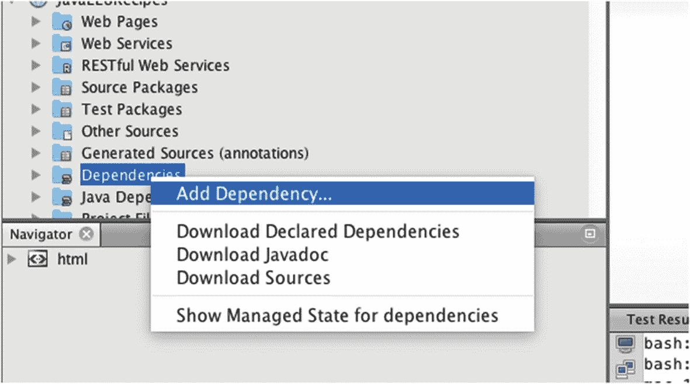

图 1-7

添加 Maven 依赖项

点击“添加依赖项…”选项后，将出现“添加依赖项”对话框，允许轻松搜索远程或本地 Maven 仓库中的依赖项（图 1-8）。当向项目添加依赖项时，关联的项目 POM 文件会被修改以包含该依赖项，这样用户就不必手动修改 XML。

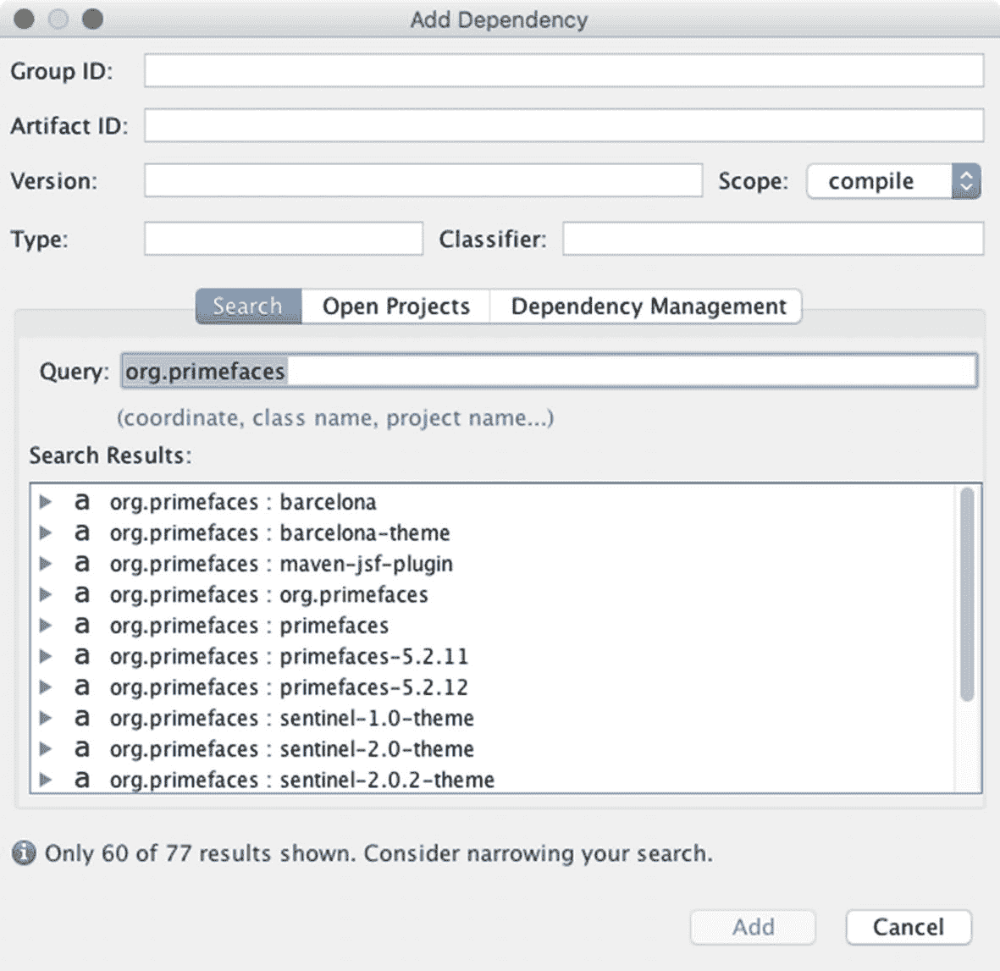

图 1-8

添加依赖项对话框

其他 Maven 支持功能包括：能够在 Maven 构建中集成 SureFire 测试；将 Apache Maven 用作各种项目类型（包括其他 JVM 语言、Apache NetBeans 插件等）的构建系统；以及通过依赖项的自动补全功能轻松编辑 POM 文件。


## 协作

Apache NetBeans IDE 通过集成对版本控制系统（VCS）的支持（如 Git、Mercurial 和 Subversion），帮助团队轻松协作。IDE 为这些 VCS 提供了一流支持，因为每个 Apache NetBeans 项目都可以在 IDE 内部单独管理。在与任一 VCS 集成之前，必须将所选系统安装在 Apache NetBeans 所在的工作站上。然后，可以使用 Apache NetBeans 首选项中的“团队”➤“版本控制”选项卡来管理所选的 VCS（图 1-9）。

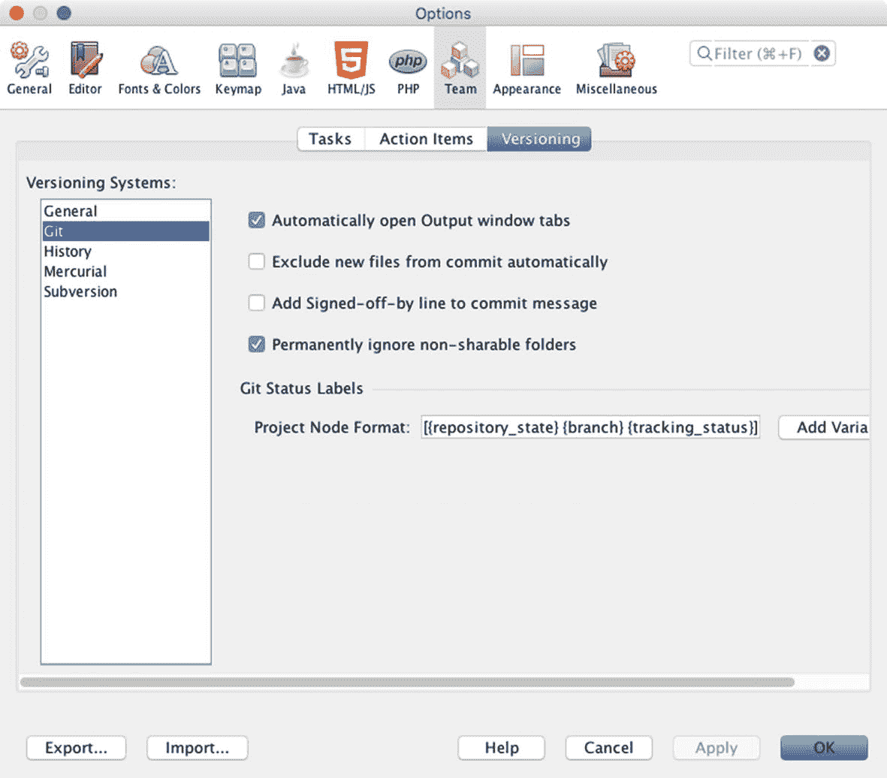

图 1-9

Apache NetBeans 版本控制首选项

接下来的几段将概述 Apache NetBeans 对 Git 的支持。不过，对 Mercurial 或 Subversion 也提供了同等水平的支持。“团队”菜单提供了创建新仓库或浏览现有仓库的选项（图 1-10）。

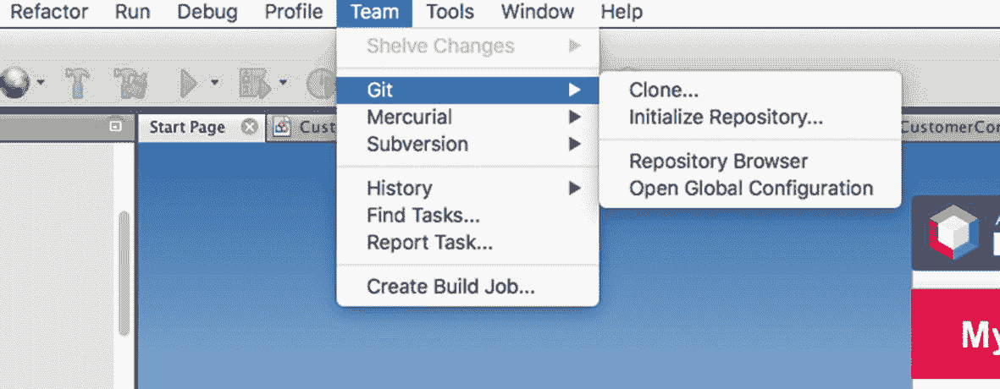

图 1-10

Apache NetBeans 团队菜单

“打开全局配置”选项提供了直接在编辑器中管理 `global .gitconfig` 文件的能力，如图 1-11 所示。

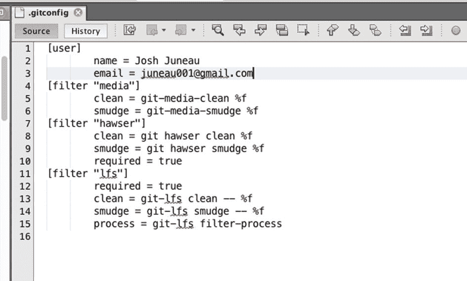

图 1-11

管理全局 Git 配置文件

通过右键单击 Apache NetBeans 项目，还可以在上下文菜单中找到 VCS 选项。这些选项包括初始化仓库的能力（图 1-12），并且对于已经初始化并拥有仓库的项目，还提供了一系列可用于处理 VCS 仓库的选项（图 1-13）。

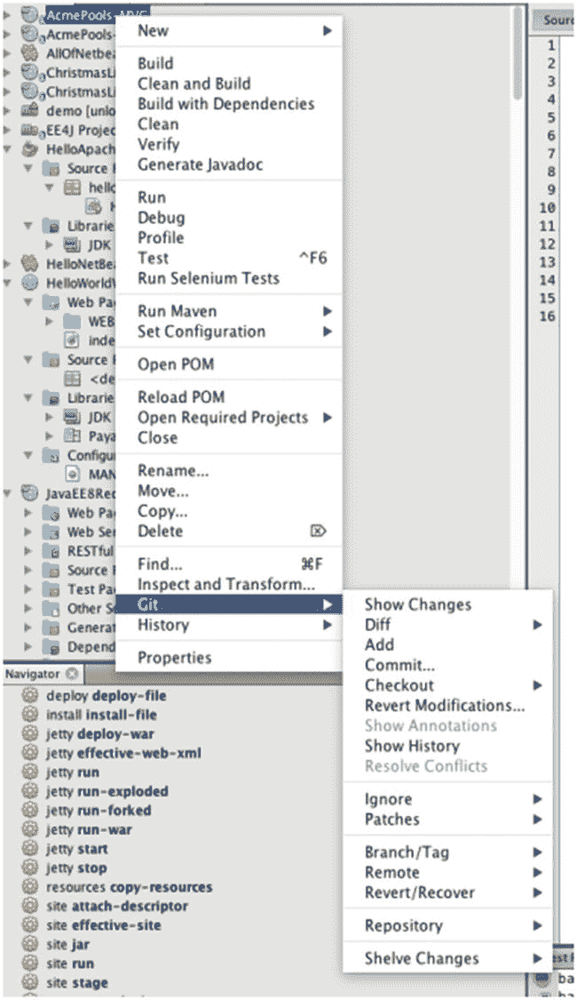

图 1-13

已初始化项目的 Git 选项

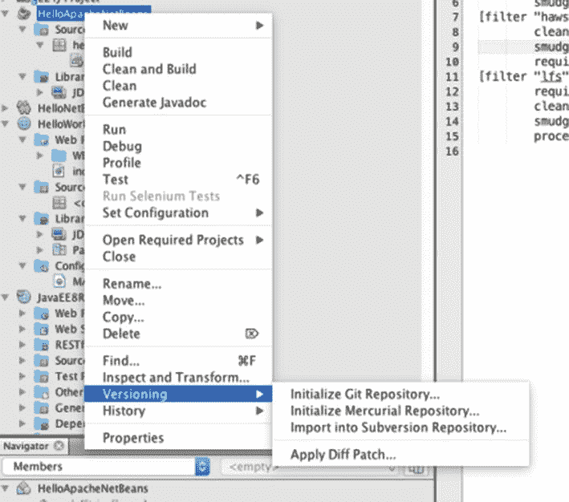

图 1-12

为 Apache NetBeans 项目初始化仓库

IDE 包含一个集成的 VCS 推送/拉取系统，因此，如果项目中的文件已被修改且与 HEAD 不同，则这些文件的文本会变为绿色。然后，可以轻松地在 HEAD 与当前选中的文件之间执行 DIFF 比较，并通过在上下文菜单中选择选项并使用对话框将更改提交到仓库（图 1-14）。

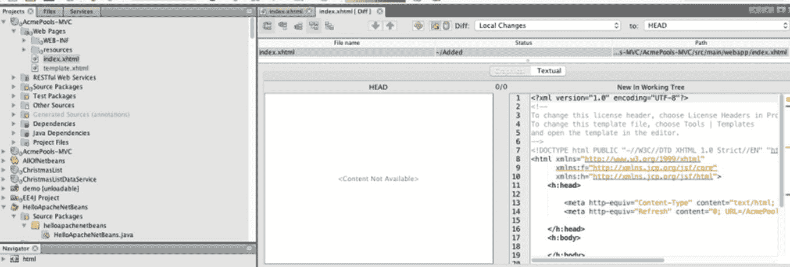

图 1-14

使用 DIFF 比较文件

Apache NetBeans 涵盖了更多版本控制功能。要了解有关这些功能的更多信息，请参阅在线资源，例如在 Apache NetBeans 中使用 Git：[`https://netbeans.apache.org/kb/docs/ide/git.html`](https://netbeans.org/kb/docs/ide/mercurial.html) 或 Mercurial：[`https://netbeans.org/kb/docs/ide/mercurial.html`](https://netbeans.org/kb/docs/ide/mercurial.html)，仅举几例。

## 性能分析、调试与重构

Apache NetBeans IDE 拥有出色的性能分析、调试和重构能力。性能分析器允许深入应用程序方法调用的内部，以定位问题区域。遥测分析器屏幕提供了 CPU 与垃圾回收器、内存、垃圾回收以及线程和类的概览。CPU 与垃圾回收器图表允许深入特定时间点以查找 CPU 和 GC 时间，内存提供堆大小和已用堆，垃圾回收显示存活代，线程和类图表则显示线程数和已加载的类（图 1-15）。

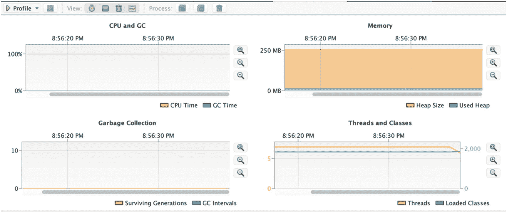

图 1-15

遥测显示

进程按钮可调用某些功能，例如随时进行垃圾回收。方法分析允许分析所有类、项目类或仅选定的类。用户界面使得深入单个方法调用以定位问题变得容易（图 1-16）。

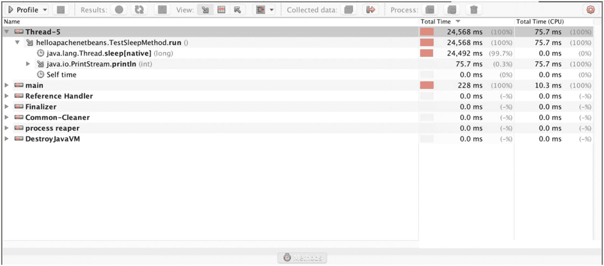

图 1-16

方法分析器

对象分析器允许按大小对对象进行排序，双击某个对象将直接跳转到其源代码（图 1-17）。

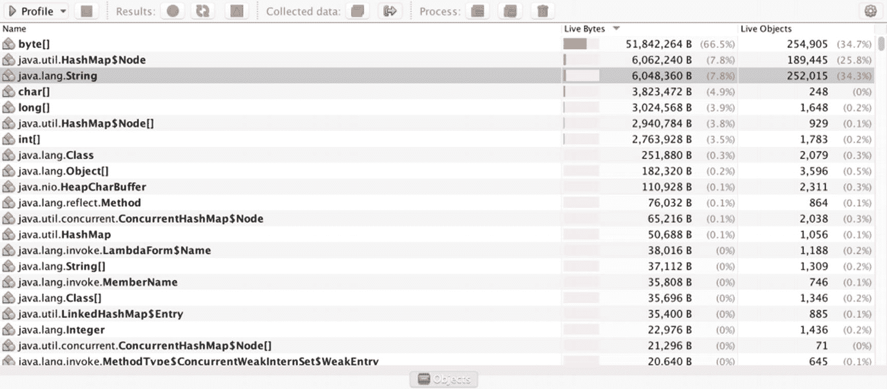

图 1-17

对象分析器

这些功能只是 Apache NetBeans 分析器的冰山一角。调试器允许在代码中设置断点，然后执行代码（本地或部署到服务器），并单步执行代码以帮助调试和查找问题原因。一旦在代码中设置了断点，调试器将在断点处停止执行，IDE 将显示此时变量的值（图 1-18）。

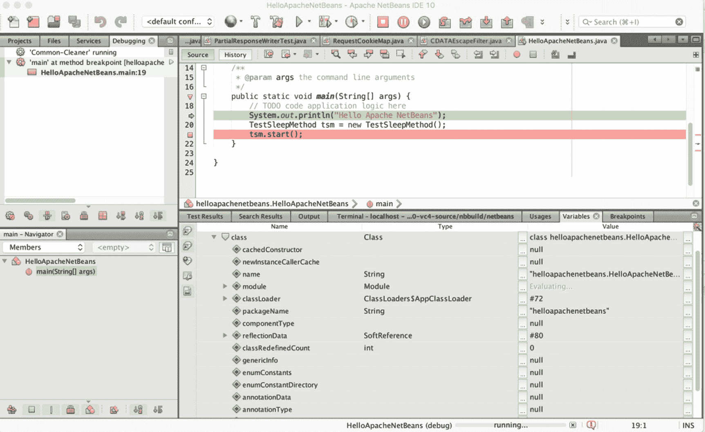

图 1-18

Apache NetBeans 调试器

调试器还允许对变量设置监视点，当变量包含指定值时，代码执行将停止。还有一个快照选项，允许在指定时间拍摄快照，以便在代码执行时进行监控。如果正在开发 JavaFX 或 Swing 图形用户界面，还有一个可视化调试器，允许查看组件属性、容器内的组件等。请参阅第 5 章以了解有关调试器和分析器的更多信息。

IDE 的另一个关键组件是重构代码的能力。Apache NetBeans 允许更改代码文件的名称、自动添加代码（如 getter 和 setter）、更改方法参数等（图 1-19）。

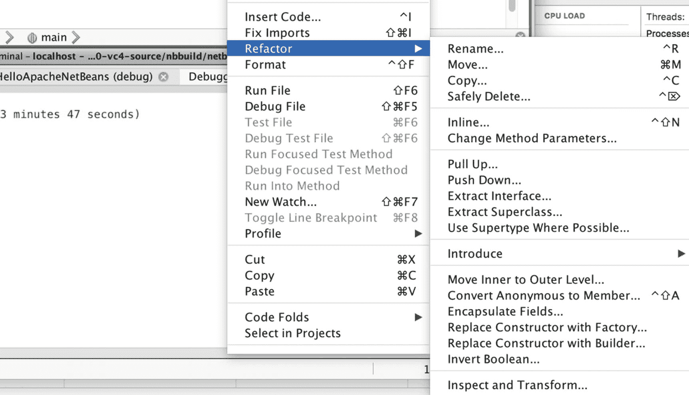

图 1-19

Apache NetBeans 重构上下文菜单

### Apache NetBeans 平台

Apache NetBeans 不仅仅是一个用于应用程序的 IDE。该 IDE 构建在一个专门为创建富客户端桌面应用程序而设计的平台上……即 NetBeans 平台。事实证明，该平台具有极强的可扩展性，对于为 Java 平台开发任意数量的桌面应用程序非常有用。事实上，有许多成功的应用程序都是基于 NetBeans 平台构建的，范围从完整的桌面应用程序到有用的实用工具。NetBeans 平台还允许轻松构建可安装的模块，以扩展 Apache NetBeans IDE。IDE 本身包含可用于构建利用 NetBeans 平台的应用程序和模块的项目模板。

要开发 NetBeans 模块，请打开“新建项目”对话框并选择“NetBeans 模块”类别（图 1-20）。有许多选项可用于创建 NetBeans 模块，范围从开发单个模块、模块库到整个 NetBeans 平台应用程序。

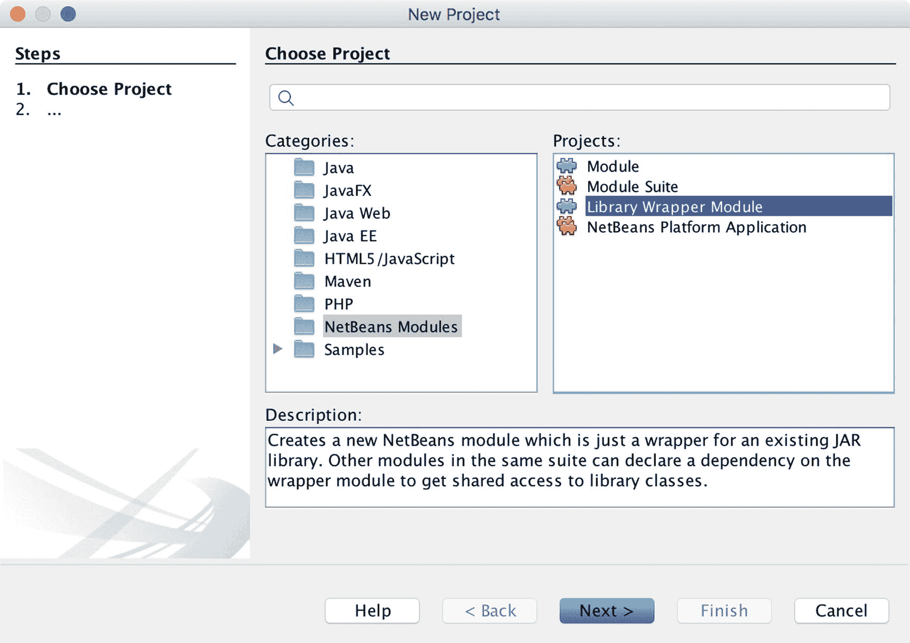

图 1-20

新建项目：NetBeans 模块


#### 开发独立的 Apache NetBeans 模块

在许多情况下，开发者希望为 Apache NetBeans 环境构建扩展。社区开发者已经创建了数十个有用的 NetBeans 模块。此类模块扩展了 IDE，以集成新的和/或增强的功能。扩展可以封装几乎任何功能。例如，模块可用于为 IDE 添加新的语言支持，或扩展现有功能（如添加增强的 Git 支持）。无论是什么，使用项目模板都很容易开发 Apache NetBeans 模块。

要开始，请选择“NetBeans 模块” ➤ “模块”项目类型。选择后，新模块可以创建为“独立”模块，也可以添加到“模块套件”中。在下一个面板上，必须指定“代码名称基础”。“代码名称基础”与基础包名称非常相似（图 1-21）。还可以指定包本地化包，以及选择将模块生成为 OSGI 模块。

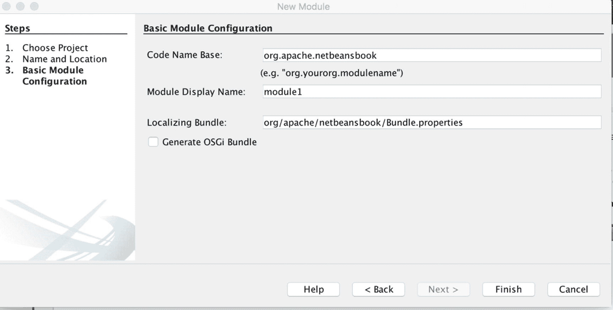

图 1-21

新建模块向导

项目结构与 Java SE 项目非常相似，尽管会生成许多特定于模块的配置文件（图 1-22）。

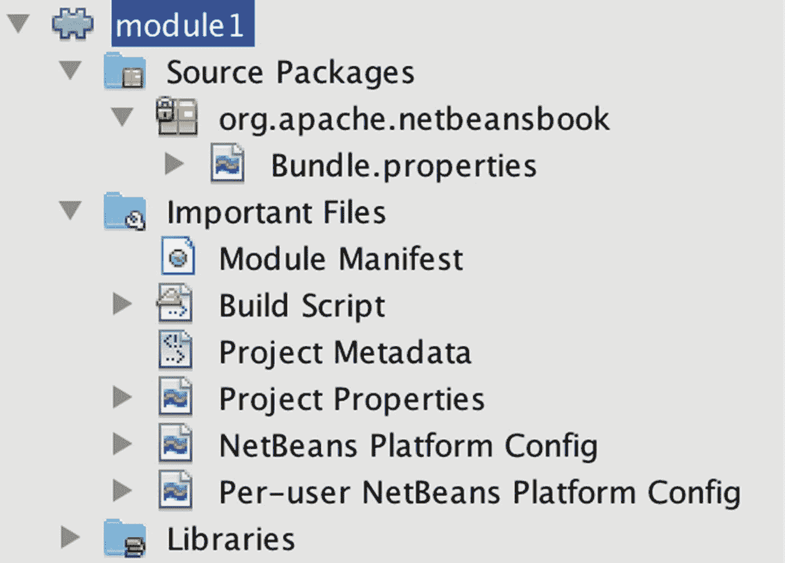

图 1-22

NetBeans 模块结构

该模块将创建一个 NBM 文件，该文件稍后可以作为扩展添加到 NetBeans IDE 中。该模块也可以作为 NetBeans 插件部署以进行分发。

#### 开发基于 NetBeans 平台的应用程序

NetBeans 平台允许开发者利用一个骨架框架来构建丰富的客户端应用程序，该框架免费提供了许多底层功能。该平台允许以从头开发所需时间的一小部分来开发 Java Swing 应用程序。该平台包括诸如状态保存和生命周期管理、标准化的 UI 工具包、窗口系统等功能；所有这些功能都可以开箱即用地轻松实现。

在 NetBeans 平台上开发时，IDE 允许轻松调试模块或平台应用程序。因此，这使得快速创建使用标准架构的稳定用户界面变得容易。由于该平台开箱即用地提供了许多基本的客户端应用程序 API，您可以确信所有标准的 NetBeans 平台应用程序都以一致的方式运行。

### Apache NetBeans 社区

Apache NetBeans 拥有一个充满活力的社区，包含多个在线资源、频繁的会议演讲和会议，以及丰富的文档和教程历史。Apache NetBeans 社区自 2000 年代初就已存在，多年来已从一个小的核心群体发展壮大为整个开源社区。

#### 邮件列表和 NetCAT

成为 Apache NetBeans 社区一员的最基本且信息量最大的方式之一是加入邮件列表。这些列表经常用于发布问题和讨论 IDE 的新旧功能。这些列表对于了解开源社区如何运作也很有用，因为列表上总有经验丰富的专家随时准备提供帮助。要加入 Apache NetBeans 邮件列表，请访问以下网页：

[`​netbeans.​apache.​org/​community/​mailing-lists.​html`](https://netbeans.apache.org/community/mailing-lists.html)

在 Apache NetBeans 发布之前，必须对即将发布的版本进行测试以确保其功能完整。Apache NetBeans 测试的阶段之一是 NetCAT 计划。NetCAT 是一个测试者社区，每个测试者被分配测试 IDE 的不同部分。IDE 功能被分成不同的 NetCAT 组织小组。每个小组定期在线开会以制定测试计划，每个测试者使用在线表单完成测试用例。成为 NetCAT 测试者可以让您更深入地了解 Apache NetBeans IDE，并通过帮助消除问题来回馈社区。使用上面提到的 Apache NetBeans 邮件列表链接了解更多关于加入 NetCAT 的信息。

#### 解决问题

为 Apache NetBeans 生态系统做出贡献的最重要方式之一是在 Apache NetBeans JIRA（问题跟踪器）上找到一个问题并修复它。这很容易做到，只需创建 Apache NetBeans GitHub 仓库的一个分支，然后在分支中进行必要的代码更新以修复问题。一旦问题被修复，可以通过提交拉取请求将分支中的更改添加回 Apache NetBeans GitHub 仓库。要了解更多关于为 Apache NetBeans 贡献代码的信息，请参考第 14 章和第 15 章。

