# 2. NetBeans 入门

当您想要快速开发应用程序时，可以使用 *Apache NetBeans IDE* 来简化您的任务。在本章中，您将了解编辑器的布局以及一些技巧，这些技巧将帮助您更好地控制代码并加快开发速度。

## 默认布局和用途

IDE 中的每个窗口都以其所在窗格或位置中的选项卡形式出现。此外，IDE 的窗口系统允许您通过拖放操作将窗口排列到图 2-1 布局中所示的任何窗口位置。

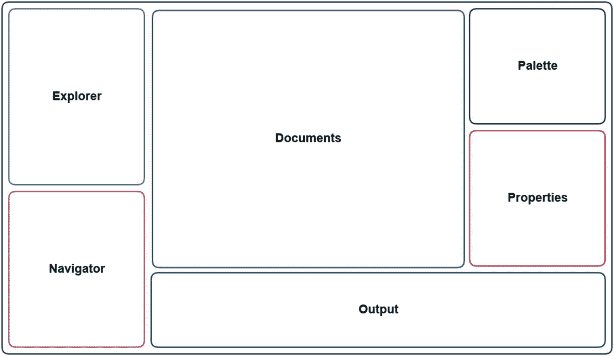

图 2-1

Apache NetBeans 默认布局窗口位置

以下各节将介绍您在图 2-1 中每个位置会看到的一些特定窗口。例如，*资源管理器窗口位置* 可以显示项目、文件或服务，具体取决于您在特定时间所做操作的上下文。

### 资源管理器窗口

所有提供对用户对象访问的窗口都使用资源管理器窗口位置。这些窗口包括项目窗口、文件窗口、服务窗口和任务窗口。

#### 项目窗口

*项目窗口*（**Ctrl+1** 或 **Cmd+1**）显示项目源文件。它显示一个或多个项目的逻辑视图。每个项目或视图由一个节点表示，并根据项目类型具有特定的图标（例如，Java 应用程序节点的显示方式与 JavaFX 应用程序节点不同），如图 2-2 所示。

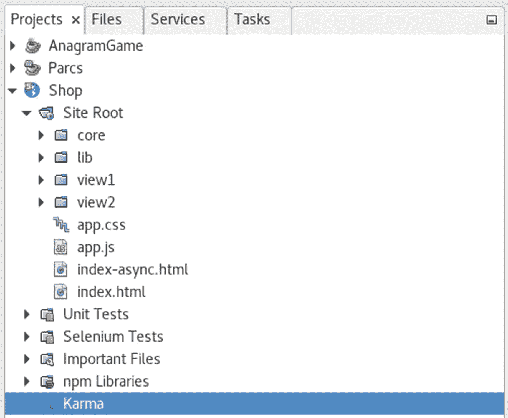

图 2-2

包含不同类型项目的项目窗口

右键单击每个节点会弹出一个菜单，列出您可以在该节点上运行的命令。弹出菜单提供编译、构建、运行等项目命令。您也可以通过选择项目并按 *F6* 快捷键来执行 Java 项目的主文件。

#### 文件窗口

*文件窗口*（**Ctrl+2** 或 **Cmd+2**）显示项目的基于目录的视图，包括项目窗口中未显示的文件和文件夹。右键单击每个节点会弹出一个菜单，其中包含创建新文件或目录的命令，以及复制、剪切和粘贴操作。图 2-3 显示了一个项目结构的示例。

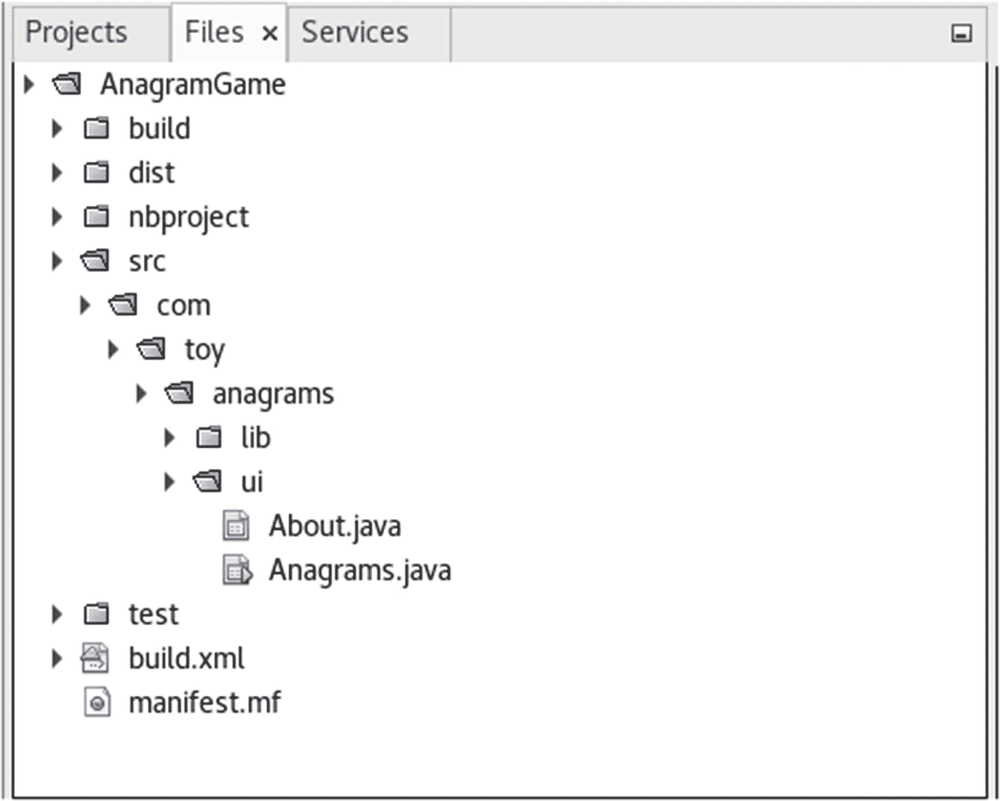

图 2-3

文件窗口中项目的基于目录的结构

#### 服务窗口

*服务窗口*（**Ctrl+5** 或 **Cmd+5**），如图 2-4 所示，显示了已注册到 Apache NetBeans IDE 的运行时资源（如服务器、数据库、Web 服务、Docker 容器、问题跟踪器和任务仓库）的逻辑视图。

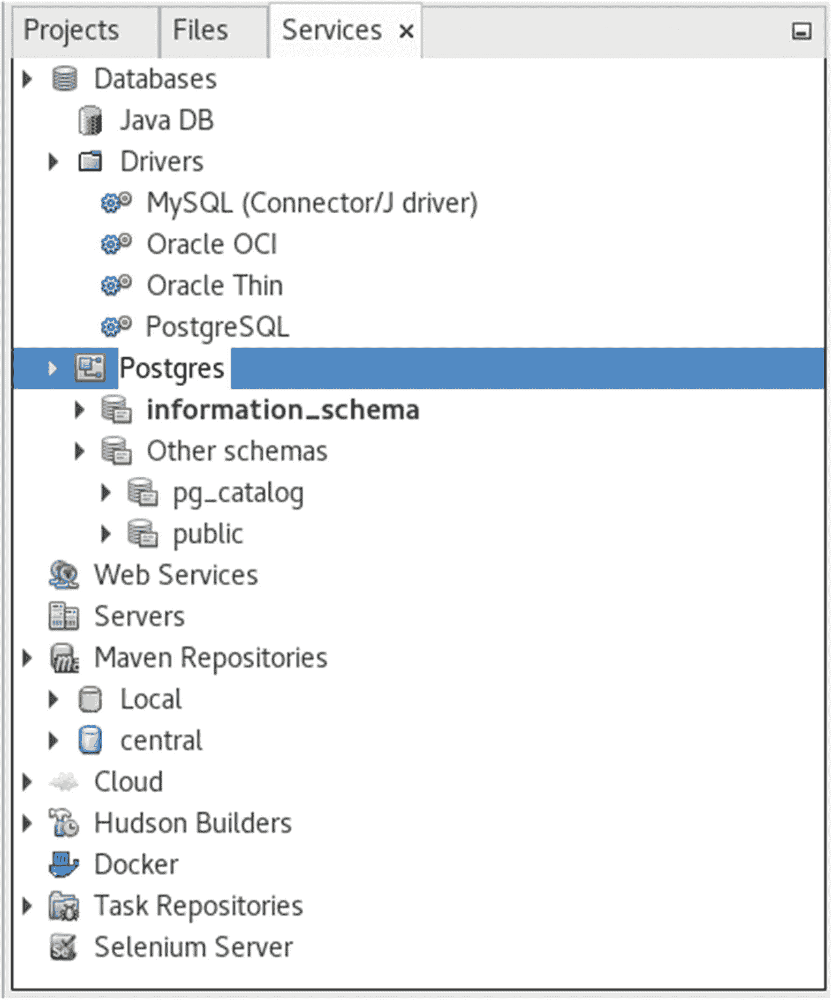

图 2-4

服务窗口

#### 任务窗口

*任务窗口*（**Ctrl+Shift+6** 或 **Cmd+Shift+6**）用于管理注册在任务仓库（如 JIRA、Bugzilla 等）中的任务清单。图 2-5 展示了一个任务窗口的示例。

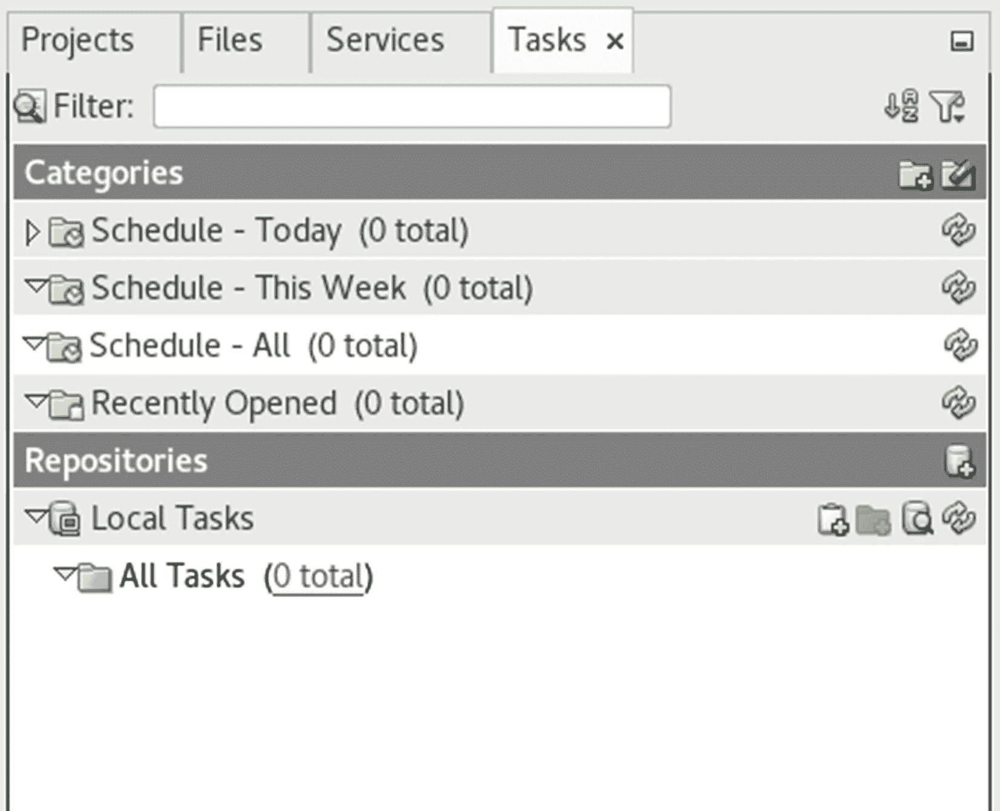

图 2-5

任务窗口

### 导航器窗口

*导航器窗口*（**Ctrl+7** 或 **Cmd+7**）提供了当前选中文件的紧凑视图，并简化了文件不同部分之间的导航。对于 Java 文件，该窗口会显示成员（构造函数、属性和特性）以及 Beans 模式，如图 2-6 所示。

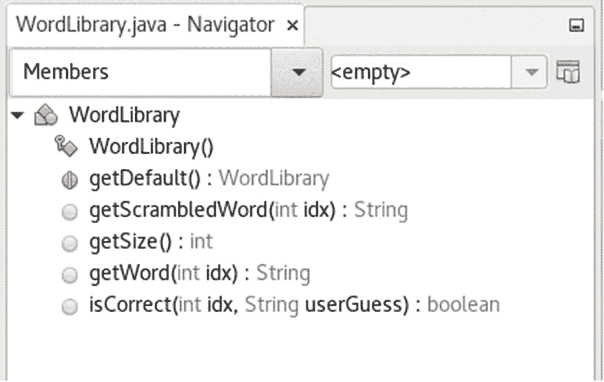

图 2-6

导航器窗口

如果项目是基于 Maven 的应用程序，导航器窗口还会显示 Maven 目标。图 2-7 展示了一个示例，即 Maven 应用程序的 Maven 目标列表。对于 Maven 项目，你可以通过双击目标节点来执行该目标。

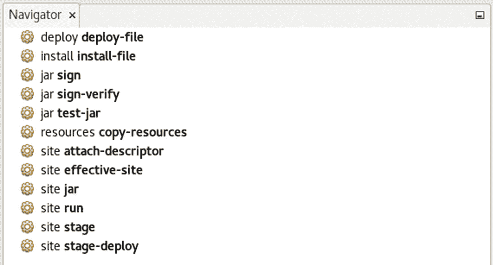

图 2-7

导航器窗口中显示的 Maven 目标

### 编辑器窗口

*文档窗口*通常显示在*编辑器窗口位置*。通过文档窗口，你可以编辑 Java 程序文件和其他源文件。你还可以从*Java 平台 Shell* 执行命令，因为 Java 9 Shell 的命令行界面也已集成到文档窗口中。

#### 源代码编辑器

*源代码编辑器*是 IDE 布局中使用最频繁的部分。它是你编写源代码或为 Java 及其他类型应用程序设计图形用户界面的地方。

*Java 源代码编辑器*由多个选项卡组成：*源代码视图*（用户编写代码的地方）、*设计视图*（用户设计窗体的地方）和*历史视图*（显示文件的修改历史）。这三个选项卡均显示在图 2-8 中，从图中可以看到用户正在编辑一些 Java 源代码。

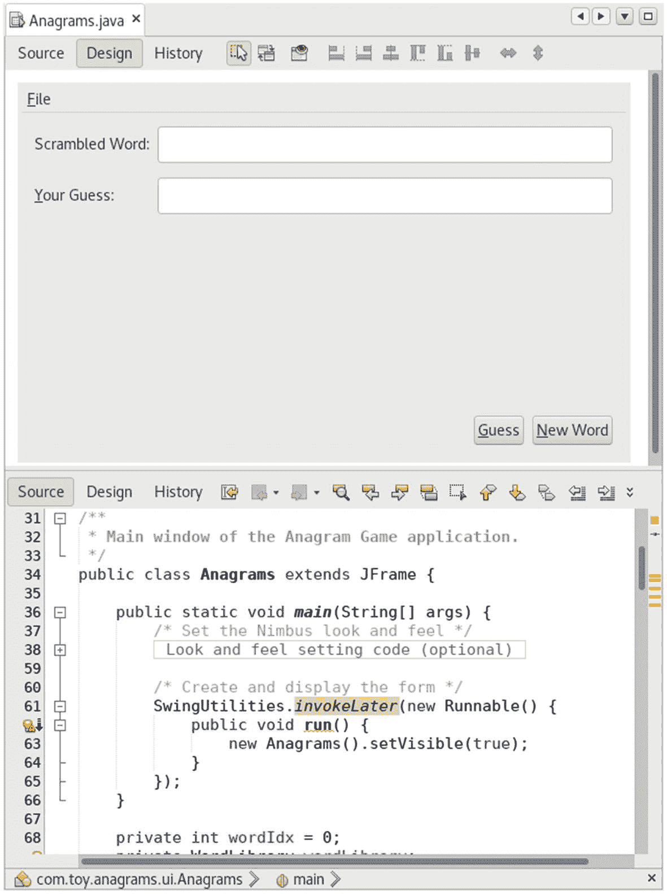

图 2-8

Java 文件的源代码编辑器

源代码编辑器通过许多有趣的功能（如代码补全、代码模板、重构和语法着色）帮助你更快速地完成编码任务。

源代码编辑器不仅限于 Java 代码，还可用于多种其他语言的文件类型。源代码编辑器提供了适用于用户正在处理的特定文件类型（例如 Java、JSP、HTML 等）的功能。

图 2-9 展示了正在编辑 HTML 文件的源代码编辑器。

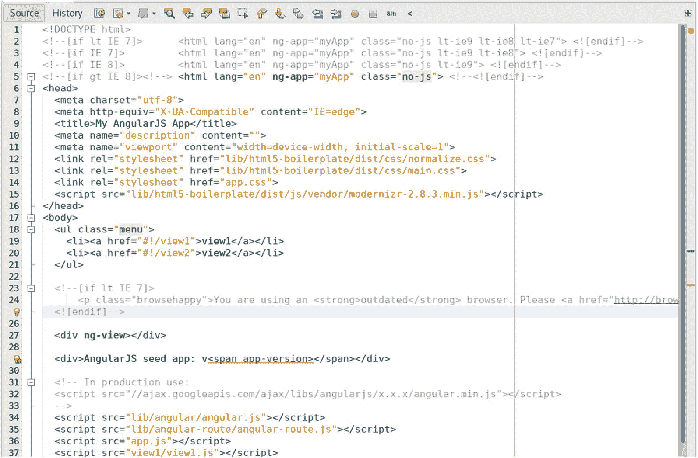

图 2-9

HTML 编辑器中的 HTML 代码源

#### Java 平台 Shell

Java 平台 Shell（见图 2-10）是源代码编辑器窗口的一个有趣用例。Java 平台是你编写代码片段并与 JShell 解释器交互的地方。你可以编辑源代码，也可以直接在编辑器中执行该源代码，而无需创建带有 `main()` 方法的 Java 文件。

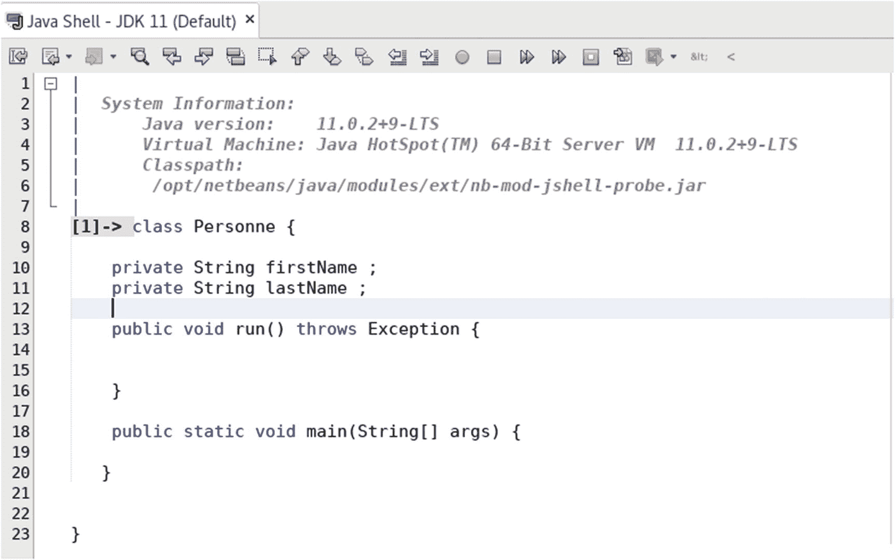

图 2-10

Java Shell 编辑器

### 输出窗口

*输出窗口位置*（**Ctrl+4** 或 **Cmd+4**）可以停靠多选项卡窗口，用于显示来自 Apache NetBeans IDE 的消息。*输出窗口*会在执行成功后（图 2-11）、编译出错时、调试应用程序时，或其他需要向你呈现输出信息的情况下自动显示。

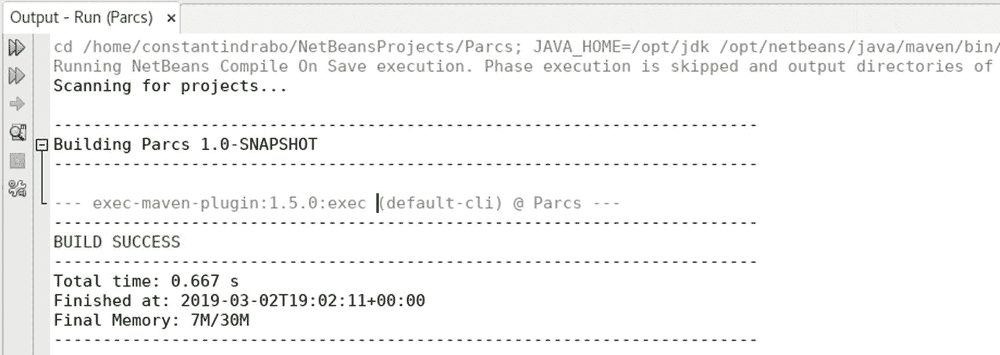

图 2-11

执行成功后的输出窗口

当编译过程中发生错误时，输出窗口会显示错误信息，并附带指向源代码中错误位置的超链接。图 2-12 展示了一个典型的错误列表。

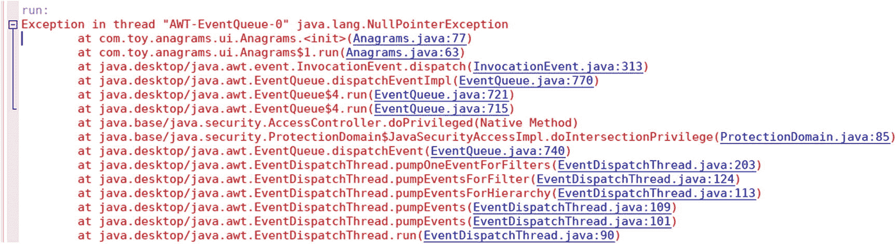

图 2-12

发生错误时的输出窗口

当程序需要用户输入时，输出窗口中会出现一个新的选项卡。

### 终端窗口

Apache NetBeans IDE 提供了一个*终端窗口*，它也显示在输出窗口位置，允许你与操作系统进行交互。点击菜单 **窗口 ➤ IDE 工具 ➤ 终端** 即可打开此窗口。你可以运行操作系统命令和脚本，如图 2-13 所示。

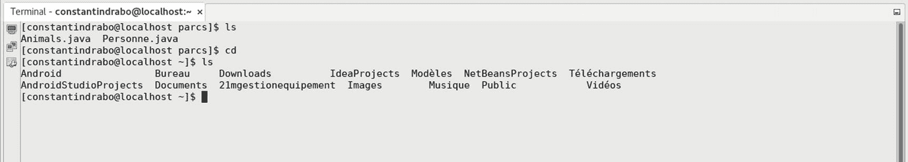

图 2-13

从终端窗口执行命令

### 组件面板窗口

*组件面板窗口*（**Ctrl+Shift+8** 或 **Cmd+Shift+8**）包含所有有助于快速应用程序开发（RAD）的组件。组件面板的行为与编辑器相关联，组件列表因编辑器类型而异。图 2-14 显示了当设计视图处理 Java 窗体（左侧）和 HTML 窗体（右侧）时组件面板的内容。

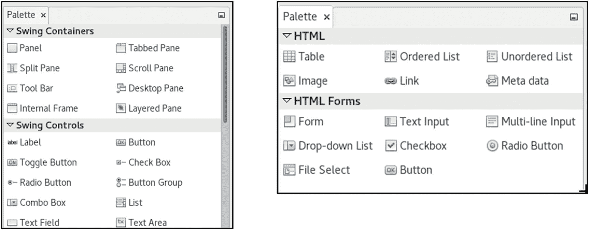

图 2-14

Java 窗体和 HTML 窗体的组件面板窗口

### 属性窗口

*项目*、*文件*、*服务*、*文档*或*导航器*窗口中的元素（节点）具有可在*属性*窗口中查看的属性，如图 2-15 所示。这些元素可以是 Java 类、Swing 组件等。

你可以单击某个属性来修改其值字段。请注意，并非所有属性都可以修改（例如，*文件大小*、*修改时间*等）。值字段可以是输入框，也可以是值列表。

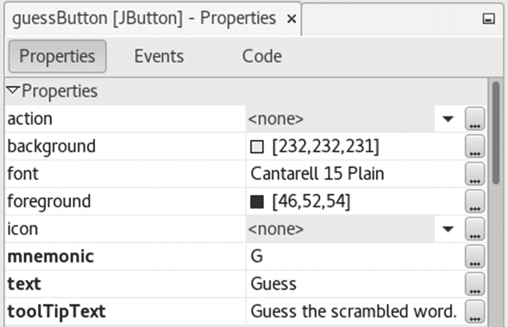

图 2-15

属性表示例

## 设计项目

Apache NetBeans 允许你使用流行的构建自动化工具之一来设计应用程序：*Ant*、*Maven* 或 *Gradle*。以下各节展示了每种情况的示例。

### 设置基于 Ant 的项目

默认情况下，Apache NetBeans IDE 使用 Ant 作为构建自动化工具。以下是使用 Ant 创建新项目的步骤：

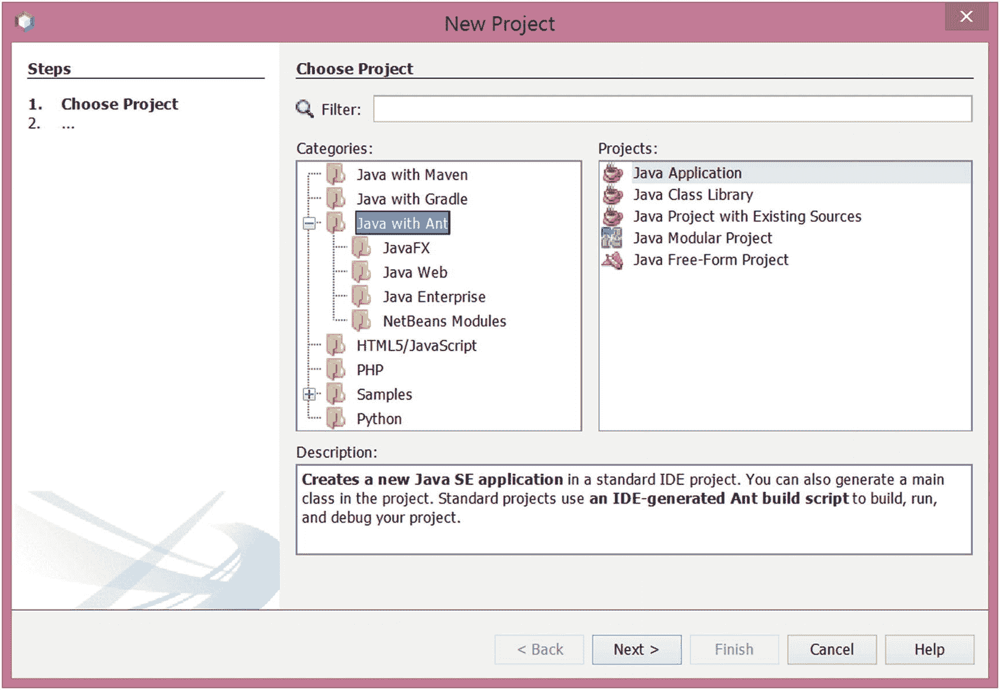

图 2-16

新建项目向导

1.  要创建项目，请选择**文件 ➤ 新建项目**（`Ctrl+Shift+N`），或单击**新建项目**工具栏图标（左上角带有绿色加号的文件夹）。将出现*新建项目*向导，如图 2-16 所示。

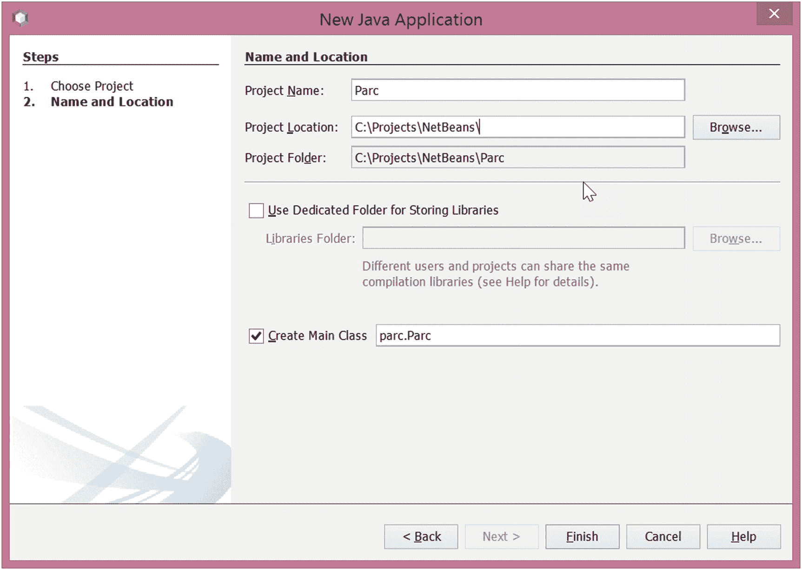

图 2-17

在向导的步骤 2 中提供项目名称和位置

1.  选择 *Java with Ant* 类别。右侧会显示多个项目模板，例如 *Java Application*、*Java Modular Project* 等。选择一个项目模板；如果您正在跟随当前示例操作，请选择 *Java Application*。然后单击**下一步**。

2.  下一步如图 2-17 所示。在此处，您可以提供项目名称、应用程序的存储目录（项目位置），以及包含 `main()` 方法的类。按图 2-17 所示填写字段。然后单击**完成**。

您已创建了一个新的 Java 项目。Java Application 模板会设置一个基本的 Java 项目，并包含一个主类，如图 2-18 所示。

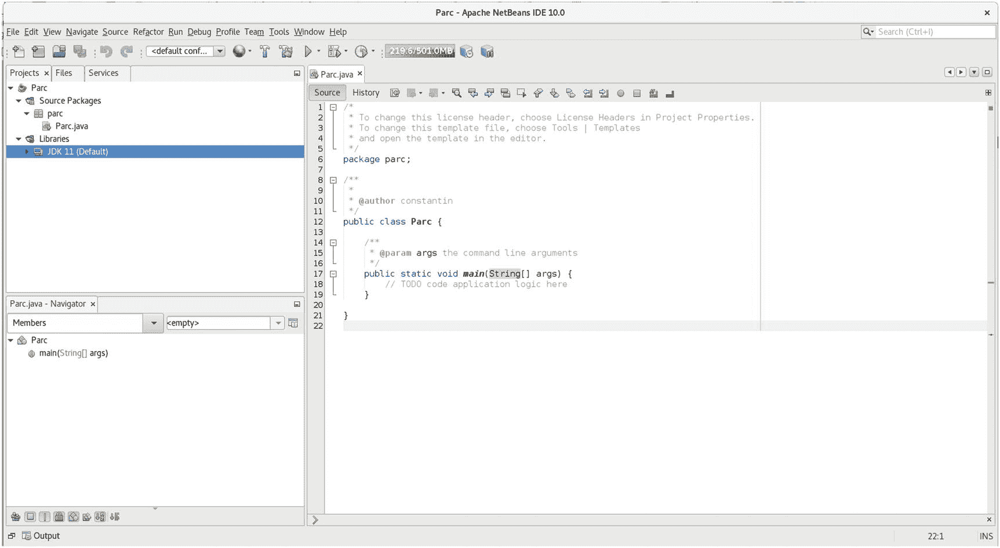

图 2-18

已创建的新 Java 应用程序

新应用程序包含 *Ant 构建文件*。您可以通过 *文件* 选项卡显示该构建文件。选择 *Ant 清单* 时，*导航器窗口* 会显示构建目标，如图 2-19 所示。

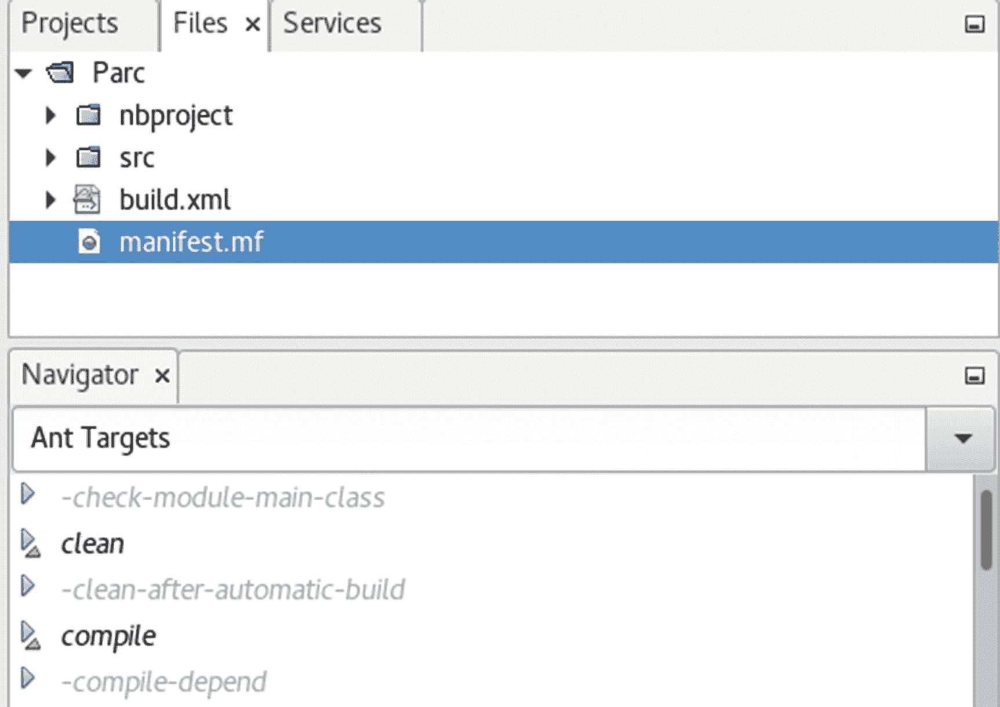

图 2-19

Ant 构建文件和目标

### 设置基于 Maven 的项目

Maven 是一种非常流行的构建自动化工具，在 Java 生态系统中占据主导地位。Apache NetBeans 原生支持 Maven（即，集成在 IDE 内部，不像其他 IDE 那样作为插件）。您可以通过执行以下步骤使用 Maven 设置新项目：

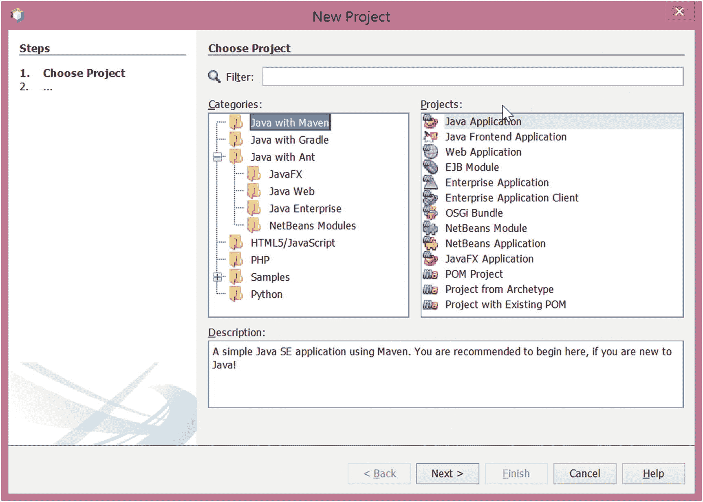

图 2-20

新建项目向导

1.  通过选择**文件 ➤ 新建项目**（`Ctrl+Shift+N`），或单击**新建项目**工具栏图标（）来创建一个 Maven 项目。将打开*新建项目*向导，如图 2-20 所示。

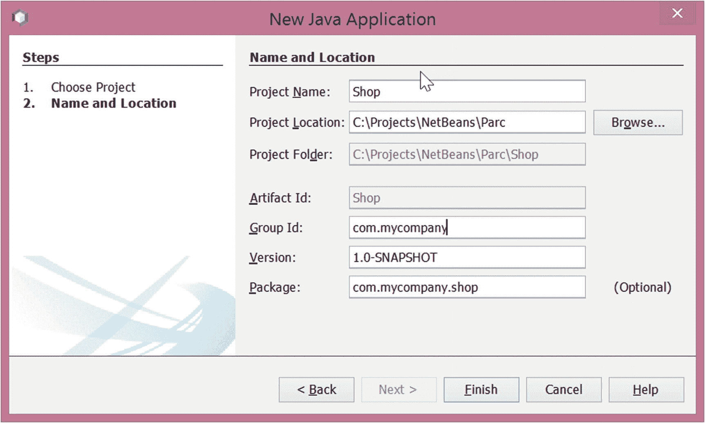

图 2-21

基于 Maven 的项目名称、位置、groupid 和版本

1.  选择 *Java with Maven* 类别以显示可用的项目模板（参见图 2-20）。对于当前示例，选择 *Java Application*，然后单击**下一步**。

2.  在下一步（参见图 2-21）中，您可以提供*项目名称*和*位置*，以及 Maven 坐标（*groupid*、*version* 和 *package*）。完成后，单击**完成**。

新项目将使用 Maven 的配置文件 `pom.xml` 创建。图 2-22 中的导航器窗口显示了*目标*（每组预定义的命令）。

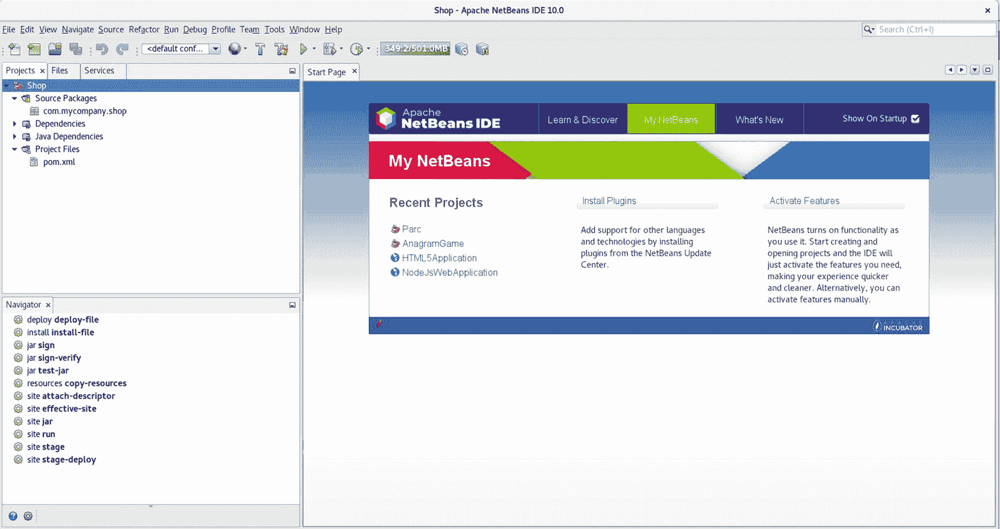

图 2-22

一个新的基于 Maven 的项目

### 设置基于 Gradle 的项目

Gradle 是这个领域的新玩家。它的创建是为了缓解 Maven 的一些麻烦，例如冗长的 *pom* 文件。与上述类似，要创建一个新的基于 Gradle 的项目，请创建一个新项目并选择 *Java with Gradle* 类别，如图 2-23 所示（如果是首次使用，NetBeans 可能会激活该功能）。

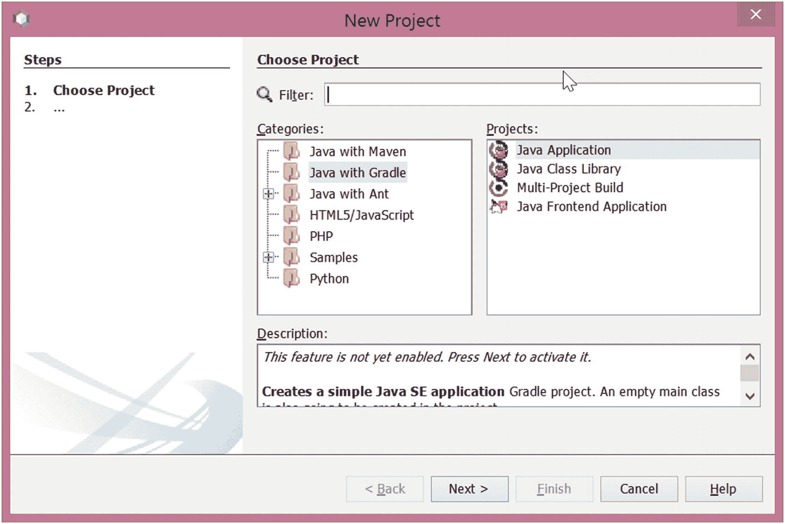

图 2-23

一个新的基于 Gradle 的项目

单击**下一步**，填写项目名称和位置等各个字段；以及向导第二步中的可选组、版本、描述等，然后单击**完成**，即可看到您的新 Gradle 项目已创建。

## 加速您的应用程序编码

Apache NetBeans IDE 拥有大量丰富的功能，可帮助您加快编码任务。IDE 具有默认功能，例如代码补全、语法高亮、代码模板等，您可以通过更改各种设置来使用和修改这些功能。

### 智能代码补全

*代码补全*是 IDE 中最令人兴奋且最常用的功能。它特定于源代码编辑器，并且适用于大多数受支持的语言（Java、HTML、PHP 等）。

有两种方法可以打开代码补全弹出对话框（如图 2-24 所示）：按 `Ctrl+Space` 或在编辑器内键入点（`.`）字符。

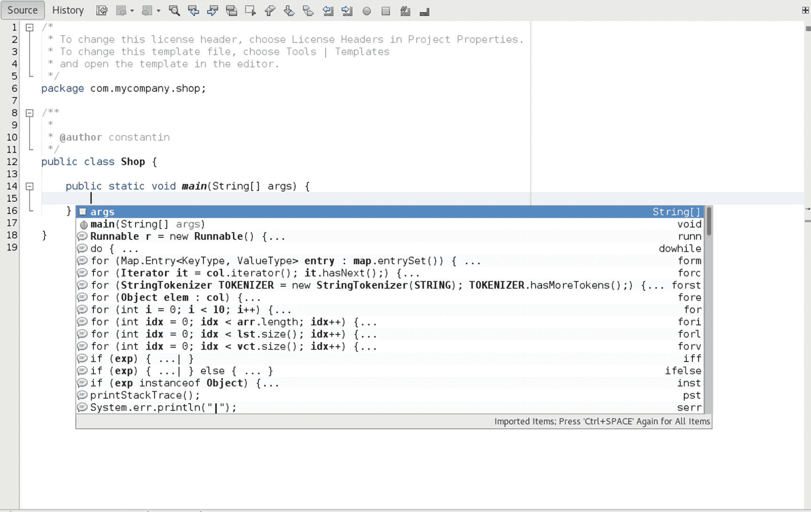

图 2-24

Java 编辑器中的代码补全

代码补全功能比以往任何时候都更智能。例如，如果您想调用一个变量、类或方法，自动弹出的代码补全对话框将列出所有已定义的元素，并通过键入元素名称的第一个字符帮助您轻松选择所需的元素。

还有*驼峰式补全*。您无需键入所有字符，只需键入您感兴趣的单词的大写字母。然后按 `Ctrl+Space`，驼峰式补全功能将补全元素的完整名称。

您还可以访问元素的 Javadoc。将光标放在元素名称上，然后按 `Ctrl+Space`，如图 2-25 所示。您将看到一个对话框打开，其中包含您所选元素的 Javadoc。

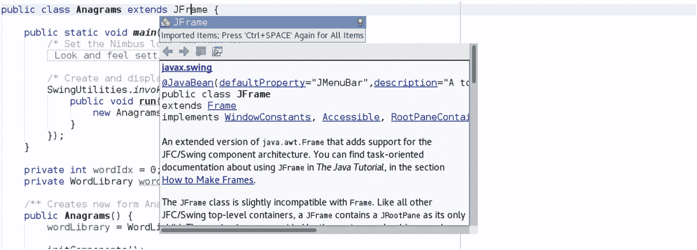

图 2-25

Javadoc 弹出窗口

IDE 还提供关键字补全。在这种情况下，编辑器会检查上下文并建议最相关的关键字。图 2-26 显示了一个示例，您可以看到编辑器如何识别您正在指定一个类定义，并为您提供扩展另一个类或实现接口的机会。

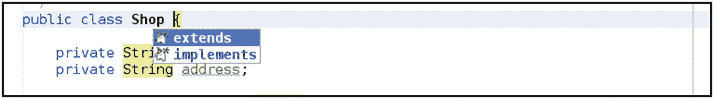

图 2-26

关键字补全

### 提示

*提示*是键入代码时的绝佳指南。提示提供关于如何修复错误以及完成您正在键入的任何语句或表达式的建议。编辑器会在 IDE 左侧边距中为存在提示的代码行显示小的*灯泡*（参见图 2-27）。单击灯泡，将出现一个或多个提示。

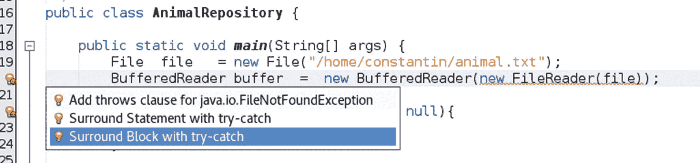

图 2-27

解决环绕语句问题的提示

### 重构

有时您想更改项目中某个特定元素（类、变量、方法）的名称，但这可能会产生连锁反应，因为它可能会破坏依赖关系，即依赖于该名称的其他元素。与其修改每个使用了该名称的文件，不如使用*重构*功能。重构一个元素会将所有出现该旧名称的地方替换为新名称。

例如，假设您想将一个类从 *Animals* 重命名为 *Animal*。以下是让 IDE 为您完成此操作的步骤：

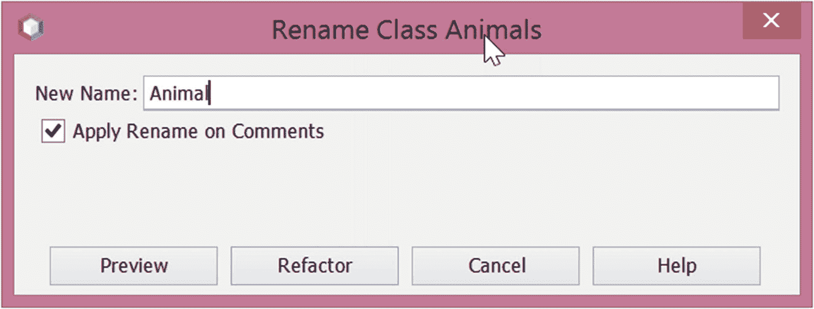

图 2-28

重命名类重构窗口

1.  将光标放在源编辑器中的类名上，然后按 `Ctrl-R`，或者右键单击并从弹出菜单中选择 **重构 ➤ 重命名**（参见图 2-28）。

2.  如果您希望修改也应用于注释中的出现位置，请勾选**在注释上应用重命名**。

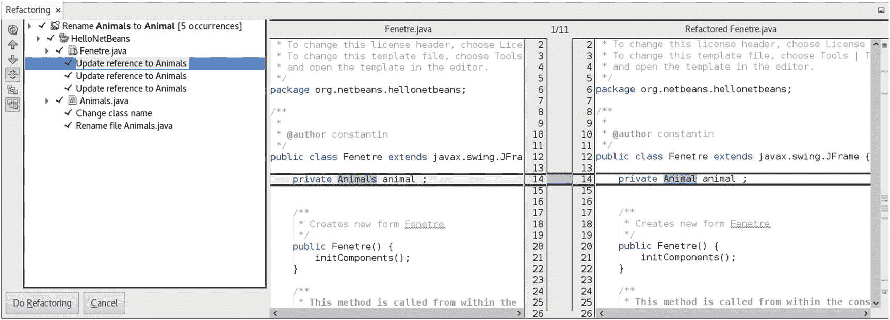

图 2-29

预览重构出现位置

1.  输入类的新名称，然后按**预览**以预览所有出现位置，或按**重构**以直接应用重命名而不进行预览。IDE 将向您展示源文件的两种版本，如图 2-29 所示。

1.  一切看起来都好吗？然后按**执行重构**以应用修改。否则按**取消**。

### 比较文件

编辑器提供了一个“差异”功能来处理查找两个文件之间差异的问题。例如，假设您有两个 *Animal* 类定义，每个定义位于不同的包中。执行以下操作以查看这些定义是否相同或不同：

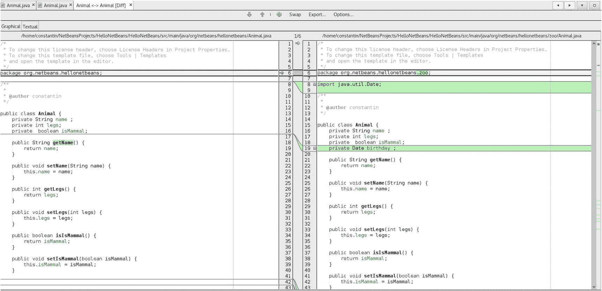

图 2-30

两个文件之间的差异

1.  在源编辑器中打开两个类文件。

2.  右键单击*项目窗口*中的一个源文件，然后选择 **工具 ➤ 比较...** 将出现一个对话框，显示在编辑器中打开的文件列表。

3.  从“在编辑器中打开的文件”列表中选择第二个文件，以显示差异操作的结果。图 2-30 显示了如何使用绿色背景来指示一个文件中存在但另一个文件中缺失的代码行。

### 生成代码

在编写 Java 应用程序时，您可以生成代码片段。IDE 提供了几种选择：使用*代码补全*功能、通过*代码生成*弹出菜单，或使用*重构*功能。代码补全功能可用于在 Java 类主体中添加代码片段。例如，该功能可以帮助在类中生成访问器，您已为该类定义了希望提供给其他类的属性。

图 2-31 展示了如何在 `Animal` 类中为 `name` 属性创建设置器函数。如果弹出菜单没有出现，请键入 `Ctrl+space`。

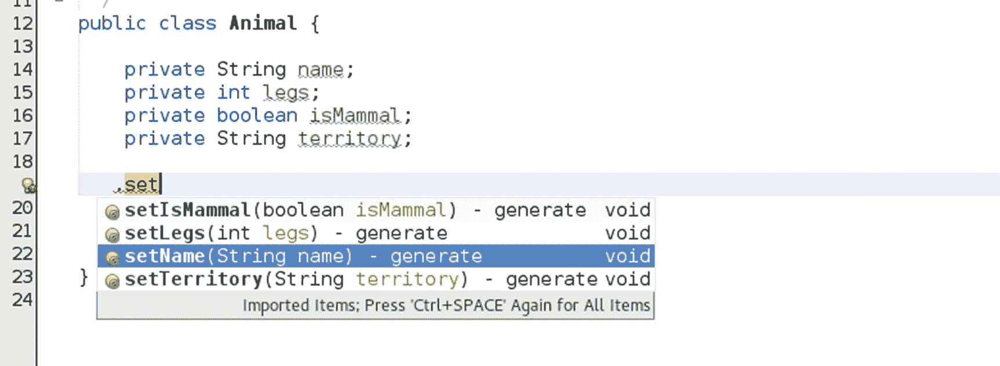

图 2-31

使用代码补全生成代码片段

通过在编辑器中单击并按 `Alt-Insert`（或选择 **源 ➤ 插入代码**）来使用*代码生成*弹出菜单。例如，它有助于生成构造函数，如图 2-32 所示。

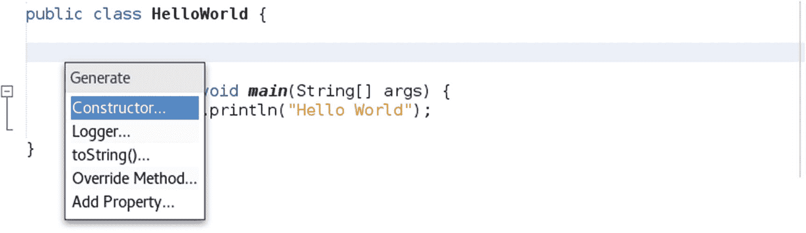

图 2-32

代码生成弹出菜单

得益于这个功能，您可以极其快速地轻松生成类的主体。它只需点击几下即可生成 getter 和 setter、`toString()`、`equals()` 和 `hashCode()` 方法、覆盖超类的方法等。

**添加属性**选项通过一个操作同时创建字段及其访问器。以下是*添加属性*对话框的输入示例（图 2-33）。

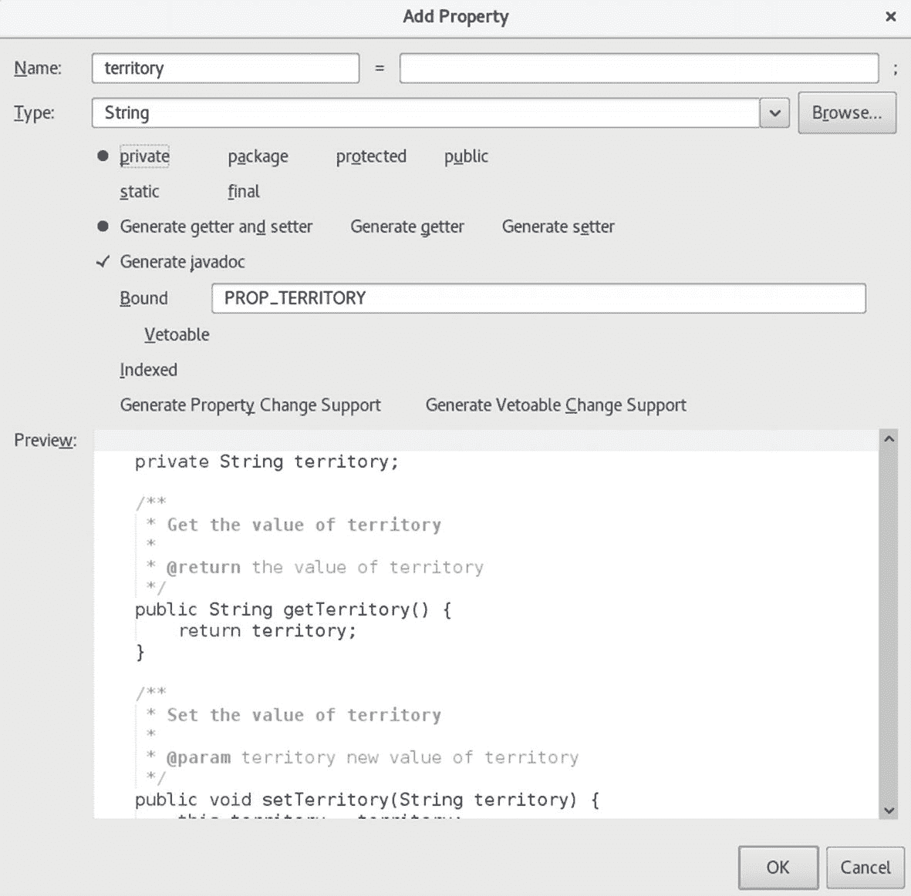

图 2-33

添加属性对话框

生成访问器的第二种选择是选择 **重构 ➤ 封装**。IDE 将显示*封装字段*对话框（参见图 2-34）。

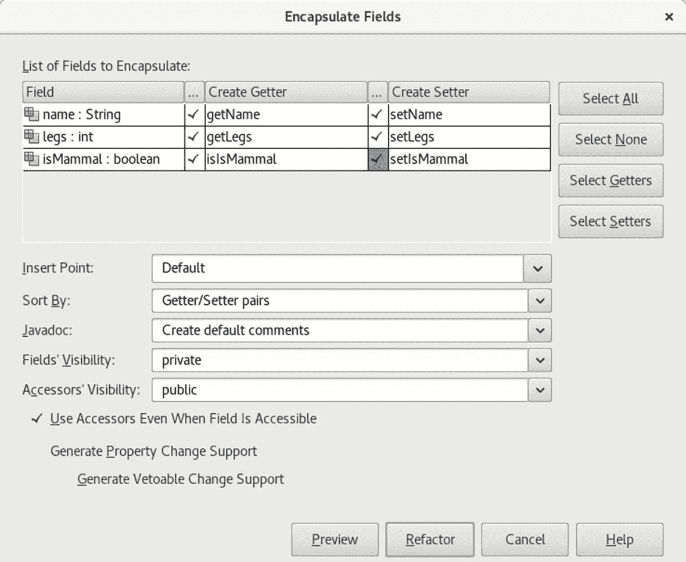

图 2-34

封装字段对话框

选择一个或多个字段，或按**全选**按钮选择所有字段。然后按**重构**以封装这些字段（即，使用您选择的可见性生成访问器）。

### 使用代码模板

IDE 通过代码模板提供预定义的代码片段来提供帮助。代码模板是长代码片段的缩写。

要访问代码模板，请键入缩写并按 `Ctrl+Space`。这样做将展开完整的代码，如图 2-35 所示。您可以看到我键入了关键字 `while`。然后当我按下 `Ctrl+Space` 时，NetBeans 建议了几个以相同关键字开头的代码片段模板。

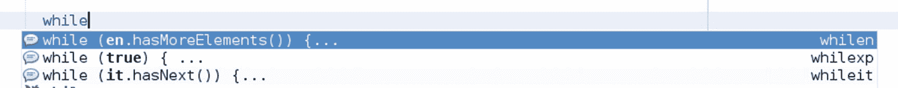

图 2-35

while 的代码模板

有预定义的缩写集及其模板可供您使用，或者您可以通过显示*选项*对话框（参见图 2-36）来自定义现有模板或添加您自己的模板，路径为 **工具 ➤ 选项 ➤ 编辑器 ➤ 代码模板**（在 Mac 上为 **NetBeans ➤ 偏好设置 ➤ 编辑器 ➤ 代码模板**）。

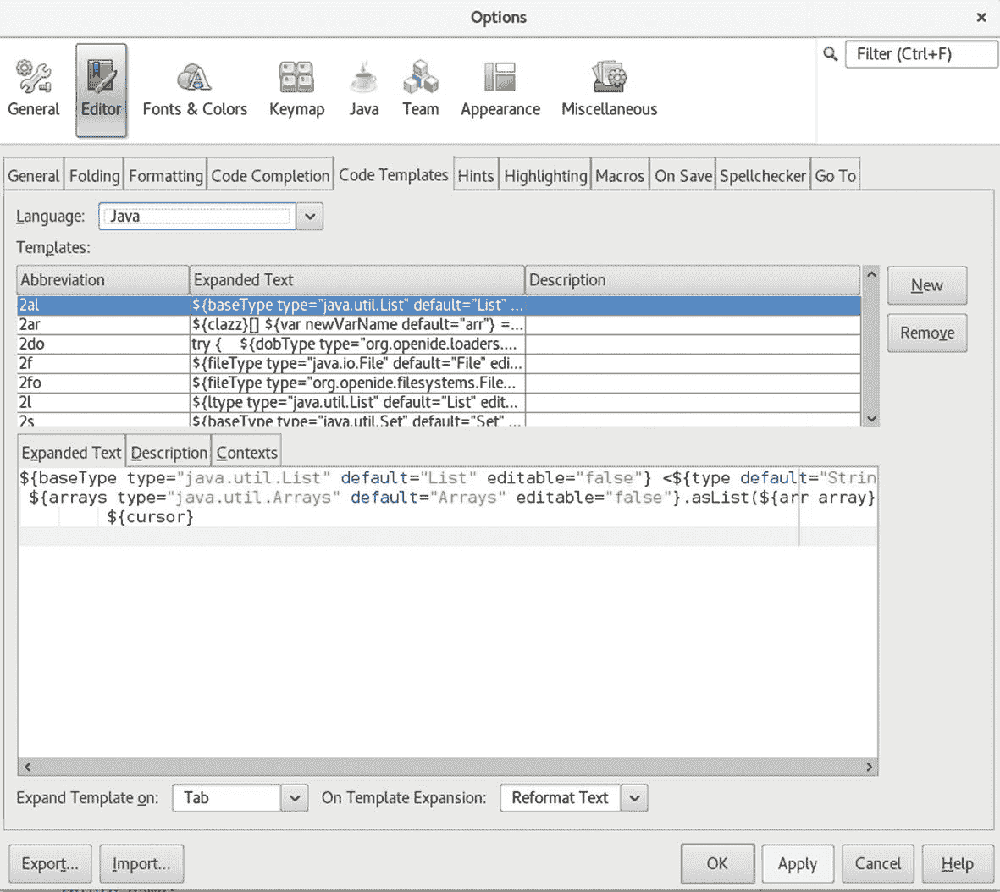

图 2-36

代码模板窗口

### 拆分窗口

我们经常需要同时查看不同的源文件。通过*拆分*源编辑器，您可以轻松地查看两个文件。至少打开两个源文件后，单击一个文件的选项卡，然后将其拖到源编辑器窗口的最左侧、最右侧或底部。当您开始拖动时出现在选项卡周围的红色轮廓变为指示拆分窗口位置的矩形时，松开鼠标按钮。图 2-37 显示了结果。

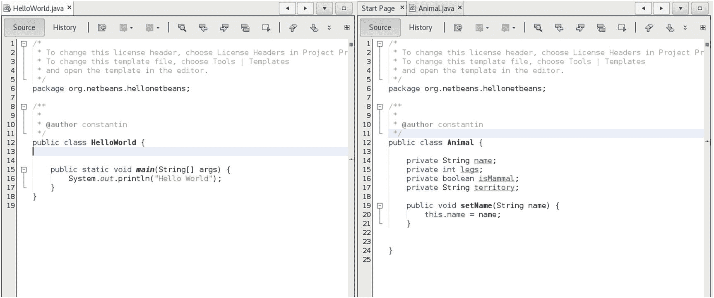

图 2-37

同时查看两个文件

拆分窗口也适用于单个源文件。以下是将源文件拆分为两个视图的四种方法：

*   在每个编辑器窗口的右侧，垂直滚动条上方，有一个小的加号图标，您可以拖动它以水平或垂直拆分窗口。

*   使用菜单操作 **窗口 ➤ 配置窗口 ➤ 拆分文档 ➤ 水平或垂直**。

*   右键单击文件的选项卡并选择**克隆**。

*   右键单击文件的选项卡并选择**拆分 ➤ 垂直**或**拆分 ➤ 水平**。

图 2-38 显示了在两个视图中编辑同一个源文件。这种编辑的好处是，您可以将一个视图定位在，例如，一个类定义上，以便在稍后编写文档中引用该类的代码时提醒自己该类是关于什么的。这是您可能希望在两个或多个选项卡中查看同一文件的众多原因之一。

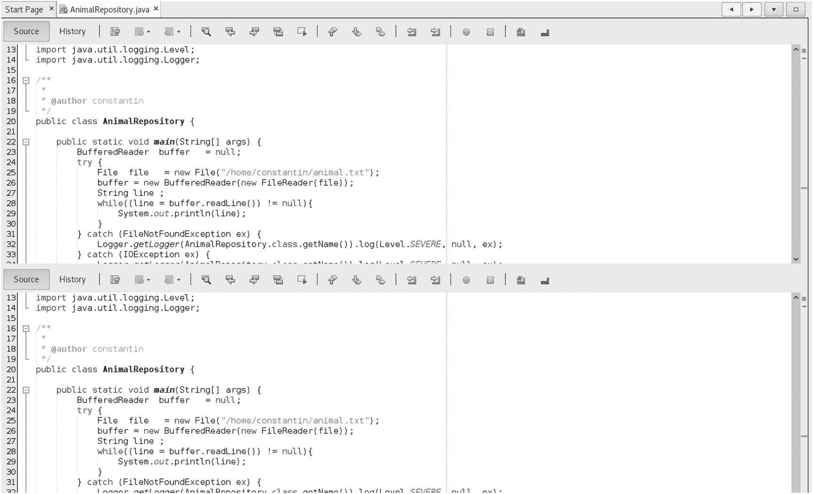

图 2-38

单个文件拆分为两个视图

### 丰富你的 IDE

你可以更改 IDE 的默认设置，并通过插件为其添加更多功能。要安装插件，请打开*插件*对话框（**工具 ➤ 插件**），如图 2-39 所示。然后选择你感兴趣的插件并点击**安装**（安装需要互联网连接，但你也可以通过*已下载*选项卡安装已下载的插件）。

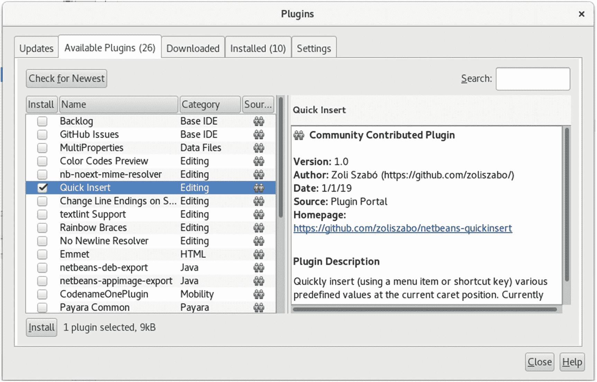

图 2-39

插件对话框

*选项*对话框（**工具 ➤ 选项**，在 Mac 上为 **NetBeans ➤ 偏好设置**）是一个多选项卡窗口，允许你更改 IDE 的任何配置设置。例如，选项对话框是更改编辑器字体和颜色、Java 编码常规配置、代码补全行为等的地方。图 2-40 展示了一个编辑器格式化配置的示例。

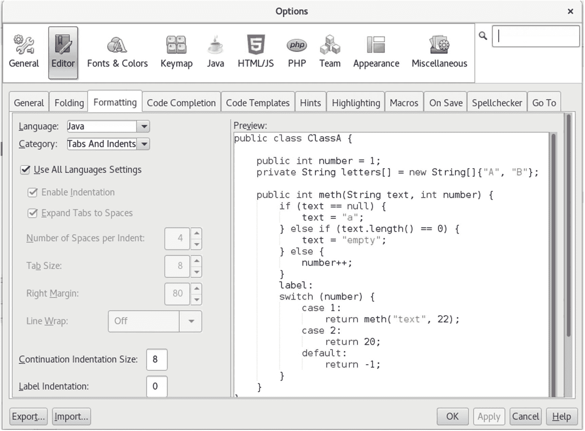

图 2-40

选项对话框

## 结论

本章介绍了 Apache NetBeans IDE 的主要功能。我们了解了 IDE 的布局及默认窗口位置（编辑器、资源管理器、导航器、输出、属性、面板）；我们学习了如何使用 Ant、Maven 或 Gradle 创建 Java 应用程序项目，以及一些提高效率的技巧。现在，你已经掌握了足够的知识，可以在后续章节中进一步探索 Apache NetBeans。

