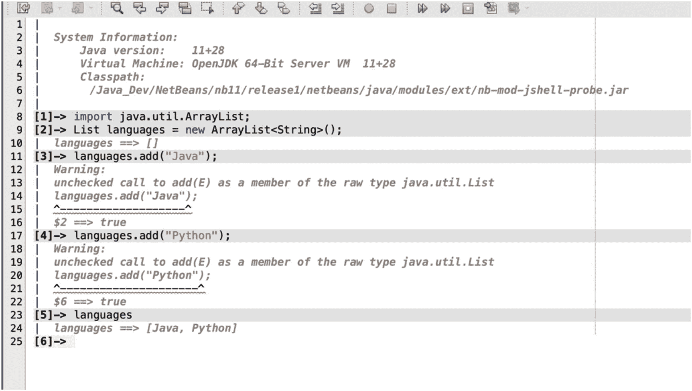
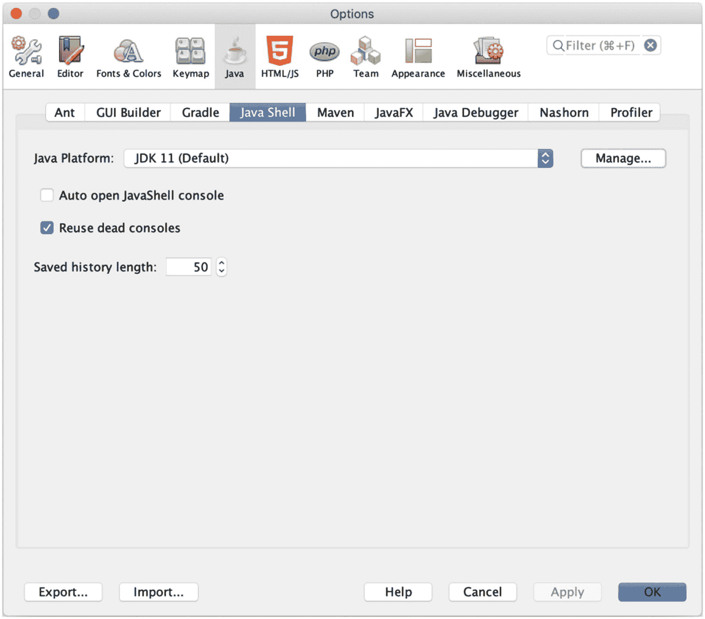
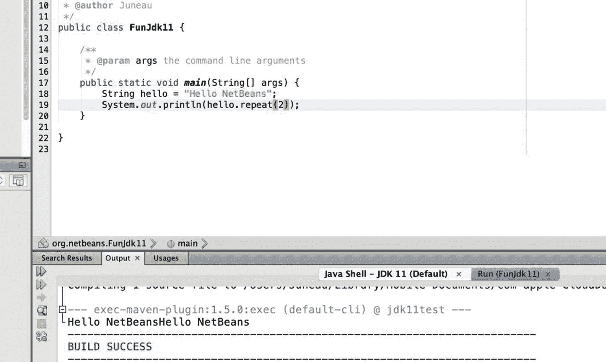
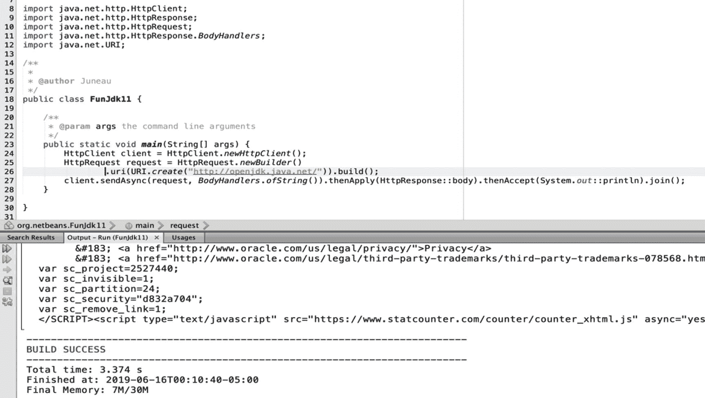
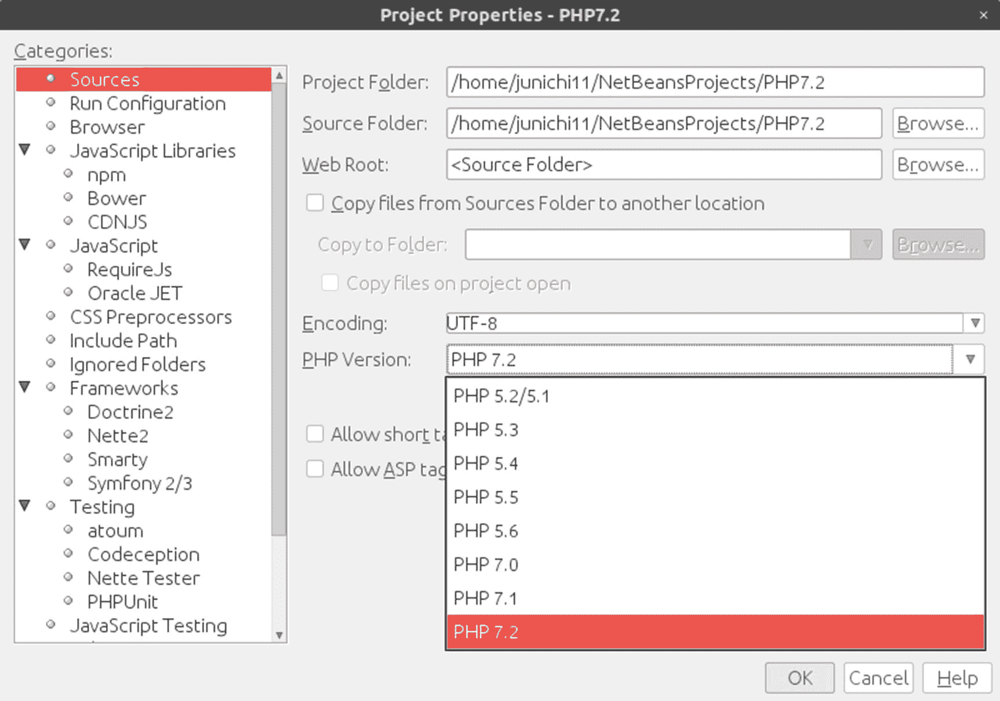
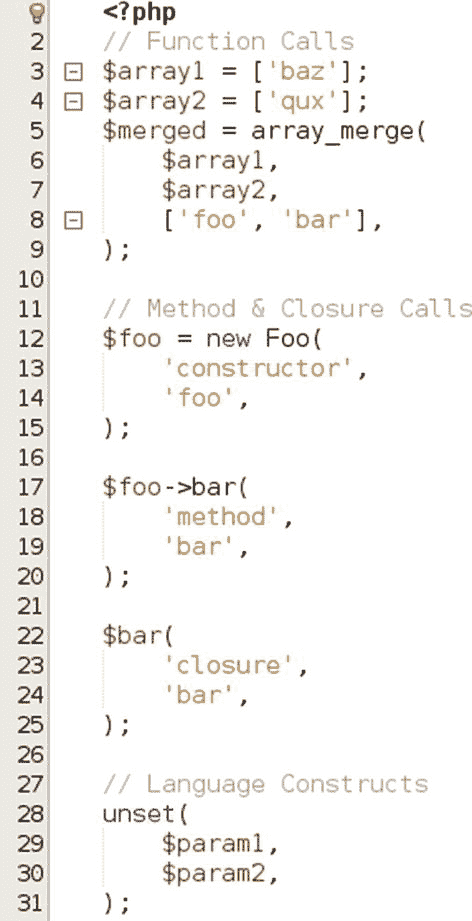
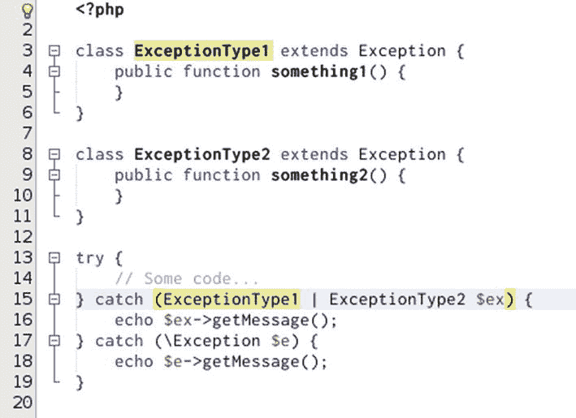

# 3. Apache NetBeans：新特性

自 Oracle 公司发布的最后一个版本 NetBeans 8.2 以来，Apache NetBeans IDE 取得了诸多进步。其发布节奏与 Java 的发布节奏保持高度一致，因此，自 IDE 开源以来，在短时间内发布了多个版本。Apache NetBeans 9 侧重于模块化支持和 JShell。版本 10 包含了 JDK 11 支持和 PHP 等新特性。Apache NetBeans 11 则针对 JDK 12 支持、Java EE 和 Gradle 支持。

### 注意

需要特别注意的是，为了利用特定 JDK 版本的功能，你必须在相同或更高版本的 JDK 上运行 Apache NetBeans。你可以通过设置 `netbeans/etc/netbeans.conf` 配置文件中的 `netbeans_jdkhome` 属性，轻松地将 Apache NetBeans 设置为在不同版本的 JDK 上运行。

在本章中，我们将简要介绍过去几个版本中一些最重要的新特性。本章不会深入探讨这些特性，旨在提供一个快速概览。不过，本章提到的许多特性在本书的其他部分都有更详细的章节进行深入介绍。

## Apache NetBeans 9.0

Apache NetBeans 9.0 的重要新特性包括模块化支持、局部变量类型推断和 JShell。在本节中，我们将简要介绍这些特性，让你快速了解它们的用法。

### Jigsaw（模块化）支持

JDK 在其整个生命周期中最大的新特性之一可能就是 Java 模块化系统的发布，它更广为人知的名字是 Jigsaw。Java 平台中的模块化系统允许将应用程序分解为多个模块，而不是作为一个单一的大型应用程序。

作为模块系统的一部分，`Modulepath` 已优先于 `CLASSPATH`。Apache NetBeans 中添加了 `Modulepath`，以提供对模块的支持，同时兼容那些仍在使用 `CLASSPATH` 的应用程序。

一个标准的 Java SE 项目可以通过在其默认包中添加一个 `module-info.java` 文件来成为一个模块。Apache NetBeans IDE 完全支持 `module-info.java`，包括自动补全功能。还有一种基于 Ant 的项目类型，称为 Java 模块化项目。此项目类型可用于创建由多个模块组成的模块化应用程序。首先，打开**新建项目**向导，选择 **Java with Ant** 类别，然后选择 **Java 模块化项目**。

### 局部变量类型推断

局部变量类型推断将 **var** 关键字引入 Java 语言。这允许开发者声明一个 `var` 类型，而编译器会根据代码中的其他局部变量推断其类型。Apache NetBeans IDE 包含许多功能来帮助开发者使用局部变量类型推断。编辑器中添加了许多“提示”，用于指示何时输入的代码支持改用局部变量类型推断。可以点击提示以立即应用建议的更改。

例如，有一个提示是*将显式类型替换为 'var'*，反之亦然。还有用于拆分复合声明的提示。所有这些都内置于 Apache NetBeans 中，使代码更易于阅读和管理。

### JShell

JShell 是 Java 语言中一个期待已久的功能，因为许多现代语言现在都在发行版中附带了一个 REPL（读取-求值-打印-循环）工具。Java 语言在 JDK 9 中获得了 REPL，即 JShell。该工具提供自动补全和基本的开发/测试功能。它还允许动态执行 Java 代码，无需编译即可评估语句和代码块。Apache NetBeans IDE 通过在编辑器窗格中提供一个 REPL 实例来支持 JShell，以便快速访问。要打开 JShell，请使用 **工具** ➤ **打开 Java 平台 Shell** 菜单选项。选择后，编辑器窗口将打开运行 Apache NetBeans 的 Java 平台的 JShell 工具。

### 注意

你必须使用 JDK 9 或更高版本运行 Apache NetBeans，才能使用 JShell 工具。

进入 JShell 编辑器后，该工具的使用方式与在命令行中完全相同。也就是说，可以执行 Java 语句或代码块，而无需将它们封装到 Java 类中。此外，Java 代码无需编译即可执行。这使得 JShell 编辑器非常适合进行测试。参见图 3-1。

图 3-1

Apache NetBeans JShell 编辑器

在 Apache NetBeans 中使用 JShell 有一些很大的好处。在编辑器中工作时，可以测试代码，然后点击**保存到类**按钮，一键将代码保存到 Java 类中。JShell 也可以作为代理配置到基于 Ant 的 Java SE 应用程序中，允许应用程序调用 JShell。Apache NetBeans 的偏好设置面板包含用于配置 JShell 历史记录、自动打开 JShell 以及修改用于 JShell 的 JDK 的选项。参见图 3-2。

图 3-2

JShell 支持

## Apache NetBeans 10.0

Apache NetBeans 10.0 版本包含了几项重大增强，即 JDK 11 和 PHP 支持。在本节中，我们将简要介绍这些特性，以便你可以开始全面探索它们。

### JDK 11 支持

JDK 11 是自引入新发布周期以来 Java 的首个长期支持（LTS）版本。此版本包含了一些出色的新特性，Apache NetBeans 完全支持这些特性。JDK 11 拥有多项新功能，从新的 `String` 方法到新的 HTTP 客户端。Apache NetBeans 对这些特性提供了全面支持。

以新的 Java `String` 方法支持为例，IDE 将自动补全新增的方法。在下面的截图（图 3-3）中，您可以看到新的 `repeat()` 功能。

图 3-3

### JDK 12 支持

该 IDE 还完全支持新的 HTTP 客户端。如下一张截图所示（图 3-4），`HttpClient` 可以在 Java SE 类中使用，并且 IDE 在编码时提供完整的自动补全支持。

图 3-4

HttpClient 支持

### PHP

Apache NetBeans IDE 完全支持 PHP 7.0、7.1、7.2 和 7.3。这使得用户能够利用一些最新的 PHP 进展来创建新的 PHP 项目。PHP 成为 Apache NetBeans 的一部分已有多年，但直到 PHP 7.0，无需安装额外插件即可获得支持。自 Apache NetBeans 10.0 起，PHP 已成为标准发行版的一部分。请参见图 3-5。

图 3-5

PHP 新建项目对话框

Apache NetBeans 编辑器支持 PHP 中的 `"void"` 类型等特性，以及 PHP 7.3 中的其他任何 PHP 增强功能。例如，它支持在函数调用中允许使用尾随逗号。这有助于避免意外忘记逗号，或者列表可能在某个时刻继续增长的情况。请参见图 3-6。

图 3-6

尾随逗号支持

PHP 的另一个较新特性是支持多重捕获异常处理，Apache NetBeans 环境也支持此特性（图 3-7）。

图 3-7

PHP 多重捕获异常处理

通过使用原生调试器，PHP 开发者的工作也可以变得更加轻松。用户可以在某行代码上设置断点并运行调试器，然后应用程序将运行，一旦到达断点，编辑器将打开到该断点处，使开发者能够调试该时间点的变量值和状态。

PHP 支持方面的所有这些进步，使得 Apache NetBeans 成为用于 PHP 开发的最重要的 IDE 之一。

## Apache NetBeans 11.0

Apache NetBeans 11.0 版本包含对 Java EE 和 Gradle 的完全支持，以及对 JDK 12 特性的支持。

### JDK 12 支持

Java 的发布节奏使得 JDK 每六个月发布一个新版本。因此，Apache NetBeans 的发布周期应使 IDE 能够持续包含对最新 JDK 的支持。也就是说，JDK 12 支持已添加到 Apache NetBeans 11.0 中，包括 switch 表达式支持的预览版，以及对紧凑数字格式化的支持。这包括针对新的 `switch` 支持的“转换为规则 switch”等提示。

### Java EE 支持

在 Apache NetBeans 10.0 及之前版本中，如果用户希望使用 Java EE 特性，需要通过 Apache NetBeans 8.2 更新中心启用相关模块。这是因为 Java EE 支持尚未成为 Apache NetBeans 发行版的一部分。从 Apache NetBeans 11.0 开始，完整的企业集群已被转移并成为 Apache NetBeans 发行版的一部分。这意味着，开箱即用，Apache NetBeans 发行版就包含了对 Java EE 的完全支持，无需下载和安装任何额外模块。

Apache NetBeans 11.0 不仅包含对 Java EE 的支持，还通过 Apache NetBeans 11.1 中添加的 Java EE 8 支持，包含了对 Jakarta EE 8 的支持。新的支持允许用户使用 Java EE 8 创建一个基于 Maven 的 Jakarta EE/Java EE 项目。它还允许用户安装符合 Java EE 8 标准的应用服务器容器，并通过 IDE 进行管理，例如 GlassFish 5.1。

### Gradle

在之前的 Apache NetBeans 版本中，另一个需要启用的特性是 Gradle 支持。作为 Apache NetBeans 11.0 的一部分，Gradle 支持已成为一等公民，因此可以开箱即用。现在可以开箱即用地打开 Gradle 项目，并且集成了 Gradle 任务导航器，允许通过双击来运行任务。这也允许用户使用 Gradle 支持的单元测试框架，并运行、调试和测试……甚至包括单个方法。

## 结论

Apache NetBeans IDE 随着每个版本的发布而不断进步，支持更新的 JDK 版本，并增加增强功能，使 IDE 对更广泛的开发者群体更有用。如果您有任何希望添加到 Apache NetBeans 中的特性，请加入社区并贡献您的想法。现在，您已准备好开发桌面应用程序了。

