# 4. 开发桌面应用程序

Apache NetBeans 对开发桌面应用程序提供了出色的支持。这里所说的桌面应用程序，是指那些不需要 Web 或应用服务器（尽管后端可以使用）、安装在用户机器上、并提供比浏览器更丰富的图形用户界面（GUI）的应用程序。

从历史上看，*抽象窗口工具包（AWT）* 是随 JDK 1.0 发布的首个 GUI 库。AWT 是 Java 基础类（JFC）的一部分，是为 Java 程序提供 GUI 的标准 [API](https://en.wikipedia.org/wiki/Application_programming_interface)。AWT 的组件（或控件）是“重量级”或原生的，这意味着它们的外观和感觉（L&F）取决于其运行平台（在 Windows 上运行时，按钮看起来像 Windows 按钮；在 MacOSX 上运行时，则像 MacOSX 按钮等）。AWT 是多线程的，仅提供对 GUI 组件的基本支持，并且可以在浏览器中运行而无需插件。

*Swing* 随 JDK 1.2 发布，是 AWT 的替代品。Swing 的开发目的是提供一套比早期抽象窗口工具包（AWT）组件更复杂的“轻量级”GUI 组件（完全用 Java 编写，因此与平台无关）。Swing 提供了一种模拟多种平台外观和感觉的[外观和感觉](https://en.wikipedia.org/wiki/Look_and_feel)，并且支持可插拔的外观和感觉，允许应用程序拥有与底层平台无关的外观和感觉。Swing 遵循单[线程](https://en.wikipedia.org/wiki/Thread_%2528computing%2529)编程模型；所有与 GUI 相关的代码都在*事件分发线程（EDT）* 中执行。此外，该框架在代码结构和基于 Swing 的 GUI 的图形表示之间提供了一个抽象层。

*JavaFX* *（*[`https://openjfx.io/`](https://openjfx.io/)*）* 是 Java 提供的最新 GUI 库，用于构建丰富的 GUI 或*富互联网应用程序（RIA）*，这些应用程序可以在各种设备上运行。JavaFX 将 UI 呈现（通常在 XML 文件 – `.fxml` 中声明）与实际逻辑（动作事件等）分离开来。这样，您就可以使用*层叠样式表（CSS）* 来装饰 GUI，而无需重新编译应用程序。JavaFX 1.0.2 于 2008 年发布。从 JDK 7u6 开始，它已被集成到 JDK 中。JavaFX 8 包含在 JDK 8 中；然而，从 JDK 11 开始，JavaFX 再次与 JDK 分离。JavaFX 由 Gluon（[`https://gluonhq.com/`](https://gluonhq.com/)）积极维护。虽然 JavaFX 旨在替代 Swing，但两者都将在市场上共存相当长一段时间。

## Apache NetBeans 对桌面应用程序的支持

Apache NetBeans IDE 提供了多种工具来简化构建 GUI 的过程，如图 4-1 所示。

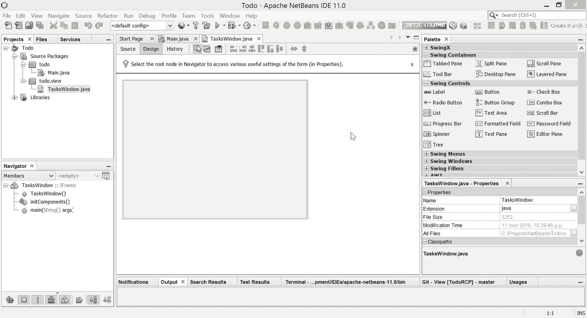

图 4-1

Apache NetBeans GUI 开发工具

*   **GUI 构建器**：这是您设计应用程序 GUI 的地方。GUI 构建器，或称 *Matisse*，允许您通过将组件放置在所需位置，并以参考线的形式提供视觉反馈来布局表单。

*   **导航器窗口**：显示当前打开表单中包含的所有组件的树形层次结构。这些可以是可视组件和容器，例如按钮、标签、菜单、面板等，也可以是非可视组件，例如计时器和数据源。

*   **组件面板窗口**：包含可以通过拖放添加到表单中的组件或控件组。组件面板窗口可以自定义为仅显示图标，或显示图标及组件名称。借助*组件面板管理器*，您可以向组件面板添加新组件。

*   **属性窗口**：允许更改当前所选组件的属性，例如显示的文本、大小等。它还允许添加/修改事件和绑定。

Apache NetBeans 支持使用 AWT、Swing 或 JavaFX 开发桌面应用程序。可视化设计能力是 NetBeans 最强大的功能之一。构建应用程序 UI 的原型有助于最终用户陈述他们的需求，这也是可视化 GUI 构建器如此受欢迎的原因之一。

通常，您需要创建一个新的 Java 应用程序，然后使用向导或通过从组件面板拖放控件来添加 GUI 组件。

在继续之前，请打开一个现有的 Java 应用程序 NetBeans 项目，或者创建一个新的 *Java 应用程序* 项目，如图 4-20 所示，方法是选择 **文件 ➤ 新建项目** 菜单项，然后单击 **下一步**。在向导的步骤 2 中，提供项目名称并选择合适的项目位置（硬盘上的任意位置），如图 4-21 所示。然后点击 **完成**。最后，在 *项目* 选项卡中选择项目或项目的 *源包*，然后点击 **文件 ➤ 新建文件**，具体操作将在以下章节中说明。

### AWT 支持

如今使用 AWT 进行开发非常罕见，因此本书将不涉及此内容。不过，我们将简要介绍 Apache NetBeans 对 AWT 的支持。您可以创建多种 AWT 表单，如图 4-2 所示。您可以通过点击菜单 **文件 ➤ 新建文件** 来打开此向导。

*   **Applet 表单**：创建一个新的 `java.applet.Applet`。*Applet* 是可以在（支持 Java 的）浏览器中运行的小型应用程序。

*   **对话框表单**：在应用程序或 Applet 中创建一个新的 `java.awt.Dialog`。对话框可以是*模态*的（对话框会阻塞应用程序，等待用户输入）或*非模态*的（对话框不会阻塞应用程序等待用户输入）。

*   **框架表单**：创建一个基于 `java.awt.Frame` 的新表单，通常用作应用程序中的顶层窗口。

*   **面板表单**：创建一个 `java.awt.Panel`，可以添加到 AWT 容器中，例如 `Frame`、`Dialog` 或 `Applet`。

一旦您将上述任一表单添加到应用程序中，NetBeans 中就会出现设计编辑器以及组件面板。图 4-3 显示了您可以拖放到 AWT 表单上的可用控件。AWT 表单支持不同的布局，您可以通过右键单击表单并从弹出菜单中选择 **设置布局** 来设置布局。

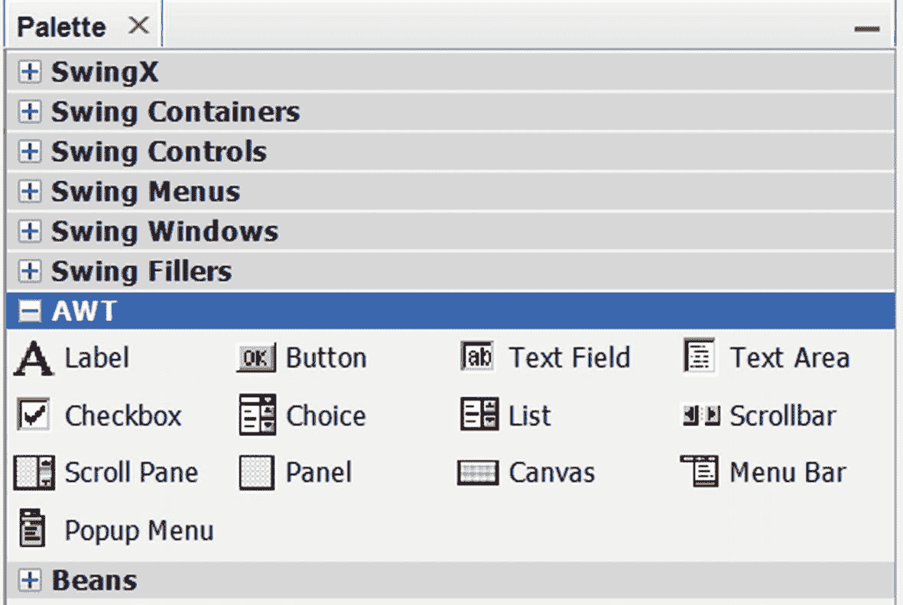

图 4-3

AWT GUI 控件

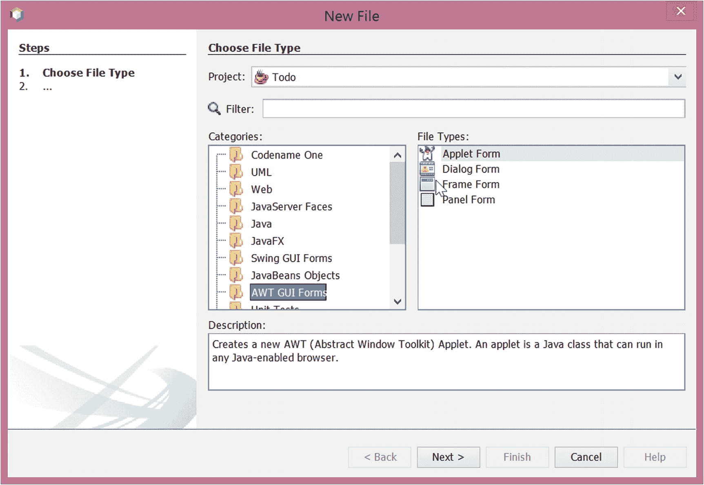

图 4-2

AWT GUI 表单


### Swing 支持

与 AWT 类似，*新建文件*向导会提供如图 4-4 所示的选项。

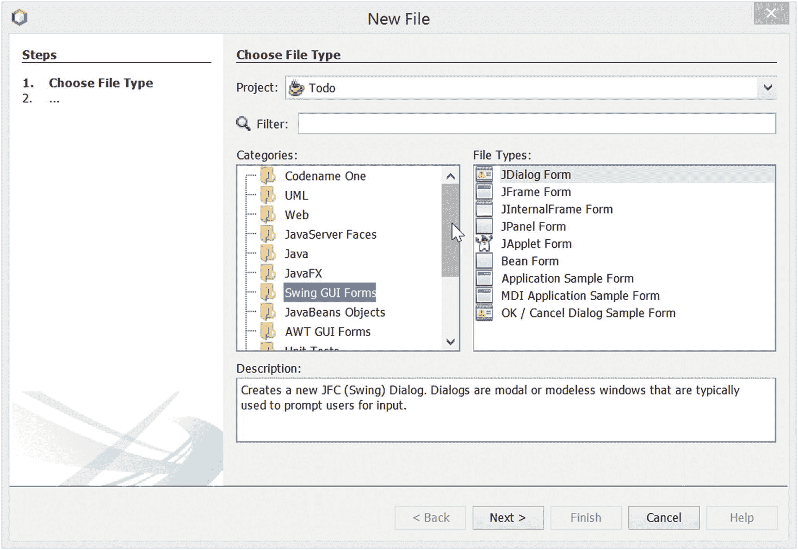

图 4-4

Swing GUI 窗体

*   **JDialog 窗体**：在应用程序中创建一个新的 `javax.swing.JDialog`。对话框可以是*模态*或*非模态*的。

*   **JFrame 窗体**：创建一个基于 `javax.swing.JFrame` 的新窗体，通常用作应用程序中的顶层窗体。

*   **JInternalFrame 窗体**：创建一个基于 `javax.swing.JInternalFrame` 的新窗体，用于实现*多文档界面 (MDI)* 应用程序。这些应用程序包含多个可调整大小的窗口，这些窗口都显示在应用程序窗口的边界内（参见 [`https://docs.oracle.com/javase/tutorial/uiswing/components/internalframe.html`](https://docs.oracle.com/javase/tutorial/uiswing/components/internalframe.html)）。

*   **JPanel 窗体**：创建一个 `javax.swing.JPanel`，可用于 `JFrame` 和 `JDialog` 等 Swing 容器中。

*   **JApplet 窗体**：创建一个 Swing 小程序，可以在具有必要 Java Swing 插件的浏览器窗口中运行。由于小程序已不再流行，并被 HTML5 和 JavaScript 等其他技术所取代，本书将不再进一步讨论。

*   **Bean 窗体**：基于 JavaBean 组件创建一个新窗体。

*   **应用程序示例窗体**：创建一个基于 `javax.swing.JFrame` 的骨架窗体应用程序，其中包含在窗体中创建的标准**文件**、**编辑**和**帮助**菜单。这可以作为应用程序主窗口的一个非常有用的起点。

*   **MDI 应用程序示例窗体**：与上一个骨架窗体应用程序相同，但允许添加 `JInternalFrame` 来创建 MDI 应用程序。

*   **确定 / 取消对话框示例窗体**：创建一个包含**确定**和**取消**按钮的示例对话框（模态或非模态）。您可以使用此模板创建消息框和任何其他对话框。

图 4-5 显示了面板中可用于拖放到 Swing 窗体上的可用小部件。您会看到各种小部件按类别分组（例如，Swing 容器、Swing 控件、Swing 菜单、Swing 窗口和 Swing 填充器）。

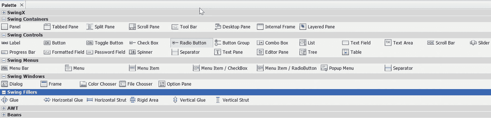

图 4-5

Swing GUI 小部件

Apache NetBeans 可视化编辑器允许您通过将组件（或小部件）从面板拖放到其上来开发 GUI。只需在 `JFrame` 内部右键单击，然后选择**设置布局**菜单项（见图 4-6）。您会看到默认选择不是传统的 Swing/AWT 布局管理器；而是一个名为*自由设计*的东西。这意味着您正在使用 *Matisse* 可视化 GUI 构建器，该构建器是在 NetBeans 5 中引入的。*Matisse* 将 `JFrame` 配置为使用在 SwingLabs [java.​net](http://java.net) 项目中开发的 `GroupLayout` 布局管理器。

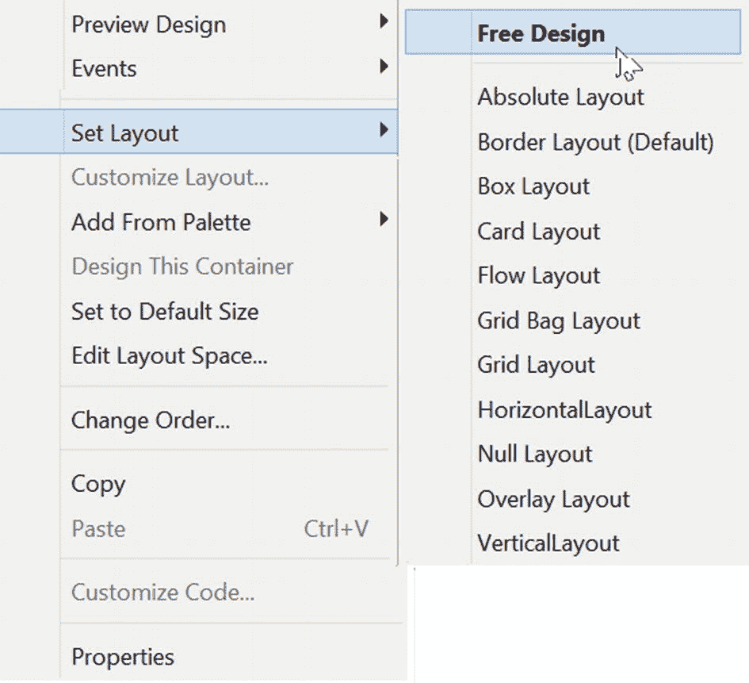

图 4-6

Swing 布局

#### 对齐组件

为了帮助我们在窗体中布局控件，Apache NetBeans 在设计视图顶部提供了一个工具栏（见图 4-7），其中包含用于对齐和预览窗体的工具。


图 4-7

Swing GUI 设计器工具栏

*   **源代码视图**：显示窗体的源代码。

*   **设计视图**：显示 GUI 设计器。

*   **历史记录**：显示源代码的本地历史记录，如果您需要恢复到以前的版本，这会很有用。

*   **选择模式**：允许选择组件。

*   **连接模式**：允许在两个组件之间创建连接，以便一个组件上的事件可以触发另一个组件上的事件。

*   **预览设计**：允许预览窗体在运行时的显示方式。

*   **列左对齐**：允许将多个组件左对齐。

*   **列右对齐**：允许将多个组件右对齐。

*   **水平居中**：允许将多个组件水平居中。

*   **行顶对齐**：允许将多个组件顶部对齐。

*   **行底对齐**：允许将多个组件底部对齐。

*   **垂直居中**：允许将多个组件垂直居中。

*   **更改水平可调整大小性**：水平调整所选组件的大小，而不是将其锚定到其他组件的左侧和右侧。

*   **更改垂直可调整大小性**：垂直调整所选组件的大小，而不是将其锚定到其他组件的顶部和底部。

Matisse 还允许将一组选定的组件沿第一个选定组件的轴居中。水平和垂直居中均可用。必须选择多个组件；然后所有组件都基于最宽的选择居中。另一个选项允许组件在其父容器中水平和垂直居中。我们将在本章后面看到一些示例。

#### 锚定组件

顾名思义，将组件锚定到一个位置意味着，即使其容器调整大小，该组件也将相对于其他组件或边界保持在该位置。

当我们锚定一个组件时，基本上是在说，当我们调整窗体大小时，我们希望该组件与另一个组件保持对齐。例如，如果我们将一个 `JLabel` 锚定到 `JFrame` 的右下角，那么当我们展开 `JFrame` 时，该标签将保持在右下角。为了指示一个小部件已锚定到另一个对象，Apache NetBeans 会显示一条水平或垂直的虚线，终止于该组件所锚定的边界。如果组件在特定边缘未锚定，则会显示一条锯齿线，指示该组件的位置可能在指定方向上扩展。在图 4-8 中，`JLabel` 被锚定到框架的右下角。因此，在标签与 `JFrame` 的底部和右侧边缘之间有一条虚线，而在 `JFrame` 的左侧和顶部边缘之间有一条锯齿线。

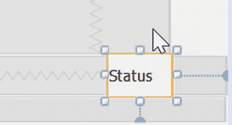

图 4-8

锚定标签

您也可以右键单击小部件，然后从上下文菜单中选择**锚定 ➤**（**左、右、上、下**）。

#### 调整组件大小

当我们调整窗体大小时，锚定的组件会移动以保持其位置，但组件本身不会被调整大小。

如果我们希望允许组件在窗体调整大小时自动调整大小，我们必须指定该组件可以自动调整大小。右键单击该组件，选择**自动调整大小**菜单项，然后选择*水平*或*垂直*（或两者）。图 4-9 显示了图 4-8 中的 `JLabel`，它可以在水平和垂直方向上自动调整大小。您现在会注意到两条锯齿线都已转换为虚线。

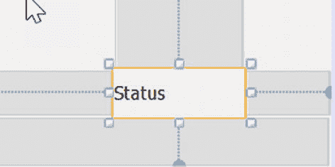

图 4-9

自动调整标签大小

您也可以双击每个周围的空白区域，并使用*编辑布局空间*对话框定义空间的精确大小。

要将两个或多个小部件设置为相同大小，请选择它们，右键单击其中任何一个，然后从上下文菜单中选择**设置相同大小 ➤ 设置宽度**（或**相同大小 ➤ 设置高度**）。


#### 属性

*属性*窗口分为三个类别：

*   **属性**选项卡（见图 4-10）：在此部分可编辑所选组件的可编辑属性。属性通常按以下分组进行组织：*属性*、*其他属性*、*布局*和*辅助功能*。

*   **事件**选项卡（见图 4-11）：允许定义当某些事件（例如，鼠标点击、按键按下等）被触发时，在组件上执行哪些操作。例如，要为一个按钮定义 `actionPerformed()`，请点击 `actionPerformed` 事件旁边的下拉菜单（一个黑色小向下箭头）；此时会弹出一个窗口，为事件处理程序建议一个名称。该名称由正在编辑的控件名称和事件名称组成。选择事件处理程序的名称后，NetBeans 会自动打开*源代码*窗口，并将光标置于准备输入事件处理程序代码的位置。你会注意到源代码编辑器包含一些无法编辑的区域。这是必要的，因为这些代码是由 GUI 构建器自动生成的，手动更改这些代码可能会破坏代码与 GUI 设计器之间的绑定。最后，点击 GUI 设计器中的 **…** 按钮，可以添加、删除或重命名事件处理程序。

*   **代码**选项卡（见图 4-12）：允许为组件提供自定义代码片段，例如，任何初始化前/初始化后的代码等。

### 注意

旧版本的 NetBeans（在捐赠给 Apache 之前）还有一个*绑定*选项卡。不幸的是，由于许可问题以及 JSR 295 ([`https://jcp.org/en/jsr/detail?id=295`](https://jcp.org/en/jsr/detail%253Fid%253D295)) 尚未成为正式标准，该选项卡已从 Apache NetBeans 中移除。有关更多信息，请查看此 JIRA 条目 ([`https://issues.apache.org/jira/browse/NETBEANS-530`](https://issues.apache.org/jira/browse/NETBEANS-530))。

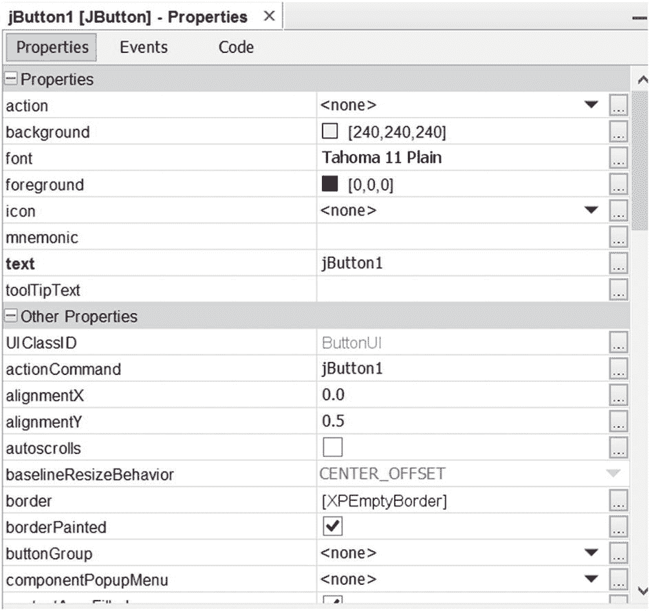

图 4-10

属性窗口

你可以通过以下三种方式之一修改属性：

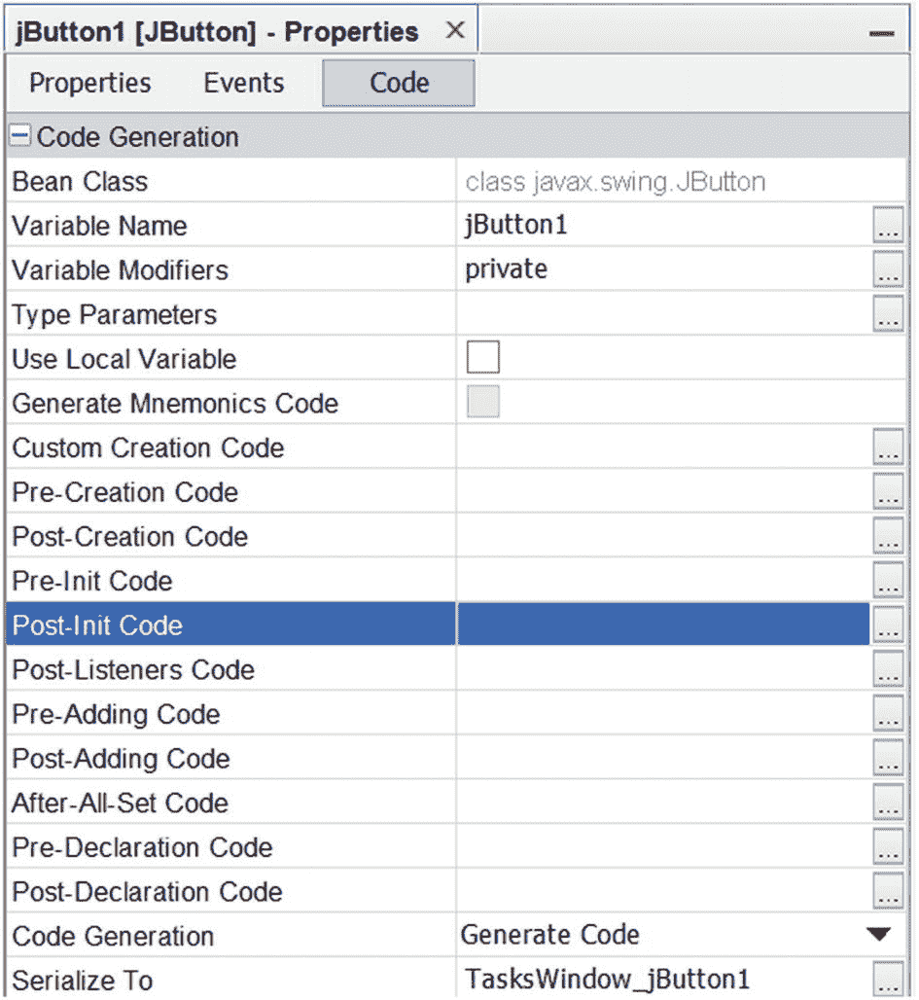

图 4-12

自定义代码

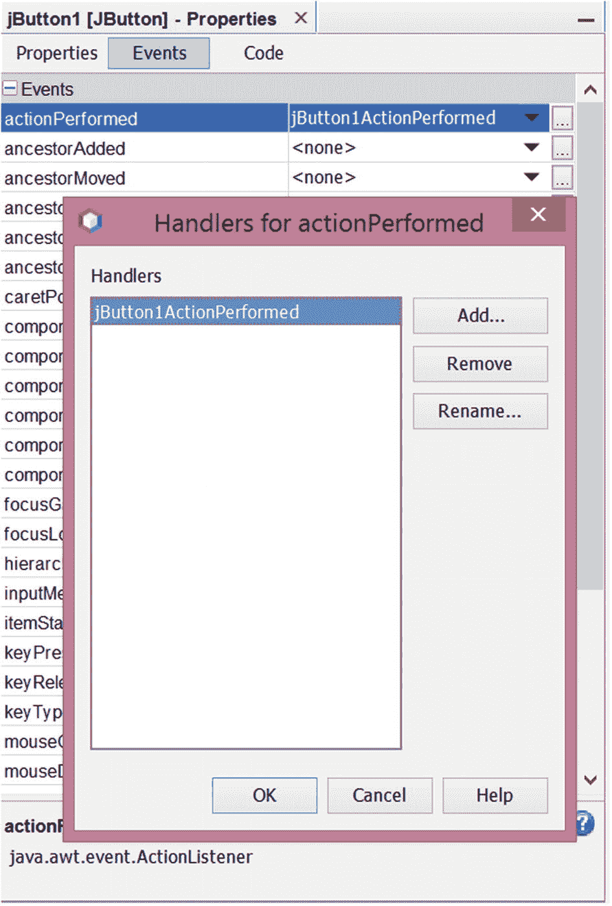

图 4-11

事件

*   直接编辑其值，
*   使用下拉菜单（如果存在），
*   使用自定义编辑器（通过 … 按钮）。

#### 连接工具

Apache NetBeans 提供了一种简便的方法来建立组件之间的连接，即使用*连接模式*按钮（见图 4-7）。点击该按钮后，NetBeans 会显示一条消息，要求选择将生成事件的组件：


选择源组件后，NetBeans 会显示一条消息，要求选择将接收事件的组件：


选择接收事件的组件后，NetBeans 将显示图 4-13 的*连接向导*窗口。

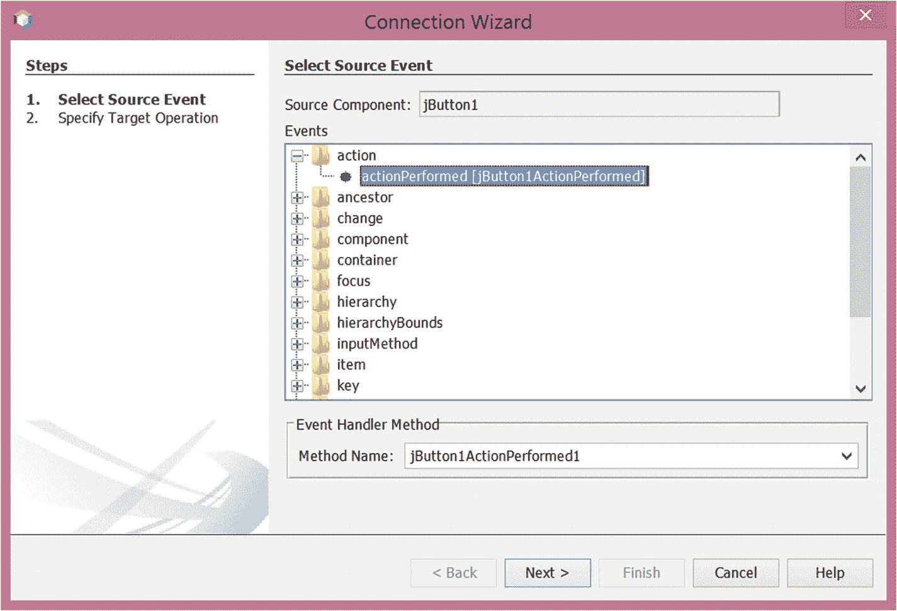

图 4-13

连接向导步骤 1

选择源事件，点击**下一步**，并指定目标操作（见图 4-14）。

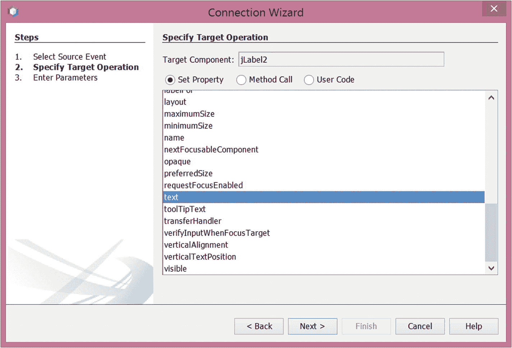

图 4-14

连接向导步骤 2

在下一步中，你需要输入目标将如何被修改（见图 4-15）。

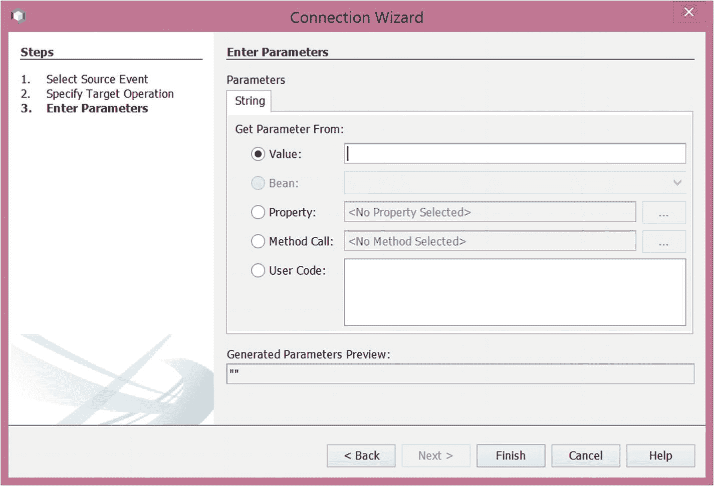

图 4-15

连接向导步骤 3

要查看演示 Swing 窗体的示例项目，请创建一个新项目（菜单 **文件 ➤ 新建项目**），选择 *Samples/Java* 类别和 *GUI Form Examples* 文件类型。生成的项目包含三个 Swing 窗体示例（`Antenna`、`ContactEditor` 和 `Find`），这些示例能让你了解 Apache NetBeans IDE 在设计 GUI 方面提供的一些功能。同一类别下的 *Anagram Game* 是另一个示例。

### JavaFX 支持

Apache NetBeans 允许你通过点击 **文件 ➤ 新建项目** 菜单项来创建 JavaFX 项目。你可以创建基于 Ant 或基于 Maven 的 JavaFX 项目。选择 **Java with Ant ➤ JavaFX** 类别，然后选择其中一个可用的 JavaFX 项目，如图 4-16 所示。或者选择 **Java with Maven** 类别，然后选择 **JavaFX Application** 项目。在第一种情况下，你可以创建一个 JavaFX 应用程序，使用 Java 代码开发 GUI，或者使用 FXML 文件来编写应用程序的 GUI 控件脚本。你还可以创建一个混合了 Swing 和 JavaFX 组件的应用程序。

创建 JavaFX 应用程序后，你可以使用 **文件 ➤ 新建文件** 向导添加额外的 FXML 文件的 JavaFX 类，如图 4-17 所示。

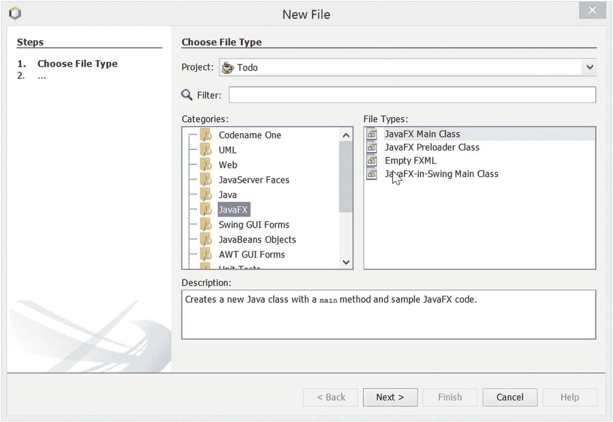

图 4-17

JavaFX 文件类型

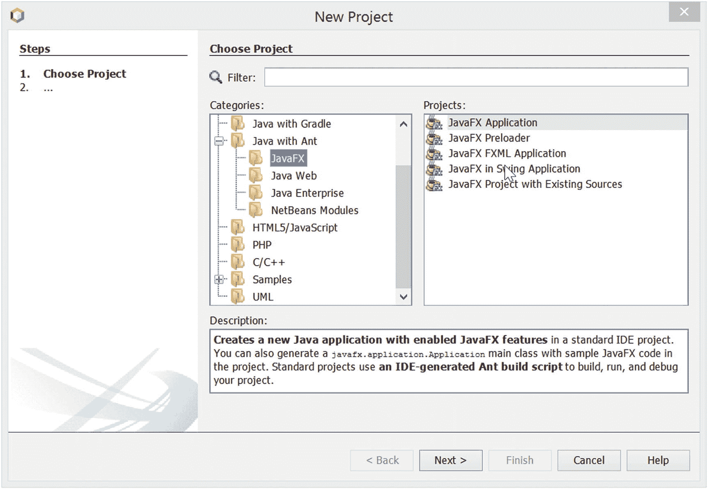

图 4-16

JavaFX 项目类型

Apache NetBeans 没有为 JavaFX 应用程序提供像 Swing 的 Matisse GUI 构建器那样的 GUI 设计器。不过，可以将 *SceneBuilder* 与 NetBeans 集成。*SceneBuilder*（见图 4-18）允许你以图形方式构建 JavaFX 应用程序。Oracle 已停止对 SceneBuilder 的支持，其最新版本为 2.0 ([`http://www.oracle.com/technetwork/java/javase/downloads/javafxscenebuilder-info-2157684.html`](http://www.oracle.com/technetwork/java/javase/downloads/javafxscenebuilder-info-2157684.html))。*Gluon* ([`https://gluonhq.com/products/scene-builder/`](https://gluonhq.com/products/scene-builder/)) 已接管了 *SceneBuilder* 的支持和开发工作。我们稍后将介绍如何设置 Apache NetBeans 以使用 *SceneBuilder*。

Sven Reimer 的 *Monet* ([`http://plugins.netbeans.org/plugin/55434/monet-the-javafx-scene-builder-integration`](http://plugins.netbeans.org/plugin/55434/monet-the-javafx-scene-builder-integration)) 插件尝试在 NetBeans 内部运行 *SceneBuilder*，以构建 JavaFX 应用程序的 GUI，其方式与你使用 Matisse 构建 Swing 应用程序的 GUI 相同。

从前面提到的网站下载并安装 Oracle 的或（最好）Gluon 的 *SceneBuilder*，使用适合你平台的安装程序。要将 *SceneBuilder* 与 NetBeans 集成，请按照以下步骤操作：

1.  在 Apache NetBeans 中，导航到 **工具 ➤ 选项 ➤ Java ➤ JavaFX**（Windows/Linux）或 **NetBeans ➤ 偏好设置 ➤ Java ➤ JavaFX**（MacOSX），如果 JavaFX 支持尚未激活，请点击**激活**。

2.  激活完成后，将 *Scene Builder Home* 设置为 Gluon 目录（例如，在 MacOS 中，这是 `/Applications/SceneBuilder.app` 的路径）。某些 Windows 安装程序在安装 *SceneBuilder* 时不会询问目录。*SceneBuilder* 可以在 `C:\Users\<用户>\AppData\Local\SceneBuilder` 或 `C:\Program Files\SceneBuilder` 中找到。

3.  点击**确定**，即可开始使用。


### 注意

如果 NetBeans 提示“*所选位置...不代表有效的 Java FX Scene Builder 安装*”，请执行以下变通方法。

1.  导航到 *SceneBuilder* 的安装目录，
2.  进入 `app` 文件夹，
3.  在同一文件夹中，将 `SceneBuilder.cfg` 复制一份并重命名为 `SceneBuilder.properties`。

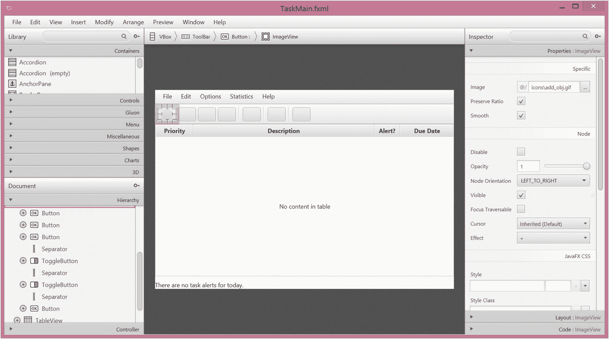

图 4-18

Gluon SceneBuilder

## 开发 Swing 应用程序

我们将为个人信息管理器（PIM）桌面应用程序开发图形用户界面，该程序允许您组织任务。此应用程序将在第 2 部分中进一步开发。*Todo* 应用程序由一个任务列表主窗口和一个任务编辑对话框组成。两者的粗略草图如图 4-19 所示。我们将使用 Swing 构建 *Todo* 应用程序的动态原型。在下一节中，我们将使用 JavaFX 重新构建该动态原型。

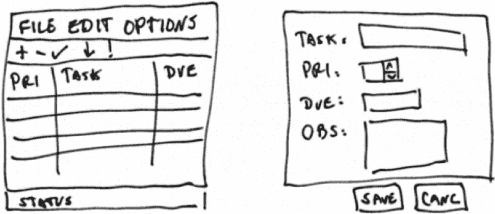

图 4-19

Todo 应用程序用户界面草图（左侧为主任务列表窗口，右侧为任务编辑表单）

在 NetBeans 中，通过选择 **文件 ➤ 新建项目** 菜单项，创建一个新的 Java 应用程序，如图 4-20 所示。在向导的步骤 2 中，提供 `Todo` 作为项目名称，并选择合适的项目位置（硬盘上的任意位置），如图 4-21 所示。然后点击 **完成**。Apache NetBeans 会创建一个项目，其中包含一个以项目名称命名的 Java 包，以及位于 `todo` 包内的一个名为 `Main` 的类。

### 设计主任务列表窗口

右键单击 `todo` 包，从弹出菜单中选择 **新建 ➤ Java 包**，并指定包名为 `todo.view`，以创建一个新包。

现在，右键单击 `todo.view` 包图标，选择 **新建 ➤ 其他**（或从主菜单中选择 **文件 ➤ 新建文件**），然后选择 *Swing GUI 窗体* 类别和 *JFrame 窗体* 文件类型（见图 4-4），并点击 **下一步**。

在向导的下一步中，输入 `TasksWindow` 作为类名，然后按 **完成**。IDE 将打开可视化窗体编辑器，如图 4-1 所示；同时请注意 *项目*、*导航器* 和 *属性* 窗口的位置，以及 *组件面板* 和 *编辑器* 区域。

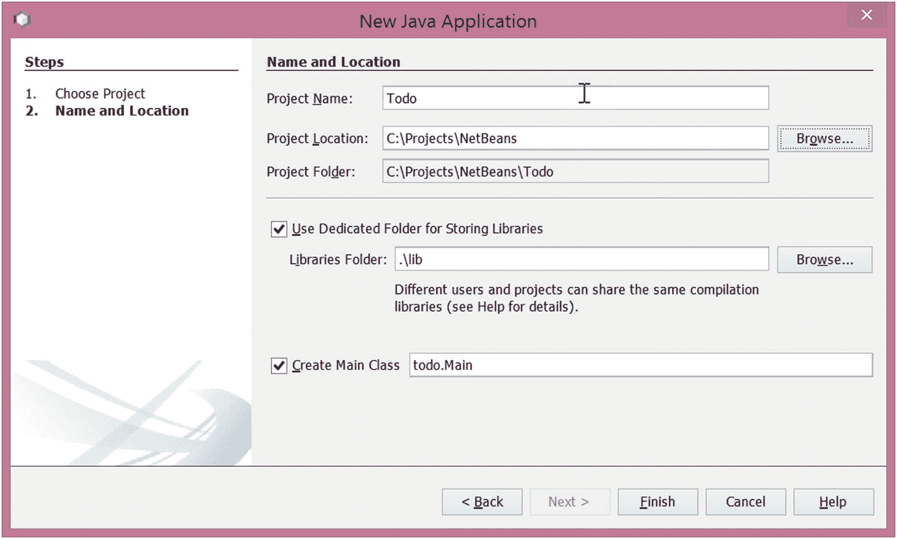

图 4-21

在向导的步骤 2 中，提供项目名称和位置

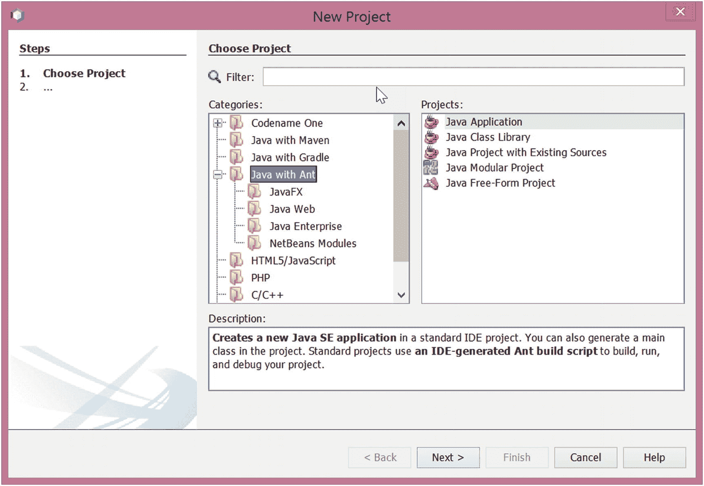

图 4-20

创建一个新的 Java 应用程序项目

一个橙色框会高亮显示选中的组件（图 4-1 中的 `JFrame` 内容面板）。*导航器* 会显示 `JFrame` 的所有可视和不可视组件，当您需要更改被其他组件隐藏或太小而无法在*编辑器*中选中的组件的属性时，这非常方便。在右侧，您可以看到*组件面板*（默认显示标准 Swing 组件，您也可以通过右键单击并选择*面板管理器*来添加第三方 JavaBeans）以及*属性*窗口。*属性* 按类别分类，以便于访问最常用的属性，已更改的属性其名称会以粗体高亮显示。

让我们创建原型的图形用户界面。从组件面板中，将*工具栏*图标拖放到 `JFrame` 上。您会注意到工具栏的占位符会跟随鼠标指针，并且当它靠近 `JFrame` 的边缘时，可视化编辑器会显示对齐线，如图 4-22 所示。这些对齐线有助于您在容器内保持控件的对齐和间距。Matisse 会生成布局约束，以便在调整容器大小或更改*外观和风格*（L&F）时保持每个组件的位置。

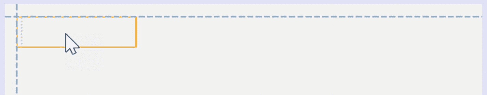

图 4-22

可视化对齐线有助于在可视化编辑器中定位和调整控件大小

将工具栏移动到 `JFrame` 的左上角，然后拖动其右边框，使其附着到 `JFrame` 的右边框，从而填满窗口的整个顶部区域（见图 4-23）。

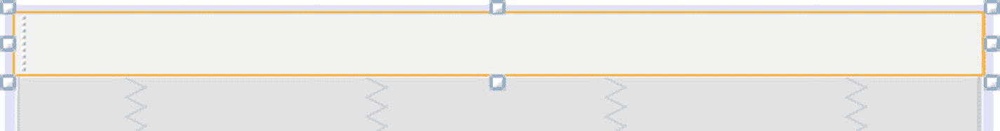

图 4-23

定位并调整工具栏大小

重复此过程，在 `JFrame` 底部插入一个 `JLabel`。此标签将用作任务窗口的*状态栏*。然后添加一个 `JScrollPane`，填充 `JToolbar` 和 `JLabel` 之间的区域。

现在尝试调整 `JFrame` 内容面板的大小。`JToolbar`、`JLabel` 和 `JScrollPane` 应会调整大小，以保持其边框附着在 `JFrame` 的角落以及彼此之间的边框上。

您可以通过在*导航器*窗口中右键单击每个小部件，并从弹出菜单中选择**更改变量名**，为各个小部件的变量赋予更具描述性的名称。在同一上下文菜单中，您可以通过选择**编辑文本**操作来修改小部件显示的文本。

接下来，让我们在 `JScrollPane` 内部添加一个 `JTable`，并创建工具栏按钮，以使 `TasksWindow` 开始类似于图 4-19 的草图。

您可以使用本书源代码附带的图标。将 `icons` 文件夹复制到 *Todo* 项目的*源包*内。

*源包*文件夹中的非 Java 文件将由 Apache NetBeans 添加到最终生成的应用程序 `jar` 文件中（该文件将创建在 `dist` 文件夹内），并且应用程序可以将其作为*类路径*资源进行引用，无论该 jar 文件安装在用户机器的哪个位置。额外的好处是，应用程序代码无需担心特定于平台的细节，如路径分隔符和驱动器号。

要向工具栏添加按钮，请将其从组件面板拖到工具栏上。清除*文本*属性，然后点击*图标*属性的 … 按钮，以显示图 4-24 所示的编辑器。选择适当的包（`icons`）和适当的图标文件。


### 注意

我采用一种名为*匈牙利命名法*的约定来命名各种控件，你可以自由选择是否遵循。在每个控件的变量名前面，我会添加三个描述该控件的字母。例如，我用`btn`表示按钮，`lbl`表示标签，`tbl`表示表格等。如图 4-24 所示，我将第一个按钮命名为`btnAddTask`。

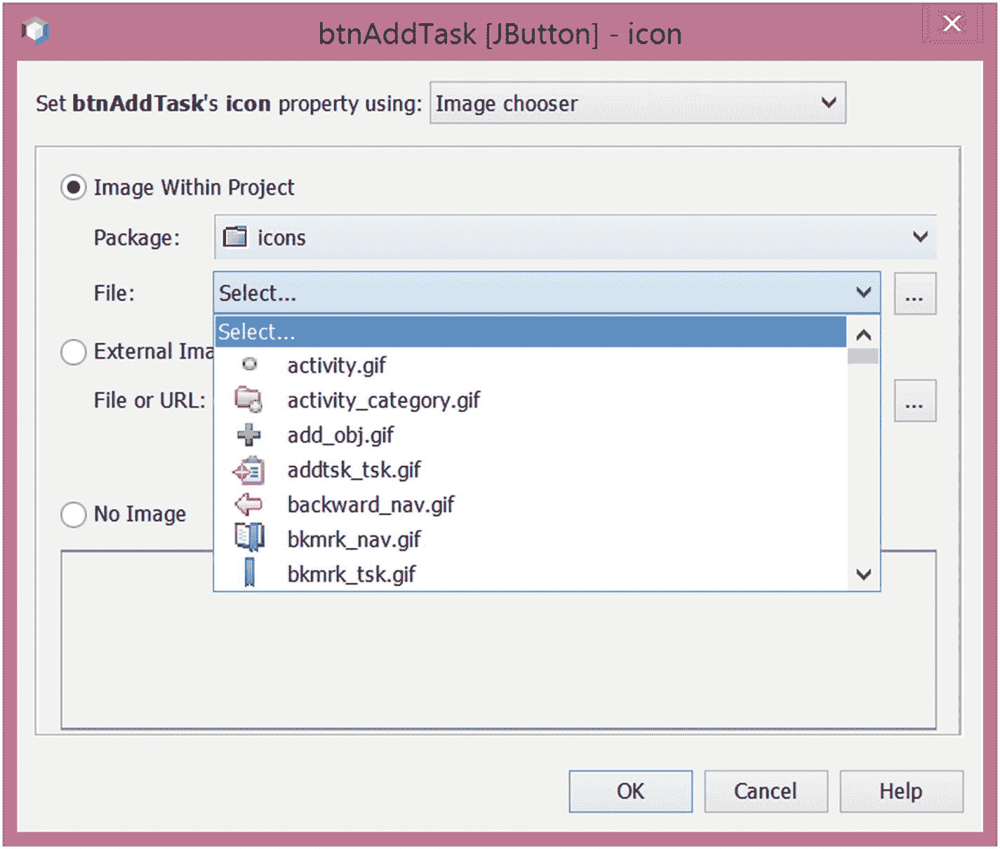

图 4-24

图标属性编辑器

NetBeans 还提供了一个定制器来定义`JTable`的模型属性。请确保从*导航器*窗口中选择`JTable`控件（而不是`JScrollPane`），然后点击其*model*属性旁的 **…** 按钮。此时会出现图 4-25 所示的对话框。我已经编辑了列，使其看起来像我们想要开发的应用程序。然而，这种定制仅适用于原型设计，因为在实际应用程序中，模型将由真实的（`Task`）对象创建。通常，对`JTable`的定制需要开发自定义的 Java 类，例如单元格渲染器和编辑器、列模型等。

最后，我们需要一个菜单栏。继续操作，从面板中拖拽一个*菜单栏*控件到窗体的顶部。使用*导航器*窗口或直接在 GUI 设计器中点击菜单栏来添加菜单，如图 4-26 所示（作为练习留给读者）。你可以选择`JMenuItem`、`JCheckBoxMenuItem`、`JRadioButtonMenuItem`、`JMenu`和`JSeparator`。你还可以通过设置菜单项的*mnemonic*属性（和/或*accelerator*属性）来添加*助记符*。*accelerator*是一个直接调用操作的按键组合（例如，图 4-26 中的`F11`键）。*mnemonic*是一个按键组合，通过键盘与`Alt`键配合来访问菜单项。例如，你可以通过按`Alt+F`来访问`F``ile`菜单（而不是底层的`F`）。

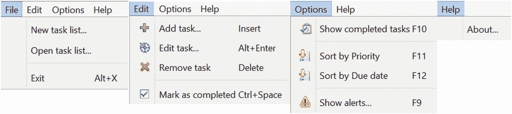

图 4-26

TasksWindow 窗体的完整菜单

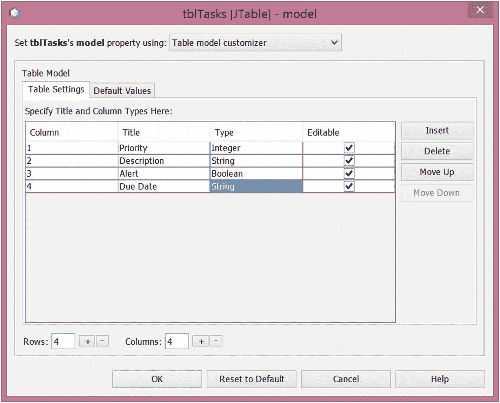

图 4-25

JTable 模型定制器

在*设计*视图中点击窗体外部，然后从*导航器*窗口中选择*[JFrame]*树节点（位于*Form TasksWindow*树下），并将其*title*属性更改为`TasksWindow`。你还可以定义一个窗口最小化时使用的图标图像（点击*iconimage*属性，点击 **…** 按钮，并添加如下一行代码）：

```
new javax.swing.ImageIcon(getClass().getResource(
"/icons/addtsk_tsk.gif")).getImage()).
```

点击 GUI 设计器工具栏上的**预览**按钮（图 4-7），以查看`TasksWindow`在运行时的行为（见图 4-27）。你可以浏览菜单，与`JTable`交互；预览功能非常强大。

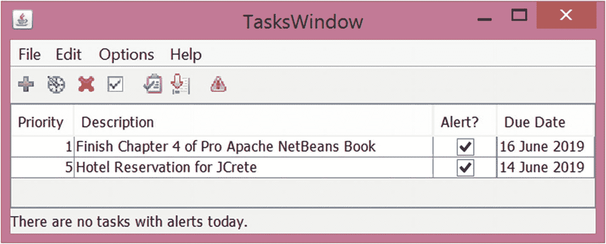

图 4-27

预览中的 TasksWindow

### 设计任务详情对话框

根据图 4-19，有一个用于创建/编辑任务的对话框。右键点击`todo.view`包，选择**新建 ➤ 其他**。选择**Swing GUI 表单**类别和**JDialog 表单**文件类型（见图 4-4）。提供类名`TaskDetailsDialog`，然后点击**完成**。

添加一个`JLabel`，将其附着到对话框的左侧、顶部和右侧边框，不留间距；它将作为验证错误等信息的消息区域。将其重命名为`lblMessageArea`（在*设计*视图中右键点击它，然后从弹出菜单中选择**更改变量名**），并设置其*opaque*属性和*background*颜色，使其看起来像对话框顶部的一个色带。同时添加一个`EmptyBorder`（*border*属性），以便在文本和色带边框周围留出空白空间。

接下来，为*description*、*priority*和*due date*字段添加三个`JLabel`（分别将文本标签编辑为*Description*、*Priority*和*Due Date*，并将变量分别重命名为`lblDescription`、`lblPriority`、`lblDueDate`）。将这三个标签都附着到`JDialog`内部区域（绘图区域）的左侧。在组件和边框之间留出一些间距。调整两个较短标签的大小，使其右边界与较长标签的右边界对齐。然后选中这三个标签（使用`Shift + 点击`），将*horizontalAlignment*属性更改为`RIGHT`。

然后，在*Description*标签旁边添加一个`JTextField`（将其重命名为`txtDescription`），在*Priority*标签旁边添加一个`JSpinner`（将其重命名为`spPriority`）。确保辅助线使标签和字段的基线对齐。`JSpinner`不提供任何设置首选宽度或最小宽度的属性，而`JTextField`使用*column*属性来实现这一点。但是，你可以调整`JSpinner`的大小，Matisse 会以像素为单位设置组件的首选大小。


### 注意

在不同平台上，或当用户更改默认的 Swing 外观和感觉（L&F）时，以像素为单位调整 GUI 组件的大小并不能保证正常工作。请谨慎使用此 Matisse 功能！

我们需要将任务优先级限制在 1 到 10 之间。选择 `JSpinner` 组件，然后在*属性*窗口中，首先点击 *value* 属性的省略号（**…**）按钮，从组合框中选择**自定义代码**，并设置 `spPriority.setValue(`**1**`)`。然后点击*代码*按钮，并选择*创建后代码*属性的省略号（**…**）按钮。输入如图 4-28 所示的代码，然后点击**确定**。转到*源代码*视图，在编辑器中右键单击，然后选择**修复导入**以解决错误。

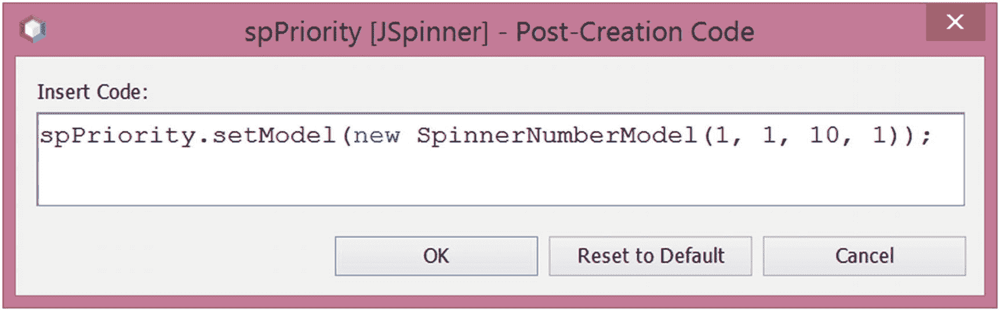

图 4-28

PaletteManager 对话框

对于截止日期，我们可以使用 `JFormattedText` 来保存日期，但我们将了解如何使用 Date Picker Swing 组件来代替。有许多可用的解决方案，例如：*JDatePicker* ([`https://sourceforge.net/projects/jdatepicker/`](https://sourceforge.net/projects/jdatepicker/))、*JDateChooser* ([`http://plugins.netbeans.org/plugin/658/jdatechooser-1-2`](http://plugins.netbeans.org/plugin/658/jdatechooser-1-2))、*LGoodDatePicker* ([`https://github.com/LGoodDatePicker/LGoodDatePicker`](https://github.com/LGoodDatePicker/LGoodDatePicker)) 以及来自 SwingLabs 但已不再维护的 *SwingX JXDatePicker* ([`http://www.java2s.com/Code/Jar/s/Downloadswingxall165jar.htm`](http://www.java2s.com/Code/Jar/s/Downloadswingxall165jar.htm))。不幸的是，它们都没有使用最新的 `java.time.LocalDateTime` 来存储选取的日期。我们将了解如何集成来自 SwingLabs 的 *SwingX JXDatePicker*（如果你愿意，集成其他任何一个都留作练习）。下载它并将其解压到您机器上的一个文件夹中。

右键单击面板，然后从上下文菜单中选择*面板管理器*（参见图 4-29）。

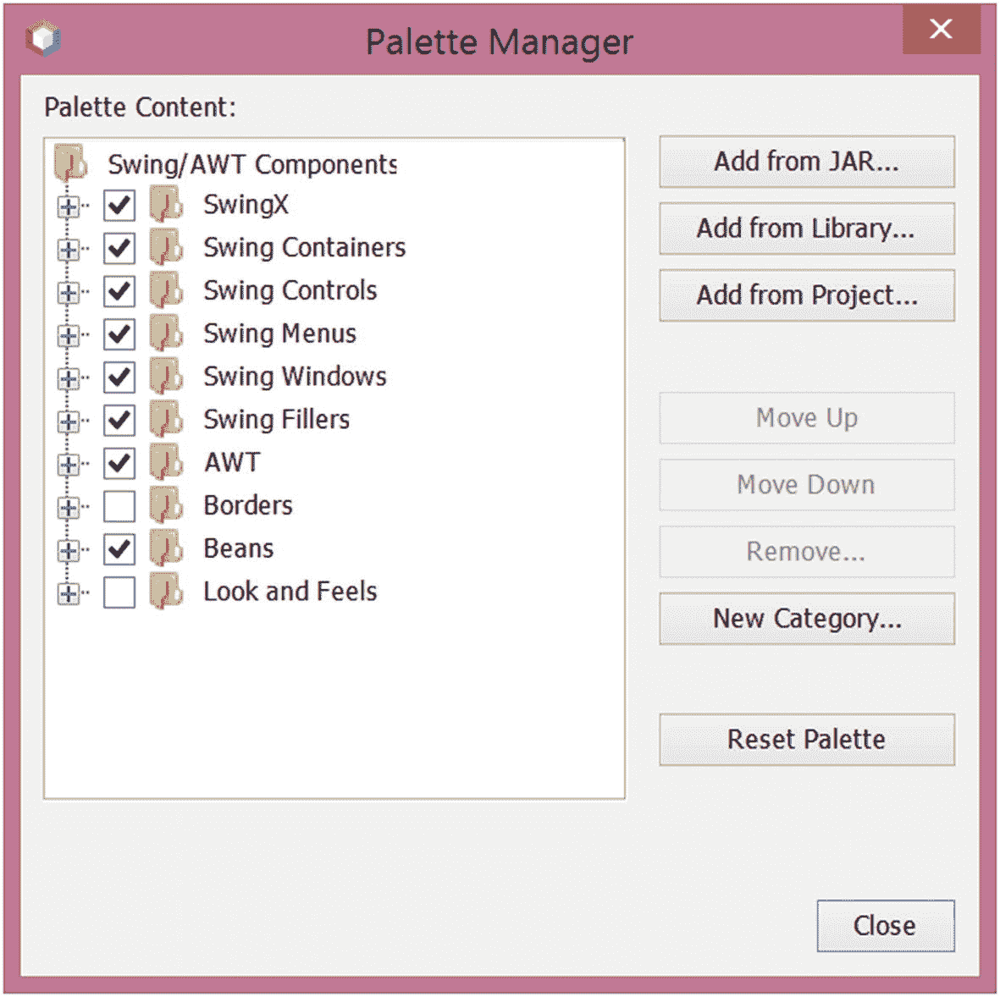

图 4-29

PaletteManager 对话框

点击**新建类别**按钮，并命名为 *SwingX*。点击**从 JAR 添加**按钮，从您之前下载的位置选择 `swingx-all-1.6.5.jar`，然后点击**下一步**。在下一步中，选择所有可用的组件，然后点击**下一步**。在最后一步中，选择您之前创建的 *SwingX* 类别，然后点击**完成**。您刚刚在*面板*中添加了一个包含所有 *SwingX* 组件的新类别。

将 `JXDatePicker` 组件拖放到 `TaskDetailsDialog` 窗体上，放在*截止日期*标签旁边。基本上就是这样。如果您对默认的日期格式不满意，我让您自行探索该组件的 API，以了解如何设置日期格式，以及如何获取/设置日期值。

### 提示

好了，既然您已经通过艰难的方式学会了，我必须承认还有一种更简单的方法。一旦您将库的 `jar` 文件（例如 `swingx-all-1.6.5.jar`）添加到您的项目中（在*项目*选项卡的*库*内），只需展开该 jar 文件，导航到作为您组件的类，然后将其拖到您的窗体上即可。您无需将组件 bean 添加到面板中。例如，将 `org.desktop.swingx.JXDatePicker.class` 拖放到 `TaskDetailsDialog` 窗体上，与从面板中拖放具有相同的效果。

为了辅助无障碍访问，最佳实践是在 `JLabel` 上设置 *labelFor* 属性，以描述该标签用于哪个组件。这可以极大地提升屏幕阅读器和其他无障碍软件的效能。

添加一个 `JLabel`（标签：`Obs:`，名称：`lblObs`）、一个 `JScrollPane`（名称：`spObs`）并在其中添加一个 `JTextArea`（名称：`txtaObs`）、一个 `JCheckBox`（文本：`Completed Task`，名称：`chkCompleted`）以及四个 `JButton`（文本：`Save`，名称：`btnSave`；文本：`Cancel`，名称：`btnCancel`；文本：`Clear`，名称：`btnClear`；文本：`Remove`，名称：`btnRemove`）。最终的 `TaskDetailsDialog` 窗体应如图 4-30 所示。

良好的 UI 设计会使逻辑组中的所有按钮大小相同。只需选择所有需要的按钮（实际上您可以选择任何控件），然后右键单击任意一个选中的按钮。接着选择**相同大小 ➤ 相同宽度**和**相同大小 ➤ 相同高度**复选框菜单项。绘图区域将指示这些控件已被配置为始终保持相同大小。

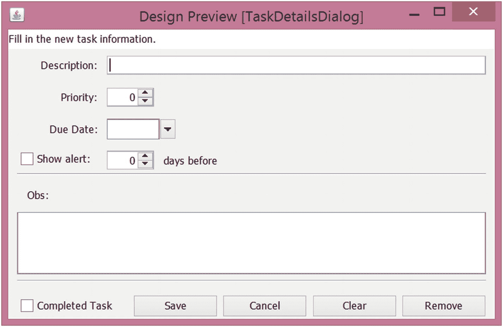

图 4-30

TaskDetailsDialog

作为**连接模式**按钮的一个示例，将*清除*按钮与 `txtDescription` 文本字段连接起来；当按下*清除*按钮时（`actionPerformed()` 事件），会调用 `txtDescription.text` 属性并清除其值。上述操作将转换为清单 4-1 中的代码。

```
private void btnClearActionPerformed(java.awt.event.ActionEvent evt) {
txtDescription.setText("");
}
清单 4-1
btnClearActionPerformed() 方法
```

为了完成我们的原型，我们需要添加代码以从主窗口显示 `TaskDetailsDialog`。双击工具栏上的 `btnAddTask`，并进行清单 4-2 中所示的更改（或者，您可以选择它，点击*属性*窗口中的*事件*按钮，然后在 *actionPerformed* 属性中选择下拉箭头）。

```
public class TasksWindow extends javax.swing.JFrame {
private final JDialog dlgTaskDetails = new TaskDetailsDialog(this, true);
/**
* Creates new form TasksWindow
*/
public TasksWindow() {
initComponents();
dlgTaskDetails.pack();
}
private void btnAddTaskActionPerformed(java.awt.event.ActionEvent evt) {
dlgTaskDetails.setVisible(true);
}
}
清单 4-2
AddTask actionPerformed() 方法
```


### 注意

Apache NetBeans 还在底层（`initComponents()` 方法内部）为 `btnAddTask` 组件添加了一个动作监听器，以便该方法能在正确的时间被调用。

你可以为 `TasksWindow.mnuAddTask`（别忘了*DRY*原则，并在此处进行一些重构）和 `TaskDetailsDialog.btnClose` 添加类似的方法。最后，你需要实现 `main()` 方法，如代码清单 4-3 所示。

```
public static void main(String[] args) {
TasksWindow tasksWindow = new TasksWindow();
tasksWindow.pack();
tasksWindow.setVisible(true);
}
代码清单 4-3
Main.main() 方法
```

我们的*Todo*原型应用现已完成，可以在开始实施之前向客户展示，以获取有用的反馈。

作为最后一步，你可以让 Matisse 自动国际化应用程序的 UI。这意味着，对于通常需要手动国际化的每个资源，Matisse 会自动将 UI 设计器中提供的值添加到资源包中。这是针对所有 UI 元素完成的。可视化本地化功能与自动国际化协同工作。只需在*导航器*窗口中右键单击根表单节点（`TasksWindow`），在*属性*窗口中找到**设计区域设置**组合框（见图 4-31），然后选择一个区域设置或添加一个新的区域设置（见图 4-32）。同时，在*属性*窗口中选中**自动国际化**复选框。一旦选择了**设计区域设置**，你现在就可以像正常编辑表单一样简单地编辑 UI 中的文本。*设计区域设置*的本地化会根据输入到 UI 中的值自动进行。可以更改区域设置并重新编辑表单，以设置新选择区域设置的值。使用 Apache NetBeans 创建一个完全国际化的 UI 以满足全球客户的需求，就是这么简单（见图 4-33）。

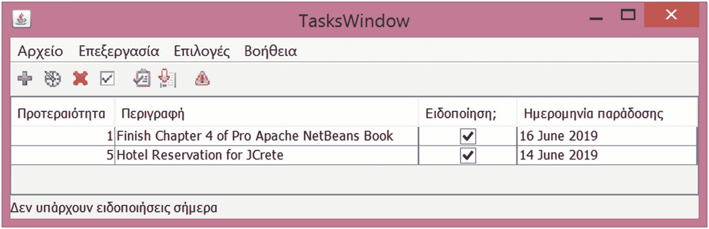

图 4-33

UI 的自动国际化

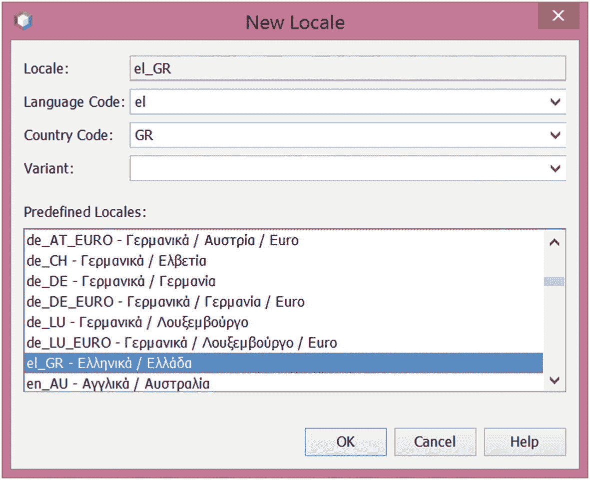

图 4-32

新建区域设置对话框

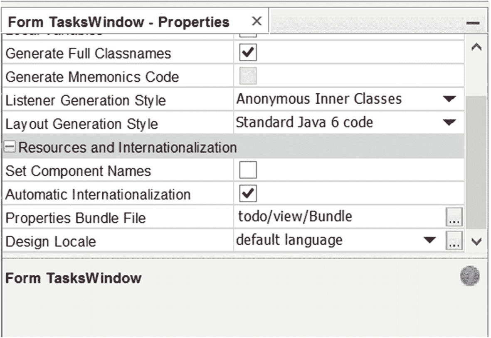

图 4-31

自动国际化

## 开发 JavaFX 应用程序

我们也将使用 JavaFX 开发图 4-19 中的*Todo*应用程序。我们将使用集成了 JavaFX 的 JDK，例如 JDK 8 或 10。稍后我们将了解如何使用不带 JavaFX 的 JDK 开发 JavaFX 应用程序。

开发 JavaFX 应用程序有两种方式：一种是以编程方式，使用 Java（*JavaFX 应用程序*）；另一种是声明式地，在一种称为 FXML 的特殊 XML 格式中声明 GUI（*JavaFX FXML 应用程序*）。我们在这里选择第二种方式，这种方式还有一个优点，即你可以使用*SceneBuilder*以图形方式设计 GUI。

让我们开始吧。通过单击**文件 ➤ 新建项目**，选择**Java with Ant ➤ JavaFX**类别（如图 4-16 所示），然后单击**下一步**，创建一个新的*JavaFX FXML 应用程序*。使用 `TodoFX` 作为项目名称，并选择合适的项目位置（硬盘上的任意位置）。按图 4-34 所示修改对话框中的其余条目。然后单击**完成**。

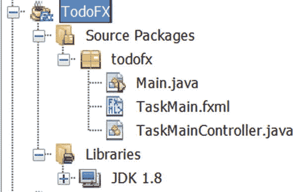

图 4-35

新建 JavaFX 应用程序向导

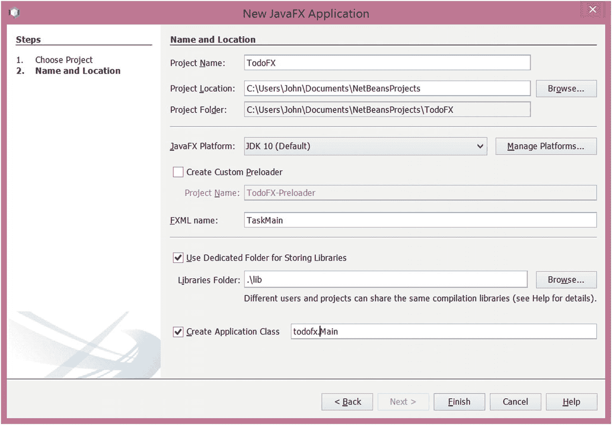

图 4-34

新建 JavaFX 应用程序向导

*TodoFX* 项目的布局如图 4-35 所示。

你可以轻松识别出 `Main`、代表主视图（在我们的例子中是任务列表）的 `.fxml` 文件以及相应的 `TaskMainController`。NetBeans 通过为你创建所有这些内容来节省开发步骤。你无需分别创建视图和控制器；它们一步即可创建完成！运行该项目；你应该会看到一个类似于图 4-36 的应用程序。

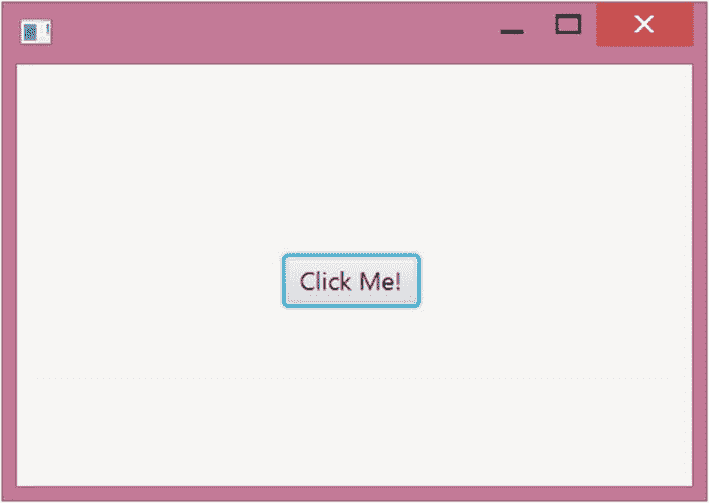

图 4-36

示例 JavaFX 应用程序

Apache NetBeans 已经为你创建了一个完整的示例 JavaFX 应用程序。双击 `TaskMain.fxml`；该文件将在*SceneBuilder*中打开（见图 4-37）。

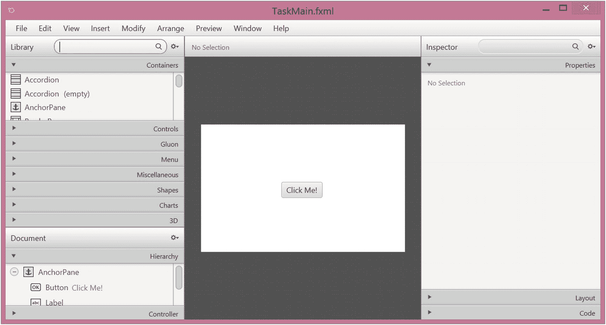

图 4-37

从 NetBeans 打开的 SceneBuilder

如果你需要使用不包含 JavaFX 的 JDK（例如 JDK 11 及更高版本）创建 JavaFX 项目，则需要按照*JavaFX and NetBeans*文章（[`https://openjfx.io/openjfx-docs/#IDE-NetBeans`](https://openjfx.io/openjfx-docs/%2523IDE-NetBeans)）中描述的不同步骤进行操作。

### 注意

Apache NetBeans JavaFX Ant 和 Maven 项目将在未来的 Apache NetBeans 版本中修复，以使其能与 JDK 11 及更高版本正常工作。

使用*SceneBuilder*，你可以通过简单的拖放小部件来快速设计 GUI，其方式类似于 Matisse 允许你构建 Swing GUI。

不过，由于这不是一本关于 JavaFX 的书，如果你希望开发*TodoFX*应用程序，请按照本教程（[`http://wiki.netbeans.org/TodoFX`](http://wiki.netbeans.org/TodoFX)）进行操作。

## 结论

在本章中，你学习了如何使用 Apache NetBeans IDE 开发 Java 桌面应用程序。NetBeans 允许你使用 AWT、Swing 或 JavaFX 构建桌面应用程序。为了开发 Swing 应用程序，Apache NetBeans 提供了一个非常高级的 GUI 构建器，其代号为*Matisse*。我们了解了 Matisse 的功能，并实际了解了如何使用它构建一个原型应用程序。

有关如何使用 Matisse GUI 构建器的更多信息，请参阅“使用 NetBeans IDE 开发应用程序”（[`https://docs.oracle.com/netbeans/nb82/netbeans/NBDAG/toc.htm`](https://docs.oracle.com/netbeans/nb82/netbeans/NBDAG/toc.htm)）指南的第 11 章。

我们还了解了如何将*SceneBuilder*与 NetBeans 集成以开发 JavaFX 应用程序。Apache NetBeans 也提供了用于构建 Web 应用程序的 GUI 构建器。但让我们等到下一章再介绍。


