# 5. Apache NetBeans Java EE 开发

自 11.0 版本起，Apache NetBeans 已内置 Java EE 支持。在此版本之前，由于 Java EE 仍采用 Oracle 许可，需要以插件形式将其添加到 Apache NetBeans 9.0+ 中。添加该插件后，Apache NetBeans 9.0 中用于开发、调试和维护 Java EE 的功能与 11.0 及更高版本相同。该支持提供了添加可在 IDE 内管理的应用服务器容器的能力。对 Maven Web 应用以及诸如 Enterprise JavaBeans (EJB)、上下文和依赖注入 (CDI) 以及 JavaServer Faces (JSF) 等 Java EE 技术的全面支持，使开发者能够享受自动补全、代码片段和便捷的语法识别功能。总而言之，Apache NetBeans 是开发新旧 Java EE 应用的强大工具。

在本章中，我们将详细探讨 Apache NetBeans 为 Java 企业级开发提供的支持。你将学习如何在 IDE 内管理容器、开发后端业务逻辑以及 Java 持久化 API (JPA) 查询。最后，你将基本了解 Apache NetBeans 为全栈 Java EE 开发所提供的便利。

## 配置服务器容器

在将应用项目与容器关联以进行部署或测试之前，必须先注册一个或多个应用服务器容器供 Apache NetBeans 使用。即使你正在开发将部署到容器（如 Payara Micro 或 Wildfly）的微服务，也建议在 Apache NetBeans 中注册一个容器。请注意，最佳实践是仅在 Apache NetBeans 中为开发目的配置应用服务器容器，而非用于部署到生产容器。

要向 Apache NetBeans 添加本地或远程应用服务器容器，请执行以下步骤：

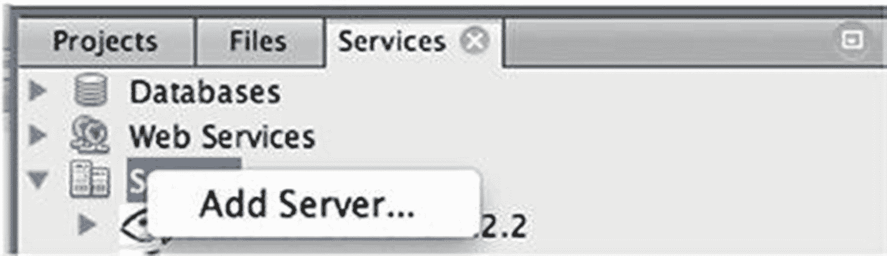

图 5-1

向 Apache NetBeans IDE 添加应用服务器容器

1.  导航到**服务**窗口，右键单击**服务器**菜单选项。点击**添加服务器**，如图 5-1 所示。

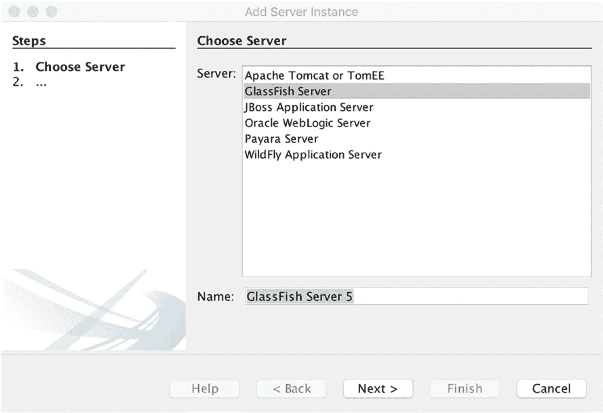

图 5-2

添加服务器实例

1.  当出现“添加服务器实例”对话框时，选择要添加的服务器类型（图 5-2）。

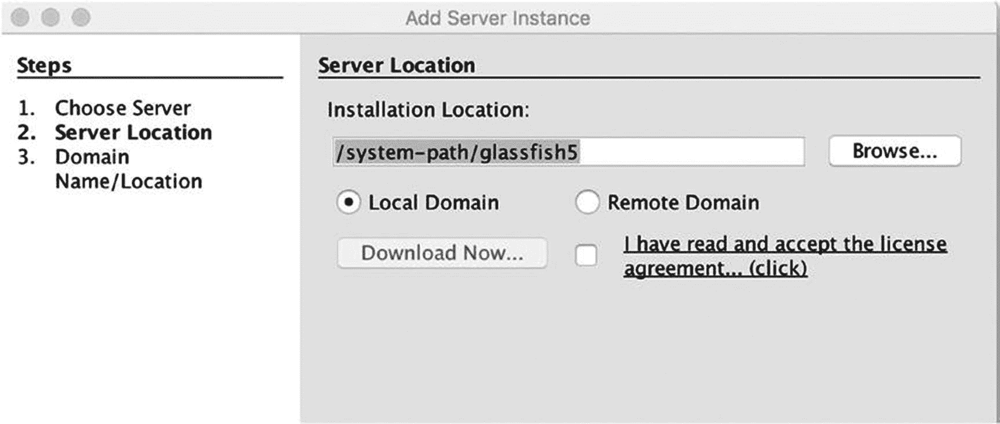

图 5-3

设置服务器位置

1.  在下一个屏幕上，输入要在 Apache NetBeans 中配置的应用服务器安装路径（图 5-3）。选择位置后，点击**完成**按钮。

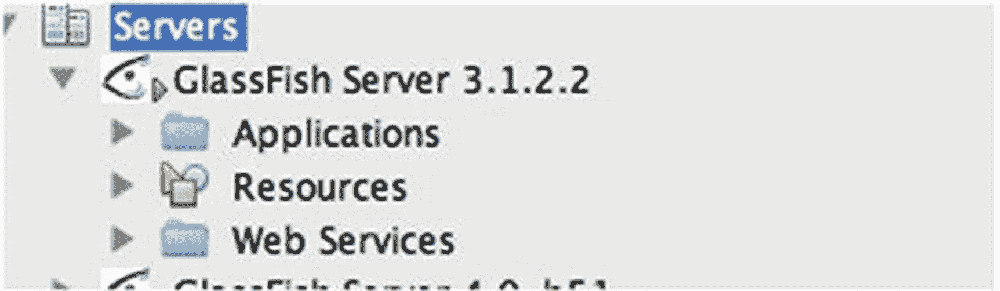

图 5-4

在 Apache NetBeans 中展开并管理服务器

1.  现在可以将应用部署到已在 IDE 中注册的应用服务器容器。为此，右键单击企业应用项目（Maven Web 应用等），然后在项目属性中指定所需的服务器。请注意，你也可以通过在“服务器”窗口中选择应用服务器来执行一些基本的应用服务器任务（图 5-4）。

## 创建 Maven Web 应用

在 Apache NetBeans 中创建 Java 企业项目时，有多种配置可供选择。本章将详细介绍 Maven Web 应用的创建，这是 Apache NetBeans 中 Java EE 和 Jakarta EE 开发的事实标准及默认项目选择。

要开始创建新的 Maven Web 应用项目，请通过选择**文件** ➤ **新建项目**打开**新建项目**对话框。在**新建项目**对话框中，左侧列表框中会列出多个不同的项目类别。选择一个类别将在右侧列表框中显示该类别下的项目类型。选择 **Java with Maven** 类别，然后选择 **Web 应用**作为项目类型（图 5-5）。

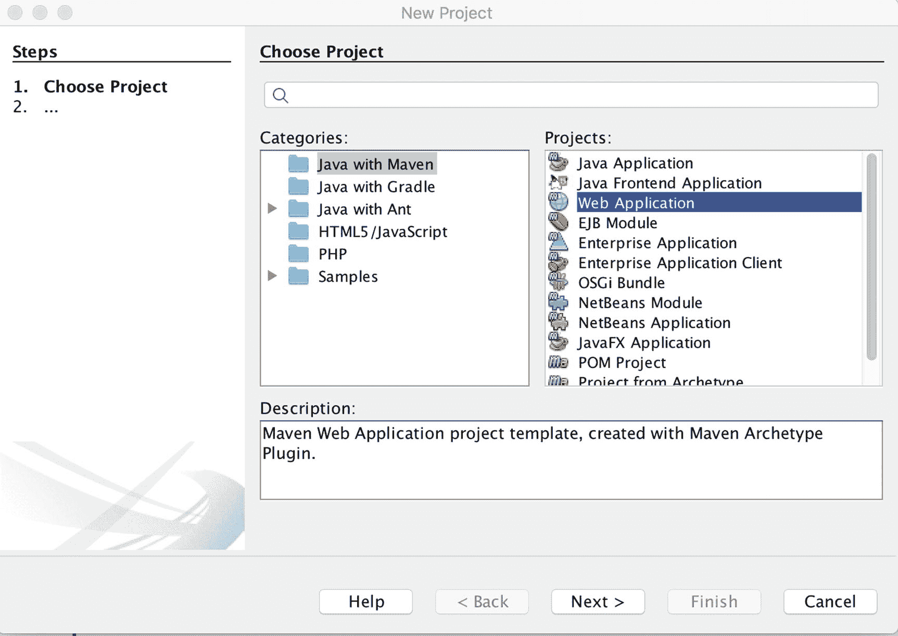

图 5-5

新建 Maven Web 应用

### 注意

**Java with Maven** 类别允许使用旧式 Java EE 和 J2EE 配置（如 **EJB 模块**和**企业应用**）创建项目。大多数情况下，这些项目已不再用于创建新应用。不过，Apache NetBeans 仍支持它们。

选择项目类型并点击**下一步**后，将打开**新建 Web 应用**对话框。输入项目名称和位置，如图 5-6 所示。完成后，选择**下一步**。

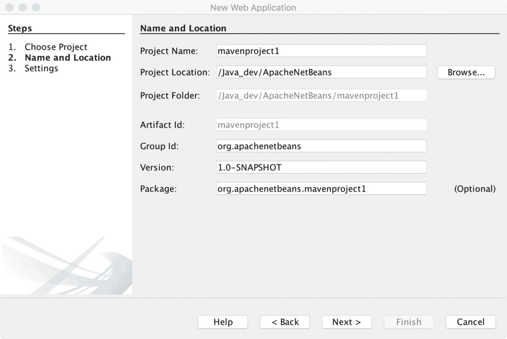

图 5-6

新建 Web 应用对话框

在“服务器和设置”屏幕中，选择要用于开发目的的应用服务器容器（参见在 NetBeans 中配置应用服务器），以及要使用的 Java EE 版本。如果计划使用 CDI，则选中相应的复选框（图 5-7）。

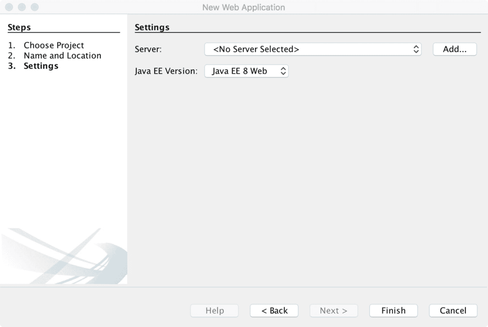

图 5-7

设置应用服务器容器

## 开发 JSF 应用

利用 Apache NetBeans IDE，由于向导和文件识别功能，开发 JSF 应用变得非常容易。在本节中，我们将从标准的 Maven Web 应用项目出发，逐步完成 JSF 应用的开发。因此，如果你尚未创建，请利用上一节中的信息创建一个基础项目。

### 创建 JSF 应用文件

如果要创建 JSF 视图，请右键单击 **Web 页面**节点；如果要为 JSF 创建 Java 源文件，请右键单击**源包**节点。右键单击适当的节点可确保文件生成在正确的项目区域内。在上下文菜单中，选择**新建**，然后选择**其他…** 以打开“新建文件”对话框。在对话框中，从“类别”列表框中选择 **JavaServer Faces**，以在左侧列表框中打开 JSF 文件类型（图 5-8）。在此示例中，右键单击 **Web 页面**并创建一个新的 JSF 页面。

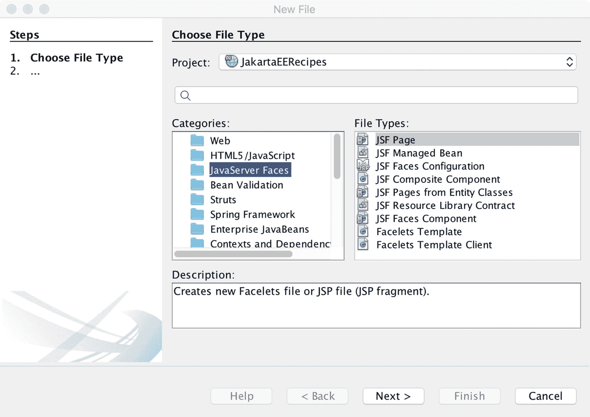

图 5-8

创建 JSF 文件

JSF 文件类型包括以下选项：

*   JSF 页面

*   JSF 托管 Bean（使用 Java EE 7+ 时，这将创建一个 CDI 控制器）

*   JSF Faces 配置

*   JSF 复合组件

*   JSF 资源库契约

*   来自实体类的 JSF 页面

*   JSF Faces 组件

*   Faces 模板

*   Faces 模板客户端

### 注意

自 Java EE 7+ 和 Jakarta EE 8 起，不应再创建 JSF 托管 Bean。这是因为 JSF 托管 Bean 技术已被弃用，转而推荐使用 CDI Bean。因此，JSF 托管 Bean 选项会创建一个 CDI 控制器。

点击**下一步**后，JSF 页面文件选择会打开一个对话框，可用于生成新的 JSF 页面（图 5-9）。该对话框允许选择文件位置和名称，并且还可以为页面类型应用不同的选项。页面类型选项包括 Facelets（默认）、JSP 文件或 JSP 片段。本章中的示例均使用 Facelets 页面类型。

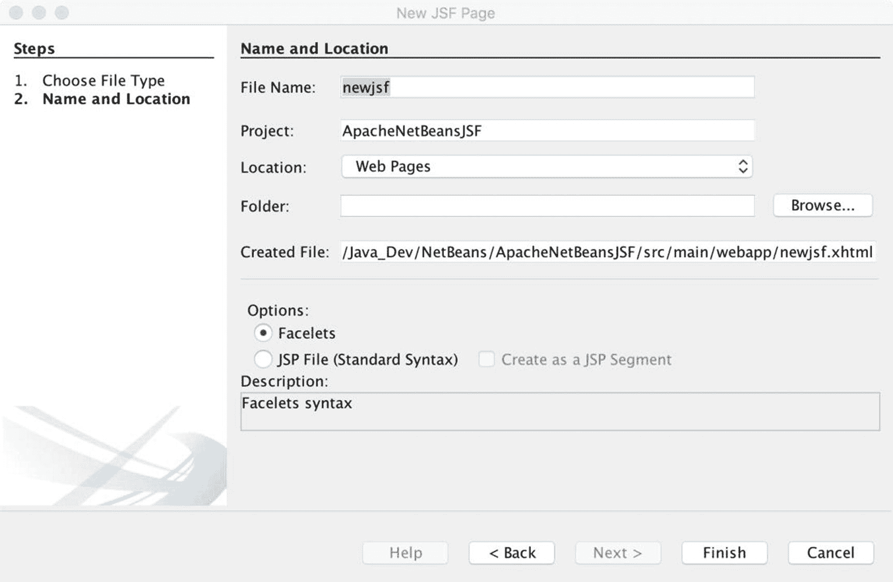

图 5-9

新建 JSF 页面对话框

JSF 托管 Bean 文件选择会打开一个对话框，允许生成一个 CDI 托管 Bean 控制器类（图 5-10）。该对话框提供了将 Bean 数据添加到 `faces-config.xml` 文件（如果需要）以及选择 Bean 作用域的功能。

### 注意

`faces-config.xml`（JSF Faces 配置）文件默认不会生成，因为它不是 JSF 项目的必需文件。但是，可以通过 **其他...**、JavaServer Faces 上下文菜单来添加它。

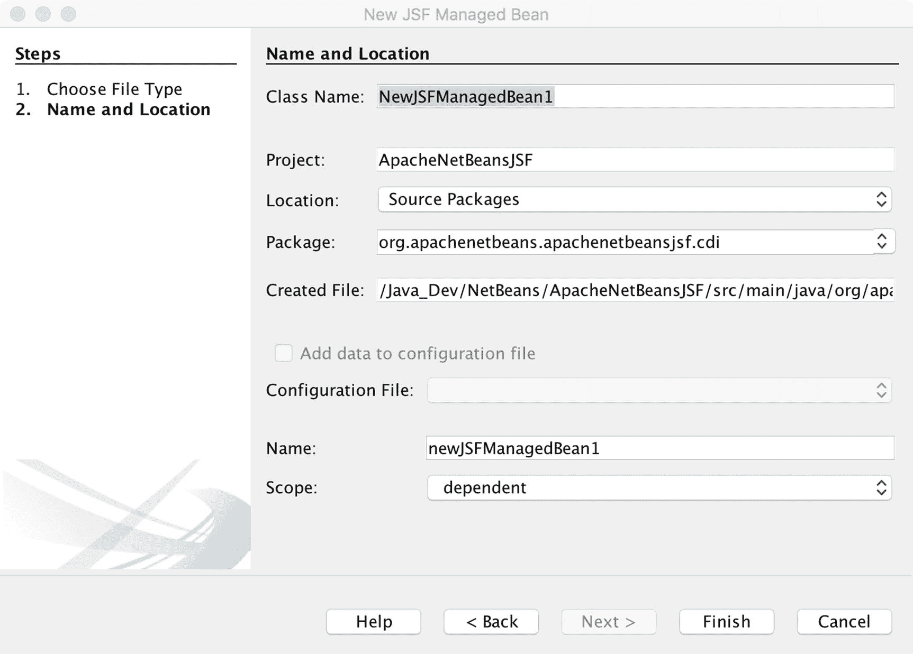

图 5-10

新建 JSF 托管 Bean

**JSF Faces 配置**文件选择用于为项目生成 `faces-config.xml` 文件。但是，如果您选择在 NetBeans 项目创建向导中创建 JSF 项目，则此选项不是必需的。

**JSF 复合组件**文件选择会打开一个对话框，可用于创建复合组件文件。除了能够选择文件位置和名称之外，该对话框没有提供太多其他选项。生成的文件包含复合组件的骨架，如下所示：

**来自实体类的 JSF 页面**文件选择功能非常强大，因为它允许您选择一个实体类，并基于该实体类生成一个或多个 JSF 页面，从而使这些页面与实体类绑定，以便生成和更新这些实体记录。要使用此选项，项目中必须至少包含一个实体类。

## 开发实体类

Apache NetBeans IDE 提供了帮助开发实体 Bean 类的工具，既可以手动开发，也可以基于选定的数据库表进行开发。要访问实体类向导，请右键单击项目的*源包*文件夹以打开上下文菜单，然后选择**新建** ➤ **其他**以打开**新建文件**对话框。打开后，从左侧列表框中选择*持久性*类别，以在右侧列表框中显示文件类型（图 5-11）。

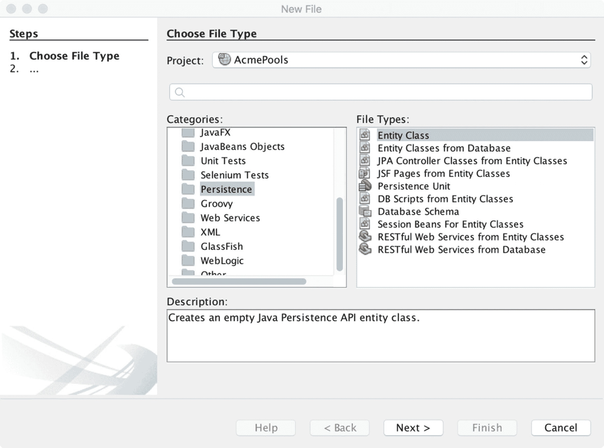

图 5-11

持久性文件类型

*实体* *类*文件类型允许您生成一个空白的实体类。*来自数据库的实体类*文件类型允许您基于选定的数据库表创建实体类。这样做时，所有用于将实体类映射到选定数据库表的必要代码都会自动为您生成。

## 使用 Java 持久性查询语言 (JPQL)

Apache NetBeans 包含一个功能，允许使用 Java 持久性查询语言 (JPQL) 语法查询数据库。这对于那些在其 EJB 会话 Bean 或 RESTful Web 服务中使用 JPQL 的人来说非常有用。要使用 JPQL 查询工具，请展开一个 Apache NetBeans Web 项目，该项目在其*配置文件*目录中包含一个 `persistence.xml` 配置文件。然后执行以下步骤：

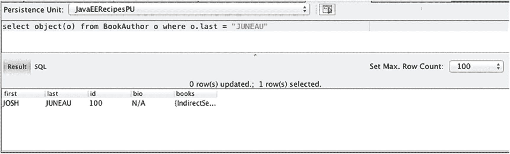

图 5-12

JPQL 工具

1.  右键单击 `persistence.xml` 配置文件以打开上下文菜单。

2.  单击**运行 JPQL 查询**以打开该工具（图 5-12），键入查询，然后单击查询编辑器右上角的**运行**按钮。

    **注意**要添加用于 JPA 配置的 `persistence.xml` 配置文件，请右键单击项目并选择：**其他…**、**持久性**、**持久性单元**。

## 部署和调试

Apache NetBeans IDE 使企业应用程序的开发周期变得非常容易。要部署和测试 Maven Web 应用程序，请确保在项目属性的“运行”选项卡中正确设置了在 Apache NetBeans 中注册的本地应用服务器容器目标。设置完成后，可以通过右键单击项目并从上下文菜单中选择“**运行**”来部署项目。选择后，如果一切编译正确，项目 WAR 文件将部署到目标应用服务器，并且应用程序将在默认浏览器中打开。

### 注意

可以通过在工具栏中选择浏览器（图 5-13）来为 Apache NetBeans 中的每个项目配置不同的默认浏览器。

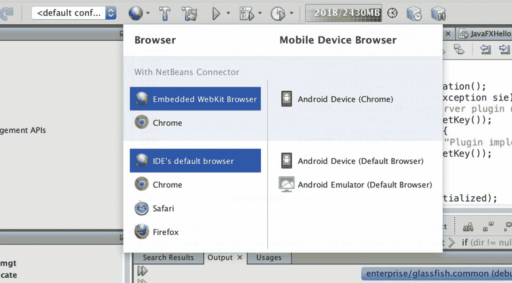

图 5-13

选择默认浏览器

要调试项目，请右键单击项目并从上下文菜单中选择“**调试**”。这将导致目标应用服务器容器以“调试”模式启动，并且项目 WAR 文件将相应部署。当应用服务器以调试模式启动时，可以在项目中设置断点，也可以配置监视，就像标准 Java SE 应用程序一样。有关调试和分析应用程序的更多详细信息，请参阅第 6 章。

## 其他 Java EE 支持功能

Apache NetBeans 11.0 IDE 支持多种文件类型，以帮助开发 Java EE 应用程序。本章前面已经介绍了一些向导，在本节中，我们将简要介绍一些文件支持。

通过右键单击项目包，然后选择“**新建**” ➤ “**其他**”，会出现“*新建文件*”对话框。此对话框包含多个类别，包括“Web”、“HTML5/JavaScript”、“Bean 验证”和“上下文与依赖注入”等。这些类别中的每一个都包含许多文件选项。每种受支持的文件类型都包含语法自动完成、颜色编码和良好的格式。

也许最广泛使用的类别是“Web”类别。此类别中包含以下文件类型（面向前端开发）：

*   JSP

*   JSF

*   Servlet

*   Filter

*   Web 应用程序监听器

*   WebSocket 端点

*   HTML

*   XHTML

*   层叠样式表

*   JavaScript

*   Json

*   标签库

某些文件类型将放置在 Web 项目的“Web 页面”文件夹中，而其他文件类型将创建 Java 源文件或 XML 配置。本节中的每种文件类型都面向前端开发。

其他面向企业开发的文件类型类别包括：

*   HTML/JavaScript

*   JavaServer Faces

*   Bean 验证

*   Struts

*   Spring 框架

*   企业 JavaBeans

*   上下文与依赖注入

*   Selenium 测试

*   持久性

*   Web 服务

*   GlassFish

*   WebLogic

*   其他

## 摘要

Apache NetBeans IDE 为 Java EE 应用程序提供了卓越的支持。从头构建一个 Java EE 项目非常容易，并且可以选择生成前端、后端和配置文件。通过添加用于部署的容器，IDE 支持轻松的调试和保存时部署选项。Apache NetBeans 有助于提高初学者和高级企业开发人员的生产力。

