# 6. 调试与分析

调试与分析，除了编写代码之外，可能是使用 Apache NetBeans 最重要的两件事。调试是一门找出问题及其根本原因的艺术。Apache NetBeans 提供了一个功能非常丰富的调试环境，支持从多会话到多语言的各种场景。如果说调试能让代码正确，那么分析就能让代码运行得更快。Apache NetBeans 包含最先进的分析引擎之一，用于基于 Sun Microsystems 开发的 JFluid 技术进行内存和 CPU 分析。尽管 Apache NetBeans 支持多种不同编程语言和项目类型的调试，但本章重点介绍对 JVM 和 Java 语言的支持。

## 调试

### 入门

启动调试会话很简单。例如，我们使用 NetBeans 提供的 Anagram Game 示例。只需选择 *新建项目*，转到 *示例* 类别，展开树中的 *Java*，然后在 *项目* 列表中选择 *Anagram Game*。打开项目后，只需按下工具栏中的 *调试项目* 按钮，或使用项目节点上下文菜单中的菜单项即可。除了在调试器中运行项目外，Apache NetBeans 还支持将调试器附加到正在运行的进程。有不同的附加模式：*ProcessAttach*、*SocketAttach* 或 *SocketListen*。根据已安装的插件，还可以选择不同的调试器；例如，如果安装了 C++ 插件，则可以选择 `gdb`。

附加调试器的对话框如图 6-1 所示。

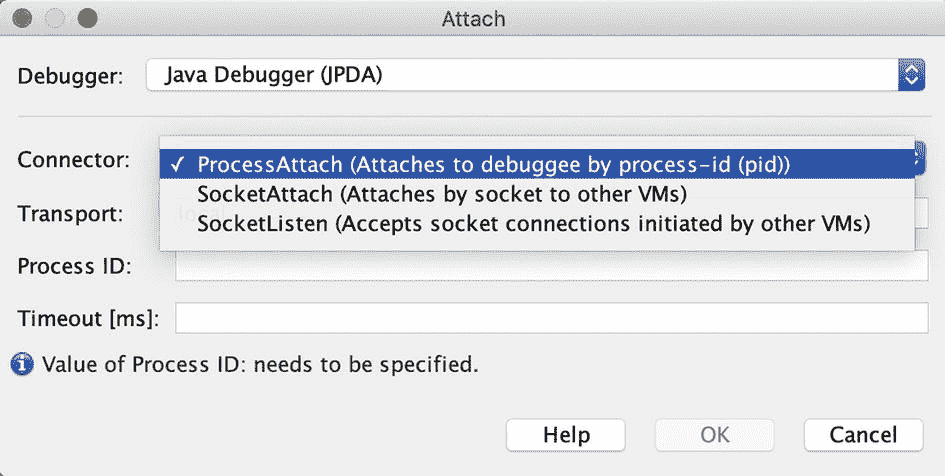

图 6-1

将调试器附加到正在运行的进程

调试器运行后，Apache NetBeans 会自动显示两个附加视图：*调试* 视图和 *变量* 视图。*调试* 视图用于显示被调试进程中所有正在运行（或暂停）的线程。*变量* 视图在调试器停止时，显示当前上下文中的变量信息。NetBeans 显示初始调试体验的示例如图 6-2 所示。

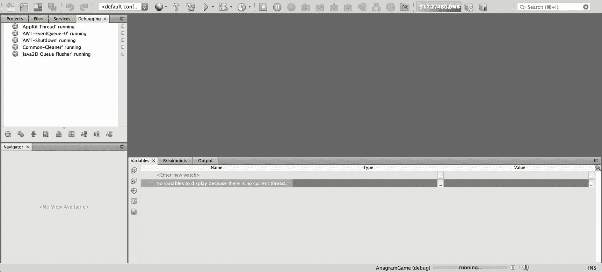

图 6-2

初始调试体验

### 注意

如果任何屏幕截图中显示了您无法立即看到的窗口，这通常是由于窗口预设与默认设置不同（例如，由于您使用 IDE 造成的）。要打开所需的窗口，只需从主菜单中选择 *窗口*，然后从 *调试* 子菜单中选择相应的项目即可。

除了这两个视图，Apache NetBeans 还会显示 *调试* 工具栏。此工具栏提供了访问控制调试会话所需的所有操作。除了工具栏，所有操作也可以通过 *调试* 主菜单项触发，或者使用键盘选择特定操作。控制调试工作流程的所有按钮如图 6-3 所示。

图 6-3

调试工具栏

从左到右的操作如下：

*   **结束调试器会话 (⇧-F5)**。通过分离或终止被调试进程来结束调试会话，具体取决于调试器的使用模式。

*   **暂停调试器会话**。挂起被调试进程的所有正在运行的线程。

*   **继续调试器会话 (F5)**。恢复所有暂停的线程。

*   **单步跳过 (F8)**。将执行指针移动到下一行。

*   **单步跳过表达式 (⇧-F8)**。将执行指针向前移动一个表达式。

*   **单步进入 (F7)**。将执行指针向下移动一个堆栈层级，即进入此行中的方法调用。如果有多个方法调用，可以选择具体的方法调用。

*   **单步跳出 (**⌘**+F7)**。将执行指针向上移动一个堆栈层级，即跳出当前正在调试的方法。

*   **运行到光标处 (F4)**。将执行指针移动到光标所在的行。

*   **应用代码更改**。编译活动编辑器选项卡中的代码，并将更改后的代码推送到 JVM。此外，执行指针可能会在堆栈中向上移动，以适应新代码。

*   **切换在 GraalVM 脚本中暂停**。安排一个与 Truffle 多语言集成相关的挂起。要使用此操作，NetBeans 必须在 GraalVM 上运行。

*   **拍摄 GUI 快照**。为 Swing 组件图的当前状态拍摄快照，以便进行交互式检查和修改。

要进行真正的调试会话，最后需要的是*断点*。断点定义了调试器将自动挂起线程的位置，该线程恰好运行到定义的断点处。创建新断点最简单的方法是：在编辑器的装订线中单击正确的行，或者将光标放在调试器应暂停执行的行上，然后按 ⌘**-F8**（在 Mac 上）或 Ctrl+F8（在 Windows/Linux 上）。同样的操作可以用于移除断点，即触发的操作称为*切换断点*。一旦创建了断点，它会在装订线中用特殊符号标记出来。如图 6-4 所示。

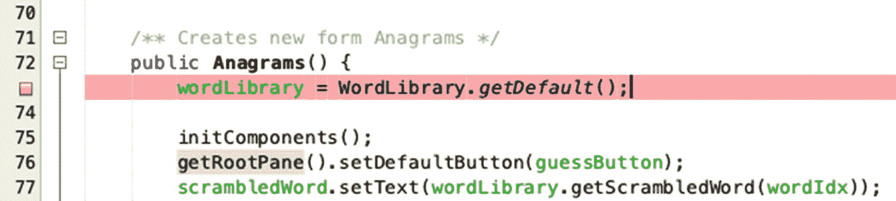

图 6-4

调试工具栏

### 调试视图

从图 6-4 所示的简单断点开始，我们启动一个新的调试会话。正如预期，调试器在 `Anagrams` 类的第 73 行暂停。调试视图默认会显示挂起的线程及其调用栈信息，如图 6-5 所示。

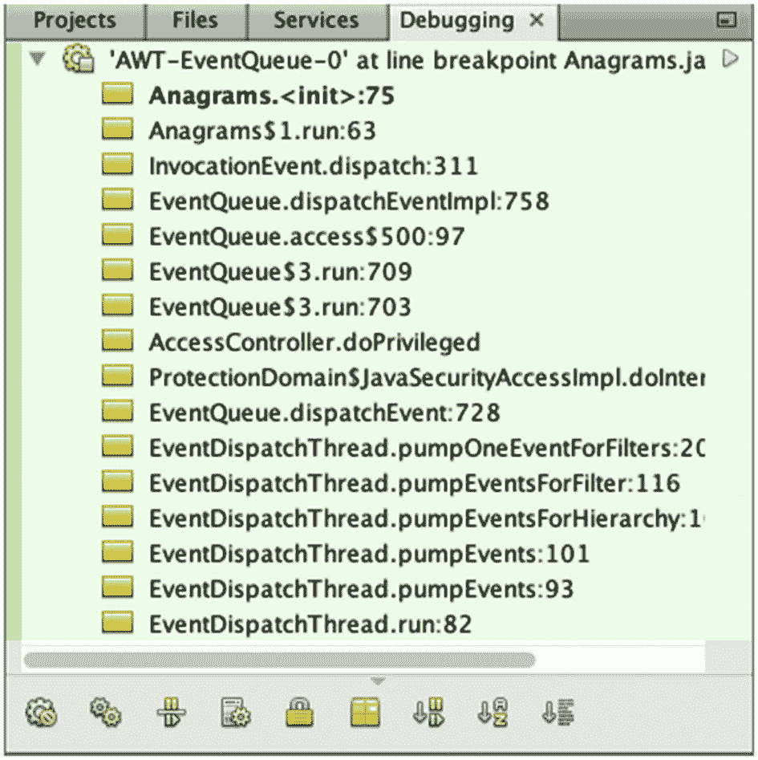

图 6-5

调试视图

在视图底部有几个按钮，用于控制视图的行为（选项）。从左到右依次是：

*   **显示更少**。切换视图中显示的线程。默认只显示挂起的线程，但你可以通过此按钮在所有线程和仅挂起线程之间切换。

*   **显示线程组**。切换线程组的可见性，将列表样式视图切换为树形样式视图，并按线程组对可见线程进行分组。

*   **显示挂起/恢复表**。切换视图右侧列的可见性，显示线程的实际状态，即暂停或运行。

*   **显示系统线程**。切换系统线程的可见性。默认情况下，系统线程是隐藏的。

*   **显示监视器**。切换线程获取的监视器（锁）的显示。默认情况下，监视器不显示。

*   **显示限定名称**。切换完整限定类名的显示。这有助于识别显示在栈中的特定类实际来自何处。

*   **按挂起/恢复状态排序**。根据线程状态切换线程列表的排序顺序。

*   **按名称排序**。根据线程名称切换线程列表的排序顺序。

*   **按默认排序**。切换到默认排序顺序（按名称排序）。

除了可用于配置视图的选项外，该视图还允许与线程进行交互。首先要控制的是线程状态。通过单击视图右侧显示的按钮，可以挂起正在运行的线程，也可以恢复已挂起的线程。当应用程序在调试期间确实需要多个线程，并且需要按需挂起线程以确保正确的应用程序状态时，这可能会很有帮助。此外，多个线程经常会在当前不感兴趣（但仍需保持激活状态）的断点处停止。使用这些控件，可以恢复这些线程。

另一个有趣的技术是调查调用栈中不同帧的状态。活动帧以粗体突出显示（如图 6-5 所示），可以通过双击另一个栈帧条目或使用栈帧的上下文菜单项 *设为当前帧* 来更改。

栈帧的上下文菜单还有一个额外的有趣功能。除了在不同帧处检查栈之外，菜单项 *弹出至此* 允许将栈展开到选定的栈帧。这是一个很好的小帮手，因为它允许重试代码片段——尤其是在它们不修改状态的情况下。

如果上下文菜单不是直接在调用栈条目上调用的，你会得到一些额外的辅助操作。其中两个很直接，即 *恢复所有线程* 和 *挂起所有线程*，但第三个更有趣。*检查死锁* 工具对于处理棘手的多线程情况非常有用，因为死锁通常难以检测和调试。

*调试*视图中还隐藏着更多功能，但我们稍后会在多会话调试的上下文中进行探讨。

现在让我们开始单步执行代码。单步进入代码将把我们带到 `WordLibrary`。Apache NetBeans 会自动打开一个新标签页来显示 `WorldLibary` 类的源代码，并再次暂停。这种情况如图 6-6 所示。

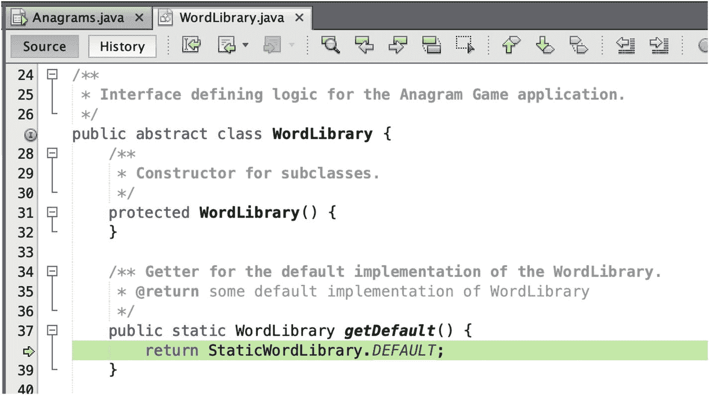

图 6-6

用于调试的多个编辑器标签页

### 表达式求值

现在，假设我们想了解 `StaticWordLibrary.DEFAULT` 的具体内容。将鼠标悬停在 `DEFAULT` 上，会弹出一个工具提示，显示基本信息，如图 6-7 所示。

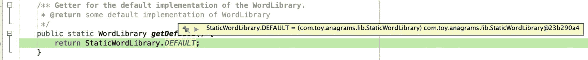

图 6-7

求值工具提示

如果想了解更详细的信息，只需点击文本前面的小箭头，就会看到一个结构化的视图，显示通过悬停求得的对象。你可以沿着显示的树形结构深入查看，最终看到所使用的单词，如图 6-8 所示。

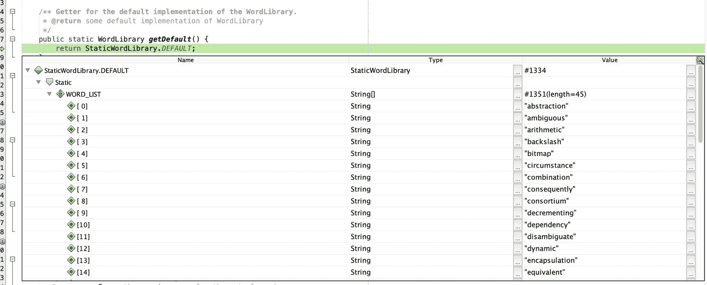

图 6-8

求值工具提示（展开）

这种求值方式可以快速深入查看对象状态的细节。它甚至可以用来改变状态。只需点击简单类型（例如 `String`）字段的右侧列（值），输入一个新值，然后按 **Enter** 键。这会将字段的值更改为输入的值。

另一个有用的快捷方式是，可以高亮一段代码并获取带有结果的工具提示。继续单步执行代码，直到再次到达 `StaticWordLibrary`，调试器会在第 147 行停下。现在选中 `SCRAMBLED_WORD_LIST(idx)` 并将鼠标悬停其上。会弹出一个工具提示，如图 6-9 所示。

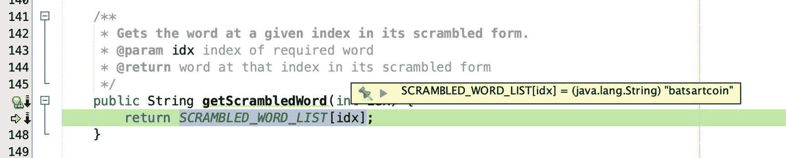

图 6-9

表达式求值工具提示

如果仔细观察，会发现箭头图标前有一个图钉。点击该图钉（符号/图标）可以将表达式求值固定在源代码中。这样，无论何时你回到该文件，调试器都会自动重新求值该表达式，并显示结果且保持最新。固定后的求值表达式如图 6-10 所示。

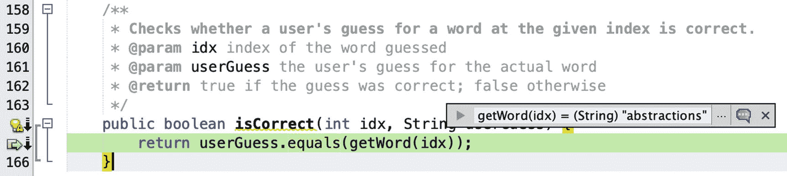

图 6-10

固定的表达式求值

除了作为源代码编辑器一部分的表达式求值外，还有一个专门的视图，可以通过 ⌘**+F9**（在 Mac 上）或 Ctrl+F9（在 Windows/Linux 上）打开，或者从主菜单的 *Debug* 菜单中打开。它会显示一个区域，你可以在其中输入任意代码，通过按 CTRL-⏎ 或点击右下角的按钮来求值。任意代码示例可以是跨越多行的复杂代码片段。求值结果显示在 *Variables* 视图中，如图 6-11 所示。

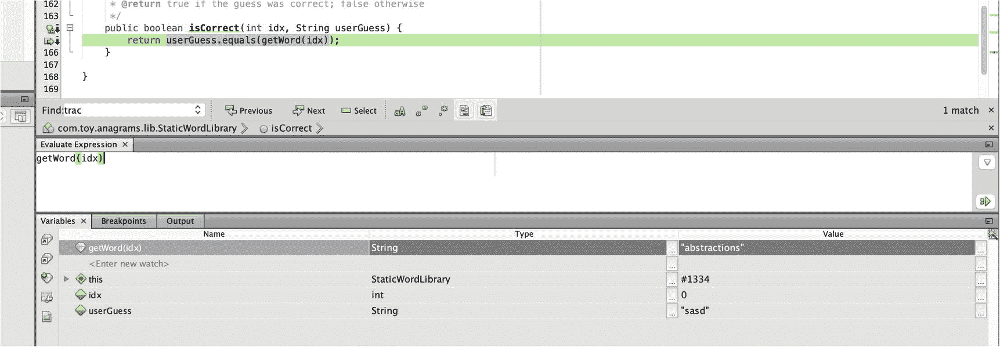

图 6-11

求值表达式和变量视图

代码编辑器区域能够感知实际的调试上下文，也就是说，它会为上下文中可见的字段和方法提供补全功能，甚至在编写代码时也支持代码补全。如果你需要之前使用过的某个代码片段，右上角有一个按钮，可以显示 *Evaluate Expression* 视图中最近使用过的代码片段。

求值后的代码片段不仅可以用于读取数据，还可以将更改写回正在调试的应用程序。这在需要更改调试应用程序的状态时非常有用，例如，在应用了一个代码片段后，确保能够正确地重试代码。在 *Evaluation Result* 视图中也可以看到所有已求值表达式的完整历史记录，如图 6-12 所示。

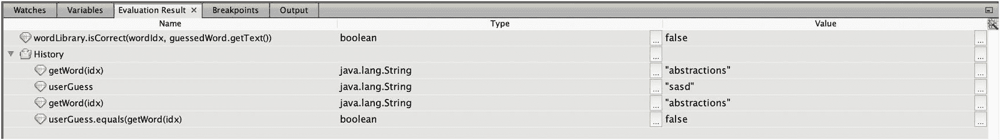

图 6-12

求值结果视图

与同时显示多个结果的 *Evaluation Result* 视图不同，图 6-11 中的 *Variables* 视图仅在所有其他信息之上显示最近一次求值的表达式。

让我们更详细地看一下这个视图，如图 6-13 所示。

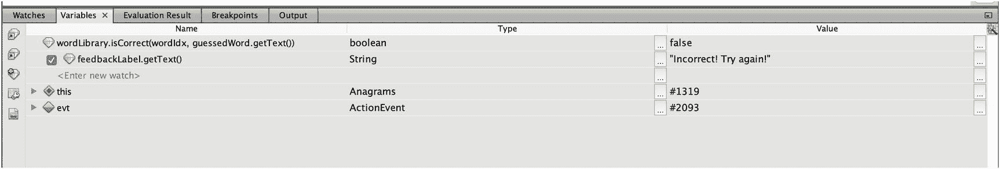

图 6-13

变量视图

### 变量视图

*变量*视图用于检查（和更改）调试过程中所触及的所有对象的状态。它分为三个主要区域。

首先，显示来自*计算表达式*视图的代码片段求值结果（粉色图标）。

其次，显示一个监视列表（蓝色图标）。*监视*是一种对简单求值结果的持久化快捷方式，例如，在变量层级结构中位于较深层次的某个特殊字段，即使变量列表在调试器上下文变化（例如，调试过程中离开某个类）时会刷新，该字段也能保持静态可见。如果你暂时不需要更新监视，可以通过取消选中显示监视前的复选框来禁用每个监视。

第三，显示变量列表，例如，*this* 和*局部变量*（绿色图标）。

与其他视图一样，*变量*视图也可以自定义。自定义可以通过使用视图左侧的按钮之一来完成。从上到下依次为：

*   **在变量视图中显示求值结果**。切换是否在*变量*视图中显示来自*计算表达式*视图的代码片段求值结果。

*   **在变量视图中显示监视**。切换是否在*变量*视图中显示已定义的监视。

*   **创建新监视**。打开一个对话框，允许用户输入要监视的表达式。文本字段支持代码补全，以便更快地创建监视，减少输入量。

*   **打开格式化选项**。打开首选项窗口（选项窗口），允许用户定义特殊类型的对象在*变量*视图中的呈现方式。

*   **在可用时，将值显示为可视化属性编辑器**。如果 IDE 中为变量（字段）的类型注册了属性编辑器，则使用该属性编辑器来呈现/编辑该类型，而不是使用已定义的格式化逻辑。

另外，也可以通过双击标签 *“<输入新监视>”* 来创建监视。出现的文本字段也支持代码补全，如图 6-14 所示。

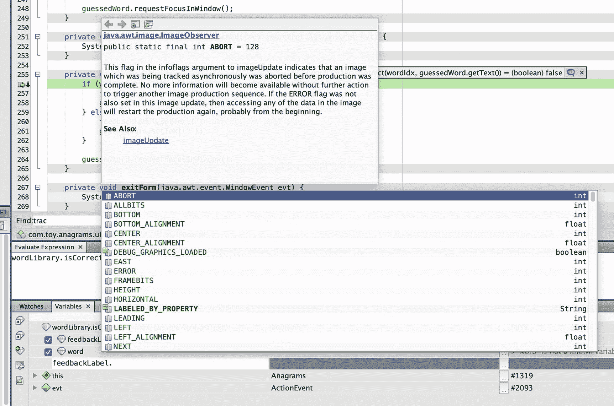

图 6-14

使用代码补全添加新监视

*变量*视图中不同项目上的上下文菜单有助于进一步交互：

*   **删除**。删除一个监视：无论是固定监视、固定监视还是默认监视。

*   **全部删除**。删除所有监视。

*   **创建固定监视**。创建一个不基于当前上下文，而是基于全局上下文的监视。

*   **编辑**。打开一个对话框，允许更改要监视的表达式。文本字段支持代码补全，以便更快地创建监视，减少输入量。

*   **显示固定监视**。显示所有通过在源代码视图中固定表达式求值而创建的监视。

*   **新建监视**。打开一个对话框，允许用户输入要监视的表达式。文本字段支持代码补全，以便更快地创建监视，减少输入量。

*   **转到类型源代码**。在编辑器选项卡中打开附加到该类型的源代码。如果没有可用的源代码，则显示反编译的替代内容。

*   **查看方式**。切换视图组件，使用表格或树形表格来显示数据。

*   **显示引用**。打开*堆遍历器*视图，检查所选变量的实际引用网络。

*   **标记对象**。为对象附加一个标签，以帮助在后续调试过程中识别该对象。

*   **仅显示满足条件的行**。根据变量类型从视图中过滤行。提供不同的过滤类型。

有了所有这些功能，*变量*视图是一个非常强大的工具，可以帮助你了解应用程序的状态。在 Apache NetBeans 中，此视图还附带其他几个从不同角度支持调试过程的视图。我们首先深入了解的是*监视*视图。

### 监视视图

*监视*视图是一个专门的视图，专门用于显示*监视*功能（已在*变量*视图部分描述过）并与之交互。示例视图如图 6-15 所示。

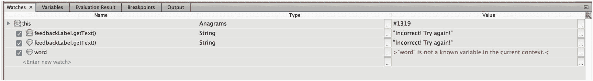

图 6-15

监视视图

与*变量*视图的主要区别在于，*变量*视图提供混合信息，而*监视*视图则专注于显示监视。在*变量*视图部分描述的所有与监视的交互在此处同样可用：

*   **显示固定监视**。显示所有通过在源代码视图中固定表达式求值而创建的监视。

*   **新建监视**。打开一个对话框，允许用户输入要监视的表达式。文本字段支持代码补全，以便更快地创建监视，减少输入量。

*   **创建固定监视**。创建一个不基于当前上下文，而是基于全局上下文的监视。

#### 线程视图

*线程*视图是*调试*视图的简化版本。它以树形视图按名称显示被调试进程的所有线程，并按线程组分组。视图示例如图 6-16 所示。

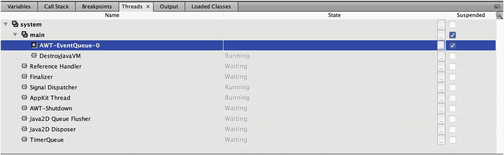

图 6-16

线程视图

附加列显示线程状态的描述以及线程是否被调试器挂起。显示挂起状态的列也可用于在调试会话中挂起或恢复线程。我们在*调试*视图中已经了解的一些交互也可在线程的上下文菜单中使用。如果需要当前正在调试的线程的详细信息，则需要打开*调用栈*视图。

### 调用栈视图

*调用栈*视图是*调试*视图的另一半，作为一个独立的视图存在。它显示被调试线程的调用栈，并允许对栈帧进行与*调试*视图中相同的交互，即*设为当前*、*弹出到此位置*。通常在调试会话期间，*调试*视图足以处理所有与线程管理和控制相关的事情，因此不会使用单独的调用栈和线程视图。调用栈显示如图 6-17 所示。

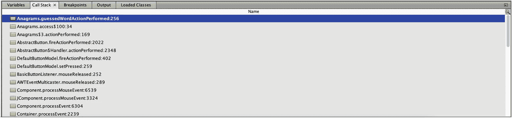

图 6-17

调用栈视图

我们目前讨论的许多调试功能和技巧都围绕线程和值求值展开。另一个鲜为人知的功能是在调试会话期间进行堆遍历的可能性。堆遍历是一种调试技术，用于调查堆的内容，可以从单个实例（如*变量*视图中所示）开始，也可以从堆直方图开始，该直方图显示堆中包含多少个（以及总大小）哪种类型（类）的实例。可以通过打开*已加载类*视图来显示这样的直方图。

### 已加载类视图

*已加载类*视图根据每个类的实例数量，以直方图形式显示所有已加载的类。这是分析堆构成的简单起点。该视图将实例数量显示为绝对值以及占所有实例的百分比。默认情况下，表格按绝对实例数量排序，如图 6-18 所示。

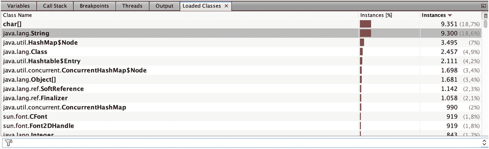

图 6-18

已加载类视图

由于此类堆直方图的特性，类列表可能会非常长。为了能够更好地向下钻取，可以在表格底部定义一个过滤器。可用的过滤器类型如下：

*   **包含**。显示所有完整限定类名包含过滤字符串的类。
*   **不包含**。显示所有完整限定类名不包含过滤字符串的类。
*   **正则表达式**。显示所有完整限定类名与作为正则表达式的过滤字符串匹配的类。
*   **子类**。显示所有属于所输入类的子类的类。输入的类必须使用完整限定类名。

一旦过滤器激活，过滤文本字段的右侧会显示一个红色的 **x**。它可以用来清除过滤器。在最右侧是一种旋转控件，用于访问之前输入的过滤字符串。

对于每一行显示堆中某个类的行，都有一个包含以下操作的上下文菜单：

*   **在实例视图中显示**。如果实例视图在编辑器标签页中已关闭，则将其打开，并显示所选类的实例。
*   **仅显示子类**。基于所选类启用子类过滤功能。
*   **转到源代码**。在编辑器标签页中打开所选类的源代码。如果该标签页已存在，则将其激活并显示。

分析堆内容的第一步是为直方图设置一个良好的过滤器；通常先查找你自己的类，然后找出该实例的对象图。此分析通过*实例*视图完成。

### 实例视图

*实例*视图是堆分析（堆遍历）的核心。该视图主要显示一个类的不同实例列表。通过从左上角的树形列表中选择一个实例，其他三个组件会随之更新。左下角显示该实例的值表示，例如，一个 `String` 的字符序列。右上角是实例的结构化视图，即，它允许你通过深入树形结构递归地查看所有字段及其值。右下角显示实际实例被使用的位置。这是引用链，可以顺着它找出哪个对象持有你的宝贵实例。所有这些细节如图 6-19 所示。

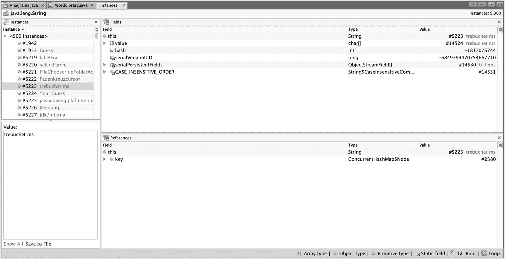

图 6-19

实例视图

如果你想查看作为字段列表一部分显示的某个实例的详细信息，请打开上下文菜单并选择*显示实例*。这会将*实例*视图切换为渲染与字段列表中选定实例相同类型的实例列表，并在实例列表中预选该实例。这允许快速深入对象层次结构。

既然我们已经知道如何在调试会话期间处理 Apache NetBeans 中的线程、内存和求值，我们还需要弄清楚如何处理断点。

### 断点

断点是调试的关键功能，因为它们允许在代码的任意位置暂停被调试的进程。在 Apache NetBeans 中，可以使用*断点*视图跨源文件管理和显示断点。除了将断点视为非结构化列表外，断点还可以分组到自定义或预定义的组中，例如，按编程语言分组的*断点组*。一个断点可以属于一个自定义组，并且如果需要，可以从一个组移动到另一个组。在我们深入探讨这些细节之前，让我们先创建一些新的断点。

在 Apache NetBeans 中，有多种创建断点的方法：

*   通过在装订线（显示行号的区域）中切换断点，可以创建或删除*类断点*、*字段断点*、*行断点*或*方法断点*。
*   通过使用主菜单中*调试*菜单下的菜单项*新建断点*（Mac 上为 ⇧-⌘-F8，Windows/Linux 上为 Ctrl+Shift+F8），可以创建所有类型的断点。

使用“新建断点”操作创建新断点可以在创建时对断点进行完整配置。第一步是选择调试器，这反过来会更改可用的断点类型列表。对于 *Java* 调试器，断点类型如下：

*   **类**。根据类状态暂停被调试的进程。
*   **异常**。根据抛出的异常暂停被调试的进程。
*   **字段**。如果访问了某个字段，则暂停被调试的进程。
*   **行**。如果到达文件中的特定行，则暂停被调试的进程。
*   **方法**。根据方法相关状态暂停被调试的进程。
*   **线程**。根据线程相关状态暂停被调试的进程。
*   **AWT/Swing 组件**。根据组件相关事件暂停被调试的进程。

所有断点类型都允许配置附加属性。它们分为两类：*条件*和*操作*，并且可能因断点类型而异。“新建断点”对话框如图 6-20 所示。

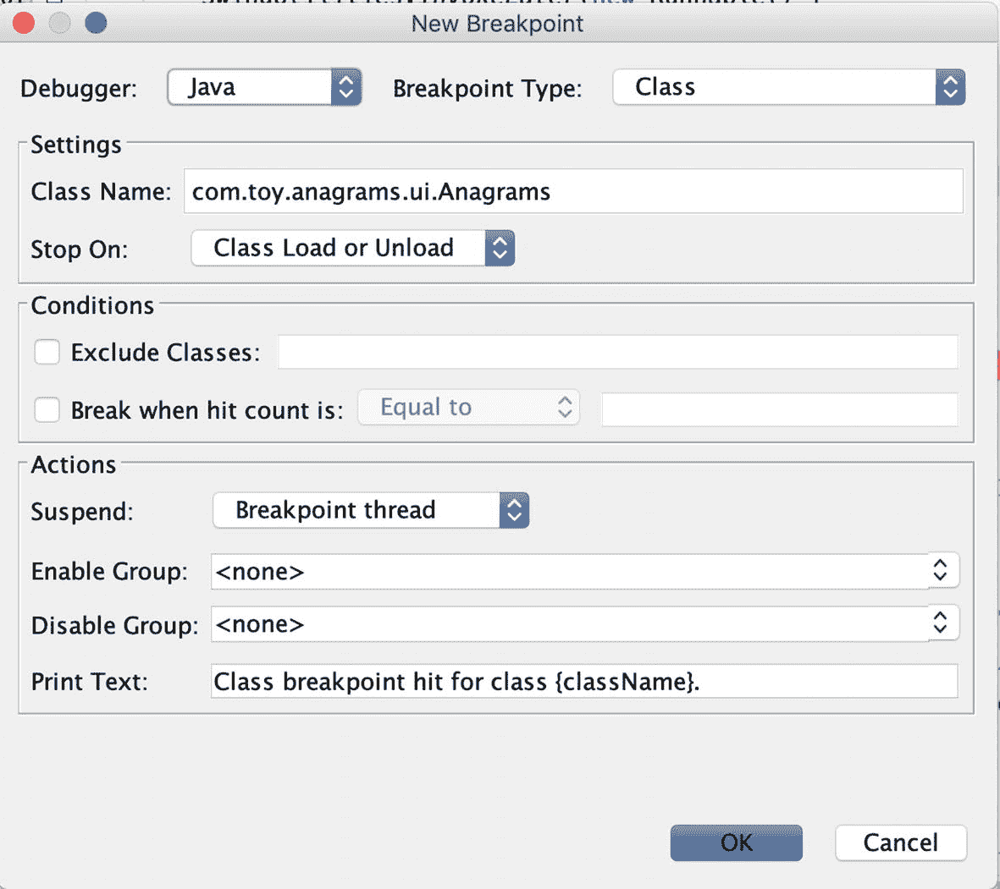

图 6-20

新建断点对话框

*操作*属性描述了到达断点时会发生什么。每种断点类型都有四种不同的关联操作。

*   **挂起**。允许选择到达断点时将挂起哪些线程。可能的值有*断点线程*（到达断点的线程）、*所有线程*或*无线程（继续）*。选择*无线程*将仅打印*打印文本*操作下的文本，但不会停止任何线程。这在只需要不同点的值列表，但不需要与被调试进程进一步交互时很有用，例如，在多线程应用程序中，停止线程会改变运行时行为。
*   **启用组**。一旦到达此断点，则启用选定的断点组。结合下一个操作，这可以实现某种基于上下文的自动断点控制，以减少在代码特定区域手动启用或禁用断点的工作量。
*   **禁用组**。一旦到达此断点，则禁用选定的断点组。结合上一个操作，这可以实现某种基于上下文的自动断点控制，以减少在代码特定区域手动启用或禁用断点的工作量。
*   **打印文本**。一旦到达断点，将配置的文本打印到调试器控制台。

到达断点时打印文本使用一种特殊的语法来表示动态信息。动态信息由 `{}` 括起来，而外部的所有内容都是纯文本。支持以下动态语法：

*   `{=<expression>}`。根据到达断点时的上下文，打印表达式求值结果（见上文）；
*   `{className}`。打印定义断点的类名；
*   `{exceptionClass}`。打印与断点定义相关的异常类名；
*   `{exceptionMessage}`。打印与断点定义相关的异常消息；
*   `{fieldName}`。打印定义断点的字段的实际名称；
*   `{lineNumber}`。打印实际行号；
*   `{methodName}`。打印定义断点的方法的实际名称；
*   `{threadName}`。打印到达断点时的线程名称；
*   `{? threadStarted}{}{}`。根据`threadStarted`的状态，打印第一组或第二组中的文本。两组均可包含动态语法元素。

并非所有动态元素都适用于所有断点类型，例如`threadStarted`。*打印文本*操作文本字段中已预填了一个示例文本。

描述调试器在到达断点时停止所依据约束的*条件*，并非对所有断点类型都相同，但大多数断点类型遵循以下两个约束：

*   **条件**。描述一个表达式（见求值），该表达式必须求值为真，调试器才会停止。
*   **命中次数达到时中断**。描述断点必须被命中多少次，调试器才会停止。

命中次数有不同的比较器可用：

*   **等于**。命中次数必须等于定义的值，调试器才会停止。
*   **大于**。命中次数必须大于定义的值，调试器才会停止。
*   **倍数**。命中次数必须是定义值的倍数，调试器才会停止。

完整的通用条件如图 6-21 所示。

图 6-21

通用断点条件

描述断点类型设置的*设置*，每种断点类型都不同，因此我们逐一介绍。

### 类断点

*类断点*由完全限定的类名以及从类加载器角度观察到的类状态定义，调试器会监控这些状态：

*   **类加载**。调试器在类加载时停止。
*   **类卸载**。调试器在类卸载时停止。
*   **类加载或卸载**。调试器在类加载和卸载时均停止。

*类断点*的*设置*配置如图 6-22 所示。

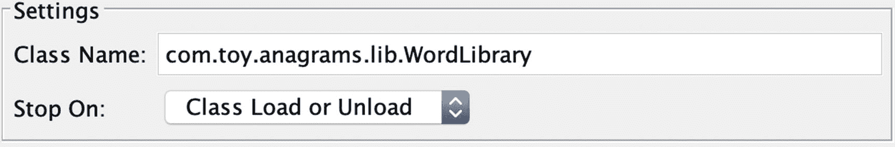

图 6-22

类断点设置

### 异常断点

*异常断点*在抛出异常时停止。它由完全限定的异常类名以及调试器观察到的异常状态定义：

*   **已捕获**。仅在异常被捕获时停止。
*   **未捕获**。仅在异常未被捕获时停止。
*   **已捕获或未捕获**。两种情况下均停止。

*异常断点*的*设置*配置如图 6-23 所示。

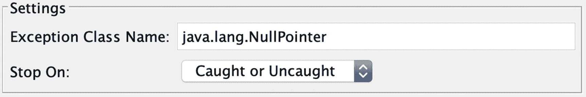

图 6-23

异常断点设置

由于配置*异常断点*断点行为的更有趣情况并非由异常类定义，因此此类异常的*条件*有一个额外的自定义选项：

*   **抛出异常的类过滤**。将断点限制为抛出指定异常的特定类。*匹配类*和*排除类*的类名必须指定完全限定名，但可以在末尾使用星号作为通配符。多个模式可以用逗号分隔指定。

*线程断点*的*条件*配置如图 6-24 所示。

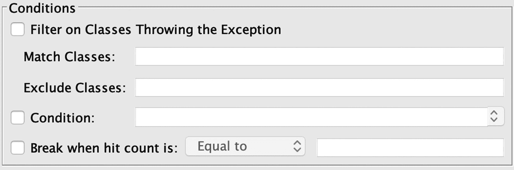

图 6-24

异常断点条件

### 字段断点

*字段断点*在访问已定义类的字段时停止被调试的进程。它由完全限定的类名和相应的字段名定义，并选择调试器在哪些访问情况下停止：

*   **字段访问**。在访问字段时停止，例如读取访问。
*   **字段修改**。在写入字段时停止。
*   **字段访问或修改**。在访问或写入字段时停止。

*字段断点*的*设置*配置如图 6-25 所示。

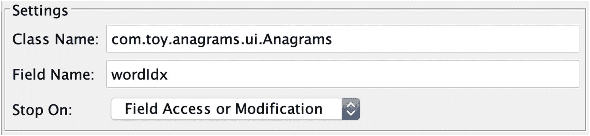

图 6-25

字段断点设置

### 行断点

*行断点*由源代码文件中的一行定义，该行指向可执行的代码行，即不是类、方法或字段声明。源代码文件以绝对路径引用。

*行断点*的*设置*配置如图 6-26 所示。

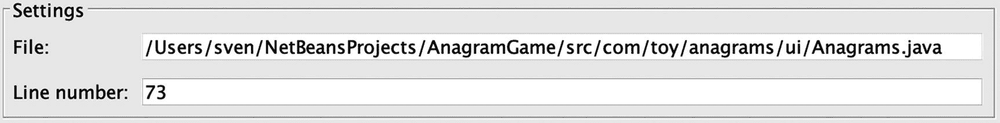

图 6-26

行断点设置

### 方法断点

*方法断点*由完全限定的类名和方法规范定义，可以是具体的方法名，也可以是已定义类的所有方法。此外，还需要指定何时停止：

*   **方法进入**。在进入方法前停止。
*   **方法退出**。在退出方法前停止。
*   **方法进入和退出**。在进入和退出方法前均停止。

*方法断点*的*设置*配置如图 6-27 所示。

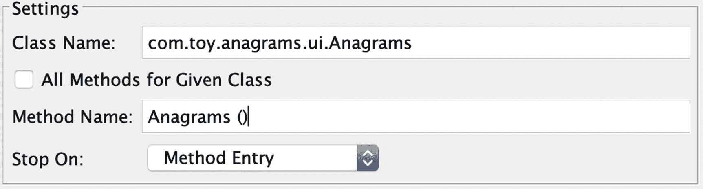

图 6-27

方法断点设置

### 线程断点

由于*线程断点*的性质，可用的配置选项有限。可以定义何时停止：

*   **线程启动**。在新线程启动时停止。
*   **线程死亡**。在线程死亡时停止。
*   **线程启动或死亡**。在新线程启动和线程死亡时均停止。

*线程断点*的*设置*配置如图 6-28 所示。

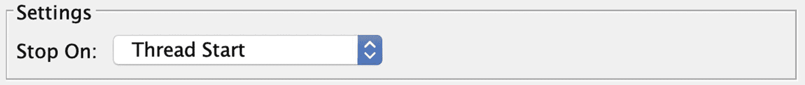

图 6-28

线程断点设置

*线程断点*唯一可用的条件是命中次数。如果使用此选项，则仅当线程的创建或死亡次数达到每次命中次数时，调试器才会停止。*线程断点*的*条件*配置如图 6-29 所示。

图 6-29

线程断点设置

### AWT/Swing 组件断点

*AWT/Swing 组件断点* 只有在已获取 UI 快照后才能定义（有关详细信息，请参阅本章后面的*可视化 Swing 调试*）。如果某个编辑器选项卡处于活动状态，则可以选择一个组件并创建新断点。组件名称无法手动输入，而是基于 UI 快照中的选择。有三种可能的方式让调试器在组件相关处停止：

*   **从容器中添加/移除**。当组件被移除或添加时停止。

*   **显示/隐藏**。当组件被显示或隐藏时停止。

*   **重绘**。在重绘组件时停止。

*AWT/Swing 组件断点* 的*设置*配置如图 6-30 所示。

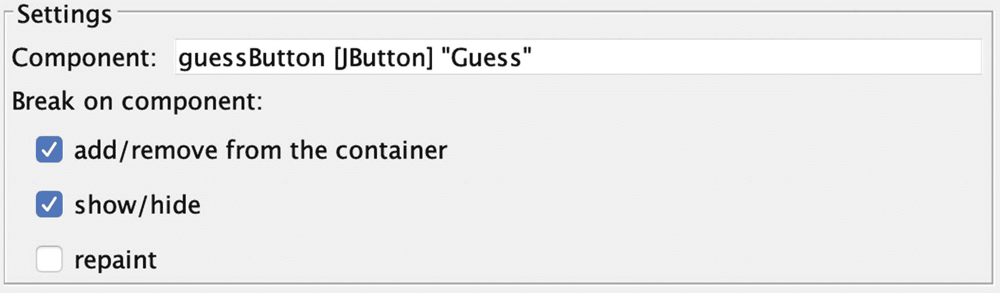

图 6-30

AWT/Swing 组件断点设置

所有列出的断点都以表格视图显示在*断点*视图中。

### 断点视图

*断点*视图是管理和查看所有已定义断点的中心视图。不同的断点类型可能用不同的图标表示。所有断点都可以通过复选框启用或禁用。此外，表格视图会呈现已定义断点的信息，例如行号和源文件或异常类。在默认隐藏的列中，可以显示断点的实际命中次数。每个断点都有一个上下文菜单，包含以下操作：

*   **转到源代码**。在编辑器区域中打开与断点关联的源代码。如果没有可用的源代码，则会显示反汇编的替代内容。

*   **启用/禁用**。切换断点的状态，从启用变为禁用，反之亦然。

*   **移入组**。将选定的断点移入一个断点组，从而允许对启用、禁用或删除进行更精细的控制。

*   **新建断点**。打开对话框以创建新断点。

*   **全部启用**。启用所有断点。仅当至少有一个断点可以启用时才处于活动状态。

*   **全部禁用**。禁用所有断点。仅当至少有一个断点可以禁用时才处于活动状态。

*   **删除**。删除该断点。

*   **全部删除**。删除所有断点。

*   **属性**。显示断点的属性，以允许检查和更改*设置*、*条件*和*操作*。

如图 6-31 所示，属于特定组的断点以树状方式显示在这些组下方。断点组的上下文菜单包含以下操作：

*   **重命名组**。重命名断点组。

*   **启用组内全部**。启用组内的所有断点。

*   **禁用组内全部**。禁用组内的所有断点。

*   **删除组内全部**。删除组内的所有断点，同时也会删除该组。

除了表格视图外，左侧还有一个小的工具栏，提供三个操作：

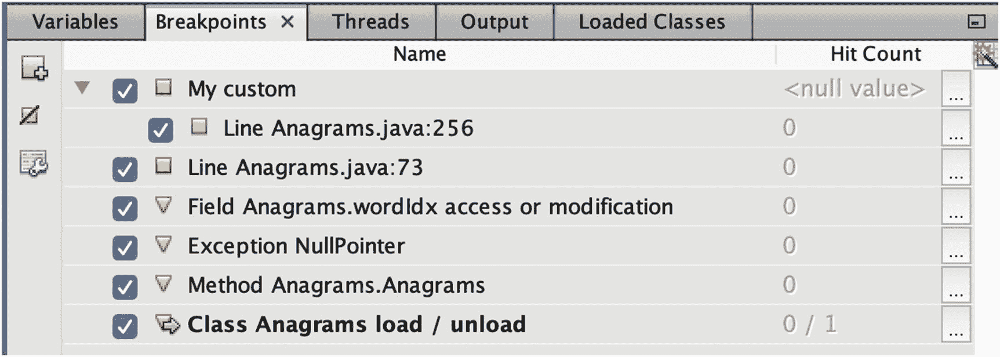

图 6-31

断点视图

*   **创建新断点**。打开对话框以创建新断点。

*   **停用当前会话中的所有断点**。停用当前调试会话中的所有断点。

*   **选择断点组**。根据自定义组或预定义组的选择，显示列表中断点可能的分组策略列表。

### 可视化 Swing 调试

Apache NetBeans 有一个额外的功能来支持 Swing 应用程序的调试。如果被调试的进程具有 Swing UI，则可以快照实际的组件层次结构，以便以可视化方式进行检查。调试工具栏中有一个特殊按钮，用于触发快照并打开一个*快照编辑器*选项卡，如图 6-32 所示。

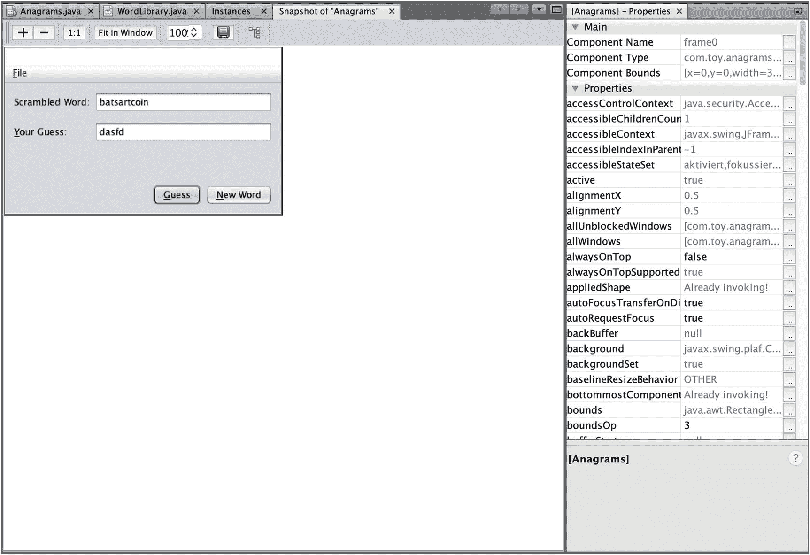

图 6-32

Swing 快照

快照允许您选择不同的组件，例如按钮或文本字段，并检查它们的字段属性。如果某个属性是可写的，则可以通过在*属性*视图的属性编辑器中输入新值来更改该值。快照中显示的组件的上下文菜单包含一些非常有用的操作：

*   **转到组件声明**。在声明所选组件的行处打开相关源代码。这不是创建组件的行，而是字段定义的行。

*   **转到组件源代码**。在编辑器选项卡中打开定义该组件的源代码文件，例如，对于 JButton，它会打开 `javax.swing.JButton` 源文件（如果源代码可用）。

*   **显示监听器**。打开一个名为*事件*视图的新视图。事件视图显示已注册的监听器，允许导航到源代码，并显示事件日志（如果已配置）。

*   **创建固定监视**。为此组件创建一个固定监视。

*   **切换组件断点**。基于可视化选择创建一个组件断点（有关断点的详细信息，请参阅断点部分）。

*   **断点属性**。打开一个对话框，显示组件断点的属性并允许更改属性。

*   **属性**。打开一个独立对话框，显示与所选组件关联的属性表。

*事件*视图基于在*快照*或*导航器*视图中选择的组件显示额外的逻辑信息。第一行标识所选组件，后面跟着两组监听器；第一组显示所有自定义监听器，即不是由 UI 工具包本身添加，而是由用户代码添加的监听器。第二组列出所有由 UI 工具包本身添加的监听器。信息列表中的最后一部分是*事件日志*。它显示组件发出的事件列表。这有助于更好地理解组件层次结构在触发事件和反应方面的行为。如果您需要调试 Swing 组件层次结构的行为，这种调试方式减少了您需要自行进行的设置工作，并让您直接、简单地访问 Swing 的内部机制。示例视图如图 6-33 所示。

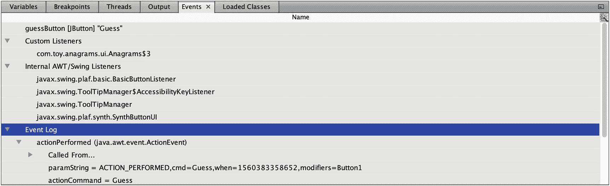

图 6-33

显示监听器和事件日志的事件视图

要使*事件日志*部分中的条目显示出来，需要配置选择某种类型的监听器进行日志记录。这可以通过使用*事件日志*项的上下文菜单*设置日志记录事件*来完成。它将打开一个对话框，显示可能的监听器。如果事件被发送到这些类型，所有选中的监听器都会导致*事件日志*中出现条目。监听器列表如图 6-34 所示。

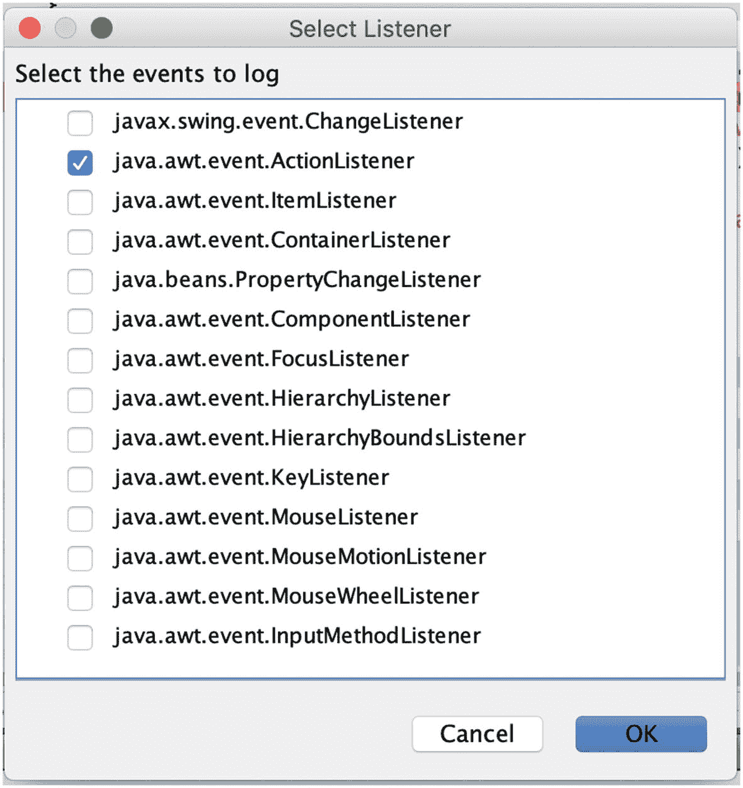

图 6-34

选择要记录的事件

*日志事件*项上的上下文菜单项*清除*可用于清除当前的日志条目列表。

处于活动 GUI 快照模式时，导航器会显示 Swing 组件层次结构，如果能够推导出变量名，则会使用各自的变量名标识每个组件。此外，还会呈现组件的文本表示形式，以帮助在快照视图中识别该组件，例如，标签或按钮中显示的文本。可执行的操作与在 UI 快照中对所选组件执行的操作相同。基于 Anagram Game 的 Swing 层次结构示例如图 6-35 所示。

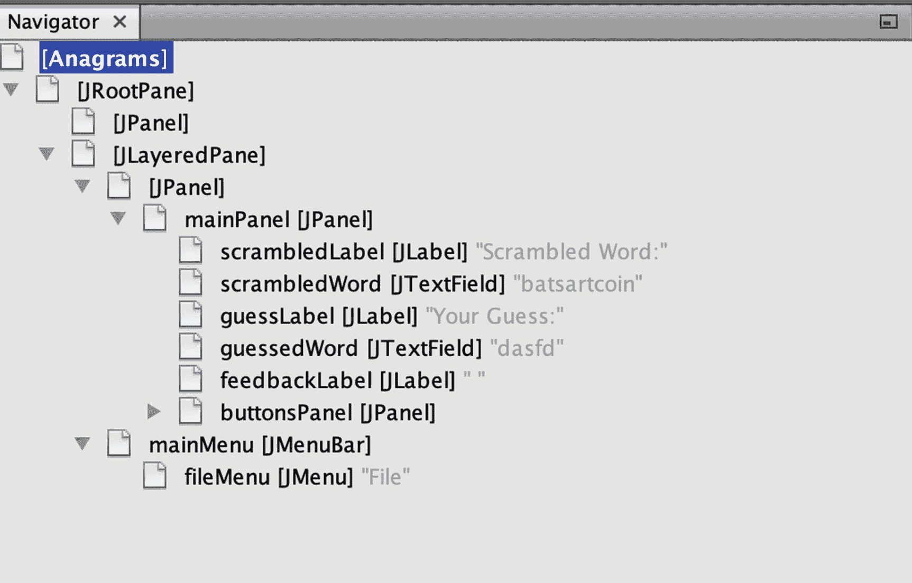

图 6-35

导航器视图中的 Swing 层次结构

在导航器视图中选择一个组件，会在*快照*编辑器选项卡中高亮显示该组件，这有助于在可视*快照*视图中识别组件。该选择还会更改*属性*视图的内容，以显示在*导航器*视图中选择的组件的属性。

### 多会话调试

Apache NetBeans 调试器支持同时运行多个调试会话。如果您需要调试例如 Java 前端和后端之间的某些集成问题，并且可以同时调试这两个进程，这将非常有用。调试器将多会话功能无缝集成到默认视图和工作流程中。在*调试*视图中，会显示一个额外的组合框，允许您选择要显示线程的调试会话，如图 6-36 所示。

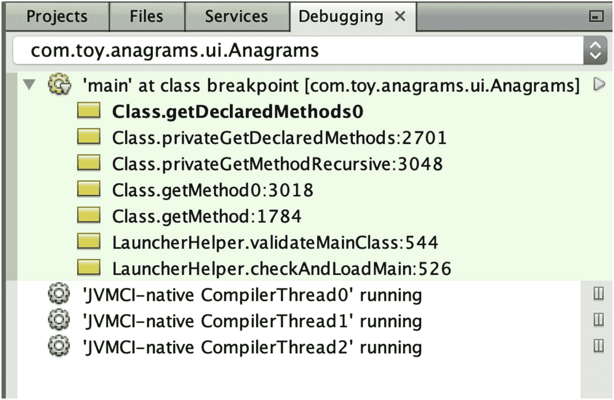

图 6-36

调试视图中的会话选择

除了使用多会话工作流程所需的信息增强*调试*视图外，还有一个专用的*会话*视图，显示所有调试会话及其状态、编程语言以及它们执行所在的主机（请记住，调试会话可能附加到远程主机上的进程运行）。每个会话都有一个上下文菜单，提供与会话的交互：

*   **设为当前会话**。切换调试器以主动调试此会话。

*   **作用域**。选择是调试所有线程还是仅调试当前线程。

*   **语言**。选择用于此进程的调试器（如果可能适用多个调试器）。

*   **结束**。结束调试会话。

*   **全部结束**。结束所有调试会话。

显示两个进程的会话视图示例如图 6-37 所示。

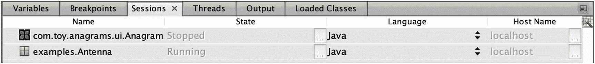

图 6-37

会话视图

## 性能分析

### 入门

为在 Apache NetBeans 中打开的项目启动性能分析会话并不像调试那么简单，因为它需要更多的设置决策。因此，让我们逐步了解启动性能分析会话的过程（作为示例，我们将仅使用 Apache NetBeans 中的 Anagram Game 示例）。如果项目已打开，请在*项目*视图中选择项目节点，然后按工具栏中的**分析项目**按钮。现在需要执行的第一步是配置您的性能分析会话。必须执行此操作，因为 Apache NetBeans 分析器支持多种性能分析模式：

*   **遥测**。监控 CPU 和内存使用情况、线程数以及已加载的类。

*   **方法**。分析方法执行时间和调用次数，包括调用树。

*   **对象**。分析已分配对象的大小和数量，包括分配路径和代际计数。

*   **线程**。监控线程状态和时间。

*   **锁**。收集锁竞争统计信息。

*   **SQL 查询**。显示已执行的 SQL 查询、其持续时间和调用路径。

分析远程 VM 需要更复杂的设置，这需要使用特殊代理设置远程 JVM。

我们现在将更深入地了解所有性能分析模式，但首先了解一些基础知识。

### 基本性能分析操作

在分析应用程序期间，有一组通用操作，可以随时触发以支持性能分析过程。这些操作位于标有*进程*的性能分析工具栏的右端。

*   **从被分析进程获取线程转储**。从被分析进程获取线程转储，并在*线程转储*视图中打开它。

*   **从被分析进程获取堆转储**。从被分析进程获取堆转储，并在*堆遍历器*视图中打开它（请参阅本章后面的*堆遍历器*）。

*   **在被分析进程中请求垃圾回收**。请求在被分析进程中运行显式垃圾回收。这可用于确保堆转储不会被太多不再存活的对象污染。

### 遥测

*遥测*是一种非常基础的性能分析模式。它允许我们跟踪以下内容：

*   CPU 负载，区分实际 CPU 时间和 GC 消耗的时间。

*   堆大小和已使用的堆。

*   关键垃圾回收参数，例如，存活代（持续增加的数字表示缓存或内存泄漏）和 GC 间隔。

*   线程和已加载的类。

对于上述每一项，遥测视图中都会显示一个专门的图表，如图 6-38 所示。

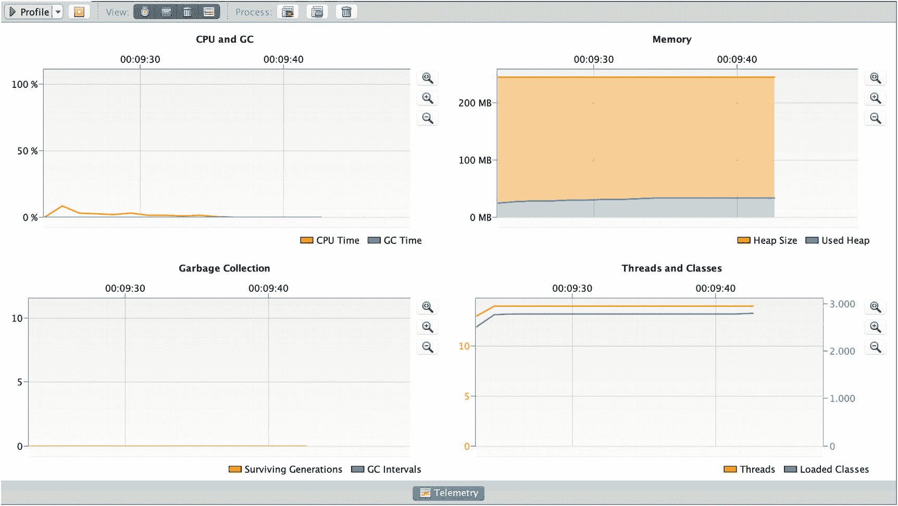

图 6-38

遥测视图

### 方法

方法分析或执行分析是一种帮助理解应用程序运行时执行性能的工具。如果对服务器的请求耗时过长，对应用程序进行执行分析可能有助于找出瓶颈（还有其他技术，但这些可以在性能调优手册中进行更深入的研究）。

使用方法启动分析会话将打开一个视图，类似于图 6-39 所示。

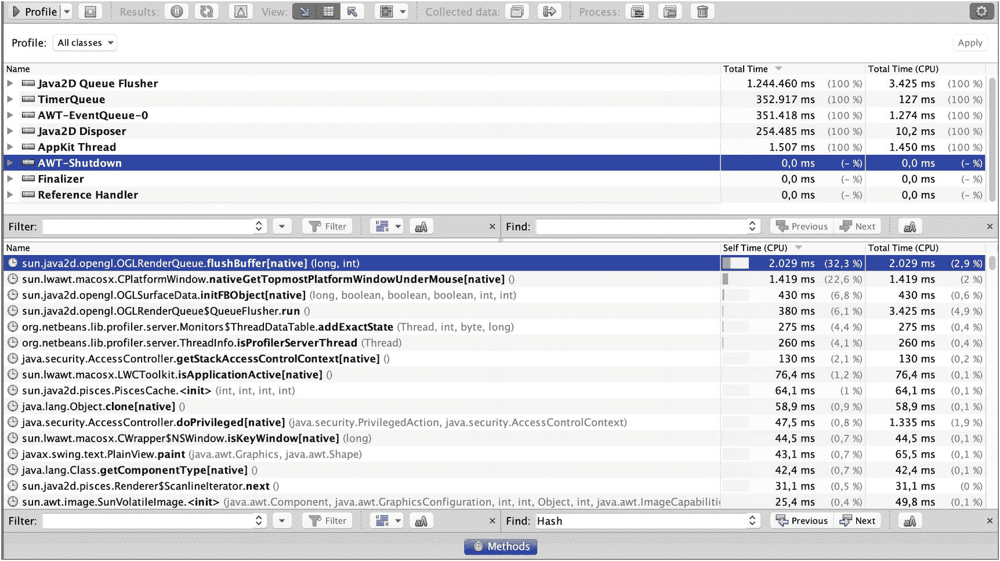

图 6-39

方法视图实时显示

如图所示，该视图包含两个部分，它们会实时更新。第一部分是*线程视图*，显示特定线程中大部分时间消耗在何处。第二部分（显示在底部）是一个视图，显示应用程序的*热点*，即哪些方法已被执行、执行频率以及它们在 CPU 上运行了多长时间。这可以实时了解应用程序中正在发生的事情。由于可能运行着许多线程，并且会生成数千个方法的指标，因此可以通过*线程名称*或方法视图的*类名称*对这两个视图进行过滤。要打开视图底部的过滤栏，请单击视图上下文菜单中的**过滤**。过滤器支持不同类型的匹配：

*   **包含**。显示所有完全限定类名包含过滤字符串的类。
*   **不包含**。显示所有完全限定类名不包含过滤字符串的类。
*   **正则表达式**。显示所有完全限定类名与作为正则表达式的过滤字符串匹配的类。

除了这些过滤表达式之外，还有一些预定义的过滤器可用：

*   JPA
*   JavaEE
*   JavaEE 服务器
*   Java 反射
*   Java SE

由于*方法*分析会向被分析应用程序引入开销，因此配置要分析的方法非常重要。这可以使用右上角的齿轮图标来完成。这将打开一个配置区域，允许我们选择哪些方法将被检测以进行方法分析。默认配置如图 6-40 所示。

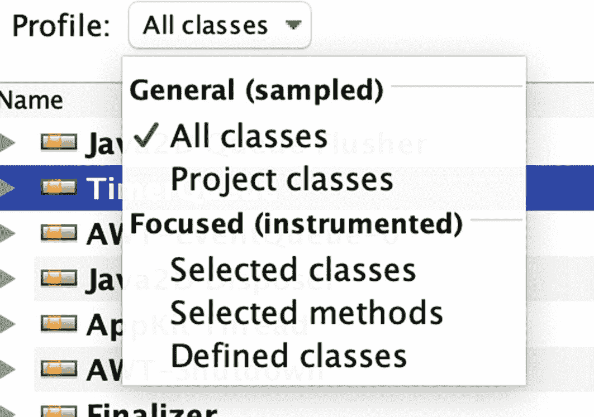

图 6-40

方法配置

默认配置仅对方法分析使用采样分析技术。与检测分析相比，它的开销更小，但不够精确。该配置区分不同的类或方法集合。由于开销问题，最重要的模式是*已定义*类。这允许显式选择分析会话感兴趣的类，如图 6-41 所示。

图 6-41

方法分析仅限已定义的类

甚至还可以通过使用*排除传出调用*选项来禁止分析整个树。完成所有这些设置并跟踪实时结果后，您可能希望更详细地了解实际发生的情况。您可以通过从工具栏创建结果快照来做到这一点，这将为快照打开一个单独的选项卡。显示的结果视图与实时视图差别不大，如图 6-42 所示。

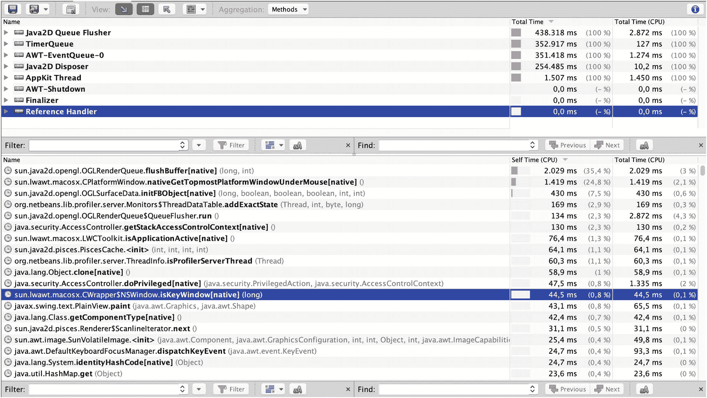

图 6-42

方法结果快照

在*方法*分析的实时视图中，还有一个不错的功能。使用工具栏中的一个按钮，您可以将实时视图切换为显示增量值，即所有绝对值都用作基线，并且仅显示相对于此基线的变化，因此只有在触发增量机制后执行的方法才会在视图中显示大于 0 的值。这可用于消除分析数据中的启动开销。

### 对象

*对象*分析是一种帮助分析内存分配和消耗的工具。当我们查看内存时，通常指的是 Java 堆，即堆上分配的对象。在对象分析模式下启动分析会话将打开一个实时视图，显示所有类实例（对象）的直方图。表格视图显示完全限定的类名、该类实例在堆上消耗的估计活动字节数，以及每个类在堆上的活动对象计数。该视图具有与*方法*分析中描述的相同的过滤选项。示例视图如图 6-43 所示。

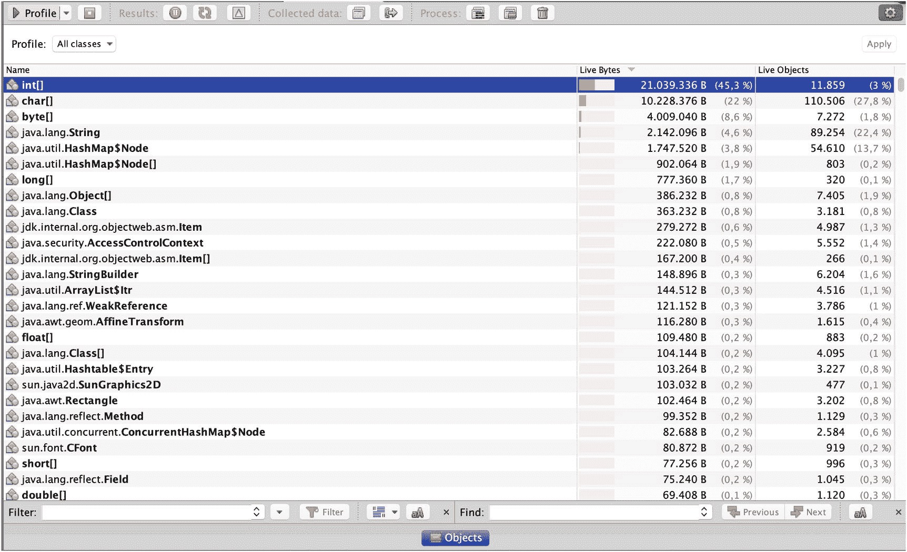

图 6-43

对象视图实时显示

与*方法*分析类似，*对象*分析可以配置分析器应跟踪哪些类实例。这里也可以使用采样分析模式，该模式仅按定义的时间间隔从堆中采集样本。但是，在这种模式下，如果许多分配死亡得足够快（即分配和垃圾回收发生在两个样本之间），分析器可能会错过它们。可以选择可能的配置类型如图 6-44 所示。

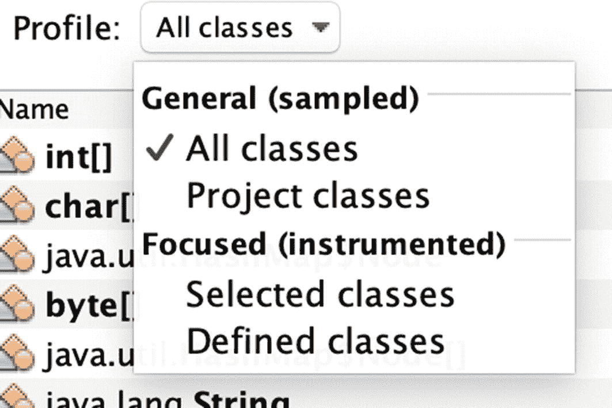

图 6-44

对象配置

默认配置是对所有类使用低开销采样。如果您对内存问题的根源毫无头绪，这可能是合适的。仅对项目类使用采样模式可以减少跟踪的信息量，并将重点放在您自己的领域代码上。由于这可能还不够，例如，想象一个由核心 Java 类的缓存实例引起的泄漏，Apache NetBeans 分析器除了采样模式外，还提供了两种检测分析模式。让我们先看看*已定义类*模式。它允许我们通过使用完全限定的类名来指定要分析的类列表。如果您需要分析来自某个包或包树的所有类，您可以使用星号或双星号作为这些用例的通配符。一旦您将需要的内容添加到列表中（每行一个模式），还有两个选项可供选择：

*   **仅跟踪活动对象**。定义是仅分析活动对象，还是也分析已创建的对象（包括已释放的对象）。
*   **限制分配深度**。定义为分配记录的堆栈深度。如果未选中，则始终记录完整的堆栈，否则仅存储顶部的若干堆栈帧用于分析。此设置对分析期间引入目标 VM 的开销有重大影响。

需要应用更新后的配置，这会触发对目标 VM 检测的更新。配置 UI 如图 6-45 所示。

图 6-45

已定义对象

另一种定义要分析分配情况的类的模式是*选定类*。它与*已定义类*模式非常相似，不同之处在于，要分析的类不是通过模式定义的，而是通过使用简单的 UI 从项目或 jar 文件中显式选择来选定的。要开始选择过程，您需要单击添加按钮，如图 6-46 所示。

图 6-46

选定对象

添加按钮会打开一个新对话框，允许您从 IDE 中已打开的项目中选择类。该对话框由三个列表（*项目*、*包*和*类*）组成，这些列表都可以进行过滤，以便更快地访问特定项。*包*列表的内容可以切换为包含来自项目的包，和/或包含来自依赖项的包（通过列表视图下方的两个切换按钮）。*类*列表显示所选包中的类。此列表还可以显示内部类和匿名类以供选择（使用列表视图下方的切换按钮）。完整的 UI 如图 6-47 所示。

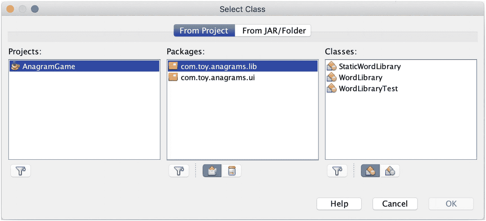

图 6-47

从项目中选择的对象

该对话框可以从基于项目的选择切换到基于 jar 文件的类选择。可以通过*文件*列表下方的按钮添加或删除要使用的文件/文件夹，该列表显示实际使用的文件和文件夹列表。*包*和*类*列表的工作方式与基于项目的选择列表类似，如图 6-48 所示。

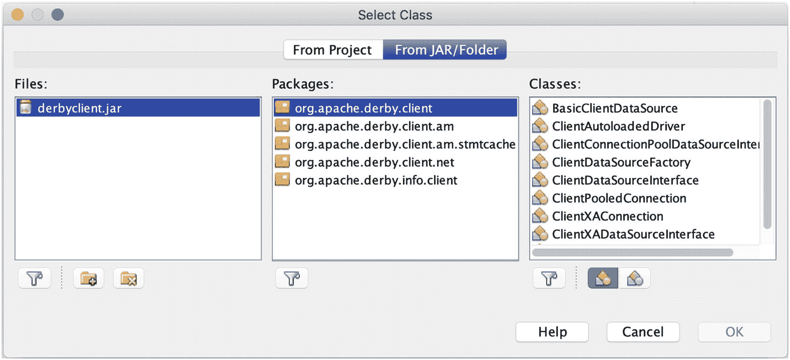

图 6-48

从 jar 文件中选择的对象

使用实时结果非常强大，例如，通过使用工具栏将视图切换到*显示绝对值*来利用增量模式。这类似于*方法*性能分析中可用的功能，但对于堆的性能分析更为有用。显示的值描述了从切换视图那一刻起内存消耗的变化。这为您提供了一个机会，可以建立实际内存消耗的基线，并仅跟踪在应用程序代码的特定部分执行期间内存分配的情况。图 6-49 中显示的实时结果展示了与采样模式相比，检测式性能分析会话的额外能力，例如，右侧提供了分代计数。

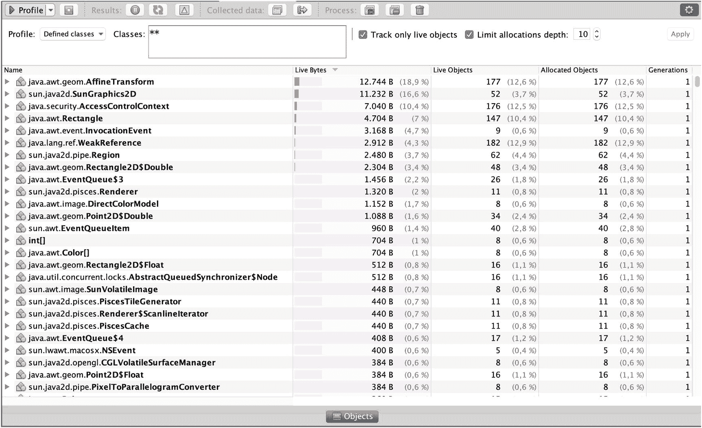

图 6-49

带有检测的对象实时视图

在每个类的统计行下方，可以通过点击每个类名前面的小箭头展开树视图来显示记录的分配堆栈跟踪。该视图将显示一个合并的反向堆栈跟踪树，展示通过哪些代码路径分配了多少实例。这是找出内存泄漏根源的关键信息。此类树的一个示例如图 6-50 所示。

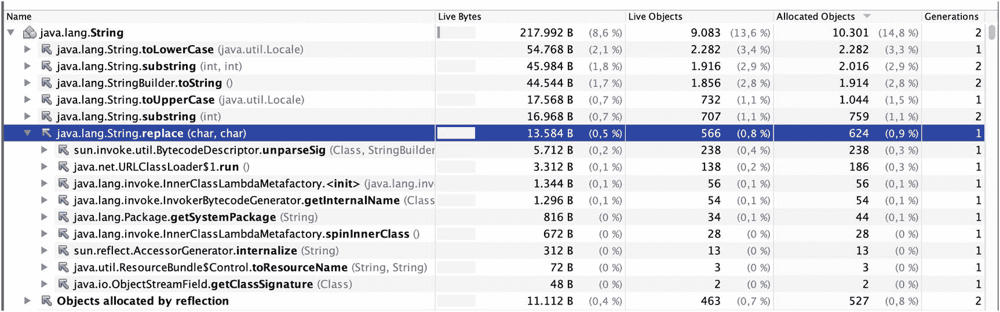

图 6-50

带有分配回溯的对象实时视图

除了实时结果，还可以通过使用工具栏操作*获取收集结果的快照*来创建当前*对象*性能分析会话的结果快照。这使我们能够存储结果以供后续使用，或与其他快照进行比较。一个示例快照视图如图 6-51 所示。

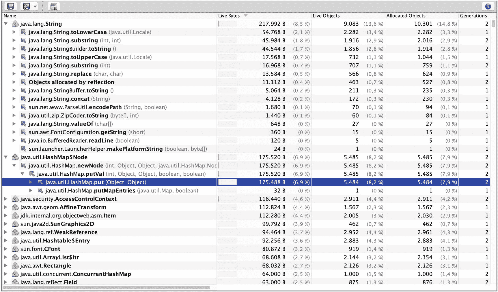

图 6-51

对象快照结果

#### 线程与锁

*线程*和*锁*性能分析可以更深入地了解应用程序代码的实际执行方式。通过使用*性能分析*下拉菜单中的*启用多模式*设置将两种模式结合起来，可以分析您的代码是真正在 CPU 上运行，还是因等待锁或其他资源（如同步 I/O）而被阻塞。

*线程*视图显示一个可过滤的列表（有关过滤机制的处理，请参见上面的“方法”部分），其中包含颜色编码的线程状态。这使我们能够实时了解应用程序如何使用线程，以及线程是真正在运行还是被阻塞（例如，长时间阻塞或频繁短时间阻塞）。一个简单的*线程*实时视图示例如图 6-52 所示。

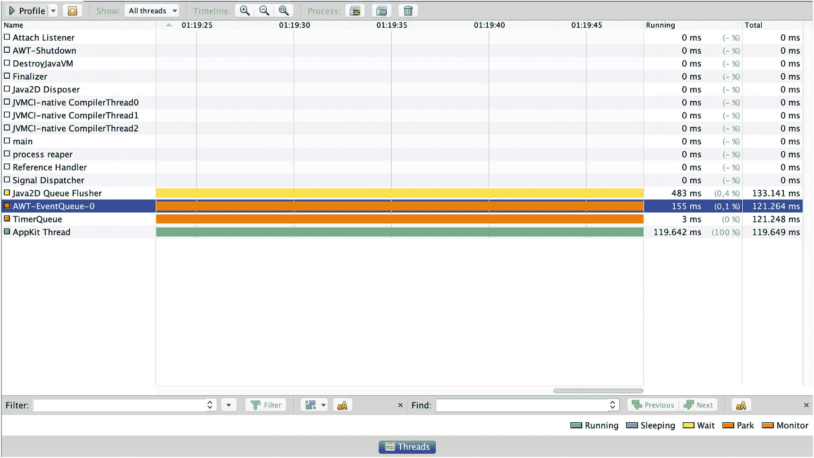

图 6-52

线程实时视图

与*方法*和*对象*性能分析模式不同，*线程*模式不提供结果快照功能。既然您已经看到线程被阻塞而无法执行，那么问题来了：是什么阻塞了它们的执行？激活*锁*性能分析可以回答这个问题。*锁*视图详细显示了哪个线程被阻塞以及阻塞了多长时间。一个非常简单的示例如图 6-53 所示。

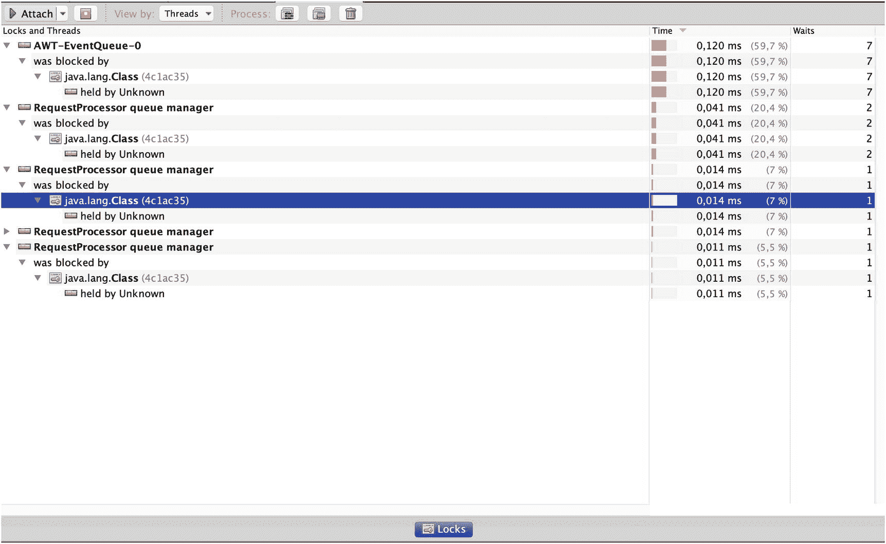

图 6-53

锁实时视图

### SQL 查询

对 SQL 查询进行性能分析只是锦上添花。对应用程序 SQL 查询的 SQL 性能分析会收集语句的跟踪和执行时间。它还可以跟踪与数据库连接的建立，这可能有助于调整您的连接池。

### 堆遍历器

*堆遍历器*是一套用于分析通过 OpenJDK 内部堆转储机制获取的堆转储文件的工具集（在性能分析过程中也可以通过某些操作触发）。它是一个非常全面的分析工具，具备多种剖析堆转储文件的能力。

首先，有一个*摘要*视图，可按多个类别显示与堆转储相关的数据：

*   **基本信息**。显示基本信息，例如文件大小、转储日期。

*   **环境**。显示有关环境的信息；例如，快照是在哪个操作系统上获取的；JVM 的供应商和版本等详细信息。

*   **系统属性**。显示被转储 JVM 的所有系统属性。这些属性会内联显示在视图的实际区域中。

*   **堆转储时的线程**。显示与堆转储一起获取的线程转储。线程转储会内联显示在视图的实际区域中。

*   **应用程序窗口**。列出所有顶级 Swing 窗口，并可直接访问*实例*视图中的对应实例。

*   **最大对象**。根据对象树的保留大小（即属于该对象的所有内容），触发确定堆上最大对象的操作。由于需要计算转储中所有对象的保留大小，此操作可能需要一些时间。

*摘要*视图的示例如图 6-54 所示。

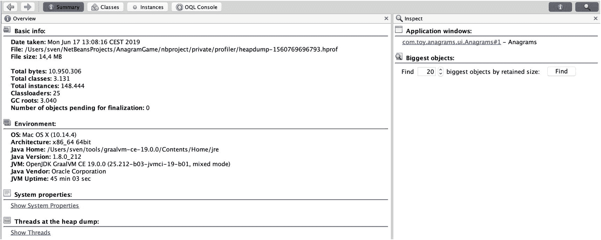

图 6-54

堆遍历器摘要

下一个视图是*类*视图。它显示堆上类实例的直方图。表格视图可以按实例数、大小或类名进行排序。视图底部的过滤器允许更快地向下钻取，例如，仅查找领域类的实例，而不查找 JDK 核心类的实例。有一个初始隐藏的列，用于显示保留大小。如前所述，计算可能是一个耗时的操作，因此该列默认是隐藏的，尽管这些信息有时确实很有帮助。一个简单的示例如图 6-55 所示。

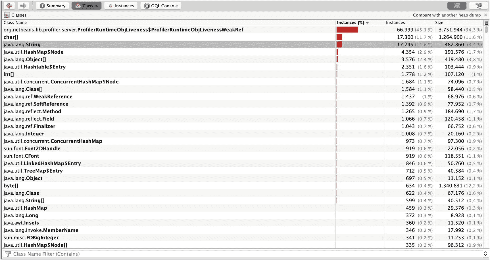

图 6-55

堆遍历器类视图

除了统计分析之外，此视图还有一个有趣的操作——*与另一个堆转储进行比较*。它会打开一个对话框，让您选择另一个堆转储，可以是已加载的，也可以是从文件中加载的。如果您正在分析一个项目，对话框会自动检测可比较的转储；如果您从文件加载，则需要自行处理。加载界面如图 6-56 所示。

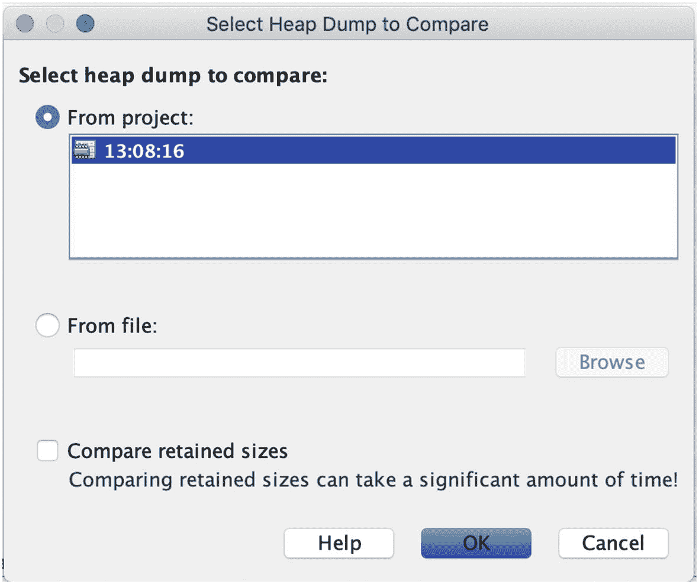

图 6-56

堆遍历器加载比较堆转储

加载转储后，视图会切换到一个增量比较视图，显示在比较的堆转储中发现了某个类的多少个更多或更少的实例。完成差异分析后，可以将视图重置为原始状态。一个简单的比较示例如图 6-57 所示。

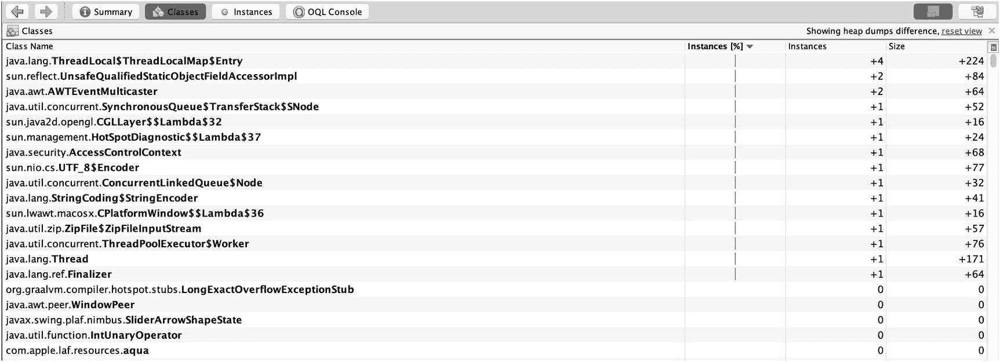

图 6-57

堆遍历器类视图比较

在*类*视图中双击某个类，会打开*实例*视图，显示该类的所有实例列表。该视图实际上与*调试器*部分中描述的*实例*视图相同。左上角显示可用的实例（如果实例过多无法以平面列表显示，则会进行分组），左下角（如果可能）显示对象实例的值表示。右侧，在*字段*视图中显示所选实例的结构，其下方是*引用*视图，显示该实例向上直到垃圾回收根的引用链，该引用链使实例在堆上保持存活。如果出现内存泄漏，并且不太清楚为什么某些实例不会被垃圾回收（例如，某个静态字段持有对该实例的强引用），那么这些信息至关重要。图 6-58 展示了*实例*视图中性能分析结果的示例。

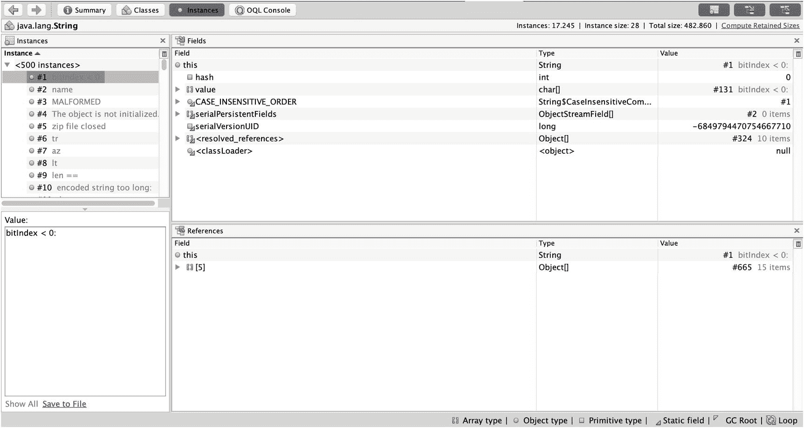

图 6-58

堆遍历器实例视图

最后一个视图是 *OQL 控制台*。此视图允许您使用特殊的 OQL 语法对堆进行交互式分析查询。右下角的*已保存查询*视图中已经提供了一些示例查询。右下角的*查询编辑器*提供代码补全功能，以简化创建新查询的过程，这些查询可以保存以供日后重用。执行查询后，结果将显示在*查询结果*视图中，即 *OQL 控制台视图*的上半部分。查询结果始终是一个实例列表，可以在*实例*视图中选择和分析这些实例。当存在大量相同对象的实例，并且您想找出其中某个子集（例如，所有空的映射）时，使用 *OQL 控制台*尤其有用。图 6-59 展示了使用 OQL 控制台的示例会话。

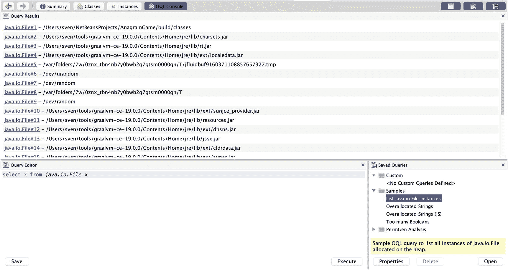

图 6-59

堆遍历器 OQL 控制台

## 总结

在本章中，我们详细了解了 Apache NetBeans 的两大核心功能：*调试*和*性能分析*。

您已经学会了如何使用调试器来解决应用程序代码中的问题、调试多线程应用程序，以及从调试器与您的应用程序进行交互。

针对性能问题，我们向您展示了如何对应用程序进行性能分析，以了解底层的内存分配和执行性能行为。我们向您介绍了内置功能，这些功能可帮助您分析在性能分析运行期间收集的数据。

本章展示的这两个功能都易于使用，并且应该成为您开发者工具包的一部分。现在，我们将进入第二部分：“扩展 Apache NetBeans”。

