# 7. 掌握核心平台

正如我们在第[4](https://example.org/479166_1_En_4_Chapter.xhtml)章中所见，NetBeans 简化了使用 Swing 或 JavaFX 编写的桌面应用程序的开发。虽然 Swing 是一个稳定且根深蒂固的库，但较新的 JavaFX API 提供了改进的富媒体解决方案。然而，这两个库都缺乏一个框架。也就是说，它们都缺少一个开箱即用的解决方案，该方案应包含复杂桌面应用程序所需的窗口管理系统和真正的模型-视图-控制器组件。

你可能熟悉作为开发工具的 NetBeans IDE。然而，NetBeans 也是一个用于构建模块化应用程序的平台。NetBeans IDE 构建在 *NetBeans 富客户端平台*（或称 *RCP*）之上。

NetBeans 富客户端平台是一个通用框架，它为开发桌面应用程序提供了“基础设施”，例如用于管理窗口、将操作连接到菜单项以及在运行时更新应用程序的代码。NetBeans 平台在一个可靠、灵活且经过充分测试的模块化架构之上，提供了所有这些开箱即用的功能。它之于桌面应用程序，就如同 Java Enterprise Edition 框架之于 Web 应用程序。

本章是对 NetBeans 富客户端平台为桌面应用程序开发者提供了什么的大局观描述，也是对你将在本书第二部分中学到内容的执行摘要。

首先，你将学习 NetBeans 平台（或 RCP）的***核心***（本章）：

*   模块系统

*   文件系统

*   查找

在你对*核心*有了良好的背景了解之后，我们将转向 GUI 部分（第[8](https://example.org/479166_1_En_8_Chapter.xhtml)章），该部分构建在 Swing 之上：

*   窗口系统

*   节点

*   资源管理器视图

*   动作系统

我们还描述了两种替代技术：

*   JavaFX 和 NetBeans 平台

*   HTML/Java UI

我们在第[9](https://example.org/479166_1_En_9_Chapter.xhtml)章中通过将一个 Swing 应用程序移植到 NetBeans 平台来应用上述内容。

最后，我们教你一些额外内容（第[10](https://example.org/479166_1_En_10_Chapter.xhtml)章）：

*   可视化库

*   对话框

*   向导

*   品牌化、分发和国际化

第[11](https://example.org/479166_1_En_11_Chapter.xhtml)章使用你在前几章学到的信息，帮助你为 NetBeans 构建一个插件。

图 [7-1](https://example.org/479166_1_En_7_Chapter.xhtml#Fig1) 展示了本书第二部分所基于的 NetBeans 平台架构。

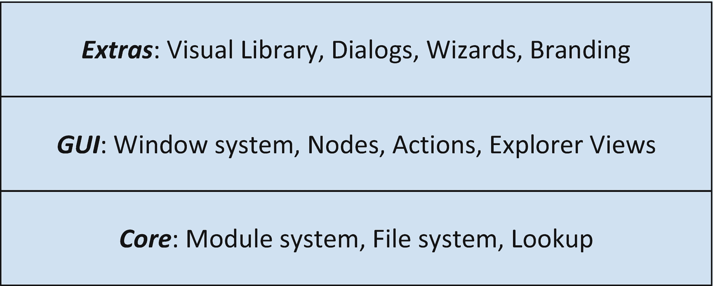

图 7-1

NetBeans 平台架构概览

此链接（[`https://platform.netbeans.org/screenshots.html`](https://platform.netbeans.org/screenshots.html)）提供了构建在 NetBeans RCP 之上的桌面应用程序列表。

## 核心平台

在本章中，我们将学习 NetBeans 富客户端平台的*核心*（参见第[7](https://example.org/479166_1_En_7_Chapter.xhtml)章中的图 [7-1](https://example.org/479166_1_En_7_Chapter.xhtml#Fig1)），它由以下系统（API）组成：

*   **模块系统**：模块化通过让你将代码组织成严格分离且版本化的模块，为“JAR 地狱”提供了解决方案。只有那些显式声明了相互依赖关系的模块，才能使用彼此暴露包中的代码。NetBeans 模块系统早于 Java 9 模块系统（Jigsaw），并且基于 OSGi。文中提供了这两个模块系统的比较。

*   **查找** API 是一种松散耦合机制，它使组件能够针对特定接口发起查询，并获取指向该接口在应用程序所有模块中所有已注册实例的指针。简单来说，`Lookup` 是一个可观察的 `Map`，以 `Class` 对象为键，以这些 `Class` 对象的实例为值，它允许模块之间进行松散耦合的通信。

*   **文件系统**是一个统一的 API，它提供对流式访问的支持，可访问平面和层次结构，例如本地或远程服务器上基于磁盘的文件、基于内存的文件，甚至 XML 文档。`FileObject` 和 `DataObject` 是 FileSystem API 的基本类。


## 模块系统 API

在开始描述 NetBeans 模块系统 API 之前，我们先来了解一些关于模块化系统的定义和特性。

*模块化*是将系统分解为独立模块的行为。*模块*是包含代码的可识别构件，并带有描述模块自身及其与其他模块关系的元数据。与紧密耦合代码的*单体*应用（其中每个单元都可以直接与其他任何单元交互）不同，*模块化应用*由更小、相互隔离的独立代码块组成。

模块化系统具有以下特性：

*   **强封装性**：模块必须能够对其部分代码向其他模块进行隐藏。因此，被封装的代码可以自由更改，而不会影响模块的使用者。

*   **定义良好的接口**：模块应向其他模块暴露定义良好且稳定的接口。

*   **显式依赖**：依赖关系必须是模块定义的一部分，以确保模块的独立性。在模块图中，节点代表模块，边代表模块之间的依赖关系。

*   **版本管理**：支持对模块的特定版本或最低版本进行依赖。

NetBeans 平台模块 API 包含以下内容：

*   一个架构框架，

*   一个支持名为*运行时容器*的模块系统的执行环境。

它提供了一种将应用程序划分为内聚部分的方法，并帮助你构建能够在不中断的情况下演进的松散耦合应用程序。它还允许你在运行时（！）添加/移除功能，而不会破坏你的应用程序。

*运行时容器*由加载和执行应用程序所需的最小模块集组成，并管理应用程序中的所有模块。

*模块*是存储在 JAR 文件中的一组功能相关的类，并附带元数据，这些元数据向运行时容器提供关于该模块的信息，例如：

*   模块的名称，

*   版本信息，

*   依赖关系，以及

*   其公共包列表（如果有的话）。

图 7-2 展示了*模块 A* 对*模块 B* 的显式依赖。

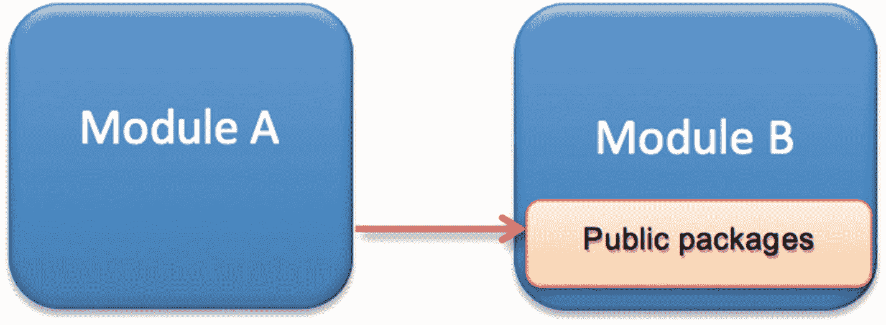

图 7-2

两个模块之间的显式依赖关系

要使用或访问另一个模块中的代码：

1.  你必须将标识模块接口的*模块 B* 类放入一个 `public` 包中，分配一个版本号，并将其导出。

2.  *模块 A* 必须声明对*模块 B* 的指定版本的依赖。

通常，你会将模块的公共接口放入一个公共包中。

换句话说，在 NetBeans 模块系统中，一个模块如果不声明对另一个模块的依赖，并且该另一个模块同意所引用的类是其实际 API，则无法引用该模块中的类。通过这种方式，你可以设计出高内聚、低耦合的应用程序。

所有模块都有一个生命周期，你可以通过注解来接入这些生命周期。因此，你可以在模块启动、关闭以及窗口系统初始化时执行代码。

*NetBeans* *运行时容器*由以下六个模块组成：

*   *Bootstrap*：加载并执行 *Startup* 模块；

*   *Startup*：包含应用程序的 Main 方法，并初始化模块系统和虚拟文件系统；

*   *Module system*：管理模块，强制执行模块可见性和依赖关系，并提供对模块生命周期方法的访问；

*   *Utilities*：提供通用工具类；

*   *File System*：为你的应用程序提供虚拟文件系统；

*   *Lookup*：允许模块之间相互通信。

图 7-3 展示了这些模块之间的关系。

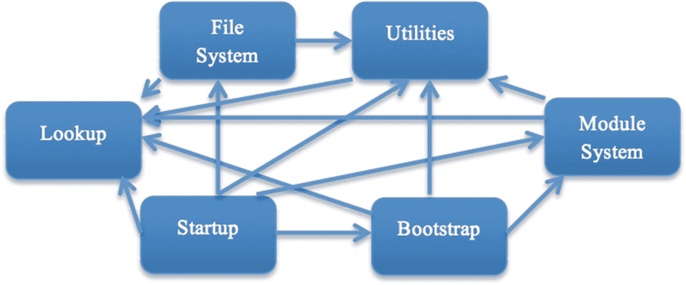

图 7-3

NetBeans 平台运行时容器


## 查找 API

NetBeans 采用基于组件的开发方式。由独立团队或个人开发的模块或组件，必须能够以松散耦合的方式进行相互通信。

之前我们了解了模块系统如何让你将应用程序拆分为松散耦合的部分。这些模块也需要一种松散耦合的方式来相互通信。这正是 *Lookup* API 发挥作用的地方。

软件设计史上最大的挑战之一，就是如何设计具有*高内聚*特性的*松散耦合*系统。根据维基百科（[`https://en.wikipedia.org/wiki/Loose_coupling`](https://en.wikipedia.org/wiki/Loose_coupling)）的定义：“在[计算](https://en.wikipedia.org/wiki/Computing)和[系统设计](https://en.wikipedia.org/wiki/Systems_design)领域，松散耦合系统是指其每个组件对其他独立组件的定义知之甚少或一无所知，并且很少或完全不加以利用的系统。”

*内聚*意味着与特定功能相关的所有代码（和资源）都应组织在同一个模块或同一组模块中。而*耦合*则指模块之间相互依赖的程度。模块应尽可能相互独立，使得组件可以在不对应用程序产生重大影响的情况下被修改或移动。内聚程度越高，耦合程度越低，架构在未来的修改中就越可持续、越健壮（维护上的麻烦也越少）。

假设 `Client` 和 `ProviderImpl` 存在于两个不同的模块中（见图 7-4）。`Client` 如何（以松散耦合的方式）找到 `ProviderImpl`？Spring 通过其 xml 文件使用*依赖注入*或*控制反转*。Java 6 使用基于查询的方法，即 `ServiceLoader`，我们将在本章稍后简要介绍。

NetBeans RCP 引入了一种实现松散耦合的新方式，即 `@ServiceProvider`：

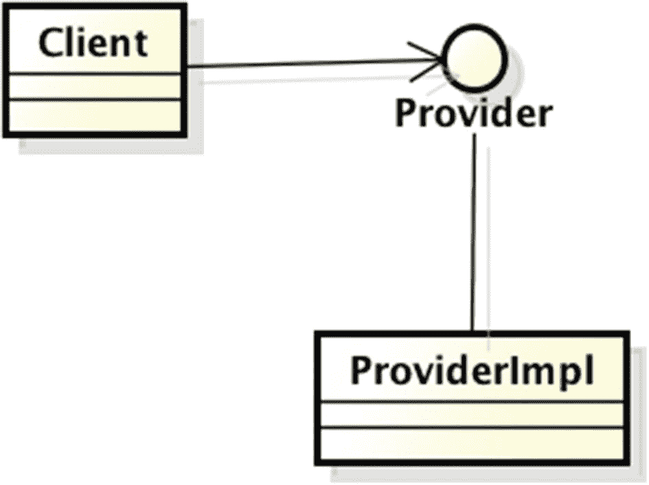

图 7-4

一个松散耦合的系统

```
@ServiceProvider(service = Provider.class, position=1)
public class ProviderImpl implements Provider { }
```

神奇之处在于第一行，它告诉 NetBeans 这个类是服务 `Provider.class` 的一个实现。NetBeans 会在模块的 `build/classes/META-INF/services/` 文件夹内创建一个文本文件 `package.Provider`，其中包含实现类的完全限定名，例如 `package.ProviderImpl`。如果你使用过 `ServiceLoader`，那么这对你来说并不陌生。

然而，最大的问题尚未解答：客户端如何找到这个实现？在 NetBeans 中，这是通过使用 *lookups* 来完成的！客户端在*默认查找*中查找*接口*（而非实现）。*默认查找*（也称为*服务注册表*）是一个 `Lookup`，它会评估 `META-INF/services` 文件夹中的服务声明。可以通过 `Lookup.getDefault()` 方法调用它。通过这种方式请求一个服务接口，你将收到在 `META-INF/services` 文件夹中注册的实现类的实例。

*查找*是一个可观察的映射，以类对象为键，以这些类对象的实例集合为值，即：

```
Lookup = Map<Class, Set<Instance>>
```

例如：`Map<String, Set<String>>` 或 `Map<Provider, Set<Provider>>`。

它被创建出来是为了实现组件间的绑定和依赖关系。

NetBeans 提供了多种访问查找的方法（见清单 7-1）。

```
Provider provider = Lookup.getDefault().lookup(Provider.class);
provider.aMethod();
清单 7-1
访问单个实现的默认查找
```

或者，如果你有多个 `Provider` 的实现（见清单 7-2）。

```
Collection<Provider> providers =
Lookup.getDefault().lookupAll(Provider.class);
for (Provider provider : providers) { ... }
清单 7-2
访问多个实现的默认查找
```

你也可以请求一个 `Lookup.Result<T>`，它允许添加一个 `LookupListener` 以便获知内容变化（清单 7-3）。

```
Lookup.Result<Provider> providers =
Lookup.getDefault().lookupResult(Provider.class);
Collection<? extends Provider> allProviders =
providers.allInstances();
providers.addLookupListener(new LookupListener(){
@Override
public void resultChanged(LookupEvent e){
// 执行某些操作
}}
);
清单 7-3
添加 LookupListener
```

从上面的代码示例可以看出，客户端完全不知道它使用的是哪个实现；它只知道接口。这就是松散耦合！

你可以将查找想象成内存中的一个映射，它存储了应用程序所有服务的实现。当你使用 `@ServiceProvider` 注解定义服务实现时，你就将其放入了查找中，然后使用上述命令进行搜索。服务实现可以位于不同的模块以及*非*公开的包中。

NetBeans 还允许你通过升序的 `position` 来排序实现，即 `@ServiceProvider` 注解的 `position` 属性中数值较小的实例会先于数值较大的实例返回。

我们已经看到了 `@ServiceProvider` 注解的两个属性：`service` 和 `position`。还有两个不太常用的属性：`path`，即提供者注册所在的*系统文件系统*中的路径；以及 `supersedes`，即此实现所取代的实现列表。

除了用于存储服务实现的*默认查找*之外，NetBeans 中还有其他查找，这常常会引起混淆。例如，每个 `OutlineView` 或 `TopComponent` 都会关联一个查找，用于存储在特定时间被选中的节点。你不应将此查找与默认查找混淆。以下是 *Lookup* 的简要总结：

*   *全局查找*是一个单例，像一个中央注册表。有两个重要的全局查找：
    *   *默认查找*或*服务注册表*，前面已经描述过，可通过 `Lookup.getDefault()` 获取。它是一个应用程序范围的仓库，供模块发现和提供服务。它是一个*服务*的中央注册表，允许你在 `META-INF/services` 文件夹中查找服务实现类。因此，客户端模块可以在不了解或不依赖于其实现的情况下使用服务（模块间的松散耦合）。

    *   *操作全局上下文*可通过 `Utilities.actionsGlobalContext()` 获取，它代理了当前在应用程序中获得焦点的任何组件的 `Lookup`。

*   *本地查找*：类可以实现 `Lookup.Provider` 接口，并将对象存储在自己的 `Lookup` 中。你可以将查找视为一个对象可以随身携带的“对象包”（清单 7-4）。

```
public interface Lookup.Provider {
Lookup getLookup();
}
清单 7-4
Lookup.Provider 接口
```

例如，`TopComponent`（我们将在下一章看到）实现了这个接口（清单 7-5）。

```
TopComponent tc = WindowManager.getDefault().findTopComponent("aTopComponent");
Lookup tcLookup = tc.getLookup();
清单 7-5
TopComponent 的 Lookup
```

`TopComponent`（类似于 `JFrame`）通常会将任何被选中的内容放入其 `Lookup` 中。你可以通过向 `TopComponent` 添加监听器来跟踪选择内容（清单 7-6）。

```
Lookup.Result<Node> result = tcLookup.lookupResult(Node.class);
Collection<? extends Node> allNodes = result.allInstances();
result.addLookupListener(myLookupListener);
清单 7-6
向 TopComponent 添加 LookupListener
```

你也可以为 `TopComponent` 提供你自己的 `Lookup`：

```
tc.associateLookup(mylookup);
```


### 创建自定义查找

除了内置的查找功能外，您还可以创建自己的查找。以下小节展示了可用的不同选项。

#### 空查找

您可以将查找初始化为一个`EMPTY`（空）查找：

```
Lookup emptyLookup = Lookups.EMPTY
```

#### 包含单个对象的查找

最基本的是`Lookups.Singleton`，一个仅包含单个对象的查找：

```
Lookup singleObjLookup = Lookups.singleton(obj);
```

#### 包含固定数量对象的查找

还有一种实现用于创建包含多个条目且内容固定的查找：

```
Lookup fixedObjLookup = Lookups.fixed(obj1, obj2);
```

#### 动态内容查找

您也可以使用查找来动态添加内容。最灵活的方式是使用`InstanceContent`对象来添加和移除内容：

```
InstanceContent content = new InstanceContent();
Lookup dynamicLookup = new AbstractLookup(content);
content.add(obj1);
content.add(obj2);
```

尽管名为`AbstractLookup`，但它*并非*抽象类；它是一个内容可以变化的`Lookup`。将`LookupListener`附加到分配给该`Lookup`的`Lookup.Result`上，可以让您接收`AbstractLookup`中内容变更的通知。

#### ProxyLookup 合并多个查找

如果您希望同时查询多个查找，可以使用`ProxyLookup`。以下示例将两个查找合并为一个：

```
Lookup compoundLookup =
new ProxyLookup(singleObjLookup, fixedObjLookup);
```

#### 将搜索委托给某个对象的查找

由给定对象返回的`Lookup`可能会不时变化：例如，在某些条件下，它可能是当前活动的工具，比如`ActionMap`等。创建的`Lookup`会委托给另一个`Lookup`，后者会检查返回的对象是否相同，触发变更事件，并更新所有现有及引用的结果。

```
Lookup delegating = Lookups.proxy(
new Lookup.Provider () {
public Lookup getLookup () {
return lookup;
}
}
);
```

#### 从查找中排除类

您还可以从查找中过滤掉特定的类：

```
Lookup filtered =
Lookups.exclude(originalLookup, SomeObj.class, ActionMap.class);
```

如果您在`layer.xml`中注册了服务（见下文），可以像这样获取某个特定文件夹的查找：

```
Lookup lookup = Lookups.forPath("ServiceProviders");
```

我们将在本书第二部分后续章节中看到其他查找方式。

## NetBeans 模块系统 API 与 Java 9 模块 API 对比

自 JDK 9 起，Jigsaw 项目在 Java 语言中引入了模块。多个 JEP 实现了 Jigsaw 项目：

*   [200：模块化 JDK](http://openjdk.java.net/jeps/200)（[Jigsaw/JSR 376](http://openjdk.java.net/projects/jigsaw/spec/) 和 [JEP 261](http://openjdk.java.net/jeps/261)）
*   [201：模块化源代码](http://openjdk.java.net/jeps/201)
*   [220：模块化运行时映像](http://openjdk.java.net/jeps/220)
*   [238：多版本 JAR 文件](http://openjdk.java.net/jeps/238)
*   [260：内部 API 封装](http://openjdk.java.net/jeps/260)
*   [261：模块系统](http://openjdk.java.net/jeps/261)
*   [275：模块化 Java 应用程序打包](http://openjdk.java.net/jeps/275)
*   [282：jlink：Java 链接器](http://openjdk.java.net/jeps/282)

其目的是使 Java SE 更灵活、可扩展、可维护且更安全；使构建、维护、部署和升级应用程序更容易；并实现性能提升。

在 Java 9 之前，类被组织成*包*。例如，`com.company.app.MyClass` 存储在文件 `com/company/app/MyClass.java` 中。包是全局可见且开放扩展的。交付单元是*Java 归档文件（jar）*。访问控制仅在类/方法级别进行管理。类和方法可以通过三种访问修饰符来限制访问，如表 7-1 所示。

表 7-1

包访问修饰符

| 访问修饰符 | 类 | 包 | 子类 | 无限制 |
| --- | --- | --- | --- | --- |
| `Public` | ✓ | ✓ | ✓ | ✓ |
| `Protected` | ✓ | ✓ | ✓ |   |
| `-（默认或包级）` | ✓ | ✓ |   |   |
| `Private` | ✓ |   |   |   |

如何从另一个包访问一个类，同时阻止其他类使用它？你只能将类设为 `public`，从而将其暴露给所有其他类（即破坏了封装）。没有显式的依赖关系；显式的 `import` 语句仅在编译时有效；无法知道你的 JAR 在运行时需要哪些其他 JAR 文件；开发人员必须在执行期间以正确的顺序在类路径中提供正确的 jar。

*Maven* 通过定义 POM（项目对象模型）文件来解决编译时依赖管理（*Gradle* 的工作方式类似）。*OSGi* 通过要求将导入的包作为元数据列在 JAR 中（这些 JAR 随后被称为 *bundles*）来解决运行时依赖。

一旦 JVM 加载了类路径，所有类都会按照 `classpath` 参数定义的顺序排列成一个扁平列表。当 JVM 加载一个类时，它会按固定顺序读取类路径以找到正确的类。一旦找到该类，搜索结束，类被加载。当类路径中存在重复类时会发生什么？只有一个（最先遇到的）胜出。JVM 无法在启动时有效验证类路径的完整性。如果在类路径中找不到某个类，则会抛出运行时异常。现在，术语 *“类路径地狱”* 或 *“JAR 地狱”* 对你来说应该更清晰了。

通过 Jigsaw 项目，Java 现在拥有了自己的模块系统。模块可以导出或强封装包。模块显式地表达对其他模块的依赖。每个 JAR 成为一个模块，包含对其他模块的显式引用。一个模块具有可公开访问的部分和封装的部分。所有这些信息在编译时和运行时都可用，可以防止意外依赖其他未引用模块的代码。可以通过检查传递依赖来应用优化。

Java 9 模块系统的优势如下：

*   **可靠的配置**：模块系统在编译或运行代码之前检查给定的模块组合是否满足所有依赖关系。
*   **强封装**：模块显式地表达对其他模块的依赖。


*   **可扩展开发**：团队可以通过模块系统强制执行的明确边界来并行工作。

*   **安全性**：无法访问 JVM 的内部类（例如 `Unsafe`）。

*   **优化**：可以通过检查（传递性）依赖关系来应用优化。这也为创建用于分发的精简模块配置提供了可能性。

因此，JDK 现在由 19 个平台模块组成。

正如第 3 章所述，模块具有名称（例如 `java.base`），将相关代码和可能的其他资源分组，并通过*模块描述符*进行描述。就像包在 `package-info.java` 中定义一样，模块在 `module-info.java`（位于根包中）中定义。模块化 jar 是内部包含 `module-info.class` 的 jar。在第 3 章中，我们还了解了 NetBeans 如何为 Java 9 模块提供支持。

表 7-2 提供了 NetBeans 模块 API 与 Java 9 模块化 API 之间的比较。

表 7-2

NetBeans 模块 API 与 Java 9 模块对比

|   | Java 9 模块 | NetBeans 模块 API |
| --- | --- | --- |
| **封装** | ✓ | ✓ |
| **接口** | ✓ | ✓ |
| **显式依赖** | ✓ | ✓ |
| **版本控制** | **✗** | ✓ |
| **循环依赖∗** | ✓ | ✓ |
| **服务** | `ServiceLoader` | `ServiceProvider` |

如前所述，两个模块系统都支持封装和导出公共接口，并显式处理依赖关系，同时两者都不允许循环依赖。Java 9 在编译时不允许循环依赖，但在运行时允许。Java 9 模块系统不支持版本控制，这一点受到了 Java 社区的批评。

如前所述，NetBeans RCP 通过查找和 `ServiceProvider` 接口实现了模块间的松散耦合。另一方面，Jigsaw 使用了 Java 6 中基于查询的方法，即 `ServiceLoader`（清单 7-7）。

```
ServiceLoader serviceLoader =
ServiceLoader.load(Provider.class);
for (Provider provider : serviceLoader) { return provider; }
...
ServiceLoader serviceLoader =
ServiceLoader.load(Provider.class).stream().filter(...);
清单 7-7
ServiceLoader 接口
```

然而，`ServiceLoader` 存在一些问题：

*   它不是动态的（无法在运行时安装/卸载插件或服务）。

*   它在启动时加载所有服务（导致启动时间更长，内存占用更多）。

*   它无法配置；只有一个标准构造函数，并且不支持工厂方法。

*   它是一个行为硬编码的 final 类，因此无法扩展。

*   它不允许排序/定序，即我们无法选择先加载哪个服务。

Java 9 对 Java 6 的 `ServiceLoader` 引入了一些修改：

*   无相对服务；新的基于模块的服务定位器没有相对行为。

*   服务（按其发现顺序）的排序丢失了。

*   模块路径上的所有服务接口和实现都被扁平化为一个单一的全局命名空间。

*   服务加载没有可扩展性/可定制性；服务层提供者必须预先提供可用服务的固定映射。

*   多站点声明；每个使用服务的模块还必须在模块描述符中声明该服务正在被使用；没有全局的层范围服务注册表。

`ServiceProvider` 没有 `ServiceLoader` 的缺点。它是动态的，因此您可以在应用程序运行时插入/拔出模块，它不会在启动时加载所有服务，并且允许您设置优先级（通过 `position` 属性）。它是可扩展的，支持监听器，理解 NetBeans 平台模块系统，并且可以根据需要创建任意数量的 `Lookup`（每个类加载器只能有一个 `ServiceLoader` 实例）。

现在，关键问题来了：

*   应该使用哪个模块系统？

*   Jigsaw 模块系统和 NetBeans 模块 API 能否协同工作？

正如我们所看到的，两个模块系统各有优缺点。NetBeans 模块系统 API 也可以在 NetBeans 之外使用；只需使用相关的 JAR 文件（可以在 NetBeans IDE 安装目录的 `platform/lib` 文件夹中找到）：`boot.jar, core.jar, org-openide-filesystems.jar, org-openide-modules.jar` 和 `org-openide-util.jar`。

不要混淆模块系统，也就是说，不要在项目中同时使用 Jigsaw 和 NetBeans 模块系统。这只会不必要地使事情复杂化，并且不会为您的应用程序带来任何额外的好处。


## 文件系统 API

NetBeans 平台文件系统 API 为标准文件提供了一种抽象。*文件系统 API* 处理物理文件系统以及 NetBeans 虚拟文件系统（例如，它们可能驻留在内存、JAR、ZIP、XML 文件，甚至远程服务器上）中的文件和文件夹（你可以将它们视为*资源*）。

一个 `FileSystem` 是 `FileObject` 的集合，这些 `FileObject` 可以位于任何位置。`FileSystem` 是分层的，并且有一个*根*。`FileObject` 代表 `FileSystem` 中的一个文件或目录（文件夹）；它必须在 `FileSystem` 中物理存在（不同于 Java 的 `java.io.File`），并且具有*MIME 类型*，该类型决定了文件如何处理。`FileObject` 是*组合*设计模式的一种实现，也就是说，它可以包含其他 `FileObject`（文件或子目录）。`FileObject` 还支持属性（这些属性是键值对，类型为 `String`）。

你可以使用 `FileChangeListener` 接口监听 `FileObject` 的更改（例如文件/文件夹的创建、重命名、修改、删除或属性更改）。最后，`FileUtil` 是一个实用工具类，包含许多操作 `FileSystem`、`FileObject` 甚至标准 `java.io.File` 对象的方法。

以上内容的总结以图形方式在图 7-5 中进行了描绘。

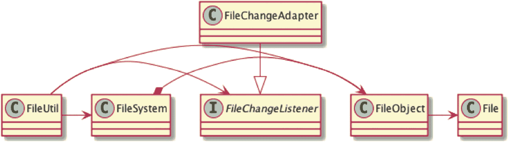

图 7-5

FileSystem API 主要类的类图

让我们看一些代码示例（清单 7-8 和 7-9）。

```
String aPath = ...;
File dir = new File(aPath);
FileObject myfolder = FileUtil.toFileObject(dir);
if (null == myfolder) {
try {
// 创建文件夹
myfolder = FileUtil.createFolder(dir);
} catch (IOException ex) {
Exceptions.printStackTrace(ex);
}
}
if (myfolder != null) {
// 此文件夹中是否存在名为 myfile.txt 的文件？
FileObject myfile = myfolder.getFileObject("myfile.txt");
if (null == myfile) {
try {
// 创建文件
myfile = myfolder.createData("myfile.txt");
} catch (IOException ex) {
Exceptions.printStackTrace(ex);
}
}
}
if (myfile != null) {
// 向 myfile 写入一些文本
if (myfile.canWrite()) {
try (PrintWriter output =
new PrintWriter(myfile.getOutputStream())) {
output.println("这是一些文本");
} catch (IOException ex) {
Exceptions.printStackTrace(ex);
}
}
// 读取文件
if (myfile.canRead()) {
System.out.println("MIME 类型: " + myfile.getMIMEType());
try {
for (String line : myfile.asLines()) {
System.out.println(line);
}
} catch (IOException ex) {
Exceptions.printStackTrace(ex);
}
}
}
// 重命名 myfile.txt；需要锁
FileLock lock = null;
try {
lock = myfile.lock();
// 如果新名称已存在，重命名将失败。
myfile.rename(lock, "mynewfile", myfile.getExt());
} catch (IOException ex) {
Exceptions.printStackTrace(ex);
} finally {
if (lock != null) {
lock.releaseLock();
}
}
try {
// 删除文件；FileObject delete() 方法负责
// 获取和释放锁。递归删除 FileObject
// 文件夹会删除其所有内容。
myfile.delete();
} catch (IOException ex) {
Exceptions.printStackTrace(ex);
}
清单 7-8
FileSystem API 示例
```

前面的示例创建了一个新文件夹，在其中创建了一个新文件，重命名了该文件，然后将其删除。如前所述，你可以将 `FileChangeListener` 附加到 `FileObject`（文件或文件夹），也可以将递归的 `FileChangeListener` 附加到目录树中的文件夹。`FileChangeListener` 接口有六个需要重写的方法，如清单 7-9 所示。

```
private final FileChangeListener fcl = new FileChangeListener() {
@Override
public void fileFolderCreated(FileEvent fe) { ... }
@Override
public void fileDataCreated(FileEvent fe) {    ... }
@Override
public void fileChanged(FileEvent fe) { ... }
@Override
public void fileDeleted(FileEvent fe) { ... }
@Override
public void fileRenamed(FileRenameEvent fre) { ... }
@Override
public void fileAttributeChanged(FileAttributeEvent fae) { }
}
myfolder.addRecursiveListener(fcl);
清单 7-9
FileChangeListener 接口
```

### 系统文件系统或 Layer.xml

NetBeans 平台中的文件系统是一个通用且高度抽象的概念。NetBeans 平台文件系统是一个可以分层存储和读取文件的地方，它不必位于物理磁盘上。其具体实现位于 *MultiFileSystem* 类中，该类允许你构建一个单一的命名空间，该命名空间合并了一组称为*层*的离散文件系统，并表现得好像所有这些文件系统的内容都存在于同一个命名空间中。例如，如果两个不同的层包含一个具有不同内容的文件夹 *MyFolder*，那么列出 *MultiFileSystem MyFolder* 文件夹的内容将得到两者的内容。为了处理冲突（即两个具有相同名称和路径的文件），*MultiFileSystem* 包含一个层的堆叠顺序，这意味着使用顶部的层。NetBeans 对 *MultiFileSystem* 的实现就是所谓的*系统文件系统*。它用于定义应用程序中所有可用的操作、菜单、菜单项、图标、键绑定、工具栏和服务。

可以从“文件”窗口中的 `build` 目录下查看，路径为 `classes/METAINF/generated-layer.xml`。在 NetBeans 的早期版本中，开发人员必须编辑像上面这样的 `layer.xml` 文件来配置操作、菜单和工具栏项、键绑定、服务提供者等。如今，所有这些都应该通过注解来处理，我们将在下一章中看到。但是，仍然有一些专门的事情只能通过编辑此文件来完成。此外，`layer.xml` 文件是访问 NetBeans 平台应用程序完整配置数据的门户。*文件系统 API* 以相同的方式处理这个虚拟文件系统（清单 7-10）。

```
FileObject root = FileUtil.getConfigRoot();
FileObject someFolder = FileUtil.getConfigFile("someFolder");
JToolBar tb = FileUtil.getConfigObject("/path/to/fileobject", JToolBar.class)
清单 7-10
使用 FileSystem API 访问 layer.xml
```

*系统文件系统*提供了另一种模块间通信方式（另一种是 `Lookup`）。使用 `layer.xml` 文件，一个模块可以注册另一个模块可以使用的文件夹和文件。

### 文件系统 API 与 Java NIO

NetBeans 文件系统 API 存在于 Java NIO2（在 Java 7 中引入）之前。Java NIO2 提供了与 NetBeans FileSystem API 类似的功能。表 7-3 是两者基本类的比较（并非 100% 匹配）。

表 7-3

FileSystem API 与 Java 7 NIO2

| FileSystem API | Java 7 NIO2 |
| --- | --- |
| `org.openide.filesystems.FileSystem` | `java.nio.file.FileSystem` |
| `org.openide.filesystems.FileObject` | `java.nio.file.Path` |
| `-` | `java.nio.file.attribute` |
| `org.openide.filesystems.FileUtil` | `java.nio.file.Files``java.nio.file.FileVisitor` |
| `org.openide.filesystems.FileChangeListener` | `java.nio.file.WatchService``java.nio.file.Watchable``java.nio.file.StandardWatchEventKinds` |
| `-` | `java.nio.channels.*` |

使用哪一个取决于你的应用程序。如果你希望开发一个使用 NetBeans RCP 在 GUI 中显示文件/文件夹的应用程序，那么最好使用 NetBeans FileSystem API。NIO2 是一个比 FileSystem API（它主要是为了管理 `layer.xml` 而创建的）更强大的 API，但是 NetBeans FileSystem API 更简单、更直接。


### DataSystem API

*Data System API* 是 *FileSystem API* 与 *Nodes API*（我们将在下一章介绍）之间的重要桥梁。该 API 的主要类是 `DataObject` 和 `DataNode`。`DataObject` 封装了一个 `FileObject`，而 `DataNode` 则在 UI 或表示层中显示它。它们都有一个 `Lookup`，这对于访问与文件关联的功能非常重要。`DataLoader` 通过其 MIME 类型识别 `FileObject` 类型，并创建与之关联的 `DataObject`。

```
DataObject dob = DataObject.find(myfile);
```

请注意，多个 `FileObject` 可以与一个 `DataObject` 关联（例如，一个 Swing 设计表单 – 一个 `DataObject` – 使用了两个文件 – `FileObject` – 一个 `.java` 文件和一个 `.form` 文件）。但是，其中一个被指定为主文件：

```
FileObject fob = dob.getPrimaryFile();
```

最后，以下是如何从 `DataObject` 访问相关的 `Node`，反之亦然：

```
Node node = dob.getNodeDelegate();
DataObject mydob = ((DataNode)node).getDataObject();
```

我们将在下一章中描述 Node API。此外，我们将在第 11 章中看到 *FileSystem* 和 *DataSystem* API 的一个应用，届时我们将为 NetBeans 开发一个插件。在那里，我们将学习如何创建新的文件类型，并将此文件类型注册到我们的插件中。

## 示例应用程序

让我们尝试通过将一个 Swing ToDo 应用程序移植到 NetBeans RCP 来应用我们目前所学到的知识。如果您希望下载 ToDo Swing 应用程序并自行构建，请继续；否则，您可以跳到本章的“*Todo Swing 应用程序*”部分。您也可以在本书的源代码中找到修复后的版本。

### 构建 Todo Swing 应用程序

从此处下载原始的 Swing 应用程序（[`http://netbeans.org/community/magazine/code/nb-completeapp.zip`](http://netbeans.org/community/magazine/code/nb-completeapp.zip)），解压缩，然后在 NetBeans 中打开它。由于这是一个相当老的应用程序，您会遇到一些问题。按下**解决项目问题**按钮以获取问题列表。点击**解决…**，让 NetBeans 尝试解决这些问题。

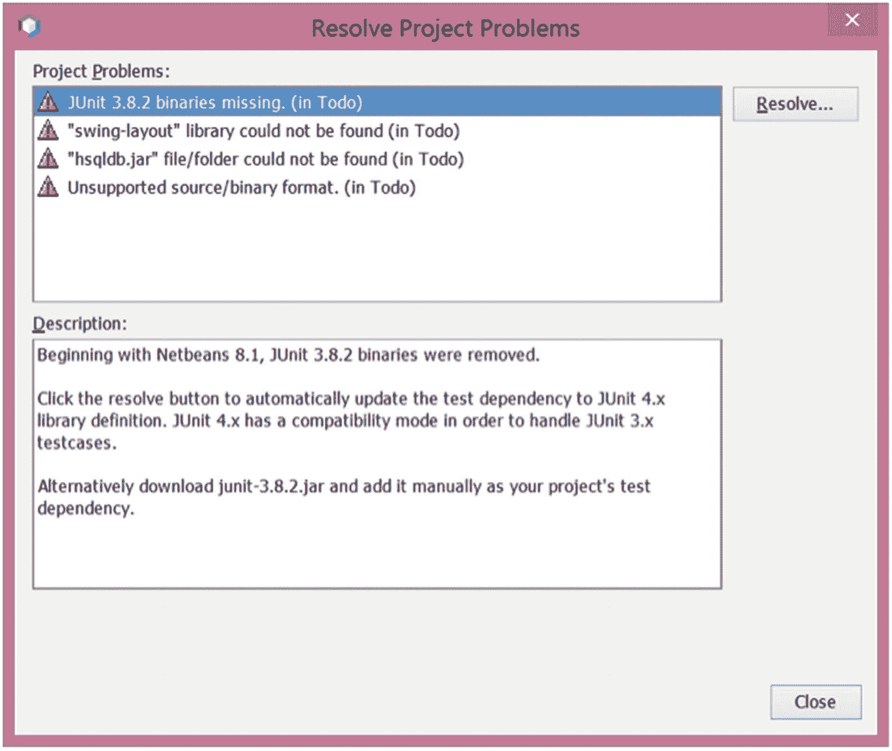

图 7-6

解决 ToDo 应用程序的项目问题

NetBeans 将解决第一个和最后一个问题，如图 7-6 所示。另外两个需要手动解决。请按照此常见问题解答（[`http://wiki.netbeans.org/FaqFormLayoutGenerationStyle`](http://wiki.netbeans.org/FaqFormLayoutGenerationStyle)）中的说明来解决“swing-layout”库问题。

下载 *hsqldb.zip*（来自 [`http://hsqldb.org`](http://hsqldb.org)），在 *TodoNB5* 中创建一个 `lib` 文件夹，然后将 `hsqldb.zip` 中的 `hsqldb.jar` 文件复制到其中。右键单击 *Libraries*，然后从弹出菜单中选择**添加 JAR/文件夹…**。导航到 `lib` 文件夹并选择 `hsqldb.jar`（确保您选择了*相对路径*）。

现在您应该能够运行它了。运行时，您应该在状态栏中看到错误：**“无法从数据库获取”**。这是由于 HSQLDB 的版本问题。打开 `TaskManager.java`，找到方法 `listTasksWithAlert()` `，` 并将 `curtime()` 替换为 `CURRENT_TIMESTAMP`。重新运行应用程序。您现在应该能够看到一个包含空任务列表的窗口。

### Todo Swing 应用程序

如图 7-7 所示，该应用程序由两个窗口组成。主窗口提供了一个任务列表。*任务详情*对话框允许用户创建新任务或编辑现有任务。

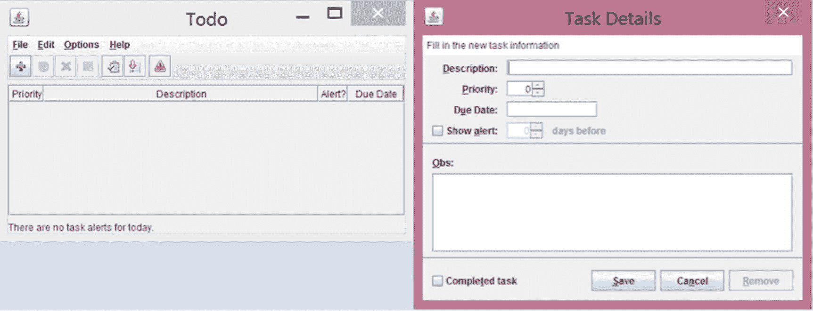

图 7-7

ToDo 应用程序 GUI

以下是该应用程序需求的简短列表：

*   任务应有优先级，以便用户可以首先关注优先级更高的任务。

*   任务应有截止日期，以便用户可以转而关注更接近截止日期的任务。

*   对于已过期或接近截止日期的任务，应有视觉提示。

*   任务可以标记为已完成，但这并不意味着它们必须被删除或隐藏。

Todo 应用程序有两个主窗口：一个*任务列表*和一个*任务编辑表单*。两者的粗略草图如图 7-8 所示。

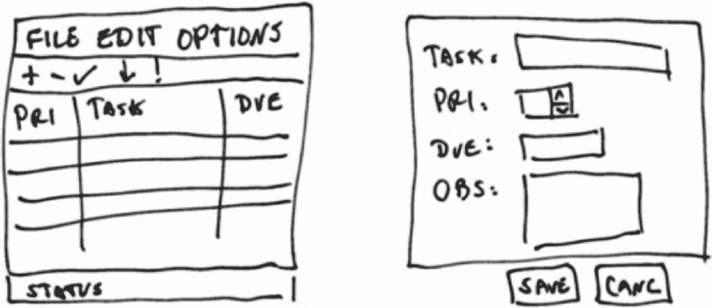

图 7-8

ToDo 应用程序草图

Todo 应用程序将分三步开发：

*   步骤 1. 使用可视化 GUI 构建器构建用户界面的“静态”视觉原型。

*   步骤 2. 构建应用程序的“动态”原型，编写用户界面事件和相关的业务逻辑代码，并根据需要创建自定义 UI 组件。

*   步骤 3. 编写持久化逻辑代码。

它由三个包组成：`todo.model`、`todo.view`、`todo.controller`（见图 7-9）。

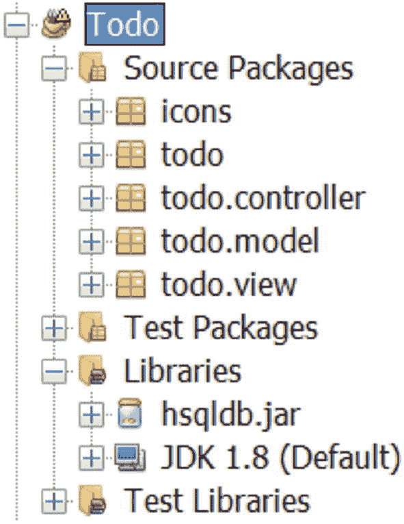

图 7-9

ToDo 应用程序的包结构

如图 7-10 所示，Swing ToDo 应用程序遵循*模型-视图-控制器*架构。

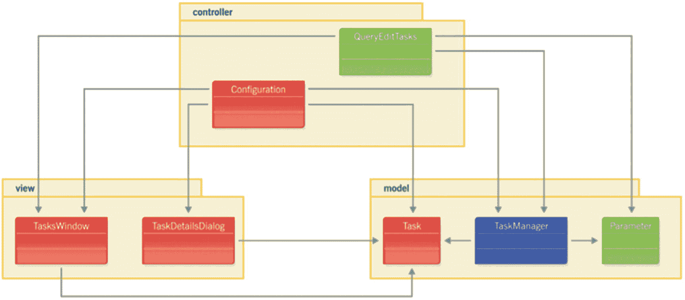

图 7-10

ToDo 应用程序架构

我们将使用 NetBeans 平台模块系统创建一个类似的架构，使用模块代替包（见图 7-11）。

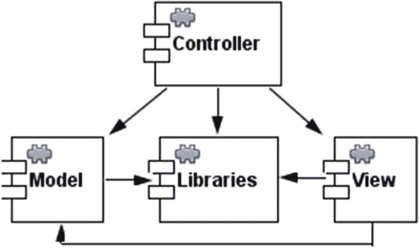

图 7-11

TodoRCP 应用程序架构

让我们开始吧。点击**新建项目**工具栏按钮，然后在 *NetBeans 模块*类别中选择 *NetBeans 平台应用程序*（见图 7-12）。使用 *“TodoRCP”* 作为项目名称，并选择合适的位置。然后点击**完成**。

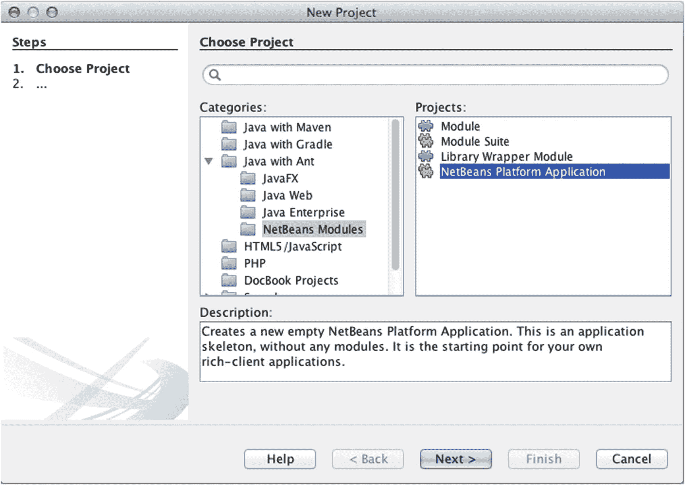

图 7-12

创建一个新的 NetBeans 平台应用程序项目

NetBeans 创建了 NetBeans 平台应用程序项目，其中包含一个空的 *Modules* 文件夹和一个 *Important Files* 文件夹。这是本书后续部分将要创建的模块的容器。我们将为我们的 *TodoRCP* 应用程序创建相同的*模型-视图-控制器*结构。

右键单击 *Modules* 文件夹图标，然后选择**添加新模块**。输入 *“View”* 作为模块名称，然后点击**下一步**。输入 `todo.view` 作为*代码库名称*，然后点击**完成**。您应该会看到如图 7-13 所示的结构。

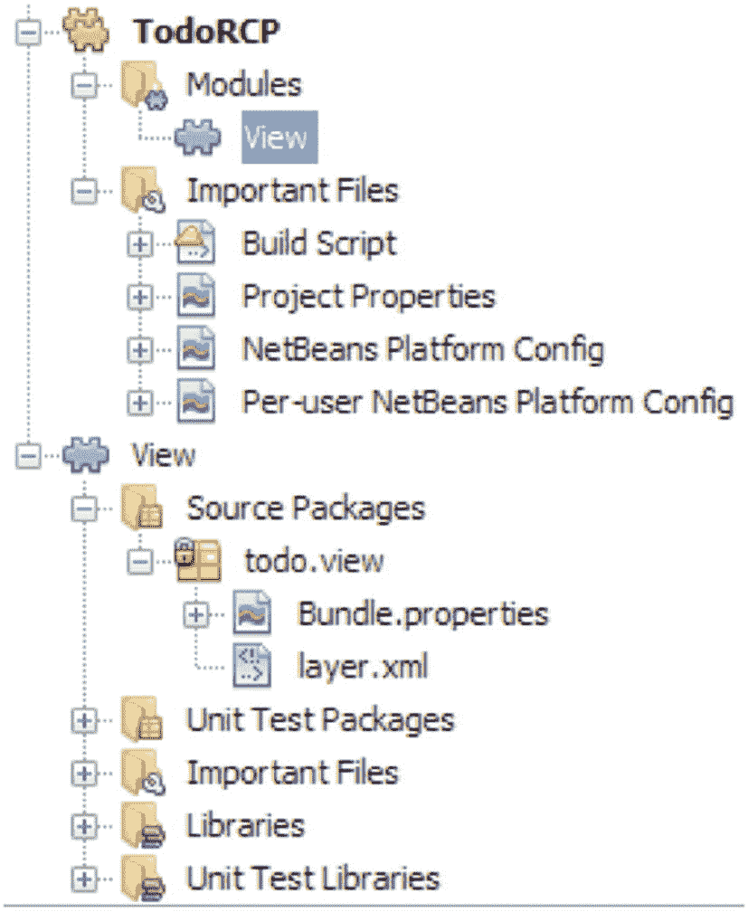

图 7-13

TodoRCP NetBeans 平台应用程序项目的结构

以相同的方式创建另外两个模块，*“Model”* `(todo.model)` 和 *“Controller”* `(todo.controller)`。最后，创建一个名为 *“Libraries”* 的新模块，它将封装应用程序所需的任何外部库。


将所有应用程序的外部库集中到一个模块中的好处是，我们只需向模块套件添加一个新模块，并从需要它的模块中添加对该模块的单一引用。其缺点是，如果一个模块只需要一个 jar，它就必须引用封装在 *Libraries* 模块中的所有其他 jar。

我们将在这个模块中封装两个 Java 库（即 `jar` 文件）：我们在本章前面下载的 `hsqldb.jar`，以及不再包含在 `ide/modules/ext/` 文件夹中的 *SwingX* 库。请从以下链接下载它：[`https://mvnrepository.com/artifact/org.swinglabs.swingx/swingx-all`](https://mvnrepository.com/artifact/org.swinglabs.swingx/swingx-all)。

让我们创建模块，并添加 *TodoRCP* 应用程序所需的那些外部库：

1.  右键单击 *TodoRCP* 模块套件的 *Modules* 文件夹图标，然后选择 **Add New**。输入 `Libraries` 作为模块名称，然后单击 **Next**。输入 `lib` 作为 *Code Base Name*，然后点击 **Finish**。

2.  右键单击新创建的模块，选择 **Properties ➤ Libraries ➤ Wrapped JARs**。单击 **Add JAR**，然后添加 `swingx-all-x.x.x.jar`。重复此过程以添加 `hsqldb.jar`*。*

3.  在打开的 **Project Properties ➤ Libraries** 对话框的左侧面板中，选择 *API Versioning* 类别，并通过勾选以下包使其变为 `public`：
    *   `org.hsqldb`

*   `org.jdesktop.swingx`

4.  单击 **OK** 后，清理并构建 *Libraries* 模块。

*TodoRCP* 模块套件现在应包含四个模块（参见图 7-14）。

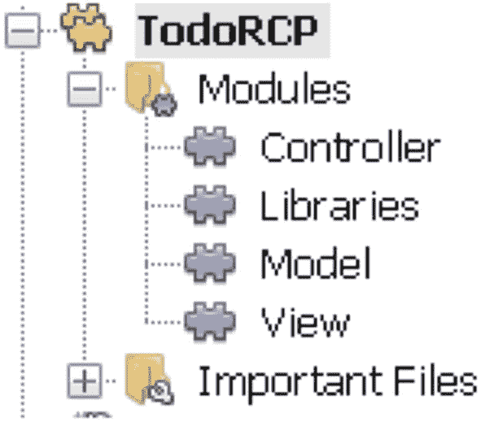

图 7-14

包含所有模块的 TodoRCP 套件

有一个插件可以可视化模块之间的依赖关系。从 [`https://sourceforge.net/projects/netbeansmoddep/`](https://sourceforge.net/projects/netbeansmoddep/) 下载 *DisplayDependencies* 插件。单击 **Tools ➤ Plugins** 菜单，然后点击 **Downloaded** 选项卡。单击 **Add Plugins…** 按钮，导航到您保存下载的 *1475781757_eu-dagnano-showdependencies.nbm* 文件的位置。单击 **Install** 按钮，然后按照向导安装该插件。工具栏上会显示一个带有工具提示 *Show Dependencies* 的新按钮。单击一个模块或模块套件，然后点击 **Show Dependencies** 按钮，即可查看类似图 7-11 的图表（目前还没有显示所有依赖关系）。

将 *ToDo* Swing 应用程序中的 `Task.java` 复制到 *Model* 模块的 `todo.model` 包中。为了简化开发，我们将使用一个模拟的 *TaskManager*，它将任务存储在内存中，而不是数据库中。

*TaskManager* 类是一个 *DAO（数据访问对象）*。作为应用程序中唯一的 DAO，它包含了许多本应放在抽象超类中的方法。它的实现非常简单，因此有很大的改进空间。我们可以根据原始文章中持久化的 *TaskManager*，在 *Model* 模块中提取出以下接口。将 *ToDo* 应用程序中的 *TaskManager* 复制到 *Model* 模块的 `todo.model` 包中。在编辑器中选中类名，然后单击菜单 **Refactor ➤ Extract Interface**。仅选择图 7-15 中显示的方法。

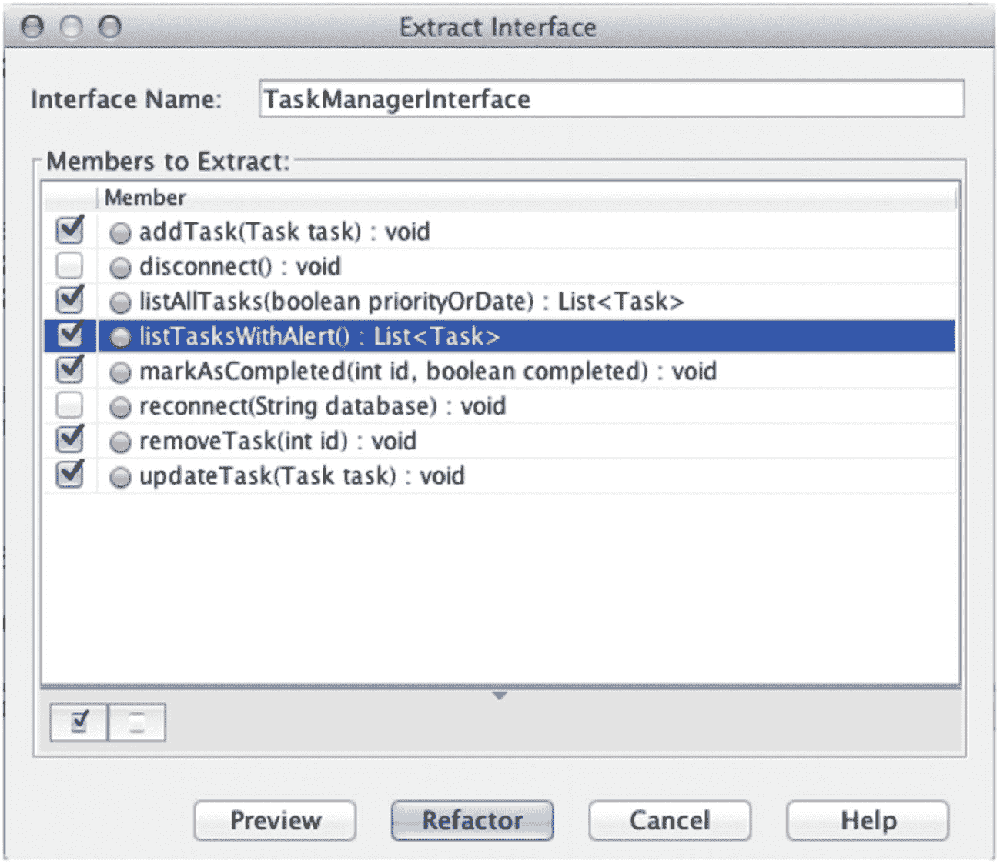

图 7-15

提取接口

您可以稍作调整，使其看起来像清单 7-11 中的代码。

```
package todo.model;
import java.util.List;
public interface TaskManagerInterface {
void addTask(Task task) throws ValidationException;
void updateTask(final Task task) throws ValidationException;
void removeTask(final int id);
List listAllTasks(boolean priorityOrDate);
List listTasksWithAlert() throws ModelException;
void markAsCompleted(final int id, final boolean completed);
}
清单 7-11
TaskManagerInterface
```

同时复制 *ToDo* 应用程序中的 `ValidationException` 和 `ModelException` 类以解决错误。现在单击 `TaskManagerInterface` 名称左侧的灯泡图标，然后选择 **Implement Interface**。将其命名为 *TaskManager*，然后单击 **OK**。NetBeans 会生成一个骨架实现。通过重构将其移动到一个新的包 `todo.model.impl` 中。将 *TaskManager* 实现为 *TaskManagerInterface* 服务的服务提供者是一个很好的策略（清单 7-12）。

```
package todo.model.impl;
import java.util.*;
import todo.model.ModelException;
import todo.model.Task;
import todo.model.TaskManagerInterface;
import todo.model.ValidationException;
import org.openide.util.lookup.ServiceProvider;
@ServiceProvider(service = TaskManagerInterface.class)
public class TaskManager implements TaskManagerInterface {
private final List tasks = new ArrayList();
public TaskManager() { // 模拟数据
final GregorianCalendar cal = new GregorianCalendar(TimeZone.getTimeZone("Europe/Athens"));
cal.set(2019, Calendar.JULY, 2, 10, 00, 00);
tasks.add(new Task(1, "酒店预订", 1, cal.getTime(), true));
cal.set(2019, Calendar.JULY, 15, 16, 30, 00);
tasks.add(new Task(2, "JCrete 2019", 1, cal.getTime(), true));
cal.set(2019, Calendar.JULY, 5, 12, 45, 00);
tasks.add(new Task(3, "预留参观时间", 2, cal.getTime(), false));
}
@Override
public List listAllTasks(final boolean priorityOrDate) {
Collections.sort(tasks, priorityOrDate ? new PriorityComparator() : new DueDateComparator());
return Collections.unmodifiableList(tasks);
}
@Override
public List listTasksWithAlert() throws ModelException {
final List tasksWithAlert = new ArrayList (tasks.size());
for (Task task : tasks) {
if (task.hasAlert()) {
tasksWithAlert.add(task);
}
}
return Collections.unmodifiableList(tasksWithAlert);
}
@Override
public void addTask(final Task task) throws ValidationException {
validate(task);
tasks.add(task);
}
@Override
public void updateTask(final Task task) throws ValidationException {
validate(task);
Task oldTask = findTask(task.getId());
tasks.set(tasks.indexOf(oldTask), task);
}
@Override
public void markAsCompleted(final int id, final boolean completed) {
Task task = findTask(id);
task.setCompleted(completed);
}
@Override
public void removeTask(final int id) {
tasks.remove(findTask(id));
}
private boolean isEmpty(final String str) {
return str == null || str.trim().length() == 0;
}
private void validate(final Task task) throws ValidationException {
if (isEmpty(task.getDescription())) {
throw new ValidationException("必须提供任务描述");
}
}
private Task findTask(final int id) {
for (Task task : tasks) {
if (id == task.getId()) {
return task;
}
}
return null;
}
private static class PriorityComparator implements Comparator {
@Override
public int compare(final Task t1, final Task t2) {
if (t1.getPriority() == t2.getPriority()) {
return 0;
} else if (t1.getPriority() > t2.getPriority()) {
return 1;
} else {
return -1;
}
}
}
private static class DueDateComparator implements Comparator {
@Override
public int compare(final Task t1, final Task t2) {
return t1.getDueDate().compareTo(t2.getDueDate());
}
}
}
清单 7-12
作为服务提供者的 TaskManager
```


请毫不犹豫地创建新的 *Task* 构造器。要解决 *ServiceProvider* 的错误，请点击灯泡并选择 **Search Module Dependency for ServiceProvider**。此时将显示图 7-16 所示的对话框，提示您选择（没错，就是）*Lookup API*。

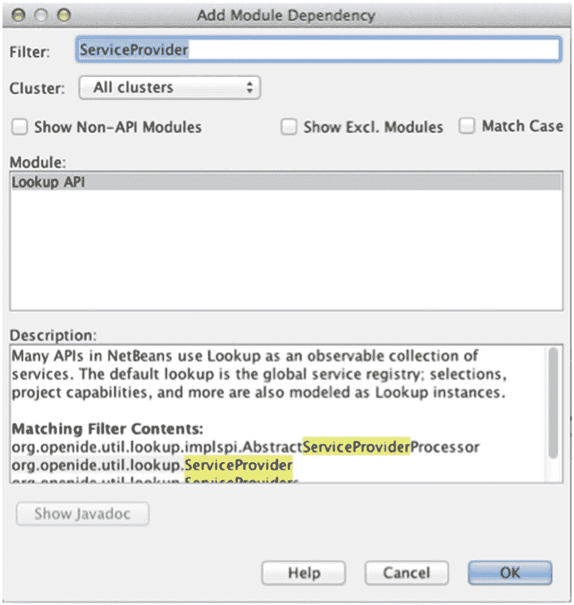

图 7-16

添加模块依赖关系对话框

您刚刚从 *Model* 模块向 *Lookup API* 模块添加了一个新的依赖关系。

清理并构建您的模块以解决所有错误。

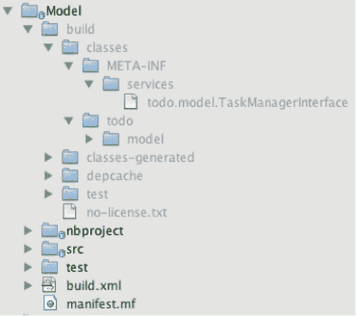

图 7-17

META-INF/services 文件夹

在 *Files* 选项卡中，展开 *Model* 模块，如图 7-17 所示，以验证是否已创建一个新文件 `META-INF/services/todo.model.TaskManagerInterface`，该文件包含了服务的各种实现，在我们的例子中是 `todo.model.impl.TaskManager`。

*TaskManagerDB* 将是 *TaskManagerInterface* 的另一个服务提供者。在下一章中，我们将了解如何使用这些服务。请注意，*TaskManager* 或 *TaskManagerDB* 可能存在于应用程序的其他模块以及非公共包中。

作为练习，您可能希望重构这两个类以使用 Java 8 语法和库，例如，新的 `java.time.*` 类和/或 lambdas/streams。

最后，我们需要将 `todo.model` 包暴露给其他模块，这样当其他模块向 *Model* 模块添加依赖关系时，它们就能访问这个公共包中的类。右键单击 *Model* 模块，选择 **Properties | API Versioning**，然后从 *Public Packages* 部分勾选 `todo.model` 包以使其成为公共包（见图 7-18）。清理并构建 *Model* 模块。

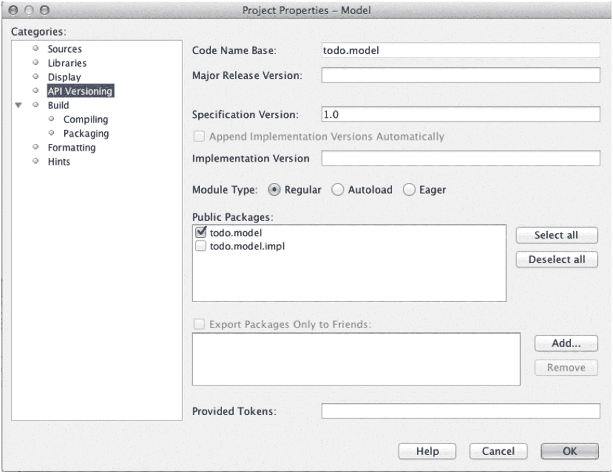

图 7-18

使包对其他模块公开

在下一章中，我们将了解如何在模块之间添加依赖关系。

要概览 NetBeans 平台模块，请右键单击 *TodoRCP* 模块套件，选择 **Properties**，然后点击 **Libraries** 类别。展开 *platform* 节点以查看包含或未包含在应用程序中的所有平台模块列表。

在结束本章之前，我们将简要了解一下前面描述的 *System FileSystem* 或 `layer.xml`。

要生成 `layer.xml` 文件，请选择 *View* 模块，右键单击并从上下文菜单中选择 **New ➤ Other**，然后选择 **Module Development** 类别和 **XML Layer** 文件类型。按照向导操作，您将看到在模块的 *Source Package* 中创建了一个新的 `layer.xml` 文件。在 *Projects* 窗口中，展开它，^(¹) 您将看到 `<this layer>` 和 `<this layer in context>`（见图 7-19）。条目 `<this layer>` 指的是此模块中的配置信息，而条目 `<this layer in context>` 指的是整个应用程序（换句话说，它合并了应用程序所有模块的所有 `layer.xml` 文件内容，即 *System FileSystem*）。您会注意到我们模块的 `layer.xml` 是空的，只包含 `<filesystem/>`。`layer.xml` 文件包含四个主要标签：`<filesystem>`、`<folder>`、`<file>` 和 `<attr>`。

可以使用本章前面描述的 *FileSystem API* 来访问/创建 `layer.xml` 中的对象。

我们将在下一章学习如何通过编辑此文件来自定义我们的应用程序。^(²)

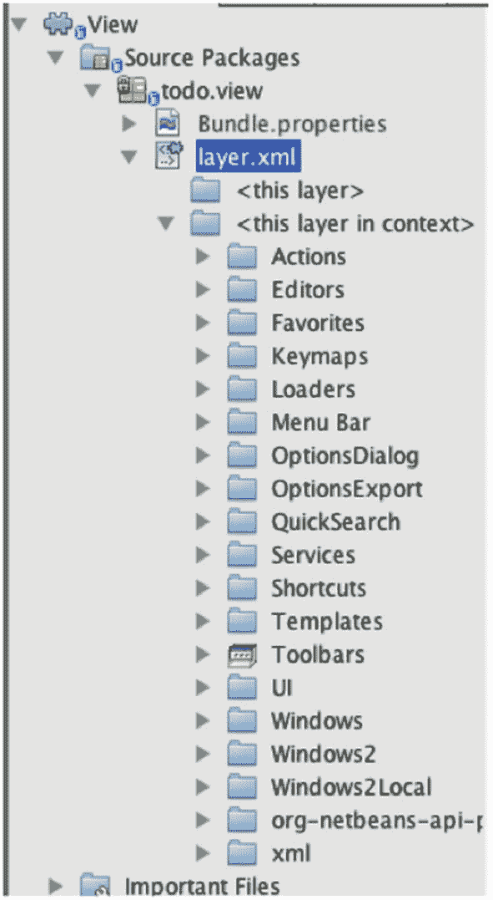

图 7-19

layer.xml 文件

### 总结

在本章中，我们学习了 NetBeans 平台的核心：*Module System API*、*Lookup API* 和 *FileSystem API*。模块系统 API 允许您创建松散耦合的设计代码，明确暴露接口以及模块之间的依赖关系。模块之间的松散耦合通信是通过 Lookup API 实现的。最后，FileSystem API 提供了另一种查看文件系统的方式，为您提供了额外的功能。我们探讨了 `FileSystem`、`FileObject`、`FileUtil`、`FileChangeListener` 和 `DataObject` 类。最后，我们通过将 Swing 应用程序移植到 NetBeans RCP 来开始应用所学知识。

脚注 1   2

