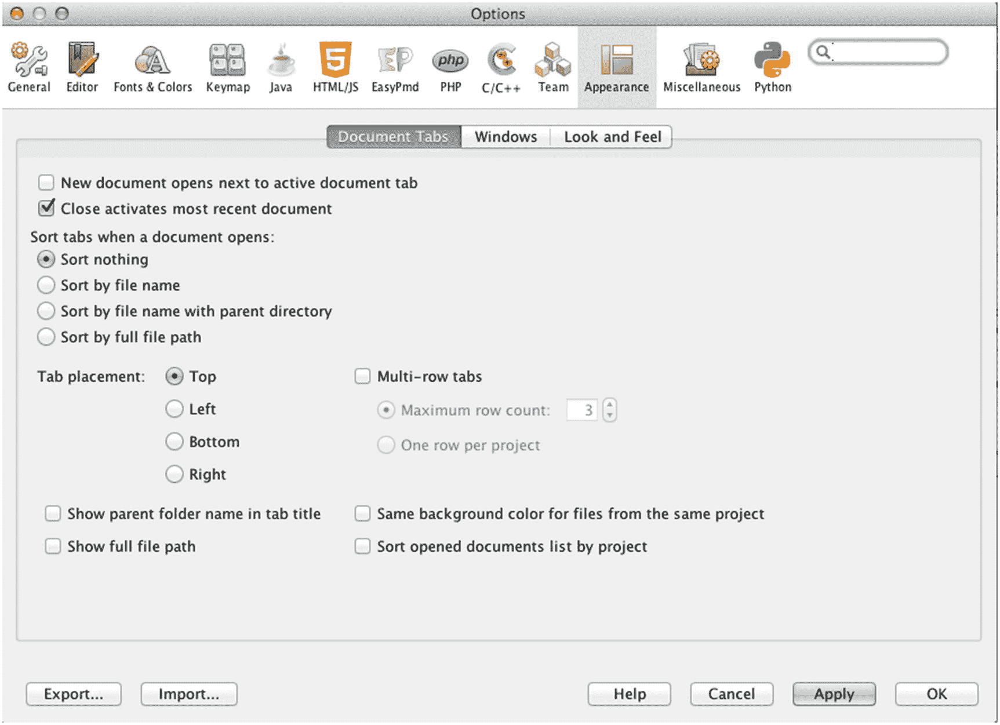
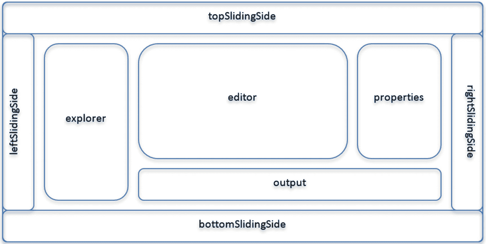
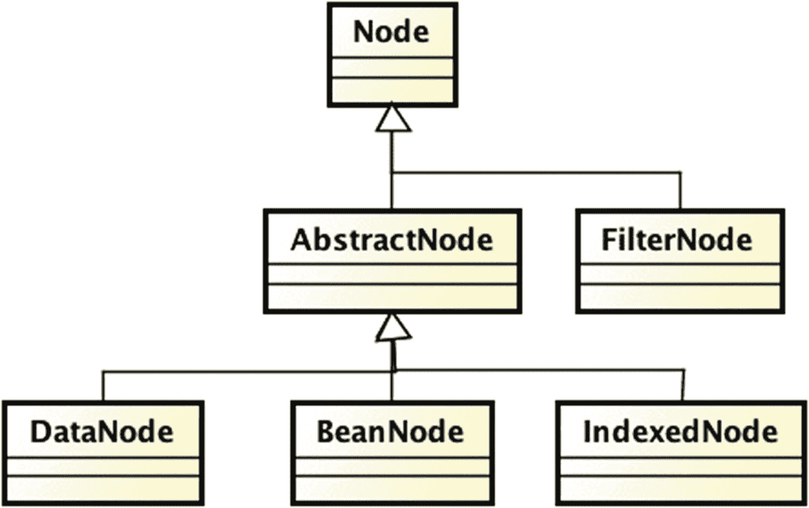
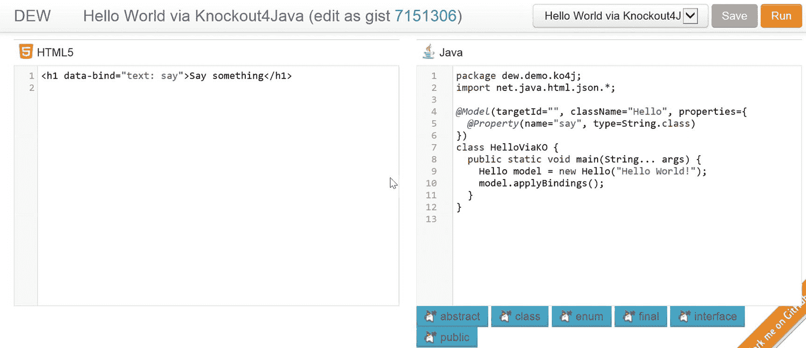
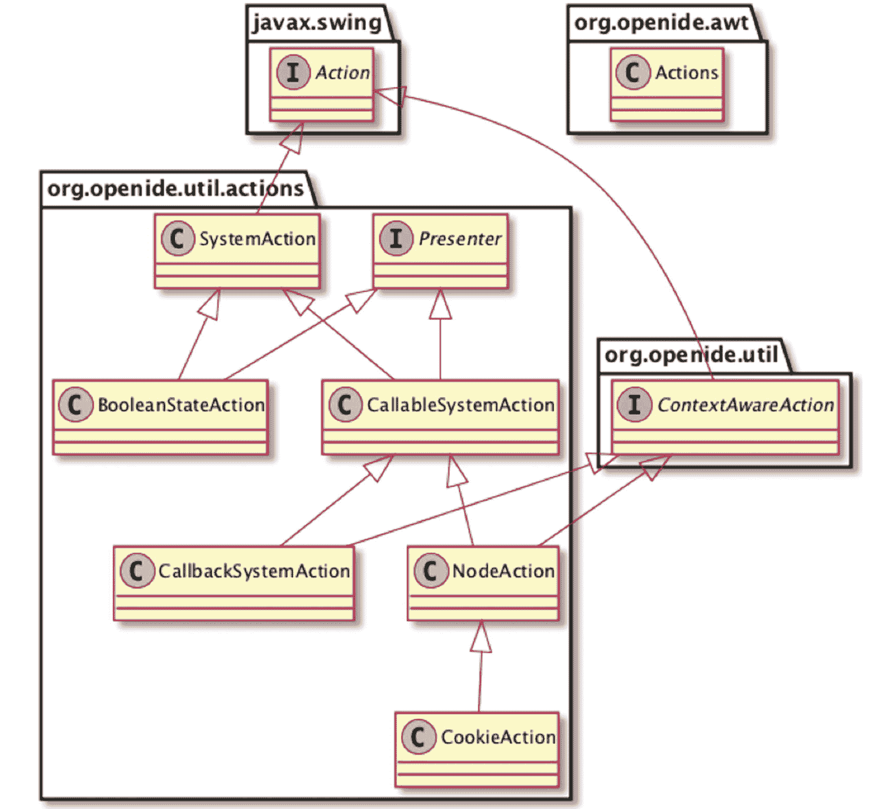

# 8. 掌握用户界面

在本章中，我们将介绍 NetBeans 富客户端平台的 *GUI* 组件：

*   **窗口系统**：对于您的应用程序而言，其作用相当于操作系统中的窗口管理器。窗口系统允许您组织应用程序工作区的窗口（通过拖拽、取消停靠、选择、最小化甚至分组窗口）。它还具有持久化机制，用于保存窗口的状态，以便在应用程序重启时窗口能够保持相同的位置和大小。它还允许您为不同的窗口配置分配角色。

*   **动作系统**：构建在 Swing `ActionListener` 接口和 `Action` 类之上，允许您专注于业务逻辑，而无需担心动作的呈现和启用。上下文相关的动作和功能允许您创建松散耦合的模块化应用程序。

*   **节点系统**：节点是一种数据包装器，允许数据在多种资源管理器视图和属性表中可视化。

*   **资源管理器视图和属性表**：是实际的 UI 组件，构建在 Swing UI 组件之上——即渲染节点。您可以从多种 UI 组件中选择来显示树、表格、列表、图像等。我们还将介绍一些替代方案，例如如何将 JavaFX 集成到窗口系统中，以及使用新的 HTML/JAVA UI 来代替资源管理器视图和属性表。

## 窗口系统

在第 2 章中，我们看到 NetBeans IDE 支持许多窗口来塑造布局。IDE 的窗口系统使您能够通过将任何窗口拖放到适当位置来按您喜欢的方式排列它（见图 2-1）。您还可以最小化、最大化、浮动或停靠窗口。

NetBeans IDE 是 NetBeans 窗口系统 API 所能提供功能的绝佳示例：可插入的多个窗口，可以在容器中逻辑排列，窗口状态（打开/关闭、选中/未选中、激活/停用）等。

无论是 Swing 还是 JavaFX 都没有提供具有窗口管理功能的框架。当然，开发人员可以自己构建窗口管理系统，但创建这样一个系统需要付出巨大的努力。NetBeans 平台窗口系统以注解的形式提供了此功能。


### 优势与特性

NetBeans RCP 窗口系统 API 的优势之一在于，应用程序代码完全独立于其组件在屏幕上的渲染方式。

一个*窗口系统*：

*   包含一个*窗口管理器*，用于响应用户操作，例如拖拽、分离、选择、分组、调整大小或最小化窗口，以管理工作空间；
*   包含一个*持久化机制*，能够“记住”布局，使用户无需在每次重启时重新配置应用程序；
*   提供了一种指定应用程序窗口布局的方法，以及一种对具有共同行为的窗口进行分组的方法；
*   提供了*角色*（或视角），你可以基于这些角色配置应用程序的布局（例如，“管理员”角色、“用户”角色等）。

NetBeans 平台窗口系统包含一个窗口管理器，用于跟踪应用程序的窗口、模式、窗口组和角色，使开发者能够专注于构建业务逻辑，而不是重复造轮子。你可以通过点击 **工具 ➤ 选项**（或在 MacOS 上点击 **NetBeans ➤ 偏好设置**）➤ **外观** 来配置它（见图 8-1）。



图 8-1

配置外观

在创建 Swing 应用程序的主窗口时，你需要创建一个 `JFrame`。要利用 NetBeans 平台窗口系统，则需要创建一个 `TopComponent`。`TopComponent` 本身扩展了 `JComponent`（一个基于 Swing 的容器）。使用 `TopComponent`，所有应用程序窗口都会自动集成到窗口系统中，也就是说，它们由 NetBeans 平台窗口管理器管理，并支持丰富的窗口操作。*文档* 是处于编辑器模式下的 `TopComponent`。

如清单 8-1 所示，这些注解允许将 `TopComponent` 注册到窗口系统中。`TopComponent` 的外观和配置也通过这些注解完成。

```
@ConvertAsProperties(
dtd = "-//todo.view//Tasks//EN",
autostore = false
)
@TopComponent.Description(
preferredID = "TasksTopComponent",
//iconBase="SET/PATH/TO/ICON/HERE",
persistenceType = TopComponent.PERSISTENCE_ALWAYS
)
@TopComponent.Registration(mode = "editor", openAtStartup = true)
@ActionID(category = "Window", id = "todo.view.TasksTopComponent")
@ActionReference(path = "Menu/Window" /* , position = 333 */)
@TopComponent.OpenActionRegistration(
displayName = "#CTL_TasksAction",
preferredID = "TasksTopComponent"
)
@Messages({
"CTL_TasksAction=Tasks",
"CTL_TasksTopComponent=Tasks Window",
"HINT_TasksTopComponent=This is a Tasks window"
})
public final class TasksTopComponent extends TopComponent {
//...
清单 8-1
用于将 TopComponent 注册到系统文件系统的注解
```

`@TopComponent.Description` 包含三个属性：

*   `iconBase`（定义一个可选路径，指向一个 16x16 像素的图像，该图像将显示在 `TopComponent` 的标签页中）
*   `preferredID`（`TopComponent` 的唯一名称或标识）
*   `persistenceType`（可以是 `PERSISTENCE_ALWAYS`、`PERSISTENCE_NEVER` 或 `PERSISTENCE_ONLY_OPENED`）；用于指定应用程序关闭时是否存储 `TopComponent` 的状态。这是通过重写 `writeProperties()` 和 `readProperties()` 方法来实现的。

`@TopComponent.Registration` 定义了*模式*，即 `TopComponent` 在窗口布局中显示的位置（见图 8-2）。可选元素 `position` 指定了窗口在某个模式内的相对位置。也就是说，如果多个 `TopComponent` 在同一模式下打开，位置值较小的窗口将位于左侧。

`@ActionID` 定义了一个动作，当 `TopComponent` 关闭时，该动作将打开它。`@ActionReference` 定义了*系统文件系统*（`layer.xml`）中的路径，菜单将在该路径下定义（在此例中，它将作为 **窗口** 菜单下的一个动作）。`position` 属性定义了它在菜单中的位置（数字越小，在菜单中位置越高）。你还可以使用可选元素 `separatorBefore` 和 `separatorAfter` 指定菜单项分隔符。最后，`@TopComponent.OpenActionRegistration` 正是执行此操作：创建用于打开窗口的*打开动作*。



图 8-2

窗口模式

以下方法控制 `TopComponent` 的生命周期：`open(), close(), requestVisible(), requestActive()`，而以下方法是在 `TopComponent` 状态发生变化时的通知方法：`componentOpened(), componentClosed(), componentShowing(), componentActivated(), componentDeactivated(), componentHidden()`。

### 查找

`TopComponent` 实现了 `Lookup.Provider` 接口，因此它拥有自己的 `Lookup`。通常，它会代理当前选中的任何节点的 Lookup。`TopComponent` 的 `Lookup` 在其构造函数中通过 `associateLookup()` 方法定义，例如（见清单 8-2）。

```
public final class TasksTopComponent extends TopComponent {
private InstanceContent ic = new InstanceContent();
public TasksTopComponent() {
//...
associateLookup(new AbstractLookup(ic));
}
清单 8-2
为 TopComponent 创建一个 Lookup
```

在清单 8-2 中，我们使用了动态查找，正如前一章所解释的那样，但根据你的需要，你也可以使用静态查找（例如，单例查找）。每当 `TasksTopComponent` 获得焦点时，你添加到 `InstanceContent` 中的任何内容都会被代理到*全局查找*，也称为 `Utilities.actionsGlobalContext()`。


## 节点

你可能已经熟悉 MVC（模型-视图-控制器）设计模式，其中视图不直接与模型通信，而是仅通过控制器进行。这样做的好处是，你可以让不同的视图显示相同的数据，而无需将视图与模型强耦合。

Swing 曾试图通过为每个表示类提供模型类来实现此模式。例如，`JList` 由 `ListModel` 支持，`JTree` 由 `TreeModel` 支持，`JTable` 由 `TableModel` 支持，等等。如果你希望用 `JTree` 和 `JTable` 显示相同的数据，则必须创建两个不同的视图模型，即一个 `TreeModel` 和一个 `TableModel` 来呈现相同的数据，以便各自的视图能够正确渲染，这非常不方便。

NetBeans RCP 通过提供 `Node` 类解决了这个问题。`Node` 是特定数据片段（例如，一个 `Task`）的可视化表示。节点是数据和 UI 类之间的表示层。当你在表格中选择一行时，实际上是在选择一个 `Node` 实例。与 Swing 中为每个 GUI 组件子类化不同的模型类不同，你只需子类化 `Node` 类，即可在多个不同的 GUI 组件上无缝地同时显示数据。

`Node` 包含通用的数据表示，例如显示名称、图标、节点上的操作、子节点（用于树状结构），甚至属性（用于在属性表中显示）。节点还实现了 `Lookup.Provider` 接口；因此，它们可以根据在其查找（历史上称为 *cookies*）中添加的实例来启用/禁用操作。

*节点 API* 提供了几个节点，如图 8-3 所示，每个节点都有不同的用途。



图 8-3

节点类层次结构

`Node` 是一个抽象类，而 `AbstractNode` 不是！`BeanNode` 使用反射来检索 JavaBean 的属性，并将其作为节点属性公开，以便在属性表中显示。如果其 `BeanInfo` 中提供了名称和图标，它也会检索这些信息。如果你希望显示文件，请使用 `DataNode`。`IndexedNode` 允许对其子节点重新排序。最后，`FilterNode` 是另一个节点的装饰器，顾名思义，它可以通过应用过滤器来过滤特定节点。

清单 8-3 展示了一个 `BeanNode` 的示例实现。

```
package todo.view;
import java.beans.IntrospectionException;
import org.openide.nodes.BeanNode;
import todo.model.Task;
class TaskNode extends BeanNode {
public TaskNode(Task bean) throws IntrospectionException {
super(bean);
}
}
清单 8-3
一个 BeanNode 实现
```

清单 8-3 创建了一个通常充当根节点角色的单一节点。节点通常包含子节点，层级深度可以是无限的。如果你需要在树中显示它们，那么你可以创建任意数量的子节点；但在表格中，只需要一个扁平的子节点（或叶节点）列表。

子节点由 `org.openide.nodes.Children` 对象表示，该对象按需创建子节点。`Children` 节点由 `ChildFactory` 创建，如清单 8-4 的示例所示。

```
package todo.view;
import java.beans.IntrospectionException;
import java.util.List;
import org.openide.nodes.ChildFactory;
import org.openide.nodes.Node;
import org.openide.util.Exceptions;
import org.openide.util.Lookup;
import todo.model.Task;
import todo.model.TaskManagerInterface;
class TaskChildFactory extends ChildFactory {
@Override
protected boolean createKeys(final List toPopulate) {
final TaskManagerInterface taskManager =
Lookup.getDefault().lookup(TaskManagerInterface.class);
toPopulate.addAll(taskManager.listAllTasks(true));
return true;
}
@Override
protected Node createNodeForKey(final Task key) {
TaskNode taskNode = null;
try {
taskNode = new TaskNode(key);
} catch (IntrospectionException ex) {
Exceptions.printStackTrace(ex);
}
return taskNode;
}
}
清单 8-4
一个 ChildFactory 实现
```

当 `TaskChildFactory` 被初始化时，`createKeys()` 方法会被自动调用。一旦 `createKeys()` 返回 `true`，`createNodeForKey()` 方法就会被自动调用。正如 API 所述，如果键列表已完全填充，则返回 `true`；如果列表仅部分填充，则返回 `false`；并且应再次调用此方法以批量添加更多键（这在大多数情况下是不必要的，因此始终返回 `true`）。

上述工厂的一个典型用法是：

```
Children tasks = Children.create(new TaskChildFactory(), true);
```

这里的 `true` 表示 `ChildFactory` 将在后台线程中创建键列表，例如，当用户尝试展开一个 `Node` 时就会发生这种情况。

### 查找

如前所述，`Node` 实现了 `Lookup.Provider` 接口。如何向 `Node` 的查找中添加内容呢？清单 8-5 展示了如何将一个 `Task` 对象添加到 `TaskNode` 的查找中。

```
class TaskNode extends BeanNode {
public TaskNode(Task bean) throws IntrospectionException {
super(bean, Children.LEAF, Lookups.singleton(bean));
}
}
清单 8-5
向 TaskNode 的查找中添加一个 Task
```

单例查找仅包含一个对象，在本例中是与该节点关联的任务。现在，正如我们将看到的，当你选择一个或多个节点时，那些监听全局查找中 `Task` 的条件启用操作将相应地被启用。具体如何实现将在下一节中解释。

### 操作

用户可以右键单击节点以显示弹出菜单，其中包含多个菜单项或可对节点执行的操作。你可以通过重写 `Node` 类的相应方法来覆盖这些操作，如清单 8-6 所示。

```
@Override
public Action[] getActions(boolean context) {
List taskActions = Utilities.actionsForPath("Actions/Task");
return taskActions.toArray(new Action[taskActions.size()]);
}
@Override
public Action getPreferredAction() {
return Actions.forID("Task","todo.controller.EditTaskAction");
}
清单 8-6
节点上的操作
```

类似地，`getPreferredAction()` 提供了一个单一的 `Action`，当用户双击 `Node` 时调用该操作。最佳实践是在*系统文件系统*中定义你的操作，以便其他类或模块可以重用它们。


## 资源管理器视图

我们之前已经看到，*节点 API* 提供了一种向 UI 表示数据的通用方式。但 NetBeans 平台提供了哪些 UI 呢？

*资源管理器与属性表 API* 包含一组 GUI 组件，称为资源管理器视图或资源管理器，用于渲染节点。你可以将节点显示在多个资源管理器视图中，也可以轻松地在它们之间切换，而无需对节点进行任何更改：这是真正的 MVC 模式。相比之下，在 Swing 中，要将使用 `JTree` 的代码改为使用 `JTable`（或反之），需要进行大量的重写工作。

表 8-1 展示了资源管理器视图与 Swing UI 类的对应关系。

表 8-1

资源管理器视图与 Swing 类

| 资源管理器视图 | Swing 类 |
| --- | --- |
| `BeanTreeView` | `JTree` |
| `OutlineView` | `JTable/JTree` |
| `ListView` | `JList` |
| `PropertySheetView` | `JList` |
| `IconView` | `-` |
| `ChoiceView` | `JComboBox` |

清单 8-7 提供了一个 `OutlineView` 的示例，该视图可以添加到 `TopComponent` 的构造函数中。

```
OutlineView ov = (OutlineView)outlineView;
//设置大纲视图的列，
//使用属性名称
//后跟列标题中显示的文本
ov.setPropertyColumns(
"priority", "优先级",
"description", "任务",
"alert", "警报",
"dueDate", "截止日期");
add(ov);
清单 8-7
一个 OutlineView 实现
```

`priority`、`description`、`alert` 和 `dueDate` 是 `Task` JavaBean 的属性。`OutlineView` 是一种特殊的树/表视图，它显示树节点，并将表行显示为属性。在下一章中，我们将了解如何使用和自定义 `OutlineView` 来显示任务表。

所有资源管理器视图都由一个 `ExplorerManager` 管理，该管理器控制并维护视图中节点的选择状态。当资源管理器视图被添加到 `java.awt.Container`（例如 `TopComponent`）中时，它们会自动找到其 `ExplorerManager`。当添加到容器中时，资源管理器视图会搜索其父容器，直到找到第一个实现了 `ExplorerManager.Provider` 的容器。然后，资源管理器视图开始使用由该组件的 `getExplorerManager()` 方法返回的 `ExplorerManager`。`ExplorerManager` 维护着关于 `Node` 共享状态的信息，并在选中的 `Node` 发生变化时通知任何 `PropertyChangeListener`。

在清单 8-8 中，我们修改了 `TasksTopComponent`，使其实现 `ExplorerManager.Provider` 接口。`OutlineView` 将找到在 `TasksTopComponent` 构造函数中定义的 `ExplorerManager`，调用 `getExplorerManager()`，然后显示来自 `ExplorerManager` 的根 `Node`。

```
public final class TasksTopComponent extends TopComponent
implements ExplorerManager.Provider {
private final ExplorerManager em = new ExplorerManager();
public TasksTopComponent() {
...
em.setRootContext(new AbstractNode(Children.create(new TaskChildFactory(), true))); // 异步方式
}
...
@Override
public ExplorerManager getExplorerManager() {
return em;
}
清单 8-8
在 TopComponent 中实现 ExplorerManager
```

你可以轻松地在同一个 `TopComponent` 中添加其他资源管理器视图，它们都共享同一个 `ExplorerManager`，因此也共享相同的节点。不仅所有资源管理器视图中都会显示相同的数据，而且当在其中某个视图中选中一个项目时，它也会自动在其他视图中被选中。

因此，如果你想将这些全部映射到我们在本章开头提到的 MVC 设计模式，你需要记住以下几点：

*   **节点**代表*模型*；它们是实际模型数据的包装器。
*   **资源管理器视图**代表*视图*。
*   **`ExplorerManager`** 代表*控制器*。

### 查找

在清单 8-8 中，我们看到了如何向 `Node` 的查找中添加内容。`ExplorerManager` 维护视图中选中的节点。我们没有解释的是，如何使选中的 `Node` 对*全局查找*可用，以便其他对象（如 `Action` 和其他 `TopComponent`）可以使用它们。

这是借助 `ExplorerUtils` 类完成的，它允许你通过其 `createLookup()` 方法定义一个特殊的 `Lookup`，代表选中的 `Node`。然后，只需通过 `TopComponent.associateLookup()` 方法将此查找添加到 `TopComponent` 的查找中，该方法必须在 `TopComponent` 的构造函数中调用（参见清单 8-9）。

```
associateLookup (ExplorerUtils.createLookup (em, getActionMap()));
清单 8-9
使选中的节点对全局查找可用
```

得益于清单 8-9 中的语句，`TopComponent` 的 `Lookup` 将自动代理资源管理器视图组件中选中的 `Node` 的 `Lookup`。当 `TopComponent` 被选中时，其 `Lookup` 通过 `Utilities.actionsGlobalContext()` 暴露出来。

当用户在 `OutlineView` 中选择一个 `TaskNode` 时，包含该 `OutlineView` 的 `TasksTopComponent` 将自动代理 `TaskNode` 的 `Lookup`。`TasksTopComponent` 将被激活，因此全局查找 `Utilities.actionsGlobalContext()` 将代理 `TasksTopComponent` 的 `Lookup`。应用程序中任何监听全局查找的组件都会收到通知，告知有一个新的 `Task` 对象可用（例如，某个操作将变为启用状态）。

动作映射是一个可以在 TopComponent 视图中使用的动作映射表。在清单 8-10 中，我们使用*剪切、复制、粘贴*和*删除*动作对其进行了增强。

```
ActionMap map = this.getActionMap();
map.put(DefaultEditorKit.cutAction, ExplorerUtils.actionCut(em));
map.put(DefaultEditorKit.copyAction, ExplorerUtils.actionCopy(em));
map.put(DefaultEditorKit.pasteAction, ExplorerUtils.actionPaste(em));
map.put("delete", ExplorerUtils.actionDelete(em, true)); // true 表示在删除前显示确认对话框
associateLookup (ExplorerUtils.createLookup (em, map));
清单 8-10
向 TopComponent 的 ActionMap 添加动作
```

我们将在本章后面部分进一步讨论动作。

### 属性

*属性*窗口（**窗口 ➤ IDE 工具 ➤ 属性**）监听全局 `Lookup`（`Utilities.actionsGlobalContext()`），以查找 `Node` 的存在，并显示其属性。换句话说，所选节点的属性会显示在*属性*窗口中。

默认情况下，`BeanNode` 的所有属性都会显示在*属性*窗口中。如果需要自定义它们，可以在 JavaBean 的 `BeanInfo.java` 中进行，或者将你的 `Node` 改为扩展 `AbstractNode`，并重写清单 8-11 中所示的方法。

```
@Override
protected Sheet createSheet() {
Sheet sheet = super.createSheet();
Sheet.Set basicSet = Sheet.createPropertiesSet();
basicSet.setName("Basic");
basicSet.setDisplayName("基本");
try {
Property daysBeforeProperty =
new PropertySupport.Reflection(
task, Integer.class, "Days Before");
basicSet.put(daysBeforeProperty);
Property completedProperty =
new PropertySupport.Reflection(
task, Boolean.class, "已完成");
basicSet.put(completedProperty);
} catch (NoSuchMethodException ex) {
Exceptions.printStackTrace(ex);
}
sheet.put(basicSet);
return sheet;
}
清单 8-11
为你的节点创建 PropertySheet
```

`PropertySupport.Reflection` 用于定义一个 `Property` 对象。其他子类包括 `PropertySupport.ReadOnly`、`PropertySupport.ReadWrite` 和 `PropertySupport.WriteOnly`。


### JavaFX 与 NetBeans 平台

资源管理器视图 API 基于 Swing。然而，有一种方法可以使用 JavaFX 组件来代替。JavaFX 是 Swing 的继任者，允许你构建高级图形应用程序。在本章中，我们将了解如何将 JavaFX 与 NetBeans 平台集成。

请记住，JavaFX 已完全集成在 JDK 8–10 中，但从 JDK 11 开始不再集成，你可以从 [`https://gluonhq.com/products/javafx/`](https://gluonhq.com/products/javafx/) 独立下载它。

将 JavaFX 与 NetBeans 平台集成的秘诀是 `JFXPanel`。只需将一个 `JFXPanel` 添加到一个 `TopComponent` 中，你就可以像在独立的 JavaFX 应用程序中一样使用 JavaFX。当创建第一个 `JFXPanel` 对象时，它会隐式地初始化 JavaFX 运行时（即 *JavaFX 应用程序线程*）。当最后一个 `JFXPanel` 被销毁时，JavaFX 运行时退出。如果你设置了 `Platform.setExplicitExit(false)`，那么即使最后一个 JavaFX 内容窗口关闭，JavaFX 应用程序线程也*不会*退出。此设置对于关闭然后重新打开启用 JavaFX 的窗口是必要的。

你还需要将创建 JavaFX 内容的代码包装在一个可运行对象中，并使用 `Platform.runLater(() -> createScene());` 来调用它。`TopComponent` 代码在 *Swing EDT* 上执行，而创建和操作场景图的 JavaFX 代码必须在 *JavaFX 应用程序线程* 上运行。

`JFXPanel` 是一个专门为实现将 JavaFX 内容嵌入 Swing 应用程序而实现的 Swing JComponent。`JFXPanel` 启动 JavaFX 运行时，并透明地将所有输入（鼠标、键盘）和焦点事件转发给 JavaFX 运行时。`JFXPanel` 允许 Swing 和 JavaFX 同时运行。要从 JavaFX 操作 Swing UI，请将代码包装在 Runnable 中并使用以下代码：

```
SwingUtilities.invokeLater(() -> {
// 更改 Swing UI
});
```

相反，要从 Swing 操作 JavaFX UI，请将代码包装在 Runnable 中并调用：

```
Platform.runLater(() -> {
// 更改 JavaFX UI
});
```

在下一章中，我们将了解如何将 ToDo Swing 应用程序转换为 NetBeans RCP 应用程序，其中视图由 JavaFX 渲染。

### HTML/Java API

到目前为止，在本章中，我们已经学习了如何创建 `TopComponent` 对象、资源管理器视图、属性表等，以构建我们应用程序的 UI。在上一节中，我们看到了如何使用 JavaFX 代替这些来构建我们的 UI。在本节中，我们将了解如何使用 HTML 5 和 JavaScript 来渲染我们的 UI。

HTML/Java UI API 由 NetBeans 架构师 *Jaroslav Tulach* 捐赠给 Apache NetBeans，它允许我们使用 Java 作为后端，HTML 5 和 JavaScript 作为前端，编写真正的跨平台 UI。换句话说，你可以编写真正的 *一次编写，到处运行* 的代码。它基于 *DukeScript* ([`https//www.dukescript.com`](http://www.dukescript.com))，这是一种用于创建跨平台桌面、移动和 Web 应用程序的新技术。它允许你用 Java 编写逻辑，并将结果渲染到多种客户端，这些客户端可以是 Web 浏览器、便携式设备等。从版本 1.5.1 开始，HTML/Java UI 已捐赠给 Apache 基金会 ([`http://apache.org/`](http://apache.org/))，该代码现在与其他 Apache 孵化项目一起托管在孵化器仓库中 ([`http://github.com/apache/incubator-netbeans-html4j`](http://github.com/apache/incubator-netbeans-html4j))。

HTML/Java UI API 声称使用 *模型-视图-视图模型 (MVVM)* 设计模式实现了设计与开发的清晰分离。它通过使用 *Knockout.js* ([`http://knockoutjs.com/`](http://knockoutjs.com/)) 将渲染的 HTML 绑定到模型来实现这一点。它让你在底层数据及其表示之间建立直接连接（自动依赖跟踪）。

Knockout.js (KO) 使用 *模型-视图-视图模型 (MVVM)* ([`https://en.wikipedia.org/wiki/Model%E2%80%93view%E2%80%93viewmodel`](https://en.wikipedia.org/wiki/Model%25E2%2580%2593view%25E2%2580%2593viewmodel)) 设计模式，这是经典 *模型-视图-控制器 (MVC)* ([`https://en.wikipedia.org/wiki/Model%E2%80%93view%E2%80%93controller`](https://en.wikipedia.org/wiki/Model%25E2%2580%2593view%25E2%2580%2593controller)) 设计模式的一种变体。与 MVC 一样，*模型* 是存储的数据，*视图* 是数据的可视化表示（例如，在 HTML5 中）。但是，对于两者之间的连接，MVVM 使用 *视图模型* 而不是 *控制器*。这是视图使用的模型。它表示视图的状态。它是用户正在处理的未保存数据。举个例子，想象一个应用程序打开一个对话框或表单，让用户修改一些数据。如果用户决定按下 **取消**，那么视图模型会自动从视图模型恢复数据。在 MVC 中，我们直接与模型一起工作，因此如果用户决定按下 **取消**，则无法撤消用户所做的修改，除非我们在其他地方保留模型数据的副本。

在 KO 中，*视图模型* 是模型数据的 JavaScript 表示，以及用于操作数据的相关函数。Knockout.js 在 *视图模型* 和 *视图* 之间创建直接连接，这就是它能够检测到底层数据的变化并自动更新用户界面相关方面的原因。

Knockout.js 使用 *可观察对象* 来跟踪视图模型的属性；它们观察这些属性的变化并自动更新视图的相关部分。要将视图中的用户界面组件连接到特定的可观察对象，你必须将一个 HTML 元素绑定到它。将元素绑定到可观察对象后，Knockout.js 就可以自动显示对 *视图模型* 的更改。Knockout.js 包含几个内置绑定，用于确定可观察对象在用户界面中的显示方式。

虽然 Knockout.js 使用 JavaScript 作为后端，但 HTML/Java UI 使用纯 Java。换句话说，HTML/Java UI 是一种允许你直接将 Java 渲染到 HTML 5 的技术。


清单 8-12 展示了 HTML 与 Java 代码之间如何实现绑定。此处，用户在 HTML 文本字段中输入的*值*被绑定到 `Task` 类的 `text` 属性。在 HTML/Java UI 中，ViewModel 通过注解（`@Model, @Property`）来定义，以减少开发者的输入量。

```
Tasks.html

TasksCntrl.java
@Model(className = "Task", targetId = "", properties = {
@Property(name = "text", type = String.class)
})
清单 8-12
HTML 与 Java 实现之间的数据绑定
```

在清单 8-12 中，我们定义了 ViewModel 类 `Task`，它包含一个名为 `text`、类型为 `String` 的属性。该属性被绑定到 HTML 代码的输入字段。

我们实际上可以使用*Web 开发环境*或 *DEW*（[`http://dew.apidesign.org/dew/`](http://dew.apidesign.org/dew/)）来尝试这段代码。*DEW* 是一个完全运行在浏览器中的 Java 编程语言开发环境（使用由 NetBeans 架构师 Jaroslav Tulach 开发的 *Bck2Brwsr* 虚拟机）。DEW 是您的终极 fiddle（[*https://jsfiddle.net/*](https://jsfiddle.net/)）环境，它让您可以轻松地复刻现有代码片段，并通过将自己的代码片段保存为 Github Gists（[`http://wiki.apidesign.org/wiki/Gist`](http://wiki.apidesign.org/wiki/Gist)）来展示您的创造力。

图 8-4 展示了另一个示例。这次，在 ViewModel 类 `Hello` 中定义的属性 `say` 被绑定到 HTML 代码的 `H1` 标题。当您点击**运行**时，您应该会看到 `Hello World!` 消息作为标题 1 显示在 DEW 页面的底部。您可以修改上述消息并再次运行，以在输出中查看结果。您也可以将其保存为 gist（您需要一个有效的 GitHub 账户）。作为练习，请使用清单 8-12 中的代码修改 DEW 中的示例代码。



图 8-4

Web 开发环境 (DEW)

在图 8-4 中，您还会注意到模型被定义为控制器类 `HelloViaKO` 的一部分。在 `main()` 方法内部，您会看到对 `applyBindings()` 方法的调用，该方法实际上是应用视图模型与 HTML 代码之间绑定的方法。这是在静态方法或静态块中完成的。

绑定。`data-bind` 可以接受如下示例所示的值：

`data-bind=`

*   `"click: addNew"`

*   `"event: {mouseover: enable, mouseout: disable"}`

*   `"submit: validate"`

*   `"enable: play"`

*   `"disable: stop"`

*   `"value: name"`

*   `"textInput: description"`

*   `"hasFocus: isSelected"`

*   `"checked: completed"`

*   `"options: ides, selectedOptions: chosenIdes"`

*   `"template: templateName"`

*   `"foreach: sortedAndFilteredTasks"`

在清单 8-13 中，我们看到了一个更实际的视图模型示例，它演示了 `ObservableArray`（`array = true`）的使用。

```
@Model(className = "TasksWindow", targetId = "", properties = {
@Property(name = "tasks", type = Task.class, array = true)
})
public final class TasksWindowCntrl {
@Model(className = "Task", targetId = "", properties = {
@Property(name = "id", type = int.class),
@Property(name = "description", type = String.class),
@Property(name = "priority", type = int.class),
@Property(name = "dueDate", type = String.class),
@Property(name = "alert", type = boolean.class),
@Property(name = "daysBefore", type = int.class),
@Property(name = "obs", type = String.class),
@Property(name = "completed", type = boolean.class)
})
public static class TaskModel {
//...
}
}
清单 8-13
ObservableArray 的使用
```

`TasksWindow` 包含一个类型为 `Task` 的属性 `tasks`，该属性具有 `array = true` 属性，使其成为一个可观察数组。*可观察数组*让 Knockout.js 能够跟踪项目列表。每当向可观察数组添加或从中移除项目时，Knockout.js 会自动更新任何关联的 HTML 元素。

清单 8-14 展示了一个绑定示例。

```
...

清单 8-14
可观察数组的绑定示例
```

*计算属性*是从其他属性派生出来的可观察属性。这也意味着，只要其中一个依赖的属性发生变化，`ComputedProperty` 也会随之改变。计算属性用于我们希望基于其他属性返回一个新值的任何地方（参见清单 8-15）。

```
@ComputedProperty
public static int numberOfTasksWithAlert(List tasks) {
return listTasksWithAlert(tasks).size();
}

清单 8-15
计算属性的绑定示例
```

函数执行操作但不返回值（`void`）（参见清单 8-16）。

```
@Function
public static void removeTask(Tasks tasks, Task data) {
tasks.getTasks().remove(data);
}

清单 8-16
函数的绑定示例
```

Knockout.js 定义了许多绑定上下文（[`https://knockoutjs.com/documentation/binding-context.html`](https://knockoutjs.com/documentation/binding-context.html)）。

*绑定上下文*是一个对象，它保存着您可以在绑定中引用的数据。在应用绑定时，Knockout 会自动创建并管理一个绑定上下文层次结构。该层次结构的*根*级别指的是调用 `applyBindings()` 方法的 ViewModel。

定义了以下绑定上下文：

*   `$root`：指代顶层的 ViewModel。

*   `$data`：指代当前上下文的 ViewModel 对象（可以省略）。

*   `$parent`：指代父级 ViewModel 对象（对于嵌套循环很有用）。

*   `$index`：包含当前项目在数组中的索引。

在清单 8-16 中，我们调用了 `$parent`，因为我们处于一个遍历 `Task` 的循环内部（参见清单 8-13 和 8-14），并且我们引用了一个在父模型中定义的函数。

HTML/Java UI 还支持 *Knockout 模板*（[`http://knockoutjs.com/documentation/template-binding.html%23note-2-using-the-foreach-option-with-a-named-template`](http://knockoutjs.com/documentation/template-binding.html%2523note-2-using-the-foreach-option-with-a-named-template)）。

模板绑定有一个 name 参数。Knockout 会查找一个 `id` 与 `templateName` 计算属性所指定的值相同的 script 标签（参见清单 8-17）。

```
@ComputedProperty
static String templateName() {
return "window";
}

清单 8-17
模板绑定的示例
```

HTML/Java UI 提供了显示模态 HTML 对话框的能力。清单 8-18 展示了一个显示警报对话框的示例，使用了 `@HTMLDialog` 注解（[`https://bits.netbeans.org/10.0/javadoc/`](https://bits.netbeans.org/10.0/javadoc/)）。

```
@HTMLDialog(url = "TasksWindow.html")
static void showAlertsDialog(String t) {
new ShowAlertsDialog(t).applyBindings();
}
@Model(className = "ShowAlertsDialog", targetId = "", properties = {
@Property(name = "text", type = String.class)})
static final class ShowAlertsDialogCntrl {
@ComputedProperty
static String templateName() {
return "showAlertsDialog";
}
}

清单 8-18
显示模态 HTML 对话框
```


使用 HTML/Java UI 时，您还可以从 Java 代码中调用 JavaScript（使用 `@JavaScriptResource`（[`http://137.254.56.27/html4j/1.0/net/java/html/js/JavaScriptResource.html`](http://137.254.56.27/html4j/1.0/net/java/html/js/JavaScriptResource.html)）和 `@JavaScriptBody` 注解（[`http://137.254.56.27/html4j/1.0/net/java/html/js/JavaScriptBody.html`](http://137.254.56.27/html4j/1.0/net/java/html/js/JavaScriptBody.html)）），以提供一种类型安全的方式从 Java 调用其 JavaScript 函数。

最后，HTML/Java UI 与 REST 和 JSON 也有良好的关系：

*   `@OnReceive`：例如，用于建立 REST 端点。

```
    @OnReceive(method = "DELETE", url = "{url}/{id}", onError = "cannotConnect")
    ```

`"{url}/{id}"` 是一个 URL 模式，其两个参数是动态设置的。

本节是对 HTML/Java UI API 的简要介绍。我们将在下一章中看到它的一个应用。

## 动作系统

如果您曾经使用 Swing 开发过独立的 Java 应用程序，那么您很可能遇到过这样的问题：同一个动作既出现在工具栏的按钮中，又出现在菜单项中，甚至可能还出现在弹出菜单项中。当然，您可以创建一个 `JButton` 和一个 `JMenuItem` 以及/或者一个 `JPopupMenu`，并在它们的 `actionPerformed()` 方法中使用相同的代码，但我猜您听说过 *DRY* 原则（*不要重复自己*），对吧？更好的方法是将所有逻辑放在一个 `javax.swing.AbstracAction` 实例中，并将其传递给 `JButton` 和 `JMenuItem` 的构造函数。

一个动作由显示名称或工具提示、图标以及可选的快捷键来标识。动作也有状态（按下/未按下）。在 Swing 中，您需要使用图标、工具提示等来配置您的 `JButton`、`JMenuItem` 和 `JPopupMenu`。

NetBeans 平台的*动作系统*让您摆脱所有这些麻烦；它提供了一个可配置的 UI，使您能够只专注于业务逻辑，同时还提供了根据选择上下文动态启用和禁用动作以及自定义行为的方法。将 `Action` 的表示与其实现分离是一个良好的设计决策，NetBeans 通过使用*注解*进行表示，并使用 Swing 的 `ActionListener` 接口进行实现（只需实现一次）来实现这一点。

*注解*用于在菜单或工具栏中注册动作，并指定动作的显示名称、图标和快捷键序列。开发人员唯一需要完成的是 `ActionListener` 的 `actionPerformed()` 方法实现，即动作的业务逻辑。使用 `ActionListener` 也简化了将 Java Swing 应用程序移植到 NetBeans 平台的过程。此外，**新建动作**向导允许您在向导中配置各种注解，从而简化了开发人员的工作。该向导执行以下操作：

*   在 `layer.xml` 中注册一个动作（位于 `Actions` 文件夹下）

*   创建资源包条目（例如 `CTL_MyAction`）

*   注册图标

*   注册键绑定

*   创建默认实现

动作在中央注册表（`layer.xml`）中注册。只会生成一个实例。它们可以在不同的上下文中重用（例如，菜单栏和工具栏）。可以从不同的模块访问它们。由于所有动作都以相同的方式注册，因此用户可以像我们在上一章中看到的那样配置菜单和工具栏。

由**新建动作**向导生成的 `Action` 示例如清单 8-19 所示。

```
@ActionID(
category = "Edit",
id = "todo.controller.edit.AddTaskAction"
)
@ActionRegistration(
iconBase = "todo/controller/edit/add_obj.gif",
displayName = "#CTL_AddTaskAction"
)
@ActionReferences({
@ActionReference(path = "Menu/Edit", position = 10),
@ActionReference(path = "Toolbars/Edit", position = 10),
@ActionReference(path = "Shortcuts", name = "INSERT")
})
@Messages("CTL_AddTaskAction=添加任务...")
public final class AddTaskAction implements ActionListener {
@Override
public void actionPerformed(ActionEvent e) {
// TODO 实现动作主体
}
}
清单 8-19
由新建动作向导生成的示例动作


一个 `Action` 通过 `@ActionID` 被分配一个*类别*和一个*ID*。诸如*显示名称*或*图标*等视觉属性则通过 `@ActionRegistration` 分配。你还可以定义一个带有值的 `key`，将其 `actionPerformed()` 方法委托给任何需要与之集成的其他 `Action`。默认图标为 16x16 像素，你也可以提供 24x24 像素的图标（用于带有小图标或大图标的工具栏）。将为 `Action` 创建的实际组件（`JMenuItem`、`JButton` 等）通过 `@ActionReference` 分配。有效的属性包括 `layer.xml` 中文件夹的 `path`、位置（即相对于其他项目的顺序）以及 `separatorBefore` 或 `separatorAfter`。最后，本地化文本通过 `@NbBundle.Messages` 设置。

快捷键的定义如表 8-2 所示（为了平台兼容性）。

表 8-2

可在操作中使用的、与任何平台兼容的快捷键

| PC | Mac | 快捷键 |
| --- | --- | --- |
| `Alt-` | `Ctrl-` | `O-` |
| `Ctrl-` | `Command(`⌘`)-` | `D-` |
| `Shift-` | `Shift-` | `S-` |

支持两类操作：

*   *始终启用的操作*。这些操作的执行不依赖于对象、数据或文件的可用性，也不依赖于应用程序任何窗口中用户选中的项目。**文件 ➤ 打开** 或 **编辑 ➤ 添加任务** 就是始终启用操作的例子。

*   *条件启用的操作*。这些操作的执行依赖于对象、数据或文件的可用性，或者依赖于应用程序任何窗口中用户选中的项目。你需要提供一个所谓的 *Cookie 类*，当在 `TopComponent` 或 `Node` 的 `Lookup` 中找到该类时，该操作即被启用。然后，该 `Lookup` 由当前选中的窗口代理，而当前选中的窗口又由 `Utilities.actionsGlobalContext()` 代理（这相当于 `Lookup.getDefault()`）。**编辑 ➤ 删除任务** 操作就是一个条件启用操作的例子，当任务表中选中一个或多个任务时，该操作被启用。*上下文感知* 操作属于此类，当它们的上下文存在于选中实体（例如，一个 `Node` 或 `TopComponent`）的 `Lookup` 中时，它们即被启用。

*回调操作* 是全局操作，其行为因拥有焦点并注册了某个键的组件而异。在 `TopComponent` 中，回调操作被添加到 `TopComponent` 的 `ActionMap` 中。`ActionMap` 提供了键 `String` 与 `Action` 对象之间的映射。你可以使用 `TopComponent` 的 `ActionMap` 为你的 `TopComponent` 启用 NetBeans 平台操作（例如**剪切**、**复制**、**粘贴**）。

例如，你可以将 `cut-to-clipboard` 添加到任何 `JComponent` 的 `ActionMap` 中，同时添加应执行的操作，如清单 8-20 所示。

```
final ActionMap actionMap = getActionMap();
actionMap.put("copy-to-clipboard", new AbstractAction() {
@Override
public void actionPerformed(ActionEvent actionEvent) {
//执行某些操作
}
});
清单 8-20
向 JComponent 的 ActionMap 添加一个操作
```

清单 8-21 展示了一个条件启用操作的示例。

```
@ActionID(
category = "Edit",
id = "todo.controller.edit.EditTaskAction"
)
@ActionRegistration(
iconBase = "todo/controller/edit/configs.gif",
displayName = "#CTL_EditTaskAction"
)
@ActionReferences({
@ActionReference(path = "Menu/Edit", position = 20),
@ActionReference(path = "Toolbars/Edit", position = 20),
@ActionReference(path = "Shortcuts", name = "O-ENTER")
})
@Messages("CTL_EditTaskAction=编辑任务...")
public final class EditTaskAction implements ActionListener {
private final Task context;
public EditTaskAction(Task context) {
this.context = context;
}
@Override
public void actionPerformed(ActionEvent ev) {
// TODO 使用 context
}
}
清单 8-21
一个条件启用操作的示例
```

当选中一个任务时，该操作被启用。

另一个示例见清单 8-22。在此例中，当拥有焦点的 `TopComponent` 上选中一个或多个任务时（即在 `Utilities.actionsGlobalContext()` 查找中找到），该操作被启用。

```
@ActionID(
category = "Edit",
id = "todo.controller.edit.MarkAsCompletedTaskAction"
)
@ActionRegistration(
iconBase = "todo/controller/edit/complete_tsk.gif",
displayName = "#CTL_MarkAsCompletedTaskAction"
)
@ActionReferences({
@ActionReference(path = "Menu/Edit", position = 40, separatorBefore = 35),
@ActionReference(path = "Toolbars/Edit", position = 40),
@ActionReference(path = "Shortcuts", name = "D-SPACE")
})
@Messages("CTL_MarkAsCompletedTaskAction=标记为已完成")
public final class MarkAsCompletedTaskAction implements ActionListener {
private final List context;
public MarkAsCompletedTaskAction(List context) {
this.context = context;
}
@Override
public void actionPerformed(ActionEvent ev) {
for (Task task : context) {
// TODO 使用 task
}
}
}
清单 8-22
一个在多选时启用的条件启用操作示例
```

虽然可以将 `Action` 转换为任何接受 `Action` 的对象，例如 `JButton`、`JToggleButton` 等，但这并不能保证 NetBeans 工具栏能正确渲染它。例如，`JToggleButton` 的状态（按下/未按下）就不会显示。NetBeans 平台提供了一些替代方案。例如，对于非上下文操作，可以使用已弃用的 `org.openide.util.actions.BooleanStateAction`。

由于此类实现了 `ActionListener` 接口，我们不需要在声明中包含它（见清单 8-23）。`@ActionRegistration(lazy=true)` 很重要，它表示是否应使用工厂。它默认是选中的，因此你需要在 `initialize()` 方法中将其设置为未选中。

```
@ActionID(
category = "Options",
id = "todo.controller.options.ShowCompletedTasksAction"
)@ActionRegistration(
iconBase = "todo/controller/options/showtsk_tsk.gif",
displayName = "#CTL_ShowCompletedTasksAction",
lazy = true
)
@ActionReferences({
@ActionReference(path = "Menu/Options", position = 10),
@ActionReference(path = "Toolbars/Options", position = 10),
@ActionReference(path = "Shortcuts", name = "F10")
})
@Messages("CTL_ShowCompletedTasksAction=显示已完成任务")
public final class ShowCompletedTasksAction extends BooleanStateAction {
@Override
protected void initialize() {
super.initialize();
setBooleanState(false);
}
@Override
public String getName() {
return Bundle.CTL_ShowCompletedTasksAction();
}
@Override
public HelpCtx getHelpCtx() {
return HelpCtx.DEFAULT_HELP;
}
@Override
public void actionPerformed(ActionEvent e) {
super.actionPerformed(e);
//...
}
}
清单 8-23
BooleanStateAction 的示例

NetBeans 平台提供的各种操作的概览如图 8-5 所示。`BooleanStateAction` 和*回调*操作已在本章前面描述过。



图 8-5

操作 API 提供的操作

另请查看 `org.openide.awt.DropDownButtonFactory`。这个工厂类允许你创建带有小箭头图标的按钮，点击时会显示一个弹出菜单。

如果你喜欢 MS-Office 2007 中引入的 Ribbon 工具栏，那么好消息是，你可以将类似的工具栏用于你的 NetBeans RCP 应用程序！本教程（[`https://platform.netbeans.org/tutorials/nbm-ribbonbar.html`](https://platform.netbeans.org/tutorials/nbm-ribbonbar.html)）解释了如何操作。


我们在清单 8-19、8-21 和 8-22 中已经展示了如何将`Presenter`与`@ActionReference`注解结合使用。通过使用`Presenter`，可以进一步自定义`Action`的显示方式。在`CallableSystemAction`中，可以重写以下方法：

*   `public JMenu getMenuPresenter() // Presenter.Menu 接口`

*   `public JPopupMenu getPopupPresenter() // Presenter.Popup 接口`

*   `public Component getToolbarPresenter() // Presenter.Toolbar 接口`

清单 8-24 展示了一个创建子菜单的示例。

```
public final class MyAction extends AbstractAction
implements Presenter.Menu {
@Override
public JMenuItem getMenuPresenter() {
JMenu m = new JMenu();
m.setIcon(this.getIcon());
m.add(new JMenuItem(this));
return m;
}
@Override
public void actionPerformed(ActionEvent e) {
// ...
}
}
清单 8-24
如何创建子菜单
```

在清单 8-22 和 8-23 中，我们看到了 NetBeans 平台如何支持上下文相关的动作。为了获得更细粒度的支持，可以使用实现了`ContextAwareAction`接口的`CookieAction`。当选中的节点实现了某个特定的标记接口（`Cookie`）时，`CookieAction`会被激活。然后，它会在其`performAction()`方法中获取一个或多个选中的`Node`，并对它们执行操作。其`mode()`方法允许在单个（如清单 8-21 所示）或多个 Cookie（即选中的对象）（如清单 8-22 所示）之间进行选择。清单 8-25 展示了一个`CookieAction`的示例。

```
protected int mode() {
return CookieAction.MODE_EXACTLY_ONE;
// MODE_ALL, MODE_ANY, MODE_ONE, MODE_SOME
}
清单 8-25
CookieAction 示例
```

`Actions`类为菜单和工具栏的呈现器提供了辅助方法。它提供了许多静态辅助方法，例如，创建一个*始终启用*的动作（`Actions.alwaysEnabled(...)`）、一个`ContextAwareAction`（`Actions.callback(...)`）、各种`connect()`方法（允许你将菜单项、复选框等附加到动作上），以及通过编程方式定位特定动作的方法（`forID(String category, String id)`）。

## 总结

在本章中，我们学习了 NetBeans 平台提供的用户界面组件：*窗口系统 API*、*节点 API* 以及*资源管理器与属性表 API*。窗口系统 API 通过提供你开箱即用的所有必需功能，让你免去处理窗口布局和窗口动作的所有麻烦。*节点* API 以及*资源管理器与属性表* API 为你提供了真正的 MVC 设计，以构建强大的 UI 组件来构建你的应用程序。*节点* API 允许你创建一次数据表示，然后由任意数量的资源管理器视图进行渲染。最后，*动作 API* 构建在`ActionListener`接口之上，并借助*查找*的强大功能，让你能够专注于业务逻辑，而无需担心呈现和启用状态。

在下一章中，我们将通过实现我们的 *TodoRCP* 应用程序来了解如何应用所有这些知识。

