# 9. 将应用程序移植到 NetBeans 平台

让我们看看如何应用我们在前一章中学到的知识。在本章中，我们将继续将在第 7 章中开始的 Swing *ToDo* 应用程序移植到 NetBeans RCP。

在第 7 章中，我们将应用程序模块化，并移植了*模型*部分（使用一个模拟的`TaskManager`类，该类将任务存储在内存中，而不是持久化存储）。在本章中，我们将移植*控制器*和*视图*部分。

我们的 *ToDo* 应用程序由两个窗口组成，如图 8-7 所示。

正如我们在第 6 章中提到的，我们将分三部分开发我们的应用程序：

1.  构建用户界面的“静态”视觉原型。

2.  构建应用程序的“动态”原型，编写用户界面事件和相关的业务逻辑代码，并根据需要创建自定义的 UI 组件。

3.  编写持久化逻辑代码。

## 步骤 1 – 构建“静态”原型

为了创建主窗口，我们不会像在 Swing 应用程序中那样创建一个`JFrame Form`，而是按照我们在前一章中学到的方法，在 NetBeans 平台中创建其等效组件，即一个`TopComponent`。

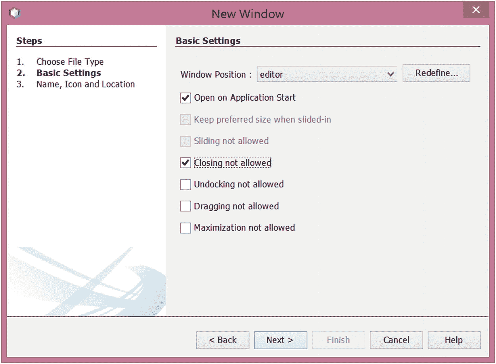

图 9-1

创建新 TopComponent 的向导，步骤 2

右键单击 *View* 模块，然后选择 **New ➤ Window**（见图 9-1）。

向导会询问窗口位置。NetBeans IDE 提供了多种位置，如图 8-2 所示。按图 9-1 所示进行选择，然后点击 **Next**。

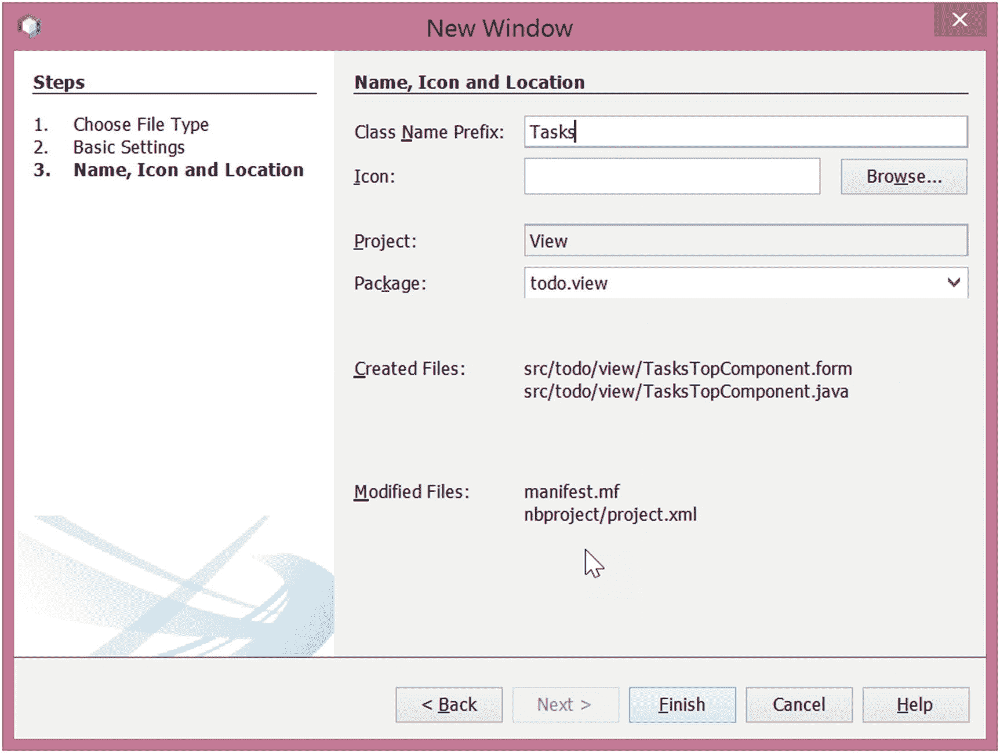

图 9-2

创建新 TopComponent 的向导，步骤 3

*类名前缀* 是将要创建的框架或面板的名称，同时还会创建一些其他帮助文件。提供名称“*Tasks*”（而不是 Swing 应用程序中的“*TasksWindow*”），如图 9-2 所示，然后点击 **Finish**。

会创建两个文件：`TasksTopComponent.java` 和 `TasksTopComponent.form`，并且该表单已在编辑器的*设计模式*中打开，同时打开的还有*组件面板*（图 9-3）。

如果你在*项目*选项卡中看到了 `TasksTopComponent.form` 文件，但打开时 NetBeans 提示无法识别该文件，你需要从 **Tools ➤ Plugins ➤ Installed** 中激活 *Java SE* 插件。

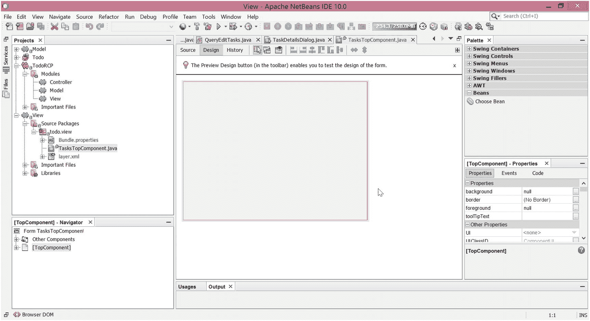

图 9-3

设计视图中的 TasksTopComponent

请注意左侧*项目*和*导航器*窗口的位置，以及中央的*编辑器*窗口。一个红色边框高亮显示了选中的组件（`TopComponent`）。*导航器*显示了`TopComponent`的所有可视和不可视组件，当你需要更改被其他组件隐藏或太小而无法在绘图区域中选中的组件的属性时，这非常方便。

右侧是*组件面板*窗口，默认显示标准的 Swing 组件（你也可以添加第三方 JavaBeans）。此外，右侧还有*属性*窗口。属性按类别分组，以便于访问最常用的属性，已更改的属性其名称会以粗体高亮显示。

要更改 IDE 的视觉布局，你可以将每个窗口拖到主窗口的另一个角落，甚至可以通过右键单击其选项卡并选择 **Float** 来让某些窗口浮动。

点击 **Source** 按钮查看清单 8-1 的注解，并将其与图 9-1 和图 9-2 的对话框进行比较。注意 `mode = "editor"`（如果不是，现在正是更改它的机会）和 `openAtStartup = true`（同样，如果不是，现在正是更改它的机会）。

NetBeans IDE 的可视化编辑器允许开发者真正地以可视化方式开发应用程序。只需在`TopComponent`内部右键单击，然后选择 **Set Layout** 菜单项。你会看到默认选择不是传统的 Swing/AWT 布局管理器，而是一个名为 *Free Design* 的东西。这意味着你正在使用 Matisse 可视化 GUI 构建器。Matisse 将`TopComponent`配置为使用在 SwingLabs [`java.net`](http://java.net) 项目中开发的`GroupLayout`布局管理器，该管理器已作为标准布局管理器包含在 Java SE 6 中。


如第 7 章中的图 7-7 所示，任务列表由菜单栏、工具栏、表格和状态栏组成。除了在 NetBeans RCP 中被称为 `OutlineView` 的表格外，平台负责处理其余所有部分。要添加 `OutlineView`，你需要添加对 *Explorer & Property Sheet API* 的依赖。右键单击 *View* 模块的 *Libraries* 文件夹，选择 **Add Module Dependency**，选择 **Explorer & Property Sheet API**，然后点击 **OK**。在设计视图中右键单击 `TopComponent`，将其布局更改为 **BorderLayout**。

从 *Palette window* 中拖拽一个 *Scroll Pane* 到 `TasksTopComponent` 的中心。在 *Navigator* 窗口（查看左下角）中右键单击 `JScrollPane`，将其变量名更改为 `outlineView`。在 *Properties* 窗口中，点击 **Code**，然后点击 *Custom Creation Code* 属性的小按钮 **[...]**，添加 `new OutlineView(),`，然后点击 **OK** 按钮。切换到 *Editor window* 中的 Source 视图，右键单击，选择 **Fix Imports** 来修复错误。

运行应用程序时，你将看到类似于图 9-4 的内容。

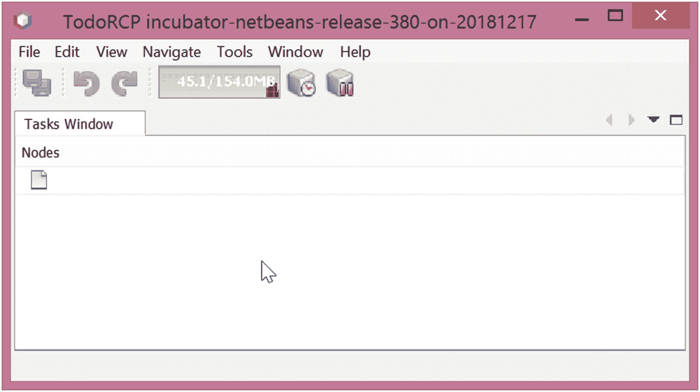

图 9-4

TodoRCP 应用程序的首次执行

看看使用 NetBeans RCP 你能直接获得多少功能，而在普通的 Swing 应用程序中，这些都需要你自己开发：一个菜单栏和一个工具栏（需要自定义）、一个状态栏，以及一个奇特的树表组件——所有这些只需一行代码。

让我们从自定义菜单开始。如前几章所述，一个中央注册表保存着 NetBeans RCP ToDo 应用程序每个模块的信息。如果你点击 **Important Files ➤ XML Layer ➤ <this layer in context> ➤ Menu Bar**（见图 9-5），就可以在这个中央注册表中找到菜单栏。

在图 7-7 中，我们看到只需要 *File*、*Edit* 和 *Options* 菜单。因此，保留 *File* 和 *Edit*，将 *Tools* 重命名为 *Options*（通过选中它，右键单击，选择 **Rename**），然后删除其余部分以及内容操作（通过选中它们，右键单击，选择 **Delete**）。清理并构建 *View* 模块，然后再次执行应用程序。^(³) 结果应该类似于图 9-6。

将 *Tools* 重命名为 *Options* 后，你可能需要重启 NetBeans。

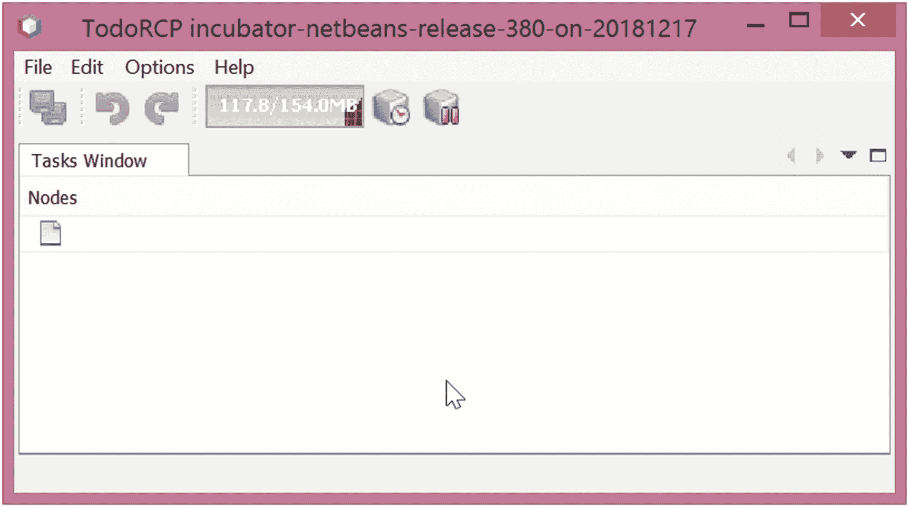

图 9-6

具有自定义菜单栏的 TodoRCP 应用程序

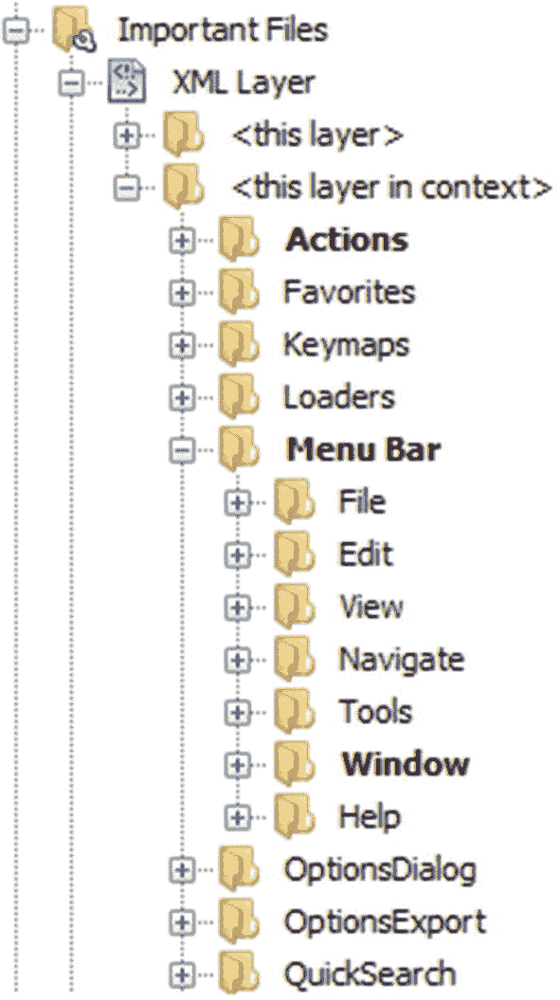

图 9-5

Layer XML – 中央注册表

让我们用一些演示数据构建表格。点击 **Source**，在 `TasksTopComponent` 构造函数的末尾，添加清单 9-1 中所示的代码行。

```
OutlineView ov = (OutlineView)outlineView;
//设置大纲视图的列，
//使用属性名称
//后跟列标题中显示的文本
ov.setPropertyColumns(
"priority", "Priority",
"description", "Task",
"alert", "Alert",
"dueDate", "Due Date");
//隐藏根节点，因为我们只关心子节点：
ov.getOutline().setRootVisible(false);
TableColumnModel columnModel = ov.getOutline().getColumnModel();
ETableColumn column = (ETableColumn) columnModel.getColumn(0);
((ETableColumnModel) columnModel).setColumnHidden(column, true);
清单 9-1
创建 OutlineView
```

为了能够编译代码，你需要向 *ETable and Outline* 模块添加一个额外的依赖（并 **Fix Imports**）。你还记得如何操作吗？提示：右键单击 *Projects* 选项卡中的 *Libraries* 文件夹，或参考第 7 章中的图 7-16。如果成功，你的应用程序应该看起来像图 9-7。

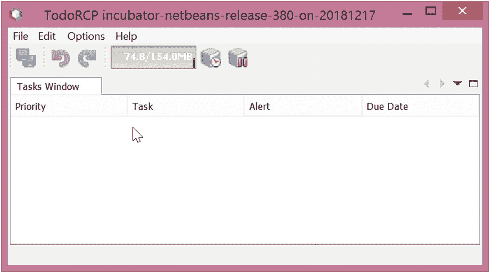

图 9-7

具有 OutlineViews 列的 TodoRCP 应用程序

接下来，让我们创建状态栏。要在 NetBeans 中显示 `StatusBar`，类必须实现 `StatusLineElementProvider` 接口并将其声明为服务。右键单击 `todo.view` 包，选择 **New ➤ Java Class**。将其命名为 `StatusBar`，然后点击 **Finish**。然后复制清单 9-2 中显示的代码并粘贴进去（你可能需要格式化代码；在编辑器内右键单击，从弹出菜单中选择 **Format**）。

```
package todo.view;
import java.awt.Component;
import javax.swing.JLabel;
import org.openide.awt.StatusLineElementProvider;
import org.openide.util.lookup.ServiceProvider;
/**
* 应用程序的状态栏。
*/
@ServiceProvider(service=StatusLineElementProvider.class, position=1)
public class StatusBar implements StatusLineElementProvider {
@Override
public Component getStatusLineElement() {
return new JLabel("There are no task alerts for today.");
}
}
清单 9-2
作为服务提供者实现的 StatusBar
```

重新审视 `ServiceProvider` 和 `Lookup`。`StatusLineElementProvider` 接口非常灵活；你可以返回任何你想要的组件——`JLabel`、`JButton`、`JPanel` 等等。当然，神奇之处在于第一行，它将 `StatusBar` 类声明为 `StatusLineElementProvider.class` 的服务提供者。正如你现在应该已经知道的，这一行将你的类添加到应用程序的 *default lookup* 中，NetBeans 随后会搜索 `StatusLineElementProvider.class`，并将找到的所有提供者添加到状态栏中。

接下来，让我们创建工具栏。工具栏包含操作，因此你将创建操作并将它们插入到中央注册表中的相应工具栏中。你需要原始 ToDo 应用程序中的图标。重复你在中央注册表中对 *Menu Bar* 执行的操作，对 *Toolbars* 执行相同操作。只保留两个条目：*Edit, Options*（通过重命名一些并删除其余部分）。

操作是控制器。打开 *Controller* 模块，创建 Java 包 `todo.controller.file`、`todo.controller.edit` 和 `todo.controller.options`。右键单击 `todo.controller.edit` 包，选择 **New Action**。创建 *Add Task* 操作，该操作始终启用，然后点击 **Next**。

然后为操作选择一个类别。类别代表操作的语义分组。你可以选择一个已有的类别或创建一个新的类别。在我们的例子中，选择已有的 *Edit* 类别。此外，将你的操作分配给 *Edit* 菜单栏和 *Edit* 工具栏，并设置操作显示的位置。下拉菜单会显示可能的显示位置。*"HERE"* 标识了你的操作显示将被插入的位置。不要忘记添加快捷键（*Insert*，与旧的待办事项应用程序相同）。见图 9-8。

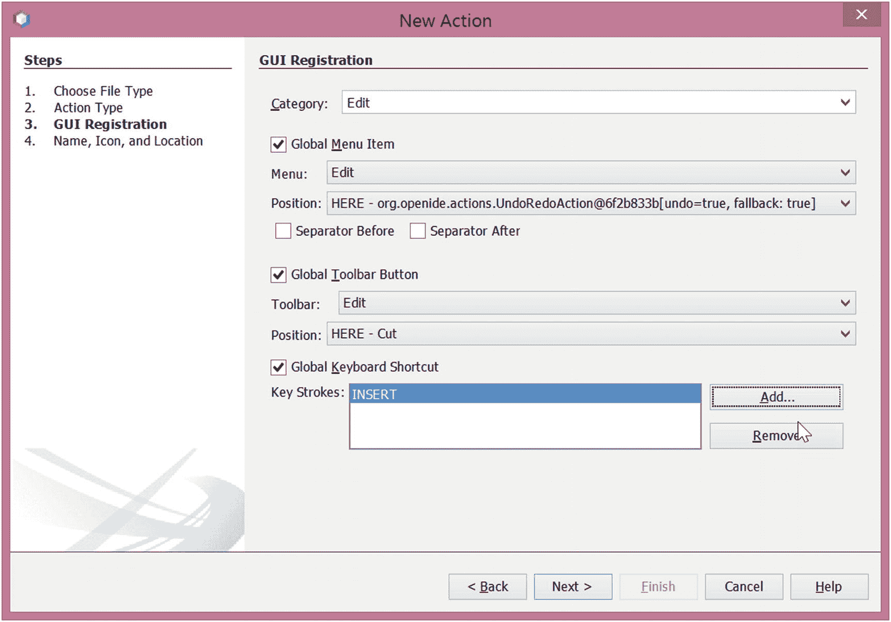

图 9-8

新建操作向导，第 3 步

如图 9-9 所示命名类，不要忘记添加图标（浏览到原始 ToDo 应用程序的 `icons` 文件夹，或者如果你愿意，也可以使用你自己的图标）。

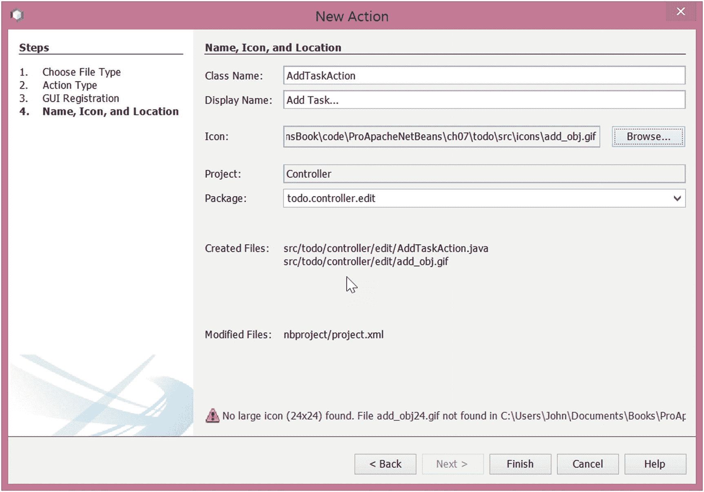

图 9-9

新建操作向导，第 4 步

点击 **Finish**。


`AddTaskAction` 类被创建（参见第 8 章中的清单 8-19）。观察在 NetBeans RCP 中，向导的输入是如何被翻译成 Java 注解的。在 NetBeans IDE 7.0 之前的版本中，这些信息是直接添加到 `layer.xml` 中的。提醒一下，我们在第 7 章中将 `layer.xml` 添加到了我们的模块中。将两种情况下的位置都修改为 `10`，以避免与你接下来创建的操作混淆。为每个新操作的位置都加上 `10`——也就是说，将 `EditTaskAction` 的位置设置为 `20`，将 `DeleteTaskAction` 的位置设置为 `30`，以此类推。暂时将操作主体留空。

通过运行旧的 ToDo 应用程序，你可能已经注意到，虽然 **Add Task** 操作始终处于启用状态，但其他任务操作只有在从表格中选择一个或多个任务时才启用——换句话说，它们是*上下文*操作。你可以通过使用*条件启用*操作来实现相同的功能。这些操作作用于*节点*。节点是特定数据片段的可视化表示——在我们的示例中，就是任务。当你从表格中选择一行时，实际上是在选择一个任务节点。上下文敏感性是通过称为*cookies*的接口构建的。操作要作用的节点实现了一个接口，该接口指定了操作应调用的方法。操作可以指定一组 cookies，这些 cookies 在活动节点中的存在情况（如果活动节点实现了这些接口之一）决定了该操作是否启用。

要创建 `EditTaskAction`，请右键点击 `todo.controller.edit` 包，然后选择 **New Action**。选择 **Conditionally Enabled** 和 **User Selects One Node**（参见图 9-10）。cookie 类是一个 `Task`。这意味着每当在 `OutlineView` 中选中一个任务（行）时，此操作就会启用。

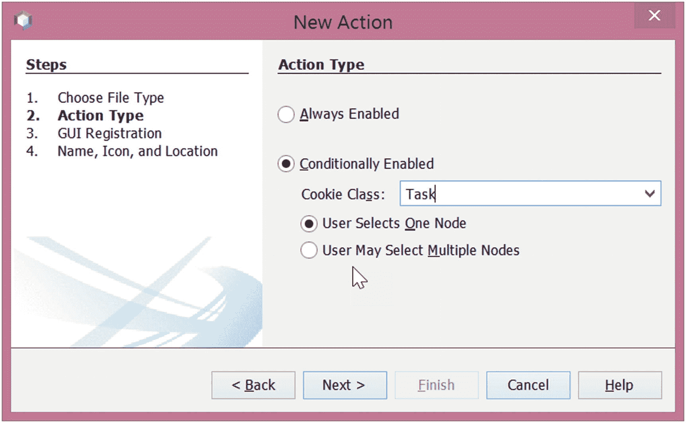

图 9-10

条件启用操作

点击 **Next**，并像你为 `AddTaskAction` 所做的那样完成其余步骤。如果你正确完成了向导，你应该会看到第 8 章中清单 8-21 所示的输出。编译器会报错，因为它找不到 `Task` 类。在 *Controller* 和 *Model* 模块之间添加一个依赖关系。你可以通过右键点击 *Controller* 模块下的 *Libraries*，然后选择 **Add Module Dependency** 操作来完成此操作。勾选 **Show Non-API Modules**，搜索 *Model*，然后点击 **OK**。现在你可以修复导入，并将 `todo.model.Task` 作为导入添加到 `EditTaskAction` 中。

重复这些步骤来创建其余的操作，尽量使 TodoRCP 应用程序与 Swing ToDo 应用程序尽可能相似。这意味着 `EditTaskAction`、`DeleteTaskAction` 和 `MarkAsCompletedTaskAction` 是条件启用的，而其余操作则始终启用。`DeleteTaskAction` 和 `MarkAsCompletedTaskAction` 应该是条件启用的，并且你可以选择多个节点，因为它们可以同时应用于多个任务（参见第 8 章中的清单 8-22）。

另外，请确保你为属于它们的操作使用了 *Options* 工具栏和菜单（参见图 9-11），即 **Show completed tasks**、**Sort by priority**、**Sort by due date** 和 **Show Alerts**。

静态视觉原型应类似于图 9-12。如果工具栏的顺序不正确，你可以通过右键点击 *XML Layer* 并选择 **Open**，或者右键点击 *Toolbars* 节点并选择 **Go to Declaration** 来修改它。`layer.xml` 文件会打开，你可以找到工具栏并更改它们的 `Position` 属性（值越小表示该工具栏越先显示）。

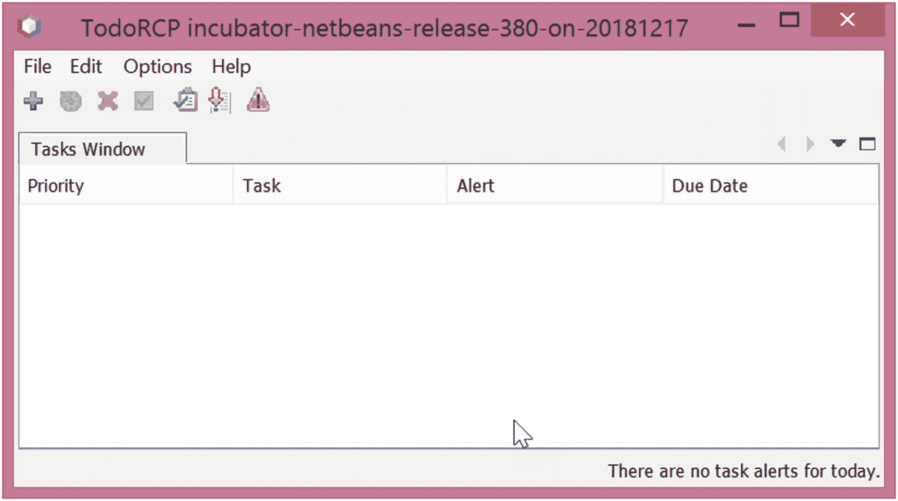

图 9-12

TodoRCP 应用程序的静态原型

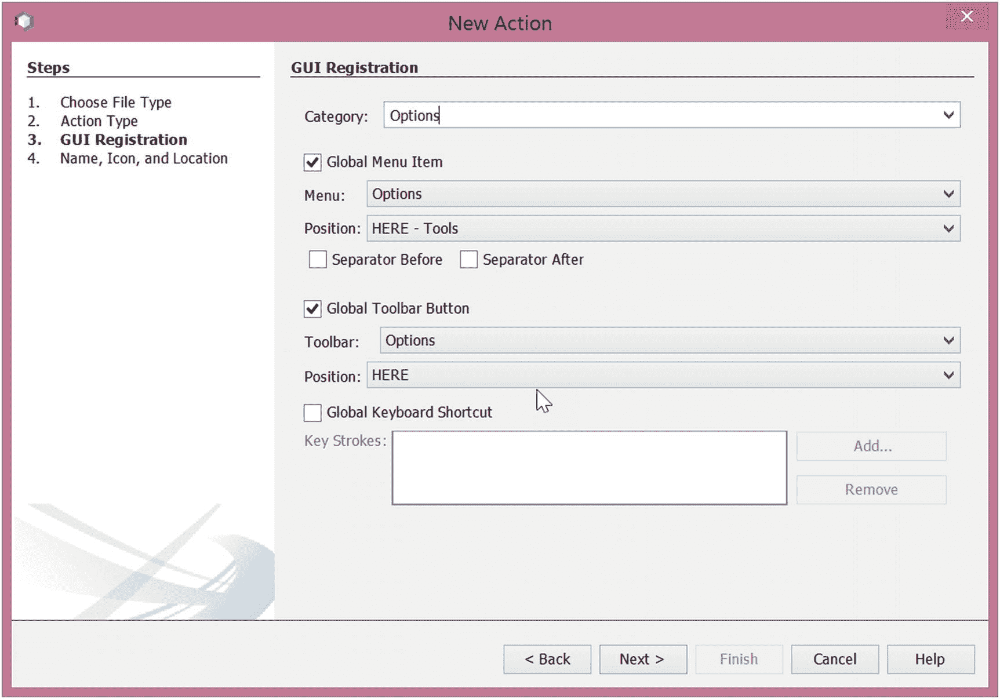

图 9-11

新建操作向导

图 7-7（第 7 章）中显示的任务编辑表单也需要创建。为了节省时间和精力，只需从旧的 ToDo 应用程序中复制 `TaskDetailsDialog` 类，并将其粘贴到 *View* 模块中的 `todo.view` 包内。你会注意到一些错误。为 *View* 模块添加一个从 *View* 到 *Model* 模块的依赖关系，以便 *View* 能够访问 `Task` 类。

如果你也从旧的 ToDo 应用程序中复制 `ActionSupport` 类，另一个错误就可以解决。


## 步骤 2 – 构建“动态”原型

现在让我们完成各项操作。

要让 `AddTaskAction` 显示 `TaskDetailsDialog`，只需将代码清单 9-3 的代码复制到 `AddTaskAction` 的 `actionPerformed()` 方法中：

```
TaskDetailsDialog taskDetailsDialog = new TaskDetailsDialog(null, true);
taskDetailsDialog.setNewTask(true);
taskDetailsDialog.setTask(new Task());
//        taskDetailsDialog.addActionListener(this);
taskDetailsDialog.setVisible(true);
代码清单 9-3
AddTaskAction 的 actionPerformed() 方法
```

你需要添加从 *Controller* 到 *View* 的依赖关系，以便能够修复 `TasksDetailsDialog` 的导入，首先需要将 `todo.view` 包设为公开。

`EditTaskAction` 也很容易编写（参见代码清单 9-4）。

```
public final class EditTaskAction implements ActionListener {
private final Task context;
public EditTaskAction(Task context) {
this.context = context;
}
public void actionPerformed(ActionEvent ev) {
TaskDetailsDialog taskDetailsDialog =
new TaskDetailsDialog(null, true);
taskDetailsDialog.setNewTask(false);
taskDetailsDialog.setTask(context);
//        taskDetailsDialog.addActionListener(this);
taskDetailsDialog.setVisible(true);
}
}
代码清单 9-4
EditTaskAction
```

让我们看看如何向 `OutlineView` 显示一些模拟数据。正如我们在前一章所学，我们需要将数据包装成节点，即将我们的模型（`Task`）包装成一个 `Node`，更具体地说，包装成一个 `BeanNode`，它使用反射来检索*值对象*（本例中为 `Task`）的属性。在 *View* 模块内创建第 8 章代码清单 8-3 的类（并添加对 *Node API* 的依赖）。

要在 `OutlineView` 中显示任务，你需要一个扁平的节点列表。扁平节点列表是一个仅提供叶节点的根节点；也就是说，只有一层深度的子节点。工厂用于创建子节点（参见第 8 章代码清单 8-4）。

`OutlineView` 使用模拟数据填充，如第 8 章代码清单 8-4 中的 `createKeys()` 方法所示。看看 `TaskChildFactory` 如何使用默认查找来获取 `TaskManager` 实现，从而检索所有任务。松耦合！

最后，需要修改 `TasksTopComponent`，如第 8 章代码清单 8-8 所示。

`ExplorerManager` 是资源管理器视图的控制器，它需要一个根节点元素。向其传递一个 `AbstractNode`；其 `Children` 派生自 `TaskChildFactory`。

与原始的 Swing ToDo 应用程序相比，代码行数大大减少，你现在就有了一个包含填充数据的运行原型。构建并运行它，你将看到类似于图 9-13 所示的视图。

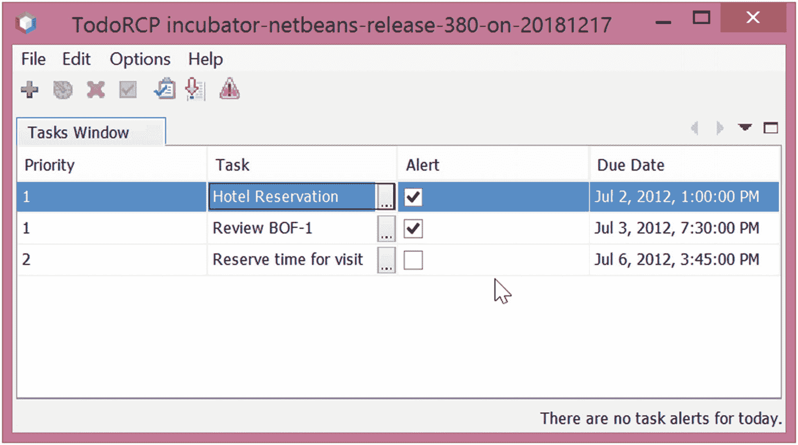

图 9-13

包含示例数据的 TodoRCP

然而，当你选择一行或多行时，条件启用的操作并不会相应地启用。要解决这个问题，你需要将 `Task` 对象添加到 `TaskNode` 的查找中，然后将 `TopComponent` 的查找设置为其节点的查找。为此，修改 `TaskNode`，如第 8 章代码清单 8-5 所示，该操作将任务添加到节点的查找中。

单例查找仅包含一个对象，在本例中就是你的任务。通过添加第 8 章代码清单 8-9 的代码（在设置 `ExplorerManager` 根上下文的那行代码之后），将 `TopComponent` 的查找设置为节点的查找。

## 处理事件

现在你已经准备好显示任务，是时候添加一些事件处理了。在原始的 ToDo 应用程序中，将 GUI 事件分为两个互斥的类别是很有用的：

*   *内部事件*，仅影响视图本身
*   *外部事件*，会导致模型方法执行

内部事件包括选择更改和点击**取消**按钮。在原始的 ToDo 应用程序中，这些事件由视图类自身处理，并且不作为视图类公共接口的一部分公开。例如，选择一个任务应该启用**编辑任务**菜单项和**移除任务**菜单项，以及相应的工具栏按钮。现在，这些事件由 *Controller* 模块中使用 cookie 的条件启用操作处理，而不再在 *View* 包中处理。

视图类*不应*处理原始 ToDo 应用程序作者称之为“外部”的那类事件。这些事件应转发给控制器类，控制器类通常为特定用例或一组相关用例实现工作流逻辑。

原始的 ToDo 应用程序包含 `todo.view.ActionSupport` 类，它简单地维护一个 `ActionListeners` 列表，并将 `ActionEvents` 转发给它们。但 `ActionSupport` 本身就是一个 `ActionListener`。这样做是为了避免大量与事件相关的方法，例如 `addNewTaskListener()`、`removeNewTaskListener()`、`addEditTaskListener()`、`removeEditTaskListener()` 等等。相反，视图类仅生成一个 `ActionEvent`。`ActionSupport` 类从视图组件捕获 `ActionEvent` 并将其转发给控制器，控制器将自己注册为视图的 `ActionListener`。

在 *TodoRCP* 应用程序中不需要所有这些类，因为 NetBeans RCP 框架会处理所有这些。你需要做的就是完成操作的 `actionPerformed()` 方法。因此，你的工作是将逻辑从 `QueryEditTasks` 转移到你的操作中。代码清单 9-5 展示了它们如何映射。

```
public final class MarkAsCompletedTaskAction implements ActionListener {
private final List context;
private final TaskManagerInterface taskManager;
public MarkAsCompletedTaskAction(List context) {
this.context = context;
this.taskManager =
Lookup.getDefault().lookup(TaskManagerInterface.class);
}
@Override
public void actionPerformed(ActionEvent ev) {
for (Task task : context) {
task.setCompleted(true);
}
}
}
public final class DeleteTaskAction implements ActionListener {
private final List context;
private final TaskManagerInterface taskManager;
public DeleteTaskAction(List context) {
this.context = context;
this.taskManager =
Lookup.getDefault().lookup(TaskManagerInterface.class);
}
public void actionPerformed(ActionEvent ev) {
for (Task task : context) {
int response = JOptionPane.showConfirmDialog(null,
"Are you sure you want to remove task\n["
+ task.getDescription() + "] ?",
"Remove Task",
JOptionPane.YES_NO_OPTION);
if (response == JOptionPane.YES_OPTION) {
taskManager.removeTask(task.getId());
}
}
}
}
代码清单 9-5
MarkAsCompletedTaskAction 和 DeleteTaskAction
```

你从原始 ToDo 应用程序复制过来以消除 `TaskDetailsDialog` 错误的 `ActionSupport` 不再需要了，因此将其从 *View* 模块中移除并处理这些错误。首先，从 `TaskDetailsDialog` 中移除所有引用 `ActionSupport` 的语句。添加对 `TaskManager` 的引用，如代码清单 9-6 所示。

```
private final TaskManagerInterface taskManager;
public TaskDetailsDialog(java.awt.Frame parent, boolean modal) {
super(parent, modal);
initComponents();
setLocationRelativeTo(parent);
taskManager =
Lookup.getDefault().lookup(TaskManagerInterface.class);
}
代码清单 9-6
TaskDetailsDialog
```

然后，为**移除**和**保存**按钮添加操作，如代码清单 9-7 所示。


```
private void removeActionPerformed(java.awt.event.ActionEvent evt) {
taskManager.removeTask(getTask().getId());
}
private void saveActionPerformed(java.awt.event.ActionEvent evt) {
try {
if (isNewTask()) {
taskManager.addTask(getTask());
} else {
taskManager.updateTask(getTask());
}
} catch (ValidationException ex) {
Exceptions.printStackTrace(ex);
}
cancel.doClick();
}
代码清单 9-7
TaskDetailsDialog 中的“移除”和“保存”操作
```

切换到设计视图，选择一个按钮，右键单击它，然后选择**事件 ➤ 操作 ➤ actionPerformed**。这将在源代码中创建相应的方法。

你可以按照“NetBeans 属性编辑器教程”，特别是其中的“创建自定义内联编辑器”部分（[`http://platform.netbeans.org/tutorials/nbm-property-editors.html#inplace-editor`](http://platform.netbeans.org/tutorials/nbm-property-editors.html%2523inplace-editor)），为日期添加一个内联编辑器（参见图 9-14）。


图 9-14

用于显示日历的内联编辑器

使用 *SwingX* 库的日期选择器组件，我们在第 7 章中已将其封装在 *Libraries* 模块中。在 *View* 模块中添加对 *Libraries* 模块的依赖。现在，你就可以使用日期选择器了，这需要实现几个 NetBeans IDE 特有的接口：

*   `ExPropertyEditor`：一个属性编辑器接口，属性表通过它传递一个“环境”对象（`PropertyEnv`），该对象使编辑器能够访问其正在编辑的 `Property` 对象以及其他信息。

*   `InplaceEditor.Factory`：用于拥有 `InplaceEditor` 的对象的接口。

*   `InplaceEditor`：一个接口，允许提供自定义组件以在属性表中显示。

实现细节可在本书的源代码中找到。

在 `OutlineView` 中，只需单击特定的表头/字段，即可直接获得开箱即用的排序行为。单击一次按升序排序列，再单击一次按降序排序，第三次单击则恢复原始顺序。但是，如果你想实现 `SortByDateAction` 和 `SortByPriorityAction` 来了解如何以编程方式排序，请在 `todo.view` 中创建一个新的 `Utilities` 类，然后将代码清单 9-8 中的代码复制并粘贴到 `Utilities` 类中。

```
/**
* 根据给定的 {@code field} 对大纲视图 {@code ov} 进行排序。
* @param ov 要排序的大纲视图
* @param field 要排序的字段
* @param ascending 如果为 {@code true}，则列表按升序排序；
* 如果为 {@code false}，则按降序排序。
*/
public static void sortBy(final OutlineView ov, final String field, final boolean ascending) {
ETableColumnModel columnModel = (ETableColumnModel) ov.getOutline().getColumnModel();
int columnCount = columnModel.getColumnCount();
columnModel.clearSortedColumns();
for (int i = 0; i < columnCount; i++) {
ETableColumn column = (ETableColumn)columnModel.getColumn(i);
if (column.getHeaderValue().equals(field)) {
columnModel.setColumnSorted(column, ascending, 1);
}
}
TableModel model = ov.getOutline().getModel();
ov.getOutline().tableChanged(new TableModelEvent(model, 0, model.getRowCount()));
}
代码清单 9-8
Utilities.sortBy() 方法
```

由于 `Utilities` 类只包含静态工具方法，请将其设为 `final` 并添加一个空的私有构造函数以避免初始化。添加对 *ETable and Outline* 模块的缺失依赖。将代码清单 9-9 中所示的方法添加到 `TasksTopComponent` 中。

```
public void sortBy(final String field, final boolean ascending) {
Utilities.sortBy((OutlineView)outlineView, field, ascending);
}
代码清单 9-9
对 OutlineView 进行排序
```

此步骤是为了避免在 *Controller* 模块中添加对 *Explorer & Property Sheet API* 的依赖，因为要调用 `Utilities` 类中的原始方法，你需要添加对 `OutlineView` 的引用，而该引用包含在 *Controller* 模块的 *Explorer & Property Sheet API* 中。这种变通方法使我们免除了此依赖，如代码清单 9-10 所示。

```
public final class SortByPriorityAction implements ActionListener {
public void actionPerformed(ActionEvent e) {
TasksTopComponent tasksTopComponent = (TasksTopComponent)WindowManager.getDefault().findTopComponent(
"TasksTopComponent");
tasksTopComponent.sortBy("Priority", true);
}
}
public final class SortByDateAction implements ActionListener {
public void actionPerformed(ActionEvent e) {
TasksTopComponent tasksTopComponent = (TasksTopComponent)WindowManager.getDefault().findTopComponent(
"TasksTopComponent");
tasksTopComponent.sortBy("Due Date", true);
}
}
代码清单 9-10
SortByPriorityAction 类
```

你需要添加对 *Explorer & Property Sheet API* 和 *Utilities API* 模块的依赖，以消除错误。

`ShowAlertsAction` 会为每个 `hasAlert()==true` 的任务显示一个警告（参见图 9-15）。其实现可在本书的源代码中找到。

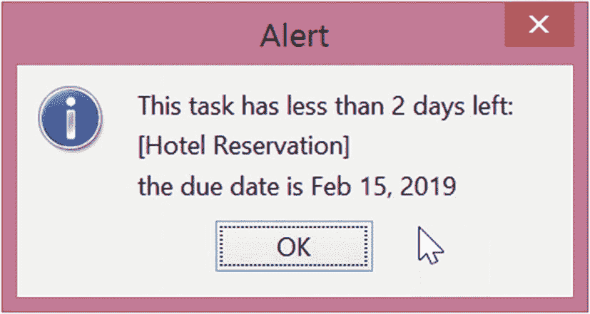

图 9-15

警报信息对话框

关于过滤，你可以在 `OutlineView` 中右键单击一行，然后选择**仅显示满足以下条件的行**，再选择一个条件进行过滤。按照相同的过程并选择**无过滤器**来移除过滤器。但是，`ShowCompletedTasksAction` 无法通过这些开箱即用的过滤器显示。

`Outline` 类提供了一个方法 `setQuickFilter(int col, Object filterObject)`，`filterObject` 可以是与列中某个值匹配的值，也可以是一个 `QuickFilter` 对象（参见代码清单 9-11）。

```
public interface QuickFilter {
/** 如果对象被接受，则其所在行将由表格显示。 */
public boolean accept(Object aValue);
}
代码清单 9-11
QuickFilter 接口
```

在这种情况下，接受的值就是 `true`，这意味着你应该只接受那些包含值 `true` 的行。代码清单 9-12 展示了如何实现此操作：

```
public final class ShowCompletedTasksAction extends JToggleButton implements ActionListener {
private boolean pressed;
@Override
public void actionPerformed(ActionEvent e) {
TasksTopComponent tasksTopComponent = (TasksTopComponent) WindowManager.getDefault().findTopComponent("TasksTopComponent");
pressed = !pressed;
if (pressed) {
tasksTopComponent.setQuickFilter(3, Boolean.TRUE);
} else {
tasksTopComponent.unsetQuickFilter();
}
}
}
代码清单 9-12
ShowCompletedAction 类
```

其中 3 指的是 `OutlineView` 的第三列。唯一需要注意的是，NetBeans 工具栏不会显示其状态（按下/未按下）。为了使其按预期工作，我们需要让它扩展 `org.openide.util.actions.BooleanStateAction`，如前一章所述（参见代码清单 8-23）。`actionPerformed()` 方法与代码清单 9-12 中的相同。

但是，如果你运行应用程序并尝试使用 *Task Details* 对话框添加新任务，你的新任务永远不会出现在 `OutlineView` 中，因为 `OutlineView` 从未收到模型更改的通知。要解决此问题，首先，修改 `TaskManagerInterface`，为其添加两个方法：

```
void addPropertyChangeListener(PropertyChangeListener listener);
void removePropertyChangeListener(PropertyChangeListener listener);
```

在 `TaskManager` 中实现这些方法，如本书提供的源代码所示。


最后，需要通知 `TaskChildFactory`（参见清单 9-13）。

```
public class TaskChildFactory extends ChildFactory {
private TaskManagerInterface taskManager;
private final transient PropertyChangeListener pcl = new PropertyChangeListener() {
@Override
public void propertyChange(final PropertyChangeEvent evt) {
refresh(true);
}
};
public TaskChildFactory() {
taskManager = Lookup.getDefault().lookup(TaskManagerInterface.class);
taskManager.addPropertyChangeListener(pcl);
}
@Override
protected boolean createKeys(final List toPopulate) {
taskManager = Lookup.getDefault().lookup(TaskManagerInterface.class);
toPopulate.addAll(taskManager.listAllTasks(true));
return true;
}
//...
}
清单 9-13
TaskChildFactory 类
```

这些更改应能使 `OutlineView` 相应更新。然而，你还会注意到另一个问题：编辑任务时，必须点击另一个单元格后才会更新。要解决此问题，你需要进行更多修改。首先修改 `Task` 类（使其成为可观察对象，以便在字段更改时通知监听器）；其次，在所有影响大纲视图的 setter 方法中添加 `firePropertyChange()`。清单 9-14 展示了一个示例，但你需要对其他 setter 也执行相同操作。

```
public class Task implements Serializable {
...
private PropertyChangeSupport pcs = null;
/** @return 一个线程安全的 PropertyChangeSupport */
private PropertyChangeSupport getPropertyChangeSupport() {
if (pcs == null) {
pcs = new PropertyChangeSupport(this);
}
return pcs;
}
public void addPropertyChangeListener(final PropertyChangeListener listener) {
getPropertyChangeSupport().addPropertyChangeListener(listener);
}
public void removePropertyChangeListener(final PropertyChangeListener listener) {
getPropertyChangeSupport().removePropertyChangeListener(listener);
}
...
public void setDueDate(Date dueDate) {
Date oldValue = this.dueDate;
this.dueDate = dueDate;
getPropertyChangeSupport().firePropertyChange("DUE DATE CHANGED", oldValue, dueDate);
}
...
}
清单 9-14
使 Task 成为可观察对象
```

然后，必须通知 `TaskNode` 任何更改（参见清单 9-15）。

```
public class TaskNode extends BeanNode {
private final transient PropertyChangeListener pcl = new PropertyChangeListener() {
@Override
public void propertyChange(final PropertyChangeEvent evt) {
firePropertySetsChange(null, getPropertySets());
}
};
public TaskNode(Task bean) throws IntrospectionException {
super(bean, Children.LEAF, Lookups.singleton(bean));
bean.addPropertyChangeListener(pcl);
}
}
清单 9-15
TaskNode 更改通知
```

现在你已拥有功能完备的视图和模型类，可以用使用持久化存储的真实逻辑来替换模型类的模拟实现。在大型应用程序项目中，你可以让一个团队负责 UI（像你一样依次构建两个原型），另一个团队负责业务和持久化逻辑（最好采用测试驱动开发，即 TDD）。他们可以并行工作，最后汇合，将功能性的视图和控制器实现与功能性的模型实现整合在一起。

本步骤（步骤 2）的大部分工作只是编码。NetBeans IDE 提供了优秀的代码编辑器和调试器，带来了常见的好处：代码补全、Javadoc 集成和重构支持。但 NetBeans IDE 的功能不止于此：它可以轻松构建新的插件模块，以打包你的项目编码标准，例如项目模板、控制器类模板等。

在本书的源代码中，你将找到 `TaskManagerDB`，它是 `TaskManagerInterface` 的另一个实现，用于将任务持久化到 HSQLDB 数据库。**文件**菜单下的最后两个操作——**新建任务列表**和**打开任务列表**——的实现应该很直接。

## JavaFX 与 NetBeans 平台

在本节中，我们将学习如何将 NetBeans 平台与 JavaFX 集成。JavaFX 包含在 JDK 8 至 10 版本中。从版本 11 开始，它被独立开发，可以从 Gluon 网站（[`https://gluonhq.com/products/javafx/`](https://gluonhq.com/products/javafx/)）下载。

如果你希望开发 JavaFX 应用程序的 GUI，Gluon 的 *SceneBuilder*（[`https://gluonhq.com/products/scene-builder/`](https://gluonhq.com/products/scene-builder/)）也很有用。要将 *SceneBuilder* 与 NetBeans 集成，请按照以下步骤操作：

1.  在 NetBeans 中，导航至 **工具 ➤ 选项 ➤ Java ➤ JavaFX**（Windows/Linux）或 **NetBeans ➤ 偏好设置 ➤ Java ➤ JavaFX**（MacOSX），如果 JavaFX 支持尚未激活，请点击**激活**。

2.  激活完成后，将 *Scene Builder Home* 设置为 Gluon 目录（在 Mac 上通常为 `/Applications/SceneBuilder`）。某些 Windows 安装程序在安装 *SceneBuilder* 时不会询问目录。*SceneBuilder* 默认安装在 `C:\Program Files\SceneBuilder` 中，早期版本则安装在 `C:\Users\<YourUser>\AppData\Local\SceneBuilder` 中。

3.  点击**确定**，即可开始使用。


### 注意！

如果 NetBeans 提示“所选位置...不代表有效的 Java FX Scene Builder 安装”，请执行以下变通方法。

*   导航到 *SceneBuilder* 的安装目录。

*   进入 `app` 文件夹。

*   在同一文件夹中，将 `SceneBuilder.cfg` 复制一份并重命名为 `SceneBuilder.properties`。

Apache NetBeans 提供了两种开发 JavaFX 应用程序的方式：使用 *Ant* 或使用 *Maven*。如果你希望使用 Java 11 和 JavaFX 11，那么截至本文撰写时，使用 Ant 的向导在 Apache NetBeans 11 中无法正常工作。请观看此视频（[`https://www.youtube.com/watch?v=l9aoicDiQ_A`](https://www.youtube.com/watch%253Fv%253Dl9aoicDiQ_A)）了解如何使用 Ant 开发 JavaFX 11 应用程序。

开发 *ToDo* Swing 应用程序的 JavaFX 版本超出了本章的范围。在本书的源代码中，你会找到 *TodoFX*，这是一个独立的 JavaFX 10 应用程序。图 9-16 展示了源代码的结构。`todofx.model` 包包含模型的一个副本，你可以使用内存存储的 `TaskManager` 或持久化的 `TaskManagerDB` 类。应用程序的两个窗口（`TaskMain.fxml` 和 `TaskDetailsDialog.fxml`）使用了 FXML，并通过 *SceneBuilder* 构建。`Stage`、`Scene` 等对象在 `Main` 类中创建。

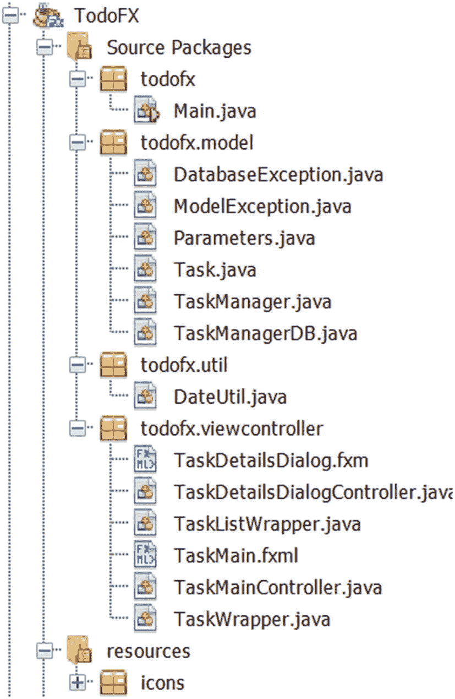

图 9-16

TodoFX 应用程序源代码结构

要构建一个使用 JavaFX 作为其 GUI 的 NetBeans RCP 应用程序，请遵循以下步骤：

1.  创建一个新的 **NetBeans 平台应用程序**，如我们在第 7 章中所学，并将其命名为 *TodoFXRCP*。

2.  创建两个模块：*Model*（`todo.model`）和 *ViewController*（`todo.viewcontroller`），如我们在第 7 章中所学。

3.  将本章开头开发的 *TodoRCP* 应用程序中 *Model* 模块的内容复制到 *TodoFXRCP* 的 *Model* 模块中（见图 9-17）。

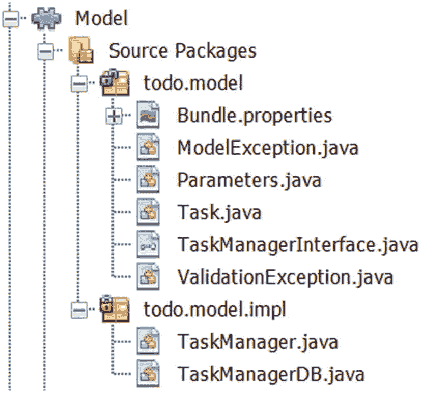

图 9-17

TodoFXRCP 应用程序 Model 模块

1.  向 *View* 模块添加一个新的 `TopComponent`；将其命名为 `TasksTopComponent`，就像我们为 *TodoRCP* 应用程序所做的那样。

2.  从 *TodoFX* 应用程序中复制文件 `TaskMain.fxml`、`TaskMainController.java`、`TaskDetailsDialog.fxml`、`TaskDetailsDialogController.java`、`TaskWrapper.java` 和 `TaskListWrapper.java` 到 *TodoFXRCP* 的 `todo.viewcontroller` 中。添加必要的模块（以及对 *Model* 模块的依赖）。确保更新 *FXML* 文件中的 `fx:controller` 以指向正确的控制器，例如 `fx:controller="todo.viewcontroller.TaskMainController"`。还需要进行一些其他修改，例如，从默认查找中检索 `TaskManager`，而不是使用其单例方法。

如果你使用的 JDK 版本未集成 JavaFX（例如 JDK 7 或 11），则需要创建一个库包装器来包含 `jfxrt.jar`。正如我们为 TodoRCP 应用程序所做的那样，创建一个名为 *Libraries*（`lib`）的新模块，并包装 `hsqldb.jar` 和 `jfxrt.jar`（对于 JavaFX 11，你至少需要添加 `javafx.base.jar`、`javafx.control.jar` 和 `javafx.fxml.jar`）。不要忘记在模块的 *API 版本控制* 类别中将所需的包设为 `public`，并让 *ViewController* 模块依赖于 *Libraries* 模块。

1.  在设计视图中，将 `TasksTopComponent` 的布局更改为 `BorderLayout`。然后，添加清单 9-16 中的代码（新增内容以粗体显示）。

```
public final class TasksTopComponent extends TopComponent {
private static JFXPanel fxPanel;
public TasksTopComponent() {
initComponents();
setName(Bundle.CTL_TasksTopComponent());
setToolTipText(Bundle.HINT_TasksTopComponent());
putClientProperty(TopComponent.PROP_CLOSING_DISABLED, Boolean.TRUE);
init();
}
private void init() {
fxPanel = new JFXPanel();
add(fxPanel, BorderLayout.CENTER);
Platform.setImplicitExit(false);
Platform.runLater(() -> createScene());
}
private void createScene() {
try {
Parent root = FXMLLoader.load(getClass().getResource("TaskMain.fxml"));
Scene scene = new Scene(root, Color.LIGHTBLUE);
fxPanel.setScene(scene);
} catch (IOException ex) {
Exceptions.printStackTrace(ex);
}
}
清单 9-16
支持 JavaFX 的 TasksTopComponent
```

或者，如果你需要引用控制器：

```
private TaskMainController mainController;
private void createScene() {
try {
URL location = getClass().getResource("TaskMain.fxml");
FXMLLoader fxmlLoader = new FXMLLoader();
fxmlLoader.setLocation(location);
fxmlLoader.setBuilderFactory(
new JavaFXBuilderFactory());
Parent root = fxmlLoader.load(location.openStream());
Scene scene = new Scene(root, Color.LIGHTBLUE);
fxPanel.setScene(scene);
mainController =
(TaskMainController) fxmlLoader.getController();
} catch (IOException ex) {
Exceptions.printStackTrace(ex);
}
}
```

将 JavaFX 集成到 NetBeans 平台的魔力由 `JFXPanel` 提供。当创建第一个 `JFXPanel` 对象时，它会初始化 JavaFX 运行时（*JavaFX 应用程序线程*）。当最后一个 `JFXPanel` 被销毁时，JavaFX 运行时退出；这就是我们设置 `Platform.setExplicitExit(false)` 的原因。此设置对于关闭然后重新打开支持 JavaFX 的窗口是必要的。

不要忘记“凯撒的归凯撒，上帝的归上帝。”换句话说，使用 `Platform.runLater(() -> {...});` 在 *JavaFX 应用程序线程* 中执行 JavaFX 代码，并使用 `SwingUtilities.invokeLater(() -> { ...});` 在 EDT 线程中执行 Swing 代码。

`createScene()` 中的代码类似于 JavaFX 应用程序的 `start()` 方法中的代码。也将 *TodoFX* 的 `Main` 类中的 `showTaskDetailsDialog()` 方法复制到 `TasksTopComponent` 中（见清单 9-17）。

```
public boolean showTaskDetailsDialog(TaskWrapper task) {
try {
// 加载 fxml 文件并为弹出对话框创建一个新舞台。
FXMLLoader loader = new FXMLLoader();
loader.setLocation(
TasksTopComponent.class.getResource("TaskDetailsDialog.fxml"));
//...
清单 9-17
showTaskDetailsDialog() 方法
```

只需少量修改，*TodoFXRCP* 就可以执行了。请注意，我们没有修改 FXML 文件（除了设置其控制器的正确路径）。

作为最后一步，从 `layer.xml` 中移除*工具栏*和*菜单栏*，并按照此处（[`https://blogs.oracle.com/geertjan/farewell-to-space-consuming-weird-tabs-part-2`](https://blogs.oracle.com/geertjan/farewell-to-space-consuming-weird-tabs-part-2)）和此处（[`https://blogs.oracle.com/geertjan/farewell-to-space-consuming-weird-tabs`](https://blogs.oracle.com/geertjan/farewell-to-space-consuming-weird-tabs)）的建议操作，以移除 `TopComponent` 中的选项卡。

要移除状态栏，请遵循此常见问题解答（[`http://wiki.netbeans.org/DevFaqRemoveStatusBar`](http://wiki.netbeans.org/DevFaqRemoveStatusBar)）。

结果如图 9-18 所示。

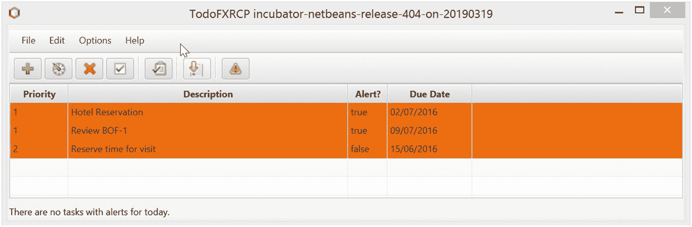

图 9-18

TodoFXRCP 应用程序


## HTML/Java UI API

在前面的章节中，我们了解了如何将 *ToDo* Swing 应用程序的 UI 移植到 NetBeans Rich Client Platform 的 *Window* 和 *Explorer and Properties System* API，以及 JavaFX。在本节中，我们将了解如何将 UI 移植到新的 HTML/Java UI API。

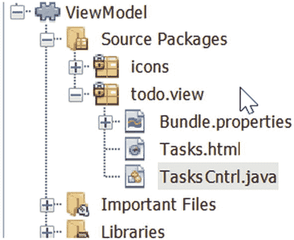

图 9-20

View 模块的文件结构

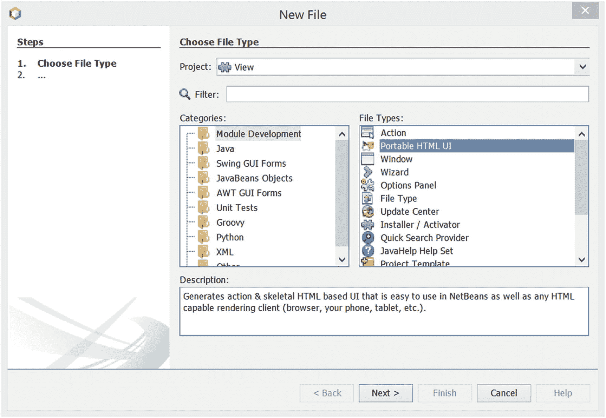

图 9-19

新建 Portable HTML UI 向导

1.  新建一个名为 `TodoHTMLJava` 的 NetBeans Platform 应用程序。

2.  在应用程序中新建一个模块（名称：`View`，代码名称基址：`todo.view`）。

3.  新建一个 Portable HTML UI。打开该模块（如果尚未打开），右键点击 *todo.view* 包，然后从弹出菜单中选择 **新建 ➤ 其他…**（见图 9-19）。点击 **下一步**。

4.  提供 `Tasks` 作为 *类名前缀*，为将要创建的按钮提供一个图标，然后点击 **完成**。

5.  生成的文件结构如图 9-20 所示。

右键点击 *View* 模块并选择 **运行**。您应该会看到一个类似于图 9-21 所示的窗口。点击您选择的图标按钮，即可看到 *TasksWindow* 选项卡出现。按下 **Ask!** 按钮以显示对话框。

一个运行在 NetBeans RCP 内部的 HTML UI！

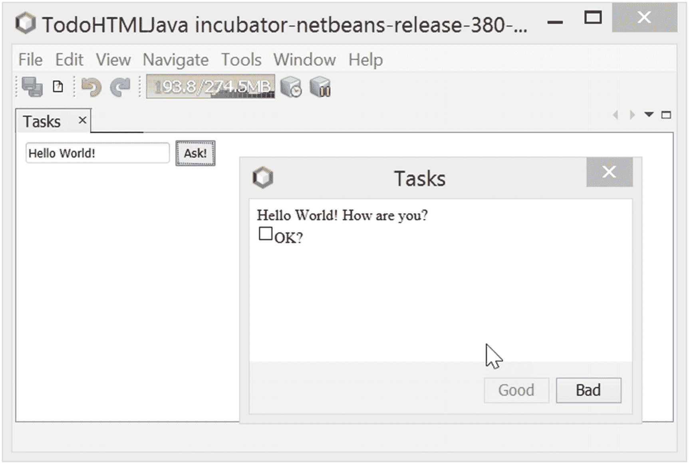

图 9-21

正在运行的示例应用程序

代码仅包含两个文件：

*   `TasksWindow.html`，它构建了应用程序的 UI，并包含 Java 类的绑定。

*   `TasksWindowCntrl.java`，它包含应用程序的控制器和模型（更具体地说是 *ViewModel* 和 *Model*）。

```

Ask!

How are you?

OK?

Good
Bad

清单 9-18
TasksWindow.html
```

这两个窗口是在 `<script>` 标签内定义的。`data-binds`（如果您熟悉 Knockout JS）将 UI 元素与后端 `TasksWindowCntrl.java` 绑定。清单 9-18 的第一行指示 UI 在 Java 文件中查找名为 `templateName()` 的方法。在清单 9-19 中，您可以看到定义的 `templateName()` 返回字符串 `"window"`，该字符串必须与 *html* 文件中 `<script type="text/html" id="window">` 的 `id` 匹配。

```
@Model(className = "TasksWindow", targetId = "", properties = {
@Property(name = "text", type = String.class)
})
public final class TasksWindowCntrl {
...
@ComputedProperty
static String templateName() {
return "window";
}
@ActionID(
category = "Tools",
id = "todo.view.TasksWindow"
)
@ActionReferences({
@ActionReference(path = "Menu/Tools"),
@ActionReference(path = "Toolbars/File"),})
@NbBundle.Messages("CTL_Tasks=Open HTML Hello World!")
@OpenHTMLRegistration(
url = "TasksWindow.html",
displayName = "#CTL_Tasks",
iconBase = "todo/controller/resources/icons/taskmrk_tsk.gif"
)
public static Tasks onPageLoad() {
return new TasksWindow("Hello World!").applyBindings();
}
清单 9-19
带有 @Model 定义的 TasksWindowCntrl 类
```

`TasksWindowCntrl` 类在工具栏和 *Tools* 菜单上定义了一个操作。该操作返回生成的 `TasksWindow` 类的一个新实例。`TasksWindow` 类由 `@Model` 注解定义。如清单 9-20 所示，它定义了一个名为 `"text"`、类型为 `String` 的属性，该属性绑定到 `<input data-bind="value: text"></input>`。因此，传递给 `TasksWindow` 构造函数的文本（`"Hello World!"`）会显示在该文本字段中。

```
"Hello World!" ➔ @Property(name = "text", type = String.class) ➔ 
清单 9-20
属性到 HTML 的绑定
```

必要的模型类是从注解生成的，从而节省了您手动输入的时间。

我们在前一章已经看到了 `@Model` 注解，它定义了一个代表某种模型的类，以及 `@Property`，它代表该类的属性。我们还看到了一个 `@ComputedProperty` 注解的示例。

`@Function` 注解响应用户界面的操作。例如，当用户点击 **Ask!** 按钮 `(<button data-bind="click: showDialog, enable: text">Ask!</button>)` 时，会调用以下函数（见清单 9-21）。

```
@Function
static void showDialog(TasksWindow model) {
String reply = Pages.showTasksWindowDialog(model.getText());
if ("OK".equals(reply)) {
model.setText("Happy World!");
} else {
model.setText("Sad World!");
}
}
清单 9-21
一个 @Function 示例
```

最后，`@HTMLDialog` 注解用于显示一个对话框（见图 9-21 和清单 9-22）。

```
@HTMLDialog(url = "TasksWindow.html")
static void showTasksWindowDialog (String t) {
new TasksWindowDialog (t, false).applyBindings();
}
清单 9-22
用于显示对话框的 @HTMLDialog
```


### TodoHTMLJava

让我们看看如何使用此 API 重建我们的 *ToDo* 应用 UI。由于 UI 是带有一些 Knockout 绑定的 HTML，我们可以使用任何 CSS 库来创建我们的 UI。

借助 Bootstrap CSS（[`https://getbootstrap.com/`](https://getbootstrap.com/)），我们构建了如图 9-22 和 9-23 所示的 UI。

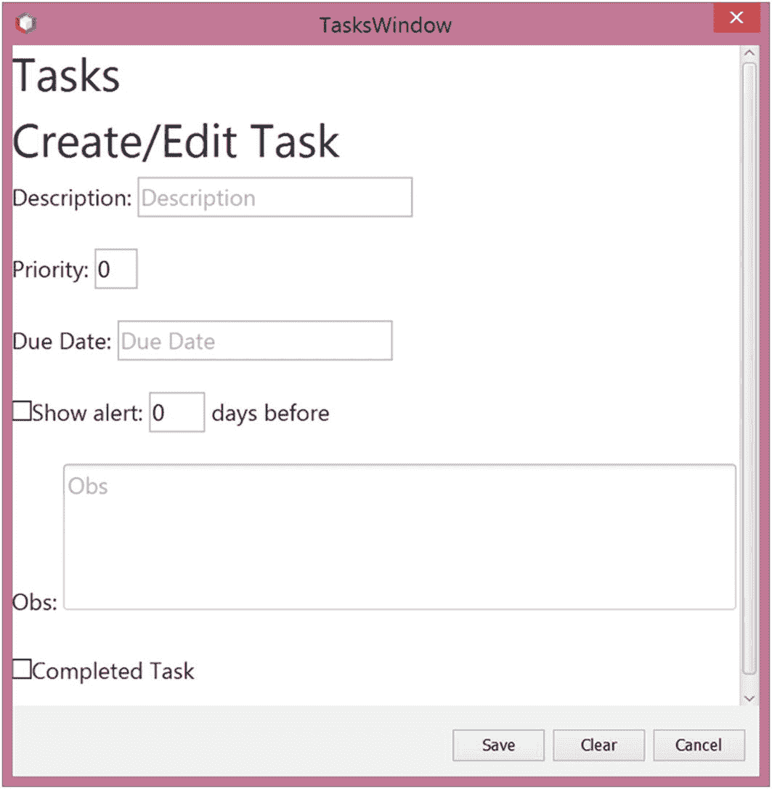

图 9-23
TodoHTMLJava 应用的创建/编辑任务对话框

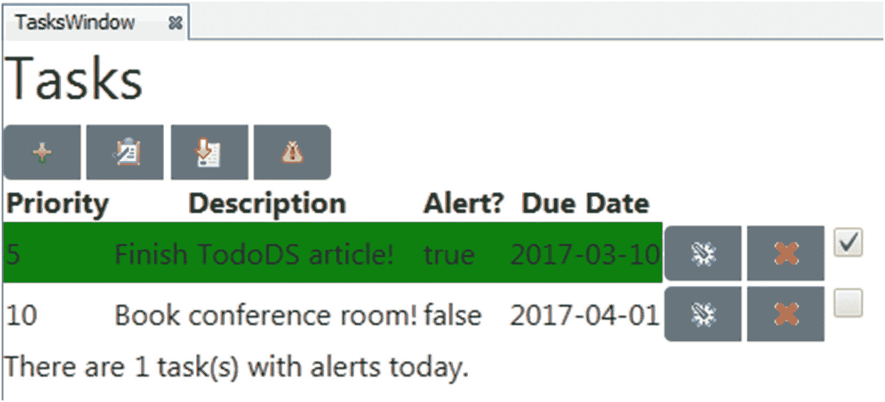

图 9-22
TodoHTMLJava 应用的任务窗口

我们需要在每个 `<script>` 标签内定义每个窗口，例如。

```

我们定义了三个窗口，其 id 分别为 `tasksWindow`（用于主任务窗口）、`editor`（用于编辑任务）和 `showAlertsDialog`（用于当用户点击相应按钮时，图 9-24 所示的对话框）。

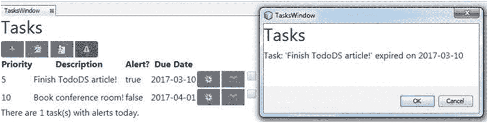

图 9-24
TodoHTMLJava 应用的警报对话框

接下来，我们需要定义我们的 *ViewModels* 并应用绑定。
在代码清单 9-23 中，我们定义了 `TasksWindow` 视图模型，它只包含一个类型为 `array` 的属性，即一个 `Task` 数组。

```
@Model(className = "TasksWindow", targetId = "", properties = {
@Property(name = "tasks", type = Task.class, array = true)
})
public final class TasksWindowCntrl {
...
@Model(className = "Task", targetId = "", properties = {
@Property(name = "id", type = int.class),
@Property(name = "description", type = String.class),
@Property(name = "priority", type = int.class),
@Property(name = "dueDate", type = String.class),
@Property(name = "alert", type = boolean.class),
@Property(name = "daysBefore", type = int.class),
@Property(name = "obs", type = String.class),
@Property(name = "completed", type = boolean.class)
})
public static class TaskModel {
...
}
...
}
代码清单 9-23
TaskWindow 视图模型
```

`Task` 视图模型在其自己的（嵌套）类中定义。现在你可以应用绑定（参见代码清单 9-24）。

```

...

代码清单 9-24
与视图模型的绑定
```

按钮通常绑定到 `@Function`：

```

@Function
static void showAlerts(TasksWindow model) {
String reply = Pages.showAlertsDialog(getExpiredTasks(model.getTasks()));
}
@HTMLDialog(url = "TasksWindow.html")
static void showAlertsDialog(String t) {
new ShowAlertsDialog(t).applyBindings();
}
@Model(className = "ShowAlertsDialog", targetId = "", properties = {
@Property(name = "text", type = String.class)})
static final class ShowAlertsDialogCntrl {
@ComputedProperty
static String templateName() {
return "showAlertsDialog";
}
}
代码清单 9-25
按钮绑定到 @Functions
```

代码清单 9-25 不仅展示了按钮如何绑定到 `showAlerts()` 函数，还展示了它如何调用 `showAlertsDialog()` 来显示一个对话框（`@HTMLDialog`），该对话框带有一个由 `getExpiredTasks()` 私有方法准备的、作为 `String` 传递到其 `text` 属性的、格式正确的 HTML 文本。
源代码可以在本书的仓库中找到。
你可能会发现这些相关文章很有用：*TodoKO*（[`http://wiki.netbeans.org/TodoKO`](http://wiki.netbeans.org/TodoKO)）和 *TodoDS*（[`http://wiki.netbeans.org/TodoDS`](http://wiki.netbeans.org/TodoDS)）。API 在此处（`http://137.254.56.27/html+java/1.6/index.html`）。*HTML UI API* 可在此处获取（[`https://bits.netbeans.org/10.0/javadoc/`](https://bits.netbeans.org/10.0/javadoc/)）。

总结
在本章中，我们通过开发 *TodoRCP*、*TodoFXRCP* 和 *TodoHTMLJava* 模块套件应用，应用了上一章学到的知识。它们都使用相同的模型，而 *视图* 则分别通过使用 *Explorer & Properties Sheets*、*JavaFX* 和 *HTML/Java UI* 来实现。
在下一章中，我们将看到一些在开发富客户端平台应用时可能会用到的额外 API。

脚注

10. 学习平台扩展功能

在本章中，我们将学习 NetBeans RCP 提供的一些可能对你的应用有用的额外功能：

*   **对话框** API，包括**向导** API
*   **可视化库**和**面板**
*   **状态栏**和**通知**
*   如何使用**进度条**
*   **快速搜索**和**输出**窗口
*   如何在**选项**窗口中定义和持久化你的应用设置
*   如何品牌化和分发你的应用

让我们开始吧。

对话框 API
*对话框 API* 类似于 `javax.swing.JOptionPane`，它让你能够以简单的方式创建和显示对话框及向导。你可以显示预定义的对话框、自定义对话框以及多步骤向导。
显示一个对话框需要两个步骤：创建一个 `NotifyDescriptor` 来配置对话框，以及一个 `DialogDisplayer` 来显示它。在使用之前，请添加对 *对话框 API* 模块的依赖。

预定义对话框

NetBeans 包含各种用于常见场景（例如向用户显示消息）的预定义对话框。代码清单 10-1 调用了一个显示消息并带有**确定**按钮的对话框。

```
NotifyDescriptor d = new NotifyDescriptor.Message("Message");
DialogDisplayer.getDefault().notify(d);
代码清单 10-1
使用对话框 API 显示消息对话框
```

结果如图 10-1 所示。代码清单 10-1 中的命令等同于 `JOptionPane.showMessageDialog(...)`。

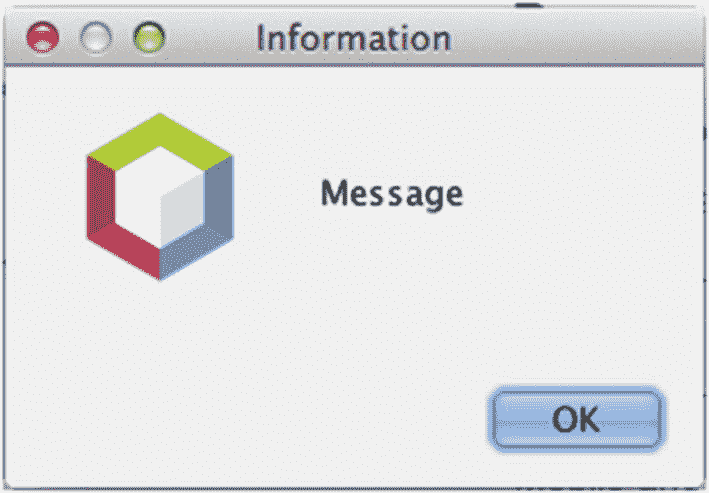

图 10-1
简单的信息消息对话框

另一方面，代码清单 10-2 显示了图 10-2 所示的确认对话框。

```
NotifyDescriptor d = new NotifyDescriptor.Confirmation(
"Message", "Title");
Object retVal = DialogDisplayer.getDefault().notify(d);
if (retVal == NotifyDescriptor.YES_OPTION) {
// 执行某些操作
}
代码清单 10-2
使用对话框 API 显示确认对话框
```

这些命令等同于 `JOptionPane.showConfirmDialog(...)`。

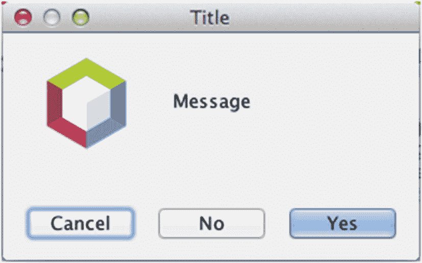

图 10-2
确认对话框

你可以将 `retVal` 与 `NotifyDescriptor` 的以下常量值进行比较：

*   `OK_OPTION`：点击了**确定**按钮。
*   `YES_OPTION`：点击了**是**按钮。
*   `NO_OPTION`：点击了**否**按钮。
*   `CANCEL_OPTION`：点击了**取消**按钮。
*   `CLOSED_OPTION`：对话框在未按下任何按钮的情况下关闭。

代码清单 10-3 显示了图 10-3 的输入对话框。

```
NotifyDescriptor d = new NotifyDescriptor.InputLine(
"Input:", "Title");
Object retVal = DialogDisplayer.getDefault().notify(d);
if (retVal == NotifyDescriptor.OK_OPTION) {
String text =
((NotifyDescriptor.InputLine) d).getInputText();
}
代码清单 10-3
使用对话框 API 显示输入对话框
```

这些命令等同于 `JOptionPane.showInputDialog(...)`。

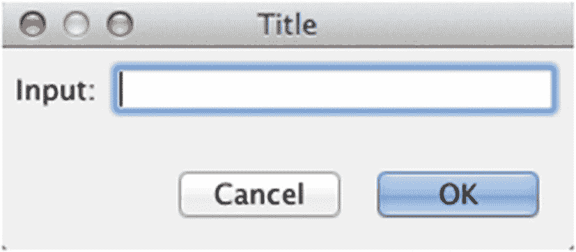

图 10-3
输入对话框

也可以使用 `NotifyDescriptor` 类来定义标准对话框的属性，如代码清单 10-4 所示。


```
NotifyDescriptor d = new NotifyDescriptor(
"Message", // 消息
"Title", // 标题
NotifyDescriptor. DEFAULT_OPTION, // 选项类型
NotifyDescriptor.ERROR_MESSAGE, // 消息类型
null, // 自定义按钮（作为 Object[]）
null); // 默认值
DialogDisplayer.getDefault().notify(d);
清单 10-4
使用 Dialogs API 显示错误对话框
```

结果如图 10-4 所示。这些命令等同于 `JOptionPane.showOptionDialog(...)`。

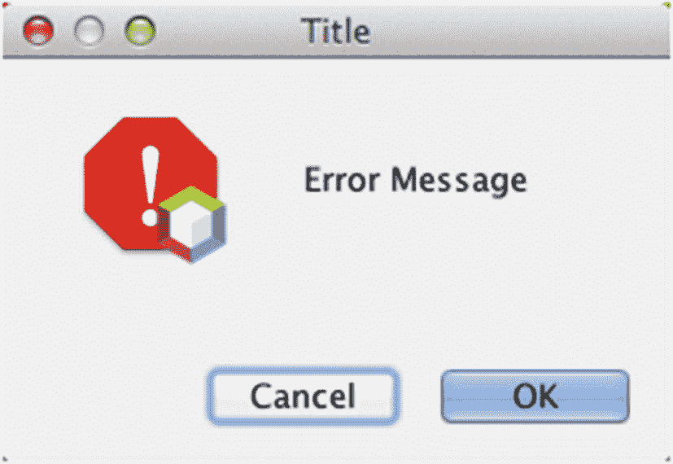

图 10-4
错误消息对话框

*选项类型*（第 3 个参数）可以取以下值之一：

*   `NotifyDescriptor.DEFAULT_OPTION`

*   `NotifyDescriptor.OK_CANCEL_OPTION`

*   `NotifyDescriptor.YES_NO_OPTION`

*   `NotifyDescriptor.YES_NO_CANCEL_OPTION`

*消息类型*（第 4 个参数）可以取以下值之一，你也可以将其作为第二个参数传递给清单 10-1 中描述的 `NotifyDescriptor.Message()`：

*   `NotifyDescriptor.PLAIN_MESSAGE`

*   `NotifyDescriptor.INFORMATION_MESSAGE`

*   `NotifyDescriptor.QUESTION_MESSAGE`

*   `NotifyDescriptor.WARNING_MESSAGE`

*   `NotifyDescriptor.ERROR_MESSAGE`

第 5 个参数可用于传入一个 `Object` 数组，以向对话框添加自定义按钮。可以使用类型为 `String`、`Component` 或 `Icon` 的数组。清单 10-5 提供了一个示例。

```
String[] buttons = new String[3];
buttons[0] = "Play";
buttons[1] = "Pause";
buttons[2] = "Stop";
NotifyDescriptor d = new NotifyDescriptor(
"Message", // 消息
"Title", // 标题
NotifyDescriptor.DEFAULT_OPTION, // 选项类型
NotifyDescriptor.PLAIN_MESSAGE, // 消息类型
buttons, // 自定义按钮（作为 Object[]）
"Play"); // 默认值
DialogDisplayer.getDefault().notify(d);
清单 10-5
使用 Dialogs API 显示带有自定义按钮的对话框
```

生成的对话框如图 10-5 所示。

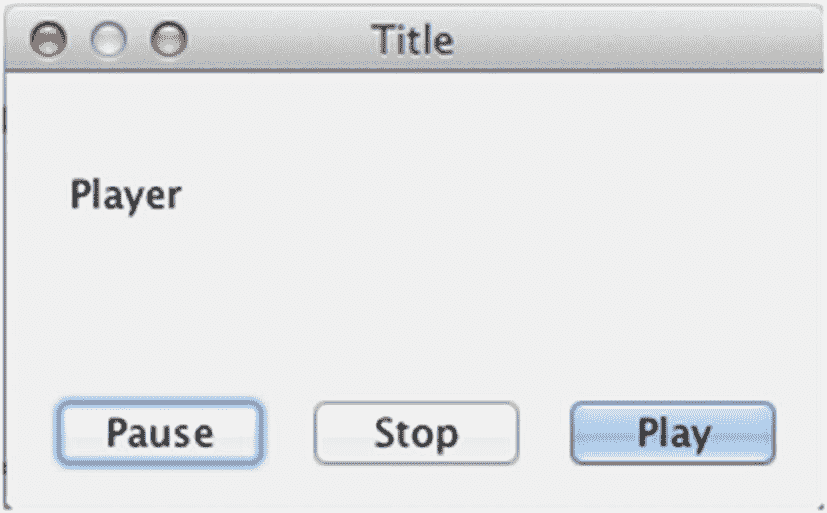

图 10-5
带有自定义按钮的对话框

作为练习，请将上一章 *TodoRCP* 应用程序中的 `JOptionPane` 实例替换为 *Dialogs API*。

自定义对话框

还可以通过扩展 `NotifyDescriptor` 的 `DialogDescriptor` 类来创建自定义对话框。清单 10-6 显示了一个示例，该示例显示了一个自定义的登录对话框（在 `LoginPanel JPanel` 类中设计）。

```
DialogDescriptor d = new DialogDescriptor(
new LoginPanel(), // 组件
"Login",          // 标题
true,             // 模态
null);            // ActionListener
DialogDisplayer.getDefault().createDialog(d).setVisible(true);
清单 10-6
使用 Dialogs API 显示自定义对话框
```

简而言之，你可以将任何类型的 `java.awt.Component` 作为第一个参数传递。例如，让我们通过提供一个 *Login* 对话框来扩展我们的 *TodoRCP* 应用程序，该对话框在应用程序启动时要求输入凭据，此时应用程序应被阻塞，直到用户通过身份验证。

保护访问

我们不希望任何人都能访问我们的任务。我们需要通过要求输入凭据来保护对 *TodoRCP* 应用程序的访问。以下是在应用程序启动时显示登录对话框的步骤：

1.  按照第 7 章所述创建一个新模块，确保将其添加到 *TodoRCP* 模块套件中。将模块命名为 *Login*，并将其*代码基名称*设置为 `todo.login`。

2.  如果尚未打开，请打开 *Login* 模块；右键单击 `todo.login` 包；从弹出菜单中选择 **新建 ➤ 其他** 以显示 *新建文件* 对话框；选择 *Swing GUI 窗体* 类别；然后选择 *JPanel 窗体* 文件类型。单击 **下一步**。

3.  在步骤 2 中，在 *类名* 字段中输入 `LoginPanel`，然后单击 **完成**。

4.  使用以下内容创建图 10-6 所示的登录表单：

*   用户名的标签：`lblUsername`

*   密码的标签：`lblPassword`

*   底部显示的错误消息标签（在图 10-6 中显示为红色矩形，但在你的表单上将是不可见的）：`lblInfo`

*   用户名的文本字段：`txtUsername`

*   密码的密码字段：`txtPassword`

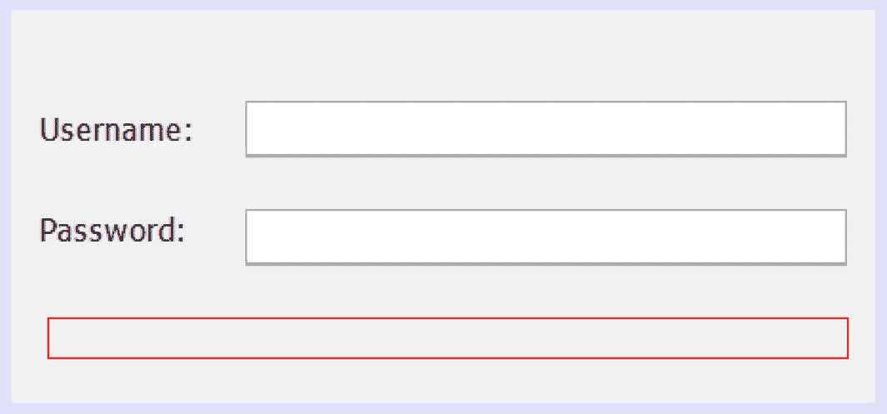

图 10-6
LoginPanel

1.  切换到编辑器窗口中的*源*视图，并在 `LoginPanel` 类的末尾添加清单 10-7 中的以下方法

1.  通过右键单击 `todo.login` 包并选择 **新建 ➤ 其他**，然后选择 *模块开发* 类别，再选择 *安装程序/激活器* 作为文件类型，创建一个新的模块安装程序。然后按照清单 10-8 所示完成代码。请注意，除了 `createDialog()` 之外，`DialogDisplayer` 还提供了 `notify()` 和 `notifyLater()`。后者允许在初始化阶段之后立即显示 `Dialog`，即在启动画面之后。

```
public String getUserName() {
return txtUsername.getText();
}
public char[] getPassword() {
return txtPassword.getPassword();
}
public void setInfo(String info) {
lblInfo.setText(info);
}
清单 10-7
LoginPanel 的访问方法
```

```
public class Installer extends ModuleInstall {
private LoginPanel loginPanel = new LoginPanel();
private DialogDescriptor d = null;
@Override
public void restored() {
d = new DialogDescriptor(loginPanel, "Login", true, this);
d.setClosingOptions(new Object[]{}); // 不可关闭
DialogDisplayer.getDefault().notifyLater(d);
}
清单 10-8
模块安装程序类允许在应用程序启动时显示登录对话框
```

`DialogDescriptor` 期望一个 `ActionListener` 作为构造函数的第四个参数。清单 10-9 显示了这样一个 `ActionListener` 的示例。

```
public class Installer extends ModuleInstall implements ActionListener {
//...
@Override
public void actionPerformed(ActionEvent e) {
if (e.getSource() == DialogDescriptor.CANCEL_OPTION) {
LifecycleManager.getDefault().exit();
} else if (!validate(loginPanel.getUserName(), loginPanel.getPassword())) {
loginPanel.setInfo("用户名或密码错误");
} else {
d.setClosingOptions(null);// 可以关闭
}
}
}
清单 10-9
模块安装程序 actionPerformed() 方法实现
```

`validate(String username, char[] password)` 方法在数据库中检查提供的凭据是否有效。你可以在本书的源代码中找到其实现。

如果你稍微操作一下登录对话框，你会注意到可以通过单击窗口的 **X** 关闭按钮来关闭登录窗口，从而绕过身份验证。我们可以通过将清单 10-10 中显示的代码添加到 `LoginPanel` 的构造函数中来修复此问题。

```
// 如果有人简单地使用 X 关闭按钮关闭对话框
d.addPropertyChangeListener(new PropertyChangeListener() {
@Override
public void propertyChange(PropertyChangeEvent e) {
if (e.getPropertyName().equals(DialogDescriptor.PROP_VALUE)
&& e.getNewValue() == DialogDescriptor.CLOSED_OPTION) {
LifecycleManager.getDefault().exit();
}
}
});
清单 10-10
禁止通过 X 关闭按钮关闭对话框
```

另一种方法是创建一个实现 `Runnable` 并使用 `@OnStart` 注解的 Java 类（这还需要依赖 *模块系统 API*）。清单 10-11 留给用户作为练习。


```
@OnStart
public class LoginInstaller implements Runnable, ActionListener {
private final LoginPanel loginPanel = new LoginPanel();
private DialogDescriptor d = null;
@Override
public void run() {
// 与 restored() 方法相同（清单 10-8）
}
// 此处放置清单 10-9、10-10 中的代码
}
清单 10-11
使用 @OnStart 注解的模块安装程序
```

向导
您已经通过从 IDE 的 **文件** 菜单创建新的 *文件* 或 *项目*，体验过如何使用 NetBeans 向导（或多窗格对话框）。好消息是，您可以使用 *Dialogs API* 为自己的项目创建自定义向导。此外，NetBeans 还提供了一个用于创建向导的向导。要使用它，请右键单击您的模块，选择 **新建 ➤ 其他**，然后选择 *模块开发* 类别，接着选择 *向导* 文件类型，并点击 **下一步**。

在向导的第二步（见图 10-7），您有多种选择。注册类型 **带 Swing UI 的新文件**、**带 HTML/Java UI 的新文件** 和 **带 HTML/JS UI 的新文件** 会将一个 *文件类型* 注册到应用程序的 **新建文件** 或 **新建项目** 对话框中，并置于您选择的 *类别* 下。*自定义* 注册类型则不会，它需要从代码中的某个位置（通常是从一个 `Action`）以编程方式调用。

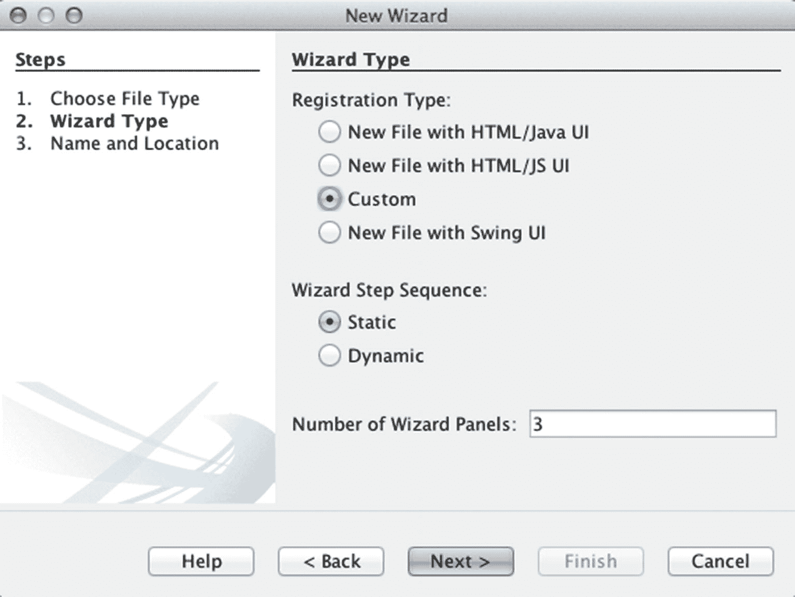

图 10-7
新建向导向导

对于自定义向导，您可以选择向导是按固定的、不变的线性顺序通过一系列独立步骤（*静态*），还是根据用户的选择*动态*地通过步骤（即，用户可以跳过某些步骤）。第一个选项生成的代码允许用户按顺序向前或向后浏览面板，而不会分支或跳过面板。第二个选项生成的代码默认让您完全控制面板的顺序，并允许创建动态的面板排序。

静态向导

首先，让我们创建一个包含三个面板的自定义静态向导。在 *向导类型* 对话框中点击 **下一步** 会进入 *名称和位置* 对话框。在第二步中将 *类名前缀* 设置为 `AddTask`，然后点击 **完成**。您最终会得到以下文件：

*   `AddTaskWizardAction`：
    用于调用向导的动作。您需要取消注释顶部的注解，才能将该动作注册到菜单或工具栏。清单 10-12 展示了这些注解。

*   在 `actionPerformed()` 方法的末尾，您需要收集所有数据并创建/更新您的模型。有关示例，请参见清单 10-13。

```
@ActionID(category="...",   id="todo.view.wizard.AddTaskWizardAction")
@ActionRegistration(displayName="打开 AddTask 向导")
@ActionReference(path="Menu/Tools", position=...)
清单 10-12
AddTaskWizardAction 的注解，已取消注释以将动作注册到菜单或工具栏
```

*   `AddTaskWizardPanel1`、`AddTaskWizardPanel2`、`AddTaskWizardPanel3`：`WizardDescriptor.Panel` 类负责控制每一步。它们检查输入值的有效性（通过 `isValid()` 方法），支持上下文相关帮助（通过 `getHelp()` 方法返回帮助上下文），并通过读取设置（`readSettings()` 方法）和存储设置（`storeSettings()` 方法，供用户下次访问此面板或其他面板时读取）来初始化可视化面板。通常，您会定义一个包含一些常量属性名称的接口，这些方法会将这些名称作为键来保存属性。如果向导面板的有效状态取决于用户输入，则该面板必须实现 `addChangeListener()` 和 `removeChangeListener()`，并向其 `ChangeListener` 触发状态更改事件。

*   `AddTaskVisualPanel1`、`AddTaskVisualPanel2`、`AddTaskVisualPanel3`：用于每一步可视化表示的 `JPanel`。

```
if (DialogDisplayer.getDefault().notify(wiz) ==
WizardDescriptor.FINISH_OPTION) {
TaskManagerInterface taskManager =
Lookup.getDefault().lookup(TaskManagerInterface.class);
if (taskManager != null) {
Task task = new Task(
wizardDescriptor.getProperty(AddTaskConstants.DESCRIPTION),
...);
taskManager.addTask(task);
}
}
清单 10-13
actionPerformed() 方法实现
```

您也可以使用 *简单验证 API*（`ide/modules/ext/ValidationAPI.jar`）进行验证。您需要将其包装到一个模块中（例如，在 *TodoRCP* 应用程序的 *库* 模块中），并将 `org.netbeans.validation.api` 设为公开。您还可以将 `ValidationPanel` 添加到面板中，以便在您的面板中使用它（借助 *面板管理器*）。该 API 提供了一些有用的验证器：`REQUIRE_NON_EMPTY_STRING`、`NO_WHITESPACE`、`REQUIRE_VALID_INTEGER`、`REQUIRE_NON_NEGATIVE_NUMBER`、`numberRange(minValue, maxValue)`、`EMAIL_ADDRESS`、`FILE_MUST_EXIST`、`URL_MUST_BE_VALID`、`REQUIRE_JAVA_IDENTIFIER`、`REQUIRE_VALID_FILENAME`。如果您对它们不满意，也可以创建自己的验证器。一旦您将 `ValidationPanel` 拖放到您的 `JPanel` 上，就可以通过调用 `group = validationPanel1.getValidationGroup()` 然后调用 `group.add()` 添加一个或多个上述验证器，在那里验证输入（而*不是*在 `WizardDescriptor.Panel` 中）。

动态向导

对于动态向导，会创建一个 `AddTaskWizardIterator`（类型为 `WizardDescriptor.Iterator`），而不是 `AddTaskWizardAction`（清单 10-14）。

```
public final class AddTaskWizardIterator implements WizardDescriptor.Iterator {
// 调用此向导的示例：
// @ActionID(category="...", id="...")
// @ActionRegistration(displayName="...")
// @ActionReference(path="Menu/...")
// public static ActionListener run() {
//   return new ActionListener() {
//     @Override public void actionPerformed(ActionEvent e) {
清单 10-14
一个动态向导
```

导航通过以下方法（清单 10-15）完成，这些方法相应地更新 `index`：`current()`、`hasNext()`、`hasPrevious()`、`nextPanel()`、`previousPanel()`。如前所述，**带 Swing UI 的新文件** 选项会将向导注册到文件类型。

```
@TemplateRegistration(
folder = "Other",
displayName = "#AddTaskWizardIterator_displayName",
iconBase = "todo/view/wizard/file/addtsk_tsk.gif",
description = "addTask.html")
@Messages("AddTaskWizardIterator_displayName=创建新任务")
public final class AddTaskWizardIterator implements WizardDescriptor.InstantiatingIterator {
清单 10-15
将动态向导注册到文件类型
```


在执行过程中，可以在 **文件 ➤ 新建** 对话框向导的 *其他* 类别中找到执行上述向导的入口。要将你之前创建的动态向导注册到 **文件 ➤ 项目** 对话框向导的某个类别中，请输入，例如，`folder = "Projects/Other"`。除了 `InstantiatingIterator`，`AddTaskWizardIterator` 也可以继承 `AsynchronousInstantiatingIterator`（`instantiate()` 方法在 *EDT* 之外被调用）、`BackgroundInstantiatingIterator`（向导关闭，`instantiate()` 方法在后台线程中被调用）或 `ProgressInstantiatingIterator`（`instantiate()` 方法在 *EDT* 之外被调用，并且会传入一个 `ProgressHandle` 以在进度条中显示其进度，这将在本章后面描述）。
`WizardPanel`，除了 `WizardDescriptor.Panel`，也可以继承 `WizardDescriptor.ValidatingPanel`（用于在点击 **下一步** 或 **完成** 按钮时进行额外验证）、`WizardDescriptor.AsynchronousValidatingPanel`（用于异步验证）、`WizardDescriptor.ExtendedAsynchronousValidatingPanel`（优先于 `AsynchronousValidatingPanel`）或 `WizardDescriptor.FinishablePanel`（当 **完成** 按钮需要动态启用时；这允许用户在最后一步之前点击 **完成** 按钮，例如，因为他/她接受了后续步骤的默认值）。

向导的其他属性

使用自定义向导时，你可以使用 `WizardDescriptor` 的一些属性：

*   `PROP_AUTO_WIZARD_STYLE`：
    设置为 `true` 以启用其他属性的使用。

*   `PROP_CONTENT_BACK_COLOR`：
    设置左侧窗格的背景颜色。

*   `PROP_CONTENT_DATA`：
    设置内容项的数组。

*   `PROP_CONTENT_DISPLAYED`：
    设置为 `true` 以显示左侧窗格。

*   `PROP_CONTENT_FOREGROUND_COLOR`：
    设置左侧窗格的前景颜色。

*   `PROP_CONTENT_NUMBERED`：
    设置为 `true` 以在左侧窗格中显示编号。

*   `PROP_CONTENT_SELECTED_INDEX`：
    表示将被高亮显示的左侧窗格的索引。

*   `PROP_ERROR_MESSAGE`：
    显示在向导底部的错误消息。当存在错误时，向导的 **下一步** 按钮将被禁用。

*   `PROP_IMAGE`：设置要在左侧窗格中显示的图像。

*   `PROP_IMAGE_ALIGNMENT`：
    设置图像的对齐方式。

最后，关于图 10-7 中显示的其他两个选项，请查阅 [`http://wiki.netbeans.org/HtmlUIForTemplates`](http://wiki.netbeans.org/HtmlUIForTemplates) 上的文档。
作为练习，为 `AddTask` 操作构建一个自定义静态向导。该向导将包含三个步骤，第一个面板将询问任务的*描述*和*优先级*（描述是必填项）；第二个面板询问*截止日期*、*提醒*和*提前天数*；第三个面板询问*备注*以及任务是否*完成*。也尝试为 *TodoFXRCP* 应用程序创建相同的向导。提示！使用 `JFXPanel` 代替 `JPanel`。
作为另一个练习，使用 **使用 HTML/Java UI 新建文件** 向导为 *TodoHTMLJava* 应用程序创建一个用于添加新任务的向导。

其他内容
这里我们描述一些你可能在你的项目中会用到 NetBeans 平台 API。

状态栏

在上一章的清单 9-2 中，我们看到了如何通过注册到 `StatusLineElementProvider` 服务提供者接口来在状态栏中显示消息。如果你想显示简单的文本，请使用清单 10-16 中的命令。

```
StatusDisplayer.getDefault().setStatusText("状态消息").
清单 10-16
在状态栏中显示一条消息
```

通知

NetBeans 平台提供了一种在状态栏最右侧显示气球形状弹出窗口的机制。为此目的使用 `NotificationDisplayer`，它需要依赖 *UI 工具* 模块。清单 10-17 提供了自定义气球的各种可能性。

```
NotificationDisplayer.getDefault().notify(String title, Icon icon, String detailsText, ActionListener detailsAction);
NotificationDisplayer.getDefault().notify(String title, Icon icon, String detailsText, ActionListener detailsAction, Priority priority);
NotificationDisplayer.getDefault().notify(String title, Icon icon, JComponent balloonDetails, JComponent popupDetails, Priority priority);
NotificationDisplayer.getDefault().notify();
清单 10-17
在状态栏中显示一个气球形状的弹出窗口
```

你也可以在气球中包含一个图标。一个添加警报  图标的示例如清单 10-18 所示。

```
NotificationDisplayer.getDefault().notify(
"警报 1",
ImageUtilities.loadImageIcon("todo/view/illegal.png", false),
"警报详情 1",
null);
清单 10-18
在状态栏中显示一个带有图标的气球形状弹出窗口
```

作为练习，修改 *TodoRCP* 以在启动时将警报显示为通知，而不是 `JOptionPane` 消息（见图 10-8）。

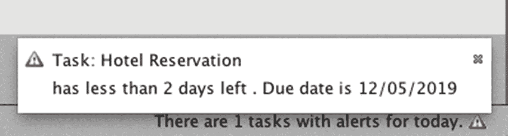

图 10-8
通知

如果 `ActionListener` 不是 `null`，则会显示一个超链接，点击该链接将执行该操作。`Priority` 可以是：`HIGH`、`NORMAL`、`LOW` 或 `SILENT`。

ImageUtilities
`org.openide.util.ImageUtilities`
是一个工具类，提供了用于操作和转换图像及图标的静态方法。结果会被缓存。有用的方法包括 `loadImage()`、`loadImageIcon()`、`icon2Image()`、`image2Icon`、`mergeImages()` 等。我们在清单 10-18 中看到了一个示例。

快速搜索

通常，在工具栏的右上角会显示一个搜索字段（见图 10-9）。`QuickSearch` 框会搜索你在其文本框中输入的关键字。

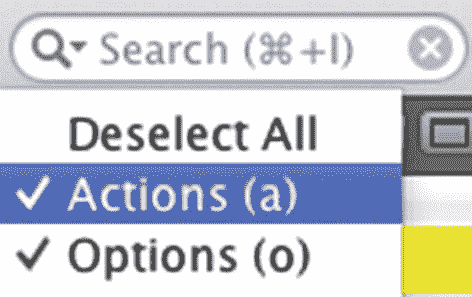

图 10-9
工具栏中的快速搜索

如果搜索字段没有自动显示，那么你需要在 `layer.xml` 中包含清单 10-19 中所示的 XML 标签：

```

清单 10-19
在 layer.xml 中添加 XML 标签以在工具栏中显示快速搜索字段
```

你可以选择在菜单栏而不是工具栏中显示快速搜索。这样做时，最佳实践是包含一个分隔符，以确保搜索字段在菜单栏中右对齐。你可以通过将清单 10-20 中的代码添加到你的 `layer.xml` 文件中来实现这些操作。

```

清单 10-20
在菜单栏而不是工具栏中显示快速搜索
```

要在 Mac OSX 的菜单上显示快速搜索，你需要从平台集群中排除 *Apple 应用程序菜单* 模块（右键单击 *TodoRCP* 模块套件，选择 **属性**，然后选择 *库* 类别，如图 10-10 所示），以便不使用 Apple 菜单栏。

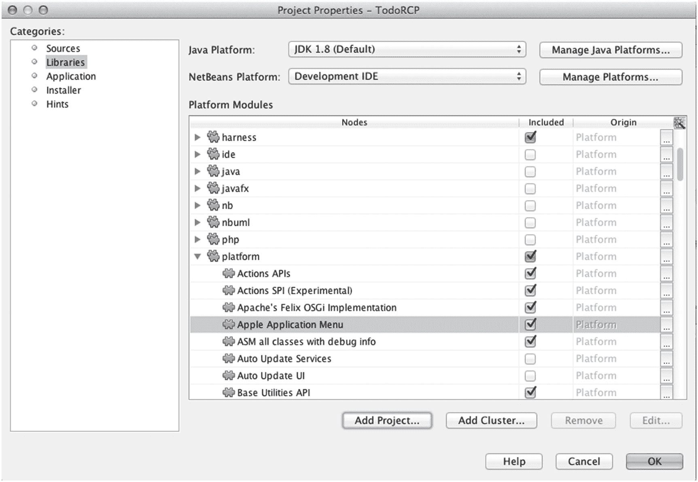

图 10-10
从平台集群中移除 Apple 应用程序菜单模块


如果你需要将快速搜索过滤器工具添加到自己的面板/工具栏中，可以按照以下技巧操作：[`http://layerxml.wordpress.com/2011/02/16/place-the-quicksearch-component-anywhere-you-like/`](http://layerxml.wordpress.com/2011/02/16/place-the-quicksearch-component-anywhere-you-like/) 以及 [`https://blogs.oracle.com/geertjan/place-the-quicksearch-component-anywhere-you-like-part-2`](https://blogs.oracle.com/geertjan/place-the-quicksearch-component-anywhere-you-like-part-2)。

你可以搜索操作，但如何搜索任务呢？答案是按照以下步骤操作：

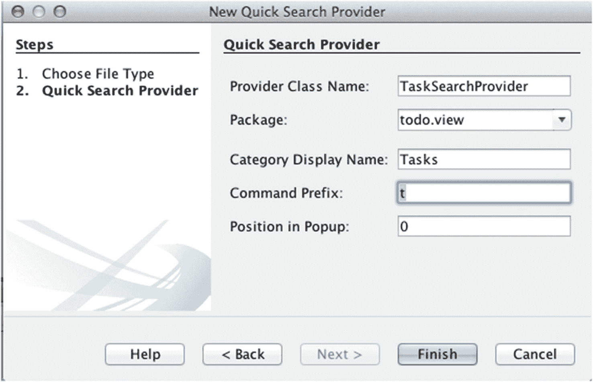

图 10-12
新建快速搜索提供程序向导（第 2 步）

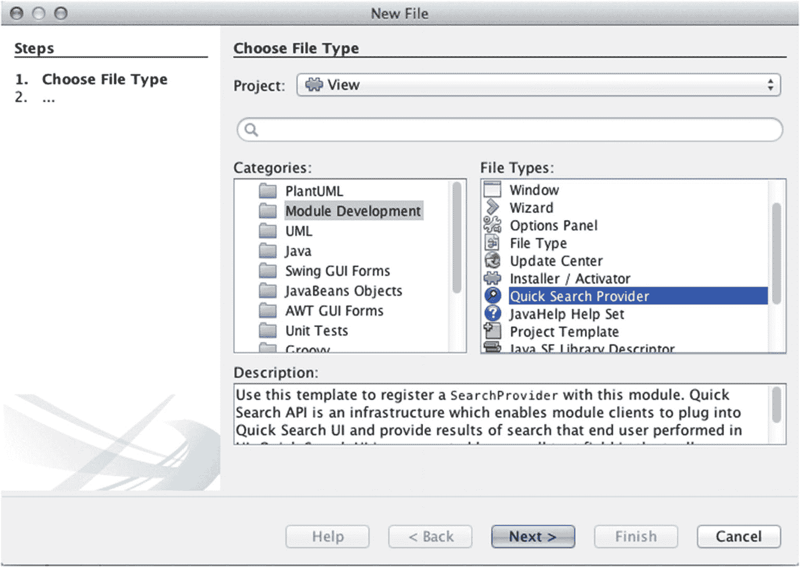

图 10-11
新建快速搜索提供程序向导（第 1 步）

1.  右键单击 *View* 模块，然后选择 **新建 ➤ 其他**。

2.  在 *新建文件* 对话框中，选择 **模块开发 ➤ 快速搜索提供程序**（见图 10-11），然后单击 **下一步**。

3.  在快速搜索提供程序面板中，设置提供程序类名等（见图 10-12）。

4.  单击 **完成**。

该向导将创建清单 10-21 中所示的存根。

```
package todo.view;
import org.netbeans.spi.quicksearch.SearchProvider;
import org.netbeans.spi.quicksearch.SearchRequest;
import org.netbeans.spi.quicksearch.SearchResponse;
public class TaskSearchProvider implements SearchProvider {
@Override
public void evaluate(SearchRequest request, SearchResponse response) {
// 示例代码
// for (SearchedItem item : getAllItemsToSearchIn()) {
//     if (isConditionSatisfied(item, request)) {
//         if (!response.addResult(item.getRunnable(), item.getDisplayName(),
//         item.getShortcut(), item.getDisplayHint())) {
//         break;
//     }
//     }
// }
}
}
清单 10-21
由快速搜索提供程序向导生成的 TaskSearchProvider
```

`SearchRequest` 类提供了快速搜索请求的描述。方法 `getText()` 和 `getShortcut()` 允许你访问在搜索字段中输入的文本和快捷键。通常，在搜索字段中输入的文本会与 `Lookup` 中的对象进行匹配。匹配成功后，该对象会被添加到 `SearchResponse` 中，`SearchResponse` 是用于收集 `SearchRequest` 结果并将其显示在搜索字段下拉列表中的响应对象。

例如，清单 10-22 提供了一个 `SearchProvider` 的实现，该实现会查找 `TasksTopComponent` 中的所有 `Node`，然后在其 `Lookup` 中搜索 `Task` 对象。

```
@Override
public void evaluate(final SearchRequest request, final SearchResponse response) {
SwingUtilities.invokeLater(new Runnable() {
@Override
public void run() {
TopComponent tc = WindowManager.getDefault().findTopComponent("TasksTopComponent");
final ExplorerManager em = ((ExplorerManager.Provider) tc).getExplorerManager();
Node root = em.getRootContext();
for (final Node node : root.getChildren().getNodes()) {
Task task = node.getLookup().lookup(Task.class);
if (accept(task, request)) {
response.addResult(new Runnable() {
@Override
public void run() {
try {
em.setSelectedNodes(new Node[]{node});
} catch (PropertyVetoException ex) {
Exceptions.printStackTrace(ex);
}
}
}, task.getDescription());
}
}
}
});
}
private boolean accept(Task task, SearchRequest request) {
return task != null && task.getDescription().contains(request.getText());
}
清单 10-22
SearchProvider 的示例实现
```

该向导还会创建清单 10-23 中所示的代码，并将该代码放入 `layer.xml` 中。

```

清单 10-23
从快速搜索提供程序向导在 layer.xml 中生成的 QuickSearch 文件夹
```

不要将 QuickSearch 与 *QuickFilter* 混淆。请查看源代码包中的 `ShowCompletedTasksAction` 实现，了解如何过滤 `OutlineView`（另请参阅 [*https://jnkjava.wordpress.com/2014/02/26/recipe-9-how-to-filter-an-outlineview/*](https://jnkjava.wordpress.com/2014/02/26/recipe-9-how-to-filter-an-outlineview/)）。你也可以按照此博客中描述的说明添加自己的自定义快速过滤器，以过滤 `OutlineView`（[`https://jnkjava.wordpress.com/2015/02/01/recipe-14-how-to-add-a-quick-filter/`](https://jnkjava.wordpress.com/2015/02/01/recipe-14-how-to-add-a-quick-filter/)）。

输出窗口
*输出窗口* 是一个显示区域，通常位于 NetBeans IDE 窗口的底部，用于向用户显示消息（见图 10-13）。来自多个来源的消息可以同时显示在不同的选项卡中。

要在你的应用程序中使用 *输出窗口*，请添加对 *I/O API and SPI* 模块的依赖。清单 10-24 显示了一个用例示例。

```
InputOutput io = IOProvider.getDefault().getIO("Hello World!", true);
io.show();   // 如果输出窗口未打开，则显示它
try (OutputWriter writer = io.getOut()) {
writer.println("This is a message.");
}
清单 10-24
输出窗口代码示例
```

将 `true` 作为第二个参数传递给 `IOProvider.getDefault().getIO()` 可确保每次调用都在 *输出窗口* 中创建一个新选项卡。传递 `false` 则将输出写入同一选项卡。`InputOutput.show()` 确保在 *输出窗口* 关闭时将其打开。

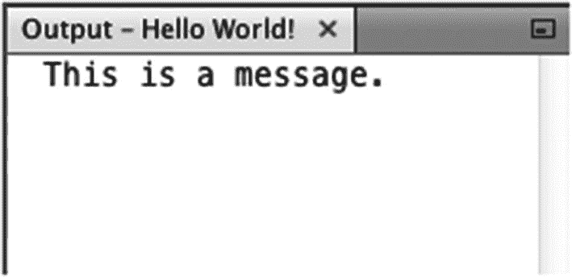

图 10-13
输出窗口

设置

NetBeans IDE 提供了 *选项* 窗口（菜单 **工具 ➤ 选项** 或在 MacOS 上为 **NetBeans ➤ 偏好设置**），允许用户对其进行自定义（见图 10-14）。

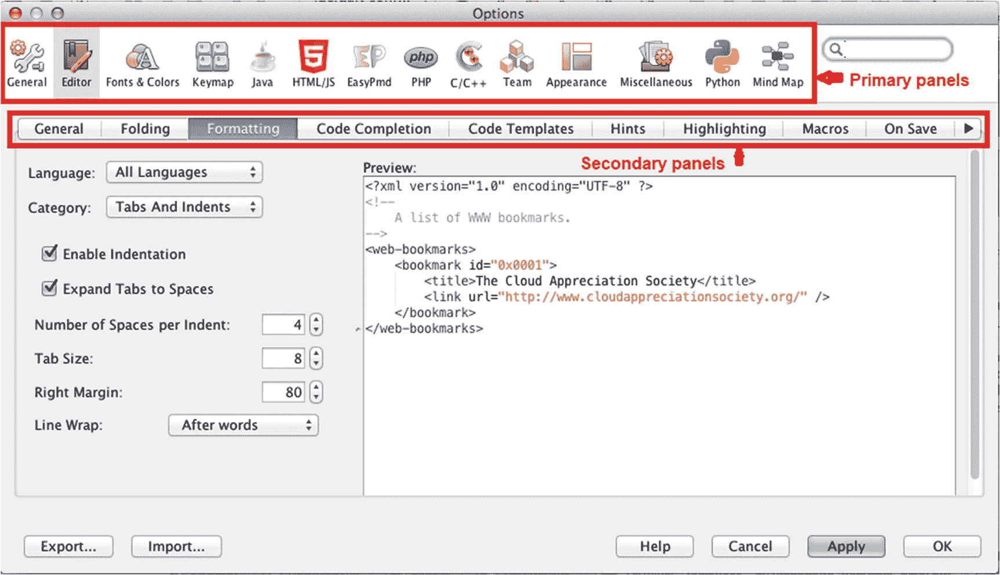

图 10-14
选项窗口

如图 10-14 所示，有 *主面板*（例如 *常规*、*杂项*）和 *次面板*（例如 *格式*、*提示* 等）。主面板可用于配置应用程序中最重要的设置分组。次面板可用于配置应用程序所需的不太重要的设置。你还可以使用 *选项* 窗口左下角的两个相应按钮导出和导入你的设置。

Apache NetBeans 平台的 *选项对话框 API 和 SPI* 允许模块自定义选项窗口。要使用此 API，请右键单击你的模块，然后选择 **新建 ➤ 其他**。选择 *模块开发* 类别和 *选项面板* 文件类型。在下一步中，在主面板和次面板之间进行选择（见图 10-15）。关键字使用户能够像我们之前学到的那样，从 *快速搜索字段* 快速打开 *选项* 窗口。

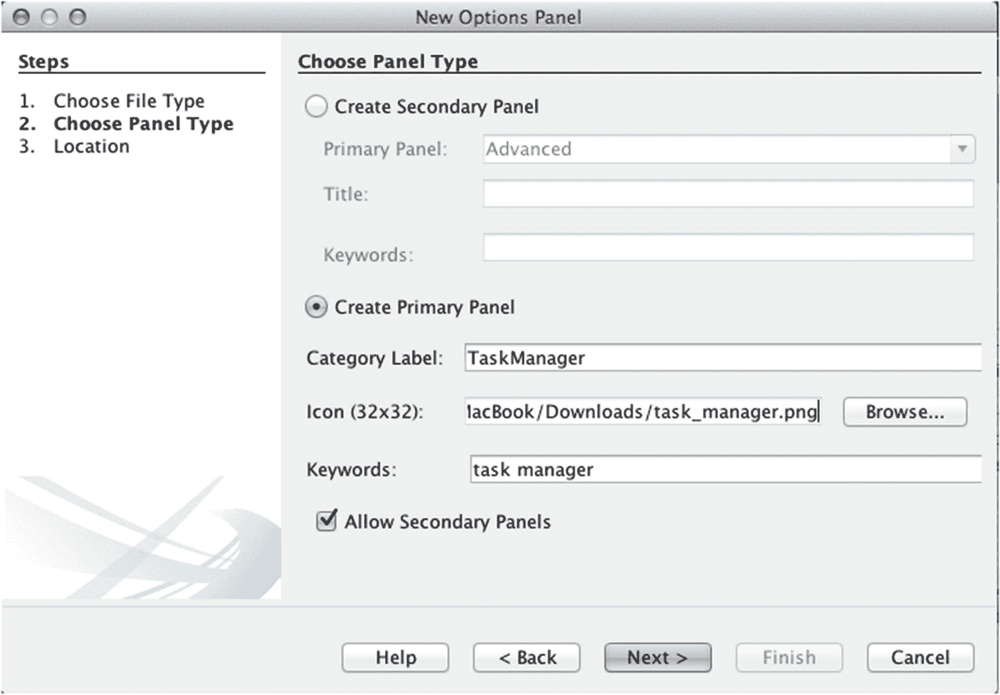

图 10-15
新建选项面板向导

对于主面板，该向导将创建一个 `package-info.java` 文件，其内容如清单 10-25 所示。

```
@OptionsPanelController.ContainerRegistration(
id = "TaskManager",
categoryName = "#OptionsCategory_Name_TaskManager",
iconBase = "todo/view/task_manager.png",
keywords = "#OptionsCategory_Keywords_TaskManager",
keywordsCategory = "TaskManager")
@NbBundle.Messages(
value = {"OptionsCategory_Name_TaskManager=TaskManager", "OptionsCategory_Keywords_TaskManager=task manager"})
package todo.view;
import org.netbeans.spi.options.OptionsPanelController;
import org.openide.util.NbBundle;
清单 10-25
package-info.java 内容
```


对于辅助面板，向导将创建一个带有注解的 `Controller` 类（如清单 10-26 所示），并为您创建一个 `JPanel`。

```
@OptionsPanelController.SubRegistration(
location = "TaskManager",
displayName = "#AdvancedOption_DisplayName_Tasks",
keywords = "#AdvancedOption_Keywords_Tasks",
keywordsCategory = "TaskManager/Tasks"
)
@org.openide.util.NbBundle.Messages(
{"AdvancedOption_DisplayName_Tasks=Tasks", "AdvancedOption_Keywords_Tasks=task"})
public final class TasksOptionsPanelController extends OptionsPanelController {
...
清单 10-26
辅助面板的 TasksOptionsPanelController
```

您在此面板中设置的任何内容都会借助 `org.openide.util.NbPreferences` 类持久化（存储）到 NetBeans Platform 用户目录中，以便下次打开应用程序时可用。您可以通过显示*关于*对话框（从 **帮助 ➤ 关于** 或 **NetBeans ➤ 关于 NetBeans**（在 MacOS 中））并查看*用户目录*条目（见图 10-16）来轻松定位 NetBeans Platform 用户目录。

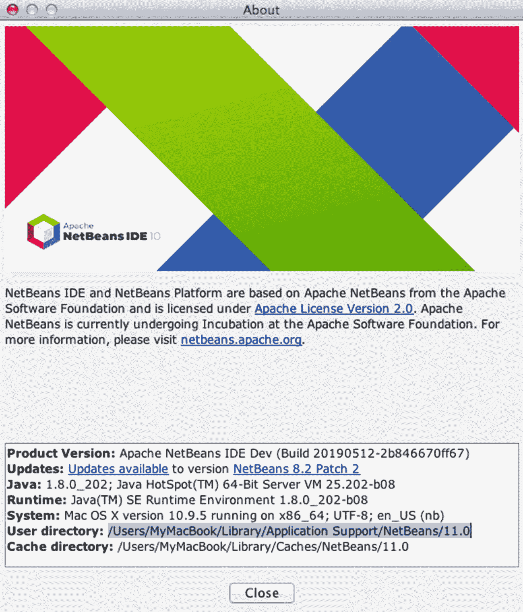

图 10-16
关于 NetBeans 对话框

进度
通常情况下，在处理大量数据时，其计算和显示可能会花费用户一些明显的时间。例如，从文件系统或数据库检索数据，顺利时也可能需要几秒钟。根据良好的*用户体验*原则，应该向用户提供一些关于长时间任务进度的视觉反馈。
例如，在*事件分发线程 (EDT)* 中同步创建子元素的 `Node` 展开操作会冻结 UI。在此期间，不会执行任何 UI 更新，用户手势也会被忽略，导致 UI 在整个过程中无法使用。这就是为什么创建子元素要在不同的线程中完成。同时，您应该通知用户子元素正在创建并即将显示。在此期间，通常会显示一个等待光标和一条状态消息。
在第 8 章中，我们了解了 `ChildFactory` 类如何支持异步创建子元素（通过将 `true` 作为 `Children.create()` 方法的第二个参数传递）。
默认情况下，NetBeans Platform 状态栏集成了一个进度条。当您处理长时间运行的任务时，可以接入该进度条，让用户可视化单个或多个任务的进度。
要接入进度条，您需要添加对*进度 API* 的依赖。`ProgressHandleFactory` 创建 `ProgressHandle` 对象，这些对象显示进度，并且可选地允许用户取消进度显示。进度可以以确定或不确定的运行时间显示。

例如，清单 10-27 中的代码片段可以在 `TaskChildFactory` 的 `createKeys()` 方法中使用，以显示在 *TodoRCP* 应用程序的 `OutineView` 中加载和显示大量任务的进度。

```
ProgressHandle handle = ProgressHandleFactory.creatHandle("Tasks progress");
handle.start(100);    // 100 个百分位，即 0-100
...
handle.progress(25);
...
handle.progress(50);
...
handle.progress(75);
...
handle.finish();
清单 10-27
显示加载大量任务进度的示例
```

要处理跨多个模块的长时间任务，请使用 API（[`http://bits.netbeans.org/dev/javadoc/org-netbeans-api-progress/index.html`](http://bits.netbeans.org/dev/javadoc/org-netbeans-api-progress/index.html)）中描述的 `ProgressContributor`。

可视化库
*可视化库*用于在*场景*上显示可选择、可移动和可更改的图形组件（称为*小部件*）。可视化库基于 Java2D，并使用轻量级窗口系统，因此它可以与 Swing、JavaFX 等一起使用。
可视化库通常与*组件面板*结合使用，后者允许将项目拖放到组件（如*场景*）上。为了激发您的兴趣，您可以通过探索可视化库示例（[`https://platform.netbeans.org/graph/examples.html`](https://platform.netbeans.org/graph/examples.html)）来开始您的冒险，以了解该库的功能，并查看一些实际使用它的教程和真实应用程序（[`https://platform.netbeans.org/graph/`](https://platform.netbeans.org/graph/)）。
在您的项目中使用可视化库之前，您需要从 *platform* 集群添加*可视化库 API*，该集群默认情况下未添加。您可以通过右键单击模块套件并选择**属性**来执行此操作，如前文图 10-10 所述和所示。
可视化库的主要类将在以下小节中描述。

小部件

小部件是可用于绘制图形的轻量级图形组件。如图 10-17 所示，`Widget` 遵循*组合设计模式*（小部件包含小部件），并且各种小部件被组织成树形层次结构。

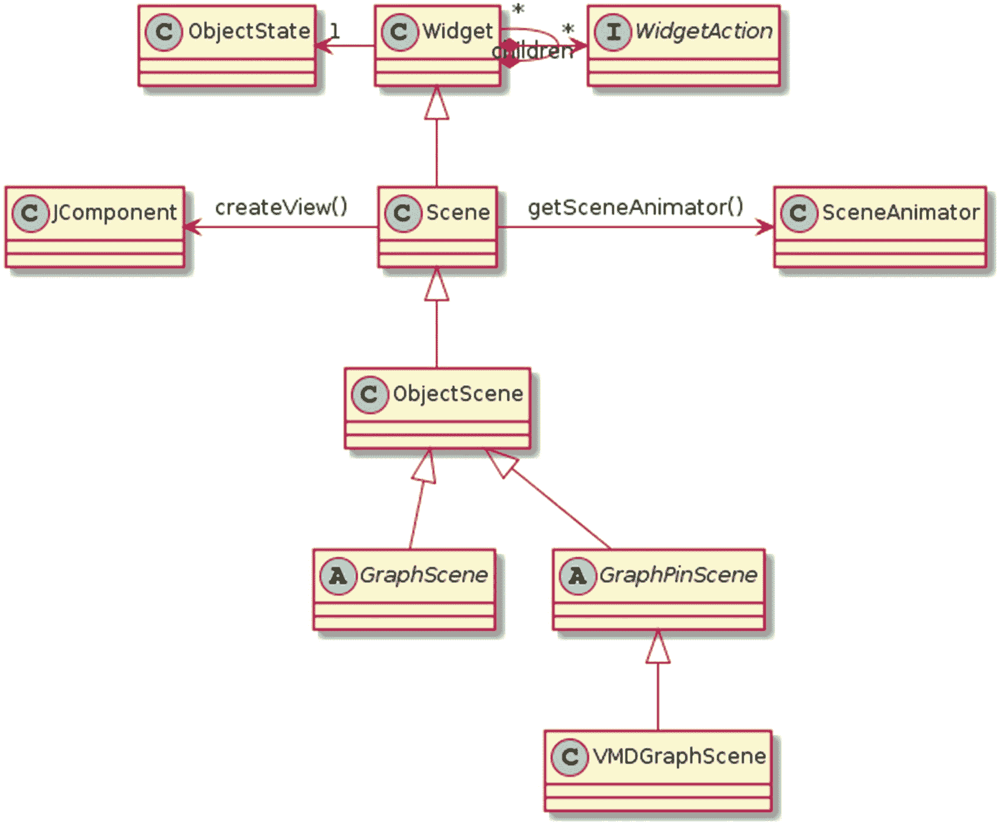

图 10-17
可视化库类图

可视化库提供了多种 `Widget` 实现（见图 10-18），每种实现都包含了由可自定义操作、边框和布局组成的预定义行为。`Widget` 被排列并显示在 `Scene` 中，`Scene` 也有多种实现（见图 10-17）。

小部件具有高效的验证和重绘机制。一个小部件（如图 10-17 所示）还具有一个*状态*，该状态可以取以下几个值之一：*已选中、高亮显示*（也称为*辅助选择*）、*对象悬停、小部件悬停、小部件瞄准*。

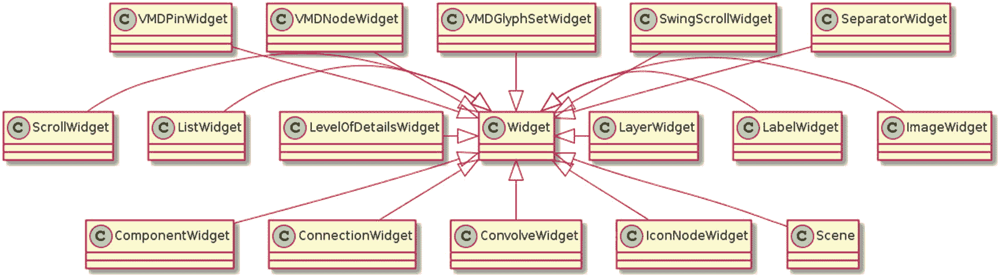

图 10-18
小部件实现

最后，`Widget` 有一个 `Lookup`，可用于向其中添加对象。清单 10-28 提供了在 `Widget` 中使用 `Lookup` 的示例。

```
class MyWidget extends LabelWidget {
private Lookup lookup;
private InstanceContent ic;
public MyWidget(Scene scene) {
super(scene);
ic = new InstanceContent();
}
@Override
public Lookup getLookup() {
if (lookup == null) {
lookup = new AbstractLookup(ic);
}
return lookup;
}
清单 10-28
一个带有 Lookup 以存储模型对象的 Widget
```

这个 `Lookup` 通常由包含可视化组件的 `TopComponent` 代理，而 `TopComponent` 又由 `Utilities.actionsGlobalContext()` 代理，正如我们在前几章中学到的那样。

场景
`Scene`（见图 10-17 和 10-18）也是一种 `Widget`。它是一个顶级 `Widget`（树形层次结构的*根*元素），包含其他 `Widget`。它通常显示在 Swing 组件中，例如 `JScrollPane`。如图 10-17 所示，有各种类型的 `Scene`。例如，`ObjectScene` 将 `Widget` 映射到数据对象。`GraphScene`、`GraphPinScene` 和 `VMDGraphScene`（*VMD* 代表*可视化移动设计器*）用于简化图形的创建。


要创建一个`Scene`并向其中添加`Widget`，通常需要遵循清单 10-29 中所示的步骤。

```
public class TaskViewerTopComponent extends TopComponent {
public TaskViewerTopComponent() {
setLayout(new BorderLayout());
Scene scene = new Scene();
LayerWidget mainLayer = new LayerWidget(scene);
LabelWidget labelWidget =
new LabelWidget(scene, "ATask");
mainLayer.addChild(labelWidget);
scene.addChild(mainLayer);
add(new JScrollPane(scene.createView()), BorderLayout.CENTER);
}
}
清单 10-29
创建 Scene 的步骤
```

通过 `createView()` 或 `createSatelliteView()` 方法，你可以创建一个可嵌入任何 Swing 容器的 `JComponent`。类似地，使用 `getSceneAnimator()` 方法，你可以创建一个 `SceneAnimator`（其中包含一些内置动画）。`LayerWidget` 的作用类似于 `JGlassPane`，通常用作其他 widget 的容器。

ConnectionWidget
`ConnectionWidget` 表示两个位置之间的连接。这些位置由 `Anchor` 解析（见图 10-19）。连接的路径由*控制点*指定，这些控制点由 `Router` 解析（见图 10-20）。

支持多种锚点类型（由 `AnchorFactory` 创建）：中心锚点、圆形锚点、方向锚点、固定锚点或矩形锚点。`Router`（由 `RouterFactory` 创建）可以是正交的、直接的或自由的（默认使用 `DirectRouter`）。

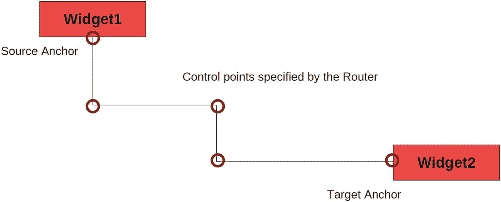

图 10-20
带有控制点的 ConnectionWidget 示例

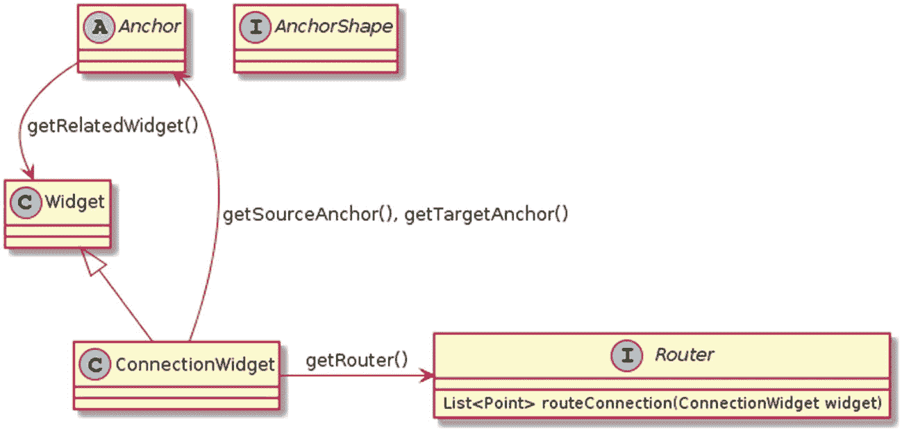

图 10-19
ConnectionWidget

边框

每个 `Widget` 都有一个边框，默认情况下是由 `EmptyBorder` 类提供的空边框。边框实现了 `Border` 接口。边框的示例包括 `LineBorder`、`BevelBorder`、`DashedBorder`、`ImageBorder`、`ResizeBorder`。通过 `Widget.setBorder()` 可以切换到不同的边框，如清单 10-30 所示。边框通过 `BorderFactory` 创建。

```
widget.setBorder(BorderFactory.createLineBorder(2,Color.BLUE));
清单 10-30
为 Widget 定义边框
```

布局

一个 widget 可以作为其他 widget 的容器，并且具有由 `LayoutManager` 定义和管理的布局。提供了以下布局变体：

`AbsoluteLayout`、`FlowLayout`、`CardLayout`、`OverlayLayout`。清单 10-31 展示了如何使用 `LayoutFactory` 为 widget 分配布局。

```
layerWidget.setLayout(LayoutFactory.createVerticalFlowLayout());
清单 10-31
为 Widget 定义布局
```

WidgetAction

`Widget` 的行为由其*动作*描述，这些动作由 `WidgetAction` 接口定义（见图 10-21）。该接口定义了由相应事件调用的方法，例如在分配了该动作的 Widget 上单击鼠标。Visual Library 提供了预定义的动作，这些动作也可以针对标准功能进行自定义，例如移动和编辑 Widget。动作的示例包括 `MoveAction`、`HoverAction`、`ZoomAction`、`PanAction`。动作无需定义和实例化。相反，它们由 `ActionFactory` 类分配给 `Widget`。要为 widget 创建动作，请使用 `ActionFactory` 并通过 `addAction()` 方法将它们添加到 widget 中（见清单 10-32）。某些 `ActionFactory` 方法需要一个提供者（例如 `EditAction`）。其他动作有默认的提供者（例如 `MoveAction`）。但是，如果你希望偏离默认行为，请使用其他提供者。
可用的提供者：`AcceptProvider`、`ConnectProvider`、`ContiguousSelectProvider`、`CycleFocusProvider`、`EditProvider`、`HoverProvider`、`InplaceEditorProvider`、`MoveControlPointProvider`、`MoveProvider`、`PopupMenuProvider`、`ReconnectProvider`、`RectangularSelectProvider`、`ResizeProvider`、`SelectProvider`、`TwoStateHoverProvider`。

动作是链式连接的。`WidgetAction.Chain` 类表示一个 widget 动作链；它接收用户事件并将其转发给相关的动作。当你对 `Widget` 调用 `getActions()` 时，你实际上得到的是 `Chain`。当然，动作的顺序很重要。

```
labelWidget.getActions().addAction(
ActionFactory.createMoveAction());
清单 10-32
向 Widget 添加动作
```

动作也可以分组。这可以通过调用 `Scene.setActiveTool()` 方法，然后使用 `getActions("activeTool")` 而不是 `getActions()` 来实现。

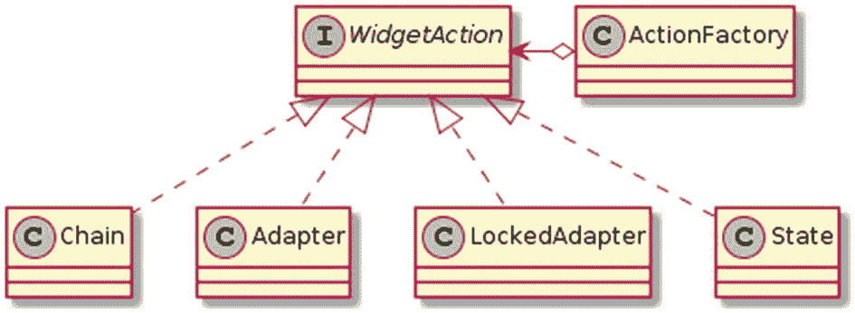

图 10-21
Widget 动作

调色板

你通常将 Visual Library 与 `Palette` 结合使用，将 `Widget` 从 `Palette` 拖放到 `Scene` 中。`Palette` 是一个 `TopComponent`，包含可以拖放到的组件到你选择的任何其他 `TopComponent` 中的项目。

`TopComponent` 在其 `Lookup` 中发布一个 `PaletteController`，以及连接到 `Palette` 中类别和项目上的右键单击弹出菜单的 `Action`。如果在 `TopComponent` 的 `Lookup` 中找到了 `PaletteController`，则 `Palette` 会与 `TopComponent` 一起打开。`PaletteFactory.createPalette()` 方法返回 `PaletteController` 的一个实现，并通过将其放入 `TopComponent` 的 `Lookup` 中将其与 `TopComponent` 关联起来（见清单 10-33）。

```
associateLookup(Lookups.singleton(
PaletteFactory.createPalette(...)));
清单 10-33
将 Palette 与 TopComponent 的 Lookup 关联
```

默认情况下，当从调色板拖拽一个项目时，它不能被放置。你必须明确地将一个组件定义为*放置目标*；否则它无法接收调色板的*放置事件*。如果你希望将调色板与 Visual Library 结合使用，那么放置目标就是一个 `Scene`。

清单 10-34 的代码示例展示了每当在 `Scene` 上发生放置操作时，如何创建一个新的 `LabelWidget`。你可以通过右键单击调色板并从弹出菜单中选择**调色板管理器**动作来配置调色板。


```
scene.getActions().addAction(
ActionFactory.createAcceptAction(
new AcceptProvider() {
@Override
public ConnectorState isAcceptable(
Widget widget, Point point, Transferable t) {
return ConnectorState.ACCEPT;
}
@Override
public void accept(Widget widget, Point point, Transferable t) {
Node node = NodeTransfer.node(t, NodeTransfer.DND_COPY_OR_MOVE);
LabelWidget labelWidget =
new LabelWidget(scene, node.getDisplayName());
labelWidget.getActions().addAction(
ActionFactory.createMoveAction());
labelWidget.setPreferredLocation(point);
layerWidget.addChild(labelWidget);
}
}
)
);
清单 10-34
在场景上拖放时创建一个新的 LabelWidget
```

作为练习，添加一个新模块（`Visual, todo.visual`）
到 *TodoRCP* 中，允许用户将存储在
应用程序中的 `Task` 从 `Palette` 拖放到 `Scene` 上。用户
还应能够连接任务，以显示它们之间的依赖关系。

品牌化、分发与
国际化

剩下的工作是替换启动画面和
*关于* 对话框，这样你的应用程序就几乎可以分发了。
以下是一些你可以用来品牌化和分发应用程序的方法：

1.  右键单击项目，选择**品牌化**。在这里
    你可以选择启动画面、应用程序最小化时显示的图标，以及
    应用程序标题栏中显示的标题。你还可以控制应用程序的窗口
    行为（例如，可以禁用浮动），最后还可以对应用程序进行
    国际化，即通过将资源包翻译成你偏好的语言
    （*国际化资源包* 选项卡）来更改用户界面。

2.  右键单击项目，选择**属性**。在
    *应用程序* 类别中，你可以更改应用程序的
    名称。在*库* 类别中，你可以选择要包含的集群
    和模块以提高性能。

3.  要创建可分发的
    *.zip* 或应用程序的*安装程序*，请右键单击
    项目，选择**属性**，然后选择
    *安装程序* 类别。勾选你想要为其创建安装程序的平台
    （例如 Windows、Mac OSX、Solaris 和 Linux），
    然后点击**确定**。你也可以提供许可证。
    再次右键单击项目，选择**打包为**，
    然后选择可用的选项之一，例如*安装程序* 或
    *Zip 分发*。

如果一切顺利，你会在项目文件夹内创建一个新的 `dist` 文件夹，
其中包含已部署的应用程序。如果需要，解压它，
进入内部（例如，`dist/todorcp/bin`）并
执行可执行文件（取决于你的平台，可能是
`todorcp.exe` 或类似文件）。

你还可以通过*更新中心*允许应用程序模块的在线更新，
就像下载插件一样，例如为了提供错误修复或新功能。
要为你的应用程序提供此功能，请遵循以下步骤：

1.  在 *platform* 集群中启用 *Auto Update Services* 和 *Auto Update UI*
    模块（见图 10-10）。在
    清理并构建之后，验证你是否有一个 **工具 ➤ 插件**
    菜单项，该菜单项可以打开*插件管理器*。

2.  右键单击项目，选择**打包为 ➤
    NBMs**。每个模块都会在 `build/updates/`
    目录中创建一个 `.nbm`（或 *NetBeans 模块*）
    文件。*更新中心描述符*（`updates.xml`）也会被
    创建。你需要将这些文件发布到 Web 服务器上。

3.  在*插件管理器*窗口中，点击
    **设置**选项卡，然后点击**添加**并输入
    *更新中心描述符*（`updates.xml`）的 URL。

4.  这里（[`https://www.codenameone.com/blog/netbeans-plugin-update-center.html`](https://www.codenameone.com/blog/netbeans-plugin-update-center.html)）
    是一个示例。


摘要  
表 10-1 展示了提供 Apache NetBeans 平台功能的一组模块。该表总结了该平台所提供的功能。你可以使用表中提到的大部分 `jar` 文件，而无需依赖 NetBeans IDE，也就是说，可以使用其他 IDE 或文本编辑器来开发基于 Apache NetBeans RCP 的应用程序。

在下一章中，你将运用目前所学的内容，为 NetBeans 创建一个插件。

表 10-1  
Apache NetBeans 平台模块概览

模块分组 | 提供功能

| --- | --- | --- | --- | --- |

**核心** |

`boot.jar` `core.jar`  
`org-openide-filesystems.jar`  
`org-openide-modules.jar`  
`org-openide-util-lookup.jar`  
`org-openide-util.jar` | 提供运行时容器。 |

`org-netbeans-modules-masterfs.jar` | 提供中央注册表文件系统功能（即层）。 |

**用户界面** |

`org-netbeans-core.jar` `org-netbeans-core-execution.jar`  
`org-netbeans-core-ui.jar`  
`org-netbeans-core-windows.jar` | 提供基本的 UI 组件。 |

`org-netbeans-windows.jar` | 提供用于处理窗口系统的 API。 |

`org-openide-actions.jar` | 提供大量可配置的系统操作（例如“剪切”、“复制”、“粘贴”）。 |

`org-openide-nodes.jar` `org-openide-explorer.jar`  
`org-netbeans-swing-outline.jar` | 提供用于*节点*和*资源管理器视图*的 API，即平台的 UI 部分。 |

`org-netbeans-core-multiview.jar` | 提供多视图窗口。 |

`org-netbeans-swing-plaf.jar` `org-netbeans-swing-tabcontrol`  
`org-jdesktop-layout.jar` | 提供外观与风格、标签页显示以及 Swing 布局扩展库的包装器。 |

**扩展** |

`org-openide-awt.jar` | 提供许多用于显示 UI 元素的辅助类（例如通知，见图 10-8）。 |

`org-openide-dialogs.jar` | 提供用于显示标准及自定义对话框和向导的 API（参见本章开头）。 |

`org-netbeans-api-visual.jar` | 提供用于建模和显示数据可视化表示的小部件和图形库 API。 |

`org-netbeans-spi-quicksearch.jar` | 提供用于将项目集成到*快速搜索*字段的 API（见图 10-9）。 |

`org-netbeans-modules-options-api.jar` | 提供*选项*窗口 API（见图 10-14）。 |

`org-netbeans-modules-settings.jar` | 提供用于以用户自定义格式保存模块特定设置的 API。 |

`org-netbeans-api-progress.jar` `org-openide-execution.jar`  
`org-netbeans-modules-progress-ui.jar` | 提供对异步长时间运行任务的支持，以及将长时间运行任务与 NetBeans 平台进度条集成的功能。 |

`org-netbeans-core-output2.jar` `org-openide-io.jar` | 提供输出窗口（见图 10-13）。 |

`org-netbeans-modules-autoupdate-services.jar` `org-netbeans-modules-autoupdate-ui.jar` | 提供更新中心和插件功能。 |

`org-netbeans-modules-favorites.jar` | 提供*收藏夹*窗口功能（菜单 **窗口 ➤ 收藏夹**）。 |

`org-openide-loaders.jar` | 提供用于处理文件类型的 API。 |

`org-netbeans-modules-mimelookup.jar` `org-netbeans-modules-editor-mimelookup.jar` | 提供用于发现和创建特定于文件类型的设置的 API。 |

`org-netbeans-modules-javahelp.jar` | 提供 *JavaHelp* 运行时库，该库允许将来自不同模块的 JavaHelp 集合并为单个帮助集。 |

`org-netbeans-modules-queries.jar` | 提供用于获取文件信息的 API，以及用于创建自定义查询的 SPI。 |

`org-netbeans-modules-sendopts.jar` | 提供用于注册自定义命令行处理程序的 API 和 SPI。 |

`org-openide-text.jar` | 提供对 `javax.swing.text` API 的扩展。 |


11. 为 NetBeans 编写插件

Apache NetBeans 是一个模块化 IDE，因此具有极强的可扩展性。不仅扩展 IDE 本身很容易，而且利用 NetBeans 平台开发完整的富桌面应用程序也非常简单。在本章中，我们将讨论如何构建模块（即“插件”），以便扩展 IDE 以包含新功能。例如，新的编程语言层出不穷，通过开发新插件来扩展 Apache NetBeans 以支持新语言是很容易的。

模块通常作为插件添加到 IDE 中。在 Apache NetBeans 中，**插件**菜单允许用户管理机器上可用、已安装或已下载的模块，以便加载或卸载它们，从而影响 Apache NetBeans 的外观或功能。有一个在线门户网站（[`https://netbeans.apache.org/plugins/index.html`](https://netbeans.apache.org/plugins/index.html)），其中包含由社区开发的插件。用户可以访问该门户网站搜索可下载的插件。如果你开发了一个插件，可以将其发布到插件门户网站上供所有人使用。

在本章中，我们将通过一个教程来学习如何为 NetBeans 创建插件。我们将重点介绍一个区块链用例。请参考本书的源代码仓库作为参考。

插件的用途

我们将为区块链实现创建一个 NetBeans 插件。除了支持从头开始设置一个新的区块链项目外，你还将学习如何创建支持新语言的功能：

*   识别模型文件
*   语法高亮
*   错误检测
*   代码补全
*   模型文件的导航视图

你还将了解如何对插件进行签名，并与其他 NetBeans 用户共享。

区块链简介
区块链是一个去中心化的点对点网络。该网络的每个参与者都拥有一份共享账本的副本，数据只能通过数字签名的交易进行追加。区块链保证了账本的不可篡改性。

一个区块包含一定数量的交易和一些元数据。交易和区块都是唯一的，通过哈希值进行标识。该区块还包含按时间顺序排列的前一个区块的哈希值。链中的第一个区块没有前驱，被称为创世区块。这些区块共同构成了区块链。图 11-1 展示了两个区块及其哈希值，以及前一个区块的哈希值。

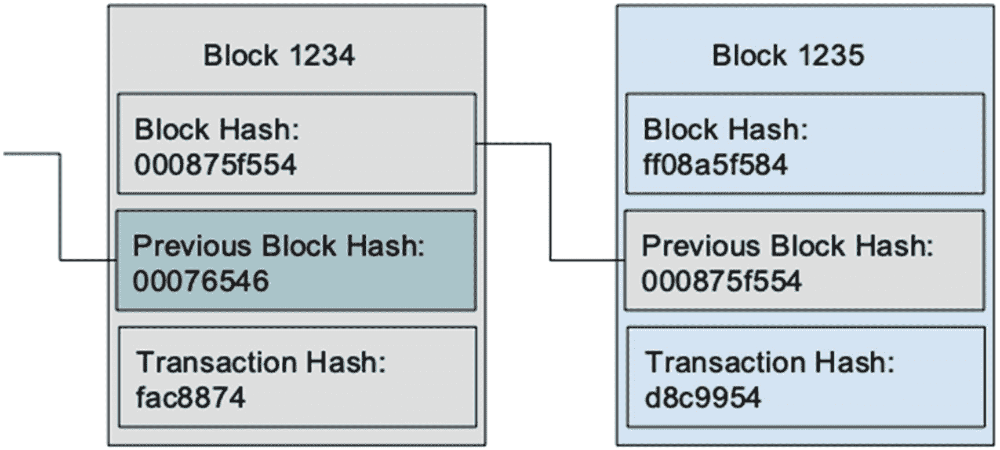

图 11-1 区块在区块链中的连接方式

区块链可以分为*公有链*和*私有链*。公有链的一个典型例子是*以太坊*。公有链内置了*工作量证明*或*权益证明*等机制，以防止欺诈行为。私有链的一个例子是*超级账本*。这个开源项目由 Linux 基金会托管，旨在推动区块链技术的发展。“私有”一词意味着对网络的访问是受限的。每个节点都必须进行身份验证，因此无需采用上述机制来防范欺诈攻击，敏感信息也保留在网络内部。如果你想深入了解超级账本，请访问网站 [`www.hyperledger.org`](http://www.hyperledger.org)。

当作者开始编写本书时，设置新*超级账本*项目的推荐方式是使用*Composer*：[`https://hyperledger.github.io/composer/latest/`](https://hyperledger.github.io/composer/latest/)。一个超级账本项目包含一个模型文件，该文件使用*超级账本 Composer 语言*编写。这些文件以 `cto` 后缀结尾，在本章中我们将它们称为 cto 文件。该语言定义了业务网络中使用的资源：

*   **资产：** 代表一个有价值的对象，例如，一栋房子；


*   **参与者：** 代表参与业务的各方；
*   **交易：** 由参与者提交，是一种影响资产的状态变更；
*   **枚举：** 与 Java 中的枚举类似，是一组值的集合；
*   **事件：** 可由交易函数触发，应用程序可以订阅事件。

该语言为资源中的字段声明提供了一系列基本类型：

*   `Boolean`：布尔值，值为 true 或 false；
*   `String`：UTF-8 编码的字符串；
*   `Integer`：32 位有符号整数；
*   `Long`：64 位有符号整数；
*   `Double`：双精度 64 位数值；
*   `DateTime`：符合 ISO-8601 标准的时间实例，可包含时区和 UTC 偏移量。

Hyperledger Composer 语言并未定义交易的规则；该逻辑属于另一个用 JavaScript 编写的文件。

Hyperledger 准备工作
为了正常使用 Hyperledger，我们需要安装一些工具。请确保您的机器满足[`https://hyperledger.github.io/composer/latest/installing/installing-prereqs.html`](https://hyperledger.github.io/composer/latest/installing/installing-prereqs.html)中描述的先决条件。由于我们将开发自己的编辑器，因此可以跳过安装 VSCode 的部分。

完成这些步骤后，请全局安装 Hyperledger Composer 命令行工具、应用程序生成器和 Yeoman：

```
npm install -g composer-cli@0.20
npm install -g generator-hyperledger-composer@0.20
npm install -g yo
```

您还应该安装 Hyperledger Composer Playground，它提供了一个用于配置、部署和测试业务网络的用户界面。

```
npm install -g composer-playground@0.20
```

Hyperledger Fabric 是业务网络的运行时环境。有一些脚本可以安装此运行时。请下载到您选择的目录中：

```
mkdir ~/fabric-dev-servers && cd ~/fabric-dev-servers
curl -O https://raw.githubusercontent.com/hyperledger/composer-tools/master/packages/fabric-dev-servers/fabric-dev-servers.tar.gz
tar -xvf fabric-dev-servers.tar.gz
```

执行以下命令：

```
export FABRIC_VERSION=hlfv12
./downloadFabric.sh
```

您已完成 Hyperledger 工作环境的准备。
更多详细信息，请参阅安装说明：[`https://hyperledger.github.io/composer/latest/installing/development-tools.html`](https://hyperledger.github.io/composer/latest/installing/development-tools.html)。

让我们在控制台中使用 Yeoman 创建一个新的骨架业务网络。该业务网络将在插件开发过程中使用。

```
yo hyperledger-composer:businessnetwork
? Business network name: ledger
? Description: sample
? Author name: admin
? Author email: admin@web.org
? License: Apache-2.0
? Namespace: org.example.biznet
? Do you want to generate an empty template network? No: generate a populated sample network
create package.json
create README.md
create models/org.example.biznet.cto
create permissions.acl
create .eslintrc.yml
create features/sample.feature
create features/support/index.js
create test/logic.js
create lib/logic.js
```

创建一个新模块

底层我们使用 Maven 作为构建工具。
通过以下步骤启动一个新模块：“文件” ➤ “新建项目” ➤ “Java with Maven” ➤ “NetBeans 模块”。图 11-2 展示了 NetBeans 的项目向导。

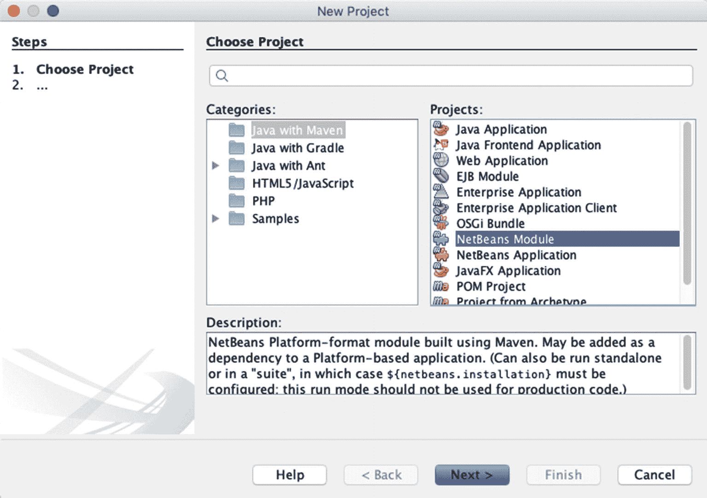

图 11-2
使用 Maven 创建新 NetBeans 模块的向导

接下来，为您的项目取一个有意义的名称，例如“ledger”，然后选择您的目标平台，可以从 RELEASE82 开始。点击“完成”以结束操作。

我们将添加测试依赖项。选择项目节点“测试依赖项”，右键单击，然后选择“添加依赖项”。这将弹出如图 11-3 所示的对话框。


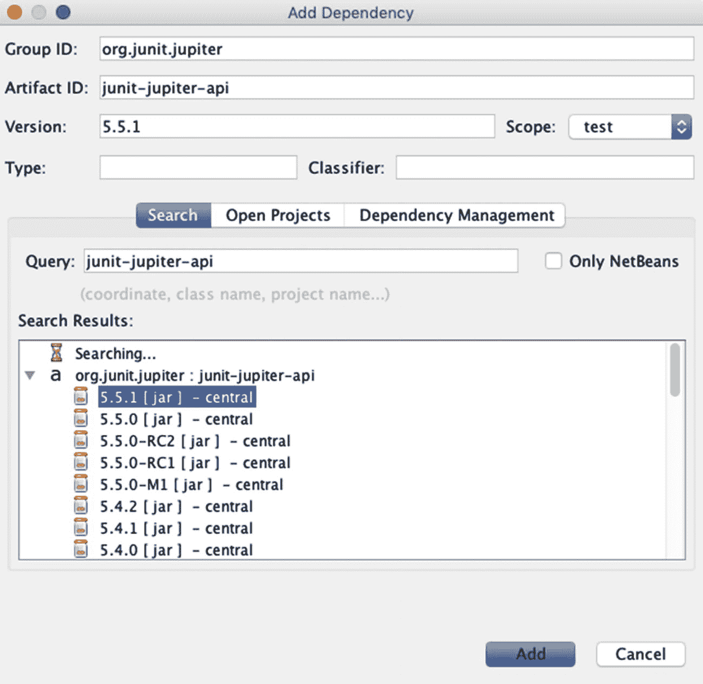

**图 11-3**
添加依赖项的对话框

将作用域更改为 test，取消勾选“仅限 NetBeans”，并使用查询字段查找以下依赖项：

*   `org.junit.jupiter:junit-jupiter-api:5.5.1`

*   `org.junit.jupiter:junit-jupiter-engine:5.5.1`

*   `org.hamcrest:hamcrest-core:2.1`

*   `org.mockito:mockito-junit-jupiter:2.28.2`

要启用 Mockito 中一个用于为 final 类创建模拟对象的孵化功能，请添加一个新文件 `src/test/resources/mockito-extensions/org.mockito.plugins.MockMaker`，其中包含一行内容：

```
mock-maker-inline
```

有关 Mockito 库的更多信息，请参见以下链接：
[`http://static.javadoc.io/org.mockito/mockito-core/2.24.0/org/mockito/Mockito.html`](http://static.javadoc.io/org.mockito/mockito-core/2.24.0/org/mockito/Mockito.html)。

所有与 NetBeans 相关的 Maven 依赖项都会有一个标签，显示你用于构建插件的版本。建议添加一个保存此版本的新属性，这样你就可以轻松地更改版本。

```
UTF-8
1.8
1.8
RELEASE82
4.7.1

```

项目模板
业务网络存档包含多个文件。例如，有一个 JavaScript 文件用于定义适用于交易的业务规则。模型文件定义了业务中涉及的基本概念。为了避免为新项目手动创建这些文件中的每一个，我们将创建一个新的项目类型，它将出现在项目向导中。

我们从一个新的 Node.js 应用程序开始，它将作为我们模板的源文件夹。因此，再次启动向导并创建一个新项目，如图 11-4 所示。

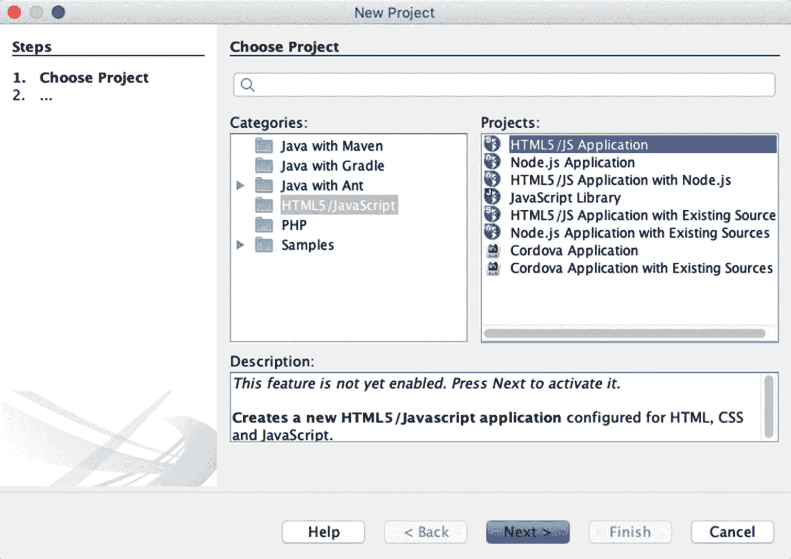

**图 11-4**
包含 Node.js 应用程序的向导

删除 `nbproject` 下的 `private` 目录，以及 `main.js` 文件。
将上一节中创建的业务网络源文件复制到此项目的 `src` 目录中。

为了支持从 NetBeans 发布业务网络，请在 IDE 中编辑 `package.json` 的脚本部分：

```
"scripts": {
"publish": "mkdirp ./dist && composer archive create --sourceType dir --sourceName . -a ./dist/ledger.bna",
"pretest": "npm run lint",
"lint": "eslint .",
"test": "nyc mocha -t 0 test/*.js && cucumber-js"
}
```

切换到 IDE 中的“文件”窗口，并创建一个包含以下内容的新 `.gitignore` 文件：

```
dist/
node_modules/
```

编辑 `nbproject` 文件夹中的 `project.properties` 文件。

```
auxiliary.org-netbeans-modules-javascript-nodejs.enabled=true
run.as=node.js
files.encoding=UTF-8
source.folder=
```

更改 `project.xml` 文件中的 name 标签：

```

org.netbeans.modules.web.clientproject

Hyperledger Business Network

```

zip 文件的文件夹应如下所示：

```
.
├── README.md
├── nbproject
│   ├── project.properties
│   └── project.xml
├── features
│   ├── sample.feature
│   └── support
│   └── index.js
├── lib
│   └── logic.js
├── models
│   └── org.example.biznet.cto
├── package.json
├── permissions.acl
└── test
└── logic.js
```

让我们构建一个基于此项目的模板。在 NetBeans 的“项目”窗口中选择该项目，然后右键单击。接着创建一个新的项目模板：“新建文件” ➤ “模块开发” ➤ “项目模板”。参见图 11-5。

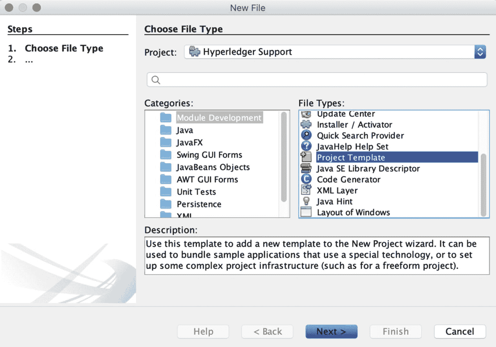

**图 11-5**
创建项目模板的向导

选择之前创建的 Node.js 项目（图 11-6）。

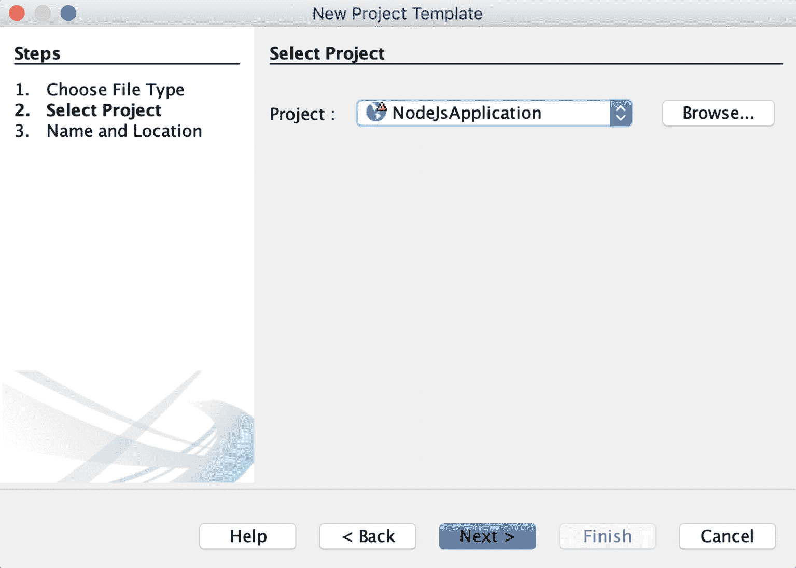

**图 11-6**
选择项目模板的向导

点击“下一步”，输入一个有意义的名称，使用名为“template”的包，然后点击“完成”。参见图 11-7。

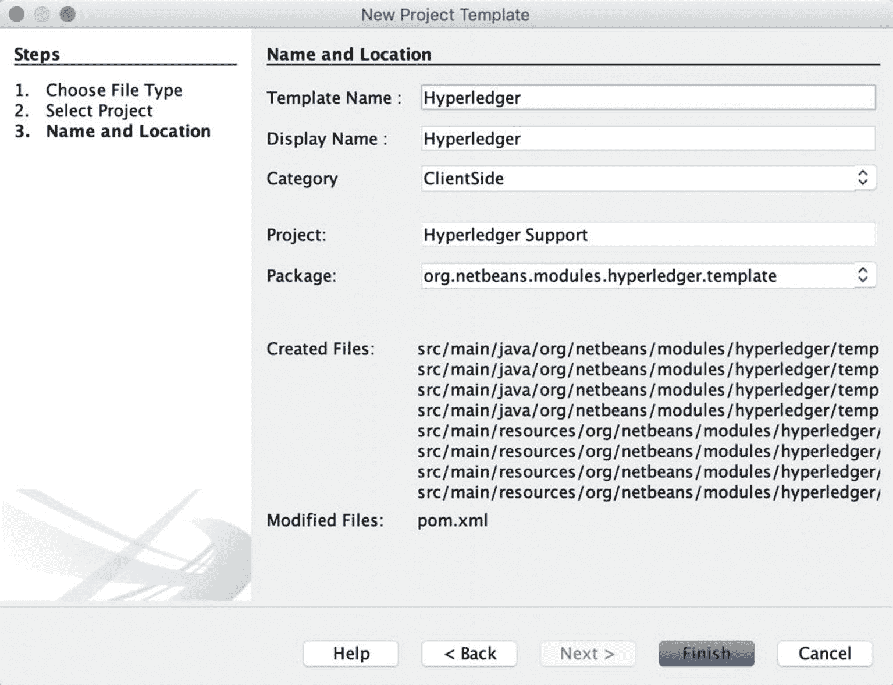

**图 11-7**
设置项目模板名称和位置的向导

此过程将向 `pom.xml` 添加一些依赖项，创建几个新类、一些资源，以及一个包含另一个 Node.js 项目内容的 zip 文件。

项目模板的起点是 `HyperledgerWizardIterator` 的 `TemplateRegistration` 注解。让我们更改那里的图标。

```
...
@TemplateRegistration(folder = "Project/ClientSide",
displayName = "#Hyperledger_displayName",
description = "HyperledgerDescription.html",
iconBase = "org/netbeans/modules/hyperledger/template/blockchain.png",
content = "HyperledgerProject.zip")
@Messages("Hyperledger_displayName=Hyperledger")
public class HyperledgerWizardIterator implements WizardDescriptor./*Progress*/InstantiatingIterator {
...
```

你还可以扩展 `HyperledgerDescription.html`，为插件的用户提供更多信息。
当我们运行插件时，已经可以看到一个用于 Hyperledger 的新项目模板。它允许你从头开始创建一个新项目。

文件支持
然而，当我们打开模型文件夹中的 cto 文件时，我们发现还没有对此文件的支持。让我们创建基础，以便 NetBeans 能够识别此文件类型。

选择菜单“文件” ➤ “新建文件” ➤ “模块开发” ➤ “文件类型”。这将调出如图 11-8 所示的向导。

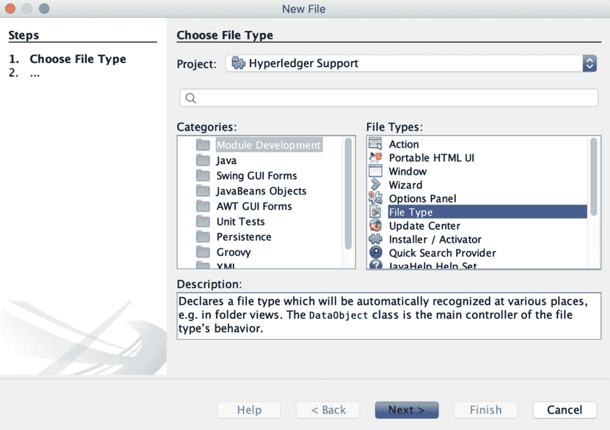

**图 11-8**
新建文件类型的向导

它将为我们的新文件类型创建支持。图 11-9 显示了向导的下一步。定义 MIME 类型和文件扩展名，然后点击“下一步”继续。图 11-10 显示了最后一步。在那里，我们为类名前缀输入“Cto”，并选择一个图标和包。请确保取消选中“使用多视图”复选框。然后点击“完成”。

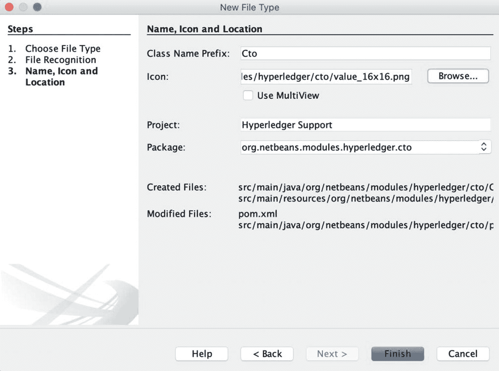

**图 11-10**
步骤 3：名称、图标和位置

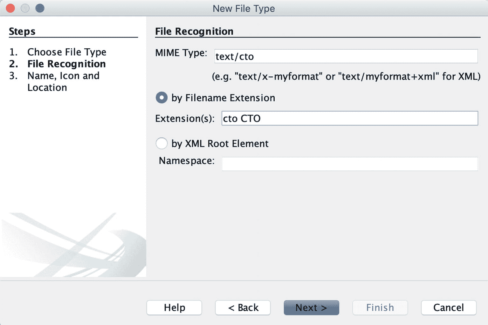

**图 11-9**
步骤 2：编辑文件识别

接下来，创建一个新的接口，其中包含一些我们将在创建更多功能时使用的常量。

```
package org.netbeans.modules.hyperledger.cto;
import org.netbeans.api.annotations.common.StaticResource;
public interface FileType {
@StaticResource
String ICON = "org/netbeans/modules/hyperledger/cto/value_16x16.png";
String MIME = "text/cto";
}
```

你可以将 `CtoDataObject` 中的 MIME 类型和图标路径的字符串值替换为对接口中常量的引用。

```
@MIMEResolver.ExtensionRegistration(
displayName = "#LBL_Cto_LOADER",
mimeType = FileType.MIME,
extension = {"cto", "CTO"},
position=120
)
@DataObject.Registration(
mimeType = FileType.MIME,
iconBase = FileType.ICON,
displayName = "#LBL_Cto_LOADER",
position = 300
)
```

当你运行插件并使用“收藏夹”窗口打开之前创建的文件时，你会看到 NetBeans 现在能够识别新的文件类型，并使用之前添加的图标进行指示。
但是，还没有语法着色和自动补全功能。所以，让我们来处理这个问题。


语法高亮
语言支持包含一个词法分析器和一个解析器。词法分析器接收源代码并将其转换为词法单元。解析器基于这些词法单元创建语法树。有多种工具可用于创建词法分析器/解析器，但在本教程中，我们将使用 ANTLR。关于 ANTLR 有大量文档可供参考，因此在编写新语法时，你应该能相对轻松地入门。

对于此高亮功能，我们仅使用词法分析器。因此，我们需要词法分析器语法文件。该文件包含该语言特有的词法单元。你可以从 ANTLR 语法仓库复制 `CtoLexer.g4` 文件：[`https://github.com/antlr/grammars-v4/tree/master/cto`](https://github.com/antlr/grammars-v4/tree/master/cto)。建议将该文件放置在项目资源文件夹的子目录中，例如 `org.netbeans.modules.hyperledger.cto.grammar`。

我们还需要调整 Maven 的 `pom.xml`。将 ANTLR 插件添加到构建部分，并将 ANTLR 运行时和 NetBeans 的 Lexer API 添加到依赖部分。插件的版本应与 ANTLR 依赖的版本匹配。以下代码片段展示了 `pom.xml` 中的 ANTLR 插件和运行时依赖。

```
...

org.antlr
antlr4-maven-plugin
${antlr.version}

antlr

antlr4

...

org.antlr
antlr4-runtime
${antlr.version}

org.netbeans.api
org-netbeans-modules-lexer
${netbeans.version}

...
```

构建成功后，我们将在 `target/generated-sources` 目录下得到一个 `CtoLexer.java` 文件。

接下来，我们需要设置一个提供该语言的服务。因此，我们将创建一个新类 `CtoLanguageProvider`，它继承自 NetBeans 的 `LanguageProvider`：

```
...
@ServiceProvider(service=LanguageProvider.class)
public class CtoLanguageProvider extends LanguageProvider{
private final Supplier> supplier = () -> new CtoLanguageHierarchy().language();
@Override
public Language findLanguage(String mime) {
return (FileType.MIME.equals(mime)) ? supplier.get() : null;
}
@Override
public LanguageEmbedding findLanguageEmbedding(Token token,
LanguagePath lp, InputAttributes ia) {
return null;
}
}
```

`CtoLanguageHierarchy` 类是对 cto 语言的定义。`createTokenIds` 方法将基于 ANTLR 语法文件返回所有词法单元。它还提供了 `Lexer` 接口的实现，该接口将输入中读取的字符映射到 cto 词法单元。

```
...
public class CtoLanguageHierarchy extends LanguageHierarchy {
private final List tokens;
private final Map idToToken;
public CtoLanguageHierarchy() {
tokens = TokenTaxonomy.getDefault().allTokens();
idToToken = TokenTaxonomy.getDefault().getIdTokenMap();
}
@Override
protected Collection createTokenIds() {
return tokens;
}
@Override
protected Lexer createLexer(LexerRestartInfo info) {
return new CtoEditorLexer(info, idToToken);
}
@Override
protected String mimeType() {
return FileType.MIME;
}
}
```

`TokenTaxonomy` 为词法单元提供了分类，以便我们后续可以为不同组的词法单元选择不同的样式。

```
public enum TokenTaxonomy {
INSTANCE;
private final List tokens;
private TokenTaxonomy() {
tokens = new ArrayList();
int max = CtoLexer.VOCABULARY.getMaxTokenType() + 1;
for (int i = 1; i  mapping = t -> {
if (t  allTokens() {
return tokens;
}
public List tokens(Category category) {
return tokens.stream().filter(t -> category.name().equals(t.primaryCategory())).collect(toList());
}
public Map getIdTokenMap() {
return tokens.stream().collect(toMap(CtoTokenId::ordinal, t -> t));
}
}
```

类别本身只是另一个用于分组的 `enum`：

```
public enum Category {
KEYWORD, TYPE, FIELD, SEPARATOR, VALUE, COMMENT, TEXT;
}
```

`NameMapping` 接口使用一个静态方法，通过底层的 `CtoLexer.VOCABULARY` 将 `int` 映射为 `String`。词汇表包含一些我们后续希望避免的字符；因此，`map` 方法会从字符串中移除不需要的字符。

```
public interface NameMapping {
public static String map(int type) {
String name = CtoLexer.VOCABULARY.getDisplayName(tokenType);
return name.replaceAll("^\\'|\\'$", "");
}
}
```

`CtoTokenId` 类是对 NetBeans Lexer API 中 `org.netbeans.api.lexer.TokenId` 接口的一个非常简单的实现。

```
public class CtoTokenId implements TokenId{
private final String name;
private final String primaryCategory;
private final int id;
public CtoTokenId(String name, String primaryCategory, int id) {
this.name = name;
this.primaryCategory = primaryCategory;
this.id = id;
}
@Override
public String name() {
return name;
}
@Override
public int ordinal() {
return id;
}
@Override
public String primaryCategory() {
return primaryCategory;
}
}
```

`CtoEditorLexer` 类是 Lexer API 和 ANTLR 之间的桥梁。它将 ANTLR 词法单元转换为 `CtoTokenId`。如你所见，从 id 到词法单元的映射被传递给了构造函数。我们将提供第二个构造函数，用于测试目的。这样，我们可以在测试期间轻松使用模拟对象来提供词法单元。

```
public final class CtoEditorLexer implements Lexer {
private final LexerRestartInfo info;
private final Map idToToken;
private final Function> tokenFactory;
private final Supplier tokenSupplier;
public CtoEditorLexer(LexerRestartInfo info, Map idToToken) {
this(info, idToToken, new TokenSupplier(info.input()));
}
CtoEditorLexer(LexerRestartInfo info, Map idToToken,
Supplier tokenSupplier) {
this.info = info;
this.idToToken = idToToken;
this.tokenSupplier = tokenSupplier;
this.tokenFactory = id -> info.tokenFactory().createToken(id);
}
@Override
public Token nextToken() {
Token createdToken = null;
org.antlr.v4.runtime.Token token = tokenSupplier.get();
int type = token.getType();
if (type != -1) {
createdToken = createToken(type);
} else if (info.input().readLength() > 0) {
createdToken = createToken(CtoLexer.WS);
}
return createdToken;
}
private Token createToken(int type) {
Function mapping = idToToken::get;
return mapping.andThen(tokenFactory).apply(type);
}
@Override
public Object state() {
return null;
}
@Override
public void release() {
//nothing todo
}
private static class TokenSupplier implements Supplier {
private final CtoLexer lexer;
TokenSupplier(LexerInput input) {
CharStream stream = new LexerCharStream(input);
lexer = new CtoLexer(stream);
}
@Override
public org.antlr.v4.runtime.Token get() {
return lexer.nextToken();
}
}
}
```

我们需要一种方法将平台的输入馈送到由 ANTLR 生成的 `CtoLexer` 中。该词法分析器接受 `org.antlr.v4.runtime.CharStream` 接口，因此让我们实现它。以下源代码基于 `org.antlr.v4.runtime.ANTLRInputStream`。


```
final class LexerCharStream implements CharStream {
private final static String NAME = "CtoChar";
private final LexerInput input;
private final Deque markers = new ArrayDeque();
public LexerCharStream(LexerInput input) {
this.input = input;
}
@Override
public String getText(Interval interval) {
Objects.requireNonNull(interval, "Interval may not be null");
if (interval.a < 0 || interval.b < interval.a - 1) {
throw new IllegalArgumentException("Invalid interval!");
}
return input.readText(interval.a, interval.b).toString();
}
@Override
public void consume() {
read();
}
@Override
public int LA(int ahead) {
if (ahead == 0) {
return 0;
}
int c = 0;
for (int j = 0; j < ahead; j++) {
c = read();
}
backup(ahead);
return c;
}
@Override
public int mark() {
markers.push(index());
return markers.size() - 1;
}
@Override
public void release(int marker) {
if(markers.size() < marker) {
return;
}
//remove all markers from the given one
for(int i = marker; i < markers.size(); i++) {
markers.remove(i);
}
}
@Override
public int index() {
return input.readLengthEOF();
}
@Override
public void seek(int index) {
int len = index();
if (index < len) {
//seek backward
backup(len - index);
} else {
// seek forward
while (len < index) {
consume();
}
}
}
@Override
public int size() {
return -1; //unknown
}
@Override
public String getSourceName() {
return NAME;
}
private int read() {
int result = input.read();
if (result == LexerInput.EOF) {
result = CharStream.EOF;
}
return result;
}
private void backup(int count) {
input.backup(count);
}
}
```

让我们用 JUnit 5 创建第一个单元测试。在项目窗口中选择枚举 `TokenTaxonomy`，右键单击，然后选择“工具” ➤ “创建/更新测试”。图 11-11 显示了创建或更新测试的对话框。

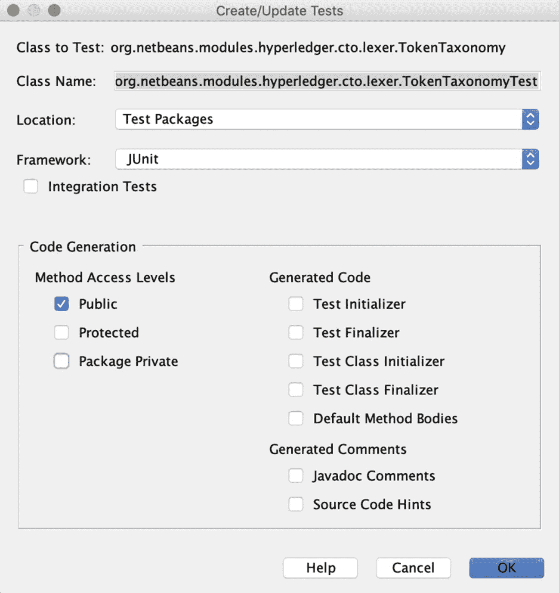

图 11-11
测试对话框

按如下方式实现测试：

```
public class TokenTaxonomyTest {
@Test
@DisplayName("It should return a list of keyword tokens.")
public void tokens_Keywords() {
List result = TokenTaxonomy.INSTANCE.tokens(Category.KEYWORD);
assertThat(result.isEmpty(), is(false));
}
}
```

至此，我们完成了语法高亮相关的 Java 源代码。然而，还有一些拼图尚未完成。首先，我们需要提供一个 xml 文件，将枚举 `Category` 的值映射到一种颜色。因此，在 `src/main/resources/org/netbeans/modules/hyperledger/cto` 目录下创建一个 `fontColors.xml` 文件，并使用以下内容：

在该模块的包文件 `src/main/resources/org/netbeans/modules/hyperledger/Bundle.properties` 中为这些值提供翻译：

```
KEYWORD=关键字
TYPE=原始类型
FIELD=字段
COMMENT=注释
SEPARATOR=分隔符
VALUE=值
```

我们需要注册此映射，并为选项对话框提供一个预览，以便用户在更改颜色时可以快速预览效果。这通过 NetBeans 层系统完成。请在与 `Bundle.properties` 相同的目录中添加一个 `layer.xml` 文件，内容如下：

在项目视图中展开“重要文件”节点，并在模块清单 (`manifest.mf`) 中注册 `layer.xml` 文件。参见图 11-12。


图 11-12
展开“重要文件”节点的项目视图

`manifest.mf` 文件的内容：

```
Manifest-Version: 1.0
OpenIDE-Module: org.netbeans.modules.hyperledger
OpenIDE-Module-Localizing-Bundle: org/netbeans/modules/hyperledger/Bundle.properties
OpenIDE-Module-Layer: org/netbeans/modules/hyperledger/layer.xml
```

如您所见，我们还在 `layer.xml` 中注册了一个示例 cto 文件用于颜色预览。因此，让我们将此文件添加到 `src/main/resources/org/netbeans/modules/hyperledger/cto` 目录中。

```
/*
* 模型文件示例
*/
namespace org.basic.sample
import foo.bar
// 资产
@foo("arg", 2)
abstract asset SampleAsset identified by assetId{
o String assetId
o Integer [] cols
--> SampleParticipant owner
}
```

当我们运行插件时，编辑器中将出现语法高亮（见图 11-13），并且可以在选项对话框中更改颜色（见图 11-14）。

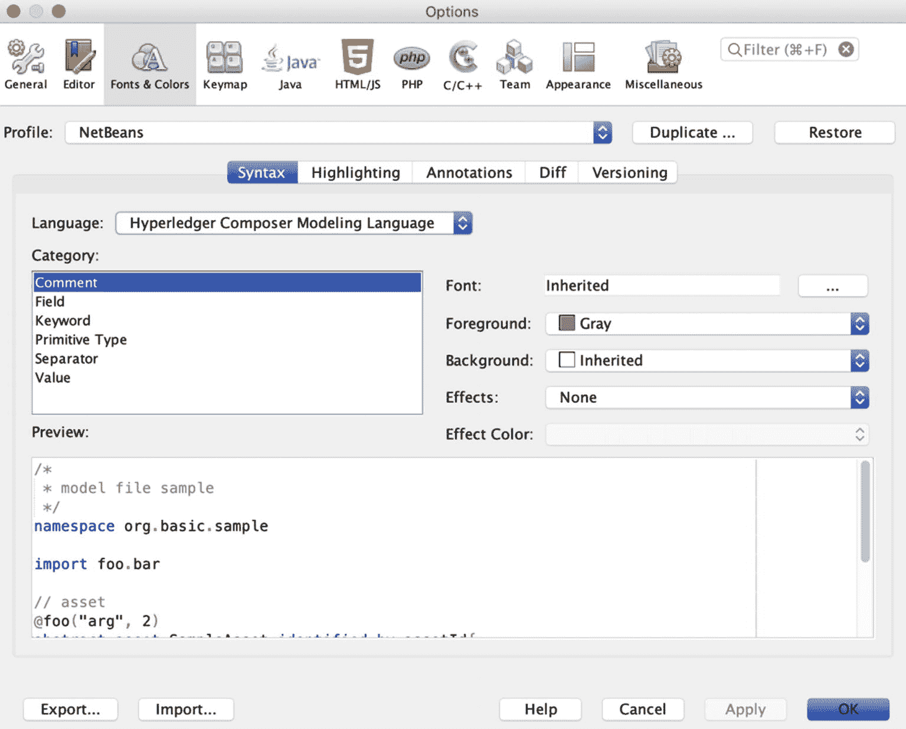

图 11-14
带有颜色预览的选项对话框

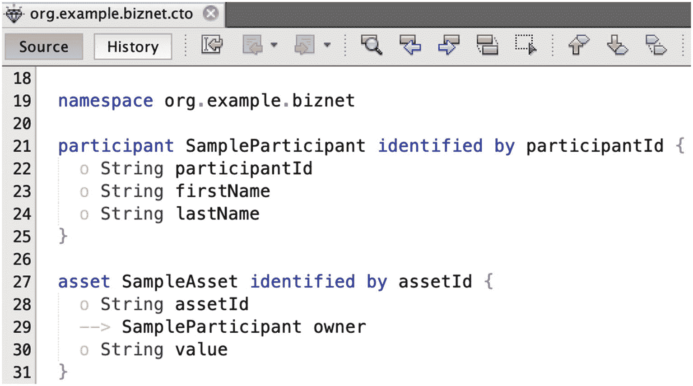

图 11-13
带有语法高亮的编辑器

错误提示
语法高亮可以给我们一些提示，表明输入的单词是否为关键字。然而，当出现语法错误时，它并不能告诉我们实际应该输入什么。这里我们可以利用 NetBeans 的错误提示功能和由 ANTLR 生成的解析器。解析器允许我们附加一个监听器的实现，该监听器会收集所有语法错误。这些语法错误可用于错误提示。

首先，我们在 `pom.xml` 文件中添加一些新的依赖项：

```
org.netbeans.api
org-netbeans-modules-parsing-api
${netbeans.version}

org.netbeans.api
org-netbeans-spi-editor-hints
${netbeans.version}

```

Parsing API 将充当 ANTLR 解析器的代理，并处理解析结果。

我们需要在与词法分析器语法文件相同的目录中定义一个新的语法文件。它被称为 `CtoParser.g4`。它包含用于识别 cto 文件中资源的规则。以下代码片段显示了此文件的开始部分，其中包含入口点 `modelUnit`。完整内容请参见 GitHub 上的源代码仓库：[`https://github.com/antlr/grammars-v4/blob/master/cto/CtoLexer.g4`](https://github.com/antlr/grammars-v4/blob/master/cto/CtoLexer.g4)。

```
parser grammar CtoParser;
options { tokenVocab=CtoLexer; }
modelUnit
: namespaceDeclaration importDeclaration* typeDeclaration* EOF;
```

Maven 插件将生成 `CtoParser.java` 文件。它在项目视图的“生成的源文件”下可见。

接下来，我们必须创建一系列新类。让我们从一个创建解析器的新类开始。注意 `MimeRegistration` 注解。这会将我们的工厂注册到 NetBeans 的 MIME 查找中。

```
@MimeRegistration(mimeType = FileType.MIME, service = ParserFactory.class)
public class CtoParserFactory extends ParserFactory {
@Override
public Parser createParser(Collection coll) {
return new CtoProxyParser(ParserProvider.INSTANCE);
}
}
```

`ParserProvider` 实现了 `Function` 接口，并为给定的文本创建一个新的 `CtoParser`。

```
public enum ParserProvider implements Function {
INSTANCE;
@Override
public CtoParser apply(String text) {
CharStream input = CharStreams.fromString(text);
Lexer lexer = new CtoLexer(input);
TokenStream tokenStream = new CommonTokenStream(lexer);
return new CtoParser(tokenStream);
}
}
```

类 `CtoProxyParser` 是 ANTLR `CtoParser` 的代理。它解析编辑器内容的快照并提供解析结果；在本例中，结果包含一个语法错误列表。


```
public class CtoProxyParser extends Parser {
private final Function parserProvider;
private CtoParserResult parserResult;
public CtoProxyParser(Function parserProvider) {
this.parserProvider = parserProvider;
}
@Override
public void parse(Snapshot snapshot, Task task, SourceModificationEvent sme) throws ParseException {
String text = snapshot.getText().toString();
CtoParser ctoParser = parserProvider.apply(text);
ErrorParserListener errorListener = new ErrorParserListener();
ctoParser.addErrorListener(errorListener);
//do the parsing
ctoParser.modelUnit();
List errors = errorListener.getSyntaxErrors();
parserResult = new CtoParserResult(snapshot, errors);
}
@Override
public Result getResult(Task task) throws ParseException {
return parserResult;
}
@Override
public void addChangeListener(ChangeListener cl) {
}
@Override
public void removeChangeListener(ChangeListener cl) {
}
public static class CtoParserResult extends Parser.Result {
private boolean valid = true;
private final List errors;
public CtoParserResult(Snapshot snapshot, List errors) {
super(snapshot);
this.errors = errors;
}
public List getErrors() {
return errors;
}
@Override
protected void invalidate() {
valid = false;
}
public boolean isValid() {
return valid;
}
}
}
```

`SyntaxError` 类非常简单。它保存了消息和对应的行号。

```
public final class SyntaxError {
private final String message;
private final int line;
public SyntaxError(String message, int line) {
this.message = message;
this.line = line;
}
public String getMessage() {
return message;
}
public int getLine() {
return line;
}
}
```

而 `ErrorParserListener` 则负责收集所有语法错误。

```
public class ErrorParserListener extends BaseErrorListener{
private final List syntaxErrors = new ArrayList();
public List getSyntaxErrors() {
return syntaxErrors;
}
@Override
public void syntaxError(Recognizer recognizer, Object offendingSymbol, int line, int charPositionInLine, String msg, RecognitionException e) {
syntaxErrors.add(new SyntaxError(msg, line));
}
}
```

那么，当我们收集到所有语法错误后，该如何处理它们呢？我们需要告诉编辑器标记这些行。让我们在一个低优先级的任务中完成这项工作。NetBeans 提供了 `org.netbeans.modules.parsing.spi.ParserResultTask`，它会在解析器完成工作后处理我们的结果。`NotificationResultTask` 使用解析器中的语法错误，并将其提供给 `HintsController`，后者会在编辑器中显示错误提示。

```
public class NotificationResultTask extends ParserResultTask {
private static final String LAYER = "cto";
@Override
public void run(Parser.Result result, SchedulerEvent se) {
CtoProxyParser.CtoParserResult ctoResult = (CtoProxyParser.CtoParserResult) result;
if (ctoResult.isValid()) {
Document document = result.getSnapshot().getSource().getDocument(false);
List errors = ctoResult.getErrors();
List descriptions = errors.stream().map(e
-> ErrorDescriptionFactory.createErrorDescription(
Severity.ERROR,
e.getMessage(),
document,
e.getLine())).collect(toList());
setErrors(document, descriptions);
}
}
void setErrors(Document document, List descriptions) {
HintsController.setErrors(document, LAYER, descriptions);
}
@Override
public int getPriority() {
return 100; //数值越小，优先级越高
}
@Override
public Class getSchedulerClass() {
return Scheduler.EDITOR_SENSITIVE_TASK_SCHEDULER;
}
@Override
public void cancel() {
}
}
```

对 `HintsController` 的调用被放在一个额外的方法中，因为这样我们可以在单元测试中通过 spy 来验证它。那么，让我们为这个类创建一个新的测试：

```
@ExtendWith(MockitoExtension.class)
public class NotificationResultTaskTest {
@Mock
private Snapshot snapshot;
@Mock
private Source source;
@Mock
private Document document;
@Spy
private NotificationResultTask classUnderTest;
@Test
@DisplayName("它应该在 HintsController 中设置错误")
public void run() {
given(snapshot.getSource()).willReturn(source);
given(source.getDocument(false)).willReturn(document);
List res = singletonList(new CtoResource("foo", 0, 0));
List errs = singletonList(new SyntaxError("bar", 0));
CtoParserResult ctoResult = new CtoParserResult(snapshot, res, errs);
classUnderTest.run(ctoResult, null);
verify(classUnderTest).setErrors(eq(document), any(List.class));
}
}
```

最后，我们需要编写一个类来创建上述结果任务。

```
@MimeRegistration(mimeType = FileType.MIME, service = TaskFactory.class)
public class NotificationResultTaskFactory extends TaskFactory{
@Override
public Collection create(Snapshot snpsht) {
return singletonList(new NotificationResultTask());
}
}
```

运行插件，打开 cto 文件，编辑器将标记错误行，如图 11-15 所示。

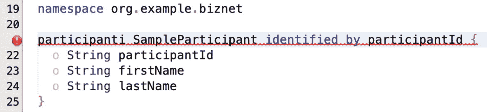

图 11-15 带有错误提示的编辑器

代码补全

在这一部分，我们将为 cto 文件添加代码补全功能。首先，我们需要在 Maven 的 `pom.xml` 文件中添加以下依赖：

```
org.netbeans.api
org-netbeans-modules-editor-completion
${netbeans.version}

```

起点是 `CompletionProvider` 接口。我们将提供自己的实现。

```
@MimeRegistration(mimeType = FileType.MIME, service = CompletionProvider.class)
public class CtoCompletionProvider implements CompletionProvider{
@Override
public CompletionTask createTask(int type, JTextComponent jtc) {
if(type == CompletionProvider.COMPLETION_QUERY_TYPE) {
return new AsyncCompletionTask(new CtoCompletionQuery(), jtc);
}
return null;
}
@Override
public int getAutoQueryTypes(JTextComponent jtc, String string) {
return 0;
}
}
```

如果查询类型是补全查询，则返回一个新任务。这允许我们异步执行查询。对于 `getAutoQueryTypes` 方法，我们将返回 0。这意味着代码补全只会在用户按下正确的按键时弹出。

实际工作由 `CtoCompletionQuery` 完成。这个类负责向建议列表中添加条目，并在用户输入时进行过滤。我们的类继承自 `AsyncCompletionQuery`。因此，我们需要实现 `query` 方法，在其中添加条目。我们将使用关键字和原始类型作为建议。关键字类别中的某些条目会带有图标，以表明这些类型对于业务网络定义至关重要。


```
final class CtoCompletionQuery extends AsyncCompletionQuery {
private static final String ICON_PATH = "org/netbeans/modules/hyperledger/cto/%s";
private final CompletionFilter completionFilter;
CtoCompletionQuery() {
this(new CompletionFilter.FilterImpl());
}
CtoCompletionQuery(CompletionFilter completionFilter) {
this.completionFilter = completionFilter;
}
@Override
protected void query(CompletionResultSet crs, Document document, int offset) {
CompletionFilter.FilterResult filterResult = completionFilter.filter(document, offset);
crs.addAllItems(getKeywordItems(filterResult));
crs.addAllItems(getPrimitiveTypeItems(filterResult));
crs.finish();
}
private ListgetKeywordItems(CompletionFilter.FilterResult              filterResult) {
Function mapping = token -> {
Optional iconPath = iconPath(token.ordinal());
return new KeywordCompletionItem(iconPath, token.name(), filterResult. location);
};
return map(filterResult.filter, Category.KEYWORD, mapping);
}
private List getPrimitiveTypeItems(CompletionFilter.FilterResult filterResult) {
Function mapping = token -> {
return new PrimitiveTypeCompletionItem(token.name(), filterResult.location);
};
return map(filterResult.filter, Category.TYPE, mapping);
}
private List map(Optional filter, Category category, Function mapping) {
Stream tokens = TokenTaxonomy.INSTANCE.tokens(category).stream();
String name = filter.orElse("");
if(!name.isEmpty()){
tokens = tokens.filter(t -> t.name().startsWith(name));
}
return tokens.map(mapping::apply).collect(toList());
}
private Optional iconPath(int type) {
switch (type) {
case CtoLexer.ASSET:
return of(format(ICON_PATH, "asset.png"));
case CtoLexer.PARTICIPANT:
return of(format(ICON_PATH, "participant.png"));
case CtoLexer.TRANSACTION:
return of(format(ICON_PATH, "transaction.png"));
default:
return empty();
}
}
}
```

补全项有一个过滤器。它从文档中返回一个可选类型的字符串，以及从弹出菜单中选择项后插入该项值的位置。创建一个包含以下内容的新接口：

```
interface CompletionFilter {
char SPC = ' ';
static class FilterResult {
Optional filter = empty();
Pair location;
}
FilterResult filter(Document document, int offset);
static class FilterImpl implements CompletionFilter {
@Override
public FilterResult filter(Document document, int offset) {
String filter = null;
int startOffset = offset - 1;
try {
StyledDocument styledDocument = (StyledDocument) document;
int lineStartOffset = firstRowNotWhitespace(styledDocument, offset);
char[] line = styledDocument.getText(lineStartOffset, offset - lineStartOffset).toCharArray();
int whiteOffset = indexOfWhitespace(line);
filter = new String(line, whiteOffset + 1, line.length - whiteOffset - 1);
startOffset = (whiteOffset > 0 ) ? lineStartOffset + whiteOffset + 1 : lineStartOffset;
} catch (BadLocationException ex) {
Exceptions.printStackTrace(ex);
}
FilterResult result = new FilterResult();
result.filter = Optional.ofNullable(filter);
result.location = Pair.of(startOffset, offset);
return result;
}
private int firstRowNotWhitespace(StyledDocument doc, int offset)
throws BadLocationException {
Element paragraph = doc.getParagraphElement(offset);
int start = paragraph.getStartOffset();
int end = paragraph.getEndOffset();
while (start + 1  -1; i--) {
if (Character.isWhitespace(line[i])) {
return i;
}
}
return -1;
}
}
}
```

我们区分了原始类型的补全项和其他关键字的补全项。你在 Hyperledger 的介绍中已经看到了可用的原始类型。

```
public class PrimitiveTypeCompletionItem extends AbstractCompletionItem{
public PrimitiveTypeCompletionItem(String name, Pair location) {
super(name, location);
}
@Override
public int getSortPriority() {
//值越大，表示该项在弹出菜单中越靠后
return 200;
}
@Override
protected ImageIcon getIcon() {
return null;
}
}
```

某些关键字项带有图标，表明它们对于模型定义至关重要。如果它们有图标，则排序优先级更高，会出现在建议列表的顶部。

```
@NbBundle.Messages({
"asset=Asset 是一种类定义，代表在网络中交换的有价值的东西。",
"participant=Participant 是网络中的成员，可能持有资产。",
"transaction=Transaction 是资产变更所有者（例如从一个参与者转移到另一个参与者）的过程。"
})
public class KeywordCompletionItem extends AbstractCompletionItem {
private final ImageIcon icon;
public KeywordCompletionItem(Optional iconPath, String name, Pair location) {
super(name, location);
icon = iconPath.map(path -> new ImageIcon(ImageUtilities.loadImage(path))).orElse(null);
}
@Override
public int getSortPriority() {
return (icon != null) ? 50 : 100;
}
@Override
protected ImageIcon getIcon() {
return icon;
}
}
```

两种项类型都继承了 `AbstractCompletionItem`，该类提供了接口 `org.netbeans.spi.editor.completion.CompletionItem` 的基本实现。


```
@NbBundle.Messages({
"docUrl=https://hyperledger.github.io/composer/latest/reference/cto_language.html"
})
public abstract class AbstractCompletionItem implements CompletionItem {
private static final String TEMPLATE = "%s ";
private static final Color SELECTED_COLOR = Color.decode("0x0000B2");
private final String name;
private final int startOffset;
private final int endOffset;
public AbstractCompletionItem(String name, Pair location) {
this.name = name;
this.startOffset = location.first();
this.endOffset = location.second();
}
@Override
public void defaultAction(JTextComponent jtc) {
try {
Document doc = jtc.getDocument();
doc.remove(startOffset, endOffset - startOffset);
doc.insertString(startOffset, format(TEMPLATE, name), null);
Completion.get().hideAll();
} catch (BadLocationException ex) {
Exceptions.printStackTrace(ex);
}
}
@Override
public void processKeyEvent(KeyEvent ke) {
}
@Override
public int getPreferredWidth(Graphics graphics, Font font) {
return CompletionUtilities.getPreferredWidth(name, null, graphics, font);
}
@Override
public void render(Graphics grphcs, Font font, Color frontCol, Color backCol, int width, int height, boolean selected) {
CompletionUtilities.renderHtml(getIcon(), name, null, grphcs, font,
(selected ? Color.white : SELECTED_COLOR), width, height, selected);
}
@Override
public CompletionTask createDocumentationTask() {
Optional opt = getMessage(name);
return opt.map(msg -> new AsyncCompletionTask(new AsyncCompletionQuery() {
@Override
protected void query(CompletionResultSet completionResultSet, Document document, int i) {
completionResultSet.setDocumentation(new Documentation(msg, getDocumentationURL()));
completionResultSet.finish();
}
})).orElse(null);
}
@Override
public CompletionTask createToolTipTask() {
return null;
}
@Override
public boolean instantSubstitution(JTextComponent jtc) {
return false;
}
@Override
public CharSequence getSortText() {
return name;
}
@Override
public CharSequence getInsertPrefix() {
return name;
}
private URL getDocumentationURL() {
String docUrl = getMessage("docUrl").orElse("");
try {
return new URL(docUrl);
} catch (MalformedURLException ex) {
return null;
}
}
private Optional getMessage(String key) {
try {
return of(NbBundle.getMessage(AbstractCompletionItem.class, key));
} catch (MissingResourceException e) {
return empty();
}
}
protected abstract ImageIcon getIcon();
static class Documentation implements CompletionDocumentation {
private final String message;
private final URL docUrl;
public Documentation(String message, URL docUrl) {
this.message = message;
this.docUrl = docUrl;
}
@Override
public String getText() {
return message;
}
@Override
public URL getURL() {
return docUrl;
}
@Override
public CompletionDocumentation resolveLink(String string) {
return null;
}
@Override
public Action getGotoSourceAction() {
return null;
}
}
}
```

现在可以运行插件了。如果在编辑器中调用代码补全功能，NetBeans 会建议一个词条来完成你的输入，如图 11-16 所示。

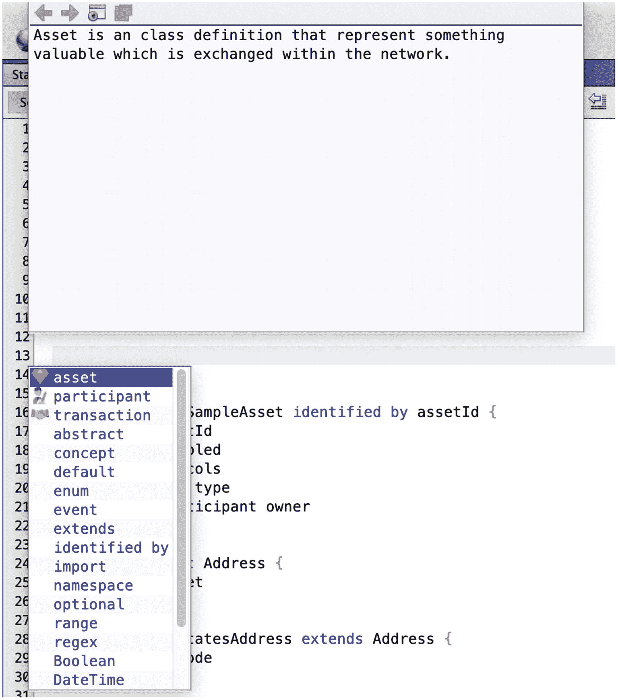

图 11-16
带有自动建议的编辑器

导航器面板
导航器面板让用户能够快速概览编辑器窗口中的内容，即鸟瞰视图。一个典型的例子是 Java 源文件的导航器。让我们为 cto 文件创建这样一个视图。

首先，我们需要在 `pom.xml` 中添加两个新的 Maven 依赖项。

```
org.netbeans.api
org-netbeans-spi-navigator
${netbeans.version}

org.netbeans.api
org-openide-explorer
${netbeans.version}

```

让我们定义一个模型类，用于表示 cto 文件中的资源。它包含名称、类型以及出现位置的偏移量：

```
public class CtoResource {
private final String name;
private final int type;
private final int offset;
public CtoResource(String name, int type, int offset) {
this.name = name;
this.type = type;
this.offset = offset;
}
public String getName() {
return name;
}
public int getType() {
return type;
}
public int getOffset() {
return offset;
}
}
```

导航器的起点是实现 `org.netbeans.spi.navigator.NavigatorPanel` 接口，并使用 `NavigatorPanel.Registration` 注解进行注册。

```
@NbBundle.Messages({
"CTO_NAV_NAME=Composer 模型",
"CTO_NAV_HINT=文件资源定义的概览。"
})
@NavigatorPanel.Registration(mimeType = FileType.MIME, position = 500, displayName = "#CTO_NAV_NAME")
public class CtoNavigatorPanel implements NavigatorPanel {
private static final RequestProcessor RP = new  RequestProcessor(CtoNavigatorPanel.class.getName(), 1);
private final JComponent view = new MembersView();
private Optional rootNode = empty();
private Lookup.Result selection;
private final LookupListener selectionListener = ev -> {
RP.post(() -> {
rootNode.ifPresent(n -> {
n.getFactory().cleanup();
rootNode = empty();
});
if (selection != null) {
display(selection.allInstances());
}
});
};
@Override
public String getDisplayName() {
return CTO_NAV_NAME();
}
@Override
public String getDisplayHint() {
return CTO_NAV_HINT();
}
@Override
public JComponent getComponent() {
return view;
}
@Override
public void panelActivated(Lookup lkp) {
selection = lkp.lookupResult(DataObject.class);
selection.addLookupListener(selectionListener);
selectionListener.resultChanged(null);
}
@Override
public void panelDeactivated() {
selectionListener.resultChanged(null);
selection.removeLookupListener(selectionListener);
selection = null;
}
@Override
public Lookup getLookup() {
return view.getLookup();
}
private void display(Collection selectedFiles) {
if (selectedFiles.size() == 1) {
DataObject dataObject = selectedFiles.iterator().next();
RootNode node = new RootNode(dataObject);
node.getFactory().register();
rootNode = of(node);
view.getExplorerManager().setRootContext(node);
} else {
view.getExplorerManager().setRootContext(Node.EMPTY);
}
}
}
```

`MembersView` 类是一个 Swing 组件，它包含来自 Explorer API 的 `org.openide.explorer.view.BeanTreeView`，并将其与 `org.openide.explorer.ExplorerManager` 和 `org.openide.util.Lookup` 连接起来。

```
final class MembersView extends JPanel implements ExplorerManager.Provider, Lookup.Provider {
private final ExplorerManager manager;
private final Lookup lookup;
private final BeanTreeView view;
MembersView() {
this.manager = new ExplorerManager();
this.lookup = ExplorerUtils.createLookup(manager, new ActionMap());
view = new BeanTreeView();
view.setSelectionMode(ListSelectionModel.SINGLE_SELECTION);
setLayout(new BorderLayout());
add(view, BorderLayout.CENTER);
}
@Override
public ExplorerManager getExplorerManager() {
return manager;
}
@Override
public Lookup getLookup() {
return lookup;
}
@Override
public boolean requestFocusInWindow() {
return view.requestFocusInWindow();
}
}
```

`CtoNavigatorPanel` 类中的可选根节点是 cto 文件中资源的父节点。创建节点时，它会从文件本身获取名称，但在解析内容后，会使用命名空间进行更新。

```
final class RootNode extends DataNode {
private final MembersFactory factory;
RootNode(DataObject obj) {
super(obj, Children.LEAF);
factory = new MembersFactory(this);
setIconBaseWithExtension(FileType.ICON);
setChildren(Children.create(factory, true));
}
MembersFactory getFactory() {
return factory;
}
}
```

`ChildNode` 类是 cto 文件中资源的可视化表示。该类还提供了一个操作，允许用户导航到编辑器中的源代码位置。对于此功能，我们使用 `NbDocument` 工具类：


```
public final class ChildNode extends AbstractNode{
@StaticResource
private static final String ICON = "org/netbeans/modules/hyperledger/cto/blue.png";
private static final String MEMBER = "%s : %s";
private static final RequestProcessor RP = new RequestProcessor();
private final DataObject dataObject;
private final CtoResource resource;
private final Action openAction = new AbstractAction() {
@Override
public void actionPerformed(ActionEvent event) {
RP.post(() -> {
NbDocument.openDocument(dataObject, resource.getOffset(),
Line.ShowOpenType.OPEN, Line.ShowVisibilityType.FOCUS);
});
}
};
public ChildNode(DataObject dataObject, CtoResource resource) {
super(Children.LEAF);
this.dataObject = dataObject;
this.resource = resource;
setIconBaseWithExtension(ICON);
String type = NameMapping.map(resource.getType());
setDisplayName(format(MEMBER, resource.getName(), type));
}
@Override
public Action getPreferredAction() {
return openAction;
}
}
```

子节点的构建委托给一个继承自 `org.openide.nodes.ChildFactory` 的工厂。
子节点将借助 `CtoParser` 创建。
请创建一个包含以下内容的新类：

```
final class MembersFactory extends ChildFactory {
private Collection resources = new ArrayList();
private final DataNode root;
private final FileChangeAdapter adapter = new FileChangeAdapter() {
@Override
public void fileChanged(FileEvent fe) {
refresh(false);
}
};
MembersFactory(DataNode root) {
this.root = root;
}
private FileObject getPrimaryFile() {
return getDataObject().getPrimaryFile();
}
private DataObject getDataObject() {
return root.getDataObject();
}
@Override
protected Node createNodeForKey(CtoResource resource) {
if (CtoLexer.NAMESPACE == resource.getType()) {
updateRootName(resource.getName());
return null;
} else {
return new ChildNode(getDataObject(), resource);
}
}
@Override
protected boolean createKeys(List toPopulate) {
ParserListener listener = new ParserListener();
try {
String text = getPrimaryFile().asText();
CtoParser parser = ParserProvider.INSTANCE.apply(text);
parser.addParseListener(listener);
parser.modelUnit();
} catch (IOException ex) {
Exceptions.printStackTrace(ex);
}
resources = listener.getResources();
resources.forEach(toPopulate::add);
return true;
}
private void updateRootName(String rootName) {
String oldName = root.getDisplayName();
if (!rootName.equals(oldName)) {
root.setDisplayName(rootName);
}
}
void register() {
getPrimaryFile().addFileChangeListener(adapter);
}
void cleanup() {
getPrimaryFile().removeFileChangeListener(adapter);
}
}
```

`ParserListener` 可以附加到解析器上。它监听解析器进入或退出规则时发生的事件，这些规则先前已在语法文件中定义。监听器将收集我们希望在导航器中显示的规则名称和类型。

```
public final class ParserListener extends CtoParserBaseListener {
private final List resources = new ArrayList();
public List getResources() {
return resources;
}
private void addNode(TerminalNode node, int type, int offset) {
if (node != null && !(node instanceof ErrorNode)) {
addNode(node.getText(), type, offset);
}
}
private void addNode(String text, int type, int offset) {
resources.add(new CtoResource(text, type, offset));
}
private int getStart(ParserRuleContext ctx) {
return ctx.getStart().getStartIndex();
}
@Override
public void exitNamespaceDeclaration(CtoParser.NamespaceDeclarationContext ctx) {
CtoParser.QualifiedNameContext qualCtx = ctx.qualifiedName();
if (qualCtx != null) {
List identifiers = qualCtx.IDENTIFIER();
String name = identifiers.stream().map(TerminalNode::getText).collect(Collectors.joining("."));
addNode(name, CtoLexer.NAMESPACE, getStart(ctx));
}
}
@Override
public void exitAssetDeclaration(CtoParser.AssetDeclarationContext ctx) {
addNode(ctx.IDENTIFIER(), CtoLexer.ASSET, getStart(ctx));
}
@Override
public void exitParticipantDeclaration(CtoParser.ParticipantDeclarationContext ctx) {
addNode(ctx.IDENTIFIER(), CtoLexer.PARTICIPANT, getStart(ctx));
}
@Override
public void exitTransactionDeclaration(CtoParser.TransactionDeclarationContext ctx) {
addNode(ctx.IDENTIFIER(), CtoLexer.TRANSACTION, getStart(ctx));
}
@Override
public void exitEventDeclaration(CtoParser.EventDeclarationContext ctx) {
addNode(ctx.IDENTIFIER(), CtoLexer.EVENT, getStart(ctx));
}
@Override
public void exitEnumDeclaration(CtoParser.EnumDeclarationContext ctx) {
addNode(ctx.IDENTIFIER(), CtoLexer.ENUM, getStart(ctx));
}
@Override
public void exitConceptDeclaration(CtoParser.ConceptDeclarationContext ctx) {
addNode(ctx.IDENTIFIER(0), CtoLexer.CONCEPT, getStart(ctx));
}
}
```

现在，当我们打开模型文件时，导航器窗口（图 11-17）将显示文件中资源的概览。

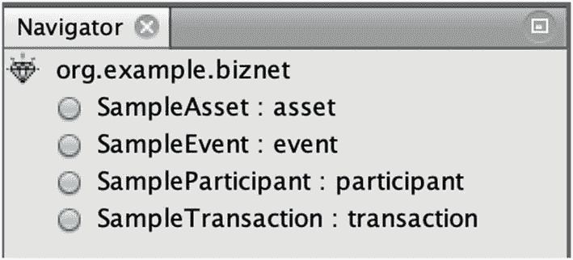

**图 11-17** 导航器显示文件中的资源

但是，如果你在编辑器中更改了这些名称之一，你会注意到它对导航器没有即时影响。只有在保存文件后，导航器的内容才会更新。我们需要监听编辑器中的更改，并触发一个事件来强制导航器更新节点。一种方法是查找当前打开的编辑器，并在其中附加一个文档监听器。但这意味着大量的样板代码。不过，我们已经在语法高亮部分创建了一种处理编辑器文本的方法。让我们将其扩展以处理来自解析器监听器的结果，然后将其传递给导航器窗口中节点的工厂。

首先，打开 `CtoProxyParser` 类，并将资源添加到解析器结果中：

```
public static class CtoParserResult extends Parser.Result {
private boolean valid = true;
private final List resources;
private final List errors;
public CtoParserResult(Snapshot snapshot, List resources, List errors) {
super(snapshot);
this.resources = resources;
this.errors = errors;
}
public List getResources() {
if (!valid) {
return emptyList();
}
return resources;
}
```

通过使用解析器监听器，扩展 `CtoProxyParser` 的解析方法，并将监听器的结果传递给我们更新过的类：

```
@Override
public void parse(Snapshot snapshot, Task task, SourceModificationEvent sme) throws ParseException {
String text = snapshot.getText().toString();
CtoParser ctoParser = parserProvider.apply(text);
ParserListener listener = new ParserListener();
ErrorParserListener errorListener = new ErrorParserListener();
ctoParser.addParseListener(listener);
ctoParser.addErrorListener(errorListener);
//执行解析
ctoParser.modelUnit();
List resources = listener.getResources();
List errors = errorListener.getSyntaxErrors();
parserResult = new CtoParserResult(snapshot, resources, errors);
}
```


我们需要一个解决方案来将这些资源发送到节点工厂。为此，我们将使用 NetBeans Lookup。因此，创建一个实现 `Lookup.Provider` 的新枚举。建议将该枚举放在一个全新的包中的 `LookupContext.java` 文件里，因为它将充当不相关类或包之间的中介。

```
public enum LookupContext implements Lookup.Provider{
INSTANCE;
private final InstanceContent content;
private final Lookup lookup;
private LookupContext() {
this.content = new InstanceContent();
this.lookup = new AbstractLookup(content);
}
@Override
public Lookup getLookup() {
return lookup;
}
public void add(Object inst) {
content.add(inst);
}
public void remove(Object inst) {
content.remove(inst);
}
}
```

我们将在为错误提示创建的 `NotificationResultTask.java` 中使用这个 `LookupContext`。在该类的 `run` 方法中添加以下代码行：

```
@Override
public void run(Parser.Result result, SchedulerEvent se) {
CtoProxyParser.CtoParserResult ctoResult = (CtoProxyParser.CtoParserResult) result;
if (ctoResult.isValid()) {
LookupContext.INSTANCE.add(ctoResult.getResources());
...
```

让我们在 `MembersFactory.java` 中消费这些资源。请注意，仅显示了该类中所需的更改：

```
final class MembersFactory extends ChildFactory implements LookupListener {
private final LookupContext lookupContext = LookupContext.INSTANCE;
private boolean fromFile = true;
private Lookup.Result selection;
private final FileChangeAdapter adapter = new FileChangeAdapter() {
@Override
public void fileChanged(FileEvent fe) {
fromFile = true;
refresh(false);
}
};
@Override
protected boolean createKeys(List toPopulate) {
if(fromFile) {
resources = parseFile();
fromFile = false;
}
resources.forEach(toPopulate::add);
return true;
}
private List parseFile() {
ParserListener listener = new ParserListener();
try {
String text = getPrimaryFile().asText();
CtoParser parser = ParserProvider.INSTANCE.apply(text);
parser.addParseListener(listener);
parser.modelUnit();
} catch (IOException ex) {
Exceptions.printStackTrace(ex);
}
return listener.getResources();
};
void register() {
getPrimaryFile().addFileChangeListener(adapter);
selection = lookupContext.getLookup().lookupResult(List.class);
selection.addLookupListener(this);
}
void cleanup() {
getPrimaryFile().removeFileChangeListener(adapter);
selection.removeLookupListener(this);
}
@Override
public void resultChanged(LookupEvent ev) {
if (selection != null) {
//消费并移除
Collection results = selection.allInstances();
if (!results.isEmpty()) {
members = results.iterator().next();
lookupContext.remove(members);
refresh(false);
}
}
}
}
```

运行该插件，当你在编辑器中更改资源的名称时，你将在导航器中看到效果。

签名和共享插件
创建插件后，可以通过 Apache NetBeans 插件门户与社区共享。通过插件门户提供的插件可以被社区中的任何人安装。插件门户可通过 Web 浏览器在网址 [`http://netbeans-vm.apache.org/pluginportal/`](http://netbeans-vm.apache.org/pluginportal/) 在线访问，^(⁴) 也可以在 Apache NetBeans IDE 中通过选择“工具” ➤ “插件”来访问。
为了共享插件，必须使用证书对其进行签名，证书可以是自签名的，也可以是由证书颁发机构验证的。签名过程与将要分发的任何 Java JAR 归档文件的签名过程大致相同。签名 JAR 或 NBM 文件有几种不同的方法，包括手动签名或将签名过程集成到构建中。在本节中，我们将介绍如何将该过程集成到 Maven 构建中。

签名项目

可以使用 Java keytool 实用程序为基于 ANT 或 Maven 的项目创建密钥库，然后更新构建文件以将密钥库集成到构建中，从而对项目进行签名以便分发。在此示例中，将更新项目的基于 Maven 的 POM 文件以包含生成的密钥库。首先，打开命令行或终端，进入项目目录，然后执行 keytool 命令来生成密钥库。

```
cd ../path-to-project
keytool -genkey -storepass your-password -alias your-project-alias -keystore nbproject/private/keystore
```

注意
请务必将密钥库和密钥密码设置为相同的值。
确保 nbproject/private 目录不会随归档文件一起分发，也不会提交到版本控制系统。

生成密钥库并将其保存到诸如 nbproject/private 之类的目录后，可以更新项目 POM 文件以包含生成 NBM 文件时所需的 nbm-maven-plugin 配置。只需将以下配置添加到 nbm-maven-plugin 插件部分即可。

```
org.codehaus.mojo
nbm-maven-plugin
3.14.1
true

false
org.netbeans.modules.hyperledger
Your Name
https://github.com/mario-s/nb-hyperledger
nbproject/private/keystore
your-project-alias
Creative Commons BY 3.0
https://creativecommons.org/licenses/by/3.0/

```

创建 NBM

如果你只有一个插件需要打包分发，最简单的创建二进制文件的方法是生成一个 NBM。有几种方法可以创建已签名的 NBM。首先，如果你不打算对 NBM 进行签名以便将其包含在插件中心，只需通过 Apache NetBeans 生成 NBM 即可。为此，请在 Apache NetBeans 中执行以下步骤：

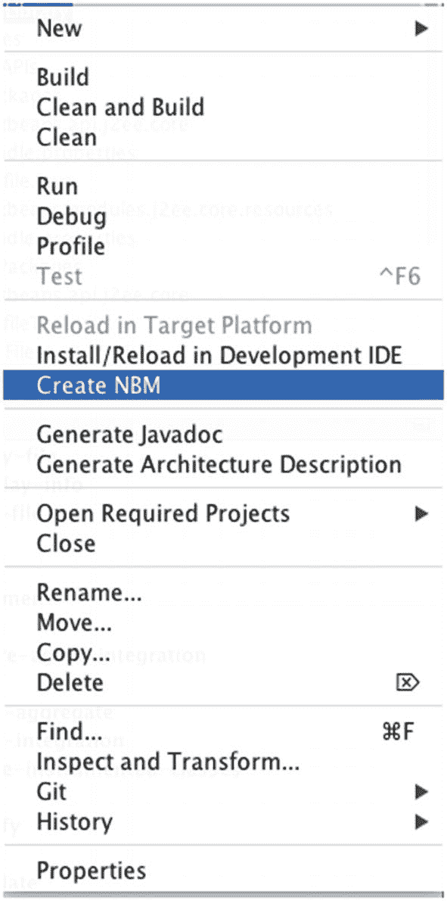

图 11-18
为插件分发创建 NBM 文件

*   右键单击 Hyperledger Support 项目，然后选择“创建 NBM”（图 11-18）。IDE 将编译项目并将其打包成一个可分发的二进制 NBM 文件。生成后，该文件将出现在项目的“build”目录中。

要生成已签名的 NBM，可以通过命令行或终端进入项目目录并执行以下命令来完成 Maven 构建：

```
mvn clean package nbm:nbm -Dkeystorepass=your-password
```

NBM 签名并打包完成后，即可将其加载到插件门户中。请按照以下步骤将插件上传到门户。

1.  使用 Sonatype 提供的说明（[`https://central.sonatype.org/pages/ossrh-guide.html`](https://central.sonatype.org/pages/ossrh-guide.html)）将插件上传到 Maven Central。

2.  如果你还没有 Google 帐户，请创建一个。

3.  访问 Apache NetBeans 插件门户（[`http://netbeans-vm.apache.org/pluginportal/`](http://netbeans-vm.apache.org/pluginportal/)），并使用右上角的**登录**按钮进行身份验证。

4.  在主菜单中点击“**添加插件**”按钮。

5.  为你的插件提供相关信息（`groupId` 和 `artifactId` 值），然后点击“**添加插件**”按钮。这两个值包含在 `maven-metadata.xml` 文件中。所有其他信息应自动添加。建议为你的插件添加主页和缩略图。选择“**保存插件**”。

6.  在“我的插件”页面中选择适合你插件的 Apache NetBeans 版本，这将打开“版本管理”页面。

7.  选择适当的兼容 Apache NetBeans 版本，提供可选的发布信息，然后选择“**保存插件版本**”。


8.  如果你认为该插件符合插件门户的质量标准（参见维基：[`https://cwiki.apache.org/confluence/display/NETBEANS/Quality+criteria+for+Plugin+Portal+Update+Center`](https://cwiki.apache.org/confluence/display/NETBEANS/Quality%252Bcriteria%252Bfor%252BPlugin%252BPortal%252BUpdate%252BCenter)），你可以选择通过点击“**请求验证**”按钮，让你的插件接受验证并获批发布。

总结
在本章中，我们逐步学习了如何使用 Maven 为一种新语言创建 NetBeans 插件的若干指南。你已经看到，为新项目创建模板、识别新文件类型，以及借助 ANTLR 实现语法高亮和错误提示是多么容易。我们还涉及了代码补全和导航窗口。NetBeans 的查找 API 被用于包之间的通信。最后，你了解了签名和发布插件所需的必要步骤。
在下一章中，你将了解 NetBeans 为何被移至 Apache 软件基金会的旗下，以及你如何为该项目做出贡献。

脚注

第三部分参与 Apache NetBeans

12. Apache NetBeans 流程

使 Apache 软件基金会（简称“Apache”）对 NetBeans 而言既特殊又合适的原因在于其治理模式。人们常常会问：“既然 NetBeans 过去是、现在也一直是免费且开源的，它真的需要 Apache 吗？”这正是我们将在本章中探讨的问题。
在本章结束时，我们希望你能理解 NetBeans 迁移至 Apache 的背景、此次迁移带来的好处，尤其是你如何亲自参与到该项目中并做出贡献。

关于酒馆与传说
传说 NetBeans 起源于布拉格的酒馆和饮酒场所。从很多方面来说，这确实是真的。1996 年，一群来自布拉格工业大学的学生开发了一个工具，用于支持当时尚属新兴且缺乏工具的 Java 开发。根据同样的传说，当时开发工作进展不多，但酒水消耗不少；尽管该工具的计划描述得很详尽，但直到这些学生毕业并意识到他们拥有一个时机已到的好主意后，这些计划才得以实现。
“NetBeans”这个奇特的名字也可以从这个角度来理解：当时的两大热门话题是“JavaBeans”和“Network”，将这两个术语合二为一，就像现在的“Facebook”和“Netflix”一样合乎逻辑。不久之后，当 Java 之父詹姆斯·高斯林和当时领导 Sun 公司工具部门的乔纳森·施瓦茨在一次会议上看到 NetBeans 的演示，并认识到它可以作为让新开发者快速、全面地开启 Java 之旅的环境基础时，Sun 微系统公司（简称“Sun”）便收购了 NetBeans。
Sun 将 NetBeans 定位为引导新 Java 开发者入门、并让专业开发者高效工作的工具，随后将其开源，并着手对其进行模块化改造。根据另一个传说，NetBeans 的开发者无论如何都主要对创建一个模块化框架感兴趣，然后在其模块化框架之上创建了 NetBeans 集成开发环境（IDE），纯粹是为了证明该框架。这样一来，开发环境反而成了事后才考虑的事情，而其底层的 NetBeans 平台（你在第二部分中已了解）才是开发者关注的核心领域。

向 Apache 的模块化迁移
无论如何，模块化已被证明是 NetBeans 的关键优势之一，尤其是在迁移至 Apache 的过程中。
2010 年甲骨文收购 Sun 后，NetBeans 在其新东家那里有了许多有趣的新用例。它成为了甲骨文 JDeveloper 的基础，其多项功能（如窗口系统、GUI 构建器和分析器）都在那里被复用。在甲骨文实验室，它成为了围绕新型多语言 GraalVM 的工具链的核心部分。然而，部分由于社区持续要求更直接地参与 NetBeans 的开发，部分由于优先级调整，部分也是为了分担维护成本，甲骨文于 2016 年 10 月决定将 NetBeans 捐赠给 Apache。
甲骨文非常明确地表示，它希望继续向 NetBeans 投入资源，并且将其捐赠给 Apache 的决定绝不意味着它在放弃 NetBeans。事实上，作为其既定方向的证据，甲骨文 Java 组织内的一支开发者团队至今仍在持续为 NetBeans 工作，专注于提供与 Java 开发工具包（JDK）和 Java 语言新特性相关的 Java 编辑器增强功能。
此外，甲骨文内部的一个团队从迁移之初就开始工作，并每周开会讨论代码向 Apache 迁移的当前状态、分配任务、报告进展等。


炼狱与孵化
Apache 孵化器（简称“孵化器”或“孵化阶段”）类似于某种“炼狱”，即罗马天主教概念中介于尘世与天堂之间的净化阶段。或者说，它是一个“过渡期”，旧事物尚未消亡，新事物尚未诞生。

首先需要澄清一个误解：孵化阶段发布的版本绝非“Beta”版。孵化器的存在是为了让有志成为 Apache 项目的社区能够学会如何完全遵守 Apache 的要求，同时了解 Apache 特有的开放治理形式。

Apache 会指派导师来指导和协助有志成为 Apache 的社区，确保项目不偏离轨道，或做出不符合 Apache 之道的行为。Apache 之道是一套成熟的治理原则，Apache 项目据此进行管理，源代码也据此发布。

Apache 之道的详细信息可在网上查阅（[`apache.org/theapacheway`](https://apache.org/theapacheway)），此处不再赘述其方方面面。但足以说明的是，社区如何协作以及以 Apache 名义发布的代码的许可协议，均在 [`apache.org`](https://apache.org) 上有明确规定，这为 Apache 在整个行业中强大而可靠的品牌形象奠定了基础。每个以 Apache 名义开展的项目都应被视为符合其原则，这意味着有志成为 Apache 项目的新社区需要掌握一套原则和概念。

在离开孵化器成为正式 Apache 项目（即“顶级项目”）之前，有志成为 Apache 的项目需要跨越一系列障碍，以证明其理解 Apache 之道，并能够作为正式 Apache 项目运作。孵化过程中的一个关键里程碑是发布版本；事实上，社区在尝试成为顶级项目并离开孵化器之前，必须在孵化器中完成至少一次发布。

Apache NetBeans 社区在孵化器中完成了三次发布。下文将描述每次发布在源代码发布、提供功能以及项目在孵化器内进展方面的情况。

在进一步说明之前，有必要指出：Apache 发布的是源代码，而非功能、安装程序、可执行文件或二进制文件。这些通常由其他组织（例如 *OpenBeans*，参见 [`openbeans.org`](https://openbeans.org)）创建，就像 Ubuntu 打包 Debian 一样。因此，严格从 Apache 的角度来看，每次发布的重点仅在于源代码。从 Apache 的角度看，一个版本是否提供新功能，或是否提供便利的二进制文件（作为帮助源代码用户的可选方式，例如安装程序），都无关紧要，因为其关注点仅在于源代码，从而使得上游组织（如前述的 *OpenBeans*）能够根据需要，基于二进制文件、安装程序及其他更用户友好的便利设施来构建商业模式。

另需简要说明的是，我们决定延续版本号，即不从 Apache NetBeans 1.0 开始，而是沿用 Oracle NetBeans 最后一个版本号之后的主版本号，即从 8.2 之后开始，这意味着第一个 Apache NetBeans 版本号定为“9.0”。

Apache NetBeans（孵化中）9.0
孵化器中首次发布的重点仅仅是经历一次 Apache 的发布流程（这本身就是一个结构严谨的过程），同时以 Apache 孵化器的名义，实际发布当时 Oracle 已贡献给 Apache 的 NetBeans 源代码中的重要部分。

NetBeans 的基础是底层的应用程序框架，位于“平台”模块集群中。按理说，首次发布本应纯粹专注于发布该集群。但我们的想法是，也包含一些对 Apache NetBeans 用户实际有用的功能，而不仅仅是让开发者将 NetBeans 平台用作其软件的基础。

因此，除了“平台”集群外，首次 Apache NetBeans 发布也重点关注了“ide”和“java”集群。这样一来，即使 NetBeans 的其他所有部分仍在准备纳入后续版本的过程中，Java 开发者也能使用 Apache NetBeans 9.0。这里的关键点是，要从 Apache 发布源代码，需要将其重新许可给 Apache。由于 NetBeans 的某些部分不符合 Apache 的许可要求，这些部分需要被移除或重写，而非发布。如果我们等到所有代码都捐赠完毕并准备好由 Apache 发布，那么首次发布将需要数年时间才能准备就绪。而正如本场景所示，模块化方法使得 Apache NetBeans 的特定部分能够以增量方式逐步发布。

然而，另一个转折点是，首次 Apache NetBeans 发布（如上所述，专注于与 Java 开发功能相关的源代码）并未简单地提供 Oracle 最后发布的 NetBeans 版本所具备的精确 Java 功能。这是因为自 NetBeans IDE 8.2 发布以来，JDK 9 已经发布，而 Oracle 的开发人员在将 NetBeans 捐赠给 Apache 之前，已经在 NetBeans 中创建了多项专门支持 JDK 9 新特性的功能。JDK 9 的主要特性是引入了新的 Jigsaw 模块系统，其初衷主要是为了实现 JDK 自身的模块化。然而，任何 Java 应用程序都可以使用相同的模块系统。在 Apache NetBeans 9.0 中，Oracle 开发人员为 NetBeans 创建的、用于支持 JDK 9 Jigsaw 模块系统的功能也一并发布了，特别是帮助 NetBeans 用户入门 Jigsaw 的新项目类型，以及对相关“module-info.java”Jigsaw 注册文件的支持。

JDK 9 还引入了一个名为 JShell 的 REPL（读取-求值-打印循环）工具，以及一个名为 JLink 的打包工具。对于这两项新的 JDK 特性，Apache NetBeans 9.0 都提供了开箱即用的集成和支持。

最初，Apache NetBeans 的计划是专注于 JDK 9。然而，由于 NetBeans 从 Oracle 移交到 Apache 的过程出现延迟，JDK 9 已经发布。事实上，JDK 10 也已经发布。因此，Apache NetBeans 9.0 转而专注于支持 JDK 10，既包括在其上运行的能力，也包括对其增强功能的支持。幸运的是，仅从 Java 开发者的角度来看（即就开发者编写的代码而言），JDK 10 仅引入了“var”关键字，即“局部变量类型推断”。为了让 NetBeans 用户从中受益，Java 编辑器得到了增强，支持在 Java 类型和“var”关键字之间切换，同时还提供了检查和分析器，以便在文件、包和项目之间进行切换。

Apache NetBeans 9.0 于 2018 年 7 月 29 日发布，距离 Oracle 宣布将 NetBeans 捐赠给 Apache 不到两年。考虑到 Oracle 方面审计流程的复杂性、Apache 的许可要求，以及在 Apache 中为 NetBeans 工作的每个人都是志愿者这一事实，这个进度相当不错。事实上，这最初两年的阶段让每个人都有时间适应 NetBeans 项目的新阶段，相互了解，并理解在 Apache 旗帜下工作在日常层面意味着什么。


Apache NetBeans（孵化中）10.0
随着 Apache NetBeans 9.0 的发布，人们首先提出的问题之一是：“嘿，PHP 和 JavaScript 呢？Apache 是否从 NetBeans 中移除了这些功能？” 一个最令人沮丧但可以理解的方面是，开源项目的用户往往不像其开发者那样密切关注项目进展。随后引发了一阵抱怨声，许多 NetBeans 用户突然冒出来抱怨，显然 Apache NetBeans 从此以后只会关心 Java 开发者，而不再关心它过去所支持的其他技术和语言的开发者。

当然，正如之前已经详细解释过的，我们专注于在不同版本中发布 NetBeans 的不同部分，因为构成 NetBeans 的所有组件尚未全部从 Oracle 接收，也尚未全部重新授权给 Apache。

Apache NetBeans 10.0 于 2018 年 12 月 27 日发布，其重点是提供 PHP 功能，这也意味着同时提供 HTML5/JavaScript 功能，因为前者依赖于后者。此次发布的不仅是 Oracle 捐赠的与这些功能相关的代码，此外，在此期间，还首次提供了许多额外功能，特别是对当时最新 PHP 版本 PHP 7.4 的新支持。

此外，10.0 版本还重点关注了 JDK 11，特别是除了能够在 JDK 11 上运行之外，还提供了对 lambda 表达式中“var”的新支持。除了其他修复和增强之外，Apache NetBeans 10.0 还引入了对 JUnit 5 的支持，特别是针对基于 Apache Maven 的项目。

Apache NetBeans（孵化中）11.0
Apache NetBeans 11.0 于 2019 年 4 月 4 日发布，是孵化器中的第三个主要版本。

多年来，NetBeans 社区一直在讨论如何最好地表达 Apache Maven 和 Gradle 是比 Apache Ant 更现代、更值得关注的选择，但同时又不想暗示使用 Apache Ant 有任何问题，这一点使问题变得复杂。

因此，在 Apache NetBeans 11.0 中，重新设计了“新建项目向导”，即 NetBeans 用户的入口点。Java 向导被移到了一个名为“Java with Ant”的子文件夹中，同时新增了两个类别：“Java with Maven”和“Java with Gradle”。希望这能让新用户更容易为他们喜欢的项目选择起点，同时突出显示 Maven 和 Gradle 应优先于 Ant。

此外，首次引入了对 Gradle 的初步支持。多年来，许多用户一直要求提供将 NetBeans 与 Gradle 集成的功能。对 Oracle 来说，这从来都不是一个高优先级事项，尽管一个提供 Gradle 集成功能的外部插件被开发出来并广受欢迎。从 Oracle 的角度来看，这是一个足够好的解决方案，因为 Oracle 无需投入任何开发人员时间资源，而需要该集成的用户可以通过外部插件来使用它。当然，直接开箱即用地集成外部技术（如 Gradle）总是更可取的。随着 NetBeans 归属 Apache，优先级不再由 Oracle 决定，直接开箱即用地集成 Gradle 变得只受限于是否有一个或多个贡献者能够提供它。在 Apache NetBeans 11.0 的发布周期中，这一目标成功实现了。

除了这些关注点之外，Apache NetBeans 11.0 的一个关键重点是 Oracle 捐赠给 Apache 的代码的下一阶段集成，即与企业 Java（即 Java/Jakarta EE）相关的功能集群。在 Apache NetBeans 11.0 发布前的几个月里，我们一直忙于审查“企业”功能集群的许可证，该集群来自 Oracle 向 Apache 的第二次 NetBeans 捐赠，审查工作在发布前及时完成，使得这些功能能够被纳入其中。因此，从该版本开始，NetBeans 用户无需安装插件，即可使用 Ant 或 Maven 创建、编辑、构建和部署 Java EE 应用程序，对 Gradle 的支持计划在下一个版本中提供。

然而，对 Java EE 8 的显式支持，例如 NetBeans 用户界面元素中的特定模板或规范编号的提及，并未包含在 Apache NetBeans 11.0 中。但与此同时，请注意 Java EE 8 仅能在 JDK 8 上运行，而不能在后续版本上运行，因此对于使用 Java EE 8 进行开发的用户来说，最好还是在 JDK 8 上运行 NetBeans 本身。

最后，与 Apache NetBeans 9.0 提供对 JDK 9 和 10 的支持、Apache NetBeans 10.0 提供对 JDK 11 的支持一样，Apache NetBeans 11.0 也提供了对 JDK 12 的支持。Apache NetBeans 11.0 版本在 JDK 12 上进行了测试，同时提供了新的编辑器提示和功能，以支持开发者利用 JDK 12 中的语法级特性。


晋升为顶级 Apache 项目
天下没有不散的筵席，NetBeans 在孵化器中的时光也是如此。一段时间以来，指派给我们的热心导师就一直在建议，是时候离开孵化器了。这意味着 NetBeans 将不再处于孵化器阶段，而将成为 Apache 的正式项目。对于外界来说，孵化器可能有些令人困惑，也就是说，有些人往往会质疑从孵化器出来的代码状态；例如，“这是 Beta 版本的质量吗？”、“NetBeans 还在孵化器中，我们能依赖它吗？”等等，这些都是人们常问的问题。

此外，孵化器外部的发布流程比内部更快，因为孵化器的发布要经过两个阶段的发布投票——首先由社区投票决定某个仓库是否准备好发布，然后由孵化器成员进行投票。如果后者投票失败，就需要进行修复，并且第一阶段需要重新开始。简而言之，两阶段的发布投票过程会显著拖慢发布速度，因此，这本身就是一个项目在准备就绪后，希望离开孵化器继续前进的理由。经历孵化器阶段很重要，因为它能让围绕一个项目的社区成员相互了解，并围绕他们共同项目的发布进行协作。然而，一旦明确一切都能相当顺利地协同运作，就可以启动流程，成为 Apache 的正式项目。

这个过程需要在项目的开发者邮件列表中进行讨论。这次讨论始于 2019 年 2 月，花了一些时间，因为我们同时还在进行一个版本的发布工作。讨论之后，发起了一个投票线程，最终收到了大约 60 票，所有人都同意 NetBeans 已经准备好毕业，这促使孵化器成员之间也启动了关于同一主题的投票。那里的投票也通过了，于是在 2019 年 4 月，NetBeans 成为了 Apache 的正式项目。

随后需要完成各种琐碎的任务，主要涉及从多个地方移除“孵化器”字样。一份新闻稿被整理并发布，开发工作无缝地继续进行，许多链接被重定向到没有“孵化器”字样的位置，例如，邮件列表中的“孵化器”一词，以及网站上关于孵化的一系列免责声明，这些都被修复和移除。

这是一个长达两年半的漫长过程，不过，综合考虑，这个过程算是短暂且相对无痛的。尽管仍有相当多的代码需要由 Oracle 捐赠以完成捐赠，特别是与 C/C++ 特性相关的代码，但围绕 NetBeans 的社区作为 Apache 项目已经协同工作了一段时间，从孵化器毕业为这个过程画上了句号，并完成了 NetBeans 在 Apache 安家落户的初始阶段。

超越孵化器
既然 Apache NetBeans 已经离开了孵化器，它的路线图是什么？可以期待哪些特性？又将在何时实现？嗯，在最简单的层面上，Oracle 尚未完成其捐赠，也就是说，有相当多的代码，特别是与 C/C++ 特性相关的代码，正在 Oracle 内部进行审计和清理。换句话说，Oracle 的员工正在审查待捐赠的代码，并确定这些代码是否真正属于 Oracle，因此 Oracle 是否拥有这些代码，并基于其所有权，能够将这些代码捐赠给 Apache。在某些情况下，经过分析，可能会发现代码是从别处复制而来，或者复用了其他仓库或技术中的代码。只有在完成这类分析之后，代码才能移交给 Apache。

与此同时，Apache NetBeans 的一个关键驱动力将继续是 Java 开发工具包（JDK）的新版本发布。随着 JDK 新版本的发布，像 NetBeans 这样的工具需要做好准备，使开发者能够使用这些新的 JDK 版本进行工作。NetBeans 不仅必须能够在新的 JDK 版本之上运行，而且当 Java 在语法层面发生变化时，Java 编辑器还必须提供支持，例如代码补全和语法着色。NetBeans 中的这项工作主要由 Oracle 的开发者完成，并且构成了 Oracle 在 Apache 中对 NetBeans 承诺的最大部分。例如，JEP-330 提供了在项目范围之外运行单个 Java 源文件的能力，在 NetBeans 中对此功能的支持对于那些教授和学习 Java 的人来说将非常有用，因为无需创建整个项目来容纳单个 Java 源文件。同时，Oracle Labs 专注于 GraalVM，这是 Oracle 开发的新型多语言虚拟机，其工具支持，特别是跨语言调试功能，由 Apache NetBeans 提供。简而言之，Oracle 对 NetBeans 的承诺仍然意义重大，尤其是现在通过接管了 Oracle 治理和发布管理流程的 Apache 流程，已经有了清晰的前进道路。

除此之外，Apache NetBeans 将交付其提交者决定提交的任何内容。在 Gradle 领域正在进行大量工作，同时 PHP 支持也在不断增加更多特性。一旦 C/C++ 特性被捐赠，预计那里也会出现进展，因为使用这些特性的开发者会提供反馈、提交问题和拉取请求。

总结
从本章中要传达的最重要信息是，Apache 就是“你”，没有你的参与，Apache NetBeans 就不会存在。不再有神奇的小精灵在 Sun 或 Oracle 内部的某个地方开发 NetBeans。取而代之的是各种类型和规模的独立贡献者，我们需要你成为这个过程的一部分。缺少什么功能吗？现在，NetBeans 第一次真正属于你，你可以，事实上是必须，让它成为现实。我们都在期待你的第一个拉取请求！

13. Apache 基础设施


Apache NetBeans 在 Apache 基金会下开源发布。因此，加入 Apache NetBeans 开发社区非常容易，并且有多种方式可以实现。Apache 基金会为新手营造了轻松的入门环境，同时也让多年参与社区的成员能够直观地进行贡献。Apache 基金会基础设施中有几个关键部分，在参与 Apache NetBeans 社区时发挥着作用。**JIRA** 是一个问题追踪器，社区成员可以用它来报告问题，并跟踪项目中需要完成的工作。Apache 使用 **Confluence** 作为 Apache NetBeans 维基的项目管理站点。NetBeans 维基是一个专用资源，用于记录围绕项目的开发和计划文档。一系列开放的邮件列表用于协调工作。最后，最公开的焦点——Apache NetBeans 网站——由社区维护。
即使你不打算编写用于构建 Apache NetBeans IDE 的 Java 代码，你也可以通过阅读邮件列表、向 JIRA 提交问题、帮助维护 Confluence 或维基，或者投入时间在 Apache NetBeans 网站上做出贡献。在本章中，我们将介绍如何为构成 Apache NetBeans 社区的这些领域做出贡献。

Apache NetBeans JIRA
参与 Apache NetBeans 社区最简单的方式是报告错误或提出功能增强请求。为此，需要使用 Apache NetBeans JIRA。你可以通过在你喜欢的网络浏览器中访问以下 URL 来访问 JIRA：
[`https://issues.apache.org/jira/projects/NETBEANS/`](https://issues.apache.org/jira/projects/NETBEANS/)`.`

默认情况下，首次打开该网站时，会显示所有“开放”问题。如果你有兴趣为 Apache NetBeans 做出贡献，JIRA 的开放问题是一个很好的起点。浏览这些开放问题，看看是否有你能解决的，或者是否有引起你兴趣的内容（见图 13-1）。

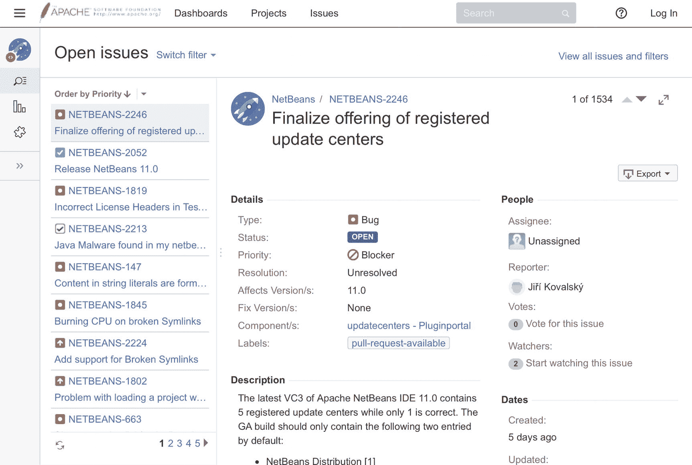

图 13-1
Apache NetBeans JIRA – 开放问题

要充分利用 JIRA，你必须创建一个帐户并登录系统。登录后，你就可以根据需要向追踪器添加新问题。如果你拥有适当的权限，还可以将问题分配给自己、对问题发表评论或更改问题的状态。

要开始浏览系统，请使用屏幕左侧的菜单（图 13-2）。在该菜单中，你会看到看板、发布、报告、问题和组件等选项。

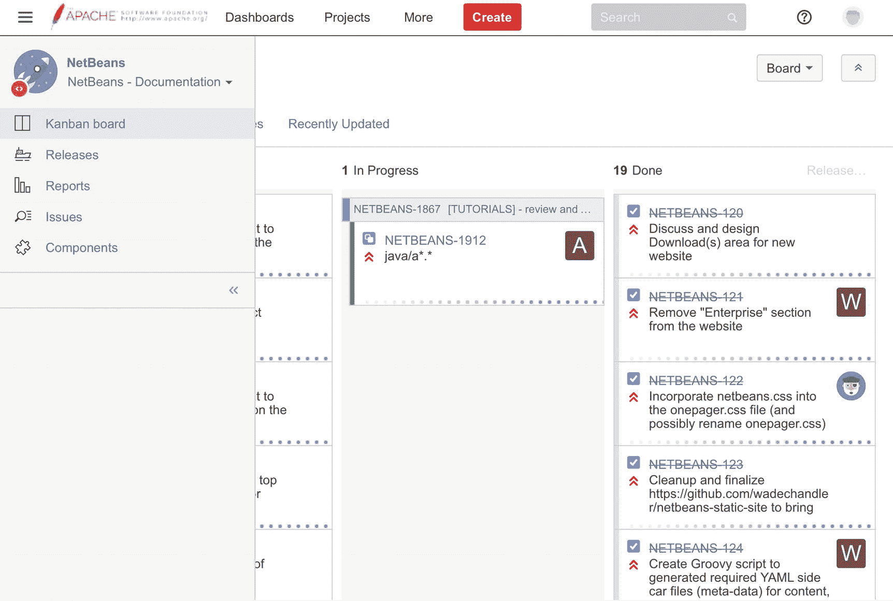

图 13-2
JIRA 导航与看板

**看板**是一个很好的展示界面，包含开放问题、分配给你的问题以及已完成问题。如果你点击看板中的某个问题，它会在屏幕右侧的窗格中打开，使看板保持可见。你可以根据需要随意拖拽看板上的项目，从而按自己的喜好组织看板。看板的一个不错的功能是它在触摸设备上运行良好，可以轻松拖放看板上的项目。

菜单中的下一个是**发布**面板（图 13-3），它可以让用户快速概览 Apache NetBeans 的发布状态。该面板提供有关先前版本以及未来下一个版本的信息。选择某个版本时，会弹出一个气泡，提供该版本问题的快速摘要。

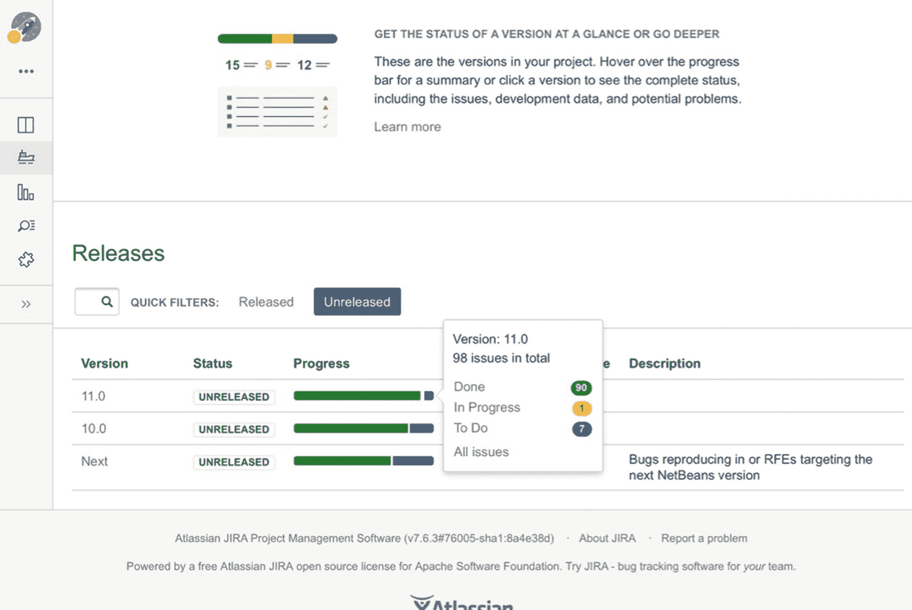

图 13-3
发布面板

**报告**选项提供了一系列报告选项，以不同方式呈现问题追踪器数据。许多报告是可配置的，提供可变的数据时间线。报告类别包括敏捷、问题分析、预测与管理以及其他。每个类别包含一种或多种不同样式的报告。在图 13-4 中，显示了一个问题的累积流图。

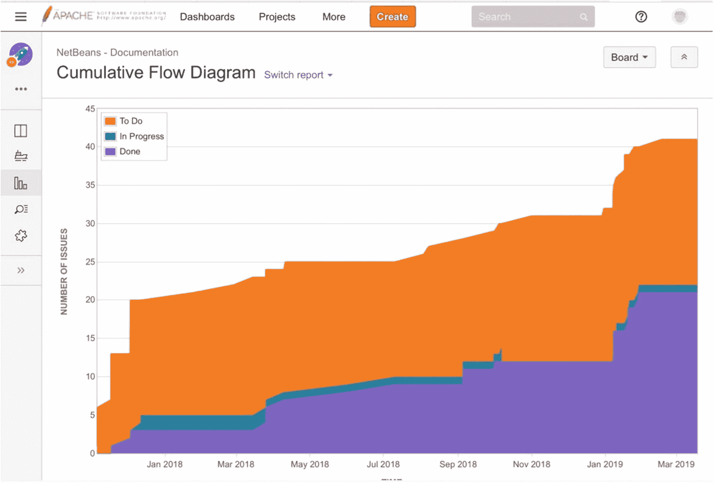

图 13-4
报告选项

**组件**菜单选项按 Apache NetBeans 组件分组显示所有问题。例如，所有 Maven 问题都分组在一起，易于访问。利用组件菜单，可以按组件解析问题，从而轻松专注于 IDE 中某个特定领域的支持。

Apache NetBeans 维基
围绕 Apache NetBeans 的大部分文档都存放在维基中。维基当然是一系列提供 Apache NetBeans 详细信息和资料的在线网页。可以使用以下 URL 访问维基：
[`http://netbeans.apache.org/wiki/index.asciidoc`](http://netbeans.apache.org/wiki/index.asciidoc)`.`
维基围绕一个“配方”风格选项的索引，这些选项被分组到各个部分，索引中的每个选项都涵盖与开发相关的特定主题。有多种方式可以参与更新和为维基做贡献。例如，如果某些流程尚未记录，维基就是记录它们的正确地方。如果你发现维基上的任何信息已过时或需要修改，你可以通过进行这些更新来提供帮助。维基是 Apache NetBeans 拼图中非常重要的一部分，因为来自世界各地的贡献者协作使 Apache NetBeans 成为可能。因此，记录良好的流程对于成功至关重要。

邮件列表
有许多邮件列表可供加入，以保持信息畅通并与用户或开发社区中的其他人沟通。

公告 (announce@netbeans.incubator.apache.org)
“公告”邮件列表适用于希望在新版本发布时及时了解信息的人。此邮件列表通常流量较低，旨在作为一个高级别的通知列表，同时最大限度地减少邮件数量。

用户 (users@netbeansincubator.apache.org)
“用户”邮件列表面向 NetBeans 用户社区。如果你有关于 IDE 使用的问题，那么这里就是你要去的地方。由于此邮件列表涵盖的主题非常广泛，建议在主题行中添加前缀标签，以指示邮件中讨论的主题。

NetCat (netcat@netbeans.incubator.apache.org)
NetCat 邮件列表适用于参与 Apache NetBeans NetCat 测试和社区验收计划的人员。

开发 (dev@netbeans.incubator.apache.org)
开发 Apache NetBeans 的人员应加入开发者邮件列表。此列表也面向那些致力于通过文档、活动和教程推广 IDE 的人员。

提交 (commits@netbeans.incubator.apache.org)
如果你希望密切关注 Apache NetBeans GitHub 仓库，那么提交邮件列表适合你。每次有提交时，此邮件列表的成员都会收到通知。

通知 (notifications@netbeans.incubator.apache.org)
要密切关注 GitHub 仓库的问题、评论和拉取请求，请关注通知邮件列表。每当问题上有评论或提出拉取请求时，此列表的每位成员都会收到通知。


网站
Apache NetBeans 最显眼的在线存在形式是其网站。
网站是几乎任何人都可以参与的领域之一，无论是精通编码的技术人员，还是非常出色的编辑……网站可以充分利用来自各个方向的人才。Apache NetBeans 主网站可通过以下 URL 访问：[`http://netbeans.apache.org`](http://netbeans.apache.org)，构成网站的源代码可在 GitHub 上获取：[`https://github.com/apache/incubator-netbeans-website`](https://github.com/apache/incubator-netbeans-website)。Apache NetBeans 网站的 GitHub 仓库实际上包含了 [`netbeans.apache.org`](https://netbeans.apache.org) 和 [`bits.netbeans.org`](https://bits.netbeans.org) 的源代码。`bits.netbeans.org` 站点专门用于 Apache NetBeans 的发布文档。

开始处理 Apache NetBeans 网站的最佳方式是复刻（fork）GitHub 仓库并将其克隆到您的开发机器上。要复刻仓库，首先使用您的账户登录 GitHub，然后转到 Apache NetBeans 网站 GitHub 仓库，点击页面右上角标有“Fork”的按钮。这将在您自己的 GitHub 账户下创建该仓库的一个副本。这样，如果您对网站进行更改，就不会影响主 Apache NetBeans 网站仓库。需要注意的是，发布到 Apache NetBeans 网站仓库的更改会通过 Jenkins 自动部署并集成到网站中。因此，一旦提交更改，所有人都能看到。出于这个原因，务必在您自己的复刻仓库中进行任何网站工作或修改，如果您希望将工作集成到主仓库并进而发布到网站上，请从您的复刻仓库创建一个拉取请求（Pull Request）。

将您的复刻仓库克隆到本地机器后，就可以深入研究网站源代码了。该网站主要通过 Groovy 模板生成，利用 Gradle 构建和一套名为 Jbake 的工具集来准备站点。最终，通过运行 Gradle 构建来静态编译网站。源代码中还附带了一个 Tomcat Web 服务器，以便您在开发过程中可以非常轻松地构建和运行网站。按照 Apache NetBeans 网站 GitHub 页面以及随源代码打包的 `README.asciidoc` 文件中的说明，对网站进行更改非常容易。事实上，这些说明非常详细，我建议在开始处理网站源代码之前先查阅文档：
[`https://github.com/apache/incubator-netbeans-website/tree/master/netbeans.apache.org`](https://github.com/apache/incubator-netbeans-website/tree/master/netbeans.apache.org)

进行网站页面更新
首先，让我们逐步了解如何对网站进行简单更改、构建它，并利用内置的 Tomcat 服务器运行它。除了在设备上安装 Java 8 之外，无需进行任何其他安装即可构建和运行站点。Gradle 构建将负责下载构建所需的所有依赖项。

有多种类型的文件共同用于创建网站。一系列 `asciidoc` 文档用于构建网站页面本身，而 Groovy 服务器页面（gsp）则用于模板。假设我们需要对 [`netbeans.apache.org`](https://netbeans.apache.org) 主页进行更改。为此，请进入源代码中的 `netbeans.apache.org` 文件夹，然后导航到 `src/content` 文件夹。这是网站主要内容所在的位置。通过执行以下操作修改网站索引页面：

1.  在文本编辑器或 Apache NetBeans 中打开 `index.asciidoc` 文件。

2.  对页面进行修改。在本例中，我想将索引页面某个卡片中的单词“Participation”改为“Participation!”。转到 `index.asciidoc` 文件的第 39 行并进行更改。

3.  通过在命令行或终端中，在 `netbeans.apache.org` 文件夹内执行以下命令来构建站点。

1.  OS X 和 Linux：`./gradlew build`

2.  Windows：`gradlew preprocessContent bake`

4.  构建完成后，您可以在 `netbeans.apache.org/build/bake` 文件夹中看到生成的输出。通过执行以下命令运行 Tomcat 服务器：

1.  OS X 和 Linux：`./gradlew run`

2.  Windows：`gradlew run`

5.  Tomcat 服务器启动并运行后，将浏览器指向以下站点以查看生成的输出：`http://localhost:8080`

要停止服务器，请在同一个终端或命令提示符中按 Ctrl+C，或者在 `netbeans.apache.org` 目录下的终端或命令提示符中发出 `gradlew stop` 命令。

进行网站模板更新
如果您有兴趣修改网站的整体布局和结构，那么修改用于构建页面的模板之一可能是有意义的。可以通过进入 `netbeans.apache.org/src/content/templates` 文件夹来修改模板。每个模板都由一个 Groovy 服务器页面（gsp）构成。这些文件可以在文本编辑器或 Apache NetBeans 中打开和修改。修改模板页面的总体流程与上一节中的相同。但是，模板修改可能会影响多个生成的页面，因为单个模板可能应用于网站中的一个或多个页面。

总结
作为社区成员，有多种方式可以协作并帮助为 Apache NetBeans 项目做出贡献，甚至无需编写一行代码。问题跟踪器（JIRA）是最明显的起点，可以通过提交发现的问题，或在跟踪器中撰写答案和评论来帮助他人。Wiki 是一个不断变化的文档站点，对 Apache NetBeans 的成功至关重要。我们请求社区成员通过添加必要的文档或更新多年来发生变化的任何文档来参与其中。要扮演更正式的贡献者角色，可以处理网站并提交拉取请求（PR）来修改站点。最终，任何数量的贡献都将大大有助于推动项目走向未来。

14. 关于测试的 NetCAT 计划

Apache *Net*Beans IDE *社*区*验*收*测*试（NetCAT）计划（[`https://netbeans.apache.org/participate/netcat.html`](https://netbeans.apache.org/participate/netcat.html)）旨在获取关于主要功能的早期反馈，并从 NetBeans 社区确认产品质量已达到正式发布的标准。该计划的目标是让活跃的 Apache NetBeans 社区成员参与测试 Apache NetBeans IDE 开发版本，并就产品的可用性、质量和性能提供反馈。作为回报，这些志愿者将有机会显著影响 Apache NetBeans IDE 的质量。NetCAT 计划关注的是*质量验收*，而*不是*功能设计。在计划结束时，您将被要求提交一份*社区验收（CA）*调查，在其中您可以表达您对新主要功能是否准备好发布的观点。

时间安排
一个典型的 NetCAT 计划大约需要两个月的活动时间，如下表所述。

表 14-1
NetCAT 计划活动

开始日期 | 描述 |

| --- | --- | --- | --- | --- |

2019-02-01 | 准备 - 日程、页面、Synergy（3 天） |

2019-02-04 | 发送 NetCAT 11.0 邀请，参与者开始加入 |

2019-02-07 | 准备 Synergy 测试运行 |


2019-02-11 |
 部落已更新，测试任务已创建（每位参与者 1 个），测试开始于
*vc1* |

2019-02-21 |
 已发送切换至 *vc2* 的请求 |

2019-02-25 |
 与部落负责人进行 1/2 进度同步 |

2019-03-07 |
 已发送切换至 *vc3* 的请求 |

2019-03-11 |
 针对 *vc3* 启动社区验收调查 |

2019-03-18 |
 认证完成，*vc4* 中的阻塞问题已修复或豁免 |

2019-03-22 |
 社区验收调查结束并公布结果，满意度调查
启动 |

*2019-03-28* |
 *Apache NetBeans 11.0 发布* |

2019-03-29 |
 满意度调查结束并公布结果，NetCAT 11 关闭 |

如何参与
如果您希望帮助 NetBeans 成为最好的 IDE，只需订阅
`netcat-subscribe@netbeans.incubator.apache.org`
邮件列表，即可获取 NetCAT 项目的最新动态。主要的沟通渠道是 *JIRA* ([`https://issues.apache.org/jira/browse/NETBEANS`](https://issues.apache.org/jira/browse/NETBEANS))
以及 `netcat@netbeans.incubator.apache.org`
邮件列表。
您还必须在 *NetCAT XX.0*^(⁵) *参与者 Wiki 页面*
 ([`https://cwiki.apache.org/confluence/display/NETBEANS/NetCAT+XX.0+Participants`](https://cwiki.apache.org/confluence/display/NETBEANS/NetCAT%252BXX.0%252BParticipants))
上注册，或者如果您无法编辑此 Wiki 页面，请将所需信息通过电子邮件发送给您在上一步中订阅的 NetCAT 邮件列表。您需要提供每周的空闲时间，以及一个或多个
*部落*。我们接下来会解释什么是部落。
作为 NetCAT 团队的成员，您需要针对您选择关注的职能领域（或部落）提供反馈。虽然仅评估里程碑版本也是完全可以接受的，但我们衷心希望您能使用并测试日常开发版本。
最后，请在 *NetBeans* [*Synergy*](http://netbeans-vm.apache.org/synergy/client/app/%2523/register) *测试用例管理系统*
 ([`http://netbeans-vm.apache.org/synergy`](http://netbeans-vm.apache.org/synergy)) 中创建一个账户。

什么是 NetCAT 部落？
NetCAT *部落* 是一组 NetCAT 参与者，主要专注于测试 NetBeans 的某个特定功能领域。当您在 *Confluence* 中注册时（参见上一节），需声明您希望加入哪个部落。
部落成员负责审查并更新其功能领域的测试规范，然后执行完整测试或冒烟测试，最终根据固定时间表（见表 14-1）提供 *通过* 或 *不通过* 建议。

部落列表及其各自包含的内容已在 Synergy 中提供
([`http://netbeans-vm.apache.org/synergy/client/app/#/tribes`](http://netbeans-vm.apache.org/synergy/client/app/%2523/tribes))。
表 14-2 提供了摘要信息。

表 14-2
NetCAT
部落

前缀 |
 部落 |

| --- | --- | --- | --- | --- |

[ant] |
 Ant |

[c/c++] |
 C/C++ |

[db] |
 数据库 |

[debug] |
 调试器 |

[groovy] |
 Groovy |

[gui] |
 GUI 构建器 |

[jee] |
 Java EE |

[editor] |
 编辑器 |

[fx] |
 Java FX |

[maven] |
 Maven |

[php] |
 PHP |

[profiler] |
 分析器 |

[python] |
 Python |

[rcp] |
 富客户端平台 (RCP) |

[services] |
 服务 |

[unit] |
 单元测试 |

[vcs] |
 版本控制 |

[web] |
 Web 客户端 |

表 14-2 中的第一列表示在向 `netcat@netbeans.incubator.apache.org`
邮件列表发送电子邮件时应使用的主体前缀。

部落负责人

您也可以选择成为 *部落负责人*。部落负责人的主要职责是在部落成员之间分配其部落所关注的功能，以实现最大的测试覆盖率，然后协调各项工作。这种协调工作每周可能需要花费一两个小时。完整测试通常持续数周，而对最终 GA 候选版本的认证仅需几天。在这些期间，部落负责人需执行以下操作：


*   检查各成员的进度；
*   保持他们的积极性；
*   帮助他们解决潜在问题；
*   与 *NetCAT 协调员* 沟通，尤其是在遇到障碍时；
*   鼓励部落成员验证已修复的缺陷。

根据每个 Apache NetBeans 版本的发布标准（例如，
[`https://cwiki.apache.org/confluence/display/NETBEANS/NetBeans+11.0+Release+Criteria`](https://cwiki.apache.org/confluence/display/NETBEANS/NetBeans%252B11.0%252BRelease%252BCriteria)），
部落领袖拥有两项特殊权限：

*   在部落内部达成共识后，他们可以为缺陷打上 **WAIVER** 标签。
*   在部落内部达成共识后，他们可以为缺陷打上 **BLOCKER** 标签。每个部落同时最多只能有三个此类未关闭的缺陷被打上此标签。

此外，如果部落领袖能组织对其功能领域的测试规范进行评审，并在时间允许的情况下，在全面测试*之前*共同尝试更新这些规范，我们将不胜感激。

NetCAT 协调员

您也可以决定成为 NetCAT 项目的协调员。作为 *NetCAT 协调员*，您将负责以下事项：

*   监控开发进度并制定 NetCAT 时间表；
*   在项目开始前更新 NetCAT 时间表；
*   发送邀请信息并推广该项目，以招募足够的 NetCAT 参与者；
*   组建 NetCAT 部落，寻找部落领袖，并在整个项目过程中为他们提供支持；
*   维护 Synergy ([`http://netbeans-vm.apache.org/synergy`](http://netbeans-vm.apache.org/synergy))（用户、部落和测试运行），以确保开发构建版本得到充分测试，并且候选发布版本得到认证；
*   通过 JIRA 缺陷仪表板 ([`https://issues.apache.org/jira/browse/NETBEANS`](https://issues.apache.org/jira/browse/NETBEANS)) 和 NetCAT 邮件列表（`netcat@netbeans.incubator.apache.org`）上的讨论，监控质量状态和稳定化进度；
*   如有需要，通过编写每周状态报告、组织在线会议、创建在线调查等方式，鼓励更多人参与该项目；
*   创建最终的 *社区验收调查*，处理并发布其结果；
*   帮助获得必要的 Apache NetBeans 利益相关者对发布的批准；
*   通过在 NetCAT 参与者中创建满意度调查、评估他们的活动并宣布最佳贡献者来结束该项目。

如果您认为自己能够完成上述任务，并且每周可以投入两到五个小时用于 NetCAT 协调工作，请联系 NetCAT 邮件列表（netcat@netbeans.incubator.apache.org）。

Synergy

Synergy ([`http://netbeans-vm.apache.org/synergy`](http://netbeans-vm.apache.org/synergy))
是 NetCAT 项目的测试规范和测试运行管理系统（参见
图 14-1）。

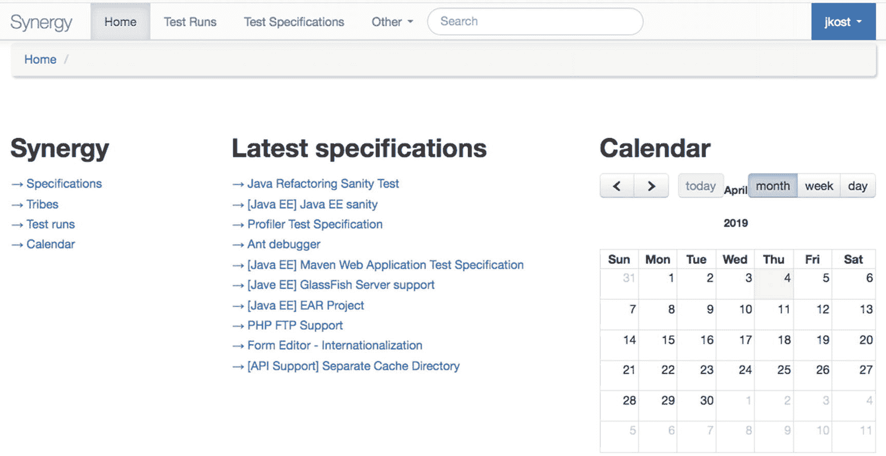

图 14-1
Synergy 主页

在准备阶段，您会收到来自部落领袖的电子邮件，要求您评审/更新一个或多个测试规范。一旦 NetCAT 项目开始运行（参见，例如，表 14-1），您需要执行一个或多个这些测试，记录所花费的时间，并报告任何缺陷。

测试规范
通过从 Synergy 主页（参见图 14-1）选择 **测试规范** 菜单项，您将看到一个测试规范列表。您的部落领袖会在 NetCAT 项目开始前几天与您沟通，为您分配一个或多个需要评审的测试规范。

图 14-2 显示了一个测试规范示例。它为您提供了简短描述、预估执行时间以及具体内容。

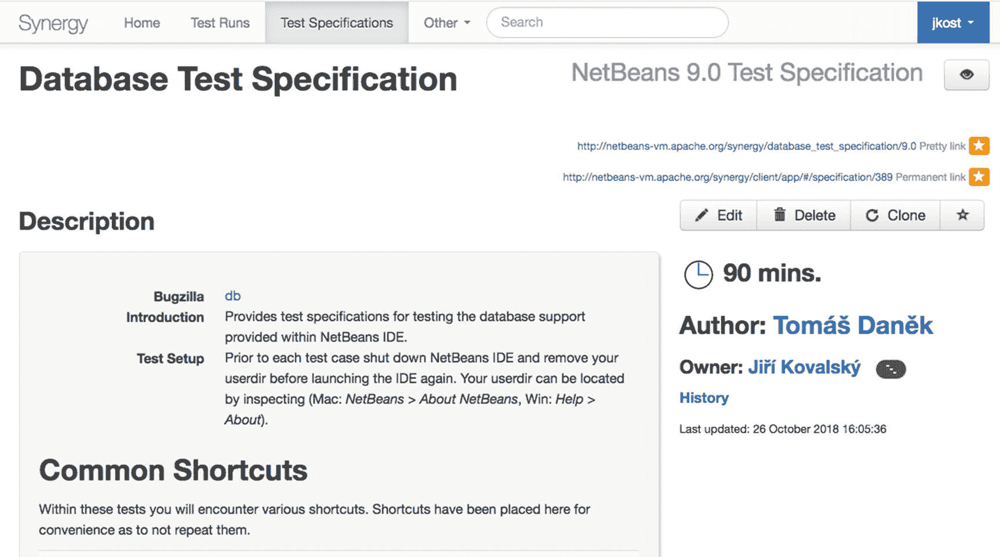

图 14-2
一个测试规范

一个测试规范由 *测试套件* 组成。一个测试套件由 *测试用例* 组成。一个测试用例包含一系列要执行的步骤和一系列预期结果（参见图 14-3）。

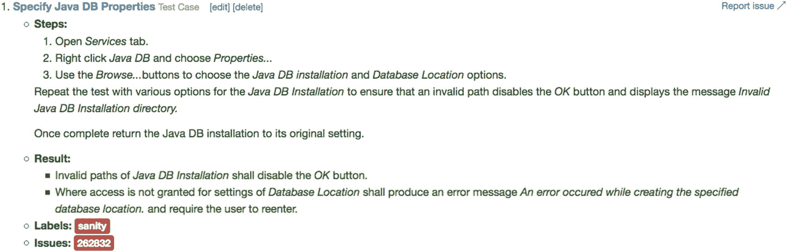

图 14-3
一个测试用例

您可以验证现有的缺陷问题是否仍然有效，或者通过提供的超链接报告新问题。您需要修改测试用例，使其与待测试的 NetBeans 版本保持一致（例如，根据新版本用户界面的任何修改来更新步骤）。
如果您发现任何严重问题，可以通知部落领袖。

测试运行
当 NetCAT 时间表（参见，例如，表 14-1）规定的时间到来时，实际测试就要开始了。您的部落领袖会提供 Apache NetBeans 二进制文件的下载链接供您测试。请不要自行编译 NetBeans 源代码，请使用编译好的版本进行官方测试。

在这种情况下，请从 Synergy 主页选择 **测试运行** 菜单（参见图 14-4）。

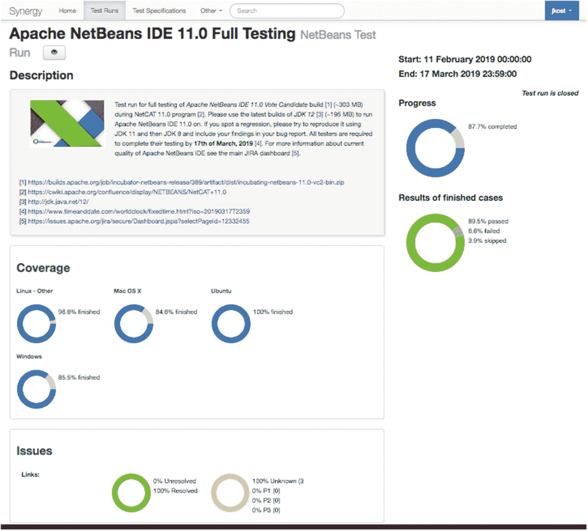

图 14-4
测试运行摘要

NetCAT 协调员将与您的部落领袖一起，已经更新了此页面，您应该会看到一个条目，其中包含您的姓名、您在 Confluence 注册时提到的操作系统，以及分配给您的、等待执行的测试规范（参见图 14-5）。

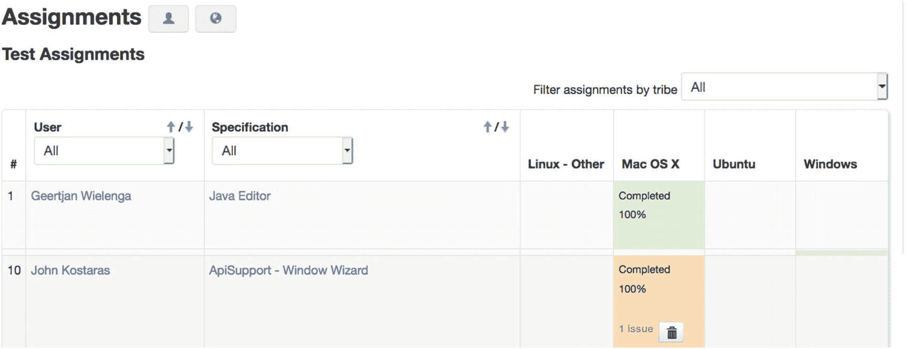

图 14-5
测试运行执行摘要

点击 **运行** 按钮来执行测试。您可以随时暂停测试。您会看到进度和剩余步骤。您有机会在 JIRA 中报告任何缺陷或跳过某些步骤。一旦您完成测试执行，结果将如图 14-5 所示。
在项目结束时，您将被要求提交一份 *社区验收 (CA)* 调查，您可以在其中表达您对新主要功能是否准备好发布的意见。

总结
在本章中，我们描述了 NetCAT 项目及其在发布新版本 Apache NetBeans 之前的重要性。我们介绍了时间表、如何参与、部落、部落领袖和 NetCAT 协调员，最后介绍了如何使用 Synergy 进行实际测试。
如果您觉得它很有趣并且认为自己可以参与，那么请不要犹豫，联系 NetCAT 邮件列表，请求作为志愿者并积极为下一个 Apache NetBeans 版本的发布做准备。

脚注

15. Apache NetBeans 源代码
概述

正如我们在本书中所见，有很多方式可以为 Apache NetBeans 做出贡献。您可以通过编写文档、撰写关于 NetBeans 的博客、参与 NetCAT 项目，甚至修复缺陷并成为 Apache 提交者来提供帮助。
在本章中，我们将学习如何下载 Apache NetBeans 的源代码文件。我们将学习如何构建 NetBeans，并回顾各个模块的概览以及 Apache NetBeans IDE 本身的高级架构。我们还将描述修复缺陷并为源代码做出贡献的流程。所以，请系好安全带。

下载 Apache NetBeans 源代码
自从捐赠给 Apache 以来，NetBeans 一直存储在 Apache 下的一个 git 仓库中。不幸的是，不再像以前使用 mercurial 仓库时那样，每个模块套件都有独立的仓库。

您可以通过以下两种方式之一下载 Apache NetBeans 源代码：


*   导航至 Apache NetBeans 网站（[`https://netbeans.apache.org/`](https://netbeans.apache.org/)），
    点击右上角的**下载**按钮，并选择
    以*源代码：*开头的链接，例如，
    *incubating-netbeans-11.1-source.zip*。下载该 zip 文件并
    将其解压到你选择的目录。下载页面提供了
    验证下载文件完整性的说明。

*   如果你的机器上安装了 *git*，请导航至
    机器上你选择的目录，并在 DOS 命令提示符或终端中
    执行以下命令：

```
    git clone http://github.com/apache/incubator-netbeans/.
    ```

从源代码构建

要从源代码构建 Apache NetBeans（孵化中），
你需要以下内容：

*   Oracle 的 JDK 8 或 Open JDK 8；

*   Apache Ant 1.10 或更高版本（[`https://ant.apache.org`](https://ant.apache.org)）。

安装好 Oracle JDK 和 ANT 后，导航至
你解压 Apache NetBeans 源代码的目录，并执行
命令：

```
ant
```

你需要一个互联网连接，因为构建过程可能会从互联网下载各种
工件。另请注意，构建需要一些
时间才能完成。构建完成后，你可以通过在 Unix 机器的终端窗口中
输入以下命令来执行 IDE：

```
./nbbuild/netbeans/bin/netbeans
```

或者在 Windows 机器上，通过双击 `netbeans.exe` 或 `netbeans64.exe` 来执行，
这些可执行文件位于 `\nbbuild\netbeans\bin` 目录下。
你还可以通过编辑 `nbbuild/netbeans/etc/netbeans.conf`
并将 `netbeans_jdkhome` 键
设置为系统中 JDK 的路径，来尝试使用不同版本的 Java 运行 NetBeans。
恭喜！你刚刚构建并执行了你自己版本的
NetBeans！

Apache NetBeans IDE 架构
Apache NetBeans 是最大的 Apache 项目之一（在撰写本文时是
第二大项目）。虽然不了解整体架构也能修复 bug，
但如果你希望引入新功能，了解每个部分的架构会有所帮助。
了解架构将有助于你在源代码中找到方向。
Apache NetBeans IDE 采用模块化架构，使用了 Apache NetBeans 平台的
*模块系统 API*。掌握本书第 2 部分的章节
将帮助你编写代码来修复 bug，并为 IDE 添加新功能或插件。

Apache NetBeans IDE 由以下主要组件或
集群组成：

*   **apisupport**：包含许多支持 NetBeans API 的模块。
    这些模块支持诸如 Ant、Maven、重构和向导等功能（参见
    图 15-1）。

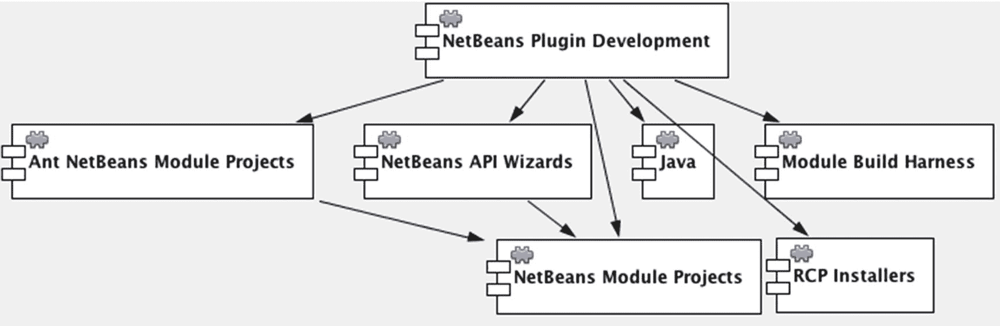

图 15-1
API 支持模块依赖关系

*   **enterprise**：包含 JEE 支持（参见图
    15-2）。

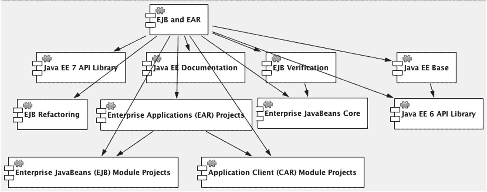

图 15-2
企业模块依赖关系

*   **ergonomics**：动态启用 IDE 功能，
    因此用户永远不会因安装完整的 IDE 发行版而浪费系统资源，
    而只使用其子集。

*   **extide**：包含 IDE 扩展，例如 `ant` 支持模块
    和**工具 | 选项**对话框。

*   **extra**：为各种操作系统提供 JavaFX 封装的库。

*   **groovy**：提供对 Groovy 和 Gradle 的支持（参见图 15-3）。

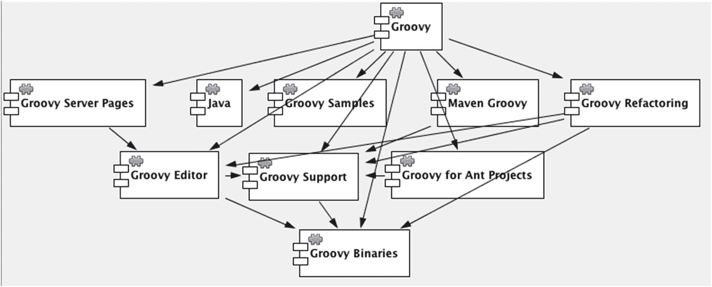

图 15-3
Groovy 模块依赖关系

*   **harness**：顾名思义，它包含 NetBeans 的测试框架；
    可以在这里找到诸如 *jemmy* 和 *jelly* 之类的测试工具。

*   **ide**：提供构建 Apache NetBeans IDE 本身的模块，
    例如编辑器、调试器、语言支持、数据库、HTML 和 CSS 支持等。
    稍后将更详细地描述。

*   **java**：支持 Java 编程语言
    和 JEE、Ant、调试器、Maven、JUnit、TestNG、重构等。例如，
    *Java 源代码基础*（`java/java.source.base`）
    模块为 IDE 添加了 Java 特定的 API。

*   **javafx**：JavaFX 支持（参见
    图 15-4）。

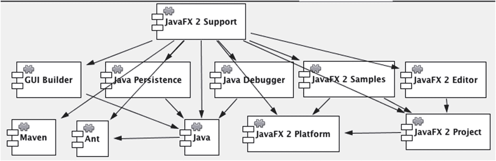

图 15-4
JavaFX 模块依赖关系

*   **nb**：包含品牌、自动更新插件中心、
    欢迎页面、死锁检测器等模块。

*   **php**：PHP 支持（参见图
    15-5）。

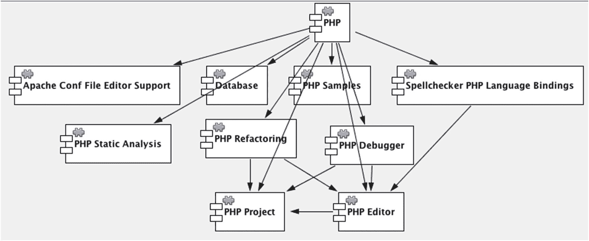

图 15-5
PHP 模块依赖关系

*   **platform**：构成 NetBeans 富客户端平台的模块（参见图
    15-6）。

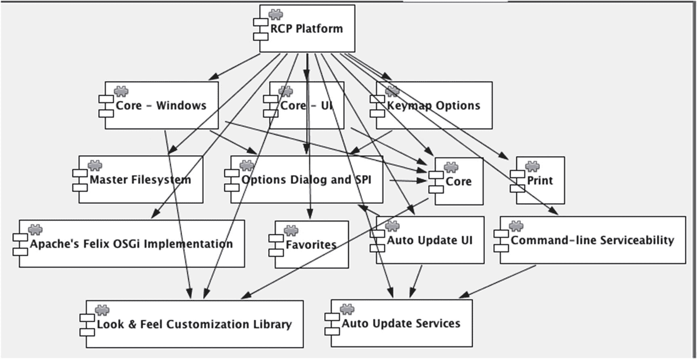

图 15-6
NetBeans 平台模块依赖关系

*   **profiler**：顾名思义，NetBeans 分析器模块
    （参见图 15-7）。

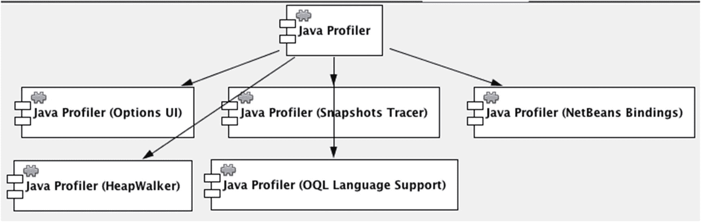

图 15-7
Java 分析器模块依赖关系

*   **webcommon**：支持 JavaScript、Knockout、Angular、Selenium 等
    （参见图 15-8）。

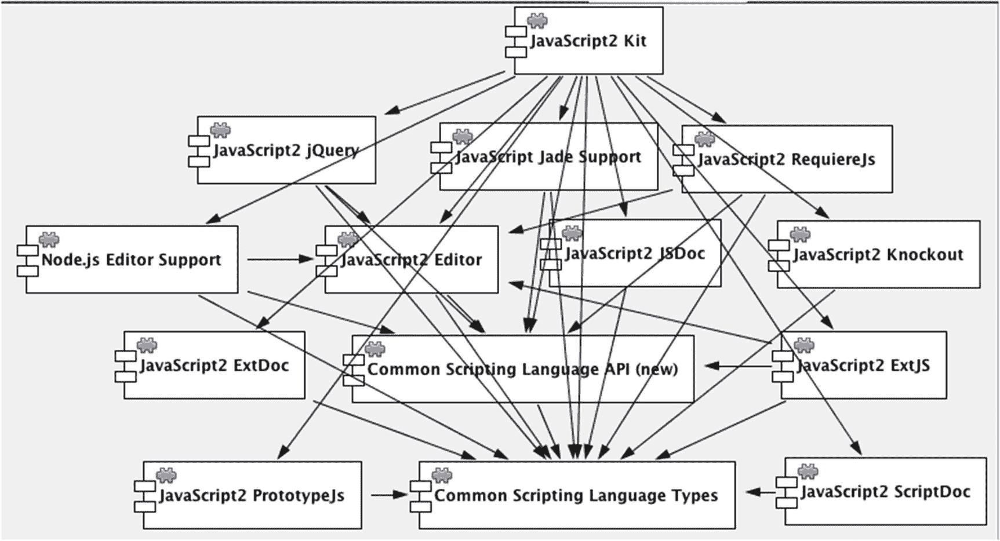

图 15-8
Web 通用模块依赖关系

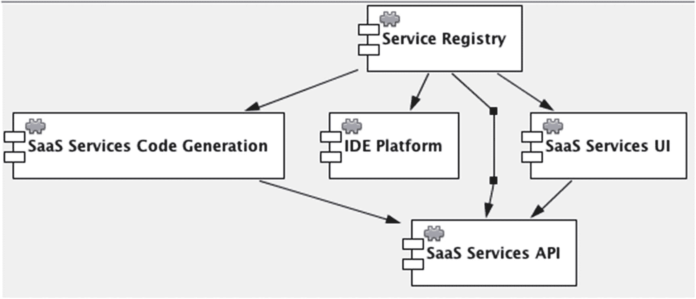

图 15-9
Web 服务模块依赖关系

*   **websvccommon**：SAAS 支持（例如，
    Amazon、Facebook 等）（参见图 15-9）。

起始模块是 *Bootstrap*（`platform/o.n.bootstrap`），
开始学习 NetBeans IDE 源代码的类是：
[`https://github.com/apache/incubator-netbeans/blob/master/platform/o.n.bootstrap/src/org/netbeans/Main.java`](https://github.com/apache/incubator-netbeans/blob/master/platform/o.n.bootstrap/src/org/netbeans/Main.java)

图 15-10 显示了此
模块的依赖关系。

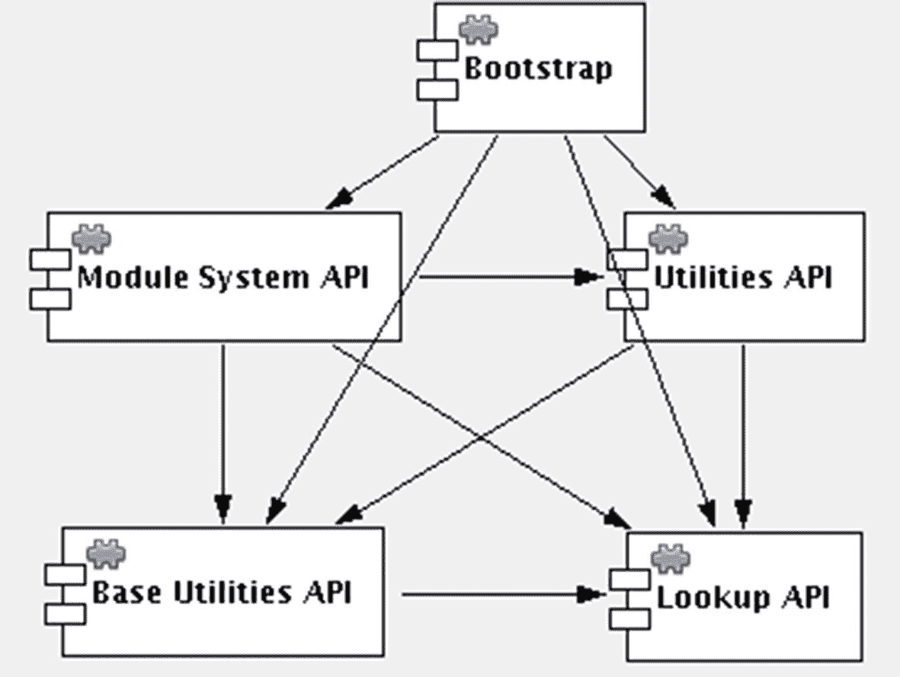

图 15-10
Bootstrap 模块的模块依赖关系

IDE 集群架构
`ide`
集群提供构建 Apache NetBeans IDE 本身的模块。
这些模块包括编辑器、调试器和语言支持。
这里我们描述该集群中最重要的模块。

*项目 API*（模块 *项目
API*（`ide/projectapi`）（参见
图 15-11）和
*项目 UI API*（`ide/projectuiapi`））
定义了项目在 NetBeans 中的工作方式。最基础的 `Project`（[`http://bits.netbeans.org/11.0/javadoc/org-netbeans-modules-projectapi/org/netbeans/api/project/Project.html`](http://bits.netbeans.org/11.0/javadoc/org-netbeans-modules-projectapi/org/netbeans/api/project/Project.html)）
仅由一个空的 Lookup 和一个项目目录组成。可以通过简单地将处理程序添加到项目的
`Lookup` 中来为项目添加更多功能。

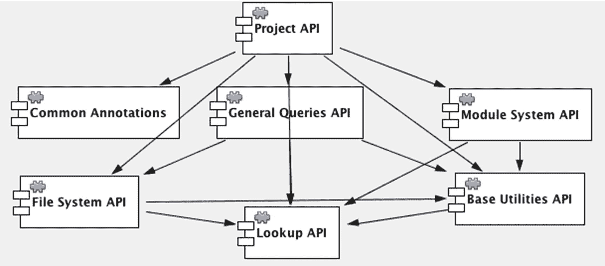

图 15-11
项目 API 模块依赖关系


有用的类包括 `ProjectUtils` ([`http://bits.netbeans.org/11.0/javadoc/org-netbeans-modules-projectapi/org/netbeans/api/project/ProjectUtils.html`](http://bits.netbeans.org/11.0/javadoc/org-netbeans-modules-projectapi/org/netbeans/api/project/ProjectUtils.html))，它提供了获取项目信息的实用方法，以及 `SourceLevelQuery` ([`http://bits.netbeans.org/11.0/javadoc/org-netbeans-api-java/org/netbeans/api/java/queries/SourceLevelQuery.html`](http://bits.netbeans.org/11.0/javadoc/org-netbeans-api-java/org/netbeans/api/java/queries/SourceLevelQuery.html))，它返回 Java 源文件的源级别（例如，如果源文件使用了 Java 7 引入的语法，则 Java 源级别可以是 7）。在模块 `java/api.java` 中，有对通用 *Project API* 的 Java 扩展。*Parsing API* (`ide/parsing.api`)（见图 15-12）用于源代码解析（主要在编辑器中）。它允许注册新的解析器 ([`http://bits.netbeans.org/11.0/javadoc/org-netbeans-modules-parsing-api/org/netbeans/modules/parsing/spi/ParserFactory.html`](http://bits.netbeans.org/11.0/javadoc/org-netbeans-modules-parsing-api/org/netbeans/modules/parsing/spi/ParserFactory.html))，将源代码的某些部分定义为另一种语言的内嵌文本 `EmbeddingProvider` ([`http://bits.netbeans.org/11.0/javadoc/org-netbeans-modules-parsing-api/org/netbeans/modules/parsing/spi/EmbeddingProvider.html`](http://bits.netbeans.org/11.0/javadoc/org-netbeans-modules-parsing-api/org/netbeans/modules/parsing/spi/EmbeddingProvider.html)) 和 `ParserBasedEmbeddingProvider` ([`http://bits.netbeans.org/11.0/javadoc/org-netbeans-modules-parsing-api/org/netbeans/modules/parsing/spi/ParserBasedEmbeddingProvider.html`](http://bits.netbeans.org/11.0/javadoc/org-netbeans-modules-parsing-api/org/netbeans/modules/parsing/spi/ParserBasedEmbeddingProvider.html))，并在解析结果上运行任务。

有两种类型的任务：

*   `ParserResultTask` ([`http://bits.netbeans.org/11.0/javadoc/org-netbeans-modules-parsing-api/org/netbeans/modules/parsing/spi/ParserResultTask.html`](http://bits.netbeans.org/11.0/javadoc/org-netbeans-modules-parsing-api/org/netbeans/modules/parsing/spi/ParserResultTask.html)) 是一个 `SchedulerTask`，它按定义的顺序自动调度并运行，以处理解析结果。

*   `ParserManager` ([`http://bits.netbeans.org/11.0/javadoc/org-netbeans-modules-parsing-api/org/netbeans/modules/parsing/api/ParserManager.html`](http://bits.netbeans.org/11.0/javadoc/org-netbeans-modules-parsing-api/org/netbeans/modules/parsing/api/ParserManager.html)) 允许为一个或多个源启动优先级解析请求，并按需立即运行用户任务。

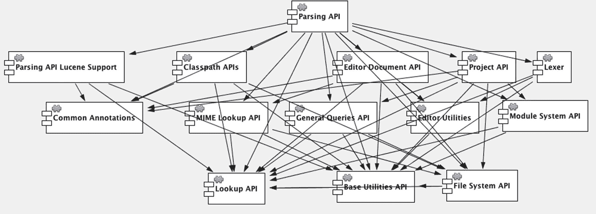

图 15-12

Parsing API 模块依赖关系

*Parsing Indexing API* (`ide/parsing.indexing`) 用于“索引”（例如，构建源文件中所有重要内容的“全局”索引，以便可以快速执行诸如“哪些文件使用了这个类”之类的查询）。这里有趣的类包括：

*   `EmbeddingIndexer` ([`http://bits.netbeans.org/11.0/javadoc/org-netbeans-modules-parsing-indexing/org/netbeans/modules/parsing/spi/indexing/EmbeddingIndexer.html`](http://bits.netbeans.org/11.0/javadoc/org-netbeans-modules-parsing-indexing/org/netbeans/modules/parsing/spi/indexing/EmbeddingIndexer.html))，它获取解析器的结果，并可以将所需的任何信息添加到索引中。

*   `BinaryIndexer` ([`http://bits.netbeans.org/11.0/javadoc/org-netbeans-modules-parsing-indexing/org/netbeans/modules/parsing/spi/indexing/BinaryIndexer.html`](http://bits.netbeans.org/11.0/javadoc/org-netbeans-modules-parsing-indexing/org/netbeans/modules/parsing/spi/indexing/BinaryIndexer.html))，它允许为二进制依赖项准备索引。

*   `CustomIndexer` ([`http://bits.netbeans.org/11.0/javadoc/org-netbeans-modules-parsing-indexing/org/netbeans/modules/parsing/spi/indexing/CustomIndexer.html`](http://bits.netbeans.org/11.0/javadoc/org-netbeans-modules-parsing-indexing/org/netbeans/modules/parsing/spi/indexing/CustomIndexer.html))，它仅接收已更改文件的列表，并可以以自定义方式执行索引。可以通过 `QuerySupport` ([`http://bits.netbeans.org/11.0/javadoc/org-netbeans-modules-parsing-indexing/org/netbeans/modules/parsing/spi/indexing/support/QuerySupport.html`](http://bits.netbeans.org/11.0/javadoc/org-netbeans-modules-parsing-indexing/org/netbeans/modules/parsing/spi/indexing/support/QuerySupport.html)) 查询索引。

问题跟踪器
所有程序都包含错误，Apache NetBeans 也不例外。错误和新功能存储在 JIRA ([`https://issues.apache.org/jira/browse/NETBEANS`](https://issues.apache.org/jira/browse/NETBEANS)) 中，如第 13 章所述。要订阅的邮件列表是 `dev@netbeans.incubator.apache.org`。您的代码贡献可能是一个错误修复，但也可能是一个插件形式的新功能。只需在 JIRA 中打开一个新问题，然后处理您想要贡献的任何内容。

调试 Apache NetBeans
无论您是在修复问题还是开发新功能（插件），迟早您都需要了解您或 NetBeans 的代码是如何工作的，或者为什么它不工作！在开始调试 Apache NetBeans 之前，请确保您已正确设置源代码。

点击 **工具 ➤ NetBeans 平台** 以显示 *NetBeans 平台管理器* 对话框（见图 15-13）。您会看到已经注册了一个平台，即 *开发 IDE*。这是您正在运行的 NetBeans IDE 的平台，例如，如果您运行的是 Apache NetBeans IDE 11.1，则平台为 11.1。

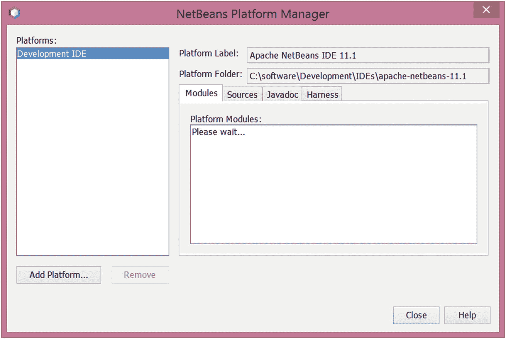

图 15-13
NetBeans 平台管理器对话框


然而，你可能希望，例如，修复最新源码更新中的某个错误，该更新已按本章前面所述下载并解压到某个文件夹中。

如前所述，当你构建源码时，输出结果会存储在 `nbbuild/netbeans` 文件夹中。该文件夹包含一个从源码构建的 NetBeans IDE，其中也包含一个 NetBeans 平台。你可以通过点击 *NetBeans 平台管理器* 对话框中的 **添加平台…** 按钮，并在打开的 *添加 NetBeans 平台* 对话框中选择 `nbbuild/netbeans` 文件夹（见图 15-14），将该平台注册到你正在运行的 NetBeans IDE 中。你会注意到，当你选择 `nbbuild/netbeans` 文件夹时，**下一步** 按钮会变为可用状态。

点击 **下一步** 按钮进入下一步，在此你可以选择为平台提供另一个 *平台名称*（而非默认名称，默认名称类似“Apache NetBeans IDE Dev (Build xxx-yyy)”；见图 15-15），然后点击 **完成**。现在，你应该能在 *NetBeans 平台管理器* 对话框中看到这两个平台了。

点击 **源代码** 标签，点击 **添加 ZIP/文件夹…** 按钮，添加包含 NetBeans 源码的文件夹（即 `nbbuild` 的父文件夹），然后依次点击 **关闭** 和 **关闭**。

当你新建一个 NetBeans 平台应用程序或模块时，现在可以在两个平台中选择一个用于开发（即，要么使用你的 IDE 自带的平台，要么使用最新的平台）。你可以通过在 *项目* 窗口中右键点击你的 *模块* 或 *模块套件*，从弹出菜单中选择 **属性** 以打开 *项目属性* 对话框，点击 **库** 类别，然后从相应的组合框中选择合适的 *NetBeans 平台*。在同一对话框中，你还可以自定义在模块套件中要包含哪些模块以及不包含哪些模块（见图 15-16）。例如，如果你不是在开发 JavaFX 或 HTML/UI 应用程序或插件，只需从模块列表中取消勾选这些模块即可。

如果你不希望将 NetBeans 开发平台注册到你的 NetBeans IDE 中，你可以直接添加最新的源码。在 *NetBeans 平台管理器* 对话框中，点击 **源代码** 标签，然后通过点击 **添加 ZIP/文件夹…** 按钮并导航到该文件夹，添加你解压源码的文件夹，例如 `incubator-netbeans`。你也可以直接添加从 Apache NetBeans 网站下载的压缩源码文件，而无需解压。

调试 Apache NetBeans：

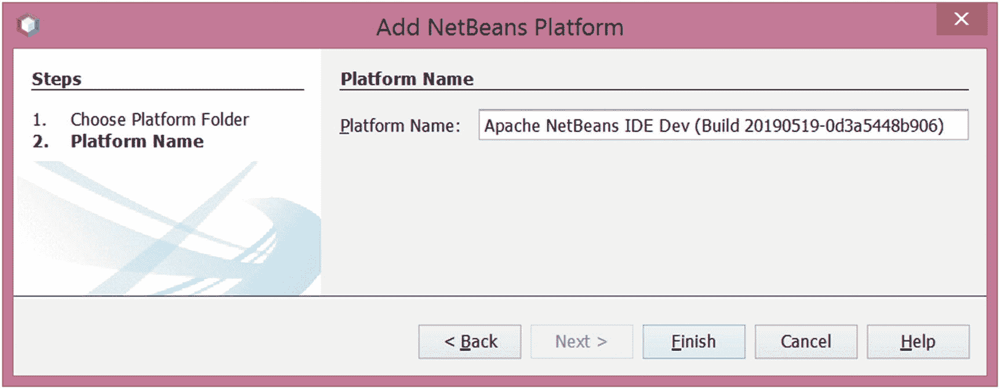

图 15-15
添加 NetBeans 平台对话框（步骤 2）

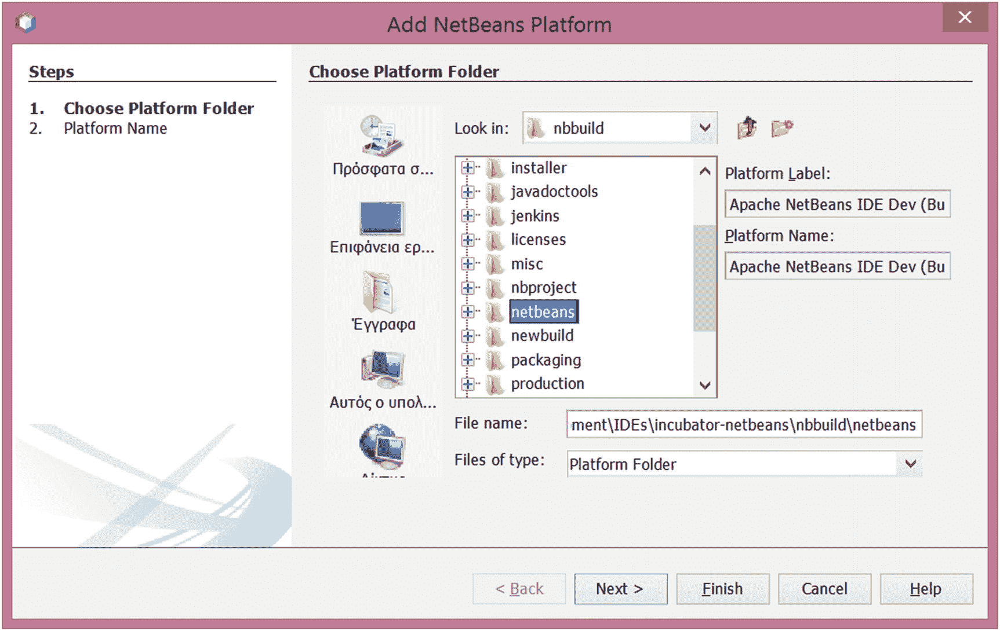

图 15-14
添加 NetBeans 平台对话框（步骤 1）

1.  在 Apache NetBeans IDE 中打开你感兴趣调试的 Apache NetBeans 模块。

2.  在源代码编辑器中某处设置一个断点。

3.  右键点击该模块并选择 **调试**。

让我们看一个例子。我们来调试 *Bootstrap* 模块，如前所述，该模块是 NetBeans IDE 执行的起点。

1.  打开 `platform/o.n.bootstrap` NetBeans 项目，该项目位于你下载的 Apache NetBeans 源码文件夹中。

2.  打开位于 `src/org/netbeans` 文件夹中的 `Main.java` 文件。

3.  在 `main()` 方法的第一行（`Class.forName(…)`）上，通过点击编辑器左侧的行号设置一个断点，如第 6 章所述。

4.  在项目窗口中右键点击 `o.n.bootstrap` 模块，然后从弹出菜单中选择 **调试**。


你会看到执行在断点处停止，该行会以绿色高亮显示（见图 15-17），现在你可以使用调试工具栏的按钮（见图 15-18）逐步进入代码，如第 6 章所述。


图 15-18
调试工具栏

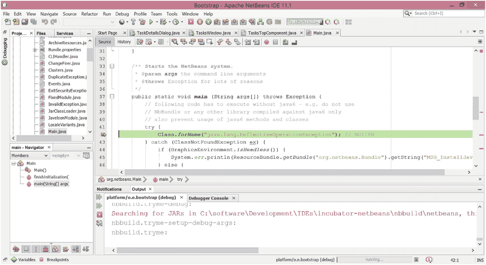

图 15-17
调试 o.n.bootstrap NetBeans 平台模块

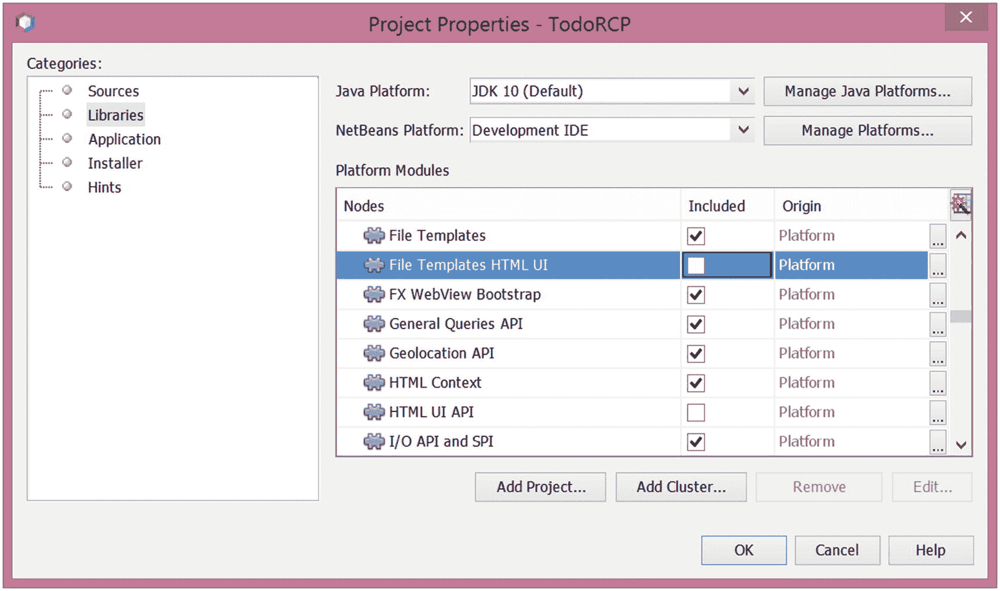

图 15-16
为你的模块套件以及所需的平台模块选择一个 NetBeans 平台

提交代码
一旦你实现并测试了你的修改，一个好的做法不仅是更新 JIRA 问题，还要向 *dev* 邮件列表发送电子邮件，以通知其他人、获取有用的反馈，并可能找到潜在的测试者。当你确信修改已准备就绪后，向主仓库发起一个拉取请求。

总结
在本章中，你学习了如何下载和构建 Apache NetBeans IDE 的源代码。你还了解了 Apache NetBeans IDE（基于 Apache NetBeans 平台）各个组件的架构概览，并了解了如何将代码提交回 Apache NetBeans `git` 仓库。
祝你好运，愿源码与你同在！

索引

A

抽象窗口工具包 (AWT)

小程序

GUI 表单

GUI 小部件

actionPerformed() 方法

操作全局上下文

操作系统

注解

BAPI

BooleanStateAction

CallableSystemAction

回调

类别

CookieAction

DRY 原则

启用

JComponent

快捷键

向导

AddTaskAction 类

ANTLR

Apache 孵化器

OpenBeans

孵化

孵化

孵化

关键里程碑

源代码

顶级项目

Apache Maven

Apache NetBeans，安装

Apache NetBeans 9.0

Jigsaw 支持

JShell

局部变量类型推断

Apache NetBeans 10.0

JDK 11 支持

PHP

Apache NetBeans 11.0

Gradle 支持

Java EE 8 支持

JDK 12

小程序

applyBindings() 方法

B

BinaryIndexer 类

区块链

品牌化

断点

操作

Apache NetBeans

AWT/Swing 组件

类

比较器

约束

对话框

异常

字段

通用条件

行

方法

线程

类型

视图

捆绑包

C

调用栈视图

代码补全

AbstractCompletionItem

AsyncCompletionQuery

CompletionProvider

CtoCompletionQuery

cto 文件

编辑器

Hyperledger

接口

内聚性

社区验收 (CA)

Cookies

核心 NetBeans 富客户端平台

文件系统

Lookup API

模块系统

耦合性

createKeys() 方法

createScene()

自定义对话框

DialogDescriptor 类

TodoRCP 应用程序

CustomIndexer 类

D

数据系统 API

调试

添加 NetBeans 平台

字谜游戏

Bootstrap 模块

断点

参见断点

调用栈视图

表达式求值

实例视图

已加载类视图

NetBeans 平台管理器

进程附加，套接字附加/套接字监听

项目属性

运行中的进程

线程视图

工具栏

变量视图

视图

可视化 Swing

监视点视图

默认布局，用途

应用程序编码

代码补全

代码模板

比较文件

丰富 IDE

生成代码

提示

重构

拆分窗口

编辑器窗口

Java 平台 Shell

输出

调色板窗口

属性

源代码编辑器

终端窗口

探索窗口位置

文件窗口

导航器窗口

项目窗口

服务窗口

任务窗口

项目设计

基于 Ant 的设计设置

基于 Gradle 的项目设置

基于 Maven 的项目设置

窗口位置

默认 Lookup

DeleteTaskAction

依赖注入

部署与调试

Web 开发环境 (DEW)

对话框 API

分发

动态原型

E

EditTaskAction

EmbeddingIndexer 类

EMPTY Lookup

实体类

错误提示

CtoProxyParser

编辑器

ErrorParserListener

HintsController

Maven 插件

ParserProvider

SyntaxError 类

语法错误

求值表达式视图

事件分发线程 (EDT)

资源管理器视图

ActionMap

ExplorerManager

HTML/Java UI API

参见 HTML/Java UI API

JavaFX

MVC 设计模式

大纲视图实现

属性窗口


PropertySheet

Swing 类

表达式求值

固定

工具提示

F

Facebook

FileChangeListener 接口

FileObject

文件支持

CtoDataObject

文件类型

接口

MIME 类型

文件系统 API

类图

代码

FileObject 集合

数据系统 API

FileChangeListener 接口

java.io.File 对象

*对比* Java 7 NIO2

System FileSystem/Layer.xml

虚拟文件系统

文件系统 API

G

getExplorerManager() 方法

全局查找

Gradle

Groovy 服务器页面 (gsp)

GUI 开发工具

H

处理事件

ActionSupport

警报信息对话框

控制器模块

自定义内联编辑器

ETable 和 Outline 模块

Explorer & Property Sheet API

firePropertyChange()

GUI 事件

内部事件

OutlineView

QueryEditTasks

QuickFilter 对象

移除和保存按钮

SortByDateAction 和 SortByPriorityAction

TaskChildFactory

TaskDetailsDialog

TaskNode

TasksTopComponent

TodoRCP 应用程序

todo.view.ActionSupport 类

工具类

视图类

视图模块

堆查看器

类

比较

实例

OQL 控制台视图

@HTMLDialog 注解

HTML/Java UI API

绑定上下文

计算属性

数据绑定

DEW

对话框

Knockout.js (KO)

NetBeans RCP

ObservableArrays

可移植 HTML UI 向导，创建

移植 UI

REST/JSON

运行示例应用程序

TasksWindow

TasksWindow.html

模板绑定

TodoHTMLJava

视图模块，文件结构

Hyperledger

composer 语言

Composer Playground

fabric

插件

HyperledgerWizardIterator

I

IDE 架构

API 模块

Bootstrap 模块

企业模块

Groovy 和 Gradle 模块

JavaFX 模块

Java 分析器模块

NetBeans 平台模块

PHP 模块

webcommon 模块

Web 服务模块

IDE 集群架构

解析 API

解析索引 API

项目 API

ProjectUtils 类

ImageUtilities

实例视图

集成开发环境 (IDE)

国际化

问题跟踪器

J

Java 归档 (jar)

Java 开发工具包 (JDK)

Java EE

文件类型

文件类型，企业开发

JavaFX

应用程序线程

文件类型

FXML 文件

NetBeans RCP 应用程序

项目类型

SceneBuilder

TasksTopComponent 到 BorderLayout

TodoFXRCP 应用程序模型模块

Todo Swing 应用程序

JavaFX 应用程序，Todo

FXML

项目布局

SceneBuilder

TodoFX

Java 9 模块系统

Java 持久化查询语言 (JPQL) 工具

Java 源代码编辑器

Java 标准版 (Java SE) 应用程序

Java Web 应用程序

应用程序名称

Maven

项目结构

服务器和设置

Java with Maven 类别

JDK 9 Jigsaw 模块系统

JDK 11

JDK 12

Jigsaw

JIRA

组件菜单

看板

未解决的问题

发布面板

报告选项

系统导航

JSF 应用程序

复合组件文件

Faces 配置文件

文件类型

托管 Bean

页面

视图

JShell

K

看板

L

已加载类视图

本地查找

查找 API

操作全局上下文

耦合

默认查找

动态内容

空查找

排除类

固定数量的对象

查找委托搜索

松散耦合系统

访问方法

单个对象

ProxyLookup 合并

服务注册表

TopComponent

Lookup.getDefault() 方法

松散耦合系统

M

邮件列表

MarkAsCompletedTaskAction

Maven

Maven Web 应用程序

应用服务器容器

新建项目对话框

Mockito

mode() 方法

@Model 注解

模型-视图-控制器 (MVC)

模型-视图-视图模型 (MVVM)

模块化

模块化过渡

模块，创建

添加依赖

Maven

Mockito

测试

模块描述符

模块系统 API

显式依赖

运行时容器

强封装

版本控制

定义良好的接口

MultiFileSystem 类

MultiFileSystem MyFolder 文件夹

多会话调试

选择

视图

N

导航器窗口

导航器面板

ChildNode

cto 文件

CtoNavigatorPanel

CtoParser

CtoProxyParser

Lookup.Provider

Maven 依赖

MembersFactory.java

MembersView

NavigatorPanel.Registration

ParserListener

NetBeans IDE 社区验收测试 (NetCAT) 计划

NetBeans 模块系统 API *对比* Java 9 模块 API

NetBeans 平台

NetBeans 平台架构

NetBeans 富客户端平台

NetBeans Synergy 测试用例管理系统

NetCAT 计划

目标

参与者维基页面

时间表

NetCAT 部落

协调员

定义

部落领袖

Netflix

节点

操作

BeanNode

ChildFactory 实现

类层次结构

Lookup.Provider 接口

节点 API

通知

O

对象分析

分析

配置


定义的类

对话框

实时视图

从 JAR 中选择

快照结果

带插桩的视图

选项窗口

对话框

package-info.java 内容

TasksOptionsPanelController

输出窗口

P

包访问修饰符

调色板

调色板窗口

ParserManager

ParserResultTask

暂停调试器会话

个人信息管理器 (PIM)

PHP

多重捕获异常处理

尾随逗号

void 类型

插件

菜单

nbm-maven-plugin 部分

共享

签名

预定义对话框

确认

自定义按钮

错误消息

输入

NotifyDescriptor

性能分析

Apache NetBeans

方法

配置

过滤器

进程

SQL 查询

遥测

线程与锁

性能分析、调试与重构

方法分析器

NetBeans 平台

应用程序开发

模块

对象分析器

重构上下文菜单

线程与类图表

进度

项目模板

创建

目录结构

IDE

名称

Node.js 应用程序

project.properties

选择项目

TemplateRegistration

PropertySupport.Reflection

ProxyLookup

Q

基于查询的方法

快速搜索

苹果应用程序菜单模块，平台集群

layer.xml

菜单栏

TaskSearchProvider

工具栏

向导

R

读取-求值-打印循环 (REPL)

运行时容器

S

SceneBuilder

SearchRequest 类

保护访问

actionPerformed() 方法

登录对话框

方法

模块安装器类

@OnStart 注解

面板

X 关闭按钮

服务器容器

添加服务器实例

展开并管理服务器

服务器菜单

设置位置

ServiceLoader

ServiceProvider

@ServiceProvider 注解

服务注册表

setQuickFilter(int col, Object filterObject)

ShowAlertsAction

showTaskDetailsDialog()

快照或导航器视图

源代码

start() 方法

静态原型

AddTaskAction 类

控制器模块

EditTaskAction

资源管理器与属性表 API

图标文件夹

Layer XML – 中央注册表

选项工具栏和菜单

调色板窗口

项目和导航器窗口

设置布局菜单项

TodoRCP 应用程序

执行

自定义菜单栏

OutlineViews 的列

工具栏

TopComponent

状态栏

StatusLineElementProvider 接口

Sun Microsystems

Swing

锚定组件

自动调整大小菜单

连接工具

自定义代码

事件选项卡

表单

布局

属性选项卡

工具栏

小部件

Swing 应用程序

主任务列表窗口

组件调色板

图标属性

Java 应用程序项目

JFrame

预览按钮

视觉参考线

TaskDetailsDialog

自动国际化

最终表单

JLabels

JTextField

JXDatePicker

main() 方法

PaletteManager

可视化本地化

Todo

查看 Todo Swing 应用程序

用户界面

Swing 待办事项应用程序

SwingX 库

Synergy

主页

测试用例

测试运行

测试规范

测试套件

语法

ANTLR

CtoEditorLexer 类

CtoLanguageHierarchy

CtoLanguageProvider

CtoLexer

CtoTokenId 类

fontColors.xml

词法分析器

模块清单

选项对话框

解析器

pom.xml

测试

TokenTaxonomy

系统文件系统

T

TaskChildFactory

TaskDetailsDialog

TaskManagerDB

TaskManagerInterface 服务

TasksTopComponent

TasksWindowCntrl

templateName()

测试驱动开发 (TDD)

线程视图

TodoFX 应用程序源代码结构

todofx.model 包

TodoFXRCP 应用程序

TodoHTMLJava

TodoRCP 应用程序

TodoRCP NetBeans 平台应用程序项目

TodoRCP 套件

Todo Swing 应用程序

添加模块依赖项对话框

架构

复制 ValidationException 和 ModelException 类

提取接口

GUI

layer.xml 文件

listTasksWithAlert()

META-INF/services 文件夹

模型-视图-控制器架构

NetBeans 平台应用程序项目，创建

包公开

包结构

解决项目问题

显示依赖项

草图

TaskManager 类

TaskManagerInterface 服务

TodoRCP 模块

Tomcat Web 服务器

顶级项目

U

Utilities 类

V

var 关键字

版本控制系统 (VCS)

使用 DIFF 比较文件

配置文件

初始化仓库

首选项

团队菜单

可视化编辑器

可视化库

边框

类图

ConnectionWidget

布局

场景

Widget 动作

Widget 实现

小部件

可视化 Swing 调试

事件视图

导航器视图

选择事件，日志记录

设置日志记录事件

快照

W, X

网站

GitHub 仓库

Groovy 模板

Jenkins

页面更新

模板更新

维基

窗口系统

@ActionID

属性

优势

配置

Lookup.Provider 接口

方法

TopComponent

向导

动态

属性

注册类型

静态

Y, Z

Yeoman

```