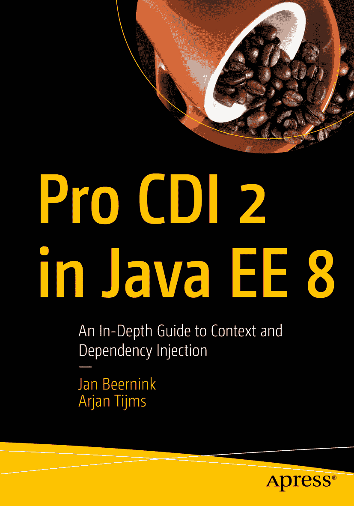

ISBN 978-1-4842-4362-6 e-ISBN 978-1-4842-4363-3 [`doi.org/10.1007/978-1-4842-4363-3`](https://doi.org/10.1007/978-1-4842-4363-3) © Jan Beernink 和 Arjan Tijms 2019 本作品受版权保护。出版商保留所有权利，涉及材料的全部或部分内容，特别是翻译、重印、重用插图、朗诵、广播、微缩胶片复制或任何其他物理形式的复制权，以及信息存储与检索、电子改编、计算机软件或目前已知或未来开发的类似或不同方法的传输权。本书中可能出现商标名称、标识和图像。我们仅在编辑风格中使用这些名称、标识和图像，以维护商标所有者的权益，无意侵犯商标权。本出版物中使用的商品名称、商标、服务标志及类似术语，即使未明确标识，也不应被视为对其是否受专有权利保护的立场表达。尽管本书中的建议和信息在出版时被认为是真实准确的，但作者、编辑和出版商均不对可能存在的任何错误或遗漏承担法律责任。出版商对本书所含材料不作任何明示或暗示的保证。本书由 Springer Science+Business Media New York 在全球图书贸易中发行，地址：233 Spring Street, 6th Floor, New York, NY 10013。电话：1-800-SPRINGER，传真：(201) 348-4505，电子邮件：orders-ny@springer-sbm.com，或访问 www.springeronline.com。Apress Media, LLC 是一家加利福尼亚有限责任公司，其唯一成员（所有者）是 Springer Science + Business Media Finance Inc (SSBM Finance Inc)。SSBM Finance Inc 是一家特拉华州公司。

*献给多米尼卡，是她鼓励我写下这本书；也献给我的母亲、父亲和姐姐，他们一直支持着我。*

*——扬·贝恩林克*

*献给我的母亲*

*——阿尔扬·泰姆斯*

### 关于作者与技术审稿人

### 关于作者

### 关于技术审稿人

