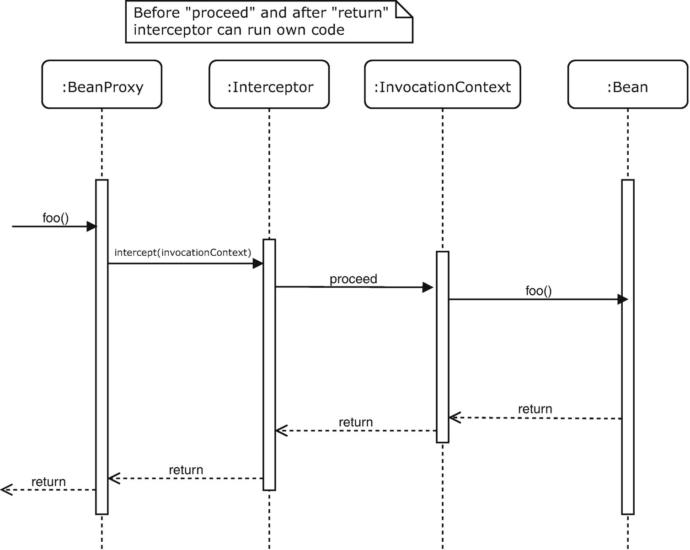

# 2. Bean 作为 EE 中的组件模型

在上一章中，你了解了 CDI 的历史，以及 CDI 如何被定位为 Java EE 中的默认组件模型。在本章中，当你将 CDI 与 Java EE 中仍然存在的其他一些模型进行比较时，你将更深入地研究这个组件模型。

## 什么是组件模型？

*组件*这个术语由来已久，就像相关的词*模块*一样，它是一个有多种不同定义的术语。有时这些解释相互重叠，有时又相互冲突。为了清晰起见，我们将在此处定义组件的模型，进而定义单个组件。我们并不声称这是权威定义；它仅仅旨在作为本书的工作定义。

在 Java EE 中，组件最终由类定义，但与类相比，大多数组件还具有以下额外特性：

*   被管理
*   具有作用域
*   可替换
*   可拦截
*   具有生命周期
*   具有名称

我们将在以下章节中解释所有这些术语的含义。


### 托管

在组件的语境中，“托管”意味着开发者不会使用 Java 的 `new` 运算符来实例化作为组件的类。相反，当容器（运行时）确定需要某个实例时（例如，为了处理诸如 URL 请求之类的传入事件），或者当开发者请求时，这些类会由容器隐式实例化。

开发者可以通过多种方式请求此类实例。

最显式的方式是使用所谓的服务定位器模式以编程方式实现。通过这种方式，通常通过调用某个类或实例上的方法来获取所需组件的实例。然后，该类或实例会在内部从某处获取所需的实例，或者，如果没有可用的实例，则创建一个（并通常会将其存储起来以备将来引用）。

服务定位器模式与工厂模式略有不同，因此可能需要对此稍作澄清。从表面上看，它们很相似，因为在这两种情况下，都是通过调用某个类或实例上的方法来请求实例（在工厂模式中称为*工厂*，在服务定位器模式中称为*服务定位器*）。区别在于，工厂会创建一个新实例，该实例随后由请求它的代码所拥有；而服务定位器通常会查找一个现有实例，并且仅当未找到此类实例时，才会创建一个新实例。从服务定位器返回的实例随后*不*由请求它的代码所拥有。这尤其意味着，同一个实例可能正在被其他地方的代码使用（甚至同时在另一个线程中使用），并且请求代码不应尝试销毁它。

正如你将在本章后面看到的，在 CDI 中，使用 `@Dependent` 时存在一些例外情况，这些界限会有些模糊，但总体而言，这些区别是相当成立的。

以下是 Java EE 中的几个示例：

**EJB/JNDI**

```
SomeService someService =
(someService) new InitialContext().lookup("java:module/someService");
```

**JSF**

```
SomeService someService =
FacesContext.getCurrentInstance()
.getApplication()
.evaluateExpressionGet(
FacesContext.getCurrentInstance(),
"#{someService}",
SomeService.class);
```

**CDI**

```
SomeService someService =
CDI.current().select(SomeService.class).get()
```

除了使用服务定位器模式显式请求实例外，开发者还可以使用注入来请求实例。在这种情况下，开发者以更具声明性的方式指定请求，容器会据此提供所请求的实例。这主要有两种变体。第一种是使用字段注入，第二种是使用参数注入（实际上，是构造函数或方法的参数）。

使用字段注入时，你几乎总是需要以某种方式提供元数据来向容器声明你的意图，以便在创建具有可注入字段的新实例时，容器知道这些字段需要被注入。历史上，元数据是通过 XML 部署描述符提供的，但近年来，这已基本被注解所取代。

使用参数注入时，你可能并不总是需要提供元数据，或者可以只提供一部分。例如，在 CDI 中，你将整个带有参数的构造函数标记为可注入，然后 CDI 会为所有构造函数参数提供实例（你不必用 `@Inject` 标记每个参数；实际上，`@Inject` 甚至不能针对参数）。请注意，只能有一个这样的可注入构造函数，因为 CDI 没有用于注入点来指定应调用哪个构造函数的 API，并且 CDI 当然不应该做出任意选择。

对于 Setter 注入，CDI 支持方法注入的一个特定子集。在这种情况下，同样是整个 setter 方法被 `@Inject` 注解，而不是单个参数。这些 setter 会在 bean 创建之后、`@PostConstruct` 方法被调用之前由 CDI 运行时调用。当手动调用 setter 时，这种注入方式不适用。在大多数情况下，它们确实不应该被直接调用，但测试环境是一个明显的例外。Setter 注入在很大程度上与字段注入相同，但它允许 bean 开发者“拦截”注入并在需要时执行额外的逻辑。这基本上与在非托管的简单 Java 类（即 POJO，Plain Old Java Object）中直接字段赋值与 setter 方法之间的区别是相同的原理。然而，也许值得注意的是，在 CDI 中，通常认为最佳实践是使用字段注入而不是 setter 注入，而在 POJO 中则恰恰相反。

CDI 还支持在运行时本身调用的所有方法中进行完整的方法注入，这些方法包括生产者方法、销毁方法和事件监听器（这些将在后续章节中更详细地介绍）。在这些情况下，该方法显然已经明确旨在由 CDI 调用，因此你无需提供任何 `@Inject` 注解；对于方法中的每个（额外的）参数，CDI 都会解析一个实例并将其作为参数传递。

在 JAX-RS 中，对于由 JAX-RS 调用的资源方法，你可以看到类似的情况；但是，该规范确实要求所有额外的参数都必须用 JAX-RS 的 `@Context` 注解或其任何其他特定注解进行注解。

请注意，使用注入时，整个对象实例链必须是托管的。换句话说，当使用 Java 的 `new` 运算符创建实例时，字段注入并不会神奇地发生。如果你从一个由容器响应事件而调用的组件开始一个链，那没有问题；容器会实例化这个初始组件并对其进行注入。如果这些被注入的组件有注入点，它们也会被注入。这确实带来了一个有趣的问题：如果你在使用 `new` 运算符时无法注入组件，并且该组件不是由容器调用（因此创建）的，那么你如何引导这个序列？答案是使用前面解释过的服务定位器模式来创建这个初始组件。这将产生一个托管组件，随后，该组件的所有（传递的）注入点都将被解析。

以下是 Java EE 中基于注解的字段注入的几个示例：

**EJB**

```
@Stateless
public class SomeEJB {
@EJB
SomeService someService;
}
```

**JSF**

```
@ManagedBean
public class SomeJSFBean {
@ManagedProperty(value = "#{someService}")
SomeService someService;
public void setSomeService(SomeService someService) {
this.someService = someService;
}
}
```

**JAX-RS**

```
@Path("/something/")
class SomeResource {
@Context
SomeService someService
}
```

**CDI**

```
public class SomeCDIBean {
@Inject
SomeService someService;
}
```

请注意，JSF 版本要求有一个 setter 方法。这个要求之所以存在，是因为 JSF 的 DI 系统最初完全是基于 XML 的，而注解变体是在 2.0 版本中才附加上的。具体来说，这意味着 `@ManagedProperty SomeService` 这一行并不是直接的注入点，而只是一个标记，JSF 会拾取它，然后以与使用 XML 定义时相同的方式进行处理。此外，请注意，JAX-RS 的 `@Context` 注解通常用于注入 JAX-RS 自身提供的各种工件。在示例中，我们用它来注入一个自定义对象，但这需要专有（供应商特定）代码，例如 Jersey 中的 `InjectableProvider` 或 CFX 中的 `ContextProvider`。

以下是使用各种参数注入（构造函数和方法）的几个示例：

**CDI：构造函数注入**


```
public class SomeCDIBean {
@Inject
public void SomeCDIBean(SomeService someService) {
}
}
```

**CDI：Setter 方法注入**

```
public class SomeCDIBean {
@Inject
public void setSomeService(SomeService someService) {
}
}
```

**CDI：生产者方法注入**

```
public class SomeCDIBean {
@Produces
public Foo createFoo(SomeService someService) {
}
}
```

**CDI：观察者方法注入**

```
public class SomeCDIBean {
public void listenTo(@Observes SomeEvent, SomeService someService) {
}
}
```

**JAX-RS**

```
@Path("/something/")
public class SomeResource {
@GET
public Response getFoo(@Context HttpHeaders httpHeaders) {
}
}
```

### 作用域

在组件的语境中，*作用域* 指的是一个组件的一个或多个实例被保存在前述的概念性存储库中，每个作用域实例（出现）对应一个实例。根据请求组件的代码上下文，会从匹配的作用域中返回不同的实例。

这听起来可能有些抽象，但一个例子应该能解释清楚。考虑一个 Web 应用中的 HTTP 请求。这类应用通常会同时处理许多请求。来自单个浏览器的请求可以共享一个会话，但显然有许多不同的客户端，因此会有许多不同的浏览器和许多会话。最后，所有会话的共同点是它们都属于同一个应用。

与此对应的作用域分别是经典的请求作用域、会话作用域和应用作用域。对于一个请求作用域的组件 `foo`，如果在一个请求中运行的代码想要使用该组件，它会获得一个仅提供给在该请求上下文中运行的代码的实例。另一个也想要 `foo` 的请求则会获得一个不同的实例。

并非 Java EE 中的所有组件都支持显式作用域。例如，Servlet 就不支持，尽管它们实际上是应用作用域的。无状态会话 Bean 和消息驱动 Bean 是一个特例，因为每个调用或消息都可能由不同的实例处理。

以下是一些显式作用域的示例：

**JSF**

```
@javax.faces.bean.RequestScoped
@ManagedBean
public class SomeJSFBean {
}
```

**CDI**

```
@javax.enterprise.context.RequestScoped
public class SomeCDIBean {
}
```

### 可替换性

这里的*可替换性* 意味着组件可以被系统中兼容的组件轻松替换，而客户端代码无需感知。这可以通过静态（声明式）配置实现，也可以在运行时更动态地实现。

当然，被替换的组件必须与原始组件兼容，这意味着它必须实现相同的接口（或该接口的子接口），或者是原始组件的子类。这当然对原始组件施加了约束；它确实必须实现一个接口，或者，当没有实现任何接口时，不能是 final 类，也不能有 final 方法。

最初的 J2EE 编程模型非常注重可替换组件，因为基本上所有东西都是通过“引用”（`mail-ref`、`resource-ref`、`role-ref`、`ejb-ref` 等）来使用的。这意味着开发者应该声明间接引用（refs）并针对其编码。这些引用随后旨在由部署者在应用部署时进行映射。然而，所使用的语法相当晦涩，并且实际的映射必须以特定于服务器的方式完成，这意味着开发者总是很难找到适合其服务器的正确信息。

这里的核心问题是，人们*必须*进行映射，而不是使用默认值，然后仅在需要时进行替换。以下给出了 EJB 和 GlassFish 或 Payara 的一个近似示例：

**在** **web.xml** 中

```
someEjb

```

**在** **glassfish-web.xml** 中

```
someEjb
java:/somepath/someactualbean

```

然后可以通过类似以下的方式在 Servlet 中查找该 Bean：

```
context.lookup("java:comp/env/someEjb");
```

通过更改 `glassfish-web.xml` 中的 JNDI 名称，你可以透明地更改 `java:comp/env/someEjb` 所引用的内容，从而更改前面显示的调用所返回的内容。

然而，在 CDI 中，事情要优雅得多。

在 CDI 中，不需要对每件小事都进行过度的“引用”；因此，CDI 中根本没有“引用”。你直接定义和注入依赖项，当需要更改注入的内容时，你提供一个所谓的替代项。这些替代项将在本书后面更详细地讨论，但一个简单的示例如下：

```
// 这是默认使用的
public class SomeCDIBean {
}
// 这是一个注入了 SomeCDIBean 的 Bean
public class SomeOtherCDIBean {
@Inject
SomeCDIBean someBean;
}
// 提供一个替代项
@Dependent
@Alternative
@Priority(APPLICATION)
public class AlternativeProducer {
@Produces
public SomeCDIBean producer() {
return new SubclassOfSomeCDIBean();
}
}
```

一些批评者可能会说，CDI 的方式并没有那么强制开发者去考虑替换，并且如果覆盖被遗忘或由于某种原因未被拾取（从而被静默忽略），默认实例可能会出现在不应该出现的地方。虽然这些担忧有一定道理，但像 `glassfish-web.xml` 这样的映射文件，如果包含组件的默认版本，也同样可能进入生产环境。不过，无论如何，大多数开发者选择了更少的仪式感，CDI 方法基本上已经胜出；在现实世界的 Java EE 项目中，“引用”现在相当罕见，并且最近引入的几乎任何新框架或 Java EE API 都没有复制旧 J2EE 中过度的“引用”方法。


### 可拦截性

如果一个组件允许容器或开发者为其暴露的操作隐式或显式添加拦截器，则称该组件是*可拦截的*。此处的*拦截器*是一段代码，它在调用操作（方法）之前或之后（或前后都执行）运行，而调用者无需察觉此类拦截器的存在。拦截器通常能够修改方法的输入参数，并且能够修改返回值（如果有）。某些类型的拦截器甚至可以在保持拦截器链的同时，将调用重定向到另一个目标组件。

图 2-1 展示了一个典型的拦截器调用序列。



图 2-1

拦截器调用序列

在图 2-1 中，调用是在（注入的）Bean 代理上进行的，该代理是即将被调用的真实 Bean 的替身。代理在内部调用拦截器，如前所述，拦截器可以在调用实际 Bean 之前和之后运行代码。在拦截器规范中，这个实际调用并非直接在 Bean 实例上进行，而是通过一个 `InvocationContext` 实例在中间协调。这个 `InvocationContext` 实例进而帮助代理调用下一个拦截器，或者最终调用实际的 Bean。

对于开发者直接进行方法调用的组件（例如 EJB 和 CDI Bean，但不包括 Servlet 或消息驱动 Bean），其可拦截性通常意味着可替换性，因为容器必须返回一个修改后的实例，该实例内部包含一个待调用的拦截器列表，并最终调用实际实例。在 Java EE 中，这种修改后的实例被称为*代理*。如前文“可替换性”所述，这是一个兼容的实例。

未被直接调用的组件仍然可以拥有拦截器，例如每个 HTTP 请求都会调用的全局 JASPIC 认证模块，或者针对指定 URL 模式或指定 Servlet 调用的 Servlet 过滤器。

以下是一些示例（部分示例有所精简）：

**JASPIC：Servlet 容器配置文件**

```
public class SomeServerAuthModule implements ServerAuthModule {
@Override
public Class[] getSupportedMessageTypes() {
return new Class[] { HttpServletRequest.class, HttpServletResponse.class };
}
@Override
public AuthStatus validateRequest(MessageInfo messageInfo, Subject clientSubject, Subject serviceSubject) {}
@Override
public AuthStatus secureResponse(MessageInfo messageInfo, Subject serviceSubject) {}
}
```

**Servlet**

```
@WebFilter(“/someurl”)
public class SomeFilter extends HttpFilter {
@Override
protected void doFilter(HttpServletRequest req, HttpServletResponse res, FilterChain chain) {}
}
```

**EJB**

```
@Stateless
public class SomeEJB {
// 此处应用了容器提供的隐式事务拦截器
public void someMethod() {}
// 此处应用了容器提供的安全拦截器
@RolesAllowed
public void otherMethod() {}
}
```

**CDI**

```
// 定义注解
@Inherited
@InterceptorBinding
@Retention(RUNTIME)
@Target({ METHOD, TYPE })
public @interface SomeInterceptor {
}
// 定义拦截器
@Interceptor
@SomeInterceptor
@Priority(APPLICATION)
public class SomeInterceptorImpl {
@AroundInvoke
public Object doIntercept(InvocationContext context) throws Exception {
}
}
// 使用拦截器
public class SomeCDIBean {
@SomeInterceptor
public void someMethod() {
}
}
```

请注意，对于 EJB，我们仅展示了两个内置拦截器。对于 CDI，我们展示了如何定义所谓的拦截器绑定，这是一种 CDI 特有的构造，用于通过注解将拦截器附加到 CDI Bean 上。

然而，拦截器本身，包括 `@AroundInvoke` 和 `@Interceptor` 注解以及 `InvocationContext` 类型，均来自 Java EE 的拦截器规范，并非 CDI 所特有（EJB 可以使用相同的拦截器）。CDI 中的拦截器默认是未激活的，但可以通过为拦截器指定优先级，或者在缺少优先级的情况下，使用 CDI 的 `beans.xml` 部署描述符来激活。在前面的示例中，我们选择了使用注解。我们使用的 `@Priority` 注解既不来自 CDI，也不来自拦截器规范，而是源自通用注解规范。

关于对象实例拦截的一个特别说明是：Java 中的 `this` 指针无法被拦截。这对于 Java EE 中的所有不同组件都是成立的，因为这是 Java 底层的限制。具体来说，这意味着类中内部调用自身的方法将不会触发拦截器。

以下是 CDI 中的一个示例：

```
// 使用拦截器
public class SomeCDIBean {
public void fooMethod() {
someMethod();
}
@SomeInterceptor
public void someMethod() {
}
}
```

在这种情况下，如果外部类调用了 `fooMethod()`，并且如代码所示，`fooMethod()` 调用了 `someMethod()`，那么拦截器将不会被调用。

拦截器以及与之密切相关的 CDI 特有装饰器将在第 6 章中详细讨论。


### 拥有生命周期

Java EE 中的组件几乎总是拥有某种形式的生命周期。这源于其*受管理*的特性，意味着容器会在几个逻辑时刻回调组件，这些时刻通常与构造、初始化和销毁相关。这种回调被称为*生命周期回调*。

这些关注点实际上非常普遍，以至于相关的注解已被添加到通用注解中，即：

*   `@PostConstruct`

*   `@PreDestroy`

这些注解可以放在一个方法上，容器会在适当的时间回调该方法。

对于 `@PostConstruct`，它发生在组件注入之后、投入使用之前。细心的读者可能会问，既然 Java 已经有了构造函数，为什么还需要 `@PostConstruct`？答案很简单：构造函数是在注入发生之前或同时被调用的（如果使用构造函数注入，则是后者）。当调用带有 `@PostConstruct` 注解的方法时，可以保证所有注入（无论是基于构造函数还是基于字段的）都已完成。

`@PreDestroy` 方法在组件即将停止服务之前被调用（通常，但不一定，会使其符合垃圾回收的条件）。这与 Java 的终结器（finalizer）的区别应该很清楚：终结器不可靠，应尽量少用甚至不用。而带有 `@PreDestroy` 注解的方法在明确指定的时间被调用，可靠性高得多。但请注意，`@PreDestroy` 注解方法的可靠性在一定程度上取决于该组件所使用的作用域，它通常在该作用域结束时被调用。请求作用域通常是可靠的，因为大多数请求持续时间较短（当然也有例外）。然而，来自 JSF 的标准视图作用域可靠性较低，因为当用户通过简单的 GET 请求导航到新视图时，它不会自动结束，这意味着在这种情况下，`@PreDestroy` 注解不会被调用，直到与之关联的 HTTP 会话超时或被显式关闭。

Java EE 中的许多组件都有自己的初始化和销毁方法，这些方法几乎总是早于上述通用注解的引入。一些组件，尤其是 Servlet，实际上既支持它们自己的初始化和销毁方法，也支持通用注解。不幸的是，这些方法的调用顺序并没有严格规定。对于 Servlet 来说，`init()` 方法提供了至关重要的 `ServletConfig`（它进而提供了 `ServletContext`），但更不幸的是，在实践中，`@PostConstruct` 似乎最常在 `init()` *之前*被调用。这意味着当调用带有 `@PostConstruct` 注解的方法时，`ServletContext` 尚不可用。由于 Servlet 规范不允许注入其自身的任何工件（它只支持注入其他工件），因此带有 `@PostConstruct` 注解的方法也无法获取此上下文。结果是，即使是新代码，Servlet 的 `init()` 方法仍然被更频繁地使用。

以下是一些示例：

**JASPIC**

```
public class SomeServerAuthModule implements ServerAuthModule {
private CallbackHandler handler;
@Override
public void initialize(MessagePolicy requestPolicy, MessagePolicy responsePolicy, CallbackHandler handler, Map options) {
this.handler = handler;
}
@Override
public AuthStatus validateRequest(MessageInfo messageInfo, Subject clientSubject, Subject serviceSubject) {}
}
```

**Servlet**

```
@WebServlet("/someurl")
public class SomeServlet extends HttpServlet {
private static final long serialVersionUID = 1L;
@PostConstruct
public void myinit() {
// getServletContext() 在此处可能无法工作
}
@Override
public void init() {
// getServletContext() 在此处可以工作
}
@Override
public void doGet(HttpServletRequest request, HttpServletResponse response) {}
}
```

**CDI**

```
public class SomeCDIBean {
@Inject
SomeService someService;
@PostConstruct
public void init() {
// 在此处 someService 已被注入
}
}
```

### 命名

Java EE 中的许多组件都是*命名的*，这意味着你可以使用（字符串）名称来引用它们。一些组件，例如 JSF 托管 Bean 和 Servlet，仅使用名称。其他组件，例如 EJB 和 CDI Bean，可以通过名称和类型两者来引用。

然而，Java EE 中不同的组件类型并不总是共享同一个命名空间或命名系统。通常，有三种命名系统在使用。

*   组件特定
*   JNDI
*   表达式语言

组件特定的名称，例如在 Servlet 规范中可以找到，在使用 XML 时最为常见，因为该名称随后被用于将 Servlet 映射到 URL 模式。

```
Faces Servlet
javax.faces.webapp.FacesServlet

Faces Servlet
/faces/*

```

然而，该名称也可以在编程式查找 Servlet 时使用。

EJB Bean 既使用组件特定的名称，也使用 JNDI 名称。不过，默认情况下这些名称是相关的。组件特定的名称被称为 *bean 名称*，它默认为 Bean 的简单类名。可移植的 JNDI 名称由此名称派生而来。注意，我们说的是“可移植的 JNDI 名称”。这是因为在 EJB 早期，自动生成的 JNDI 名称总是特定于产品的。示例如下：

```
@Stateless
public class SomeService {}
```

在这种情况下，bean 名称就是 `SomeService`，而其中一个 JNDI 名称是派生出来的 `java:module`*/*`SomeService`*。*

你也可以显式地添加一个名称。

```
@Stateless(name="foo")
public class SomeService {}
```

在这种情况下，bean 名称是 `foo`，派生出的 JNDI 名称是 `java:module/foo`。

EJB Bean 可以通过 EJB 名称进行注入，如下所示：

```
public class MyEJBBean {
@EJB(beanName="foo")
SomeService someService;
}
```

或者它们可以通过 JNDI 名称进行注入。

```
public class MyEJBBean {
@EJB(lookup="java:module/foo")
SomeService someService;
}
```

然而，当使用所有默认值且名称不冲突时，名称可以省略。

```
public class MyEJBBean {
@EJB
SomeService someService;
}
```

第三种命名系统涉及 Java EE 的表达式语言。与 JNDI 不同，表达式语言不是一个目录系统；它或多或少由一个代表对象的扁平命名空间组成。不过，与 JNDI 类似，你需要针对各种上下文解析名称。在 JNDI 中，这是通过 `InitialContext` 完成的，你可以使用参数将其指向不同的 JNDI 树，而在表达式语言中，你使用的是 `ELContext`，特别是 `ELResolver`。例如，用于 CDI 命名空间的 `ELResolver` 可以从 CDI Bean 管理器中获取。

JSF 托管 Bean 系统主要是命名的，当为 Bean 定义名称时，它们最终会在 JSF 自己的命名空间中定义。当在 JSF 中定义托管 Bean 而未显式声明名称时，会使用简单类名，就像在 EJB 中一样，但这次首字母小写。

示例如下：

```
@ManagedBean
public class SomeJSFBean {
}
```

在这种情况下，bean 名称将是 `someJSFBean`。与 EJB 类似，你也可以显式地定义名称，如下所示：

```
@ManagedBean(name = “foo”)
public class SomeJSFBean {
}
```

如前所述，JSF 托管 Bean 可以通过其名称进行注入，如下所示：

```
@ManagedBean
public class SomeJSFBean {
@ManagedProperty(value = “#{foo}”)
SomeService someService;
// + setter
}
```

与 EJB 不同，JSF 中没有可以不指定名称就注入 Bean 的变体。

请注意，当使用表达式语言*引用*一个 Bean 时（例如在 `@ManagedProperty` 注解中），你放入的不仅仅是一个名称，而是一个几乎任意复杂的完整表达式。当你*定义* Bean 时（例如在 `@ManagedBean` 注解中），你使用的是简单的名称（一个不透明的字符串）。


CDI 本身并不主要依赖命名。相反，组件完全由其 Java 类型以及零个或多个额外的所谓限定符来标识。你将在下一章深入了解这些内容，但这里只需说明，这些限定符是特殊的注解，因此是类型安全的。

不过，CDI 确实支持为组件命名（这甚至是 CDI 内部用于描述组件的元数据结构中的一等属性），但在 CDI 中为组件命名完全是可选的，并且当组件（称为 CDI Bean）未被显式命名时，它没有默认名称。Bean 可以通过 `@Named` 注解来命名，或者直接构造其元数据实例并设置 name 属性（我们将在后面讨论）。不过，当你使用 `@Named` 注解时，确实会得到一个默认名称，这与 JSF 中的规则相同：即 Bean 的简单（非限定）类名，首字母小写。

## 为什么 Java EE 中有如此多的不同组件模型？

可以说，Java EE 最大的问题之一就是缺乏一个连贯的组件模型。如前一节所示，Java EE 中的许多规范/API 都有自己的模型。这包括但不限于以下内容：

*   Servlet
*   EJB 会话 Bean 和消息驱动 Bean
*   服务器认证模块
*   JSF 托管 Bean
*   JSF 构件，如转换器、资源处理器、阶段监听器等
*   JCA 资源适配器
*   JAX-RS 资源

对于那些将 Java EE 与流行的 Spring 框架结合使用的用户（这比 Java EE 与 Guice 的组合更常见），显然除了上述模型之外，还有 Spring 组件模型和注入 API。

正如我们在第 1 章中讨论的，这大多是历史原因造成的；Java EE 始于 EJB 模型，该模型主要针对开发高级业务组件，而非开发各种容器服务。

另一个问题可能是，在很长一段时间里，EJB 是昂贵且闭源产品的领域，而 Servlet 则在 Tomcat 和 Jetty 等各种产品中免费且开源提供。如果当年 EJB 没有作为这种“专属”技术推向市场，Servlet 可能早就基于它了。等到 EJB 变得更容易获取（即：作为免费开源产品更广泛可用时），Servlet 已经根深蒂固，难以且不太可能改变了。

虽然缺乏远见，未能从一开始就以一个通用且连贯的组件模型来启动 Java EE 确实是一个原因，但这并非完全是因为没有尝试。例如，在 EJB 规范中，曾提到组件不应自行启动线程。长期以来，世界各地的开发者都逻辑地将其解释为：EJB Bean 不允许启动线程，但在 Servlet 中这样做是可以的。因此，许多应用程序通过复杂的技巧，将线程的创建委托给 Servlet，然后设法让 EJB 中的代码使用这些线程。然而，有传言称，这一限制从未打算仅适用于 EJB 容器，而是旨在适用于整个 Java EE 应用服务器。可以推测，该限制的编写者当时心中已经设想了一个基于 EJB 组件的完整平台，但正如你现在所知，这个平台从未实现。最后一次也是唯一一次尝试让其他规范在一定程度上基于 EJB，是 JAX-RPC 和 JAX-RPC 2（后更名为 JAX-WS）。在这些规范中，Web 服务组件本身不一定基于 EJB，但反过来却是成立的。EJB Bean 在现有的本地和（二进制）远程视图之外，增加了一个新视图：“Web 服务客户端视图”。这符合当时的理念，即其他规范不应使用 EJB（换句话说，不应构建在 EJB 之上），而 EJB 将成为所有其他规范的门面。

对于建立通用组件模型没有帮助的是，尽管 Sun Microsystems 领导着 Java EE 平台，甚至在 JCP 中扮演着特殊的监管角色，但监督各种 Java 规范的过程和组织从未能够像微软和 Interface 21/SpringSource/Pivotal 等供应商自动对其各自专有平台施加的那样，对该平台实施铁腕控制。相反，在很长一段时间里，Java EE 只是几个或多或少独立、仅松散连接的项目的集合。规范的优势（来自众多不同利益相关者的输入）也证明是其劣势（对于平台发展方向存在众多不同意见）。

考虑到这一点，最终成为 Java EE 通用组件模型的方案并非来自 Sun，而是来自 Red Hat（现为 IBM），这或许有些讽刺。


## CDI Bean 作为 Java EE 中的组件模型

经过漫长的旅程，Java EE 终于迎来了在平台中引入通用组件模型的时刻，即使用 CDI Bean 作为组件。

最初，关于 CDI 如何作为这种通用组件模型使用存在一些困惑，因为基本上有两种选择。

*   CDI 作为所有其他规范的统一门面
*   CDI 作为所有其他规范构建的核心

最初，各方对采用哪种方法几乎没有达成共识，一些人继续将 CDI 视为另一种类型的 EJB，并为其添加了诸如 Servlet 规范所拥有的类型的内置 Bean（例如 `HttpServletRequest`），而不是说服 Servlet 规范将其包含进来。

然而，在 Java EE 7 和 CDI 1.1 的开发过程中，人们逐渐认识到，将 CDI 变成另一个 EJB 是错误的做法。Java EE 中大量与 CDI 相关的工作开始将 CDI 视为一种统一 Java EE 组件模型并围绕它对齐各规范，最终形成一个更一致平台的方式。具体来说，在 Java EE 7 中，当 Java EE 的旗舰特性——声明式事务——基于 CDI 构建并交由 JTA 规范管理时，一个里程碑达成了。这一里程碑的重要性在于，它表明一个底层规范可以基于 CDI 提供上下文和拦截器，而无需自身支持所有可能的 CDI 实现（得益于可移植扩展），无需自身基于 CDI，也无需 CDI 为此专门添加任何内容。（这些在某个时间点都曾被用作反对某些规范采用 CDI 的理由。）

为了演示，我们将展示 Payara 的 JTA 实现中使用的代码片段。

拦截器本身（略有删减）如下所示：

```
/**
* Transactional annotation Interceptor class for Mandatory transaction type, ie
* javax.transaction.Transactional.TxType.MANDATORY If called outside a transaction context,
* TransactionRequiredException will be thrown If called inside a transaction context, managed bean
* method execution will then continue under that context.
* @author Paul Parkinson
*/
@Priority(PLATFORM_BEFORE + 200)
@Interceptor
@Transactional(MANDATORY)
public class TransactionalInterceptorMandatory extends TransactionalInterceptorBase {
@AroundInvoke
public Object transactional(InvocationContext ctx) throws Exception {
if (isLifeCycleMethod(ctx)) {
return proceed(ctx);
}
setTransactionalTransactionOperationsManger(false);
try {
if (getTransactionManager().getTransaction() == null) {
throw new TransactionalException(
"... from TxType.MANDATORY transactional interceptor.",
new TransactionRequiredException(
"Managed bean with Transactional annotation and TxType of " +
"MANDATORY called outside of a transaction context"));
}
return proceed(ctx);
} finally {
resetTransactionOperationsManager();
}
}
}
```

然后，使用可移植扩展将此拦截器添加到 CDI 运行时，如下所示：

```
/**
* The CDI Portable Extension for @Transactional.
*/
public class TransactionalExtension implements Extension {
public void beforeBeanDiscovery(@Observes BeforeBeanDiscovery beforeBeanDiscoveryEvent, BeanManager beanManager) {
AnnotatedType timat =
beanManager.createAnnotatedType(TransactionalInterceptorMandatory.class);
beforeBeanDiscoveryEvent.addAnnotatedType(
timat,
TransactionalInterceptorMandatory.class.getName());
// ...
}
}
```

这段代码基本上就是一个底层规范使其服务或工件可通过 CDI 进行消费所需的一切。

除了 JTA，JSF 在 Java EE 7 中通过与 CDI 集成，提供了 CDI 兼容的 `@ViewScoped`，其方式与 JTA 集成 CDI 的方式大致相同，同时还提供了一个新的作用域 `@FlowScoped`，该作用域仅通过 CDI 作用域提供。此外，JMS 2 API 和 BeanValidation 也提供了 CDI 支持。

当时的希望（部分也是计划）是 Java EE 8 能在基于 CDI 方面迈出非常大的步伐，但部分由于 Java EE 连续性方面的困难（参见第 1 章），这并未完全实现。例如，JMS 2.1 原本计划引入 CDI Bean 作为一等消息监听器（除了消息驱动 Bean 和 Java SE 程序化监听器之外），并且有许多关于将 EJB 的其他优秀特性（如 `@Asynchronous` 和 `@Timeout`）基于 CDI 的讨论。正在开发中的 Java 身份标识 API（JSR 351）也计划使用 CDI。

尽管这一切并未发生，但像 JSF 这样的社区驱动规范确实推动了基于 CDI 这一主题的发展，而同样是社区驱动的新 EE Security API 甚至从一开始就完全基于 CDI。

至于平台的下一个修订版，在撰写本文时，正在起草计划，让 JSF 完全放弃其自身的托管 Bean 系统（该系统已在 JSF 2.3/Java EE 8 中弃用），并让 JAX-RS 弃用其自身的组件类型和基于 `@Context` 的依赖注入，转而使用 CDI。其他计划还包括 EE Concurrency 规范采用前面提到的 `@Asynchronous` 和 `@Timeout` 注解的 CDI 版本等。


## 平台内部使用 CDI 的优势

你之前看到的一些组件模型仅面向用户，这意味着只有用户应用程序基于它们构建逻辑，而平台内部并不使用它们。此类面向用户的模型示例包括 JSF 的托管 bean 和 EJB bean。

然而，CDI 既面向用户也面向系统（平台），这意味着平台可以（甚至被鼓励）使用与用户代码相同的 API。这样做有什么优势呢？在本节中，我们将逐一探讨。

对用户而言，平台内部使用 CDI 的优势在于 CDI 非常动态。Bean 及其方法可以被拦截器和装饰器包装，你可以通过可移植扩展以编程方式为它们添加这些功能。你还可以通过提供替代方案来完全替换 bean，或者否决它们。

这种动态特性意味着平台本身变得更具可编程性，并且许多类型的平台行为会自动变得可插拔和可扩展。例如，在 EE Security 中存在一个名为 `IdentityStoreHandler` 的组件，它决定了多个身份存储如何被调用。（身份存储是平台用于验证所提供凭据的用户/凭据数据库。）默认情况下，平台会按顺序调用它们，直到其中一个成功验证，这对大多数应用程序来说没问题，但有时需要不同的行为，例如确保所有身份存储都成功验证，而不仅仅是单个存储。由于 `IdentityStoreHandler` 内部是一个 CDI bean，因此可以使用用户已经熟悉的 API，通过用户代码（无论是应用程序代码还是来自库的代码）对其进行装饰或替换。

以下是一个来自 EE Security 的 Soteria 实现的简化示例，展示了如何从应用程序中替换该处理程序：

```
@Alternative
@Priority(APPLICATION)
@ApplicationScoped
public class CustomIdentityStoreHandler implements IdentityStoreHandler {
@Override
public CredentialValidationResult validate(Credential credential) {
CredentialValidationResult validationResult = null;
// 检查所有存储，当其中一个验证失败时中止
for (IdentityStore authenticationIdentityStore : validatingIdentityStores) {
CredentialValidationResult temp = authenticationIdentityStore.validate(credential);
switch (temp.getStatus()) {
case NOT_VALIDATED:
break; // 不做任何操作
case INVALID:
return temp; // 一个失败即全部失败
case VALID:
validationResult = temp;
}
}
if (validationResult == null) {
return INVALID_RESULT; // 没有一个验证成功
}
return validationResult; // 返回最后一个存储的有效结果
}
}
```

前面示例中使用的 EE Security API 的确切语义超出了本书的范围，但这里重要的是，它展示了使用标准 CDI 原语替换框架行为的简洁性和优雅性。

总而言之，平台对内部构件使用 CDI 的优势如下：

*   你可以修改平台行为（历史上并非所有规范都费心创建自己的插件系统）。

*   用户无需学习任何新的 API 或配置格式。

*   平台的规范/API 设计者和实现者无需定义和实现另一个专有的工厂机制和/或部署描述符来支持行为插件。

