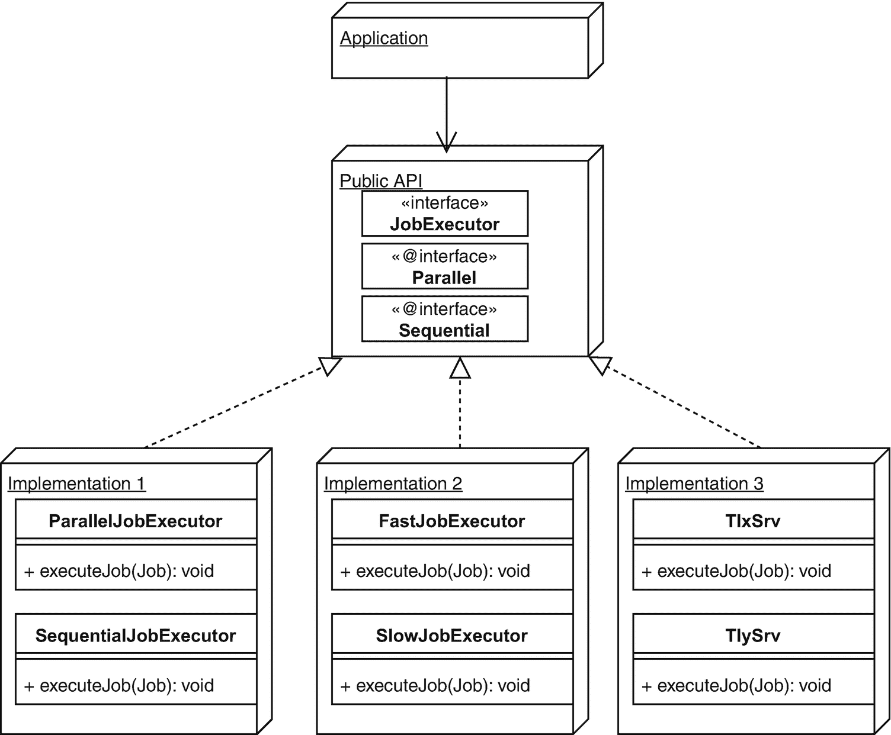

# 3. 识别 Bean

CDI 的核心职责之一是提供依赖项，即 CDI 中的 bean。正如你在前一章所学，可以通过多种方式获取此类 bean，即通过某种方式注入它们或通过编程式查找。获取 bean 的一个重要方面是，你需要一种方法来指定你想要哪个 bean。换句话说，你需要能够识别 bean。这引出了以下问题：bean 如何变得可识别，以及如何确保其他人可以引用你的 bean？CDI 中如何实现这一点是本章的主题。


## 什么是 Bean？

在上一章中，我们提到 CDI 中的一个组件被称为 *bean*。但究竟什么才构成一个 bean？Java 有 JavaBean 的概念，通常也被简称为 bean，但 CDI 中的 bean 要抽象得多。

从技术上讲，CDI 中的 bean 是指任何可以由 `javax.enterprise.inject.spi.Bean<T>` 实例表示的东西。这是一个内部但用户可访问的元数据结构，CDI 为其所知的每个 bean 在内部存储该结构。该结构包含核心工厂方法 `T create()`，用于实际创建 bean 的实例。正如你将在第 4 章中看到的，CDI 通常不会直接调用此工厂方法，而是通过一个上下文相关的“缓存层”以受控方式调用。`Bean<T>` 结构还保存了所谓的核心 bean 属性。

*   类型
*   限定符
*   名称
*   作用域
*   原型
*   替代（一个布尔值，表示该 bean 是替代 bean）

类型、限定符和名称将在本章中解释。作用域将在下一章中解释。

应用程序可以为每个 bean 实现 `Bean<T>` 接口，但并非必须如此。实际上，这样做相当罕见，因为 CDI 实现可以从另外三种更易于使用的工件生成 `Bean<T>` 实现。

*   托管 bean
*   生产者方法
*   生产者字段

托管 bean 本身由略显晦涩的托管 bean 规范定义，该规范是 Java EE 总括规范的一部分。它甚至有自己的注解 `javax.annotation.ManagedBean`，该注解位于另一个规范（即公共注解规范）中，并且与关键的 CDI 注解 `@PostConstruct` 和 `@PreDestroy` 相邻。

托管 bean 是大多数人会随意联想到的“CDI bean”。它就是一个最接近 JavaBean 或 JSF 托管 bean 的 Java 类（也称为 *bean 类*）。不过，存在一些限制；例如，内部类或抽象类不能作为托管 bean，并且 bean 类必须具有无参构造函数或单个可注入的构造函数。原因很简单：CDI 必须能够创建该类的实例。显然，抽象类无法实例化，带有 CDI 不知道如何提供参数的构造函数的类也无法实例化。

由于 CDI 从 bean 类创建 `Bean<T>` 结构，并且 `Bean<T>` 有一个返回该类实例的 `create()` 方法，因此可以说 bean 类实际上是其自身类型的工厂。

`Bean<T>` 实例也可以由 CDI 从某种更接近 `Bean<T>` 类型的东西创建，即从生产者方法创建。生产者方法是 bean 类中带有 `@Produces` 注解的方法。乍一看，它类似于 `Bean<T>` 的 `T create()` 方法，但生产者方法是一个更高级别的工件，支持注解和方法注入，而 `T create()` 处于较低级别，不支持这些功能。至于限制，生产者方法显然不能是抽象的（毕竟 CDI 运行时必须调用它），并且如果返回类型是泛型，则必须具有实际的类型参数（不允许通配符，并且仅在下一章讨论的特殊情况下允许类型变量）。

最后，还有生产者字段，它是 bean 类中带有 `@Produces` 注解的实例变量。此类实例变量通常应在初始化时立即赋值，然后 CDI 将使用此实例字段的值作为前述 `Bean<T>` 实例的 `T create()` 方法的返回值。

我们在此省略了两种特殊的 bean 情况：拦截器和装饰器，它们实际上是 `Bean<T>` 的子类型。我们将在第 6 章中深入讨论它们。

直接创建 `Bean<T>` 实例（而不是让 CDI 为你创建）将在第 8 章中讨论。

## 如何识别 Bean？

我们将首先解释如何使用与 bean 标识相关的不同术语。与第 2 章中的术语 *组件* 一样，我们不声称这些是规范定义，不同的作者可能会略有不同地使用它们。所谓 *获取*，是指代码想要使用一个 bean 并获取该 bean 的一般行为。通过 *引用* 其标识来获取 bean，这意味着该标识以某种方式提供给运行时。所谓 bean 的 *标识*，我们指的是一个或多个 bean 属性的唯一组合，你可以使用它让运行时找到这个 bean。就像安全中的主体（例如全名或社会安全号码）一样，一个 bean 可以有多个标识。运行时查找 bean 的过程称为 *解析*，这意味着将给定的标识与实际的 bean 实例进行匹配。

在 CDI 中，有几种方法可以引用一个 bean 甚至一组 bean。有些方法重叠，有些则相互补充。以下列表给出了概述：

*   按类型
*   按类型和限定符
*   按名称（表达式语言限制）

我们将在以下各节中更详细地讨论每个选项。


### 按类型划分

CDI 的核心概念之一是类型安全解析。在 Java EE 中，这使 CDI 区别于 JSF 和早期版本的 EJB，后两者都为 CDI 贡献了设计思路（参见第 1 章）。虽然使用 EJB 3 可以通过 `@EJB` 注解在一定程度上实现类型安全注入，但 CDI 将这一概念推向了更深的层次，并将其作为核心原则内置于其架构中。

类型安全解析基于这样一个事实：Bean 的主要标识符就是它的某个类或接口。

例如，考虑以下简单的 Bean：

```
public class SomeCDIBean {
}
```

在这种情况下，该 Bean 有两个可用于引用它的类型：`SomeCDIBean.class` 和 `Object.class`。后者显然过于通用，在实践中作为标识符用处不大。

现在考虑以下类型：

```
public interface SomeInterface {
}
public class SomeBaseBean implements SomeInterface {
}
public class SomeCDIBean extends SomeBaseBean {
}
```

现在 `SomeCDIBean` 有四个可用于引用它的类型：与之前相同的 `SomeCDIBean.class` 和 `Object.class`，但现在还多了 `SomeBaseBean.class` 和 `SomeInterface.class`。基本上，你可以使用其中任何一个类型来获取该 Bean 的实例。如果你想要一个唯一的实例，显然需要使用一个唯一的标识符。这反过来意味着，你需要基于接口 `SomeInterface` 来获取一个 Bean；并且只能有一个启用的 Bean 实现了该接口。这有时被称为*高地人规则*（只能有一个）。

现在，细心的读者可能会想，如果一个接口只允许被实现一次，那么它的用途到底是什么？答案在于一个微妙之处：这里限制的实际重点是，只允许一个“已启用”的 Bean 实现所述接口。已启用的 Bean 是指未被禁用、且未被另一个 Bean（通过我们将在本章后面讨论的“替代”概念）“覆盖”的 Bean。简单来说，它就是 CDI 会选择提供的那个 Bean。

此外，你不能直接使用 `SomeBaseBean.class` 而不附带任何条件来获取 `SomeCDIBean` 的唯一实例，因为显然这个标识符也被 `SomeBaseBean` 使用了。我们稍后会解释如何处理这个问题。

另一个 Bean 可以通过注入的方式，并利用注入点的类型作为向运行时传递所请求 Bean 标识的手段，来获取对 `SomeCDIBean` 的引用，如下例所示：

```
public class AnotherBean {
@Inject
SomeCDIBean bean;
}
public class AnotherBean {
@Inject
SomeInterface bean;
}
```

同样的事情也可以通过编程方式完成，无论是从 Bean 内部还是从非 Bean 的类中。请注意，当一个类不是 Bean 时，你必须处于 CDI 已初始化且该 Bean 的作用域处于活动状态的上下文中。这种上下文的初始化在很大程度上依赖于具体实现，但简单实际地说，这意味着处于一个“CDI 能工作”的线程中。作用域将在下一章中详细讨论。

以下是一些执行此操作的示例。请注意，在编程示例中，请求代码字面上将所请求 Bean 的标识传递给运行时，这一点可能更为明显。

```
SomeCDIBean bean = CDI.current().select(SomeCDIBean.class).get();
SomeInterface bean = CDI.current().select(SomeInterface.class).get();
```

在许多服务查找系统或 API 中，服务对其选择公开的标识拥有完全或至少部分控制权。在 CDI 中，此标识主要来自给定 Bean 的所有类型（其自身类型及其所有祖先类型，也称为其*传递闭包*）。你是否应该仅仅为了影响哪些类型成为其标识符而更改 Bean 的类型层次结构？这在所有情况下都可能实现吗？

答案是否定的。你不需要这样做。CDI 有一种机制，可以通过 `@Typed` 注解显式设置 Bean 作为其标识发布的类型。当然，这些类型必须是该 Bean 类型传递闭包中实际存在的类型。

对于前面展示的 `SomeCDIBean` 示例，你可以针对两种不同的用例使用 `@Typed`。

第一种情况是，例如，你想在库中发布 `SomeCDIBean`，但只向外界暴露其接口，将实现作为库的私有细节。在这种情况下，你可以像下面这样用 `@Typed` 注解 `SomeCDIBean`：

```
@Typed(SomeInterface.class)
public class SomeCDIBean extends SomeBaseBean {
}
```

按照这个 `SomeCDIBean` 的定义，只有 `SomeInterface.class` 以及作为特例的 `Object.class` 可以用来引用该 Bean（`Object.class` 不能通过这种方式从标识列表中删除）。

第二种示例情况是，你想通过编程方式选择为 `SomeInterface.class` 标识提供哪个 Bean，也许是通过生产者。那么该生产者应该唯一对应这个标识，这意味着 `SomeCDIBean` 本身不应该对应。实现此目的的方法之一是再次使用 `@Typed`，这次是从标识列表中移除该接口。

```
@Typed(SomeCDIBean.class)
public class SomeCDIBean extends SomeBaseBean {
}
```

按照这个定义，只有 `SomeCDIBean.class` 可以用来引用 `SomeCDIBean`（同样还有 `Object.class`）。

这意味着你现在可以像下面这样创建一个生产者：

```
public class SomeProducer {
@Inject
SomeCDIBean someCDIBean;
@Inject
SomeOtherCDIBean someOtherCDIBean;
@Produces
public SomeInterface produce() {
if (...){
return someCDIBean;
}
return someOtherCDIBean;
}
}
```

在前面的例子中，生产者注入了两个 Bean，它们都实现了 `SomeInterface`，但它们的标识符中都不包含 `SomeInterface.class`，因此不会与生产者的标识符冲突。根据某个条件，返回其中一个注入的 Bean。

实际上，应用程序中其他地方执行 `@Inject SomeInterface` 的代码将获得由 `SomeCDIBean` 或 `SomeOtherCDIBean` 提供的实现。


### 按类型和限定符

限定符最初在 CDI 中被称为*绑定注解*（`@BindingType`）（参见第 1 章），它是一种扩展 Bean 标识符的方式，使其不仅限于类型。严格来说，限定符（如 `@Inject` 注解）并不属于 CDI 本身，而是位于 AtInject（JSR 330）规范中。然而，与 `@Inject` 一样，限定符是 CDI 的绝对核心，CDI 甚至为其添加了自身的行为。

限定符是一种注解，因此其本身是类型安全的。限定符注解可以有零个或多个属性，默认情况下每个属性的值都会增加 Bean 的标识符。此外，限定符可以包含不计入 Bean 标识符的可选属性。这些属性必须使用 `@NonBinding` 进行注解，这是一个 CDI 注解，因此是 CDI 特有的。请注意，旧的 CDI 特定名称 `@BindingType` 与 `@NonBinding` 之间的相似性，这很可能并非巧合。

在定义中，Bean 可以添加零个或多个限定符来扩展其标识符，每个限定符可以有零个或多个（绑定）属性。

因此，Bean 的完整标识符变为：“其类型之一 + 其所有限定符的所有类型 + 其所有限定符的绑定属性值。”

例如，再次考虑 `SomeCDIBean`，但现在它带有两个没有属性的限定符，如下所示：

```
@SomeQualifierOne @SomeQualifierTwo
public class SomeCDIBean extends SomeBaseBean {
}
```

根据该定义，此 Bean 的标识符之一现在是 [`SomeInterface.class, @SomeQualifierOne, @SomeQualifierTwo`]。

另一个 Bean 可以通过注入的方式获取对 `SomeCDIBean` 的引用，并使用带有所有限定符注解的注入点类型，将所需 Bean 的标识符传递给运行时，如下例所示：

```
public class AnotherBean {
@Inject
@SomeQualifierOne @SomeQualifierTwo
SomeInterface bean;
}
```

同样的事情也可以通过编程方式完成。以下是一个示例。请注意，在 Java 中，注解本身之外没有用于注解字面量的语法。因此，您必须自己创建这样一个注解实例，这不幸地需要一些工作。CDI 提供了 `AnnotationLiteral` 来帮助解决这个问题。这是通过以特定方式继承 `AnnotationLiteral` 来实现的。对于 `SomeQualifierOne` 限定符，如下所示：

```
class SomeQualifierOneLiteral
extends AnnotationLiteral
implements SomeQualifierOne {
private static final long serialVersionUID = 1L;
}
```

由于在每个项目中为每个限定符执行此操作仍然是大量重复性工作，CDI 鼓励一种约定：对于没有属性的限定符，在其内部定义一个名为 `Literal` 的类，该类包含一个名为 `INSTANCE` 的静态成员，用于保存其外部类注解的预构建注解实例。对于 `SomeQualifierOne`，如下所示：

```
@Qualifier
@Retention(RUNTIME)
@Target({ TYPE, METHOD, FIELD, PARAMETER })
@Documented
public @interface SomeQualifierOne {
public static final class Literal
extends AnnotationLiteral
implements SomeQualifierOne {
private static final long serialVersionUID = 1L;
public static final Literal INSTANCE = new Literal();
}
}
```

有了这个，并假设 `SomeQualifierTwo` 有类似的定义，您现在可以通过编程方式请求 `SomeCDIBean` 的实例，如下所示：

```
SomeCDIBean bean =
CDI.current()
.select(
SomeCDIBean.class,
SomeQualifierOne.Literal.INSTANCE,
SomeQualifierTwo.Literal.INSTANCE
)
.get();
SomeInterface bean =
CDI.current()
.select(
SomeInterface.class,
SomeQualifierOne.Literal.INSTANCE,
SomeQualifierTwo.Literal.INSTANCE
)
.get();
```

到目前为止，您一直在研究没有属性的限定符。如前所述，限定符也可以有属性，这些属性有助于标识符的构成。但是，您必须意识到，使用属性不一定是类型安全的，因为您可以使用例如基于字符串的属性，这些属性容易发生输入错误。

对于带有属性的限定符，为其关联的字面量设置一个 `INSTANCE` 的简单约定当然是不够的，因为您需要以某种方式提供属性的值。如果某些（绑定）属性没有默认值，那么提供 `INSTANCE` 也没有太大意义，因为您必须提供默认值。这些默认值可能毫无意义或不清楚。不过，CDI 对此也有一个约定，那就是在同一个内部 `Literal` 类中提供一个名为 `of` 的静态工厂方法。

在下面的示例中，您添加了一个基于 `enum` 的属性，演示了这一点：

```
@Qualifier
@Retention(RUNTIME)
@Target({ TYPE, METHOD, FIELD, PARAMETER })
@Documented
public @interface SomeQualifierOne {
TimeUnit value() default DAYS;
public static final class Literal
extends AnnotationLiteral
implements SomeQualifierOne {
private static final long serialVersionUID = 1L;
public static final Literal INSTANCE = of(DAYS);
private final TimeUnit value;
public static Literal of(TimeUnit value) {
return new Literal(value);
}
private Literal(TimeUnit value) {
this.value = value;
}
public TimeUnit value() {
return value;
}
}
}
```

在这个例子中，单个属性（`value`）有一个默认值（`DAYS`），因此您可以在此处创建一个 `INSTANCE`。如果没有这样的默认值，您只需省略它，只提供 `of` 方法。这里使用的模式基本上适用于所有限定符；静态 `of` 方法接受所有限定符属性的值，并使用这些值调用私有构造函数。私有构造函数为每个注解属性设置一个 final 实例变量，并且与属性同名的 getter 风格方法返回这些值。

有了这个限定符，Bean 的定义现在可以如下所示：

```
@SomeQualifierOne(HOURS) @SomeQualifierTwo
public class SomeCDIBean extends SomeBaseBean {
}
```

您可以使用以下代码通过注入请求此 Bean 的实例：

```
public class AnotherBean {
@Inject
@SomeQualifierOne(HOURS)
@SomeQualifierTwo
SomeInterface bean;
}
```

以下是编程方式：

```
SomeInterface bean =
CDI.current()
.select(
SomeInterface.class,
SomeQualifierOne.Literal.of(HOURS),
SomeQualifierTwo.Literal.INSTANCE
)
.get();
```

请注意，要使运行时解析正常工作（即找到正确的 Bean），属性值*必须*完全匹配，并且如果有多个属性，它们都必须完全匹配。但是，您可以在属性中提供额外的信息，这些信息完全不用于解析。这样的属性必须使用 `@NonBinding` 注解进行注解。这些额外信息随后可以被使用，例如，由生产者以某种动态和自定义的方式使用。

以下是如何首先使用新的非绑定属性扩展您的限定符：

```
@Qualifier
@Retention(RUNTIME)
@Target({ TYPE, METHOD, FIELD, PARAMETER })
@Documented
public @interface SomeQualifierOne {
TimeUnit value() default DAYS;
@Nonbinding String key() default "";
public static final class Literal
extends AnnotationLiteral
implements SomeQualifierOne {
private static final long serialVersionUID = 1L;
public static final Literal INSTANCE = of(DAYS, "");
private final TimeUnit value;
private final String key;
public static Literal of(TimeUnit value, String key) {
return new Literal(value, key);
}
private Literal(TimeUnit value, String key) {
this.value = value;
this.key = key;
}
public TimeUnit value() {
return value;
}
public String key() {
return key;
}
}
}
```


如您所见，我们新增了一个名为 `key` 的属性，该属性带有 `@NonBinding` 注解。这个相同的属性也必须添加到内部类 `Literal` 中。有了这个限定符，您现在可以定义以下生产者，利用这些额外信息：

```
public class SomeProducer {
@Inject
SomeCDIBean someCDIBean;
@Produces
@SomeQualifierOne(HOURS) @SomeQualifierTwo
public SomeInterface produce(InjectionPoint injectionPoint) {
String key =
injectionPoint.getAnnotated()
.getAnnotation(SomeQualifierOne.class)
.key();
if (key == ..) {
// 使用 someCDIBean 执行特殊操作
}
return someCDIBean;
}
}
```

为清晰起见，在 `@SomeQualifierOne` 注解中，我们并未为 `key` 属性提供显式值。这样做是为了强调它不参与解析过程。不过，如果我们为 `key` 提供了值，运行时也会简单地忽略它（就像现在忽略默认值 `""` 一样）。

获取这些额外信息确实暴露了 CDI 的一个弱点；没有通用的方法可以获取用于解析的注解引用（稍后讨论拦截器时，您会看到类似的问题）。不过，您可以做的是注入一个所谓的 `InjectionPoint` 实例。回顾第 2 章，这是方法注入的一个示例，您无需使用任何 `@Inject` 注解；生产者中的每个额外参数都由 CDI 在此处提供。

`InjectionPoint` 表示使用 `@Inject` 注解的位置，并包含所有元数据，例如发生注入的方法或字段的名称、其注解等。在这种情况下，您需要的是注解，这些注解最容易从 `"javax.enterprise.inject.spi.Annotated"` 获取，该对象表示注解所在的实体。

您可能会质疑，如果您使用 `InjectionPoint` 来获取注解，那么当您以编程方式查找 bean 时，这又如何工作呢？当然，在这种情况下没有注入点。一个有点令人失望的答案是，它不适用于编程式查找。因此，通过注入和通过查找检索 bean 并不完全对称。这是 CDI API 中的一个限制，或者说是一个疏忽，它最初主要关注声明式注入，而对编程式查找关注较少。

然而，当确实使用注入时，事情就很简单了，如下所示：

```
public class AnotherBean {
@Inject
@SomeQualifierOne(value = HOURS, key = "test")
@SomeQualifierTwo
SomeInterface bean;
}
```

`SomeInterface.class`、`SomeQualifierOne.class`、`SomeQualifierTwo.class` 和 `SomeQualifierOne.value == HOURS` 都用于解析，而 `key == "test"` 则作为额外信息存在。

#### 为什么实际上需要限定符？

尽管您已经看到了各种示例，但一个核心问题仍未得到解答；我们首先为什么需要限定符，为什么不能仅仅使用额外的接口来表达相同的事情？

首先，让我们看一个常用于解释限定符的示例：接口的使用，以及希望拥有特定实现的愿望。

例如，考虑一个用于执行任务的接口，如下所示：

```
public interface JobExecutor {
void executeJob(Job job);
}
```

现在假设您有两个此接口的实现——一个并行工作的任务执行器和一个顺序工作的任务执行器。

```
public class ParallelJobExecutor implements JobExecutor {
public void executeJob(Job job) {
// ...
}
}
public class SequentialJobExecutor implements JobExecutor {
public void executeJob(Job job) {
// ...
}
}
```

现在假设一个 bean 想要使用并行或顺序执行器（甚至可能两者都用）。这该如何实现？这就是通常引入限定符的地方，例如，您可以有一个 `@Parallel` 限定符和一个 `@Sequential` 限定符。

```
@Parallel
public class ParallelJobExecutor implements JobExecutor {
public void executeJob(Job job) {
// ...
}
}
@Sequential
public class SequentialJobExecutor implements JobExecutor {
public void executeJob(Job job) {
// ...
}
}
```

现在，一个 bean 可以像往常一样获取对其中任何一个的引用，如下所示：

```
public class AnotherBean {
@Inject
@Parallel
JobExecutor executor;
}
```

然而，这里最大的问题是，为什么我们不直接注入 `ParallelJobExecutor` 而不是 `@Parallel JobExecutor`？

虽然在这个简单的情况下我们当然可以这样做，但在实践中，这可能意味着定义好的公共 API 和实现 jar 之间的区别。在这种情况下，`@Parallel`、`@Sequential` 和 `interface JobExecutor` 将是公共 API 中的类型，而 `ParallelJobExecutor` 和 `SequentialJobExecutor` 则是实现 jar 中的类型。

通常，应用程序应仅依赖于公共 API 中的类型，而不应依赖于实现中的私有类型。遵循这一通用规则意味着您可以轻松地将实现 jar 切换到另一个实现，而无需更改应用程序的代码。

这一点在图 3-1 中进行了说明。



图 3-1

具有多个实现的公共 API

您可能还会问自己另一个问题，为什么不直接使用额外的接口来代替那些额外的限定符呢？例如，前面提到的 API 可以定义两个这样的接口：

```
public interface ParallelJobExecutor extends JobExecutor {
}
public interface SequentialJobExecutor extends JobExecutor {
}
```

然后，每个（私有）实现可以实现这些接口之一，并且注入点和查找甚至会更简单，因为它们只需要引用那个单一的接口，而不是接口加限定符。换句话说，它将变成这样：

```
JobExecutor executor =
CDI.current()
.select(
ParallelJobExecutor.class
)
.get();
```

而不是这样：

```
JobExecutor executor =
CDI.current()
.select(
JobExecutor.class,
Parallel.Literal.INSTANCE
)
.get();
```

虽然这当然可以完成任务，但一个没有方法的接口（称为*标记接口*）通常不太受欢迎。完整的讨论超出了本书的范围，但简而言之，事实是标记接口将接口的用途（即声明类支持的操作）与未通过这些操作表达的隐式契约混为一谈。


在这个特定示例中，倾向于使用限定符的另一个原因是，如你之前所见，可以在限定符中提供额外数据。以`@Parallel`注解为例，你可以利用它来配置一些执行设置：

```
public class AnotherBean {
@Inject
@Parallel(minTheads=1, maxThreads=10)
JobExecutor executor;
}
```

如果不使用限定符，而纯粹依赖类型，那么处理配置类型数据的变通方法，例如，可以是注入一个工厂类型，在其上设置配置参数，然后从中获取你的 bean。在某些情况下，注入的 bean 可能支持配置设置。

以下是使用工厂的一个示例：

```
public class AnotherBean {
@Inject
JobExecutorFactory executorFactory;
JobExecutor executor;
@PostConstruct
public void init() {
executor = executorFactory.create(1, 10);
}
}
```

这个示例使用了一个支持后创建初始化的 bean：

```
public class AnotherBean {
@Inject
JobExecutor executor;
@PostConstruct
public void init() {
executor.setMinThreads(1);
executor.setMaxThreads(10);
}
}
```

可以说，在限定符中使用配置数据是一种更清晰的方法，并且使你无需了解背后使用工厂的生产者，也无需在创建 bean 时或之后对其进行配置。

当需要组合多个限定符时，限定符也更具优势。例如，假设除了互斥的`@Parallel/@Sequential`之外，你还有一个`@Local/@Remote`注解用于在本地或远程服务器上严格执行作业，以及一个`@Stateful/@Stateless`注解用于持久化或不持久化作业进度的执行器。

使用限定符，你可以请求一个`@Parallel @Remote @Stateful` *或* `@Parallel @Local @Stateful` 等组合的 bean。为每一种可能的组合创建（标记）接口会变得相当繁琐且看起来别扭。

```
interface ParallelLocalStatefulJobExecutor extends JobExecutor {}
interface ParallelRemoteStatefulJobExecutor extends JobExecutor {}
interface ParallelLocalStatelessJobExecutor extends JobExecutor {}
interface ParallelRemoteStatelessJobExecutor extends JobExecutor {}
interface SequentialLocalStatefulJobExecutor extends JobExecutor {}
interface SequentialRemoteStatefulJobExecutor extends JobExecutor {}
interface SequentialkLocalStatelessJobExecutor extends JobExecutor {}
interface SequentialRemoteStatelessJobExecutor extends JobExecutor {}
```

不过请注意，尽管在 CDI 中可以使用多个限定符，但在实践中不应过度使用，因为这仍然会使代码看起来密集且难以使用。遗憾的是，CDI 中没有一种易于使用的机制来将多个限定符合并为一个。CDI 确实有一个有限的选项来组合（主要是）拦截器绑定注解（称为`StereoTypes`），我们稍后会介绍。

限定符特别有用甚至不可避免的一种情况是，当生产者生成它们（或它们所属的库）不拥有的（通用）类型时。例如，JSF 显然不拥有 Java SE 的`Map`类型，因此它附带的任何生成此类型的产品者几乎都必须使用限定符，以避免与生成相同类型的其他生产者（甚至包括它自己的生产者）产生歧义。例如，JSF 允许你注入所谓的标头映射和请求参数映射，它们分别包含 HTTP 请求标头和 HTTP 请求参数。两者都是`Map`（具体来说是`Map<String, String>`），因此 JSF 为它们使用了限定符。以下是此情况的一个示例：

```
public class AnotherBean {
@Inject
@HeaderMap
Map headers;
@Inject
@RequestParameterMap
Map parameters;
}
```

如果不使用此处使用的限定符，你会遇到某种歧义解析异常。

对于库或组件编写者来说，限定符的另一个用途是使用“内部生产者”。在这种情况下，生产者（甚至可能是 bean）使用私有限定符（例如，具有默认访问权限的限定符，即“包私有”）进行限定。使用此类私有限定符时，客户端代码意外使用内部生产者的风险会大大降低。


### 按名称

除了由一种类型和零个或多个限定符构成的`typesafe`标识符外，CDI 中的 Bean 还有另一个可选的并行标识符：一个基于扁平字符串的名称。此名称完全可选，Bean 并非必须拥有它。此外，该名称可以完全独立于主标识符，并且可以根据需要简单或复杂，尽管存在某些限制。

扁平名称并非用于常规用途，而是用于与基于字符串的环境集成，在 Java EE 中则专门用于与平台的表达式语言（EL）集成。实际上，大多数情况下，你可以将“bean 名称”理解为“EL 名称”。

先前对名称的限制进一步强化了 Bean 名称作为表达式语言名称的特性，因为 Bean 名称至少必须是一个有效的表达式语言名称。此外，它可以是多个有效表达式语言标识符的拼接，中间用句点分隔。然而，在实践中，这种伪命名空间的名称并不被鼓励，因为在实际的表达式语言中使用时可能会造成混淆。

对于 Bean 类和生产者方法，Bean 名称是通过一个内置限定符 `@Named` 的某种特殊用法来设置的。这种用法很特殊，因为尽管它是一个真正的限定符注解，但实际上并不作为真正的限定符使用。它主要提供一种设置 Bean 名称的机制，该机制被 CDI 运行时特别识别。通常，在设计 API 时，你会尽量避免赋予事物隐含的次要或硬编码语义，但这显然并不总是容易做到，最初的 CDI 设计者可能不得不在某种程度上做出妥协。不过，在元数据结构 `javax.enterprise.inject.spi.Bean<T>` 中，通过其超接口 `BeanAttributes`，Bean 名称确实拥有自己的属性，即只读的“name”属性（通过 `getName()` getter 方法获取）。

使用这个“伪”限定符时，你可以自己提供名称，也可以使用默认名称。当应用于 Bean 类时，默认名称是将简单类名的首字母小写。例如，对于 `com.example.Foo`，使用不带属性的 `@Named` 时，默认 Bean 名称是 `foo`。当应用于生产者方法时，默认名称就是方法名本身，除非方法名以 `get` 开头，在这种情况下，Bean 名称是去掉 `get` 并将首字母小写后的方法名。例如，对于 `public Foo getFoo()`，默认名称将是 `foo`；而对于 `public Foo produceFoo()`，默认名称则是 `produceFoo`。

以下是将 `@Named` 应用于 Bean 类的示例：

```
@Named
public class SomeCDIBean {
}
```

以及应用于生产者方法的示例：

```
public class SomeProducer {
@Produces
@Named("someInterface")
public SomeInterface produce() {
// ...
}
}
```

在已定义 EL 到 CDI Bean 解析为激活状态的上下文中（例如在 JSF 和 EE Security 中），可以使用这些名称通过表达式语言检索 Bean。也可以直接通过表达式语言 API，使用从 `BeanManager` 获取的 `ELResolver` 来检索 Bean。

以下示例演示了后者：

```
public class SomeCDIBean {
@Inject
BeanManager beanManager;
public void someMethod() {
ELProcessor elProcessor = new ELProcessor();
elProcessor.getELManager()
.addELResolver(
beanManager.getELResolver());
SomeCDIBean someCDIBean =
elProcessor.getValue(
"someCDIBean", SomeCDIBean.class);
}
}
```

请注意，在此示例中，作为 `getValue()` 方法第二个参数传入的 `SomeCDIBean.class` 并不用于解析；你也可以传入 `Object.class`。相反，该参数用于强制转换（转换）表达式求值（此处为 `someCDIBean`）以及后续由 CDI 运行时解析所得到的结果。

或者，你也可以将 `@Named` 用作查找的实际限定符，尽管这非常不推荐，因为 Bean 名称和 `@Named` 不应为此目的而使用。不过，为了完整性，以下是一个示例：

```
SomeCDIBean bean = (SomeCDIBean)
CDI.current()
.select(Object.class, NamedLiteral.of("someCDIBean"))
.get();
```

由于 `@Named` 源自 AtInject（JSR 330），而字面量是 CDI 的构造，因此无法更新实际的注解以符合 CDI 约定。相反，CDI 为 `@Named` 包含了一个单独的字面量，称为 `NamedLiteral`，它被用于前面的代码中。


## 识别与检索多个 Bean

在 CDI 中，你不仅限于检索单个 Bean 实例；你还可以检索 Bean 的集合。无论是在注入时还是通过编程方式检索 Bean，你都可以做到这一点。

通过编程方式实现这一点已经有所展示，因为它就是 `select()` 方法的返回值。在此之上调用 `get()` 才是真正将其缩减为单个 Bean（如果可以缩减的话）。

在展示如何检索 Bean 集合的更详细示例之前，了解两个内置限定符非常重要：`@Default` 和 `@Any`。

当一个 Bean 没有添加任何显式的实际限定符时，它会获得一个恰如其名的默认限定符 `@Default` *。* 一旦为其添加了任何显式限定符（`@Named` 不算），`@Default` 限定符就会被移除。

当你在注入点注入一个没有任何限定符的 Bean，或者通过编程方式检索 Bean 且在 `select()` 方法中没有限定符时，CDI 运行时实际上会按类型 + `@Default` 进行查找。

除了 `@Default`，每个 Bean 的限定符集合中始终包含 `@Any` 限定符。按照正常的 CDI 约定，这个限定符永远不会被移除（正如你将在后续章节中看到的，当你直接通过 `Bean<T>` 结构创建或操作 Bean 元数据时，可以将其移除）。

此外，在组合 Bean 的标识以进行检索并提供限定符时，解析规则实际上规定：你添加到标识中的所有限定符都必须存在于该 Bean 上，但反之则不然。并非 Bean 拥有的所有限定符都需要匹配，解析才能成功。有时情况可能并非如此，因为如果你对一个带有限定符的 Bean 仅使用“类型”作为标识符，解析将无法工作；CDI 运行时将找不到该 Bean。但请记住，你*实际*请求的是一个标识符为类型 + `@Default` 的 Bean，而当你添加显式限定符时，`@Default` 会被移除。因此，起初可能看起来使用标识符的子集不起作用，但实际上它是有效的。例如，考虑一个带有两个限定符 `@SomeQualifierOne` 和 `@SomeQualifierTwo` 的 Bean。如果你只组合一个类型 + `@SomeQualifierOne` 的标识符，你可以用它来成功检索到这个 Bean。

从某种意义上说，通过添加 `@Default` 和 `@Any` 这两个特殊限定符，你实际上拥有了一种小而简单的“Bean 查询语言”。

现在让我们看一些实际应用的例子。考虑以下三个 Bean：

```
@SomeQualifierOne
@SomeQualifierTwo
public class SomeCDIBean implements SomeInterface {
}
@SomeQualifierOne
public class AnotherBean implements SomeInterface {
}
public class YetAnotherBean implements SomeInterface {
}
```

现在，你可以通过以下“查询”来检索所有带有 `@SomeQualifierOne` 注解的 Bean：

```
Instance someInterfaceBeans =
CDI.current()
.select(
SomeInterface.class,
SomeQualifierOne.Literal.INSTANCE)
```

`Instance` 容器是一种特殊的 CDI 类型，它封装了你初始查询的结果，并随后允许你进行子选择，以及测试是否有一个单一的“可解析”结果（一个符合注入条件的 Bean）。随后你可以获取该结果，并使用各种方法来遍历集合。

对于之前的查询，询问它是否可解析会返回 `false`，因为你应该有两个 Bean。

```
boolean isResolvable = someInterfaceBeans.isResolvable();
```

你可以通过再次调用 `select()` 方法对结果进行子选择，如下所示：

```
Instance withTwoBeans =
someInterfaceBeans.select(
SomeQualifierTwo.Literal.INSTANCE);
```

从你已经得到的结果（即之前定义的两个 Bean，它们都带有 `@SomeQualifierOne`*）* 中，你进行一个子选择，请求所有带有 `@SomeQualifierTwo`* 的 Bean。* 这将产生一个新的 `Instance`，这次只引用 `SomeCDIBean`。由于现在只有一个 Bean，以下代码将返回 `true`：

```
boolean resolvable = withTwoBeans.isResolvable();
```

如果你想获取所有实现 `SomeInterface` 的 Bean 的集合，可以使用以下查询，利用特殊的 `@Any` 限定符：

```
Instance allInterfaceBeans =
CDI.current()
.select(
SomeInterface.class,
Any.Literal.INSTANCE);
```

`allInterfaceBeans` 实例现在将引用之前定义的所有三个 Bean。

现在假设你想从这个集合中选择那个没有任何限定符的 Bean。如前所述，这意味着该 Bean 具有隐式的 `@Default` 限定符，因此你可以再次使用它进行子选择。

```
Instance defaultBeans =
allInterfaceBeans.select(
Default.Literal.INSTANCE);
```

如前所述，除了选择和测试结果，你还可以对其进行迭代。`Instance` 本身就是一个 `Iterable`，因此你可以直接在 `for-each` 循环中使用它，但也可以从中获取一个通用的 `Stream`。以下示例展示了如何通过 `Stream` 将结果转换为常规的 `List`：

```
List someInterfaces =
allInterfaceBeans.stream()
.collect(toList());
```

在 CDI 中，检索多个 Bean 并不局限于编程式 API。使用注入，你也可以达到同样的效果。在这种情况下，注入点必须是 `Instance` 类型，以请求的类型作为泛型参数，并以注解形式提供请求的限定符。以下是一个示例：

```
public class MultipleInjectionBean {
@Inject
@SomeQualifierOne
Instance someInterfaceBeans;
}
```


## 通过自定义方法参数注入检索 Bean

除了注入字段外，CDI 还支持注入到方法和类的构造函数中。与字段注入类似，只有当 CDI 控制此类方法或构造函数的调用时，才支持方法注入。

正如你在第 2 章中所见，构造函数注入是通过使用 `@Inject` 注解构造函数本身来完成的。与其他一些框架不同，没有必要（甚至不可能）使用 `@Inject` 注解单个参数。当然，可以通过使用一个或多个限定符注解来注解任何参数，从而限定注入。

让我们看一个例子。考虑 Bean `SomeBean`。

```
@RequestScoped
@SomeQualifierOne
public class SomeBean {
public String hi() {
return "Hello from someBean";
}
}
```

考虑 `AnotherBean` 中的以下构造函数注入：

```
@RequestScoped
public class AnotherBean {
@Inject
public AnotherBean (@SomeQualifierOne SomeBean someBean) {
// ... 对 someBean 执行某些操作
}
}
```

需要注意的是，构造函数注入自然发生在字段注入*之前*。这意味着，如果 `AnotherBean` 也指定了注入到实例变量中，那么在调用构造函数时，这些变量仍将为 null。

生产者中也允许方法注入。这些方法默认是可注入的，因此不必使用 `@Inject` 进行标记。以下是一个示例：

```
@ApplicationScoped
public class ProducerBean {
@Produces
public String produce(@SomeQualifierOne SomeBean someBean) {
return someBean.hi();
}
}
```

每当调用该生产者方法时（例如，当代码中出现 `@Inject String string` 时），CDI 将提供（注入）一个带有请求限定符的 `SomeBean` 实例作为参数。

观察者方法也是由 CDI 调用的方法，因此也是可注入的。与生产者方法一样，观察者方法默认是可注入的，因此这里也不需要 `@Inject` 注解。考虑以下示例：

```
public class ListenerBean {
public void listen(
@Observes @SomeQualifierOne EventObject eventObject,
SomeBean someBean) {
// ...
}
}
```

这样的观察者方法会监听由如下代码触发的事件：

```
beanManager.fireEvent(
new EventObject(this),
SomeQualifierOne.Literal.INSTANCE);
```

如你所见，这里没有提供 `SomeBean` 实例。细心的读者可能会注意到，我们在这里对事件使用了限定符。与 Bean 类似，事件也可以以非常相似的方式进行限定。尽管通常不这样解释，但观察者方法的查找与 Bean 的查找非常相似，其中“事件类型 + 限定符”构成了观察者方法的标识符，随后 CDI 运行时查找所有与此标识符对应的观察者。事件将在第 5 章中更详细地讨论。

### 实践示例：实现自定义方法注入

本节是一个较大的动手示例，演示如何使用 CDI 编程式 API 开发你自己的自定义功能，旨在让你深入了解如何开发 CDI 实用工具库。

主要兴趣在于学习 CDI 本身以便在应用程序中直接使用的读者，可能希望跳过本节或略读。

有时你可能希望允许注入到自己的自定义方法中，换句话说，就是那些并非由 CDI 直接调用的方法。CDI 不直接支持这一点，但使用本章前面部分解释的 CDI API，你可以自己实现类似的功能。一般方法是遍历 `Method` 的形参（`Method` 是一个 Java SE 类，反射性地表示一个 Java 方法），并为每个参数记录其类型以及可选的限定符注解。对于每个记录的此类类型和限定符注解，可以使用 `CDI.current().select(...)` 来获取一个 Bean，并将其传递给被调用的方法，这演示了前面解释的编程式 API 的一个特定实际用例。

以下是此功能的代码示例：

```
@SuppressWarnings("unchecked")
public  T callMethod(
BeanManager beanManager,
Object bean, Method method, Map providedValues) {
List parameterValues = new ArrayList();
Parameter[] methodParameters = method.getParameters();
for (int i=0; i  beanManager.isQualifier(e.annotationType()))
.collect(toList())
.toArray(new Annotation[0]);
parameterValues.add(
CDI.current()
.select(
methodParameters[i].getType(),
qualifiers)
.get()
);
}
}
try {
return (T)
method.invoke(bean, parameterValues.toArray());
} catch (
IllegalAccessException |
IllegalArgumentException |
InvocationTargetException e) {
throw new RuntimeException(e);
}
}
```

这里展示的示例使用了一个带有位置参数的 `Map`，以便调用方也可以提供自己的参数。其余参数将由 CDI 注入。这里使用 `beanManager` 的 `isQualifier` 方法来确定给定的注解是否为限定符。

为了方便起见，你可以将前面介绍的方法放入如下所示的 Bean 中：

```
@ApplicationScoped
public class MethodParamInjector {
@Inject
private BeanManager beanManager;
public  T callMethod(Object bean, Method method) {
return callMethod(beanManager, bean, method, emptyMap());
}
public  T callMethod(
Object bean, Method method,
Map providedValues) {
return callMethod(
beanManager, bean, method, providedValues);
}
@SuppressWarnings("unchecked")
public  T callMethod(BeanManager beanManager,
Object bean, Method method,
Map providedValues) { … }
}
```

现在考虑 `SomeBean` 的以下版本：

```
@RequestScoped
public class SomeBean {
public String getHello(HttpServletRequest request) {
return
"Hello from foo in request " +
request.getRequestURI();
}
}
```

现在，你可以通过参数注入器以如下方式调用 `getHello()` 方法：

```
@Inject
private SomeBean someBean;
@Inject
private MethodParamInjector methodParamInjector;
public String getHello() throws Throwable {
return methodParamInjector.callMethod(
someBean,
someBean.getClass()
.getMethod(
"getHello",
HttpServletRequest.class));
}
```

请注意，方法名是一个 `String`。虽然这很典型，但并不完全理想。方法名可能拼写错误，而编译器当然不会捕捉到。或者方法本身可能被重构，导致这里的方法名不同步。你真正需要的是一个“方法字面量”（一个表示方法的字面量，就像 `SomeBean.class` 表示一个类一样），但不幸的是，Java 不支持它们。


Java 确实支持“方法引用”。不过，它们与其说是方法的表示，不如说是一种结合方法所属类的实例（对于非静态方法）来调用特定方法的方式。通过一个小技巧，你可以获取方法引用所解析到的实际方法。这个技巧涉及使用 `InvocationHandler`，这是一个在代理上的方法被调用时会被调用的处理器。该处理器可以存储即将被调用的 `Method` 实例，从而让你能够访问方法的实际表示。这样的处理器如下所示：

```
class InterceptingMethodHandler implements InvocationHandler {
private Method interceptedMethod;
@Override
public Object invoke(
Object proxy, Method method, Object[] args)
throws Throwable {
interceptedMethod = method;
return null;
}
Method getInterceptedMethod() {
return interceptedMethod;
}
}
```

下一步是为 bean 类生成一个动态代理。这个代理将与原始 bean 类具有相同的类型，这意味着它可以被传入方法引用，并且方法引用将尝试在其上调用预期的方法。

我们将使用著名的 `ByteBuddy` 库来生成这个动态代理。JDK 本身确实有动态代理功能，但它只能为接口生成代理，对于这个用例来说过于局限。

代理生成方法如下所示：

```
private static  T createProxy(
Class beanClass, InvocationHandler invocationHandler,
int arguments) {
try {
return new ByteBuddy()
.subclass(beanClass, DEFAULT_CONSTRUCTOR)
.method(
isMethod()
.and(takesArguments(arguments))
.and(not(isDeclaredBy(Object.class))))
.intercept(InvocationHandlerAdapter.of(invocationHandler))
.make()
.load(MethodParamInjector.class.getClassLoader())
.getLoaded()
.newInstance();
} catch (
IllegalAccessError |
InstantiationException |
IllegalAccessException e) {
throw new RuntimeException(e);
}
}
```

有了这两个关键组件，我们将定义一个小的粘合方法，用于实例化处理器和代理，并将对代理的实际调用委托给一个消费者。

```
public static  Method findMethod(
Class beanClass, int arguments, Consumer consumer) {
InterceptingMethodHandler interceptingMethodHandler =
new InterceptingMethodHandler();
consumer.accept(
createProxy(
beanClass, interceptingMethodHandler, arguments));
return interceptingMethodHandler.getInterceptedMethod();
}
```

最后一步是编写一个方法，该方法接受一个方法引用，并以一种最终能调用代理的方式对其进行调用。然而，这不能是一个单一的方法，因为方法引用必须被赋值给一个“匹配的”函数式接口。具体来说，这意味着你需要拥有覆盖各种可能 bean 方法的函数式接口，并且对于每个这样的函数式接口，都有一个匹配的方法来接受它。这些可能的 bean 方法大致分为两类：有返回值的方法和没有返回值的方法。对于每一类，你还需要接受零个方法参数、一个方法参数、两个方法参数等的变体。

以下是有返回值变体的三个示例：

```
@FunctionalInterface
public interface Return0Arg {
R invoke(T bean);
}
@FunctionalInterface
public interface Return1Arg {
R invoke(T bean, W arg0);
}
@FunctionalInterface
public interface Return2Arg {
R invoke(T bean, W arg0, X arg1);
}
```

同样，你需要三个匹配这些接口的方法：

```
public static  Method findMethod(
Class beanClass, Return0Arg return1arg) {
return findMethod(
beanClass, 0,
proxy -> return1arg.invoke(proxy));
}
public static  Method findMethod(
Class beanClass, Return1Arg return1arg) {
return findMethod(
beanClass, 1,
proxy -> return1arg.invoke(proxy, null));
}
public static  Method findMethod(
Class beanClass, Return2Arg return1arg) {
return findMethod(
beanClass, 2,
proxy -> return1arg.invoke(proxy, null, null));
}
```

请注意，在实际的库中，你可能会使用代码生成来创建足够多的变体。

有了前面的代码，你现在可以将之前展示的 `getHello()` 方法替换为以下变体：

```
public String getHello() {
Return1Arg helloReference =
SomeBean::getHello;
return methodParamInjector.callMethod(
someBean,
findMethod(
SomeBean.class, helloReference));
}
```

需要注意的是，你不能直接将 `SomeBean::getHello` 传入 `findMethod`，因为通配符不够精确，无法完全确定 `SomeBean::getHello` 引用的是哪个实际方法。由于方法重载，可能存在许多变体，Java 使用左侧类型来确定你想要哪一个。不过，可以省略单独的赋值语句，但那样就需要进行类型转换，这可以说并不会让代码变得更美观。


