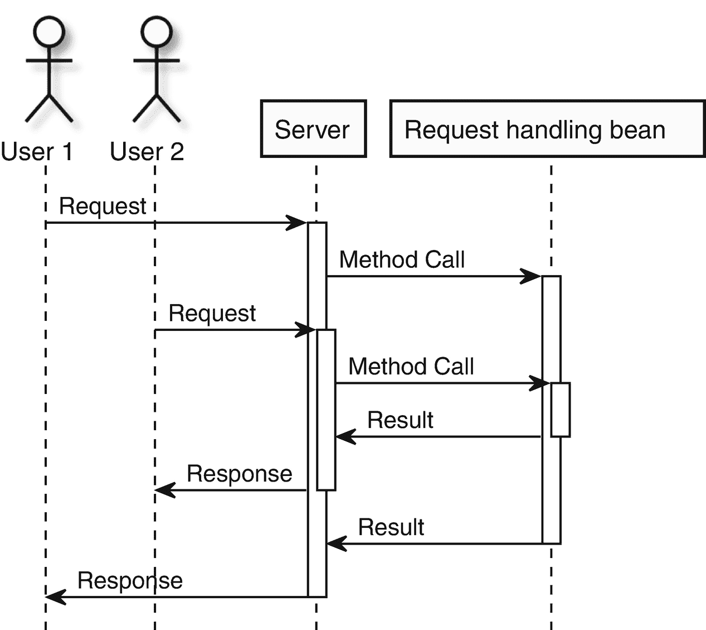
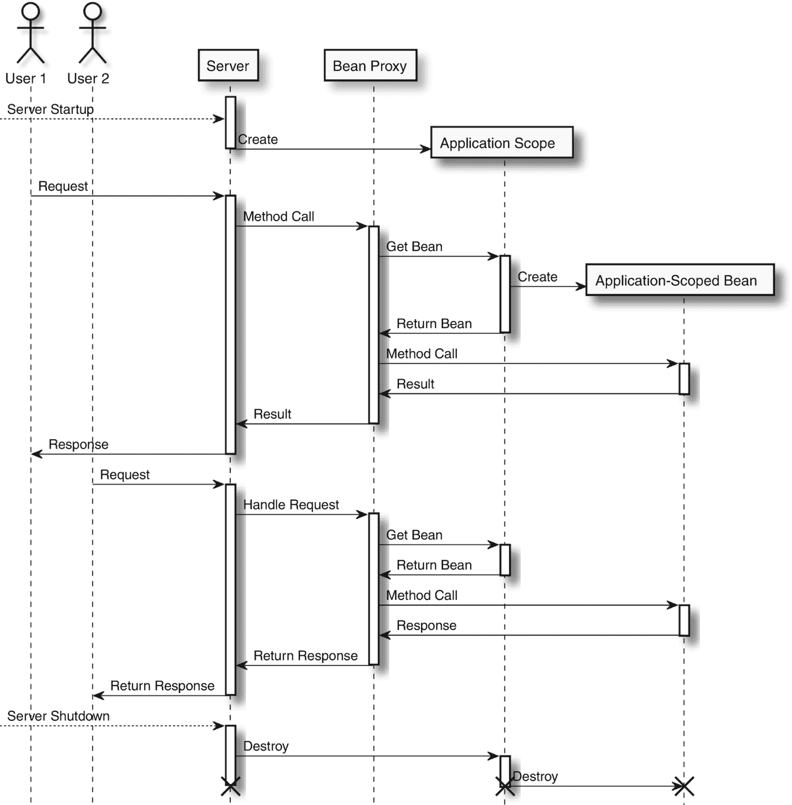
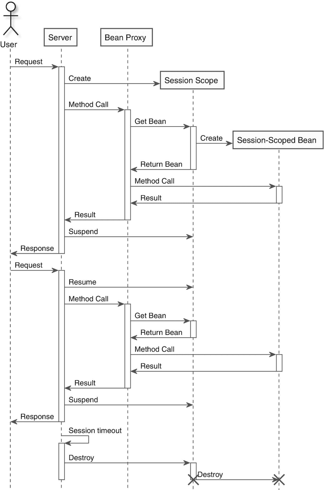
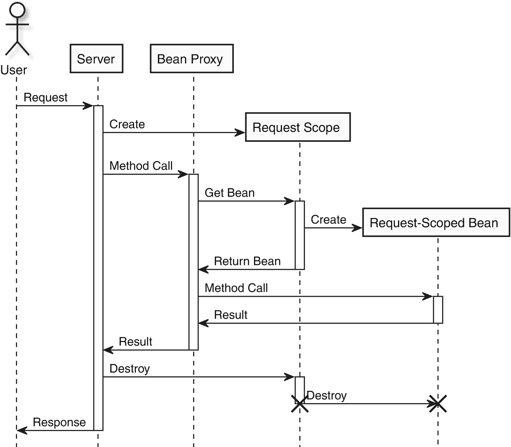
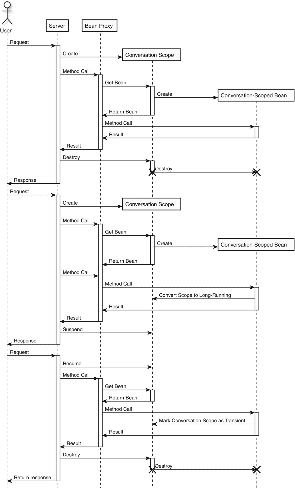

# 4. 作用域与上下文

由于 CDI 容器负责启用 CDI 的应用程序中 Bean 的创建与销毁，它本质上管理着这些 Bean 的生命周期。这意味着容器需要知晓何时可以安全地创建和销毁每个 Bean。如果 Bean 创建得太晚，依赖该 Bean 的代码可能会失败。如果 Bean 销毁得太晚，内存可能会被陈旧过时的对象堵塞，导致垃圾回收暂停时间延长，最终引发内存溢出错误。Bean 生命周期管理的另一个问题，是不同 Bean 之间实例的共享。例如，为某个特定 Bean 创建多个实例可能成本过高。Bean 也可能是可变的，任何变更都应能直接让所有依赖该 Bean 的其他 Bean 可见。如果某个 Bean 包含或管理着任何隐私敏感数据，应用程序可能还希望限制其他 Bean 对该 Bean 的可见性。

考虑一个处理传入 HTTP 请求的应用程序示例。你可能希望将一个包含传入请求所有数据的 HTTP 请求对象，传递给执行请求处理某部分功能的每个方法。在没有依赖注入的情况下，唯一的方法是将请求对象作为方法参数传递给每个方法。处理该请求的调用链中的每个方法，都需要将这个请求对象传递给下一个处理请求的方法，即使该对象与当前处理器无关。借助依赖注入，就可以避免到处传递请求对象，而是直接将其注入任何需要访问它的 Bean 中。当请求对象被注入而非传递时，CDI 容器需要意识到，一旦请求完成，该 Bean 就可以被销毁。如果不这样做，请求对象以及（间接地）来自请求对象的所有数据就会不断堆积，直到 JVM 内存耗尽。根据 HTTP 应用程序的不同，HTTP 请求对象还可能包含用户特定信息，例如姓名、地址或信用卡详细信息。如果一个处理某个 HTTP 请求的 Bean 能够看到来自不同用户的请求内容，那将非常糟糕。图 4-1 展示了如果两个用户几乎同时发起请求会发生什么。



图 4-1

并发用户请求

在此图中，只有一个请求处理 Bean 的实例来处理所有请求。当第一个用户发起请求时，会调用该请求处理 Bean。当第一个用户的请求仍在处理中时，另一个用户发起了第二个请求。服务器再次调用同一个请求处理 Bean 实例来处理这个新请求。如果你直接将请求对象注入请求处理 Bean，那么处理第一个用户请求的线程不应能看到第二个用户请求的数据，反之亦然。即使你有多个请求处理 Bean 的实例，也需要确保当前请求的数据仅对处理该请求的线程可见。

为了解决这个问题，CDI 规范允许 Bean 拥有*作用域*。你可以为每个 Bean 定义一个显式的作用域。当为 Bean 定义了作用域后，该 Bean 的生命周期就与作用域的一个实例绑定在一起。*上下文*是解决方案的第二部分。你可以使用上下文来创建和销毁作用域；这是 CDI 规范最重要的部分之一（CDI 中的 *C* 代表“上下文”）。上下文负责管理作用域实例。它们既负责作用域实例的创建和销毁，也负责与这些作用域实例绑定的 Bean 实例的创建和销毁。

让我们将其应用到之前的 HTTP 请求处理示例中。请求对象可以与一个特定于请求的作用域实例绑定。当收到一个 HTTP 请求时，处理该请求的线程会由与该作用域对应的上下文分配一个新的请求特定作用域实例。请求对象与该请求特定作用域实例绑定，这样在同一线程中调用的所有其他 Bean 都可以注入该请求对象实例。一旦请求处理完成，上下文就会停用并销毁该请求特定作用域。当新请求到来时，这个周期会使用一个新的请求特定作用域实例重复进行。由于这里的请求特定作用域在处理请求结束时被销毁，因此无法再注入或以其他方式获取该请求对象。这可以防止一个请求的细节意外泄露给同一线程处理的下一个请求。其他线程将收到不同的请求特定作用域实例，从而防止并发请求观察到同时发生的其他请求的细节。

在本章中，我们将介绍每个内置作用域，以及如何以及何时使用它们。我们还将介绍如何利用作用域可用的多数特性来创建自定义作用域。最后，我们将介绍自定义作用域如何覆盖或重新定义任何内置作用域的生命周期。


## 使用作用域

要使 Bean 实例与某个作用域绑定，首先必须有一种声明 Bean 作用域的方式。CDI 通过使用作用域注解来实现这一点。每个作用域都与一个单一的作用域注解相关联，该注解通常以其描述的作用域来命名。例如，与特定线程绑定的作用域很可能有一个 `@ThreadScoped` 注解。在大多数情况下，Bean 的类本身必须使用作用域注解进行标注。然而，如果 Bean 是由生产者生成的，则作用域注解必须应用于生产者方法。

当一个 Bean 被设定了作用域后，其注入位置没有限制，只要在调用被注入的 Bean 时，相应作用域的实例是活跃的即可。具有特定作用域的 Bean 可以注入到具有更宽作用域的其他 Bean 中。例如，作用域为给定线程的 Bean 可以注入到作用域为整个应用程序的 Bean 中。多个访问此应用程序作用域 Bean 的线程将看到线程作用域 Bean 的不同实例，即使该线程作用域 Bean 被注入到应用程序作用域 Bean 的字段中。CDI 通过不直接注入作用域 Bean，而是注入一个代理实例来实现这一点。每当对这个注入的代理调用方法时，它都会为当前活跃的作用域查找实际的 Bean 实例。如果该 Bean 不存在，则会在此时创建一个。Bean 本质上是在调用时解析，而不是在注入时解析。但是，如果相应的作用域不活跃，则对代理的任何方法调用都将失败。由于作用域不活跃，没有 Bean 实例可以委托方法调用，代理将抛出 `IllegalStateException`。

使用代理对任何作用域 Bean 都有一些影响。首先，作用域 Bean 通常是延迟创建的。只有在第一次对 Bean 执行方法调用或将事件分派给 Bean 时，才会创建它。这样做的好处是，当代理被注入到另一个 Bean 中时，如果相应的作用域尚未激活，则 Bean 的作用域不需要处于活跃状态。使用代理的另一个影响是，代理只实现在注入点定义的类型。假设你有一个接口 A 和一个实现该接口的类 B。当你将 B 注入到接口类型 A 的字段时，注入的代理将只实现接口 A，而不会扩展类 B。任何在 B 上声明的方法都不可用，并且任何将代理强制转换为类型 B 的尝试都将失败。

被代理的类型也必须是接口或非 final 类，并且所有公共方法都必须是 nonfinal。这是因为如果被代理的类型是一个类，代理必须扩展这个类。原始类型的所有字段和方法都会被继承，并且必须重写所有方法以允许委托给实际类型。如果方法是 final 的，代理就无法将方法调用委托给实际的 Bean，因为它们将在代理实例上执行。这带来了另一个影响：被代理的类型不应有任何可公开访问的字段，因为它们必须被封装。另一个类似的问题是，作用域类型不应有任何可公开访问的字段。读取和写入公共字段无法委托给实际的 Bean 实例，因此值将从代理实例中读取或写入。这些字段很可能只包含默认值，而实际的 Bean 实例将无法读取任何修改后的值。相反，实际上需要使用 getter 和 setter 方法来封装任何字段。

由于这些限制，当 CDI 容器遇到一个显式声明了作用域的 Bean，且该 Bean 是 final 类或具有任何 final 方法时，容器将导致应用程序部署失败并拒绝启动。唯一的例外是，如果该 Bean 实现了任何接口，并且仅作为该接口的类型进行注入。例如，如果你有一个 final 类 `Foo` 实现了 `FooInterface`，只要所有适用的注入点都使用 `FooInterface` 而不是 `Foo`，就没有问题。请记住，注入的代理将只是 `FooInterface` 类型，而不是 `Foo` 类型。这允许容器仍然拦截对具有 final 类或任何 final 方法的 Bean 的方法调用。

作用域 Bean 也可以被销毁，就像任何其他 Bean 一样。然而，理论上，作用域 Bean 可能在相应作用域仍然活跃时被销毁。如果发生这种情况，对 Bean 引用的任何进一步方法调用都将触发创建一个新实例。例如，在请求作用域示例中，如果请求对象被销毁，那么在该作用域内对该请求对象的任何进一步调用都将触发创建一个新的请求对象。这种情况可能有用的一种情况是，当 Bean 实例抛出异常，可能导致该实例处于损坏状态时。在这种情况下，最好销毁该 Bean 实例并继续使用新实例，而不是使用“损坏的”实例，后者可能导致各种错误。

为了能够应用作用域，必须创建一个作用域类型。作用域类型是一个注解，通常具有描述作用域的名称，并以 `Scoped` 结尾。例如，对于前面提到的特定于请求的作用域，会有一个对应的 `@RequestScoped` 注解。为 Bean 声明作用域就像在 Bean 上声明注解一样简单，具体取决于 Bean 的创建方式。

假设你有一些 Bean，希望将它们的作用域限定在单个线程内。为此，可以使用一个特殊的线程作用域，并带有相应的 `@ThreadScoped` 注解。此线程作用域使 Bean 仅对单个线程可见，并且一旦线程停止执行，此作用域中的任何 Bean 都会被销毁。假设你拥有的第一个 Bean 定义在一个名为 `Bar` 的 Bean 类中。要将 `Bar` 的实例声明为具有线程作用域，你只需在 `Bar` 类上声明 `@ThreadScoped`。

```
@ThreadScoped
public class Bar {
// 在此处实现 Bar
}
```

在此应用程序中，你还希望拥有类型为 `Bar2` 的 Bean。但是，`Bar2` 并非为与 CDI 一起使用而设计，并且没有默认构造函数，任何构造函数参数都无法直接注入。在这种情况下，你可以使用生产者方法来创建用于注入的 `Bar2` 实例。你可以通过使用 `@ThreadScoped` 注解生产者方法，使此方法生成的 `Bar2` 实例具有线程作用域。

```
@Produces
@ThreadScoped
public static Bar2 createBar2() {
return new Bar2("构造函数参数");
}
```

最后，有一个 `Bar3` 类型，它与 `Bar2` 存在相同的问题。如果你有另一个线程作用域的 `Foo` 类，它在内部创建并使用 `Bar3` 的实例，则不必为 `Bar3` 方法创建生产者方法。通过将 `@Produces` 和 `@ThreadScoped` 注解直接应用于字段，该字段将成为生产者字段，可直接供 CDI 容器注入。使用此方法时，重要的是，创建 `Bar3` 的 Bean 必须在同一作用域内的任何其他 Bean 尝试使用注入的 `Bar3` 引用之前完成创建。如果在此之前 `Bar3` 实例尚未创建，则可能导致错误，因为 Bean 实例尚不可用。

```
@Produces
@ThreadScoped
private Bar3 bar3;
```


### 注意

一个 Bean 只能定义一个作用域。为 Bean 应用多个作用域注解是非法的。如果 CDI 容器遇到一个声明了两个作用域的 Bean，则必须部署失败。不过，具有相同返回类型的不同生产者方法可以拥有不同的作用域，只要每个方法只有一个作用域和一个唯一的限定符即可。

## 内置作用域

理论上，每个基于 CDI 的应用程序都可以只使用自定义作用域。然而，这将导致工程资源的浪费，因为许多应用程序有相似的需求，并且需要类似的作用域。仅允许自定义作用域也会使 CDI 容器和其他 Java EE 组件的工作变得更加困难。如果所有作用域都是自定义的，那么容器和 CDI 组件将无法依赖使用特定作用域的应用程序。因此，CDI 规定了一系列对大多数（Web）应用程序通用的作用域，并且每个 CDI 容器都必须提供这些作用域。这些作用域具有特定的预定义生命周期，以便应用程序可以轻松地从一个 CDI 容器切换到另一个。CDI 定义了以下作用域：

*   应用作用域
*   会话作用域
*   对话作用域
*   请求作用域
*   依赖作用域

### 应用作用域

第一个预定义的作用域是应用作用域，可以使用 `@ApplicationScoped` 注解来应用。应用作用域与应用程序的生命周期相关联。这意味着，任何应用作用域的 Bean 在应用程序的生命周期内本质上都是一个单例，除非它被显式销毁，此时可能会创建一个新的实例。顾名思义，应用作用域及其所有对应的应用作用域 Bean 将在应用程序本身的生命周期结束时被销毁。图 4-2 展示了服务器中典型的应用作用域生命周期。



图 4-2

服务器中典型的应用作用域生命周期

应用作用域在服务器启动时创建，但应用作用域的 Bean 通常直到首次使用时才会被创建。如果你有一个处理单个用户请求的应用作用域 Bean，那么该 Bean 只会在首次调用其代理上的某个方法时被创建。每个单独的请求都将由同一个 Bean 处理，无论执行请求的用户是谁，即使这些请求通过不同的代理实例。当服务器关闭时，应用作用域及其所有属于它的 Bean 都会被销毁。

### 会话作用域

会话作用域与单个用户会话相关联，可以使用 `@SessionScoped` 注解来应用。会话作用域可用于将 Bean 实例限制在单个用户范围内。例如，一个 Web 应用程序可能希望在屏幕的一角显示当前用户的用户名。该用户名可以由一个 `@SessionScoped` Bean 来维护，这将确保用户名不会意外地显示给其他用户。会话作用域也不要求用户登录，因此它也适用于，例如，在网店中跟踪未登录用户添加到购物车中的商品。在 Java EE 中，会话作用域与单个 HTTP 会话相关联，并且可以跨越多个请求。会话作用域在每次调用 `service()` 方法期间、任何 Servlet 过滤器的 `doFilter()` 方法期间，以及任何对 `HttpSessionListener`、`AsyncListener` 或 `ServletRequestListener` 的调用期间处于活动状态。

在 Java EE 中，当 HTTP 会话超时时，会话作用域会自动销毁。这只会发生在该会话的所有 `HttpSessionListener` 被销毁之后，以便这些监听器仍然可以访问会话作用域。在会话失效的任何请求处理结束时，会话作用域也会被销毁。在这种情况下，会话作用域也只会在所有 `ServletRequestListener` 被调用之后才被销毁。图 4-3 展示了会话作用域生命周期的一个示例。



图 4-3

会话作用域生命周期示例

一旦请求结束，该作用域就会被挂起，然后在下一个请求时再次恢复。当作用域处于活动状态时，该作用域中的所有 Bean 都保持活动状态。会话超时后，会话作用域及其所有 Bean 都会被主动销毁。


### 请求作用域

CDI 还定义了一个请求作用域，可通过 `@RequestScoped` 注解来应用。该作用域通常在外部用户请求期间处于激活状态。在 Java EE 中，Servlet、Web 服务和 EJB 均支持请求作用域。对于 Web 应用，在调用 Servlet 的 `service()` 方法或 Servlet 过滤器的 `doFilter()` 方法期间，请求作用域处于激活状态。任何 Web 服务（无论是 JAX-WS 还是 JAX-RS）在处理单个 Web 服务调用期间，都会激活请求作用域。对于 EJB，任何远程 EJB 调用都会导致在 EJB 处理该调用期间激活请求作用域。在上述每种类型的请求结束时，请求作用域及其所属的所有 Bean 都将被销毁。

即使当前线程未处理传入请求，请求作用域也会在许多其他情况下处于激活状态。其中一个例子是在调用 Bean 的 `@PostConstruct` 方法期间。如果此时没有激活的请求作用域，则会在调用 `@PostConstruct` 方法的持续时间内激活一个新的请求作用域。该方法执行完毕后，该请求作用域及其作用域内的所有 Bean 都会被销毁。每次将事件分派给异步观察者方法时，也会创建一个新的请求作用域，并在观察者方法调用完成后销毁。图 4-4 展示了一个典型的请求作用域生命周期。



图 4-4

典型的请求作用域生命周期

在处理每个请求开始时，会创建一个新的请求作用域，并在处理请求期间保持激活状态。当请求处理完成并将响应返回给用户时，该请求作用域及其所属的所有 Bean 都会被销毁。

请求作用域也可以通过应用程序代码来创建和销毁。考虑一个不依赖 Servlet、任何标准化 Web 服务或远程 EJB 来处理传入请求的应用程序。例如，应用程序可以通过电子邮件等替代通信渠道接收传入请求。当请求作用域通常不处于激活状态时，应用程序可能还需要在后台线程处理期间临时激活一个请求作用域。针对这些用例，CDI 规范提供了一个特殊的 API 来管理请求作用域。

CDI 提供了一个名为 `RequestScopeController` 的内置 Bean。此类型的实例可以注入到任何其他 Bean 中。`RequestScopeController` 类定义了两个方法：`activate` 和 `deactivate`。如果当前没有激活的请求作用域，调用 `activate()` 方法将触发启动一个新的请求作用域。该方法还会返回一个布尔值，指示是否启动了新的请求作用域。相反，`deactivate()` 方法将停用由同一 `RequestScopeController` 实例启动的任何请求作用域。这意味着，如果在请求作用域已激活时调用 `activate()` 方法，那么只要该请求作用域仍处于激活状态，调用 `deactivate()` 方法将不会产生任何效果。但是，如果请求作用域不再处于激活状态，`deactivate()` 方法将抛出 `ContextNotActiveException` 异常。

假设你有一个请求作用域的 Bean，你想调用其上的某个方法，但当前请求作用域未激活。你可以调用 `activate()` 方法来激活请求作用域，然后在 `try` 块中执行对请求作用域 Bean 的方法调用。在相应的 `finally` 块中，你调用 `deactivate()` 方法来停用并销毁该请求作用域。此处使用 `finally` 块是为了确保即使方法调用抛出异常，请求作用域也能被干净地停用。请注意，即使 `activate()` 方法返回了 `false`，你也要调用 `deactivate()` 方法。如果调用 `activate()` 时作用域已激活，那么 `deactivate()` 调用将不会产生任何效果。

```
public class ProgrammaticRequestScopeActivation {
private static final Logger logger = Logger.getLogger("foo.logger");
@Inject
private MyRequestScopedBean myRequestScopedBean;
@Inject
private RequestContextController requestContextController;
public void doSomethingWithRequestScope() {
boolean activated = requestContextController.activate();
if (activated) {
logger.info("New request scope activated");
}
try {
myRequestScopedBean.doSomething();
}
finally {
requestContextController.deactivate();
}
}
}
```

除了 `RequestScopeController`，CDI 还提供了一个拦截器，用于在方法调用期间激活请求作用域。拦截器将在第 6 章中详细讨论，但目前只需知道，将对应于拦截器的注解应用于方法或 Bean，将会为该方法或该 Bean 上的所有方法激活该拦截器。用于在方法调用期间激活请求作用域的注解是 `@ActivateRequestContext`。当调用应用了此拦截器的方法时，拦截器会在实际方法调用之前激活请求作用域。一旦方法调用完成，拦截器将停用该请求作用域。与 `RequestScopeController` 类似，如果请求作用域已激活，拦截器实际上不会执行任何操作。使用 `@ActivateRequestContext` 注解，你可以极大地简化前面的示例。

```
public class InterceptorRequestScopeActivation {
@Inject
private MyRequestScopedBean myRequestScopedBean;
@ActivateRequestContext
public void doSomethingWithRequestScope() {
myRequestScopedBean.doSomething();
}
}
```


### 会话作用域

下一个作用域是会话作用域，可通过 `@ConversationScoped` 注解应用。会话作用域最适用于跨多个请求的交互场景。与请求作用域不同，会话作用域本身没有预定义的生命周期。相反，应用程序可以在一定程度上影响新会话上下文的创建和销毁时机。由于会话作用域覆盖多个请求，它非常适合实现向导功能或用户与系统之间的其他类型会话。例如，网上商店在客户决定下订单时，可能会有一系列类似向导的步骤。这种向导式界面会先收集客户的地址、配送偏好和付款详情，然后才允许客户最终确认订单。网上商店可以选择仅在客户决定确认订单时才保留这些信息。会话作用域的 Bean 是临时存储这些信息的不错选择。会话作用域可以在客户开始订单流程时启动，并在客户完成订单且订单已保存后销毁。

会话作用域有两种类型：跨多个后续请求的长运行会话作用域，以及临时会话作用域。临时会话作用域仅持续单个请求；该作用域会在请求作用域销毁的同时被销毁。在 Java EE 中，处理每个 Servlet 请求时默认激活临时会话作用域，且其生命周期仅持续单个请求的时长。然而，临时会话作用域可以转换为长运行会话作用域。图 4-5 展示了一个典型的会话作用域生命周期。



图 4-5

典型的会话作用域生命周期

默认情况下，会话作用域的行为与请求作用域相同，会在请求结束时销毁。但是，如果会话作用域转换为长运行作用域，它将在下一个请求时自动恢复。当会话结束时，会话作用域会转换回临时会话作用域，并在请求结束时删除。

为了管理会话作用域，CDI 提供了一个类型为 `javax.enterprise.context.Conversation` 的请求作用域 Bean。这个 `Conversation` Bean 提供了以下方法：

*   `void begin()`

*   `void begin(String id)`

*   `void end()`

*   `String getId()`

*   `long getTimeout()`

*   `boolean isTransient()`

*   `void setTimeout(long milliseconds)`

`begin()` 和 `begin(String id)` 方法将临时会话作用域转换为长运行会话作用域。调用这些方法之一后，相同的会话作用域将在每个后续请求中保持激活，直到会话作用域结束。不带参数的 `begin()` 方法会让容器为会话作用域生成一个唯一 ID。随后可以通过 `getID()` 方法检索此 ID，该方法将返回容器生成的 ID。在某些情况下，应用程序可能希望自行分配一个 ID 给会话作用域；例如，可以将 ID 设置为网上商店中用户购物车的生成 ID。应用程序可以通过调用 `begin(String id)` 并将生成的 ID 作为参数传入，来为长运行会话作用域指定 ID。请记住，当应用程序生成 ID 时，该 ID 在运行中应用程序的所有会话中仍必须是唯一的。如果应用程序已经为会话生成了一个唯一编号，那么这将是一个不错的选择。在网上商店中，订单号就是会话作用域 ID 的一个好例子，因为订单号对于特定订单是唯一的。另请注意，这两个 begin 方法只能在临时会话作用域激活时调用；如果在没有会话作用域激活或长运行会话作用域激活时调用它们，将抛出 `IllegalStateException`。

当会话作用域已转换为长运行会话作用域后，后续请求需要某种方式来识别需要哪个现有的会话作用域。网站的用户可能会在浏览器不同标签页中浏览不同的向导。即使它们都针对同一用户，每个向导都需要一个独立的会话作用域。如果用户在单个向导中突然从一个激活的会话作用域切换到另一个，这可能导致错误。对于 Web 应用程序，可以通过向 URL 添加名为 `cid` 的 HTTP 请求参数来控制要使用的确切会话上下文。此参数必须设置为要使用的会话作用域的 ID。在前面网上商店的例子中，`cid` 参数将设置为订单的订单号。如果应用程序使用 JSF，将会话作用域传播到下一个请求会更加容易。默认情况下，JSF 会确保将会话作用域 ID 传播到下一个请求，要么通过使用隐藏表单字段，要么通过将 `cid` 参数添加到每个 URL。

调用 `end()` 方法会将当前的长运行会话作用域再次标记为临时。这意味着会话作用域将在当前请求作用域结束时立即结束。容器也可以自动清理长运行会话作用域。考虑这样一种情况：在网上商店中，用户确实开始了订单流程，但在完成订单前关闭了浏览器。如果没有自动清理，会话将被启动但永远不会被销毁。从客户那里收集的所有数据以及放入购物车的所有商品都将存储在会话作用域的 Bean 中，这些 Bean 将无限期保持激活状态。每个会话作用域都有一个超时时间（以毫秒为单位），它表示自该作用域上次激活后必须经过多长时间才会被销毁。应用程序可以通过调用 `Conversation` 实例上的 `getTimeout()` 方法来访问当前的超时值。如果应用程序需要长运行会话作用域具有更长或更短的超时时间，可以通过调用 `setTimeout(long milliseconds)` 并传入新的超时值来更改超时时间。请注意，超时时间仅是对 CDI 容器的提示；容器可能会在超时时间到期之前或之后很久才决定销毁会话。


## 依赖作用域

最后一种作用域是依赖作用域。依赖作用域可以通过 `@Dependent` 注解来应用。然而，如果没有任何作用域注解，依赖作用域也是所有 Bean 的默认作用域，因此并非必须显式应用该注解。依赖作用域与其他预定义作用域有很大不同。与使用其他任何预定义作用域进行限定的 Bean 不同，依赖作用域的 Bean 没有预定义的生命周期。相反，依赖作用域的 Bean 会继承它们被注入到的那个 Bean 的生命周期。例如，如果一个依赖作用域的 Bean 被注入到一个请求作用域的 Bean 中，它将在请求作用域结束时被销毁。一个被注入到另一个依赖作用域 Bean 中的 Bean，会继承那个 Bean 所注入到的 Bean 的作用域，直到找到一个有作用域的 Bean。

依赖作用域 Bean 的实例也可以通过 `BeanManager` 以编程方式创建。这些实例的生命周期取决于 `BeanManager` 被注入到的那个 Bean，这与直接注入依赖作用域 Bean 类似。然而，如果 `BeanManager` 是使用 CDI API 以编程方式获取的，那么该依赖 Bean 将自动成为应用作用域。这是因为非 CDI Bean 的对象可能会使用此 API 创建 Bean。由于没有可继承的作用域，因此可以赋予所创建 Bean 的最安全的作用域就是应用作用域。

对周围作用域的继承也导致了依赖作用域 Bean 与其他作用域 Bean 之间的另一个区别。依赖作用域 Bean 的实例不会在不同的 Bean 之间共享。例如，当将一个类型为 X 的依赖作用域 Bean 注入到一个应用作用域 Bean 和一个请求作用域 Bean 时，类型为 X 的 Bean 将需要拥有两个不同的生命周期，这是不可能的。这对依赖作用域 Bean 还有另一个影响：与其他任何作用域的 Bean 不同，它们默认不会被代理。这意味着依赖作用域 Bean 没有其他作用域 Bean 那样的限制，并且依赖作用域 Bean 可以是 final 类或拥有 final 方法。

## 将不可代理类型暴露为作用域 Bean

依赖作用域的一个可能用途是，使一个 final 类或拥有 final 方法的类型能够在另一个作用域下可用。假设你有一个类型，你想让它作为一个来自你无法控制的外部库的作用域 Bean 可用，但这个 Bean 有一个 final 方法。例如，来自外部库的一个类型可能并非为 CDI 设计，并且拥有 final 方法。为了使这个 final 类型能够使用某个作用域，你可以手动编写一个作用域代理类，该类将对实际类的注入实例的调用进行委托。假设你有一个 final 类 `FinalFoo`，你想让它作为一个 `@RequestScoped` Bean 可用。你可以编写一个请求作用域的 `FooProxy` 类，并将一个依赖作用域的 `FinalFoo` 注入其中。通过在你的代理上实现类似的方法，你可以将这些方法调用委托给 `FinalFoo` 实例。你可以将 `FooProxy` 注入到你的 Bean 中，而不是直接注入 `FinalFoo`。由于这个 `FooProxy` 具有请求作用域，因此依赖作用域的 `FinalFoo` 实例也将继承请求作用域，并在请求结束时被销毁。

```
@RequestScoped
public class FooProxy {
@Inject
private FinalFoo dependentScopedBean;
public void foo() {
dependentScopedBean.foo();
}
}
```

如果生产者方法的结果是不可代理的类型，也可以使用手动编写的代理或包装器来为其设置作用域。一个返回当前活动用户用户名字符串的生产者方法的结果，应该具有尽可能窄的作用域，这很可能是一个在用户凭证验证后立即开始，但在用户注销时销毁的作用域。会话作用域并不合适，因为一旦用户注销，它仍然处于活动状态，而此时你不再希望显示用户名。请求作用域也不合适。发送回用户的任何响应页面的处理都发生在同一个请求中，但对于这些页面，用户应该已经有效地注销了。由于 `String` 类是一个 final 类，它是不可代理的，因此无法对其应用作用域。为了允许用户名字符串作为作用域 Bean 被注入，必须首先将其包装在一个自定义的包装器或代理中。

## 钝化作用域

与应用作用域和请求作用域不同，会话作用域和对话作用域是钝化作用域。非钝化作用域的 Bean 实例会一直保存在内存中，直到它们或相应作用域的实例被销毁，但对于钝化作用域来说，情况并非一定如此。钝化作用域及其对应的 Bean 可以临时从内存转移到临时存储中。例如，如果一个长时间运行的作用域有一段时间没有活动，但未来很可能会再次变为活动状态，就可能发生这种情况。在作用域及其 Bean 被钝化后，该作用域需要再次被激活，这反过来会从辅助存储中加载所有对应的 Bean。

像对话作用域这样的钝化作用域只能应用于能够被钝化的 Bean。一个声明为具有钝化作用域但不能被钝化的 Bean 将被视为部署问题，并会阻止应用程序启动。要使一个 Bean 能够被钝化，该 Bean 必须是 `Serializable` 的，并且其所有拦截器和装饰器也必须能够被钝化。除此之外，该 Bean 的所有字段都必须能够被钝化或者是 transient 的。为了帮助实现这一点，容器提供的所有 Bean 代理都必须能够被钝化。这样，只要不可钝化的 Bean 具有除依赖作用域之外的其他作用域，就可以将一个不可钝化的 Bean 实例注入到一个可钝化的 Bean 实例中。任何注入到可钝化 Bean 中的依赖作用域 Bean 也必须是 `Serializable` 的。


## Java EE 中定义的其他作用域

Java EE 8 由多个独立的规范组成。与任何普通库或应用程序一样，这些规范中的每一个都可能需要内置作用域未涵盖的特定作用域。与普通库或应用程序一样，这些其他规范也可以定义自己的自定义作用域。在 Java EE 8 中，Java Servlet Faces (JSF) 和 Java Transaction API (JTA) 规范都定义了它们自己的作用域。

JSF 规范在 CDI 之上定义了两个作用域。第一个是视图作用域。使用 `@ViewScoped` 注解声明的视图作用域，其生命周期与单个 JSF 视图的持续时间相同。在 JSF 中，多个请求可以针对同一个视图，例如在执行 Ajax 请求时。拥有一个与视图生命周期相同的作用域，允许针对该视图的请求在请求之间保持一些状态。例如，在现代 Web 应用程序中，表格的内容可能仅在需要时才加载，比如当用户滚动到表格底部时。每次获取接下来的几行数据时，都必须从客户端向服务器发送一个新请求，但这些请求都属于同一个视图。如果表格内容是根据某个用户查询填充的，那么这个用户查询以及可能的下一次要获取数据的索引就可以存储在视图作用域中。

由 `@FlowScoped` 定义的流作用域，可以看作是类似于 CDI 中的对话作用域。与视图作用域一样，它涵盖了用户在一个 Web 应用程序中执行工作流所涉及的多个请求。这些工作流必须有明确的入口和出口点。再次考虑在线商店的例子。当用户决定购买其购物车中的商品时，他们启动订单流程，该流程在用户完成并提交订单后结束。为此，用户通常需要经历多个步骤，输入个人信息、送货偏好，以及可能最重要的支付信息。这些步骤中的每一步都属于同一个流程的一部分。

JTA 用于在 Java EE 中启用分布式事务。JTA 定义的作用域是事务作用域。可以使用 `javax.transaction.TransactionScoped` 注解将此作用域应用于 Bean。事务作用域在单个 JTA 事务的生命周期内处于活动状态。同一应用程序中同时处于活动状态的不同事务将具有与之关联的不同事务作用域。这意味着事务作用域最适合那些需要在单个事务期间跟踪某些内容的 Bean。事务作用域 Bean 的一个例子是，一个 Bean 跟踪事务期间所做的数据库更改，然后在事务结束时将它们存储在事务日志中。

### 作用域初始化事件

每个内置作用域都会在其生命周期的开始和结束时触发一个事件。我们不会在这里过多地详细介绍事件和观察者方法；这将在第 5 章中进行更深入的讨论。Bean 可以选择在作用域上下文初始化时、即将被销毁时以及实际已被销毁时接收通知。为此，CDI 提供了三个限定符注解：`javax.enterprise.context.Initialized`、`javax.enterprise.context.BeforeDestroyed` 和 `javax.enterprise.context.Destroyed`。这些注解中的每一个都有一个 value 参数，必须将其设置为作用域注解的类。要使 Bean 选择接收这些生命周期事件，一个返回 `void` 的方法需要接受一个参数，该参数使用 `@Observes` 和 Bean 想要监听的事件的限定符注解进行注解。此参数的类型取决于 Bean 监听的实际作用域事件，但可以是一个对象。此参数需要使用 `@Observes` 和所需的注解进行注解。Bean 想要选择的每种事件类型都需要一个单独的观察者方法。不可能有一个方法同时监听请求作用域和应用程序作用域的初始化，或者同时监听应用程序作用域的初始化和销毁。

```
@ApplicationScoped
public class RequestScopeEvents {
public void onInitialization(@Observes
@Initialized(RequestScoped.class) Object o) {
System.out.println("Request scope initialized");
}
public void onBeforeDestruction(@Observes
@BeforeDestroyed(RequestScoped.class) Object o) {
System.out.println("Request scope about to be destroyed");
}
public void onDestroyed(@Observes
@Destroyed(RequestScoped.class) Object o) {
System.out.println("Request scope destroyed");
}
}
```

请注意，只有具有作用域的 Bean 才能选择接收这些生命周期事件；依赖作用域的 Bean 无法直接接收这些事件。具有作用域的 Bean 也仅在其自身作用域处于活动状态时才能接收这些事件。例如，一个请求作用域的 Bean 永远无法接收到 `@Destroyed(RequestScoped.class)` 事件，因为此时请求作用域已不再活动，并且该 Bean 本身也已经被销毁。


## 自定义作用域

每个应用程序都是独一无二的，因此可能需要对 CDI 及其他 Java EE 规范所提供的标准作用域之外的作用域提出需求。例如，考虑一个允许多个不同用户进行群组聊天的聊天应用程序。这样的应用程序可能需要为每个群组聊天定义一个作用域，以便该群组中的消息能够传递给所有成员。要在 CDI 规范本身中涵盖所有可能的作用域用例是不可能的。CDI 甚至没有涵盖 Java EE 8 中的所有用例。这正是自定义作用域的用武之地。应用程序和库通过自定义作用域来扩展 CDI。定义自定义作用域是通过使用可移植扩展来完成的。可移植扩展允许以多种方式扩展 CDI 功能，并且是 CDI 中最强大的功能之一。本章不会过多地深入介绍它们，因为第 7 章将专门介绍可移植扩展。

在开始编写自定义作用域之前，首先需要考虑许多设计决策。这些设计决策将对作用域的工作方式以及它适用于哪些 Bean 起到重要作用。设计自定义作用域时最重要的决策是：作用域何时创建以及何时销毁。这决定了具有该作用域的 Bean 何时可以被使用。例如，如果你决定为某个特定线程池中的线程创建一个作用域，那么具有该作用域的 Bean 就不能被任何其他线程使用。另一个相关的设计决策是作用域是否应该可挂起。例如，一个应用程序可能有一个用户作用域，在处理该用户的请求时处于活动状态，并且仅在用户注销时才被销毁。任何处理用户请求的线程都可能处理多个用户的请求。这个线程可以先取消挂起作用域，处理请求，然后再次挂起作用域，以便它可以自由地处理来自任何其他用户的请求。

自定义作用域设计中最重要的方面之一是它是否会在线程之间共享。像请求作用域这样的作用域专用于单个线程，但像应用程序作用域这样的作用域则在应用程序的所有线程之间共享。在线程之间共享作用域意味着任何声明了该作用域的 Bean 也必须是线程安全的。否则，可能会出现许多与并发相关的错误。

一个后续的考虑因素是作用域是否也应该传播到其他线程。例如，以请求作用域为例，虽然默认的请求作用域根本不会传播到其他线程，但在某些用例中，将作用域传播到不同的线程可能更有意义。假设你收到一个 HTTP 请求，并提交了一个将异步处理该请求的任务；那么将作用域也传播到后台线程将会很有用。然而，与任何其他在多个线程之间共享的作用域一样，最可能适用同样的警告：Bean 应该是线程安全的，以避免任何奇怪的错误。

另一个重要的问题是作用域是否应该支持钝化。对于生命周期较短的作用域，将其声明为支持钝化可能没有意义，因为钝化可能永远不会发生，并且它会给作用域可以应用的 Bean 增加许多限制。如果一个作用域可能长时间运行并消耗大量内存（无论是少量大型实例还是许多小型实例），那么值得考虑让你的自定义作用域支持钝化。然而，如前所述，支持钝化的作用域也会对任何具有该作用域的 Bean 增加额外要求。在某些情况下，可能无法使 Bean 支持钝化，这就排除了将钝化作用域应用于该 Bean 的可能性。如果你有一个生产者方法或字段，它从你无法控制的外部库中生成了一个不可序列化的 Bean，那么就不可能将钝化作用域应用于该 Bean。

最后，作用域可以设置为可堆叠或不可堆叠。例如，假设你有一个方法调用作用域。这个作用域可以在任何方法调用期间处于活动状态。然而，如果调用了另一个具有相同作用域的方法，那么在第二个方法执行期间，原始作用域应该被挂起。这被认为是作用域的堆叠；新的作用域堆叠在原始作用域之上并取代它。一旦新的作用域被挂起或销毁，原始作用域就会自动重新变为活动状态，直到它也被挂起或销毁。

要创建自定义作用域，你需要做三件事。

1.  为新的作用域创建一个注解。

2.  为作用域实现一个作用域上下文。

3.  在 CDI 扩展中注册新的作用域。

作用域注解将标识该作用域，并允许将其应用于 Bean。作用域上下文将包含作用域的逻辑，并确定作用域何时处于活动状态，以及在该作用域的给定实例中哪些 Bean 是活动的。最后，自定义扩展允许你在 CDI 容器中注册新的作用域。


### 自定义作用域注解

首先，你需要为作用域创建一个注解，以此开启新作用域的创建。注解的命名惯例是使用描述性名称，并以 `Scoped` 结尾。例如，`Foo` 作用域的注解应为 `@FooScoped`。需要注意的是，这仅仅是一种惯例；除了类名的限制外，注解名称没有其他限制。然而，不遵循命名惯例可能会让需要应用该作用域的开发者感到困惑，因为他们必须记住注解的名称。这也会使注解更难被发现，因为用户需要查阅文档才能找到注解的名称。相比之下，像 `@RequestScoped` 和 `@ApplicationScoped` 这样的注解，在任何 IDE 中通过自动补全功能都很容易找到。

现在你已经有了作用域注解，接下来需要通过在其上应用其他注解来进行配置。如果你熟悉编写注解，可能知道注解默认只有类级别的保留策略。这意味着注解会存储在使用它的任何类的类文件中，但无法在运行时访问该注解。为了让 CDI 能够将作用域应用于 Bean，它必须能够在运行时检测到该注解。为此，你需要在你的注解上应用 `@Retention` 注解。`@Retention` 有一个单一的值参数，你需要将其设置为 `RetentionPolicy.RUNTIME`，以允许 CDI 在运行时访问该注解。

你还应该定义 `@Target` 注解。`@Target` 注解控制该注解可以应用于哪些源代码元素。对于作用域注解，它应该只能应用于 Bean 类、生产者字段和生产者方法。例如，将作用域注解应用于方法参数是没有意义的。`@Target` 注解只有一个 `ElementType` 数组作为参数，你需要将其设置为 `{ElementType.TYPE, ElementType.METHOD, ElementType.FIELD}`。

最后，你需要声明你的注解是一个作用域注解。你可以通过声明以下两个注解之一来实现。对于像依赖作用域这样的伪作用域，你应该应用 `@Scopeannotation`。伪作用域很少见，因此大多数作用域创建者永远不需要使用这个注解。对于所有其他作用域，应该使用 `@NormalScope` 注解。这个注解有一个名为 `passivating` 的布尔参数，默认设置为 `false`。该参数控制作用域是否为钝化作用域。要使作用域钝化，只需将参数值设置为 `true`。

完成所有这些之后，一个非钝化的 `Foo` 作用域注解看起来像这样：

```
@NormalScope
@Retention(RUNTIME)
@Target({TYPE, FIELD, METHOD})
public @interface FooScoped {
}
```

你还可以在作用域注解上应用其他一些注解来进一步配置它。你可能希望作用域注解自动应用于具有该作用域的类的子类，或者覆盖具有该作用域的生产者方法的生产者方法。这可以通过在作用域注解上应用 `@Inherited` 注解来实现。这样做时需要小心，因为这将使得无法为子类或覆盖的生产者方法赋予不同的作用域。通常，继承的注解可以通过在继承它的类或方法上应用相同的注解来覆盖。然而，不同的作用域有不同的注解。应用不同的作用域注解会导致 Bean 类型、生产者方法或生产者字段定义了多个作用域，这是一个部署问题。为了避免这些问题，通常最好对作用域注解使用 `@Inherited` 注解。

另一件你可以做的事情是让作用域出现在为某个类型生成的 Javadoc 中。这通常是一个好做法，因为它允许浏览 Javadoc 的开发者轻松查看 Bean 声明了哪个作用域。为此，应该将 `@Documented` 注解应用于作用域注解。

## 上下文

一旦定义了作用域的注解，就该进入实现作用域的下一部分：上下文。上下文承担着多项职责，是实现作用域最重要的部分。上下文既负责确定给定线程的作用域是否处于活动状态，也负责管理该作用域的所有 Bean 实例。了解到 CDI 容器本身并不跟踪哪个 Bean 实例与哪个作用域相关联，而是将这一职责委托给上下文，可能会让人感到惊讶。然而，这允许上下文实现具有更大的灵活性。例如，上下文现在可以决定临时挂起一个作用域，而无需销毁该作用域的任何 Bean 实例。

上下文的核心是上下文对象。每个不同的作用域都恰好有一个作用域对象的实例，该实例在该作用域的所有作用域实例之间共享。要实现一个上下文对象，你需要实现 `javax.enterprise.context.spi.Context` 接口。该接口定义了以下方法：

*   `boolean isActive()`

*   `Class<? extends Annotation> getScope()`

*   `T get(Contextual contextual)`

*   `T get(Contextual contextual, CreationalContext creationalContext)`

这个接口看起来简单得具有欺骗性，但它允许在作用域的实现中具有很大的灵活性。在深入探讨 `Context` 对象的实现之前，我们将分别讨论这些方法。

`isActive()` 方法返回一个布尔值，指示此上下文所属的作用域对于当前线程是否处于活动状态。正如你所期望的，如果作用域处于活动状态，此方法必须返回 `true`，否则返回 `false`。当线程尝试调用作用域 Bean 的代理对象上的方法时，CDI 容器将调用 `isActive()` 来确定作用域是否处于活动状态。仅当此作用域处于活动状态时，容器才会尝试获取作用域 Bean 的实例。此调用将在代理上的每次方法调用时发生，因此，根据上下文的实现，作用域可能在连续调用之间被激活或停用。

`getScope()` 方法相当直接，必须返回与当前上下文关联的作用域注解的类。这主要由 CDI 容器用于确定哪个注解和上下文对象属于一起。例如，内置的请求作用域将返回 `@RequestScoped` 注解。上下文对象必须始终返回相同的注解，因为在运行 CDI 应用程序的过程中，不可能切换关联的注解。对于大多数上下文实现来说，从此方法返回一个硬编码的注解就足够了。


名为 `get` 的两个方法包含了 CDI 上下文实现中的大部分逻辑。第一个方法 `get(Contextual<T> contextual)` 会为给定的 contextual 返回一个现有的 bean 实例。*contextual* 是给定 bean 类型的描述符，它由 CDI 容器解析，并提供方法用于创建或销毁该 bean 类型的实例。每个 bean 类型都有唯一的 contextual。这里的 bean 类型由 bean 实例的实际类型以及应用于该 bean 类型的限定符注解共同构成。例如，`@Foo Foo` 类型的 bean 与 `@Bar Foo` 类型的 bean 拥有不同的 contextual。不同限定符注解对应不同 contextual，这正是限定符注解能够生效的原因。上下文本身无需跟踪限定符注解，只需依赖 contextual 即可。需要特别注意的是，此方法绝不能为匹配某个 contextual 的 bean 创建新实例。如果当前活跃作用域实例中没有现有实例，则此方法必须返回 `null` 以表明这一点。与 `isActive()` 方法类似，每次调用作用域类型的代理时都会调用此方法。这使得根据上下文的实现方式，可以在连续的方法调用之间切换不同的作用域实例。

另一个方法 `get(Contextual<T> contextual, CreationalContext<T> creationalContext)` 则可能创建匹配某个 contextual 的 bean 新实例。与上一个方法一样，如果当前作用域实例中存在现有 bean 实例，此方法也必须返回该实例。如果没有现有 bean，则此方法必须创建新实例。在 CDI 中创建 bean 实例并非简单地调用相关构造函数。创建的 bean 可能还有需要由 CDI 注入的依赖项，或者 bean 可能带有需要应用的拦截器。这正是此方法的第二个参数 `CreationalContext<T>` 发挥作用的地方。`CreationalContext<T>` 参数可以与 `Contextual<T>` 配合使用，以创建或销毁 bean 实例。创建 bean 实例很简单：只需调用 contextual 上的 `create()` 方法，并将 creational context 作为参数传入即可。

```
T bean = contextual.create(creationalContext);
```

重要的是，如果 `get(Contextual<T> contextual, CreationalContext<T> creationalContext)` 方法创建了新的 bean 实例，则必须使用给定的 contextual 和 creational context 实例来完成。你可能会好奇为什么必须在此处传入 `CreationalContext`。主要原因在于，这会将给定的 bean 实例与 creational context 关联起来。`CreationalContext` 接口有一个 `release()` 方法，该方法会触发与该 creational context 关联的所有 bean 被销毁。这主要用于销毁任何 `@Dependent` 作用域的 bean。这些 bean 与它们被注入的实例的 creational context 相关联。当该实例被销毁时，会调用 `CreationalContext` 上的 `release()` 方法，从而导致 `@Dependent` 作用域的 bean 被销毁。

你可能会注意到，`Context` 接口没有任何用于启动、挂起或销毁作用域实例的方法。主要原因在于，`Context` 接口中的方法旨在仅由 CDI 容器调用。启动、挂起或销毁作用域实例取决于作用域的实现，因此不属于 CDI 容器的关注范围。这并不意味着上下文对象不能拥有控制作用域的方法。相反，如果需要此类方法，上下文对象是放置它们最合理的位置，因为上下文对象负责维护作用域。然而，由于这些方法由库或应用程序代码调用，且不同作用域对这些方法可能有不同要求，因此这些方法并未在 `Context` 接口中定义。

## 扩展

实现作用域的最后一步是定义一个可移植扩展，用于向容器注册该作用域。可移植扩展是后续章节的主题，因此我们在此不会深入探讨。可移植扩展将承担两项职责。第一项是向 CDI 容器注册作用域注解。第二项是向容器注册上下文对象的实例。

要创建可移植扩展，你必须创建一个实现 `javax.enterprise.inject.spi.Extension` 接口的新类。该接口是一个标记接口；它将类标记为可移植扩展，但并未定义任何方法。要注册你的作用域注解，你必须声明一个方法，该方法将在 CDI 容器扫描所有 JAR 文件以查找 bean 之前被调用。此方法的名称并不重要；你可以随意命名，只要该方法具有特定的签名即可。方法的返回类型必须为 void，并且它必须接受一个类型为 `javax.enterprise.inject.spi.BeforeBeanDiscovery` 的单一参数。该参数还必须使用 `@Observes` 注解。这让容器知道，在容器扫描类路径（或模块路径）上的所有 JAR 文件以发现其中包含的 bean 之前，应调用此方法。`BeforeBeanDiscovery` 对象将有一个 `addScope()` 方法，可用于注册你的作用域注解。该方法有三个参数：作用域注解类、一个指示作用域是否为普通作用域的布尔值，以及一个指示作用域是否为钝化作用域的布尔值。如果你有一个带有 `@FooScoped` 注解的普通非钝化作用域，该方法可能如下所示：

```
public void beforeBeanDiscovery(@Observes BeforeBeanDiscovery bbd) {
bbd.addScope(FooScoped.class, true, false);
}
```

接下来，你还需要注册上下文对象。注册上下文对象与注册作用域注解类似，但你需要为此添加第二个方法。此方法将接受一个 `javax.enterprise.inject.spi.AfterBeanDiscovery` 实例作为单一参数，而不是 `BeforeBeanDiscovery`。顾名思义，CDI 容器将在完成 bean 发现过程后调用此方法。要注册上下文对象，你只需将其一个实例传递给 `AfterBeanDiscovery.addContext()`。假设你将上下文类命名为 `FooContext`，那么你的 `AfterBeanDiscovery` 方法可能如下所示：

```
public void afterBeanDiscovery(@Observes AfterBeanDiscovery abd) {
abd.addContext(new FooContext());
}
```

正如你可能注意到的，你直接传入了上下文对象的实例，而不是像注册作用域注解那样注册类。这样做的结果是，你的作用域将只有一个上下文对象的实例。


最后，你需要确保 CDI 容器能够识别你的可移植扩展。CDI 在启动时通过 `ServiceLoader` 机制发现哪些可移植扩展可用。如果你不熟悉 `ServiceLoader`，它允许动态加载服务提供者类。服务提供者类是指实现了预定义接口或继承了预定义类的类。本质上，这允许库和应用程序将其他类作为插件动态加载。可移植扩展类就是这样一个服务提供者类，但你需要先将其注册到 `ServiceLoader` 中。为此，你需要在 `META-INF/services` 目录下添加一个文件，该文件以 `Extension` 接口的全限定名命名。该文件的唯一内容是你的可移植扩展类的全限定名。如果你使用 Maven 或 Gradle 构建项目，该文件应位于 `src/main/resources/META-INF/services/javax.enterprise.inject.spi.Extension`。现在，假设你的可移植扩展类名为 `bar.foo.PortableExtension`，那么该文件的内容应为：

```
com.foo.PortableExtension
```

现在我们已经介绍了如何创建和注册一个作用域，你可以学习如何实现一个简单的作用域。我们暂时假设应用作用域不存在，但你的应用程序需要类似的功能。在实际代码中，你永远不需要实现这样的作用域，但这让我们能够介绍最简单的作用域实现，并以此为基础进行扩展。

要开始创建新的自定义应用作用域，首先需要定义你的作用域注解，将其命名为 `@MyApplicationScoped`。这个注解将是一个非常直接的注解。我们将该注解命名为 `@CustomAppScoped`，并将其标记为非钝化作用域的注解。其定义应如下所示：

```
@NormalScope
@Retention(RUNTIME)
@Target({TYPE, FIELD, METHOD})
public @interface CustomAppScoped {
}
```

接下来，你需要实现上下文对象。实现 `isActive()` 和 `getScope()` 方法相当简单。由于你希望自定义应用作用域始终处于活动状态，只需在 `isActive()` 方法中返回 `true`。`getScope()` 方法应始终返回你的作用域注解的类，因此它应始终返回 `CustomAppScoped`。

此时，你需要在两个 `get()` 方法中实现作用域的核心逻辑。要实现 `get()` 方法，你首先需要一种方法来缓存由你的上下文对象创建的任何 bean 实例。此时需要记住，对于给定的作用域，只有一个上下文对象。这意味着多个线程可能同时请求某个 `Contextual` 的 bean 实例。实现缓存的最简单方法是使用一个映射，以 `Contextual<T>` 作为键，以实例作为值。线程安全的要求意味着 `ConcurrentHashMap` 是最适合用于缓存的映射实现。使用 `ConcurrentHashMap` 作为实例缓存的一个额外好处是，你可以使用 `computeIfAbsent()` 方法来确保没有两个线程会同时尝试为同一个 `Contextual<T>` 创建 bean 实例。当你将所有内容整合在一起时，作用域方法的实现将如下所示：

```
public class CustomAppScopeContext implements Context {
private final ConcurrentHashMap, Object> instances = new ConcurrentHashMap();
@Override
public Class getScope() {
return CustomAppScoped.class;
}
@Override
public boolean isActive() {
return true;
}
@Override
public  T get(Contextual contextual, CreationalContext creationalContext) {
@SuppressWarnings("unchecked")
T instance = (T) instances.computeIfAbsent(contextual, c -> contextual.create(creationalContext));
return instance;
}
@Override
public  T get(Contextual contextual) {
@SuppressWarnings("unchecked")
T instance = (T) instances.get(contextual);
return instance;
}
}
```

最后，你需要编写你的可移植扩展并将其注册到 `ServiceLoader` 中。可移植扩展相当直接；你只需要在其中注册你的作用域注解和上下文对象。

```
public class CustomAppScopeExtension implements Extension {
public void beforeBeanDiscovery(@Observes BeforeBeanDiscovery bbd) {
bbd.addScope(CustomAppScoped.class, true, false);
}
public void afterBeanDiscovery(@Observes AfterBeanDiscovery abd) {
abd.addContext(new CustomAppScopeContext());
}
}
```

现在剩下的就是用你的作用域注解来注解 bean 和生产者方法，这样你就可以使用你的新作用域了。在实践中，拥有一个始终处于活动状态并在所有线程之间共享实例的作用域并不是非常有用，因为应用作用域已经满足了这一需求。更典型的情况是，作用域可以被随意创建、挂起或销毁。通常，作用域的控制权落在拦截器（将在后续章节中介绍）上，或者较少见地，落在 bean 类上。然而，如前所述，`Context` 接口并未声明任何控制作用域生命周期的方法。你可以通过自己定义这些方法来解决这个问题。

让我们尝试创建一个可以被启动、挂起、恢复甚至销毁的作用域。为了能够恢复你的作用域，你首先应该选择一个可以用作标识符的类型，该标识符可用于恢复你的作用域。一个好的做法是为此使用一个不可变类型。你将使用此标识符作为映射键。可变类型的哈希码可能会因其值的更改而改变。

上下文对象需要为每个具有活动作用域的线程跟踪此标识符。最合适的方法是定义一个线程局部变量来存储 `String`。然而，直接写入 `ThreadLocal` 是一个相当昂贵的操作。相反，你可以使用 `AtomicReference` 实例作为线程局部变量中的值，并改为更新它。要实现你的 `isActive()` 方法，你只需检查当前线程的线程局部变量中的 `AtomicReference` 是否包含 `null`。如果它包含除 `null` 之外的任何内容，则作用域处于活动状态，`isActive()` 将返回 `true`。

你将分别命名启动和挂起作用域的方法为 `start()` 和 `suspend()`。在 `start()` 方法中，你应该检查当前线程是否已经有一个活动的作用域实例，因为你的作用域不是可堆叠的作用域。如果你允许在已有活动作用域时启动新作用域，你将丢失当前活动作用域的标识符，因此如果发生这种情况，你需要抛出异常。挂起作用域时，你需要进行类似的检查；只有当当前线程没有活动的作用域实例时，你才需要抛出异常。尝试在没有任何活动作用域时挂起作用域，表明你的代码中某处存在错误。


```
private static final ThreadLocal<AtomicReference<String>> ACTIVE_SCOPE_THREAD_LOCAL = ThreadLocal.withInitial(AtomicReference::new);
@Override
public boolean isActive() {
return ACTIVE_SCOPE_THREAD_LOCAL.get().get() != null;
}
public void start(String scopeId) {
AtomicReference<String> activeScope = ACTIVE_SCOPE_THREAD_LOCAL.get();
if (activeScope.get() != null) {
throw new IllegalStateException("该作用域的一个实例已处于活动状态");
}
activeScope.set(scopeId);
}
public void suspend() {
AtomicReference<String> activeScope = ACTIVE_SCOPE_THREAD_LOCAL.get();
if (activeScope.get() == null) {
throw new IllegalStateException("作用域当前未处于活动状态！");
}
activeScope.set(null);
}
```

在编写上下文对象的其余部分之前，你需要考虑如何销毁 Bean 实例。在自定义应用作用域中，作用域始终处于活动状态，因此销毁 Bean 实例并非必要的设计考量。然而，如果你按照应用程序的要求启动和挂起作用域，那么若不清理不再使用的作用域，最终可能会导致内存耗尽。当你销毁一个作用域实例时，还需要销毁与该作用域实例关联的每个单独的 Bean 实例。如前所述，`Contextual` 接口有一个 `destroy` 方法，可用于销毁 Bean 实例。但是，`destroy()` 方法同时接收 Bean 实例和 `CreationalContext<T>` 作为参数。`CreationalContext<T>` 仅传递给 `get(Contextual<T>, CreationalContext<T>)`，并用于创建 Bean 实例。由于你正在定义自己的销毁方法，`CreationalContext` 将不可用。为了能够销毁 Bean，你还需要缓存传递给此方法的上下文。为此，你将在实例映射中定义一个名为 `BeanInstance` 的自定义类型。这个类本质上是对 Bean 实例的封装，同时存储关联的 `Contextual<T>` 和 `CreationalContext<T>`。你需要在此处定义一个返回实际 Bean 实例的方法，以便上下文对象能够访问它。由于你已经拥有了销毁 Bean 实例所需的一切，你也可以在此处添加一个销毁方法。该方法使用当前的 Bean 实例和关联的 `CreationalContext<T>` 调用 `Contextual.destroy()`。

```
final class BeanInstance<T> {
private final T instance;
private final Contextual<T> contextual;
private final CreationalContext<T> creationalContext;
BeanInstance(T instance, Contextual<T> contextual, CreationalContext<T> creationalContext) {
this.instance = instance;
this.contextual = contextual;
this.creationalContext = creationalContext;
}
T get() {
return instance;
}
void destroy() {
contextual.destroy(instance, creationalContext);
}
}
```

对于之前的作用域，你有一个包含该作用域所有 Bean 实例的单一 `ConcurrentHashMap`。与之前的作用域不同，你的新作用域将有多个不同的实例，这意味着单个实例缓存映射将不再适用。相反，你可以使用一个 `ConcurrentHashMap`，以你的标识符作为映射键，每个值则是另一个包含实例的 `ConcurrentHashMap`。在实现 `get(Contextual<T>)` 方法时，还有一件事需要考虑。你之前编写的作用域始终处于活动状态，但这个作用域不会。`get(Contextual<T>)` 的契约要求：如果当前线程的作用域未处于活动状态，当前线程应抛出 `ContextNotActiveException`。在 `get(Contextual<T>)` 的开头，你应该检查作用域是否实际处于活动状态。你可以通过检查你定义的线程局部变量中存储的 `AtomicReference` 包含的是作用域 ID 还是 `null` 来实现这一点。如果它被设置为 `null`，则作用域未处于活动状态，你需要抛出 `ContextNotActiveException`。

如果作用域 ID 处于活动状态，你就可以使用该作用域 ID 获取此作用域的 Bean 实例映射。由于这可能是第一次调用，所有作用域的映射可能尚未包含当前作用域实例的实例映射。你的第一反应可能是使用 `Map.computeIfAbsent()` 来创建映射，但有一个更好的选择。由于 `get(Contextual<T>)` 方法不创建任何实例，你实际上不需要在此刻创建映射。相反，你可以使用 `Map.getOrDefault()` 结合 JDK 9 中引入的新静态方法 `Map.of()`，如果当前作用域尚无可用的实例映射，则返回一个空的不可变映射。不带任何参数调用 `Map.of()` 应始终返回相同的空映射，因此你避免了在需要之前创建新映射的开销。一旦你有了映射，就可以检查你要查找的 `Contextual<T>` 是否存在于映射中，并返回相应的 Bean 实例。

```
private final ConcurrentHashMap<String, ConcurrentHashMap<Contextual<?>, BeanInstance<?>>> cache = new ConcurrentHashMap<>();
@Override
public <T> T get(Contextual<T> contextual) {
String scopeId = ACTIVE_SCOPE_THREAD_LOCAL.get().get();
if (scopeId == null) {
throw new ContextNotActiveException();
}
@SuppressWarnings("unchecked")
BeanInstance<T> instance = (BeanInstance<T>) cache.getOrDefault(scopeId, Map.of()).get(contextual);
if (instance == null) {
return null;
}
return instance.get();
}
```

`get(Contextual<T>, CreationalContext<T>)` 方法将采用与 `get(Contextual<T>)` 方法类似的方式，但有一些细微差别。由于如果 Bean 实例不存在，你需要创建一个，因此你需要为你的作用域准备一个映射实例，所以你需要使用 `Map.computeIfAbsent()` 来创建一个。实例映射应该是一个 `ConcurrentHashMap`，就像外层的作用域映射一样，因为实例映射可能同时被多个并发线程访问甚至修改，具体取决于作用域何时处于活动状态。当你需要创建 Bean 实例时，你将其封装在你之前创建的 `BeanInstance` 类中。这使你能够在稍后轻松地销毁作用域。

```
@Override
public <T> T get(Contextual<T> contextual, CreationalContext<T> creationalContext) {
String scopeId = ACTIVE_SCOPE_THREAD_LOCAL.get().get();
if (scopeId == null) {
throw new ContextNotActiveException();
}
@SuppressWarnings("unchecked")
T instance = (T) cache.computeIfAbsent(scopeId, s -> new ConcurrentHashMap<>())
.computeIfAbsent(contextual,
c -> new BeanInstance<>(contextual.create(creationalContext), contextual, creationalContext))
.get();
return instance;
}
```


最后需要做的是创建一个销毁指定作用域的方法。这是必要的，以便你可以清理不再需要的任何实例。首先应从作用域映射中移除实例映射，并检查移除操作是否返回了 `null`。这主要是为了防止两个线程同时销毁作用域实例。如果发生这种情况，只有一个线程能够成功地从作用域映射中移除实例映射。为了确保你确实成功地从作用域映射中移除了实例映射，你应该检查实例映射是否为 `null`。如果它是 `null`，则说明另一个线程同时尝试删除该作用域实例，你无需采取进一步操作。如果实例映射不为 `null`，接下来需要删除所有独立的 bean 实例。你可以通过遍历实例映射中的值，并调用你之前添加到 `BeanInstance` 类中的 `destroy()` 方法来实现。至此，该作用域及其所有 bean 都已被删除。请注意，如果在删除期间该作用域处于活动状态，或者删除后再次变为活动状态，它本质上将是一个新的作用域。任何从已销毁作用域访问 bean 的尝试都将导致创建一个新的 bean 实例。`destroy` 方法的调用方式与你之前声明的 `start()` 方法相同。

```
public void destroy(String scopeId) {
Map<String, BeanInstance> instances = cache.remove(scopeId);
if (instances != null) {
instances.values()
.forEach(BeanInstance::destroy);
}
}
```

现在你可以使用自定义作用域了。为此，你需要能够访问你的上下文对象。`BeanManager` 定义了一个 `getContext()` 方法，当给定一个作用域注解类时，它会返回相应的上下文对象。此方法的返回类型是 `Context`，因此你需要将返回的上下文对象强制转换为正确的类型。然后，你可以使用返回的上下文对象来管理作用域的生命周期。下面的示例将启动你的作用域的一个新实例，在使用后将其挂起，并最终销毁它：

```
CustomScopeContext context = (CustomScopeContext) beanManager.getContext(CustomScope.class);
context.start(scopeId);
try {
// 使用作用域内的 bean
context.suspend();
} finally {
context.destroy(scopeId);
}
```

## 支持钝化的作用域

支持钝化的作用域与不支持钝化的作用域类似。CDI 并未定义作用域必须何时以及如何钝化，因此这需要在实现上下文对象时决定。在大多数情况下，上下文对象会跟踪哪些作用域处于活动状态，并决定何时以及钝化哪个作用域。通常，这可以通过跟踪哪个作用域最近未被使用，然后钝化这些作用域来实现，例如，通过定期清理任务。

你可以调整之前示例中的自定义作用域，使其成为一个支持钝化的作用域。为此，你需要向上下文添加两个私有方法：`writeToStorage()` 和 `loadFromStorage()`。这两个方法的实现留给你自己完成，因为它们完全取决于用于存储作用域的底层存储机制。我们将让加载方法返回一个用 `Optional` 包装的作用域；原因很快就会明了。

现在你需要添加一个钝化作用域的方法。在一个真正的支持钝化的上下文对象中，作用域很可能会根据哪个作用域最近处于活动状态而被定期钝化。然而，出于本示例的目的，你将定义一个 `passivate()` 方法，该方法根据作用域的 ID 来钝化它。为了确保在钝化期间无法访问该作用域的任何 bean，你需要使用 `Map.compute()` 方法来序列化该作用域并将其从作用域映射中移除。`compute()` 方法接受一个 lambda 作为参数，该 lambda 为给定的键计算一个值，如果要从映射中移除该键，则返回 null。由于你为作用域映射使用的是 `ConcurrentHashMap`，对 `compute()` 的调用应该作为一个原子操作发生。如果另一个线程试图访问正在被钝化的作用域中的 bean，该线程将会阻塞，直到钝化完成并且该作用域从作用域映射中被移除。

```
public void passivate(String scopeId) {
cache.compute(scopeId, (id, instanceMap) -> {
writeToStorage(id, instanceMap);
// TODO 检查是否需要销毁 beans
instanceMap.values().forEach(BeanInstance::destroy);
// 返回 null 以从缓存中移除实例映射
return null;
});
}
```

`get(Contextual<T>)` 方法的实现与不支持钝化的作用域非常相似。主要区别在于，如果在作用域映射中未找到该作用域，你需要尝试从存储中加载它。如果该作用域存在于存储中，那么你还需要用它更新作用域映射。你可以再次使用 `computeIfAbsent()` 方法以线程安全的方式完成此任务。但是，如果该作用域是一个新的作用域或者已经被销毁，那么在存储中将找不到该作用域。在这种情况下，加载方法将返回一个空的 `Optional`。当在存储中未找到映射时，你可以使用这个 optional 值来返回一个延迟创建的新的 `ConcurrentHashMap`。同样的通用方法也适用于 `get(Contextual<T>, CreationalContext<T>)` 方法。

```
@Override
public <T> T get(Contextual<T> contextual) {
String scopeId = ACTIVE_SCOPE_THREAD_LOCAL.get().get();
if (scopeId == null) {
throw new ContextNotActiveException();
}
@SuppressWarnings("unchecked")
BeanInstance<T> instance =
(BeanInstance<T>) cache.computeIfAbsent(scopeId, id -> loadFromStorage(id).orElseGet(ConcurrentHashMap::new))
.get(contextual);
if (instance == null) {
return null;
}
return instance.get();
}
@Override
public <T> T get(Contextual<T> contextual, CreationalContext<T> creationalContext) {
String scopeId = ACTIVE_SCOPE_THREAD_LOCAL.get().get();
if (scopeId == null) {
throw new ContextNotActiveException();
}
@SuppressWarnings("unchecked")
T instance = (T) cache.computeIfAbsent(scopeId, id -> loadFromStorage(id).orElseGet(ConcurrentHashMap::new))
.computeIfAbsent(contextual,
c -> new BeanInstance<>(contextual.create(creationalContext), contextual, creationalContext))
.get();
return instance;
}
```

作为最后一步，如果作用域已被保存到底层存储中，你还应该更新 `destroy` 方法以将其从该存储中删除。


## 覆盖内置作用域

创建自定义作用域的另一种方法是覆盖内置作用域。这与编写普通自定义作用域基本相同，但存在一些微小但重要的差异。上下文对象关联的注解必须是待覆盖作用域的注解。另一个需要注意的重要事项是，自定义作用域绝不能与内置作用域同时处于激活状态。如果两个不同的上下文对象报告对同一注解具有激活的作用域，CDI 容器将抛出异常。对于某些作用域，覆盖内置作用域可能意义不大。以请求作用域为例，无需覆盖作用域即可从应用程序代码对其进行管理。然而，对于 `SessionScope` 来说，在 Java SE 应用程序中并未定义其生命周期。这导致默认情况下，Java SE CDI 应用程序无法依赖任何会话作用域的 Bean。

要覆盖内置作用域，你可以像创建常规作用域一样创建上下文对象。主要区别在于，你需要从上下文对象中返回要覆盖的作用域注解。要注册被覆盖的作用域，现在只需在可移植扩展中注册自定义上下文对象即可。由于你使用的是之前已注册过的现有作用域注解，因此无需再次注册。自定义会话作用域的（非钝化）实现可能类似于以下示例：

```
public class CustomSessionScopeContext implements Context {
private static final ThreadLocal> ACTIVE_SCOPE_THREAD_LOCAL = ThreadLocal.withInitial(AtomicReference::new);
@Override
public boolean isActive() {
return ACTIVE_SCOPE_THREAD_LOCAL.get().get() != null;
}
public void start(String scopeId) {
AtomicReference activeScope = ACTIVE_SCOPE_THREAD_LOCAL.get();
if (activeScope.get() != null) {
throw new IllegalStateException("An instance of the scope is already active");
}
activeScope.set(scopeId);
}
public void suspend() {
AtomicReference activeScope = ACTIVE_SCOPE_THREAD_LOCAL.get();
if (activeScope.get() == null) {
throw new IllegalStateException("Scope not currently active!");
}
activeScope.set(null);
}
@Override
public Class getScope() {
return SessionScoped.class;
}
private final ConcurrentHashMap, BeanInstance>> cache = new ConcurrentHashMap();
@Override
public  T get(Contextual contextual) {
String scopeId = ACTIVE_SCOPE_THREAD_LOCAL.get().get();
if (scopeId == null) {
throw new ContextNotActiveException();
}
@SuppressWarnings("unchecked")
BeanInstance instance = (BeanInstance) cache.getOrDefault(scopeId, Map.of())
.get(contextual);
if (instance == null) {
return null;
}
return instance.get();
}
@Override
public  T get(Contextual contextual, CreationalContext creationalContext) {
String scopeId = ACTIVE_SCOPE_THREAD_LOCAL.get().get();
if (scopeId == null) {
throw new ContextNotActiveException();
}
@SuppressWarnings("unchecked")
T instance = (T) cache.computeIfAbsent(scopeId, s -> new ConcurrentHashMap())
.computeIfAbsent(contextual,
c -> new BeanInstance(contextual.create(creationalContext), contextual, creationalContext))
.get();
return instance;
}
public void destroy(String scopeId) {
Map, BeanInstance> instances = cache.remove(scopeId);
if (instances != null) {
instances.values().forEach(BeanInstance::destroy);
}
}
}
```

