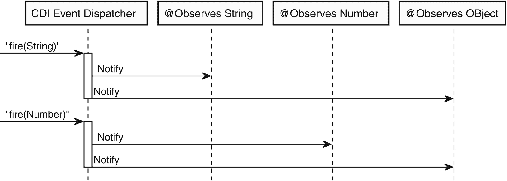

# 5. 事件

观察者模式是许多应用程序中常用的设计模式。它允许一个对象将更改或其他事件通知给任意数量的其他对象，而无需在主题和观察者之间建立强耦合。考虑另一种情况，即被观察者需要单独调用每个观察者。这无法很好地扩展到大量观察者，并且会使被观察的主题与观察者之间产生强耦合。

CDI 通过事件支持观察者模式。事件可以从任何 CDI Bean 触发，并且几乎任何 CDI Bean 都可以观察事件。每个触发的事件都有一个有效载荷，可以是任何原始类型或 Java 对象。

学完本章后，你将熟悉在 CDI 中触发和接收事件。你将了解如何控制 Bean 将接收哪些事件以及何时接收。你还将了解同步事件和异步事件之间的区别，并能够熟练使用两者。

## 事件类型

每个 CDI 事件都与一个事件对象相关联。与 Bean 类似，每个事件也可以选择性地与一个限定符相关联。事件监听器监听特定类型的事件，并可选择性地带有限定符。CDI 通过尝试将事件的限定符和类型与事件监听器所监听事件的限定符和类型进行匹配，来确定要通知哪些事件监听器。对于事件和监听器，限定符必须都不存在，否则必须完全匹配，遵循与常规 Bean 相同的限定符规则。事件监听器监听的类型必须与事件对象的类型相同，或者是事件对象类型的超类型。让我们举一个例子，其中有一个 Bean 生成整数并将其作为事件触发，且不带限定符。假设有两个不带限定符的事件监听器，一个监听 `Object` 类型的事件，另一个监听 `Integer` 类型的事件。当事件被触发时，CDI 将在运行时尝试查找合适的事件监听器。在这种情况下，事件对象是一个 `Integer`，与 Java 中所有其他对象一样，它是 `Object` 的子类型。因此，这两个事件监听器都会收到该事件的通知。两者都与事件的限定符（不存在）匹配。图 5-1 展示了如何根据事件类型传递事件。



图 5-1

基于类型的事件传递示例

在此示例中，有三个不同的观察者：一个观察 `String` 类型的事件，一个观察 `Number` 类型的事件，最后一个观察 `Object` 类型的事件。你首先触发一个 `String` 类型的事件。由于 `String` 是 `Object` 的子类型，CDI 会将此事件分派给监听 `String` 和 `Object` 类型事件的观察者。当你随后触发一个 `Number` 类型的事件时，情况也是如此。CDI 会将此事件传递给期望接收 `Number` 类型事件和期望接收 `Object` 类型事件的观察者。


## 事件观察者

任何作用域内的 Bean 都可以通过提供观察者方法来监听 CDI 事件。当触发的事件类型和限定符与观察者方法监听的条件匹配时，观察者方法就会被调用。观察者方法可以使用任何有效的方法名称，并且可以声明为任何可见性级别，甚至是私有方法。要将一个方法声明为观察者方法，该方法必须恰好有一个参数使用 `@Observes` 注解。该参数即为事件参数，是事件的负载。事件参数的类型决定了观察者方法将监听的事件类型。此类型可以包含泛型类型参数或通配符，因此可以监听 `List<String>` 或 `List<?>` 类型的事件。禁止在观察者方法中使用多个带有 `@Observes` 注解的参数，否则在部署时会导致错误。

事件参数也可以定义一个或多个限定符。如果事件参数上没有定义限定符，那么对于所有类型可赋值给事件参数的事件，无论其限定符如何，观察者方法都会收到通知。如果定义了一个或多个限定符，则仅当事件参数上的限定符是事件限定符的子集时，观察者方法才会收到事件通知。假设你有两个观察者方法，其事件参数类型均为 `String`。第一个方法的事件参数上没有限定符，但第二个方法定义了 `@X` 和 `@Y` 作为参数。如果触发一个类型为 `String`、限定符为 `@Y` 的事件，则只有没有限定符的方法会收到通知。相反，如果你触发一个限定符为 `@X`、`@Y` 和 `@Z` 的事件，那么两个观察者方法都会收到通知，即使限定符并非完全匹配。

假设你有一个 Bean 会触发 `@X String` 类型的事件。你可以通过声明一个带有 `@Observes @X String` 参数的方法来实现针对此类事件的观察者方法。观察者方法的声明如下所示：

```
private void onXEvent(@Observes @X String event) {
// 在此处处理事件
}
```

默认情况下，没有任何限定符的观察者方法会收到所有匹配类型事件的通知，无论该类型上定义了哪些限定符。但是，可以通过应用 `@Default` 限定符来限制观察者方法仅监听没有限定符的事件。对于没有定义限定符的 Bean 和注入点，会自动应用 `@Default` 限定符。事件也是如此；当事件没有显式限定符时，它也具有 `@Default` 限定符。通过显式指定默认限定符，观察者方法将仅收到具有 `@Default` 限定符的事件通知。这意味着只有没有任何限定符的事件，或者也显式应用了 `@Default` 限定符的事件，才会触发观察者方法被通知。

```
public void onEventWithoutQualifiers(@Observes @Default String event) {
// 在此处处理事件
}
```

### 条件事件观察者

如前所述，当事件被触发时，它会被传递给当时处于活动状态的作用域内的所有观察者。由于 CDI Bean 的延迟初始化，监听事件的 Bean 可能尚未针对这些作用域之一进行初始化。如果观察事件的 Bean 在事件发生时尚未创建，默认情况下，CDI 会创建该 Bean 的一个实例。有时，如果 Bean 不存在，可能不希望它在事件通知期间被创建。例如，观察 Bean 的创建成本可能很高，并且可能只需要在满足其他条件后才观察事件。为了防止 CDI 仅仅为了传递方法而创建 Bean 实例，可以使用 `@Observes` 注解的 `notifyObserver` 字段声明一个条件观察者方法，而不是常规的观察者方法。此字段可以接受两个值之一：`IF_EXISTS` 和 `ALWAYS`（默认值）。当 `notifyObserver` 设置为 `ALWAYS` 时，如果给定活动作用域内尚不存在该 Bean 的实例，CDI 将始终创建一个新实例。如果 `notifyObserver` 字段设置为 `IF_EXISTS`，则仅当 Bean 已存在于其关联的活动作用域内时，观察者方法才会被通知。以下是一个条件事件观察者的示例：

```
public void onEvent(@Observes(notifyObserver = IF_EXISTS) String event) {
// 在此处处理事件
}
```

### 观察者排序

默认情况下，观察者被调用的顺序是不确定的，取决于容器的实现。然而，从 CDI 2.0 开始，可以使用 `@javax.annotation.Priority` 注解来影响观察者被调用的顺序。此注解必须应用于事件参数，并定义一个单一的 `int` 字段，该字段决定了观察者方法被调用的顺序。数字越小，观察者越早被通知。库、CDI 或 Java EE 容器也可以注册观察者方法。这些方法可能需要在应用程序观察者被通知之前或之后运行。为了为容器、库和应用程序观察者定义清晰的排序，每个类别都有自己的基础优先级。例如，在应用程序观察者之前运行的容器观察者的基础优先级为 0，而在应用程序观察者之前运行的库观察者的基础优先级为 1000，应用程序观察者的基础优先级为 2000。这意味着对于在应用程序代码之前运行的库观察者，1000 到 1999 之间的任何值都是有效的优先级。幸运的是，你不必记住这些数字。`javax.interceptor.Interceptor.Priority` 类为基础优先级定义了以下常量：

*   `PLATFORM_BEFORE`

*   `LIBRARY_BEFORE`

*   `APPLICATION`

*   `LIBRARY_AFTER`

*   `PLATFORM_AFTER`

对于由应用程序定义的观察者，可以使用 `APPLICATION` 到 `LIBRARY_AFTER` 之间的任何优先级。要使用这些常量来帮助定义事件观察者的优先级，只需使用这些常量并添加一个偏移量来定义顺序。如果观察者没有定义 `@Priority` 注解，则会自动使用 `APPLICATION + 500` 的优先级。例如，假设你有三个应用程序定义的观察者方法，其中第一个必须始终首先运行，第二个必须在之后某个时刻运行，第三个没有定义优先级。对于第一个观察者，你可以将优先级定义为 `APPLICATION`。对于第二个，你可以选择任意一个较小的数字并将其添加到 `APPLICATION` 常量中。由于第三个观察者没有注解，它会自动使用 `APPLICATION + 500`，并将在三个观察者方法中最后被调用。以下展示了观察者排序：

```
public void firstObserver(@Observes @Priority(Interceptor.Priority.APPLICATION) Object eventObject) {
System.out.println("第一个被调用: " + eventObject);
}
public void secondObserver(@Observes @Priority(Interceptor.Priority.APPLICATION + 5) Object eventObject) {
System.out.println("第二个被调用: " + eventObject);
}
public void thirdObserver(@Observes Object eventObject) {
System.out.println("第三个被调用: " + eventObject);
}
```


### 注意

如果两个不同的观察者方法具有相同的优先级，则它们的调用顺序是未定义的。

对于任何需要提供观察者方法的库作者来说，`LIBRARY_BEFORE` 和 `LIBRARY_AFTER` 常量可以以类似的方式使用。顾名思义，`LIBRARY_BEFORE` 基础优先级将确保观察者方法在任何应用程序定义的观察者方法之前被调用，而 `LIBRARY_AFTER` 将在应用程序定义的观察者方法之后被调用。以下展示了库定义的观察者排序：

```
public void libraryBeforeObserver(@Observes @Priority(Interceptor.Priority.LIBRARY_BEFORE) Object eventObject) {
System.out.println("Called before application: " + eventObject);
}
public void libraryAfterObserver(@Observes @Priority(Interceptor.Priority.LIBRARY_AFTER) Object eventObject) {
System.out.println("Called after application: " + eventObject);
}
```

通常，大多数开发者永远不需要使用平台级别的优先级。这些优先级主要用于 Java EE 和 CDI 容器中由平台规范定义的观察者。

### 事件元数据

在某些情况下，可能需要获取关于已触发事件的额外信息。例如，可能需要根据一个或多个限定符中定义的非绑定参数来不同地处理事件，或者可能需要获取关于事件触发来源的注入点的信息。为了实现这一点，可以将一个 `javax.enterprise.inject.spi.EventMetadata` 对象作为额外参数注入到观察者方法中。`EventMetadata` 定义了以下方法：

*   `Set getQualifiers();`

*   `InjectionPoint getInjectionPoint();`

*   `Type getType();`

`getQualifiers()` 方法可用于获取事件的限定符集合。这使得可以检查每个限定符，并可能从中提取一个或多个值。例如，如果你在事件上声明了一个 `ParameterizedQualifier`，其中包含一个你想要提取并用于事件处理的非绑定单字段，你可以使用 `getQualifiers()` 方法获取限定符集合，然后尝试从中找到你需要的限定符。当你拥有这个限定符后，就可以从中提取任何需要的值。

```
public void observerWithMetadata(
@Observes @ParameterizedQualifier(name = "") String event,
EventMetadata eventMetadata) {
ParameterizedQualifier qualifier =
eventMetadata.getQualifiers()
.stream()
.filter(annotation -> annotation instanceof ParameterizedQualifier)
.map(ParameterizedQualifier.class::cast)
.findFirst()
.orElseThrow();
String name = qualifier.name();
System.out.println("Event " + event + " with name " + name + " observed.");
}
```

`getInjectionPoint()` 方法返回关于事件触发来源的注入点的信息。这不仅包括注入点本身的信息，还包括注入点所属的 Bean 的信息，包括该 Bean 的类型、限定符，甚至作用域。这主要在需要确定事件触发位置时有用。如果事件是通过 `BeanManager` 触发的，`getInjectionPoint()` 方法将返回 `null`，因为在这种情况下很可能没有任何注入点。

```
public void observe(@Observes @MyQualifier String event, EventMetadata eventMetadata) {
Bean bean = eventMetadata.getInjectionPoint().getBean();
String scope = bean.getScope().getName();
String beanClassName = bean.getBeanClass().getName();
System.out.println(
"Event " + event + " fired from bean " + beanClassName +         " with scope " + scope);
}
```

`getType()` 方法返回关于事件对象运行时类型的信息。这通常等同于在事件参数本身上调用 `getClass()` 的结果。

## 触发事件

与观察事件类似，触发事件也相当直接。触发事件的主要方式是通过 `javax.enterprise.event.Event` 接口的实例。`Event` 接口有一个泛型类型参数，它表示该 `Event` 实例可以触发的事件类型。例如，一个 `Event<String>` 可以触发 `String` 类型的事件。

获取 `Event` 接口实例的主要方式是通过注入。实际上，`Event` 实例的注入方式几乎与常规 Bean 完全相同，只有一点小区别。与注入的 Bean 一样，可以为注入的 `Event` 声明一个或多个可选的限定符。然而，与 Bean 不同的是，限定符并不决定注入哪个实例。相反，限定符将决定所触发事件的限定符。如果声明了一个或多个限定符，那么当事件被触发时，它将拥有该组给定的限定符。如果没有声明限定符，则事件将仅携带默认限定符。要注入一个用于触发不带任何限定符的事件的 `Event`，只需使用 `@Inject` 注解它，而不带任何限定符。

```
@Inject
private Event unqualifiedEvent;
```

一个能够触发带有一个或多个限定符的事件的 `Event` 可以以相同的方式注入。只需在 `Event` 上声明 `@Inject` 注解和所有必需的限定符即可注入它。

```
@Inject
@FirstQualifier @SecondQualifier
private Event qualifiedEvent;
```

`Event` 接口定义了一个 `fire(T event)` 方法，可用于触发事件。要触发一个事件，只需传递一个与事件类型匹配的对象。假设你有一个 Bean，希望在调用某个特定方法时触发一个类型为 `String`、限定符为 `@Foo` 的事件。你可以在一个使用 `@Inject` 和 `@Foo` 注解的字段中注入一个 `Event<String>`。通过将你想要作为事件触发的 `String` 传递给 `fire()` 方法，它就会作为一个类型为 `String`、限定符为 `@Foo` 的事件被触发。一旦触发，任何监听类型为 `String`（不带限定符或定义了 `@Foo` 作为限定符）的事件的观察者方法都将收到通知。

```
public class EventFiringBean {
@Inject
@Foo
private Event event;
public void fireEvent(String string) {
event.fire(string);
}
}
```

获取 `Event` 实例的另一种方法是通过 `BeanManager`。`BeanManager` 的 `getEvent()` 方法返回一个未限定的 `Event<Object>`。这看起来可能有限制，但 `Event` 接口定义了许多 `select()` 方法，允许你缩小事件的泛型类型并定义限定符。这些方法不仅限于通过 `BeanManager` 获取的 `Event` 实例，也可用于注入的实例。这些方法的工作方式与 `Instance` 接口上定义的 `select()` 方法类似。有三种变体：一种接受零个或多个注解，一种接受一个类和零个或多个注解，还有一种接受一个类型字面量和零个或多个注解。需要注意的是，只有注解会影响事件的投递位置。类和类型字面量都不会影响事件投递，因为事件投递是在运行时由事件对象的实际类型决定的。

假设你想要获取一个 `Event` 实例，用于触发类型为 `String`、限定符为 `@Foo` 的事件。你可以通过 `BeanManager` 使用 `select()` 方法，并传入 `String.class` 和一个 `@Foo` 注解的实例来获取。创建注解的实例相当繁琐；为此，你首先需要创建一个抽象类，该类继承 `AnnotationLiteral` 类并将注解类型本身作为接口实现。完成后，你可以通过创建刚创建的匿名类的实例来创建一个 `@Foo` 的实例。以下是通过 `BeanManager` 获取事件实例的示例：


```
public abstract class FooLiteral extends AnnotationLiteral implements Foo {
}
@Inject
private BeanManager beanManager;
public void fireEvent() {
Event event = beanManager.getEvent().select(String.class, new FooLiteral() {
});
event.fire("通过 BeanManager 获取的事件对象");
}
```

如你所见，这是一种相当冗长的事件触发方式。因此，最好尽可能避免通过 `BeanManager` 获取 `Event` 实例。仅当你希望在运行时动态选择事件的限定符，或者无法直接注入 `Event` 实例时，才使用此方法。

`BeanManager` 还提供了一个 `fireEvent()` 方法，可用于在未获取 `Event` 实例的情况下触发事件。不过，该方法已在 CDI 2.0 中弃用，不应再使用。

我们可以将前面的内容整合起来，展示事件是如何被触发和处理的。在一个网店系统中，支付可能需要异步验证。假设你有一个管理单个订单的 `OrderService` Bean，而另一个 Bean 可能实际负责接收支付确认。你可以使用事件，在收到支付时通知订单服务支付成功。为此，你首先需要定义事件类。我们将事件类命名为 `Order`。该类的具体内容并不重要；唯一重要的是其中包含一个订单 ID 字段，用于唯一标识订单。以下是该事件 Bean 的粗略示例，但请注意，大部分细节已被省略。下面是一个订单类的示例：

```
public class Order {
private String orderId;
// 为简洁起见，省略订单详情
}
```

然而，仅凭订单类型可能不足以唯一标识事件类型。事实上，不难想象，同一个 `Order` 对象可能触发多种不同类型的事件。例如，可能有订单取消、发货甚至支付失败的事件。为了确保只监听你真正需要的事件，你应该引入一个限定符。由于你只想监听支付成功的事件，因此需要定义 `@PaymentReceived` 限定符注解。以下代码片段展示了这个用于支付成功事件的限定符注解：

```
@Qualifier
@Retention(RUNTIME)
@Target({ElementType.FIELD, PARAMETER})
public @interface PaymentReceived {
}
```

现在，你已同时拥有事件类型和事件的限定符，可以开始编写触发事件的 Bean 和消费事件的 Bean 了。不过，你首先需要确保在触发事件时，消费该事件的 Bean 处于作用域内。为此，我们暂时假设你有一个由 `@OrderScoped` 注解定义的订单作用域，并且当收到外部支付通知时，在调用触发事件的方法之前，订单作用域会自动启动。再假设你有一个 `PaymentService` 用于接收支付确认。如果你在此 Bean 中注入一个带有 `@PaymentSuccessful` 注解的 `Event<Order>`，就可以用它来触发支付事件。

```
public class PaymentService {
@Inject
@PaymentReceived
private Event paymentSuccesfulEvent;
public void processPayment(Order order) {
// 此方法仅在订单作用域激活时被调用。
paymentSuccesfulEvent.fire(order);
}
}
```

现在，你可以实现 `OrderService`，它将监听支付成功事件并更新订单状态。要监听事件，你需要添加一个以 `Order` 实例为主要参数的方法。为了监听正确类型的事件，你需要用 `@Observes` 和 `@PaymentSuccessful` 注解来标记观察者方法。可能还有其他监听器依赖于在订单状态更新之后才被调用，因此你需要确保你的 Bean 是首批被通知的 Bean 之一。由于这是一个应用定义的 Bean，你可以通过设置优先级 `APPLICATION + 5` 来让 Bean 提前运行。这会使你的观察者成为最早被调用的观察者之一，但仍为其他应优先调用的观察者预留了一些空间。以下是事件观察者 Bean：

```
@OrderScoped
public class OrderService {
public void onSuccessfulPayment(
@Observes(during = AFTER_SUCCESS)
@Priority(APPLICATION + 5)
@PaymentReceived Order order) {
updateOrderStatus(order);
}
private void updateOrderStatus(Order order) {
// TODO 更新订单状态
}
}
```

一旦你的应用程序收到一笔成功支付，支付服务将触发一个事件。CDI 随后会尝试传递该事件，并首先根据事件类型（`Order` 类）及其上定义的任何限定符注解来解析所有监听器。由于你的 `OrderService` 有一个方法同时匹配事件对象的类型和事件上定义的注解，CDI 会将事件传递给你的观察者。

### 泛型事件类型

需要记住的一点是，事件监听器的解析完全在运行时进行。对于带有泛型的类型，例如 `List` 和 `Set`，泛型类型信息仅在编译时可用，在运行时不可用。这意味着，对于这些类型，泛型参数无法在运行时解析。如果事件类型是 `List<String>`，在运行时它只会被视为 `List`，而不带泛型类型参数。`List<String>` 类型的事件与 `List<Number>` 类型的事件完全无法区分。因此，尝试触发泛型类型的事件可能会导致事件被传递给具有不兼容泛型类型的监听器，从而在运行时抛出意外的 `ClassCastException`。这意味着，与观察者方法不同，CDI 明确禁止触发具有运行时无法解析的泛型类型参数的事件。

然而，这并不意味着事件类型不能使用泛型。假设你有一个类 `X`，它被定义为 `class X implements List<String>`。`List` 接口定义的泛型类型参数 `X` 在运行时是可用的，因为它是类签名的一部分。这意味着 CDI 能够正确地将类 `X` 注入到监听 `List<String>` 类型事件的监听器中。泛型类型参数允许在观察者方法声明中使用，因为这些参数是在运行时解析的。

```
public class StringList implements List {
private final List list;
public StringList(List list) {
this.list = list;
}
// 此处声明委托方法
}
```

这也为那些绝对需要触发泛型类型事件的情况提供了一种解决方案。如果泛型类型实现了一个接口，你可以创建一个包装类，该类实现相同的接口，但将泛型类型参数硬编码为类签名的一部分。为了避免重新实现原始接口，这个包装类只需包装并委托给原始实现即可。


### 观察者异常

观察者方法在执行过程中偶尔会抛出异常。这可能是由多种原因造成的，例如其依赖的资源不可用，或者观察者方法的实现存在缺陷。当观察者方法抛出异常时，CDI 将停止通知事件的监听器。这意味着，如果第一个被通知的观察者方法抛出了异常，那么本应在该方法之后被通知的所有观察者方法都将不会收到该事件的通知。如果观察者方法抛出的异常是未检查异常，它将直接从 `Event.fire()` 方法中重新抛出。当异常是已检查异常时，则无法直接重新抛出该异常。触发事件的代码必须要么捕获所有异常，要么声明它可能抛出该异常的基础类型。对于这种情况，观察者方法抛出的任何已检查异常都将被包装在一个 `uncheckedjavax.enterprise.event.ObserverException` 中。

### 作用域与事件传递

当事件被触发时，它会被传递给所有监听该事件且其作用域在当前线程中处于激活状态的 Bean。例如，假设当前线程有一个活跃的请求作用域和会话作用域，并且应用作用域始终是激活的。如果在此线程内触发了一个事件，该事件将被传递给所有应用作用域的 Bean，以及所有与当前线程具有相同请求和会话作用域的 Bean。事件不会传递给任何依赖作用域的 Bean。这里令人困惑的一点是，一个尝试监听事件的依赖作用域 Bean 不会被视作部署问题；如果是这种情况，CDI 容器会正常启动。然而，当事件被触发时，该监听器方法永远不会被调用。当意外地让一个依赖作用域的 Bean 监听事件时，这可能导致令人困惑的错误，因为该监听器永远不会被显式调用。

## 事务性事件

许多应用程序会使用事务来确保其存储数据的一致性。如果事务失败，事务将被中止，所有与之相关的更改都将被撤销。这在事务期间触发事件时会带来一些问题，因为无法回滚事件的传递。以一家网店为例，它可能使用事件来通知供应链开始准备订单发货。如果订单支付失败，事务应该被中止，并且该事务期间的所有更改都将被撤销。如果支付失败，那就为时已晚，因为通知供应链的事件已经发出，订单仍然会被发送。即使不使用事件，当应用程序必须执行某些无法回滚的操作，但由于更改不支持事务而无法执行时，也可能会出现问题。

幸运的是，CDI 为事务性事件和事务事件观察者提供了支持。事务事件观察者可以订阅，以便在当前事务的特定阶段被通知，而不是在事件触发时立即被通知。根据观察者订阅被通知的阶段，该事件可能永远不会被传递。例如，观察者可以订阅在事务成功完成后的事件。如果事务被回滚，则对于此事务，观察者将永远不会被通知。

为事务性观察者触发事件的方式与普通观察者相同。如果在那个时间点有任何 JTA 事务处于激活状态，并且存在事务性观察者，那么一旦当前 JTA 事务到达观察者订阅的生命周期阶段，该观察者就会被通知。然而，如果在触发事件时没有可用的 JTA 事务，任何事务性观察者都将被立即通知，就像它们是普通的非事务性观察者一样。

可以使用 `@Observes` 注解中的 `during` 字段将观察者方法设置为事务性观察者方法。`during` 字段接受来自 `javax.enterprise.event.TransactionPhase` 枚举的一个枚举值。可用的枚举值如下：

*   `IN_PROGRESS`

*   `BEFORE_COMPLETION`

*   `AFTER_COMPLETION`

*   `AFTER_SUCCESS`

*   `AFTER_FAILURE`

`IN_PROGRESS` 阶段是 `during` 字段的默认值。这意味着，默认情况下，任何观察者方法都自动是事务性观察者。`IN_PROGRESS` 值本身并不表示一个阶段，而是描述了观察者方法的默认行为，即立即通知观察者方法。

`BEFORE_COMPLETION` 观察者方法将在事务完成之前直接被通知。这对于事务日志之类的东西可能很有用。如果在单个事务期间进行了多次更改，事务日志可以获取被更改实体的最终状态，并记录在当前事务期间所做的更改。由于这是在事务完成之前运行的，因此如果在更新事务日志时发生故障，整个事务也将被回滚。这将确保事务日志始终与实际所做的更改完全同步。


### 注意

在事务完成前运行的观察者方法抛出的任何异常都可能导致该事务失败。

`AFTER_COMPLETION` 观察者方法将在事务完成后立即收到通知，无论事务结果如何。这意味着无论事务是成功提交还是回滚，这些观察者都会收到通知。这对于需要在事务完成后执行某些操作、且不关心完成状态的观察者来说非常有用。

`AFTER_SUCCESS` 观察者方法将在事务成功完成后立即收到通知。如果事务被回滚，这些观察者方法将完全不会收到通知。这适用于那些只应在事务成功完成后执行、但所做的更改无法回滚的观察者方法。任何需要调用非事务性外部 API 的请求，都可以在成功事务后收到通知的观察者方法中执行。回想一下之前提到的网店需要通知其供应链系统的例子。另一个很好的例子是移动应用的后端，它需要发送推送通知来确认某个操作已成功完成。

最后，`AFTER_FAILURE` 观察者方法将在事务完成后被调用，但仅当事务被回滚时才会触发。如果事务成功提交，这些观察者方法将不会被调用。这对于撤销事务期间可能已做出的某些非事务性更改非常有用。它也可以用于通知用户事务期间所做的更改已失败。例如，在网店中，如果用户下单但支付失败，可以使用失败后观察者向用户发送电子邮件，提示支付失败。

除了显式设置 `during` 字段外，事务性观察者方法与常规观察者方法相同。您可以快速查看一个编写事务性观察者的示例。假设您有一个通知系统，可以根据用户的用户名向用户发送通知，但该通知系统不支持事务。现在，您希望在事务期间触发的事件通知用户，但仅当事务成功调用时才进行通知。为此，您可以编写一个观察者方法，监听包含用户用户名的事件。

```
public class TransactionalEventDemo {
@Inject
private NotificationSystem notificationSystem;
@Inject
private Event notifyUserEvent;
@Transactional
public void doSomething(String username) {
// 在此处进行更改
notifyUserEvent.fire(new NotifyUserEvent(username));
// 在事务提交前完成更改
}
private void notifyUser(@Observes(during = AFTER_SUCCESS) NotifyUserEvent event) {
notificationSystem.notifyUser(event.getUsername());
}
}
```

在某些情况下，可能无法再安排在事务的某个特定时间点通知观察者方法。例如，当事务已被标记为回滚或即将提交时，就可能出现这种情况。在这些情况下，事务性观察者方法可能会立即执行，而不是在它们本应执行的时间点执行。以应在事务失败后执行的事务性观察者为例。如果在为此观察者触发事件时事务已被标记为回滚，那么该观察者可能会直接执行，而不是在事务失败后执行。

## 异步事件

默认情况下，所有观察者方法都在最初触发事件的同一线程内被调用。这意味着每个观察者方法将依次被调用，而最初触发事件的方法将被阻塞，直到最后一个观察者方法完成。如果某个观察者方法运行时间较长，触发方法可能会长时间无法运行。在某些情况下，以“触发即忘”的方式执行观察者方法可能更可取，这样触发线程可以执行其他工作，而无需等待观察者完成。

CDI 2.0 引入了异步事件的概念。当某个方法触发事件时，发送方将不再被阻塞，直到所有监听器完成。相反，发送方会继续执行，而监听器会在一个或多个后台线程中收到通知。异步事件与常规事件非常相似，但有一些限制。首先，发送方和观察者都必须显式支持异步事件。其主要原因是，由于观察者方法在不同的线程中被调用，观察者方法可能拥有与事件触发时不同的活动作用域集合。没有任何内置作用域会自动传播到后台线程，因此它们可能对观察者方法不可用。事务也是如此；它们不会传播到后台线程，因此异步观察者不支持事务性事件。基于这些原因，发送方和观察者都必须显式选择加入异步事件。


### 观察异步事件

Bean 可以通过声明异步观察者来观察异步事件。声明异步观察者方法的方式与声明同步观察者方法几乎完全相同。唯一的区别在于应用于事件参数的注解。同步观察者使用 `@Observes` 注解，而异步观察者则使用 `@ObservesAsync` 注解。与 `@Observes` 注解类似，`@ObservesAsync` 注解也支持 `notifyObserver` 字段，允许将观察者方法声明为条件性的。

让我们以本章前面第一个观察者示例为例。只需将 `@Observes` 注解替换为 `@ObservesAsync` 注解，即可将其转换为异步观察者，如下所示：

```
private void onXEvent(@ObservesAsync @X String event) {
// 在此处处理事件
}
```

拥有同步观察者方法的 Bean 必须始终具有除 Dependent 作用域之外的其他作用域，但这一规则不适用于拥有异步观察者方法的 Bean。拥有异步观察者方法的 Bean 实际上可以是（隐式地）Dependent 作用域的。在这种情况下，每次调用观察者方法时，都会创建一个新的 Bean 实例来处理该事件。拥有异步观察者方法的 Bean 也可以具有任何其他作用域，但在显式声明作用域时必须小心。只有当具有异步观察者方法的非 Dependent 作用域 Bean 的作用域在调用该观察者方法的后台线程中处于活动状态时，该 Bean 才会收到通知。对于内置作用域而言，这严重限制了哪些作用域可以应用于异步观察者方法，因为内置作用域不会传播到后台线程。应用程序作用域可以安全地用于异步观察者 Bean，因为它在所有线程中始终处于活动状态。

另一个适用于异步观察者 Bean 的作用域是请求作用域，但有一个重要的注意事项。如果你还记得上一章的内容，请求作用域被定义为：如果在执行观察者方法时没有请求作用域处于活动状态，则会在该方法执行期间启动一个请求作用域。由于请求作用域也不会传播到后台线程，这意味着每个异步观察者方法都将在一个新的请求作用域实例中执行。该实例仅在该观察者方法持续期间处于活动状态。这意味着，如果触发事件的 Bean 有一个活动的请求作用域，那么所有异步观察者方法都将在不同的请求作用域中执行。实际上，在触发事件的线程中，请求作用域甚至根本不需要处于活动状态。

需要注意的是，异步观察者方法仅会收到异步事件的通知。它们不会收到同步事件的通知。同时使用 `@Observes` 和 `@ObservesAsync` 注解声明事件参数也是不合法的。如果一个 Bean 需要能够同时同步和异步地观察同一类型的事件，则该 Bean 需要声明两个独立的观察者方法。如果两种事件类型的代码完全相同，则可以将实际实现委托给第三个私有方法，以避免重复任何逻辑。以下是观察同一类型同步和异步事件的示例：

```
private void onXEvent(@Observes @X String event) {
handleEvent(event);
}
private void onXEventAsync(@ObservesAsync @X String event) {
handleEvent(event);
}
private void handleEvent(String event) {
// 在此处处理事件
}
```

### 触发异步事件

就像观察异步事件一样，触发异步事件与触发同步事件几乎完全相同。与同步事件一样，可以使用 `Event` 接口的实例来触发异步事件。除了同步的 `fire()` 方法之外，`Event` 接口还定义了一个异步的 `fireAsync()` 方法。`fireAsync()` 方法与 `fire()` 方法一样，仅将事件对象作为其唯一参数，并且会立即返回，而不是等待观察者方法完成。

```
public class AsynchronousEventFiringBean {
@Inject
@Foo
private Event event;
public void fireEvent(String string) {
event.fireAsync(string);
}
}
```

### 注意

触发异步事件时，最好使用不可变的事件对象。由于多个观察者方法可能同时执行，它们所做的任何修改都可能导致不同异步观察者方法之间的竞态条件。即使事件对象是完全线程安全的，一个观察者方法修改事件对象也可能对另一个观察者方法产生意想不到的后果。

`fire()` 和 `fireAsync()` 方法的一个主要区别在于，`fire()` 方法不返回结果，而 `fireAsync()` 返回一个 `CompletionStage<U>`，其中 `U` 是事件对象的编译时泛型类型。`CompletionStage` 接口是 Java 8 中引入的一个新接口，它模拟了异步计算的一个阶段。你可以将其视为 `Future` 接口的更强大等价物（实际上，`CompletionStage` 的主要实现是 `CompletableFuture` 类）。从 `Future` 获取结果时，如果结果尚未可用，则需要调用会阻塞当前线程的方法；而 `CompletionStage` 则允许向其附加额外的异步任务，这些任务将在其完成后执行。换句话说，使用 `Future` 你需要等待结果变得可用才能处理它，但使用 `CompletionStage` 你可以安排另一个任务来处理结果，而无需阻塞任何线程。

总而言之，`CompletionStage` 对于调度异步任务非常强大。我们不会在此详细讨论 `CompletionStage` 所有可能性的全部细节，而是会介绍两个对异步事件有用的用例。如果你想了解更多关于 `CompletionStage`（及其主要实现 `CompletableFuture`）的信息，超出我们在此讨论的范围，该接口的 Javadoc 是一个很好的起点。

`fireAsync()` 方法返回的 `CompletionStage` 模拟了调用所有相关观察者方法的过程。一旦此阶段完成，所有观察者方法都已收到通知。你可以利用这一点，让触发事件的 Bean 收到所有相关观察者方法完成的通知。例如，触发事件的 Bean 可能持有某些资源，这些资源在所有观察者方法都收到事件通知之前无法释放。你可以通过向 `CompletionStage` 附加一个额外的阶段来实现类似的功能。`CompletionStage` 上有许多方法可用于此目的，其中最重要的是 `thenAccept()` 和 `thenRun()`。`thenAccept()` 方法接受一个 `Consumer` 函数，该函数“消费”前一阶段的结果。对于 `fireAsync()` 返回的 `CompletionStage`，结果就是事件对象本身。如果事件对象是确定要关闭哪个资源所必需的，这将非常有用。`thenRun()` 方法则接受一个 `Runnable` 函数，因此它不接收任何参数。这两种方法都会直接在执行前一阶段的线程中执行传入的函数，该线程应该是执行最后一个完成的观察者方法的线程。如果在调用 `thenAccept()` 或 `thenRun()` 时观察者方法已经完成，则这些函数会直接在调用这些方法的线程中被调用。这两种方法也都有对应的替代方法 `thenAcceptAsync()` 和 `thenRunAsync()`，它们接受一个额外的 `Executor` 作为参数。这允许在前一阶段完成后，在某个特定的 `Executor` 实例上调用这两个函数。


假设你有一个管理多个资源的 Bean，并希望通知所有观察者方法其关闭某个资源的意图。观察者方法可能需要在资源关闭前使用它，因此你必须等待所有观察者方法成功完成。由于需要跟踪要关闭的是哪个资源，你需要在待关闭的资源上调用 `thenAccept()` 方法。你可以向该方法传递一个 Lambda 表达式，该表达式接收事件对象并用于关闭正确的资源。

```
preResourceDisposalEvent.fireAsync(resourceId)
.thenAccept(id -> closeResource(id));
```

一旦所有观察者方法都被调用，这段代码将关闭该资源。然而，这些观察者方法中的某一个也可能会抛出异常，这将阻止后续阶段执行，从而导致资源无法关闭。

这就引出了 `fireAsync()` 方法返回的 `CompletionStage` 的第二个主要用例：异常处理。`CompletionStage` 接口定义了一个名为 `handle()` 的方法，可用于处理前一阶段抛出的异常。该方法接收一个 `BiFunction`，它有两个参数：前一阶段的结果和一个可选的异常。如果前一阶段没有抛出异常，或者异常已被另一个处理阶段处理，则异常参数将为 `null`。如果抛出了异常，则异常参数将被设置为该异常，而前一阶段的结果将被设置为 `null`。请记住，如果前一阶段没有产生任何结果，那么在正常情况下，前一阶段的结果也可能是 `null`。传递给 `handle()` 方法的函数也必须返回一个结果；该结果将被设置为该阶段的结果。如果没有异常，通常应直接返回前一阶段的结果。

如果一个异步观察者方法抛出异常，传递给处理函数的异常参数将被设置。与同步观察者方法不同，在一个观察者方法抛出异常后，事件的处理仍将继续。这意味着不同的观察者方法可能会抛出多个异常。为了处理这种情况，一旦一个或多个观察者方法抛出异常，`CompletionStage` 就会被标记为异常完成，并带有一个类型为 `java.util.concurrent.CompletionException` 的异常。这个 `CompletionException` 会将所有观察者方法抛出的异常作为抑制异常包含在内。这意味着，在实现异常处理函数时，可以遍历所有由观察者方法抛出的异常。

你可以将这一点与前面的示例结合起来，处理可能抛出的任何异常，以确保在所有观察者方法执行完毕后关闭你的资源。由于你需要资源 ID 来关闭正确的资源，因此当抛出异常时，你应该返回给定的资源 ID。以下是一个使用异步观察者方法处理异常的示例：

```
preResourceDisposalEvent.fireAsync(resourceId)
.handle((id, exception) -> {
if (exception != null) {
for (Throwable suppressed : exception.getSuppressed()) {
logThrowable(suppressed);
}
return resourceId;
} return id;
})
.thenAccept(id -> closeResource(id));
```

