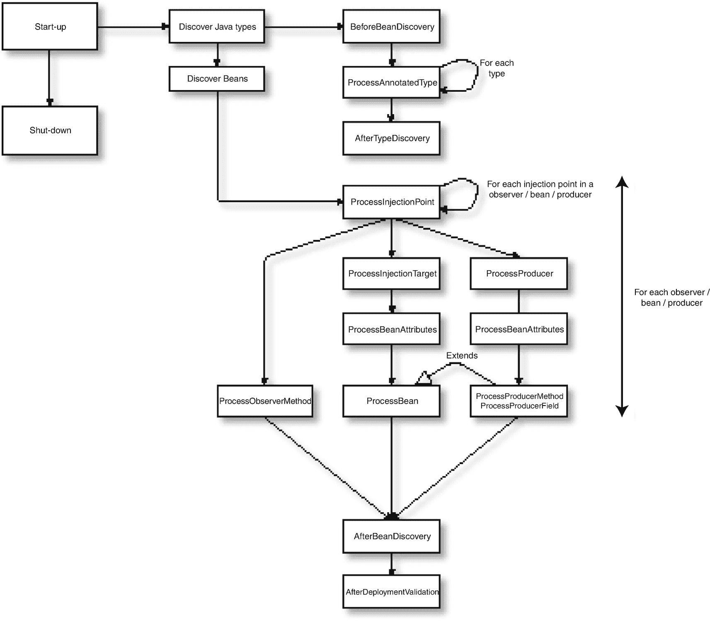

# 7. 动态 Bean

如前几章（特别是第 3 章）所述，在 CDI 中，任何可以为其创建 `Bean<T>` 实例的对象都是 bean。CDI 内部会从合适的类和生产者中自动创建此类实例，但也可以直接（以编程方式）创建它们。由于可以即时创建，甚至可以在循环中创建多个，因此它们被称为*动态 bean*。本章将介绍如何创建和使用此类 bean。

## 为何使用动态 Bean？

动态创建 bean（即直接将 `Bean<T>` 实例添加到运行时）是一个高级主题。许多业务应用程序很少（如果有的话）会强烈需要这样做。对于这些应用程序，CDI 从托管 bean 和生产者生成的 bean 基本上涵盖了业务功能的所有方面。

然而，在某些情况下，需要更高的灵活性，这种灵活性主要由第三方库或那些将其他类似 bean 的系统与 CDI 集成的库（通常称为*连接器*或*桥接器*）所需。

动态创建 `Bean<T>` 可以让你实现经常讨论但从未实现的概念，例如在 XML 中定义 CDI bean（或者，在撰写本文时的 2019 年，在 JSON 或 YAML 中定义）。这也可以用于小型、自定义的领域特定语言（DSL），用户只需提供少量数据，库即可从中生成更大的（一组）bean。本章稍后将讨论的一个实际示例是在某种程度上模拟泛型生产者；也就是说，将为遇到的每个注入点类型添加 `Bean<T>` 实例。这种功能无法通过常规的托管 bean 实现（代码生成技术除外，但这会引发另一系列问题）。

## 创建动态 Bean

`Bean<T>` 实例可以通过两种主要方式创建。第一种是直接实现 `javax.enterprise.inject.spi.Bean<T>` 接口；第二种是使用 CDI API 提供的构建器，以简化此任务，并消除实现 `Bean<T>` 这个相当庞大的接口时固有的一些不确定性。

### 手动实现 Bean<T>

`Bean<T>` 本质上将工厂类型与元数据捆绑在一起。纯工厂方法位于 `Contextual<T>` 中，这是第 4 章已经讨论过的类型。在该章中，是从已经以某种方式创建的 bean 类型的角度来审视它的。这里将从创建类型的角度来审视它。

#### 第 1 部分：Contextual

`Bean<T>` 工厂部分的核心接口相对简单，如下所示：

```
public interface Contextual {
T create(CreationalContext creationalContext);
void destroy(T instance, CreationalContext creationalContext);
}
```

对于简单类型（即不由 CDI 管理或注入的类型），只需在 `create()` 方法中返回一个实例即可。例如，对于 `String` 类型，需要执行以下操作：

```
@Override
public String create(CreationalContext creationalContext) {
return "我们自己的 bean";
}
@Override
public void destroy(Integer instance, CreationalContext creationalContext) {
// 此处无需执行任何操作
}
```


#### 第二部分：核心属性

如前所述，`Bean<T>` 是工厂部分和元数据部分的组合。元数据涉及第 3 章首次讨论的核心 bean 属性。为方便起见，我们在此重复列出：

*   类型（Types）
*   限定符（Qualifiers）
*   名称（Name）
*   作用域（Scope）
*   原型（Stereotypes）
*   替代（Alternative，一个布尔值，指示该 bean 是否为替代 bean）

从创建 bean 的角度来看，这些属性在很大程度上决定了从 `create()` 方法返回的 bean 如何被索引（即在内部 bean 存储中根据哪些标识符存储，以及实例存储在哪个上下文“缓存”中）。

对于元数据，核心接口由与上述列表直接对应的只读属性组成。

```
public interface BeanAttributes {
Set getTypes();
Set getQualifiers();
Class getScope();
String getName();
Set> getStereotypes();
boolean isAlternative();
}
```

在实现此接口时，您必须考虑所需的默认值。不幸的是，该接口并未提供关于这些默认值是什么的指导，无论是在 Javadoc 中还是通过默认方法。然而，CDI 规范确实提供了一些指导，有趣的是，这意味着每当您自己实现 `Bean<T>` 时，都必须实现规范中的某些要求。换句话说，规范的部分规则和行为实际上存在于您实现的工件中，而不是核心运行时代码中。CDI 在 Java EE 中并非特例，例如在 JSF 中，许多看似核心框架行为的东西实际上存在于用户提供的 `UIComponents` 中。

以下是为您之前从 `create()` 方法返回的 `String` bean 提供的最小实现：

```
@Override
public Set getTypes() {
return new HashSet(asList(String.class, Object.class));
}
@Override
public Set getQualifiers() {
return singleton((Annotation) Default.Literal.INSTANCE );
}
@Override
public Class getScope() {
return Dependent.class;
}
@Override
public String getName() {
return null;
}
@Override
public Set> getStereotypes() {
return emptySet();
}
@Override
public boolean isAlternative() {
return false;
}
```

为了进一步说明这里的返回值，我们先来看一下 `getTypes()`。您必须显式提供您希望 bean 被识别的所有（Java）类型。在此层级，CDI 运行时不会扫描 `Bean<T>` 中 `T` 的任何类型，也不会扫描您从 `create()` 返回的实例的类型。

对于 `getQualifiers()` 方法，在没有任何其他特定限定符的情况下，您必须返回一个包含 `Default` 注解字面量实例的集合。同样，在此层级，CDI 运行时不会为您提供任何默认值，您不能在此处返回 `null` 或空集合，否则会导致未定义行为（很可能是某种异常，因为 CDI 运行时不会期望这样的值）。

对于 `getScope()` 方法，其逻辑与 `getQualifiers()` 方法类似；在没有任何其他作用域的情况下，您必须显式返回 `Dependent` 作用域。CDI 规范规定，任何没有显式作用域的 bean 都应是依赖作用域，并且再次强调，在此层级，CDI 运行时不会为您设置默认值。

`getName()` 方法是 `BeanAttributes` 接口中唯一一个如果您不使用名称则可以返回 `null` 的方法。请记住，在 CDI 中，bean 名称完全是可选的，并且没有任何类型的默认名称，因此您无需在此处提供任何内容。

原型也完全是可选的，但对于 `getStereotypes()`，您实际上不能返回 `null`；您必须返回一个空集合。最后，对于 `isAlternative()`，作为一个返回原始布尔值的方法，几乎没有歧义，当 bean 不是替代 bean 时，您只需在此处返回 `false`。

#### 第三部分：Bean

到目前为止，您已经看到了代表工厂（`Contextual`）和元数据（`BeanAttributes`）的接口，但尚未看到它们是如何组合的。您也还没有看到我们开始讨论的 `Bean<T>` 接口是什么样子的。

现在，您将查看 `Bean<T>` 接口本身，因为它恰好是将工厂和元数据结合起来的那个东西。此外，它还包含少量关于 bean 本身的额外数据。

```
public interface Bean extends Contextual, BeanAttributes {
Class getBeanClass();
Set getInjectionPoints();
}
```

`Bean<T>` 接口最重要的部分是 `extends` 部分，它实际上结合了 `Contextual` 和 `BeanAttributes`。它包含两个自己的方法（实际上是三个，但第三个已弃用，因此我们在此省略）。

在 `Bean<T>` 接口的两个方法中，`getBeanClass()` 有些特殊。其文档如下：

> *“托管 bean 或会话 bean 的 bean 类，或声明生产者方法或字段的 bean 的 bean 类。”*

换句话说，如果您有以下托管 bean：

```
@RequestScoped
public class SomeBean extends SomeOtherBean implements SomeInterface {
}
```

那么 bean 类将是 `SomeBean`。而如果您有以下生产者：

```
public class SomeBean extends SomeOtherBean implements SomeInterface {
@Produces @RequestScoped
public MyBean doProduce() {
return new MyBean();
}
}
```

那么 bean 类将再次是 `SomeBean`，而不是 `MyBean`。因此，bean 类不一定与可以注入或获取的类型相关。毕竟，您已经有 `getTypes()` 方法用于此目的。

`getBeanClass()` 的文档并不完全完整，因为并非所有 `Bean<T>` 都是从托管 bean 或生产者生成的（否则我们现在就不会讨论 `Bean<T>` 了）。

这确实引出了一个问题：bean 类用于什么目的？在不是从托管 bean 或生产者生成的实现中，它应该是什么？

首先回答第一个问题，bean 类用于在模块化/多类加载器环境中确定类的可见性。在 Java EE 中，典型的例子是包含多个 WAR 模块的 EAR 模块。类可以定义在例如 EAR 级别，使其对所有 WAR 可见，或者定义在 WAR 级别，使其对其他 WAR 不可见（隔离）。

在 CDI 规范中，这一点通过以下陈述表达：

> *“如果根据模块架构的类可访问性要求，bean 类需要对该模块中的类可访问，则该 bean 可在该模块中用于注入。”*

虽然这句话可能有点难以解析，但它基本上意味着 CDI 遵循其所处环境的类加载器可见性规则。要确定类加载器可见性，您需要一个代表该类加载器的类（即由该类加载器加载的类）。如前所述，这不一定是 bean 类型。在您之前看到的生产者示例中，`MyBean` 可能定义在 EAR 级别，而 `SomeBean` 位于其中一个 WAR 模块中。由于是 `SomeBean` 完全定义了 bean（它可选地向裸类类型添加了作用域和限定符），因此我们在此展示的是 `SomeBean` 的可见性。

例如，假设您在 WAR 1 中有以下内容：

```
public class SomeBean1 extends SomeOtherBean implements SomeInterface {
@Produces @RequestScoped
public MyBean doProduce() {
return new MyBean("war1");
}
}
```

并假设您在 WAR 2 中有以下内容：

```
public class SomeBean2 extends SomeOtherBean implements SomeInterface {
@Produces @ApplicationScoped
public MyBean doProduce() {
return new MyBean("war2");
}
}
```

此外，假设 `MyBean` 定义在 EAR 级别。


如果现在从 WAR 1 请求注入一个 `MyBean`，你需要查看的是 `SomeBean1` 而不是 `SomeBean2`。由于 `SomeBean2` 对 WAR 1 不可见（由其类加载器可见性决定），因此 `SomeBean2` 不会被考虑，只有 `SomeBean1` 会被考虑。如果你只查看 Bean 类型（返回类型）`MyBean`，那么两个生产者都会可见，从而产生歧义。正如本书其他地方所述，如果 CDI 运行时遇到歧义，它会中止应用程序的启动并抛出异常。

接下来讨论第二个问题：对于直接实现而非由受管 Bean 或生产者生成的 `Bean` 实现，其 Bean 类应该是什么。遗憾的是，CDI 规范或 Javadoc 中都没有对此提供直接指导，但正如前面所述，它本质上隐含地应该是“提供”（创建）Bean 实例的类，因此对于你的 `Bean<T>` 实现来说，它应该就是 `Bean<T>` 类本身。

最后，你还有 `getInjectionPoints()` 方法。虽然作用域和限定符可以被视为外部元数据（外部世界通过这些属性来观察 Bean），但注入点在某种程度上是内部元数据的一部分（外部世界看不到这些，只有 CDI 运行时能看到）。不过，这个方法很特殊。它不提供主要的注入点元数据，而只是对这些元数据进行声明。CDI 运行时仅使用它们来检查依赖项是否可用。更具体地说，它使用每个返回的注入点来形成键 `{类型 + 限定符}`，并据此进行查找（例如，使用 `beanManager.getBeans()`）。如果结果为空或存在歧义，则会抛出异常；否则，表示依赖项可用，一切正常。具体来说，`Bean<T>#getInjectionPoints()` 返回的注入点*不*用于实际的注入。`Bean<T>` 接口中之所以有单独的注入点集合，是为了确保 CDI 运行时能够在运行时进行验证，并且在验证时不必调用可能开销较大的 `create()` 方法来实际创建实例、扫描它然后验证。`getInjectionPoints()` 还有一些其他潜在用例，例如用于反序列化，但主要用例是验证。

#### 第 4 部分：序列化支持

动态 Bean 还可以实现一些额外的接口。其中之一是 `javax.enterprise.inject.spi.PassivationCapable` 接口，该接口几乎是强制实现的，因为一个 Bean 要能够注入到任何具有钝化作用域（`passivating` 属性设置为 `true` 的 `@NormalScope`）的其他 Bean 中，就需要实现它。由于你无法控制用户希望将你的 Bean 注入到哪些其他 Bean 中，因此不实现 `PassivationCapable` 通常会导致很多麻烦，例如当你的 Bean 被尝试用于使用众所周知的 `@SessionScoped` 作用域的 Bean 时。这就是为什么实际上 `Bean<T>` 实现也应该始终实现这个接口；只有在有非常特殊的原因时才省略它。未来版本的 CDI 很可能会强制要求实现此接口，因此，即使没有其他原因，现在实现它也是为未来做好准备。

`javax.enterprise.inject.spi.PassivationCapable` 接口带来的作用是，为 Bean 提供另一个唯一的基于 `String` 的 ID。此 ID 用于序列化目的，特别是当 `Bean<T>` 实例本身不可序列化时。

细心的读者可能会问，为什么还需要另一个 ID，因为一个 Bean 已经有两个 ID 了（类型 + 限定符和 EL 名称）。答案可能有点复杂。首先，EL 名称并不真正适合。它虽然已经是一个字符串，但由于它是一个可选名称，并且通常是较短（类似别名）且对用户友好的名称，如果所有 Bean 都使用这样的名称，它可能会很快（且无意地）发生冲突。其次，类型 + 限定符显然本身就不是一个字符串。你可以形式化一种格式将它们转换为字符串，但随后会遇到下一个问题：这些标识符不一定标识单个 Bean，实际上标识的是一组 Bean。而且，有趣的是，在实践中它们更类似于对 Bean 仓库的查询，在不同时间可能会产生不同的结果。为了系统的稳定性，我们确实希望尽可能限制获得不同结果的情况，但这只是可能发生的事情，因此必须予以考虑。

对于用于序列化的标识符，你需要一个完全唯一且因此仅标识单个 Bean 的东西。这就是 `PassivationCapable` 接口的 `getId()` 方法的作用所在，因为它确实做到了这一点。

对于从受管 Bean 或生产者生成的 `Bean<T>` 实例，`getId()` 返回的字符串通常基于 Bean 的类型、限定符和其他属性。例如，CDI 参考实现 Weld 大致使用以下内容来生成此字符串：

```
new StringBuilder("WELD%AbstractSyntheticBean%")
.append(beanClass.getName()).append("%")
.append(attributes.getName()).append(",")
.append(attributes.getScope().getName()).append(",")
.append(attributes.isAlternative())
.append(createCollectionId(attributes.getQualifiers()))
.append(createCollectionId(attributes.getStereotypes()))
.append(createCollectionId(attributes.getTypes()))
.toString();
```

如你所见，这里的唯一标识符是 Weld 序言字符串 + `{beanClass, name, scope, alternative, qualifiers, stereotypes, types}` 的组合。它比单纯的 `{types, qualifiers}` 稍微多一些内容，但除此之外，它包含了 `Bean<T>` 中包含的所有公共数据。

对于你自己创建的 `Bean<T>` 实例，并且只创建了单个实例的情况，通常只需使用完全限定类名即可作为唯一标识符。如果你创建并随后添加了 `Bean<T>` 类的多个实例，则需要一些东西来区分它们。


例如，假设你有一个 `com.example.MyBean<T>`，你为其创建并添加了两个实例：一个从 `create()` 方法返回 `Integer`，另一个返回 `String`。那么，从 `getId()` 返回的潜在标识符，对于第一个实例可能是 `com.example.MyBean-Integer`，对于第二个实例则是 `com.example.MyBean-String`。

到目前为止，我们只是顺带提及 `getId()` 返回的字符串标识符用于序列化目的，但尚未解释它具体是如何以及为何用于此目的。现在你将对此进行了解。

当 CDI 中的 bean 被序列化时，它所拥有的所有正常作用域 bean 依赖项（及其传递依赖项）本身并不会被序列化，而是生成这些依赖项的 `Bean<T>` 会被序列化。可以将其想象为将你的 iPhone 备份到 iCloud。你安装在其上的应用、从 iTunes 下载的媒体等，并不包含在备份本身中；只包含指向它们在 Apple Store 和 iTunes 中原始位置的指针。根据苹果官网的说法：

> *“你的 iCloud 备份包含你所购内容的信息，但不包含内容本身。当你从 iCloud 备份恢复时，你购买的内容会自动从 iTunes Store、App Store 或 Books Store 重新下载。”*

当一个 bean 被序列化时（在 CDI 术语中称为*钝化*），就其正常作用域依赖项而言，实际被序列化的是带有对 `Bean<T>` 引用的代理，而不是实际的 bean 实例。一般来说，对于序列化形式中的这个引用，有若干种不同的选项。在最简单的情况下，`Bean<T>` 是直接可序列化的，CDI 运行时可以使用它。采用这种方法，无需再调用 `getId()` 方法，此时序列化的代理将包含序列化的 `Bean<T>` 实例。然而，当 `Bean<T>` 不可序列化时，CDI 运行时可以使用 `getId()` 方法来获取字符串标识符，然后这个字符串（且仅此字符串）会被序列化，作为所讨论的 `Bean<T>` 实例的代表性引用。

每当一个 bean 被反序列化时（在 CDI 术语中称为*激活*），其正常作用域依赖项的代理也会被反序列化，并且随之一起的要么是直接的 `Bean<T>`，要么是代表它的字符串标识符。在后一种情况下，CDI 运行时需要执行一个额外的步骤，即使用其字符串标识符查找原始的 `Bean<T>`（这可以在实际访问依赖项时延迟完成）。此查找可以使用 `BeanManager` 的公共方法 `getPassivationCapableBean()` 来完成。

无论使用何种方法反序列化 `Bean<T>`，CDI 运行时都必须在某个时刻检索实际的 bean 实例。这里又有两种选择。请记住，反序列化可能发生在初始序列化之后很长时间，到那时，bean 实例可能在其给定作用域中已不存在，或者如果依赖项之前未被使用过，它可能一开始就从未存在过。如果是这种情况，则通过调用 `Bean<T>` 的 `create()` 方法当场创建该实例。否则，将使用作用域中的实例。

除了可能节省时间和空间（这在 IT 领域很罕见，因为你通常会在优化其中一个时牺牲另一个）之外，如前所述进行序列化的关键原因是为了维护各个作用域的一致性。假设你实际上完全序列化了每个正常作用域的 bean。那么在反序列化时，你实际上就创建了该 bean 的一个副本。这破坏了作用域的规则，该规则确保在给定作用域中只有一个 bean 实例，并由该作用域的所有使用者共享。

例如，考虑一个应用作用域的 bean，显然它应该只有一个实例。如果一个被序列化随后又被反序列化的 bean 包含了这样一个 bean 的自身副本，它将看不到对原始 bean 的任何更改，并且该 bean 的其他任何使用者也不会看到对副本所做的更改。这显然是不正确的。在反序列化时有效地重新注入依赖项可以完全避免这个问题。

#### 第 5 部分：激活备选方案

如本节第 2 部分所示，`Bean<T>` 实现可以通过从 `isAlternative()` 方法返回 `true` 来声明自己是一个“备选方案”。默认情况下，任何作为备选方案的 `Bean<T>` 都处于一种“悬而未决”的状态。它存在，但不用于任何类型的解析。要摆脱这种状态，它需要被“激活”（不要与反序列化时类似命名的“激活”混淆）。激活可以由用户在每个 bean 归档中完成，方法是在该归档的 `beans.xml` 文件中，将 bean 类列在 `<beans>`、`<alternatives>`、`<class>` 元素下。或者，你可以通过让 `Bean<T>` 实现 `javax.enterprise.inject.spi.Prioritized` 接口，来添加一个处于全局激活状态的 bean。该接口有一个需要实现的方法：`getPriority()`。如果多个备选方案提供相同的 bean 类型，则使用此方法返回的整数值来选择哪个 `Bean<T>` 实例用于提供 bean。优先级最高的获胜。因此，通常系统级别的备选 bean 会使用较低的优先级，比如在 0 到 100 的范围内，这意味着库提供的备选方案（用户可以自由添加）可以在 101 到 200 的优先级上覆盖它。最终希望决定使用哪个 bean 的应用程序，在此示例中应使用高优先级，比如 1000 或更高。

CDI 规范没有规定如果两个或多个 `Bean<T>` 具有相同优先级会发生什么。在这种情况下，不同 CDI 实现（例如，Weld 和 OWB）之间的结果是未定义的。然而，给定的实现可能仍有自己的规则来打破平局。例如，Weld 在这种情况下会使用 bean 类的字典序（由 `getBeanClass` 返回）。这意味着，在使用 Weld 时，如果其他条件相同，一个 bean 类为 `com.example.zzz` 且优先级为 10 的 `Bean<T>` 实例，将优先于一个 bean 类为 `com.example.aaa` 且优先级也为 10 的 `Bean<T>` 实例被选中。

为完整起见，我们现在将展示完整的 `Bean<T>` 实现，它结合了前面解释的关于一个未命名、非备选 bean 的所有部分。

```
public class MyBean implements Bean, PassivationCapable {
@Override
public String create(CreationalContext creationalContext) {
return "Our own bean";
}
@Override
public void destroy(Integer instance, CreationalContext creationalContext) {
// Nothing to do here
}
@Override
public Set getTypes() {
return new HashSet(asList(String.class, Object.class));
}
@Override
public Set getQualifiers() {
return singleton((Annotation) Default.Literal.INSTANCE );
}
@Override
public Class getScope() {
return Dependent.class;
}
@Override
public String getName() {
return null;
}
@Override
public Set> getStereotypes() {
return emptySet();
}
@Override
public boolean isAlternative() {
return false;
}
@Override
public Class getBeanClass() {
return getClass();
}
@Override
public Set getInjectionPoints() {
return emptySet();
}
@Override
public String getId() {
return getClass().getName();
}
@Override
public boolean isNullable() { return false; }
}
```


## 添加动态 Bean：使用扩展

上一节中展示的动态 Bean 必须通过 CDI 扩展来添加。

CDI 扩展是一个庞大的主题，本书不会全面展开，但在解释如何通过扩展添加 Bean 之前，我们会先对其进行简要概述。

CDI 中的*扩展*是一种特殊的 CDI 类，它实现了 `javax.enterprise.inject.spi.Extension` 标记接口，并且必须通过将其完全限定类名放置在类路径（JAR 中）的 `META-INF/services/javax.enterprise.inject.spi.Extension` 文件中来注册。

有点类似于 Servlet 规范中的 `ServletContainerInitializer`，扩展可以监听 CDI 运行时启动时触发的生命周期事件，并利用这些事件以编程方式在内部 CDI Bean 仓库中添加、修改或删除 Bean。

这些生命周期事件粒度极细，允许应用程序（但实践中主要是库）极大地影响 CDI 本身。在某种程度上，这使得 CDI 看起来有点像 Smalltalk 环境，后者被描述为“一个活着的系统，随身携带在运行时扩展自身的能力”。

与其他几个框架的监听器类似，CDI 生命周期事件可以大致分为两大类。

*   启动时触发的事件

*   关闭时触发的事件

最有趣的部分是“启动时触发的事件”，它可以进一步细分为两个逻辑组。

*   发现普通 Java 类型

*   发现 CDI Bean

接下来我们将简要介绍这两者。

### 发现普通 Java 类型

这一组事件包含三个事件。

*   `javax.enterprise.inject.spi.BeforeBeanDiscovery`

*   `javax.enterprise.inject.spi.ProcessAnnotatedType<X>`

*   `javax.enterprise.inject.spi.AfterTypeDiscovery`

`BeforeBeanDiscovery` 事件在类型扫描开始之前触发。为了保持一致性，这个事件或许应该被称为 `BeforeTypeDiscovery`，但可惜并非如此。观察此事件，你可以向 CDI 将在后续阶段考虑的类型列表中添加全新的类型。例如，当你处于 CDI 扫描受到严格限制的 Bean 归档中时，这非常有用，例如代表 Java EE 内部库（如 JSF 和 EE Security）的 Bean 归档。这些 JAR 中的类型不会被 CDI 扫描，任何你想要添加的类型都可以在此处手动添加。例如，EE Security 参考实现 Soteria 就执行了以下操作：

```
public void register(@Observes BeforeBeanDiscovery beforeBean, BeanManager beanManager) {
addAnnotatedTypes(beforeBean, beanManager,
AutoApplySessionInterceptor.class,
RememberMeInterceptor.class,
LoginToContinueInterceptor.class,
FormAuthenticationMechanism.class,
CustomFormAuthenticationMechanism.class,
SecurityContextImpl.class,
IdentityStoreHandler.class,
Pbkdf2PasswordHashImpl.class
);
}
```

`addAnnotatedTypes` 定义如下：

```
public static void addAnnotatedTypes(BeforeBeanDiscovery beforeBean, BeanManager beanManager,
Class... types) {
for (Class type : types) {
beforeBean.addAnnotatedType(type, "Soteria " + type.getName());
}
}
```

请注意，手动添加类型时需要提供一个标识符，CDI 运行时可以使用该标识符来确定类型的添加位置，并区分多次添加的相同类型。

通过观察 `ProcessAnnotatedType` 事件，CDI 运行时在 Bean 归档中找到的每一个普通 Java 类型（类或接口）都会回调你。你可以利用此事件来查看该类型（例如，记录日志）、修改该类型（完全替换它，或基于遇到的类型替换为另一个类型），或者完全移除该类型，使 CDI 不再“看到”它。通过 `configureAnnotatedType` 可以方便地使用构建器，在找到的类型的类、字段或方法级别轻松添加或移除注解。

通过观察 `AfterTypeDiscovery` 事件，我们会在 CDI 运行时完成所有应做的类型扫描后被回调。在这里，你也可以向 CDI 将在后续阶段考虑的类型列表中添加全新的类型。

### 发现 CDI Bean

在 CDI 运行时发现原始类型之后，下一阶段是分析这些类型，并从中创建 `Bean<T>` 实例等。

*   `ProcessInjectionPoint`

*   `ProcessInjectionTarget`

*   `ProcessProducer`

*   `ProcessBeanAttributes`

*   `ProcessBean`
    *   `ProcessManagedBean`

    *   `ProcessSessionBean`

    *   `ProcessProducerMethod`

    *   `ProcessProducerField`

    *   `ProcessSyntheticBean`

*   `ProcessObserverMethod`
    *   `ProcessSyntheticObserverMethod`

*   `AfterBeanDiscovery`

*   `AfterDeploymentValidation`

图 7-1 展示了其概览。



图 7-1

CDI 事件及其组织

共有八个主要事件，以及几个专门化其父事件的子事件。在这些情况下，观察父事件会包括接收所有子事件的通知。例如，当观察 `ProcessBean` 时，你会收到所有被处理的 `Bean<T>` 的通知；而如果你观察 `ProcessSyntheticBean`，则只会收到你手动添加的 `Bean<T>` 的通知。请注意，对于本章中你称之为*动态* Bean 的 `Bean<T>` 类型，这里使用了有点引人注目的术语*合成*。这之所以引人注目，是因为尽管“合成”在其他各种 API 方法中用于类似情况，但在 CDI 规范文本或 CDI 社区中并未使用。

在对 CDI 扩展进行了这番简要解释之后，你现在终于可以找到如何添加你的 `Bean<T>` 实现的答案了：通过观察 `AfterBeanDiscovery` 事件，并以类似于添加新类型的方式，你可以添加一个新的 `Bean` 实例。

示例如下：

```
package com.example;
public class DynamicBeanExtension implements Extension {
public void afterBean(@Observes AfterBeanDiscovery afterBeanDiscovery) {
afterBeanDiscovery.addBean(new MyBean());
}
}
```

如前所述，对于所有 CDI 扩展，扩展类必须通过将其完全限定名称放置在文件 `META-INF/services/javax.enterprise.inject.spi.Extension` 中来注册，在本例中，该文件将只包含一行文本 `com.example.DynamicBeanExtension`。


### 使用配置器实现 `Bean<T>`

如你所见，完全手动实现一个 `Bean<T>` 是件相当繁琐的工作，尽管这能让你深入理解其运作机制。

在实践中，你很少需要经历所有这些步骤，因为 CDI 为此提供了一个更易于使用的构建器。

CDI 特性提供了一个便捷的构建器，它不仅让创建 `Bean<T>` 实例的代码简洁得多，还省去了大部分猜测工作。示例如下：

```
public class DynamicBeanExtension implements Extension {
public void afterBean(@Observes AfterBeanDiscovery afterBeanDiscovery) {
AfterBeanDiscovery
.addBean()
.createWith(e -> "Our own bean")
.types(String.class, Object.class)
.id(DynamicBeanExtension.class.getName() + " String")
}
}
```

上述方式只允许你指定与默认值不同的部分，从而使定义更加紧凑。

特别要注意 `id` 是如何融入 `Bean<T>` 构建器的，几乎看不出它实际上是另一个接口的一部分，这进一步证明了 `getId()` 或许从一开始就应该属于 `Bean<T>` 接口。另外请注意，CDI 规范并未完全明确当未提供显式 ID 时，`Bean<T>` 默认是否支持钝化。Weld 和 OWB 生成的实例都始终实现了 `PassivationCapable` 接口，但它们的行为略有不同。Weld 在未提供 ID 时总会生成一个 ID，其生成方式与管理 Bean 或生产者生成 ID 的方式相同。而 OWB 仅在 `Bean<T>` 自身具有钝化作用域时才生成 ID。看来，确保拥有 ID 的唯一可靠方法就是手动添加它。

除了作为一个简单的构建器，用于收集 `Bean<T>` 中 getter 方法返回的数据（未提供的数据使用默认值）之外，该构建器还提供了其他方式无法获得的高级功能。其中一个例子是 `addTransitiveTypeClosure()` 方法，它背后有相当复杂的功能来发现给定 Bean 拥有的所有类型（超类及其超类、这些类实现的任何接口及其超接口等）。在构建器中使用该方法，你无需显式列出所有类型（如果你希望该 Bean 可用于其拥有的所有类型）。这本质上与 CDI 运行时从管理 Bean 或生产者生成 `Bean<T>` 实例时所做的事情相同。示例如下：

```
public class DynamicBeanExtension implements Extension {
public void afterBean(@Observes AfterBeanDiscovery afterBeanDiscovery) {
afterBeanDiscovery
.addBean()
.createWith(e -> "Our own bean")
. addTransitiveTypeClosure(String.class)
.id(DynamicBeanExtension.class.getName() + " String");
}
}
```

请注意，这里你无需提供 `Object.class` 参数，因为类型闭包算法会自动发现它。当然，对于如此简单的案例，差异微乎其微，但在更深的类型层次结构中，这可能会带来巨大差异。

构建器提供的另一个便捷功能是，它可以选择性地为你提供一个 `Instance` 而非仅仅一个 `CreationalContext`。这个 `Instance` 绑定到与 `Bean<T>` 上下文关联的 Bean 管理器和创建上下文。它可用于选择该方法可能需要的依赖项。为了传入该 `Instance`，应使用 `produceWith()` 方法而非 `createWith()` 方法。示例如下：

```
public class DynamicBeanExtension implements Extension {
public void afterBean(@Observes AfterBeanDiscovery afterBeanDiscovery) {
afterBeanDiscovery
.addBean()
.produceWith(instance -> {
MyBean myBean = instance.select(MyBean.class).get();
return "MyBean says " + myBean.hi();
})
. addTransitiveTypeClosure(String.class)
.id(DynamicBeanExtension.class.getName() + " String");
}
}
```

作为上述方法的一种替代方案，`createWith()` 方法可以使用全局的 `CDI.current()` 实例。但这并不完全等同，因为全局实例不一定允许你获取当前的 `InjectionPoint`，而传入的实例则允许。示例如下：

```
public class DynamicBeanExtension implements Extension {
public void afterBean(@Observes AfterBeanDiscovery afterBeanDiscovery) {
afterBeanDiscovery
.addBean()
.produceWith(instance -> {
InjectionPoint point = instance.select(InjectionPoint.class).get();
return "Injected in bean: " + point.getBean();
})
. addTransitiveTypeClosure(String.class)
.id(DynamicBeanExtension.class.getName() + " String");
}
}
```

在 `Bean<T>` 的 `createWith()` 方法或 `create()` 方法中，可以使用以下技巧来获取当前的 `InjectionPoint`。

首先定义以下 Bean：

```
@Dependent
public class InjectionPointGenerator {
@Inject
private InjectionPoint injectionPoint;
public InjectionPoint getInjectionPoint() {
return injectionPoint;
}
}
```

然后定义以下工具方法：

```
public static InjectionPoint getCurrentInjectionPoint(
BeanManager beanManager,
CreationalContext creationalContext) {
Bean bean =
resolve(beanManager, InjectionPointGenerator.class);
return
bean != null ? (InjectionPoint)
beanManager.getInjectableReference(
bean.getInjectionPoints().iterator().next(),
creationalContext)
:
null;
}
public static  Bean resolve(
BeanManager beanManager,
Class beanClass, Annotation... qualifiers) {
Set> beans = beanManager.getBeans(beanClass, qualifiers);
for (Bean bean : beans) {
if (bean.getBeanClass() == beanClass) {
return (Bean)
beanManager.resolve(
Collections.>singleton(bean));
}
}
return (Bean) beanManager.resolve(beans);
}
```

然后可以通过调用 `getCurrentInjectionPoint()` 来获取当前的 `InjectionPoint`。计划在 CDI 2.1 中增加一种更简单的方法来从 `createWith()` 或 `create()` 方法中获取此信息（但当然不能保证一定会添加）。

不幸的是，构建器中缺少一个关键元素，那就是设置优先级并从而全局启用替代方案的能力。使用标准的 CDI API，除了监听 `ProcessSyntheticBean` 事件（在你通过构建器添加 Bean 后触发），使用 `getBean()` 方法从该事件中获取 `Bean<T>`，并将其包装在一个实现了 `Prioritized` 接口的新 `Bean<T>` 中之外，没有真正便捷的方法来添加此功能。到了那一步，你完全可以直接从你自己的 `Bean<T>` 实现开始，根本不必费心使用构建器。

API 中这个令人痛苦的遗漏是一个已知问题，像 Weld 这样的实现为此提供了自定义解决方案。`AfterBeanDiscovery.addBean()` 返回的 `BeanConfigurator` 可以转换为 `org.jboss.weld.bootstrap.event.WeldBeanConfigurator<T>`，它唯一的额外方法就是缺失的 `priority()` 方法。不用说，使用此方法后代码将不再可移植，并且需要依赖 Weld 特定的库，这两点通常都是人们试图避免的。


### 使用动态创建的 Bean 模拟通用生产者

CDI 设计理念的基石是类型安全至上。在大多数情况下，这非常有效，无可指摘。然而，有时你确实需要一个“通用生产者”，即一个基于 `InjectionPoint` 类型而具有通用返回方法的生产者。

理论上，它看起来像这样：

```
@Produces @SomeQualifier
public  T thisDoesNotWork(InjectionPoint injectionPoint) {
return convert(doStuff(), injectionPoint);
}
```

这样你就可以执行以下操作：

```
@Inject
@SomeQualifier
Foo foo;
@Inject
@SomeQualifier
Bar bar;
```

然而，你可以在一定程度上通过动态创建 `Bean<T>` 实例来模拟这一点。方法是首先扫描应用程序使用的所有注入点，然后记录这些注入目标的类型。接着，为你遇到的每个类型添加一个新的 `Bean<T>` 实例。在 CDI 中，这种扫描非常简单，因为你只需监听一个 `Process*Bean` 事件，然后检查其字段和构造函数即可。我们将展示一个示例，其中你监听 `ProcessManagedBean` 事件并检查限定符注解。

```
public class GenericProducerSim implements Extension {
private Set types = new HashSet();
public  void collect(@Observes ProcessManagedBean event) {
for (AnnotatedField field : event.getAnnotatedBeanClass().getFields()) {
addAnnotatedTypeIfNecessary(field);
}
for (AnnotatedConstructor ctr: event.getAnnotatedBeanClass().getConstructors()) {
for (AnnotatedParameter parameter : ctr.getParameters()) {
addAnnotatedTypeIfNecessary(parameter);
}
}
}
private void addAnnotatedTypeIfNecessary(Annotated annotated) {
if (annotated.isAnnotationPresent(SomeQualifier.class)) {
types.add(type);
}
}
}
```

在前面的代码中，对于每个源自托管 Bean 的 `Bean<T>`，你都会遍历其字段，并收集所有带有 `SomeQualifier` 注解的类型。根据这个示例，你最终会得到集合 `{Foo.class, Bar.class}`。

在同一个扩展中，你现在还可以监听 `AfterBeanDiscovery` 事件，并为你遇到的每个类型添加一个 `Bean<T>`：

```
public void afterBean(@Observes AfterBeanDiscovery afterBeanDiscovery) {
for (Type type : types) {
afterBeanDiscovery.addBean(new GenericProducer(type));
}
}
```

这里的 `GenericProducer` 可以使用传入的 `type` 从其 `getTypes()` 方法返回，这样当 CDI 遇到之前的注入点并使用该类型作为转换基础时，它就会被选中。或者，你也可以添加一个单一的 `Bean<T>`，使其 `getTypes()` 方法返回你遇到的所有类型。

请注意，这个解决方案并非完全完美，因为它显然无法看到仅通过编程方式请求的类型，例如使用 `CDI.current().select()`。有时，你甚至没有意识到这种情况会发生，例如在 Servlet 中使用 `@Inject` 时。Servlet 并非由 CDI 直接管理，但 Servlet 容器（运行时）通常会以编程方式使用 CDI API 来获取其所需的依赖项，然后手动将它们分配给带有 `@Inject` 注解的字段。这种用法在应用程序启动时对 CDI 运行时来说基本上是隐藏的，因此你无法收集这些类型。

