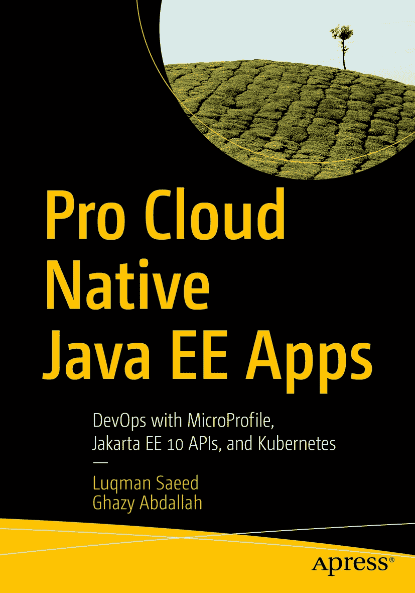

ISBN 978-1-4842-8899-3e-ISBN 978-1-4842-8900-6 [`doi.org/10.1007/978-1-4842-8900-6`](https://doi.org/10.1007/978-1-4842-8900-6) © Luqman Saeed and Ghazy Abdallah 2022 本作品受版权保护。所有权利均由出版商独家许可，无论涉及材料的全部或部分，特别是翻译、重印、重用插图、朗诵、广播、以缩微胶片或任何其他物理方式复制、传输或信息存储与检索、电子改编、计算机软件，或现在已知或以后开发的类似或不同方法的权利。本出版物中使用通用描述性名称、注册商标、商标、服务标志等，即使没有明确声明，也不意味着这些名称不受相关保护法律和法规的约束，因此可自由使用。出版商、作者和编辑可以安全地假设本书中的建议和信息在出版之日是真实和准确的。出版商、作者或编辑均不对本文所含材料或可能存在的任何错误或遗漏提供明示或暗示的保证。出版商对已出版地图和机构隶属关系中的管辖权主张保持中立。

本 Apress 印记由注册公司 APress Media, LLC（Springer Nature 的一部分）出版。

注册公司地址为：1 New York Plaza, New York, NY 10004, U.S.A.

*谨以此书献给我的妻子，感谢她的耐心。也献给我的孩子们，感谢他们从未给我写这本书的空间。*

*——Luqman Saeed*

*感谢 Luqman Saeed 的鼓励、支持，并给予我合著本书的荣誉，也感谢我的父母、妻子和兄弟姐妹一直以来的支持。*

*——Ghazy Abdallah*

引言

非常感谢您选择这本书。Jakarta EE 平台在过去几年中经历了一个重要的里程碑。这始于 Java EE 8 的停滞，最终导致整个平台转移到 Eclipse 基金会，并最终发布了 Jakarta EE 10。当前的 Jakarta EE 平台与其早期的 J2EE 版本相比有了显著的改变。不幸的是，开发人员对当时平台的不良体验总是在新兴的企业级 Java 开发人员心中造成困惑。我们这本书的目标是通过在本书各章节中提炼平台的核心内容，帮助您成为一名 Jakarta EE 开发人员。

我们的目标不是教您所有关于 Jakarta EE 的知识。为此，您可以查看构成该平台的[各种规范](https://jakarta.ee/specifications)。我们的目标是教您需要“多么少”的知识就能高效使用该平台。我们将实践中日常使用的 80%的 Jakarta EE 内容提炼到本书的简洁章节中，以便您可以在大约两周内完成全部内容。在整本书中，我们专注于保持内容简洁且切中要点。

我们涵盖了经常被忽视的平台理论和历史，以及您在平台上编写的每个应用程序中都会使用的核心 API。我们还涵盖了 Eclipse MicroProfile API 的使用，以及它们如何与 Jakarta EE 平台交织在一起，为您提供一个统一的应用程序开发平台。通过本书，您将在使用 Jakarta EE 进行企业级 Java 开发方面打下坚实的理论和实践基础。您还将更好地理解其术语中出现的各种缩写词。

第 1 章通过探讨 Jakarta EE 平台的理论基础和背景来为本书设定背景。第 2 章接着审视云原生微服务时代的一般 Java 企业开发。第 3 章随后介绍了构成全书讨论核心的[示例代码](https://github.com/apress/pro-cloud-native-java-ee-apps)。第 4 章通过更深入地探讨 Jakarta 上下文和依赖注入 API，开启了本书的其余部分。这个 API 是平台上最重要的一个，因为它将不同的部分编织成一个 cohesive 的整体。本章讨论了您在日常开发中将使用的规范的实际方面。

第 5 章接着讨论了 Jakarta 持久化 API，这是该平台的标准对象关系映射 API。第 6 章介绍了使用 Jakarta REST API 创建和使用 RESTful 资源。第 7 章到第 11 章分别涵盖了 Eclipse MicroProfile Config、Fault Tolerance、Metrics、Health Check 和 JWT Propagation API。第 12 章介绍了使用 TestContainers Java 库测试 Jakarta EE 应用程序，而第 13 章则退后一步，在示例代码的背景下鸟瞰本书迄今为止讨论的所有内容。最后一章，第 14 章，讨论了将单体应用拆解为准备部署到云端的微服务。在整本书中，我们讨论了使用容器来使 Jakarta EE 开发更高效、更快速。应用程序的示例代码已设置为使用 Kubernetes 进行部署。您可以将其用作自己项目的模板。

为了充分利用本书，您应该熟悉 Java SE，理想情况下至少安装了 Java 11。对企业级 Java 开发有一些了解（无论是基于 Spring 的都没关系）会有所帮助，但不是必需的。您还需要安装 Apache Maven，因为这是我们用于本书代码的构建工具。您可以使用任何支持 Maven 的现代 Java IDE。只要您的 IDE 支持 Maven，您就应该能够将代码导入到您选择的 IDE 中。我们希望这本书能向您展示 Jakarta EE 平台从 J2EE 时代发展至今是多么简洁、现代、直观、易用和高效。

欢迎您随时通过 LinkedIn（[Luqman](https://www.linkedin.com/in/ghgeek) [Ghazy](https://www.linkedin.com/in/ghazyabdallah)）联系我们，提出任何反馈。再次感谢您选择这本书。我们希望它能帮助巩固您的 Jakarta EE 开发职业生涯。

## 源代码

本书中使用的所有代码都可以在 github.com/apress/pro-cloud-native-java-ee-apps 找到。

致谢

我们要感谢 Jakarta EE 和 MicroProfile 社区已经完成和仍在进行的出色工作。从 Java EE 到 Jakarta EE 的过渡，以及通过 MicroProfile 在一个如此规模和影响力的平台稳定基础上无缝融入云原生标准，只能被描述为不可思议。迄今为止所做的工作证明了该平台及其生态系统的强大力量。

关于作者 关于技术审校者

