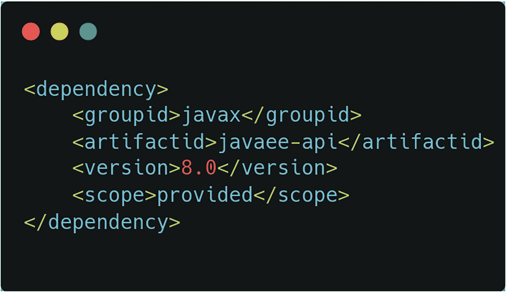
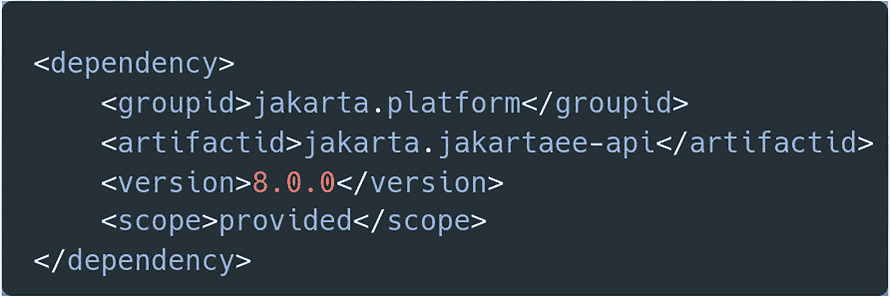
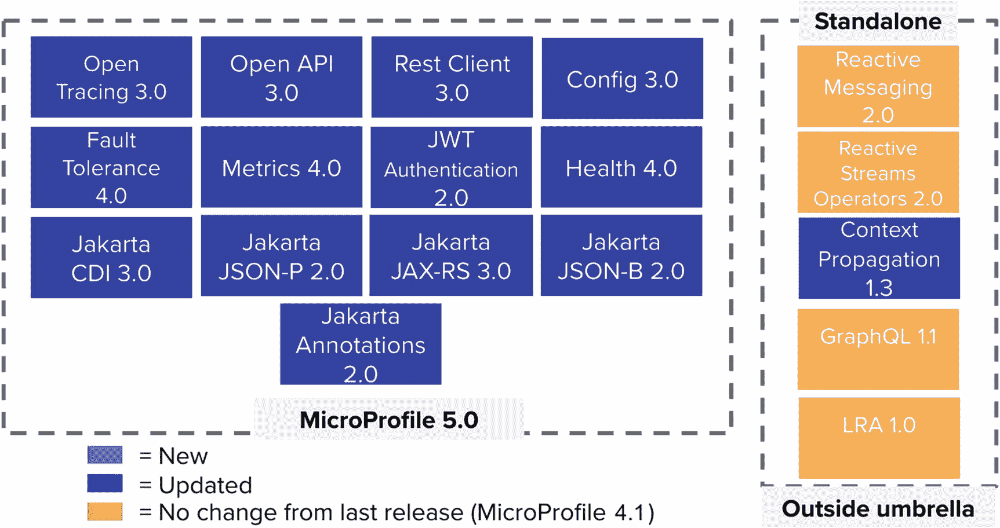

# 1. Jakarta EE 与 MicroProfile 理论

Jakarta EE（原 Java EE）是一套由社区开发的抽象规范，共同构成了一个用于开发端到端、多层企业级应用的平台。Jakarta EE 构建于 Java 标准版之上，旨在提供一个稳定、可靠且供应商中立的平台，用于开发云原生应用。

本章将讨论围绕 Java 企业级开发平台的一般理论。与 Java 企业版相关的术语包含大量可能不太清晰的技术词汇。本章将把 Java EE（现为 Jakarta EE）分解为其理论形式，以便在本章结束时，您能熟悉大量与 Java 企业版相关的术语。

## 什么是规范？

Jakarta EE 由多个独立的规范组成，每个规范涵盖一个特定的 API，例如 Jakarta WebSocket，它负责提供一个 API，用于编写支持通过平台上的 WebSocket 协议进行通信的应用。这些独立的规范被分组到给定 Jakarta EE 版本的单个“总括”规范中。例如，最新版本 Jakarta EE 10^(¹) 是在总括规范 10 下发布的。

规范是一份文档，概述了给定 API 集合的功能。该文档概述了在给定 API 的各种场景和调用下，预期行为应该是什么。规范本身可以被视为 API 的蓝图。Jakarta EE 规范的对应物是该规范的实现。由于规范仅说明 API 的期望和功能是什么，因此该规范的实现是在开发人员调用该规范中的任何给定 API 时，实际实现这些期望和功能的工作。

规范及其相应的实现通常是分离的。对您作为开发人员而言，这意味着您可以简单地针对“抽象”规范（蓝图）进行编码，并使用不同的实现来运行您的代码。这意味着您可以自由选择适合您需求的实现，而无需重写代码。对于实现供应商而言，这意味着更多的竞争，并最终在基础规范之上实现更好、更快的创新。

过去，各种（Java EE）规范版本是在 Java 社区流程（JCP^(²)）的 Java 规范请求（JSR）下发布的。JSR 是一个流程，任何感兴趣的人（个人或注册实体）向 JCP 的项目管理办公室提交一份文档，提议开发一个新的规范或对现有规范进行重大修订。从规范文档的提议到最终发布和参考实现，整个过程都是 JSR 的一部分。

作为一个总括 JSR，Java EE 本身有一个以 GlassFish 应用服务器形式存在的参考实现。该实现是作为其他总括规范实现基础的“参考”。多年来，已经出现了许多 Java EE 完整实现，包括 WildFly、Open Liberty 和 Payara 等。

从 Java EE 8 版本开始，规范流程与 GlassFish 项目一起从 JCP 转移到了 Eclipse 基金会。参考实现的概念也变更为兼容实现，以更好地反映对跨供应商中立性和兼容性的关注。然而，为了更好地理解 Jakarta EE 是什么以及它是如何形成的，需要回顾一下 Java EE 版本的历史，以便更好地理解 Jakarta EE 作为当今平台的背景和目标，以及其发布流程与 JCP 下的流程有何不同。

## Java EE 版本历史

### Java 2 平台企业版（J2EE 1.2）

该平台的第一个版本于 1999 年 12 月 12 日发布，称为 Java 2 企业版，简称 J2EE。它以 1.2 版本的形式发布了该平台的初始规范。这个当时新颖的平台的关键特性之一是 Enterprise JavaBeans 的概念。EJB API 旨在使将复杂业务逻辑封装在由专用运行时管理的组件中变得容易。该运行时为 EJB 组件提供了事务、安全性和可伸缩性等辅助服务。

### Java 2 平台企业版（J2EE 1.3）

Java 企业平台的下一版本是 1.3，于 2001 年 9 月 24 日发布。它包含在总括 JSR 58 中。此版本的关键特性是引入了新的 Java 连接器架构（JCA）和 Java 消息服务（JMS）API。EJB API 也得到了改进。

### Java 2 平台企业版（J2EE 1.4）

该平台的下一版本 J2EE 1.4 于 2003 年 11 月 11 日发布。此版本包含在总括 JSR 151 中。此版本的关键特性是“遵循 Web 服务互操作性组织（WS-I）的基本概要 1.0 文档，以实现可互操作的 Web 服务。”^(³)

### Java 平台企业版（Java EE）5

该平台的下一版本经历了品牌重塑，从 Java 2 企业版更名为 Java 平台企业版。这本来是 J2EE 1.5，因此，自然就变成了重新命名的版本 Java EE 5。此版本在总括 JSR 244 下发布，引入了 Java 注解，并于 2006 年 5 月 11 日发布。

### Java 平台企业版（Java EE）6

Java EE 6 于 2009 年 12 月 10 日在总括 JSR 316 下发布。此版本是 Sun Microsystems 被 Oracle 收购前一年在其旗下的最后一个主要版本。其主要特性是引入了 CDI 管理的安全性和 REST API。

### Java 平台企业版（Java EE）7

在 Java EE 6 发布近四年后，Java EE 7 于 2013 年 5 月 28 日在总括 JSR 342 下发布。此版本引入了 WebSocket 和 JSON 处理 API，并增强了 JSF API 中的 HTML5 支持。此版本也具有里程碑意义，因为它是 Oracle 收购 Sun Microsystems（迄今为止 Java 平台的商标所有者）后的第一个主要 Java EE 版本。

### Java 平台企业版（Java EE）8

在 Java EE 7 发布四年多后，Java EE 8 于 2017 年 8 月 31 日在总括 JSR 366 下发布。此版本的关键特性是 HTTP/2 和基于 CDI 的安全性。Java EE 8 是一个非常重要的版本，部分原因是由于来自 Jakarta EE 大使（原 Java EE 守护者^(⁴)）等基层社区团体的巨大压力，迫使 Oracle 完成了该版本的发布。这导致该版本的范围被缩减。

## 从 Java EE 到 Jakarta EE

从前面按时间顺序发布的版本历史可以看出，每个版本之间的间隔年份越来越长，最终导致 Java EE 7 和 8 之间出现了超过四年的空白期。在像 Java 平台这样快节奏的生态系统中，版本之间间隔四年^(⁵)是一个巨大的鸿沟。这促使社区呼吁 Oracle 明确其对企业级 Java 平台的意图，因为该平台是 Oracle 收购 Sun Microsystems 时继承而来的。在社区看来，Oracle 似乎已经放弃了 Java EE。由于 Java EE 拥有广泛且深入的 API 集，甚至非 Java EE 产品也构建于此之上，因此 Java EE 的消亡对整个生态系统将是灾难性的。本质上，Java EE 构成了 Java 领域大部分企业级开发市场的基础。

然而，在 2017 年晚些时候，在 Java EE 8 发布之后，Oracle 决定将 Java EE 平台转移到一个开源基金会，使其成为一个完全由社区驱动的开发平台。此次转移包括了 Java EE 平台规范以及完整的测试兼容性工具包 (TCK)。在与 Java EE 的主要参与者 RedHat 和 IBM 协商后，Eclipse 基金会被选为 Java EE 平台的新归属地。

此时，Java EE 平台已有近二十年的历史，这意味着将如此庞大的平台从专有实体转移到开源基金会是一项艰巨的任务。一个值得注意的障碍涉及知识产权和商标权。为了使转移尽可能易于管理，该过程被分解为三个主要阶段^(⁷)，即：

1.  转移 API 和实现代码
2.  转移测试兼容性工具包 (TCK) 代码，制定新的规范流程
3.  重构 API 包名，转移并更新规范文档

### 转移 API 和实现代码

如前几节所述，Jakarta EE 由各个独立的规范组成，每个规范在转移到 Eclipse 基金会之前可能已经发布了 N 个版本。决定只将每个规范的最新发布版本转移到 Eclipse 基金会。创建了顶级 Eclipse 项目 Eclipse Enterprise for Java (EE4J^(⁸))，并配有相应的 GitHub 组织 eclipse-ee4j^(⁹)，作为这些规范及其实现的家园。

在 Eclipse 基金会有了新家之后，转移的代码使用 Eclipse 基金会的服务器和基础设施进行构建，结果被暂存到一个 Maven 仓库，其 groupId 从 javax.* 更改为 jakarta.*。这个 groupId 的更改意义重大，因为 Eclipse 基金会由于法律限制不能使用 javax 命名空间。从这些新的构件中，生成了参考实现（现在称为 Eclipse GlassFish）的新构建，并在 Java EE 8 TCK 上运行。

随着 Eclipse GlassFish 构建通过 TCK，它于 2019 年 1 月 29 日作为版本 5 发布。这个在 jakarta.* 包和 jakarta groupId 下的发布，在技术上仍然是 Java EE，因为它通过了 Java EE 8 认证。这仅标志着 Java EE 平台从 GitHub 上新的 Eclipse 基金会 EE4J 项目发布，而不是从 Java EE 项目发布。另请注意，构成 Java EE 平台的各种规范的早期版本，均不由 Eclipse 基金会作为平台的一部分进行管理或维护。

### 转移测试兼容性工具包 (TCK) 代码，制定新的规范流程

此阶段涉及转移 TCK，并从中为新的 Jakarta EE 版本规范构建新的二进制文件。此阶段还引入了新的 Jakarta EE 规范流程 (JESP)^(¹⁰)。新的 JESP 本身采用了现有的 Eclipse 基金会规范流程 (EFSP) v1.2^(¹¹)，并做了一些修改。与 JESP 一起发布的还有 Eclipse 基金会技术兼容性工具包许可证^(¹²)。

这两个法律框架共同指导着 Jakarta EE 规范的开发和兼容实现的发布，整个过程由 Eclipse 基金会端到端管理。新的 Jakarta EE 实现必须通过 TCK，才能被认证为该平台的兼容实现，并有资格^(¹³)被列入 Eclipse 基金会的 Jakarta EE 下载页面^(¹⁴)。JESP 的目标是尽可能轻量级，鼓励采用“代码优先”的方法来开发平台，从而允许更多的实验和更快的迭代。

请注意，在 Eclipse 基金会的背景下，我们一直使用术语“兼容实现”，而在此之前，在 JCP 的 Java EE 中，我们使用术语“参考实现”。这是因为在 Eclipse 基金会，为了支持兼容实现，已经废除了“参考”实现的概念。目标是使认证过程尽可能简单快捷，并创造一个更公平的竞争环境，从而推动实现生态系统的创新。

此过程的后续步骤包括更新各种 API 的 Javadoc，重新许可生成的 JAR 文件，并使用从新转移的 TCK 构建的二进制文件，针对 GlassFish 5.1 版本进行测试。所有这些工作的结果是，Java EE 首次作为新转移的 Jakarta EE 版本 8 发布。此版本的正式发布日期是 2019 年 9 月 10 日。请注意，Jakarta EE 8 的发布仍然使用 GlassFish 5.1 作为兼容实现。此外，此版本没有引入任何新的 API。这仅仅是“引擎盖下”的更改，标志着该平台在 Eclipse 基金会管理下的首次完整发布。

Java EE 向 Eclipse 基金会转移的这个阶段，还修订并重命名了各种 API，使其命名约定更加一致。例如，Java 持久化 API (JPA) 被重命名为 Jakarta Persistence。用于容器的 Java 身份验证 SPI (JASPIC) 变成了 Jakarta Authentication，而其对应的用于容器的 Java 授权契约 (JACC) 变成了 Jakarta Authorization。上下文和依赖注入 (CDI) API 变成了 Jakarta Contexts and Dependency Injection。这种简化的命名约定使得仅通过名称就能轻松掌握平台众多的 API。

直到转移的这个阶段，要在该平台上开发应用程序，您需要使用图 1-1 中所示的依赖项。

6 行代码描述了 Java E E 依赖项。提到的 group I D 和 artifact I D 分别是 javax 和 java e e- a p i。

图 1-1
Java EE 依赖项

Jakarta EE 8 发布后，Maven 坐标更改为图 1-2 中所示的依赖项。

6 行代码描述了 Jakarta E E 依赖项。提到的 group I D 和 artifact I D 分别是 Jakarta dot platform 和 Jakarta dot Jakarta e e, a p i。

图 1-2
Jakarta EE 依赖项

Jakarta EE 8 是 Java EE 的直接替代品，这意味着您无需对代码进行任何形式的重构或更改 API 即可切换，因为各种 API 仍然位于 javax.* 包中。将它们更改为 jakarta.* 将我们引向转移过程的最后一步。

### 重构 API 包名、迁移与更新规范文档

此阶段的迁移过程涉及将所有 API 包重命名为 `jakarta.*` 命名空间。例如，Jakarta Persistence 中的实体管理器从 `javax.persistence.EntityManager` 迁移至 `jakarta.persistence.EntityManager`。此步骤产生的版本是 Jakarta EE 9，^(¹⁵) 五个月后发布了 Jakarta EE 9.1。该版本与之前的版本 8 几乎相同，显著区别在于包名的变更以及对 Java 11 的基础支持。

鉴于大多数生产系统仍广泛使用 Java 8，这些 API 仍可在 JDK 8 下编译，但实现必须通过运行在 JDK 11 上的 TCK 测试。一些从 Java EE 迁移到 Java SE 并在 JDK 11 中被再次移除的规范被重新添加，其中部分为强制规范，部分为可选规范。例如，Jakarta Activation 和 Jakarta XML Binding 分别被添加为强制规范和可选规范。Eclipse GlassFish 版本 6 也作为 Jakarta EE 9 的首个兼容实现发布。

此外，在此迁移步骤中，规范文档的代码也被迁移，这标志着最后一件需要迁移到 Eclipse 基金会的人工制品已完成，并预示着迁移过程的结束。这最后一步及其在 Jakarta EE 9 发布中的最终成果，主要针对工具生态系统，旨在使其准备就绪、更新并扩展以支持新平台。对于作为开发者的你而言，Jakarta EE 9 与 Jakarta 和 Java EE 8 完全相同。不过，从平台的先前版本升级到 Jakarta EE 9 将导致代码需要进行重要的重构，因为包名发生了变化。幸运的是，有一些工具^(¹⁶) 可以自动完成迁移，使其尽可能顺利和简单。

## Jakarta EE 10 及未来展望

2021 年 8 月 24 日，Jakarta EE 规范委员会^(¹⁷) 通过正式投票批准了 Jakarta EE 10 发布计划 ^(¹⁸)。该计划由 Jakarta EE 社区在同年 6 月至 8 月期间创建、讨论、审查和修订。发布计划概述了发布时间线、范围、可交付成果以及各个规范的期望细节。版本 10 的预期发布日期是 2022 年第二季度。

Jakarta EE 10 预计将继续推动平台向适用于现代企业应用开发的云原生平台演进。此版本的一个显著特性将是支持 Java 17，即基础 Java SE 平台的当前长期支持版本。尽管 Java 11 是最低要求版本，但兼容实现必须通过使用 Java 17 执行的 TCK 测试。

这将极大地便利企业采用最新的 JDK，从而整体上受益于 Java 平台更快的特性迭代。作为开发者，你也将能够在应用开发中使用新特性，而无需担心与你选择的 Jakarta EE 兼容实现的兼容性问题。

此版本的另一个可能显著亮点是引入 Jakarta Core Profile。Jakarta EE（以及之前的 Java EE）一直都有“配置文件”，其中构成完整平台的一部分规范被组合在一起，以服务于狭窄、通用的开发目的。这些配置文件如下：

*   **Web** – 此配置文件包含一组面向主要开发 Web 应用（如 Jakarta Faces）的平台 API 和技术。此配置文件适用于不需要平台上全套 API 的开发者。你只需要一个像 Apache Tomcat 这样的 Servlet 容器即可运行此配置文件。

*   **Full** – 此配置文件包含平台上所有可用的 API 和技术。它面向企业环境中开发多层应用的开发者。需要一个像 WildFly^(¹⁹) 这样的完全兼容平台实现来运行此配置文件。

Jakarta EE 10 的目标是可能在现有两个配置文件之外发布核心配置文件。什么是核心配置文件？它是平台 API 的另一个子集，包含旨在开发现代、云原生、微服务应用的“核心”API，这些应用将通过 Docker 等容器平台部署到 Kubernetes 等云应用编排平台。预计将成为核心配置文件一部分的 API 列表如下：

*   Jakarta EE Core Profile
*   Jakarta Annotations
*   Jakarta Contexts and Dependency Injection Lite
*   Jakarta Dependency Injection
*   Jakarta Expression Language
*   Jakarta Interceptors
*   Jakarta JSON Binding
*   Jakarta JSON Processing
*   Jakarta RESTful Web Services

这些 API 与 Eclipse MicroProfile^(²⁰) 项目结合使用时，构成了开发云原生企业 Java 应用的基础。然而，此配置文件对于 Jakarta EE 10 而言仍是暂定的，只有当核心配置文件规范的发布计划^(²¹) 及时获得批准时才会被包含在内。

## Jakarta EE 与 Eclipse MicroProfile

Jakarta EE（以及其前身 Java EE）是 Java 生态系统乃至整个软件开发行业中一个非常关键的平台。考虑到众多项目、框架和库的存在与发展都归功于 Jakarta EE（及其“前身”J2EE）平台，毫无疑问，Jakarta EE 是任何 Java 开发者工具箱中的重要工具。

在过去的几十年里，软件开发已经从单一的大型集中式应用演变为当前分布式、容器化、云原生的微服务范式。Jakarta EE 诞生于单体架构占主导地位的软件开发时代。因此，它的演进始终更侧重于优化单体应用的开发。这并非意味着你不能单独使用 Jakarta EE 来开发微服务。你完全可以。

正如我们在前几节中讨论的，Jakarta EE 是通过 Java 社区流程（JCP）开发的。这个流程并未完全优化到能跟上软件开发演进的速度。正如你在 Jakarta EE（或者更准确地说，当时的 Java EE）的发布历史中所见，每次发布之间的间隔越来越长，而软件开发行业的变化速度却越来越快。这自然导致了一个结果：在某个时间点，Jakarta EE 每次发布都需要在行业中追赶更多的变化。

尽管你可以使用标准的 Jakarta EE API 来开发微服务，但各个平台运行时并没有得到清晰、标准化的支持定义。这意味着每个应用服务器都以一种不可移植、非供应商中立的方式实现了对使用 Jakarta EE 开发微服务的支持。这可能导致在该平台上开发云原生微服务应用的支持变得支离破碎、缺乏一致性。Oracle 在 Java EE 7 和 8 之间对该平台不明确的策略也无助于维持对该平台的信心。

正是在这种背景下，应用服务器供应商和各个 Java 用户组联合起来，试图通过一套独立的、面向开发云原生微服务企业级 Java 应用的规范来增强现有的 Jakarta EE 平台。在 2016 年的 JavaOne 大会上，Eclipse MicroProfile 项目被宣布为一个新的协作项目，旨在提供典型微服务应用所需的一组 API。

Eclipse MicroProfile 项目建立在 Jakarta EE 平台之上，是一套标准化的规范，包含平台 API 的一个子集，以及独立开发的规范，旨在提供一种标准、可移植、供应商中立的方式来构建现代的、云优先的微服务应用。该项目的 1.0 版本包含了 CDI、JAX-RS 和 JSON-P API。因此，Eclipse MicroProfile 的出现是为了扩展 Jakarta EE（或者，再次强调，更准确地说是当时的 Java EE）平台，以适应现代应用开发范式。

在 Eclipse MicroProfile 宣布之时，Jakarta EE 平台仍然通过 JCP 进行开发。在这方面，EMP 的关键目标之一是在 JCP 中创建 JSR，使用已开发的 EMP（Eclipse MicroProfile）规范，并由 Eclipse 基金会担任提议的规范领导者。该项目旨在快速推进，并允许更快速、更频繁的发布节奏，以跟上不断发展的行业步伐。贡献几乎没有障碍。你所要做的就是 fork GitHub 上的沙盒仓库^(²²)，实现你的想法，然后将其作为拉取请求提交以获取反馈和迭代。

EMP 的另一个主要目标是消除 Jakarta EE 是“重量级”的观念，即认为你需要一个功能完备的兼容应用服务器才能运行它。尽管现代全功能 JEE（Jakarta EE）兼容运行时非常精简和轻量，但过去使用该平台早期版本（J2EE 时代）及其配套应用服务器时的主要痛点仍然挥之不去。因此，EMP 旨在为供应商提供更小的实现要求，以帮助使其运行尽可能快速和轻量。

EMP 发布一年后，Oracle 宣布将 Java EE 移交给 Eclipse 基金会。其结果是，EMP 的父平台最终也回到了同一个实体。尽管这两个项目现在由同一个基金会管理，但它们作为独立演进的规范被保留下来。JEE 现在将以比其在 JCP 时更快的速度演进，但仍慢于 EMP。其目标是让 JEE 平台保持成熟、稳定和可靠，成为各种规模企业都信赖的开发平台，同时仍然能够更快地融入经过测试且被行业接受的现代范式。

Eclipse MicroProfile 的当前版本是 5，如图 1-3 所示，总共包含 18 个 API：13 个核心 API 和 5 个独立 API，如下图所示。

EMP 规范示意图展示了 18 个 API，其中包括 MicroProfile 5.0 的 13 个核心 API 和 5 个独立 API。

图 1-3

Eclipse MicroProfile 规范

如你所见，EMP 包含面向微服务开发的 API。让我们简要了解一下每个 API。本书的其余部分将详细介绍 JEE 和 EMP。

### OpenTracing^(²³)

OpenTracing API 提供了一个用于追踪请求流经各种服务边界的 API。在典型的微服务环境中，你将拥有一定数量的、相互依赖的独立服务，它们协同工作以实现特定的应用目标。EMP 的 OpenTracing API 遵循 OpenTelemetry ^(²⁴)（现已归档的 OpenTracing 的超集）规范。

### OpenAPI^(²⁵)

EMP 的 OpenAPI 规范旨在为 OpenAPI 规范提供一个统一的、供应商中立的 Java API。OpenAPI 规范（v3^(²⁶)）描述了应用开发者如何发布应用 API 文档供其客户端使用。

### Rest Client^(²⁷)

EMP Rest Client 是一个提供类型安全方式来调用 REST 服务的 API。它使你无需处理将调用与 RESTful Web 服务相互转换为其各自 Java 类型所需的底层工作。

### Config^(²⁸)

EMP Config API 提供了一种灵活、简单且可扩展的方式来管理应用配置。它为你提供了一种管理各种配置变量源以及将不同源映射到不同部署场景的方法。

### Fault Tolerance^(²⁹)

EMP Fault Tolerance 规范定义了一个灵活、易用的系统，用于构建有弹性的微服务。它提供了用于管理微服务应用中的超时、重试、回退、熔断和隔离舱的 API 构造。

### Metrics^(³⁰)

Metrics 规范提供了一种通过定义良好的端点来暴露应用和系统指标的方法。Metrics API 并非 JMX^(³¹) API 的替代品。其目标是在多语言环境中提供一种简单的方法来收集和监控应用指标。

### JWT 认证/传播^(³²)

JWT 规范提供了一种方法，让你能够使用基于 OpenID Connect 的 JSON Web Token，对微服务端点进行基于角色的访问控制。由于采用 RESTful 架构的服务是无状态的，因此需要始终向每个被调用的端点传递某种形式的安全上下文，以便创建和验证安全上下文。JWT 规范旨在帮助你以标准、可移植且可预测的方式实现这一目标。

### 健康检查^(³³)

EMP 健康检查规范提供了一种简单的机器对机器机制，用于验证微服务的可用性。它提供了一种方式，让服务能够回答一个简单的问题：你是否可用并准备好接受请求？这在容器化的云环境中尤为关键，因为在此类环境中，有像 Kubernetes 这样的编排器负责销毁和配置服务。

### CDI^(³⁴)

EMP 项目将 Jakarta 上下文与依赖注入规范作为默认的依赖注入机制提供。CDI 为你提供了一种构建松耦合应用程序的方法，它让你无需管理应用程序组件之间的各种相互依赖关系。

### JSON-P^(³⁵)

Jakarta JSON 处理规范提供了一套与供应商无关的 API，用于使用流式或对象模型来解析、生成、转换和查询 JSON 数据。JSON-P 是 EMP 实现必须支持的 Jakarta EE 平台规范之一。

### JAX-RS^(³⁶)

Jakarta RESTful Web 服务是 EMP 项目附带的另一项 Jakarta EE 规范。JAX-RS 规范定义了一套 API，用于开发由 Roy Fielding 博士定义的 REST 架构风格的 RESTful Web 服务。^(³⁷)

### JSON-B^(³⁸)

Jakarta JSON 绑定是 EMP 实现必须支持的另一项规范。JSON-B 提供了一套 API，用于以透明的方式自动将 Java 对象绑定到 JSON 文档，并可根据你的需求进行自定义。

### 注解^(³⁹)

Jakarta 注解是每个 EMP 实现都附带的另一项 Jakarta EE API。该规范定义了用于 Jakarta EE 平台上更广泛的组件技术的注解。作为一个主要基于注解/元数据驱动的平台，该规范旨在提供一个统一的基础规范，平台上的其他各种注解驱动规范可以基于此创建自己的注解。

上述规范共同构成了用于创建云原生应用程序的完整 EMP API 套件。所有 EMP 实现都支持这些规范。还有其他一些可选规范，实现并非必须支持，如上一张图中的“保护伞外”所示。与更广泛的 Jakarta EE 平台一起，在 Java 平台上开发企业级、供应商中立的应用程序再次变得令人兴奋。作为开发者，掌握使用 Jakarta EE 进行应用程序开发，将使你具备能够轻松迁移到其他平台（如 Spring 框架）的技能。

## Jakarta EE 与 Spring 框架

如果不提及 Spring 框架，关于 Jakarta EE 理论和历史的讨论将是不完整的。^(⁴⁰) Jakarta EE（或者更准确地说，它的前身 J2EE）在其早期历史上并不是最高效或最易用的开发平台。它需要通过 XML 文件进行大量手动配置，并且要求你的组件扩展平台中的构件等。因此，该平台以晦涩难懂而闻名，只有那些有大量资金投入开发人员的大公司才会使用。

自然，有很多书籍出版了关于如何在该平台上进行开发的内容。其中一本引人注目的是 Rod Johnson 于 2002 年 10 月出版的 *Expert One-on-One J2EE Design and Development* ^(⁴¹)。在这本书中，Rod 提出了增加使用依赖注入和普通 Java 对象（POJO）的想法，以取代 J2EE 那种手动配置、管理以及将应用程序依赖与基础设施代码混合的方式。他在整本书中构建的示例应用程序中演示了这一点：一个在线座位预订应用程序，其基础设施代码超过 30K^(⁴²) 行。应用程序代码的一个重要部分是他关于清晰分离应用程序代码和基础设施代码思想的实现。

该书的出版商 Wrox 为其设立了一个页面^(⁴³)，提供示例代码下载，并附有勘误表和用户论坛。这本书取得了成功。书中提出的理念引起了当时许多 J2EE 开发者的共鸣。人们开始在个人项目中使用已发布代码的部分内容。2003 年初，开发者 Juergen Hoeller 和 Yann Caroff 与 Rod 联手，将书中开发的基础设施代码创建为一个开源项目。这个项目被命名为 Spring，这个格言暗示着在 J2EE 的“冬天”之后迎来一个全新的开始。

这个新的、替代性的企业级 Java 开发框架的 0.9 版本于 2003 年 6 月发布。次年 3 月，Spring 1.0 发布。这个新框架一炮而红，并且在很大程度上让人耳目一新，因为当时 J2EE 是在 Java 平台上开发非平凡企业应用程序的唯一可靠方式。可以公平地说，Spring 框架的存在归功于当时 J2EE 平台的局限性。

在接下来的几年里，随着 J2EE 演变为 Java EE，它开始变得更好。受 Spring 框架的启发，该平台越来越以元数据驱动，严重依赖注解来进行各种配置，并且在开发者没有明确指令的情况下，默认采用可预测性更高的默认值。到 Java EE 7 发布时，与 J2EE 时代相比，该平台在开发者生产力方面已完全不同。上下文与依赖注入等规范的出现、EJB API 的精简和“去臃肿化”，以及对 XML 配置文件依赖的减少，在某种程度上实现了 Rod 书中最初提出的模式。

与此同时，Spring 框架已经发展成为一个比其最初版本大得多的开发平台。它已经超越了其最初作为控制反转^(⁴⁴)（IoC）容器的功能，包含了涵盖端到端应用程序开发全范围的 API。随着其广度的增长，配置其各种组件的需求也随之而来。渐渐地，对 XML 配置文件的需求开始重新出现，甚至到了与早期 J2EE 相差无几的地步。

虽然 Java EE 已经成为一个几乎完全由元数据驱动的平台，你只需一个依赖项就能让一切自动配置并可用，但 Spring 却变得更加依赖开发者通过 XML 配置文件来配置其各种组件。公平地说，Spring 最初是基于 Java Servlet 规范的，这意味着一个典型的 Spring 开发者需要了解 Servlet 和 Spring 的配置。实际上，使用 Spring 进行应用开发已经变得几乎和 J2EE 时代一样复杂^(⁴⁵)。

2012 年 10 月，Mike Youngstrom 在 Spring Jira 看板上提出了一个问题^(⁴⁶)，讨论如何简化 Spring 配置。他写道：“我认为，如果能够提供工具和一个参考架构，从上到下利用 Spring 的组件和配置模型，那么 Spring 的 Web 应用架构可以显著简化。将那些常见 Web 容器服务的配置嵌入并统一到一个从简单的 `main()` 方法启动的 Spring 容器中。”正是在这个讨论串中，Spring Boot 被提及^(⁴⁷)，当时它还是一个旨在解决 Mike 所提出的复杂性问题的新生项目。因此，Spring Boot 作为 Spring 框架的一个子项目，其诞生就是为了解决其父项目的不足，正如父项目诞生是为了解决开发者在使用当时 J2EE 时所面临的挑战一样。

如今，Jakarta EE 和 Spring 都是同样优秀且高效的、旨在让开发者生活更轻松的企业级 Java 应用开发平台。这两个平台都有着相互影响、不断创新并在每个版本中变得更好的历史。这场“创新竞赛”的最终赢家是你，开发者。实在没有必要在某些角落进行关于谁优谁劣的激烈争论。这两个平台都源于 J2EE 平台，因此它们更多的是互补而非竞争关系。作为一名 Java 开发者，你对 Jakarta EE 的了解可以轻松地迁移到 Spring 平台，只需付出极少的努力。了解这两个平台的历史，对于认识它们的相似性而非差异性至关重要。由于本书是关于 Jakarta EE 的，让我们简要探讨一下为什么你应该学习在该平台上进行应用开发。

## 为什么选择 Jakarta EE？

到目前为止，你已经对 Jakarta EE 的历史及其与 Eclipse MicroProfile 的关系进行了一次历史性的回顾。你也从 Jakarta EE 的角度审视了 Spring。这两个平台共同构成了 Java 生态系统中企业应用的主流选择。Java 平台当然还有更多的框架可用于开发各种类型的应用。

作为一名 Java 开发者、CTO 或企业的平台架构师，面对众多的软件开发框架和平台，你可能会感到难以抉择。你可能会问自己一个问题：为什么我应该选择 Jakarta EE 作为我的主要软件开发平台？是什么让它成为更好的选择？

至少有以下几个理由值得你尝试 Jakarta EE，其中关键包括：

*   标准化
*   开放性
*   稳定性
*   开发便捷性
*   可移植性
*   按需选择——坦克或手枪
*   出色的文档

### 标准化

在移交至 Eclipse 基金会之前，平台上的每一个规范都经过了严格的流程，包括公众审查和 JSR 专家组审查，最终由 JCP EC 投票决定。在 Eclipse 基金会，新的规范发布同样会经历类似的同行评审机制^(⁴⁸)。这确保了构成平台的所有规范都在向后兼容性、对 Java 平台整体的益处以及满足明确定义的技术标准方面经过了权衡。你可以信赖 Jakarta EE 规范将在很长一段时间内可用且可靠。这对于生命周期长的企业应用尤其重要。你也可以确信，任何给定的 API 调用在平台的不同兼容实现中都会以相同的方式可预测地运行。

### 开放性

Jakarta EE 规范是通过 Jakarta EE 规范流程，采用“代码优先”的方法制定的。这个过程简单且开放，任何对推进该平台感兴趣的人都可以以规范的形式做出贡献。采用“代码优先”意味着你从提案的实际代码开始，让其接受审查，并及时获得反馈。这确保你不会投入资源经历整个贡献流程，最终却发现你的贡献或规范未被接受。

### 稳定性

Jakarta EE 作为一个标准，意味着 Eclipse 基金会只会接受和标准化经过行业验证和测试的技术。对于需要长期维护的应用，没有空间去使用那些明天就可能消失的流行技术。每一项 Jakarta EE 技术都经过了行业的验证和测试（既通过了 TCK 测试，也在生产环境中得到验证），并且是长期存在的。另一方面，那些较新、不够成熟且快速发展的技术，则是 MicroProfile 项目的完美候选，该项目在 Jakarta EE 平台之上构建并与之良好集成。因此，如果你的应用需要，你仍然可以访问并依赖那些前沿的 API。

### 开发便捷性

使用 Jakarta EE 和 Eclipse MicroProfile 进行应用开发非常轻松。你只需要一个应用服务器或符合 Jakarta EE 规范的运行时，以及一个（或两个）Maven 依赖项。最小化配置、约定优于配置、极少甚至无需 XML，以及可预测且可靠的默认设置，这些都是 Jakarta EE 平台开箱即用的优势。例如，对于快速原型开发，JEE 规范提供了一个默认的数据源，你可以直接使用，无需进行任何配置。

### 可移植性

Jakarta EE 作为一个标准，意味着只要开发者按照标准进行编码，你的应用就应该能够在标准的不同兼容实现之间运行，只需进行最少甚至无需配置更改。这一点很有吸引力，因为你不会被锁定在任何特定的 Jakarta EE 应用运行时供应商。只要你使用标准的 Jakarta EE API，你的代码就可以在各种应用服务器之间移植。

### 按需选择——坦克或手枪

Jakarta EE 与 Eclipse MicroProfile 项目相结合，是一个庞大的平台，可能看起来令人生畏。但你可以根据应用需求，从该平台中选择所需的任何 API。你可以像使用坦克或手枪一样使用这个平台——由你决定。如果你选择使用整个平台，所有不同的 API 会作为一个整体集成在一起；如果你选择精挑细选，它们也可以独立存在。作为一组抽象规范，兼容的实现提供了运行应用所需的一切；你只需交付你的代码。因此，你最终会得到更轻量的部署工件，其中大部分是你的代码。

### 出色的文档

Jakarta EE 是一个组织良好的社区项目，拥有海量的文档。值得注意的是 Jakarta EE 教程^(⁴⁹)，这是官方的 Jakarta EE 手册。此外，还有许多社区和企业组织的会议，如 Devoxx 和 Oracle JavaOne^(⁵⁰)，都非常重视服务器端 Java 开发。还有像你正在阅读的这本书一样，由个人开发者撰写的书籍，都专注于帮助你成为一名基础扎实的企业级 Java 软件开发者。

## 总结

在本章中，我们一同踏上了 Jakarta EE 历史的漫长旅程，从其早期的 J2EE 迭代一直追溯至如今的 Jakarta EE。如今的 Jakarta EE 平台与其前身 J2EE 相比已截然不同。结合 Eclipse MicroProfile，JEE 平台已成为一个现代、强大、高效且易于使用的企业级云原生应用开发平台，值得投入学习。现在您已掌握了理论基础，本书的其余部分将教授您必要的实践技能，帮助您成为使用久经考验的 Jakarta EE 平台的专业企业级云原生 Java 应用开发者。我们第 2 章见。

脚注 1   2   3   4   5   6   7   8   9   10   11   12   13   14   15   16   17   18   19   20   21   22   23   24   25   26   27   28   29   30   31   32   33   34   35   36   37   38   39   40   41   42   43   44   45   46   47   48   49   50

