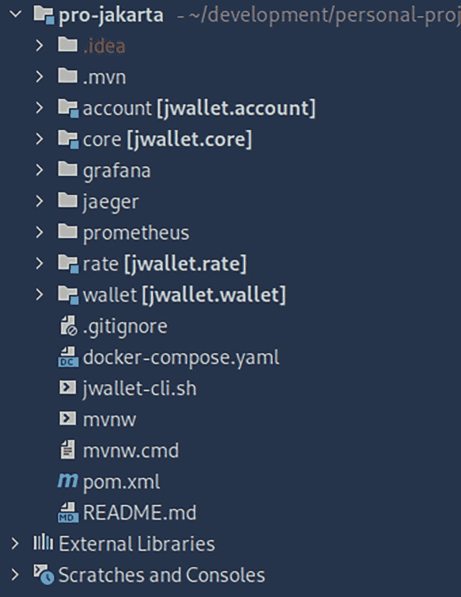
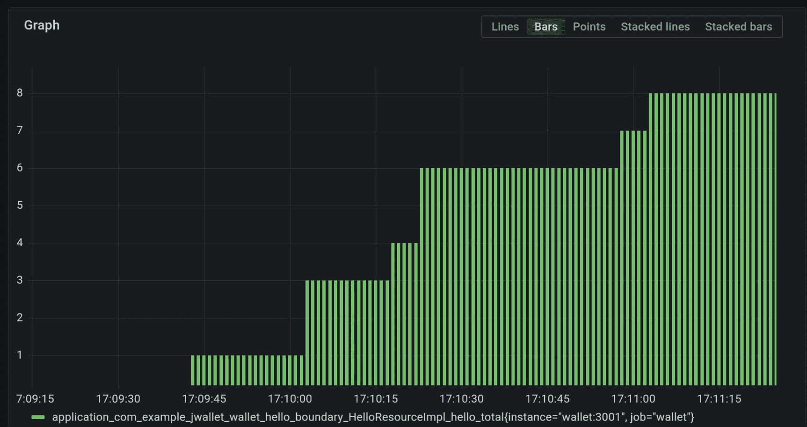
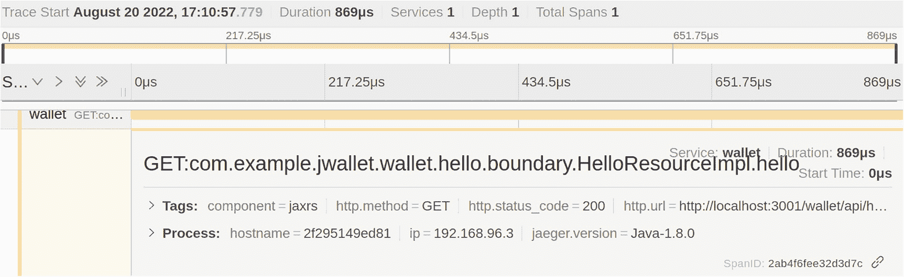
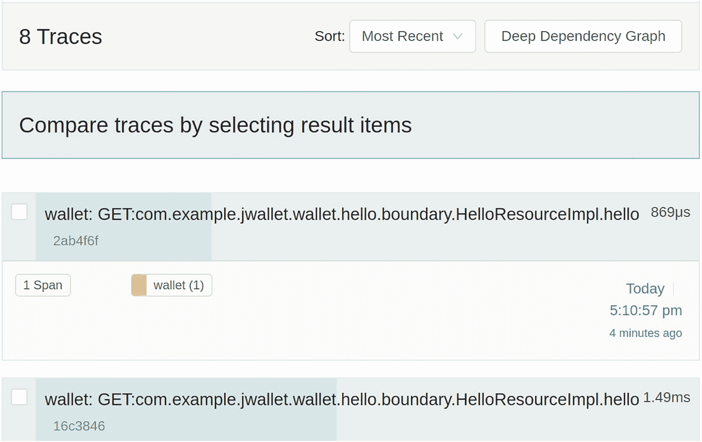
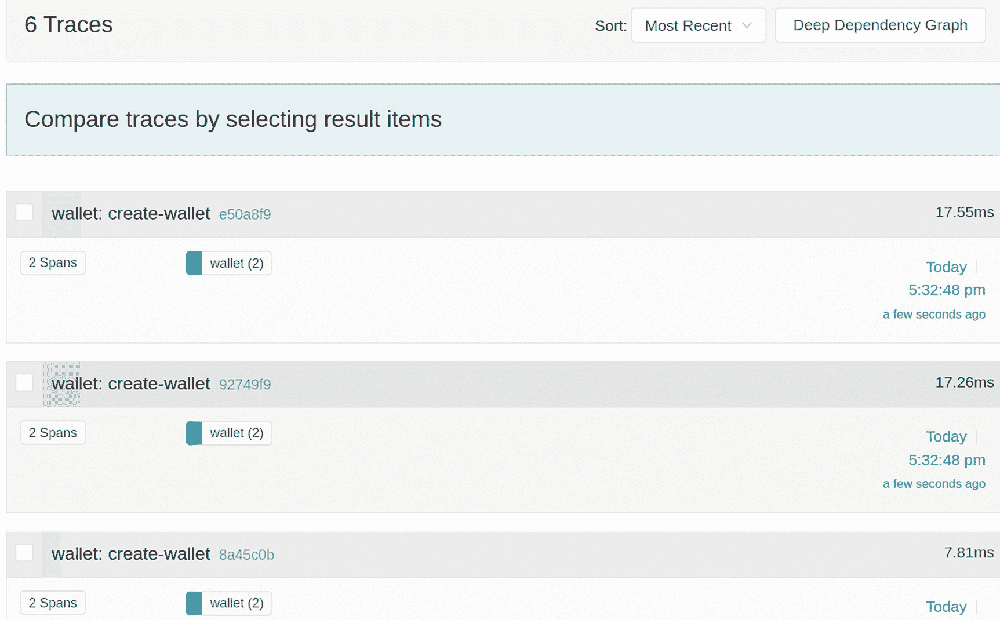
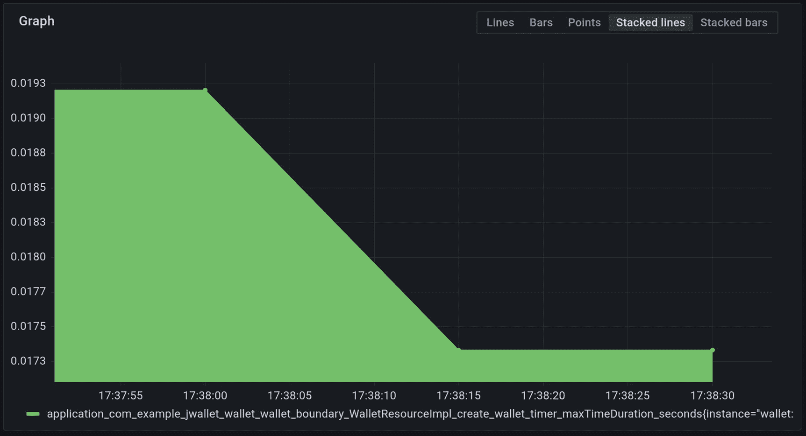
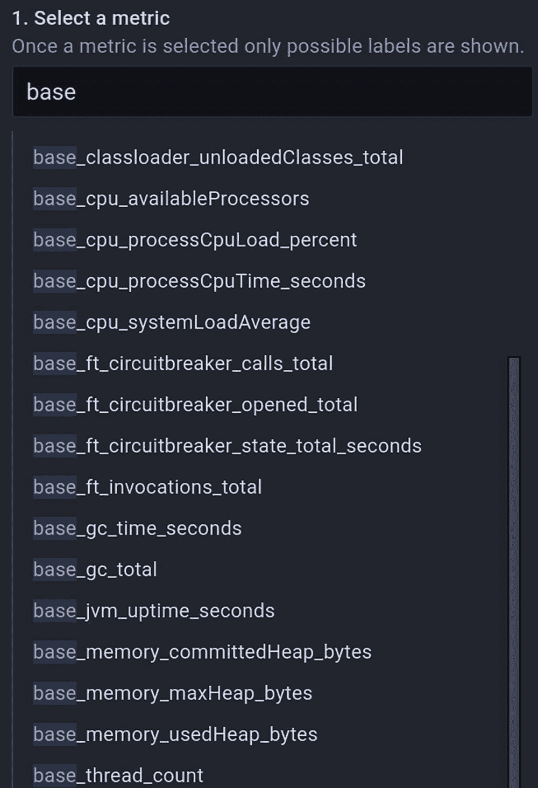
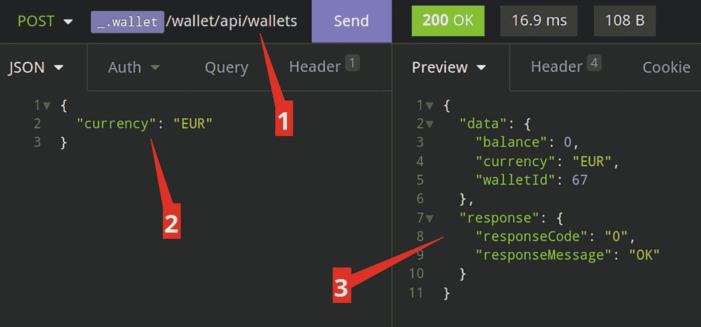
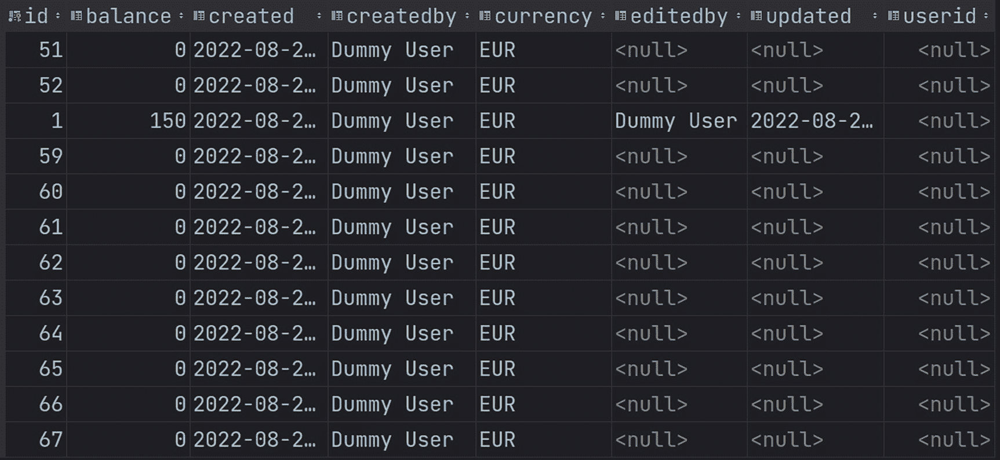
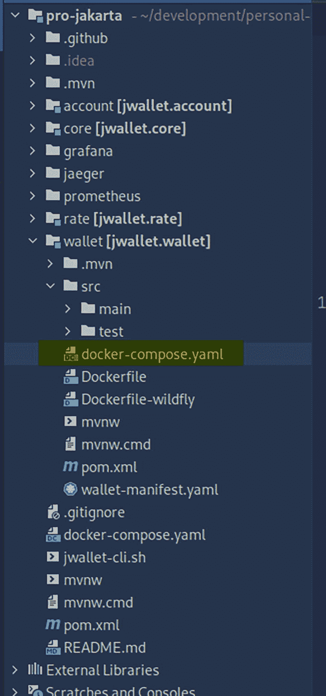

# 3. 企业级应用 – 架构

现代企业级应用多年来已经演变为云原生、有弹性、容错且可靠。此类应用的用户期望应用始终可用，无论网络延迟或应用运行时可能发生的其他故障如何。

为了满足这些期望，已经演变出许多应用开发模式，以帮助应用开发者构建符合当前部署标准和现代用户需求的应用程序。本章的目标是在本书参考应用的背景下，探讨其中一些模式，即依赖注入、REST Web 服务、数据持久化以及云原生功能和结构。


## 企业应用——它们是什么？

企业软件应用可以定义为一个组织为特定目标市场解决特定问题而开发的、具有相当复杂度的多层应用程序。不同类型的组织对向市场提供的任何特定企业应用抱有不同期望。营利性企业期望获得收入回报；非营利组织则期望某种意识形态的推进。无论组织类型和提供的软件类型如何，所有企业应用确实具有一些共同特征，这些特征使得它们的开发具有相当难度。

一个典型的应用通常包含三层：用户界面、中间层和数据存储。用户界面是最终用户实际与应用交互的地方。中间层是“编排”部分，负责处理用户界面与数据仓库之间的交互。数据仓库指的是用于将应用生成的数据存储到持久化存储机制中的数据库管理系统。无论应用是单体架构还是微服务架构，这些层通常贯穿整个应用。

用户界面可以是传统的 HTML 页面（针对为人类交互开发的应用），也可以是 RESTful 端点（针对供其他应用消费的应用）。“用户界面”这一术语已演变为包含特定应用的最终客户端与该应用交互的节点。中间层或服务层通常包含处理安全、数据仓库事务以及与内部和/或外部其他服务交互等功能的构件。

从工程角度来看，所有具有相当复杂度的应用都需要其开发平台提供某些核心功能。平台提供以下列举功能的程度取决于平台的维护者、社区和目标市场。然而，通常可以预期，任何面向企业应用开发的平台都应具备这些功能。

### 依赖管理

无论应用是单体架构还是微服务集合，应用的每个组件都有需要管理的依赖项。对于一个具有相当复杂度的应用，某个组件会依赖其他组件，而这些组件又会进一步依赖其他组件。所选软件开发平台应提供自动化此类复杂依赖管理的机制。对于 Jakarta EE 平台，Jakarta 上下文和依赖注入 API 是管理应用依赖的主要方式。CDI 不仅帮助您自动化依赖管理，还提供了其他附加功能，帮助您创建松散耦合、可扩展且易于维护的应用。

### RESTful Web 服务

现代企业应用通常以一组 RESTful Web 服务的形式暴露，供客户端消费。主要客户端可以是纯 JavaScript 应用，它是整个应用微服务的一部分。其他客户端可以是第三方应用。无论采用何种应用开发范式，开发平台都应具备用于开发现代 RESTful 服务的可靠 API。对于 Jakarta EE，Jakarta RESTful Web 服务 API 是该平台上开发 REST Web 服务的标准 API。

### 数据持久化

每个应用都会以某种方式生成和存储数据。生成的数据可能来自应用本身，也可能从某些外部服务检索而来，还可能是用户创建的数据。无论数据如何生成，几乎所有企业应用都需要将此类数据存储到持久化数据存储中。数据库管理系统可以是传统的关系型数据库管理系统（RDBMS）或 NoSQL 数据存储。开发平台必须提供用于创建、读取、更新和删除此类数据的 API 结构。这些 API 结构还应内置某种形式的事务管理。对于 Jakarta EE 平台，Jakarta 持久化 API 提供了所需的 API 结构，用于将 Java 对象转换并映射到 RDBMS 数据库表记录，以及持久化、检索、更新和删除这些记录。

### 辅助云功能

以上是贯穿大多数企业应用的三个核心传统功能。除了这些核心平台功能外，现代云原生应用还需要一些辅助功能，以便能够在云环境中部署和自动管理。以下各节概述了最流行的云原生辅助功能。

### 健康检查

对于部署到 Kubernetes 等编排工具并由其管理的云原生应用，应用需要能够回答两个简单问题：你是否存活？如果是，你是否准备好接受请求？对这些问题的回答将决定编排工具是否将请求路由到该应用实例。Eclipse MicroProfile 项目提供了健康检查 API，用于创建就绪性和存活性的端点，这些端点可被查询以获取上述问题的响应。

### 容错

每个应用都会在某个时刻发生故障。云原生应用应能够优雅地从任何此类故障中恢复。Eclipse MicroProfile 容错 API 提供了开发此类容错云原生应用所需的所有结构。

### 配置

云原生应用应将其配置外部化，以便配置值可以更改并针对不同环境进行设置，而无需更改应用代码。Eclipse MicroProfile 配置 API 提供了管理应用配置的 API。

### 指标

应用指标提供了对应用状态的洞察。云原生应用应能够生成有意义的指标，这些指标可以被收集和分析，以便在必要时采取纠正措施。Eclipse MicroProfile 的指标 API 提供了一组 API，用于在可预测的端点生成应用指标。

## JWallet 简介

本书的案例研究应用名为 JWallet，这是一个基于 Jakarta EE 平台构建的云原生微服务金融应用，用于存储和执行货币交易，展示了各种 API 及其协同使用方法。在本章中，我们将结合本章前面讨论的核心功能和辅助功能，对应用进行整体概览。后续章节将详细介绍每个 API。

### JWallet – 设置

Apache Maven^(⁶³)依赖解析和构建管理系统是开发 Jakarta EE 应用最流行的依赖和构建管理工具。JWallet 被设置为一个多模块 Maven 应用，包含三个微服务（账户、钱包和汇率）和一个通用模块（核心），如图 3-1 所示。



截图展示了 JWallet 设置项目，其中包含属于微服务的账户、钱包和汇率，核心是一个通用模块。

图 3-1

JWallet 项目结构


#### 关于 IDE 的说明

本书中用于截图和编写参考代码的 IDE 是 IntelliJ IDE。不过，你无需使用相同的 IDE。任何支持 Apache Maven 的 Java IDE 都应该足够。

`grafana`、`jaeger` 和 `prometheus` 文件夹包含了 Grafana、Prometheus 和 Jaeger 项目的配置文件。Grafana ^(⁶⁴) 和 Prometheus ^(⁶⁵) 是开源项目，用于抓取、整理和展示应用程序通过 Eclipse MicroProfile 指标暴露的度量数据；而 Jaeger^(⁶⁶) 是一个实现了开放追踪^(⁶⁷)规范的项目。

`account` 模块包含负责处理用户账户的账户微服务。`core` 模块包含所有其他服务通用的类和接口。`rate` 模块包含汇率微服务。该服务负责对外部货币汇率服务进行调用，以便在应用程序中的不同货币之间进行转换。最后，`wallet` 模块是交易发生的核心位置。它负责创建钱包以及借记和贷记交易，同时也负责实现钱包、交易和余额的查询功能。

该应用程序由根文件夹中的一个单一的项目对象模型 XML 文件（`pom.xml`^(⁶⁸)）进行管理。这个 POM 文件声明了基础依赖项和模块。该应用程序的主要依赖项是 Jakarta EE 和 Eclipse MicroProfile 依赖项。

清单 3-1 展示了 Jakarta EE 完整平台依赖项的声明。第 5 行将依赖项的作用域设置为 `provided`。这意味着我们的应用程序不会在生成的制品中包含任何 Jakarta EE 的 jar 文件。完整的平台实现应由运行应用程序的底层兼容实现来提供。我们的应用程序仅声明其对平台的依赖，而将各种 Jakarta EE API 的实际实现交由服务器提供。Maven 会将其添加到用于编译和测试的类路径中，但不会添加到运行时类路径。

```
jakarta.platform
jakarta.jakartaee-api
9.1.0
provided

清单 3-1
Jakarta EE 依赖项
```

清单 3-2 展示了 Eclipse MicroProfile 依赖项的声明。与 Jakarta EE 依赖项类似，EMP 依赖项的作用域也设置为 `provided`，这同样意味着应用程序期望底层兼容的运行时实现来提供 EMP 实现。

这种应用程序与平台依赖项的分离，是 Jakarta EE 平台非常适合开发现代应用程序的关键原因之一。这种分离使得部署制品最小化。在持续开发、测试和部署^(⁶⁹)成为标准的云原生环境中，部署制品越小，周转速度就越快，成本也越低。

```
org.eclipse.microprofile
microprofile
5.0
pom
provided

清单 3-2
MicroProfile 5 依赖项
```

清单 3-3 展示了构成应用程序的各个 Maven 模块的声明。从 Maven 的角度来看，你可以根据应用程序的需要拥有任意数量的模块。每个模块都可以是一个功能完整的应用程序，就像我们项目中的 `rate`、`wallet` 和 `account` 模块一样。你也可以在模块之间创建依赖关系。同样，在 JWallet 中，其他三个模块都依赖于 `core` 模块。

```
core
wallet
rate
account

清单 3-3
JWallet 模块
```

清单 3-4 展示了用于应用程序测试的依赖项声明。每个应用程序都应该有自动化测试。因为我们只对用于测试的这些依赖项感兴趣，所以它们的作用域被限定在测试阶段。这意味着它们仅在测试编译和执行阶段可用。

```

org.junit.jupiter
junit-jupiter
5.8.1
test

org.testcontainers
testcontainers
1.16.3
test

org.testcontainers
junit-jupiter
1.16.3
test

org.glassfish.jersey.core
jersey-client
3.0.4
test

org.glassfish.jersey.inject
jersey-hk2
3.0.4
test

org.glassfish.jersey.media
jersey-media-json-binding
3.0.4
test

org.glassfish.jersey.media
jersey-media-json-processing
3.0.4
test

清单 3-4
测试依赖项
```

该应用程序在 POM 文件的 `build` 元素中声明了三个插件，如清单 3-5 所示。第一个是 OpenLiberty^(⁷⁰) Maven 插件。OpenLiberty 是 IBM 提供的一个开源 Jakarta EE 兼容实现。它是你可以选择用来运行 Jakarta EE 应用程序的众多可用实现之一。这个插件允许我们通过 Maven 运行应用程序，而无需手动设置服务器。另外两个插件分别是用于打包的 Maven war^(⁷¹) 插件和用于运行集成测试的 Maven failsafe 插件^(⁷²)。由于这些依赖项是在基础 POM 文件中声明的，因此它们对 `modules` 元素中声明的所有模块都可用。

```

io.openliberty.tools
liberty-maven-plugin
3.5

22.0.0.3

${project.build.directory}/liberty/wlp/usr/shared/resources

org.apache.derby
derby

org.apache.maven.plugins
maven-war-plugin
3.3.2

org.apache.maven.plugins
maven-failsafe-plugin
3.0.0-M6

integration-test
verify

清单 3-5
根 pom.xml 的 JWallet 构建部分
```

`core` 模块的 POM 文件如清单 3-6 所示，内容非常精简，没有额外的依赖项，一个显著的例外是它被打包成 jar 文件。这是因为 `core` 模块将被其他三个模块依赖以提供通用功能，但它本身不是一个可部署的微服务，因此被打包成 jar 文件以包含在其他模块/微服务中。这个核心模块将充当编排模块，其他模块通过它进行相互通信。

```

4.0.0

com.example
jwallet
1.0-SNAPSHOT

jwallet.core
jar
core

清单 3-6
核心模块 pom.xml
```

`account` 和 `rate` 微服务的 `pom.xml` 文件与 `wallet` 微服务的类似，如清单 3-7 所示。它们非常精简，唯一的依赖项是 `core` 模块。任何特定于某个模块的依赖项都可以在该模块的 POM 文件中声明。另外请注意，它们的打包格式是 `war`。这意味着它们可以作为独立应用程序部署到应用服务器上。在我们的案例中，将使用 OpenLiberty 服务器来运行所有内容。

```

4.0.0

com.example
jwallet
1.0-SNAPSHOT

jwallet.wallet
war

${project.groupId}
jwallet.core
${project.version}

wallet

清单 3-7
钱包模块 pom.xml
```

该应用程序被打包为一组容器镜像，可以通过 Docker、Docker Compose 和 Kubernetes 进行部署和管理。创建容器镜像的入口点是每个模块文件夹中的 `Dockerfile` 文件。钱包微服务的 `Dockerfile` 如清单 3-8 所示。

```
FROM icr.io/appcafe/open-liberty:22.0.0.3-full-java11-openj9-ubi
COPY --chown=1001:0 src/main/liberty/config /config
COPY --chown=1001:0 src/main/liberty/derby-10.14.2.0.jar /opt/ol/wlp/usr/shared/resources
COPY --chown=1001:0 target/*.war /config/apps
EXPOSE 3001
RUN configure.sh
清单 3-8
钱包模块 Dockerfile
```


第 1 行定义我们的镜像基于一个 OpenLiberty 完整镜像，该镜像包含对 Jakarta EE 和 MicroProfile 的完整支持。第 3-5 行将 OpenLiberty 配置文件、Apache Derby 嵌入式数据库 JDBC 驱动程序和我们的应用程序工件（.war）文件复制到创建的镜像中，以便在服务器启动时自动部署。第 7 行暴露应用程序预期监听的 3001 端口。最后，第 9 行运行 OpenLiberty 的 configure.sh 文件，以预配置并激活所需功能。

在根文件夹中，我们有一个 docker-compose.yaml 文件，作为使用 docker compose 运行应用程序的入口点，该文件声明了六个服务：wallet、rate 和 account 服务（对应应用程序的三个微服务），以及 jaeger、prometheus 和 grafana 服务。这些服务之间存在相互依赖关系。

wallet 服务基于 wallet 模块的 wallet 文件夹中的 Dockerfile 构建，并暴露 3001 端口，如清单 3-9 所示；rate 服务基于 rate 文件夹中的 Dockerfile 构建，并暴露 3002 端口，如清单 3-10 所示；account 服务基于 account 文件夹中的 Dockerfile 构建，并暴露 3003 端口，如清单 3-11 所示。值得注意的是，这三个服务都进行了健康检查^(⁷³)。对每个服务都执行了一个简单的 curl 调用，指向默认的 Eclipse MicroProfile 健康检查端点。这用于告知 docker 容器已准备好开始接受请求。此外，还设置了一些环境变量来配置追踪代理，使其连接到我们的追踪服务器 Jaeger。

```
account:
  image: jwallet/account:latest
  ports:
    - "3003:3003"
  environment:
    JAEGER_AGENT_HOST: jaeger
    JAEGER_AGENT_PORT: 6831
    JAEGER_SAMPLER_TYPE: const
    JAEGER_SAMPLER_PARAM: 1
  healthcheck:
    test: curl --fail http://localhost:9080/health || exit 1
  build:
    context: account
    dockerfile: Dockerfile
清单 3-11
Account docker compose 服务
```

```
rate:
  image: jwallet/rate:latest
  ports:
    - "3002:3002"
  environment:
    JAEGER_AGENT_HOST: jaeger
    JAEGER_AGENT_PORT: 6831
    JAEGER_SAMPLER_TYPE: const
    JAEGER_SAMPLER_PARAM: 1
  healthcheck:
    test: curl --fail http://localhost:9080/health || exit 1
  build:
    context: rate
    dockerfile: Dockerfile
清单 3-10
Rate docker compose 服务
```

```
wallet:
  image: jwallet/wallet:latest
  ports:
    - "3001:3001"
  environment:
    JAEGER_AGENT_HOST: jaeger
    JAEGER_AGENT_PORT: 6831
    JAEGER_SAMPLER_TYPE: const
    JAEGER_SAMPLER_PARAM: 1
  healthcheck:
    test: curl --fail http://localhost:9080/health || exit 1
  build:
    context: wallet
    dockerfile: Dockerfile
清单 3-9
Wallet docker compose 服务
```

jaeger 服务基于从 Docker Hub 拉取的 jaeger docker 镜像。该服务声明了对 wallet、rate 和 account 服务的依赖，因此 docker compose 会在这些服务之后启动 jaeger 服务。由于 jaeger 是一个请求追踪应用程序，它需要有东西可以追踪。而 wallet 容器作为根容器，是 jaeger 所依赖的容器之一，如清单 3-12 所示。

```
jaeger:
  image: docker.io/jaegertracing/all-in-one:1.31
  ports:
    - "5775:5775/udp"
    - "6831:6831/udp"
    - "6832:6832/udp"
    - "5778:5778"
    - "16686:16686"
    - "14268:14268"
  depends_on:
    - wallet
    - rate
    - account
清单 3-12
Jaeger docker compose 服务
```

prometheus 服务基于从 Docker Hub 拉取的 prometheus docker 镜像。该服务也声明了对 wallet、rate 和 account 服务的依赖；在服务声明的卷部分，一份捆绑的 prometheus.yml 文件副本被捆绑到创建的容器中。该文件配置了 prometheus 将从 wallet、rate 和 account 服务抓取指标的端点，以及其他相关配置，如抓取间隔，如清单 3-13 所示。

```
prometheus:
  image: docker.io/prom/prometheus:v2.34.0
  volumes:
    - ./prometheus/prometheus.yaml:/etc/prometheus/prometheus.yml
  ports:
    - "9090:9090"
  depends_on:
    - wallet
    - rate
    - account
清单 3-13
Prometheus docker compose 服务
```

最后一个服务 grafana，基于从 Docker Hub 拉取的镜像，声明了对 prometheus 的依赖。grafana 和 prometheus 都是用于显示应用程序指标的应用程序。然而，grafana 是一个比 prometheus 更用户友好、更可配置的监控应用程序。因此，可观测性领域的普遍做法是配置 grafana 来消费 prometheus 从应用程序抓取的指标。这样，你可以两全其美——prometheus 擅长抓取指标，而 grafana 擅长显示它们。在服务声明的卷部分，利用 grafana 的预配置功能，捆绑了一些预配置仪表板的副本，如清单 3-14 所示。

```
grafana:
  image: docker.io/grafana/grafana-oss:8.4.4
  ports:
    - "3000:3000"
  environment:
    GF_AUTH_ANONYMOUS_ENABLED: 'true'
  volumes:
    - ./grafana/provisioning/datasources:/etc/grafana/provisioning/datasources
    - ./grafana/provisioning/dashboards:/etc/grafana/provisioning/dashboards
  depends_on:
    - prometheus
清单 3-14
Grafana docker compose 服务
```


### 你好，世界！

后续相关章节将详细介绍在 Docker 文件中声明的每个辅助服务。目前，我们已经了解了应用程序的搭建过程，在查看代码之前，让我们先运行传统的 hello world。由于应用程序被打包并作为 Docker 容器运行，根文件夹中的 `jwallet-cli.sh` 脚本是一个 shell 脚本，支持通过 Docker Compose 或 Kubernetes 启动和运行应用程序。各种支持的命令可通过 help 命令查看，如清单 3-15 所示。

```
~> ./jwallet-cli.sh help
Usage:
jwallet-cli.sh 
Commands:
build       : build docker images
up-compose : run jwallet on docker-compose
down-compose: stop jwallet running on docker-compose
up-kube    : run jwallet on kubernetes (using k3d)
down-kube   : stop jwallet running on kubernetes (using k3d)
Listing 3-15
jwallet-cli.sh help command output
```

对于我们的 hello world，我们首先使用 build 命令构建镜像和所有内容，然后使用 up-compose 命令。初始构建各种镜像和应用程序工件可能需要一些时间，具体取决于您的网络和计算机速度。之后运行 up-compose 命令应该能让应用程序启动并运行。为方便参考，`README.md` 文件汇总了访问应用程序各个服务的端点，如清单 3-16 所示。

```
Running JWallet
1\. Docker compose
Requires
- docker-compose
Start / Stop
- start ./jwallet-cli.sh up-compose
- stop ./jwallet-cli.sh down-compose
Access service
- Wallet module http://localhost:3001/wallet
- Rate module http://localhost:3002/rate
- Account module http://localhost:3003/account
- Jaeger tracing http://localhost:16686
- Prometheus http://localhost:9090
- Grafana http://localhost:3000
Listing 3-16
README.md entry for running and accessing the JWallet service
```

访问钱包服务上的 Hello 端点，我们会收到一条消息，表明服务已启动并正在运行，如清单 3-17 所示。对于 rate 和 account 服务也是如此，分别如清单 3-18 和 3-19 所示。

```
~> curl http://localhost:3003/account/api/hello
Hello account module
Listing 3-19
Accessing the account service Hello endpoint
```

```
~> curl http://localhost:3002/rate/api/hello
Hello rate module
Listing 3-18
Accessing the rate service Hello endpoint
```

```
~> curl http://localhost:3001/wallet/api/hello
Hello wallet module
Listing 3-17
Accessing the wallet service Hello endpoint
```

我们还可以通过查询微服务的健康检查端点来检查它们是否已启动并准备就绪。对于钱包微服务，调用 `http://localhost:3001/health` 应能返回状态，如清单 3-20 所示。

```
~> curl http://localhost:3001/health
{
"checks": [
{
"data": {},
"name": "wallet-liveness",
"status": "UP"
},
{
"data": {},
"name": "wallet-readiness",
"status": "UP"
}
],
"status": "UP"
}
Listing 3-20
Accessing the wallet service health endpoint
```

对于 rate 服务，调用 `http://localhost:3002/health` 应能返回其健康状态，如清单 3-21 所示。

```
~> curl http://localhost:3002/health
{
"checks": [
{
"data": {},
"name": "rate-liveness",
"status": "UP"
},
{
"data": {},
"name": "rate-readiness",
"status": "UP"
}
],
"status": "UP"
}
Listing 3-21
Accessing the rate service health endpoint
```

对于 account 服务，调用 `http://localhost:3003/health` 同样应能返回 account 微服务的健康检查状态，如清单 3-22 所示。

```
~> curl http://localhost:3003/health
{
"checks": [
{
"data": {},
"name": "account-liveness",
"status": "UP"
},
{
"data": {},
"name": "account-readiness",
"status": "UP"
}
],
"status": "UP"
}
Listing 3-22
Accessing the account service health endpoint
```

### 应用程序架构概述

微服务作为一种应用程序开发范式已广为人知并被理解。然而，对于如何实现它，并没有单一的定义。与单体应用（所有应用程序代码作为一个单元开发）形成鲜明对比的是，微服务并不适合这种直接的实现方式。一个微服务应用程序可以由物理上分离的服务组成，即应用程序的每个微服务在其自己的代码库中是一个独立的 Maven 项目，并且所有服务都通过某种编排工具（如 BPM）进行编排。^(⁷⁴)

另一种方式可以是在一个公共代码库中开发一组独立的服务，每个服务作为项目中的一个模块。在特定应用程序中实现微服务的方式还有其他变体。无论选择哪种实现风格，微服务应用程序通常都应满足前一章讨论的微服务描述。


#### JWallet

JWallet 是本书的参考应用程序，最初以一组微服务的形式开发，这些微服务位于一个公共项目中，每个服务都是该项目中的一个 Maven 模块。在后续章节中，我们将把该应用重构为物理上独立的服务，以实现另一种形式的微服务开发。表 3-1 展示了访问应用中各个服务的端点。

表 3-1

JWallet 中的端点

| 模块 | URL |
| --- | --- |
| Wallet | http://localhost:3001/wallet |
| Rate | http://localhost:3002/rate |
| Account | http://localhost:3003/account |
| Jaeger | http://localhost:16686 |
| Prometheus | http://localhost:9090 |
| Grafana | http://localhost:3000 |

如前所述，该应用是一个 Maven 多模块应用。其主要用户界面是用于在指定钱包中创建和执行交易的各种端点。这些 REST 端点使用 Jakarta RESTful API (JAX-RS) 开发。应用的根入口点是 `CONTEXT_PATH/api` 端点。每个 JAX-RS 应用都必须有一个根入口点，作为该应用所有 REST 端点的基路径。这个根 REST 端点在核心模块中声明，如代码清单 3-23 所示。

```
@ApplicationPath("api")
public class JaxrsConfigurations extends Application {
}
代码清单 3-23
JAX-RS 根入口点
```

第 1 行的注解 `@ApplicationPath("api")` 告诉 JAX-RS 运行时，我们希望将该应用中的所有 REST 端点托管在基路径 "api" 下。然后，`JaxrsConfigurations` 类继承了 JAX-RS API 中的 `Application` 类。有了这个配置，所有 REST 端点都可以作为 api 路径的子路径进行访问。例如，钱包服务的 hello 路径是 `http://localhost:3003/wallet/api/hello`。

钱包模块中的 hello 资源在 `HelloResource` 类中声明，如代码清单 3-24 所示。

```
@Path("hello")
public class HelloResource {
@GET
@SimplyTimed
@Traced
String hello {
return "Hello account module";
}
}
代码清单 3-24
Hello 端点
```

JAX-RS 资源以 Java 类的形式托管，资源端点则作为该类的方法托管。在前面的 `HelloResource` 示例中，第 1 行声明了该类及其包含的所有资源都托管在 `/hello` 路径下。`@Path` 注解来自 JAX-RS API。这意味着我们希望在该类中暴露的任何 REST 端点都将作为 `/hello` 路径的子路径进行访问。第 4 行使用 `@GET` 注解将第 6 行声明的 `hello` 方法定义为 HTTP GET 方法。由于该方法没有定义其他路径，当访问 `/wallet/api/hello` 路径时，它将成为 JAX-RS 运行时调用的默认 GET 方法。

方法的返回类型是返回给客户端的值。在此示例中，当对 `/hello` 发起 GET 调用时，会返回简单的字符串消息 "Hello wallet module"。JAX-RS 支持返回多种不同类型。由于 `HelloResource` 类没有明确指定它消费和产生的内容类型，运行时默认使用简单类型。稍后我们将看到如何声明给定 JAX-RS 资源消费和产生的 MIME^(⁷⁵) 类型。

第 5 行还使用来自 Eclipse MicroProfile 指标 API 的 `@SimplyTimed` 注解对 `hello` 方法进行了注解。此注解会跟踪方法调用的耗时和次数。只需用 `@SimplyTimed` 注解 `hello` 方法，MicroProfile 运行时就会暴露一个用于跟踪该方法调用次数和每次调用时长的指标。暴露的指标可以被任意数量的应用程序消费。在 JWallet 的案例中，我们可以通过集成的 Prometheus（可通过 http://localhost:9090 访问）和 Grafana（可通过 http://localhost:3000 访问）可观测性应用查看这些指标，如图 3-2 所示。



一张截图展示了 JWallet Grafana 指标探索的条形图，条形图从 17 小时 9 分 45 秒开始，到 17 小时 11 分 15 秒结束。

图 3-2

Grafana 指标探索器

第 6 行还使用来自 Eclipse MicroProfile 指标 API 的 `@Traced` 注解对 `hello` 方法进行了注解。此注解会跟踪对服务的传入请求以及随后对其他服务的请求。

在我的示例部署中，钱包模块的 Hello 资源（可通过 http://localhost:3001/wallet 访问）已被调用了八次，每次调用都列在列表中，如图 3-3（可通过 http://localhost:16686 访问）所示。点击其中一个调用会跳转到跟踪详情页面，如图 3-4 所示。



一张截图展示了 Jaeger 跟踪的跟踪详情，包括 jwallet 示例、标签和进程。

图 3-4

Jaeger 跟踪 – 跟踪详情



一张截图展示了 Jaeger 跟踪的跟踪列表，包含八个跟踪，通过选择结果项比较跟踪，并包含钱包示例。

图 3-3

Jaeger 跟踪 – 跟踪列表

其中一个被跟踪调用的详细列表显示了调用的日期和时间 (1)、被调用资源所在的服务及持续时间 (2)，以及被跟踪调用的一些详细信息，包括完整的资源端点 (3)。所有这些细节都由 MicroProfile 指标运行时处理。我们所要做的就是用 `@SimplyTimed` 声明我们的 hello 资源方法。第 6 章将详细介绍 Jakarta RESTful Web Services API。现在，让我们先粗略地看一下 `WalletResource`。

Wallet 资源是应用的根入口点。它托管了用于创建、借记、贷记和查询钱包的各种方法。其声明如代码清单 3-25 所示。

```
@Consumes(MediaType.APPLICATION_JSON)
@Produces(MediaType.APPLICATION_JSON)
@Path("wallets")
public class WalletResource {
@Inject
WalletService walletService;
...
}
代码清单 3-25
钱包模块端点
```

Wallet 资源定义在 `WalletResource.java` 类中。第 1 行和第 2 行使用 `@Consumes` 和 `@Produces` 注解分别声明该资源类的方法可以消费和产生的 MIME 类型。由于 JSON^(⁷⁶) 数据格式是 RESTful Web 服务最流行的格式，JWallet 中的所有资源端点都消费和产生 JSON 格式的数据。对于 `WalletResource`，传递给这两个注解的常量 `MediaType.APPLICATION_JSON` 告诉 JAX-RS 运行时，该类中声明的所有资源方法都消费和产生 JSON。这意味着客户端可以调用该类中的资源方法，并以 JSON 格式传入任何必要的数据。运行时将处理传入的 JSON 数据与相应 Java 类型之间的转换。返回类型也是如此。


第 3 行声明该类托管在钱包资源路径下。与 hello 资源类似，该类中的所有资源端点都可以作为`/wallets`路径的子路径进行访问。第 6 行使用来自 Jakarta 上下文和依赖注入 API 的`@Inject`注解，声明了对`WalletService.java`类的依赖。这是在 Jakarta EE 中声明组件依赖关系的一种声明式方式。第 4 章将详细讨论 CDI API。现在，我们先来看一下用于创建钱包的第一个资源方法，如代码清单 3-26 所示。

```
@POST
@Traced(operationName = "create-wallet")
@SimplyTimed(name = "create_wallet_timer")
public BalanceResponse createWallet(CreateWalletRequest createWalletRequest) {
return walletService.createWallet(createWalletRequest);
}
代码清单 3-26
WalletResource 创建钱包方法
```

第一行使用`@POST`注解声明第 4 行定义的`createWallet`方法是一个 POST 资源。由于该方法上没有使用`@Path`注解显式指定路径，因此对资源路径`/api/wallets`的 POST 请求将被路由到此方法。该方法接受`CreateWalletRequest`作为参数，并返回`BalanceResponse`类型。由于资源类声明了它既消费也生产 JSON 类型，因此 JAX-RS 运行时会替我们处理 JSON 的转换。从 Java 开发者的角度来看，你只是在编写 Java 方法。

第 2 行将方法声明为`@Traced`，并传入一个跟踪操作名称。此注解来自 Eclipse MicroProfile OpenTracing API。使用此注解会暴露关于此方法调用的度量指标，这些指标可以被可观测性应用程序消费。在 JWallet 中，集成的 Jaeger 应用程序会消费并显示`create-wallet`跟踪信息，如图 3-5 所示。



一张截图展示了创建钱包的跟踪列表，该列表包含六个跟踪项，可以通过选择结果项来比较跟踪信息，以及创建钱包。

图 3-5

创建钱包跟踪列表

如图 3-5 所示，我们的`create-wallet`跟踪显示，在我的示例部署中，该方法总共被调用了六次。列表中的每个跟踪项，类似于我们在`HelloResource`中看到的那样，都会显示日期、时间、持续时间以及其他相关的跟踪信息。此跟踪与我们之前看到的`HelloResource`跟踪的一个显著区别是，这个度量指标被显式命名了，而`HelloResource`跟踪则使用了完全限定类名作为度量指标的名称，因为我们没有传入显式名称。

第 11 行还将该方法声明为`@SimplyTimed`，但这次为计时器传入了一个显式名称。此注解暴露的度量指标可以在集成的 Grafana 应用程序中观察到，如图 3-6 所示。



一张截图展示了 Grafana 探索界面中钱包度量指标的堆叠折线图，最高点为 0.0193。

图 3-6

Grafana 探索器中的创建钱包度量指标

图 3-6 显示了由我们的`@SimplyTimed`方法暴露的度量指标列表中的一个指标。此指标显示了每次调用的最大持续时间。Grafana 应用程序正在显示从集成的 Prometheus 应用程序接收到的这些信息。Eclipse MicroProfile Metrics API 暴露了基础、供应商、应用程序和其他自定义度量指标，这些指标可以被消费并显示以供观察。例如，Grafana 度量指标浏览器显示了 Eclipse MicroProfile 为我们的应用程序生成的部分度量指标列表，如图 3-7 所示。



一张截图展示了 Grafana 度量指标浏览器，其中包含选择度量指标、基础以及各种以`base`开头的文件。

图 3-7

Grafana 度量指标浏览器

第 9 章将详细介绍如何使用 Eclipse MicroProfile Metrics API 暴露和显示各种度量指标。

有了我们的资源方法，我们现在可以使用任何 REST 客户端向其发起一个示例 REST 调用。该客户端可以是 JWallet 中的另一个服务、一个 JavaScript 客户端、另一个用 Python 编写的应用程序，或者任何其他能够发起 REST 调用的工具。对于我们的示例调用，我们使用 Insomnia REST 客户端。让我们通过调用`WalletResource`中的`createWallet`资源方法来创建一个钱包，如图 3-8 所示。



一张截图展示了 Insomnia 中的钱包 API 调用，其中包括带有地址的钱包、带有一些代码的预览以及带有一些代码的 JSON，分别用一、二、三表示。

图 3-8

在 Insomnia 中创建钱包 API 调用

我们向资源`http://localhost:3001/wallet/api/wallets`（1）发起一个 POST 请求，请求体是`CreateWalletRequest` Java 类型的 JSON 表示（2）。成功的调用会返回`BalanceResponse` Java 类型的 JSON 表示（3）。`CreateWalletRequest.java`和`BalanceResponse.java`类分别如代码清单 3-27 和 3-28 所示。

```
public class BalanceResponse extends Response {
public static BalanceResponse of(BalanceResponseData data) {
BalanceResponse response = new BalanceResponse();
response.setData(data);
return response;
}
public static class BalanceResponseData {
private long walletId;
private BigDecimal balance;
private String currency;
public long getWalletId() {
return walletId;
}
public void setWalletId(long walletId) {
this.walletId = walletId;
}
public BigDecimal getBalance() {
return balance;
}
public void setBalance(BigDecimal balance) {
this.balance = balance;
}
public String getCurrency() {
return currency;
}
public void setCurrency(String currency) {
this.currency = currency;
}
}
}
代码清单 3-28
BalanceResponse 类
```

```
public class CreateWalletRequest {
private String currency;
public String getCurrency() {
return currency;
}
public void setCurrency(String currency) {
this.currency = currency;
}
}
代码清单 3-27
CreateWalletRequest 类
```

当我们通过 JAX-RS 运行时发起 REST 调用时，这两种类型分别被透明地转换成了 JSON 和从 JSON 转换回来。第 6 章将详细介绍 JAX-RS。现在，我们先来看一下`WalletService`上的`createWallet`方法，REST 的`createWallet`资源方法将创建钱包的任务委托给了它，如代码清单 3-29 所示。

```
@Stateless
public class WalletService {
@Inject
WalletRepository walletRepository;
@Inject
TransactionRepository transactionRepository;
@Inject
RateService rateService;
public BalanceResponse getBalance(final long walletId) {
Wallet wallet = walletRepository.findById(walletId);
BalanceResponseData data = new BalanceResponseData();
data.setWalletId(wallet.getId());
data.setBalance(wallet.getBalance());
data.setCurrency(wallet.getCurrency());
return BalanceResponse.of(data);
}
public BalanceResponse createWallet(final CreateWalletRequest createWalletRequest) {
Wallet wallet = new Wallet();
wallet.setBalance(BigDecimal.ZERO);
wallet.setCurrency(createWalletRequest.getCurrency());
wallet = walletRepository.save(wallet);
return getBalance(wallet.getId());
}
}
代码清单 3-29
WalletService 创建钱包方法
```


第 1 行使用企业 JavaBean（EJB）API 中的`@Stateless`注解将`WalletService`类声明为无状态 Bean。这一单一注解将该类转换为一个由 EJB 运行时完全管理的池化、事务性且安全的 Bean。由于具有事务性，对`WalletService`调用的每个方法都将在事务上下文中执行，这意味着 EJB 运行时将为每次调用创建并提交事务。第 5 章将详细介绍如何结合 JPA 使用 EJB API。

`WalletService`还声明了对`WalletRepository`、`TransactionRepository`和`RateService`的依赖。所有这些依赖都使用`@Inject`注解声明，将这些依赖的创建、注入和销毁委托给上下文和依赖注入运行时（更多内容请参见第 4 章）。

`WalletService`声明了一个`createWallet`方法，该方法接受`CreateWalletRequest`类型作为参数。该方法随后对`Wallet.java`类型进行一些基本初始化，并将剩余工作委托给`WalletRepository`。`Wallet.java`是用于表示钱包或银行账户的实体^(⁷⁷)。在 Jakarta Persistence API 中，数据库表被建模为 Java 类，这些 Java 类的实例则映射到数据库表记录。

如清单 3-30 所示，`Wallet`实体是一个简单的 Java 类，通过 JPA API 中的`@Entity`注解声明性地标记为实体。

```
@Entity
public class Wallet extends AbstractEntity {
private Long userId;
private String currency;
private BigDecimal balance;
@OneToMany(mappedBy = "wallet")
private Set transactions;
// Getters & Setters
}
清单 3-30
Wallet 实体类
```

第 1 行使用`@Entity`注解将该类声明为 JPA 实体。这意味着将创建一个名为`Wallet`的数据库表，并且 Java 类的每个字段都将映射到所创建表中的列。`Wallet`实体有四个字段：其中三个是简单类型，一个是集合类型。简单类型（`Long`、`String`和`BigDecimal`）将直接映射到`Wallet`数据库表中的列。在`transactions`字段中声明的`java.util.Set`集合类型将根据`Wallet`类型与`Transaction`类型之间的声明性关系进行特殊映射。在这种情况下，一个钱包实例可以拥有多个交易记录。

如清单 3-30 所示，`Wallet`类继承了`AbstractEntity`。在使用 JPA 建模实体时，您会发现大多数实体中都有非常通用的字段。将这些通用字段抽象到一个超类中，并由需要这些通用字段的所有子类继承，是一种良好的实践。Jakarta Persistence API 为您提供了多种建模这种父子继承关系的方式。在此示例中，如清单 3-31 所示，`AbstractEntity`本身不会有任何数据库表。`AbstractEntity`中的所有字段都将放入继承它的子类中。我们选择了“每个继承层次一张表”的策略。

```
@MappedSuperclass
@EntityListeners({ AbstractEntityEntityListener.class })
public abstract class AbstractEntity implements Serializable {
@Id
@GeneratedValue(strategy = GenerationType.AUTO)
protected long id;
protected LocalDateTime created;
protected LocalDateTime updated;
protected String createdBy;
protected String editedBy;
// Getters & Setters
}
清单 3-31
AbstractEntity 类
```

`AbstractEntity`被声明为一个可序列化的抽象类。它被声明为`@MappedSuperclass`，以告知 JPA 运行时我们希望将该类的映射信息应用于其子类。JPA 不会为此类创建单独的数据库表。其中声明的所有字段都将映射到继承它的子类中。

第 4 行使用`@Id`注解将`Long`类型的`id`字段声明为该类的唯一表标识符或主键^(⁷⁸)。第 5 行使用`@GeneratedValue`来告知运行时如何生成这个唯一字段。在我们的示例中，我们选择让 JPA 运行时处理主键的自动创建。由于`Wallet`实体继承了`AbstractEntity`，所有这些字段都会自动且透明地映射到`Wallet`表中，如图 3-9 所示。



一张截图展示了钱包数据库表，其中包含 id、balance、created、created by、currency、edited by、updated 和 user id 字段。

图 3-9
Wallet 数据库表

图 3-9 所示的`Wallet`数据库表是从`Wallet`实体映射而来的。`id`、`created`、`createdBy`、`editedBy`和`updated`字段对应于`AbstractEntity`类中的相应字段。这些字段之所以存在，是因为`Wallet`实体继承了`AbstractEntity`。在数据库中，没有为`AbstractEntity`单独创建表。

`WalletRepository`实现了用于管理`Wallet`实体实例的仓储模式^(⁷⁹)，如清单 3-32 所示。

```
@RequestScoped
public class WalletRepository extends BaseRepository {
public WalletRepository() {
super(Wallet.class);
}
@Override
public Wallet findById(final Long id) {
final Wallet wallet = super.findById(id);
if (wallet == null) {
throw new WalletNotFoundException();
}
return wallet;
}
}
清单 3-32
WalletRepository 类
```

它继承了`BaseRepository`，并传入了实体和主键类型。`BaseRepository`包含与所有数据库表通用的创建、读取、更新和删除操作相对应的方法。`WalletRepository`唯一重写的方法是`findById`。在`WalletService`中对`WalletRepository`调用的`save`方法只是从`BaseRepository`继承而来的，如清单 3-33 所示。

```
public abstract class BaseRepository {
@PersistenceContext
EntityManager em;
Class clazz;
public BaseRepository() {}
public BaseRepository(Class clazz) {
this.clazz = clazz;
}
public E findById(K id) {
return em.find(clazz, id);
}
List findAll(String querName) {
return em.createNamedQuery(querName, clazz).getResultList();
}
public E save(E entity) {
em.persist(entity);
return entity;
}
public E merge(E entity) {
return em.merge(entity);
}
public E refresh(E entity) {
em.refresh(entity);
return entity;
}
public void remove(E entity) {
E mergedEntity = merge(entity);
em.remove(mergedEntity);
}
}
清单 3-33
BaseRepository 类
```

如清单 3-33 所示，`BaseRepository`使用 Java 泛型^(⁸⁰)来创建灵活、泛化的 CRUD^(⁸¹)方法。`BaseRepository`本身也依赖于`EntityManager`^(⁸²)接口来与 JPA 运行时交互。`EntityManager`在第 4 行通过`@PersistenceContext`^(⁸³)注解注入到`BaseRepository`中。该注解告知 JPA 运行时，我们需要将一个`EntityManager`实例注入到带注解的字段中。它还告知运行时为我们管理注入的实例。通过这种注入，我们可以调用`EntityManager`接口上的各种方法来对我们的实体执行操作。第 5 章将深入详细介绍`EntityManager`。


### 测试

每个应用程序都应具备某种形式的测试，最好是单元测试、组件测试、集成测试和手动测试的组合。每个 Maven 项目都有一个默认的测试文件夹用于创建测试。JWallet 为每个微服务提供了独立的测试，用于测试应用程序的各种功能。由于对于如何编写测试没有普遍接受的定义，所有应用程序都以不同的方式实现测试。由于 JWallet 的主要用户界面是 REST 端点，因此集成测试包括向这些端点发送请求，并对响应进行 JUnit 断言。

在 Java 领域，有众多测试框架和库可供选择。所选库的组合主要取决于正在开发的应用程序。作为 Jakarta EE 应用程序，JWallet 需要一个实现才能运行。因此，为了运行测试，即使在测试环境中，我们也需要部署应用程序。一个能够简化 Jakarta 应用程序测试基础设施管理的库是 TestContainers^(⁸⁴) 项目。JWallet 集成了 TestContainers 库，使得使用 Maven 命令 `mvn verify -Dtc` 运行完整的端到端集成测试变得容易。

钱包微服务中测试的入口点是 `AbstractWalletIT`，如代码清单 3-34 所示。

```
public class AbstractWalletIT {
protected static final String walletServiceUrl;
protected static final WebTarget target;
static {
boolean testInContainer = System.getProperties().containsKey("tc");
String walletServiceUrlTemplate = "http://%s:%d/wallet/api";
if (testInContainer) {
final DockerComposeContainer composeContainer = new DockerComposeContainer(new File("docker-compose.yaml"))
.withExposedService("wallet", 3001);
composeContainer.start();
walletServiceUrl = String.format(walletServiceUrlTemplate,
composeContainer.getServiceHost("wallet", 3001),
composeContainer.getServicePort("wallet", 3001));
} else {
walletServiceUrl = String.format(walletServiceUrlTemplate, "localhost", 3001);
}
target = ClientBuilder.newClient().target(walletServiceUrl);
}
}
代码清单 3-34
AbstractWalletIT 类
```

这段代码在静态块中进行了一些初始化，检查你是否在运行 `mvn verify` 时传入了 `tc` 属性。如果传入了，则会创建一个新的 `DockerComposeContainer` 实例，并使用钱包模块根目录下的 `docker-compose.yaml` 文件启动它，如图 3-10 所示。



一张截图展示了项目结构，其中 Jwallet 测试使用的 docker compose yaml 文件被高亮显示，该文件位于钱包模块的 src 目录下。

图 3-10

项目结构中的 Docker-compose.yaml 文件

创建的 `DockerComposeContainer` 实例用于获取已部署的钱包微服务的主机和端口，然后实例化 `walletServiceUrl` 变量。如果没有传入 `tc` 属性，则使用 `localhost` 实例化 `walletServiceUrl`。然后，使用 JAX-RS `ClientBuilder` 创建一个新的 `WebTarget` 对象。有了这个设置，继承 `AbstractWalletIT` 的测试子类就可以使用这个 `target` 对象向钱包微服务中的各种资源发送 REST 调用。

例如，`HelloResourceIT` 向 `HelloResource` 端点发送一个调用，并对收到的响应进行简单断言，如代码清单 3-35 所示。

```
class HelloResourceIT extends AbstractWalletIT {
@Test
void hello() {
String response = target.path("hello").request().get(String.class);
assertEquals("Hello wallet module", response);
}
}
代码清单 3-35
HelloResourceIT 类
```

第 4 行对我们的 `HelloResource` 发起了一个 GET 调用，并从响应中读取了 `String` Java 类型，因为我们知道 `HelloResource` 方法返回一个字符串。然后，第 5 行使用 JUnit 断言 API 中的 `assertEquals` 方法来测试收到的响应是否与我们的预期相符。

`WalletResourceIT` 也继承了 `AbstractWalletIT`，如代码清单 3-36 所示。第 3 行声明了一个 `createWallet` JUnit 测试（第 2 行使用了 `@Test` 注解）。与之前讨论的 `hello` 测试类似，`createWallet` 测试构建了一个 `CreateWalletRequest` 对象，并发出一个 POST 请求，将创建的对象传递给 `Entity.json` 方法以将其转换为 JSON，然后发送给资源方法。`.post` 方法（第 9 行）的第二个参数是资源期望返回类型的类类型。由于我们的 `createWallet` 资源方法返回一个 `BalanceResponse`，我们传入了 `BalanceResponse.class`。然后，我们将返回值赋给一个 `BalanceResponse` 类型的变量，并继续对其进行一些断言。

```
class WalletResourceIT extends AbstractWalletIT {
@Test
void createWallet() {
CreateWalletRequest createWalletRequest = new CreateWalletRequest();
createWalletRequest.setCurrency("USD");
BalanceResponse balanceResponse = target.path("wallets").request()
.post(Entity.json(createWalletRequest), BalanceResponse.class);
assertEquals("0", balanceResponse.getResponse().getResponseCode());
assertEquals("OK", balanceResponse.getResponse().getResponseMessage());
assertEquals(createWalletRequest.getCurrency(), balanceResponse.getData().getCurrency());
assertEquals(BigDecimal.ZERO, balanceResponse.getData().getBalance());
assertNotNull(balanceResponse.getData().getWalletId());
}
// 更多测试
}
代码清单 3-36
WalletResourceIT 类
```

在第 6 章中，你将更详细地了解如何使用 JAX-RS 客户端 API 向 JWallet 内部和外部的其他资源方法发起 REST 调用。


## 摘要

本章介绍了本书的案例研究应用，一个名为 JWallet 的 Jakarta EE 和 Eclipse MicroProfile 应用。我们通过多个 Maven pom.xml 文件了解了其设置，并讨论了其架构。我们探讨了该应用的部署方式，并查看了各种容器声明文件。我们简要了解了 Jakarta Persistence、Contexts and Dependency Injection 以及 RESTful Web Services API 在该应用中的使用。随后，我们向该应用发送了 REST 请求，并使用 Grafana 和 Jaeger 查看了 Eclipse MicroProfile Metrics API 暴露的一些应用指标。最后，我们简要了解了测试设置。

下一章将详细介绍 Jakarta Contexts and Dependency Injection API。该 API 是一种以清晰、可扩展且可维护的方式将给定 Jakarta EE 应用的不同部分粘合在一起的标准方法。之后的第 5 章将详细介绍 Jakarta Persistence API，接着是第 6 章，该章将为您使用 JAX-RS 开发现代 RESTful Web 服务打下坚实基础。这三个 API 共同构成了每个现代 Jakarta EE 应用的核心。让我们开始吧！

脚注 1   2   3   4   5   6   7   8   9   10   11   12   13   14   15   16   17   18   19   20   21   22

